# MoSLD: An Extremely Parameter-Efficient Mixture-of-Shared LoRAs for Multi-Task Learning

Lulu Zhao1\*, Weihao Zeng2, Xiaofeng Shi1, Hua Zhou1

1Beijing Academy of Artificial Intelligence (BAAI)

2School of Artificial Intelligence, Beijing University of Posts and Telecommunications llzhao@baai.ac.cn

## Abstract

Recently, LoRA has emerged as a crucial technique for fine-tuning large pre-trained models, yet its performance in multi-task learning scenarios often falls short. In contrast, the MoE architecture presents a natural solution to this issue. However, it introduces challenges such as mutual interference of data across multiple domains and knowledge forgetting of various tasks. Additionally, MoE significantly increases the number of parameters, posing a computational cost challenge. Therefore, in this paper, we propose MoSLD, a mixture-ofshared-LoRAs model with a dropout strategy. MoSLD addresses these challenges by sharing the upper projection matrix in LoRA among different experts, encouraging the model to learn general knowledge across tasks, while still allowing the lower projection matrix to focus on the unique features of each task. The application of dropout alleviates the imbalanced update of parameter matrix and mitigates parameter overfitting in LoRA. Extensive experiments demonstrate that our model exhibits excellent performance in both single-task and multi-task scenarios, with robust out-of-domain generalization capabilities.

## 1 Introduction

The emergence of Large Language Models (LLMs) has significantly advanced Natural Language Processing (NLP) technology, serving as a robust foundation with broad applicability (Touvron et al., 2023a,b; Ouyang et al., 2022). However, as the parameter scale increases, the process of full parameter fine-tuning (FP-tuning) demands substantial computational and memory resources. To strike a balance between resource requirements and effectiveness, the research community is increasingly turning to parameter-efficient fine-tuning (PEFT) methods (Zhao et al., 2022a; Zeng et al., 2023), with LoRA emerging as the most prevalent and effective choice. Nevertheless, training an LLM via LoRA with multi-faceted capabilities faces significant challenges due to the differences and diversity inherent in various tasks. Figure 1 illustrates that while FP-tuning demonstrates competitive performance in a multi-task mixed training data setting, plain LoRA exhibits a drop. This decline underscores the challenge posed by the heterogeneity and imbalance in training data, resulting in interference between data from different tasks and consequently degrading the performance of plain LoRA on in-domain tasks. In essence, plain LoRA proves highly sensitive to the configuration of training data.

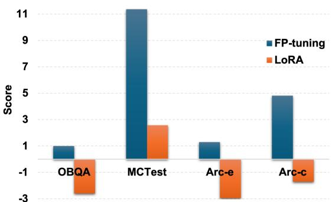  
Figure 1: The increase between mixture setting and single setting for FP-tuning and LoRA on four datasets. The vertical axis is Score (mixture)-Score (single).

As we all know, MoE (Shazeer et al., 2017) has demonstrated remarkable advantages in amalgamating multiple capabilities. Particularly, the integration of MoE and LoRA (Hu et al., 2022) stands out as a promising approach to leveraging MoE in a parameter-efficient manner. This method preserves domain knowledge while significantly reducing training costs by introducing a limited number of domain-specific parameters (Dou et al., 2024; Luo et al., 2024; Liu et al., 2023). Presently, several works are devoted to applying MoE to LoRA. Some directly combine trained LoRAs linearly (Zhang et al., 2023; Huang et al., 2024), while others apply combinations of MoE and LoRA to different backbones (Chen et al., 2024; Dou et al., 2024). Another approach involves training a LoRA module for each distinct task type and employing a routing mechanism to integrate the LoRA modules under a shared LLM (Feng et al., 2024). However, we contend that these methods inadequately address the issue of data conflicts across different domains during LoRA training. Three primary challenges emerge: (1) The MoE architecture emphasizes the unique attributes of each LoRA and overlooks the transfer of general knowledge between different Lo-RAs, thereby impeding cross-task generalization in LLMs; (2) Requires a large number of trained LoRA modules (for each task); (3) Multiple LoRAs escalate the number of parameters and computational costs.

To solve these issues, in this paper, we propose a parameter-sharing method applied to the mixtureof-LoRAs, called MoSLD. The plain LoRA module comprises the upper projection matrix (A) and the lower projection matrix (B), which can be viewed as naturally decoupled general-feature and specific-feature matrices, respectively. Building upon the classic MoE architecture, we enable all experts at each layer to share a general-feature matrix while retaining the specific-feature matrix of each expert. This approach compels the model to capture shared general knowledge across various tasks to the fullest extent. The shared operation notably reduces the parameters of the MoE archi tecture, aligning with findings indicating parameter redundancy among experts (Fedus et al., 2022b; Kim et al., 2021). Despite the majority of parameters in the LoRA module being shared, differences can still be learned in each expert’s specific-feature matrix due to the tight coupling between the general and specific features. We posit that this mechanism can adaptively generalize to any new task. Furthermore, recognizing that the general-feature matrix is updated more frequently than the specificfeature matrix during fine-tuning, and overfitting tends to occur in LoRA (Wang et al., 2024), we apply the dropout strategy to the general-feature matrix, that is some weight values are randomly set to zero during training. This approach helps balance the updates between the general-feature and specific-feature matrices. Consequently, it not only facilitates a more balanced information exchange between different experts but also mitigates issues related to parameter redundancy and optimization imbalance.

In summary, our contributions are as follows: (1) We introduce a parameter-efficient MoSLD approach that disentangles domain knowledge and captures general knowledge by sharing a generalfeature matrix, thus mitigating interference between heterogeneous datasets. (2) We implement a dropout strategy on the general-feature matrix to effectively mitigate overfitting and address the imbalance in directly optimizing MoE. (3) We conduct extensive experiments on various benchmarks to validate the effectiveness of our methods. Additionally, our approach demonstrates superior generalization to out-of-domain data.

## 2 Related Work

## 2.1 Mixture-of-Expert

The Mixture of Experts (MoE) functions as an ensemble method, conceptualized as a collection of sub-modules or experts, each tailored to process distinct types of input data. Guided by a router, each expert is selectively activated based on the input data type. This technique has garnered increasing attention and demonstrated remarkable performance across various domains, including computer vision, speech recognition, and multimodal applications (Fedus et al., 2022a). Evolution of MoE techniques spans from early sample-level approaches (Jacobs et al., 1991) to contemporary token-level implementations (Shazeer et al., 2017; Riquelme et al., 2021), which have now become mainstream. Concurrently, some researchers (Zhou et al., 2022; Chi et al., 2022) are delving into the router selection problem within MoE. Notably, the majority of these endeavors aim to scale up model parameters while mitigating computational costs.

## 2.2 Mixture-of-LoRA

As LoRA gradually becomes the most common parameter-efficient fine-tuning method, researchers pay more attention to combining MoE and LoRA for more efficient and effective model tuning. Huang et al. (2024) and Feng et al. (2024) pioneer the approach of training several LoRA weights on upstream tasks and then integrating the LoRA modules into a shared LLM using a routing mechanism. However, these methods necessitate the training of numerous pre-defined LoRA modules. Chen et al. (2024) initially engage in instruction finetuning through sparse mixing of LoRA experts in the multi-modal domain, while Dou et al. (2024) split the LoRA experts into two groups to explicitly learn different capabilities for each group. These mixture-of-LoRA methods typically involve predefined hyperparameters that require careful selection, and they densely mix LoRA experts, significantly increasing computational costs. To tackle overfitting resulting from an excessive number of experts, Gao et al. (2024) allocate a varying number of experts to each layer. Wu et al. (2024) propose MOLE, treating each layer of trained LoRAs as a distinct expert and implementing hierarchical weight control through a learnable gating function within each layer to tailor composition weights specific to a given domain’s objectives. However, these approaches overlook the issue of data conflicts across different datasets during LoRA training. As our concurrent work, MixLoRA (Li et al., 2024) also focuses on multi-task learning, which fuses multiple LoRAs with the shared FFN layer and employ a plain LoRA on the self-attention layer. We believe this method will introduce a large number of additional trainable parameters and incur a huge computational cost. In our study, we conduct extensive experimental analysis for both single and mixture data settings in a more lightweight way.

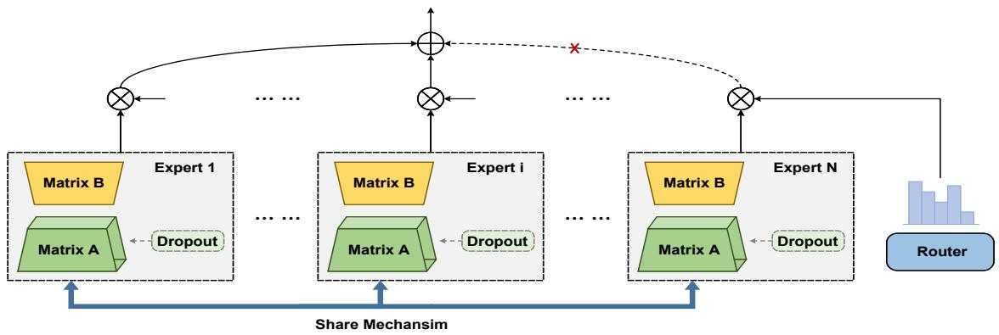  
Figure 2: Overview of the share mechansim and dropout strategy in our MoSLD. Noted that the matrix A is shared among all experts in each layer.

## 3 Methodology

In this section, we describe our MoSLD from the sharing mechanism, dropout strategy and optimization details, as shown in Figure 2.

## 3.1 Sharing Mechanism of LoRAs

In the area of parameter-efficient fine-tuning, LoRA introduces the concept of training only two lowrank matrices as an alternative to dense layer updates. In other words, it reformulates the parameter fine-tuning process in LLMs as a lowrank decomposition. Specifically, the equation $W _ { 0 } + \Delta W = W _ { 0 } + B A$ captures this decomposition. Here, $W _ { 0 } \in \mathcal { R } ^ { d _ { i n } \times d _ { o u t } }$ represents the parameter matrix of the pre-trained LLM, while $\Delta W \in \mathcal { R } ^ { d _ { i n } \times d _ { o u t } }$ denotes the matrix updated during fine-tuning. The matrices $B \in \mathcal { R } ^ { d _ { i n } \times r }$ and $A \in \mathcal { R } ^ { r \times d _ { o u t } }$ are low-rank and trainable.

In order to achieve the transfer of general features between different tasks and capture the shared general knowledge, we design a novel sharing mechanism. Specifically, given a Transformer model with L layers, we allocate $N _ { l }$ experts for layer l and create $N _ { l }$ pairs of low-rank matrices $\{ \dot { A } _ { i , l } , B _ { i , l } \} _ { i = 1 } ^ { N _ { l } }$ , where $A _ { i , l }$ is initialized from a random Gaussian distribution and each $B _ { i , l }$ is set to zero. It is worth noting that the matrix $A _ { i , l }$ is shared among all experts in each layer, i.e., $A _ { 1 , l } = A _ { 2 , l } . . . = A _ { N _ { l } , l } ( l \in L )$ . In other words, the core idea is to share the matrix A as the generalfeature matrix and keep matrix B as specific-feature matrix. In this way, we can only keep L central general-feature matrices for a L-layer MoE architecture, which significantly reduces the parameters of the MoE architecture. A router with a trainable weight matrix $W _ { l } \in \mathcal { R } ^ { d _ { i n } \times N _ { l } }$ is used to specify different experts for the input x. As in the original MoE, MoSLD selects the top K experts for computation, and the gate score $S _ { l } ^ { k }$ is calculated as follows:

$$
S _ { l } ^ { k } ( x ) = \frac { \mathrm { T o p K } ( \mathrm { s o f t m a x } ( W _ { l } x ) , K ) _ { k } } { \sum _ { k = 1 } ^ { K } \mathrm { T o p K } ( \mathrm { s o f t m a x } ( W _ { l } x ) , K ) _ { k } }\tag{1}
$$

## 3.2 Dropout Strategy

In order to alleviate the imbalance and over-fitting problems caused by frequent general-feature matrix updates, we propose to apply the dropout strategy on the general-feature parameter matrix $A _ { l }$ Dropout involves randomly ignoring a proportion of updates to the parameter matrix during each iteration of training. This technique helps prevent over-reliance on specific parameters and encourages robust learning by introducing noise. That is, at each iteration, we take a certain probability p to discard the update in the general-feature matrix. Specifically, we generate a binary mask matrix drawn from Bernoulli distribution with a mask probability p, where each element in the generalfeature matrix independently takes a value of 1 (keeping the parameter) with probability 1 − p or 0 (dropping the parameter) with probability $p .$ The general-feature matrix is updated as follows:

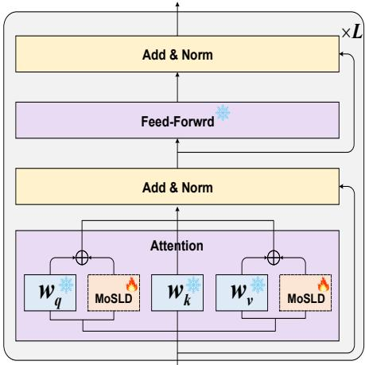  
Figure 3: The overview of our proposed Mixture-of-Shared-LoRA with dropout strategy applied on $W _ { q }$ and $W _ { v }$

$$
\begin{array} { r } { \mathbf { M a s k } \sim \mathbf { B e r n o u l l i } ( p ) } \\ { \mathbf { A } _ { l } ^ { ' } = \mathbf { M a s k } \odot \mathbf { A } _ { l } } \\ { \widetilde { \mathbf { A } ^ { \prime } } _ { l } = \mathbf { A } _ { l } ^ { ' } / ( 1 - p ) } \end{array}\tag{2}
$$

## 3.3 The Overall Procedure

Our method is a combination of shared LoRA modules and MoE framework, as shown in Figure 3. Here, we apply our MoSLD on the matrix $Q$ and matrix $V$ of the self-attention layer:

$$
h _ { l } = W _ { 0 } x + \frac { \alpha } { r } \sum _ { k = 1 } ^ { K } S _ { l } ^ { k } ( x ) A _ { k , l } B _ { k , l } x\tag{3}
$$

where $W _ { 0 } \in \{ W _ { q } , W _ { v } \}$ and $h _ { l }$ is the output embedding. Besides, similar to previous sparse MoE works, the load balancing loss $L _ { b }$ is also applied on each MoE layer, which is formulated as:

$$
\begin{array} { r } { L _ { b } = \displaystyle \sum _ { k = 1 } ^ { K } c _ { k } \cdot s ^ { k } } \\ { p _ { k } = \displaystyle \sum _ { x \in X } \frac { e ^ { S ^ { k } ( x ) } } { \sum ^ { k } e ^ { S ^ { k } ( x ) } } } \end{array}\tag{4}
$$

where $c _ { k }$ is the number of tokens assigned to the k-th expert.

## 4 Experimental Setup

## 4.1 Datasets

To evaluate the effectiveness of MoSLD, we conduct experiments on six commonsense reasoning datasets, including commonsense QA task (OBQA (Mihaylov et al., 2018), CSQA (Talmor et al., 2019)), reading comprehension task (Race (Lai et al., 2017), MCTest (Richardson et al., 2013)), and subject knowledge QA task (Arc-e (Clark et al., 2018), and Arc-c (Clark et al., 2018)). We denote the six datasets as $\{ D _ { 1 } , ~ D _ { 2 } , . . . , ~ D _ { 6 } \}$ , and we also create a mixed dataset $D _ { m i x } .$ , corresponding to the single setting and the mixture setting respectively. The dataset sizes are as follows for training and testing: 5,457/500, 10,962/1140, 10,083/4934, 1,330/147, 2,821/2,376, and 1,418/1,172. We allocate 10% of the training set for validation. For all datasets, we use answer accuracy as the evaluation metric.

## 4.2 Baselines

We compare MoSLD with five parameter-efficient fine-tuning methods: Prefix-tuning (Li and Liang, 2021; Zhao et al., 2022b), LoRA (Hu et al., 2022), MoLoRA (Zadouri et al., 2024), SiRA (Zhu et al., 2023), MoLA (Gao et al., 2024), MixLoRA (Li et al., 2024). Additionally, we evaluate fullparameter fine-tuning. The details can be seen in Appendix A.

## 4.3 Training Details

We take LLaMA2-7B (Touvron et al., 2023b) which contains 32 layers as our base model. For plain LoRA and its variants, the r is set to 8 and α is 16. Beside, the LoRA modules are used in matrix Q and matrix V in attention layers. Our MoSLD also follows the same settings. We allocate 8 experts to each layer for 1-8 layers, 6 experts to each layer for 9-16 layers, 4 experts to each layer for 17-24 layers, and 2 experts to each layer for the last 8 layers. The K of the selected experts is 2. For training details, we finetune models with 10 epochs and a peak of 3e-4 learning rate. The drop ratio applied to matrix A is set to 0.1. The batch size during model tuning is 128. The experiments are run on 16 NVIDIA A100 40GB GPUs.

<table><tr><td colspan="2">Model</td><td>OBQA</td><td>CSQA</td><td>Race</td><td>MCTest</td><td>Arc-e</td><td>Arc-c</td><td>Avg</td></tr><tr><td rowspan="2">FP-tuning</td><td rowspan="2">single mixture</td><td>75.00</td><td>75.74</td><td>80.62</td><td>39.05</td><td>72.39</td><td>60.63</td><td>67.24</td></tr><tr><td>76.00</td><td>75.27</td><td>81.46</td><td>50.42</td><td>73.69</td><td>65.45</td><td>70.38</td></tr><tr><td rowspan="2">Prefix-tuning</td><td>single</td><td>47.76</td><td>42.65</td><td>53.77</td><td>25.19</td><td>45.65</td><td>35.50</td><td>41.70</td></tr><tr><td>mixture</td><td>46.51</td><td>44.98</td><td>49.88</td><td>22.46</td><td>47.92</td><td>35.30</td><td>41.18</td></tr><tr><td rowspan="2">LoRA</td><td>single</td><td>75.40</td><td>76.33</td><td>76.06</td><td>53.10</td><td>73.82</td><td>62.71</td><td>69.57</td></tr><tr><td>mixture</td><td>72.80</td><td>76.30</td><td>78.23</td><td>55.67</td><td>70.87</td><td>61.00</td><td>69.15</td></tr><tr><td rowspan="2">MoLoRA</td><td>single</td><td>74.71</td><td>76.65</td><td>74.26</td><td>49.08</td><td>74.14</td><td>61.38</td><td>68.37</td></tr><tr><td>mixture</td><td>75.04</td><td>75.27</td><td>73.88</td><td>55.37</td><td>75.25</td><td>62.86</td><td>69.61</td></tr><tr><td rowspan="2">SiRA</td><td>single</td><td>73.99</td><td>76.26</td><td>75.63</td><td>48.28</td><td>74.02</td><td>62.86</td><td>68.51</td></tr><tr><td>mixture</td><td>74.34</td><td>76.22</td><td>75.04</td><td>52.33</td><td>74.98</td><td>63.16</td><td>69.35</td></tr><tr><td rowspan="2">MoLA</td><td>single</td><td>74.60</td><td>77.23</td><td>75.29</td><td>44.90</td><td>72.73</td><td>60.80</td><td>67.59</td></tr><tr><td>mixture</td><td>76.60</td><td>73.46</td><td>75.25</td><td>54.42</td><td>76.34</td><td>63.91</td><td>70.00</td></tr><tr><td rowspan="2">MixLoRA</td><td>single</td><td>75.60</td><td>74.83</td><td>75.47</td><td>50.88</td><td>74.51</td><td>60.10</td><td></td></tr><tr><td>mixture</td><td>75.80</td><td>76.81</td><td>74.79</td><td>54.26</td><td>74.41</td><td>63.62</td><td>68.57</td></tr><tr><td rowspan="2">MoSL (our)</td><td>single</td><td>76.30</td><td>77.56</td><td>74.63</td><td>49.66</td><td>76.30</td><td>60.48</td><td>69.95</td></tr><tr><td>mixture</td><td>76.80 (+0.50)</td><td>75.02 (-2.54)</td><td>74.69 (+0.06)</td><td></td><td></td><td></td><td>69.16</td></tr><tr><td rowspan="2">MoSLD (our)</td><td>single</td><td>78.40</td><td>75.84</td><td></td><td>58.50 (+8.84)</td><td>76.09 (-0.21)</td><td>64.16 (+3.68)</td><td>70.88 (+1.72)</td></tr><tr><td>mixture</td><td>78.80 (+0.40)</td><td>76.43 (+0.59)</td><td>76.08 76.96 (+0.88)</td><td>53.06 54.42 (+1.36)</td><td>76.35 76.60 (+0.25)</td><td>61.49 66.13 (+4.64)</td><td>70.20 71.56 (+1.36)</td></tr></table>

Table 1: Results of different methods on the in-domain test sets of six commonsense reasoning datasets. We also report the increase of mixture setting compared to single setting. Results are averaged over three random runs. (p < 0.01 under t-test)

## 4.4 Main Results

Table 1 presents the experimental outcomes of various baselines under both single and mixture settings across different datasets. Initially, we report the performance of models trained on individual datasets. LoRA notably outperforms other baselines, exhibiting improvements of 2.33% and 27.87% over FP-tuning (single) and Prefix-tuning (single), respectively. MoLoRA, SiRA, MoLA, and MixLoRA trail behind LoRA by 1.20%, 1.06%, 1.98%, and 1.00%, indicating that simply combining LoRA and MoE does not confer an advantage in single in-domain datasets. After establishing a robust baseline in the single setting, we proceed to report results for the mixture setting. Here, we observe a decline in LoRA’s performance, trailing 1.23 points behind FP-tuning (70.38%). Conversely, applying the MoE framework to LoRA, i.e., MoLoRA, SiRA, MoLA, and MixLoRA, achieves scores of 69.61%, 69.35%, 70.00%, and 69.95%, demonstrating MoE’s suitability for multi-task scenarios and MoLA is the best performing baseline in the mixture setting. Further comparison between single and mixture settings reveals that FP-tuning and MoLA improve by 3.14% and 2.41%, respectively, in the mixture setting compared to the single setting. However, LoRA’s performance decreases by 0.42% in the mixture setting compared to the single setting, indicating conflicts between multitask data and the mixture strategy’s detrimental impact on performance.

Upon closer examination, our proposed MoSLD demonstrates performance enhancements of 2.61% and 1.56% over MoLA in single and mixture settings, respectively. This emphasizes the effectiveness of the sharing mechanism and dropout strategy in alleviating data conflicts and retaining shared knowledge between various tasks. Furthermore, conducting ablation experiments by removing the dropout strategy, MoSL experiences performance decreases of 1.04% and 0.68%, respectively, compared to MoSLD. This highlights the crucial role of the dropout strategy in mitigating training overfitting and optimization imbalance. Nevertheless, MoSL still achieves competitive results of 69.16% and 70.88%. We also found that our model not only achieves good results in the mixture setting, but also achieves good results in the single setting, which overcomes the disadvantage of MoLA’s poor performance in the single setting. However, we find that our models, especially MoSL, do not have much advantage over plain LoRA, which is consistent with the performance of all baselines combining MoE with LoRA. This is because the complexity of the model ensemble causes overfitting on a single simple task, resulting in little improvement. In conclusion, our approach exhibits significant advantages under both single and mixture settings, particularly in alleviating data conflicts across multiple tasks and addressing knowledge forgetting issues in multi-task learning. In addition, we also pay attention to the efficiency of training. Due to the introduction of multiple LoRAs, the trainable parameters of MoLA are higher than those of plain LoRA. However, although our MoSLD expands LoRA several times through the MoE architecture, it does not introduce a large number of additional parameters and also enables the LoRA training to have multiple capabilities. Details can be seen in Section 5.5.

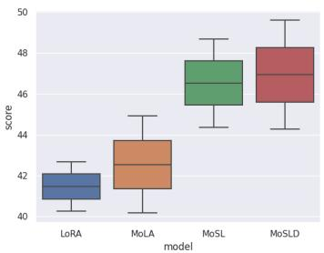  
(a) OBQA

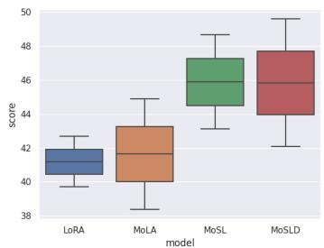  
(b) CSQA

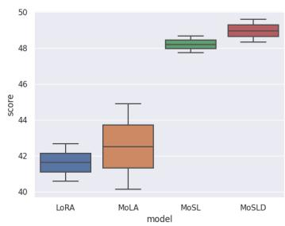  
(c) Race

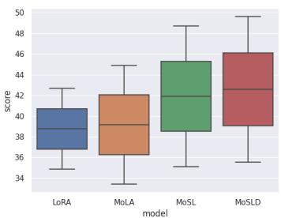  
(d) MCTest

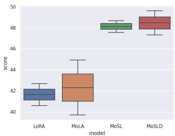  
(e) Arc-e

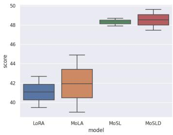  
(f) Arc-c  
Figure 4: A comparision of performance for LoRA, MoLA, MoSL, and MoSLD on single and mixture settings for MMLU test set.

## 5 Qualitative Analysis

## 5.1 Out-of-domain Test

To assess the generalization capability of our proposed model, we conducted out-of-domain experiments using the test set of MMLU. Figure 4 presents a boxplot, where the top and bottom horizontal lines represent the mixture and single settings, respectively. Our models, MoSL and MoSLD, consistently outperform others in both settings, exhibiting significant improvements, particularly on Race, Arc-e, and Arc-c datasets. This highlights the effectiveness of our models in disentangling domain knowledge and transferring general features across diverse datasets. OBQA and CSQA exhibit similar trends in the boxplot, indicating similar data distributions between the two datasets. Conversely, for MCTest, while improvements are observed in the mixture settings, the single settings remain relatively unchanged. This divergence may stem from the substantial differences between the MCTest and MMLU test sets, suggesting that introducing data from other domains or tasks could inspire general domain knowledge. In summary, our model demonstrates strong generalization capabilities, particularly in multi-task scenarios.

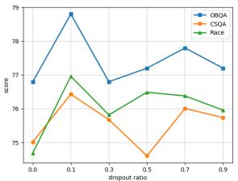  
(a) OBQA&CSQA&Race

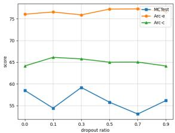  
(b) MCTest&Arc-e&Arc-c  
Figure 5: Results of six datasets under different dropout ratios. Here, we are based on the mixture setting.

## 5.2 Effect of Model Parameters

In this section, we conduct parameter search experiments.

Dropout Location As shown in Table 2, we show the results of applying our methods on matrix A and matrix B. We found that in the single setting, MoSLD (matrix B) does not achieve much improvement, 0.94 points lower than the ordinary LoRA and 1.04 points higher than MoLA. The mixture setting still achieves good results. However, the results of applying our method on matrix B are lower than those of applying it on matrix A in both the single and mixture settings. This also shows that matrix A is more used to extract general features.

Dropout Ratio In Figure 5, we depict the performance of six datasets under the mixture setting with varying dropout ratios. We observe a general downward trend in most results as the dropout ratio increases. This phenomenon occurs because while dropout can mitigate overfitting to some extent, excessively high dropout rates may diminish the model’s capabilities. Therefore, careful selection of the dropout ratio parameter is necessary. Interestingly, the curves for the Arc-e and Arc-c datasets remain relatively stable across different dropout ratios. We attribute this stability to the simplicity of these two datasets, where model sparsification has minimal impact on the results.

<table><tr><td colspan="2">Model</td><td>OBQA</td><td>CSQA</td><td>Race</td><td>MCTest</td><td>Arc-e</td><td>Arc-c</td><td>Avg</td></tr><tr><td rowspan="2">LoRA</td><td>single</td><td>75.40</td><td>76.33</td><td>76.06</td><td>53.10</td><td>73.82</td><td>62.71</td><td>69.57</td></tr><tr><td>mixture</td><td>72.80</td><td>76.30</td><td>78.23</td><td>55.67</td><td>70.87</td><td>61.00</td><td>69.15</td></tr><tr><td rowspan="2">MoLA</td><td>single</td><td>74.60</td><td>77.23</td><td>75.29</td><td>44.90</td><td>72.73</td><td>60.80</td><td>67.59</td></tr><tr><td>mixture</td><td>76.60</td><td>73.46</td><td>75.25</td><td>54.42</td><td>76.34</td><td>63.91</td><td>70.00</td></tr><tr><td rowspan="2">MoSLD (matrix A)</td><td>single</td><td>78.40</td><td>75.84</td><td>76.08</td><td>53.06</td><td>76.35</td><td>61.49</td><td>70.20</td></tr><tr><td>mixture</td><td>78.80</td><td>76.43</td><td>76.96</td><td>54.42</td><td>76.60</td><td>66.13</td><td>71.56</td></tr><tr><td rowspan="2">MoSLD (matrix B)</td><td>single</td><td>77.60</td><td>75.76</td><td>74.58</td><td>46.94</td><td>76.09</td><td>60.83</td><td>68.63</td></tr><tr><td>mixture</td><td>76.40</td><td>74.11</td><td>75.25</td><td>56.46</td><td>77.15</td><td>65.02</td><td>70.73</td></tr></table>

Table 2: The results for applying our methods on matrix A and matrix B.  
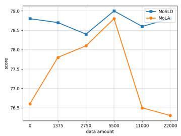  
(a) OBQA

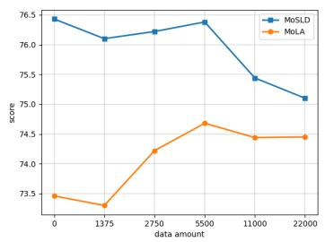  
(b) CSQA

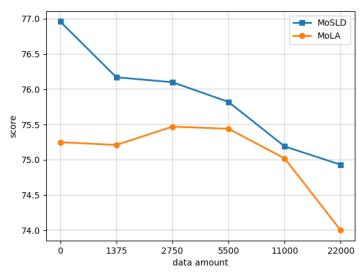  
(c) Race

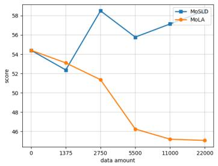  
(d) MCTest

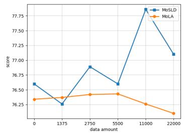  
(e) Arc-e

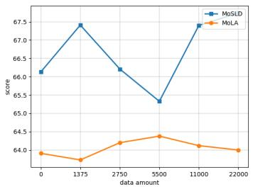  
(f) Arc-c

Figure 6: Different data amount of OpenOrca between MoSLD and MoLA on six datasets. Here, we use the mixture setting.  
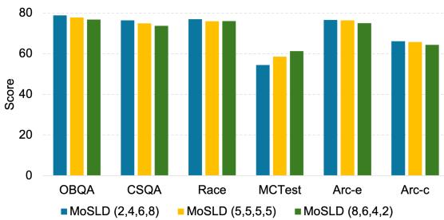  
Figure 7: Different allocation strategies for the number of experts at different layers of the model. Here, we use the mixture setting.

Expert Number Considering the redundancy among experts, following (Gao et al., 2024), we set different numbers of experts at different layers in Figure 7. Keeping the total number of experts constant, we choose three settings, i.e., (2,4,6,8), (5,5,5,5), (8,6,4,2). It is observed that assigning more experts at higher layers and fewer experts at lower layers, i.e., (2,4,6,8), works better. This is consistent with people’s intuition: the lower layers of the model mainly extract general knowledge, which can be well learned by a small number of experts. While the higher layers of the model focus more on acquiring specific features of different tasks, and a larger number of experts can better capture multi-aspect capabilities.

## 5.3 Mix with Other Data

Mathematical Reasoning Data We construct a new multi-task setting, including commonsense QA task (OBQA), reading comprehension task (MCTest), subject knowledge QA task (Arc-c), and mathematical reasoning task (GSM8K). As shown in Table 3, we found that for plain LoRA, the mixture setting was 1.11 points lower than the single setting on average, especially for GSM8K, it is reduced by 5.61%, which shows that it is very challenging for plain LoRA to train multiple tasks with little commonality. However, for our MoSLD, the mixture setting is 1.18 points higher than the single setting on average. For the GSM8K with the largest difference, it is also improved by 0.67%. This shows that MoSLD is also effective for tasks with little commonality. This is because for tasks with little commonality, although the role of the shared general-feature matrix becomes smaller, the unique-feature matrix still captures the knowledge of each task, which further shows that our MoSLD can effectively alleviate the data conflict problem in multi-task learning.

<table><tr><td colspan="2">Model</td><td>OBQA MCTest</td><td>Arc-c</td><td>GSM8K</td><td>Avg</td></tr><tr><td>LoRA</td><td>single mixture</td><td>75.40 53.10 73.20 55.10</td><td>62.71 64.08</td><td>23.12 17.51</td><td>53.58 52.47</td></tr><tr><td>MoSLD</td><td>single mixture</td><td>78.40 53.06 79.80 53.90</td><td>61.49 63.29</td><td>22.06 22.73</td><td>53.75 53.93</td></tr></table>

Table 3: The results of the mixture setting of tasks with little commonality.
<table><tr><td colspan="2">Model</td><td>OBQA CSQA</td><td>Race</td><td>MCTest</td><td>Arc-e</td><td>Arc-c</td><td>Avg</td><td></td></tr><tr><td rowspan="2">LLaMA2-7B</td><td>single</td><td>78.40 75.84</td><td>76.08</td><td></td><td>53.06</td><td>76.35</td><td>61.49</td><td>70.20</td></tr><tr><td>mixture</td><td>78.80 76.43</td><td>76.96</td><td>54.42</td><td></td><td>76.60</td><td>66.13</td><td>71.56</td></tr><tr><td>LLaMA2-13B</td><td>single mixture</td><td>81.4</td><td>77.95 78.46</td><td>78.01</td><td>57.86</td><td>78.93</td><td>65.05</td><td>73.20</td></tr><tr><td rowspan="2">LLaMA-33B</td><td>single</td><td>82.2</td><td>81.49</td><td>79.87 83.27</td><td>58.50 65.99</td><td>79.67 85.10</td><td>70.14</td><td>74.81</td></tr><tr><td>mixture</td><td>83.93 84.55</td><td>83.26 84.90</td><td>66.73</td><td></td><td>85.95</td><td>68.52 74.36</td><td>78.05 79.96</td></tr></table>

Table 4: The results of six datasets in single and mixture settings based on LLaMA2-7B, LLaMA2-13B and LLaMA-33B.

Mix with General Data In Figure 6, we illustrate the impact of adding varying amounts of randomly filtered data from OpenOrca1 to the mixed dataset $D _ { m i x }$ . The data amount from OpenOrca ranges from 1,375 to 22,000. We observed that for MoLA, as the amount of general data increases, performance initially improves before eventually declining. This suggests that mixing a large amount of general data can lead to data conflicts and domain knowledge forgetting. In contrast, MoSLD demonstrates an upward trend in performance with the increase in data amount for OBQA, MCTest, Arc-e, and Arc-c. However, performance on CSQA and Race experiences a decline. We attribute this to significant distribution differences between these datasets and the general data. Overall, our model consistently outperforms MoLA when mixing various amounts of generic data. This underscores our model’s ability to effectively leverage general knowledge across different tasks.

## 5.4 Scaling of Model Size

Table 4 shows the results of our model for the six datasets both in single and mixture settings as the model size scalings. We find that the performance of our model increases with the size of the model, whether in single or mixture settings, which is in line with our expectations. In addition, it is observed that the results improve by 1.36%, 1.61%, and 1.91% from single to mixture for LLaMA2- 7B, LLaMA2-13B, and LLaMA-33B, respectively. The experimental results show that our method has achieved good performance on models of different sizes, and has a certain scaling ability. We also give the model size scaling results of other LoRA-based baselines, which can be seen in the Appendix C.

## 5.5 Analysis of Computation Efficiency

In Table 5, we further show the computational efficiency of our model. We first analyze the number of new LoRA modules inserted in ordinary LoRA, MoLA, and MoSLD. Since MoLA introduces the MoE framework, the trainable parameters become 5 times that of ordinary LoRA, and its results are improved by 0.43 points from 69.57 to 70.00. We believe that despite the introduction of a large number of trainable parameters, the change in results is not very large, which is a method of sacrificing efficiency for effect. In addition, we also found that although our method reduces 128 matrix A compared to MoLA, it is still 1.56% higher than MoLA and 1.99% higher than LoRA. This shows that although our MoSLD introduces multiple LoRAs through the MoE framework, the expert sharing mechanism greatly reduces the additional parameters and achieves a balance between effect and efficiency. We also compare FP-tuning. Athough our trainable parameters are 20.6% of FP-tuning, but it still achieves a 1.18 point improvement. This also proves that our MoSLD is indeed an extremely efficient-parameter fine-tuning method.

<table><tr><td>Model</td><td>LoRA number</td><td>Forward param</td><td>Trainable param</td><td>Avg_score</td></tr><tr><td>FP-tuning</td><td>1</td><td>6.738B</td><td>6.738B</td><td>70.38</td></tr><tr><td>LoRA</td><td> $\overline { { ( 1 \mathrm { A } + 1 \mathrm { B } ) ^ { * } 3 2 } }$ </td><td>6.743B</td><td>0.419B</td><td>69.57</td></tr><tr><td>MoLA</td><td> $( 5 \mathrm { A } { + } 5 \mathrm { B } ) ^ { * } 3 2$ </td><td>6.761B</td><td>2.228B</td><td>70.00</td></tr><tr><td>MoSLD</td><td> $( 1 \mathbf { A } { + } 5 \mathbf { B } ) ^ { * } 3 2$ </td><td>6.572B</td><td>1.389B</td><td>71.56</td></tr></table>

Table 5: The number of LoRA matrices, forward parameters, and trainable parameters for FP-tuning, LoRA, MoLA, and our MoSLD during training. Here, "A" is matrix A, "B" is matrix B, and $" 5 "$ is the average number of experts per layer. We also report the average results across 6 datasets under the mixture setting.

## 6 Conclusion

In this paper, we propose MoSLD, which is a mixture-of-shared-LoRAs model with dropout strategy. Unlike traditional LoRA-MoE approaches, we design a sharing mechanism for matrix A, which aims to capture the general-feature among various tasks. A dropout strategy is also applied to the matrix A, solving the overfitting caused by parameter redundancy to a certain extent. Evaluations show that MoSLD outperforms the baseline in both single-task and multi-task scenarios. Especially in multi-task scenarios, where it can effectively alleviate knowledge conflict and forgetting problems. In general, our model is extremely parameter-efficient for fine-tuning.

## Acknowledgement

We thank all anonymous reviewers. This work was supported by National Science and Technology Major Project No.2022ZD0116314.

## Limitations

Although MoSLD achieves significant improvements over existing baselines, there are still avenues worth exploring in future research. (1) This paper focuses on applying MoSLD on the matrix Q and V of the attention layer. We hope to extend this method to the FFN layer. (2) This paper explores the multi-task setting of directly mixing multiple datasets and compares with the performance of a single task. We plan to study the impact of multi-task data ratio on MoSLD. (3) This paper emphasizes the extraction of general and unique features by the upper and lower projection matrices in LoRA, and intends to visualize this phenomenon in the future.

## Ethics Statement

LoRA has emerged as a pivotal technique for refining extensive pre-trained models. Nevertheless, its efficacy tends to fail in multi-task learning. Conversely, the MoE architecture offers a promising remedy to this setback. However, it introduces hurdles such as the interference of data across diverse domains and the risk of forgetting knowledge from various tasks. Furthermore, MoE substantially inflates parameter counts, presenting computational challenges. In light of these considerations, we present MoSLD in this paper, a model that integrates the strengths of both approaches. MoSLD, a mixture-of-shared-LoRAs model with a dropout strategy, addresses these obstacles ingeniously. By sharing the upper projection matrix in LoRA among different experts, MoSLD fosters the acquisition of broad knowledge across tasks while allowing the lower projection matrix to concentrate on task-specific features. Additionally, the application of dropout mitigates parameter overfitting in LoRA. The experimental results prove the effectiveness of our model andevaluation framework. Besides, there is no hugebiased content in the datasets and the models. Ifthe knowledge base is further used, the biased con-tent will be brought into the generated responses,just like biased content posted by content creatorson the Web which is promoted by a search engine.To prevent the technology from being abused fordisinformation, we look forward to more research effort being paid to fake/biased/offensive contentdetection and encourage developers to carefullychoose the proper dataset and content to build theknowledge base.

## References

Shaoxiang Chen, Zequn Jie, and Lin Ma. 2024. Llavamole: Sparse mixture of lora experts for mitigating data conflicts in instruction finetuning mllms. Preprint, arXiv:2401.16160.

Zewen Chi, Li Dong, Shaohan Huang, Damai Dai, Shuming Ma, Barun Patra, Saksham Singhal, Payal Bajaj, Xia Song, Xian-Ling Mao, Heyan Huang, and Furu Wei. 2022. On the representation collapse of sparse mixture of experts. In Advances in Neural Information Processing Systems.

Peter Clark, Isaac Cowhey, Oren Etzioni, Tushar Khot, Ashish Sabharwal, Carissa Schoenick, and Oyvind Tafjord. 2018. Think you have solved question answering? try arc, the ai2 reasoning challenge. arXiv:1803.05457v1.

Shihan Dou, Enyu Zhou, Yan Liu, Songyang Gao, Jun Zhao, Wei Shen, Yuhao Zhou, Zhiheng Xi, Xiao Wang, Xiaoran Fan, Shiliang Pu, Jiang Zhu, Rui Zheng, Tao Gui, Qi Zhang, and Xuanjing Huang. 2024. Loramoe: Alleviate world knowledge forgetting in large language models via moe-style plugin. Preprint, arXiv:2312.09979.

William Fedus, Jeff Dean, and Barret Zoph. 2022a. A review of sparse expert models in deep learning. Preprint, arXiv:2209.01667.

William Fedus, Barret Zoph, and Noam Shazeer. 2022b. Switch transformers: scaling to trillion parameter models with simple and efficient sparsity. J. Mach. Learn. Res., 23(1).

Wenfeng Feng, Chuzhan Hao, Yuewei Zhang, Yu Han, and Hao Wang. 2024. Mixture-of-loras: An efficient multitask tuning for large language models. Preprint, arXiv:2403.03432.

Chongyang Gao, Kezhen Chen, Jinmeng Rao, Baochen Sun, Ruibo Liu, Daiyi Peng, Yawen Zhang, Xiaoyuan Guo, Jie Yang, and VS Subrahmanian. 2024. Higher layers need more lora experts. Preprint, arXiv:2402.08562.

Edward J Hu, yelong shen, Phillip Wallis, Zeyuan Allen-Zhu, Yuanzhi Li, Shean Wang, Lu Wang, and Weizhu Chen. 2022. LoRA: Low-rank adaptation of large language models. In International Conference on Learning Representations.

Chengsong Huang, Qian Liu, Bill Yuchen Lin, Chao Du, Tianyu Pang, and Min Lin. 2024. Lorahub: Efficient cross-task generalization via dynamic loRA composition.

Robert A. Jacobs, Michael I. Jordan, Steven J. Nowlan, and Geoffrey E. Hinton. 1991. Adaptive mixtures of local experts. Neural Computation, 3(1):79–87.

Young Jin Kim, Ammar Ahmad Awan, Alexandre Muzio, Andres Felipe Cruz Salinas, Liyang Lu, Amr Hendy, Samyam Rajbhandari, Yuxiong He, and

Hany Hassan Awadalla. 2021. Scalable and efficient moe training for multitask multilingual models. Preprint, arXiv:2109.10465.

Guokun Lai, Qizhe Xie, Hanxiao Liu, Yiming Yang, and Eduard Hovy. 2017. RACE: Large-scale ReAding comprehension dataset from examinations. In Proceedings of the 2017 Conference on Empirical Methods in Natural Language Processing, pages 785– 794, Copenhagen, Denmark. Association for Computational Linguistics.

Dengchun Li, Yingzi Ma, Naizheng Wang, Zhengmao Ye, Zhiyuan Cheng, Yinghao Tang, Yan Zhang, Lei Duan, Jie Zuo, Cal Yang, and Mingjie Tang. 2024. Mixlora: Enhancing large language models finetuning with lora-based mixture of experts. Preprint, arXiv:2404.15159.

Xiang Lisa Li and Percy Liang. 2021. Prefix-tuning: Optimizing continuous prompts for generation. In Proceedings ofthe 59th Annual Meeting ofthe Associationfor Computational Linguistics and the 11th International Joint Conference on Natural Language Processing (Volume 1: Long Papers), pages 4582– 4597, Online. Association for Computational Linguistics.

Qidong Liu, Xian Wu, Xiangyu Zhao, Yuanshao Zhu, Derong Xu, Feng Tian, and Yefeng Zheng. 2023. Moelora: An moe-based parameter efficient finetuning method for multi-task medical applications. Preprint, arXiv:2310.18339.

Tongxu Luo, Jiahe Lei, Fangyu Lei, Weihao Liu, Shizhu He, Jun Zhao, and Kang Liu. 2024. Moelora: Contrastive learning guided mixture of experts on parameter-efficient fine-tuning for large language models. Preprint, arXiv:2402.12851.

Todor Mihaylov, Peter Clark, Tushar Khot, and Ashish Sabharwal. 2018. Can a suit of armor conduct electricity? a new dataset for open book question answering. In EMNLP.

Long Ouyang, Jeffrey Wu, Xu Jiang, Diogo Almeida, Carroll Wainwright, Pamela Mishkin, Chong Zhang, Sandhini Agarwal, Katarina Slama, Alex Ray, John Schulman, Jacob Hilton, Fraser Kelton, Luke Miller, Maddie Simens, Amanda Askell, Peter Welinder, Paul F Christiano, Jan Leike, and Ryan Lowe. 2022. Training language models to follow instructions with human feedback. In Advances in Neural Information Processing Systems, volume 35, pages 27730–27744. Curran Associates, Inc.

Matthew Richardson, Christopher J.C. Burges, and Erin Renshaw. 2013. MCTest: A challenge dataset for the open-domain machine comprehension of text. In Proceedings of the 2013 Conference on Empirical Methods in Natural Language Processing, pages 193–203, Seattle, Washington, USA. Association for Computational Linguistics.

Carlos Riquelme, Joan Puigcerver, Basil Mustafa, Maxim Neumann, Rodolphe Jenatton, André Susano Pinto, Daniel Keysers, and Neil Houlsby. 2021. Scaling vision with sparse mixture of experts. In Advances in Neural Information Processing Systems, volume 34, pages 8583–8595. Curran Associates, Inc.

Noam Shazeer, \*Azalia Mirhoseini, \*Krzysztof Maziarz, Andy Davis, Quoc Le, Geoffrey Hinton, and Jeff Dean. 2017. Outrageously large neural networks: The sparsely-gated mixture-of-experts layer. In International Conference on Learning Representations.

Alon Talmor, Jonathan Herzig, Nicholas Lourie, and Jonathan Berant. 2019. CommonsenseQA: A question answering challenge targeting commonsense knowledge. In Proceedings ofthe 2019 Conference ofthe North American Chapter ofthe Associationfor Computational Linguistics: Human Language Technologies, Volume 1 (Long and Short Papers), pages 4149–4158, Minneapolis, Minnesota. Association for Computational Linguistics.

Hugo Touvron, Thibaut Lavril, Gautier Izacard, Xavier Martinet, Marie-Anne Lachaux, Timothée Lacroix, Baptiste Rozière, Naman Goyal, Eric Hambro, Faisal Azhar, Aurelien Rodriguez, Armand Joulin, Edouard Grave, and Guillaume Lample. 2023a. Llama: Open and efficient foundation language models. Preprint, arXiv:2302.13971.

Hugo Touvron, Louis Martin, Kevin Stone, Peter Albert, Amjad Almahairi, Yasmine Babaei, Nikolay Bashlykov, Soumya Batra, Prajjwal Bhargava, Shruti Bhosale, Dan Bikel, Lukas Blecher, Cristian Canton Ferrer, Moya Chen, Guillem Cucurull, David Esiobu, Jude Fernandes, Jeremy Fu, Wenyin Fu, Brian Fuller, Cynthia Gao, Vedanuj Goswami, Naman Goyal, Anthony Hartshorn, Saghar Hosseini, Rui Hou, Hakan Inan, Marcin Kardas, Viktor Kerkez, Madian Khabsa, Isabel Kloumann, Artem Korenev, Punit Singh Koura, Marie-Anne Lachaux, Thibaut Lavril, Jenya Lee, Diana Liskovich, Yinghai Lu, Yuning Mao, Xavier Martinet, Todor Mihaylov, Pushkar Mishra, Igor Molybog, Yixin Nie, Andrew Poulton, Jeremy Reizenstein, Rashi Rungta, Kalyan Saladi, Alan Schelten, Ruan Silva, Eric Michael Smith, Ranjan Subramanian, Xiaoqing Ellen Tan, Binh Tang, Ross Taylor, Adina Williams, Jian Xiang Kuan, Puxin Xu, Zheng Yan, Iliyan Zarov, Yuchen Zhang, Angela Fan, Melanie Kambadur, Sharan Narang, Aurelien Rodriguez, Robert Stojnic, Sergey Edunov, and Thomas Scialom. 2023b. Llama 2: Open foundation and fine-tuned chat models. Preprint, arXiv:2307.09288.

Sheng Wang, Liheng Chen, Jiyue Jiang, Boyang Xue, Lingpeng Kong, and Chuan Wu. 2024. Lora meets dropout under a unified framework. Preprint, arXiv:2403.00812.

Xun Wu, Shaohan Huang, and Furu Wei. 2024. Mixture of loRA experts. In The Twelfth International Conference on Learning Representations.

Ted Zadouri, Ahmet Üstün, Arash Ahmadian, Beyza Ermis, Acyr Locatelli, and Sara Hooker. 2024. Pushing mixture of experts to the limit: Extremely parameter efficient moe for instruction tuning. In The Twelfth International Conference on Learning Representations.

Weihao Zeng, Lulu Zhao, Keqing He, Ruotong Geng, Jingang Wang, Wei Wu, and Weiran Xu. 2023. Seen to unseen: Exploring compositional generalization of multi-attribute controllable dialogue generation. In Proceedings of the 61st Annual Meeting of the Associationfor Computational Linguistics (Volume 1: Long Papers), pages 14179–14196, Toronto, Canada. Association for Computational Linguistics.

Jinghan Zhang, Shiqi Chen, Junteng Liu, and Junxian He. 2023. Composing parameter-efficient modules with arithmetic operation. In Thirty-seventh Conference on Neural Information Processing Systems.

Lulu Zhao, Fujia Zheng, Weihao Zeng, Keqing He, Ruotong Geng, Huixing Jiang, Wei Wu, and Weiran Xu. 2022a. Adpl: Adversarial prompt-based domain adaptation for dialogue summarization with knowledge disentanglement. In Proceedings of the 45th International ACM SIGIR Conference on Research and Development in Information Retrieval, SIGIR ’22, page 245–255, New York, NY, USA. Association for Computing Machinery.

Lulu Zhao, Fujia Zheng, Weihao Zeng, Keqing He, Weiran Xu, Huixing Jiang, Wei Wu, and Yanan Wu. 2022b. Domain-oriented prefix-tuning: Towards efficient and generalizable fine-tuning for zero-shot dialogue summarization. In Proceedings ofthe 2022 Conference of the North American Chapter of the Associationfor Computational Linguistics: Human Language Technologies, pages 4848–4862, Seattle, United States. Association for Computational Linguistics.

Yanqi Zhou, Tao Lei, Hanxiao Liu, Nan Du, Yanping Huang, Vincent Zhao, Andrew M Dai, zhifeng Chen, Quoc V Le, and James Laudon. 2022. Mixture-ofexperts with expert choice routing. In Advances in Neural Information Processing Systems, volume 35, pages 7103–7114. Curran Associates, Inc.

Yun Zhu, Nevan Wichers, Chu-Cheng Lin, Xinyi Wang, Tianlong Chen, Lei Shu, Han Lu, Canoee Liu, Liangchen Luo, Jindong Chen, and Lei Meng. 2023. Sira: Sparse mixture of low rank adaptation. Preprint, arXiv:2311.09179.

## A Baselines

In this section, we introduce the baselines in detail. Prefix-tuning (Li and Liang, 2021; Zhao et al., 2022b): This method involves incorporating soft prompts into each attention layer of the Large Language Model (LLM). These soft prompts are a series of virtual tokens pre-appended to the text.

During fine-tuning, the LLM remains frozen, and only the virtual tokens are optimized.

LoRA (Hu et al., 2022): A popular parameterefficient tuning approach widely used in LLM finetuning, LoRA leverages low-rank matrix decomposition of pre-trained weight matrices to significantly reduce the number of training parameters.

MoLoRA (Zadouri et al., 2024): A method which is a parameter-efficient MoE by uniquely combining MoE architecture with lightweight experts.

SiRA (Zhu et al., 2023): A method leverages the Sparse Mixture of Expert (SMoE) and enforces the top k experts routing with a capacity limit restricting the maximum number of tokens each expert can process.ta

MoLA (Gao et al., 2024): A LoRA variant with layer-wise expert allocation, MoLA flexibly assigns a different number of LoRA experts to each Transformer layer.

MixLoRA (Li et al., 2024): It inserts multiple LoRA-based experts within the feed-forward network block of a frozen pre-trained dense model and employs a commonly used top-k router.

## B Effect on Rank

In this section, we add experiments on the effect of rank for our MoSLD, with r ranging from 2 to 32. Overall, the results of the six datasets did not fluctuate much, and the best value was obtained at 8 or 16. From the perspective of efficiency, 8 is indeed a suitable hyperparameter, which is also in line with the change law of LoRA’s rank. The results are as shown in Table 6:

## C Scaling of Model Size

In this section,We add model scaling experiments on LoRA-based baselines, such as LoRA, MoLoRA, SiRA, and MoLA. We find that for each baseline, the results improve as the model size increases, among which our model MoSLD scales even better. The results are shown in Table 7 :

<table><tr><td>Dataset</td><td>r=2</td><td>r=4</td><td>r=8</td><td>r=16</td><td>r=32</td></tr><tr><td>OBQA</td><td>76.19</td><td>76.34</td><td>78.80</td><td>75.53</td><td>74.27</td></tr><tr><td>CSQA</td><td>74.35</td><td>75.16</td><td>76.43</td><td>77.39</td><td>76.62</td></tr><tr><td>Race</td><td>75.22</td><td>76.01</td><td>76.96</td><td>76.74</td><td>74.73</td></tr><tr><td>MCTest</td><td>52.28</td><td>54.17</td><td>54.42</td><td>54.16</td><td>53.52</td></tr><tr><td>Arc-e</td><td>75.51</td><td>76.98</td><td>76.70</td><td>75.88</td><td>75.63</td></tr><tr><td>Arc-c</td><td>63.28</td><td>64.06</td><td>66.13</td><td>66.10</td><td>65.87</td></tr></table>

Table 6: The performance of our MoSLD as different rank values.

<table><tr><td colspan="3">Model</td><td>OBQA</td><td>CSQA</td><td>Race</td><td>MCTest</td><td>Arc-e</td><td>Arc-c</td><td>Avg</td></tr><tr><td rowspan="5">LoRA</td><td rowspan="2">7B</td><td rowspan="2">single mixture</td><td>75.40</td><td>76.33</td><td>76.06</td><td>53.10</td><td>73.82</td><td>62.71</td><td>69.57</td></tr><tr><td>72.80</td><td>76.30</td><td>78.23</td><td>55.67</td><td>70.87</td><td>61.00</td><td>69.15</td></tr><tr><td rowspan="2">13B</td><td rowspan="2">single</td><td>77.21</td><td>79.84</td><td>77.34</td><td>58.29</td><td>74.99</td><td>63.89</td><td>71.93</td></tr><tr><td>mixture 77.98</td><td>78.32</td><td>77.83</td><td>55.74</td><td>74.05</td><td>64.11</td><td>71.34</td></tr><tr><td rowspan="2">33B</td><td rowspan="2">single</td><td>79.06</td><td>80.97</td><td>81.78</td><td>59.54</td><td>77.36</td><td>64.79</td><td>73.92</td></tr><tr><td>mixture</td><td>79.05 80.02</td><td>82.95</td><td>58.27</td><td>75.33</td><td>64.88</td><td>73.42</td></tr><tr><td rowspan="5">MoLoRA</td><td rowspan="2">7B</td><td rowspan="2">single mixture</td><td>75.40</td><td>76.33</td><td>76.06</td><td>53.10</td><td>73.82</td><td>62.71</td><td>69.57</td></tr><tr><td>72.80</td><td>76.30</td><td>78.23</td><td>55.67</td><td>70.87</td><td>61.00</td><td>69.15</td></tr><tr><td rowspan="2">13B</td><td rowspan="2">single mixture</td><td>77.46</td><td>81.26</td><td>75.33</td><td>51.79</td><td>75.83</td><td>64.27</td><td>70.99</td></tr><tr><td>77.95</td><td>82.44</td><td>80.25</td><td>54.73</td><td>74.21</td><td>62.65</td><td>72.04</td></tr><tr><td rowspan="2">33B</td><td rowspan="2">single mixture</td><td>78.23 77.54</td><td>83.18</td><td>79.59</td><td>59.41</td><td>82.11</td><td>65.28</td><td>74.63</td></tr><tr><td></td><td>81.35</td><td>81.78</td><td>61.62</td><td>82.07</td><td>64.35</td><td>74.79</td></tr><tr><td rowspan="5">SiRA</td><td rowspan="2">7B</td><td>single mixture</td><td>73.99</td><td>76.26</td><td>75.63</td><td>48.28</td><td>74.02</td><td>62.86</td><td>68.51</td></tr><tr><td>single</td><td>74.34</td><td>76.22</td><td>75.04</td><td>52.33</td><td>74.98</td><td>63.16</td><td>69.35</td></tr><tr><td rowspan="2">13B</td><td rowspan="2">mixture</td><td>75.15</td><td>77.93</td><td>78.28</td><td>50.78</td><td>73.85</td><td>62.03</td><td>69.67</td></tr><tr><td>75.01</td><td>76.45</td><td>78.11</td><td>50.24</td><td>74.52</td><td>61.74</td><td>69.35</td></tr><tr><td rowspan="2">33B</td><td rowspan="2">single mixture</td><td>78.99 79.46</td><td>81.34 82.02</td><td>80.03</td><td>53.59</td><td>75.78</td><td>64.55</td><td>72.38</td></tr><tr><td></td><td></td><td>80.00</td><td>56.84</td><td>75.81</td><td>66.75</td><td>73.48</td></tr><tr><td rowspan="5">MoLA</td><td rowspan="2">7B</td><td>single mixture</td><td>74.60</td><td>77.23</td><td>75.29</td><td>44.90</td><td>72.73</td><td>60.80</td><td>67.59</td></tr><tr><td></td><td>76.60</td><td>73.46</td><td>75.25</td><td>54.42</td><td>76.34</td><td>63.91</td><td>70.00</td></tr><tr><td rowspan="2">13B</td><td rowspan="2">single mixture</td><td>76.82</td><td>80.55</td><td>76.87</td><td>48.35</td><td>74.84</td><td>63.66</td><td>70.18</td></tr><tr><td>77.61</td><td>77.59</td><td>77.04</td><td>60.83</td><td>76.71</td><td>65.27</td><td>72.51</td></tr><tr><td rowspan="2">33B</td><td rowspan="2">single mixture</td><td>80.36 81.79</td><td>82.94</td><td>79.06 79.82</td><td>50.88</td><td>76.00</td><td>67.06</td><td>72.72</td></tr><tr><td></td><td>85.03</td><td></td><td>57.35</td><td>76.48</td><td>68.82</td><td>74.88</td></tr><tr><td rowspan="5">MixLoRA</td><td rowspan="2">7B</td><td>single mixture</td><td>75.60 75.80</td><td>74.83 76.81</td><td>75.47 74.79</td><td>50.88 54.26</td><td>74.51</td><td>60.10</td><td>68.57 69.95</td></tr><tr><td>single</td><td>77.33</td><td>78.34</td><td></td><td></td><td>74.41</td><td>63.62</td><td>71.26</td></tr><tr><td rowspan="2">13B</td><td>mixture</td><td>76.98</td><td>78.05</td><td>76.82 77.31</td><td>53.12 56.88</td><td>77.39</td><td>64.53</td><td>72.36</td></tr><tr><td>single</td><td>80.57</td><td>81.04</td><td>78.99</td><td></td><td>78.00</td><td>66.92</td><td>74.15</td></tr><tr><td rowspan="2">33B</td><td rowspan="2">mixture</td><td>80.03</td><td>82.87</td><td>79.45</td><td>55.62 58.98</td><td>81.25</td><td>67.45</td><td>75.32</td></tr><tr><td>single</td><td></td><td></td><td></td><td>79.73</td><td>70.87</td><td></td></tr><tr><td rowspan="5">MoSLD</td><td rowspan="2">7B</td><td>mixture</td><td>78.40</td><td>75.84 76.43</td><td>76.08 76.96</td><td>53.06 54.42</td><td>76.35 76.60</td><td>61.49 66.13</td><td>70.20 71.56</td></tr><tr><td>single</td><td>78.80 81.40</td><td>77.95</td><td>78.01</td><td>57.86</td><td>78.93</td><td>65.05</td><td>73.20</td></tr><tr><td rowspan="2">13B</td><td>mixture</td><td>82.20</td><td>78.46</td><td>79.87</td><td>58.50</td><td>79.67</td><td>70.14</td><td>74.81</td></tr><tr><td>single</td><td>83.93</td><td>81.94</td><td>83.27</td><td>65.99</td><td>85.10</td><td>68.52</td><td>78.05</td></tr><tr><td rowspan="2">33B</td><td rowspan="2">mixture</td><td></td><td></td><td>84.90</td><td></td><td>66.73</td><td>85.95</td><td></td></tr><tr><td></td><td>84.55</td><td>83.26</td><td></td><td></td><td>74.36</td><td>79.96</td></tr></table>

Table 7: The model scaling results about LLaMA2-7B, LLaMA2-13B, and LLaMA-33B of six datasets in single and mixture settings for LoRA, MoLoRA, SiRA, MoLA, MixLoRA, and our MoSLD.