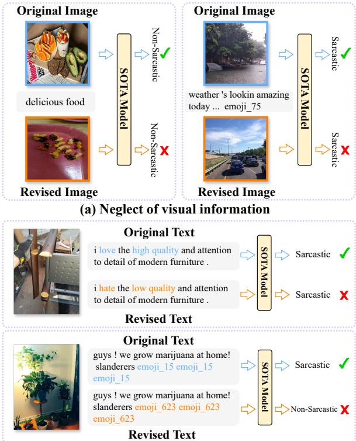
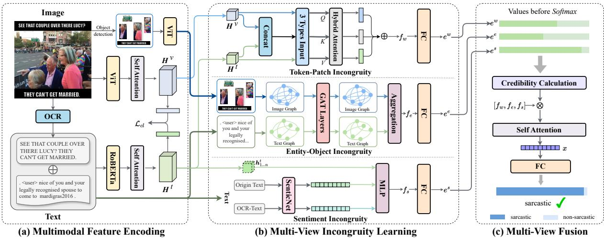
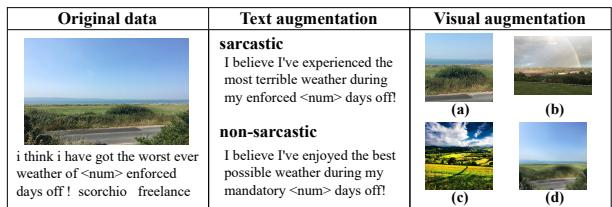
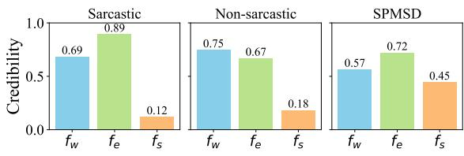
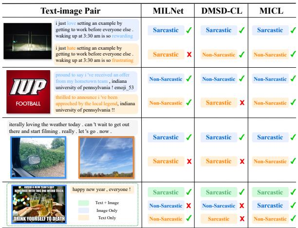
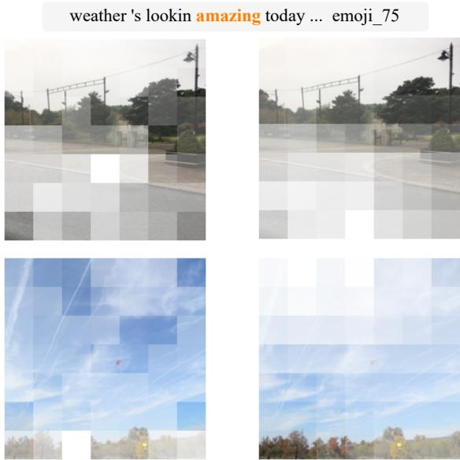
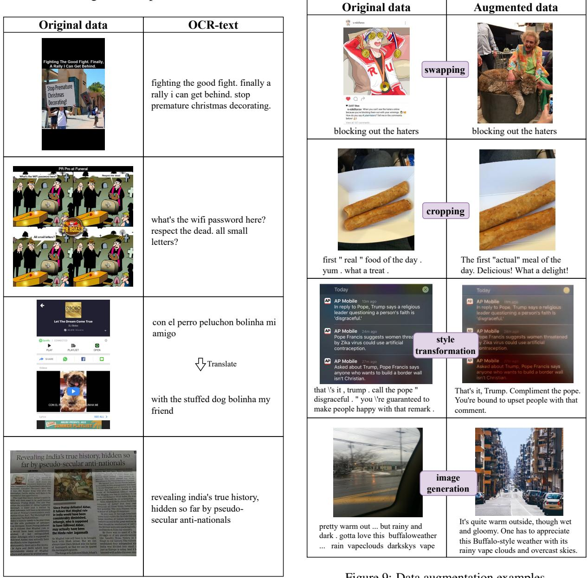

# Multi-View Incongruity Learning for Multimodal Sarcasm Detection

Diandian Guo1,2, Cong Cao1,\*, Fangfang Yuan1, Yanbing Liu1,2,\*, Guangjie Zeng3, Xiaoyan Yu4, Hao Peng3, Philip S. Yu5

1Institute of Information Engineering, Chinese Academy of Sciences 2School of Cyber Security, University of Chinese Academy of Sciences 3State Key Laboratory of Software Development Environment, Beihang University 4School of Computer Science and Technology, Beijing Institute of Technology 5Department of Computer Science, University of Illinois at Chicago {guodiandian, caocong, yuanfangfang, liuyanbing}@iie.ac.cn, {zengguangjie,penghao}@buaa.edu.cn,xiaoyan.yu@bit.edu.cn, psyu@uic.edu

## Abstract

Multimodal sarcasm detection (MSD) is essential for various downstream tasks. Existing MSD methods tend to rely on spurious correlations. These methods often mistakenly prioritize non-essential features yet still make correct predictions, demonstrating poor generalizability beyond training environments. Regarding this phenomenon, this paper undertakes several initiatives. Firstly, we identify two primary causes that lead to the reliance of spurious correlations. Secondly, we address these challenges by proposing a novel method that integrate Multimodal Incongruities via Contrastive Learning (MICL) for multimodal sarcasm detection. Specifically, we first leverage incongruity to drive multi-view learning from three views: token-patch, entity-object, and sentiment. Then, we introduce extensive data augmentation to mitigate the biased learning of the textual modality. Additionally, we construct a test set, SPMSD, which consists potential spu rious correlations to evaluate the the model’s generalizability. Experimental results demonstrate the superiority of MICL on benchmark datasets, along with the analyses showcasing MICL’s advancement in mitigating the effect of spurious correlation.

## 1 Introduction

Sarcasm, inherently metaphorical, seeks to convey meanings that diverge from literal interpretations. Its prevalence on social media platforms underscores the critical need for effective sarcasm detection, which is a tool pivotal for uncovering the genuine opinions and emotions of users. This capability supports essential applications such as public opinion mining (Cai et al., 2019; Prasanna et al., 2023) and sentiment analysis (Farias and Rosso, 2017; Khare et al., 2023).

Early attempts of sarcasm detection focus solely on textual modality (Davidov et al., 2010; Zhang et al., 2016; Xiong et al., 2019) , modeling the incongruities within the text. However, the proliferation of multimedia social platforms enables users to convey opinions and emotions using multimodal information. As a result, MSD has recently attracted widespread attention. Joshi et al. (2015) demonstrate the incongruity as a pivotal factor for detecting sarcasm, which sparks a surge of research into learning incongruity using textual and visual cues, achieving outstanding results (Wen et al., 2023; Qiao et al., 2023).

  
(b) Erroneous dependence on textual content  
Figure 1: Existing models suffer from two deficiencies that lead to spurious correlations on MSD task.

Despite these efforts, existing models still suffer from reliance on spurious correlations. Spurious correlation is a phenomenon where models learn non-generalizable features, rather than core features truly related to the real labels, thus undermining the model’s generalizability (Deng et al., 2024). We conduct experiments on the current SOTA model (Jia et al., 2024) and attribute the spurious correlations in MSD to two primary oversights: 1) Overemphasis on the text encoder while underestimating visual information. For example shown in Figure 1(a), changing the image does not affect the model’s result when the textual input remains the same, revealing a biased dependence on the textual modality. 2) Erroneously relying on non-critical textual features rather than critical emotional features. As the instance illustrated in Figure 1(b), changing key emotional words does not affect the model’s result. Conversely, the model makes an opposite judgment when non-critical descriptions that do not affect semantics are modified. In summary, the above findings reveal that existing models rely on spurious correlations, failing to capture the necessary task-related features.

To address the above issues, we introduce MICL, a novel multi-view incongruity learning method for MSD. This method is structured around three modules: multimodal feature encoding, multi-view incongruity learning, and multi-view fusion. Specifically, for multimodal feature encoding, in addition to the traditional textual and visual encoding, we introduce the OCR-texts for supplementary element to uncover the information contained within the image to a greater extend. Yang et al. (2024) demonstrate that multi-view learning can improve the effectiveness of models in social media. Considering that sarcastic content often involves an entity or object in a multimodal context and carries sentiment polarity, the multi-view incongruity learning module learns robust features from three aspects: token-patch, entity-object, and sentiment, to mitigate spurious correlations. However, the quality and importance of each view vary significantly across samples (Wu et al., 2022). Therefore, we propose using a beta distribution-based multi-view fusion module to perform confidenceweighted fusion of the learned embeddings, producing more reliable results. Furthermore, we extend beyond conventional text data augmentation techniques, which tend to perpetuate a bias towards textual information. Instead, MICL incorporates a dual augmentation strategy, enhancing both text and image data. Our contributions are as follows.

• We propose MICL, a novel multi-view learning method that comprehensively learns incongruities and integrates them credibly.

• We introduce robust data augmentation strategies that enriches both textual and visual contents, mitigating biased learning of the textual modality.

• Experimental results indicate that our approach outperforms existing methods on the MSD task and demonstrates stronger robustness against spurious correlations.

## 2 Related Work

## 2.1 Multimodal Sarcasm Detection

Multimodal sarcasm detection is a research task that identifies sarcasm through multimodal cues. Schifanella et al. (2016) first propose integrating textual features with visual features to solve the sarcasm detection task. Following this, Cai et al. (2019) construct an advanced MSD dataset based on tweets, providing a benchmark for subsequent research. InCrossMGs (Liang et al., 2021) is the first to model the interaction of information within and between modalities by graph neural networks. DMSD-CL (Jia et al., 2024) employs counterfactual augmentation and contrastive learning to study MSD in out-of-distribution scenarios. Recently, many works have dedicated efforts to model the incongruity in text-image pairs. For example, MIL-Net (Qiao et al., 2023) focuses on the combination of local incongruity and global incongruity. However, existing methods only focus on token-patch incongruity, which leads to erroneous reliance on non-critical features. Our model proposes to learn multi-view incongruity information to improve performance and enhance robustness.

## 2.2 Mitigating Spurious Correlations

Mitigating spurious correlations in multimodal scenarios has attracted increasing research interest. Existing methods for improving robustness against spurious correlations can be divided into two lines of research. One line focuses on effectively using multimodal information to enhance robustness (Yenamandra et al., 2023). Some methods use the distributed robust optimization (DRO) framework to dynamically increase the weight of minimizing the worst group loss (Wen and Li, 2021). Most recently, Kirichenko et al. (2023) propose methods that train a model using Empirical Risk Minimization (ERM) first and then only finetune the last layer on balanced data. Another line of research focuses on mitigating the bias in training data by creating additional data to balance the training dataset (Niu et al., 2021). Inspired by these methods, we comprehensively mitigate the reliance on spurious correlations in the MSD task from both the model and data perspectives.

  
Figure 2: The overall architecture of MICL primarily comprises three key modules: (a) Multimodal Feature Encoding, (b) Multi-View Incongruity Learning, and (c) Multi-View Fusion. Additionally, we introduce data augmentation for each training data.

## 3 Methodology

As shown in Figure 2, the architecture of MICL mainly consists of three parts: multimodal feature encoding, multi-view incongruity learning, and multi-view fusion. Additionally, to mitigate the modal bias problem from the data level, we introduce data augmentation for the training input.

## 3.1 Multimodal Feature Encoding

Given a text-image pair $\mathcal { X } = ( \mathcal { T } , \mathcal { V } )$ , we first need to perform feature encoding, which is divided into two steps: text encoding and image encoding.

## 3.1.1 Text Encoding

In current multimodal learning approaches, textual and visual information are commonly encoded independently. However, our observation reveals that a number of images contain textual information that frequently complements the textual modality. Building upon this observation, we incorporate optical character recognition text (OCR-text) O from images as an auxiliary input alongside the original text input T. However, the OCR-text provided by existing work (Pan et al., 2020) has issues with low accuracy and ambiguous meaning, as shown in the Figure 3. Low-quality OCR-text may reduce model performance (Wang et al., 2024). Instead, we generate refined OCR-texts employing GLM-4V1 (Wang et al., 2023) with more precision extraction and translation, complemented by meticulous manual proofreading. Then, we concatenate T and O, and feed them into the text encoder. As shown in Figure 2(a), we apply the pre-trained language model RoBERTa (Liu et al., 2019) as the text encoder:

$$
\begin{array} { r } { \pmb { H } ^ { t } = \mathrm { S e l f \_ A t t } ( \mathrm { R o B E R T a } ( \mathcal { T } \oplus \mathcal { O } ) ) , } \end{array}\tag{1}
$$

where ${ \pmb H } ^ { t } = [ { \pmb h } _ { c l s } ^ { t } , { \pmb h } _ { 1 } ^ { t } , { \pmb h } _ { 2 } ^ { t } , . . . , { \pmb h } _ { n } ^ { t } ] \in \mathbb { R } ^ { ( n + 1 ) \times d } \mathrm { \ i s }$ the textual representation of the input text, $h _ { i } ^ { t } \in \mathbb { R } ^ { d }$ denotes the hidden state vector of i-token, d denotes the dimension of the hidden representations, n is the total number of tokens after concatenating the original text and OCR-text, Self\_Att means a self-attention layer, and ⊕ refers to the concatenation operation. For clarity and simplification, we use $e _ { t } ^ { k }$ to represent $h _ { c l s } ^ { t }$ of the k-th sample in subsequent expressions.

<table><tr><td rowspan=1 colspan=2>Original data</td><td rowspan=1 colspan=1>OCR by Pan et al.</td><td rowspan=1 colspan=1>Ours</td></tr><tr><td rowspan=1 colspan=1>Idhar 4 din ki girlfrienddate pe ja rahi haiAur meri 2 saal ki dost khanebahana</td><td rowspan=1 colspan=1></td><td rowspan=1 colspan=1>idhar 4 din ki girlfrienddate pe a rahi hai aur meri2 saal ki dost khane leaane ko bahana maar rahi</td><td rowspan=1 colspan=1>here my girlfriend of 4days is going on a dateand my 2 year old friendkeeps making excuses tocome when asked</td></tr><tr><td rowspan=1 colspan=2>Sorry w?   Cart hearyoudNMM</td><td rowspan=1 colspan=1>o but its i&#x27;m going ) ionly 4: 50! to bedsorry what can&#x27;t hearyou cc nothing suspicio. us</td><td rowspan=1 colspan=1>i&#x27;m going to bed. but it&#x27;sonly 4:30! sorry what?can&#x27;t hear you!</td></tr></table>

Figure 3: In the first example, since the text is in Hindi, it is difficult for a non-multilingual pre-trained RoBERTa to understand. Our method automatically translates the extracted text into English. In the second example, existing OCR result exhibits deficiencies in both recognition accuracy and sequential integrity, whereas our result performs better.

## 3.1.2 Image Encoding

We use a pre-trained ViT (Dosovitskiy et al., 2020) as the image encoder. For each image V = $\{ v _ { c l s } , v _ { 1 } , . . . , v _ { n _ { \mathcal { V } } } \}$ , where $v _ { c l s }$ means the [CLS] token, $v _ { i }$ represents the i-patch of V, and nV is the total patch number. We feed V into ViT:

$$
\pmb { H } ^ { v } = \mathrm { S e l f \_ A t t } ( \mathrm { V i T } ( \mathcal { V } ) ) ,\tag{2}
$$

where $\pmb { H } ^ { v } = [ \pmb { h } _ { c l s } ^ { v } , \pmb { h } _ { 1 } ^ { v } , \pmb { h } _ { 2 } ^ { v } , . . . , \pmb { h } _ { n v } ^ { v } ] \in \mathbb { R } ^ { ( n _ { \mathcal { V } } + 1 ) : }$ ×d is the visual representation of the input image, $\pmb { h } _ { i } ^ { v } \in$ $\mathbb { R } ^ { d }$ represents the i-th patch embedding. For clarity and simplification, we use $e _ { v } ^ { k }$ to represent $h _ { c l \varepsilon } ^ { v }$ of the k-th sample in subsequent expressions.

## 3.2 Multi-View Incongruity Learning

For the MSD task, cross-modal incongruity learning predominantly focuses on the token-patch levels. However, sarcastic contents are often closely related to specific entities or objects in multimodal contexts. Furthermore, sarcastic contents typically involve strong emotions that existing models overlook. To achieve a more comprehensive incongruity learning, we further incorporate incongruity learning from the entity-object and the explicit sentiment perspectives as shown in Figure 2(b).

## 3.2.1 Token-patch Incongruity Learning

A cross-attention mechanism is commonly used for modeling cross-modal interactions. Existing methods (Qiao et al., 2023; Jia et al., 2024) often use text as the query and images as the key and value, which may lead to modality bias. Instead, we design a hybrid attention interaction mechanism for unbiased token-patch incongruity learning, which can integrate text and image features in a balanced manner. Based on the input differences of the multi-head attention layer, it can be divided into the following parts:

$$
Q _ { t v } = K _ { t v } = V _ { t v } = H ^ { t v } ,\tag{3}
$$

$$
Q _ { t } = H ^ { t } , K _ { t } = V _ { t } = H ^ { v } \ ,\tag{4}
$$

$$
Q _ { v } = H ^ { v } , K _ { v } = V _ { v } = H ^ { t } ,\tag{5}
$$

where $\pmb { H } ^ { t v } = \pmb { H } ^ { t } \oplus \pmb { H } ^ { v }$ . Then, we feed different inputs into a standard cross-attention layer:

$$
\pmb { F } = \mathrm { C r o s s \_ a t t } ( \pmb { Q } , \pmb { K } , \pmb { V } ) .\tag{6}
$$

We define $\mathbf { } F _ { t v } , F _ { t }$ and $\pmb { F } _ { v }$ as the outputs of the attention mechanisms from the input Eq. (3), (4) and (5), respectively. For $\mathbf { } F _ { t v } , \mathbf { } F _ { t }$ and $\pmb { F } _ { v } ,$ we treat the encoding of their [CLS] tokens, $\mathbf { \nabla } f _ { t v } , f _ { t }$ and $\pmb { f } _ { v } ,$ as the final output:

$$
\pmb { f } _ { w } = \pmb { f } _ { t v } \oplus \pmb { f } _ { t } \oplus \pmb { f } _ { v } ~ .\tag{7}
$$

## 3.2.2 Entity-object Incongruity Learning

To effectively capture entity-object incongruity, we construct semantic graphs for both text and images. Specifically, for the text semantic graph, we treat entities as nodes and use $\operatorname { s p a C y } ^ { 2 }$ to extract dependencies between entities as edges. If there is a dependency between two entites, an edge will be created between them in the text graph. For the visual semantic graph, we follow Anderson et al. (2018) to segment the image into object regions. We treat each region as a node, and create edges based on cosine similarity. Additionally, both graphs are undirected and contain self-loops.

Then, we model the graphs with Graph Attention Network (GAT) (Velickoviˇ c et al.´ , 2018). Taking the textual graph as an example, let $\alpha _ { i , j } ^ { l }$ be the attention score between i and j, and $\mathbf { \pmb { g } } _ { i } ^ { l }$ denote the feature of node i in the l-th layer. We have:

$$
\alpha _ { i , j } ^ { l } = \frac { \exp { \left( L R \left( { \bf u } _ { l } ^ { \top } [ W _ { l } { \bf g } _ { i } ^ { l } ] \vert W _ { l } { \bf g } _ { j } ^ { l } ] \right) \right)}  } { \sum _ { k } \exp { \left( L R \left( { \bf u } _ { l } ^ { \top } [ W _ { l } { \bf g } _ { i } ^ { l } \vert \vert W _ { l } { \bf g } _ { k } ^ { l } ] \right) \right) } } ,\tag{8}
$$

$$
g _ { i } ^ { l + 1 } = \alpha _ { i , i } ^ { l } W _ { l } g _ { i } ^ { l } + \sum _ { j \in \mathcal { N } ( i ) } \alpha _ { i , j } W _ { l } g _ { j } ^ { l } ,\tag{9}
$$

where $k \in \mathcal { N } ( i ) \cup i$ belongs to the neighbor nodes of i and i itself. LR denotes the LeakyReLU layer. $W _ { l } \in \mathbb { R } ^ { d \times d }$ and ${ \mathbf { } } { \mathbf { } } { \mathbf { } } { \mathbf { } } ^ { } { \mathbf { } } { \mathbf { } } ^ { } { \mathbf { } } { \mathbf { } } ^ { } { \mathbf { } } { \mathbf { } } ^ { } { \mathbf { } } { \mathbf { } } ^ { } { \mathbf { } } { \mathbf { } } ^ { } { \mathbf { } } { \mathbf { } } ^ { } { \mathbf { } } { \mathbf { } } ^ { } { \mathbf { } } { \mathbf { } } ^ { } { \mathbf { } } { \mathbf { } } ^ { } { \mathbf { } } { \mathbf { } } ^ { } { \mathbf { } } { \mathbf { } } ^ { } { \mathbf { } } { \mathbf { } } ^ { } { \mathbf { } } { \mathbf { } } ^ { } { \mathbf { } } { \mathbf { } } ^ { } { \mathbf { } } { \mathbf { } } ^ { } { \mathbf { } } { \mathbf { } } ^ { } { \mathbf { } } { \mathbf { } } ^ { } { \mathbf { } } { \mathbf { } } ^ { } { \mathbf { } } { \mathbf { } } ^ { } { \mathbf { } } { \mathbf { } } ^ { } { \mathbf { } } { \mathbf { } } ^ { } { \mathbf { } } { \mathbf { } } ^ { } { \mathbf } { } { \mathbf } { } ^ { } { \mathbf } { } { \mathbf } { } ^ { } { \mathbf } { } { \mathbf } { } ^ { } { \mathbf } { } { \mathbf } { } ^ { } { \mathbf } { } { \mathbf } { } { \mathbf } ^ { } { } \mathbf { } { } \mathbf { } { } \mathbf { } { } \mathbf { } ^ { } \mathbf { } { } \mathbf { } { } \mathbf { } \mathbf { } { } \mathbf { } \mathbf { } { } \mathbf { } \mathbf { } \mathbf { } \mathbf { } { } \mathbf { } \mathbf { } \mathbf { } \mathbf { } \mathbf { } \mathbf { } \mathbf { } \mathbf { } \mathbf { } \mathbf { } \mathbf { } \mathbf { } \mathbf { } \mathbf { } \mathbf { } \mathbf { } \mathbf { } \mathbf { } \mathbf \mathbf { } \mathbf { } \mathbf { } \mathbf { } \mathbf \mathbf { } \mathbf { } \mathbf \mathbf { } \mathbf { } \mathbf \mathbf $ are learnable parameters of the l-th textual GAT layer. We initialize $\mathbf { \mathbf { } } g _ { i } ^ { 0 } = \boldsymbol { h } _ { i } ^ { t }$

We denote the final textual representation as ${ \cal G } ^ { T } = \{ \substack { { \bf g } _ { 0 } , . . . , { \bf g } _ { n } } \}$ . Similarly, we can obtain $G ^ { V }$ We define $\pmb { G } = \pmb { G } ^ { T } \oplus \pmb { G } ^ { V }$ , then we can learn the entity-object incongruity:

$$
\pmb { f } _ { e } = \frac { 1 } { | \pmb { G } | } \sum _ { \pmb { g } _ { i } \in \pmb { G } } \mathrm { S o f t m a x } \left( \pmb { g } _ { i } \pmb { W } _ { g } + b _ { g } \right) \pmb { g } _ { i } ,\tag{10}
$$

where $W _ { g }$ and $b _ { g }$ are learnable parameters.

## 3.2.3 Sentiment Incongruity Learning

Given the pivotal role of emotional context in MSD (Joshi et al., 2015), our model integrates sentiment analysis to discern incongruity in the original text and OCR-text. Specifically, we extract the sentiment polarity of the source text and OCR-text through SenticNet (Cambria et al., 2024):

$$
\begin{array} { r } { \pmb { s } _ { t } = \mathrm { S e n t i c N e t } ( \pmb { \mathcal { T } } ) , \ \pmb { s } _ { o } = \mathrm { S e n t i c N e t } ( \pmb { \mathcal { O } } ) , } \end{array}\tag{11}
$$

$$
\begin{array} { r } { \pmb { f } _ { s } = \mathrm { M L P } ( \pmb { s } _ { t } \oplus \pmb { s } _ { o } \oplus \pmb { h } _ { 1 \dots n } ^ { t } ) , } \end{array}\tag{12}
$$

where MLP is a muti-layer perceptron. If OCRtext is unavailable, $f _ { s }$ is assigned a value of 0.

  
Figure 4: Summary of text and visual augmentation methods. Text augmentation generates samples with the same or opposite labels. Visual augmentation methods include: (a) cropping, (b) swapping images, (c) image generation, and (d) image style transfer.

## 3.3 Multi-View Fusion

As shown in Figure 2(c), the credibility of the three incongruity features varies across different MSD scenarios. Measuring the confidence of different features helps improve detection performance. TMC (Han et al., 2021) has proved that the Dirichlet distribution can effectively estimate the credibility of a single view. In binary classification scenario, the Beta distribution shares the same mathematical significance. Following Ma et al. (2024), we use the output before the softmax operation of the m-th view classifier as evidence $e ^ { m }$ , then the credibility $c ^ { m }$ can be expressed as:

$$
c ^ { m } = \frac { e _ { 0 } ^ { m } + e _ { 1 } ^ { m } } { S _ { m } } = \frac { e _ { 0 } ^ { m } + e _ { 1 } ^ { m } } { \left( e _ { 0 } ^ { m } + 1 \right) + \left( e _ { 1 } ^ { m } + 1 \right) } ,\tag{13}
$$

where $e _ { r } ^ { m }$ represents the output of the final layer of the classifier for the m-th view regarding the r-th classification result. In binary classification tasks, $r \in \{ 0 , 1 \}$ . The derivation process can be found in the Appendix B.

After obtaining the credibility, we use a selfattention network to obtain the fusion feature:

$$
\begin{array} { r } { \pmb { x } = \mathrm { S e l f } \_ \mathrm { A t t } ( [ \pmb { f } _ { w } , \pmb { f } _ { e } , \pmb { f } _ { s } ] \cdot [ c ^ { w } , c ^ { e } , c ^ { s } ] ^ { \top } ) . } \end{array}\tag{14}
$$

## 3.4 Data Augmentation and Contrastive Learning

## 3.4.1 Data Augmentation

Images serve as a vital source of incongruity clues, which is essential for comprehensive sarcasm analysis. However, previous MSD methods (Pan et al., 2020; Jia et al., 2024) focus on enhancing textual content and overlook the importance of image data augmentation. This inadequate data augmentation fails to enhance model performance and may even impede the performance (Wang et al., 2024). To address this issue, we adopt augmentation involving both textual and visual data, ensuring a balanced and effective enhancement.

As shown in Figure 4, for text augmentation, we employ two strategies: 1) Replacing key entities or reversing sentiment words to obtain samples with opposite labels; 2) Paraphrasing the original samples to keep the meaning unchanged, obtaining samples with the same labels. Text augmentation is performed by $\mathrm { C h a t G P T } ^ { 3 }$ . We apply the above strategies at a 1:1 ratio to generate augmented texts for all training samples.

For image augmentation, we use four strategies: 1) Randomly cropping images and resizing them to 224×224; 2) Randomly swapping images of samples with the same label; 3) Employing stable diffusion for image style transfer; 4) Prompting GLM-4V to generate image titles, and then using stable diffusion to generate new images based on those titles. We apply these four strategies at a 3:3:2:2 ratio to generate augmented images for all training samples.

## 3.4.2 Contrastive Learning Framework

For the generated sample $\tilde { \mathcal { X } } ~ = ~ ( \tilde { \mathcal { T } } , \tilde { V } )$ , we input $\{ \mathcal { X } , \tilde { \mathcal { X } } \}$ into the training process together. We construct a contrastive learning framework based on whether the labels are the same to determine the positive and negative examples. Specifically, within a batch, samples with the same label as the anchor sample are considered positive samples, forming the positive sample set $S _ { P } ;$ otherwise, they belong to the negative sample set $S _ { N }$ . We define the sample set in one batch as $S = S _ { P } + S _ { N }$ . In our entire model framework, the key is modeling the incongruity between text and image. Therefore, when constructing the contrastive learning framework, we use the text-image matching approach to obtain scores for positive and negative examples.

For k-th sample in the training set, t → v contrastive loss is:

$$
\begin{array} { r } { \mathcal { L } _ { k } ^ { t  v } = \frac { 1 } { S _ { P } } \sum _ { i \in | S _ { P } | } - \log \frac { \exp { ( \cos ( e _ { t } ^ { k } , e _ { v } ^ { i } ) / \tau ) } } { \sum _ { j \in S } \exp { ( \cos ( e _ { t } ^ { k } , e _ { v } ^ { j } ) / \tau ) } } , } \end{array}\tag{15}
$$

where $\tau \in \mathbb { R } ^ { + }$ is the temperature parameter. Similarly, we can obtain $v  t$ contrastive loss $\mathcal { L } _ { k } ^ { v  t }$ The overall contrastive loss is as follows:

$$
\mathcal { L } _ { c l } = \frac { 1 } { N } \sum _ { k = 1 } ^ { N } \bigg ( \frac { 1 } { 2 } \mathcal { L } _ { k } ^ { t  v } + \frac { 1 } { 2 } \mathcal { L } _ { k } ^ { v  t } \bigg ) ,\tag{16}
$$

where N is the total number of samples in the training set.

<table><tr><td rowspan="2">Modality</td><td rowspan="2">Method</td><td rowspan="2">Acc.(%)</td><td colspan="3">Binary-Average</td><td colspan="3">Macro-Average</td></tr><tr><td>Pre.(%)</td><td>Rec.(%)</td><td>F1(%)</td><td>Pre.(%)</td><td>Rec.(%)</td><td>F1(%)</td></tr><tr><td rowspan="4">Text</td><td>TextCNN</td><td>80.03</td><td>74.29</td><td>76.39</td><td>75.32</td><td>78.03</td><td>78.28</td><td>78.15</td></tr><tr><td>Bi-LSTM</td><td>81.90</td><td>76.66</td><td>78.42</td><td>77.53</td><td>80.97</td><td>80.13</td><td>80.55</td></tr><tr><td>BERT</td><td>83.85</td><td>78.72</td><td>82.27</td><td>80.22</td><td>81.31</td><td>80.87</td><td>81.09</td></tr><tr><td>RoBERTa</td><td>85.51</td><td>78.24</td><td>88.11</td><td>82.88</td><td>84.83</td><td>85.95</td><td>85.16</td></tr><tr><td rowspan="2">Image</td><td>Image</td><td>64.76</td><td>54.41</td><td>70.80</td><td>61.53</td><td>60.12</td><td>73.08</td><td>65.97</td></tr><tr><td>ViT</td><td>67.83</td><td>57.93</td><td>70.07</td><td>63.43</td><td>65.68</td><td>71.35</td><td>68.40</td></tr><tr><td rowspan="10">Text+Image</td><td>HFM</td><td>83.44</td><td>76.57</td><td>84.15</td><td>80.18</td><td>79.40</td><td>82.45</td><td>80.90</td></tr><tr><td>D&amp;RNet</td><td>84.02</td><td>77.97</td><td>83.42</td><td>80.60</td><td></td><td></td><td></td></tr><tr><td>Res-BERT</td><td>84.80</td><td>77.80</td><td>84.15</td><td>80.85</td><td>78.87</td><td>84.46</td><td>81.57</td></tr><tr><td>Att-BERT</td><td>86.05</td><td>78.63</td><td>83.31</td><td>80.90</td><td>80.87</td><td>85.08</td><td>82.92</td></tr><tr><td>CMGCN</td><td>87.55</td><td>83.63</td><td>84.69</td><td>84.16</td><td>87.02</td><td>86.97</td><td>87.00</td></tr><tr><td>Multi-View CLIP</td><td>88.33</td><td>82.66</td><td>88.65</td><td>85.55</td><td></td><td></td><td></td></tr><tr><td>MILNet</td><td>89.50</td><td>85.16</td><td>89.16</td><td>87.11</td><td>88.88</td><td>89.44</td><td>89.12</td></tr><tr><td>DMSD-CL</td><td>88.95</td><td>84.89</td><td>87.90</td><td>86.37</td><td>88.35</td><td>88.77</td><td>88.54</td></tr><tr><td>G²SAM*</td><td>91.07</td><td>88.27</td><td>90.09</td><td>89.17</td><td>90.67</td><td>90.92</td><td>90.78</td></tr><tr><td>MICL (ours)</td><td>92.08</td><td>90.05</td><td>90.61</td><td>90.33</td><td>91.85</td><td>91.77</td><td>91.81</td></tr></table>

Table 1: Main results on MMSD dataset for sarcasm detection. We use ∗ indicates the reproduced results by using RoBERTa as the textual backbone.

## 3.5 Training and Inference

We obtain the final results based on the fused features:

$$
\hat { \boldsymbol { y } } = \mathbf { W } \mathbf { x } + \boldsymbol { b } ,\tag{17}
$$

where W and b are learnable parameters. The binary cross-entropy loss is calculated as:

$$
\mathcal { L } _ { c e } = - ( y \log ( \hat { y } ) + ( 1 - y ) \log ( 1 - \hat { y } ) ) .\tag{18}
$$

The final loss function for MICL is defined as the combination of the contrastive learning loss in Eq. (16) and the cross-entropy loss in Eq. (18):

$$
\begin{array} { r } { \mathcal { L } = \mathcal { L } _ { c e } + \lambda \mathcal { L } _ { c l } , } \end{array}\tag{19}
$$

where λ is hyperparameter.

## 4 Experiments

## 4.1 Datasets and Metrics

Our experiments are conducted on the public Multimodal Sarcasm Detection Dataset (MMSD) (Cai et al., 2019). Each entry in this dataset is a textimage pair, categorized into either sarcastic or nonsarcastic examples based on the specific hashtags. The dataset is divided into a training set, a validating set, and a test set, which includes 19,816, 2,410, and 2,409 samples, respectively. Following previous works (Jia et al., 2024), we report the accuracy, precision, recall, F1-score, and macro-average results to measure the model performance.

To further investigate the models’ capability to generalize and their susceptibility to spurious correlations, we meticulously design a small test set, SPMSD. It is refined and expanded from the MMSD dataset, comprising a total of 1,000 samples, including 573 sarcastic items and 427 nonsarcastic items. Detailed information of this dataset can be found in the Appendix A.

## 4.2 Baseline Models

We compare our proposed model MICL with several baselines, which can be broadly categorized into two groups:

Unimodal Baselines. These methods simply take textual or visual information as input, including: TextCNN (Kim, 2014), Bi-LSTM (Graves and Schmidhuber, 2005), BERT (Devlin et al., 2019) and RoBERTa (Liu et al., 2019) for textual, Image (Cai et al., 2019) and ViT (Dosovitskiy et al., 2020) for visual.

Multimodal Baselines. These methods exploit both visual and textual information as input, including: HFM (Cai et al., 2019), D&RNet (Xu et al., 2020), Res-BERT (Pan et al., 2020), Att-BERT (Pan et al., 2020), CMGCN (Liang et al., 2022), Multi-View CLIP (Qin et al., 2023), MIL-Net (Qiao et al., 2023), DMSD-CL (Jia et al., 2024) and G2SAM (Wei et al., 2024).

<table><tr><td rowspan="2">Method</td><td rowspan="2">Acc.</td><td colspan="3">Binary-Average</td><td colspan="3">Macro-Average</td></tr><tr><td>P.</td><td>R.</td><td>F1</td><td>P.</td><td>R.</td><td>F1</td></tr><tr><td>BERT</td><td>55.50</td><td>66.41</td><td>45.20</td><td>53.79</td><td>57.47</td><td>57.26</td><td>55.44</td></tr><tr><td>RoBERTa</td><td>51.30</td><td>60.84</td><td>22.33</td><td>32.66</td><td>65.29</td><td>22.33</td><td>33.28</td></tr><tr><td>ResNet</td><td>52.30</td><td>59.75</td><td>51.30</td><td>55.21</td><td>52.42</td><td>52.47</td><td>52.10</td></tr><tr><td>ViT</td><td>53.60</td><td>60.42</td><td>55.14</td><td>57.66</td><td>53.27</td><td>53.33</td><td>53.17</td></tr><tr><td>Res-BERT</td><td>58.10</td><td>66.17</td><td>54.97</td><td>60.05</td><td>58.47</td><td>58.63</td><td>57.99</td></tr><tr><td>Att-BERT</td><td>58.30</td><td>67.56</td><td>52.35</td><td>58.99</td><td>59.23</td><td>59.31</td><td>58.29</td></tr><tr><td>MILNet</td><td>56.20</td><td>66.83</td><td>46.42</td><td>54.79</td><td>57.96</td><td>57.79</td><td>56.10</td></tr><tr><td>DMSD-CL</td><td>60.60</td><td>64.09</td><td>71.02</td><td>67.38</td><td>59.30</td><td>58.81</td><td>58.82</td></tr><tr><td>MICL</td><td>68.70</td><td>70.70</td><td>77.48</td><td>73.94</td><td>68.01</td><td>67.20</td><td>67.38</td></tr></table>

Table 2: Comparison results on SPMSD dataset (%).

## 4.3 Main Results

The main results are shown in Table 1. Our analysis yields the following insights: 1) The proposed MICL emerges as the most effective model, outperforming all baseline models. It records improvements ranging from 2.71% to 5.16% over the latest DMSD-CL model across various metrics and consistently surpasses the state-of-the-art model $\mathbf { G } ^ { 2 } \mathbf { S } \mathbf { A } \mathbf { M }$ in all metrics. 2) Text-based models demonstrate superior performance over imagebased models, with the RoBERTa model achieving an accuracy of 85.51%, compared to only 67.83% by the ViT model. This indicates that text carries a higher information density than images in the multimodal sarcasm detection task. The substantial disparity in performance causes multimodal models to rely excessively on textual data, potentially compromising their ability to generalize. These insights underscore MICL’s proficiency in leveraging multimodal data to achieve exceptional results in the multimodal sarcasm detection task.

## 4.4 Analysis on SPMSD

We design a comparative experiment on the spurious correlation test set SPMSD, as shown in Table 2. The analysis reveals that, unlike the main experimental results with high recall, most baseline models exhibit lower recall compared to precision. This discrepancy in performance metrics highlights the significant impact of varying data distributions on the decision-making processes of existing models, tentatively affirming the presence of the spurious correlation issue. Notably, the proposed MICL significantly outperforms all baselines, achieving a 68.7% accuracy rate. Specifically, against DMSD-CL, MICL displays a more significant 6.46% to 8.71% improvement across various metrics, which is more significant than that on MMSD. These results demonstrate that MICL can effectively mitigate reliance on spurious correlations, showing better generalization ability on new data.

<table><tr><td rowspan="3">Base</td><td rowspan="3"></td><td rowspan="3">fw fe fs</td><td rowspan="3">C</td><td colspan="2">MMSD</td><td colspan="2">SPMSD</td></tr><tr><td>Acc.(%)</td><td>F1(%)</td><td>Acc.(%)</td><td>F1(%)</td></tr><tr><td>√</td><td></td><td></td><td></td><td>88.54</td><td>85.73</td><td>61.60</td><td>63.77</td></tr><tr><td>√</td><td>√</td><td></td><td></td><td>89.97</td><td>87.20</td><td>62.80</td><td>65.46</td></tr><tr><td>√</td><td>√</td><td>√</td><td></td><td>91.32</td><td>89.33</td><td>63.70</td><td>65.79</td></tr><tr><td>√</td><td>√</td><td></td><td>√</td><td>90.77</td><td>88.84</td><td>66.10</td><td>69.29</td></tr><tr><td>√</td><td>√</td><td>√</td><td>√</td><td>91.45</td><td>89.51</td><td>67.90</td><td>71.23</td></tr><tr><td>√</td><td>√</td><td>√</td><td>√</td><td>92.08</td><td>90.33</td><td>68.70</td><td>73.94</td></tr></table>

Table 3: Experiment results of ablation study.
<table><tr><td>Method</td><td>MMSD</td><td>SPMSD</td><td>Method</td><td>MMSD</td><td>SPMSD</td></tr><tr><td>MILNet*</td><td>89.54</td><td>56.70</td><td>MILNet</td><td>89.50</td><td>56.20</td></tr><tr><td>+ OCR&#x27;</td><td>89.50</td><td>56.20</td><td> $+ \ a u g ^ { \prime }$ </td><td>89.41</td><td>59.00</td></tr><tr><td>+ ours</td><td>89.66</td><td>57.80</td><td>+ ours</td><td>89.58</td><td>65.40</td></tr><tr><td>DMSD-CL</td><td>88.95</td><td>60.60</td><td>DMSD-CL*</td><td>89.08</td><td>57.20</td></tr><tr><td>+ OCR&#x27;</td><td>88.62</td><td>59.10</td><td>+ aug&#x27;</td><td>88.95</td><td>60.60</td></tr><tr><td>+ ours</td><td>89.04</td><td>60.90</td><td>+ ours</td><td>89.29</td><td>65.30</td></tr><tr><td>MICL</td><td>91.40</td><td>67.40</td><td>MICL</td><td>91.91</td><td>56.90</td></tr><tr><td>+ OCR&#x27;</td><td>90.27</td><td>64.80</td><td>+ aug&#x27;</td><td>91.07</td><td>59.20</td></tr><tr><td>+ ours</td><td>92.08</td><td>68.70</td><td>+ ours</td><td>92.08</td><td>68.70</td></tr></table>

Table 4: Results of using different extra data (Acc %). ∗ MILNet removes the OCR module, DMSD-CL removes the data augmentation module.

## 4.5 Ablation Study

Analysis of components. To probe the effectiveness of each component in MICL, we conduct ablation experiments. The experimental results are shown in Table 3, where Base represents the direct concatenation of $\pmb { H } _ { v }$ and $\pmb { H } _ { t }$ for prediction. $\scriptstyle f _ { w } ,$ $f _ { e } ,$ , and $f _ { s }$ correspond to the token-patch, entityobject, and sentiment incongruity learning modules, respectively. c represents multi-view fusion using credibility. According to the results, we have the following findings: 1) All incongruity learning modules can improve performance compared to the base model. 2) $f _ { s }$ effectively improves the model’s performance on the SPMSD dataset, reducing erroneous dependence on the text. 3) $f _ { e }$ significantly improves performance on the MMSD dataset, proving that entity-object incongruity is crucial in the MSD task. 4) c can effectively integrate features from different views and improve performance.

Analysis of extra data. From a data perspective, we conduct another set of ablation experiments to validate the efficacy of our OCR-text and data augmentation. The results are shown in Tables 4, where ours refer to the OCR-text and data augmentation proposed in this paper, OCR’ represents the OCR-text extracted by Pan et al. (2020), and aug’ refers to the data augmentation of DMSD-CL. The analysis yields several key insights: 1) Additional data does not necessarily enhance model performance. In some instances, it may even impair the model’s effectiveness due to distributional differences from the original data. For example, MILNet+aug’ slightly improves performance on the SPMSD dataset but causes a decrease on the MMSD dataset. 2) Our OCR-text can enhance the models’ performance. All methods show better results on both benchmark datasets. 3) Our novel data augmentation approach improves model robustness in spurious correlation scenarios without compromising the baseline performance. These findings collectively affirm the effectiveness of the OCR-text and data augmentation devised in our study.

  
Figure 5: Credibility study.

## 4.6 Credibility Study

To investigate the credibility of incongruity features from different perspectives in various scenarios, we conduct a credibility study, with the results shown in Figure 5. We divide the study into three scenarios: the sarcastic and non-sarcastic scenarios of the MMSD dataset, and the SPMSD scenario. We calculate and display the average credibility of each feature. The experimental results show that entity-object incongruity exhibits high credibility for sarcastic samples, indicating that this view is effective in capturing sarcastic entity information. Conversely, traditional token-patch incongruity effectively detects non-sarcastic samples. Moreover, sentiment incongruity is beneficial in reducing the model’s dependence on spurious correlations. In addition, the credibility of each view is relatively balanced on SPMSD. Therefore, the components of our multi-view incongruity learning method complement each other across different scenarios, demonstrating effective mitigation of spurious correlation issues.

## 4.7 Case Study

To provide an intuitive comprehension of MICL on spuriously correlated samples, we design a case study. Based on empirical summaries, we present four types of spuriously correlated samples and compare the results of MILNet, DMSD-CL and MICL, as shown in Figure 6. In case 1, the focus is mainly on the particular emotional words in the text. Case 2 investigates the impact of modifying noncritical information. Case 3 examines whether models can handle situations where the image and text are congruent. Case 4 examines whether models can correctly handle unimodal inputs. The results show that MILNet struggles with most spurious correlation scenarios (case 1, 3, and 4), showing obvious over-focusing on the text modality. DMSD-CL can handle scenarios involving emotive words (case 1), but it also has modality learning bias (case 3 and 4). In addition, DMSD-CL makes mistakes in learning key textual content (case 2). Therefore, the problem of spurious correlations strongly affects the model’s generalizability. Meanwhile, the proposed MICL, through data augmentation and multi-view incongruity learning, can detect sarcasm properly in various scenarios, emphasizing its generalizability and superiority in MSD.

  
Figure 6: Case studies on spuriously correlated samples.

## 5 Conclusion

In this paper, we introduce MICL, an innovative approach that leverages contrastive learning to learn multi-view incongruities. This method is designed to counteract the prevalent issue of spurious correlations observed in current MSD models. Furthermore, we tackle the challenge of models’ excessive dependence on textual data by integrating a comprehensive text-image data augmentation scheme. To empirically highlight the problem of spurious correlations, we introduce a test set, SPMSD, built upon the foundational MMSD dataset. Experimental results show that MICL not only achieves stateof-the-art performance on the MSD task but also effectively mitigates spurious correlations.

## 6 Limitation

Although MICL can reduce the dependence on spurious correlations, it achieves only a 68% accuracy rate on the SPMSD dataset, indicating still substantial scope for further enhancement. Our empirical experiments and existing literature (Wang et al., 2024) show that some spurious correlations can improve model performance, which is a point not discussed in this paper. Additionally, MICL’s complexity, particularly with integrating hybrid attention and graph attention networks, may pose challenges in scalability and efficiency.

## Acknowledgments

This research was supported by the National Key R&D Program of China (No. 2023YFC3303800). Hao Peng was supported by NSFC through grant 62322202. Prof. Philip S. Yu was supported in part by NSF under grants III-2106758, and POSE-2346158.

## References

Peter Anderson, Xiaodong He, Chris Buehler, Damien Teney, Mark Johnson, Stephen Gould, and Lei Zhang. 2018. Bottom-up and top-down attention for image captioning and visual question answering. In Proceedings ofthe IEEE conference on computer vision and pattern recognition, pages 6077–6086.

Yitao Cai, Huiyu Cai, and Xiaojun Wan. 2019. Multimodal sarcasm detection in twitter with hierarchical fusion model. In Proceedings of the 57th annual meeting ofthe associationfor computational linguistics, pages 2506–2515.

Erik Cambria, Xulang Zhang, Rui Mao, Melvin Chen, and Kenneth Kwok. 2024. Senticnet 8: Fusing emotion ai and commonsense ai for interpretable, trustworthy, and explainable affective computing. In International Conference on Human-Computer Interaction (HCII).

Dmitry Davidov, Oren Tsur, and Ari Rappoport. 2010. Semi-supervised recognition of sarcasm in twitter and amazon. In Proceedings of the fourteenth conference on computational natural language learning, pages 107–116.

Yihe Deng, Yu Yang, Baharan Mirzasoleiman, and Quanquan Gu. 2024. Robust learning with progressive data expansion against spurious correlation. Advances in Neural Information Processing Systems, 36.

Jacob Devlin, Ming-Wei Chang, Kenton Lee, and Kristina Toutanova. 2019. Bert: Pre-training of deep bidirectional transformers for language understanding. In Proceedings of the 2019 Conference of the

North American Chapter ofthe Associationfor Computational Linguistics: Human Language Technologies, Volume 1 (Long and Short Papers), pages 4171– 4186.

Alexey Dosovitskiy, Lucas Beyer, Alexander Kolesnikov, Dirk Weissenborn, Xiaohua Zhai, Thomas Unterthiner, Mostafa Dehghani, Matthias Minderer, Georg Heigold, Sylvain Gelly, et al. 2020. An image is worth 16x16 words: Transformers for image recognition at scale. In International Conference on Learning Representations.

DI Hernández Farias and Paolo Rosso. 2017. Irony, sarcasm, and sentiment analysis. In Sentiment Analysis in Social Networks, pages 113–128. Elsevier.

Alex Graves and Jürgen Schmidhuber. 2005. Framewise phoneme classification with bidirectional lstm and other neural network architectures. Neural networks, 18(5-6):602–610.

Zongbo Han, Changqing Zhang, Huazhu Fu, and Joey Tianyi Zhou. 2021. Trusted multi-view classification. In International Conference on Learning Representations.

Mengzhao Jia, Can Xie, and Liqiang Jing. 2024. Debiasing multimodal sarcasm detection with contrastive learning. In Proceedings of the AAAI Conference on Artificial Intelligence, volume 38, pages 18354– 18362.

Aditya Joshi, Vinita Sharma, and Pushpak Bhattacharyya. 2015. Harnessing context incongruity for sarcasm detection. In Proceedings of the 53rd Annual Meeting ofthe Associationfor Computational Linguistics and the 7th International Joint Conference on Natural Language Processing (Volume 2: Short Papers), pages 757–762.

Arpit Khare, Amisha Gangwar, Sudhakar Singh, and Shiv Prakash. 2023. Sentiment analysis and sarcasm detection in indian general election tweets. In Research Advances in Intelligent Computing, pages 253– 268. CRC Press.

Yoon Kim. 2014. Convolutional neural networks for sentence classification. arXiv preprint arXiv:1408.5882.

Polina Kirichenko, Pavel Izmailov, and Andrew Gordon Wilson. 2023. Last layer re-training is sufficient for robustness to spurious correlations. ICLR 2023.

Bin Liang, Chenwei Lou, Xiang Li, Lin Gui, Min Yang, and Ruifeng Xu. 2021. Multi-modal sarcasm detection with interactive in-modal and cross-modal graphs. In Proceedings of the 29th ACM international conference on multimedia, pages 4707–4715.

Bin Liang, Chenwei Lou, Xiang Li, Min Yang, Lin Gui, Yulan He, Wenjie Pei, and Ruifeng Xu. 2022. Multimodal sarcasm detection via cross-modal graph convolutional network. In Proceedings ofthe 60th Annual Meeting ofthe Associationfor Computational

Linguistics (Volume 1: Long Papers), volume 1, pages 1767–1777. Association for Computational Linguistics.

Yinhan Liu, Myle Ott, Naman Goyal, Jingfei Du, Mandar Joshi, Danqi Chen, Omer Levy, Mike Lewis, Luke Zettlemoyer, and Veselin Stoyanov. 2019. Roberta: A robustly optimized bert pretraining approach. arXiv preprint arXiv:1907.11692.

Zihan Ma, Minnan Luo, Hao Guo, Zhi Zeng, Yiran Hao, and Xiang Zhao. 2024. Event-radar: Event-driven multi-view learning for multimodal fake news detection. In Proceedings ofthe 62nd Annual Meeting of the Associationfor Computational Linguistics (Volume 1: Long Papers), pages 5809–5821.

Yulei Niu, Kaihua Tang, Hanwang Zhang, Zhiwu Lu, Xian-Sheng Hua, and Ji-Rong Wen. 2021. Counterfactual vqa: A cause-effect look at language bias. In Proceedings of the IEEE/CVF conference on computer vision and pattern recognition, pages 12700– 12710.

Hongliang Pan, Zheng Lin, Peng Fu, Yatao Qi, and Weiping Wang. 2020. Modeling intra and intermodality incongruity for multi-modal sarcasm detection. In Findings ofthe Associationfor Computational Linguistics: EMNLP 2020, pages 1383–1392.

MSM Prasanna, SG Shaila, and A Vadivel. 2023. Polarity classification on twitter data for classifying sarcasm using clause pattern for sentiment analysis. Multimedia Tools and Applications, 82(21):32789– 32825.

Yang Qiao, Liqiang Jing, Xuemeng Song, Xiaolin Chen, Lei Zhu, and Liqiang Nie. 2023. Mutual-enhanced incongruity learning network for multi-modal sarcasm detection. In Proceedings of the AAAI Conference on Artificial Intelligence, volume 37, pages 9507–9515.

Libo Qin, Shijue Huang, Qiguang Chen, Chenran Cai, Yudi Zhang, Bin Liang, Wanxiang Che, and Ruifeng Xu. 2023. Mmsd2. 0: Towards a reliable multi-modal sarcasm detection system. In Findings ofthe Association for Computational Linguistics: ACL 2023, pages 10834–10845.

Rossano Schifanella, Paloma De Juan, Joel Tetreault, and Liangliang Cao. 2016. Detecting sarcasm in multimodal social platforms. In Proceedings ofthe 24th ACM international conference on Multimedia, pages 1136–1145.

P Velickoviˇ c, A Casanova, P Liò, G Cucurull,´ A Romero, and Y Bengio. 2018. Graph attention networks.

Weihan Wang, Qingsong Lv, Wenmeng Yu, Wenyi Hong, Ji Qi, Yan Wang, Junhui Ji, Zhuoyi Yang, Lei Zhao, Xixuan Song, Jiazheng Xu, Bin Xu, Juanzi Li, Yuxiao Dong, Ming Ding, and Jie Tang. 2023. Cogvlm: Visual expert for pretrained language models. Preprint, arXiv:2311.03079.

Yifei Wang, Jizhe Zhang, and Yisen Wang. 2024. Do generated data always help contrastive learning? arXiv preprint arXiv:2403.12448.

Yiwei Wei, Shaozu Yuan, Hengyang Zhou, Longbiao Wang, Zhiling Yan, Ruosong Yang, and Meng Chen. 2024. Gˆ2sam: Graph-based global semantic awareness method for multimodal sarcasm detection. In Proceedings of the AAAI Conference on Artificial Intelligence, volume 38, pages 9151–9159.

Changsong Wen, Guoli Jia, and Jufeng Yang. 2023. Dip: Dual incongruity perceiving network for sarcasm detection. In Proceedings of the IEEE/CVF Conference on Computer Vision and Pattern Recognition, pages 2540–2550.

Zixin Wen and Yuanzhi Li. 2021. Toward understanding the feature learning process of self-supervised contrastive learning. In International Conference on Machine Learning, pages 11112–11122. PMLR.

Nan Wu, Stanislaw Jastrzebski, Kyunghyun Cho, and Krzysztof J Geras. 2022. Characterizing and overcoming the greedy nature of learning in multi-modal deep neural networks. In International Conference on Machine Learning, pages 24043–24055. PMLR.

Tao Xiong, Peiran Zhang, Hongbo Zhu, and Yihui Yang. 2019. Sarcasm detection with self-matching networks and low-rank bilinear pooling. In The world wide web conference, pages 2115–2124.

Nan Xu, Zhixiong Zeng, and Wenji Mao. 2020. Reasoning with multimodal sarcastic tweets via modeling cross-modality contrast and semantic association. In Proceedings of the 58th annual meeting of the associationfor computational linguistics, pages 3777– 3786.

Yingguang Yang, Qi Wu, Buyun He, Hao Peng, Renyu Yang, Zhifeng Hao, and Yong Liao. 2024. Sebot: Structural entropy guided multi-view contrastive learning for social bot detection. In Proceedings of the 30th ACM SIGKDD Conference on Knowledge Discovery and Data Mining, pages 3841–3852.

Sriram Yenamandra, Pratik Ramesh, Viraj Prabhu, and Judy Hoffman. 2023. Facts: First amplify correlations and then slice to discover bias. In Proceedings ofthe IEEE/CVF International Conference on Computer Vision (ICCV), pages 4794–4804.

Meishan Zhang, Yue Zhang, and Guohong Fu. 2016. Tweet sarcasm detection using deep neural network. In Proceedings of COLING 2016, the 26th International Conference on Computational Linguistics: technical papers, pages 2449–2460.

## A Dataset

The statistics of MMSD dataset is as shown in Table 6.

The SPMSD dataset is derived and expanded from the MMSD dataset, specifically designed to evaluate the models’ reliance on spurious correlations. To ensure the fairness of the dataset, we randomly select 1,000 samples from the MMSD dataset and use these samples as the basis for constructing the SPMSD dataset. We employ various strategies to construct SPMSD, aiming to obtain a wide range of potential spurious correlations. These strategies include transforming the sentiment of the text, only describing the content of the image in the text, replacing entities in the text with entities appearing in the image, regenerating sarcastic text based on the image, swapping text-image pairs, and using only image/text.

## B Estimating Credibility

In the context of multi-class classification, Subjective logic (SL) associates the parameters of the Dirichlet distribution. Subjective logic defines a theoretical framework for obtaining the probabilities of different categories (belief masses) and the overall uncertainty (uncertainty mass) of multiclassification problems based on evidence collected from the data. Specifically, for the K classification problems, subjective logic tries to assign a belief mass to each class label and an overall uncertainty mass to the whole frame based on the evidence. Accordingly, for the v-th view, the K + 1 mass values are all non-negative and their sum is one:

$$
u ^ { v } + \sum _ { k = 1 } ^ { K } b _ { k } ^ { v } = 1 ,\tag{20}
$$

where $u _ { k } ^ { v } > = 0$ and $b _ { k } ^ { v } > = 0$ indicate the overall uncertainty and the probability for the k-th class, respectively.

For the v-th view, subjective logic connects the evidence $\boldsymbol { e } ^ { v } = [ e _ { 1 } ^ { v } , . . . , e _ { K } ^ { v } ]$ to the parameters of the Dirichlet distribution $\pmb { \alpha } ^ { v } = [ \alpha _ { 1 } ^ { v } , . . . , \alpha _ { K } ^ { v } ]$ . Specifically, the parameter $\alpha _ { k } ^ { V }$ of the Dirichlet distribution is induced from $e _ { k } ^ { v } , i . e . , \alpha _ { k } ^ { v } = e _ { k } ^ { v } + 1$ . Then, the belief mass $b _ { k } ^ { v }$ and the uncertainly $u ^ { v }$ are computed as:

$$
b _ { k } ^ { v } = \frac { e _ { k } ^ { v } } { S _ { v } } = \frac { \alpha - 1 } { S _ { v } } , \mathrm { ~ } u ^ { v } = \frac { K } { S _ { v } } ,\tag{21}
$$

where $\begin{array} { r } { S _ { v } = \sum _ { i = 1 } ^ { K } ( e _ { i } ^ { v } + 1 ) \ = \ \sum _ { i = 1 } ^ { K } \alpha _ { i } ^ { v } } \end{array}$ is the Dirichlet strength. We follow the work of Ma et al.

(2024) and simply use 1 minus the uncertainty $u ^ { v }$ to estimate the credibility of each view, that is:

$$
\begin{array} { r l } { { } } & { { c ^ { v } = 1 - u ^ { v } } } \\ { { } } & { { } } \\ { { } } & { { = \displaystyle \sum _ { k = 1 } ^ { K } b _ { k } ^ { v } } } \\ { { } } & { { } } \\ { { } } & { { = b _ { 0 } ^ { v } + b _ { 1 } ^ { v } } } \\ { { } } & { { } } \\ { { } } & { { = \displaystyle \frac { e _ { 0 } ^ { v } } { S _ { v } } + \frac { e _ { 1 } ^ { v } } { S _ { v } } } } \\ { { } } & { { } } \\ { { } } & { { = \displaystyle \frac { e _ { 0 } ^ { v } + e _ { 1 } ^ { v } } { ( e _ { 0 } ^ { v } + 1 ) + ( e _ { 1 } ^ { v } + 1 ) } . } } \end{array}\tag{22}
$$

## C Experiments Compared with LVLMs

Large Vision-Language Models (LVLMs) have demonstrated remarkable results across various multimodal tasks. We compare the performance of MICL with existing LVLMs on the MSD task, and the results are presented in Table 5. It can be seen that without fine-tuning most LVLMs do not reach the performance of mainstream methods on the MMSD and SPMSD datasets. However, ChatGPT-4’s accuracy on the SPMSD dataset is slightly higher than that of MICL.

## D Experiments on Different Backbones

To ensure a fair comparison of results, we standardize the text encoder of all models to BERT and conduct experiments on the MMSD dataset. The results are presented in Table 7. As shown in the table, our MICL model continues to achieve the best performance.

## E Attention Visualization

To intuitively demonstrate the concerns of tokenpatch incongruity and entity-object incongruity learning, we conduct attention visualization experiments, using sub-modules with text as Query and images as Key and Value. Figure 7 shows that in the sarcastic examples, both methods can focus on the key parts. In non-sarcastic examples, the two methods are complementary properties to learn features more comprehensively.

## F Implementation Details

We use the pre-trained RoBERTa-base4 model for text encoding and the pre-trained vit-base-patch32-

<table><tr><td rowspan="2">Method</td><td colspan="3">MMSD</td><td colspan="3">SPMSD</td></tr><tr><td>Acc(%)</td><td>Binary-F1(%)</td><td>Macro-F1(%)</td><td>Acc(%)</td><td>Binary-F1(%)</td><td>Macro-F1(%)</td></tr><tr><td>MiniCPM-V 2.0</td><td>55.95</td><td>43.59</td><td>53.73</td><td>53.30</td><td>46.75</td><td>52.58</td></tr><tr><td>LLaVA 1.6</td><td>60.23</td><td>46.42</td><td>57.40</td><td>48.80</td><td>44.59</td><td>48.50</td></tr><tr><td>VisualGLM</td><td>60.81</td><td>44.66</td><td>41.03</td><td>60.80</td><td>58.41</td><td>48.33</td></tr><tr><td>Qwen-VL-Chat</td><td>45.08</td><td>27.01</td><td>43.27</td><td>44.20</td><td>38.83</td><td>45.08</td></tr><tr><td>mPLUG-Owl 2</td><td>59.40</td><td>34.62</td><td>52.59</td><td>47.90</td><td>33.16</td><td>45.30</td></tr><tr><td>ChatGPT 4</td><td>76.11</td><td>74.75</td><td>76.01</td><td>70.20</td><td>66.37</td><td>64.21</td></tr><tr><td>MICL(ours)</td><td>92.08</td><td>90.33</td><td>91.81</td><td>68.70</td><td>73.94</td><td>67.38</td></tr></table>

Table 5: Additional experimental results with LVLMs.

<table><tr><td>Label</td><td>Train</td><td>Val</td><td>Test</td></tr><tr><td>Positive</td><td>8642</td><td>959</td><td>959</td></tr><tr><td>Negative</td><td>11174</td><td>1451</td><td>1450</td></tr><tr><td>All</td><td>19816</td><td>2410</td><td>2409</td></tr></table>

Table 6: Statistics of MMSD.

<table><tr><td rowspan="2">Method</td><td rowspan="2">Acc</td><td colspan="3">Binary-Average</td><td colspan="3">Macro-Average</td></tr><tr><td>P</td><td>R</td><td>F1</td><td>P</td><td>R</td><td>F1</td></tr><tr><td>BERT</td><td>83.85</td><td>78.72</td><td>82.27</td><td>80.22</td><td>81.31</td><td>80.87</td><td>81.09</td></tr><tr><td>Res-BERT</td><td>84.80</td><td>77.80</td><td>84.15</td><td>80.85</td><td>78.87</td><td>84.46</td><td>81.57</td></tr><tr><td>Att-BERT</td><td>86.05</td><td>78.63</td><td>83.31</td><td>80.90</td><td>80.87</td><td>85.08</td><td>82.92</td></tr><tr><td>MILNet</td><td>88.72</td><td>84.97</td><td>87.79</td><td>86.37</td><td>87.75</td><td>88.29</td><td>88.04</td></tr><tr><td>DMSD-CL</td><td>88.24</td><td>86.47</td><td>84.42</td><td>85.43</td><td>87.65</td><td>87.94</td><td>87.79</td></tr><tr><td>G2SAM</td><td>90.48</td><td>87.95</td><td>89.02</td><td>88.48</td><td>89.44</td><td>89.79</td><td>89.65</td></tr><tr><td>MICL(ours)</td><td>91.36</td><td>89.48</td><td>88.84</td><td>89.16</td><td>90.90</td><td>90.80</td><td>90.85</td></tr></table>

Table 7: Additional experimental results with BERT text encoder.

2245 model for image encoding. For textual graph, we use the en\_core\_web\_trf model in spacy to extract dependencies between entities. For visual graphs, we add an edge between regions with cosine similarity > 0.6. We use gpt3.5-turbo for text data augmentation. For image data augmentation, we extract the original image content with GLM-4V and complete the text-to-image and image-toimage steps using stable diffusion6. We set the feature dimension d to 768, and set the hyperparameters τ and λ to 0.07 and 1, respectively. We use the Adam optimizer to optimize our model. The learning rate is set to 1e-5 for all components. The learning rate is reduced to 0 in the line schedule. All experiments are completed under a single Nvidia RTX 4090 (24 G).

  
(a) Token-patch incongruity  
(b) Entity-object incongruity  
Figure 7: Attention Visualization.

## G Prompts

Prompts for OCR. Please perform OCR on this image and translate any non-English text into English.

Prompts for Text Augmentation. Please rewrite these data from three aspects: 1. Reverse the meaning of sarcasm: that is, if the sarcasm item of the original sarcasm data is yes, please rewrite the original text into a sentence that does not contain sarcasm at all; if the sarcasm item of the original sarcasm data is no, please use a strong sarcasm emotion rewrite text; 2. Keep the sarcasm meaning: keep the sarcasm items of the original data unchanged, introduce some new concepts, and rewrite them.

Prompts for Image Captioning. Please describe the main content of this image in one sentence.

## H OCR-text Examples

We give more OCR-text examples, as shown in Figure 8. Our approach can handle handwriting, comics, non-English, and photos.

<table><tr><td>Original data</td><td>OCR-text</td></tr><tr><td>Stop Premature Christmas Decorating!</td><td>fighting the good fight. finally a rally i can get behind. stop premature christmas decorating.</td></tr><tr><td></td><td>what&#x27;s the wifi password here? respect the dead. all small letters?</td></tr><tr><td>BC g 0 5 f</td><td>con el perro peluchon bolinha mi amigo Translate with the stuffed dog bolinha my friend</td></tr><tr><td>Revealing India&#x27;s true history, hidden so far by pseudo-secular anti-nationals</td><td>revealing india&#x27;s true history, hidden so far by pseudo- secular anti-nationals</td></tr></table>

## I Data Augmentation Examples

We give more data augmentation examples, as shown in Figure 9.

  
Figure 8: OCR-text examples.  
Figure 9: Data augmentation examples.