# Multi-perspective Preference Alignment of LLMs for Programming-Community Question Answering

Hongyu Yang1, Jiahui Hou1\*, Liyang He1, Rui Li1, 1University of Science and Technology of China,

jhhou @ustc.edu.cn

hongyuyang, heliyang, ruili2000 @mail.ustc.edu.cn

## Abstract

Programming-Community Question Answering (PCQA) aims to address challenges by generating functional code and guiding descriptions. It involves multiple candidates, each with varying user preferences. Additionally, some answers may contain outdated APIs, which further complicates the task of generating responses that meet user expectations. Recently, Reinforcement Learning from Human Feedback (RLHF) has proven effective in controlling the behavior of large language models (LLMs) to produce human-like responses. However, its application to domain-specific PCQA remains underexplored. To address this gap, we propose Multi-perspective Preference Alignment for Programming-Community Question Answering to generate user-centric responses, called MupPCQA. It consists of three stages: Preference Standardization to control content quality, Preference Integration to account for diverse user tendencies, and Preference Timeliness Mitigation to address outdated answers. Extensive experiments on a high-quality, realworld PCQA dataset validate its accuracy and preference. Compared to its base model, Mup-PCQA shows an improvement of nearly 11% in BLEU, with increases of 20% and 17.5% in BERTScore and CodeBERTScore 1.

## 1 Introduction

Large Language Models (LLMs) have demonstrated remarkable success in the field of opendomain Question Answering (QA) (OpenAI, 2023; Anil et al., 2023; Chen et al., 2024). Additionally, Reinforcement Learning from Human Feedback (RLHF) can precisely control the behavior of LLMs, enabling alignment with human-like responses. However, its application to domainspecific QA(Rafailov et al., 2023; Huzaifah et al.,

2024) remains underexplored. For instance, in realworld Programming-Community Question Answering (PCQA), the misaligned LLM might produce redundant responses $a _ { l }$ compared to the humananswered $a _ { 1 }$ and $a _ { 2 } .$ , as shown in Figure 1.

PCQA seeks to yield user-preferred responses containing functional code and guiding descriptions and primarily focuses on the interactions among users in code communities (e.g., Stack Overflow2). Recently, it has gained increasing significance in both academia (Liu and Wan, 2021; Zhou et al., 2018; Chen et al., 2017) and industry (Amancio et al., 2021; Ragkhitwetsagul et al., 2019; Kasela et al., 2023). Unlike conventional QA(Chen et al., 2024; Sun et al., 2024), PCQA exhibits three distinct characteristics. First, a question typically does not have just one answer, and as indicated in Table 4, nearly 46% of questions receive more than two answers, with some boasting ansers as large as 30. Second, each answer encompasses not only the textual content but also additional interactive elements, such as votes from other users, which reflect rich user preferences. Third, different users exhibit varying preferences for different answers to a given question. For example, in Figure 1, a questioner posed a question Q and accepted answer $a _ { 2 }$ from the pool of answers $\{ a _ { 1 } , . . . , a _ { 9 } \}$ , while some users favored answer $a _ { 1 }$ with the highest votes.

Regarding the above, Code Llama(Rozière et al., 2023) have attempted to treat the accepted answer (e.g., $a _ { 2 }$ in Figure 1) as the alignment target. However, it may not reflect the preferences of all users, as the answer chosen by the questioner may not be favored by other users. Some studies (Zhou et al., 2018; Maia et al., 2021; Du et al., 2021) have begun to focus on entire candidates and have introduced content-based ranking methods, but none have yet considered the inherent preferences of diverse users in PCQA and the feedback from LLMs. Additionly, user’s preferences change with API updates in these communities, as they tend to prefer newer versions of APIs. Consequently, the accepted answers may become outdated. For example, in Figure 1, the "urllib" API in answer a2 applies to Python 2 but deprecated in Python 3.

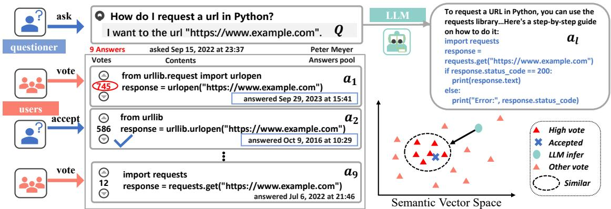  
Figure 1: An example of a Programming-Community Question Answering. It encompasses key elements: a question Q, a pool of answers $\{ a _ { 1 } , . . . , a _ { 9 } \}$ . Each $a _ { i }$ contains its text of content, the votes, and a label indicating whether it has been accepted by the questioner. Additionally, in the semantic vector space, there exists a certain distance between the LLM-based answers $a _ { l } .$ , the questioner-accepted answer $a _ { 2 } .$ and the users-preferred answers a1.

To generate user-centric responses better, we propose Multi-perspective Preference Alignment for Programming-Community Question Answering, called MupPCQA. It consists of three stages: 1) Preference Standardization to transfer domain knowledge based on the questioner-accepted answer. 2) Preference Integration to consider diverse user tendencies. 3) Preference Timeliness Mitigation to alleviate outdated answers by retrieving similar question-answer pairs from the PCQA database as few-shots. Our contributions are:

• We are the first to propose applying LLMs’ alignment to programmimg-domain QA from the perspective of user diversity, called MupPCQA.

• Based on the questioner-perspective bias, userperspective vote score, and LLM-perspective content score, MupPCQA realizes multi-perspective preference contrastive alignment through iteratively treating the answer with the highest score as the positive and the remaining as negative.

• Extensive zero-shot and few-shots experiments on a real-world and high-quality PCQA dataset validate MupPCQA accuracy and preference.

## 2 Related Work

## 2.1 Programming-Community QA

PCQA involves numerous research topics, such as predicting answerable questions (Asaduzzaman et al., 2013), assessing answer quality (Ragkhitwetsagul et al., 2019; Gao et al., 2020), answer generation (Zhou et al., 2018), and answer ranking (Amancio et al., 2021; Ginsca and Popescu, 2013; Liu and Wan, 2021; Dalip et al., 2013). These answer ranking methods typically employ classical deep-learning models to utilize both the answer text (Zhou et al., 2018) and the user’s fundamental characteristics (Ginsca and Popescu, 2013). For instance, L2R (Dalip et al., 2013) followed a learning to rank approach based on different groups of features like user-related features, stylistic or structural features. RCNN (Zhou et al., 2018) employed Gated Recurrent Units (GRU) with thread-level features to rank answers. Other research (Amancio et al., 2021) utilized recency and quality as criteria for ranking responses. However, few studies has considered the inherent preferences of diverse users and LLM feedback. Therefore, exploring how LLMs rank answers based on user preferences for alignment is a worthwhile endeavor.

## 3 Methodology

As shown in Figure 2, the MupPCQA encompasses three stages: (1) Preference Standardization, which is designed to quickly acquire programmingdomain knowledge; (2) Preference Integration, which considers diverse user preferences; and (3) Preference Timeliness Mitigation, which addresses the issue of outdated answers.

## 3.1 Task Formulation

Our overall target is to instruct a LLM (M) to generate a user-centric response on a PCQA dataset $\mathcal { D } = \left\{ ( q ^ { i } , A ^ { i } ) ~ | ~ i \in \left\{ 1 , \ldots , N \right\} \right\}$ . Here, $q ^ { i }$ represents the i-th question, and $A ^ { i } = \{ a _ { 1 } ^ { i } , a _ { 2 } ^ { i } , \ldots , a _ { N _ { i } } ^ { i } \}$ represents the candidate responses for $q ^ { i }$ . We denote $a = ( c , v , a _ { c } )$ , with c being the content; v being the votes; and $a _ { c } \in \{ 0 , 1 \}$ representing whether the answer a is accepted by the questioner. Formally, any question q or content c is a sequence of tokens, denoted as $t = \{ t _ { i } \ | \ t _ { i } \in \mathcal { C } \ \mathrm { o r } \ t _ { i } \in \mathcal { T } \}$ where $t _ { i }$ denotes the i-th token in the set $t , \mathcal { C }$ and $\tau$ represents the set of code and text, respectively.

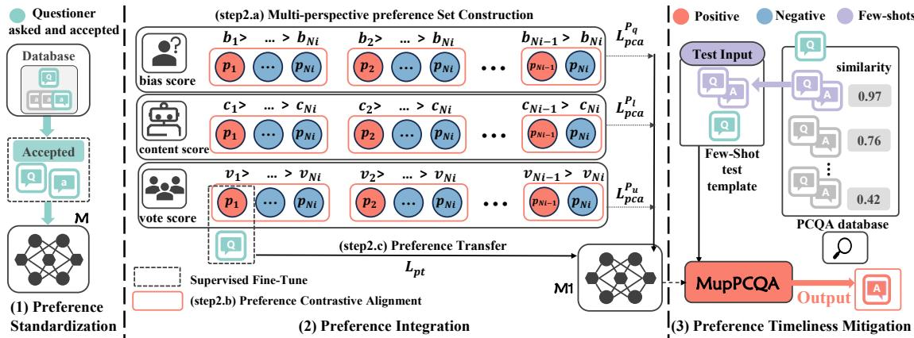  
Figure 2: Overall of the MupPCQA framework, including three stages: (1) Preference Standardization to rapidly acquire the programming-domain knowledge, (2) Preference Integration to consider diverse preferences, and (3) Preference Timeliness Mitigation to address the issue of outdated answers. In Preference Integration, (step2.a) constructs three different perspective preference sets, (step2.b) performs preference contrastive alignment for each set. (step2.c) narrows the gap between the questioner-perspective goal and the viewer-perspective goal.

## 3.2 Preference Standardization

To adapt the foundational LLM M to the PCQAspecific corpus efficiently and control the quality of the response, we employ Supervised Fine-Tuning (Ouyang et al., 2022) and treat the questioneraccepted answer $a ^ { i }$ with ${ a } _ { c } = 1$ as the alignment target, denoted as $a _ { c } ^ { i }$ . We optimize M as follows:

$$
L _ { p s } = - \frac { 1 } { | a _ { c } ^ { i } | } \sum _ { j = 1 } ^ { | a _ { c } ^ { i } | } \log P _ { M } ( a _ { c } ^ { ( i , j ) } | I , q ^ { i } , a _ { c } ^ { ( i , < j ) } )\tag{1}
$$

where $a _ { c } ^ { ( i , j ) }$ is the j-th token of $a _ { c } ^ { i } .$ , I is the QA prompt, and $P _ { M }$ denotes the token probability predicted by M, resulting in a model $M _ { 1 }$

## 3.3 Preference Integration

After Preference Standardization ensures the content quality of the output, we proceed to align multi-perspective preferences from different users through Preference Integration. First, we propose distinct metric scores to build three preference sets: (1) a questioner-perspective bias score to assess the discrepancy between the accepted answer and other answers, (2) a user-perspective vote score to reflect the collective preferences of other users, and (3) a

LLM-perspective content score to evaluate the semantic quality of the answer content. These scores then serve as the foundation for Preference Contrastive Alignment, which differentiates between positive and negative. Finally, to bridge the gap between the questioner-perspective goal and the viewer-perspective goal, Preference Transfer applies SFT again.

## 3.3.1 Multi-perspective Preference Set Construction

First, as the answer chosen by the questioner may not be favored by other users (Kasela et al., 2023), we introduced the questioner-perspective bias score $s _ { q }$ to assess the discrepancy between the accepted answer and the answer most preferred by users.

$$
s _ { q } ( a _ { i } ) = \frac { ( v _ { i } - v _ { a } ) - v _ { m } } { v _ { \sigma } }\tag{2}
$$

Here, $V = \{ v _ { 1 } , . . . , v _ { N _ { i } } \}$ represents the set of votes $v _ { i }$ for all answers $a _ { i }$ in question $q .$ . The $v _ { a }$ denotes the votes for the answer accepted by the questioner. The $v _ { m }$ and $v _ { \sigma }$ represent the mean and standard deviation of the vote set $V$ , respectively.

Second, since high-quality text is usually accompanied by a high number of votes (Gkotsis et al., 2014), interaction data from open communities reflect the preferences of users and act as a dual filtering mechanism for answer content quality. Therefore, to comprehensively consider the users’ collective preferences and engagement with the answers, we introduce a user-perspective voting score, denoted as $s _ { u } ,$ , expressed as follows:

$$
s _ { u } ( a _ { i } ) = \frac { v _ { i } - \operatorname* { m i n } ( V ) } { \operatorname* { m a x } ( V ) - \operatorname* { m i n } ( V ) }\tag{3}
$$

Here, min(V) and max(V) represent the minimum and maximum values within $V .$ , respectively. This normalization ensures that the number of votes is adjusted to a common scale, facilitating fair comparison across different answers.

Third, given that high semantic accuracy is crucial for ensuring the quality of answers, we introduce an LLM-perspective content score $s _ { l } .$ , calculated by general or code LLMs $M _ { c } .$ . This score leverages LLMs, which excel at handling nuanced semantic relationships between text and code, to evaluate the quality of text c in answer a. The $s _ { l }$ is represented as follows:

$$
s _ { l } ( a _ { i } ) = \prod _ { t \in a _ { i } } \sigma _ { c } \left( I _ { 1 } , \boldsymbol { q } , t \right)\tag{4}
$$

Here, $\sigma _ { c }$ is the logistic function derived from the product of probabilities assigned to each token by $M _ { c } . \ I _ { 1 }$ represents a QA prompt.

The sets of perspective scores $S _ { q } , S _ { u }$ , and $S _ { l }$ can be derived by arranging the scores of candidates $\{ a _ { 1 } , \ldots , a _ { N _ { i } } \}$ from different perspectives in descending order, and uniformly represented as:

$$
\left\{ s ( a _ { i _ { 1 } } ) , \ldots , s ( a _ { i _ { N _ { i } } } ) \mid s ( a _ { i _ { 1 } } ) \geq \cdots \geq s ( a _ { i _ { N _ { i } } } ) \right\}\tag{5}
$$

where $s ( \cdot )$ is the perspective score function, and the indices $\{ i _ { 1 } , \ldots , i _ { N _ { i } } \}$ indicate the descending positions of the candidates. Specifically, $s _ { q } ( \cdot ) , s _ { u } ( \cdot )$ and $s _ { l } ( \cdot )$ are the perspective score functions for each perspective.

If $s _ { i } .$ , the score for answer $a _ { j } ,$ is denoted as $p _ { i }$ the preference response set can be represented as:

$$
P = \{ p _ { i } \ | \ s _ { i } \in S , i = 1 , 2 , \ldots , N _ { i } \}\tag{6}
$$

Finally, the score sets $S _ { q } , S _ { u } .$ , and $S _ { l }$ are directly mapped to the preference sets $P _ { q } , P _ { u } ,$ and $P _ { l }$ .

## 3.3.2 Preference Contrastive Alignment

To comprehensively rank the preferences of each candidate in the preference sets $P ,$ we apply iterative contrastive learning over $N _ { i }$ rounds, utilizing the Plackett-Luce model (Luce, 1959; Plackett, 1975) as implemented in DPO (Rafailov et al., 2023). Details regarding RLHF and DPO are provided in Appendix 6.1.2. In each round, the candidate with the highest perspective score is treated as positive, while the others are treated as negative. Each example $p _ { i }$ is weighted based on its perspective score $s _ { i } .$ . For a single preference set, the objective for the i-th round is defined as follows:

$$
O ( i ) = \frac { \exp ( \sigma _ { M _ { 1 } } ( p _ { i } ) \cdot s _ { i } ) } { \sum _ { k = i } ^ { N _ { i } } \exp ( \sigma _ { M _ { 1 } } ( p _ { k } ) \cdot s _ { k } ) }\tag{7}
$$

Therefore, for all preference sets $P _ { q } , P _ { u }$ , and $P _ { l }$ the overall optimization objective for the i-th round is represented as follows:

$$
O _ { t } ( i ) = O ^ { P _ { q } } ( i ) + O ^ { P _ { u } } ( i ) + O ^ { P _ { l } } ( i )\tag{8}
$$

As the i-th iteration progresses, the top $i - 1$ answers with the highest perspective scores are sequentially removed. This iterative process continues until all potentials are exhausted, yielding the final target probability expressed as follows:

$$
L _ { p c a } = - \log \prod _ { i = 1 } ^ { N _ { i } - 1 } { \cal O } _ { t } ( i )\tag{9}
$$

## 3.3.3 Preference Transfer

At this stage, to narrow the gap between the questioner-perspective goal $a _ { c }$ in Preference Standardization and the viewer-perspective goal $p _ { 1 } ^ { u }$ in $P _ { u } ,$ we further perform SFT by treating $p _ { 1 } ^ { u }$ as the alignment, similar to Eq. (1), as shown below.

$$
{ \cal { L } } _ { p t } = - \frac { 1 } { | p _ { 1 } ^ { u } | } \sum _ { i = 1 } ^ { | p _ { 1 } ^ { u } | } l o g P _ { M } ( p _ { 1 } ^ { u ( i ) } | I , q , p _ { 1 } ^ { u ( < i ) } )\tag{10}
$$

Eventually, the overall optimization objective can be summarized as follows:

$$
L o s s = L _ { p c a } + \alpha L _ { p t }\tag{11}
$$

Here, α controls the extent to which the output response deviates towards the preferred response, ensuring its text fluency and code structure quality, resulting in a model $M _ { 2 }$

## 3.4 Preference Timeliness Mitigation

Accepted answers may become outdated due to rapid API updates. For instance, in Figure 1, the "urllib" API in answer a2 is applicable to Python 2 but deprecated in Python 3, we introduced Preference Timeliness Mitigation to address the issue of outdated answers and to align with the user’s preference for utilizing new API trends.

By retrieving analogous questions from the question bank and employing them as few-shot examples, we enhance the efficacy of the generated responses. We employ a dense retriever $( \mathcal { R } _ { D } )$ , designed to effectively map natural language questions to relevant code-generation tasks, enhancing the retrieval of analogous question-answer pairs. The ordering of few-shot examples has a significant impact on model predictions (Zhao et al., 2021). Therefore, we select the most similar questionanswer pair $( f _ { q } , f _ { a } )$ from the PCQA databases D to serve as the few-shot example in the QA prompt I2. The final inference objective is defined as follows:

Table 1: The zero-shot experimental results on the PCQA dataset. Open-source code baselines are above MupPCQA and closed-source baselines are below MupPCQA. The best result in each column is marked in bold. The second-best result in each column is underlined.
<table><tr><td>Model</td><td>Model size</td><td> $B L E U _ { 4 }$ </td><td> $R O U G E _ { 2 }$ </td><td> $C H R F$ </td><td> $B E R T S c o r e$ </td><td>CodeBERTScore-PR</td><td>CodeBERTScore-F</td></tr><tr><td>Godegen-mono</td><td>16B</td><td>6.72</td><td>9.24</td><td>32.94</td><td>77.53</td><td>54.42</td><td>50.20</td></tr><tr><td>GPT-NeoX</td><td>20B</td><td>8.40</td><td>11.26</td><td>33.46</td><td>78.06</td><td>53.79</td><td>49.87</td></tr><tr><td>StarCoder</td><td>15B</td><td>9.32</td><td>11.92</td><td>30.75</td><td>77.57</td><td>53.36</td><td>52.21</td></tr><tr><td>WizardCoder-python</td><td>13B</td><td>12.97</td><td>15.88</td><td>37.54</td><td>79.34</td><td>52.37</td><td>51.89</td></tr><tr><td>CodeT5+</td><td>-</td><td>3.86</td><td>5.16</td><td>25.58</td><td>75.96</td><td>53.48</td><td>46.19</td></tr><tr><td>Code Llama2</td><td>7B</td><td>11.86</td><td>16.32</td><td>35.08</td><td>70.10</td><td>46.46</td><td>47.05</td></tr><tr><td>Code Llama2</td><td>13B</td><td>13.56</td><td>18.32</td><td>38.68</td><td>78.13</td><td>51.79</td><td>52.91</td></tr><tr><td>MupPCQA(Ours)</td><td>7B</td><td>22.86</td><td>25.48</td><td>40.58</td><td>84.14</td><td>65.12</td><td>63.53</td></tr><tr><td>PaLM</td><td>=</td><td>13.15</td><td>18.68</td><td>39.89</td><td>77.89</td><td>52.81</td><td>51.98</td></tr><tr><td>ChatGLM</td><td></td><td>13.91</td><td>18.71</td><td>38.21</td><td>78.28</td><td>53.29</td><td>53.77</td></tr><tr><td>GPT-3.5</td><td></td><td>15.29</td><td>19.24</td><td>39.10</td><td>78.90</td><td>52.10</td><td>52.95</td></tr><tr><td>Claude2</td><td></td><td>14.69</td><td>19.12</td><td>38.78</td><td>78.45</td><td>51.58</td><td>52.63</td></tr><tr><td>GPT-4</td><td></td><td>13.04</td><td>17.74</td><td>35.43</td><td>78.23</td><td>57.84</td><td>46.82</td></tr></table>

Table 2: The one-shot experimental results on the PCQA dataset. The best result in each column is marked in bold. The second-best result in each column is underlined.
<table><tr><td>Model</td><td>Model size</td><td> $B L E U _ { 4 }$ </td><td> $R O U G E _ { 2 }$ </td><td>CHRF</td><td>BERTScore</td><td>CodeBERTScore-PR</td><td>CodeBERTScore-F</td></tr><tr><td>Godegen-mono</td><td>16B</td><td>8.06</td><td>11.01</td><td>33.32</td><td>78.28</td><td>54.67</td><td>50.20</td></tr><tr><td>GPT-NeoX</td><td>20B</td><td>8.95</td><td>11.30</td><td>26.84</td><td>76.68</td><td>52.64</td><td>51.93</td></tr><tr><td>StarCoder</td><td>15B</td><td>10.59</td><td>14.40</td><td>33.71</td><td>78.20</td><td>53.43</td><td>52.96</td></tr><tr><td>WizardCoder-python</td><td>13B</td><td>13.35</td><td>15.97</td><td>37.56</td><td>79.42</td><td>52.70</td><td>52.11</td></tr><tr><td>CodeT5+</td><td>–</td><td>4.40</td><td>5.60</td><td>25.96</td><td>75.91</td><td>52.23</td><td>47.52</td></tr><tr><td>MupPCQA (Ours)</td><td>7B</td><td>22.86</td><td>25.48</td><td>40.58</td><td>84.14</td><td>65.12</td><td>63.53</td></tr><tr><td>PaLM</td><td></td><td>12.77</td><td>18.97</td><td>34.00</td><td>77.90</td><td>52.35</td><td>52.25</td></tr><tr><td>ChatGLM</td><td></td><td>13.47</td><td>17.50</td><td>37.06</td><td>78.20</td><td>53.51</td><td>53.53</td></tr><tr><td>GPT-3.5</td><td></td><td>14.50</td><td>18.43</td><td>39.17</td><td>78.92</td><td>52.64</td><td>52.52</td></tr><tr><td>Claude2</td><td></td><td>14.10</td><td>18.24</td><td>38.25</td><td>78.46</td><td>51.38</td><td>52.36</td></tr><tr><td>GPT-4</td><td></td><td>14.73</td><td>18.87</td><td>36.68</td><td>78.78</td><td>52.44</td><td>52.56</td></tr></table>

$$
\mathcal { P } ( A _ { t } ) = \prod _ { i = 1 } ^ { T } \sigma _ { M _ { 2 } } ( A | I _ { 2 } , Q , ( f q , f a ) , A _ { < t } )\tag{12}
$$

Here, $Q$ is the question to be resolved.

## 4 Experiment

## 4.1 Baselines and Dataset

Baselines. Based on the unique characteristics of PCQA, we selected two categories of baselines. The first consists of general-purpose, closed-source LLMs designed for text generation, including GPT-3.5-turbo, GPT-4 (OpenAI, 2023), PaLM (Anil et al., 2023), ChatGLM (Zeng et al., 2022), and

Claude2 (ant). The second comprises open-source code LLMs that excel in program synthesis, such as StarCoder (Li et al., 2023), WizardCoder-Python-13B (Luo et al., 2023), GPT-NeoX (Black et al., 2022), CodeGen-mono-16B (Nijkamp et al., 2022), and Code Llama 2 (Rozière et al., 2023).

Dataset. We collected real-world PCQA data from StackExchange 3 and performed a series of data processing steps, as detailed in Appendix 6.2, resulting in 270,716 instances.

## 4.2 Evaluation Metrics

To comprehensively evaluate the experimental results, we employed various evaluation metrics from four perspectives: traditional text generation metrics (BLEU (Papineni et al., 2002), Rouge (Lin, 2004), and CHRF (Popovic´, 2015)), model-based metrics (BERTScore (Zhang et al., 2019)), coderelated metrics (CodeBERTScore (Zhou et al., 2023)), and Preference based on GPT-4. Additionally, considering the similarity between Precision and Recall in CodeBERTScore, we unified these metrics into ’CodeBERTScore-PR’ (CB-PR). Similarly, we merged the F1 and F-measure metrics into ’CodeBERTScore-F’ (CB-F). The details of the experimental implementation are provided in the Appendix 6.3.

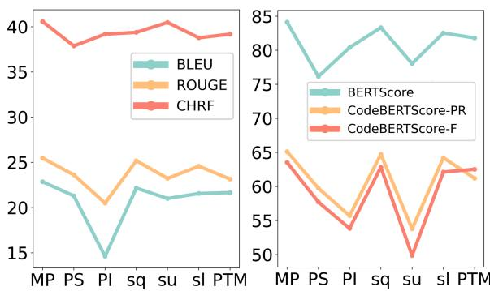

Table 3: The ablation study results. We evaluate performances brought by different components. The full names of these abbreviations are: PS (Preference Standardization); PI (Preference Integration); $s _ { p }$ (bias score); $s _ { l }$ (content scores); $s _ { u }$ (vote scores); and PTM (Peference Timeliness Mitigation ). The components in bold have the most significant impact on performance.
<table><tr><td>Model</td><td>BLEU ROUGE CHRF BS CB-PR CB-F</td></tr><tr><td>MupPCQA 22.86</td><td>25.48 40.58 84.14 65.12 63.53</td></tr><tr><td>-w/o PS 21.30</td><td>23.62 37.8876.15 59.76 57.73</td></tr><tr><td>-w/o PI 14.62</td><td>20.50 39.18 80.41 55.72 53.85</td></tr><tr><td>-w/o  $s _ { q }$  22.16</td><td>25.18 39.38 83.34 64.72 62.83</td></tr><tr><td>-w/o  $s _ { u }$  21.01</td><td>23.23 40.48 78.06 53.79 49.87</td></tr><tr><td>-w/o  $s _ { l }$  21.56</td><td>24.58 38.78 82.54 64.22 62.13</td></tr><tr><td>-w/o PTM 21.66</td><td>23.16 39.18 81.82 61.22 62.53</td></tr></table>

## 4.3 Analysis

## 4.3.1 Main Results

This experiment aims to explore whether MupC-CQA can outperform all baselines in terms of text and code generation accuracy within PCQA. Its results are shown in Table 1 and Table 2, and the key findings are summarized as follows:

MupPCQA excels. First, MupPCQA significantly outperformed all other baselines in every metric. Specifically, it surpassed the next-best baseline in every metric, outperforming general LLMs in text generation and code LLMs in code generation. For instance, compared to the second-best GPT-3.5, it scored 5.2% higher on BERTScore, nearly 7% higher on CB-PR, and about 10% higher on CB-F than ChatGLM. Second, MupPCQA achieved a BLEU score twice that of the benchmark model (22.86% vs. 11.86%). Other n-grambased metrics (ROUGE and CHRF) and semanticgrammar-based metrics also showed substantial improvements, indicating that MupPCQA is an effective framework for enhancing the grammar and semantics of generated answers.

Significant benefit from retrieval-augmented strategy. Due to the presence of similar QA pairs

Figure 3: Performance of Each Component: Text-Based (Left) and Code-Based (Right). MP represents the overall performance of MupPCQA.

as few-shots in the Retrieval-Enhanced Preference Timeliness Mitigation (REPTM) of MupPCQA, we also applied few-shots to the remaining baselines in a new experiment. The results are shown in Table 2. This ensures a fair comparison of other zeroshot baselines with MupPCQA. In Table 2, each baseline shows improvement across various metrics compared to the zero-shot results in Table 1, with GPT-4 exhibiting significant enhancement in long-text performance, becoming the second-best baseline. However, MupPCQA’s BLEU score remains much higher than that of the second-best GPT-4, and its BERTScore surpasses WizardCoder-Python by nearly 4.7%. In terms of CB-PR and CB-F, MupPCQA exceeds the second-best by nearly 10%. Although they still cannot match our Mup-PCQA, REPTM has played a significant role in performance improvement.

## 4.3.2 Ablation Study

To validate the impact of each component on Mup-PCQA’s performance, we conducted ablation experiments. The results are shown in Table 3.

Preference Standardization: A Prerequisite for Domain Knowledge Transfer. Upon removing it, all metrics experienced a decline, with BERTScore showing the most significant drop (from 84.14% to 76.15%), underscoring the importance of this stage for understanding the semantics of programming knowledge.

Preference integration affects mostly. Eliminating it resulted in notable decreases in performance on BLEU focused on complex phrase matching in Figure3 (Left) and code semantics in Figure3 (Right). Specifically, CodeBERTScore dropped by 8.8% and 9.4%, respectively. Additionally, the $s _ { u }$ positive impact on CodeBERTScore is much higher than on text-based metrics, and the effects of $s _ { q }$ and $s _ { l }$ are much more moderated. This suggests that an unadapted LLM fails to capture the diversity of preferences within the programming community.

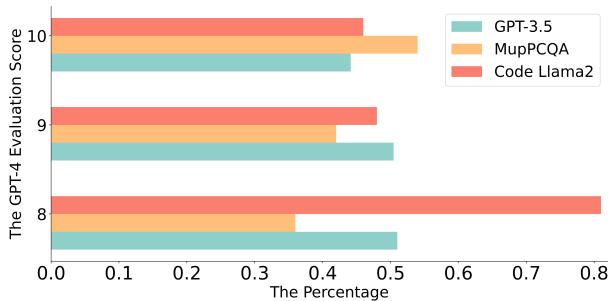

(a) The percentage statistics of GPT-4 evaluation scores for different baselines.  
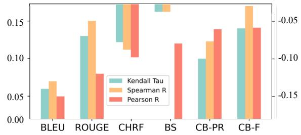  
(b) The consistency correlations between accuracy-based metrics (BLEU, ROUGE, CHRF, BERTScore, CB-PR, and CB-F) and preference-based metrics (GPT-4 evaluation scores). A positive correlation indicates that accuracy metrics improve as preference scores increase.  
Figure 4: Analysis of GPT-4 evaluations for different baselines on the test set.

Similar few-shots promote semantics. If PTM is excluded, the performance on BERTScore and CodeBERTScore significantly declines, highlighting the critical role of similar examples in understanding problem semantics.

## 4.3.3 GPT-4 Evaluation

Given that GPT-4 (OpenAI, 2023) has demonstrated significant ability in effectively evaluating question-and-answer pairs and aligning with human preferences (Wang et al., 2023a; Zheng et al., 2023a), we utilize it to assess the preferences for responses generated by the Code Llama, the GPT-3.5, and our MupPCQA. To evaluate whether the responses align with human preferences, we designed evaluation criteria encompassing four dimensions: the usefulness, relevance, accuracy, and level of detail of each answer, shown in Figure8b. Each solution is rated on a scale from 1 to 10, with comprehensive explanations required for each score. As shown in Figure 4a, MupPCQA achieves a significantly higher percentage of 10-point scores compared to the other baselines.

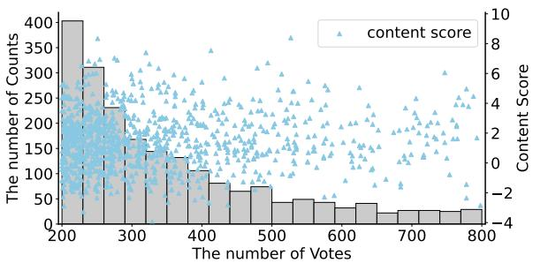

(a) The distribution of Content Scores and their relationship with the number of Votes  
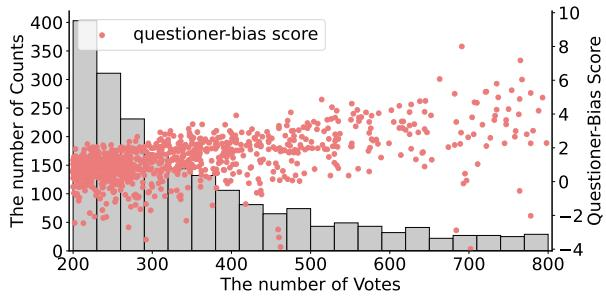  
(b) The distribution of questioner-perspective bias Scores and their relationship with the number of Votes  
Figure 5: Multi-perspective Phenomenon Analysis.

To explore the consistency between accuracybased metrics and preference-based metrics, we employed three key statistical correlation coefficients: Kendall’s Tau τ (Kendall, 1938), Spearman’s R $\gamma$ (Pranklin, 1974), and Pearson’s R $\rho$ (Bravais, 1844), as depicted in Figure 4b. It primarily illustrates three points: First, the three correlation measures,τ, γ, and $\rho ,$ maintain a high degree of sign consistency. Second, text-based BLEU and ROUGE, semanticbased BERTScore, and code-based CB-P and CB-F all exhibit a positive correlation with preferencebased metrics, whereas CHRF shows a negative correlation in both τ and γ. Lastly, the correlation between code-based metrics and preference is the most pronounced, which aptly reflects the characteristics of the PCQA. Overall, accuracy and preference are not contradictory, providing a valuable reference for evaluating PCQA.

## 4.3.4 Multi-perspective Phenomenon Analysis

To validate the necessity of multi-perspective preference modeling, we randomly extracted 2,000 entries from the PCQA dataset. We calculated the $s _ { q } ,$ $s _ { u }$ and $s _ { l }$ for each answer a. These scores were then mapped onto a two-dimensional coordinate system. Naturally, the vote score $s _ { u }$ shows a positive correlation with the number of votes. For question audience bias $s _ { q } ,$ if the votes v for a user-favored answer are close to the votes for the answer chosen by the questioner, then $s _ { q }$ is near the X-axis. In Figure 5b, most $s _ { q }$ values are distant from the X-axis, highlighting a significant divergence between user preferences and the questioner’s choices within the coding community. Analyzing the distribution of content scores $s _ { l }$ in Figure 5a: if some answers to question q are semantically similar, content scores should cluster. The lack of clustering indicates that no single answer comprehensively covers all semantic aspects of the question.

<table><tr><td rowspan=1 colspan=1>Question</td><td rowspan=1 colspan=1>The response of Code Llama</td><td rowspan=1 colspan=1>The response of MupCCQA</td></tr><tr><td rowspan=1 colspan=1>(1) Reloadingsubmodules in IPython?</td><td rowspan=1 colspan=1>1.First, import the autoreload module in your IPython session: importautoreload.2. Next, use the autoreload.enable()GPT-4 Score: 8</td><td rowspan=1 colspan=1>One solution: in your IPython console: %autoreload . This will enableautoreload for all modules, including submodules.Other solution: if youwant to reload only the, you can use the following command: %autoreloadmain_mod.sub_mod.                       GPT-4 Score: 9</td></tr><tr><td rowspan=1 colspan=1>(2) fatal error: Python.h:No such file or directory.</td><td rowspan=1 colspan=1>1.python -c import distutils.sysconfig; print(distutils.sysconfig.get_pyt-hon_inc()). 2.export PYTHON_INCLUDE_DIR=/path/to/Python.hReplace /path/to/Python.h                GPT-4 Score: 9</td><td rowspan=1 colspan=1>you can use the following command to build the shared library:gcc -Wall -I/usr/include/python3.8 utilsmodule.c -o Utilc.GPT-4 Score: 10</td></tr><tr><td rowspan=1 colspan=1>(3) Can I force pip to re-install the currentversion?</td><td rowspan=1 colspan=1>Yes, you can force pip to reinstall the current version of a package by usingthe &#x27;--force-reinstall&#x27; option. Here&#x27;s an example:pip install -force reinstall&lt;package-name&gt;This will reinstall the package even if it is already up-to-date. Alternatively, you can use the `--upgrade option to upgrade the package to the latest version available.pip install --upgrade &lt;package-name&gt;        GPT-4 Score: 8</td><td rowspan=1 colspan=1>Yes, you can force pip to reinstall the current version of a package by using the &#x27;--upgrade&#x27; flag. pip install --upgrade package_name.pip install --upgrade-strategy=latest package_name.Note that the `--upgrade` and `--upgrade-strategy&#x27; flags are only available in pip version 19.0 and later. If you are using anearlier version of pip, to force pip to reinstall the current version of a package.GPT-4 Score: 10</td></tr><tr><td rowspan=1 colspan=1>(4) How do I get aCron-like scheduler inPython?</td><td rowspan=1 colspan=1>The croniter library can be used with the sched module from thestandard library to create a Cron-like scheduler.importsched...import time...from croniter import croniter.scheduler =sched.scheduler(time.time, time.sleep)      GPT-4 Score: 7</td><td rowspan=1 colspan=1>The APScheduler library is a more modern and feature-rich option forscheduling tasks. from apscheduler.schedulers.blocking importBlockingScheduler from apscheduler.triggers.cron importCronTrigger.scheduler = BlockingScheduler()    GPT-4 Score: 9scheduler.add_job(scheduled_task, CronTrigger.from_crontab(&#x27;&#x27;))</td></tr></table>

Figure 6: A case study about Code Llama and MupPCQA in PCQA. The black signifies natural language. The blue represents code. The red indicates outdated content. The green indicates the preference score based on GPT-4 evaluation. The higher the score, the greater the alignment with user preferences. The scores ranges from [1,10].

In summary, the observed distinct distributions of content scores, vote scores, and bias scores underscore the existence of diverse preferences from different perspectives. This finding validates the necessity of accurately capturing and presenting user preferences in PCQA, necessitating the adoption of multi-perspective modeling approaches.

## 4.3.5 Case Study

To validate the excellence of our MupPCQA, we selected four random questions for comparison, as shown in Figure 6, and we take randomly the third question as an example. MupPCQA scored 10, while Code Llama scored 8. Although both responses covered the core points and clearly explained how to use the "force–reinstall" flag, Mup-PCQA excelled in the following aspects: First, in detail: MupPCQA provided a more thorough explanation, covering not only the "upgrade" flag but also the "upgrade–strategy" flag. This additional information helped users understand and manage package upgrades better. Second, in accuracy and relevance: MupPCQA accurately explained the usage of the "upgrade" and "upgrade–strategy" flags, making the response more informative and helpful for managing package versions and upgrades. Third, in user-friendliness: MupPCQA’s response was well-structured and user-friendly, with clear instructions and examples that made it easier for users to follow and apply the information.

The fourth question in the Figure 6 aims to highlight the presence of outdated APIs in some responses generated by LLMs. Specifically, Code Llama employed the "sched" module, which is part of the Python standard library, but is no longer as commonly used. In contrast, the response of MupPCQA utilized a more contemporary library "APScheduler", a popular and feature-rich option for scheduling tasks.

## 4.4 Success and failure analysis

To discuss under what conditions MupPCQA performs optimally, we selected some successful cases as shown in Figure 9a. Their characteristics are analyzed and summarized as follows: (1) Clear problem statements: Successful cases usually have clear, specific problem statements, making the user’s intent and requirements evident. (2) Complete context: They provide sufficient context for the model, enabling better understanding of the problem and generating responses for better alignment.

To explore the scenarios where MupPCQA’s performance is limited, we also pick some failure cases as shown in Figure 9a. These factors are outlined: (1) Vague problem statements: Problem statements in failure cases may be ambiguous, leading to difficulty in understanding. (2) Insufficient context: Failure cases lack adequate context, causing the LLMs to lack understanding of the problem’s background, resulting in impractical responses. (3) Excessively long and redundant context.

## 5 Conclusion

In this paper, to explore the application of LLMs in PCQA for generating user-centric responses through RLHF, we propose MupPCQA. It measures and synthesizes responses’ preference levels from different perspectives to accommodate diverse and evolving user preferences based on Multiperspective Preference Contrastive Alignment. Extensive experiments validate the superior accuracy and preference of the MupPCQA’s responses. Overall, this work highlights considering the diversity of user preferences to generate human-like responses while aligning with human inclinations.

## 6 Ethical Statement

It should be acknowledged that there is a tiny possibility that sensitive and offensive content may exist within the dataset. It is important to emphasize that this content does not reflect our views or beliefs, but is solely intended for research purposes.

## Acknowledgement

The work was supported in part by the National Natural Science Foundation of China under Grant U23A20308, and by the Fundamental Research Funds for the Central Universities.

## References

Anthropic. model card and evaluations for claude models, 2023. https://www-files. anthropic.com/production/images/ Model-Card-Claude-2.pdf.

Utkarsh Agarwal, Kumar Tanmay, Aditi Khandelwal, and Monojit Choudhury. 2024. Ethical reasoning and moral value alignment of llms depend on the language we prompt them in. arXiv preprint arXiv:2404.18460.

Leandro Amancio, Carina F Dorneles, and Daniel H Dalip. 2021. Recency and quality-based ranking question in cqas: A stack overflow case study. Information Processing & Management, 58(4):102552.

Rohan Anil, Andrew M Dai, Orhan Firat, Melvin Johnson, Dmitry Lepikhin, Alexandre Passos, Siamak Shakeri, Emanuel Taropa, Paige Bailey, Zhifeng Chen, et al. 2023. Palm 2 technical report. arXiv preprint arXiv:2305.10403.

Muhammad Asaduzzaman, Ahmed Shah Mashiyat, Chanchal K Roy, and Kevin A Schneider. 2013. Answering questions about unanswered questions of stack overflow. In 2013 10th Working Conference on Mining Software Repositories (MSR), pages 97–100. IEEE.

Yuntao Bai, Saurav Kadavath, Sandipan Kundu, Amanda Askell, Jackson Kernion, Andy Jones, Anna Chen, Anna Goldie, Azalia Mirhoseini, Cameron McKinnon, et al. 2022. Constitutional ai: Harmlessness from ai feedback. arXiv preprint arXiv:2212.08073.

Sid Black, Stella Biderman, Eric Hallahan, Quentin Anthony, Leo Gao, Laurence Golding, Horace He, Connor Leahy, Kyle McDonell, Jason Phang, et al. 2022. Gpt-neox-20b: An open-source autoregressive language model. arXiv preprint arXiv:2204.06745.

Ralph Allan Bradley and Milton E Terry. 1952. Rank analysis of incomplete block designs: I. the method of paired comparisons. Biometrika, 39(3/4):324–345.

Auguste Bravais. 1844. Analyse mathématique sur les probabilités des erreurs de situation d’un point. Impr. Royale.

Lei Chen, Bobo Li, Li Zheng, Haining Wang, Zixiang Meng, Runfeng Shi, Hao Fei, Jun Zhou, Fei Li, Chong Teng, et al. 2024. What factors influence llms’ judgments? a case study on question answering. In Proceedings ofthe 2024 Joint International Conference on Computational Linguistics, Language Resources and Evaluation (LREC-COLING 2024), pages 17473–17485.

Qin Chen, Qinmin Hu, Jimmy Xiangji Huang, Liang He, and Weijie An. 2017. Enhancing recurrent neural networks with positional attention for question answering. In Proceedings ofthe 40th International ACM SIGIR Conference on Research and Development in Information Retrieval, pages 993–996.

Daniel Hasan Dalip, Marcos André Gonçalves, Marco Cristo, and Pavel Calado. 2013. Exploiting user feedback to learn to rank answers in q&a forums: a case study with stack overflow. In Proceedings ofthe 36th international ACM SIGIR conference on Research and development in information retrieval, pages 543– 552.

Jiangnan Du, Jun Chen, Suhong Wang, Jianfeng Li, and Zhifeng Xiao. 2021. Towards a two-stage method for answer selection and summarization in buddhism community question answering. In Artificial Intelligence: First CAAI International Conference, CICAI 2021, Hangzhou, China, June 5–6, 2021, Proceedings, Part II 1, pages 251–260. Springer.

Zhipeng Gao, Xin Xia, John Grundy, David Lo, and Yuan-Fang Li. 2020. Generating question titles for stack overflow from mined code snippets. ACM Transactions on Software Engineering and Methodology (TOSEM), 29(4):1–37.

Alexandru Lucian Ginsca and Adrian Popescu. 2013. User profiling for answer quality assessment in q&a communities. In Proceedings of the 2013 workshop on Data-driven user behavioral modelling and miningfrom social media, pages 25–28.

George Gkotsis, Karen Stepanyan, Carlos Pedrinaci, John Domingue, and Maria Liakata. 2014. It’s all in the content: state of the art best answer prediction based on discretisation of shallow linguistic features. In Proceedings ofthe 2014 ACM conference on Web science, pages 202–210.

Hamel Husain, Ho-Hsiang Wu, Tiferet Gazit, Miltiadis Allamanis, and Marc Brockschmidt. 2019. Codesearchnet challenge: Evaluating the state of semantic code search. arXiv preprint arXiv:1909.09436.

Muhammad Huzaifah, Weihua Zheng, Nattapol Chanpaisit, and Kui Wu. 2024. Evaluating code-switching translation with large language models. In Proceedings of the 2024 Joint International Conference on Computational Linguistics, Language Resources and Evaluation (LREC-COLING 2024), pages 6381– 6394.

Pranav Kasela, Gabriella Pasi, and Raffaele Perego. 2023. Se-pqa: Personalized community question answering. arXiv preprint arXiv:2306.16261.

Maurice G Kendall. 1938. A new measure of rank correlation. Biometrika, 30(1/2):81–93.

Raymond Li, Loubna Ben Allal, Yangtian Zi, Niklas Muennighoff, Denis Kocetkov, Chenghao Mou, Marc Marone, Christopher Akiki, Jia Li, Jenny Chim, et al. 2023. Starcoder: may the source be with you! arXiv preprint arXiv:2305.06161.

Taiji Li, Zhi Li, and Yin Zhang. 2024. Improving faithfulness of large language models in summarization via sliding generation and self-consistency. In Proceedings ofthe 2024 Joint International Conference on Computational Linguistics, Language Resources and Evaluation (LREC-COLING 2024), pages 8804– 8817.

Bo Lin, Shangwen Wang, Zhongxin Liu, Yepang Liu, Xin Xia, and Xiaoguang Mao. 2023. Cct5: A codechange-oriented pre-trained model. arXiv preprint arXiv:2305.10785.

Chin-Yew Lin. 2004. Rouge: A package for automatic evaluation of summaries. In Text summarization branches out, pages 74–81.

Chenxiao Liu and Xiaojun Wan. 2021. Codeqa: A question answering dataset for source code comprehension. arXiv preprint arXiv:2109.08365.

Shuai Lu, Daya Guo, Shuo Ren, Junjie Huang, Alexey Svyatkovskiy, Ambrosio Blanco, Colin Clement, Dawn Drain, Daxin Jiang, Duyu Tang, et al. 2021. Codexglue: A machine learning benchmark dataset for code understanding and generation. arXiv preprint arXiv:2102.04664.

R Duncan Luce. 1959. Individual choice behavior, volume 4. Wiley New York.

Ziyang Luo, Can Xu, Pu Zhao, Qingfeng Sun, Xiubo Geng, Wenxiang Hu, Chongyang Tao, Jing Ma, Qingwei Lin, and Daxin Jiang. 2023. Wizardcoder: Empowering code large language models with evolinstruct. arXiv preprint arXiv:2306.08568.

Macedo Maia, Siegfried Handschuh, and Markus Endres. 2021. A tag-based transformer community question answering learning-to-rank model in the home improvement domain. In International Conference on Database and Expert Systems Applications, pages 127–138. Springer.

Erik Nijkamp, Bo Pang, Hiroaki Hayashi, Lifu Tu, Huan Wang, Yingbo Zhou, Silvio Savarese, and Caiming Xiong. 2022. Codegen: An open large language model for code with multi-turn program synthesis. arXiv preprint arXiv:2203.13474.

OpenAI. 2023. Gpt-4 technical report. Preprint, arXiv:2303.08774.

Long Ouyang, Jeffrey Wu, Xu Jiang, Diogo Almeida, Carroll Wainwright, Pamela Mishkin, Chong Zhang, Sandhini Agarwal, Katarina Slama, Alex Ray, et al. 2022. Training language models to follow instructions with human feedback. Advances in Neural Information Processing Systems, 35:27730–27744.

Kishore Papineni, Salim Roukos, Todd Ward, and Wei-Jing Zhu. 2002. Bleu: a method for automatic evaluation of machine translation. In Proceedings of the 40th annual meeting of the Association for Computational Linguistics, pages 311–318.

Robin L Plackett. 1975. The analysis of permutations. Journal ofthe Royal Statistical Society Series C: Applied Statistics, 24(2):193–202.

Maja Popovic. 2015. chrf: character n-gram f-score for ´ automatic mt evaluation. In Proceedings ofthe tenth workshop on statistical machine translation, pages 392–395.

A Pranklin. 1974. Introduction to the Theory ofStatistics.

Rafael Rafailov, Archit Sharma, Eric Mitchell, Stefano Ermon, Christopher D Manning, and Chelsea Finn. 2023. Direct preference optimization: Your language model is secretly a reward model. arXiv preprint arXiv:2305.18290.

Chaiyong Ragkhitwetsagul, Jens Krinke, Matheus Paixao, Giuseppe Bianco, and Rocco Oliveto. 2019. Toxic code snippets on stack overflow. IEEE Transactions on Software Engineering, 47(3):560–581.

Mengjie Ren, Boxi Cao, Hongyu Lin, Cao Liu, Xianpei Han, Ke Zeng, Guanglu Wan, Xunliang Cai, and Le Sun. 2024. Learning or self-aligning? rethinking instruction fine-tuning. arXiv preprint arXiv:2402.18243.

Baptiste Rozière, Jonas Gehring, Fabian Gloeckle, Sten Sootla, Itai Gat, Xiaoqing Ellen Tan, Yossi Adi, Jingyu Liu, Tal Remez, Jérémy Rapin, et al. 2023. Code llama: Open foundation models for code. arXiv preprint arXiv:2308.12950.

John Schulman, Filip Wolski, Prafulla Dhariwal, Alec Radford, and Oleg Klimov. 2017. Proximal policy optimization algorithms. arXiv preprint arXiv:1707.06347.

Feifan Song, Bowen Yu, Hao Lang, Haiyang Yu, Fei Huang, Houfeng Wang, and Yongbin Li. 2024. Scaling data diversity for fine-tuning language models in human alignment. arXiv preprint arXiv:2403.11124.

Feifan Song, Bowen Yu, Minghao Li, Haiyang Yu, Fei Huang, Yongbin Li, and Houfeng Wang. 2023. Preference ranking optimization for human alignment. arXiv preprint arXiv:2306.17492.

Nisan Stiennon, Long Ouyang, Jeffrey Wu, Daniel Ziegler, Ryan Lowe, Chelsea Voss, Alec Radford, Dario Amodei, and Paul F Christiano. 2020. Learning to summarize with human feedback. Advances in Neural Information Processing Systems, 33:3008– 3021.

Kexuan Sun, Nicolaas Paul Jedema, Karishma Sharma, Ruben Janssen, Jay Pujara, Pedro Szekely, and Alessandro Moschitti. 2024. Efficient and accurate contextual re-ranking for knowledge graph question answering. In Proceedings of the 2024 Joint International Conference on Computational Linguistics, Language Resources and Evaluation (LREC-COLING 2024), pages 5585–5595.

Hugo Touvron, Thibaut Lavril, Gautier Izacard, Xavier Martinet, Marie-Anne Lachaux, Timothée Lacroix, Baptiste Rozière, Naman Goyal, Eric Hambro, Faisal Azhar, et al. 2023a. Llama: Open and efficient foundation language models. arXiv preprint arXiv:2302.13971.

Hugo Touvron, Louis Martin, Kevin Stone, Peter Albert, Amjad Almahairi, Yasmine Babaei, Nikolay Bashlykov, Soumya Batra, Prajjwal Bhargava, Shruti Bhosale, et al. 2023b. Llama 2: Open foundation and fine-tuned chat models. arXiv preprint arXiv:2307.09288.

Peiyi Wang, Lei Li, Liang Chen, Dawei Zhu, Binghuai Lin, Yunbo Cao, Qi Liu, Tianyu Liu, and Zhifang Sui. 2023a. Large language models are not fair evaluators. arXiv preprint arXiv:2305.17926.

Yue Wang, Hung Le, Akhilesh Deepak Gotmare, Nghi DQ Bui, Junnan Li, and Steven CH Hoi. 2023b. Codet5+: Open code large language models for code understanding and generation. arXiv preprint arXiv:2305.07922.

Pengcheng Yin, Bowen Deng, Edgar Chen, Bogdan Vasilescu, and Graham Neubig. 2018. Learning to mine aligned code and natural language pairs from

stack overflow. In Proceedings of the 15th international conference on mining software repositories, pages 476–486.

Zheng Yuan, Hongyi Yuan, Chuanqi Tan, Wei Wang, Songfang Huang, and Fei Huang. 2023. Rrhf: Rank responses to align language models with human feedback without tears. arXiv preprint arXiv:2304.05302.

Aohan Zeng, Xiao Liu, Zhengxiao Du, Zihan Wang, Hanyu Lai, Ming Ding, Zhuoyi Yang, Yifan Xu, Wendi Zheng, Xiao Xia, et al. 2022. Glm-130b: An open bilingual pre-trained model. arXiv preprint arXiv:2210.02414.

Tianyi Zhang, Varsha Kishore, Felix Wu, Kilian Q Weinberger, and Yoav Artzi. 2019. Bertscore: Evaluating text generation with bert. arXiv preprint arXiv:1904.09675.

Zihao Zhao, Eric Wallace, Shi Feng, Dan Klein, and Sameer Singh. 2021. Calibrate before use: Improving few-shot performance of language models. In International Conference on Machine Learning, pages 12697–12706. PMLR.

Lianmin Zheng, Wei-Lin Chiang, Ying Sheng, Siyuan Zhuang, Zhanghao Wu, Yonghao Zhuang, Zi Lin, Zhuohan Li, Dacheng Li, Eric Xing, et al. 2023a. Judging llm-as-a-judge with mt-bench and chatbot arena. arXiv preprint arXiv:2306.05685.

Qinkai Zheng, Xiao Xia, Xu Zou, Yuxiao Dong, Shan Wang, Yufei Xue, Zihan Wang, Lei Shen, Andi Wang, Yang Li, et al. 2023b. Codegeex: A pre-trained model for code generation with multilingual evaluations on humaneval-x. arXiv preprint arXiv:2303.17568.

Shuyan Zhou, Uri Alon, Sumit Agarwal, and Graham Neubig. 2023. Codebertscore: Evaluating code generation with pretrained models of code. arXiv preprint arXiv:2302.05527.

Shuyan Zhou, Uri Alon, Frank F Xu, Zhengbao Jiang, and Graham Neubig. 2022. Docprompting: Generating code by retrieving the docs. In The Eleventh International Conference on Learning Representations.

Xiaoqiang Zhou, Baotian Hu, Qingcai Chen, and Xiaolong Wang. 2018. Recurrent convolutional neural network for answer selection in community question answering. Neurocomputing, 274:8–18.

## Appendix

## 6.1 Preliminary

## 6.1.1 Reinforcement Learning from Human Feedback

We introduce Reinforcement Learning from Human Feedback (RLHF) (Ouyang et al., 2022), which primarily comprises three stages. The first stage is supervised fine-tuning on a LLM, denoted as $M ,$ , which is also a component of our framework and will be elaborated in Section 3.2. The second stage involves using the SFT model $M _ { 1 }$ to generate pairs of responses for a given prompt I. These pairs have a preference order, as illustrated by $p _ { i }$ is preferred over $p _ { j }$ in Figure 7 (b). To predict these pairs, current works typically employ the Bradley-Terry (BT) model(Bradley and Terry, 1952), which defines the preference probability as follows:

$$
\mathcal { P } _ { B T } = \frac { e x p ( r _ { \phi } ( I _ { 1 } , p _ { i } ) ) } { e x p ( r _ { \phi } ( I _ { 1 } , p _ { i } ) ) + e x p ( r _ { \phi } ( I _ { 1 } , p _ { j } ) ) }\tag{13}
$$

Where $r _ { \phi }$ is inherently a binary classification reward model, and $I _ { 1 }$ is a QA prompt containing the question $q .$ The optimization objective of this stage is defined as a binary classification problem to train the reward model:

$$
L _ { B T } = - l o g \sigma ( r _ { \Phi } ( I _ { 1 } , p _ { i } ) - r _ { \Phi } ( I _ { 1 } , p _ { j } ) )
$$

In the third stage, RLHF leverages the acquired $r _ { \phi }$ to provide feedback to $M _ { 1 }$ and σ is the logistic function. Specifically, the optimization problem of RLHF is formulated the following :

$$
\operatorname* { m a x } _ { M _ { 2 } } \mathbb { E } ( r _ { \Phi } ( I _ { 1 } , p ) - \xi l o g \frac { M _ { 2 } ( p | I _ { 1 } ) } { M _ { 1 } ( p | I _ { 1 } ) } )
$$

In this context, the role of $\xi$ is to regulate the deviation from the baseline reference policy $M _ { 1 }$ , ensuring diversity in the generated outputs and preventing the production of high-reward yet nonsensical answers. It is worth noting that RLHF generates pairs of responses, which is not enough to questions with more than two answers. Therefore, we need to explore a new method to adapt.

## 6.1.2 the Plackett-Luce Model

The Plackett-Luce model (Plackett, 1975) is a generalization of the Bradley-Terry(Bradley and Terry, 1952) model to rankings (rather than just pairwise comparisons). Similar to the Bradley-Terry model, it stipulates that when faced with a set of possible choices, individuals prefer a choice with a probability proportional to the value of some latent reward function for that choice. In our context, given a question $q$ and a set of candidate responses $a _ { 1 } , a _ { 2 } , \ldots , a _ { K }$ , a user outputs a permutation $\tau : [ K ]  [ K ]$ that represents their ranking of the answers. The Plackett-Luce model specifies as follows:

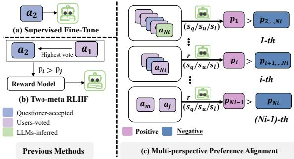  
Figure 7: In PCQA, we compared previous human alignment methods with our approach. (a) SFT aligns only the answer accepted by the questioner $a _ { 2 } .$ , while (b) RLHF compares $a _ { 2 }$ with the highest-voted userspreferred answer $a _ { 1 }$ , sampling two-meta candidates $p _ { i } \succ p _ { j }$ from the entire ranking to train a reward model, and then relies on this reward model to fine-tune the base LLM. (c) Ours contrasts $p _ { i }$ with all members in the preference set $\{ p _ { 1 } , . . . , p _ { N _ { i } } \}$ , based on the preference score, which includes bias scores $s _ { q } .$ vote scores $s _ { u }$ , and content scores $s _ { l } .$

$$
p ^ { * } ( \tau \mid a _ { 1 } , \dots , a _ { K } , q ) = \frac { \exp ( r ^ { * } ( q , a _ { \tau ( k ) } ) ) } { \sum _ { j = k } ^ { K } \exp ( r ^ { * } ( q , a _ { \tau ( j ) } ) ) }\tag{14}
$$

Please note that when $K = 2$ , Equation 14 simplifies to the Bradley-Terry model. However, for the general Plackett-Luce model, we can still utilize the logistic probability to replace the reward function similar with the DPO(Rafailov et al., 2023).

$$
r ( q , a ) = \beta \log \frac { \pi _ { \mathrm { r e f } } ( a \mid q ) } { \pi _ { r } ( a \mid q ) } + \beta \log Z ( q ) .\tag{15}
$$

This Equation 15 represents the reward function in terms of its corresponding optimal policy $\pi _ { r } .$ reference policy $\pi _ { \mathrm { r e f } }$ , and the unknown partition function $Z ( \cdot )$ . When the normalization constant $Z ( x )$ cancels out and we’re left with:

$$
\begin{array} { r l } & { p ^ { * } ( \tau \mid a _ { 1 } , \dots , a _ { K } , q ) = } \\ & { \quad \frac { \exp { ( \beta \log { \frac { \pi ^ { * } ( a _ { \tau ( k ) } | q ) } { \pi _ { \mathrm { r e f } } ( a _ { \tau ( k ) } | q ) } } ) } } { \sum _ { j = k } ^ { K } \exp { ( \beta \log { \frac { \pi ^ { * } ( a _ { \tau ( j ) } | q ) } { \pi _ { \mathrm { r e f } } ( a _ { \tau ( j ) } | q ) } } ) } } } \end{array}\tag{16}
$$

For the PCQA dataset $D = \{ ( q _ { i } , \{ a _ { 1 } , . . . , a _ { N _ { i } } \} ) \}$ which contains prompts and user-specified rank-

ings, we can use a parameterized model and optimize this objective using maximum likelihood:

$$
\begin{array} { r l } & { L ( \pi _ { \theta } , \pi _ { \mathrm { r e f } } ) = } \\ & { \quad - \mathbb { E } \log \frac { \exp \Big ( \beta \log \frac { \pi _ { \theta } ( a _ { \tau ( k ) }  q ) } { \pi _ { \mathrm { r e f } } ( a _ { \tau ( k ) }  q ) } ) } { \sum _ { j = k } ^ { K } \exp \Big ( \beta \log \frac { \pi _ { \theta } ( a _ { \tau ( j ) }  q ) } { \pi _ { \mathrm { r e f } } ( a _ { \tau ( j ) }  q ) } \Big ) } } \end{array}\tag{17}
$$

## 6.2 Dataset

Due to the lack of publicly available high-quality and authentic multi-answer PCQA preference datasets, there is an urgent need to construct a new dataset. To address this issue, we turned to StackExchange, a platform whose forums are accompanied by rich question-and-answer metadata. A publicly available dump of user-contributed content from Stack Overflow, provided by StackExchange under a cc-by-sa 4.0 license, has served as the foundation for the creation of our dataset.

The initial dataset consists of 757,702 $( q _ { i } , a _ { i } )$ pairs, primarily featuring <python> tags, with 600,176 pairs containing code blocks. To obtain the latest answers, we systematically collected all answers for each question q on Stack Overflow up until August 2023, resulting in a dataset totaling 596,613 pairs. Detailed statistics are presented in Table 4. We then performed the following preprocessing steps, and the resulting dataset D contains 270,716 $( q _ { i } , \{ a _ { 1 } , \ldots , a _ { N _ { i } } \} )$ pairs.

• To ensure that submission messages are descriptive, we removed pairs with titles that are shorter than three tokens (including three tokens). This decision follows CCT5 (Lin et al., 2023), which stipulates that code comments should contain more than three tokens.

• Pairs where answer does not contain <code> ... </code> content were eliminated to ensure that MupPCQA’s reference content includes both text and code, due to the nature of PCQA.

• Pairs with an answer pool size smaller than 2 were discarded.

• All HTML tags were cleaned and replaced with "[HTML]", particularly <a href...> and  tags, to ensure the model is not influenced by such exceedingly complex and meaningless content. This decision follows existing research that constructed datasets related to submissions (Husain et al., 2019; Lu et al., 2021).

## 6.3 Implementation Details

Code Llama has demonstrated state-of-the-art performance across various code benchmarks. Therefore, we utilized the MupPCQA framework based on it for preference alignment in PCQA.

In Preference Standardization, we denote $a ^ { i }$ with $\begin{array} { r l r } { a _ { c } } & { { } = } & { 1 } \end{array}$ as $a _ { c } ^ { i }$ and select pairs $( q ^ { i } , a _ { c } ^ { i } )$ from the dataset D with votes $v ^ { i }$ exceeding 100 to form the training and validation dataset. And we specified the following hyperparameters: epoch, temperature, top\_p, max\_seq\_len, and max\_batch\_size, set to 4, 0.2, 0.95, 2048, and 28, respectively. We retained the remaining hyperparameter settings of Llama, which can be found at the following link4.

In Preference Integration, we selected an accessible LLM5 as $M _ { c }$ . The hyperparameters were set: learning\_rate, gradient\_accumulation\_steps, epochs, top\_p, max\_gen\_len, temperature and max\_batch\_size, set to 1e-4, 9, 4, 1.0, 0.95, 512, and 4, respectively.

Given the excellent performance of this retrievalgeneration approach in understanding diverse texts and code, during the Retrieval-augmented Preference Timeliness Mitigation phase, we chose the DocPrompting method based on SimCSE (Zhou et al., 2022) as our retriever $\mathcal { R } _ { D }$ . This retriever $\mathcal { R } _ { D }$ includes 35,763 functions from all Python libraries on DevDocs6, encompassing the Python standard library and widely-used packages such as NumPy and Pandas, and was pre-trained on the re-split CoNaLa (Yin et al., 2018) benchmark.

## 6.4 Related Work

## 6.4.1 Alignment of LLMs.

The language modeling objective of LLMs (e.g., predicting the next word) differs from the ultimate goals in LLM applications, such as following instructions and being helpful, factual, and harmless (Ouyang et al., 2022). Equivalently, the behavior of pre-trained LLMs may not necessarily align with the principles of their intended use cases. Therefore, alignment of LLMs (Song et al., 2024; Agarwal et al., 2024) aims to adjust the outputs of general pre-trained language models to better align with human preferences, significantly improving the performance of LLMs in various downstream applications, such as summarization (Li et al., 2024), translation (Huzaifah et al., 2024), and questionanswering (Chen et al., 2024). Currently, the two most common alignment techniques are instruction tuning (Song et al., 2024; Agarwal et al., 2024) and RLHF (Ouyang et al., 2022). Additionally, emerging alignment techniques such as Constitutional AI (Bai et al., 2022) and self-alignment (Ren et al., 2024) are also gaining attention. These primarily focus on embedding alignment rules into pre-trained models to constrain harmful behavior during inference. However, they have not explored how to align in the presence of diverse user preferences. Our study demonstrates that different users have varying tendencies.

Table 4: Statistics on the size of the answers pool for each question about the PCQA dataset.
<table><tr><td>Count Interval</td><td>[0,2)</td><td>[2,5)</td><td>[5,10)</td><td>[10,15)</td><td>[15,20)</td><td>[20,25)</td><td>[25,30]</td><td>Total</td></tr><tr><td>Count</td><td>325,780</td><td>245,793</td><td>21,986</td><td>2,057</td><td>572</td><td>203</td><td>222</td><td>596,613</td></tr><tr><td>Percentage(%)</td><td>54.60</td><td>41.20</td><td>3.68</td><td>0.35</td><td>0.10</td><td>0.03</td><td>0.04</td><td>100</td></tr></table>

## 6.4.2 Preference Alignment for Question Answering

In recent years, the LLMs (OpenAI, 2023; Anil et al., 2023; Zeng et al., 2022; Touvron et al., 2023a,b) have driven increasingly diverse applications, demonstrating notable expertise in question answering. By fine-tuning on extensive datasets across various programming domains, LLMs have also attained proficiency in synthesizing programs that are both syntactically correct and functionally accurate (Nijkamp et al., 2022; Zheng et al., 2023b; Li et al., 2023; Wang et al., 2023b; Rozière et al., 2023). This capability enables them to adeptly navigate the complexities of programming problems, including conceptual understanding, code generation, API utilization, and debugging.

Recently, reinforcement learning from human feedback (RLHF) (Stiennon et al., 2020; Ouyang et al., 2022; Rozière et al., 2023) has emerged as a milestone method for aligning with human preferences. This approach typically employs the Bradley-Terry model to optimize the neural network’s reward function, followed by fine-tuning the language model using reinforcement learning algorithms, most commonly proximal policy optimization (PPO) (Schulman et al., 2017), to maximize the given reward. Moreover, due to the sensitivity of RL parameters and the complex three-stage process of RLHF, numerous preference alignment methods have been proposed. For instance, RRHF (Yuan et al., 2023) introduced a boundary ranking loss function to optimize LLMs without requiring an additional reward model. DPO (Rafailov et al., 2023) introduced a direct preference optimization method, treating LLMs themselves as the reward model. PRO (Song et al., 2023) optimizes complex preference data through a listwise ranking loss function. Crucially, LLMs exhibit their unique stylistic preferences in content generation, adeptly leveraging retrieved knowledge from prompts. Inspired by these insights, we propose aligning with human preferences through multi-perspective preference scoring by iteratively ranking the preference scores of all answers to a given question, rather than aligning preferences via a reward model.

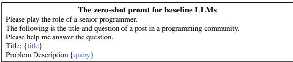

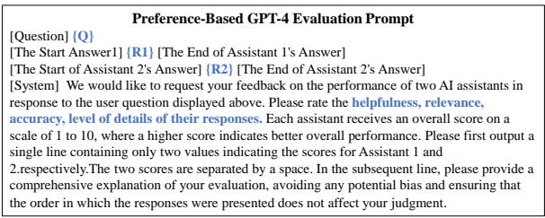  
(b) The prompt of GPT-4 Evaluation

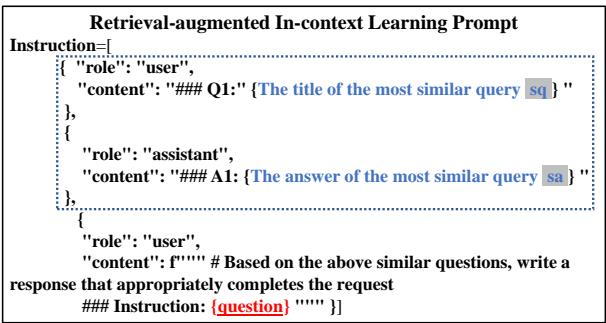  
(c) The QA prompt of Preference Timeliness Mitigation  
Figure 8: The prompt sets

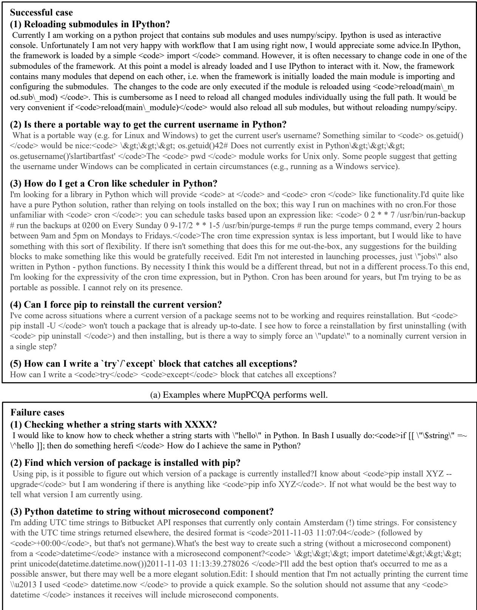  
(b) Examples where MupPCQA performs poorly.  
Figure 9: The Successful and failure cases of the MupPCQA

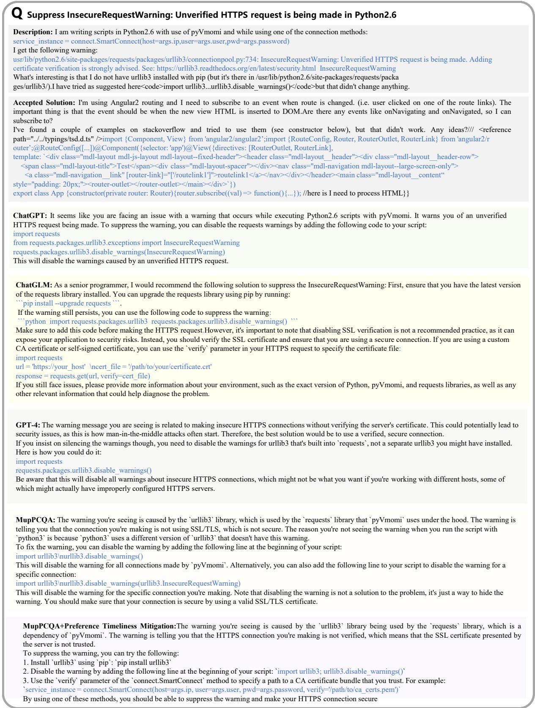  
Figure 10: one real-world post on the programming community and their answers of LLMs.