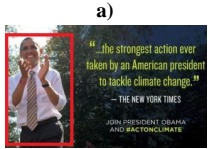
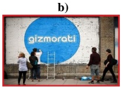
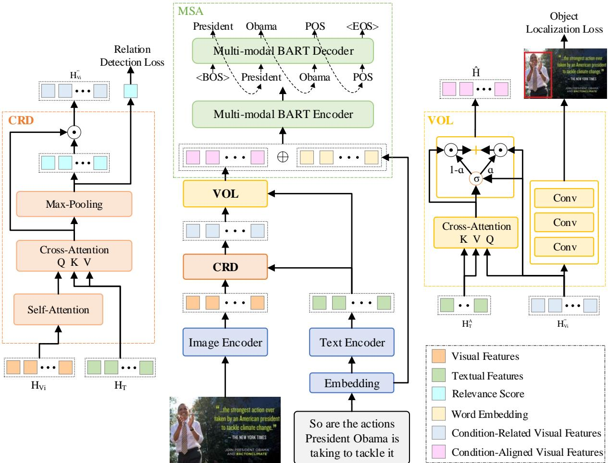
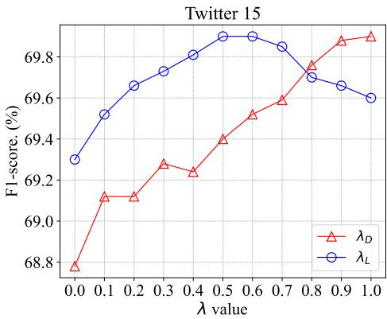
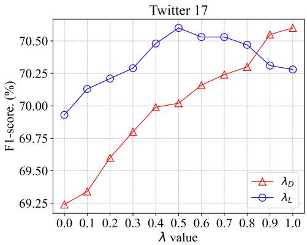
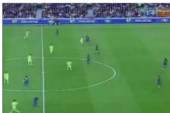
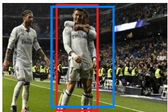

# Multimodal Aspect-Based Sentiment Analysis under Conditional Relation

Xinjing Liu1, Ruifan Li1,3,4\*, Shuqin Ye1, Guangwei Zhang2,3, Xiaojie Wang1,3,4   
1School of Artificial Intelligence, Beijing University of Posts and Telecommunications   
2School of Computer Science, Beijing University of Posts and Telecommunications   
3Engineering Research Center of Information Networks, Ministry of Education, China 4Key Laboratory of Interactive Technology and Experience System, Ministry of Culture and Tourism, China

Correspondence: Ruifan Li {liuxj\_ai, rfli, shuqinye, gwzhang, xjwang}@bupt.edu.cn

## Abstract

Multimodal Aspect-Based Sentiment Analysis (MABSA) aims to extract aspect terms from text-image pairs and identify their sentiments. Previous methods are based on the premise that the image contains the objects referred by the aspects within the text. However, this condition cannot always be met, resulting in a suboptimal performance. In this paper, we propose COnditional Relation based Sentiment Analysis framework (CORSA). Specifically, we design a conditional relation detector (CRD) to mitigate the impact of the unmet conditional image. Moreover, we design a visual object localizer (VOL) to locate the exact conditionrelated visual regions associated with the aspects. With CRD and VOL, our CORSA framework takes a multi-task form. In addition, to effectively learn CORSA we conduct two types of annotations. One is the conditional relation using a pretrained referring expression comprehension model; the other is the bounding boxes of visual objects by a pretrained object detection model. Experiments on our built C-MABSA dataset show that CORSA consistently outperforms existing methods. The code and data are available at https://github.com/Liuxj-Anya/CORSA.

## 1 Introduction

In recent years, fine-grained Multimodal Aspect-Based Sentiment Analysis (MABSA) (Zhao et al., 2024b) has received great attention, due to its significant applications in analyzing social media sentiments. MABSA includes three key subtasks: Multimodal Aspect Term Extraction (MATE), Multimodal Aspect-oriented Sentiment Classification (MASC), and Joint Multimodal Aspects of Sentiment Analysis (JMASA). Given a text-image pair, MATE (Wu et al., 2020a; Li et al., 2023; Guo et al., 2023) aims to extract all the aspect terms mentioned in the text; MASC (Yu and Jiang, 2019; Feng et al., 2024) aims to determine the sentiment towards each given aspect term. JMASA (Ju et al., 2021; Yu et al., 2022; Ling et al., 2022; Liu et al., 2024b) aims to jointly predict the aspect terms and the corresponding sentiments. In Figure 1, JMASA produces two aspect-sentiment pairs, i.e., (President Obama, POS) and (LeBron James, NEU).

<table><tr><td colspan="2"></td><td></td></tr><tr><td>Image</td><td></td><td></td></tr><tr><td>Text</td><td>So are the actions President Obama is taking to tackle it</td><td>LeBron James to Produce NBA Documentary</td></tr><tr><td>Conditional Relation</td><td>Relevance</td><td>Irrelevance</td></tr><tr><td>Output</td><td>(President Obama, POS)</td><td>(LeBron James, NEU)</td></tr></table>

Figure 1: JMASA aims to extract the aspects and identify their corresponding sentiments from a text-image pair. a) The conditional relation for the aspect (i.e., President Obama) and the image is relevant, and the visual information in the box (in red) could benefit for identifying the sentiment. b) The irrelevant visual information would distract the sentiment prediction.

For fine-grained MABSA task, it mainly involves two challenges. One is the semantic complexity. The given sentences often contain multiple aspects, each referring to different objects in the image. The other is the sentimental complexity. These aspects and image regions could carry different sentiments. To this end, recently proposed methods focus on aligning cross-modal text-image precisely. For example, Ling et al. (2022) propose a task-specific vision-language pretraining framework to solve the cross-modal alignment. Zhou et al. (2023) propose an aspect-oriented method to detect aspect-relevant semantic and sentiment information. Very recently, Xiao et al. (2024) propose to utilize the aesthetic information of the images for textual visual alignment and the sentiment-aware image aesthetic assessment.

However, all of previous methods are designed based on the premise that the image always contains the objects referred by the aspects in the text. Unfortunately, this condition sometimes cannot be met, leading to aligning cross-modal text-image inaccurately. The text and image could be irrelevant, especially in social media domain. As shown in Figure 1b), the image does not contain any information about the aspect, i.e., LeBron James which negatively impacts the model’s performance. In contrast, the image-text in Figure 1a) satisfies the condition. The visual information contributes to the sentiment analysis.

To mitigate the negative impact of unqualified image-text pairs, in this paper, we propose COnditional Relation based Sentiment Analysis framework (i.e., CORSA) for MABSA. Firstly, we perform two types of annotations. Specifically, we leverage a pretrained Referring Expression Comprehension (REC) (Yan et al., 2023) model to annotate the conditional relation between an image and aspects. Moreover, a pretrained object detection model is employed to annotate visual objects (i.e., bounding boxes and categories) on two popular datasets.

Secondly, we propose two key modules in our CORSA framework. Conditional Relation Detector (CRD) is designed to filter out visual information irrelevant to the aspects considering their compliance with the condition. Furthermore, to precisely locate condition-related regions with the aspects, we propose Visual Object Localizer (VOL). VOL locates visual objects and uses an attention mechanism to align visual objects with aspects.

Thirdly, we design Multimodal Sentiment Analyzer (MSA) based on an encoder-decoder multimodal Bidirectional and Auto-Regressive Transformers (multimodal BART) (Ling et al., 2022) to obtain the aspect-sentiment pairs.

Our contributions are summarized as follows:

• We propose a multi-task framework, CORSA for MABSA task, involving a detector and a localizer. CRD mitigates the impact of the unmet conditional image-text; VOL locates the exact condition-related visual regions referred by the aspects.

• We perform two types of annotations, conditional relation and bounding boxes on two benchmark datasets. Annotations are automatically performed using two pretrained models, respectively.

• We conduct extensive experiments on two benchmark datasets. The experimental results show the effectiveness of our proposed CORSA model.

## 2 Problem Formulation

We formulate MABSA as a multi-task framework composed of a tuple extraction, a binary classification, and a coordinate regression. Given a tweet containing an image V and a sentence S, we aim to obtain a set for all aspects and the sentimental polarities. These are denoted as $\hat { Y } = \{ ( a _ { k } , s _ { k } ) \} _ { k = 1 } ^ { \bar { K } } ,$ where $a _ { k }$ is the k-th aspect and $s _ { k }$ is its sentiment. In addition, for each sample, we determine a conditional relation $\hat { r }$ and further detect the location of visual objects, generating the bounding boxes $\{ \hat { b } _ { m } \} _ { m = 1 } ^ { B }$ and the categories $\{ \hat { c } _ { j } \} _ { j = 1 } ^ { C }$

## 3 Methodology

## 3.1 Data Generation for C-MABSA

We construct datasets, i.e., C-MABSA with conditional relations for MABSA task. Specifically, we perform two types of annotations automatically on two popular datasets, i.e., TWITTER-15 and TWITTER-17. Firstly, we use a pretrained multi-task universal instance perception model, UNINEXT (Yan et al., 2023) to annotate the conditional relation whether the image contains visual objects referred by the aspects. In UNINEXT, the REC function is adopted. In our settings, UNINEXT takes an aspect and the corresponding image as input and then generates the probability that the image contains the aspect. For samples with more than one aspect, we average the multiple output probabilities. For TWITTER-15, when this probability exceeds a threshold $\tau _ { 1 }$ of 0.7, we annotate the conditional relation as relevant; otherwise as irrelevant. For TWITTER-17, due to its imageaspect pairs being more relevant, the threshold τ1 is set as 0.5 to keep more visual information.

Secondly, we use an object detection model YOLOv8 (Jocher et al., 2023) pretrained on MSCOCO (Lin et al., 2014) to annotate the visual objects in the image, including the bounding boxes and categories. For the object category, we define three types, including person, object, and background. Considering the two benchmark datasets often contain people, food, and other objects, we define the person and other categories. For images without any objects, we define the background category. Thus, YOLOv8 takes an image as input and generates the detected bounding boxes with its category probability. If the probability exceeds the threshold $\tau _ { 2 }$ of 0.8, we annotate the image as person or object; otherwise, we annotate it as a background category. Here, the bounding box is taken as the image size.

  
Figure 2: The framework of our proposed CORSA. Unimodal features are extracted using image and text encoder, respectively. Note that three-scale visual features are used. Then, the conditional relation detector (CRD) uses image and text features to capture condition-related visual features. The visual object localizer (VOL) utilizes condition-related visual features and candidate aspects feature to capture condition-aligned visual features. Finally, the multi-modal BART in multimodal sentiment analysis (MSA) is adopted to extract aspect-sentiment pairs.

## 3.2 Our Proposed Model

Figure 2 provides an overview of CORSA framework. Conditional relation detector (CRD) is to mitigate the impact of the irrelevant condition. Visual object localizer (VOL) is to locate exact conditionrelated regions to specific aspects. Finally, multimodal sentiment analyzer (MSA) built on the multimodal BART encodes multimodal information to extract aspects and the corresponding sentiments.

Visual and Textual Encoders. Our multimodal feature encoder comprises two encoders of vision and language. The textual encoder uses a pretrained

BART (Lewis et al., 2020). We first obtain the initial word embeddings E. Then, BART generates the contextualized representation $H _ { T } \in \mathbb { R } ^ { s \times d }$ Here, s is the length of the sequence S. The visual encoder uses the backbone of YOLOv8 (Jocher et al., 2023) to obtain multi-scale features in an image. Thus, we obtain the visual features in three scales, i.e., $H _ { V _ { 1 } } ~ \in ~ \mathbb { R } ^ { 4 9 \times 2 0 4 8 } , ~ H _ { V _ { 2 } } ~ \in ~ \mathbb { R } ^ { 1 9 6 \times 1 5 3 6 }$ and $H _ { V _ { 3 } } \in \mathbb { R } ^ { 7 8 4 \times 1 0 2 4 }$ . The three features could help the model detect multi-scale objects.

Conditional Relation Detector (CRD). The goal of our CRD is to detect the relevance of imageaspects, thus filtering out irrelevant visual information to the aspects in a given image. Specifically, we first use the self-attention to capture the interactions between different image patches. In other word, we apply three self-attention layers for each of the three scales of visual features as follows,

$$
H _ { V _ { i } } ^ { \prime } = \mathrm { A t t } _ { i } ^ { \mathrm { S L F } } \left( H _ { V _ { i } } W _ { V _ { i } } \right) , i \in \{ 1 , 2 , 3 \}\tag{1}
$$

where $W _ { V _ { i } }$ is the learnable weight and the index i is used for the three scales.

Then, we apply cross-modal attention to model the interaction between the text and the image. We design three cross-modal attention layers. Here, we regard image features $H _ { V _ { i } } ^ { \prime }$ as queries, and the text features $H _ { T }$ as keys and values. The formulation is given as follows,

$$
H _ { V _ { i } } ^ { \prime \prime } = \mathrm { A t t } _ { i } ^ { \mathrm { C M } } \left( H _ { V _ { i } } ^ { \prime } , H _ { T } , H _ { T } \right) , i \in \{ 1 , 2 , 3 \}\tag{2}
$$

where $H _ { V _ { i } } ^ { \prime \prime }$ is the generated text-based image features. Next, we apply max-pooling on the feature $H _ { V _ { i } } ^ { \prime \prime }$ , obtaining the most salient feature, $H _ { V _ { i } } ^ { \mathrm { m a x } }$ Then, based on the most salient feature, we use a softmax function to detect the conditional relation,

$$
\hat { r } _ { i } = \mathrm { S o f t m a x } \left( W _ { R _ { i } } H _ { V _ { i } } ^ { \operatorname* { m a x } } + b _ { R _ { i } } \right) , i \in \{ 1 , 2 , 3 \}\tag{3}
$$

where $W _ { R _ { i } }$ is the learnable weight.

To learn CRD, we use the cross-entropy loss to optimize the binary classification task, i.e.,

$$
\mathcal { L } ^ { \mathrm { C R D } } = - \frac { 1 } { N } \sum _ { n = 1 } ^ { N } \sum _ { i = 1 } ^ { 3 } \log \hat { r } _ { i } ,\tag{4}
$$

where $N$ is the total number of training samples.

Finally, we filter the visual features most relevant to aspects, i.e., condition-related visual features, used in VOL. Specifically, the probability $\boldsymbol { { \hat { r } } _ { i } }$ in $\operatorname { E q }$ (3) indicates the relevant degree of an image-text pair. We use it to construct a visual filter matrix $G _ { i } .$ where each entry equals to the probability $\boldsymbol { { \hat { r } } _ { i } }$ . Thus, we obtain the filtered image feature $H _ { V _ { i } } ^ { \prime \prime \prime }$ , i.e.,

$$
H _ { V _ { i } } ^ { \prime \prime \prime } = G _ { i } \odot H _ { V _ { i } } ^ { \prime \prime } , i \in \{ 1 , 2 , 3 \}\tag{5}
$$

where $\odot$ denotes the element-wise multiplication.

Visual Object Localizer (VOL). VOL aims to further enhance CRD and then localize the exact condition-related regions to the aspects. Specifically, we incorporate an object detector to obtain the bounding box of the visual object and its category. Since multi-scale features are adopted, we apply three object detection headers. Following YOLOv8 (Jocher et al., 2023), we detect visual objects with the previously filtered feature $H _ { V _ { i } } ^ { \prime \prime \prime }$ as input. The formulation is given as follows,

$$
O _ { i } = \mathrm { D E T } ( H _ { V _ { i } } ^ { \prime \prime \prime } ) , i \in \{ 1 , 2 , 3 \}\tag{6}
$$

where $O _ { 1 } ~ \in ~ \mathbb { R } ^ { 4 9 \times 2 4 } , O _ { 2 } ~ \in ~ \mathbb { R } ^ { 1 9 6 \times 2 4 }$ , and $O _ { 3 } \in$ $\mathbb { R } ^ { 7 8 4 \times 2 4 }$ . We predict three bounding boxes at each scale. The column size of $O _ { i }$ equals $[ 3 \times ( 4 + 1 + 3 ) ]$ Here, we have four bounding box offsets $\hat { b } ,$ one object’s prediction $\hat { o } ,$ and three class’s prediction cˆ.

We use two losses to optimize the coordinate regression task. The regression prediction loss is the distance between the predictive boxes and the real boxes. It includes the MSE of boxes’ coordinates,

$$
\mathcal { L } ^ { \mathrm { L O C } } = \frac { 1 } { N } \sum _ { n = 1 } ^ { N } \sum _ { i = 1 } ^ { 3 } \left( b _ { n } ^ { i } - \hat { b } _ { n } ^ { i } \right) ^ { 2 } .\tag{7}
$$

The classification loss is used to predict the class of objects in the boxes. The loss takes the form of cross-entropy loss,

$$
\mathcal { L } ^ { \mathrm { C L S } } = - \frac { 1 } { N } \sum _ { n = 1 } ^ { N } \sum _ { i = 1 } ^ { 3 } \left( c _ { n } ^ { i } \log \hat { c } _ { n } ^ { i } + \log \hat { o } _ { n } ^ { i } \right) ,\tag{8}
$$

where $c _ { n }$ is annotated visual object’s categories and $\hat { c } _ { n }$ is the corresponding prediction.

Then, to obtain the visual object features associated with aspects, we utilize cross-model attention to align visual objects and aspects. Specifically, we use Spacy 1 to extract noun phrases as candidate aspects and obtain their features $H _ { T } ^ { A }$ . The textual features $H _ { T } ^ { A } = \{ h _ { 1 } ^ { A } , h _ { 2 } ^ { A } , . . . , h _ { l } ^ { A } \}$ is obtained from the hidden state $H _ { T }$ of the BART encoder, where l is the number of noun phrases. We use features of all candidate aspects $H _ { T } ^ { A }$ as key-value pairs and visual features $H _ { V _ { i } } ^ { \prime \prime \prime }$ as queries. The process for the aligned visual features is formulated as follows,

$$
H _ { V _ { i } } ^ { A } = \mathrm { A t t } _ { i } ^ { \mathrm { C M } } ( H _ { V _ { i } } ^ { \prime \prime \prime } , H _ { T } ^ { A } , H _ { T } ^ { A } ) , i \in \{ 1 , 2 , 3 \}\tag{9}
$$

Finally, we use gating mechanism to concatenate two visual features, i.e., $H _ { V _ { i } } ^ { \prime \prime \prime }$ and $H _ { V _ { i } } ^ { A }$ as follows,

$$
\left\{ \begin{array} { l l } { \alpha _ { j } = \sigma \left( W _ { \alpha } [ W ^ { \prime \prime \prime } h _ { v _ { j } } ^ { \prime \prime \prime } \oplus W ^ { A } h _ { v _ { j } } ^ { A } ] + b _ { \alpha } \right) } \\ { \hat { h _ { j } } = \alpha _ { j } h _ { v _ { j } } ^ { \prime \prime \prime } + ( 1 - \alpha _ { j } ) h _ { v _ { j } } ^ { A } } \end{array} \right.\tag{10}
$$

where $h _ { v _ { j } } ^ { \prime \prime \prime }$ and $h _ { v _ { j } } ^ { A }$ are j-th column of $H _ { V _ { i } } ^ { \prime \prime \prime }$ and $H _ { V _ { i } } ^ { A }$ , respectively. In addition, $W _ { \alpha } , \ W ^ { \prime \prime \prime }$ and $W ^ { A }$ are learnable weights. Thus, we obtain the condition-aligned visual features $\hat { H } _ { V _ { i } } =$ $\{ \hat { h _ { 1 } } , . . . , \hat { h _ { j } } , . . . , \hat { h _ { m } } \} , i \in \{ 1 , 2 , 3 \}$ . The visual feature ${ \hat { H } } _ { V _ { i } }$ is relevant to aspects and contain the accurate aspect’s visual information.

Multi-modal Sentiment Analyzer (MSA). The goal of MSA is to encode multimodal inputs while decoding aspects and their sentiment. Specifically, we first concatenate the three scales of visual features, i.e., $\hat { H } ^ { \prime } = \hat { H } _ { V _ { 1 } } \oplus W _ { V _ { 2 } } \hat { H } _ { V _ { 2 } } \oplus W _ { V _ { 3 } } \hat { H } _ { V _ { 3 } }$ , where $W _ { V _ { 2 } } \in \mathbb { R } ^ { 4 9 \times 1 9 6 }$ and $W _ { V _ { 3 } } \in \mathbb { R } ^ { 4 9 \times 7 8 4 }$ are learnable weights for obtaining an identical dimension. Then, we use a linear layer to map the concatenated feature to 49-dimension, obtaining a visual feature $\hat { H } ^ { \prime \prime }$ . Second, we use the multimodal BART (Ling et al., 2022) encoder-decoder to predict the token probability distribution $y _ { t }$ as follows,

<table><tr><td rowspan="2"></td><td colspan="3">TWITTER-15</td><td colspan="3">TWITTER-17</td></tr><tr><td>Train</td><td>Dev</td><td>Test</td><td>Train</td><td>Dev</td><td>Test</td></tr><tr><td>Positive</td><td>928</td><td>303</td><td>317</td><td>1508</td><td>515</td><td>493</td></tr><tr><td>Neutral</td><td>1883</td><td>670</td><td>607</td><td>1638</td><td>517</td><td>573</td></tr><tr><td>Negative</td><td>368</td><td>149</td><td>113</td><td>416</td><td>144</td><td>168</td></tr><tr><td>Sentence</td><td>2101</td><td>727</td><td>674</td><td>1746</td><td>577</td><td>587</td></tr><tr><td>Single aspect</td><td>1302</td><td>441</td><td>416</td><td>586</td><td>202</td><td>188</td></tr><tr><td>Multiple aspects</td><td>799</td><td>286</td><td>258</td><td>1160</td><td>375</td><td>399</td></tr></table>

Table 1: Statistics on two benchmark datasets.

$$
\left\{ \begin{array} { l l } { \hat { H } ^ { \prime \prime \prime } = \operatorname { E n c o d e r } ( \hat { H } ^ { \prime \prime } \oplus E ) } \\ { h _ { t } = \operatorname { D e c o d e r } ( \hat { H } ^ { \prime \prime \prime } ; Y _ { < t } ) } \\ { y _ { t } = \operatorname { S o f t m a x } ( W _ { t } h _ { t } + b _ { t } ) } \end{array} \right.\tag{11}
$$

in which, E is the word embedding and $Y _ { < t }$ is the previous time-step decoder outputs. $y _ { t }$ is predicted aspects and sentiment.

To learn MSA, we use the cross-entropy loss to optimize the tuple extraction task, i.e.,

$$
\mathcal { L } ^ { \mathrm { M S A } } = - \frac { 1 } { N } \sum _ { n = 1 } ^ { N } \sum _ { t = 1 } ^ { T } \log y _ { t } ,\tag{12}
$$

where T is the length of $Y$

Finally, to train our CORSA, we use a joint framework by optimize the following loss,

$$
\begin{array} { r } { \mathcal { L } = \lambda _ { D } \mathcal { L } ^ { \mathrm { C R D } } + \lambda _ { L } ( \mathcal { L } ^ { \mathrm { L O C } } + \mathcal { L } ^ { \mathrm { C L S } } ) + \mathcal { L } ^ { \mathrm { M S A } } , } \end{array}\tag{13}
$$

where $\lambda _ { D }$ and $\lambda _ { L }$ are two hyper-parameters.

## 4 Experiment and Analysis

## 4.1 Experimental settings

Datasets. We use two benchmark datasets, Twitter-15 and Twitter-17 (Yu and Jiang, 2019) for all our experimental evaluations. The statistics of these two datasets are summarized in Table 1. Specifically, Twitter15 has fewer aspects for one sample, and one aspect accounts for 61.6%. In contrast, Twitter17 has more aspects, and multiple aspect accounts for 66.7%. Thus, we could evaluate the model’s performance when dealing with various settings.

<table><tr><td rowspan="2">Method</td><td colspan="3">TWITTER-15</td><td colspan="3">TWITTER-17</td></tr><tr><td>P</td><td>R</td><td>F1</td><td>P</td><td>R</td><td>F1</td></tr><tr><td>UMT-collapse (Yu et al., 2020)</td><td>61.0</td><td>60.4</td><td>61.6</td><td>60.8</td><td>60.0</td><td>61.7</td></tr><tr><td>OSCGA-collapse (Wu et al., 2020b)</td><td>63.1</td><td>63.7</td><td>63.2</td><td>63.5</td><td>63.5</td><td>63.5</td></tr><tr><td>RpBERT-collapse (Sun et al., 2021)</td><td>49.3</td><td>46.9</td><td>48.0</td><td>57.0</td><td>55.4</td><td>56.2</td></tr><tr><td>JML (Ju et al., 2021)</td><td>65.0</td><td>63.2</td><td>64.1</td><td>66.5</td><td>65.5</td><td>66.0</td></tr><tr><td>VLP (Ling et al., 2022)</td><td>65.1</td><td>68.3</td><td>66.6</td><td>66.9</td><td>69.2</td><td>68.0</td></tr><tr><td>CMMT (Yang et al., 2022b)</td><td>64.6</td><td>68.7</td><td>66.5</td><td>67.6</td><td>69.4</td><td>68.5</td></tr><tr><td>MOCOLNet (Mu et al., 2023)</td><td>66.3</td><td>67.9</td><td>67.1</td><td>67.3</td><td>68.7</td><td>68.0</td></tr><tr><td>AoM (Zhou et al., 2023)</td><td>67.9</td><td>69.3</td><td>68.6</td><td>68.4</td><td>71.0</td><td>69.7</td></tr><tr><td>M2DF (Zhao et al., 2023)</td><td>67.0</td><td>67.3</td><td>67.6</td><td>67.9</td><td>68.8</td><td>68.3</td></tr><tr><td>Atlantis (Xiao et al., 2024)</td><td>65.6</td><td>69.2</td><td>67.3</td><td>68.6</td><td>70.3</td><td>69.4</td></tr><tr><td>MCPL-VLP (Zhang et al., 2024)</td><td>67.2</td><td>69.2</td><td>68.2</td><td>69.0</td><td>69.4</td><td>69.2</td></tr><tr><td>RNG (Liu et al., 2024b)</td><td>67.8</td><td>69.5</td><td>68.6</td><td>69.5</td><td>71.0</td><td>70.2</td></tr><tr><td>CORSA (Ours)</td><td>69.0</td><td>70.8</td><td>69.9</td><td>70.1</td><td>71.0</td><td>70.6</td></tr></table>

Table 2: Performance comparison on JMASA task.

Evaluation Metrics. For JMASA and MATE tasks, we evaluate the performance of these models by Micro-F1 score (F1), Precision (P), and Recall (R). In addition, following previous works such as (Yu and Jiang, 2019; Zhou et al., 2023), we use Accuracy (Acc) and F1 on MASC task.

Implementation Details. We use AdamW optimizer (Loshchilov and Hutter, 2017) during the training of our CORSA. Specifically, we set the batch size to 32 and the training epoch to 50. The learning rate is set to 7e-5. The two hyperparameters $\lambda _ { D }$ and $\lambda _ { L }$ are set to 1.0 and 0.5.

Baselines. We compare three groups of baselines. They correspond to the main task JMASA and two auxiliary ones, i.e., MATE and MASC. The detailed comments are given in Section 5.

## 4.2 Main Results

We show the performance of CORSA with stateof-the-art baselines on benchmark datasets. The results of the main task, JMASA and the other two tasks, MATE and MASC are reported as follows.

On JMASA. The results for JMASA task are reported in Table 2. Our CORSA model outperforms all multimodal methods on all metrics on Twitter-15 and Twitter-17 datasets. Specifically, our model achieves the improvement of 1.3% and 0.4% with respect to F1 in contrast with the second best model, i.e., RNG, on these two datasets. The results demonstrate the effectiveness of detecting unmet conditional information and localizing exact condition-related regions from the image.

On MATE. As shown in Table 3, our model performs the best in Twitter-15 by 0.1%, which is higher than the second best AoM on F1. The performance of CMMT in Twitter-17 is 0.3% higher than ours. This may due to Twitter-17 containing a larger sample of multiple aspects, as shown in Table 1. Our approach to annotate the conditional relation by averaging the probabilities undermines the conditional relation detection and the sentiment prediction, when dealing with multiple aspects.

<table><tr><td rowspan="2">Method</td><td colspan="3">TWITTER-15</td><td colspan="3">TWITTER-17</td></tr><tr><td>P</td><td>R</td><td>F1</td><td>P</td><td>R</td><td>F1</td></tr><tr><td>RAN (Wu et al., 2020a)</td><td>80.5</td><td>81.5</td><td>81.0</td><td>90.7</td><td>90.7</td><td>90.0</td></tr><tr><td>UMT (Yu et al., 2020)</td><td>77.8</td><td>81.7</td><td>79.7</td><td>86.7</td><td>86.8</td><td>86.7</td></tr><tr><td>OSCGA (Wu et al., 2020b)</td><td>81.7</td><td>82.1</td><td>81.9</td><td>90.2</td><td>90.7</td><td>90.4</td></tr><tr><td>JML (Ju et al., 2021)</td><td>83.6</td><td>81.2</td><td>82.4</td><td>92.0</td><td>90.7</td><td>91.4</td></tr><tr><td>VLP (Ling et al., 2022)</td><td>83.6</td><td>87.9</td><td>85.7</td><td>90.8</td><td>92.6</td><td>91.7</td></tr><tr><td>CMMT (Yang et al., 2022b)</td><td>83.9</td><td>88.1</td><td>85.9</td><td>92.2</td><td>93.9</td><td>93.1</td></tr><tr><td>MNER-QG (Jia et al., 2023)</td><td>77.4</td><td>72.1</td><td>74.7</td><td>88.2</td><td>85.6</td><td>86.9</td></tr><tr><td>PGIM (Li et al., 2023)</td><td>79.2</td><td>79.4</td><td>79.3</td><td>90.8</td><td>92.0</td><td>91.4</td></tr><tr><td>MGICL (Guo et al., 2023)</td><td>80.3</td><td>80.0</td><td>80.1</td><td>91.0</td><td>90.6</td><td>90.9</td></tr><tr><td>Prompt-Me-Up (Hu et al., 2023)</td><td>80.0</td><td>80.9</td><td>80.5</td><td>91.7</td><td>91.3</td><td>91.6</td></tr><tr><td>M2DF (Zhao et al., 2023)</td><td>85.0</td><td>87.2</td><td>86.1</td><td>91.2</td><td>93.0</td><td>92.2</td></tr><tr><td>AoM (Zhou et al., 2023)</td><td>84.6</td><td>87.9</td><td>86.2</td><td>91.8</td><td>92.8</td><td>92.3</td></tr><tr><td>Atlantis (Xiao et al., 2024)</td><td>84.2</td><td>87.7</td><td>86.1</td><td>91.8</td><td>93.2</td><td>92.7</td></tr><tr><td>MCPL-VLP (Zhang et al., 2024)</td><td>84.8</td><td>87.4</td><td>86.1</td><td>91.9</td><td>92.4</td><td>92.2</td></tr><tr><td>CORSA (Ours)</td><td>85.1</td><td>87.6</td><td>86.3</td><td>92.6</td><td>93.0</td><td>92.8</td></tr></table>

Table 3: Performance comparison on MATE task.

<table><tr><td rowspan="2">Method</td><td colspan="2">TWITTER-15</td><td colspan="2">TWITTER-17</td></tr><tr><td>ACC</td><td>F1</td><td>ACC</td><td>F1</td></tr><tr><td>TomBERT (Yu and Jiang, 2019)</td><td>77.2</td><td>71.8</td><td>70.5</td><td>68.0</td></tr><tr><td>CapTrBERT (Khan and Fu, 2021)</td><td>78.0</td><td>73.2</td><td>72.3</td><td>70.2</td></tr><tr><td>FITL (Yang et al., 2022a)</td><td>78.7</td><td>74.7</td><td>73.8</td><td>73.0</td></tr><tr><td>VEMP (Yang and Li, 2023)</td><td>78.88</td><td>75.09</td><td>73.01</td><td>72.42</td></tr><tr><td>JML (Ju et al., 2021)</td><td>78.7</td><td></td><td>72.7</td><td></td></tr><tr><td>VLP (Ling et al., 2022)</td><td>78.6</td><td>73.8</td><td>73.8</td><td>71.8</td></tr><tr><td>CMMT (Yang et al., 2022b)</td><td>77.9</td><td></td><td>73.8</td><td></td></tr><tr><td>SeqCSG (Wang et al., 2023)</td><td>79.3</td><td>75.0</td><td>74.6</td><td>73.2</td></tr><tr><td>ARFN (Xiao et al., 2023)</td><td>78.50</td><td>73.70</td><td>70.58</td><td>68.43</td></tr><tr><td>CoolNet (Huang et al., 2023)</td><td>79.92</td><td>75.28</td><td>71.64</td><td>69.58</td></tr><tr><td>M2DF (Zhao et al., 2023)</td><td>78.9</td><td>74.8</td><td>74.3</td><td>73.0</td></tr><tr><td>AoM (Zhou et al., 2023)</td><td>80.2</td><td>75.9</td><td>76.4</td><td>75.0</td></tr><tr><td>A²II (Feng et al., 2024)</td><td>79.5</td><td>75.1</td><td>74.3</td><td>72.3</td></tr><tr><td>Atlantis (Xiao et al., 2024)</td><td>79.3</td><td></td><td>74.2</td><td></td></tr><tr><td>AMIFN (Yang et al., 2024)</td><td>78.69</td><td>75.50</td><td>72.29</td><td>70.21</td></tr><tr><td>MCPL-VLP (Zhang et al., 2024)</td><td>79.3</td><td>74.9</td><td>75.1</td><td>74.0</td></tr><tr><td>CORSA (Our)</td><td>81.1</td><td>77.7</td><td>76.6</td><td>74.5</td></tr></table>

Table 4: Performance comparison on MASC task.

On MASC. Table 4 shows the performance of MASC. Our model achieves the best results with the improvement of 0.9% on Accuracy, 1.8% on F1 score on Twitter-15 and 0.2% on Accuracy on Twitter-17. AoM’s F1 on Twitter-17 is 0.5% higher than that of our CORSA. In fact, the reason behind is the same as on MATE task. In other words, the inaccuracies in our annotation method is imperfect.

## 4.3 Ablation Study

In this section, we conduct ablation studies on Twitter-15 and Twitter-17 of the JMASA task.

To verify the effectiveness of CRD and VOL in CORSA, we perform the ablation studies. The results are reported in Table 5. First, we remove CRD. The obtained F1 scores decline by 0.9% on

<table><tr><td rowspan="2">Method</td><td colspan="3">TWITTER-15</td><td colspan="3">TWITTER-17</td></tr><tr><td>P</td><td>R</td><td>F1</td><td>P</td><td>R</td><td>F1</td></tr><tr><td>Full CORSA</td><td>69.0</td><td>70.8</td><td>69.9</td><td>70.1</td><td>71.0</td><td>70.6</td></tr><tr><td>w/o CRD</td><td>68.4</td><td>70.0</td><td>69.0</td><td>69.7</td><td>69.6</td><td>69.6</td></tr><tr><td>w/o VOL</td><td>68.1</td><td>70.5</td><td>69.3</td><td>69.4</td><td>70.7</td><td>70.0</td></tr><tr><td>w/o CRD+VOL</td><td>67.1</td><td>69.1</td><td>68.0</td><td>68.5</td><td>69.7</td><td>69.1</td></tr></table>

Table 5: The performance comparison of our full model and its variants.

<table><tr><td rowspan="2">Scale</td><td colspan="3">TWITTER-15</td><td colspan="3">TWITTER-17</td></tr><tr><td>P</td><td>R</td><td>F1</td><td>P</td><td>R</td><td>F1</td></tr><tr><td>Full CORSA</td><td>69.0</td><td>70.8</td><td>69.9</td><td>70.1</td><td>71.0</td><td>70.6</td></tr><tr><td>L</td><td>66.0</td><td>69.7</td><td>67.8</td><td>68.4</td><td>70.0</td><td>69.2</td></tr><tr><td>M</td><td>66.7</td><td>70.4</td><td>68.5</td><td>69.7</td><td>69.3</td><td>69.5</td></tr><tr><td>S</td><td>67.6</td><td>70.7</td><td>69.1</td><td>70.0</td><td>69.8</td><td>69.9</td></tr><tr><td>L+M</td><td>68.0</td><td>69.7</td><td>68.9</td><td>69.2</td><td>70.3</td><td>69.7</td></tr><tr><td>L+S</td><td>69.2</td><td>69.3</td><td>69.2</td><td>68.7</td><td>69.1</td><td>70.1</td></tr><tr><td>M+S</td><td>69.6</td><td>69.5</td><td>69.6</td><td>69.4</td><td>71.2</td><td>70.3</td></tr></table>

Table 6: Ablation results on scales of the visual encoder.

Twitter-15 and 1.0% on Twitter-17. It shows that the damage inflicted by unmet conditional image information and the necessary elimination of such information. Second, we remove VOL. We observe that the model’s performance on Twitter-15 and Twitter-17 has also declined notably. The results demonstrate the importance of locating conditionrelated regions. Meanwhile, we notice that the performance decline of removing CRD is more remarkable than that of removing VOL. This demonstrates the significance of the processing sequence, i.e., first eliminating unmet conditional image information and then localizing the exact conditionrelated regions. Third, we remove both CRD and VOL. The decrease in the model’s performance shows their contributions to learning the most valuable information.

To show the advantage of using multi-scale features, we perform ablations. Specifically, we compare the performances of using only small scale $( \mathrm { i } . \mathbf { e } . , H _ { V _ { 1 } } )$ , middle scale $( \mathrm { i } . \mathrm { e } , H _ { V _ { 2 } } )$ , and large scale $( \mathrm { i } . \mathbf { e } . , H _ { V _ { 3 } } )$ , and a combination of any two scales, respectively. The experimental results are reported in Table 6. This result shows the use of multi-scale features facilitates the model’s prediction. In addition, small-scale features in our stetting is more beneficial to the model.

To show the effect of two hyper-parameters $\lambda _ { D }$ and $\lambda _ { L }$ in our loss, we perform experiments as follows. To be brief, we fix the parameter $\lambda _ { D }$ 1.0 to evaluate the parameter $\lambda _ { L }$ . On the other hand, we fix the parameter $\lambda _ { L } = 0 . 5$ to evaluate the parameter $\lambda _ { D } .$ . The experimental results are shown in Figure 3. Therefore, we suppose that our CORSA model is optimal when the two parameters $\lambda _ { D }$ equals 1.0 and $\lambda _ { L }$ equals 0.5, respectively.

  
Figure 3: F1-score against two hyper-parameters $\lambda _ { D }$ and $\lambda _ { L }$ on two benchmark datasets for JMASA task.

<table><tr><td rowspan="2">Threshold T1</td><td colspan="3">TWITTER-15</td><td colspan="3">TWITTER-17</td></tr><tr><td>P</td><td>R</td><td>F1</td><td>P</td><td>R</td><td>F1</td></tr><tr><td>0.4</td><td>67.5</td><td>69.7</td><td>68.6</td><td>68.8</td><td>70.8</td><td>69.8</td></tr><tr><td>0.5</td><td>67.6</td><td>70.2</td><td>68.9</td><td>70.1</td><td>71.0</td><td>70.6</td></tr><tr><td>0.6</td><td>69.6</td><td>69.3</td><td>69.4</td><td>69.6</td><td>70.6</td><td>70.1</td></tr><tr><td>0.7</td><td>69.0</td><td>70.8</td><td>69.9</td><td>69.0</td><td>69.8</td><td>69.4</td></tr><tr><td>0.8</td><td>68.8</td><td>70.5</td><td>69.6</td><td>68.9</td><td>69.5</td><td>69.2</td></tr></table>

Table 7: The performance comparison of different annotating threshold $\tau _ { 1 }$ for CRD.

<table><tr><td rowspan="2">Threshold T2</td><td colspan="3">TWITTER-15</td><td colspan="3">TWITTER-17</td></tr><tr><td>P</td><td>R</td><td>F1</td><td>P</td><td>R</td><td>F1</td></tr><tr><td>0.6</td><td>68.7</td><td>69.5</td><td>69.1</td><td>69.6</td><td>70.2</td><td>69.9</td></tr><tr><td>0.7</td><td>69.8</td><td>69.0</td><td>69.5</td><td>69.2</td><td>70.9</td><td>70.1</td></tr><tr><td>0.8</td><td>69.0</td><td>70.8</td><td>69.9</td><td>70.1</td><td>71.0</td><td>70.6</td></tr></table>

Table 8: The performance comparison of different annotating thresholds $\tau _ { 2 }$ for VOL.

To show the impact of various thresholds in our annotation data generation, we perform the following experiments. Specifically, we first evaluate the annotating conditional relation with thresholds $\tau _ { 1 }$ of 0.4, 0.5, 0.6, 0.7, and 0.8. The results are shown in Table 7. The thresholds $\tau _ { 1 }$ of 0.7 and 0.5 are chosen for Twitter-15 and Twitter-17, respectively. Compared to those in Twitter-15, the aspects in Twitter-17 have better relevance to the corresponding images. Secondly, we evaluate the annotating visual objects with various thresholds $\tau _ { 2 }$ of 0.6, 0.7 and 0.8. The results are shown in Table 8. Therefore, the threshold $\tau _ { 2 }$ of 0.8 is chosen.

<table><tr><td rowspan="2">Method</td><td colspan="3">TWITTER-15</td><td colspan="3">TWITTER-17</td></tr><tr><td>P</td><td>R</td><td>F1</td><td>P</td><td>R</td><td>F1</td></tr><tr><td>ChatGPT 3.5</td><td>54.3</td><td>53.6</td><td>55.0</td><td>58.2</td><td>57.6</td><td>58.8</td></tr><tr><td>Llama 2</td><td>51.4</td><td>50.9</td><td>51.9</td><td>55.8</td><td>55.6</td><td>56.1</td></tr><tr><td>CORSA (Ours)</td><td>69.0</td><td>70.8</td><td>69.9</td><td>70.1</td><td>71.0</td><td>70.6</td></tr></table>

Table 9: The performance comparison with LLMs on JMASA task.

## 4.4 Comparison with LLMs

Recently, large-scale language models have evolved extremely rapidly and have advanced language understanding and generation skills in a variety of NLP tasks. Therefore, we conduct experiments on LLMs and MLLMs to compare with CORSA. Firstly, we compare our model with Chat-GPT 3.5 (OpenAI, 2023) and Llama 2 (Touvron et al., 2023) on the JMASA task. Here, we use only text as input, since they cannot support multimodal input. Table 9 shows the result that our model obtains better performance than these two LLMs. Secondly, to demonstrate the superiority of the usage of multimodal input, we compare our model with MLLM, including VisualGLM-6B (Du et al., 2022), Llava 1.5 (Liu et al., 2024a), MMICL (Zhao et al., 2024a), mPLUG-Owl2 (Ye et al., 2024) and GPT4V (OpenAI, 2024) on the MASC task. Table 10 shows the experimental results. The results demonstrate that our model achieves higher performance, even though with fewer parameters.

## 4.5 Case Study

Figure 4 shows four examples with their predictions from VLP-MABSA (Ling et al., 2022), AoM (Zhou et al., 2023), and our CORSA model.

Consider the left two columns. For the first example, VLP-MABSA and AoM incorrectly predict the sentiment of aspects Kingston and Glen Eira as positive. It is due to the condition that the image contains the objects referred by the aspect Kingston and Glen Eira cannot be met. And the girl’s smiling face misleads incorrect predictions. Our CORSA model filters information about the girl in the image and could predict correctly. The image in the second example does not contain information about Lionel Messi. Therefore, for the same reason, VLP-MABSA and AoM wrongly utilize the information, and give incorrect predictions. Our CORSA model obtains the correct predictions due to filtering the unmet conditional image information. The results demonstrate the importance of filtering unmet conditional information from the image.

  
School holiday program kicks off in Kingston and Glen Eira.

  
RT @ UberFootbalI: On this day, 8-years ago, a 19 - year old Lionel Messi did this . Wow .

  
@ CristianoRonaldo set for a @ ManUtd return next season # # SSFo-Otball.

  
David Cameron unveils his most convincing argument yet to stay in the EU.

<table><tr><td>Conditional Relation</td><td>Irrelevance</td><td>Irrelevance</td><td>Relevance</td><td>Relevance</td></tr><tr><td>GT</td><td>(Kingston, NEU) (Glen Eira, NEU)</td><td>(Lionel Messi, POS)</td><td>(CristianoRonaldo, POS) (ManUtd, NEU)</td><td>(David Cameron, NEG) (EU, NEU)</td></tr><tr><td>VLP</td><td>(Kingston, POS) × (Glen Eira, POS) ×</td><td>(Lionel Messi, NEU) ×</td><td>(CristianoRonaldo, NEU) × (ManUtd, NEU) √</td><td>(David Cameron, NEU) × (EU, NEU) √</td></tr><tr><td>AoM</td><td>(Kingston, POS) × (Glen Eira, POS) ×</td><td>(Lionel Messi, NEU) ×</td><td>(CristianoRonaldo, NEU)× (ManUtd, NEU)√</td><td>(David Cameron, NEG) √ (EU, NEG) ×</td></tr><tr><td>CORSA</td><td>(Kingston, NEU)√ (Glen Eira, NEU) √</td><td>(Lionel Messi, POS)√</td><td>(CristianoRonaldo, POS) √ (ManUtd, NEU) √</td><td>(David Cameron, NEG)√ (EU, NEU) √</td></tr></table>

Figure 4: The results of the comparison among different methods on four testing samples. The left two columns are two unmet conditional samples; the other two columns are met conditional samples. The ground-truth and predicted bounding boxes for VOL are visualized as red and blue boxes, respectively.

<table><tr><td rowspan="2">Method</td><td colspan="2">TWITTER-15</td><td colspan="2">TWITTER-17</td></tr><tr><td>ACC</td><td>F1</td><td>ACC</td><td>F1</td></tr><tr><td>VisualGLM-6B</td><td>66.1</td><td>68.2</td><td>69.0</td><td>68.5</td></tr><tr><td>Llava 1.5</td><td>77.9</td><td>74.3</td><td>74.6</td><td>74.3</td></tr><tr><td>MMICL</td><td>76.0</td><td>72.7</td><td>74.1</td><td>74.0</td></tr><tr><td>mPLUG-Owl2</td><td>76.8</td><td>72.3</td><td>74.2</td><td>73.0</td></tr><tr><td>GPT4V</td><td>75.3</td><td>74.2</td><td>76.0</td><td>75.5</td></tr><tr><td>CORSA (Our)</td><td>81.1</td><td>77.7</td><td>76.6</td><td>74.5</td></tr></table>

Table 10: The performance comparison with Multimodal LLMs (MLLMs) on MASC task.

Consider the right two columns. For the first example, VLP-MABSA and AoM do not correctly predict the positive sentiment in CristianoRonaldo. These two methods cannot detect the aspect CristianoRonaldo related visual Information, especially the smiling face of the man in the image. Our model explicitly detect the exact condition-related regions with CristianoRonaldo, correctly predicting its positive sentiment. Similarly, in the second example, due to the lack of explicitly locating exact condition-related regions, VLP-MABSA and AoM incorrectly predict the sentiments of two aspects. Our model gives correct predictions.

## 5 Related Work

MABSA consists of three related tasks: MATE, MASC, and JMASA. On MATE. Earlier methods (Moon et al., 2018; Arshad et al., 2019; Wu et al., 2020a) adopt cross-modal attention mechanisms. These methods are too simple to effectively learn multimodal information. Recent methods (Yu et al., 2020; Liu et al., 2022; Zheng et al., 2023) use pretrained language models and modality translationbased approaches. With the wide applications of large-scale generative models, Yu et al. (2023) expand Multimodal NER methods to MATE with a generative framework.

On MASC. Existing MASC methods are usually based on attention mechanisms and graph convolutional networks (GCNs). For example, Zhang et al. (2021) introduce an attention network with a discriminative mechanism. Xiao et al. (2023) propose a crossmodal fine-grained alignment and fusion network. Zhao and Yang (2023) propose a fusion model with GCN and SE-ResNeXt network. To solve the problem of irrelevant aspects-images, Wang et al. (2023) design an aspect-oriented filtration module which utilizes the given aspects to compute attention scores with sentence as well as image. However, this method of calculating the relevance scores between the given aspects to the images cannot transfer well to JMASA, in which the aspects are not given. Recently, some methods adopt LLMs. Feng et al. (2024) propose to use LLVM during the fusion of textual and visual modalities.

On JMASA. Some methods are based on the pipeline framework. Ju et al. (2021) jointly learn MATE and MASC tasks. Yang et al. (2022b) introduce a text-guided cross-modal interaction module to dynamically control the contributions of the visual information. This pipeline approach ignores the potential semantic associations between these two tasks. Other methods are based on generative models. Ling et al. (2022) propose a task specific Vision-Language Pretraining framework. Zhou et al. (2023) propose to detect aspect-relevant semantic and sentiment information. This generative approach could flexibly produce complex text, but their training are time-consuming. Recently, Liu et al. (2024b) propose a framework which implicitly calculates the similarity between the sentences and the images to simultaneously reduce multilevel modality noise and multi-grained semantic gap. However, this method lacks explicit monitoring of aspect-image relevance, and therefore cannot learn fine-grained relations.

Unfortunately, most of previous works ignore the multimodal conditional relations between the images and texts when performing MABSA task. The premise that the image contains the objects referred by the aspects within the text sometimes cannot be met. In this paper, we propose CORSA framework by explicitly considering this issue.

## 6 Conclusion and Future Work

In this paper, we propose CORSA framwork for MABSA. Our CORSA involves two key modules, CRD and VOL. CRD is designed to mitigate the impact of the unmet conditional image. VOL aims to locate the exact condition-related visual regions with the aspects. We perform two types of annotations on benchmark datasets for training. Extensive experimental results show the effectiveness of our proposed CORSA model. Although our model achieves significant performance, there are still room for improvement. In the future, we consider exploring annotation methods, such as using MLLMs to improve the accuracy of the annotation.

## Limitation

Our method still has some limitations. We automatically annotate the data using a pretrained model (UNINEXT), which would cause the problem of inaccuracies. In other words, we have no groundtruth for this conditional relation. Therefore, on one side, we cannot perform accurate statistics on the conditional relation on these two benchmark datasets. On the other side, the inaccuracies affect the CORSA model’s performance. These limitations present challenges for further investigations.

## Acknowledgment

This work was supported by the National Nature Science Foundation of China under Grant 62076032 and the CCF-Zhipu Large Model Innovation Fund (NO. CCF-Zhipu202407). In addition, the authors thank the anonymous reviewers for their constructive feedback.

## References

Omer Arshad, Ignazio Gallo, Shah Nawaz, and Alessandro Calefati. 2019. Aiding intra-text representations with visual context for multimodal named entity recognition. In 2019 International conference on document analysis and recognition (ICDAR), pages 337–342. IEEE.

Zhengxiao Du, Yujie Qian, Xiao Liu, Ming Ding, Jiezhong Qiu, Zhilin Yang, and Jie Tang. 2022. GLM: General language model pretraining with autoregressive blank infilling. In Proceedings of the 60th Annual Meeting of the Association for Computational Linguistics (Volume 1: Long Papers), pages 320–335, Dublin, Ireland. Association for Computational Linguistics.

Junjia Feng, Mingqian Lin, Lin Shang, and Xiaoying Gao. 2024. Autonomous aspect-image instruction a2ii: Q-former guided multimodal sentiment classification. In Proceedings of the 2024 Joint International Conference on Computational Linguistics, Language Resources and Evaluation (LREC-COLING 2024), pages 1996–2005.

Aibo Guo, Xiang Zhao, Zhen Tan, and Weidong Xiao. 2023. Mgicl: multi-grained interaction contrastive learning for multimodal named entity recognition. In Proceedings of the 32nd ACM International Conference on Information and Knowledge Management, pages 639–648.

Xuming Hu, Junzhe Chen, Aiwei Liu, Shiao Meng, Lijie Wen, and Philip S Yu. 2023. Prompt me up: Unleashing the power of alignments for multimodal entity and relation extraction. In Proceedings ofthe 31st ACM International Conference on Multimedia, pages 5185–5194.

Yufeng Huang, Zhuo Chen, Jiaoyan Chen, Jeff Z Pan, Zhen Yao, and Wen Zhang. 2023. Target-oriented sentiment classification with sequential cross-modal semantic graph. In International Conference on Artificial Neural Networks, pages 587–599. Springer.

Meihuizi Jia, Lei Shen, Xin Shen, Lejian Liao, Meng Chen, Xiaodong He, Zhendong Chen, and Jiaqi Li. 2023. Mner-qg: An end-to-end mrc framework for multimodal named entity recognition with query grounding. In Proceedings ofthe AAAI conference on artificial intelligence, volume 37, pages 8032–8040.

Glenn Jocher, Ayush Chaurasia, and Jing Qiu. 2023. Ultralytics YOLO.

Xincheng Ju, Dong Zhang, Rong Xiao, Junhui Li, Shoushan Li, Min Zhang, and Guodong Zhou. 2021. Joint multi-modal aspect-sentiment analysis with auxiliary cross-modal relation detection. In Proceedings ofthe 2021 conference on empirical methods in natural language processing, pages 4395–4405.

Zaid Khan and Yun Fu. 2021. Exploiting bert for multimodal target sentiment classification through input space translation. In Proceedings of the 29th ACM international conference on multimedia, pages 3034– 3042.

Mike Lewis, Yinhan Liu, Naman Goyal, Marjan Ghazvininejad, Abdelrahman Mohamed, Omer Levy, Veselin Stoyanov, and Luke Zettlemoyer. 2020. BART: Denoising sequence-to-sequence pre-training for natural language generation, translation, and comprehension. In Proceedings of the 58th Annual Meeting ofthe Associationfor Computational Linguistics, pages 7871–7880, Online. Association for Computational Linguistics.

Jinyuan Li, Han Li, Zhuo Pan, Di Sun, Jiahao Wang, Wenkun Zhang, and Gang Pan. 2023. Prompting chatgpt in mner: enhanced multimodal named entity recognition with auxiliary refined knowledge. arXiv preprint arXiv:2305.12212.

Tsung-Yi Lin, Michael Maire, Serge Belongie, James Hays, Pietro Perona, Deva Ramanan, Piotr Dollár, and C Lawrence Zitnick. 2014. Microsoft coco: Common objects in context. In Computer Vision– ECCV 2014: 13th European Conference, Zurich, Switzerland, September 6-12, 2014, Proceedings, Part V 13, pages 740–755. Springer.

Yan Ling, Jianfei Yu, and Rui Xia. 2022. Visionlanguage pre-training for multimodal aspect-based sentiment analysis. In Proceedings of the 60th Annual Meeting of the Association for Computational Linguistics (Volume 1:Long Papers), page 2149–2159.

Haotian Liu, Chunyuan Li, Yuheng Li, and Yong Jae Lee. 2024a. Improved baselines with visual instruction tuning. In Proceedings of the IEEE/CVF Conference on Computer Vision and Pattern Recognition, pages 26296–26306.

Luping Liu, Meiling Wang, Mozhi Zhang, Linbo Qing, and Xiaohai He. 2022. Uamner: uncertainty-aware multimodal named entity recognition in social media posts. Applied Intelligence, 52(4):4109–4125.

Yaxin Liu, Yan Zhou, Ziming Li, Jinchuan Zhang, Yu Shang, Chenyang Zhang, and Songlin Hu. 2024b. Rng: Reducing multi-level noise and multi-grained semantic gap for joint multimodal aspect-sentiment analysis. 2024 IEEE International Conference on Multimedia and Expo.

Ilya Loshchilov and Frank Hutter. 2017. Fixing weight decay regularization in adam. CoRR, abs/1711.05101.

Seungwhan Moon, Leonardo Neves, and Vitor Carvalho. 2018. Multimodal named entity recognition for short social media posts. In Proceedings ofthe 2018 Conference ofthe North American Chapter ofthe Association for Computational Linguistics: Human Language Technologies, Volume 1 (Long Papers), pages 852–860, New Orleans, Louisiana. Association for Computational Linguistics.

Jie Mu, Feiping Nie, Wei Wang, Jian Xu, Jing Zhang, and Han Liu. 2023. Mocolnet: A momentum contrastive learning network for multimodal aspect-level sentiment analysis. IEEE Transactions on Knowledge and Data Engineering.

OpenAI. 2023. Chatgpt: A large language model.

OpenAI. 2024. Gpt-4 technical report. Preprint, arXiv:2303.08774.

Lin Sun, Jiquan Wang, Kai Zhang, Yindu Su, and Fangsheng Weng. 2021. Rpbert: a text-image relation propagation-based bert model for multimodal ner. In Proceedings ofthe AAAI conference on artificial intelligence, volume 35, pages 13860–13868.

Hugo Touvron, Louis Martin, Kevin Stone, Peter Albert, Amjad Almahairi, Yasmine Babaei, Nikolay Bashlykov, Soumya Batra, Prajjwal Bhargava, Shruti Bhosale, et al. 2023. Llama 2: Open foundation and fine-tuned chat models. arXiv preprint arXiv:2307.09288.

Qianlong Wang, Hongling Xu, Zhiyuan Wen, Bin Liang, Min Yang, Bing Qin, and Ruifeng Xu. 2023. Imageto-text conversion and aspect-oriented filtration for multimodal aspect-based sentiment analysis. IEEE Transactions on Affective Computing.

Hanqian Wu, Siliang Cheng, Jingjing Wang, Shoushan Li, and Lian Chi. 2020a. Multimodal aspect extraction with region-aware alignment network. In Natural Language Processing and Chinese Computing: 9th CCF International Conference, NLPCC 2020, Zhengzhou, China, October 14–18, 2020, Proceedings, Part I 9, pages 145–156. Springer.

Zhiwei Wu, Changmeng Zheng, Yi Cai, Junying Chen, Ho-fung Leung, and Qing Li. 2020b. Multimodal representation with embedded visual guiding objects

for named entity recognition in social media posts. In Proceedings ofthe 28th ACM International Conference on Multimedia, pages 1038–1046.

Luwei Xiao, Xingjiao Wu, Junjie Xu, Weijie Li, Cheng Jin, and Liang He. 2024. Atlantis: Aesthetic-oriented multiple granularities fusion network for joint multimodal aspect-based sentiment analysis. Information Fusion, 106:102304.

Luwei Xiao, Xingjiao Wu, Shuwen Yang, Junjie Xu, Jie Zhou, and Liang He. 2023. Cross-modal fine-grained alignment and fusion network for multimodal aspectbased sentiment analysis. Information Processing & Management, 60(6):103508.

Bin Yan, Yi Jiang, Jiannan Wu, Dong Wang, Ping Luo, Zehuan Yuan, and Huchuan Lu. 2023. Universal instance perception as object discovery and retrieval. In Proceedings ofthe IEEE/CVF Conference on Computer Vision and Pattern Recognition, pages 15325– 15336.

Bin Yang and Jinlong Li. 2023. Visual elements mining as prompts for instruction learning for target-oriented multimodal sentiment classification. In Findings of the Association for Computational Linguistics: EMNLP 2023, pages 6062–6075.

Hao Yang, Yanyan Zhao, and Bing Qin. 2022a. Facesensitive image-to-emotional-text cross-modal translation for multimodal aspect-based sentiment analysis. In Proceedings ofthe 2022 conference on empirical methods in natural language processing, pages 3324–3335.

Juan Yang, Mengya Xu, Yali Xiao, and Xu Du. 2024. Amifn: Aspect-guided multi-view interactions and fusion network for multimodal aspect-based sentiment analysis. Neurocomputing, 573:127222.

Li Yang, Jin-Cheon Na, and Jianfei Yu. 2022b. Crossmodal multitask transformer for end-to-end multimodal aspect-based sentiment analysis. Information Processing & Management, 59(5):103038.

Qinghao Ye, Haiyang Xu, Jiabo Ye, Ming Yan, Anwen Hu, Haowei Liu, Qi Qian, Ji Zhang, and Fei Huang. 2024. mplug-owl2: Revolutionizing multimodal large language model with modality collaboration. In Proceedings ofthe IEEE/CVF Conference on Computer Vision and Pattern Recognition, pages 13040–13051.

Jianfei Yu and Jing Jiang. 2019. Adapting bert for target-oriented multimodal sentiment classification. In Proceedings of the Twenty-Eighth International Joint Conference on Artificial Intelligence. IJCAI.

Jianfei Yu, Jing Jiang, Li Yang, and Rui Xia. 2020. Improving multimodal named entity recognition via entity span detection with unified multimodal transformer. In Proceedings of the 58th Annual Meeting ofthe Associationfor Computational Linguistics. Association for Computational Linguistics.

Jianfei Yu, Ziyan Li, Jieming Wang, and Rui Xia. 2023. Grounded multimodal named entity recognition on social media. In Proceedings of the 61st Annual Meeting of the Association for Computational Linguistics (Volume 1: Long Papers), pages 9141–9154.

Zhewen Yu, Jin Wang, Liang-Chih Yu, and Xuejie Zhang. 2022. Dual-encoder transformers with crossmodal alignment for multimodal aspect-based sentiment analysis. In Proceedings ofthe 2nd Conference of the Asia-Pacific Chapter of the Association for Computational Linguistics and the 12th International Joint Conference on Natural Language Processing (Volume 1: Long Papers), pages 414–423, Online only. Association for Computational Linguistics.

Jing Zhang, Jiaqi Qu, Jiangpei Liu, and Zhe Wang. 2024. Mcpl: Multi-model co-guided progressive learning for multimodal aspect-based sentiment analysis. Knowledge-Based Systems, 301:112331.

Zhe Zhang, Zhu Wang, Xiaona Li, Nannan Liu, Bin Guo, and Zhiwen Yu. 2021. Modalnet: an aspectlevel sentiment classification model by exploring multimodal data with fusion discriminant attentional network. World Wide Web, 24:1957–1974.

Fei Zhao, Chunhui Li, Zhen Wu, Yawen Ouyang, Jianbing Zhang, and Xinyu Dai. 2023. M2df: Multigrained multi-curriculum denoising framework for multimodal aspect-based sentiment analysis. Proceedings of the 2023 conference on empirical methods in natural language processing.

Haozhe Zhao, Zefan Cai, Shuzheng Si, Xiaojian Ma, Kaikai An, Liang Chen, Zixuan Liu, Sheng Wang, Wenjuan Han, and Baobao Chang. 2024a. Mmicl: Empowering vision-language model with multi-modal in-context learning. the 12th International Conference on Learning Representations.

Hua Zhao, Manyu Yang, Xueyang Bai, and Han Liu. 2024b. A survey on multimodal aspect-based sentiment analysis. IEEE Access.

Jun Zhao and Fuping Yang. 2023. Fusion with gcn and se-resnext network for aspect based multimodal sentiment analysis. In 2023 IEEE 6th Information Technology, Networking, Electronic and Automation Control Conference (ITNEC), volume 6, pages 336– 340. IEEE.

Changmeng Zheng, Junhao Feng, Yi Cai, Xiaoyong Wei, and Qing Li. 2023. Rethinking multimodal entity and relation extraction from a translation point of view. In Proceedings of the 61st Annual Meeting of the Association for Computational Linguistics (Volume 1: Long Papers), pages 6810–6824.

Ru Zhou, Wenya Guo, Xumeng Liu, Shenglong Yu, Ying Zhang, and Xiaojie Yuan. 2023. Aom: Detecting aspect-oriented information for multimodal aspect-based sentiment analysis. In Proceedings of the 61th Annual Meeting ofthe Associationfor Computational Linguistics (Volume 1:Long Papers).