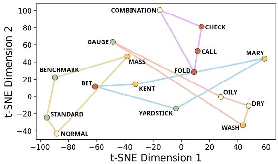
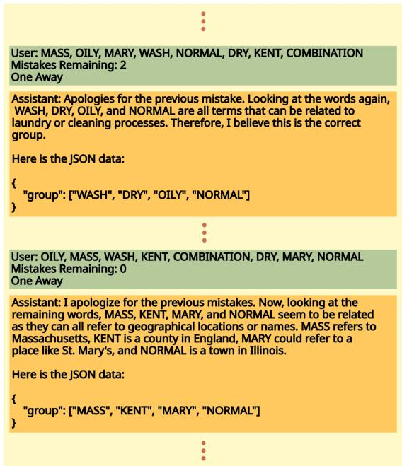
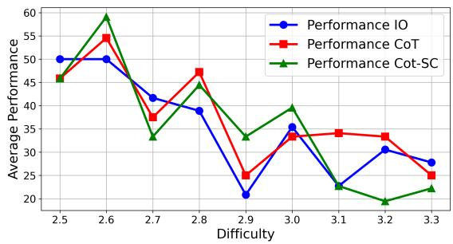
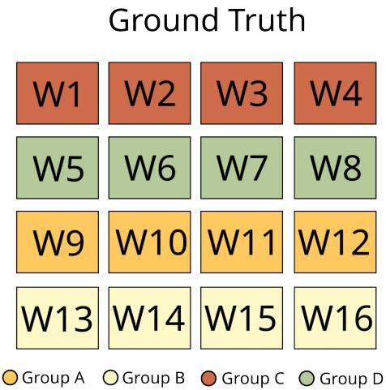
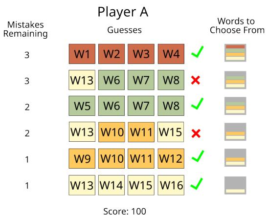
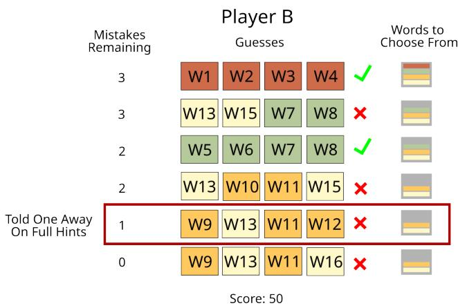
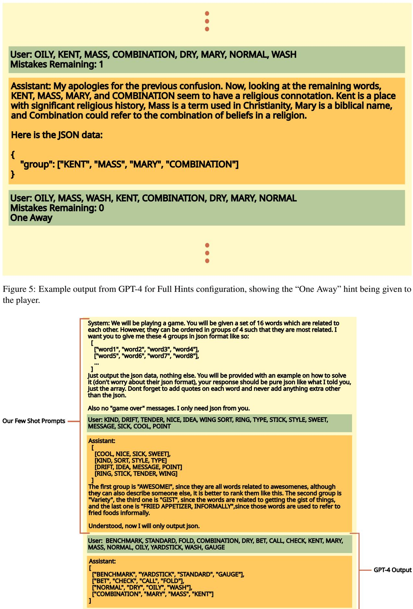
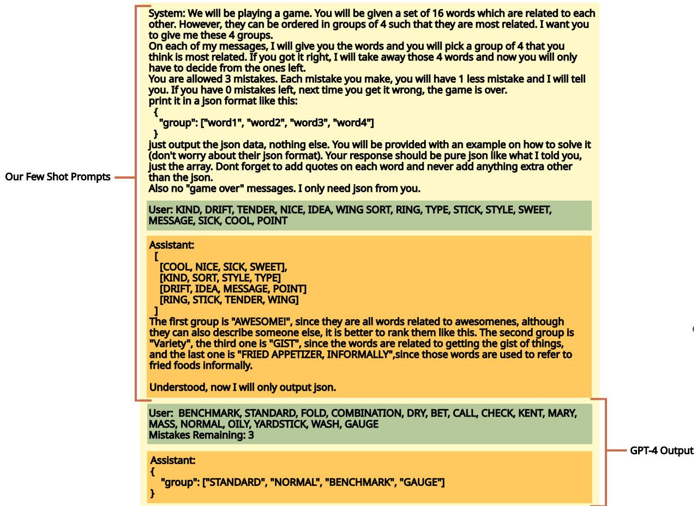
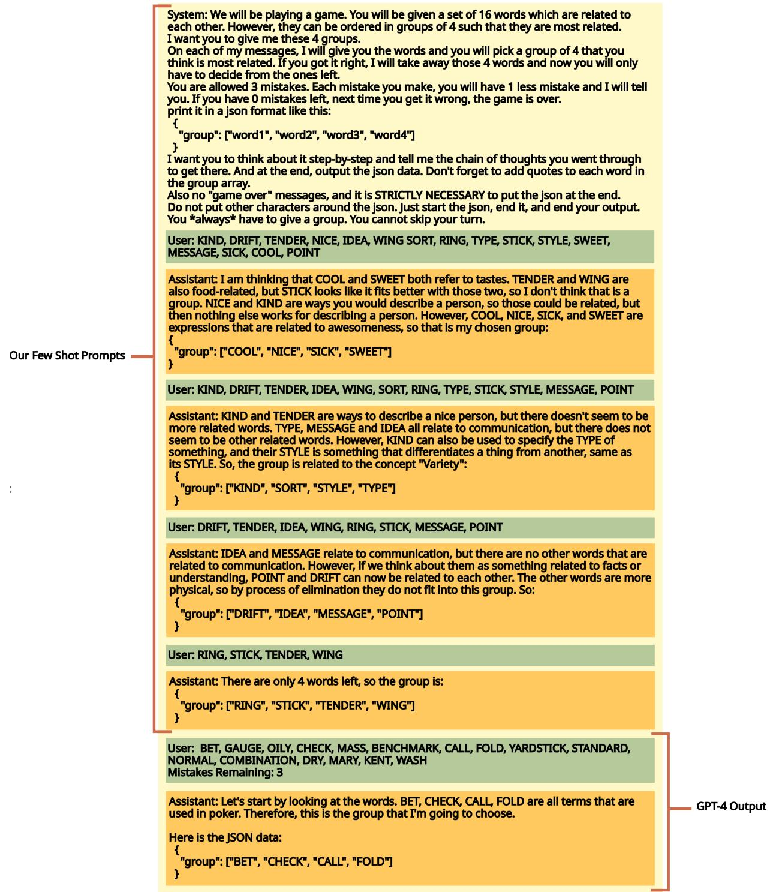
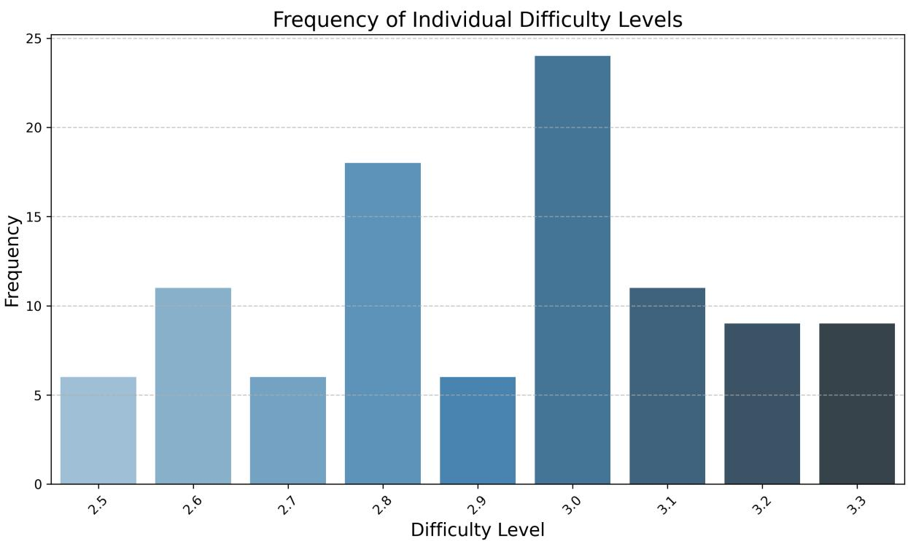

# NYT-CONNECTIONS: A Deceptively Simple Text Classification Task that Stumps System-1 Thinkers

Angel Yahir Loredo Lopez1, Tyler McDonald2, and Ali Emami2 1Universidad Autónoma de San Luis Potosí, San Luis Potosí, Mexico 2Brock University, Saint Catharines, Canada a327322@alumnos.uaslp.mx, {tmcdonald3, aemami}@brocku.ca

## Abstract

Large Language Models (LLMs) have shown impressive performance on various benchmarks, yet their ability to engage in deliberate reasoning remains questionable. We present NYT-CONNECTIONS, a collection of 358 simple word classification puzzles derived from the New York Times Connections game. This benchmark is designed to penalize quick, intuitive “System 1” thinking, isolating fundamental reasoning skills. We evaluated six recent LLMs, a simple machine learning heuristic, and humans across three configurations: single-attempt, multiple attempts without hints, and multiple attempts with contextual hints. Our findings reveal a significant performance gap: even top-performing LLMs like GPT-4 fall short of human performance by nearly 30%. Notably, advanced prompting techniques such as Chain-of-Thought and Self-Consistency show diminishing returns as task difficulty increases. NYT-CONNECTIONS uniquely combines linguistic isolation, resistance to intuitive shortcuts, and regular updates to mitigate data leakage, offering a novel tool for assessing LLM reasoning capabilities.1

## 1 Introduction

As Large Language Models (LLMs) continue to advance, the need for effective benchmarks to assess their true capabilities has become increasingly important. While numerous natural language tasks and datasets have been developed across domains such as text summarization, commonsense reasoning, and question answering (Hendrycks et al., 2021a; Cobbe et al., 2021; Hendrycks et al., 2021b), these benchmarks often fall short in isolating and evaluating specific cognitive abilities.

One major challenge is the difficulty in assessing individual model capabilities independently. Many existing tasks combine multiple cognitive processes, making it challenging to evaluate distinct abilities (Gema et al., 2024; Gautam et al., 2024). For instance, tasks that simultaneously require mathematical reasoning, natural language understanding, and contextual disambiguation (Patel et al., 2021) can obscure a model’s true proficiency in any single area.

Furthermore, many current benchmarks are vulnerable to shortcuts or heuristics. Models may exploit statistical regularities or superficial cues rather than demonstrating genuine understanding, a phenomenon known as ‘shortcut learning’ (Geirhos et al., 2020; Trichelair et al., 2019). This issue is closely related to the distinction between System 1 and System 2 thinking, as described by Hagendorff et al. (2023):

“System 1 processes are fast, automatic and instinctual. They often involve heuristics, or mental shortcuts, which enable quick judgments and decisions without conscious effort. [...] System 2 processes, on the other hand, are deliberate and require conscious effort.”

Consequently, many current benchmarks inadvertently reward System 1-style thinking, allowing models to achieve high scores without demonstrating the deliberate reasoning we aim to evaluate.

Finally, as LLMs are trained on increasingly vast amounts of data, the risk of test set leakage into training data grows, potentially leading to inflated performance metrics that do not reflect true generalization capabilities (Balloccu et al., 2024; Huang et al., 2024).

To address these challenges, we introduce NYT-CONNECTIONS, a novel benchmark of 358 puzzles derived from the New York Times’ Connections game. This task requires grouping 16 interrelated terms into 4 sets of 4 closely related words, deliberately tempting incorrect System 1 responses while requiring System 2 thinking for correct solutions. NYT-CONNECTIONS offers several key

<table><tr><td rowspan=1 colspan=1>FOLD</td><td rowspan=1 colspan=1>GAUGE</td><td rowspan=1 colspan=1>STANDARD</td><td rowspan=1 colspan=1>YARDSTICK</td></tr><tr><td rowspan=1 colspan=1>MARY</td><td rowspan=1 colspan=1>NORMAL</td><td rowspan=1 colspan=1>DRY</td><td rowspan=1 colspan=1>BENCHMARK</td></tr><tr><td rowspan=1 colspan=1>COMBINATION</td><td rowspan=1 colspan=1>CHECK</td><td rowspan=1 colspan=1>CALL</td><td rowspan=1 colspan=1>MASS</td></tr><tr><td rowspan=1 colspan=1>KENT</td><td rowspan=1 colspan=1>BET</td><td rowspan=1 colspan=1>OILY</td><td rowspan=1 colspan=1>WASH</td></tr></table>

O Starts of U.S. States OSkin Types OPoker Actions O Benchmark

(a) Sample instance of Connections showing a grid with various terms; each is marked to indicate its category.  
  
(b) 2D t-SNE visualization of term embeddings colorcoded by category, illustrating clustering patterns.  
Figure 1: Overview of Connections game instance and its embeddings visualization.

advantages:

• Linguistic Isolation: It focuses purely on word relationships, minimizing confounding factors.

• System 2 Emphasis: It penalizes quick, intuitive responses and requires deliberate reasoning.

• Continual Novelty: With daily updates, it provides a stream of novel instances, mitigating data leakage concerns.

In this paper, we contribute the following:

1. We present NYT-Connections, a benchmark designed to isolate and evaluate deliberate reasoning in LLMs.

2. We provide a comprehensive evaluation of six recent LLMs, a simple machine learning heuristic, and human performance on NYT-Connections.

3. We analyze various prompting techniques and their effectiveness in promoting System 2 “reasoning” in LLMs.

4. We demonstrate a substantial performance gap between LLMs and humans, with even the most advanced models falling short by nearly 30%.

## 2 NYT-CONNECTIONS

## 2.1 The Task

NYT-CONNECTIONS is based on Connections, a word classification game by the New York Times (The New York Times, 2024). This daily puzzle challenges players to group 16 terms into 4 sets of 4 related words. Its design intentionally tempts quick, obvious associations but requires careful, deliberate reasoning to solve correctly (Liu, 2023).

Figure 1a illustrates this design. The correct “Skin Types” group includes “Normal”, “Dry”, “Combination”, and “Oily". However, “Normal”, “Standard”, and “Benchmark” temptingly form a “Status Quo” group of three. This misdirection is crucial: the apparent “Status Quo” grouping leaves only three “Skin Types” terms, making it impossible to form four complete groups.

To demonstrate the challenge for machine learning approaches, we applied k-means clustering to Multilingual-E5-Large-Instruct word embeddings (Wang et al., 2024). As shown in Figure 1b, this method fails to correctly classify the terms, instead grouping semantically related words from different categories.

## 2.2 Dataset Construction

We constructed the NYT-CONNECTIONS dataset through the following process:

Dataset Collection: We compiled the complete set of 358 Connections puzzles from an archive covering daily offerings from the game’s debut on June 12, 2023, to June 3rd, 20242.

Difficulty Assessment: To gauge the perceived difficulty of each puzzle, we cross-referenced our dataset with an existing difficulty chart3, providing ratings from 1 (easiest) to 5 (most challenging) by independent testers.

The resulting distribution of difficulty ratings for our dataset is provided in Appendix Figure 9.

## 2.3 Sample Heuristic

To establish a baseline and demonstrate the challenge of the task, we designed a heuristic that mimics a player’s initial, intuitive approach to the puzzles. It evaluates 4-word groups using a score $S = G - P$ , where G is group similarity and P is a penalty for similarity to other words.

Group Similarity Score For a candidate group $C = \{ c _ { 1 } , c _ { 2 } , c _ { 3 } , c _ { 4 } \}$ , we compute G as follows:

1. Obtain word embeddings E using a pre-trained language model.

<table><tr><td>Method</td><td>Performance</td></tr><tr><td>I, s and V</td><td>13.25</td></tr><tr><td>I only</td><td>13.25</td></tr><tr><td>s and V</td><td>9.25</td></tr></table>

Table 1: Ablation study for factors comprising our Group Similarity Score over 100 median difficulty NYT-CONNECTIONS matches on the Multiple Tries configuration. I is shown to be the most influential factor when choosing the best candidate solutions.

2. Compute a clustering score $I = - K ( E )$ , where K is the inertia (sum of squared distances to the centroid) of a k-means cluster (k=1).

3. Calculate the minimum pairwise cosine similarity s among words in the group.

4. Compute a variance-based score $\begin{array} { r } { V = \frac { \mathrm { m e a n } ( P ) } { 1 + \mathrm { v a r } ( P ) } } \end{array}$ where P is the set of all pairwise similarities.

The final score is a weighted sum: $G = 0 . 4 \cdot I +$ $0 . 3 { \cdot } s { + } 0 . 3 { \cdot } V$ . These weights were chosen based on ablation studies as depicted in Table 1, giving slight preference to the strongest contributing factor, I.

This formulation captures cluster tightness (I), minimum relatedness (s), and similarity consistency (V ), mirroring intuitive judgments about word relationships typical of System 1 thinking.

Penalty Score To prevent overly generic groupings, we compute a penalty P that measures how similar a candidate group is to remaining words:

$$
P = { \frac { 1 } { | R | } } \sum _ { r \in R } \cos ( \mu c , r )
$$

where $\mu _ { C }$ is the mean embedding of the candidate group C, and R is the set of remaining words. A lower P indicates a more distinct group.

Beam Search To balance between finding seemingly good initial groupings and maintaining some flexibility, we employ a beam search algorithm with a width of 10:

1. Initialize with an empty solution.

2. For each step (up to 4 groups):

(a) Form all possible groups of 4 from remaining words.

(b) Compute $S = G - P$ for each new group.

(c) Retain the top 10 partial solutions based on cumulative score.

3. Return the highest-scoring complete solution.

This approach balances exploration of alternative groupings with a preference for high-scoring, seemingly obvious solutions. By design, it’s prone to the misdirections built into the puzzles, serving as an effective baseline for comparison with more advanced reasoning methods.

## 3 Experimental Setup

Experiments We analyzed 100 puzzles from our corpus, centered around the median difficulty rating of 3.0. This selection ensures consistent challenge across subjects and enables fair comparisons between LLMs and humans. Our full difficulty distribution is depicted in Appendix Figure 9.

Evaluation Settings We tested under three conditions: (1) One Try: single attempt, scored 100 for success or 0 for failure; (2) No Hints: up to four re-tries; and (3) Full Hints: up to four re-tries with “one away” hints. For (2) and (3), scores represent the percentage of correct groups $( A = \{ 0 , 2 5 , 5 0 , 7 5 , 1 0 0 \} )$ . Detailed examples are in Appendix Figures 4 and 5.

Models We evaluated six recent LLMs: Claude 3.5 Sonnet, GPT-4, GPT-4o, Gemini 1.5 Pro, LLaMA 3 70B Instruct, and LLaMA 3.1 405B Instruct (Anthropic, 2024; OpenAI, 2023, 2024; Team et al., 2023; Touvron et al., 2023). LLaMA models were used with the default temperature of 0.6; all others were used with a temperature of 0.5. Our heuristic used Multilingual-E5-Large-Instruct embeddings (Wang et al., 2024).

Prompts Models received detailed background, instructions, and an example game, mirroring human participants’ information. We used three prompting methods: Input-Output (IO), Chain-of-Thought (CoT) (Wei et al., 2022), and CoT with Self-Consistency (CoT-SC) (Wang et al., 2023). Detailed prompts are in Appendix Figures 6,7 & 8.

Random Guess We implemented a random guess baseline. The probability of correct random guessing is approximately $3 . 8 1 \times 1 0 ^ { - 7 }$ (0.0000381%)4.

Human Evaluation Three human evaluators completed 50 One Try, 25 No Hints, and 25 Full Hints instances via a custom application. Performance was averaged across evaluators for each configuration.

## 4 Results

LLMs Significantly Underperform Humans As shown in Table 2, there is a substantial performance gap between LLMs and human participants across all testing configurations. Even in the most favorable scenario (Full Hints), the best-performing model, Claude 3.5, achieves only 40.25% accuracy compared to humans’ 60.67%. This disparity becomes even more pronounced in more challenging setups. In the One Try configuration, the top LLM (Claude 3.5) manages only 11% accuracy, while humans achieve 39.33%.

<table><tr><td>Player</td><td>One Try</td><td>No Hints</td><td>Full Hints</td></tr><tr><td>GPT-4</td><td>4.0</td><td>35.5</td><td>32.5</td></tr><tr><td>Claude 3.5</td><td>11.0</td><td>36.75</td><td>40.25</td></tr><tr><td>GPT-40</td><td>8.0</td><td>45.0</td><td>33.75</td></tr><tr><td>LLaMA 3.1 405b</td><td>7.0</td><td>35.5</td><td>34.75</td></tr><tr><td>Gemini 1.5 Pro</td><td>5.0</td><td>30.5</td><td>31.5</td></tr><tr><td>LLaMA 3 70b</td><td>1.0</td><td>23.75</td><td>28.5</td></tr><tr><td>Random</td><td>0.0</td><td>0.0</td><td>0.0</td></tr><tr><td>Heuristic</td><td>1.0</td><td>13.25</td><td>13.25</td></tr><tr><td>Humans</td><td>39.33*</td><td>56.0*</td><td>60.67*</td></tr></table>

Table 2: Performance (%) of the models, baselines, and humans across our three setups, using IO prompting. \* indicates statistical significance (p < 0.05) of human performance compared to the top-performing model. See Appendix A.1 for statistical test methodology.

Chain-of-Thought-Based Prompting Techniques Are Limited by Shallow Thinking Figure 2 depicts two model outputs that illustrate the limited reasoning ability of Chain-of-Thoughtbased approaches. In this case, GPT-4 fails to consider multiple factors that may lead to better results — such as when the remaining words outside of the chosen group contain strong matches — the discovery of which requires more deliberate and specialized reasoning. This demonstrates the fundamental limitations of System 1 thinkers when performing non-symbolic reasoning tasks, even when endowed with complex methodology such as Chain-of-Thought, an issue that has been further explored in recent work (Sprague et al., 2024).

Advanced Prompting Techniques Show Diminishing Returns Figure 3 illustrates how prompting methods such as Chain-of-Thought (CoT) and Self-Consistency (CoT-SC) do not consistently improve in performance as task difficulty increases. Surprisingly, simpler Input-Output (IO) prompting often outperforms these approaches, especially on harder puzzles. This suggests that current prompting techniques may be insufficient to simulate true System 2 reasoning in LLMs, and might even hinder performance by introducing unnecessary complexity.

  
Figure 2: An example of GPT-4’s output demonstrating the shallow reasoning of Chain-of-Thought-based approaches. The model first latches on to words in a laundry category, while in the second example, the model correctly identifies the group but fails to produce effective word groupings.

  
Figure 3: Average performance vs difficulty level for GPT-4 with various prompting techniques on Full Hints

Simple Heuristic is Comparable to Some LLMs As shown in Table 2, our baseline heuristic, designed to mimic intuitive System 1 thinking, achieves 13.25% accuracy in both No Hints and Full Hints configurations. Notably, this performance is not far behind some of the tested LLMs, such as LLaMA 3 70b (23.75% in No Hints, 28.5% in Full Hints). This relatively small gap between a simple heuristic and more complex language models suggests that current LLMs demonstrate capabilities that fall between System 1-like patternmatching and System 2-like deliberation, without fully achieving consistent, deliberate reasoning.

Contextual Hints of Limited Benefit to LLMs Referring again to Table 2, while human performance improves significantly with the addition of hints (from 56% in No Hints to 60.67% in Full Hints), few LLMs show meaningful improvements. Some models, like GPT-4o, paradoxically perform worse with full hints (33.75%) compared to no hints (45%). This suggests a fundamental difference in how LLMs and humans process and utilize contextual information in problem-solving tasks.

Performance Consistency Across Top LLMs Our evaluation reveals surprisingly consistent performance among top LLMs. Claude 3.5, GPT-4, and GPT-4o show no statistically significant differences from each other, a pattern that holds across all configurations. This suggests that NYT-CONNECTIONS presents a unified challenge, exposing similar limitations in even the most advanced LLMs for tasks requiring System 2 thinking.

## 5 Related Work

Recent research has focused on developing benchmarks that address key challenges in evaluating language models’ reasoning capabilities. Several works propose tasks that isolate specific cognitive processes, such as code reasoning, mathematical problem-solving, and logic (Liu et al., 2024; Mao et al., 2024; Wu et al., 2024), aiming to disentangle task-specific knowledge from broader reasoning abilities. Researchers have also created benchmarks for deliberate, multi-step reasoning, including tasks designed to challenge System 1- style heuristics (Suzgun et al., 2023; McKenzie et al., 2024). To combat data leakage, evolving datasets have been introduced, continuously updating with new problems from real-world sources (Sun and Emami, 2024; Li et al., 2024; Jain et al., 2024). NYT-CONNECTIONS uniquely combines these three aspects: isolating word relationship understanding, resisting simple heuristics, and maintaining novelty through regular updates.

## 6 Conclusion

We introduced NYT-CONNECTIONS, a benchmark that isolates word relationship understanding, penalizes heuristic-based thinking, and resists data leakage. Our evaluation of six LLMs, a simple heuristic, and human performance revealed significant gaps, with top models like GPT-4 falling nearly 30% short of humans. This highlights the ongoing challenges in developing AI systems capable of deliberate reasoning. Future work should explore techniques to bridge this performance gap and investigate how improvements on NYT-CONNECTIONS translate to other reasoning tasks.

## Limitations

Embedding Model Scale Our heuristic uses a relatively small model due to hardware constraints. While this provides a baseline, it’s possible that larger embedding models could yield different results. Future work should explore the scalability of our heuristic approach using more advanced embedding models to fully understand the relationship between model size and performance on NYT-CONNECTIONS.

Prompt Engineering Scope Cost constraints limited our ability to test an extensive range of prompting techniques. While we focused on standard, Chain-of-Thought, and Self-Consistency methods, future studies could explore a broader spectrum of prompting strategies, including more recent innovations. However, we intentionally excluded complex, long-context methods like Tree of Thoughts (Yao et al., 2023), as these fall outside the scope of our focus on core reasoning capabilities.

Human Baseline Limitations Our human performance data is derived from a small sample of three evaluators, which may not fully represent the broader population’s problem-solving abilities. A larger-scale study with a diverse group of participants would provide a more robust human baseline and could reveal interesting patterns in human approaches to solving Connections puzzles.

Temporal Limitations of the Dataset While we commit to monthly updates of NYT-CONNECTIONS, the dataset inherently represents a snapshot of puzzles from a specific time period. This could potentially limit its long-term relevance as language use and cultural references evolve. Regular assessments of the dataset’s contemporary relevance may be necessary to maintain its effectiveness as a benchmark.

Cross-Cultural Applicability The Connections puzzles are primarily designed for an Englishspeaking, Western audience. This may limit the benchmark’s applicability across different cultures and languages. Future work could explore creating multilingual versions or culturally adapted variants of NYT-CONNECTIONS to assess LLM performance in more diverse contexts.

## Acknowledgments

This work was supported by the Natural Sciences and Engineering Research Council of Canada and by the New Frontiers in Research Fund. Angel Yahir Loredo Lopez was supported by the Mitacs Globalink Research Internship. Tyler McDonald was supported by the Natural Sciences and Engineering Research Council of Canada’s Undergraduate Student Research Award.

## References

Anthropic. 2024. Claude 3.5 sonnet model card addendum. https://www-cdn.anthropic.com/ fed9cc193a14b84131812372d8d5857f8f304c52/ Model\_Card\_Claude\_3\_Addendum.pdf.

Simone Balloccu, Patrícia Schmidtová, Mateusz Lango, and Ondrej Dusek. 2024. Leak, cheat, repeat: Data contamination and evaluation malpractices in closedsource LLMs. In Proceedings of the 18th Conference of the European Chapter of the Association for Computational Linguistics (Volume 1: Long Papers), pages 67–93, St. Julian’s, Malta. Association for Computational Linguistics.

Karl Cobbe, Vineet Kosaraju, Mohammad Bavarian, Mark Chen, Heewoo Jun, Lukasz Kaiser, Matthias Plappert, Jerry Tworek, Jacob Hilton, Reiichiro Nakano, Christopher Hesse, and John Schulman. 2021. Training verifiers to solve math word problems. Preprint, arXiv:2110.14168.

Vagrant Gautam, Eileen Bingert, Dawei Zhu, Anne Lauscher, and Dietrich Klakow. 2024. Robust pronoun use fidelity with english llms: Are they reasoning, repeating, or just biased? arXiv preprint arXiv:2404.03134.

Robert Geirhos, Jörn-Henrik Jacobsen, Claudio Michaelis, Richard Zemel, Wieland Brendel, Matthias Bethge, and Felix A Wichmann. 2020. Shortcut learning in deep neural networks. Nature Machine Intelligence, 2(11):665–673.

Aryo Pradipta Gema, Joshua Ong Jun Leang, Giwon Hong, Alessio Devoto, Alberto Carlo Maria Mancino, Rohit Saxena, Xuanli He, Yu Zhao, Xiaotang Du, Mohammad Reza Ghasemi Madani, et al. 2024. Are we done with mmlu? arXiv preprint arXiv:2406.04127.

Thilo Hagendorff, Sarah Fabi, and Michal Kosinski. 2023. Human-like intuitive behavior and reasoning biases emerged in large language models but disappeared in chatgpt. Nature Computational Science, 3(10):833–838.

Dan Hendrycks, Collin Burns, Steven Basart, Andy Zou, Mantas Mazeika, Dawn Song, and Jacob Steinhardt. 2021a. Measuring massive multitask language understanding. Preprint, arXiv:2009.03300.

Dan Hendrycks, Collin Burns, Saurav Kadavath, Akul Arora, Steven Basart, Eric Tang, Dawn Song, and Jacob Steinhardt. 2021b. Measuring mathematical problem solving with the math dataset. Preprint, arXiv:2103.03874.

Yiming Huang, Zhenghao Lin, Xiao Liu, Yeyun Gong, Shuai Lu, Fangyu Lei, Yaobo Liang, Yelong Shen, Chen Lin, Nan Duan, et al. 2024. Competition-level problems are effective llm evaluators. In Findings of the Associationfor Computational Linguistics ACL 2024, pages 13526–13544.

Naman Jain, King Han, Alex Gu, Wen-Ding Li, Fanjia Yan, Tianjun Zhang, Sida Wang, Armando Solar-Lezama, Koushik Sen, and Ion Stoica. 2024. Livecodebench: Holistic and contamination free evaluation of large language models for code. arXiv preprint arXiv:2403.07974.

Jia Li, Ge Li, Xuanming Zhang, Yihong Dong, and Zhi Jin. 2024. Evocodebench: An evolving code generation benchmark aligned with real-world code repositories. arXiv preprint arXiv:2404.00599.

Changshu Liu, Shizhuo Dylan Zhang, and Reyhaneh Jabbarvand. 2024. Codemind: A framework to challenge large language models for code reasoning. arXiv preprint arXiv:2402.09664.

Wyna Liu. 2023. How our new game, connections, is put together. https://www.nytimes.com/2023/ 06/26/crosswords/new-game-connections. html. Accessed: 2024-09-09.

Yujun Mao, Yoon Kim, and Yilun Zhou. 2024. Champ: A competition-level dataset for fine-grained analyses of llms’ mathematical reasoning capabilities. arXiv preprint arXiv:2401.06961.

Ian R. McKenzie, Alexander Lyzhov, Michael Pieler, Alicia Parrish, Aaron Mueller, Ameya Prabhu, Euan McLean, Aaron Kirtland, Alexis Ross, Alisa Liu, Andrew Gritsevskiy, Daniel Wurgaft, Derik Kauffman, Gabriel Recchia, Jiacheng Liu, Joe Cavanagh, Max Weiss, Sicong Huang, The Floating Droid, Tom Tseng, Tomasz Korbak, Xudong Shen, Yuhui Zhang, Zhengping Zhou, Najoung Kim, Samuel R. Bowman, and Ethan Perez. 2024. Inverse scaling: When bigger isn’t better. Preprint, arXiv:2306.09479.

OpenAI. 2023. Gpt-4 technical report. Preprint, arXiv:2303.08774.

OpenAI. 2024. Hello gpt-4o. https://openai.com/ index/hello-gpt-4o/. Accessed: 2024-09-04.

Arkil Patel, Satwik Bhattamishra, and Navin Goyal. 2021. Are NLP models really able to solve simple math word problems? In Proceedings of the 2021 Conference of the North American Chapter of the Associationfor Computational Linguistics: Human Language Technologies, pages 2080–2094, Online. Association for Computational Linguistics.

Zayne Sprague, Fangcong Yin, Juan Diego Rodriguez, Dongwei Jiang, Manya Wadhwa, Prasann Singhal, Xinyu Zhao, Xi Ye, Kyle Mahowald, and Greg Durrett. 2024. To cot or not to cot? chain-ofthought helps mainly on math and symbolic reasoning. Preprint, arXiv:2409.12183.

Jing Han Sun and Ali Emami. 2024. EvoGrad: A dynamic take on the Winograd schema challenge with human adversaries. In Proceedings ofthe 2024 Joint International Conference on Computational Linguistics, Language Resources and Evaluation (LREC-COLING 2024), pages 6701–6716, Torino, Italia. ELRA and ICCL.

Mirac Suzgun, Nathan Scales, Nathanael Schärli, Sebastian Gehrmann, Yi Tay, Hyung Won Chung, Aakanksha Chowdhery, Quoc Le, Ed Chi, Denny Zhou, and Jason Wei. 2023. Challenging BIG-bench tasks and whether chain-of-thought can solve them. In Findings of the Association for Computational Linguistics: ACL 2023, pages 13003–13051, Toronto, Canada. Association for Computational Linguistics.

Gemini Team, Rohan Anil, Sebastian Borgeaud, Yonghui Wu, Jean-Baptiste Alayrac, Jiahui Yu, Radu Soricut, Johan Schalkwyk, Andrew M Dai, Anja Hauth, et al. 2023. Gemini: A family of highly capable multimodal models. ArXiv preprint arXiv:2312.11805.

The New York Times. 2024. Connections. https: //www.nytimes.com/games/connections. Accessed: June 12, 2023 to June 03, 2024.

Hugo Touvron, Thibaut Lavril, Gautier Izacard, Xavier Martinet, Marie-Anne Lachaux, Timothée Lacroix, Baptiste Rozière, Naman Goyal, Eric Hambro, Faisal Azhar, et al. 2023. Llama: Open and efficient foundation language models. arXiv preprint arXiv:2302.13971.

Paul Trichelair, Ali Emami, Adam Trischler, Kaheer Suleman, and Jackie Chi Kit Cheung. 2019. How reasonable are common-sense reasoning tasks: A case-study on the Winograd schema challenge and SWAG. In Proceedings ofthe 2019 Conference on Empirical Methods in Natural Language Processing and the 9th International Joint Conference on Natural Language Processing (EMNLP-IJCNLP), pages 3382–3387, Hong Kong, China. Association for Computational Linguistics.

Liang Wang, Nan Yang, Xiaolong Huang, Linjun Yang, Rangan Majumder, and Furu Wei. 2024. Multilingual e5 text embeddings: A technical report. Preprint, arXiv:2402.05672.

Xuezhi Wang, Jason Wei, Dale Schuurmans, Quoc V Le, Ed H. Chi, Sharan Narang, Aakanksha Chowdhery, and Denny Zhou. 2023. Self-consistency improves chain of thought reasoning in language models. In The Eleventh International Conference on Learning Representations.

Jason Wei, Xuezhi Wang, Dale Schuurmans, Maarten Bosma, Ed Chi, Quoc Le, and Denny Zhou. 2022. Chain of thought prompting elicits reasoning in large language models. arXiv preprint arXiv:2201.11903.

Zhaofeng Wu, Linlu Qiu, Alexis Ross, Ekin Akyürek, Boyuan Chen, Bailin Wang, Najoung Kim, Jacob Andreas, and Yoon Kim. 2024. Reasoning or reciting? exploring the capabilities and limitations of language models through counterfactual tasks. In Proceedings ofthe 2024 Conference ofthe North American Chapter of the Association for Computational Linguistics: Human Language Technologies (Volume 1: Long Papers), pages 1819–1862, Mexico City, Mexico. Association for Computational Linguistics.

Shunyu Yao, Dian Yu, Jeffrey Zhao, Izhak Shafran, Thomas L Griffiths, Yuan Cao, and Karthik Narasimhan. 2023. Tree of thoughts: Deliberate problem solving with large language models. arXiv preprint arXiv:2305.10601.

## A Appendix

## A.1 Statistical Testing Procedure

We used different statistical tests for the One Try setup versus the No Hints and Full Hints setups due to the nature of the data in each case:

One Try Setup: We used a two-proportion z-test because the outcomes in this setup are binary (success or failure), making it appropriate for comparing two proportions.

No Hints and Full Hints Setups: For these setups, we used the Mann-Whitney U test because the outcomes are ordinal categorical data (number of correct groups, $A = \{ 0 , 1 , 2 , 3 , 4 \}$ . This nonparametric test is suitable for comparing the distribution of scores between two independent groups when the dependent variable is ordinal.

All tests were conducted at a 95% confidence interval $( p < 0 . 0 5 )$ . We performed tests between the human evaluators and the top-performing model, as well as between the top two performing models, to assess the statistical significance of performance differences.

## A.2 Game Setup & Prompting Details

<table><tr><td rowspan=1 colspan=4>Player A</td></tr><tr><td rowspan=1 colspan=1>W1</td><td rowspan=1 colspan=1>W2</td><td rowspan=1 colspan=1>W3</td><td rowspan=1 colspan=1>W4</td></tr><tr><td rowspan=1 colspan=1>W5</td><td rowspan=1 colspan=1>W6</td><td rowspan=1 colspan=1>W7</td><td rowspan=1 colspan=1>W8</td></tr><tr><td rowspan=1 colspan=1>W9</td><td rowspan=1 colspan=1>W10</td><td rowspan=1 colspan=1>W11</td><td rowspan=1 colspan=1>W12</td></tr><tr><td rowspan=1 colspan=1>W13</td><td rowspan=1 colspan=1>W14</td><td rowspan=1 colspan=1>W15</td><td rowspan=1 colspan=1>W16</td></tr><tr><td rowspan=1 colspan=4>X Score: 0</td></tr></table>

One Try

Player B
<table><tr><td rowspan=1 colspan=1>W1</td><td rowspan=1 colspan=1>W2</td><td rowspan=1 colspan=1>W3</td><td rowspan=1 colspan=1>W4</td></tr><tr><td rowspan=1 colspan=1>W5</td><td rowspan=1 colspan=1>W6</td><td rowspan=1 colspan=1>W7</td><td rowspan=1 colspan=1>W8</td></tr><tr><td rowspan=1 colspan=1>W9</td><td rowspan=1 colspan=1>W10</td><td rowspan=1 colspan=1>W11</td><td rowspan=1 colspan=1>W12</td></tr><tr><td rowspan=1 colspan=1>W13</td><td rowspan=1 colspan=1>W14</td><td rowspan=1 colspan=1>W15</td><td rowspan=1 colspan=1>W16</td></tr><tr><td rowspan=1 colspan=4>Score: 100</td></tr></table>

## No Hints / Full Hints

  
Figure 4: Demonstration of our three setups. One Try: Players have one chance to classify the words into the four groups. No Hints: Players have 4 chances to get the correct groups, where at each chance they are tasked to find a correct grouping. Full Hints: Same as No Hints, but players are told when they are one word away from a correct grouping.

  
Figure 6: Prompts used for testing IO performance on the One Try setup, with GPT-4 example output.

  
Figure 7: Prompts used for testing IO performance on the No Hints and Full Hints setups, with GPT-4 example output.

  
Figure 8: Prompts used for testing CoT performance on the No Hints and Full Hints setups, with GPT-4 example output.

## A.3 Dataset Difficulty Composition

  
Figure 9: Difficulty distribution for our 100 median NYT-CONNECTIONS instances.