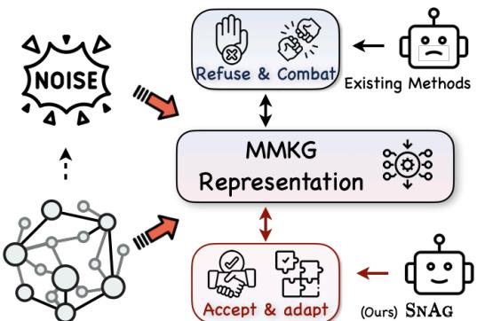
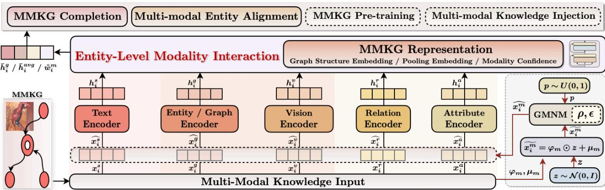

# Noise-powered Multi-modal Knowledge Graph Representation Framework

Zhuo Chen♡♣, Yin Fang♡♣, Yichi Zhang♡♣, Lingbing Guo♡♣, Jiaoyan Chen♠, Jeff Z. Pan♢, Huajun Chen♡♣, Wen Zhang♡♣\*

♡Zhejiang University ♠The University of Manchester ♢The University of Edinburgh ♣ZJU-Ant Group Joint Lab of Knowledge Graph

{zhuo.chen,fangyin,zhangyichi2022,lbguo,huajunsir,zhang.wen}@zju.edu.cn § https://github.com/zjukg/SNAG

## Abstract

The rise of Multi-modal Pre-training highlights the necessity for a unified Multi-Modal Knowledge Graph (MMKG) representation learning framework. Such a framework is essential for embedding structured knowledge into multimodal Large Language Models effectively, alleviating issues like knowledge misconceptions and multi-modal hallucinations. In this work, we explore the efficacy of models in accurately embedding entities within MMKGs through two pivotal tasks: Multi-modal Knowledge Graph Completion (MKGC) and Multi-modal Entity Alignment (MMEA). Building on this foundation, we propose a novel SNAG method that utilizes a Transformer-based architecture equipped with modality-level noise masking to robustly integrate multi-modal entity features in KGs. By incorporating specific training objectives for both MKGC and MMEA, our approach achieves SOTA performance across a total of ten datasets, demonstrating its versatility. Moreover, SNAG can not only function as a standalone model but also enhance other existing methods, providing stable performance improvements. Code and data are available at https://github.com/zjukg/SNAG.

## 1 Introduction

Current efforts to integrate MMKG with pretraining are scarce. Triple-level methods (Pan et al., 2022) treat triples as standalone knowledge units, embedding the (head entity, relationship, tail entity) structure into Visual Language Model’s space. On the other hand, Graph-level methods (Gong et al., 2023; Li et al., 2023b) capitalize on the structural connections among entities in a global MMKG. By selectively gathering multi-modal neighbor nodes around each entity featured in the training corpus, they apply techniques such as Graph Neural Networks (GNNs) or concatenation to effectively incorporate knowledge during the pre-training process.

  
Figure 1: Unlike existing models that refuse and combat noise in MMKGs, our SNAG accepts and deliberately incorporates noise to mirror noisy real-world scenarios.

However, these approaches predominantly view MMKG from a traditional KG perspective, not fully separating the MMKG representation process from downstream or pre-training tasks. In this work, we revisit MMKG representation learning uniquely from the MMKG perspective itself, employing two tasks: Multi-modal Knowledge Graph Completion (MKGC) and Multi-modal Entity Alignment (MMEA) to validate our method.

Specifically, we introduce a unified Transformerbased framework (SNAG) that achieves SOTA results across an array of ten datasets by simply aligning it with task-specific Training targets. SNAG stands out for its parameter-efficient design and adaptability, incorporating components like Entity-Level Modality Interaction that can be seamlessly upgraded with advanced technologies.

A key aspect of our method is the Gauss Modality Noise Masking module, whose design sharply contrasts with previous MMKG-related efforts that primarily focus on designing methods to refuse and combat noise in MMKGs. In contrast, as shown in Fig. 1, our SNAG accepts and deliberately incorporates noise, adapting to the noisy realworld scenarios. Drawing inspiration from traditional mask-based multi-modal Pre-trained Language Models (PLMs) that enhance cross-modal alignment at the token level, our strategy innovates by applying masking at the modality level, significantly enhancing model’s MMKG representation capabilities. Importantly, as the first MMKG effort to concurrently support both MKGC and MMEA tasks, this work demonstrates its adaptability of our strategy, highlighting its potential to interface with more training tasks in the future and paving the way for further research in MMKG Pre-training and Multi-modal Knowledge Injection.

## 2 Related Work

## 2.1 MMKG Representation

The current mainstream approaches to MMKG rep resentation learning can broadly be classified into two distinct categories: (i) Late Fusion methods emphasize modality interactions and feature aggregation just prior to output generation. For exam ple, MKGRL-MS (Wang et al., 2022) crafts unique single-modal embeddings, employing multi-head self-attention to determine each modality’s contribution to semantic composition and sum the weighted multi-modal features for MMKG entity representation. MMKRL (Lu et al., 2022) learns cross-modal embeddings in a unified translational semantic space, merging them through concate nation. DuMF (Li et al., 2022) applies a bilinear layer for feature projection and an attention block for modality preference learning in each track, in tegrating features via a gate network. (ii) Early Fusion methods integrate multi-modal feature at an initial stage, enabling full modality interactions for complex reasoning. For example, Fang et al. (2023a) first normalizes entity modalities into a unified embedding using an MLP, then refines them by contrasting with perturbed negative samples. MMRotatH (Wei et al., 2023) utilizes a gated encoder to merge textual and structural data, filtering irrelevant information within a rotational dynamicsbased KGE framework. Recent studies (Chen et al., 2022b; Lee et al., 2023) utilize (V)PLMs like BERT and ViT for multi-modal data integration. These methods convert graph structures, text, and images into sequences or dense embeddings suited for LMs, leveraging the LMs’ reasoning abilities and embedded knowledge for tasks like Multi-modal Link Prediction. However, they rely heavily on pre trained models, resulting in significant parameter sizes and training costs (Chen et al., 2024b).

In this paper, we propose a Transformer-based method SNAG that introduces fine-grained, entitylevel modality preference to enhance entity representation. This strategy combines the benefits of Early Fusion, with its effective modality interaction, while also aligning with the Late Fusion modality integration paradigm. Furthermore, our model is lightweight, with only 13M parameters, far fewer than traditional PLM-based methods, which often exceed 200M parameters. This offers increased flexibility and wider applicability.

## 2.2 Multi-Modal Knowledge Graph Completion and Alignment

Multi-modal Knowledge Graph Completion (MKGC) is crucial for inferring missing triples in existing MMKGs (Lee et al., 2023; Zhao et al., 2022). Entity Alignment (EA) focuses on KG integration, aiming to identify identical entities across different KGs by leveraging relational, attributive, and literal (surface) features. Multi-Modal Entity Alignment (MMEA) enhances this by incorporating visual data, thereby improving alignment accuracy (Chen et al., 2020a; Li et al., 2023a). Further details are provided in Appendix A.1. Despite nearly five years of development, MMEA and MKGC have progressed independently within the MMKG field, lacking a unified framework that integrates these tasks. Given the advancements in multi-modal LLMs, it is timely to develop a comprehensive framework that addresses both MKGC and MMEA, offering enhanced multi-modal entity representations.

## 3 Method

## 3.1 Preliminaries

This paper focuses on A-MMKG (Zhu et al., 2022), where images are attached to entities as attributes.

Definition 1. Multi-modal Knowledge Graph. A KG is defined as $\mathcal { G } = \{ \mathcal { E } , \mathcal { R } , \mathcal { A } , \mathcal { T } , \mathcal { V } \}$ where $\mathcal { T } =$ $\{ \mathcal { T } _ { \mathcal { A } } , \mathcal { T } _ { \mathcal { R } } \}$ with $T _ { \mathcal { R } } = \mathcal { E } \times \mathcal { R } \times \mathcal { E }$ and $\mathcal { T } _ { \mathcal { A } } = \mathcal { E } \times \mathcal { A } \times$ V. MMKG utilizes multi-modal data $( e . g .$ ., images) as specific attribute valuesfor entities or concepts, with $\mathcal { T } _ { A } = \mathcal { E } \times A \times ( \mathcal { V } _ { K G } \cup \mathcal { V } _ { M M } )$ , where VMM are values of multi-modal data $( e . g .$ , images).

Definition 2. MMKG Completion. The objective is to augment the set ofrelational triples $\mathcal { T } _ { R }$ within MMKGs by identifying and adding missing relational triples among existing entities and relations, potentially utilizing attribute triples $\tau _ { A }$ . Specifically, our focus is on Entity Prediction, which involves determining the missing head or tail entities in queries of the form (head, r, ?) or (?, r, tail).

Definition 3. Multi-modal Entity Alignment. Given two aligned MMKGs $\mathcal { G } _ { 1 }$ and $\mathcal { G } _ { 2 } .$ , the objective of MMEA is to identify entity pairs $( e _ { i } ^ { 1 } , ~ e _ { i } ^ { 2 } )$ from $\mathcal { E } _ { 1 }$ and $\mathcal { E } _ { 2 }$ , respectively, that correspond to the same real-world entity $e _ { i } .$ . This process utilizes a set ofpre-aligned entity pairs, divided into a training set (seed alignments S) and a testing set $\boldsymbol { S } _ { t e } ,$ following a pre-defined seed alignment ratio $R _ { s a }$ $= | S | / | S \cup S _ { t e } |$ . The modalities associated with an entity are denoted by $\boldsymbol { \mathcal { M } } = \{ g , r , a , v , s \}$ , signifying graph structure, relation, attribute, vision, and surface (i.e., entity names) modalities, respectively.

  
Figure 2: The overall framework of SNAG.

## 3.2 Multi-Modal Knowledge Embedding

Graph Structure Embedding. Let $x _ { i } ^ { g } \in \mathbb R ^ { d }$ represents the graph embedding of entity $e _ { i } .$ , which is randomly initialized and learnable, with d representing the predetermined hidden dimension. In MKGC, we follow Zhang et al. (2024c) to set $h _ { i } ^ { g } =$ $\overline { { F C _ { g } ( W } } , x _ { i } ^ { g } )$ , where $F C _ { g }$ is a KG-specific fully connected layer applied to $x _ { i } ^ { g }$ with weights $W _ { g }$ . For MMEA, we follow Chen et al. (2023a) to utilize the Graph Attention Network (GAT) (Velickovic et al., 2018), configured with two attention heads and two layers, to capture the structural information of G. This is facilitated by a diagonal weight matrix (Yang et al., 2015) $W _ { g } \in \mathbb { R } ^ { d \times d }$ for linear transformation. The structure embedding is thus defined as $h _ { i } ^ { g } = G A T ( W _ { g } , M _ { g } ; x _ { i } ^ { g } )$ , where $M _ { g }$ refers to the graph’s adjacency matrix.

Relation and Attribute Embedding. Our MKGC study aligns with domain practices (Zhao et al., 2022; Li et al., 2023c) which focuses exclusively on relation triples. These are represented by learnable embeddings $x _ { j } ^ { r } ~ \in ~ \mathbb { R } ^ { d / 2 }$ , where j uniquely identifies each relation $r _ { j }$ , distinguishing it from entity indices. We exclude attribute triples to maintain consistency with methodological practices in the field. The choice of setting a dimensionality of $d / 2$ is based on our application of the RotatE model (Sun et al., 2019), which assesses triple plausibility. RotatE interprets relations as rotations in a complex space, requiring the relation embedding’s dimension to be half that of the entity embedding to account for the real and imaginary components of complex numbers. For MMEA, following Yang et al. (2019), we use bag-of-words features for relation $( x ^ { r } )$ and attribute $( x ^ { a } )$ representations of entities (detailed in $\ S 4 )$ . Separate FC layers, parameterized by $W _ { m } \in \mathbb { R } ^ { d _ { m } \times d }$ , are employed for embedding space harmonization: $h _ { i } ^ { m } = F C _ { m } ( W _ { m } , x _ { i } ^ { m } )$ , where m $\in \{ r , a \}$ and $x _ { i } ^ { m } \in \mathbb { R } ^ { d _ { m } }$ represents the input feature of entity $e _ { i }$ for modality m.

Visual and Surface Embedding. For visual embeddings, a pre-trained (and thereafter frozen) visual encoder, denoted as $E n c _ { v }$ , is used to extract visual features $x _ { i } ^ { v }$ for each entity $e _ { i }$ with associated image data. In cases where entities lack corresponding image data, we synthesize random image features adhering to a normal distribution, parameterized by the mean and standard deviation observed across other entities’ images (Chen et al., 2023a,b; Zhang et al., 2024c). Regarding surface embeddings for MKGC, we leverage Sentence-BERT (Reimers and Gurevych, 2019), a pre-trained textual encoder, to derive textual features from each entity’s description. The [CLS] token serves to aggregate sentence-level textual features $x _ { i } ^ { s }$ . Consistent with the approach applied to other modalities, we utilize $F C _ { m }$ parameterized by $W _ { m } \in \mathbb { R } ^ { d _ { m } \times d }$ to integrate the extracted features $x _ { i } ^ { v }$ and $x _ { i } ^ { s }$ into the embedding space, yielding the embeddings $h _ { i } ^ { v }$ and $h _ { i } ^ { s }$

## 3.3 Gauss Modality Noise Masking

Recent research in MMKG (Chen et al., 2023b; Guo et al., 2023) suggests that models can tolerate certain noise levels without a noticeable decline in the expressive capability of multi-modal entity representations, a finding echoed across various machine learning domains (Jain et al., 2023; Chen et al., 2024a). Additionally, Chen et al. (2023c) demonstrate that cross-modal masking and reconstruction can improve a model’s cross-modal alignment capabilities in Zero-shot Image Classification scenario. Inspired by evidence of model noise resilience, we hypothesize that introducing noise during MMKG modality fusion training could enhance both modal feature robustness and real-world performance. In light of these observations, we propose a new mechanism termed Gauss Modality Noise Masking (GMNM), aimed at enhancing modality feature representations through controlled noise injection at the training stage for MMKG. This stochastic strategy introduces a probabilistic transformation to each modality feature $x _ { i } ^ { m }$ at the beginning of every training epoch, described as :

$$
\widehat { x _ { i } ^ { m } } = \left\{ \begin{array} { l l } { x _ { i } ^ { m } , } & { \mathrm { i f ~ } p > \rho , } \\ { ( 1 - \epsilon ) x _ { i } ^ { m } + \epsilon \widetilde { x _ { i } ^ { m } } , } & { \mathrm { o t h e r w i s e } , } \end{array} \right.\tag{1}
$$

where $p \sim U ( 0 , 1 )$ denotes a uniformly distributed random variable that determines whether noise is applied, with $\rho$ being the threshold probability for noise application to each $x _ { i } ^ { m }$ . Here, ϵ signifies the noise (mask) ratio. We define the generation of noise vector $\widetilde { x _ { i } ^ { m } }$ as:

$$
\widetilde { x _ { i } ^ { m } } = \varphi _ { m } \odot z + \mu _ { m } \ , z \sim { \mathcal { N } } ( 0 , I ) ,\tag{2}
$$

where $\varphi _ { m }$ and $\mu _ { m }$ represent the standard deviation and mean of the modality-specific non-noisy data for $m ,$ , respectively, and z denotes a sample drawn from a Gaussian distribution $\mathcal { N } ( 0 , I )$ with mean vector with mean 0 and identity covariance matrix $I ,$ ensuring that the introduced noise is statistically coherent with the intrinsic data variability of the respective modality. Additionally, the intensity of noise (ϵ) can be dynamically adjusted to simulate real-world data imperfections. This adaptive noise injection strategy is designed to foster a model resilient to data variability, capable of capturing and representing complex multi-modal interactions with enhanced fidelity in practical applications.

Note that after the transformation from $x ^ { m }$ to ${ \widehat { x ^ { m } } }$ , these modified features are still subject to further processing through $F C _ { m }$ as detailed in § 3.2. This critical step secures the generation of the ultimate modal representation, symbolized as $\widehat { h ^ { m } }$ . For clarity in subsequent sections, we will treat $h ^ { m }$ and $h _ { i } ^ { m }$ as representing their final states, $\widehat { h ^ { m } }$ and $\hat { h } _ { i } ^ { m }$ , unless specified otherwise.

## 3.4 Entity-Level Modality Interaction

This phase is designed for instance-level modality weighting and fusion, enabling dynamic adjustment of training weights based on modality information’s signal strength and noise-induced uncertainty. We utilize a Transformer architecture (Vaswani et al., 2017) for this purpose, noted for its efficacy in modality fusion and its ability to derive confidence-based weighting for modalitieswhich improves interpretability and adaptability. The Transformer’s self-attention mechanism is crucial for ensuring the model evaluates and prioritizes accurate and relevant modal inputs.

Specifically, we adapt the vanilla Transformer through integrating three key components: Multi-Head Cross-Modal Attention (MHCA), Fully Connected Feed-Forward Networks (FFN), and Instance-level Confidence (ILC).

(i) MHCA operates its attention function across $N _ { h }$ parallel heads. Each head, indexed by i, employs shared matrices $W _ { q } ^ { ( i ) } , W _ { k } ^ { ( i ) } , W _ { v } ^ { ( i ) } \in \dot { \mathbb R } ^ { d \times d _ { h } }$ (where $d _ { h } = d / N _ { h } )$ , to transform input $h ^ { m }$ into queries $Q _ { m } ^ { ( i ) }$ , keys $K _ { m } ^ { \left( i \right) }$ , and values $V _ { m } ^ { ( i ) }$

$$
Q _ { m } ^ { ( i ) } , K _ { m } ^ { ( i ) } , V _ { m } ^ { ( i ) } = h ^ { m } W _ { q } ^ { ( i ) } , h ^ { m } W _ { k } ^ { ( i ) } , h ^ { m } W _ { v } ^ { ( i ) } .
$$

The output for modality $m \mathrm { { s } }$ feature is then generated by combining the outputs from all heads and applying a linear transformation:

$$
M H C A ( h ^ { m } ) = \bigoplus _ { i = 1 } ^ { N _ { h } } h e a d _ { i } ^ { m } \cdot W _ { 0 } ,\tag{3}
$$

$$
h e a d _ { i } ^ { m } = \sum _ { j \in \mathcal { M } } \beta _ { m j } ^ { ( i ) } V _ { j } ^ { ( i ) } ,\tag{4}
$$

where $W _ { 0 } \in \mathbb { R } ^ { d \times d }$ . The attention weight $\beta _ { m j }$ calculates the relevance between modalities $m , j \colon$

$$
\beta _ { m j } = \frac { \exp ( { Q _ { m } ^ { \top } K _ { j } / \sqrt { d _ { h } } } ) } { \sum _ { i \in \mathcal { M } } \exp ( { Q _ { m } ^ { \top } K _ { i } / \sqrt { d _ { h } } } ) } .\tag{5}
$$

Besides, layer normalization (LN) and residual connection (RC) are incorporated to stabilize training:

$$
\bar { h } ^ { m } = L a y e r N o r m ( M H C A ( h ^ { m } ) + h ^ { m } )\tag{6}
$$

(ii) FFN: This network, consisting of two linear transformations and a ReLU activation, further processes the MHCA output:

$$
\begin{array} { c } { { F F N ( \bar { h } ^ { m } ) = R e L U ( \bar { h } ^ { m } W _ { 1 } + b _ { 1 } ) W _ { 2 } + b _ { 2 } , } } \\ { { \bar { h } ^ { m }  L a y e r N o r m ( F F N ( \bar { h } ^ { m } ) + \bar { h } ^ { m } ) , } } \end{array}
$$

where $W _ { 1 } \in \mathbb { R } ^ { d \times d _ { i n } }$ and $W _ { 2 } \in \mathbb { R } ^ { d _ { i n } \times d }$

(iii) ILC: To capture crucial inter-modal interactions and tailors the model’s confidence for each entity’s modality, we calculate the confidence $\tilde { w } ^ { m }$

$$
\begin{array} { r } { \tilde { w } ^ { m } = \frac { \exp ( \sum _ { j \in \mathcal { M } } \sum _ { i = 0 } ^ { N _ { h } } \beta _ { m j } ^ { ( i ) } / \sqrt { | \mathcal { M } | \times N _ { h } } ) } { \sum _ { k \in \mathcal { M } } \exp ( \sum _ { j \in \mathcal { M } } \sum _ { i = 0 } ^ { N _ { h } } \beta _ { k j } ^ { ( i ) } \sqrt { | \mathcal { M } | \times N _ { h } } ) } . } \end{array}\tag{7}
$$

## 3.5 Task-Specific Training

Building upon the foundational processes detailed in previous sections, we have derived multi-modal KG representations denoted as $h ^ { m }$ (discussed in $\ S 3 . 3 )$ and $\bar { h } ^ { m }$ (elaborated in § 3.4, Eq. (6)), along with confidence scores $\tilde { w } ^ { m }$ for each modality m within the MMKG (introduced in § 3.4, Eq. (7)).

MMKG Completion. Within MKGC, we consider two methods for entity representation as candidates: (i) ${ \bar { h } } ^ { g }$ : Reflecting insights from previous research (Chen et al., 2023a; Zhang et al., 2024c), graph structure embedding emerges as crucial for model performance. After being processed by the Transformer layer, $\bar { h } ^ { g }$ not only maintains its structural essence but also blends in other modal insights (refer to Eq. (3) and (4)), offering a comprehensive multi-modal entity representation. (ii) $\bar { h } ^ { a v g }$ For an equitable multi-modal representation, we average all modality-specific representations via $\begin{array} { r } { \bar { h } ^ { a v g } = \frac { 1 } { \vert \mathcal { M } \vert } \sum _ { m \in \mathcal { M } } \bar { h } ^ { \hat { m } } } \end{array}$ , where $\mathcal { M }$ is the set of all modalities. This averaging ensures equal modality contribution, leveraging the rich, diverse information within MMKGs. For consistency in the following descriptions, we will refer to both entity representations using the notation $\bar { h } .$

We apply the RotatE model (Sun et al., 2019) as our score function to assess the plausibility of triples. It is defined as:

$$
\mathcal { F } ( e ^ { h } , r , e ^ { t } ) = | | \bar { h } ^ { h e a d } \circ x ^ { r } - \bar { h } ^ { t a i l } | | ,\tag{8}
$$

where ◦ represents the rotation operation in complex space, which transforms the head entity’s embedding by the relation to approximate the tail entity’s embedding.

To prioritize positive triples with higher scores, we optimize the embeddings using a sigmoid-based loss function (Sun et al., 2019). The loss function is given by:

$$
\begin{array} { c } { \mathcal { L } _ { k g c } = \displaystyle \frac { 1 } { | \mathcal { T } _ { \mathcal { R } } | } \sum _ { ( e ^ { h } , r , e ^ { t } ) \in \mathcal { T } _ { \mathcal { R } } } \Big ( - \log \sigma ( \lambda - \mathcal { F } ( e ^ { h } , r , e ^ { t } ) ) } \\ { - \sum _ { i = 1 } ^ { K } v _ { i } \log \sigma ( \mathcal { F } ( e ^ { h \prime } , r ^ { \prime } , e ^ { t \prime } ) - \lambda ) \Big ) , } \end{array}
$$

where $\sigma$ denotes the sigmoid function, $\lambda$ is the margin, K is the number of negative samples per positive triple, and $\upsilon _ { i }$ represents the selfadversarial weight for each negatively sampled triple $( e ^ { h \prime } , r ^ { \prime } , e ^ { t \prime } )$ . Concretely, $v _ { i }$ is calculated as:

$$
v _ { i } = \frac { \exp ( \tau _ { k g c } \mathcal { F } ( e _ { i } ^ { h \prime } , r _ { i } ^ { \prime } , e _ { i } ^ { t \prime } ) ) } { \sum _ { j = 1 } ^ { K } \exp ( \tau _ { k g c } \mathcal { F } ( e _ { j } ^ { h \prime } , r _ { j } ^ { \prime } , e _ { j } ^ { t \prime } ) ) } ,\tag{9}
$$

with $\tau _ { k g c }$ being the temperature parameter. Our primary objective is to minimize $\mathcal { L } _ { k g c }$ , thereby refining the embeddings to accurately capture MMKG’s underlying relationships.

Multi-modal Entity Alignment. In MMEA, following (Chen et al., 2023b,a), we adopt the Global Modality Integration (GMI) derived multi-modal features as the representations for entities. GMI emphasizes global alignment by concatenating and aligning multi-modal embeddings with a learnable global weight, enabling adaptive learning of each modality’s quality across two MMKGs. The GMI joint embedding $\dot { h } _ { i } ^ { G M I }$ for entity $e _ { i }$ is defined as:

$$
h _ { i } ^ { G M I } = \bigoplus _ { m \in \mathcal { M } } [ w _ { m } h _ { i } ^ { m } ] ,\tag{10}
$$

where $\oplus$ signifies vector concatenation and $w _ { m }$ is the global weight for modality m, which is distinct from the entity-level dynamic modality weights $\tilde { w } ^ { m }$ in Eq. (7).

We note that the distinction between MMEA and MKGC lies in their focus: MMEA emphasizes aligning modal features between entities and distinguishing non-aligned entities, prioritizing original feature retention. In contrast, MKGC emphasizes the inferential benefits of modality fusion across different multi-modal entities. As demonstrated by Chen et al. (2023b), the modality feature is often smoothed by the Transformer Layer in MMEA, potentially reducing entity distinction. GMI addresses this by preserving essential information, aiding alignment stability.

Moreover, as a unified MMKG representation framework, modal features extracted earlier are optimized through MMEA-specific training objectives (Lin et al., 2022). Specifically, for each aligned entity pair $( e _ { i } ^ { 1 } , e _ { i } ^ { 2 } )$ in training set (seed alignments $S )$ , we define a negative entity set $\mathcal { N } _ { i } ^ { n g } =$ $\{ e _ { j } ^ { 1 } | \forall e _ { j } ^ { 1 } \ \in \ \mathcal { E } _ { 1 } , j \ \neq \ i \} \cup \{ e _ { j } ^ { 2 } | \forall e _ { j } ^ { 2 } \ \in \ \mathcal { E } _ { 2 } , j \ \neq \ i \}$ and utilize in-batch (B) negative sampling (Chen et al., 2020b) to enhance efficiency. The alignment probability distribution is:

$$
p _ { m } ( e _ { i } ^ { 1 } , e _ { i } ^ { 2 } ) = \frac { \gamma _ { m } ( e _ { i } ^ { 1 } , e _ { i } ^ { 2 } ) } { \gamma _ { m } ( e _ { i } ^ { 1 } , e _ { i } ^ { 2 } ) + \sum _ { e _ { j } \in { \mathcal N } _ { i } ^ { n g } } \gamma _ { m } ( e _ { i } ^ { 1 } , e _ { j } ) } ,
$$

<table><tr><td rowspan="2">Models</td><td colspan="4">DB15K (Liu et al., 2019)</td><td colspan="4">MKG-W (Xu et al., 2022)</td><td colspan="4">MKG-Y (Xu et al., 2022)</td></tr><tr><td>MRR</td><td>H@1</td><td>H@3</td><td>H@10</td><td>MRR</td><td>H@1</td><td>H@3</td><td>H@10</td><td>MRR</td><td>H@1</td><td>H@3</td><td>H@10</td></tr><tr><td>IKRL (IJCAI &#x27;17) (Xie et al., 2017a)</td><td>.268</td><td>.141</td><td>.349</td><td>.491</td><td>.324</td><td>.261</td><td>.348</td><td>.441</td><td>.332</td><td>.304</td><td>.343</td><td>.383</td></tr><tr><td>TBKGC (NAACL &#x27;18) (Sergieh et al., 2018)</td><td>.284</td><td>.156</td><td>.370</td><td>.499</td><td>.315</td><td>.253</td><td>.340</td><td>.432</td><td>.340</td><td>.305</td><td>.353</td><td>.401</td></tr><tr><td>TransAE (IJCNN &#x27;19) (Wang et al., 2019)</td><td>.281</td><td>.213</td><td>.312</td><td>.412</td><td>.300</td><td>.212</td><td>.349</td><td>.447</td><td>.281</td><td>.253</td><td>.291</td><td>.330</td></tr><tr><td>RSME (ACM MM &#x27;21) (Wang et al., 2021)</td><td>.298</td><td>.242</td><td>.321</td><td>.403</td><td>.292</td><td>.234</td><td>.320</td><td>.404</td><td>.344</td><td>.318</td><td>.361</td><td>.391</td></tr><tr><td>VBKGC (KDD &#x27;22) (Zhang and Zhang, 2022)</td><td>.306</td><td>.198</td><td>.372</td><td>.494</td><td>.306</td><td>.249</td><td>.330</td><td>.409</td><td>.370</td><td>.338</td><td>.388</td><td>.423</td></tr><tr><td>OTKGE (NeurIPS &#x27;22) (Cao et al., 2022)</td><td>.239</td><td>.185</td><td>.259</td><td>.342</td><td>.344</td><td>.289</td><td>.363</td><td>.449</td><td>.355</td><td>.320</td><td>.372</td><td>.414</td></tr><tr><td>IMF (WWW &#x27;23) (Li et al., 2023c)</td><td>.323</td><td>.242</td><td>.360</td><td>.482</td><td>.345</td><td>.288</td><td>.366</td><td>.454</td><td>.358</td><td>.330</td><td>.371</td><td>.406</td></tr><tr><td>QEB (ACM MM &#x27;23) (Wang et al., 2023)</td><td>.282</td><td>.148</td><td>.367</td><td>.516</td><td>.324</td><td>.255</td><td>.351</td><td>.453</td><td>.344</td><td>.295</td><td>.370</td><td>.423</td></tr><tr><td>VISTA (EMNLP &#x27;23) (Lee et al., 2023)</td><td>.304</td><td>.225</td><td>.336</td><td>.459</td><td>.329</td><td>.261</td><td>.354</td><td>.456</td><td>.305</td><td>.249</td><td>.324</td><td>.415</td></tr><tr><td>MANS (IJCNN &#x27;23) (Zhang et al., 2023)</td><td>.288</td><td>.169</td><td>.366</td><td>.493</td><td>.309</td><td>.249</td><td>.336</td><td>.418</td><td>.290</td><td>.253</td><td>.314</td><td>.345</td></tr><tr><td>MMRNS (ACM MM ’22) (Xu et al., 2022)</td><td>.297</td><td>.179</td><td>.367</td><td>.510</td><td>.341</td><td>.274</td><td>.375</td><td>.468</td><td>.359</td><td>.306</td><td>.391</td><td>.455</td></tr><tr><td>AdaMF (COLING &#x27;24) (Zhang et al., 2024c)</td><td>.325</td><td>.213</td><td>.397</td><td>.517</td><td>.343</td><td>.272</td><td>.379</td><td>.472</td><td>.381</td><td>.335</td><td>.404</td><td>.455</td></tr><tr><td>SNAG (Ours)</td><td>.363</td><td>.274</td><td>.411</td><td>.530</td><td>.373</td><td>.302</td><td>.405</td><td>.503</td><td>.395</td><td>.354</td><td>.411</td><td>.471</td></tr><tr><td>- w/o GMNM</td><td>.357</td><td>.269</td><td>.406</td><td>.523</td><td>.365</td><td>.296</td><td>.398</td><td>.490</td><td>.387</td><td>.345</td><td>.407</td><td>.457</td></tr></table>

Table 1: MKGC performance on DB15K (Liu et al., 2019), MKG-W and MKG-Y (Xu et al., 2022) datasets. The best results are highlighted in bold, and the third-best results are underlined for each column.

where $\gamma _ { m } ( e _ { i } , e _ { j } ) = \exp ( h _ { i } ^ { m \top } h _ { j } ^ { m } / \tau _ { e a } )$ and $\tau _ { e a }$ is the temperature hyper-parameter. We establish a bi-directional alignment objective to account for MMEA directions:

$$
\mathcal { L } _ { m } = - \mathbb { E } _ { i \in \mathcal { B } } \log [ p _ { m } ( e _ { i } ^ { 1 } , e _ { i } ^ { 2 } ) + p _ { m } ( e _ { i } ^ { 2 } , e _ { i } ^ { 1 } ) ] / 2 ,
$$

(i) The training objective denoted as ${ \mathcal { L } } _ { G M I }$ when using GMI joint embeddings, $\mathrm { i . e . , } \gamma _ { G M I } ( e _ { i } , e _ { j } )$ is set to $\exp ( \bar { h } _ { i } ^ { G M I \top } h _ { j } ^ { G M I } / \tau _ { e a } )$

To integrate dynamic confidences into the training process and enhance multi-modal entity alignment, we adopt two specialized training objectives from Chen et al. (2023b): (ii) Explicit Confidenceaugmented Intra-modal Alignment (ECIA): This objective modifies Eq. (3.5) to incorporate explicit confidence levels within the same modality, defined as: $\begin{array} { r } { \mathcal { L } _ { E C I A } = \sum _ { m \in \mathcal { M } } \widetilde { \mathcal { L } } _ { m } } \end{array}$ , where:

$$
\widetilde { \mathcal { L } } _ { m } = - \mathbb { E } _ { i \in \mathcal { B } } \log [ \phi _ { m } ( e _ { i } ^ { 1 } , e _ { i } ^ { 2 } ) * ( p _ { m } ( e _ { i } ^ { 1 } , e _ { i } ^ { 2 } ) + p _ { m } ( e _ { i } ^ { 2 } , e _ { i } ^ { 1 } ) ) ] / 2 |
$$

Here, $\phi _ { m } ( e _ { i } ^ { 1 } , e _ { i } ^ { 2 } )$ represents the minimum confidence value between entities $e _ { i } ^ { 1 }$ and $e _ { i } ^ { 2 }$ in modality m, i.e., $\phi _ { m } ( e _ { i } , e _ { j } ) = M i n ( \tilde { w } _ { i } ^ { m } , \tilde { w } _ { j } ^ { m } )$ , addressing the issue of aligning high-quality features with potentially lower-quality ones or noise. (iii) Implicit Inter-modal Refinement (IIR) refines entity-level modality alignment by leveraging the transformer layer outputs $\bar { h } ^ { m }$ , aiming to align output hidden states directly and adjust attention scores adaptively. The corresponding loss function is: $\mathcal { L } _ { I I R }$ $\textstyle \sum _ { m \in { \mathcal { M } } } { \bar { \mathcal { L } } } _ { m }$ , where $\bar { \mathcal { L } } _ { m }$ is also a variant of ${ \mathcal { L } } _ { m }$ (Eq. (3.5)) with $\bar { \gamma } _ { m } ( e _ { i } , e _ { j } )$ = exp $( \bar { h } _ { i } ^ { m \top } \bar { h } _ { j } ^ { m } / \tau _ { e a } )$

The comprehensive training objective is formulated as: $\mathcal { L } _ { e a } = \mathcal { L } _ { G M I } + \mathcal { L } _ { E C I A } + \mathcal { L } _ { I I R }$ . Note that our SNAG framework can not only function as a standalone model but also enhance other existing methods, providing stable performance improvements in MMEA, as demonstrated in Table 2.

## 4 Experiments Setup

Iterative Training for MMEA. We employ a probation technique for iterative training, which acts as a buffering mechanism, temporarily storing a cache of mutual nearest entity pairs across KGs from the testing set (Lin et al., 2022). Specifically, at every $K _ { e }$ (where $K _ { e } = 5 )$ epochs, models identify and add mutual nearest neighbor entity pairs from different KGs to a candidate list $\mathcal { N } ^ { c d }$ . An entity pair in $\mathcal { N } ^ { c d }$ is then added to the training set if it continues to be mutual nearest neighbors for $K _ { s } \left( = \right.$ 10) consecutive iterations. This iterative expansion of the training dataset serves as data augmentation in the EA domain, enabling further evaluation of the model’s robustness across various scenarios.

Implementation Details. MKGC: (i) Following Zhang et al. (2024c), vision encoders $E n c _ { v }$ are configured with VGG (Simonyan and Zisserman, 2015) for DBP15K, and BEiT (Bao et al., 2022) for MKG-W and MKG-Y. For entities associated with multiple images, the feature vectors of these images are averaged to obtain a singular representation. (ii) The head number $N _ { h }$ in MHCA is set to 2. For entity representation in DBP15K, graph structure embedding $\bar { h } ^ { g }$ is used, while for MKG-W and MKG-Y, mean pooling across modality-specific representations $\bar { h } ^ { a v g }$ is employed. This distinction is made due to DBP15K’s denser KG and greater absence of modality information compared to MKG-W and MKG-Y. (iii) We simply selected a set of candidate parameters in AdaMF (Zhang et al., 2024c). Specifically, the number of negative samples K per positive triple is 32, the hidden dimension d is 256, the training batch size is 1024, the margin λ is 12, the temperature $\tau _ { k g c }$ is 2.0, and the learning rate is set to $1 e - 4$ . No extensive parameter tuning was conducted; theoretically, SNAG could achieve better performance with parameter optimization. (iv) The probability ρ of applying noise in GMNM is set at 0.2, with a noise ratio ϵ of 0.7. (v) For fairness in comparison, we excluded Ensemble-methods like MoSE (Zhao et al., 2022) and PLM-based methods like MKGformer (Chen et al., 2022b) due to significant parameter size differences (our model: 13M; MKGformer: over 200M).

<table><tr><td></td><td>Models</td><td colspan="2"> $R _ { i m g } { = } 0 . 4$ </td><td></td><td colspan="2"> $R _ { i m g } { = } 0 . 6$ </td><td colspan="2"></td><td colspan="3">Standard</td></tr><tr><td></td><td></td><td>H@1</td><td>H@10</td><td>MRR</td><td>H@1</td><td>H@10</td><td>MRR</td><td>H@1</td><td>H@10</td><td>MRR</td></tr><tr><td>EVA</td><td></td><td>.623</td><td>.876</td><td>.715</td><td>.625</td><td>.877</td><td>.717</td><td>.683</td><td>.906</td><td>.762</td></tr><tr><td></td><td>w/ GMNM</td><td>.629</td><td>.883</td><td>.724</td><td>.625</td><td>.881</td><td>.717</td><td>.680</td><td>.907</td><td>.760</td></tr><tr><td>DBPZHEN</td><td>MCLEA</td><td>.627</td><td>.880</td><td>.715</td><td>.670</td><td>.899</td><td>.751</td><td>.732</td><td>.926</td><td>.801</td></tr><tr><td></td><td>w/ GMNM</td><td>.652</td><td>.895</td><td>.740</td><td>.699</td><td>.912</td><td>.775</td><td>.754</td><td>.933</td><td>.819</td></tr><tr><td></td><td>MEAformer</td><td>.678</td><td>.924</td><td>.766</td><td>.720</td><td>.938</td><td>.798</td><td>.776</td><td>.953</td><td>.840</td></tr><tr><td rowspan="12">DBP-EN</td><td>w/ GMNM SNAG (Ours)</td><td>.680</td><td>.925</td><td>.767</td><td>.719</td><td>.939</td><td>.798</td><td>.777 .798</td><td>.955 .963</td><td>.841 .858</td></tr><tr><td></td><td>.735</td><td>.945</td><td>.812</td><td>.757</td><td>.953</td><td>.830</td><td></td><td></td><td></td></tr><tr><td>EVA</td><td>.546</td><td>.829</td><td>.644</td><td>.552</td><td>.829</td><td>.647</td><td>.587</td><td>.851</td><td>.678</td></tr><tr><td>w/ GMNM</td><td>.618</td><td>.876</td><td>.709</td><td>.625</td><td>.874</td><td>.714</td><td>.664</td><td>.902</td><td>.748</td></tr><tr><td>MCLEA</td><td>.568</td><td>.848</td><td>.665</td><td>.639</td><td>.882</td><td>.723</td><td>.678</td><td>.897</td><td>.755</td></tr><tr><td>w/ GMNM</td><td>.659</td><td>.901</td><td>.745</td><td>.723</td><td>.924</td><td>.795</td><td>.752</td><td>.935</td><td>.818</td></tr><tr><td>MEAformer w/ GMNM</td><td>.677</td><td>.933</td><td>.768</td><td>.736</td><td>.953</td><td>.815</td><td>.767</td><td>.959 .958</td><td>.837</td></tr><tr><td>SNAG (Ours)</td><td>.678 .735</td><td>.937</td><td>.770</td><td>.738</td><td>.953</td><td>.816</td><td>.767</td><td>.963</td><td>.837</td></tr><tr><td>EVA</td><td></td><td>.952</td><td>.814</td><td>.771</td><td>.961</td><td>.841</td><td>.795</td><td></td><td>.857</td></tr><tr><td></td><td>.622</td><td>.895</td><td>.719</td><td>.634</td><td>.899</td><td>.728</td><td>.686</td><td>.926</td><td>.771</td></tr><tr><td>MCLEA</td><td>w/ GMNM .628</td><td>.897</td><td>.725</td><td>.634</td><td>.900</td><td>.728</td><td>.686</td><td>.929</td><td>.772</td></tr><tr><td></td><td>.622</td><td>.892</td><td>.722</td><td>.694</td><td>.915</td><td>.774</td><td>.734</td><td>.926</td><td>.805</td></tr><tr><td>DBPEN</td><td>w/ GMNM</td><td>.663 .916</td><td>.756</td><td>.726</td><td>.934</td><td>.802</td><td>.759</td><td>.942</td><td>.827</td></tr><tr><td></td><td>MEAformer</td><td>.676 .944</td><td>.774</td><td>.734</td><td>.958</td><td>.816</td><td>.776</td><td>.967</td><td>.846</td></tr><tr><td></td><td>w/ GMNM</td><td>.678 .946</td><td>.776</td><td>.735</td><td>.965</td><td>.819</td><td>.779</td><td>.969</td><td>.849</td></tr><tr><td>EVA</td><td>SNAG (Ours)</td><td>.757 .963</td><td>.835</td><td>.790</td><td>.970</td><td>.858</td><td>.814</td><td>.974</td><td>.875</td></tr><tr><td></td><td></td><td>.532 .830</td><td>.635</td><td>.553</td><td>.835</td><td>.652</td><td>.784</td><td>.931</td><td>.836</td></tr><tr><td>OPAR</td><td>w/ GMNM</td><td>.537 .829</td><td>.638</td><td>.554</td><td>.833</td><td>.652</td><td>.787</td><td>.935 .945</td><td>.839</td></tr><tr><td></td><td>MCLEA</td><td>.535 .842</td><td>.641</td><td>.607</td><td>.858</td><td>.696</td><td>.821</td><td>.950</td><td>.866</td></tr><tr><td></td><td>w/ GMNM</td><td>.554 .848</td><td>.658</td><td></td><td>.624 .873</td><td>.714</td><td>.830</td><td>.862</td><td>.874</td></tr><tr><td></td><td>MEAformer</td><td>.582 .891</td><td>.690</td><td></td><td>.645 .904</td><td>.737</td><td>.846</td><td></td><td>.889</td></tr><tr><td></td><td>w/ GMNM</td><td>.588 .895</td><td>.696</td><td>.647</td><td>.905</td><td>.738</td><td>.847</td><td>.963 .964</td><td>.890</td></tr><tr><td>EVA</td><td>SNAG (Ours)</td><td>.621 .905</td><td>.721</td><td>.667</td><td>.922</td><td>.757</td><td>.848</td><td></td><td>.891</td></tr><tr><td></td><td>w/ GMNM</td><td>.718 .918 .728</td><td>.789</td><td>.734</td><td>.921</td><td>.800</td><td>.922 .923</td><td>.982 .983</td><td>.945 .946</td></tr><tr><td>OPAA-DE</td><td>MCLEA</td><td>.919 .702 .910</td><td>.794 .774</td><td>.740 .748</td><td>.921 .912</td><td>.803 .805</td><td>.940</td><td>.988</td><td>.957</td></tr><tr><td></td><td>w/ GMNM</td><td>.711 .912</td><td>.782</td><td>.762</td><td>.928</td><td>.821</td><td>.942</td><td>.990</td><td>.960</td></tr><tr><td></td><td>MEAformer</td><td>.749 .938</td><td>.816</td><td>.789</td><td>.951</td><td>.847</td><td>.955</td><td>.994</td><td>.971</td></tr><tr><td></td><td>w/ GMNM</td><td>.753 .939</td><td>.817</td><td>.791</td><td>.952</td><td>.848</td><td>.957</td><td>.995</td><td>.971</td></tr><tr><td>EVA</td><td>SNAG (Ours)</td><td>.776 .948</td><td>.837</td><td>.810</td><td>.958</td><td>.862</td><td>.958</td><td>.995</td><td>.972</td></tr><tr><td></td><td></td><td></td><td></td><td></td><td></td><td></td><td>.859</td><td>.945</td><td></td></tr><tr><td>EVA</td><td></td><td>.567 .796</td><td>.651</td><td>.592</td><td>.810</td><td>.671</td><td>.870</td><td>.953</td><td>.890</td></tr><tr><td>OPe-AV1</td><td>w/ GMNM MCLEA</td><td>.597 .826 .586 .821</td><td>.678</td><td>.611</td><td>.826 .854</td><td>.688 .732</td><td>.882</td><td>.955</td><td>.900 .909</td></tr><tr><td>MEAformer w/ GMNM SNAG (Ours)</td><td>w/ GMNM .640</td><td>.604 .841</td><td>.672 .689</td><td>.663 .678</td><td>.869</td><td>.748</td><td>.889</td><td>.960</td><td>.915</td></tr><tr></table>

Table 2: Non-iterative MMEA results across three degrees of visual modality missing. Results are underlined when the baseline, equipped with the Gauss Modality Noise Masking (GMNM) module, surpasses its own original performance, and highlighted in bold when achieving SOTA performance.

MMEA: (i) Following Yang et al. (2019), Bagof-Words (BoW) is employed for encoding relations $( x ^ { r } )$ and attributes $( x ^ { a } )$ into fixed-length vectors $( d _ { r } = d _ { a } = 1 0 0 0 )$ . This process entails sorting relations and attributes by frequency, followed by truncation or padding to standardize vector lengths, thus streamlining representation and prioritizing significant features. For any entity $e _ { i } ,$ vector positions correspond to the presence or frequency of top-ranked attributes and relations, respectively. (ii) Following (Chen et al., 2020a; Lin et al., 2022), vision encoders $E n c _ { v }$ are selected as ResNet-152 (He et al., 2016) for DBP15K, and CLIP (Radford et al., 2021) for Multi-OpenEA. (iii) An alignment editing method is applied to minimize error accumulation (Sun et al., 2018). (iv) The head number $N _ { h }$ in MHCA is set to 1. The hidden layer dimensions d for all networks are unified into 300. The total epochs for baselines are set to 500 with an option for an additional 500 epochs of iterative training (Lin et al., 2022). Our training strategies incorporates a cosine warm-up schedule (15% of steps for LR warm-up), early stopping, and gradient accumulation, using the AdamW optimizer $( \beta _ { 1 } = 0 . 9 , \beta _ { 2 } = 0 . 9 9 9 )$ with a consistent batch size of 3500. (v) The total learnable parameters of our model are comparable to those of baseline models. For instance, under the $\mathrm { D B P 1 5 K _ { J A - E N } }$ dataset: EVA has 13.27M, MCLEA has 13.22M, and our SNAG has 13.82M learnable parameters.

## 5 Experimental Results

Overall MKGC Results. As shown in Tab. 1, SNAG achieves SOTA performance across all metrics on three MKGC datasets, especially notable when compared with recent works like MANS (Zhang et al., 2023) and MMRNS (Xu et al., 2022) which all have refined the Negative Sampling techniques. Our Entity-level Modality Interaction approach for MMKG representation learning not only demonstrates a significant advantage but also benefits from the consistent performance enhancement provided by our Gauss Modality Noise Masking (GMNM) module, maintaining superior performance even in its absence.

Overall MMEA Results. As illustrated in the third segment of Tab. 2, our SNAG achieves SOTA performance across all metrics on seven standard MMEA datasets. Notably, in the latter four datasets of the OpenEA series (EN-FR-15K, EN-DE-15K, D-W-15K-V1, D-W-15K-V2) under the Standard setting where $R _ { i m g } = 1 . 0$ indicating full image representation for each entity, our GMNM module maintains or even boosts performance. This suggests that strategic noise integration can lead to beneficial results, demonstrating the module’s effectiveness even in scenarios where visual data is abundant and complete. This aligns with findings from related work (Chen et al., 2023b,a), which suggest that image ambiguities and multi-aspect visual information can sometimes misguide the use of MMKGs. Unlike these studies that typically design models to refuse and combat noise, our SNAG accepts and intentionally integrates noise to better align with the inherently noisy conditions of real-world scenarios. Iterative training results further confirm the robustness of our approach as detailed in Appendix A.2.2.

<table><tr><td rowspan="2">Variants</td><td colspan="3">DB15K</td><td colspan="3">MKG-W</td><td colspan="3">MKG-Y</td></tr><tr><td>MRR</td><td>H@1</td><td>H@10</td><td>MRR</td><td>H@1</td><td>H@10</td><td>MRR</td><td>H@1</td><td>H@10</td></tr><tr><td>O SNAG (Full)</td><td>.363</td><td>.274</td><td>.530</td><td>.373</td><td>.302</td><td>.503</td><td>.395</td><td>.354</td><td>.471</td></tr><tr><td> $\bullet \ : \rho = 0 . 3 , \epsilon = 0 . 6$ </td><td>.361</td><td>.272</td><td>.528</td><td>.373</td><td>.302</td><td>.502</td><td>.393</td><td>.353</td><td>.468</td></tr><tr><td> $\bullet \ : \rho = 0 . 1 , \epsilon = 0 . 8$ </td><td>.360</td><td>.272</td><td>.525</td><td>.371</td><td>.299</td><td>.496</td><td>.391</td><td>.348</td><td>.463</td></tr><tr><td> $\bullet \ : \rho = 0 . 4 , \epsilon = 0 . 4$ </td><td>.358</td><td>.268</td><td>.526</td><td>.365</td><td>.296</td><td>.492</td><td>.388</td><td>.346</td><td>.458</td></tr><tr><td> $\bullet \ : \rho = 0 . 5 , \epsilon = 0 . 2$ </td><td>.360</td><td>.270</td><td>.528</td><td>.368</td><td>.299</td><td>.493</td><td>.389</td><td>.348</td><td>.457</td></tr><tr><td> $\bullet \bullet \bullet \bullet \bullet \bullet = 0 . 2$ </td><td>.359</td><td>.270</td><td>.526</td><td>.367</td><td>.299</td><td>.490</td><td>.387</td><td>.345</td><td>.456</td></tr><tr><td>② SNAG</td><td>.357</td><td>.269</td><td>.523</td><td>.365</td><td>.296</td><td>.490</td><td>.387</td><td>.345</td><td>.457</td></tr><tr><td>② - FC Fusion</td><td>.327</td><td>.210</td><td>.522</td><td>.350</td><td>.287</td><td>.467</td><td>.378</td><td>.340</td><td>.442</td></tr><tr><td>② - WS Fusion</td><td>.334</td><td>.218</td><td>.529</td><td>.361</td><td>.298</td><td>.480</td><td>.384</td><td>.345</td><td>.449</td></tr><tr><td>② - AT Fusion</td><td>.336</td><td>.225</td><td>.528</td><td>.361</td><td>.296</td><td>.481</td><td>.379</td><td>.343</td><td>.445</td></tr><tr><td>② - TS Fusion</td><td>.335</td><td>.221</td><td>.529</td><td>.358</td><td>.292</td><td>.472</td><td>.378</td><td>.344</td><td>.437</td></tr><tr><td> $\mathbb { O } \textrm { - w / O n l y } h ^ { g }$ </td><td>.293</td><td>.179</td><td>.497</td><td>.337</td><td>.268</td><td>.467</td><td>.350</td><td>.291</td><td>.453</td></tr><tr><td>② - Dropout (0.1)</td><td>.349</td><td>.252</td><td>.527</td><td>.361</td><td>.297</td><td>.479</td><td>.382</td><td>.344</td><td>.446</td></tr><tr><td>② - Dropout (0.2)</td><td>.346</td><td>.249</td><td>.526</td><td>.359</td><td>.294</td><td>.478</td><td>.381</td><td>.343</td><td>.446</td></tr><tr><td>② - Dropout (0.3)</td><td>.343</td><td>.242</td><td>.524</td><td>.356</td><td>.290</td><td>.477</td><td>.381</td><td>.343</td><td>.445</td></tr><tr><td>② - Dropout (0.4)</td><td>.341</td><td>.238</td><td>.521</td><td>.356</td><td>.295</td><td>.467</td><td>.379</td><td>.341</td><td>.442</td></tr></table>

Table 3: Component Analysis for SNAG on MKGC datasets. The icon v indicates the activation of the Gauss Modality Noise Masking (GMNM) module; u denotes its deactivation. By default, GMNM’s noise application probability $\rho$ is set to 0.2, with a noise ratio ϵ of 0.7. Our Transformer-based structure serves as the default fusion method for SNAG. Alternatives include: $\mathbf { \tilde { \Sigma } } ^ { 6 } \mathbf { F } \mathbf { C } ^ { 9 } \mathbf { \Sigma }$ (concatenating features from various modalities followed by a fully connected layer); “WS” (summing features weighted by a global learnable weight per modality); $\mathbf { \ddot { \mu } } ^ { 6 6 } \mathbf { A } \mathbf { T } ^ { 5 }$ (leveraging an Attention network for entity-level weighting); “TS” (using a Transformer for weighting to obtain confidence scores $\tilde { w } ^ { m }$ for weighted summing); “w/ Only $h ^ { g \mathfrak { s } }$ (using Graph Structure embedding for uni-modal KGC). “Dropout” is an experimental adjustment where Equation (1) is replaced with the Dropout function to randomly zero modal input features, based on a defined probability.

Most importantly, as a versatile MMKG representation learning approach, it is compatible with both MMEA and MKGC tasks, illustrating its robust adaptability in diverse operational contexts.

Uncertainly Missing Modality. The first two segments from Tab. 2 present entity alignment performance with $R _ { i m g } = 0 . 4 , 0 . 6$ , where 60%/40% of entities lack image data. These missing images are substituted with random image features following a normal distribution based on the observed mean and standard deviation across other entities’ images (details in 3.2). This simulates uncertain modality absence in real-world scenarios. Our method outperforms baselines more significantly when the modality absence is greater (i.e., $R _ { i m g } = 0 . 4 )$ , with the GMNM module providing notable benefits. This demonstrates that intentionally introducing noise can increase training challenges while enhancing model robustness in realistic settings.

Ablation studies. In Table 3, we dissect the influence of various components on our model’s performance, focusing on three key aspects: (i) Noise Parameters: The noise application probability $\rho$ and noise ratio ϵ are pivotal. Optimal values of $\rho ~ = ~ 0 . 2 ~ \mathrm { a n d } ~ \epsilon ~ = ~ 0 . 7$ were determined empirically, suggesting that the model tolerates up to 20% of entities missing images and that a modalitymask ratio of 0.7 acts as a soft mask. For optimal performance, we recommend empirically adjusting these parameters to suit other specific scenario. Generally, conducting a grid search on a smaller dataset subset can quickly identify suitable parameter combinations. (ii) Entity-Level Modality Interaction: Our exploration shows that absence of image information (w/ Only hg) markedly reduces performance, emphasizing MKGC’s importance; Weighted summing methods (WS, AT, TS) surpass simple FC-based approaches, indicating the superiority of nuanced modality integration; Using purely Transformer modality weights $\tilde { w } ^ { m }$ for weighting does not demonstrate a clear advantage over attention-based or globally learnable weight methods in MKGC. In contrast, our approach, which utilizes $\bar { h } ^ { g }$ (for DBP15K) and $\bar { h } ^ { a v g }$ (for MKG-W and MKG-Y), significantly outperforms others, demonstrating its efficacy. (iii) Modality-Mask vs. Dropout: In assessing their differential impacts, we observe that even minimal dropout (0.1) adversely affects performance, likely because dropout to some extent distorts the origi nal modal feature distribution, thereby hindering model optimization toward the alignment objective. Conversely, our modality-mask’s noise is inherent, replicating the feature distribution seen when modality is absent, and consequently enhancing model robustness more effectively.

## 6 Conclusion

In this work, we introduce a unified noisepowered multi-modal knowledge graph representation framework that accepts and intentionally integrates noise, thereby aligning with the complexities of real-world scenarios. This initiative also stands out as the first in the MMKG domain to support both MKGC and MMEA tasks simultaneously, highlighting the adaptability of our approach.

## Acknowledgments

This work is founded by National Natural Science Foundation of China (NS-FCU23B2055/NSFCU19B2027/NSFC62306276), Zhejiang Provincial Natural Science Foundation of China (No. LQ23F020017), Yongjiang Talent Introduction Programme (2022A-238-G), and Fundamental Research Funds for the Central Universities (226-2023-00138). This work was supported by AntGroup.

## Limitations

References & Definition. To aid quick comprehension of tasks within limited space, definitions and boundaries may lack full accuracy and completeness. Detailed explanations and related work are provided in the Appendix A.1 to elaborate on these concepts.

Benchmarks & Baselines. Due to page constraints, we selected datasets and benchmarks (e.g., Tab. 1 and Tab. 2) primarily from recent mainstream works, such as DB15K (Liu et al., 2019), MKG-W and MKG-Y (Xu et al., 2022). This selection may overlook older datasets like FB15K-237 (Toutanova et al., 2015), WN18 (Bordes et al., 2013), and WN9-IMG (Xie et al., 2017b).

For fairness in comparison, we excluded methods based on MoE or Ensemble approaches, such as MoSE (Zhao et al., 2022), and did not compare with PLM-based methods like MKGformer (Chen et al., 2022b) due to significant differences in parameter sizes (our model has only 13M parameters versus MKGformer’s over 200M).

Future Applications. Our framework proposes a unified approach for MMKG representation learning, ideally positioned as an MMKG encoder for integrating into LLM training processes, potentially enhancing multi-modal entity embeddings. While our method theoretically supports diverse training objectives, due to the focused scope of this study, we did not validate this aspect experimentally. As the field progresses, we envision further integration of this unified framework into multi-modal knowledge pre-training, potentially supporting various downstream tasks like Multi-modal Knowledge Injection and Retrieval-Augmented Generation (RAG). Such developments could significantly benefit the community, particularly with the rapid advancements in Large Language Models (Chen et al., 2024b; Guo et al., 2024).

## References

Hangbo Bao, Li Dong, Songhao Piao, and Furu Wei. 2022. Beit: BERT pre-training of image transformers. In ICLR. OpenReview.net.

Antoine Bordes, Nicolas Usunier, Alberto García-Durán, Jason Weston, and Oksana Yakhnenko. 2013. Translating embeddings for modeling multirelational data. In NIPS, pages 2787–2795.

Zongsheng Cao, Qianqian Xu, Zhiyong Yang, Yuan He, Xiaochun Cao, and Qingming Huang. 2022. OTKGE: multi-modal knowledge graph embeddings via optimal transport. In NeurIPS.

Hao Chen, Jindong Wang, Zihan Wang, Ran Tao, Hongxin Wei, Xing Xie, Masashi Sugiyama, and Bhiksha Raj. 2024a. Learning with noisy foundation models. Preprint, arXiv:2403.06869.

Liyi Chen, Zhi Li, Yijun Wang, Tong Xu, Zhefeng Wang, and Enhong Chen. 2020a. MMEA: entity alignment for multi-modal knowledge graph. In KSEM (1), volume 12274 of Lecture Notes in Computer Science, pages 134–147. Springer.

Liyi Chen, Zhi Li, Tong Xu, Han Wu, Zhefeng Wang, Nicholas Jing Yuan, and Enhong Chen. 2022a. Multimodal siamese network for entity alignment. In KDD, pages 118–126. ACM.

Ting Chen, Simon Kornblith, Mohammad Norouzi, and Geoffrey E. Hinton. 2020b. A simple framework for contrastive learning of visual representations. In ICML, volume 119 of Proceedings ofMachine Learning Research, pages 1597–1607. PMLR.

Xiang Chen, Ningyu Zhang, Lei Li, Shumin Deng, Chuanqi Tan, Changliang Xu, Fei Huang, Luo Si, and Huajun Chen. 2022b. Hybrid transformer with multi-level fusion for multimodal knowledge graph completion. In SIGIR, pages 904–915. ACM.

Zhuo Chen, Jiaoyan Chen, Wen Zhang, Lingbing Guo, Yin Fang, Yufeng Huang, Yichi Zhang, Yuxia Geng, Jeff Z. Pan, Wenting Song, and Huajun Chen. 2023a. Meaformer: Multi-modal entity alignment transformer for meta modality hybrid. In ACM Multimedia, pages 3317–3327. ACM.

Zhuo Chen, Lingbing Guo, Yin Fang, Yichi Zhang, Jiaoyan Chen, Jeff Z. Pan, Yangning Li, Huajun Chen, and Wen Zhang. 2023b. Rethinking uncertainly missing and ambiguous visual modality in multi-modal entity alignment. In ISWC, volume 14265 of Lecture Notes in Computer Science, pages 121–139. Springer.

Zhuo Chen, Yufeng Huang, Jiaoyan Chen, Yuxia Geng, Wen Zhang, Yin Fang, Jeff Z. Pan, and Huajun Chen. 2023c. DUET: cross-modal semantic grounding for contrastive zero-shot learning. In AAAI, pages 405– 413. AAAI Press.

Zhuo Chen, Yichi Zhang, Yin Fang, Yuxia Geng, Lingbing Guo, Xiang Chen, Qian Li, Wen Zhang, Jiaoyan Chen, Yushan Zhu, Jiaqi Li, Xiaoze Liu, Jeff Z. Pan, Ningyu Zhang, and Huajun Chen. 2024b. Knowledge graphs meet multi-modal learning: A comprehensive survey. CoRR, abs/2402.05391.

Ludovic Denoyer and Patrick Gallinari. 2006. The wikipedia xml corpus. In ACM SIGIR Forum, volume 40, pages 64–69. ACM New York, NY, USA.

Jacob Devlin, Ming-Wei Chang, Kenton Lee, and Kristina Toutanova. 2019. BERT: pre-training of deep bidirectional transformers for language understanding. In NAACL-HLT (1), pages 4171–4186. Association for Computational Linguistics.

Quan Fang, Xiaowei Zhang, Jun Hu, Xian Wu, and Changsheng Xu. 2023a. Contrastive multi-modal knowledge graph representation learning. IEEE Trans. Knowl. Data Eng., 35(9):8983–8996.

Quan Fang, Xiaowei Zhang, Jun Hu, Xian Wu, and Changsheng Xu. 2023b. Contrastive multi-modal knowledge graph representation learning. IEEE Trans. Knowl. Data Eng., 35(9):8983–8996.

Biao Gong, Xiaoying Xie, Yutong Feng, Yiliang Lv, Yujun Shen, and Deli Zhao. 2023. Uknow: A unified knowledge protocol for common-sense reasoning and vision-language pre-training. CoRR, abs/2302.06891.

Hao Guo, Jiuyang Tang, Weixin Zeng, Xiang Zhao, and Li Liu. 2021. Multi-modal entity alignment in hyperbolic space. Neurocomputing, 461:598–607.

Lingbing Guo, Zhongpu Bo, Zhuo Chen, Yichi Zhang, Jiaoyan Chen, Yarong Lan, Mengshu Sun, Zhiqiang Zhang, Yangyifei Luo, Qian Li, Qiang Zhang, Wen Zhang, and Huajun Chen. 2024. MKGL: mastery of a three-word language. CoRR, abs/2410.07526.

Lingbing Guo, Zhuo Chen, Jiaoyan Chen, and Huajun Chen. 2023. Revisit and outstrip entity alignment: A perspective of generative models. CoRR, abs/2305.14651.

Kaiming He, Xiangyu Zhang, Shaoqing Ren, and Jian Sun. 2016. Deep residual learning for image recognition. In CVPR, pages 770–778. IEEE Computer Society.

Ningyuan Huang, Yash R. Deshpande, Yibo Liu, Houda Alberts, Kyunghyun Cho, Clara Vania, and Iacer Calixto. 2022. Endowing language models with multimodal knowledge graph representations. CoRR, abs/2206.13163.

Neel Jain, Ping-yeh Chiang, Yuxin Wen, John Kirchenbauer, Hong-Min Chu, Gowthami Somepalli, Brian R. Bartoldson, Bhavya Kailkhura, Avi Schwarzschild, Aniruddha Saha, Micah Goldblum, Jonas Geiping, and Tom Goldstein. 2023. Neftune: Noisy embeddings improve instruction finetuning. CoRR, abs/2310.05914.

Jaejun Lee, Chanyoung Chung, Hochang Lee, Sungho Jo, and Joyce Jiyoung Whang. 2023. VISTA: visualtextual knowledge graph representation learning. In EMNLP (Findings), pages 7314–7328. Association for Computational Linguistics.

Jens Lehmann, Robert Isele, Max Jakob, Anja Jentzsch, Dimitris Kontokostas, Pablo N. Mendes, Sebastian Hellmann, Mohamed Morsey, Patrick van Kleef, Sören Auer, and Christian Bizer. 2015. Dbpedia - A large-scale, multilingual knowledge base extracted from wikipedia. Semantic Web, 6(2):167–195.

Liunian Harold Li, Mark Yatskar, Da Yin, Cho-Jui Hsieh, and Kai-Wei Chang. 2019. Visualbert: A simple and performant baseline for vision and language. CoRR, abs/1908.03557.

Qian Li, Cheng Ji, Shu Guo, Zhaoji Liang, Lihong Wang, and Jianxin Li. 2023a. Multi-modal knowledge graph transformer framework for multi-modal entity alignment. pages 987–999.

Xin Li, Dongze Lian, Zhihe Lu, Jiawang Bai, Zhibo Chen, and Xinchao Wang. 2023b. Graphadapter: Tuning vision-language models with dual knowledge graph. CoRR, abs/2309.13625.

Xinhang Li, Xiangyu Zhao, Jiaxing Xu, Yong Zhang, and Chunxiao Xing. 2023c. IMF: interactive multimodal fusion model for link prediction. In WWW, pages 2572–2580. ACM.

Yancong Li, Xiaoming Zhang, Fang Wang, Bo Zhang, and Feiran Huang. 2022. Fusing visual and textual content for knowledge graph embedding via dualtrack model. Appl. Soft Comput., 128:109524.

Yangning Li, Jiaoyan Chen, Yinghui Li, Yuejia Xiang, Xi Chen, and Hai-Tao Zheng. 2023d. Vision, deduction and alignment: An empirical study on multi-modal knowledge graph alignment. In ICASSP, pages 1–5. IEEE.

Ke Liang, Lingyuan Meng, Meng Liu, Yue Liu, Wenxuan Tu, Siwei Wang, Sihang Zhou, Xinwang Liu, and Fuchun Sun. 2022. Reasoning over different types of knowledge graphs: Static, temporal and multi-modal. CoRR, abs/2212.05767.

Ke Liang, Sihang Zhou, Yue Liu, Lingyuan Meng, Meng Liu, and Xinwang Liu. 2023a. Structure guided multi-modal pre-trained transformer for knowledge graph reasoning. CoRR, abs/2307.03591.

Shuang Liang, Anjie Zhu, Jiasheng Zhang, and Jie Shao. 2023b. Hyper-node relational graph attention

network for multi-modal knowledge graph completion. ACM Trans. Multim. Comput. Commun. Appl., 19(2):62:1–62:21.

Zhenxi Lin, Ziheng Zhang, Meng Wang, Yinghui Shi, Xian Wu, and Yefeng Zheng. 2022. Multi-modal contrastive representation learning for entity alignment. In COLING, pages 2572–2584. International Committee on Computational Linguistics.

Fangyu Liu, Muhao Chen, Dan Roth, and Nigel Collier. 2021. Visual pivoting for (unsupervised) entity alignment. In AAAI, pages 4257–4266. AAAI Press.

Ye Liu, Hui Li, Alberto García-Durán, Mathias Niepert, Daniel Oñoro-Rubio, and David S. Rosenblum. 2019. MMKG: multi-modal knowledge graphs. In ESWC, volume 11503 of Lecture Notes in Computer Science, pages 459–474. Springer.

Xinyu Lu, Lifang Wang, Zejun Jiang, Shichang He, and Shizhong Liu. 2022. MMKRL: A robust embedding approach for multi-modal knowledge graph representation learning. Appl. Intell., 52(7):7480–7497.

Wenxin Ni, Qianqian Xu, Yangbangyan Jiang, Zongsheng Cao, Xiaochun Cao, and Qingming Huang. 2023. PSNEA: pseudo-siamese network for entity alignment between multi-modal knowledge graphs. In ACM Multimedia, pages 3489–3497. ACM.

Xuran Pan, Tianzhu Ye, Dongchen Han, Shiji Song, and Gao Huang. 2022. Contrastive language-image pre-training with knowledge graphs. In NeurIPS.

Alec Radford, Jong Wook Kim, Chris Hallacy, Aditya Ramesh, Gabriel Goh, Sandhini Agarwal, Girish Sastry, Amanda Askell, Pamela Mishkin, Jack Clark, Gretchen Krueger, and Ilya Sutskever. 2021. Learning transferable visual models from natural language supervision. In ICML, volume 139 of Proceedings of Machine Learning Research, pages 8748–8763. PMLR.

Nils Reimers and Iryna Gurevych. 2019. Sentence-bert: Sentence embeddings using siamese bert-networks. In EMNLP/IJCNLP (1), pages 3980–3990. Association for Computational Linguistics.

Hatem Mousselly Sergieh, Teresa Botschen, Iryna Gurevych, and Stefan Roth. 2018. A multimodal translation-based approach for knowledge graph representation learning. In \*SEM@NAACL-HLT, pages 225–234. Association for Computational Linguistics.

Karen Simonyan and Andrew Zisserman. 2015. Very deep convolutional networks for large-scale image recognition. In ICLR.

Fabian M. Suchanek, Gjergji Kasneci, and Gerhard Weikum. 2007. Yago: a core of semantic knowledge. In WWW, pages 697–706. ACM.

Zequn Sun, Wei Hu, and Chengkai Li. 2017. Crosslingual entity alignment via joint attribute-preserving embedding. In ISWC (1), volume 10587 of Lecture Notes in Computer Science, pages 628–644. Springer.

Zequn Sun, Wei Hu, Qingheng Zhang, and Yuzhong Qu. 2018. Bootstrapping entity alignment with knowledge graph embedding. In IJCAI, pages 4396–4402. ijcai.org.

Zequn Sun, Qingheng Zhang, Wei Hu, Chengming Wang, Muhao Chen, Farahnaz Akrami, and Chengkai Li. 2020. A benchmarking study of embedding-based entity alignment for knowledge graphs. Proc. VLDB Endow., 13(11):2326–2340.

Zhiqing Sun, Zhi-Hong Deng, Jian-Yun Nie, and Jian Tang. 2019. Rotate: Knowledge graph embedding by relational rotation in complex space. In ICLR (Poster). OpenReview.net.

Kristina Toutanova, Danqi Chen, Patrick Pantel, Hoifung Poon, Pallavi Choudhury, and Michael Gamon. 2015. Representing text for joint embedding of text and knowledge bases. In EMNLP, pages 1499–1509. The Association for Computational Linguistics.

Ashish Vaswani, Noam Shazeer, Niki Parmar, Jakob Uszkoreit, Llion Jones, Aidan N. Gomez, Lukasz Kaiser, and Illia Polosukhin. 2017. Attention is all you need. In NIPS, pages 5998–6008.

Petar Velickovic, Guillem Cucurull, Arantxa Casanova, Adriana Romero, Pietro Liò, and Yoshua Bengio. 2018. Graph attention networks. In ICLR (Poster). OpenReview.net.

Denny Vrandecic and Markus Krötzsch. 2014. Wikidata: a free collaborative knowledgebase. Commun. ACM, 57(10):78–85.

Enqiang Wang, Qing Yu, Yelin Chen, Wushouer Slamu, and Xukang Luo. 2022. Multi-modal knowledge graphs representation learning via multi-headed selfattention. Inf. Fusion, 88:78–85.

Luyao Wang, Pengnian Qi, Xigang Bao, Chunlai Zhou, and Biao Qin. 2024a. Pseudo-label calibration semisupervised multi-modal entity alignment. In AAAI, pages 9116–9124. AAAI Press.

Meng Wang, Sen Wang, Han Yang, Zheng Zhang, Xi Chen, and Guilin Qi. 2021. Is visual context really helpful for knowledge graph? A representation learning perspective. In ACM Multimedia, pages 2735–2743. ACM.

Xin Wang, Benyuan Meng, Hong Chen, Yuan Meng, Ke Lv, and Wenwu Zhu. 2023. TIVA-KG: A multimodal knowledge graph with text, image, video and audio. In ACM Multimedia, pages 2391–2399. ACM.

Yuanyi Wang, Haifeng Sun, Jiabo Wang, Jingyu Wang, Wei Tang, Qi Qi, Shaoling Sun, and Jianxin Liao. 2024b. Towards semantic consistency: Dirichlet energy driven robust multi-modal entity alignment. CoRR, abs/2401.17859.

Zikang Wang, Linjing Li, Qiudan Li, and Daniel Zeng. 2019. Multimodal data enhanced representation learning for knowledge graphs. In IJCNN, pages 1–8. IEEE.

Yuyang Wei, Wei Chen, Shiting Wen, An Liu, and Lei Zhao. 2023. Knowledge graph incremental embedding for unseen modalities. Knowl. Inf. Syst., 65(9):3611–3631.

W. X. Wilcke, Peter Bloem, Victor de Boer, and R. H. van t Veer. 2023. End-to-end learning on multimodal knowledge graphs. CoRR, abs/2309.01169.

Ruobing Xie, Zhiyuan Liu, Huanbo Luan, and Maosong Sun. 2017a. Image-embodied knowledge representation learning. In IJCAI, pages 3140–3146. ijcai.org.

Ruobing Xie, Zhiyuan Liu, Huanbo Luan, and Maosong Sun. 2017b. Image-embodied knowledge representation learning. In IJCAI, pages 3140–3146. ijcai.org.

Baogui Xu, Chengjin Xu, and Bing Su. 2023a. Crossmodal graph attention network for entity alignment. In ACM Multimedia, pages 3715–3723. ACM.

Derong Xu, Tong Xu, Shiwei Wu, Jingbo Zhou, and Enhong Chen. 2022. Relation-enhanced negative sampling for multimodal knowledge graph completion. In ACM Multimedia, pages 3857–3866. ACM.

Derong Xu, Jingbo Zhou, Tong Xu, Yuan Xia, Ji Liu, Enhong Chen, and Dejing Dou. 2023b. Multimodal biological knowledge graph completion via triple coattention mechanism. In ICDE, pages 3928–3941. IEEE.

Bishan Yang, Wen-tau Yih, Xiaodong He, Jianfeng Gao, and Li Deng. 2015. Embedding entities and relations for learning and inference in knowledge bases. In ICLR (Poster).

Hsiu-Wei Yang, Yanyan Zou, Peng Shi, Wei Lu, Jimmy Lin, and Xu Sun. 2019. Aligning cross-lingual entities with multi-aspect information. In EMNLP/IJC-NLP (1), pages 4430–4440. Association for Computational Linguistics.

Yichi Zhang, Mingyang Chen, and Wen Zhang. 2023. Modality-aware negative sampling for multi-modal knowledge graph embedding. CoRR, abs/2304.11618.

Yichi Zhang, Zhuo Chen, Lingbing Guo, Yajing Xu, Binbin Hu, Ziqi Liu, Huajun Chen, and Wen Zhang. 2024a. Mygo: Discrete modality information as fine-grained tokens for multi-modal knowledge graph completion. CoRR, abs/2404.09468.

Yichi Zhang, Zhuo Chen, Lingbing Guo, Yajing Xu, Binbin Hu, Ziqi Liu, Wen Zhang, and Huajun Chen. 2024b. Mixture of modality knowledge experts for robust multi-modal knowledge graph completion. CoRR, abs/2405.16869.

Yichi Zhang, Zhuo Chen, Lei Liang, Huajun Chen, and Wen Zhang. 2024c. Unleashing the power of imbalanced modality information for multi-modal knowledge graph completion. Preprint, arXiv:2402.15444.

Yichi Zhang and Wen Zhang. 2022. Knowledge graph completion with pre-trained multimodal transformer and twins negative sampling. CoRR, abs/2209.07084.

Yu Zhao, Xiangrui Cai, Yike Wu, Haiwei Zhang, Ying Zhang, Guoqing Zhao, and Ning Jiang. 2022. Mose: Modality split and ensemble for multimodal knowledge graph completion. In EMNLP, pages 10527– 10536. Association for Computational Linguistics.

Jia Zhu, Changqin Huang, and Pasquale De Meo. 2023. DFMKE: A dual fusion multi-modal knowledge graph embedding framework for entity alignment. Inf. Fusion, 90:111–119.

Xiangru Zhu, Zhixu Li, Xiaodan Wang, Xueyao Jiang, Penglei Sun, Xuwu Wang, Yanghua Xiao, and Nicholas Jing Yuan. 2022. Multi-modal knowledge graph construction and application: A survey. CoRR, abs/2202.05786.

## A Appendix

## A.1 Supplementary for Related Work

Typically, a KG is considered multi-modal when it contains knowledge symbols expressed across various modalities, including, but not limited to, text, images, sound, or video. Current research primarily concentrates on the visual modality, assuming that other modalities can be processed similarly.

Multi-Modal Knowledge Graph Completion. Multi-modal Knowledge Graph Completion (MKGC) (Zhang et al., 2024b,a) is crucial for inferring missing triples in existing MMKGs, involving three sub-tasks: Entity Prediction, Relation Prediction, and Triple Classification. Currently, most research in MKGC focuses on Entity Prediction, also widely recognized as Link Prediction (Guo et al., 2024), with two main methods emerging: Embedding-based Approaches build on conventional Knowledge Graph Embedding (KGE) methods (Bordes et al., 2013; Sun et al., 2019), adapted to integrate multi-modal data, enhancing entity embeddings (i) Modality Fusion Methods (Wilcke et al., 2023; Wang et al., 2022; Huang et al., 2022) integrate multi-modal and structural embeddings to assess triple plausibility. Early efforts, like IKRL (Xie et al., 2017a), utilize multiple TransE-based scoring functions (Bordes et al., 2013) for modal interaction. RSME (Wang et al., 2021) employs gates for selective modal information integration. OTKGE (Cao et al., 2022) leverages optimal transport for fusion, while CMGNN (Fang et al., 2023b) implements a multi-modal GNN with cross-modal contrastive learning. HRGAT (Liang et al., 2023b) creates a hyper-node relational graph, CamE (Xu et al., 2023b) focuses on biological KGs with a triple co-attention module, VISITA (Lee et al., 2023) utilizes a transformer framework for relation and triple-level multi-modal information fusion. (ii) Modality Ensemble Methods train distinct models per modality, merging outputs for predictions. For example, MoSE (Zhao et al., 2022) utilizes structural, textual, and visual data to train three KGC models and employs, using ensemble strategies for joint predictions. Similarly, IMF (Li et al., 2023c) proposes an interactive model to achieve modal disentanglement and entanglement to make robust predictions. (iii) Modality-aware Negative Sampling Methods (Lu et al., 2022; Zhang and Zhang, 2022; Zhang et al., 2023; Xu et al., 2022) boost differentiation between correct and erroneous triples by incorporating multi-modal context for superior negative sample selection. MMKRL (Lu et al., 2022) introduces adversarial training to MKGC, adding perturbations to modal embeddings. Following this, VBKGC (Zhang and Zhang, 2022) and MANS (Zhang et al., 2023) develop fine-grained visual negative sampling to better align visual with structural embeddings for more nuanced comparison training. MMRNS (Xu et al., 2022) enhances this with relation-based sample selection. Finetune-based Approaches (Chen et al., 2022b; Liang et al., 2023a) exploit the world understanding capabilities of pre-trained Transformer models like BERT (Devlin et al., 2019) and VisualBERT (Li et al., 2019) for MKGC. These approaches reformat MMKG triples as token sequences for PLM processing (Liang et al., 2022), often framing KGC as a classification task. For example, MKGformer (Chen et al., 2022b) integrates multi-modal fusion at multiple levels, treating MKGC as a Masked Language Modeling (MLM) task, while SGMPT (Liang et al., 2023a) extends this by incorporating structural data and a dual-strategy fusion module.

Multi-Modal Entity Alignment. Entity Alignment (EA) is pivotal for KG integration, aiming to identify identical entities across different KGs by leveraging relational, attributive, and literal (surface) features. Multi-Modal Entity Alignment (MMEA) enhances this process by incorporating visual data, thereby improving alignment accuracy accuracy (Liu et al., 2019; Chen et al., 2020a; Ni et al., 2023; Xu et al., 2023a). Introduced in 2020, MMEA (Chen et al., 2020a) merges multiple modalities to align entities in MMKGs by minimizing the distance between their holistic embeddings. HMEA (Guo et al., 2021) represents MMKGs on the hyperbolic manifold, offering refined geometric interpretations. EVA (Liu et al., 2021) applies an attention mechanism to modulate the importance of each modality and introduces an unsupervised approach that utilizes visual similarities for alignment, reducing reliance on gold-standard labels. MSNEA (Chen et al., 2022a) leverages visual cues to guide relational feature learning. MCLEA (Lin et al., 2022) employs KL divergence to mitigate the modality distribution gap between uni-modal and joint embeddings. DFMKE (Zhu et al., 2023) employs a late fusion approach with modality-specific low-rank factors that enhance feature integration across various knowledge spaces, complementing early fusion output vectors. MEAformer (Chen et al., 2023a) adjusts mutual modality preferences dynamically for entity-level modality fusion, addressing inconsistencies in entities’ surrounding modalities. MoAlign (Li et al., 2023a), UMAEA (Chen et al., 2023b) PCMEA (Wang et al., 2024a) and DESAlign (Wang et al., 2024b) follow similar settings.

<table><tr><td>Dataset</td><td>|ε|</td><td>|R|</td><td> $\mid \mathcal { T } _ { \mathcal { R } }$  (Train)|</td><td> $\mid \mathcal { T } _ { \mathcal { R } }$  (Valid)|</td><td>|TR (Test)|</td></tr><tr><td>DB15K</td><td>12842</td><td>279</td><td>79222</td><td>9902</td><td>9904</td></tr><tr><td>MKG-W</td><td>15000 169</td><td></td><td>34196</td><td>4276</td><td>4274</td></tr><tr><td>MKG-Y</td><td>15000</td><td>28</td><td>21310</td><td>2665</td><td>2663</td></tr></table>

Table 4: Statistics for the MKGC datasets, where the symbol definitions in the table header align with Definition 1.

A-MMKG vs. N-MMKG. Drawing on the categorization proposed in (Chen et al., 2024b), we distinguish between two types of MMKGs: A-MMKG and N-MMKG. In A-MMKGs, images are attached to entities as attributes, while in N-MMKGs, images are treated as standalone entities interconnected with others. A-MMKGs are more prevalent in current research and applications within the semantic web community due to their accessibility and similarity to traditional KGs. Therefore, this paper will focus exclusively on A-MMKG, unless stated otherwise. For instance, in an MMKG, an attribute triple $( e , a , v )$ in $\tau _ { A }$ might associates an image as v to an entity e via an attribute a, typically denoted as hasImage.

## A.2 Supplementary for Experiments

## A.2.1 Datasets

In MMKG datasets like DBP15KJA-EN, where 67.58% of entities have images, the image association ratio $( R _ { i m g } )$ varies due to the data collection process (Chen et al., 2023a).

MKGC: (i) DB15K (Liu et al., 2019) is constructed from DBPedia (Lehmann et al., 2015), enriched with images obtained via a search engine. (ii) MKG-W and MKG-Y (Xu et al., 2022) are subsets of Wikidata (Vrandecic and Krötzsch, 2014) and YAGO (Suchanek et al., 2007) respectively. Text descriptions are aligned with the corresponding entities using the additional sameAs links provided by OpenEA benchmarks (Sun et al., 2020). Detailed statistics are available in Tab. ?? & ??.

<table><tr><td>Dataset</td><td>G</td><td>|ε|</td><td>|R|</td><td>|.A|</td><td>|TR|</td><td>|TA|</td><td>|VMm|</td></tr><tr><td rowspan="2"> $\mathrm { D B P 1 5 K _ { Z H - E N } }$ </td><td>ZH</td><td>19,388</td><td>1,701</td><td>8,111</td><td>70,414</td><td>248,035</td><td>15,912</td></tr><tr><td>EN</td><td>19,572</td><td>1,323</td><td>7,173</td><td>95,142</td><td>343,218</td><td>14,125</td></tr><tr><td rowspan="2"> $\mathrm { D B P 1 5 K _ { J A - E N } }$ </td><td>JA</td><td>19,814</td><td>1,299</td><td>5,882</td><td>77,214</td><td>248,991</td><td>12,739</td></tr><tr><td>EN</td><td>19,780</td><td>1,153</td><td>6,066</td><td>93,484</td><td>320,616</td><td>13,741</td></tr><tr><td rowspan="2"> $\mathrm { D B P 1 5 K _ { F R - E N } }$ </td><td>FR</td><td>19,661</td><td>903</td><td>4,547</td><td>105,998</td><td>273,825</td><td>14,174</td></tr><tr><td>EN</td><td>19,993</td><td>1,208</td><td>6,422</td><td>115,722</td><td>351,094</td><td>13,858</td></tr><tr><td rowspan="2">OpenEAEN-FR</td><td>EN</td><td>15,000</td><td>267</td><td>308</td><td>47,334</td><td>73,121</td><td>15,000</td></tr><tr><td>FR</td><td>15,000</td><td>210</td><td>404</td><td>40,864</td><td>67,167</td><td>15,000</td></tr><tr><td rowspan="2">OpenEAEN-DE</td><td>EN</td><td>15,000</td><td>215</td><td>286</td><td>47,676</td><td>83,755</td><td>15,000</td></tr><tr><td>DE</td><td>15,000</td><td>131</td><td>194</td><td>50,419</td><td>156,150</td><td>15,000</td></tr><tr><td rowspan="2"> $\mathrm { O p e n E A _ { D - W - V 1 } }$ </td><td>DB</td><td>15,000</td><td>248</td><td>342</td><td>38,265</td><td>68,258</td><td>15,000</td></tr><tr><td>WD</td><td>15,000</td><td>169</td><td>649</td><td>42,746</td><td>138,246</td><td>15,000</td></tr><tr><td rowspan="2"> $\mathrm { O p e n E A _ { D - W - V 2 } }$ </td><td>DB</td><td>15,000</td><td>167</td><td>175</td><td>73,983</td><td>66,813</td><td>15,000</td></tr><tr><td>WD</td><td>15,000</td><td>121</td><td>457</td><td>83,365</td><td>175,686</td><td>15,000</td></tr></table>

Table 5: Statistics for the MMEA datasets. Each dataset contains 15,000 pre-aligned entity pairs $( | S | = 1 5 0 0 0 )$ Note that not every entity is paired with associated images or equivalent counterparts in the other KG. Additional abbreviations include: DB (DBpedia), WD (Wikidata), ZH (Chinese), JA (Japanese), FR (French), EN (English), DE (German).

MMEA: (i) Multi-modal DBP15K (Liu et al., 2021) extends DBP15K (Sun et al., 2017) by adding images from DBpedia and Wikipedia (Denoyer and Gallinari, 2006), covering three bilingual settings $( \mathrm { D B P 1 5 K _ { Z H - E N } , D B P 1 5 K _ { J A - E N } } ,$ $\mathrm { D B P 1 5 K } _ { \mathrm { F R - E N } } )$ and featuring around 400K triples and 15K aligned entity pairs per setting. (ii) MMEA-UMVM (Chen et al., 2023b) includes two bilingual datasets (EN-FR-15K, EN-DE-15K) and two monolingual datasets (D-W-15K-V1, D-W-15K-V2) derived from Multi-OpenEA datasets $( R _ { s a } = 0 . 2 )$ (Li et al., 2023d) and all three bilingual datasets from DBP15K (Liu et al., 2021). It offers variability in visual information by randomly removing images, resulting in 97 distinct dataset splits with different $R _ { i m g } .$ For this study, we focus on representative $R _ { i m g }$ values of {0.4, 0.6, maximum} to validate our experiments. When $R _ { i m g } = m a x i m u m .$ , the dataset corresponds to the original Standard dataset (as shown in Tab. 2). Note that for the Multi-modal DBP15K dataset, the “maximum” value is not 1.0.

## A.2.2 Iterative Training

Iterative training results further confirm the robustness of our approach, as shown in Tab. 6.

## A.3 Metric Details

## A.3.1 MMEA Metrics

(i) MRR (Mean Reciprocal Ranking ↑) is a statistic measure for evaluating many algorithms that produce a list of possible responses to a sample of queries, ordered by probability of correctness.

<table><tr><td rowspan=1 colspan=1></td><td rowspan=1 colspan=1>Models</td><td rowspan=1 colspan=3> $R _ { i m g } { = } 0 . 4$ H@1H@10MRR</td><td rowspan=1 colspan=3> $R _ { i m g } { = } 0 . 6$ H@1H@10MRR</td><td rowspan=1 colspan=3>StandardH@1H@10MRR</td></tr><tr><td rowspan=1 colspan=1></td><td rowspan=1 colspan=1>EVA</td><td rowspan=1 colspan=3>.696.902.773</td><td rowspan=1 colspan=3>.699 .903.775</td><td rowspan=1 colspan=3>.749.914.810</td></tr><tr><td rowspan=1 colspan=1></td><td rowspan=1 colspan=1>w/ GMNM</td><td rowspan=1 colspan=3>.708.906.780</td><td rowspan=1 colspan=3>.705.911 .778</td><td rowspan=1 colspan=3>.752.919.813</td></tr><tr><td rowspan=1 colspan=1>HAH</td><td rowspan=1 colspan=1>MCLEA</td><td rowspan=1 colspan=3>.719.921.796</td><td rowspan=1 colspan=3>.764.941 .831</td><td rowspan=1 colspan=3>.818.956.871</td></tr><tr><td rowspan=1 colspan=1></td><td rowspan=1 colspan=1>w/ GMNM</td><td rowspan=1 colspan=3>.741 .945.818</td><td rowspan=1 colspan=3>.782.954.846</td><td rowspan=1 colspan=3>.830.968.882</td></tr><tr><td rowspan=1 colspan=1>BR</td><td rowspan=1 colspan=1>MEAformer</td><td rowspan=1 colspan=3>.754.953.829</td><td rowspan=1 colspan=3>.788.958.853</td><td rowspan=1 colspan=3>.843.966.890</td></tr><tr><td rowspan=1 colspan=1></td><td rowspan=1 colspan=1>w/GMNM</td><td rowspan=1 colspan=3>.763.947.832</td><td rowspan=1 colspan=3>.799.959.860</td><td rowspan=1 colspan=3>.845.970.891</td></tr><tr><td rowspan=1 colspan=1></td><td rowspan=1 colspan=1>SNAG (Ours)</td><td rowspan=1 colspan=3>.798.957.859</td><td rowspan=1 colspan=3>.821.963.876</td><td rowspan=1 colspan=3>.857.972.900</td></tr><tr><td rowspan=1 colspan=1></td><td rowspan=1 colspan=1>EVA</td><td rowspan=1 colspan=3>.646.888.733</td><td rowspan=1 colspan=3>.657.892.743</td><td rowspan=1 colspan=3>.695.904.770</td></tr><tr><td rowspan=1 colspan=1></td><td rowspan=1 colspan=1>w/ GMNM</td><td rowspan=1 colspan=3>.696.910.773</td><td rowspan=1 colspan=3>.700.912.776</td><td rowspan=1 colspan=3>.745.916.807</td></tr><tr><td rowspan=1 colspan=1></td><td rowspan=1 colspan=1>MCLEA</td><td rowspan=1 colspan=3>.690.922.778</td><td rowspan=1 colspan=3>.756.948.828</td><td rowspan=1 colspan=3>.788.955.851</td></tr><tr><td rowspan=1 colspan=1>5</td><td rowspan=1 colspan=1>w/ GMNM</td><td rowspan=1 colspan=3>.739.937.815</td><td rowspan=1 colspan=3>.796.959.858</td><td rowspan=1 colspan=3>.820.969.877</td></tr><tr><td rowspan=1 colspan=1>B</td><td rowspan=1 colspan=1>MEAformer</td><td rowspan=1 colspan=3>.759.957.833</td><td rowspan=1 colspan=3>.808.969.868</td><td rowspan=1 colspan=3>.831.972.882</td></tr><tr><td rowspan=1 colspan=1></td><td rowspan=1 colspan=1>w/ GMNM</td><td rowspan=1 colspan=3>.769.953.838</td><td rowspan=1 colspan=3>.817.967.872</td><td rowspan=1 colspan=3>.842.974.890</td></tr><tr><td rowspan=1 colspan=1></td><td rowspan=1 colspan=1>SNAG (Ours)</td><td rowspan=1 colspan=3>.808.959.864</td><td rowspan=1 colspan=3>.839.975.890</td><td rowspan=1 colspan=3>.861.976.904</td></tr><tr><td rowspan=1 colspan=1></td><td rowspan=1 colspan=1>EVA</td><td rowspan=1 colspan=3>.710.931.792</td><td rowspan=1 colspan=3>.716.935.797</td><td rowspan=1 colspan=3>.769.946.834</td></tr><tr><td rowspan=1 colspan=1></td><td rowspan=1 colspan=1>w/ GMNM</td><td rowspan=1 colspan=3>.714.929.794</td><td rowspan=1 colspan=3>.720.932.798</td><td rowspan=1 colspan=1>.777</td><td rowspan=1 colspan=1>.950</td><td rowspan=1 colspan=1>.841</td></tr><tr><td rowspan=1 colspan=1>R</td><td rowspan=1 colspan=1>MCLEA</td><td rowspan=1 colspan=3>.731.943.814</td><td rowspan=1 colspan=1>.789</td><td rowspan=1 colspan=1>.958</td><td rowspan=1 colspan=1>.854</td><td rowspan=1 colspan=1>.814</td><td rowspan=1 colspan=1>.967</td><td rowspan=1 colspan=1>.873</td></tr><tr><td rowspan=1 colspan=1></td><td rowspan=1 colspan=1>w/ GMNM</td><td rowspan=1 colspan=3>.759.964.840</td><td rowspan=1 colspan=1>.806</td><td rowspan=1 colspan=1>.974</td><td rowspan=1 colspan=1>.871</td><td rowspan=1 colspan=1>.837</td><td rowspan=1 colspan=1>.980</td><td rowspan=1 colspan=1>.893</td></tr><tr><td rowspan=1 colspan=1>B</td><td rowspan=1 colspan=1>MEAformer</td><td rowspan=1 colspan=3>.763.963.842</td><td rowspan=1 colspan=1>.811</td><td rowspan=1 colspan=1>.976</td><td rowspan=1 colspan=1>.874</td><td rowspan=1 colspan=1>.844</td><td rowspan=1 colspan=1>.980</td><td rowspan=1 colspan=1>.897</td></tr><tr><td rowspan=1 colspan=1></td><td rowspan=1 colspan=1>w/ GMNM</td><td rowspan=1 colspan=3>.779.968.847</td><td rowspan=1 colspan=1>.817</td><td rowspan=1 colspan=1>.974</td><td rowspan=1 colspan=1>.876</td><td rowspan=1 colspan=1>.852</td><td rowspan=1 colspan=1>.981</td><td rowspan=1 colspan=1>.899</td></tr><tr><td rowspan=1 colspan=1></td><td rowspan=1 colspan=1>SNAG (Ours)</td><td rowspan=1 colspan=3>.826.976.885</td><td rowspan=1 colspan=3>.852.983.904</td><td rowspan=1 colspan=2>.875.987</td><td rowspan=1 colspan=1>.919</td></tr><tr><td rowspan=1 colspan=1></td><td rowspan=1 colspan=1>EVA</td><td rowspan=1 colspan=3>.605.869.700</td><td rowspan=1 colspan=3>.619.870.710</td><td rowspan=1 colspan=3>.848.973.896</td></tr><tr><td rowspan=1 colspan=1></td><td rowspan=1 colspan=1>w/ GMNM</td><td rowspan=1 colspan=2>.606.870</td><td rowspan=1 colspan=1>.701</td><td rowspan=1 colspan=1>.621</td><td rowspan=1 colspan=1>.874</td><td rowspan=1 colspan=1>.713</td><td rowspan=1 colspan=1>.856</td><td rowspan=1 colspan=1>.971</td><td rowspan=1 colspan=1>.898</td></tr><tr><td rowspan=1 colspan=1>N</td><td rowspan=1 colspan=1>MCLEA</td><td rowspan=1 colspan=2>.613.889</td><td rowspan=1 colspan=1>.714</td><td rowspan=1 colspan=1>.702</td><td rowspan=1 colspan=1>.928</td><td rowspan=1 colspan=1>.785</td><td rowspan=1 colspan=1>.893</td><td rowspan=1 colspan=1>.983</td><td rowspan=1 colspan=1>.928</td></tr><tr><td rowspan=1 colspan=1>A</td><td rowspan=1 colspan=1>w/ GMNM</td><td rowspan=1 colspan=2>.625.902</td><td rowspan=1 colspan=1>.726</td><td rowspan=1 colspan=1>.707</td><td rowspan=1 colspan=1>.934</td><td rowspan=1 colspan=1>.790</td><td rowspan=1 colspan=1>.893</td><td rowspan=1 colspan=1>.983</td><td rowspan=1 colspan=1>.928</td></tr><tr><td rowspan=1 colspan=1></td><td rowspan=1 colspan=1>MEAformer</td><td rowspan=1 colspan=2>.660.913.</td><td rowspan=1 colspan=1>751</td><td rowspan=1 colspan=1>.729</td><td rowspan=1 colspan=1>.947</td><td rowspan=1 colspan=1>.810</td><td rowspan=1 colspan=1>.895</td><td rowspan=1 colspan=1>.984</td><td rowspan=1 colspan=1>.930</td></tr><tr><td rowspan=1 colspan=1></td><td rowspan=1 colspan=1>w/GMNM</td><td rowspan=1 colspan=2>.666.916</td><td rowspan=1 colspan=1>.755</td><td rowspan=1 colspan=1>.741</td><td rowspan=1 colspan=2>.943.815</td><td rowspan=1 colspan=1>.905</td><td rowspan=1 colspan=1>.984</td><td rowspan=1 colspan=1>.937</td></tr><tr><td rowspan=1 colspan=1></td><td rowspan=1 colspan=1>SNAG (Ours)</td><td rowspan=1 colspan=3>.692.927.778</td><td rowspan=1 colspan=1>.743</td><td rowspan=1 colspan=2>.945.817</td><td rowspan=1 colspan=1>.907</td><td rowspan=1 colspan=1>.986</td><td rowspan=1 colspan=1>.939</td></tr><tr><td rowspan=1 colspan=1></td><td rowspan=1 colspan=1>EVA</td><td rowspan=1 colspan=2>.776.935</td><td rowspan=1 colspan=1>.833</td><td rowspan=1 colspan=3>.784.937.839</td><td rowspan=1 colspan=1>.954</td><td rowspan=1 colspan=1>.984</td><td rowspan=1 colspan=1>.965</td></tr><tr><td rowspan=1 colspan=1></td><td rowspan=1 colspan=1>w/GMNM</td><td rowspan=1 colspan=1>.779</td><td rowspan=1 colspan=1>.936</td><td rowspan=1 colspan=1>.837</td><td rowspan=1 colspan=1>.789</td><td rowspan=1 colspan=1>.938</td><td rowspan=1 colspan=1>.843</td><td rowspan=1 colspan=1>.955</td><td rowspan=1 colspan=1>.984</td><td rowspan=1 colspan=1>.966</td></tr><tr><td rowspan=1 colspan=1>N</td><td rowspan=1 colspan=1>MCLEA</td><td rowspan=1 colspan=1>.766</td><td rowspan=1 colspan=1>.942</td><td rowspan=1 colspan=1>.829</td><td rowspan=1 colspan=1>.821</td><td rowspan=1 colspan=1>.956</td><td rowspan=1 colspan=1>.871</td><td rowspan=1 colspan=1>.969</td><td rowspan=1 colspan=1>.994</td><td rowspan=1 colspan=1>.979</td></tr><tr><td rowspan=1 colspan=1>A</td><td rowspan=1 colspan=1>w/ GMNM</td><td rowspan=1 colspan=1>.779</td><td rowspan=1 colspan=2>.948.840</td><td rowspan=1 colspan=1>.829</td><td rowspan=1 colspan=1>.959</td><td rowspan=1 colspan=1>.876</td><td rowspan=1 colspan=1>.971</td><td rowspan=1 colspan=1>.995</td><td rowspan=1 colspan=1>.980</td></tr><tr><td rowspan=1 colspan=1></td><td rowspan=1 colspan=1>MEAformer</td><td rowspan=1 colspan=1>.803</td><td rowspan=1 colspan=2>.950.854</td><td rowspan=1 colspan=1>.835</td><td rowspan=1 colspan=1>.958</td><td rowspan=1 colspan=1>.878</td><td rowspan=1 colspan=1>.963</td><td rowspan=1 colspan=1>.994</td><td rowspan=1 colspan=1>.976</td></tr><tr><td rowspan=1 colspan=1></td><td rowspan=1 colspan=1>w/ GMNM</td><td rowspan=1 colspan=1>.807</td><td rowspan=1 colspan=2>.949.856</td><td rowspan=1 colspan=1>.841</td><td rowspan=1 colspan=1>.961</td><td rowspan=1 colspan=1>.882</td><td rowspan=1 colspan=1>.975</td><td rowspan=1 colspan=1>.995</td><td rowspan=1 colspan=1>.982</td></tr><tr><td rowspan=1 colspan=1></td><td rowspan=1 colspan=1>SNAG (Ours)</td><td rowspan=1 colspan=1>.826</td><td rowspan=1 colspan=2>.962.874</td><td rowspan=1 colspan=3>.859.970.899</td><td rowspan=1 colspan=1>.977</td><td rowspan=1 colspan=2>.998.984</td></tr><tr><td rowspan=1 colspan=1></td><td rowspan=1 colspan=1>EVA</td><td rowspan=1 colspan=1>.647</td><td rowspan=1 colspan=1>.856</td><td rowspan=1 colspan=1>.727</td><td rowspan=1 colspan=2>.669.860</td><td rowspan=1 colspan=1>.741</td><td rowspan=1 colspan=1>.916</td><td rowspan=1 colspan=1>.984</td><td rowspan=1 colspan=1>.943</td></tr><tr><td rowspan=1 colspan=1></td><td rowspan=1 colspan=1>w/ GMNM</td><td rowspan=1 colspan=1>.663</td><td rowspan=1 colspan=1>.859</td><td rowspan=1 colspan=1>.735</td><td rowspan=1 colspan=1>.673</td><td rowspan=1 colspan=1>.862</td><td rowspan=1 colspan=1>.743</td><td rowspan=1 colspan=1>.927</td><td rowspan=1 colspan=1>.986</td><td rowspan=1 colspan=1>.950</td></tr><tr><td rowspan=1 colspan=1></td><td rowspan=1 colspan=1>MCLEA</td><td rowspan=1 colspan=1>.686</td><td rowspan=1 colspan=2>.896.766</td><td rowspan=1 colspan=1>.770</td><td rowspan=1 colspan=1>.941</td><td rowspan=1 colspan=1>.836</td><td rowspan=1 colspan=1>.947</td><td rowspan=1 colspan=1>.991</td><td rowspan=1 colspan=1>.965</td></tr><tr><td rowspan=1 colspan=1>A</td><td rowspan=1 colspan=1>w/ GMNM</td><td rowspan=1 colspan=1>.699</td><td rowspan=1 colspan=2>.907.778</td><td rowspan=1 colspan=1>.776</td><td rowspan=1 colspan=1>.946</td><td rowspan=1 colspan=1>.840</td><td rowspan=1 colspan=1>.949</td><td rowspan=1 colspan=1>.991</td><td rowspan=1 colspan=1>.966</td></tr><tr><td rowspan=1 colspan=1></td><td rowspan=1 colspan=1>MEAformer</td><td rowspan=1 colspan=1>.718</td><td rowspan=1 colspan=2>.901.787</td><td rowspan=1 colspan=1>.785</td><td rowspan=1 colspan=1>.934</td><td rowspan=1 colspan=1>.841</td><td rowspan=1 colspan=1>.943</td><td rowspan=1 colspan=1>.990</td><td rowspan=1 colspan=1>.962</td></tr><tr><td rowspan=1 colspan=1>0</td><td rowspan=1 colspan=1>w/ GMNM</td><td rowspan=1 colspan=1>.728</td><td rowspan=1 colspan=2>.901.793</td><td rowspan=1 colspan=1>.803</td><td rowspan=1 colspan=1>.942</td><td rowspan=1 colspan=1>.855</td><td rowspan=1 colspan=1>.956</td><td rowspan=1 colspan=1>.991</td><td rowspan=1 colspan=1>.970</td></tr><tr><td rowspan=1 colspan=1></td><td rowspan=1 colspan=1>SNAG (Ours)</td><td rowspan=1 colspan=3>.753.930.820</td><td rowspan=1 colspan=3>.808.953.864</td><td rowspan=1 colspan=3>.958.993.972</td></tr><tr><td rowspan=7 colspan=1>OPe--V2</td><td rowspan=1 colspan=1></td><td rowspan=1 colspan=2>EVA</td><td rowspan=1 colspan=3>.854.980.904</td><td rowspan=1 colspan=3>.859.983.908</td><td rowspan=1 colspan=1>.925.996.951</td></tr><tr><td rowspan=1 colspan=1>w/ GMNM</td><td rowspan=1 colspan=3>.866.980.909</td><td rowspan=1 colspan=3>.872.981.913</td><td rowspan=1 colspan=1>.948</td><td rowspan=1 colspan=2>.997.969</td></tr><tr><td rowspan=1 colspan=1>MCLEA</td><td rowspan=1 colspan=3>.841.984.899</td><td rowspan=1 colspan=3>.877.990.923</td><td rowspan=1 colspan=1>.971</td><td rowspan=1 colspan=2>.998.983</td></tr><tr><td rowspan=1 colspan=1>w/ GMNM</td><td rowspan=1 colspan=3>.845.987.902</td><td rowspan=1 colspan=3>.882.992.926</td><td rowspan=1 colspan=1>.973</td><td rowspan=1 colspan=2>.999.984</td></tr><tr><td rowspan=1 colspan=1>MEAformer</td><td rowspan=1 colspan=3>.886.990.926</td><td rowspan=1 colspan=3>.904.992.938</td><td rowspan=1 colspan=1>.965</td><td rowspan=1 colspan=2>.999.979</td></tr><tr><td rowspan=1 colspan=1>w/ GMNM</td><td rowspan=1 colspan=3>.902.990.936</td><td rowspan=1 colspan=3>.918.993.948</td><td rowspan=1 colspan=1>.975</td><td rowspan=1 colspan=2>.999.985</td></tr><tr><td rowspan=1 colspan=1>SNAG (Ours)</td><td rowspan=1 colspan=3>.904.994.939</td><td rowspan=1 colspan=3>.924.994.952</td><td rowspan=1 colspan=3>.980.999.988</td></tr></table>

Table 6: Iterative MMEA results.

In the field of EA, the reciprocal rank of a query entity (i.e., an entity from the source KG) response is the multiplicative inverse of the rank of the first correct alignment entity in the target KG. MRR is the average of the reciprocal ranks of results for a sample of candidate alignment entities:

$$
\mathbf { M R R } = \frac { 1 } { | S _ { t e } | } \sum _ { i = 1 } ^ { | S _ { t e } | } \frac { 1 } { \mathrm { r a n k } _ { i } } .\tag{11}
$$

(ii) Hits@N describes the fraction of true aligned target entities that appear in the first N entities of the sorted rank list:

$$
\mathrm { H i t s } \ @ \mathbf { N } = \frac { 1 } { | S _ { t e } | } \sum _ { i = 1 } ^ { | S _ { t e } | } \mathbb { I } [ \mathrm { r a n k } _ { i } \leqslant \mathbf { N } ] ,\tag{12}
$$

where rank refers to the rank position of the first correct mapping for the i-th query entities and $\mathbb { I } = 1$ if rank $\leqslant N$ and 0 otherwise. $\boldsymbol { S } _ { t e }$ refers to the testing alignment set.

## A.3.2 MKGC Metrics

MKGC involves predicting the missing entity in a query, either $( h , r , ? )$ for tail prediction or $( ? , r , t )$ for head prediction. To evaluate the performance, we use rank-based metrics such as mean reciprocal rank (MRR) and Hit@N (N=1, 3, 10), following standard practices in the field. (i) MRR is calculated as the average of the reciprocal ranks of the correct entity predictions for both head and tail predictions across all test triples:

$$
\mathbf { M R R } = \frac { 1 } { | \mathcal { T } _ { t e s t } | } \sum _ { i = 1 } ^ { | \mathcal { T } _ { t e s t } | } ( \frac { 1 } { r _ { h , i } } + \frac { 1 } { r _ { t , i } } ) .\tag{13}
$$

(ii) Hits@N measures the proportion of correct entity predictions ranked within the top N positions for both head and tail predictions:

$$
\mathbf { H i t @ N } = \frac { 1 } { | T _ { t e s t } | } \sum _ { i = 1 } ^ { | T _ { t e s t } | } \left( \mathbb { I } ( r _ { h , i } \leqslant N ) + \mathbb { I } ( r _ { t , i } \leqslant N ) \right) ,\tag{14}
$$

where ${ r } _ { h , i }$ and ${ \boldsymbol { r } } _ { t , i }$ denote the rank positions in head and tail predictions, respectively.

Additionally, we employ a filter setting (Bordes et al., 2013) to remove known triples from the ranking process, ensuring fair comparisons and mitigating the impact of known information from the training set on the evaluation metrics.