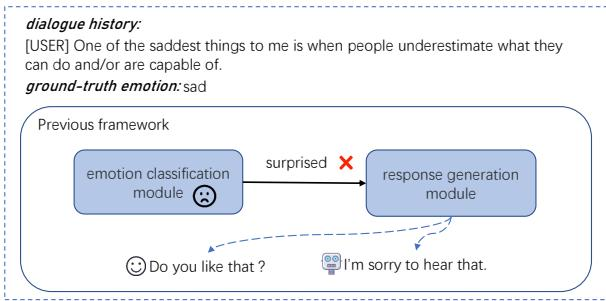
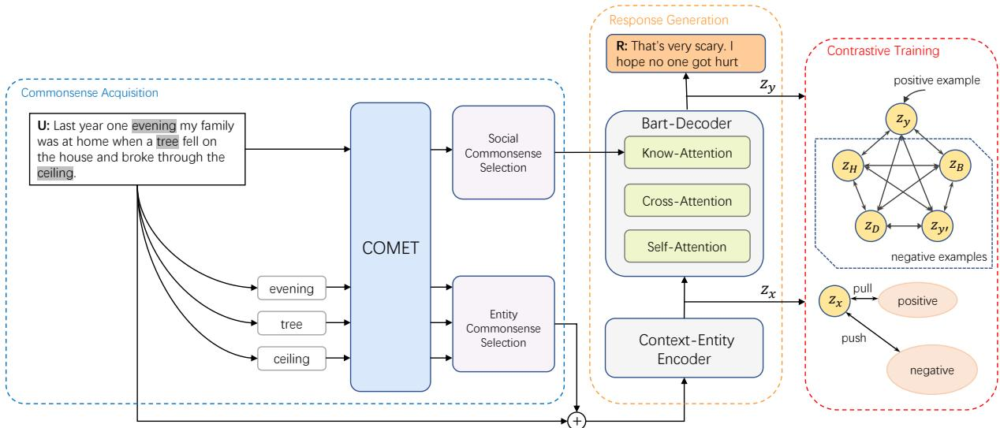

# Non-Emotion-Centric Empathetic Dialogue Generation

Yuanxiang Huangfu, Peifeng Li\*, Yaxin Fan and Qiaoming Zhu School of Computer Science and Technology, Soochow University, Suzhou, China yxhuangfu@stu.suda.edu.cn, pfli@suda.edu.cn yxfansuda@stu.suda.edu.cn, qmzhu@suda.edu.cn

## Abstract

Previous work on empathetic response generation mainly focused on utilizing the speaker’s emotions to generate responses. However, the performance of identifying fine-grained emotions is relatively poor, which results in cascading errors in generating empathetic responses. Moreover, due to the conflict between the information in the dialogue history and the recognized emotions, previous work often generated general and uninformative responses. To address the above issues, we propose a novel framework NEC (Non-Emotion-Centric empathetic dialogue generation) based on contrastive learning and context-sensitive entity and social commonsense, in which the frequent replies and sentences with incorrect emotions are punished through contrastive learning, thereby improving the empathy, diversity and information of the responses. The experimental results demonstrate that our NEC enhances the quality of empathetic generation and generates more diverse responses in comparison with the state-of-the-art baselines. The code will be available at https: //github.com/huangfu170/NEC-empchat

## 1 Introduction

In social psychology theory, empathy is expressed in two dimensions (Gerdes et al., 2010): (1) the physiological experience of feeling what another person is feeling (Batson et al., 1987); and (2) the cognitive processing of these feelings (Hoffman, 2001). Empathic ability in human dialogue enables individuals to comprehend each other’s experiences and emotions, thereby fostering more intimate interpersonal relationships (Keskin, 2014). Empathetic response generation aims to generate empathetic responses (e.g., comfort, sympathy, and understanding) to the speaker by thoroughly comprehending the speaker’s background and emotional state. It is a widely used technique in open-domain dialogue systems, such as digital humans (Shen et al., 2021) and interactive entertainment (Shao et al., 2023), with the objective of enhancing the user-system interaction experience.

  
Figure 1: Two common errors in Empathetic Dialogue System: (1) Emotional Error: responses that deviate entirely from the speaker’s situation due to errors in emotion recognition. (2) Uninformative Response: namely, the generation of responses that are overly generic.

Previous work (Lin et al., 2019; Xie and Pu, 2021; Pang et al., 2023) on empathetic response generation for neural dialogue systems has primarily focused on accurately identifying emotions and subsequently utilizing the identified emotions to guide the generation of empathetic responses. Nevertheless, the challenge of fine-grained emotion recognition (e.g., EMPATHETICDIALOGUES encompassed 32 distinct emotional categories) remains a significant barrier, with an accuracy rate below 50% (Gao et al., 2021; Zhao et al., 2023; Cai et al., 2023). Moreover, a dialogue may encompass various emotions, which further challenges the model of emotion identification, preventing it from accurately recognizing the appropriate emotions. This leads to cascading errors in the generation of empathetic responses. Figure 1 illustrates how the model incorrectly identifies a sad scenario as “surprised”, resulting in cascading errors that affect the model’s output. This leads to the model to ask the speaker “Do you like that?”, which is inconsistent with the scenario described by the conversation history. Such errors are unacceptable in empathic response generation and may have more serious consequences for the speaker than those in the emotion-unaware dialogue system.

Furthermore, a discrepancy may arise when the incorrectly identified emotion does not align with the dialogue history. In other words, the information obtained from the dialogue history is contaminated with the emotion that is incorrectly identified. This ultimately leads to the model being unable to generate responses that are both informative and appropriate. Figure 1 illustrates an example where the model generates an uninformative generic sentence “I’m sorry to hear that” at a high frequency due to the conflict between the incorrectly identified emotion and the dialogue history. This will lead to less consistency and empathy, affecting the speaker’s desire to continue the conversation.

In light of these considerations, a crucial issue emerges concerning the means of minimizing the influence of emotion recognition errors on the model, while concurrently reducing the prevalence of uninformative or non-empathetic sentences generated by the model. To address the above issue, we propose a novel framework NEC (Non-Emotion-Centric empathetic response generation) which incorporates context-sensitive entity and social commonsense, as well as contrastive learning. Specifically, we first utilize contrastive learning to replace the explicit emotion recognition, which can constrain the language model’s inferences in correct emotions. Furthermore, we introduce contextrelated entity and social commonsense knowledge to enhance the model’s comprehension of dialogue history and the emotion information embedded within entities, which can also assist the model in making accurate emotion judgments. The experimental results indicate that our NEC enhances the quality of empathetic generation and generates more diverse responses in comparison with the SOTA baselines.

## 2 Related Work

Dataset Empathetic response generation has recently garnered significant attention, as it necessitates not only generating contextually relevant responses but also expressing empathy towards the recipient of the reply. Rashkin et al. (2019) released an empathetic dialog dataset EMPATHET-ICDIALOGUES in which the annotators were first provided with an emotional word and then were tasked with engaging in an empathic conversation with another individual based on the given emotion.

Empathetic response generation The majority of prior research has primarily focused on two principal areas: firstly, the accurate identification of emotions and secondly, the enhancement of the interaction between emotions and responses. For example, Lin et al. (2019) devised distinct decoders for different emotions and subsequently aggregated the output via a meta-listener. Li et al. (2020) underscored the pivotal role of emotion recognition, which employed emotion lexicons to identify emotions and incorporated a feedback mechanism to detect the consistency between the generated content and the context. Majumder et al. (2020) utilized emotion embedding to discern emotions and employed the mimic approach to incorporate emotional information into the decoder. However, all of them designed their models based on the recognized emotions. Due to the poor capacity of emotion recognition, the above models are instead affected by cascading errors in emotion detection.

In recent years, the advancement of knowledge graphs and commonsense models have prompted researchers to recognize the potential of utilizing commonsense knowledge to enhance the performance of open-domain dialogue models (Tu et al., 2022; Lee et al., 2022). Two notable examples are ConceptNet (Speer et al., 2017) and ATOMIC (Hwang et al., 2021), which have been widely used to enhance the capacity of natural language understanding (NLU) (Ghosal et al., 2020) and natural language generation (NLG) (Liu and Kilicoglu, 2023; Strathearn and Gkatzia, 2021). For example in empathetic response generation, CEM (Sabour et al., 2022) utilized commonsense knowledge to enhance the model’s capacity, leveraging the underlying social commonsense reasoning embedded in the conversational history. DCKS (Cai et al., 2023) dynamically selected commonsense knowledge based on emotional states and context, establishing a dynamic connection between emotional states and commonsense.

## 3 Methodology

Figure 2 illustrates the framework of our NEC, in which we leverage a Transformer-based pretrained model, i.e., BART, as the backbone. Given a conversation history, we employ various prompt templates to extract entities and social commonsense from COMET (Hwang et al., 2021). After a selecting process, they are then injected into the encoder and decoder, respectively (Section 3.2 and 3.3). Subsequently, we further train the model based on the contrastive learning training strategy that we designed, which can avoid the cascade errors associated with emotion recognition (Section 3.4).

  
Figure 2: The architecture of our framework NEC, where $\mathbf { z } _ { \mathbf { x } } , \mathbf { z } _ { \mathbf { y } }$ are the hidden states of encoder and the ground truth $y ,$ and zB, zD, zH, $\mathbf { z } _ { \mathbf { y } ^ { \prime } }$ denote the representations of from-batch samples, the different emotion samples, the high-frequency samples and the self-generated samples, respectively.

## 3.1 Task Formulation

Empathetic response generation involves a dialogue model processing historical information and subsequently producing a language modeling probability distribution. Formally, let $U ~ = ~ \{ u _ { 1 } , \cdot \cdot \cdot , u _ { n - 1 } \}$ denote a dialogue history composed of n-1 utterances, and $Y =$ $\{ y _ { 1 } , \cdots , y _ { M } \}$ denotes the empathetic response of M tokens. Let $K _ { E } ~ = ~ \{ k e _ { 1 } , \cdots , k e _ { m } \}$ and $K _ { S } = \{ k s _ { 1 } , \cdot \cdot \cdot , k s _ { l } \}$ represent the entity and the social knowledge set, respectively. The goal is to generate appropriate and informative responses using the dialogue history U and the commonsense knowledge $K _ { E }$ and $K _ { S }$ as follows. A complete training example can be found at Appendix A.

$$
\arg \operatorname* { m a x } _ { { } } P ( { Y | U } , K _ { E } , K _ { S } )\tag{1}
$$

## 3.2 Entity Commonsense Integration

Entities are words that frequently appear in conversations and can also reflect the speaker’s emotions. For example, calling someone “my baby” indicates feelings of love, while “bastard” indicates feelings of disgust in most cases. Moreover, the same entity exhibits different properties in different contexts.

Consequently, inferring the meaning of an entity from its context necessitates human-like commonsense. In order to address this issue, we employ the dialogue history to generate context-aware commonsense for entities within the dialogue. In particular, for each entity and relation, we utilize the conversation history $U = u _ { 1 } \oplus u _ { 2 } \oplus \cdot \cdot \cdot \oplus u _ { n - 1 }$ as the head, and the input of COMET, i.e., $I E _ { i } ,$ , is as follows.

$$
I E _ { i } = U \oplus P _ { c } \oplus e n t _ { j } \oplus [ r e l _ { i } ]\tag{2}
$$

where $P _ { c }$ represents the prompt connecting context and entity, which is referred to the phrase “in this $\mathrm { c a s e } ^ { , \mathrm { * } }$ $e n t _ { j }$ is the $j \cdot$ -th entity and $r e l _ { i }$ is one of the following entity relations in COMET: 1) the entity’s usage (ObjectUse), 2) the location of the entity (AtLocation), 3) the composition of the entity (M adeU pOf), or 4) the inherent properties of the entity (HasP roperty), respectively. The corresponding special relation tokens are appended to the entity to prompt COMET to generate the triplets $( \mathrm { i . e . , ~ } < k e _ { h e a d } , k e _ { r e l } , k e _ { t a i l } >$ where head, rel and tail refer to entity, relation and commonsense knowledge, respectively) for each relation reli. All triplets extracted by COMET are denoted as $K _ { a l l }$

Inspired by SAKDP (Wu et al., 2022), we construct positive/negative sample pairs to select entity commonsense that is conducive to response generation. Subsequently, we train a BERT model as a scorer to discern the relevance of the current knowledge triplet to the reply. The final selection is made from the top $m ^ { 1 }$ triplets in $K _ { a l l }$ with the highest scores, denoted as $K _ { E }$

Finally, the pre-trained BART encoder is used to jointly encode the context and the selected entity knowledge, resulting in context-entity hidden states. The input to the encoder is as follows.

$$
I _ { e n c } = U \oplus [ S E P ] \oplus P _ { r } \oplus L ( K _ { E } )\tag{3}
$$

where $P _ { r }$ represents the prompt sentence “The $f o l \cdot$ lowing knowledgefacts are highly relevant to the left query:” to instruct the model on the relation between dialogic history and subsequent commonsense. $L ( K _ { E } )$ represents the linearization method. Specifically, we linearized each obtained entity’s common knowledge triplet <ent, rel, tail> in the selected set $K _ { E }$ into “ent, rel, tail”. The output of the encoder is as follows.

$$
\mathbf { z } _ { \mathbf { x } } = B A R T \_ E n c o d e r ( I _ { e n c } )\tag{4}
$$

## 3.3 Social Commonsense Injection

We obtain social commonsense knowledge following Cai et al. (2023), and use the last utterance of the dialogue history as input to acquire relevant knowledge as follows.

$$
{ { I } _ { r e l } } = { { u } _ { n - 1 } } \oplus [ S R ]\tag{5}
$$

where SR represents five types of relations in social commonsense used in Cai et al. (2023) as follows: 1) the impact of an event on the involved person X (xEffect), 2) X’s reaction to the event (xReact), 3) X’s intentions before the occurrence of the event (xIntent), 4) what X needs for the event to happen (xNeed), and 5) what X desires after the event has occurred (xWant). We also use the special tokens ([xEffect], [xReact], [xIntent], [xNeed], [xWant]) concatenated at the end for replacement and then prompt COMET as mentioned in the previous section to obtain unfiltered social commonsense set $\{ k s _ { 1 } , . . . , k s _ { i } , . . . \}$

Given the existence of multiple candidate inferences for each relation, we employ MPNet (Song et al., 2020), which has been pre-trained on the sentence similarity task2, to calculate the cosine similarity between the hidden vectors of commonsense and the context as follows, which allows us to select the knowledge with the highest score per relation.

$$
\mathbf { h } _ { \mathbf { c t x } } , \mathbf { h } _ { \mathbf { k s , i } } = M P N e t ( U ) , M P N e t ( k s _ { i } )\tag{6}
$$

1We selected top 3 triplets during the test stage.

$$
S c o r e ( k s _ { i } ) = \frac { \mathbf { h } _ { \mathbf { c t x } } \cdot \mathbf { h } _ { \mathbf { k s } , \mathbf { i } } } { \left\| \mathbf { h } _ { \mathbf { c t x } } \right\| \cdot \left\| \mathbf { h } _ { \mathbf { k s } , \mathbf { i } } \right\| }\tag{7}
$$

where $\mathbf { h } _ { \mathbf { c } \mathbf { t } \mathbf { x } } \in \mathbb { R } ^ { 1 \times d } , { \mathbf { h } _ { \mathbf { k } \mathbf { s } } } ^ { T } \in \mathbb { R } ^ { d \times 1 }$ represent the hidden vectors of the dialogue history and each candidate social commonsense $k s _ { i }$ , respectively. Social commonsense, which can be defined as a coarse-grained form of knowledge, is integrated into a standard Transformer Decoder by the addition of a multi-head attention layer. This layer facilitates the fusion of contextual information and social commonsense, thereby enhancing the overall performance. The collection of social commonsense $K _ { S }$ is comprised of selected knowledge of various relations with highest similarity. The decoder representation during training stage is denoted as follows.

$$
{ \bf z } _ { \bf y } = B A R T \_ D e c o d e r ( K _ { S } , { \bf z } _ { \bf x } , Y )\tag{8}
$$

## 3.4 Contrastive Training

Although there has been an enhancement from the incorporation of commonsense knowledge, it remains insufficient as a control signal for generating empathetic responses. Contrastive learning (Chen et al., 2020; Wu et al., 2020; Giorgi et al., 2021) is a widely used method in representation learning, which has been widely applied to various NLP tasks, including dialogue response generation (Dai et al., 2021; Tang et al., 2023).

In light of recent research indicating that language models can be directed towards the generation of more informative sentences through the construction of judicious positive and negative examples (Kalkstein et al., 2020; Li et al., 2022), we employ contrastive training to enhance the model’s performance in empathy and diversity for two primary purposes: (1) Using the sentences with high frequency as negative examples can correct the model’s tendency to generate generic and repetitive sentences. (2) Utilizing the responses with emotions as negative samples, which are different from the current example, can guide the model to generate responses related to emotions. This approach mitigates the cascading errors introduced by the models centered around emotion recognition.

We employed a similar contrastive learning approach to that described in An et al. (2022) to penalize the output of the model. The constructed negative examples are categorized into four parts as follows, which denoted as D, y′, B, and H, respectively.

Different emotions (D) To enhance emotional expression, the responses are sampled with emotions that differ from the current target sentence. This is used to replace the emotion recognition module, thereby constraining the model to the appropriate emotion output.

Self-generated $( y ^ { \prime } )$ As the model frequently generates more generalized sentences, the predictions of beam search can serve as implicit penalties for universally applicable sentences.

From-batch (B) Other samples in the same mini-batch.

High-frequency (H) Explicit universal sentence penalties are introduced by selecting the most frequent sentences from the training set.

In all settings, the target response $y ^ { + }$ is employed as positive example for contrastive learning. During the training stage, the model is augmented by incorporating negative examples $y ^ { - }$ − to refine the model. The training objective of contrastive learning, $L _ { t o t a l } .$ , is as follows.

$$
L _ { t o t a l } = L _ { N L L } + L _ { C L }\tag{9}
$$

$$
L _ { N L L } = - \sum _ { t = 1 } ^ { N } \log P ( y _ { t } | I _ { e n c } , K _ { S } , y _ { < t } )\tag{10}
$$

$$
L _ { C L } = \sum _ { ( y ^ { + } , y ^ { - } ) \in \mathcal { P } } \operatorname* { m a x } \{ 0 , D ( \mathbf { z _ { x } } , y ^ { + } , y ^ { - } ) + \xi \}\tag{11}
$$

$$
D ( \mathbf { z _ { x } } , y ^ { + } , y ^ { - } ) = \cos \left( \mathbf { z _ { x } } , \mathbf { z _ { y ^ { - } } } \right) - \cos \left( \mathbf { z _ { x } } , \mathbf { z _ { y ^ { + } } } \right)\tag{12}
$$

where $y _ { t } \in Y$ , and $\mathcal { P }$ denotes the sample set of contrastive learning. ${ \bf z _ { y ^ { - } } }$ and ${ \bf z _ { y ^ { + } } }$ represent the hidden states of $y ^ { - } \in \{ \hat { D , } y ^ { \prime } , B , \hat { H } \}$ and $y ^ { + }$ , respectively. We further set $\xi = \gamma * ( r a n k ( y ^ { - } ) - r a n k ( y ^ { + } ) )$ following (An et al., 2022), which reflects the quality difference in these pairs, where γ is a hyperparameter controlling the strength of contrast. We set 0.01 to it for all experiment settings following (An et al., 2022). cos means cosine similarity to the representation.

During the inference process, we leverage the acquired similarity method to augment the beam search, and the ultimate decoding target is to find the sequence $y ^ { \ast }$ from beam search results that maximizes the amalgamation of the acquired similarity score $\boldsymbol { S _ { s i m } }$ and the generative probability $S _ { l m }$ derived from the language model as follows.

$$
S _ { s i m } = \cos ( \mathbf { z _ { x } } , \mathbf { z } _ { \hat { \mathbf { y } } } )\tag{13}
$$

$$
{ \cal S } _ { l m } = \prod _ { t = 0 } ^ { n } { \cal P } ( \hat { y } _ { t } | { \bf z _ { x } } , \hat { y } _ { < t } )\tag{14}
$$

$$
y ^ { * } = \underset { \hat { y } } { \arg \operatorname* { m a x } } \{ \alpha S _ { s i m } + ( 1 - \alpha ) S _ { l m } \}\tag{15}
$$

where $\mathbf { z } _ { \hat { \mathbf { y } } }$ is the hidden vector of the search results $\hat { y } ,$ and α is the balance hyperparameter of contrastive learning and language model likelihood.

## 4 Experimentation

In this section, we first describe the dataset, and automatic/human evaluation methods, then introduce seven strong baselines. Finally, we report the overall experimental results.

## 4.1 Dataset

We evaluate our NEC on the EMPATHETICDIA-LOGUES dataset (Rashkin et al., 2019), which is composed of 25K open-domain dialogues in empathy expression. In a conversation, the speaker conceptualizes a personal experience based on a given emotion and engages in an empathic dialogue with the listener based on that experience, and each conversation is labeled with only one emotion word, which is not utilized in this paper. Following previous work (Cai et al., 2023), we split the train/valid/test set by 8:1:1 and use the same preprocessing functions.

## 4.2 Implementation Details

The PyTorch framework and the base version of BART are employed as the encoder and decoder3, respectively. The AdamW optimizer with an initial learning rate of 0.00001 is utilized, with betas parameters set to 0.9 and 0.999. The 2020 version of COMET is employed for the generation of commonsense knowledge 4. We use $\mathrm { N L T K ^ { 5 } }$ package to extract entities for entity commonsense integration. In the preliminary training phase, the loss function is chosen to plateau at a value indicative of the end of the training process, with a batch size of 8. In contrastive learning, the batch size is 8 during training and 16 during testing, with the parameter α set to 0.7. An early stopping mechanism is employed to prevent overfitting, and the optimal model results on the test set are reported. The decoding strategy employed is beam search, with a maximum decoding step of 30 during inference. The training and testing of the model are conducted on a NVIDIA A100-PCIE (40GB).

## 4.3 Automatic Evaluation Metrics

We use Perplexity (PPL), BLEU-n (B-n) (Papineni et al., 2002), Distinct-n (Dist-n) (Li et al., 2016) to automatically evaluate the model. PPL represents the confidence level of the model in the response. A lower PPL indicates a higher probability that the model will predict the response. BLEU-n is used to measure the n-gram similarity between the model-generated responses and the ground truth. A higher BLEU-n value indicates a closer approximation. Following previous work, we also use BLEU 1-4 to illustrate model performance. Distinct-n represents the proportion of unique n-grams generated by the model. It provides insight into the word-diversity of the model, which is particularly significant for open-domain dialogue systems. Furthermore, we introduce a new metric, Sent-Std, to measure sentence-level diversity instead of n-gram level as follows.

$$
\mathrm { S e n t - S t d } = { \sqrt { { \frac { 1 } { N } } \sum _ { i = 1 } ^ { N } ( \mathrm { c o u n t } ( s _ { i } ) - \mu ) ^ { 2 } } }\tag{16}
$$

where $\mu$ represents the average frequency of sentences generated across the test dataset. $s _ { i }$ and N represent the certain sentence and the number of different sentences that have appeared. A small Sent-Std score indicates a more evenly distributed sentence occurrence in the generated responses, which will be used to measure the diversity of different models at the sentence level, that none of the previous work has explored.

## 4.4 Human Evaluation Methods

Given that automated evaluation results can only assess model’s consistency with the ground truth, they are incapable of gauging the level of empathy conveyed in the responses. Consequently, as in the approach employed by CEM (Sabour et al., 2022), we adopt a human evaluation to complement the shortcomings of automatic metrics by considering the model’s performance across four dimensions: (1) Coherence (Coh.): the relevance between response and context; (2) Empathy (Emp.): the capacity to comprehend the speaker’s situation and exhibit adequate empathy; (3) Informativeness (Inf.): the extent of contextual information present in response; and (4) Continuity (Con.): which reply fosters a greater desire in the speaker to sustain the conversation. After shuffling the one hundred randomly selected responses’ order in each sample, we assign three annotators who are master’s students specializing in NLP to label each pair on a scale of 1 to 5 as in Li et al. (2020), where scores of 1, 3 and 5 represent unacceptable, moderate and excellent performance respectively, while 2 and 4 fall in between.

## 4.5 Baselines

To verify the effectiveness of our proposed NEC, we selected the following strong models as baselines for comparison:

• Transformer(Vaswani et al., 2017), the vanilla Transformer for response generation.

• Multi-TRS (Rashkin et al., 2019), a model combining emotion classification for multitask training with Transformer.

• MoEL (Lin et al., 2019), a Transformer-based model with a single encoder and multiple decoders, where each decoder is dedicated to a specific emotion and the outputs of the different decoders are aggregated to generate a response.

• MIME (Majumder et al., 2020), another Transformer-based model that mimics the emotion in both negative and positive way to achieve an appropriate balance.

• EmpDG (Li et al., 2020), a multi-granularity generation framework introducing interactive discriminators to identify the semantic and emotional accuracy of generated content.

• CEM (Sabour et al., 2022), an empathetic response generation model involving affective and cognitive commonsense knowledge.

• DCKS (Cai et al., 2023), a SOTA model using BART-based generation with dynamic commonsense selection through emotions.

## 4.6 Experimental Results

Table 1 presents the results of the automatic evaluation conducted on the EMPATHETICDIALOGUES dataset. The avoidance of cascading errors on emotion recognition has led to significant improvements in all metrics, in comparison with seven strong baselines that require prior emotion recognition. This result provides evidence of the effectiveness of our NEC.

Specifically, the BLEU-n scores of our NEC have increased by 20% in comparison with the SOTA model DCKS, suggesting that our NEC aligned better with real people’s responses than previous best models. Additionally, our NEC surpasses the baselines in three metrics Distinct-n,

<table><tr><td>Model</td><td>PPL↓</td><td>B-1↑</td><td>B-2↑</td><td>B-3↑</td><td>B-4↑</td><td>Dist-1↑</td><td>Dist-2↑</td><td>Sent-Std↓</td></tr><tr><td>Transformer</td><td>37.62</td><td>18.07</td><td>8.34</td><td>4.57</td><td>2.86</td><td>0.36</td><td>1.35</td><td>47.35</td></tr><tr><td>Emotion methods</td><td></td><td></td><td></td><td></td><td></td><td></td><td></td><td></td></tr><tr><td>Multi-TRS</td><td>37.50</td><td>18.78</td><td>8.55</td><td>4.70</td><td>2.95</td><td>0.35</td><td>1.27</td><td>100.11</td></tr><tr><td>MoEL</td><td>36.60</td><td>18.07</td><td>8.30</td><td>4.37</td><td>2.65</td><td>0.59</td><td>2.64</td><td>40.15</td></tr><tr><td>MIME</td><td>37.24</td><td>18.60</td><td>8.39</td><td>4.54</td><td>2.65</td><td>0.47</td><td>1.66</td><td>216.08</td></tr><tr><td>EmpDG</td><td>37.43</td><td>19.96</td><td>9.11</td><td>4.74</td><td>2.80</td><td>0.46</td><td>1.99</td><td>26.94</td></tr><tr><td>Commonsense methods</td><td></td><td></td><td></td><td></td><td></td><td></td><td></td><td></td></tr><tr><td>CEM</td><td>36.33</td><td>16.12</td><td>7.29</td><td>4.06</td><td>2.03</td><td>0.62</td><td>2.39</td><td>61.26</td></tr><tr><td>DCKS</td><td>16.08</td><td>21.73</td><td>10.62</td><td>6.24</td><td>4.09</td><td>2.19</td><td>9.61</td><td>36.89</td></tr><tr><td>NEC(Ours)</td><td>12.89</td><td>23.62</td><td>12.14</td><td>7.27</td><td>4.78</td><td>3.15</td><td>13.91</td><td>18.61</td></tr><tr><td>Human</td><td></td><td></td><td></td><td>一</td><td></td><td>19.49</td><td>43.55</td><td>0.71</td></tr></table>

Table 1: Performance comparison between our NEC and the baselines (cited from (Cai et al., 2023)) where ↑ indicates good performance for large numbers, while ↓ indicates good performance for small numbers.

<table><tr><td>Models</td><td>Coh.</td><td>Emp.</td><td>Inf.</td><td>Cont.</td></tr><tr><td>EmpDG</td><td>2.98</td><td>2.87</td><td>2.81</td><td>2.81</td></tr><tr><td>MIME</td><td>3.27</td><td>3.25</td><td>3.09</td><td>3.14</td></tr><tr><td>MoEL</td><td>3.55</td><td>3.66</td><td>3.42</td><td>3.53</td></tr><tr><td>Transformer</td><td>3.28</td><td>3.34</td><td>3.25</td><td>3.23</td></tr><tr><td>Multi-TRS</td><td>3.35</td><td>3.33</td><td>3.3</td><td>3.25</td></tr><tr><td>CEM</td><td>3.87</td><td>3.82</td><td>3.39</td><td>3.24</td></tr><tr><td>DCKS</td><td>3.95</td><td>3.90</td><td>4.05</td><td>4.16</td></tr><tr><td>NEC(Ours)</td><td>4.34</td><td>4.32</td><td>4.08</td><td>4.12</td></tr><tr><td>w/o Neg</td><td>4.21</td><td>4.11</td><td>4.01</td><td>4.09</td></tr></table>

Table 2: Results of human evaluation. Fleiss kappa fo the results is 0.40, indicating a moderate level of consistency among evaluators.

<table><tr><td>Model</td><td>Proportion(%)</td></tr><tr><td>Transformer</td><td>32.38</td></tr><tr><td>Multi-TRS</td><td>46.61</td></tr><tr><td>MIME</td><td>54.58</td></tr><tr><td>EmpDG</td><td>29.94</td></tr><tr><td>MoEL</td><td>25.97</td></tr><tr><td>CEM</td><td>36.82</td></tr><tr><td>DCKS</td><td>34.41</td></tr><tr><td>NEC(Ours)</td><td>20.32</td></tr></table>

Table 3: Proportion of top five frequent sentences.

Sent-Std, and PPL, which indicates that our NEC can generate more informative responses at the ngram and sentence levels. This verifies that the incorporation of the contrastive learning strategies enables the model to avoid being erroneously guided by the emotion recognition task and to better leverage context for empathetic response generation.

In addition, the results of the human evaluation are presented in Table 2, demonstrating that our NEC outperforms all baselines, with no decline in performance observed after the removal of explicit emotion recognition. After removing the negative samples with different emotions (w/o Neg), our NEC exhibited a significant decline in empathy performance. This indicates that the negative samples with emotions in the contrastive learning strategies are effective in enhancing the empathic ability of the model.

Furthermore, Table 3 shows the proportion of the top five most frequent sentences among all different sentences generated by our and other models, in which most of them are uninformative generic sentences like “I’m sorry to hear that”. This result demonstrates the diversity of responses of our NEC, which can generate more informative responses.

Further analysis is conducted through the sampling and examination of the generated sentences, with the objective of assessing whether a significant proportion of sentences have been rephrased from the top five results manually. Following the consolidation of sentences with similar semantics, it was observed that the proportion of occurrences for the top five and Sent-Std increased to 26.02% (+5.7%) and 27.15 (+8.54), respectively. Notwithstanding this increase, our method continues to outperform amlost all baselines with respect to both metrics. In the future, we intend to integrate BERTScore in order to more accurately calculate semantic similarity and cluster similar sentences, which may further enhance this metric.

## 4.7 Ablation Study

We conduct an ablation study to elucidate the roles of different modules in our NEC and the results are shown in Table 4. Two main components were designed: (1) Different Commonsense Knowledge: i) Entity commonsense was removed (w/o Entity) and dialogue history is utilized as the input of the encoder , and ii) Social commonsense was removed (w/o Social) and the corresponding knowledge attention module in the decoder was also removed. (2) Different types of negative examples in contrastive learning: i) the self-generated negative examples (w/o SelfGen), ii) high-frequency statement negative examples (w/o HighFreq), and iii) negative examples with different emotions (w/o DiffEmo) were removed, respectively.

<table><tr><td>Model</td><td>PPL↓</td><td>B-1↑</td><td>B-2↑</td><td>B-3↑</td><td>B-4↑</td><td>Dist-1↑</td><td>Dist-2↑</td><td>Sent-Std↓</td></tr><tr><td>NEC(Ours)</td><td>12.89</td><td>23.62</td><td>12.14</td><td>7.27</td><td>4.78</td><td>3.15</td><td>13.91</td><td>18.61</td></tr><tr><td>w/o Entity</td><td>12.71</td><td>22.56</td><td>11.57</td><td>6.96</td><td>4.61</td><td>2.41</td><td>10.11</td><td>19.31</td></tr><tr><td>w/o Social</td><td>12.63</td><td>23.54</td><td>12.15</td><td>7.08</td><td>4.57</td><td>2.11</td><td>8.02</td><td>19.22</td></tr><tr><td>w/o SelfGen</td><td>11.91</td><td>23.01</td><td>11.73</td><td>6.84</td><td>4.60</td><td>2.15</td><td>10.64</td><td>20.33</td></tr><tr><td>w/o HighFreq</td><td>11.81</td><td>23.42</td><td>12.01</td><td>7.22</td><td>4.69</td><td>3.02</td><td>12.06</td><td>21.12</td></tr><tr><td>w/o DiffEmo</td><td>12.97</td><td>22.91</td><td>11.66</td><td>6.81</td><td>4.62</td><td>2.74</td><td>11.51</td><td>19.66</td></tr></table>

Table 4: Results of ablation study.

Commonsense knowledge The removal of commonsense knowledge results in a notable decline in the model’s performance, particularly in terms of Dist-n and Sent-Std. This is due to the fact that entity knowledge enriches the model with a more comprehensive contextual understanding, extending beyond the confines of the conversation history itself. Furthermore, it effectively transfers knowledge from a commonsense model to the generative model through integration. Moreover, social commonsense guides the direction of the model’s responses, ensuring that the model’s output aligns with the human response to the context. Upon the removal of this guidance, the model is unable to process this kind of information, despite its comprehensive understanding of the context, aided by other modules.

Negative samples Emotion negative samples are designed as guidance emotion in the training stage, which don’t exhibit a significant decrease in Sent-Std. However, Table 2 reveals a substantial decline in empathy of human evaluation. Removing selfgenerated and high-frequency negative examples results in a noticeable deterioration of the Sent-Std metric. This indicates that the model is inclined to generate more frequent generic sentences without these components.

## 4.8 Case study

Table 5 presents two cases from EMPATHETICDIA-LOGUES. In the first example, the speaker emphasizes the breakup with his girlfriend of eight years, indicating a highly pessimistic emotion. However, most models fail to exhibit sufficient empathetic abilities and context relevance. Transformer, MoEL and Multi-TRS perceive this as a matter deserving of a positive response, and they reply in a cheerful manner, lacking expressions of consolation or topic transition. This not only fails to achieve empathetic responses but may potentially lead to more serious consequences. MIME employs relatively generic sentences, with the phrase “I am sorry to hear that” constituting 30.70% of all different sentences. EmpDG expresses regret about the speaker’s breakup, but does not offer an effective statement that could keep the conversation going. For dialogue models that incorporated commonsense, we found they did not show emotions that were completely opposite to the dialog history. Instead, they displayed passive, uninformative responses. In contrast, our model and DCKS expressed comfort to the speaker in an active way.

In the second example, the speaker expresses confusion about some people not responding or confirming emails and seeks to vent to another person. The majority of models provide responses with less informativeness, offering generic phrases like “What happened?” or contextually indifferent phrases like “I do not blame you” by EmpDG and CEM. DCKS uses “I’m sorry to hear that” in response to the speaker’s expression of oddity, which should correspond to the context of sadness. In contrast, our NEC acknowledges the author’s confusion in “I agree” and expresses its own perplexity regarding people not responding to emails in “ I do not know why people don’t respond to emails”.

## 4.9 Error Analysis

Uninformative sequences As evidenced by Table 3, NEC has significantly reduced the proportion of high-frequency sentences in comparison with previous work. However, when compared to human, there is still considerable room for improvement. We observe that both our model and previous models often adopt a pattern of one empathygeneric utterance followed by one informational and empathy-special sentence (first sample in Table 5). In contrast, human responses frequently demonstrate empathy without directly using sentences as “I’m sorry to hear that.” to express empathy. For example, in the case of a speaker experiencing a car accident due to the other party’s drunkenness, the model’s output might be: “That is horrible! I’m glad you are OK.” In contrast, a human response could be “Did you suffer any injuries?”. It expresses concern by directly asking whether the speaker was hurt. This might suggest that a significant proportion of high-frequency sentences generated by models potentially due to their reliance on a predefined pattern. This conversational pattern, compared to human interaction, appears more mechanistic, potentially inducing fatigue among participants and diminishing their engagement and continuity of the dialogue.

<table><tr><td>Context</td><td>I there, don&#x27;t know what to do, jst broke up with my girlfirend, we were 8 years together.</td></tr><tr><td>EmpDG</td><td>Oh no ! that is a shame !</td></tr><tr><td>MIME</td><td>I am sorry to hear that. what happened?</td></tr><tr><td>MoEL</td><td>Oh wow, that must have been very exciting!</td></tr><tr><td>Multi-TRS</td><td>That sounds like a lot of fun!</td></tr><tr><td>Transformer</td><td>That sounds like a lot of fun !</td></tr><tr><td>CEM</td><td>I am sorry to hear that.</td></tr><tr><td>DCKS</td><td>I am sorry to hear that. i hope everything works out for you!</td></tr><tr><td>Ours</td><td>Oh no! I&#x27;m so sorry to hear that. I hope you find someone better.</td></tr><tr><td>Human</td><td>Sorry to hear! Do you have any idea about the break up? did you think about it?</td></tr><tr><td>Context</td><td>I find it odd and annoying when people do not respond to or even acknowledge emails .</td></tr><tr><td>EmpDG MIME</td><td>I do not blame you.</td></tr><tr><td>MoEL</td><td>I am sorry to hear that. what happened?</td></tr><tr><td>Multi-TRS</td><td>Oh no. I hate that. i hope they do not have to deal with that.</td></tr><tr><td>Transformer</td><td>That is terrible. I hope you find them soon.</td></tr><tr><td>CEM</td><td>I know what you mean, it is not good.</td></tr><tr><td>DCKS</td><td>I do not blame you. I am sorry to hear that. do you have a problem with that?</td></tr><tr><td>Ours</td><td></td></tr><tr><td>Human</td><td>I agree. I also do not know why people don&#x27;t respond to emails.</td></tr><tr><td></td><td>Well, sometimes people are busy and do not have the time to check emails.</td></tr></table>

Table 5: Case study of generated responses of EMPATHETICDIALOGUES.

## 5 Conclusion

In this paper, we propose a novel empathetic dialogue generation framework NEC grounded in contrastive learning and multiple knowledge. The framework constructs various negative examples to train the model, mitigating the risk of cascading errors arising from poor emotion recognition. Simultaneously, it constrains the model’s output on high-frequency statements, enabling it to produce more informative responses. The experimental results demonstrate the effectiveness of our NEC. In the future, we will consider how to improve the efficiency of the training stage.

## Limitations

In our work, we utilize various types of negative samples during training. While this approach does not affect the decoding speed, it results in relatively longer training times in comparison with the original training method. This is a common challenge in many contrastive learning algorithms.

## Acknowledgements

The authors would like to thank the three anonymous reviewers for their comments on this paper. This research was supported by the National Natural Science Foundation of China (Nos. 62376181 and 62276177), and Project Funded by the Priority Academic Program Development of Jiangsu Higher Education Institutions.

## References

Chenxin An, Jiangtao Feng, Kai Lv, Lingpeng Kong, Xipeng Qiu, and Xuanjing Huang. 2022. Cont: Contrastive neural text generation. In NeurIPS, volume 35, pages 2197–2210.

C Daniel Batson, Jim Fultz, and Patricia A Schoenrade. 1987. Distress and empathy: Two qualitatively distinct vicarious emotions with different motivational consequences. Journal ofpersonality, 55(1):19–39.

Hua Cai, Xuli Shen, Qing Xu, Weilin Shen, Xiaomei Wang, Weifeng Ge, Xiaoqing Zheng, and Xiangyang Xue. 2023. Improving empathetic dialogue generation by dynamically infusing commonsense knowledge. In ACL, pages 7858–7873.

Ting Chen, Simon Kornblith, Mohammad Norouzi, and Geoffrey Hinton. 2020. A simple framework for contrastive learning of visual representations. In ICML, pages 1597–1607.

Shuyang Dai, Guoyin Wang, Sunghyun Park, and Sungjin Lee. 2021. Dialogue response generation via contrastive latent representation learning. In NLP4ConvAI, pages 189–197.

Jun Gao, Yuhan Liu, Haolin Deng, Wei Wang, Yu Cao, Jiachen Du, and Ruifeng Xu. 2021. Improving empathetic response generation by recognizing emotion cause in conversations. In EMNLP, pages 807–819.

Karen E. Gerdes, Elizabeth A. Segal, and Cynthia A. Lietz. 2010. Conceptualising and Measuring Empathy. The British Journal ofSocial Work, 40(7):2326–2343.

Deepanway Ghosal, Navonil Majumder, Alexander Gelbukh, Rada Mihalcea, and Soujanya Poria. 2020. COSMIC: COmmonSense knowledge for eMotion identification in conversations. In EMNLP, pages 2470–2481.

John Giorgi, Osvald Nitski, Bo Wang, and Gary Bader. 2021. Declutr: Deep contrastive learning for unsupervised textual representations. In AAAI, pages 879–895.

Martin L Hoffman. 2001. Empathy and moral development: Implications for caring and justice. Cambridge University Press.

Jena D Hwang, Chandra Bhagavatula, Ronan Le Bras, Jeff Da, Keisuke Sakaguchi, Antoine Bosselut, and Yejin Choi. 2021. (comet-) atomic 2020: on symbolic and neural commonsense knowledge graphs. In AAAI, volume 35, pages 6384–6392.

David A Kalkstein, David A Bosch, and Tali Kleiman. 2020. The contrast diversity effect: Increasing the diversity of contrast examples increases generalization from a single item. Journal ofExperimental Psychology: Learning, Memory, and Cognition, 46(2):296.

Sevgi Co¸skun Keskin. 2014. From what isn’t empathy to empathic learning process. Procedia - Social and Behavioral Sciences, 116:4932–4938.

Jing Yang Lee, Kong Aik Lee, and Woon Seng Gan. 2022. Improving contextual coherence in variational personalized and empathetic dialogue agents. In ICASSP, pages 7052–7056.

Jiwei Li, Michel Galley, Chris Brockett, Jianfeng Gao, and William B Dolan. 2016. A diversity-promoting objective function for neural conversation models. In NAACL, pages 110–119.

Qintong Li, Hongshen Chen, Zhaochun Ren, Pengjie Ren, Zhaopeng Tu, and Zhumin Chen. 2020. EmpDG: Multi-resolution interactive empathetic dialogue generation. In COLING, pages 4454–4466.

Weizhao Li, Junsheng Kong, Ben Liao, and Yi Cai. 2022. Mitigating contradictions in dialogue based on contrastive learning. In ACL, pages 2781–2788.

Zhaojiang Lin, Andrea Madotto, Jamin Shin, Peng Xu, and Pascale Fung. 2019. MoEL: Mixture of empathetic listeners. In EMNLP-IJCNLP, pages 121–132.

Yiren Liu and Halil Kilicoglu. 2023. Commonsenseaware prompting for controllable empathetic dialogue generation. arXiv preprint arXiv:2302.01441.

Navonil Majumder, Pengfei Hong, Shanshan Peng, Jiankun Lu, Deepanway Ghosal, Alexander Gelbukh, Rada Mihalcea, and Soujanya Poria. 2020. Mime: Mimicking emotions for empathetic response generation. In EMNLP, pages 8968–8979.

Xiaobing Pang, Yequan Wang, Siqi Fan, Lisi Chen, Shuo Shang, and Peng Han. 2023. Empmff: A multifactor sequence fusion framework for empathetic response generation. In WWW, pages 1754–1764.

Kishore Papineni, Salim Roukos, Todd Ward, and Wei-Jing Zhu. 2002. Bleu: a method for automatic evaluation of machine translation. In ACL, pages 311–318.

Hannah Rashkin, Eric Michael Smith, Margaret Li, and Y-Lan Boureau. 2019. Towards empathetic opendomain conversation models: A new benchmark and dataset. In ACL, pages 5370–5381.

Sahand Sabour, Chujie Zheng, and Minlie Huang. 2022. Cem: Commonsense-aware empathetic response generation. In AAAI, volume 36, pages 11229–11237.

Yunfan Shao, Linyang Li, Junqi Dai, and Xipeng Qiu. 2023. Character-LLM: A trainable agent for roleplaying. In EMNLP, pages 13153–13187.

Tong Shen, Jiawei Zuo, Fan Shi, Jin Zhang, Liqin Jiang, Meng Chen, Zhengchen Zhang, Wei Zhang, Xiaodong He, and Tao Mei. 2021. Vida-man: Visual dialog with digital humans. In ACM MM, page 2789–2791.

Kaitao Song, Xu Tan, Tao Qin, Jianfeng Lu, and Tie-Yan Liu. 2020. Mpnet: Masked and permuted pretraining for language understanding. In NeurIPS, volume 33, pages 16857–16867.

Robyn Speer, Joshua Chin, and Catherine Havasi. 2017. Conceptnet 5.5: An open multilingual graph of general knowledge. In AAAI, volume 31, pages 4444– 4451.

Carl Strathearn and Dimitra Gkatzia. 2021. Chefbot: A novel framework for the generation of commonsenseenhanced responses for task-based dialogue systems. In INLG, pages 46–47.

Yihong Tang, Bo Wang, Miao Fang, Dongming Zhao, Kun Huang, Ruifang He, and Yuexian Hou. 2023. Enhancing personalized dialogue generation with contrastive latent variables: Combining sparse and dense persona. arXiv preprint arXiv:2305.11482.

Quan Tu, Yanran Li, Jianwei Cui, Bin Wang, Ji-Rong Wen, and Rui Yan. 2022. Misc: A mixed strategyaware model integrating comet for emotional support conversation. In ACL, pages 308–319.

Ashish Vaswani, Noam Shazeer, Niki Parmar, Jakob Uszkoreit, Llion Jones, Aidan N Gomez, Łukasz Kaiser, and Illia Polosukhin. 2017. Attention is all you need. In NeurIPS, volume 30, pages 5998–6008.

Sixing Wu, Ying Li, Ping Xue, Dawei Zhang, and Zhonghai Wu. 2022. Section-aware commonsense knowledge-grounded dialogue generation with pretrained language model. In COLING, pages 521– 531.

Zhuofeng Wu, Sinong Wang, Jiatao Gu, Madian Khabsa, Fei Sun, and Hao Ma. 2020. Clear: Contrastive learning for sentence representation. arXiv preprint arXiv:2012.15466.

Yubo Xie and Pearl Pu. 2021. Empathetic dialog generation with fine-grained intents. In CONLL, pages 133–147.

Weixiang Zhao, Yanyan Zhao, Xin Lu, and Bing Qin. 2023. Don’t lose yourself! empathetic response generation via explicit self-other awareness. In ACL, pages 13331–13344.

## A Training Example

Table 6 shows a training example of the entity knowledge, the social knowledge and the constructed negative examples for contrastive learning.

<table><tr><td>Context</td><td>Speaker:I remember going to the fireworks with my best friend. there was a lot of people, but it only felt like us in the world. Listener: Was this a friend you were in love with, or just a best friend? Speaker:this was a best friend. i miss her.</td></tr><tr><td>gold emotion Entity Knowledge</td><td>sentimental [ObjectUse]friend:have a good time [ObjectUse]fireworks:have a good time. [AtLocation]friends:the fireworks</td></tr><tr><td>Social Knowledge</td><td>xReact:Sad; xNeed:Have a best friend. xIntent:Have a friend xWant:Talk to her xEffect:Is missed</td></tr><tr><td>Different Emotion</td><td>I am sorry to hear that. Did it hap- pen out of the blue? That is great. I would have been</td></tr><tr><td>Self-generate</td><td>scared to death. Was it recent? I hope you can get better! I&#x27;m sorry to hear that.</td></tr><tr><td>From batch</td><td>I saw that game. They won on penalty kicks! Hello! I am in such a good mood since I got my new home.</td></tr><tr><td>High frequency</td><td>I am sorry to hear that. What happend?</td></tr><tr><td>Human Response</td><td>Sorry to hear! Do you have any idea about the break up? did you think about it?</td></tr></table>

Table 6: A training example.