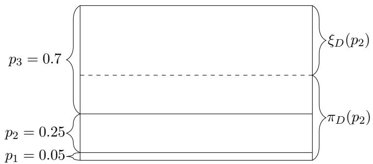
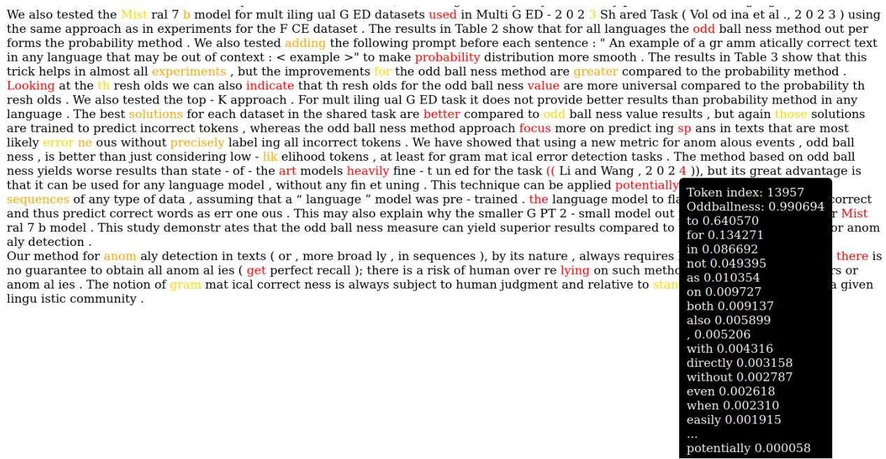

# Oddballness: universal anomaly detection with language models

Filip Gralinski ´ Adam Mickiewicz University filipg@amu.edu.pl Snowflake filip.gralinski@snowflake.com

Ryszard Staruch Adam Mickiewicz University Center for Artificial Intelligence AMU ryszard.staruch@amu.edu.pl

Krzysztof Jurkiewicz Adam Mickiewicz University

## Abstract

We present a new method to detect anomalies in texts (in general: in sequences of any data), using language models, in a totally unsupervised manner. The method considers probabilities (likelihoods) generated by a language model, but instead of focusing on low-likelihood tokens, it considers a new metric defined in this paper: oddballness. Oddballness measures how “strange” a given token is according to the language model. We demonstrate in grammatical error detection tasks (a specific case of text anomaly detection) that oddballness is better than just considering low-likelihood events, if a totally unsupervised setup is assumed.

## 1 Introduction

Not all events with low probability are weird or oddball when they happen. For example, the probability of a specific deal in the game of bridge is extremely low $\begin{array} { r } { ( p _ { b } = \frac { 1 } { 5 . 3 6 \times 1 0 ^ { 2 8 } } } \end{array}$ for each deal). Thus, every time cards are dealt in bridge, does something incredible happen? Of course not; in fact an event of the very low probability $p _ { b }$ must happen (with probability 1!).

As another example, imagine two probability distributions:

$$
\begin{array} { r l } & { 1 . ~ D _ { 1 } = \{ p _ { 1 } = \frac { 1 } { 1 0 0 } , p _ { 2 } = \frac { 9 9 } { 1 0 0 } \} , } \\ & { 2 . ~ D _ { 2 } = \{ p _ { 1 } = \frac { 1 } { 1 0 0 } , p _ { 2 } = \frac { 1 } { 1 0 0 } , \dots p _ { 1 0 0 } = \frac { 1 } { 1 0 0 } \} , } \end{array}
$$

Intuitively, $p _ { 1 }$ is much more oddball in $D _ { 1 }$ than $p _ { 1 }$ in $D _ { 2 }$

How, then, should we measure oddballness? We already know that a low probability is not enough. Let us start with basic assumptions or axioms of oddballness. Then we will define oddballness as a specific function and demonstrate its practical usage for anomaly detection when applied to probability distributions generated by language models.

## 2 Axioms of oddballness

Let us assume a discrete probability distribution $D = ( \Omega , \operatorname* { P r } )$ , where Ω could be finite or countably infinite. From now on, for simplicity, we define $D$ just as a multiset of probabilities:

$$
D = \{ p _ { 1 } , p _ { 2 } , p _ { 3 } , \ldots \} = \{ { \mathrm { P r } } ( \omega _ { i } ) : \omega _ { i } \in \Omega \} .
$$

We would like to define an oddballness measure<sup>1</sup> for an outcome (elementary event) of given probability $p _ { i }$ within a distribution $D _ { - }$

$$
\xi _ { D } ( p _ { i } ) , \xi _ { D } : D  [ 0 , 1 ]
$$

Note that oddballness, unlike, for instance, entropy, does not work just on a probability distribution. It is defined for a probability distribution and an event (or rather its probability) within that distribution.

Let us define some common-sense axioms for oddballness:

(O0) $\xi _ { D } ( p _ { i } ) \in [ 0 , 1 ] -$ let us assume our measure is from 0 to 1,

(O1) $\xi _ { D } ( 0 ) = 1 - \mathrm { i f }$ an impossible event happens, that’s pretty oddball!

(O2) for any distribution $\xi _ { D } ( \operatorname* { m a x } \{ p _ { i } \} ) = 0 -$ the most likely outcome is not oddball at all,

(O3) $p _ { i } = p _ { j }  \xi _ { D } ( p _ { i } ) = \xi _ { D } ( p _ { j } ) .$ all we know is a distribution, hence two outcomes of the same probability must have the same oddballness (within the same distribution),

(O4) $p _ { i } < p _ { j }  \xi _ { D } ( p _ { i } ) \geq \xi _ { D } ( p _ { j } )$ – if some outcome is less likely than another outcome, it cannot be less oddball,

(O5) (continuity) for any distribution D = $\{ p _ { 1 } , p _ { 2 } , p _ { 3 } , . . . \}$ , the function $f ( x ) = \xi _ { D _ { x } } ( x )$ where $\begin{array} { r c l } { D _ { x } } & { = } & { \{ x , p _ { 2 } \ \times \ \frac { 1 - x } { 1 - p _ { 1 } } , \dots , p _ { i } \ \times } \end{array}$ ${ \frac { 1 - x } { 1 - p _ { 1 } } } , \ldots \}$ , is continuous – if we change the probabilities by a small amount, the oddballness should not change much.

Note that (O2) implies the following two facts:

(F1) $p _ { i } > 0 . 5  \xi _ { D } ( p _ { i } ) = 0$ – something that is more likely than 50% is not oddball at all,

(F2) for any distribution $\begin{array} { r l r l } { D } & { { } = { } } & { \{ p _ { 1 } \} } & { { } = { } } \end{array}$ $\begin{array} { r } { \frac { 1 } { N } , . . . , p _ { N } = \frac { 1 } { N } \} , \xi _ { D } ( p _ { i } ) = 0 - \mathrm { a s } } \end{array}$ in the bridge example.

## 3 Oddballness measure

Let us define a measure that fulfills (O0)–(O5). First, let us define an auxiliary function:

$$
x ^ { + } = \operatorname* { m a x } ( 0 , x ) .
$$

(In other words, this is the ReLU activation function.)

Now, let us assume a probability distribution $D = \{ p _ { 1 } , p _ { 2 } , p _ { 3 } , . . . \}$ . Let us define the following oddballness measure:

$$
\xi _ { \cal D } ( p _ { i } ) = \sum _ { j } ( p _ { j } - p _ { i } ) ^ { + } .\tag{1}
$$

This measure satisfies the axioms (O0)–(O5). Let us check this measure for the distributions $D _ { 1 }$ and $D _ { 2 }$ given as examples above:

$$
\begin{array} { l } { { \bullet \ \xi _ { D _ { 1 } } ( p _ { 1 } ) = 0 . 9 8 , } } \\ { { \bullet \ \xi _ { D _ { 1 } } ( p _ { 2 } ) = 0 , } } \\ { { \bullet \ \xi _ { D _ { 2 } } ( p _ { i } ) = 0 , } } \end{array}
$$

Consider another example: $D _ { 3 } ~ = ~ \{ p _ { 1 } ~ =$ $0 . 7 , p _ { 2 } = 0 . 2 5 , p _ { 3 } = 0 . 0 5 \}$ , then: $\xi _ { D _ { 3 } } ( p _ { 1 } ) = 0 \qquad $ $\xi _ { D _ { 3 } } ( p _ { 2 } ) ~ = ~ ( 0 . 7 - 0 . 2 5 ) ^ { + } + ( 0 . 2 5 - 0 . 2 5 ) ^ { + } +$ $( 0 . 0 5 - 0 . 2 5 ) ^ { + } = 0 . 4 5 , \xi _ { D _ { 3 } } ( p _ { 3 } ) = 0 . 8 5$

More generally, the following family of functions fulfills the axioms of oddballness as well:

$$
\xi _ { \cal D } ( p _ { i } ) = \frac { \sum _ { j } g ( ( p _ { j } - p _ { i } ) ^ { + } ) } { \sum _ { j } g ( p _ { j } ) } ,
$$

where $g$ is any monotonic and continuous function for which $g ( 0 ) = 0$ and $g ( 1 ) = 1$ . The more general form of the oddballness measure simplifies just to (1), when the identity function $g ( x )$ = x is assumed (although, for instance, $x ^ { 2 }$ or $x ^ { 3 }$ can also be used). From now on, we will continue to use the simpler form (1).

Implementing the oddballness measure for LLMs in PyTorch is simple and can be done in a single line of code. In Listing 1 there are two functions – one that returns probability values for each token in the given text, and a second one that returns oddballness values for each token in the given text. We use these functions in the experiments in Section 7.

```python
def get_probability_for_decoder ( text ):
model_input = tokenizer (text ,
return_tensors =’pt ’)
tokens_tensor = model_input .
input_ids [0]
with torch . no_grad ():
outputs = model (** model_input )
output = torch . softmax ( outputs
[0][0] , dim =1)
tokens_tensor = tokens_tensor [1:]
output = output [: -1]
probabilities = output [ torch . arange (
output . shape [0]) , tokens_tensor ]
return probabilities
def get_oddballness_for_decoder ( text ):
model_input = tokenizer (text ,
return_tensors =’pt ’)
tokens_tensor = model_input .
input_ids [0]
with torch . no_grad ():
outputs = model (** model_input )
output = torch . softmax ( outputs
[0][0] , dim =1)
tokens_tensor = tokens_tensor [1:]
output = output [: -1]
probabilities = output [ torch . arange (
output . shape [0]) , tokens_tensor ]
oddballness = torch . sum( relu ( output
- probabilities [:, None ]) , dim
=1)
return oddballness
```

Listing 1: Python functions that compute probability and oddballness values for a language model in PyTorch.

## 4 Oddballness as a complement of probability of probability

Interestingly, oddballness can be interpreted as the complement of the probability of a probability. By the probability of a probability $p _ { i }$ with respect to the distribution D (denoted by $\pi _ { D } ( p _ { i } ) )$ , we mean:

  
Figure 1: Illustration of oddballness $\xi _ { D }$ and “probability of probability” $( \pi _ { D } )$ for the event $\omega _ { 2 }$ of probablity $p _ { 2 } = 0 . 2 5$ for $D _ { 3 } = \{ p _ { 1 } = 0 . 7 , p _ { 2 } = 0 . 2 5 , p _ { 3 } = 0 . 0 5 \}$

• the probability that some event of probability $p _ { i }$ (not necessarily $\omega _ { i } )$ or lower occurs

$\cdot \cdot \cdot$ with the additional assumption that each event $\omega _ { j }$ with probability $p _ { j } > p _ { i }$ contains a “subevent” of probability $p _ { i } ,$ , hence for each such event we sum in $p _ { i }$ as well.

It can be shown that

$$
\pi _ { D } ( p _ { i } ) = 1 - \xi _ { D } ( p _ { i } ) .
$$

Intuitively, an event is oddball if the probability of any event happening with a similar probability is low. See Figure 1 for an illustration of the relation between oddballness and probability of probability.

## 5 Connection to entropy

The concept of oddballness introduced in this paper is closely related to entropy in a probability distribution. Entropy is a measure of the uncertainty, the randomness, of a probability distribution. Oddballness can be seen as a way to quantify the “strangeness” of an event, which is really just an expression of outliers in the entropy of a distribution. In particular, the oddballness measure is defined as a normalized version of the surprisal of an event $( \log ( 1 / p ) )$ , which is a measure of the information content of an event.

## 6 What is the practical use?

The oddballness measure can be used to detect anomalies or errors, for example in a text, assuming that we have a good language model. The language model will give a probability distribution for any word in a text; some words will be given higher probability (likelihood), some lower. We could mark words with low probability as suspicious, but sometimes a low-probability event must occur. For instance, the distribution for the word gap in the sentence:

## I was born in . . . , a small village

should be (for a good language model<sup>2</sup>) composed of a large number of names, each with a relatively low probability. Hence, like in the bridge example, we should not be surprised to see a low-probability event. On the other hand, in the sentence:

I was born in New . . . City

any word other than York is pretty unlikely (and oddball). Therefore, rather than probability, the oddballness should be used – words with oddballness exceeding some threshold should be marked as suspicious; they are potential mistakes or anomalies to be checked by humans. In this way, we could devise a grammar checking/proofreading system that is not trained or fine-tuned in a supervised manner for the specific task of error detection.

The notion of oddballness might not have been that useful in the world before good language models, when usually only static discrete distributions were assumed. Language models, even within the same text, can generate vastly different types of probability distributions for each position:

• sometimes the model is almost certain and almost all probability will be assigned to one token,

• sometimes the model will predict a group of possible tokens plus a long tail of less likely tokens,

• and sometimes the model is uncertain and the entropy is high.

See Figure 2 for an example of how oddballness can work for detecting ‘suspicious’ passages in a text. Some of the words with high oddballness are indeed grammatical errors or cases of awkwardness; for instance, can be applied potentially instead of can be potentially applied.<sup>3</sup>

  
Figure 2: Visualization of oddballness on a fragment from one of the earlier versions of this paper. Yellow, orange and red represent oddballness ranges, respectively: (0.88, 0.91), (0.91, 0.94), (0.94, 1.0). For the occurrence of the word potentially the probabilities and oddballness are given.

In this paper, we focus on applying oddballness to grammatical error detection (see Section 7). However, some related (but not identical) ideas have been proposed in the field of log anomaly detection, as log sequences can be viewed as a modality similar to natural language. LogBERT by Guo et al. (2021) was trained, in a semi-supervised way, on log sequences. During anomaly detection, some tokens are masked, and the probability distribution is obtained from LogBERT for each of them. If the probability of the actual token is not one of the K highest-likelihood tokens (K is a hyperparameter), the token is considered anomalous (we will refer to this method later as topK). LogGPT by Han et al. (2023) is a similar idea, but applied to a decoder-only GPT-like architecture, rather than an encoder-only Transformer; however, the same approach of considering topK prediction is still taken for the detection of anomalies, although the model is also fine-tuned specifically for anomaly detection.

In general, there is a large body of literature on anomaly or outlier detection; see, for instance, Schölkopf et al. (2001), Breunig et al. (2000), Liu et al. (2008). Oddballness is different as it considers only probabilities from a language model (or any other statistical model) rather than any intrinsic feature of the events in question.

## 7 Experiments with error detection

Table 1 presents the results obtained on the FCE dataset (Yannakoudakis et al., 2011). In each case, using the oddballness value as the threshold gives better results than using the probability value. All thresholds were adjusted to maximize the $\mathrm { F } _ { 0 . 5 }$ score on the development set. The maximum oddballness value from the GPT2-XL and RoBERTa Large (Liu et al., 2019) models produced the best $\mathrm { F _ { 0 . 5 } }$ score on the test set. The result is slightly better than the BiLSTM model by Rei and Yannakoudakis (2016), which was trained specifically to detect errors in texts, while GPT2-XL and RoBERTa Large are models which were trained, in a self-supervised manner, on the masked token prediction task. Although results based on the oddballness value are not competitive with state-of-the-art solutions, it should be noted that the oddballness technique does not involve any task-specific fine-tuning, except for adjusting a single hyperparameter: the oddballness threshold.

Furthermore, the texts were written by CEFR-Blevel students, who may not be fully proficient in the language. This could cause the language model to flag non-fluent words as incorrect and thus predict correct words as erroneous. This may also explain why the smaller GPT2-small model outperforms the much larger Mistral 7B model. This study demonstrates that the oddballness measure can yield superior results compared with the use of probability values for anomaly detection.

<table><tr><td>Model</td><td>Method</td><td>Threshold</td><td>Dev F0.5</td><td>Test F0.5</td></tr><tr><td colspan="5">Unsupervised methods</td></tr><tr><td>GPT2-small</td><td>Probability</td><td>0.0002</td><td>35.00</td><td>37.74</td></tr><tr><td>GPT2-small</td><td>Oddballness</td><td>0.84</td><td>37.27</td><td>39.19</td></tr><tr><td>GPT2-XL</td><td>Probabilisty</td><td>0.0001</td><td>36.00</td><td>38.86</td></tr><tr><td>GPT2-XL</td><td>Oddballness</td><td>0.85</td><td>38.17</td><td>40.52</td></tr><tr><td>Yi-6b Yi-6b</td><td>Probability Oddballness</td><td>0.0005 0.85</td><td>34.38 36.77</td><td>37.35 39.83</td></tr><tr><td>Mistral 7B</td><td>Probability</td><td>0.0003</td><td>33.68</td><td>36.86</td></tr><tr><td>Mistral 7B</td><td>Oddballness</td><td>0.89</td><td>35.04</td><td>38.00</td></tr><tr><td>RoBERTa Base</td><td>Probability</td><td>0.005</td><td>32.63</td><td>33.62</td></tr><tr><td>RoBERTa Base</td><td>Oddballness</td><td>0.91</td><td>33.08</td><td></td></tr><tr><td>RoBERTa Large</td><td>Probability</td><td>0.014</td><td></td><td>34.86</td></tr><tr><td>RoBERTa Large</td><td>Oddballness</td><td>0.84</td><td>32.74 34.33</td><td>33.39 35.78</td></tr><tr><td>min(GPT2-XL,</td><td>Probability</td><td>0.0001</td><td>36.88</td><td>39.31</td></tr><tr><td>RoBERTa Large) max(GPT2-XL,</td><td></td><td></td><td></td><td></td></tr><tr><td>RoBERTa Large)</td><td>Oddballness</td><td>0.89</td><td>40.32</td><td>43.15</td></tr><tr><td colspan="5">Supervised methods</td></tr><tr><td>(Rei and Yannakoudakis, 2016)</td><td>Bi-LSTM</td><td>-</td><td>46.00</td><td>41.10</td></tr><tr><td>(Bell et al., 2019)</td><td>BERT-base</td><td>-</td><td>-</td><td>57.28</td></tr><tr><td>(Kaneko and Komachi, 2019)</td><td>MHMLA</td><td>一</td><td></td><td>61.65</td></tr><tr><td>(Yuan et al., 2021)</td><td>ELECTRA</td><td>–</td><td></td><td>72.93</td></tr></table>

Table 1: Results for the Grammatical Errror Detection FCE Dataset. Thresholds tuned with the development set.

We also tested the Mistral 7B model (Jiang et al., 2023) for the multilingual GED datasets used in the MultiGED-2023 Shared Task (Volodina et al., 2023) using the same approach as in the experiments for the FCE dataset.<sup>4</sup> The results in Table 2 show that for all languages the oddballness method outperforms the probability method. We also tried adding the following prompt before each sentence: "An example of a grammatically correct text in any language that may be out of context: <example>" to make the probability distributions smoother. The results in Table 3 show that this trick helps in almost all of the experiments, but the improvements for the oddballness method are greater than for the probability method. The topK approach was also tested. For the multilingual GED task it does not provide better results than the probability method in any language.

Looking at the thresholds, we can also observe that the thresholds for the oddballness value are more universal than the probability thresholds.

The best solutions for each dataset in the shared task are better than the oddballness value results, but again those solutions are trained to predict incorrect tokens, whereas the oddballness method approach focuses more on predicting spans in texts that are most likely erroneous without precisely labeling all incorrect tokens.

## 8 Conclusions

We have shown that using a new metric for anomalous events, oddballness, is better than just considering low-likelihood tokens, at least for grammatical error detection tasks. The method based on oddballness yields worse results than state-of-theart models that have been heavily fine-tuned for the task (Li and Wang, 2024), but its great advantage is that it can be used for any language model, without any fine-tuning. This technique can be potentially applied to anomaly detection in sequences of any type of data, assuming that a “language” model was pre-trained on such data.

<table><tr><td>Language</td><td>Method</td><td>Threshold</td><td>Dev  $\mathbf { F _ { 0 . 5 } }$ </td><td> $\mathbf { T e s t } \mathbf { F } _ { 0 . 5 }$ </td></tr><tr><td>Czech</td><td>TopK</td><td>30</td><td>41.17</td><td>38.56</td></tr><tr><td>Czech</td><td>Probability</td><td>0.002</td><td>44.32</td><td>41.87</td></tr><tr><td>Czech</td><td>Oddballness</td><td>0.84</td><td>49.16</td><td>46.58</td></tr><tr><td>German</td><td>TopK</td><td>86</td><td>30.53</td><td>28.67</td></tr><tr><td>German</td><td>Probability</td><td>0.001</td><td>32.53</td><td>31.32</td></tr><tr><td>German</td><td>Oddballness</td><td>0.89</td><td>37.62</td><td>36.67</td></tr><tr><td>English – FCE</td><td>TopK</td><td>310</td><td>29.18</td><td>30.67</td></tr><tr><td>English – FCE</td><td>Probability</td><td>0.00009</td><td>32.47</td><td>34.39</td></tr><tr><td>English – FCE</td><td>Oddballness</td><td>0.90</td><td>35.21</td><td>35.91</td></tr><tr><td>English – REALEC</td><td>TopK</td><td>390</td><td>27.66</td><td>28.17</td></tr><tr><td>English – REALEC</td><td>Probability</td><td>0.00006</td><td>31.03</td><td>31.12</td></tr><tr><td>English – REALEC</td><td>Oddballness</td><td>0.94</td><td>32.93</td><td>32.69</td></tr><tr><td>Italian</td><td>TopK</td><td>18</td><td>22.76</td><td>24.53</td></tr><tr><td>Italian</td><td>Probability</td><td>0.003</td><td>23.71</td><td>25.90</td></tr><tr><td>Italian</td><td>Oddballness</td><td>0.80</td><td>27.33</td><td>29.77</td></tr><tr><td>Swedish</td><td>TopK</td><td>34</td><td>35.16</td><td>33.99</td></tr><tr><td>Swedish</td><td>Probability</td><td>0.003</td><td>37.41</td><td>36.08</td></tr><tr><td>Swedish</td><td>Oddballness</td><td>0.78</td><td>40.18</td><td>38.85</td></tr></table>

Table 2: Results for the Mistral 7B model on the MultiGED-2023 Shared Task dataset.

<table><tr><td>Language</td><td>Method</td><td>Threshold</td><td>Dev  $\mathbf { F _ { 0 . 5 } }$ </td><td>Test  $\mathbf { F _ { 0 . 5 } }$ </td></tr><tr><td>Czech</td><td>TopK</td><td>18</td><td>41.21</td><td>39.53</td></tr><tr><td>Czech</td><td>Probability</td><td>0.003</td><td>44.24</td><td>42.75</td></tr><tr><td>Czech</td><td>Oddballness</td><td>0.84</td><td>49.77</td><td>47.76</td></tr><tr><td>German</td><td>TopK</td><td>80</td><td>31.78</td><td>30.41</td></tr><tr><td>German</td><td>Probability</td><td>0.0009</td><td>34.48</td><td>33.04</td></tr><tr><td>German</td><td>Oddballness</td><td>0.89</td><td>39.40</td><td>39.27</td></tr><tr><td>English – FCE</td><td>TopK</td><td>140</td><td>29.82</td><td>31.82</td></tr><tr><td>English – FCE</td><td>Probability</td><td>0.0003</td><td>32.85</td><td>35.02</td></tr><tr><td>English – FCE</td><td>Oddballness</td><td>0.90</td><td>35.96</td><td>36.35</td></tr><tr><td>English – REALEC</td><td>TopK</td><td>520</td><td>27.74</td><td>27.46</td></tr><tr><td>English – REALEC</td><td>Probability</td><td>0.0001</td><td>30.42</td><td>29.95</td></tr><tr><td>English – REALEC</td><td>Oddballness</td><td>0.92</td><td>32.84</td><td>32.43</td></tr><tr><td>Italian</td><td>TopK</td><td>30</td><td>23.13</td><td>25.19</td></tr><tr><td>Italian</td><td>Probability</td><td>0.0008</td><td>25.39</td><td>26.48</td></tr><tr><td>Italian</td><td>Oddballness</td><td>0.92</td><td>31.43</td><td>32.37</td></tr><tr><td>Swedish</td><td>TopK</td><td>50</td><td>36.98</td><td>34.99</td></tr><tr><td>Swedish</td><td>Probability</td><td>0.002</td><td>39.20</td><td>38.24</td></tr><tr><td>Swedish</td><td>Oddballness</td><td>0.84</td><td>43.55</td><td>41.84</td></tr></table>

Table 3: Results for the Mistral 7B model on the MultiGED-2023 Shared Task dataset with an additional prompt.

## 9 Limitations

Our method for anomaly detection in texts (or, more broadly, in sequences), by its nature, always requires human supervision. Also, there is no guarantee of obtaining all anomalies (achieving perfect recall); there is a risk of humans overrelying on such methods while looking for errors or anomalies.

Our study does not cover human evaluation, which could provide more accurate results. The texts used in the MultiGED-2023 Shared Task were annotated on the sentence level. It would be desirable to test the oddballness method on texts that are split on the document level, so as to take longer contexts into account (this affects the probability distributions created by language models).

The notion of grammatical correctness is always subject to human judgment and is relative to standards established within a given linguistic community.

## References

Samuel J. Bell, Helen Yannakoudakis, and Marek Rei. 2019. Context is key: Grammatical error detection with contextual word representations. CoRR, abs/1906.06593.

Markus M Breunig, Hans-Peter Kriegel, Raymond T Ng, and Jörg Sander. 2000. LOF: identifying densitybased local outliers. In Proceedings ofthe 2000 ACM SIGMOD International Conference on Management ofData, pages 93–104.

Haixuan Guo, Shuhan Yuan, and Xintao Wu. 2021. Log-BERT: Log anomaly detection via BERT. In 2021 international joint conference on neural networks (IJCNN), pages 1–8. IEEE.

Xiao Han, Shuhan Yuan, and Mohamed Trabelsi. 2023. LogGPT: Log anomaly detection via GPT. In 2023 IEEE International Conference on Big Data (Big-Data), pages 1117–1122. IEEE.

Albert Q. Jiang, Alexandre Sablayrolles, Arthur Mensch, Chris Bamford, Devendra Singh Chaplot, Diego de las Casas, Florian Bressand, Gianna Lengyel, Guillaume Lample, Lucile Saulnier, Lélio Renard Lavaud, Marie-Anne Lachaux, Pierre Stock, Teven Le Scao, Thibaut Lavril, Thomas Wang, Timothée Lacroix, and William El Sayed. 2023. Mistral 7b. Preprint, arXiv:2310.06825.

Masahiro Kaneko and Mamoru Komachi. 2019. Multihead multi-layer attention to deep language representations for grammatical error detection. CoRR, abs/1904.07334.

Wei Li and Houfeng Wang. 2024. Detection-correction structure via general language model for grammatical error correction. In Proceedings ofthe 62nd Annual Meeting of the Association for Computational Linguistics (Volume 1: Long Papers), pages 1748–1763, Bangkok, Thailand. Association for Computational Linguistics.

Fei Tony Liu, Kai Ming Ting, and Zhi-Hua Zhou. 2008. Isolation forest. In 2008 Eighth IEEE International Conference on Data Mining, pages 413–422. IEEE.

Yinhan Liu, Myle Ott, Naman Goyal, Jingfei Du, Mandar Joshi, Danqi Chen, Omer Levy, Mike Lewis, Luke Zettlemoyer, and Veselin Stoyanov. 2019. RoBERTa: A robustly optimized BERT pretraining approach. Preprint, arXiv:1907.11692.

Marek Rei and Helen Yannakoudakis. 2016. Compositional sequence labeling models for error detection in learner writing. In Proceedings ofthe 54th Annual Meeting of the Association for Computational Linguistics (Volume 1: Long Papers), pages 1181–1191, Berlin, Germany. Association for Computational Linguistics.

Bernhard Schölkopf, John C. Platt, John Shawe-Taylor, Alex J. Smola, and Robert C. Williamson. 2001. Estimating the support of a high-dimensional distribution. Neural Computation, 13(7):1443–1471.

Elena Volodina, Christopher Bryant, Andrew Caines, Orphée De Clercq, Jennifer-Carmen Frey, Elizaveta Ershova, Alexandr Rosen, and Olga Vinogradova. 2023. MultiGED-2023 shared task at NLP4CALL: Multilingual grammatical error detection. In Proceedings of the 12th Workshop on NLP for Computer Assisted Language Learning, pages 1–16, Tórshavn, Faroe Islands. LiU Electronic Press.

Helen Yannakoudakis, Ted Briscoe, and Ben Medlock. 2011. A new dataset and method for automatically grading ESOL texts. In Proceedings of the 49th Annual Meeting ofthe Associationfor Computational Linguistics: Human Language Technologies, pages 180–189, Portland, Oregon, USA. Association for Computational Linguistics.

Zheng Yuan, Shiva Taslimipoor, Christopher Davis, and Christopher Bryant. 2021. Multi-class grammatical error detection for correction: A tale of two systems. In Proceedings of the 2021 Conference on Empirical Methods in Natural Language Processing, pages 8722–8736, Online and Punta Cana, Dominican Republic. Association for Computational Linguistics.