# Partial Order-centered Hyperbolic Representation Learning for Few-shot Relation Extraction

Biao Hu1†, Zhen Huang1†, Minghao Hu2‡,

Pinglv Yang3, Peng Qiao1, Yong Dou1, Zhilin Wang1

2Center of Information Research, Academy of Military Science 3College of Meteorology and Oceanology, National University of Defense Technology {hubiao, huangzhen}@nudt.edu.cn huminghao16@gmail.com

## Abstract

Prototype network-based methods have made substantial progress in few-shot relation extraction (FSRE) by enhancing relation prototypes with relation descriptions. However, the distribution of relations and instances in distinct representation spaces isolates the constraints of relations on instances, making relation prototypes biased. In this paper, we propose an end-to-end partial order-centered hyperbolic representation learning (PO-HRL) framework, which imposes the constraints of relations on instances by modeling partial order in hyperbolic space, so as to effectively learn the distribution of instance representations. Specifically, we develop the hyperbolic supervised contrastive learning based on Lorentzian cosine similarity to align representations of relations and instances, and model the partial order by constraining instances to reside within the Lorentzian entailment cone of their respective relation. Experiments on three benchmark datasets show that PO-HRL outperforms the strong baselines, especially in 1-shot settings lacking relation descriptions.

## 1 Introduction

Relation extraction (RE) is a vital aspect of information extraction, focused on predicting the relation between two entities present in unstructured sentences. As the foundation for knowledge bases, RE is widely applied to various downstream natural language processing (NLP) tasks, including question answering (Han et al., 2020), knowledge graph completion (Shen et al., 2021; Wang et al., 2023) and rumor detection (Lu et al., 2022; Huang et al., 2022), etc. Conventional supervised RE methods (Xu et al., 2015; Miwa and Bansal, 2016) rely on substantial labeled instances and are limited to extracting pre-defined relations. However, data labeling is time-consuming and laborious, while new relations continuously emerge. Consequently, few-shot relation extraction (FSRE) (Han et al., 2021a; Dou et al., 2022; Li et al., 2023; Han et al., 2021b; Li et al., 2022) has attracted increasing attention, enabling models to generalize to new relations with a limited number of labeled instances.

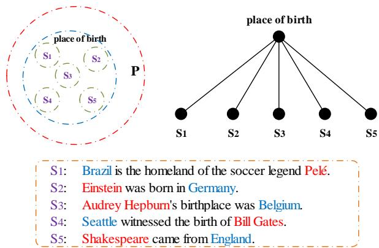  
Figure 1: Illustration of the partial order. Left: The sets $^ { 6 6 } S _ { 1 } , . . . , S _ { 5 } { ^ { \prime } }$ are subsets of instance set defined by the relation “place of birth”, each contain one specific instance. Let $P = \{ S _ { 1 } , . . . , S _ { 5 } , p l a c e o f b i r t h \}$ , thus $( P , \subseteq )$ forms a poset (partially ordered set), with “⊆” being the partial order relation. Right: The Hasse diagram of the poset $( P , \subseteq )$ . Below: Instances with subjects and objects are colored red and blue respectively.

In light of the efficacy of few-shot learning paradigm in the NLP community, Han et al. (2018) pioneered the incorporation of few-shot learning into RE task. Recently, meta-learning (Finn et al., 2017) based prototype networks (Snell et al., 2017) have emerged as the predominant approach for FSRE, aiming to learn an embedding space where query instances are classified by their proximity to relation prototypes. Specifically, works (Han et al., 2021a; Dou et al., 2022; Li et al., 2023) learn relation prototypes from episodes of an N-way-Kshot setup containing a few relation instances, with relation descriptions as auxiliary information.

While methods mentioned above achieve promising performance, they share a critical limitation. Relations and instances are encoded disparately and distributed in separate representation spaces. This disconnect severs the constraints that relations should exert on instances, resulting in a biased distribution of the learned instance representations. Particularly, this issue is acute in 1-shot settings, where the scarcity of samples further exacerbates the challenge of capturing the nuances of relations. In essence, relations, as generalized concepts, have inherent partial orders between the specific instances they encompass. For example, as illustrated in Fig. 1, the relation “place ofbirth” defines an instance set, containing sets $^ { 6 6 } S _ { 1 } , . . . , S _ { 5 } { ^ { \prime } }$ that each encompass only one specific instance. In the set $P = \{ S _ { 1 } , . . . , S _ { 5 } , p l a c e o f b i r t h \}$ , it is evident that the homogeneous relation $" \subseteq "$ satisfies reflexivity, antisymmetry, and transitivity1, clearly describing the partial order relation. Without partial order constraints, relation prototypes obtained by directly adding relation representations to instance representation centers are skewed. As a result, the learned representations of instances contained in sets $S _ { 1 }$ and $S _ { 5 }$ may incorrectly be closer to other relation prototypes, such as “country ofcitizenship” rather than “place ofbirth”.

To formalize the partial order, there are two main challenges. First, due to the polynomial growth of space capacity, the commonly used embedding space, Euclidean space, faces difficulties in capturing partial order under the premise of limited dimensions. Previous works (Nickel and Kiela, 2017, 2018) suggest that this can be accomplished in hyperbolic space, which has exponential volume growth2, making it well-suited for modeling partial order. Second, since relations and instances are encoded separately, the alignment of relation and instance representations is necessary. However, the hyperbolic contrastive learning method based on negative geodesic distance or squared geodesic distance inadequately captures directional information, impeding partial order modeling.

To learn reliable representations of relations and instances in hyperbolic space, we propose an end-to-end Partial Order-centered Hyperbolic Representation Learning (PO-HRL) framework for FSRE. Specifically, relations and instances are initially encoded in Euclidean space by a pretrained language model, and then projected into hyperbolic space. Subsequently, to align relation and instance representations, we develop a hyperbolic supervised contrastive learning method based on the derived cosine similarity in the Lorentz model3, which captures directional information effectively. With alignment, representations of relations and instances can be learned in the same embedding space. Meanwhile, we view the relations as generalized concepts and constrain the encompassed instances to reside within their Lorentzian entailment cones to model the inherent partial order, thereby facilitating the distinction of easily confused instances. Finally, query instances are classified by their similarity to the Lorentzian aggregation center of instances of each relation. The contributions of our work are summarized as follows:

• We theoretically derive the Lorentzian cosine similarity for representation alignment, and extend the Lorentzian entailment cones to the Lorentz model of arbitrary curvature to model the inherent partial order.

• Based on representation alignment and partial order modeling, we propose the PO-HRL framework for FSRE.

• Experiments on three public datasets show that PO-HRL achieves state-of-the-art performance in FSRE, especially outperforming in 1-shot settings lacking relation descriptions.

## 2 Preliminaries

## 2.1 Hyperbolic Geometry

Unlike Euclidean geometry, hyperbolic geometry is a Riemannian manifold with a constant negative curvature $k ( k < 0 )$ . Typical hyperbolic models include Poincaré ball model (Nickel and Kiela, 2017), Lorentz model (Nickel and Kiela, 2018), and Klein model (Gulcehre et al., 2019), etc. All these models are isometric, that is, they can be transformed into each other by mapping functions. Compared with the Poincaré ball model, the Lorentz model has better numerical stability and computational efficiency (Nickel and Kiela, 2018) due to the lack of fractions in the distance function and calculation simplicity of exponential/logarithmic maps. Therefore, we select the Lorentz model as the foundational model. We give a brief introduction to some essential concepts in the Lorentz model of hyperbolic geometry in appendix A.

## 2.2 Problem Definition

We follow the typical N-way-K-shot few-shot task setting, which contains a support set S of and a query set Q. The support set $S = \{ s _ { i , k } \vert i =$ $1 , . . . , N ; k = 1 , . . . , K \}$ consists of N classes, each with K labeled instances. The query set Q includes unlabeled instances of classes in S. For FSRE tasks, each instance is represented as $( x , h , t , y )$ , where x denotes the given sentence, h and t indicate the head and tail entity respectively, y is the relation label. Additionally, the name and description of each relation provide auxiliary support. We randomly sample N relations and K instances per relation as the support set. Concurrently, the query set is constructed by sampling one instance per relation from the remaining samples. Note that relations are disjoint in the training and testing phases.

## 3 Methodology

In this section, we focus on the Lorentz cosine similarity for representation alignment and the Lorentz entailment cones for partial order modeling.

## 3.1 Lorentzian Cosine Similarity

In previous works (Han et al., 2021a; Dou et al., 2022), relations and instances are encoded separately, the alignment of their representations is crucial. A common approach is supervised contrastive learning (Khosla et al., 2020), which leverages cosine to measure the similarity of vectors. In the Lorentz model, existing measures like geodesic distance and its squared variant can be used for similarity assessment. However, they fail to fully capture the directional information, hindering subsequent partial order modeling based on angles. Therefore, we derive the Lorentzian cosine similarity.

Theorem 3.1. $\forall u , v \in \mathcal { L } _ { k } ^ { n } \backslash \{ o \}$ , let $u _ { i }$ and $v _ { i }$ denote the i-th dimension ofu and v, the Lorentzian cosine similarity between them sim $( \pmb { u } , \pmb { v } ) \in [ 0 , 1 ]$ in the Lorentz model is calculated as:

$$
\sin ( \pmb { u } , \pmb { v } ) = \frac { - k \sum _ { i = 1 } ^ { n } u _ { i } v _ { i } } { \sqrt { | k | u _ { 0 } ^ { 2 } - 1 } \sqrt { | k | v _ { 0 } ^ { 2 } - 1 } }
$$

Proof. See appendix B.

## 3.2 Lorentzian Entailment Cones

Intuitively, relations capture generalized connections to encompassed instances. As such, an inherent partial order exists in any relation-instance pair, with the relation encompassing the broader conceptual tie and the instance exemplifying a specific manifestation. We introduce the Lorentzian entailment cones (Ganea et al., 2018a; Le et al., 2019) to formalize the partial order. Since Le et al. (2019) only provide the form of the entailment cones in the Lorentz model of curvature -1, inspired by Ganea et al. (2018a), we extend the half-aperture of entailment cones and exterior angles to the Lorentz model of any arbitrary negative curvature.

Lemma 3.1. $\forall u \in \mathcal { L } _ { k } ^ { n } \backslash \{ o \}$ , let $u _ { 0 }$ denotes the 0- th dimension of u, $C > 0$ is a constant used to set the boundary conditions, the entailment cone ofu is defined by the half-aperture $\gamma ( \pmb { u } ) \in [ 0 , \frac { \pi } { 2 } ]$

$$
\gamma ( \pmb { u } ) = \sin ^ { - 1 } ( \frac { C } { \sqrt { | k | u _ { 0 } ^ { 2 } - 1 } } )
$$

Proof. See appendix C.

Lemma 3.2. ∀u, $v \in \mathcal { L } _ { k } ^ { n } \backslash \{ o \}$ , let ui and $v _ { i }$ denote the i-th dimension of u and v, the exterior angle $\textstyle \phi ( \pmb { u } , \pmb { v } ) \in [ 0 , \frac { \pi } { 2 } ]$ between half-lines (ou and (uv can be calculated as:

$$
\phi ( { \pmb u } , { \pmb v } ) = \cos ^ { - 1 } ( \frac { v _ { 0 } - u _ { 0 } \cdot k \langle { \pmb u } , { \pmb v } \rangle _ { \mathcal { L } } } { \sqrt { \sum _ { i = 1 } ^ { n } u _ { i } ^ { 2 } } \sqrt { \left( k \langle { \pmb u } , { \pmb v } \rangle _ { \mathcal { L } } \right) ^ { 2 } - 1 } } )
$$

Proof. See appendix D.

## 4 End-to-end PO-HRL

With Lorentzian cosine similarity and Lorentzian entailment cones, we propose the end-to-end PO-HRL framework for FSRE, depicted in Fig. 2(a). It consists of four main components: an encoder to build representations, a representation alignment module to align the representations of relations and instances, a partial order modeling module to impose constraints of relations on instances and a relation classifier. A detailed explanation of each of these components is provided below.

Encoder. As in previous works (Han et al., 2021a; Dou et al., 2022), we adopt BERT (Devlin et al., 2019) as the base encoder. We introduce four special tokens “[E1][/E1]" and $ { \mathrm { ~  ~ \tilde { ~ } { ~ } ~ } } [  { \mathrm { E } } 2 ] [ \Lambda 2 ] ^ { \prime }$ to augment the given sentence x to mark the start and end of each entity mention and concatenate the name and description to the augmented x. Then, we feed the concatenated sequence into BERT encoder. The instance representation is formulated as $\pmb { x } ^ { i n s } = [ h _ { \mathrm { E 1 } } ; h _ { \mathrm { E 2 } } ]$ and the relation representation is denoted as $\pmb { x } ^ { r e l } = [ \pmb { h } _ { \mathrm { C L S } } ; \pmb { h } _ { \mathrm { a v g } } ]$ , where $h _ { \mathrm { E 1 } }$ $h _ { \mathrm { E 2 } }$ and $h _ { \mathrm { C L S } }$ are outputs of [E1],[E2] and [CLS] respectively, $h _ { \mathrm { a v g } }$ is the average representations of tokens except [CLS]. Since Han et al. (2021a) and Liu et al. (2022) have proven that the addition of relation and instance representations enhances FSRE, we take a weighted sum of their representations as the representation of support instance $\pmb { x } ^ { s } = \pmb { x } ^ { i n s } + \alpha \pmb { x } ^ { r e l }$ , where $\alpha \in \{ 0 , 1 \}$ is a weight coefficient. As for the query instance, its representation $\pmb { x } ^ { q } = \pmb { x } ^ { i n s }$ , since it is unknown which class of relation it belongs to.

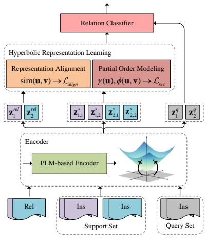  
(a) Overall framework

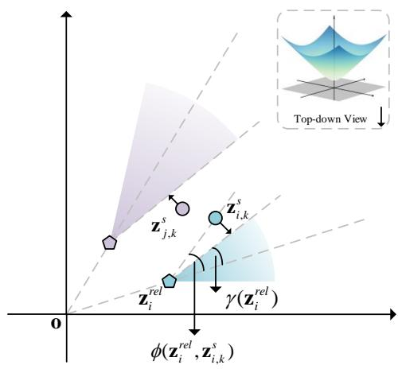  
(b) Partial order modeling  
Figure 2: (a) The overall framework of PO-HRL. (b) Illustration of partial order modeling, the coordinate system is a top-down view of the Lorentz model. The blue and purple areas represent the Lorentzian entailment cones of relations i and j respectively. $\gamma ( z _ { i } ^ { r e l } )$ is the half-aperture of relation $i , \phi ( z _ { i } ^ { r e l } , z _ { i , k } ^ { s } )$ is the exterior angle.

For $\mathbf { \boldsymbol { x } } \in \mathbb { R } ^ { n }$ generated in Euclidean space, we need to map it to hyperbolic space. Generally, an element $" \mathrm { 0 " }$ is required to be added to x, $\mathrm { i } . \mathrm { e } . , \tilde { \pmb { x } } =$ $( 0 , \pmb { x } ) \in \mathbb { R } ^ { n + 1 }$ . x˜ is in the tangent space $\tau _ { o } \mathcal { L } _ { k } ^ { n }$ of the Lorentz model $\mathcal { L } _ { k } ^ { n }$ at the origin $o ( 1 / { \sqrt { | k | } } ^ { \cdot \cdot } ) $ since $\langle o , \tilde { x } \rangle _ { \mathcal { L } } = 0 ^ { 4 }$ . Therefore, x˜ can be mapped to the hyperbolic space by the exponential map $\exp _ { o } ^ { k } \colon z = \exp _ { o } ^ { k } ( \tilde { x } ) = \exp _ { o } ^ { k } ( 0 , x ) ^ { \mathit { \bar { \alpha } } } \in \mathbb { R } ^ { n + 1 }$ . Due to the presence of the exponential operator in $\mathrm { e x p } _ { o } ,$ the numerical overflow of z will occur after the exponential map operation. Therefore, we scale x with the factor $\sqrt { 1 / n }$ before the exponential map.

$$
z = \exp _ { o } ^ { k } ( 0 , \pmb { x } / \sqrt { n } ) \in \mathbb { R } ^ { n + 1 }\tag{1}
$$

Representation Alignment. As the generated relation and instance representations are distributed in distinct representation spaces, we develop a hyperbolic supervised contrastive learning approach with the derived Lorentzian cosine similarity (described in Section 3.1) to align representations of relations and instances. This alignment is achieved by maximizing the cosine similarity between representations of relations and instances belonging to the same class, while minimizing the similarity between those from different classes. Specifically, in an episode of the N-way-K-shot task, let $Z _ { r } = \{ z _ { i } ^ { r e l } | i = 1 , . . . , N \}$ and $Z _ { s } = \{ z _ { i , k } ^ { s } \vert i =$ $1 , . . . , N ; k = 1 , . . . , K \}$ denote the representations of relations and instances in S respectively, the alignment loss is formulated as:

$$
\mathcal { L } _ { a l i g n } = \sum _ { i = 1 } ^ { N } - \log \frac { \displaystyle \sum _ { k = 1 } ^ { K } e ^ { \sin ( z _ { i } ^ { r e l } , z _ { i , k } ^ { s } ) / \tau } } { \displaystyle \sum _ { j = 1 } ^ { N } \sum _ { k = 1 } ^ { K } e ^ { \sin ( z _ { i } ^ { r e l } , z _ { j , k } ^ { s } ) / \tau } }\tag{2}
$$

where $\tau > 0$ is the temperature parameter.

Partial Order Modeling. With aligned relation and instance representations, we exploit the margin loss to impose constraints of relations on instances, which forces instances to reside in the Lorentzian entailment cone (described in Section 3.2) of their associated relation, thereby rectifying the representations of the given relation-instance pair. As illustrated in Fig. 2(b), given a relation $z _ { i } ^ { r e l }$ and two instances $z _ { i , k } ^ { s } , z _ { j , k } ^ { s }$ , where $z _ { i , k } ^ { s }$ belongs to $z _ { i } ^ { r e l }$ but $\boldsymbol { z } _ { j , \boldsymbol { k } } ^ { s }$ is not. The objective of the partial order modeling is to enforce $\phi ( z _ { i } ^ { r e l } , z _ { i , k } ^ { s } ) \leq \gamma ( z _ { i } ^ { r e l } )$ while ensuring $\phi ( z _ { i } ^ { r e l } , z _ { j , k } ^ { s } ) > \gamma ( z _ { i } ^ { r e l } )$ . In an episode, it is implemented by the following loss function:

$$
\mathcal { L } _ { r e c } = \sum _ { i = 1 } ^ { N } ( \sum _ { k = 1 } ^ { K } l _ { i , k } ^ { i n } + \frac { 1 } { N - 1 } \sum _ { j \neq i } \sum _ { k = 1 } ^ { K } l _ { i , j , k } ^ { o u t } )\tag{3}
$$

where $l _ { i , k } ^ { i n } = E ( z _ { i } ^ { r e l } , z _ { i , k } ^ { s } ) , l _ { i , j , k } ^ { o u t } = \operatorname* { m a x } ( 0 , m -$ $E ( z _ { i } ^ { r e l } , z _ { j , k } ^ { s } ) ) . ~ E ( \pmb { u } , \pmb { v } ) = \phi ( \pmb { u } , \pmb { v } ) - \gamma ( \pmb { u } )$ captures the discrepancy between the exterior angle and half-aperture and $m > 0$ is the margin. In $\mathcal { L } _ { r e c } ,$ $l _ { i , k } ^ { i n }$ serves to pull instances outside of their corresponding relation’s entailment cone back into it. Conversely, $l _ { i , j , k } ^ { o u t }$ works to push instances of other relations away from the entailment cone. The factor $\frac { 1 } { N - 1 }$ is included to balance the proportionality of the instances. Overall, $\mathcal { L } _ { r e c }$ is designed to gather instances within their specific relation’s entailment cone while separating instances of other relations. Relation Classifier. Having aligned and rectified representations of relations and instances in S, the Lorentzian aggregation center of support instances for each relation is leveraged to classify query instances in Q. Zhang et al. (2021) have given the solution, the Lorentzian aggregation center is:

$$
z _ { i } ^ { c } = \frac { \sum _ { j = 1 } ^ { K } \omega _ { i j } z _ { i , j } ^ { s } } { \sqrt { | k | } | \| \sum _ { j = 1 } ^ { K } \omega _ { i j } z _ { i , j } ^ { s } \| _ { \mathcal { L } } | }\tag{4}
$$

where $\omega _ { i j } > 0$ is the aggregation weight, we calculate it by the Lorentzian cosine similarity:

$$
\omega _ { i j } = \mathrm { s o f t m a x } ( \sin ( z _ { i } ^ { r e l } , z _ { i , j } ^ { s } ) )\tag{5}
$$

With the representation of query instance $z ^ { q }$ and the Lorentzian aggregation center $\boldsymbol { z } _ { i } ^ { c }$ in an episode, the probability of relations for the query instance

$$
z ( y = i | z ^ { q } ) = \frac { e ^ { \sin ( z _ { i } ^ { c } , z ^ { q } ) } } { \sum _ { n = 1 } ^ { N } e ^ { \sin ( z _ { n } ^ { c } , z ^ { q } ) } }\tag{6}
$$

Then, the loss function is written as:

$$
\mathcal { L } _ { c } = - \log ( z _ { y } )\tag{7}
$$

The final objective function is the weighted sum of the above three loss functions:

$$
\mathcal { L } = \mathcal { L } _ { c } + \lambda _ { 1 } \mathcal { L } _ { a l i g n } + \lambda _ { 2 } \mathcal { L } _ { r e c }\tag{8}
$$

## 5 Experiments

## 5.1 Datasets

To assess the efficacy of our proposed PO-HRL, we conduct experiments on three established benchmark datasets FewRel 1.0 (Han et al., 2018), FewRel 2.0 (Gao et al., 2019) and Semeval (Hendrickx et al., 2009). For an introduction to the datasets, please see appendix E.

## 5.2 Implementation Details

The experimental platform is a 24 GB NVIDIA RTX 3090 GPU. Following previous works (Han et al., 2018; Gao et al., 2019), we evaluate PO-HRL by measuring its accuracy on the query set in four N-way-K-shot scenarios, where N is 5 or 10 while K is 1 or 5. We validate our model on 10,000 randomly sampled episodes in validation set. For FewRel 1.0 and FewRel 2.0, the test performance is achieved on the FewRel Leaderboard5. Hyperparameter settings see appendix F. We will release our code as open source for further research.

## 5.3 Main Results

Tables 1,2 and 3 present the comparative results on FewRel 1.0, FewRel 2.0, and Semeval, respectively. Introductions of baselines are listed in appendix G. For FewRel 1.0, results are bifurcated based on whether external information is incorporated. Additionally, we exhibit benchmarks with various approaches benefiting from post-training (Peng et al., 2020). On FewRel 2.0 and Semeval, only BERT encoder outcomes are displayed. The results uncovered the following insights:

(1) Our proposed PO-HRL method attains stateof-the-art performance across all three datasets, outperforming baselines with the same encoder and achieving substantial improvements in 1-shot settings. Notably, compared to the second-best method, our method boosts accuracy by 0.98 and 2.88 points on FewRel 2.0, and by 0.94 and 2.23 points on Semeval for 1-shot settings.

(2) Performance gains arise chiefly from enforcing partial order constraints. Relation and instance representations are collectively aligned to embed partial order, thereby instances are constrained by specificity. This constraint not only steers the conformity with generalization-specificity principles but also facilitates the transfer of relation knowledge to instances of unseen relations.

(3) PO-HRL achieves significantly higher accuracy improvements on validation set than on test set on FewRel 1.0. This divergence arises since relation descriptions serve as auxiliary inputs, increasing interpretability of relations and simplifying the task. In their absence on FewRel 2.0 and Semeval, test accuracy improvements are more evident, confirming the enhanced performance when relation descriptions are unavailable.

<table><tr><td>Model</td><td></td><td>5-way-1-shot</td><td>5-way-5-shot</td><td>10-way-1-shot</td><td>10-way-5-shot</td></tr><tr><td>w/ external information</td><td>REGRAB (Qu et al., 2020) ConceptFERE (Yang et al., 2021)</td><td>87.95/90.30 --/89.21</td><td>92.54/94.25 --/90.34</td><td>80.26/84.09 --/75.72</td><td>86.72/89.93 --/81.82</td></tr><tr><td rowspan="8">w/o external information</td><td>Proto-BERT (Snell et al., 2017)</td><td>82.92/80.68</td><td>91.32/89.60</td><td>73.24/71.48</td><td>83.68/82.89</td></tr><tr><td>BERT-PAIR (Gao et al., 2019)</td><td>87.95/90.30</td><td>92.54/94.25</td><td>80.26/84.09</td><td>86.72/89.93</td></tr><tr><td>HCRP (Han et al., 2021a)</td><td>90.90/93.76</td><td>93.22/95.66</td><td>84.11/89.95</td><td>87.79/92.10</td></tr><tr><td>SimpleFSRE (Liu et al., 2022)</td><td>91.29/94.42</td><td>94.05/96.37</td><td>86.09/90.73</td><td>89.68/93.47</td></tr><tr><td>FAEA (Dou et al., 2022)</td><td>90.81/95.10</td><td>94.24/96.48</td><td>84.22/90.12</td><td>88.74/92.72</td></tr><tr><td>GM_GEN (Li and Qian, 2022)</td><td>92.65/94.89</td><td>95.62/96.96</td><td>86.81/91.23</td><td>91.27/94.30</td></tr><tr><td>BMIPN (Li et al., 2023)</td><td>91.99/95.62</td><td>94.70/96.61</td><td>84.95/91.43</td><td>89.60/93.88</td></tr><tr><td>HND (Zhang et al., 2023)</td><td>93.35/95.21</td><td>95.94/97.19</td><td>87.41/91.59</td><td>91.71/94.54</td></tr><tr><td>PO-HRL</td><td>93.38/95.51</td><td>95.73/97.28</td><td>88.65/91.71</td><td>91.97/94.59</td></tr><tr><td rowspan="7">w/ post-training</td><td>MTB (Soares et al., 2019)</td><td>--/91.10</td><td>--/95.40</td><td>--/84.30</td><td>--/91.80</td></tr><tr><td>CP (Peng et al., 2020)</td><td>--/95.10</td><td>--/97.10</td><td>--/91.20</td><td>--/94.70</td></tr><tr><td>HCRP(CP) (Han et al., 2021a)</td><td>94.10/96.42</td><td>96.05/97.96</td><td>89.13/93.97</td><td>93.10/96.46</td></tr><tr><td>SimpleFSRE(CP) (Liu et al., 2022)</td><td>96.21/96.63</td><td>97.07/97.93</td><td>93.38/94.94</td><td>95.11/96.39</td></tr><tr><td>FAEA(CP) (Dou et al., 2022)</td><td>94.11/96.36</td><td>89.55/97.85</td><td>86.59/93.82</td><td>93.64/96.29</td></tr><tr><td>GM_GEN(CP) (Li and Qian, 2022)</td><td>96.97/97.03</td><td>98.32/98.34</td><td>93.97/94.99</td><td>96.58/96.91</td></tr><tr><td>PO-HRL(CP)</td><td>97.18/97.51</td><td>98.41/98.41</td><td>94.49/95.29</td><td>96.85/97.01</td></tr></table>

Table 1: Accuracy (%) of FSRE task on FewRel 1.0 validation/test set. The table is divided into three parts. The first two parts use BERT as the encoder, while the encoder of the third part is BERT with post-training.

<table><tr><td>Model</td><td>5-way 1-shot</td><td>5-way 5-shot</td><td>10-way 1-shot</td><td>10-way 5-shot</td></tr><tr><td>Proto-BERT</td><td>40.12</td><td>51.50</td><td>26.45</td><td>36.93</td></tr><tr><td>BERT-PAIR</td><td>67.41</td><td>78.57</td><td>54.89</td><td>66.85</td></tr><tr><td>HCRP</td><td>76.34</td><td>83.03</td><td>63.77</td><td>72.94</td></tr><tr><td>FAEA</td><td>73.58</td><td>90.10</td><td>62.98</td><td>80.51</td></tr><tr><td>GM_GEN</td><td>76.67</td><td>91.28</td><td>64.19</td><td>84.84</td></tr><tr><td>BMIPN</td><td>77.19</td><td>90.19</td><td>66.29</td><td>82.81</td></tr><tr><td>HND</td><td>78.37</td><td>91.41</td><td>66.54</td><td>84.92</td></tr><tr><td>DCFT w/o DTM</td><td>79.36</td><td>90.71</td><td></td><td></td></tr><tr><td>PO-HRL</td><td>80.34</td><td>91.44</td><td>69.36</td><td>85.26</td></tr></table>

Table 2: Accuracy (%) of FSRE task on FewRel 2.0 test set. Since DCFT (Liu et al., 2024) introduces additional unlabeled data from the target domain for domain-aware transformation, we only list the results of DCFT without DTM.

## 5.4 Ablation Study

To investigate the effectiveness of the main components of our proposed PO-HRL, we design four ablation experiments on FewRel 1.0 and FewRel 2.0 validation sets, and Semeval test set. The results are reported in Table 4, we delineate the specific variants and analyze the effects as follows:

(1) To verify the efficacy of the representation alignment module, we exclude it from the PO-HRL. On the three datasets, the average accuracy is reduced by 0.79, 1.34, and 1.48 points respectively, confirming that aligning relation and instance representations boosts the performance.

(2) To isolate the impact of partial order modeling, we directly feed the aligned relation and instance representations into the classifier. This scatters the distribution of instances, substantially degrading performance by 0.75, 2.44 and 1.35 points respectively. The collapse is most pronounced in the extremely sample-starved 1-shot settings, underscoring the indispensability of the partial order modeling module. Note that the decline in performance for FewRel 1.0 is smaller than that for FewRel 2.0 and Semeval. This can be attributed to the fact that FewRel 1.0 offers relation descriptions, which alleviates the collapse.

<table><tr><td>Model</td><td>5-way 1-shot</td><td>5-way 5-shot</td><td>10-way 1-shot</td><td>10-way 5-shot</td></tr><tr><td>Proto-BERT</td><td>48.54</td><td>78.48</td><td>36.43</td><td>68.15</td></tr><tr><td>BERT-PAIR</td><td>49.70</td><td>67.64</td><td>37.71</td><td>55.14</td></tr><tr><td>HCRP</td><td>56.98</td><td>73.65</td><td>43.75</td><td>62.64</td></tr><tr><td>FAEA</td><td>59.03</td><td>76.99</td><td>46.27</td><td>66.48</td></tr><tr><td>GM_GEN</td><td>51.48</td><td>79.02</td><td>44.96</td><td>69.86</td></tr><tr><td>PO-HRL</td><td>59.97</td><td>79.51</td><td>48.50</td><td>70.14</td></tr></table>

Table 3: Accuracy (%) of FSRE task on Semeval test set. Baseline results are reported by Liu et al. (2024).

(3) We further remove the two modules of representation alignment and partial order modeling, reducing our proposed PO-HRL to the encoder and classifier only. The average accuracy decreases by 1.03 points on FewRel 1.0, 2.31 points on FewRel 2.0 and 1.46 on Semeval. This performance degradation confirms the essential role of representation alignment and partial order modeling in connecting relations and instances for FSRE.

<table><tr><td></td><td colspan="4">FewRel 1.0</td><td colspan="4">FewRel 2.0</td><td colspan="4">Semeval</td></tr><tr><td>Model</td><td>5-way 1-shot</td><td>5-way 5-shot</td><td>10-way 1-shot</td><td>10-way 5-shot</td><td>5-way 1-shot</td><td>5-way 5-shot</td><td>10-way 1-shot</td><td>10-way 5-shot</td><td>5-way 1-shot</td><td>5-way 5-shot</td><td>10-way 1-shot</td><td>10-way 5-shot</td></tr><tr><td>PO-HRL</td><td>93.38</td><td>95.73</td><td>88.65</td><td>91.97</td><td>82.39</td><td>92.95</td><td>73.82</td><td>87.24</td><td>59.97</td><td>79.51</td><td>48.50</td><td>70.14</td></tr><tr><td>w/o RA</td><td>92.94</td><td>94.69</td><td>88.05</td><td>90.90</td><td>80.26</td><td>91.59</td><td>73.63</td><td>85.57</td><td>57.90</td><td>79.24</td><td>45.66</td><td>69.41</td></tr><tr><td>w/o POM</td><td>92.79</td><td>95.38</td><td>87.41</td><td>91.15</td><td>80.06</td><td>92.60</td><td>68.12</td><td>85.86</td><td>58.69</td><td>78.90</td><td>46.84</td><td>68.31</td></tr><tr><td>w/o RSA+POM</td><td>92.40</td><td>94.86</td><td>87.63</td><td>90.74</td><td>80.35</td><td>91.68</td><td>69.92</td><td>85.23</td><td>56.52</td><td>79.18</td><td>47.23</td><td>69.34</td></tr><tr><td>LA w/o weight</td><td></td><td>94.98</td><td></td><td>91.36</td><td></td><td>91.92</td><td></td><td>86.39</td><td></td><td>78.82</td><td></td><td>69.65</td></tr></table>

Table 4: Accuracy (%) of ablation study on FewRel 1.0 and FewRel 2.0 validation sets, and Semeval test set. RA stands for representation alignment, POM indicates partial order modeling, LA denotes Lorentzian aggregation.

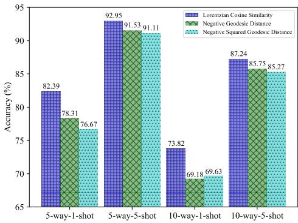  
Figure 3: Accuracy (%) achieved by hyperbolic supervised contrastive learning when employing various similarity measures on FewRel 2.0 validation set.

(4) The Lorentzian aggregation center of each relation is obtained by a weighted sum of the support instances. To analyze the effect of this weighted summation, we perform an ablation by directly averaging the support instance representations instead. In 1-shot settings, this ablation is ineffective. Under 5-shot settings, the accuracy on FewRel 1.0 decreased by 0.75 and 0.61 points, on FewRel 2.0 fell by 1.03 and 0.85 points, while correspondingly, on Semeval, the performance degradations are 0.69 and 0.49. By equally averaging, PO-HRL fails to selectively amplify the most representative instances. In contrast, the learned weighted summation places greater emphasis on critical instances.

## 5.5 Analysis of Lorentzian Cosine Similarity

The partial order modeling is implemented by constraining the angle between the representations of relations and instances in the Lorentz model. Therefore, we exploit the Lorentzian cosine to quantify the similarity between vectors for contrastive learning. The Lorentzian cosine focuses on the angle between two vectors, assessing directional alignment while disregarding magnitude. Plausible alternatives are negative geodesic distance and its squared variant (Law et al., 2019). However, these metrics capture both angular and norm differences, which is detrimental to partial order modeling. To assess the efficacy of Lorentzian cosine similarity, we conduct experiments involving the alignment loss on FewRel 2.0 validation set, substituting Lorentzian cosine similarity with negative geodesic distance and squared geodesic distance. The outcomes are presented in Fig. 3. Using negative geodesic distance and squared geodesic distance results in a 2.88 and 3.43 percentage point decrease in average accuracy, respectively. Notably, the accuracy drop is more significant in 1-shot settings. These findings suggest that angular alignment via Lorentzian cosine similarity is a more effective way to capture semantic similarity in FSRE. Although we cannot definitively assert that Lorentzian cosine similarity outperforms negative geodesic distance or negative squared geodesic distance in all cases, it seems more appropriate under the current model setting.

## 5.6 Efficacy of Partial Order Modeling

To validate the efficacy of partial order modeling, we present a 5-way-1-shot task drawn from the FewRel 2.0 validation set, as depicted in Fig.4. In the biomedical domain, the relationships “is primary anatomic site $o f ^ { \ast }$ and “occurs $i n ^ { \dag }$ are semantically akin. The scarcity of samples poses a significant challenge to the model’s classification capabilities. Through the application of partial order modeling, the model accurately categorizes the query instance as $^ { \bullet } i s$ primary anatomic site $o f ^ { \dag }$ . Conversely, without this modeling, the query instance is misclassified as “occurs $i n ^ { \dprime }$ . We visualize the similarity between the query instance and the supporting instance in both scenarios. The experimental outcomes corroborate that PO-HRL is superior in learning the instance distribution under conditions of limited sample availability.

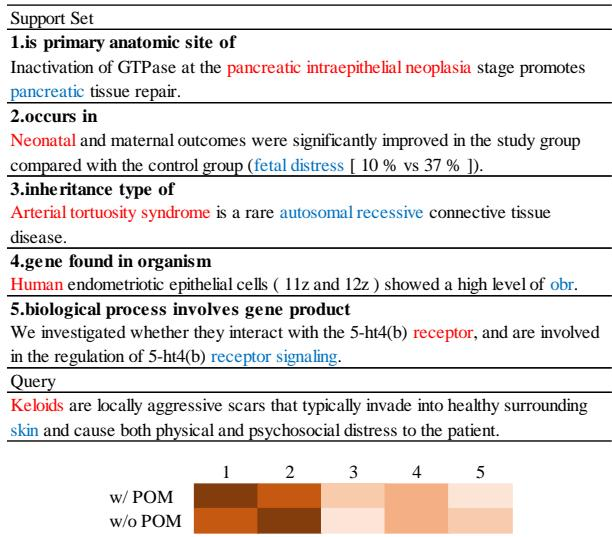  
Figure 4: An example of a 5-way-1-shot task. We list the instances and their respective relation name, the subject and object of the instance are colored red and blue respectively. We visualize the similarity between query instance and support instances (w/ and w/o POM), with darker units representing greater similarity.

<table><tr><td>Model</td><td>5-way 1-shot</td><td>5-way 5-shot</td><td>10-way 1-shot</td><td>10-way 5-shot</td></tr><tr><td>HCRP</td><td>87.40</td><td>93.54</td><td>82.69</td><td>89.97</td></tr><tr><td>SimpleFSRE</td><td>89.23</td><td>94.38</td><td>82.90</td><td>89.35</td></tr><tr><td>FAEA</td><td>87.92</td><td>92.67</td><td>84.65</td><td>89.47</td></tr><tr><td>GM_GEN</td><td>89.77</td><td>95.14</td><td>83.62</td><td>91.29</td></tr><tr><td>PO-HRL</td><td>90.29</td><td>95.41</td><td>85.34</td><td>91.69</td></tr></table>

Table 5: Accuracy (%) of FSRE task without relation descriptions on FewRel 1.0 validation set.

## 5.7 Absence of Relation Descriptions

Existing FSRE works rely heavily on semantic information from relation descriptions. However, descriptions are often unavailable in real-world scenarios, as with FewRel 2.0. To compare the robustness of our approach and baselines when lacking relation descriptions, we conduct experiments on FewRel 1.0 where only relation names and instances are provided, without any descriptions. The results on the validation set are presented in Table 5. We observe performance degradation across all models when relation descriptions are removed. underscoring their importance. However, our proposed PO-HRL exhibited greater robustness compared to baselines under such low-resource conditions. This reflects the stronger generalizability of our model for tackling FSRE tasks, even when descriptive data is limited or unavailable. By leveraging representation alignment and partial order modeling, PO-HRL is less dependent on relation descriptions and confers greater resilience and flexibility when facing incomplete real-world datasets.

## 5.8 Influence of Hyper-parameters

In PO-HRL, hyper-parameters C and m are crucial in partial order modeling. Through experiments on four distinct settings on the FewRel 2.0 dataset, we delve into how varying the values of C and m impacts outcomes. The results are shown in Fig. 5.

The constant C governs the half-aperture of the Lorentzian entailment cone. It is evident that the model’s efficacy peaks when C is dialed to 0.3 or 0.4. This optimal setting arises because an excessively narrow half-aperture may inadequately differentiate between relation representations, whereas an overly wide gap can lead to cone overlap, hampering instance aggregation.

Margin m, conversely, dictates the separation between Lorentzian entailment cones. Small m brings cones of disparate relations closer, while large m creates greater separation between them. The results indicate that PO-HRL achieves the best performance when m is set to 0.2. Too minute m could result in insufficient distinction between instances of various classes, whereas excessively large m may force instances out of their corresponding relation cones due to the influence of the loss function in Eq. 3.

## 5.9 Visualization of PO-HRL

To verify that our proposed PO-HRL model can learn reliable representations, we visualize the distribution of instance representations before and after training using t-SNE (Van der Maaten and Hinton, 2008). Specifically, we select the 5-way-5-shot trained PO-HRL model on FewRel 2.0 and perform inference on the validation set, randomly sampling 20 examples per relation. Since the learned representations reside in hyperbolic space, we apply the logarithmic map to project them to Euclidean space for visualization. As shown in Fig. 6, after training, instances of the same relation cluster together while those from different relations become clearly separated. This demonstrates PO-HRL’s ability to effectively learn discriminative representations that distinguish fine-grained semantic relations, validating its few-shot relation learning capacity. The clear separation and clustering of relation instances in the embedding space illustrate the model’s success in learning reliable representations.

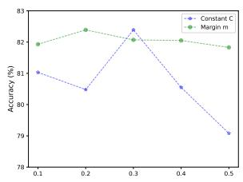  
(a) 5-way-1-shot

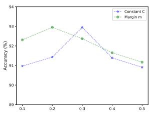  
(b) 5-way-5-shot

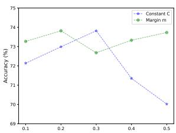  
(c) 10-way-1-shot

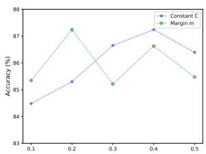  
(d) 10-way-5-shot

Figure 5: Accuracy (%) on FewRel 2.0 validation set with various constant C and margin m .  
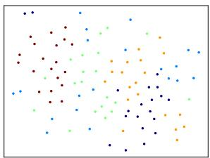  
(a) Before training

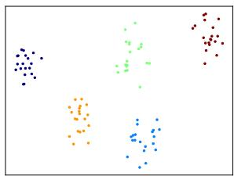  
(b) After training  
Figure 6: t-SNE plots of instance representations before/after training with 5 relations, 20 instances each.

## 6 Related Work

Few-shot relation extraction (FSRE) is intended to predict novel relations between entities mentioned in given sentences, using just a few labeled instances. Han et al. (2018) and Gao et al. (2019) propose the FewRel 1.0 and FewRel 2.0 benchmark datasets for FSRE, and provide effective baselines Proto-BERT and BERT-PAIR. Existing studies are mostly based on prototype networks. REGRAB (Qu et al., 2020) and Concept-FERE (Yang et al., 2021) enhance prototypes with external knowledge. However, utilizing external knowledge is laborious. Consequently, recent focus has turned to methods (Han et al., 2021a; Liu et al., 2022; Li et al., 2023) that only leverage the provided texts and relation descriptions. They directly add relation embeddings to instance representation centers to generate relation prototypes. Methods mentioned above follow a “one-for-all” scheme, to mine differences of each N-way-K-shot task, GM\_GEN (Li and Qian, 2022) and HND (Zhang et al., 2023) optimize the model with generation modules. In this paper, we treat FSRE as a representation learning task that learns the representation distribution of relations and instances via intrinsic partial order constraints in hyperbolic space.

Hyperbolic neural networks have been widely investigated for representation learning due to the superiority of hyperbolic geometry in modeling hierarchical structures. To embed the underlying hierarchy, works (Nickel and Kiela, 2017, 2018) first learn hierarchical representations in hyperbolic spaces like the Poincaré ball and Lorentz model. Since then, various neural models (Ganea et al., 2018b; Gulcehre et al., 2019; Liu et al., 2019; Chami et al., 2019) are extended to hyperbolic spaces. Further works (Shimizu et al., 2021; Chen et al., 2022) optimize hyperbolic neural components to maintain efficiency and stability. Among these, HCL (Ge et al., 2023) employs the negative geodesic distance to generalize contrastive learning (Chen et al., 2020; Khosla et al., 2020) to hyperbolic space, facilitating representation learning. Concurrently, several other studies (Ganea et al., 2018a; Le et al., 2019; Bai et al., 2021; Desai et al., 2023) utilize the hyperbolic entailment cones to capture partial order relations. Inspired by previous works on hyperbolic space, we derive Lorentzian cosine similarity and extend contrastive learning into hyperbolic space to align the representations of relations and instances. Meanwhile, we view relations as generic concepts and instances as specific examplars, and model the inherent partial order using the Lorentzian entailment cones.

## 7 Conclusion

In this paper, we propose a novel partial ordercentered hyperbolic representation learning (PO-HRL) framework to learn reliable representation of relations and instances and mitigate the problem of relation prototype bias present in existing works. The framework aligns relation and instance representations via hyperbolic contrastive learning based on Lorentzian cosine similarity and exploits Lorentzian entailment cones to model the partial order. Extensive experiments on three public datasets show that PO-HRL outperforms the strong baselines, with outstanding performance in low-resource 1-shot settings.

## Limitations

The limitations of PO-HRL are primarily twofold: 1) Its efficacy as a representation learning method has only been confirmed in the FSRE task, and its generalizability to other few-shot learning scenarios that exhibit partial order relations has not been investigated. 2) Since PO-HRL is implemented in the Lorentz model, which involves numerical operations in non-Euclidean space, its computational efficiency is slightly insufficient.

## Acknowledgement

We thank the anonymous reviewers for their helpful comments. This work was supported by the National Natural Science Foundation of China (No. 62376284, No. 62476283, No. 42305159).

## References

Yushi Bai, Zhitao Ying, Hongyu Ren, and Jure Leskovec. 2021. Modeling heterogeneous hierarchies with relation-specific hyperbolic cones. In Advances in Neural Information Processing Systems, pages 12316–12327.

Ines Chami, Zhitao Ying, Christopher Ré, and Jure Leskovec. 2019. Hyperbolic graph convolutional neural networks. In Advances in Neural Information Processing Systems, pages 4869–4880.

Ting Chen, Simon Kornblith, Mohammad Norouzi, and Geoffrey E. Hinton. 2020. A simple framework for contrastive learning of visual representations. In Proceedings ofthe 37th International Conference on Machine Learning, pages 1597–1607.

Weize Chen, Xu Han, Yankai Lin, Hexu Zhao, Zhiyuan Liu, Peng Li, Maosong Sun, and Jie Zhou. 2022. Fully hyperbolic neural networks. In Proceedings of the 60th Annual Meeting of the Association for Computational Linguistics, pages 5672–5686.

Karan Desai, Maximilian Nickel, Tanmay Rajpurohit, Justin Johnson, and Shanmukha Ramakrishna Vedantam. 2023. Hyperbolic image-text representations. In Proceedings ofthe 40th International Conference on Machine Learning, pages 7694–7731.

Jacob Devlin, Ming-Wei Chang, Kenton Lee, and Kristina Toutanova. 2019. BERT: pre-training of deep bidirectional transformers for language understanding. In Proceedings ofthe 2019 Conference of the North American Chapter of the Association for Computational Linguistics: Human Language Technologies, pages 4171–4186.

Chunliu Dou, Shaojuan Wu, Xiaowang Zhang, Zhiyong Feng, and Kewen Wang. 2022. Function-words adaptively enhanced attention networks for few-shot

inverse relation classification. In Proceedings of the Thirty-First International Joint Conference on Artificial Intelligence, pages 2937–2943.

Chelsea Finn, Pieter Abbeel, and Sergey Levine. 2017. Model-agnostic meta-learning for fast adaptation of deep networks. In Proceedings of the 34th International Conference on Machine Learning, pages 1126–1135.

Octavian-Eugen Ganea, Gary Bécigneul, and Thomas Hofmann. 2018a. Hyperbolic entailment cones for learning hierarchical embeddings. In Proceedings of the 35th International Conference on Machine Learning, pages 1632–1641.

Octavian-Eugen Ganea, Gary Bécigneul, and Thomas Hofmann. 2018b. Hyperbolic neural networks. In Advances in Neural Information Processing Systems, pages 5350–5360.

Tianyu Gao, Xu Han, Hao Zhu, Zhiyuan Liu, Peng Li, Maosong Sun, and Jie Zhou. 2019. Fewrel 2.0: Towards more challenging few-shot relation classification. In Proceedings of the 2019 Conference on Empirical Methods in Natural Language Processing and the 9th International Joint Conference on Natural Language Processing, pages 6249–6254.

Songwei Ge, Shlok Mishra, Simon Kornblith, Chun-Liang Li, and David Jacobs. 2023. Hyperbolic contrastive learning for visual representations beyond objects. In IEEE/CVF Conference on Computer Vision and Pattern Recognition, pages 6840–6849.

Caglar Gulcehre, Misha Denil, Mateusz Malinowski, Ali Razavi, Razvan Pascanu, Karl Moritz Hermann, Peter W. Battaglia, Victor Bapst, David Raposo, Adam Santoro, and Nando de Freitas. 2019. Hyperbolic attention networks. In 7th International Conference on Learning Representations.

Jiale Han, Bo Cheng, and Wei Lu. 2021a. Exploring task difficulty for few-shot relation extraction. In Proceedings of the 2021 Conference on Empirical Methods in Natural Language Processing, pages 2605–2616.

Jiale Han, Bo Cheng, and Xu Wang. 2020. Two-phase hypergraph based reasoning with dynamic relations for multi-hop KBQA. In Proceedings ofthe Twenty-Ninth International Joint Conference on Artificial Intelligence, pages 3615–3621.

Xu Han, Hao Zhu, Pengfei Yu, Ziyun Wang, Yuan Yao, Zhiyuan Liu, and Maosong Sun. 2018. Fewrel: A large-scale supervised few-shot relation classification dataset with state-of-the-art evaluation. In Proceedings of the 2018 Conference on Empirical Methods in Natural Language Processing, pages 4803– 4809.

Yi Han, Linbo Qiao, Jianming Zheng, Zhigang Kan, Linhui Feng, Yifu Gao, Yu Tang, Qi Zhai, Dongsheng Li, and Xiangke Liao. 2021b. Multi-view interaction learning for few-shot relation classification.

In CIKM ’21: The 30th ACM International Conference on Information and Knowledge Management, pages 649–658.

Iris Hendrickx, Su Nam Kim, Zornitsa Kozareva, Preslav Nakov, Diarmuid Ó Séaghdha, Sebastian Padó, Marco Pennacchiotti, Lorenza Romano, and Stan Szpakowicz. 2009. Semeval-2010 task 8: Multi-way classification of semantic relations between pairs of nominals. In Proceedings of the Workshop on Semantic Evaluations: Recent Achievements and Future Directions, SEW@NAACL-HLT, pages 94–99.

Zhen Huang, Zhilong Lv, Xiaoyun Han, Binyang Li, Menglong Lu, and Dongsheng Li. 2022. Social botaware graph neural network for early rumor detection. In Proceedings of the 29th International Conference on Computational Linguistics, pages 6680– 6690.

Prannay Khosla, Piotr Teterwak, Chen Wang, Aaron Sarna, Yonglong Tian, Phillip Isola, Aaron Maschinot, Ce Liu, and Dilip Krishnan. 2020. Supervised contrastive learning. In Advances in Neural Information Processing Systems, pages 18661– 18673.

Marc Teva Law, Renjie Liao, Jake Snell, and Richard S. Zemel. 2019. Lorentzian distance learning for hyperbolic representations. In Proceedings of the 36th International Conference on Machine Learning, pages 3672–3681.

Matt Le, Stephen Roller, Laetitia Papaxanthos, Douwe Kiela, and Maximilian Nickel. 2019. Inferring concept hierarchies from text corpora via hyperbolic embeddings. In Proceedings of the 57th Conference of the Association for Computational Linguistics, pages 3231–3241.

Wanli Li and Tieyun Qian. 2022. Graph-based model generation for few-shot relation extraction. In Proceedings ofthe 2022 Conference on Empirical Methods in Natural Language Processing, pages 62–71.

Yile Li, Yinliang Yue, Xiaoyan Gu, Peng Fu, and Weiping Wang. 2023. BMIPN: A biased multigranularity interaction prototype network for fewshot relation extraction. In 26th European Conference on Artificial Intelligence - Including 12th Conference on Prestigious Applications of Intelligent Systems, pages 1455–1462.

Zhenzhen Li, Yuyang Zhang, Jian-Yun Nie, and Dongsheng Li. 2022. Improving few-shot relation classification by prototypical representation learning with definition text. In Findings of the Association for Computational Linguistics, pages 454–464.

Qi Liu, Maximilian Nickel, and Douwe Kiela. 2019. Hyperbolic graph neural networks. In Advances in Neural Information Processing Systems, pages 8228–8239.

Yang Liu, Jinpeng Hu, Xiang Wan, and Tsung-Hui Chang. 2022. A simple yet effective relation information guided approach for few-shot relation extraction. In Findings of the Association for Computational Linguistics, pages 757–763.

Yijun Liu, Feifei Dai, Xiaoyan Gu, Minghui Zhai, Bo Li, and Meiou Zhang. 2024. Domain-aware and co-adaptive feature transformation for domain adaption few-shot relation extraction. In Proceedings of the 2024 Joint International Conference on Computational Linguistics, Language Resources and Evaluation, pages 5275–5285.

Menglong Lu, Zhen Huang, Binyang Li, Yunxiang Zhao, Zheng Qin, and Dong Sheng Li. 2022. SIFTER: A framework for robust rumor detection. IEEE ACM Trans. Audio Speech Lang. Process., 30:429–442.

Makoto Miwa and Mohit Bansal. 2016. End-to-end relation extraction using lstms on sequences and tree structures. In Proceedings of the 54th Annual Meeting of the Association for Computational Linguistics, pages 1105–1116.

Maximilian Nickel and Douwe Kiela. 2017. Poincaré embeddings for learning hierarchical representations. In Advances in Neural Information Processing Systems, pages 6338–6347.

Maximilian Nickel and Douwe Kiela. 2018. Learning continuous hierarchies in the lorentz model of hyperbolic geometry. In Proceedings of the 35th International Conference on Machine Learning, pages 3776–3785.

Jouni Parkkonen. 2012. Hyperbolic geometry.

Hao Peng, Tianyu Gao, Xu Han, Yankai Lin, Peng Li, Zhiyuan Liu, Maosong Sun, and Jie Zhou. 2020. Learning from context or names? an empirical study on neural relation extraction. In Proceedings of the 2020 Conference on Empirical Methods in Natural Language Processing, pages 3661–3672.

Meng Qu, Tianyu Gao, Louis-Pascal A. C. Xhonneux, and Jian Tang. 2020. Few-shot relation extraction via bayesian meta-learning on relation graphs. In Proceedings ofthe 37th International Conference on Machine Learning, pages 7867–7876.

Ying Shen, Ning Ding, Hai-Tao Zheng, Yaliang Li, and Min Yang. 2021. Modeling relation paths for knowledge graph completion. IEEE Trans. Knowl. Data Eng., 33(11):3607–3617.

Ryohei Shimizu, Yusuke Mukuta, and Tatsuya Harada. 2021. Hyperbolic neural networks++. In 9th International Conference on Learning Representations.

Jake Snell, Kevin Swersky, and Richard S. Zemel. 2017. Prototypical networks for few-shot learning. In Advances in Neural Information Processing Systems, pages 4077–4087.

Livio Baldini Soares, Nicholas FitzGerald, Jeffrey Ling, and Tom Kwiatkowski. 2019. Matching the blanks: Distributional similarity for relation learning. In Proceedings of the 57th Conference of the Association for Computational Linguistics, pages 2895–2905.

Laurens Van der Maaten and Geoffrey Hinton. 2008. Visualizing data using t-sne. Journal of machine learning research, 9(11).

Yilin Wang, Minghao Hu, Zhen Huang, Dongsheng Li, Wei Luo, Dong Yang, and Xicheng Lu. 2023. A canonicalization-enhanced known fact-aware framework for open knowledge graph link prediction. In Proceedings ofthe Thirty-Second International Joint Conference on Artificial Intelligence, pages 2332– 2342.

Yan Xu, Lili Mou, Ge Li, Yunchuan Chen, Hao Peng, and Zhi Jin. 2015. Classifying relations via long short term memory networks along shortest dependency paths. In Proceedings ofthe 2015 Conference on Empirical Methods in Natural Language Processing, pages 1785–1794.

Shan Yang, Yongfei Zhang, Guanglin Niu, Qinghua Zhao, and Shiliang Pu. 2021. Entity conceptenhanced few-shot relation extraction. In Proceedings of the 59th Annual Meeting of the Association for Computational Linguistics and the 11th International Joint Conference on Natural Language Processing, pages 987–991.

Liang Zhang, Chulun Zhou, Fandong Meng, Jinsong Su, Yidong Chen, and Jie Zhou. 2023. Hypernetwork-based decoupling to improve model generalization for few-shot relation extraction. In Proceedings of the 2023 Conference on Empirical Methods in Natural Language Processing, pages 6213–6223.

Yiding Zhang, Xiao Wang, Chuan Shi, Nian Liu, and Guojie Song. 2021. Lorentzian graph convolutional networks. In The Web Conference 2021, pages 1249–1261.

## A Introduction of the Lorentz Model

In this section, we provide an introduction to some necessary concepts in the Lorentz model that are relevant to this paper. Notations used in this paper are listed in Table 6.

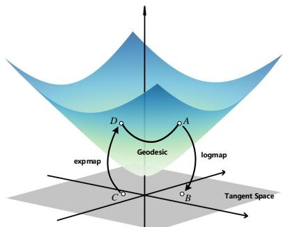

Figure 7: Illustration of the two dimensional Lorentz model $\mathcal { L } _ { k } ^ { 2 }$ and tangent space $\mathcal { T } _ { o } \mathcal { L } _ { k } ^ { 2 }$ at the origin $o \left( 1 / \sqrt { | k | } , 0 , 0 \right)$ . A and D are points in $\mathcal { L } _ { k } ^ { 2 }$ , B and C are points in $\dot { \mathcal { T } } _ { o } \mathcal { L } _ { k } ^ { 2 }$ . A maps to B via the logarithmic map, and C maps to D via the exponential map. The geodesic between A and D is the shortest curve joining them, its length is calculated by Eq. 12.

Definition. As illustrated in Fig. 7, With a constant negative curvature $k ( k < 0 )$ , the n dimensional Lorentz model is defined as a Riemannian manifold $\mathcal { L } _ { k } ^ { n } = ( \mathcal { H } _ { k } ^ { n } , g _ { x } ^ { \mathcal { L } } )$ embedded in the $n { \mathrel { + { 1 } } }$ dimensional Minkowski space, in which

$$
\mathcal { H } _ { k } ^ { n } = \{ \pmb { x } \in \mathbb { R } ^ { n + 1 } | \langle \pmb { x } , \pmb { x } \rangle _ { \mathcal { L } } = 1 / k , x _ { 0 } > 0 \}\tag{9}
$$

represents the upper sheet of an n dimensional hyperboloid with the origin ${ \pmb o } ( 1 / \sqrt { | k | } , { \pmb 0 } ^ { n } ) , g _ { \pmb { x } } ^ { \mathcal { L } } =$ dia $\beta ( - 1 , \mathbf { 1 } ^ { n } )$ is the Riemannian metric tensor. $\langle \cdot , \cdot \rangle _ { \mathscr { L } }$ denotes the Lorentzian inner product:

$$
\langle { \pmb x } , { \pmb y } \rangle _ { \mathcal { L } } = { \pmb x } g _ { \pmb x } ^ { \mathcal { L } } { \pmb y } = - x _ { 0 } y _ { 0 } + \sum _ { i = 1 } ^ { n } x _ { i } y _ { i }\tag{10}
$$

Tangent Space. $\forall x \in \mathcal { L } _ { k } ^ { n } .$ the tangent space $\tau _ { x } \mathcal { L } _ { k } ^ { n }$ of $\mathcal { L } _ { k } ^ { n }$ at x is defined as an n dimensional vector space of the first-order approximation to $\mathcal { L } _ { k } ^ { n }$ around x, which is the orthogonal space of $\mathcal { L } _ { k } ^ { n }$ at x with respect to the Lorentzian inner product:

$$
\mathcal { T } _ { \pmb { x } } \mathcal { L } _ { k } ^ { n } = \{ \pmb { v } \in \mathbb { R } ^ { n + 1 } | \langle \pmb { x } , \pmb { v } \rangle _ { \mathcal { L } } = 0 \}\tag{11}
$$

Geodesics. Geodesics are the generalization of straight lines in Euclidean space to manifolds. In the Lorentz model, a geodesic between x, $\pmb { y } \in \mathcal { L } _ { k } ^ { n }$ is the shortest curve joining x to y. Based on the Riemannian metric $g _ { x } ^ { \mathcal { L } }$ , the geodesic distance between x and y is given as:

$$
d _ { \mathcal { L } } ^ { k } ( \pmb { x } , \pmb { y } ) = \sqrt { 1 / | k | } \cdot \cosh ^ { - 1 } ( k \langle \pmb { x } , \pmb { y } \rangle _ { \mathcal { L } } )\tag{12}
$$

Notation Meaning   
$\mathcal { L } _ { k } ^ { n }$ n dimensional Lorentz model of curvature k   
o Origin of the Lorentz model Lnk   
$\langle \pmb { x } , \pmb { y } \rangle _ { \mathcal { L } }$ Lorentzian inner product between x and y   
$\tau _ { x } \mathcal { L } _ { k } ^ { n }$ Tangent space of Ln at x   
$d _ { \mathcal { L } } ^ { k } ( \pmb { x } , \pmb { y } )$ Geodesic distance between x and y   
$\exp _ { x } ^ { k }$ Exponential map   
$\gamma ( { \pmb u } )$ Half-aperture of Lorentzian entailment cone of vector u   
$\phi ( \boldsymbol { u } , \boldsymbol { v } )$ Angle between half-lines (ou and (uv   
$z _ { i } ^ { r e l }$ Hyperbolic representation of i-th relation   
$\tilde { \mathbf { \Lambda } } _ { z _ { j , k } ^ { s } } ^ { s }$ Hyperbolic representation of k-th instance of i-th relation in support set   
$z ^ { q }$ Hyperbolic representation of instance in query set   
zci Lorentzian aggregation center of i-th relation  
Table 6: Summary of notations.

Exponential and Logarithmic Maps. Mapping between Lorentz model and its tangent space is realized by exponential map and logarithmic map. Exponential map e $\operatorname { x p } _ { \mathbf { x } } ^ { k } : { \mathcal { T } } _ { \mathbf { x } } { \mathcal { L } } _ { k } ^ { n } \to { \mathcal { L } } _ { k } ^ { n }$ projects a vector $\pmb { v } \in \mathcal { T } _ { \pmb { x } } \mathcal { L } _ { k } ^ { n }$ to $\mathcal { L } _ { k } ^ { n }$ , and logarithmic map $\log _ { x } ^ { k } : \mathcal { L } _ { k } ^ { n } \to \mathcal { T } _ { x } \mathcal { L } _ { k } ^ { n }$ is the inverse of $\exp _ { x } ^ { k }$ . The exponential and logarithmic map are defined as:

$$
\exp _ { \pmb { x } } ^ { k } ( \pmb { v } ) = \cosh ( \sqrt { | k | } \| \pmb { v } \| _ { \mathcal { L } } ) \pmb { x } + \frac { \sinh ( \sqrt { | k | } \| \pmb { v } \| _ { \mathcal { L } } ) } { \sqrt { | k | } \| \pmb { v } \| _ { \mathcal { L } } } \pmb { v }
$$

$$
\log _ { \pmb { x } } ^ { k } ( z ) = \frac { \cosh ^ { - 1 } ( k \langle \pmb { x } , z \rangle _ { \mathcal { L } } ) } { \sqrt { \left( k \langle \pmb { x } , z \rangle _ { \mathcal { L } } \right) ^ { 2 } - 1 } } ( z - k \langle \pmb { x } , z \rangle _ { \mathcal { L } } \pmb { x } )\tag{13}
$$

where $\| \pmb { v } \| _ { \mathcal { L } } = \sqrt { \langle \pmb { v } , \pmb { v } \rangle _ { \mathcal { L } } }$ denotes the Lorentzian norm of v.

## B Proof of Theorem 3.1

We first introduce the hyperbolic law of cosines. Then, we construct a hyperbolic triangle in the Lorentz model. Based on the hyperbolic law of cosines, we derive the Lorentzian cosine similarity. Hyperbolic Law of Cosines. In hyperbolic space, angle is a generalization of angle in Euclidean space, which is defined as the angle formed by two geodesics at their intersection. As in Euclidean space, it is measured by the angle between the initial tangent vectors of these two geodesics. With the concepts of angle and geodesic, the triangle can be defined within hyperbolic space. For $A , B , C \ \in \ { \mathcal { L } } _ { k } ^ { n }$ , a hyperbolic triangle $\triangle A B C$ is constructed by joining any two points through geodesics. Let $a = d _ { \mathcal { L } } ^ { k } ( B , C )$ denotes the length of geodesic between points B and C (and others), the hyperbolic law of cosines (Parkkonen, 2012) is established as follows:

$$
\begin{array} { r } { \cos ( \angle C ) = \frac { \cosh ( a \sqrt { | k | } ) \cosh ( b \sqrt { | k | } ) - \cosh ( c \sqrt { | k | } ) } { \sinh ( a \sqrt { | k | } ) \sinh ( b \sqrt { | k | } ) } } \end{array}\tag{14}
$$

Lorentzian cosine similarity. As illustrated in Fig. 8, given ${ \mathbf { } } u , v \in \mathcal { L } _ { k } ^ { n } \backslash \{ o \}$ and the origin $o ( 1 / \sqrt { | k | } , \mathbf { 0 } ^ { n } )$ in the Lorentz model, any two points are joined by geodesic to construct a hyperbolic triangle. We use $\varphi$ to denote the angle formed by u and v, a, b, and c to represent the corresponding geodesics respectively. With Eq. 12, we have

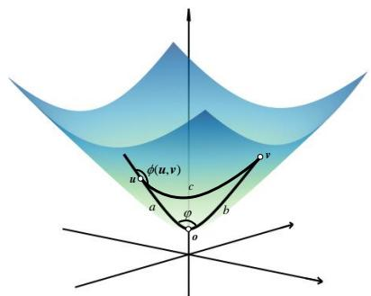  
Figure 8: Given any two points u and v in $\mathcal { L } _ { k } ^ { 2 }$ except the origin o, they form a hyperbolic triangle with the origin. c represents the geodesic between u and v (similar for a and b), $\varphi$ is the angle formed by a and b. The hyperbolic cosine of $\varphi$ is utilized to quantify the similarity between u and v. φ(u, v) denotes the exterior angle between half-lines (ou and (uv.

$$
\begin{array} { l } { { a = \sqrt { 1 / | k | } \mathrm { c o s h } ^ { - 1 } ( k \langle o , u \rangle _ { \mathcal { L } } ) = \sqrt { 1 / | k | } \mathrm { c o s h } ^ { - 1 } ( \sqrt { | k | } u _ { 0 } ) } } \\ { { b = \sqrt { 1 / | k | } \mathrm { c o s h } ^ { - 1 } ( k \langle o , v \rangle _ { \mathcal { L } } ) = \sqrt { 1 / | k | } \mathrm { c o s h } ^ { - 1 } ( \sqrt { | k | } v _ { 0 } ) } } \\ { { c = \sqrt { 1 / | k | } \mathrm { c o s h } ^ { - 1 } ( k \langle u , v \rangle _ { \mathcal { L } } ) } } \\ { { \ = \sqrt { 1 / | k | } \mathrm { c o s h } ^ { - 1 } ( - k ( u _ { 0 } v _ { 0 } - { \displaystyle \sum _ { i = 1 } ^ { n } } u _ { i } v _ { i } ) ) } } \end{array}\tag{15}
$$

hence,

$$
\begin{array} { r l } { \operatorname { c a r b i f } ( \phi ) \bigg | \| \mathbf { z } \| } & { = \operatorname { c a r b i f } \{ \phi \} \cdot \sqrt { \phi } \ : | \phi | \ : | \phi \in \mathbf { a } \mathbf { b } ^ { - 1 } ( \cdot \sqrt { | \phi | } \ : | \mathbf { z } | ) \} } \\ & { \qquad = \sqrt { | \phi | \cdot | \phi | } \ : \operatorname { c a r b i f } ( \cdot \sqrt { | \phi | } \ : \exp \ : \mathrm { i } ( \cdot \sqrt { | \phi | } \ : | \mathbf { z } | ) ) } \\ & { = \operatorname { c a r b i f } ( \phi ) ( \overline { { \mathbf { z } \| \cdot | \phi | } } \ : \exp \ : \mathrm { i } ( \cdot \sqrt { | \phi | } \ : | \phi | \exp \ : \mathrm { i } ( \cdot \sqrt { | \phi | } \ : | \mathbf { z } | ) )  } \\ & { \qquad - \sqrt { | \phi | \cdot | \phi | } \ : \exp \ : \mathrm { i } ( \cdot \sqrt { | \phi | } \ : \exp \ : \mathrm { i } ( \cdot \sqrt { | \phi | } \ : | \phi | ) )  } \\ & { \mathrm { ~ } \operatorname { c a r b i f } ( \phi ) ( \overline { { \mathbf { z } \| \cdot | \phi | } } ) = - \operatorname { c a r b i f } ( \phi ) \ : \mathrm { - } \displaystyle \sum _ { i = 1 } ^ { \infty } \operatorname { i } \ : | \phi \| \ : \exp \ : \mathrm { i } ( \cdot \sqrt { | \phi | } \ : | \mathbf { z } | ) ) } \\ & { \qquad \ : \operatorname { s i n h } ( \phi ) ( \overline { { \mathbf { z } \| \cdot | \phi | } } \ : \exp \ : \mathrm { i } ( \cdot \sqrt { | \phi | } \ : \exp \ : \mathrm { i } ( \cdot \sqrt { | \phi | } \ : | \mathbf { z } | ) )  } \\ &  \qquad \ :  - \sqrt { | \phi | } \ : \exp \ : \mathrm { i } ( \cdot \sqrt { | \phi | } \ : \exp \ : \mathrm { i } ( \cdot \sqrt  |  \end{array}\tag{16}
$$

As $\varphi$ corresponds to $\angle C$ in Eq. 14, we substitute Eq. 16 into Eq. 14, the Lorentzian cosine similarity

between u and v is calculated as:

$$
\begin{array} { l } { \sin ( u , v ) = \cos \varphi } \\ { \displaystyle = \frac { | k | u _ { 0 } v _ { 0 } - ( - k ( u _ { 0 } v _ { 0 } - \displaystyle \sum _ { i = 1 } ^ { n } u _ { i } v _ { i } ) ) } { \sinh ( \cosh ^ { - 1 } ( \sqrt { | k | } u _ { 0 } ) ) \sinh ( \cosh ^ { - 1 } ( \sqrt { | k | } v _ { 0 } ) ) } } \\ { \displaystyle = \frac { - k \sum _ { i = 1 } ^ { n } u _ { i } v _ { i } } { \sqrt { | k | u _ { 0 } ^ { 2 } - 1 } \sqrt { | k | v _ { 0 } ^ { 2 } - 1 } } } \end{array}\tag{17}
$$

Thus, Theorem 3.1 is derived.

## C Proof of Lemma 3.1

Lemma. ∀u $\in \mathcal { L } _ { k } ^ { n } \backslash \{ o \}$ , let u denotes the 0-th dimension ofu, $C > 0$ is a constant used to set the boundary conditions, the entailment cone of u is defined by the half-aperture:

$$
\gamma ( \pmb { u } ) = \sin ^ { - 1 } ( \frac { C } { \sqrt { | k | u _ { 0 } ^ { 2 } - 1 } } )
$$

Proof. Ganea et al. (2018a) propose the entailment cones in the Poincaré ball and provide a closedform expression. Subsequently, Le et al. (2019) generalize it to the Lorentz model via the isometric property. In this section, we begin the derivation of the half-aperture of the Lorentzian entailment cone of arbitrary curvature from the convex cone.

The Lorentzian entailment cone is the generalization of the convex cone in the Lorentz model. The convex cone S is a closed set under non-negative linear combinations. For $v _ { 1 } , v _ { 2 } \in S , \forall \alpha , \beta \ge 0$ the following formula is established:

$$
\alpha { \pmb v } _ { 1 } + \beta { \pmb v } _ { 2 } \in S\tag{18}
$$

Assume $S$ is an arbitrary cone in the tangent space at point ${ \mathbf { \mathit { x } } } ,$ i.e. $S \subseteq \mathcal { T } _ { x } \mathcal { L } _ { k } ^ { n }$ . Utilizing the exponential map, it can be mapped to the Lorentz model to obtain the Lorentzian entailment cone:

$$
\mathfrak { S } _ { x } : = \exp _ { x } ^ { k } ( S )\tag{19}
$$

Similar to Ganea et al. (2018a), we aspire for the Lorentzian entailment cones to embody four properties, i.e. axial symmetry, rotation invariance, continuous cone aperture functions, and transitivity of nested angular cones.

Axial symmetry. The Lorentzian entailment cone of point x has a non-negative aperture $\gamma ( \pmb { x } )$ as:

$$
\begin{array} { r l } & { S _ { \pmb { x } } ^ { \gamma ( \pmb { x } ) } : = \{ \pmb { v } \in \mathcal { T } _ { \pmb { x } } \mathcal { L } _ { k } ^ { n } | \angle ( \pmb { v } , \overline { { \pmb { x } } } ) \leq \gamma ( \pmb { x } ) \} } \\ & { \mathfrak { S } _ { \pmb { x } } ^ { \gamma ( \pmb { x } ) } : = \mathrm { e x p } _ { \pmb { x } } ^ { k } ( S _ { \pmb { x } } ^ { \gamma ( \pmb { x } ) } ) } \end{array}\tag{20}
$$

where $\overline { { \boldsymbol { x } } } \in \mathcal { T } _ { \boldsymbol { x } } \mathcal { L } _ { k } ^ { n }$ has the same direction as x. Further, the conic border is defined as:

$$
\begin{array} { r l } & { \partial S _ { \pmb { x } } ^ { \gamma ( \pmb { x } ) } : = \{ \pmb { v } \in \mathcal { T } _ { \pmb { x } } \mathcal { L } _ { k } ^ { n } | \angle ( \pmb { v } , \overline { { \pmb { x } } } ) = \gamma ( \pmb { x } ) \} } \\ & { \partial \mathfrak { S } _ { \pmb { x } } ^ { \gamma ( \pmb { x } ) } : = \exp _ { \pmb { x } } ^ { k } ( \partial S _ { \pmb { x } } ^ { \gamma ( \pmb { x } ) } ) } \end{array}\tag{21}
$$

Rotation invariance. The Lorentzian entailment cone ${ \mathfrak { S } } _ { \pmb { x } } ^ { \gamma ( \pmb { x } ) }$ is contingent solely upon the geodesic distance between x and the origin $o ( 1 / \sqrt { | k | } , \mathbf { 0 } ^ { n } )$ , and entirely independent of the angular coordinate of the apex x. $\forall x , x ^ { \prime } \in \mathcal { L } _ { k } ^ { n } \backslash \{ o \}$ , if $d _ { \mathcal { L } } ^ { k } ( \pmb { o } , \pmb { x } ) =$ $d _ { \mathcal { L } } ^ { k } ( \boldsymbol { o } , \boldsymbol { x } ^ { \prime } )$ , the following equation holds:

$$
\gamma ( { \pmb x } ) = \gamma ( { \pmb x } ^ { \prime } )\tag{22}
$$

i.e., there exists a function $\widetilde { \gamma } : ( 0 , + \infty )  [ 0 , \pi )$ that is, $\forall \pmb { x } \in \mathcal { L } _ { k } ^ { n } \backslash \{ \pmb { o } \} , \gamma ( \pmb { x } ) = \widetilde { \gamma } ( d _ { \mathcal { L } } ^ { k } ( \pmb { o } , \pmb { x } ) )$

Continuous cone aperture functions. Eq. 22 illustrates the continuity of $\widetilde { \gamma } ,$ , indicating that $\gamma$ is continuous.

Transitivity of nested angular cones. Transitivity accounts for the partial order within the embedding space. For a nested structure ∀x, ${ \pmb x } ^ { \prime } \in$ $\mathcal { L } _ { k } ^ { n } \backslash \{ o \} , \pmb { x } ^ { \prime } \in \mathfrak { S } _ { \pmb { x } } ^ { \gamma ( \pmb { x } ) }$ , the transitivity is formulated as:

$$
\mathfrak { S } _ { { \pmb { x } } ^ { \prime } } ^ { \gamma ( \pmb { x } ^ { \prime } ) } \subseteq \mathfrak { S } _ { { \pmb { x } } } ^ { \gamma ( \pmb { x } ) }\tag{23}
$$

Using the transitivity, Ganea et al. (2018a) prove the fact:

$$
\forall x \in D o m ( \gamma ) , \gamma ( { \pmb x } ) \leq \frac { \pi } { 2 }\tag{24}
$$

With the properties mentioned above, we first introduce the hyperbolic law of sines (Parkkonen, 2012).

Hyperbolic Law of Sines. In the hyperbolic triangle $\triangle A B C$ constructed when the hyperbolic law of cosines is introduced, the hyperbolic law of sines is established as follows:

$$
{ \frac { \sin ( \angle A ) } { \sinh ( a \sqrt { | k | } ) } } = { \frac { \sin ( \angle B ) } { \sinh ( b \sqrt { | k | } ) } } = { \frac { \sin ( \angle C ) } { \sinh ( c \sqrt { | k | } ) } }\tag{25}
$$

Then, we prove the following fact:

Lemma C.1. $\forall x \in \mathcal { L } _ { k } ^ { n } \backslash \{ o \}$ , and $\forall \mathbf { x } ^ { \prime } \in \partial \mathfrak { S } _ { \mathbf { x } } ^ { \gamma ( \mathbf { x } ) }$

$$
\sin ( \gamma ( \pmb { x } ^ { \prime } ) ) \sinh ( d _ { \mathcal { L } } ^ { k } ( \pmb { o } , \pmb { x } ^ { \prime } ) ) \leq \sin ( \gamma ( \pmb { x } ) ) \sinh ( d _ { \mathcal { L } } ^ { k } ( \pmb { o } , \pmb { x } ) )\tag{26}
$$

Proof. As shown in Fig. 9, $\pmb { x } ^ { \prime } \in \partial \mathfrak { S } _ { \pmb { x } } ^ { \gamma ( \pmb { x } ) }$ , therefore,

$$
\angle y x ^ { \prime } z \leq \gamma ( \pmb { x } ) \leq \frac { \pi } { 2 }\tag{27}
$$

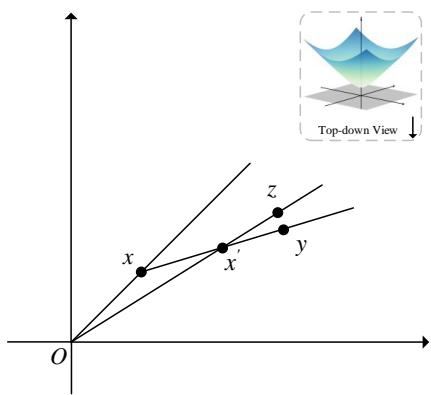  
Figure 9: The coordinate system is a top-down view of the Lorentz model. $x ^ { \prime } \in \partial \mathfrak { S } _ { x } ^ { \gamma ( x ) }$ is any arbitrary point on the conic border of $\mathfrak { S } _ { x } ^ { \gamma ( x ) } , y \in \partial \mathfrak { S } _ { x } ^ { \gamma ( x ) }$ is any arbitrary point on the geodesic half-line $( x x ^ { \prime }$ starting from $x ^ { \prime } , z$ is any arbitrary point on the geodesic halfline $( O x ^ { \prime }$ starting from $x ^ { \prime } ,$ , therefore, (Oz is the axis of symmetry of ${ \mathfrak { S } } _ { x ^ { \prime } } ^ { \gamma ( x ^ { \prime } ) }$

With the transitivity, we have:

$$
\angle y x ^ { \prime } z \ge \gamma ( { \pmb x } ^ { \prime } )\tag{28}
$$

In addition, in hyperbolic triangle $\triangle { O x x ^ { \prime } }$

$$
\begin{array} { l } { { \angle O x ^ { \prime } x = \angle y x ^ { \prime } z } } \\ { { \angle O x x ^ { \prime } = \pi - \gamma ( { \pmb x } ) } } \end{array}\tag{29}
$$

With the hyperbolic law of sines in Eq. 25, we have:

$$
\frac { \sin ( \angle O x x ^ { \prime } ) } { \sinh ( \sqrt { | k | } d _ { \mathcal { L } } ^ { k } ( O , x ^ { \prime } ) ) } = \frac { \sin ( \angle O x ^ { \prime } x ) } { \sinh ( \sqrt { | k | } d _ { \mathcal { L } } ^ { k } ( O , x ) ) }\tag{30}
$$

Utilizing the monotonically increasing property of $\sin ( \cdot )$ over interval $[ 0 , \frac { \pi } { 2 } ]$ , in conjunction with Eqs. 27, 28, 29, 30, Lemma C.1 is proved.

With Lemma C.1, we prove the following theorem:

Theorem C.1. Iftransitivity holds, $k ( k < 0 )$ is the constant negative curvature ofthe Lorentz model, thefunction

$$
\begin{array} { r } { h : ( 0 , + \infty ) \cap D o m ( \widetilde { \gamma } ) \to \mathbb { R } _ { + } } \\ { h ( r ) = \sinh ( r \sqrt { | k | } ) \sin ( \widetilde { \gamma } ( r ) ) } \end{array}\tag{31}
$$

is non-increasing.

Proof. As $d _ { \mathcal { L } } ^ { k } ( O , x ) ~ = ~ \sqrt { 1 / \vert k \vert } \mathrm { c o s h } ^ { - 1 } ( \sqrt { \vert k \vert } x _ { 0 } )$ (described in Eq. 15), $d _ { \mathcal { L } } ^ { k } ( O , x )$ is a continuously monotonically increasing function related to the

0-th dimensional coordinate of x. Therefore, $\exists x \in$ $\mathcal { L } _ { k } ^ { n } \backslash \{ o \} , x ^ { \prime } \in \mathfrak { S } _ { x } ^ { \gamma ( x ) }$ , s.t.

$$
\begin{array} { l } { { d _ { \mathcal { L } } ^ { k } ( O , x ) = r , \quad d _ { \mathcal { L } } ^ { k } ( O , x ^ { \prime } ) = r ^ { \prime } } } \\ { { r < r ^ { \prime } \quad a n d \quad r , r ^ { \prime } \in ( 0 , + \infty ) } } \end{array}\tag{32}
$$

Consequently, we simplify sinh ${ \cal ( \sqrt { | k | } } d _ { \mathcal { L } } ^ { k } ( O , x ) )$ as

$$
\sinh ( \sqrt { | k | } d _ { \mathcal { L } } ^ { k } ( O , x ) ) = \sinh ( r \sqrt { | k | } )\tag{33}
$$

and apply it to Lemma C.1, we have:

$$
h ( r ) \geq h ( r ^ { \prime } )\tag{34}
$$

Combining Eqs. 32, 34, Theorem C.1 is proved. □

Since $\begin{array} { r } { \operatorname* { l i m } _ { r \to 0 } h ( r ) \ = ~ 0 } \end{array}$ for any function $\widetilde { \gamma } , \widetilde { \gamma }$ can not be defined on the entire $( 0 , + \infty )$ . Therefore, we restrict $D o m ( \widetilde { \gamma } )$ to some $[ \epsilon , + \infty )$ , then Theorem C.1 implies that $\forall r \in [ \epsilon , + \infty )$

$$
\sinh ( r \sqrt { | k | } ) \mathrm { s i n } ( \widetilde { \gamma } ( r ) ) \leq \mathrm { s i n h } ( \epsilon \sqrt { | k | } ) \mathrm { s i n } ( \widetilde { \gamma } ( \epsilon ) )\tag{35}
$$

To make $h$ constant, let $C > 0$ to be a constant, we set $h ( r )$ equal to C:

$$
\forall r \in [ \epsilon , + \infty ) , \sinh ( r \sqrt { | k | } ) \mathrm { s i n } ( \widetilde { \gamma } ( r ) ) = C\tag{36}
$$

which implies that:

$$
C \leq \sinh ( \epsilon \sqrt { | k | } ) , \quad \epsilon \geq \sinh ^ { - 1 } ( \frac { C } { \sqrt { | k | } } )\tag{37}
$$

also gives the definition of the half-aperture of the Lorentzian entailment cone of $\pmb { u } \in \mathcal { L } _ { k } ^ { n } \backslash \{ \pmb { o } \}$ •

$$
\begin{array} { l } { \gamma ( { \pmb u } ) = \sin ^ { - 1 } ( \frac { C } { \sinh ( \sqrt { | k | } d _ { C } ^ { k } ( o , { \pmb u } ) ) } ) } \\ { = \sin ^ { - 1 } ( \frac { C } { \sinh ( \sqrt { | k | } \cdot \frac { 1 } { \sqrt { | k | } } \cosh ^ { - 1 } ( \sqrt { | k | } u _ { 0 } ) ) } ) } \\ { = \sin ^ { - 1 } ( \frac { C } { \sqrt { | k | } u _ { 0 } ^ { 2 } - 1 } ) } \end{array}\tag{38}
$$

Thus, Lemma 3.1 is proved.

## D Proof of Lemma 3.2

Lemma. ∀u, $v \in \mathcal { L } _ { k } ^ { n } \backslash \{ o \}$ , let $u _ { i }$ and vi denote the i-th dimension of u and v, the exterior angle between half-lines (ou and (uv is calculated as:

$$
\phi ( { \pmb u } , { \pmb v } ) = \cos ^ { - 1 } ( \frac { v _ { 0 } - u _ { 0 } \cdot k \langle { \pmb u } , { \pmb v } \rangle _ { \mathcal { L } } } { \sqrt { \sum _ { i = 1 } ^ { n } u _ { i } ^ { 2 } } \sqrt { \left( k \langle { \pmb u } , { \pmb v } \rangle _ { \mathcal { L } } \right) ^ { 2 } - 1 } } )
$$

Proof. We employ the hyperbolic triangle constructed in appendix B to derive Lemma 3.2. As illustrated in Fig. 8, the exterior angle between half-lines (ou and (uv is formulated as follows:

$$
\begin{array} { l } { \displaystyle \phi ( { \pmb u } , { \pmb v } ) = \pi - \angle o { \pmb u } { \pmb v } } \\ { = \pi - \cos ^ { - 1 } ( \frac { \cosh ( a \sqrt { | k | } ) \cosh ( c \sqrt { | k | } ) - \cosh ( b \sqrt { | k | } ) } { \sinh ( a \sqrt { | k | } ) \sinh ( c \sqrt { | k | } ) } ) } \end{array}\tag{39}
$$

Since $\pi - \cos ^ { - 1 } ( x ) = \cos ^ { - 1 } ( - x )$ , Eq. 39 can be simplified as:

$$
\begin{array} { l } { \displaystyle \phi ( \pmb { u } , \pmb { v } ) } \\ { \displaystyle = \cos ^ { - 1 } ( \frac { \cosh ( b \sqrt { | k | } ) - \cosh ( a \sqrt { | k | } ) \cosh ( c \sqrt { | k | } ) } { \sinh ( a \sqrt { | k | } ) \sinh ( c \sqrt { | k | } ) } ) } \end{array}\tag{40}
$$

Substituting Eqs. 15, 16 into Eq. 40, we give the following derivation process:

$$
\begin{array} { r l } & { \phi ( \pmb { u } , \pmb { v } ) } \\ & { = \cos ^ { - 1 } ( \frac { \sqrt { | k | } v _ { 0 } - k \langle \pmb { u } , \pmb { v } \rangle _ { \mathcal { L } } \cdot \sqrt { | k | } u _ { 0 } } { \sinh ( \cosh ^ { - 1 } ( \sqrt { | k | } u _ { 0 } ) ) \sinh ( \cosh ^ { - 1 } ( k \langle \pmb { u } , \pmb { v } \rangle _ { \mathcal { L } } ) ) } ) } \\ & { = \cos ^ { - 1 } ( \frac { \sqrt { | k | } ( v _ { 0 } - u _ { 0 } \cdot k \langle \pmb { u } , \pmb { v } \rangle _ { \mathcal { L } } ) } { \sqrt { | k | } u _ { 0 } ^ { 2 } - 1 } ) } \end{array}\tag{41}
$$

Leveraging the definition of the Lorentz model, we have:

$$
- u _ { 0 } ^ { 2 } + \sum _ { i = 1 } ^ { n } u _ { i } ^ { 2 } = \frac { 1 } { k } = - \frac { 1 } { | k | }\tag{42}
$$

therefore,

$$
\sqrt { | k | u _ { 0 } ^ { 2 } - 1 } = \sqrt { | k | \sum _ { i = 1 } ^ { n } u _ { i } ^ { 2 } }\tag{43}
$$

Substituting Eq. 43 into Eq. 41:

$$
\begin{array} { l }  { \displaystyle { \phi ( { \pmb u } , { \pmb v } ) = \cos ^ { - 1 } ( \frac { \sqrt { | k | } ( v _ { 0 } - { \boldsymbol u } _ { 0 } \cdot k \langle { \pmb u } , { \pmb v } \rangle _ { \mathcal { L } } ) } { \sqrt { | k | } \sum _ { i = 1 } ^ { n } u _ { i } ^ { 2 } \sqrt { ( k \langle { \pmb u } , { \pmb v } \rangle _ { \mathcal { L } } ) ^ { 2 } - 1 } } } } \\ { { \displaystyle ~ = \cos ^ { - 1 } ( \frac { v _ { 0 } - { \boldsymbol u } _ { 0 } \cdot k \langle { \pmb u } , { \pmb v } \rangle _ { \mathcal { L } } } { \sqrt { \sum _ { i = 1 } ^ { n } u _ { i } ^ { 2 } } \sqrt { ( k \langle { \pmb u } , { \pmb v } \rangle _ { \mathcal { L } } ) ^ { 2 } - 1 } } ) } } \end{array}\tag{44}
$$

Thus, Lemma 3.2 is proved.

## E Introduction of Datasets

FewRel 1.0. FewRel 1.0 comprises 100 relations with 70,000 instances extracted from Wikipedia, along with a name and description for each relation to increase interpretability. Relations are divided into 10 groups covering verbal, spatial, comparative relations, etc. The training and test sets cover the same Wikipedia domains.

<table><tr><td>Hyper-parameter</td><td>Range</td></tr><tr><td>Temperature τ</td><td>[0.01, 0.02]</td></tr><tr><td>Constant C</td><td>[0.2, 0.3, 0.4]</td></tr><tr><td>Margin m</td><td>[0.1,0.2]</td></tr><tr><td>Weight coefficient λ1</td><td>[0.2, 0.5, 1]</td></tr><tr><td>Weight coefficient λ2</td><td>[0.02, 0.05, 0.1, 0.2, 0.5, 1]</td></tr></table>

Table 7: Searching ranges of hyper-parameters.

FewRel 2.0. The training set of FewRel 2.0 is identical to FewRel 1.0, while validation and test sets are drawn from the biomedical field. Compared to FewRel 1.0, FewRel 2.0 is more challenging since only the names of relations are available.

Semeval Semeval consists of 19 relations with 10717 instances, of which the training set, validation set, and test set contain 6507, 1693, and 2717 instances, respectively.

Please be advised that in our experimental setup, we utilize the training set of FewRel 1.0 for model training. Additionally, the validation and test sets from the three respective datasets were employed for model validation and testing respectively.

## F Implementation Details

We adopt the uncased model of BERT-base and CP (Peng et al., 2020) for sentence encoding, with respective learning rates of 1e-5 and 5e-6. The training and validation iterations are configured to 30,000 and 1,000, respectively. We utilize the AdamW optimizer to minimize the loss function, with a batch size of 2 for the 10-way-5-shot setting and 4 for other configurations. In the 1-shot settings, the weight coefficient α is assigned a value of 1, and in the 5-shot settings, it was set to 0. Random search is employed to determine the optimal values for remaining hyper-parameters, and the ranges are detailed in Table 7.

## G Compared Baselines

We compare our proposed PO-HRL with the following baselines. Note that, REGRAB, Concept-FERE and DCFT are based on external knowledge, while others only leverage the provided texts and relation descriptions.

Proto-BERT (Snell et al., 2017): a prototypical network for few-shot learning.

BERT-PAIR (Gao et al., 2019): a metric-based method that estimates the similarity of querysupport pairs, followed by a classifier to predict the label of each query instance.

REGRAB (Qu et al., 2020): a Bayesian metalearning framework with an external global relation graph to investigate connections across discrete relations.

ConceptFERE (Yang et al., 2021): an attentionbased approach introducing the inherent concepts of entities to provide clues for relation prediction.

HCRP (Han et al., 2021a): a hybrid contrastive relation-prototype model with task adaptive focal loss directed at advancements in extracting hard relations.

SimpleFSRE (Liu et al., 2022): a simple yet effective prototype-based method that directly adds embeddings of relation descriptions to prototypical representations.

FAEA (Dou et al., 2022): a function word augmented attention mechanism targeting inverse relation extraction via improvements to class-specific function word embeddings.

GM\_GEN (Li and Qian, 2022): a graph-based model with a task-specific generation module to produce specialized models for individual FSRE tasks.

BMIPN (Li et al., 2023): a method based on biased contrastive learning that incorporates explicit and adaptive interactions from both intra-class and inter-class perspectives.

HND (Zhang et al., 2023): a network generatorbased approach that generates classifiers specialized in capturing relation-specific knowledge.

DCFT (Zhang et al., 2023): an approach to domain adaptation for FSRE introduces additional unlabeled data from the target domain to facilitate domain-aware transformation. Since DCFT employs additional unlabeled data, the comparison of PO-HRL is limited to DCFT-DTM without the additional unlabeled data.

MTB (Soares et al., 2019): a post-training task with matching the blanks for RE.

CP (Peng et al., 2020): an entity-masked contrastive post-training framework for RE.