# Perturbation-driven Dual Auxiliary Contrastive Learning for Collaborative Filtering Recommendation

Caihong Mu1, Keyang Zhang1, Jialiang Zhou2, Yi Liu 3\* 1School of Artificial Intelligence, Xidian University   
2Guangzhou Institute of Technology, Xidian University 3School of Electronic Engineering, Xidian University {mucaihongxd, yiliuxd}@foxmail.com   
{keyangzhang, zhoujl}@stu.xidian.edu.cn

## Abstract

Graph collaborative filtering has made great progress in the recommender systems, but these methods often struggle with the data sparsity issue in real-world recommendation scenarios. To mitigate the effect of data sparsity, graph collaborative filtering incorporates contrastive learning as an auxiliary task to improve model performance. However, existing contrastive learning-based methods generally use a single data augmentation graph to construct the auxiliary contrastive learning task, which has problems such as loss of key information and low robustness. To address these problems, this paper proposes a Perturbation-driven Dual Auxiliary Contrastive Learning for Collaborative Filtering Recommendation (PDACL). PDACL designs structure perturbation and weight perturbation to construct two data augmentation graphs. The Structure Perturbation Augmentation (SPA) graph perturbs the topology of the user-item interaction graph, while the Weight Perturbation Augmentation (WPA) graph reconstructs the implicit feedback unweighted graph into a weighted graph similar to the explicit feedback. These two data augmentation graphs are combined with the user-item interaction graph to construct the dual auxiliary contrastive learning task to extract the self-supervised signals without losing key information and jointly optimize it together with the supervised recommendation task, to alleviate the data sparsity problem and

improve the performance. Experimental results on multiple public datasets show that PDACL outperforms numerous benchmark models, demonstrating that the dual-perturbation data augmentation graph in PDACL can overcome the shortcomings of a single data augmentation graph, leading to superior recommendation results. The implementation of our work will be found at https://github.com/zky77/PDACL.

## 1 Introduction

With the explosive growth of online information, recommender systems are becoming more and more indispensable in production and life with their remarkable ability to alleviate information overload (Wu et al., 2022; Gao et al., 2023). The core idea of recommender systems is to model users' interests based on their historical interaction data and make recommendations accordingly. Collaborative Filtering (CF), as one of the most common recommendation algorithms, captures the user's preferences and the characteristics of the items to generate appropriate recommendations (Wu et al., 2023; Suganeshwari and Syed Ibrahim, 2016; Berg et al., 2018). Many CF recommendation methods have been proposed (Rendle et al., 2009; He et al., 2017). In recent years, CF based on Graph Convolutional Neural Network (GCN) has become one of the most attractive recommendation methods due to its superior properties in processing graph data. Wang et al. (2019) applied GCN to the field of CF and proposed Neural Graph Collaborative Filtering (NGCF), which explicitly encoded the collaborative signals in the form of higher-order connectivity by executing embedding propagation, resulting in a substantial improvement in the performance of recommendation algorithms. However, this method directly adopted most of the operations of GCN, which not only caused the model to be heavy and cumbersome, but also resulted in a degradation of the recommendation performance. He et al. (2020b) experimentally demonstrated in Simplifying and Powering Graph Convolution Network for Recommendation (LightGCN) that feature transformation and nonlinear activation in GCN affected the training of the model negatively, and designed a lightweight model that removed unnecessary parts to improve the performance and scalability of the model without sacrificing the recommendation performance. After that, many GCN-based recommendation algorithms have been proposed.

Although GCN-based CF methods are effective, they still face the problem of sparse data. Contrastive Learning (CL) can extract general features from a large amount of unlabeled data and alleviate the sparsity problem in recommender systems, and thus more and more CF recommendation algorithms are using CL to construct auxiliary tasks to help the learning of recommendation models. CL helps to improve the accuracy of the recommendation task and the robustness of the recommendation model by maximizing the similarity between different view representations of the same node and minimizing the similarity between different node representations (Tian et al., 2020). Methods like Self-supervised Graph Learning for Recommendation (SGL) (Wu et al., 2021) and Simple Yet Effective Graph Contrastive Learning for Recommendation (LightGCL) (Cai et al., 2023) performed data augmentation of graphs through structure perturbation to construct the auxiliary task. However, by randomly discarding nodes or edges, structure perturbation might drop important nodes or connections and such structureperturbation-based auxiliary CL might lose key structure information, thereby misleading representation learning. Yu et al. (2022) proposed the Simple Graph Contrastive Learning for Recommendation (SimGCL) and constructed the auxiliary CL task by adding noise to the embeddings in order to avoid this problem, which brought better recommendation results. However, the model was less interpretable and robust. Xia et al. (2022) proposed Hypergraph Contrastive

Collaborative Filtering (HCCF), where a new selfsupervised recommendation framework was designed that jointly captured local and global collaborative relationships through a hypergraph cross-view CL framework. However trainable hypergraph structures often incurred huge training overheads.

In this paper, to address the data sparsity problem and the problem of losing key structure information caused by the structure-perturbationbased auxiliary CL, we propose a novel method called Perturbation-driven Dual Auxiliary Contrastive Learning for Collaborative Filtering Recommendation (PDACL). PDACL first constructs a Structure Perturbation Augmentation (SPA) graph by perturbing the topology of the graph to enhance the model’s robustness to interaction noise. To compensate for the loss of key structure information caused by structure perturbation, we propose a Weight Perturbation Augmentation (WPA) graph simultaneously. The WPA graph perturbs the user-item interaction graph by considering the weight from the perspectives of user interest and node popularity. It reconstructs the implicit feedback-unweighted graph into an explicit feedback-weighted graph. Instead of changing the graph topology, the WPA graph reconstructs the edge weights of the useritem interaction graph by predicting the reasons for interactions. The WPA graph retains all pattern information but provides insufficient selfsupervised signals, while the SPA graph can compensate for the lack of self-supervision signals. We combine the user-item interaction graph with the SPA graph to construct the structure perturbation auxiliary contrastive learning task. Similarly, we combine the user-item interaction graph with the WPA graph to construct the weight perturbation auxiliary contrastive learning task. These two tasks form a dual auxiliary contrastive learning framework, which is combined with the recommendation task for joint training. PDACL strikes a balance between graph perturbation and graph data retention, ensures maximum perturbation of graph data without losing key information and introduces high-quality selfsupervised signals, improving the performance of the recommendation model.

The main contributions of this paper are as follows:

1) We introduce two types of perturbationdriven data augmentation approaches for CL. The

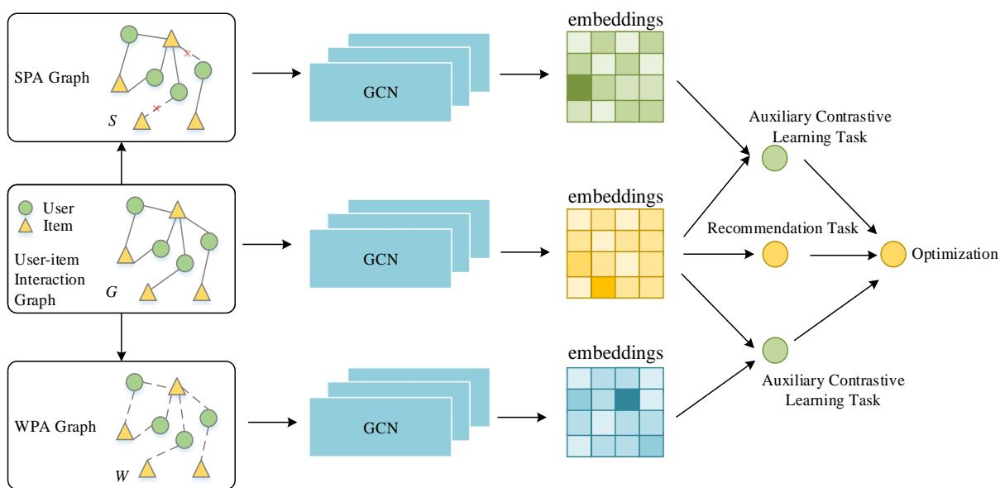  
Figure 1: The overall framework of PDACL.

SPA graph extracts rich self-supervised signals, while the WPA graph addresses the issue of losing key information in the SPA graph. The combination of these two methods enhances the model's ability to learn representation embeddings.

2) We propose PDACL, which utilizes two types of perturbation augmentation graphs with useritem interaction graph to construct a dual auxiliary contrastive learning task and jointly optimize it with the supervised recommendation task, leading to improved performance of the recommendation model.

3) Extensive experiments conducted on multiple public datasets in recommender systems demonstrate that PDACL consistently outperforms various competitive benchmark models, including GCN-based and CL-based recommendation methods. Furthermore, the experiments validate the effectiveness of PDACL in alleviating the data sparsity problem of recommendation.

## 2 Methodology

The specific structure diagram of PDACL is shown in Figure 1, including the main recommendation task and the dual auxiliary CL task. Next, each step is described in detail.

## 2.1 Graph Collaborative Filtering Backbone

This section describes the main task of PDACL, which constructs the original user-item interaction graph based on the interaction data be-tween users and items, and generates the representation embeddings of users and items by applying propagation and prediction function on the interaction graph. Specifically, the representation embeddings of user u and item i are generated by random initialization. Consistent with most GCNbased CF methods, nonlinear activation and feature transformation are discarded in the information update to simplify GCN. The specific update process can be expressed as follows:

$$
e _ { u } ^ { ( k + 1 ) } = \sum _ { i \in N _ { u } } \frac { 1 } { \sqrt { \left| N _ { u } \right| } \sqrt { \left| N _ { i } \right| } } e _ { i } ^ { ( k ) } ,\tag{1}
$$

$$
e _ { i } ^ { ( k + 1 ) } = \sum _ { u \in N _ { i } } \frac { 1 } { \sqrt { \big | N _ { i } \big | } \sqrt { \big | N _ { u } \big | } } e _ { u } ^ { ( k ) }\tag{2}
$$

where $N _ { u }$ and $N _ { i }$ denote the set of neighbors of user u and item i, respectively. $e _ { u } ^ { ( 0 ) }$ is a learnable initialized representation embedding, and after k times of information propagation, the k-th order neighborhood information of u is aggregated and encoded as $e _ { u } ^ { ( k ) }$ . Meanwhile, $e _ { i } ^ { ( k ) }$ can be obtained in a similar way.

After the propagation through K layers, the average function is adopted as the combination function to combine the representation embeddings of all layers.

$$
e _ { u } = \frac { 1 } { K + 1 } \sum _ { k = 0 } ^ { K } e _ { u } ^ { ( k ) } , \quad e _ { i } = \frac { 1 } { K + 1 } \sum _ { k = 0 } ^ { K } e _ { i } ^ { ( k ) }\tag{3}
$$

The preference of user u for item i is predicted by inner product:

$$
\hat { y } _ { u , i } = e _ { u } ^ { \mathrm { T } } e _ { i }\tag{4}
$$

To obtain the information directly from interactions, this paper employs the BPR loss,

which is a supervised recommendation ranking loss function. The formula of the BPR loss function is as follows:

$$
\mathcal { L } _ { _ { B P R } } = \sum _ { ( u , i , j ) \in O } - \log \sigma \big ( \hat { y } _ { u , i } - \hat { y } _ { u , j } \big )\tag{5}
$$

where $\sigma ( \cdot )$ is the sigmoid function, $O = \{ ( u , i , j ) | ( u , i ) \in R ^ { + } , ( u , j ) \in R ^ { - } \}$ denotes the pairwise training data, $R ^ { + }$ denotes the positive sample set and R− denotes the negative sample set.

## 2.2 Structure Perturbation Augmentation Graph

User-item interaction graph usually contains rich collaborative filtering signals, with first-hop neighbors being historical interacting items of users (or interacting users of items), which tend to encompass rich feature information as they are the most direct interactions. Multi-hop neighbors represent higher-order paths between users and items, often reflecting potential features of users or items. Therefore, mining the inherent patterns in the graph structure aids in the representation learning of user nodes and item nodes. This subsection introduces three different operations for SPA graph S: Node Dropout, Edge Dropout, and Random Walk. Any one of these methods can be arbitrarily chosen to construct the SPA graph S.

Node Dropout (ND). For the user-item interaction graph $G ,$ a node in the graph and an edge connected to that node are dropout with probability $\rho$ , and the remaining nodes and edges form an augmentation graph. The specific formula is as follows:

$$
S _ { _ { N D } } = \left( M _ { _ { 1 } } \odot \mathcal { V } , \mathcal { E } \right)\tag{6}
$$

where $M _ { \scriptscriptstyle 1 } \in \{ 0 , 1 \} ^ { | \nu | }$ denotes the mask vector applied to the set of nodes to generate the augmentation graph, denotes the set of all nodes, and denotes the set of all edges. The node dropout augmentation graph is expected to identify influential nodes from different augmentation views, and make representation learning less sensitive to structure changes.

Edge Dropout (ED). For the user-item interaction graph $G ,$ edges in the graph are discarded with probability $\rho$ , and all the nodes and remaining edges in the graph form the augmentation graph. The specific formula is as follows:

$$
S _ { _ { E D } } = \left( \mathcal { V } , M _ { _ { 2 } } \odot \mathcal { E } \right)\tag{7}
$$

where $M _ { 2 } \in \{ 0 , 1 \} ^ { | \varepsilon | }$ denotes the mask vector applied to the set of edges to generate the augmentation graph. Not all edges between nodes in the user-item interaction graph contribute to the learning of node representations, and edge dropout can help the model capture useful patterns of the local structure of a node.

Random Walk (RW). Random walk considers assigning different augmentation graphs to different layers. Selecting edges to discard (with different ratios or random seeds) at each layer can be formulated by using mask vectors for the construction of the random walk augmentation graph. The specific formula is as follows:

$$
S _ { R W } = \left( \mathcal { V } , M _ { 2 } ^ { k } \odot \mathcal { E } \right)\tag{8}
$$

where $M _ { 2 } ^ { k } \in \{ 0 , 1 \} ^ { | \varepsilon | }$ denotes the mask vector applied to the edge set on the k-th layer of GCN to generate the augmentation graph.

## 2.3 Weight Perturbation Augmentation Graph

SPA graph can provide rich self-supervised signal, but it may lead to the loss of crucial information. Therefore, this paper proposes WPA graph as a supplement. The reasons for users and items to generate interactions are often multi-intentional. Hence, in this paper, we aim to predict the reasons for user-item interactions from the perspectives of nodes' popularity and interest. This approach reconstructs the unweighted graph of implicit feedback into a weighted graph that closely resembles the explicit feedback for data augmentation. The WPA graph W in this paper can be constructed by choosing either popularity weight perturbation or interest weight perturbation.

Popularity Weight Perturbation (Pop). In recommender systems, popular items often have a higher probability of being clicked, which forms the basic premise of popularity-based recommendations. Therefore, this paper reconstructs the edge weights in the user-item interaction graph to assign greater weight to popular items, the specific formula is as follows:

$$
w _ { p o p ( u , i ) } = \left\{ \begin{array} { c c } { { p o p ( i ) , } } & { { u , i \mathrm { h a v e i n t e r a c t i o n } } } \\ { { 0 } } & { { \mathrm { o t h e r w i s e } } } \end{array} \right.\tag{9}
$$

$$
p o p ( i ) = \frac { l o g \left( \left| N _ { i } \right| \right) } { \displaystyle \frac { 1 } { | \mathcal { V } | } \sum _ { \nu \in \mathcal { V } } l o g \left( \left| N _ { \nu } \right| \right) }\tag{10}
$$

<table><tr><td rowspan="2">Datasets Metrics</td><td colspan="2">Douban</td><td colspan="2">Amazon-book</td><td colspan="2">Yelp</td><td colspan="2">Gowalla</td></tr><tr><td>Recall</td><td>NDCG</td><td>Recall</td><td>NDCG</td><td>Recall</td><td>NDCG</td><td>Recall</td><td>NDCG</td></tr><tr><td>BPRMF</td><td>0.0873</td><td>0.0923</td><td>0.1052</td><td>0.0710</td><td>0.0907</td><td>0.0730</td><td>0.1825</td><td>0.1237</td></tr><tr><td>NCF</td><td>0.0793</td><td>0.0954</td><td>0.0667</td><td>0.0441</td><td>0.0727</td><td>0.0612</td><td>0.1707</td><td>0.1165</td></tr><tr><td>NGCF</td><td>0.0975</td><td>0.0999</td><td>0.1071</td><td>0.0724</td><td>0.0950</td><td>0.0758</td><td>0.1885</td><td>0.1271</td></tr><tr><td>LRGCCF</td><td>0.0883</td><td>0.0955</td><td>0.1076</td><td>0.0719</td><td>0.0923</td><td>0.0741</td><td>0.1853</td><td>0.1248</td></tr><tr><td>LightGCN</td><td>0.0942</td><td>0.0995</td><td>0.1140</td><td>0.0770</td><td>0.0961</td><td>0.0779</td><td>0.1975</td><td>0.1358</td></tr><tr><td>SGL</td><td>0.0925</td><td>0.1064</td><td>0.1266</td><td>0.0865</td><td>0.0923</td><td>0.0757</td><td>0.2080</td><td>0.1441</td></tr><tr><td>SimGCL</td><td>0.0973</td><td>0.1087</td><td>0.1152</td><td>0.0837</td><td>0.0912</td><td>0.0762</td><td>0.2139</td><td>0.1486</td></tr><tr><td>PDACL</td><td>0.0986</td><td>0.1141</td><td>0.1342</td><td>0.0933</td><td>0.1041</td><td>0.0865</td><td>0.2206</td><td>0.1551</td></tr></table>

Table 1: Performance comparison of different recommendation models.

where $\boldsymbol { w } _ { p o p ( u , i ) }$ denotes the edge weight between node u and node i in the WPA graph and denotes the popularity of node i. N denote the set of neighbors of node v.

Interest Weight Perturbation (Int). The interest is another crucial factor influencing useritem interactions. Among the items that one user interacts with, most items exhibit a commonality that mirrors the user's interest, while noisy items show less similarity to other items. Therefore, this paper calculates the similarity between neighboring nodes of the target node to determine the importance of these neighbors to the target node. Subsequently, it constructs an interest-weightperturbation augmentation graph. The specific formula is as follows:

$$
w _ { i n t ( u , i ) } = \frac { \displaystyle \sum _ { j \in N _ { u } } s _ { i , j } } { \displaystyle \sum _ { k \in N _ { u } } \sum _ { j \in N _ { u } } s _ { k , j } }\tag{11}
$$

where $w _ { i n t ( u , i ) }$ indicates the level of user u’s interest in item $i , ~ s _ { i , j }$ is the degree of similarity between item i and item j.

## 2.4 Contrastive Learning and Multi-task Training

In this paper, we use edge dropout to construct the SPA graph S, and use popularity weight perturbation to construct the WPA graph W. Combined with the user-item interaction graph G to build the PDACL framework. Stacking GCN on G, S, and W respectively, we obtain three sets of user representation embeddings $e _ { u } ^ { G } \ , \ e _ { u } ^ { S }$ and $e _ { u } ^ { W }$ and three sets of item representation embeddings $e _ { i } ^ { G } \ , \ e _ { i } ^ { S }$ and $e _ { i } ^ { W }$ , respectively. Based on these representation embeddings, pattern information in graph data can be effectively captured in a selfsupervised manner. Specifically, PDACL considers the representation embeddings of the same node as positive sample pairs, and those of different nodes as negative sample pairs. It works towards minimizing the difference between positive sample pairs while maximizing the difference between negative sample pairs by using a contrastive loss function based on Noise Contrastive Estimation, called InfoNCE (He et al., 2020a). The structure perturbation contrastive loss function is as follows:

$$
\begin{array} { c } { { \displaystyle { \mathcal { L } _ { S } = \sum _ { u \in \mathcal { U } } - \log \frac { \exp \left( \cos \left( e _ { u } ^ { G } \cdot e _ { u } ^ { S } \right) / \tau \right) } { \sum _ { \nu \in \mathcal { U } } \exp \left( \cos \left( e _ { u } ^ { G } \cdot e _ { \nu } ^ { S } \right) / \tau \right) } + } } } \\ { { \displaystyle { \sum _ { i \in I } - \log \frac { \exp \left( \cos \left( e _ { i } ^ { G } \cdot e _ { i } ^ { S } \right) / \tau \right) } { \sum _ { j \in I } \exp \left( \cos \left( e _ { i } ^ { G } \cdot e _ { j } ^ { S } \right) / \tau \right) } } } } \end{array}\tag{12}
$$

where $\tau$ is the temperature coefficient of the Softmax function and  is the cosine similarity function.

The weight perturbation contrastive loss function can be obtained similarly as follows:

$$
\begin{array} { c }  { { \displaystyle { \mathcal { L } } _ { w } = \sum _ { u \in { \mathcal { U } } } - \log \frac { \exp \left( \cos \left( e _ { u } ^ { G } , e _ { u } ^ { W } \right) / \tau \right) } { \displaystyle { \sum _ { \nu \in { \mathcal { U } } } \exp \left( \cos \left( e _ { u } ^ { G } , e _ { \nu } ^ { W } \right) / \tau \right) } } + } } \\ { { { \displaystyle \sum _ { i \in I } - \log \frac { \exp \left( \cos \left( e _ { i } ^ { G } , e _ { i } ^ { W } \right) / \tau \right) } { \displaystyle { \sum _ { j \in I } \exp \left( \cos \left( e _ { i } ^ { G } , e _ { j } ^ { W } \right) / \tau \right) } } } } } \end{array}\tag{13}
$$

In summary, the overall loss of PDACL is composed of $\mathcal { L } _ { { B P R } } ~ , ~ \mathcal { L } _ { s }$ and $\mathcal { L } _ { w }$ . The specific formula is as follows:

$$
\begin{array} { r } { \mathcal { L } = \mathcal { L } _ { _ { B P R } } + \lambda _ { 1 } \mathcal { L } _ { S } + \lambda _ { 2 } \mathcal { L } _ { w } + \lambda _ { 3 } \left. \Theta \right. _ { 2 } } \end{array}\tag{14}
$$

where $\lambda _ { 1 } , \lambda _ { 2 } , \lambda _ { 3 }$ are hyperparameters used to control the weights of the two proposed contrastive loss functions and the regularization term, respectively. denotes the set of GCN model parameters.

## 3 Experiments

## 3.1 Experimental Settings

Datasets and Evaluation. We use four publicly available and commonly used datasets, including: Douban (Zhao et al., 2016), Amazon-Book (He et al., 2020b), Yelp2018 (Yu et al., 2021) and Gowalla (Ference et al., 2013) to conduct our experiments. Recall@20 and NDCG@20 are chosen as the evaluation metrics as they are popular in the evaluation of CF models. Recall@K measures the proportion of the items that the user really clicks within the top K positions to the items in the entire click set. NDCG differentiates the contributions of the accurately recommended items based on their ranking positions.

Baselines. For performance comparison, we select various state-of-the-art baselines including MF-based method (BPRMF (Rendle et al., 2009)), neural network based method (NCF (He et al., 2017)), GCN-based methods (NGCF (Wang et al., 2019), LRGCCF (Chen et al., 2020) and LightGCN (He et al., 2020b)), and CL-based methods (SGL (Wu et al., 2021) and SimGCL (Yu et al., 2022)). We closely follow these CL-based CF studies and split data in the same way as them.

Implementation Details. PDACL is implemented by Pytorch. In all experiments, we adopt Gaussian distribution with 0 mean and 0.05 standard deviation to initialize representation embeddings, and the size of the representation embeddings is set to 32. The Adam optimizer is adopted, and the learning rate is set to 0.001. The length of the recommendation list is set to 20. All experimental results are obtained by averaging 5 experiments.

## 3.2 Overall Performance

This section compares our PDACL with other benchmark methods, and Table 1 presents the results of the comparison experiments of all methods on four datasets. Based on the data in Table 1, we can draw the following conclusions:

1) GCN-based models such as NGCF, LRGCCF and LightGCN achieve better performance compared to BPRMF and NCF, thanks to the ability of GCN to capture higher-order collaborative information. Compared with the methods without CL, SGL and SimGCL achieve better recommendation performance, demonstrating that the auxiliary CL task can improve the performance of recommendation models.

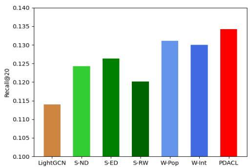  
(a) Recall@20 on Amazon-Book

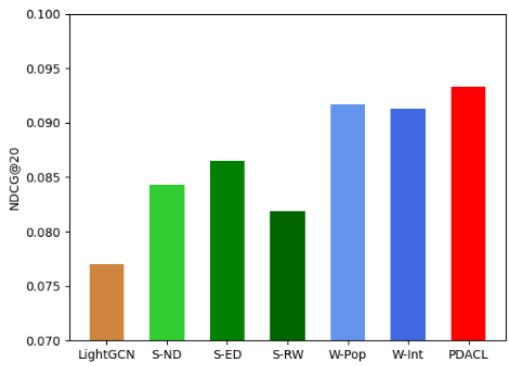  
(b) NDCG@20 on Amazon-Book

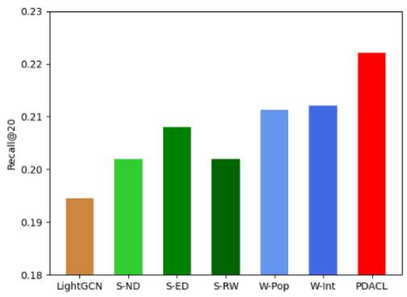  
(c) Recall@20 on Gowalla

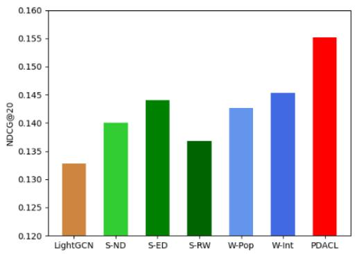  
(d) NDCG@20 on Gowalla  
Figure 2: PDACL with different augmentation graph.

2) SGL, which only uses structure perturbation, suffers from the phenomenon of losing key node information, leads to poor node representations and thus performs worse. Although being effective, SimGCL exhibits less stable performance and is even inferior to SGL on some datasets. Overall, compared with the benchmark models, PDACL achieves the best recommendation performance on all datasets. This is because PDACL mitigates the impact of sparse interaction data on supervised learning task in recommendation scenarios by using SPA graph and WPA graph for CL, and can effectively generate representation embeddings and achieve better recommendation results.

## 3.3 PDACL with Different Augmentation Graph

To analyze the impact of different augmentation graph on the performance of PDACL, five variant models of PDACL are constructed in this section. Among them, the edge dropout structure perturbation (S-ED), the node dropout structure perturbation (S-ND) and the random walk structure perturbation (S-RW) are the PDACL variant models that use only a single structure perturbation to construct auxiliary CL task, and the interest weight perturbation (W-Int) and the popularity weight perturbation (W-Pop) are the PDACL variant models that use only a single weight perturbation to construct auxiliary CL task. The corresponding comparison results are illustrated in Figure 2. Observing Figure 2, the following conclusions can be drawn:

1) Compared to LightGCN without CL, five variant models of PDACL lead to a substantial improvement in recommendation performance, which demonstrates the effectiveness of CL.

2) S-ED achieves better performance compared to the other two structure perturbation operations. The main reason is analyzed as follows: S-ED can better preserve the collaborative pattern information in the graph structure during the data augmentation; whereas S-ND and S-RW introduce too strong perturbations that may cause more critical information to be lost.

3) W-Pop and W-Int are more stable and better than S-ED due to the fact that they do not change the topology of the original graph, and thus do not lose the effective graph information. The performance of W-Pop and W-Int on different datasets has its own advantages and disadvantages, which may be attributed to the varying user purchase intentions across datasets. For example, the Amazon-Book is a shopping dataset where the user interactions are more influenced by popularity, while the Gowalla is a social network dataset where the user interactions are more influenced by interest. Therefore, performance may vary slightly across different datasets.

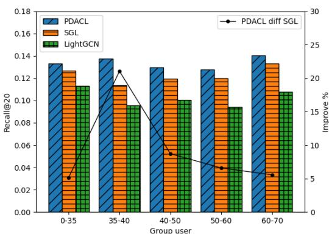  
(a) Recall@20 on Amazon-Book

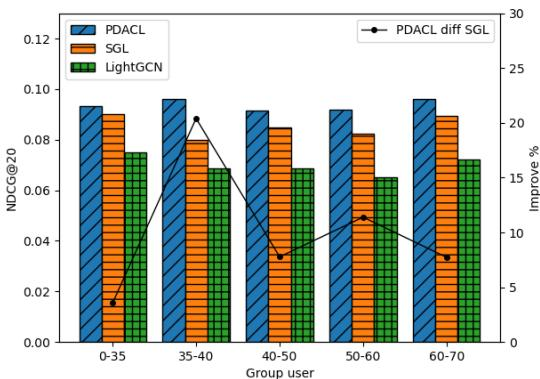  
(b) NDCG@20 on Amazon-Book

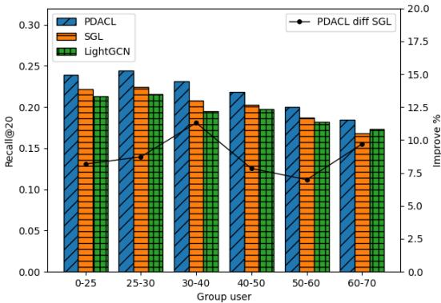  
(c) Recall@20 on Gowalla

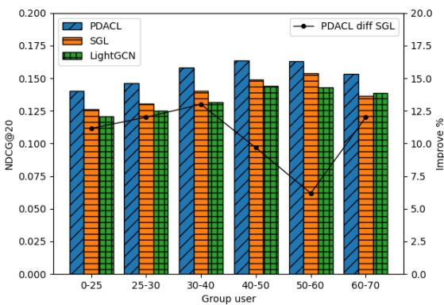  
(d) NDCG@20 on Gowalla  
Figure 3: Impact of different sparsity levels.

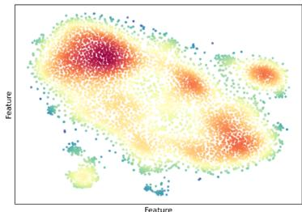  
(a) LightGCN (Amazon-Book)

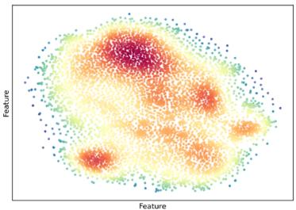  
(b) SGL (Amazon-Book)

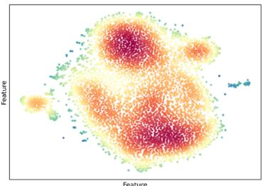  
(c) PDACL (Amazon-Book)

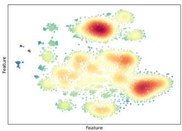  
(d) LightGCN (Gowalla)

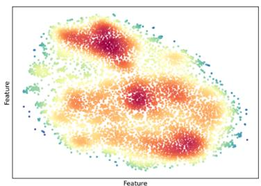  
(e) SGL (Gowalla)

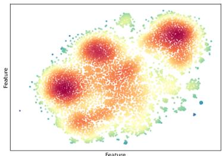  
(f) PDACL (Gowalla)  
Figure 4: Visualization of user embeddings on Amazon-Book and Gowalla.

4) Compared with various variants, PDACL demonstrates the optimal recommendation performance. This highlights that the combination of structure perturbation and weight perturbation can overcome their respective shortcomings by complementing each other and effectively enhance the accuracy of the recommendations.

## 3.4 Impact of Data Sparsity Levels

To further validate that PDACL can alleviate the sparsity of interaction data, we group users based on the number of interactions they have had, and the smaller the number, the higher the sparsity level of the data. We compare the recommendation performance of PDACL, SGL and LightGCN across different sparsity levels, and plot the performance improvement line of PDACL compared to SGL. The experimental results are shown in Figure 3.

It can be observed from the experimental results that the performance of SGL and PDACL on all groups is significantly better than LightGCN without CL. This observation effectively demonstrates that CL can alleviate the data sparsity problem in recommender systems. Furthermore, PDACL is able to achieve the best recommender performance across all groups of data with different degrees of sparsity, and it achieves a substantial performance improvement over both LightGCN and SGL. The most significant performance improvement of PDACL is observed in the Amazon-Book dataset at 35–40, and the smallest improvement is noted in the Gowalla dataset at 50– 60, while the differences in the other groups are not very significant. These results indicate that PDACL improves the recommendation performance of sparse items more significantly than popular items, which to some extent suggests that PDACL is more effective in alleviating the problem of data sparsity in recommender systems.

## 3.5 Visualizing the Distribution of Representations

To visually demonstrate the impact of CL, t-SNE (Maaten and Hinton, 2008) is employed to visualize the distribution of user representation embeddings derived from LightGCN, SGL and PDACL, as illustrated in Figure 4.

From Figure 4, it can be observed that the representation embeddings generated by LightGCN show a clear tendency of aggregation when they are mapped to a two-dimensional space. This aggregation phenomenon implies that many embeddings are very similar to each other, thus making it difficult for nodes to be distinguished from each other. The embeddings of SGL and PDACL have a relatively more uniform distribution, and accordingly obtain a better recommendation performance. It can be found that a more uniform representation embeddings distribution enable the model to have a stronger ability to model different user preferences or item characteristics. Optimizing the CL loss can be seen as an implicit way of debiasing, since a more uniform distribution of representations preserves the intrinsic properties of the nodes and improves the generalization ability.

## 4 Conclusion

In this paper, we propose Perturbation-driven Dual Auxiliary Contrastive Learning for Collaborative Filtering Recommendation (PDACL). PDACL perturbs the user-item interaction graph to construct a Structure Perturbation Augmentation (SPA) graph and a Weight Perturbation Augmentation (WPA) graph. The SPA graph extracts rich self-supervised signals, while the WPA graph addresses the issue of losing key information in the SPA graph. The two data augmentation graphs are combined with the useritem interaction graph to construct the dual auxiliary contrastive learning task to extract the self-supervised signals and jointly optimize it with the supervised recommendation task, to alleviate the data sparsity problem and improve the performance. Experimental results show that the proposed PDACL can achieve better recommendation performance on public datasets compared to several advanced benchmark models.

## Limitations of the Work

The most appropriate temperature coefficient of PDACL tends to be different for different datasets, and usually temperature coefficients in the range of (0.2,1) yield good recommended performance.

## Acknowledgement

This work was supported by the National Natural Science Foundation of China (Nos. 62077038, 61672405, 62176196 and 62271374).

## References

Rianne van den Berg, Thomas N. Kipf, and Max Welling. 2018. Graph convolutional matrix

completion. In KDD Deep Learning Day, pages 1- 7.

Xuheng Cai, Chao Huang, Lianghao Xia, and Xubin Ren. 2023. LightGCL: Simple Yet Effective Graph Contrastive Learning for Recommendation. In the Eleventh International Conference on Learning Representations.

Lei Chen, Le Wu, Richang Hong, Kun Zhang, and Meng Wang. 2020. Revisiting graph based collaborative filtering: a linear residual graph convolutional network approach. In Proceedings of the Thirty-Fourth AAAI Conference on Artificial Intelligence, pages 27-34.

Gregory Ference, Mao Ye, and Wang-Chien Lee. 2013. Location recommendation for out-of-town users in location-based social networks. In Proceedings of the 22nd ACM International Conference on Information & Knowledge Management, pages 721- 726.

Chen Gao, Yu Zheng, Nian Li, Yinfeng Li, Yingrong Qin, Jinghua Piao, Yuhan Quan, Jianxin Chang, Depeng Jin, Xiangnan He, and Yong Li. 2023. A survey of graph neural networks for recommender systems: challenges, methods, and directions. ACM Transactions on Recommender Systems, 1(1): 1-51.

Kaiming He, Haoqi Fan, Yuxin Wu, Saining Xie, and Ross Girshick. 2020a. Momentum contrast for unsupervised visual representation learning. In Proceedings of the IEEE/CVF conference on computer vision and pattern recognition, pages 9729-9738.

Xiangnan He, Kuan Deng, Xiang Wang, Yan Li, YongDong Zhang, and Meng Wang. 2020b. LightGCN: Simplifying and powering graph convolution network for recommendation. In Proceedings of the 43rd International ACM SIGIR Conference on Research and Development in Information Retrieval, pages 639-648.

Xiangnan He, Lizi Liao, Hanwang Zhang, Liqiang Nie, Xia Hu, and Tat-Seng Chua. 2017. Neural collaborative filtering. In Proceedings of the 26th International Conference on World Wide Web, pages 173-182.

Laurens van der Maaten and Geoffrey Hinton. 2008. Visualizing data using t-SNE. Journal of Machine Learning Research, 9(86): 2579-2605.

Steffen Rendle, Christoph Freudenthaler, Zeno Gantner, and Lars Schmidt-Thieme. 2009. BPR: Bayesian personalized ranking from implicit feedback. In Proceedings of the Twenty-Fifth Conference on Uncertainty in Artificial Intelligence, pages 452-461.

G. Suganeshwari and S.P. Syed Ibrahim. 2016. A survey on collaborative filtering based recommendation system. In Proceedings of the 3rd international symposium on big data and cloud computing challenges, pages 503-518.

Yonglong Tian, Chen Sun, Ben Poole, Dilip Krishnan, Cordelia Schmid, and Phillip Isola. 2020. What makes for good views for contrastive learning? In Proceedings of the 34th International Conference on Neural Information Processing Systems, pages 6827-6839.

Xiang Wang, Xiangnan He, Meng Wang, Fuli Feng, and Tat-Seng Chua. 2019. Neural graph collaborative filtering. In Proceedings of the 42nd International ACM SIGIR Conference on Research and Development in Information Retrieval, pages 165-174.

Jiancan Wu, Xiang Wang, Fuli Feng, Xiangnan He, Liang Chen, Jianxun Lian, and Xing Xie. 2021. Self-supervised graph learning for recommendation. In Proceedings of the 44th International ACM SIGIR Conference on Research and Development in Information Retrieval, pages 726-735.

Le Wu, Xiangnan He, Xiang Wang, Kun Zhang, and Meng Wang. 2023. A survey on accuracy-oriented neural recommendation: from collaborative filtering to information-rich recommendation. IEEE Transactions on Knowledge and Data Engineering, 35(5): 4425-4445.

Shiwen Wu, Fei Sun, Wentao Zhang, Xu Xie, and Bin Cui. 2022. Graph neural networks in recommender systems: a survey. ACM Computing Surveys, 55(5): 1-37.

Lianghao Xia, Chao Huang, Yong Xu, Jiashu Zhao, Dawei Yin, and Jimmy Huang. 2022. Hypergraph contrastive collaborative filtering. In Proceedings of the 45th International ACM SIGIR Conference on Research and Development in Information Retrieval, pages 70-79.

Junliang Yu, Hongzhi Yin, Jundong Li, Qinyong Wang, Nguyen Quoc Viet Hung, and Xiangliang Zhang. 2021. Self-supervised multi-channel hypergraph convolutional network for social recommendation. In Proceedings of the Web Conference, pages 413- 424.

Junliang Yu, Hongzhi Yin, Xin Xia, Tong Chen, Lizhen Cui, and Quoc Viet Hung Nguyen. 2022. Are Graph Augmentations Necessary? Simple Graph Contrastive Learning for Recommendation. In Proceedings of the 45th International ACM SIGIR Conference on Research and Development in Information Retrieval, pages 1294-1303.

Guoshuai Zhao, Xueming Qian, and Xing Xie. 2016. User-service rating prediction by exploring social

users' rating behaviors. IEEE Transactions on Multimedia, 18(3): 496-506.

## A Additional Experiment

The experimental results are shown in Figure 5. This experiment investigates the effect of temperature coefficient  on the performance of the PDACL model in the contrastive learning task. Specifically, the comparison experiments are conducted on the two datasets, Amazon-Book and Gowalla, with the temperature coefficient set to {0.1,0.2,0.5,0.8,1.0,2.0,3.0}, and the changes in the performance of the PDACL model are recorded.

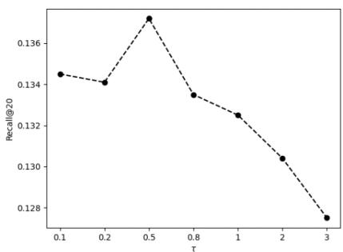  
(a) Recall on Amazon-Book

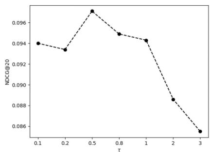  
(b) NDCG on Amazon-Book

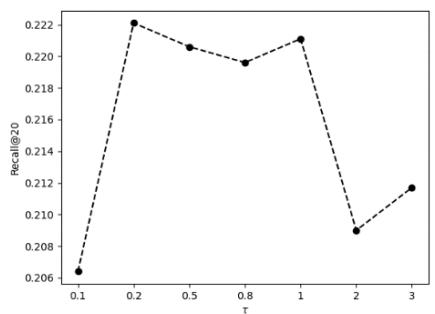  
(c) Recall on Gowalla

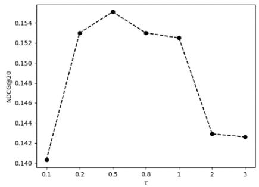  
(d) NDCG on Gowalla  
Figure 5: Experimental results for different temperature coefficients.

Observing the experimental results in Figure 5, the temperature coefficient  as a key parameter for contrastive learning can drastically affect the performance of the PDACL model. Too large will result in poor performance, the same as too small . The purpose of contrastive learning is to keep similar samples closer together in the feature space and keep dissimilar samples away from each other, so that the feature distribution can be made more uniform in the space. The temperature coefficient determines how much attention the contrastive loss pays to difficult negative samples. The larger the temperature coefficient, the more it tends to treat all samples equally and not pay too much attention to more difficult negative samples. The smaller the temperature coefficient, the more it pays attention to difficult negative samples that have a very large similarity to that sample, giving the difficult negative samples a larger gradient to separate from the positive samples.

The temperature parameter needs to be moderate, too large and too small are not good, which is consistent with experimental results from previous contrastive learning work. On the Amazon-Book dataset, the best Recall and NDCG are achieved with a temperature coefficient of 0.5. However, on the Gowalla dataset Recall and NDCG are best with the temperature coefficients of 0.2 and 0.5, respectively. The most appropriate temperature coefficient tends to be different for different datasets, and usually temperature coefficients in the range of (0.2,1) yield good recommended performance.