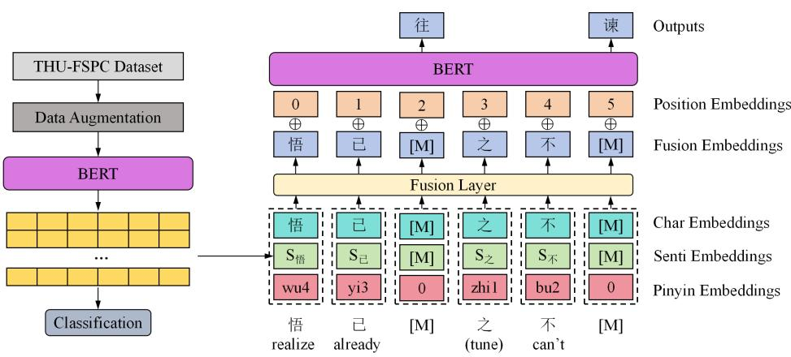
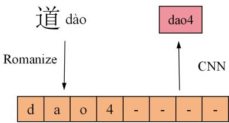
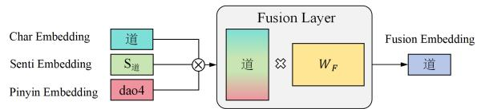
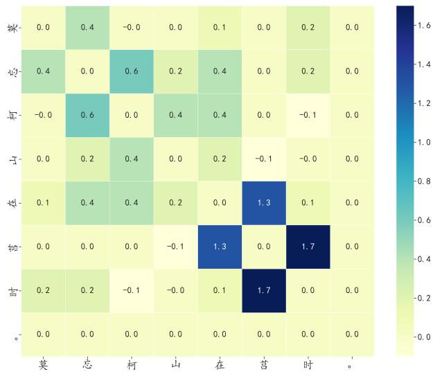
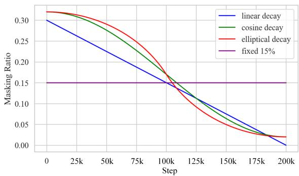

# PoemBERT: A Dynamic Masking Content and Ratio Based Semantic Language Model For Chinese Poem Generation

Chihan Huang1, Xiaobo Shen1

1Nanjing University of Science and Technology, Nanjing, China huangchihan@njust.edu.cn, njust.shenxiaobo@gmail.com

## Abstract

Ancient Chinese poetry stands as a crucial treasure in Chinese culture. To address the absence of pre-trained models for ancient poetry, we introduced PoemBERT, a BERT-based model utilizing a corpus of classical Chinese poetry. Recognizing the unique emotional depth and linguistic precision of poetry, we incorporated sentiment and pinyin embeddings into the model, enhancing its sensitivity to emotional information and addressing challenges posed by the phenomenon of multiple pronunciations for the same Chinese character. Additionally, we proposed Character Importance-based masking and dynamic masking strategies, significantly augmenting the model’s capability to extract imagery-related features and handle poetryspecific information. Fine-tuning our Poem-BERT model on various downstream tasks, including poem generation and sentiment classification, resulted in state-of-the-art performance in both automatic and manual evaluations. We provided explanations for the selection of the dynamic masking rate strategy and proposed a solution to the issue of a small dataset size.

## 1 Introduction

Chinese poetry, a cornerstone of cultural heritage, embodies centuries of history, literary sophistication, and emotional depth. Its unique rhythm, complex structure, and artistic essence make it an intriguing subject for linguistic exploration. Integrating Chinese poetry with computer science, especially natural language processing (NLP), not only furthers the digitization of classical literature but also explores its linguistic artistry.

However, the unique artistry and structural nuances of Chinese poetry present complex challenges for machine learning in creative applications. The use of rhyme, meter, and symbolic language, intertwined with nuanced emotions, introduces complexities that are unrivaled in other text forms. These challenges include:

(1) Rhythmic and structural intricacy: Chinese poetry adheres to strict rhythmic and structural rules, including specific syllable counts and word patterns. This necessitates models that can appreciate and reproduce the poetry’s prosodic qualities, adhere to its rhyming schemes, and understand the interplay of different sentence structures.

(2) Emotional subtlety: The emotional depth in Chinese poetry is often conveyed subtly through abstract rhetorical devices such as metaphors and allusions. Effective modeling requires not just recognizing these nuanced emotional differences but also inferring the deeper emotions hidden within the text.

Numerous scholars have explored the automated generation of poems, focusing on mastering poetic rules and forms. Despite these advancements, opportunities for enhancing the meaning and coherence of the generated poems persist. (Sun et al., 2023) developed an advanced long short-term memory (LSTM) network specifically for Chinese poetry, integrating a style dictionary to enhance quality. (Yang et al., 2019) used unsupervised machine translation techniques to convert vernacular into classical Chinese poetry, allowing for more semantic control. (Wu et al., 2009) employed a self-attention mechanism to enable the generation of poems with controllable emotions and styles via tag classification. Meanwhile, (Chen et al., 2019) introduced a semi-supervised conditional variational autoencoder that supports emotion control in poetry generation while ensuring diversity and quality. However, this method struggles with the intricacies of lexical and grammatical adherence during word-by-word generation, deviating from traditional poetic composition methods. In contrast, the Mask Language Model (MLM) appears more suitable for automatic poetry tasks due to its superior representation capabilities, transfer strengths, and comprehension abilities.

<table><tr><td>Masking strategy</td><td colspan="10">Example</td></tr><tr><td>FW (CH)</td><td>[M] 须</td><td>[M]</td><td>雪</td><td>三</td><td>分</td><td>[M]</td><td></td><td>雪雪</td><td></td><td>[M]</td><td>梅</td><td>一</td><td></td><td>[M]</td></tr><tr><td>NFW (CH)</td><td>梅</td><td>须 逊</td><td>雪</td><td>[M]</td><td>[M]</td><td>白</td><td></td><td>却 [M]</td><td>输</td><td>梅</td><td>[M]</td><td>段 段</td><td>否</td><td></td></tr><tr><td>FW (EN)</td><td>[M] is</td><td></td><td>probably</td><td>[M]</td><td>white</td><td>than</td><td>[M]</td><td>2</td><td>but</td><td>much</td><td>more</td><td>[M]</td><td></td><td></td></tr><tr><td>NFW (EN)</td><td>Plum is</td><td></td><td>[M]</td><td>less</td><td>white</td><td>than</td><td>snow</td><td>2</td><td>[M]</td><td>[M]</td><td>more</td><td></td><td>fragrant</td><td></td></tr></table>

Table 1: Comparison of masking functioning / non-functioning words in a sentence both in Chinese and English. It is intuitively easier to predict the masks masking non-functioning words than that masking functioning words. FW and NFW represent Functioning words and Non-functioning words respectively.

In the MLM approach, tokens are selectively masked in a sequence at a specified ratio, then input into a pre-trained language model which predicts the masked words. This method involves selecting tokens from extensive data to form training batches. Performance factors for MLM include the mask rate and content, where the mask rate ensures a balance between the predicted tokens and the context-too high a rate risks slow learning or poor convergence. The choice of mask content, especially later in training, is critical; masking overly simple information could impair effective learning. As shown in Table 1, predicting masked functional words poses greater challenges than non-functional ones, affecting the model’s learning efficacy. Thus, selecting optimal mask content is vital for maximizing learning efficiency.

Our major contributions can be summarized as follows: 1. We proposed a BERT-based model for four main ancient Chinese downstream tasks. With comprehensive evaluation and ablation, our PoemBERT reaches SOTA on all tasks. 2. Sentiment embedding and pinyin embedding which circumvents the constraints imposed by interwined morphemes are fused for better representation of Chinese characters. 3. We proposed Character Importance, which is a novel attempt, for adding intricate elemental information embedded in single Chinese character to generate highly informative masks. 4. We for the first time explained why early high and later low masking rate is better for model performance and generalization ability, and adopted dynamic masking rate, both automatic and human evaluation convey appealing results.

## 2 Relative Work

## 2.1 Automatic poem generation

Early automatic poetry generation focused on template-based methods and genetic algorithms to enhance grammatical rules and poetic form (Wu et al., 2009). Statistical machine translation (He et al., 2012) and text summarization methods (Yan et al., 2013) have been employed for more natural poems. Neural networks, including recurrent (Zhang and Lapata, 2014), bidirectional long short term memory (Wang et al., 2016), bidirectional gate recurrent unit (Yi et al., 2018), and stacked neural networks (Xing et al., 2018), have continuously improved poetry generation.

Utilizing an encoder-decoder framework, poetry generation encodes input sequences and uses decoders for output. Scholars have explored encoderdecoder structures, incorporating attention mechanisms (Zhang et al., 2017) and working memory mechanisms (Yi et al., 2017). Deep networks like generative adversarial networks (Yu et al., 2017) and conditional automatic variables (Yang et al., 2018) are also employed in poetry generation.

## 2.2 Selective masking strategy

Following (Devlin et al., 2019)’s introduction of the BERT model, mask language models faced challenges with random masks, resulting in overly simplistic masks and low training efficiency (Clark et al., 2020).

Scholars have explored the impact of masking ratio and content on MLM performance. (Joshi et al., 2020) proposed SpanBERT, masking words instead of tokens to avoid relying solely on local cues, but it performed poorly in knowledge-intensive poetry generation. Baidu ERINE (Zhang et al., 2019) employed an informed masking strategy, masking words with named entities together, but heavily relied on entity naming. LUKE (Yamada et al., 2020) explicitly labeled named entities in the pretrained corpus, while (Levine et al., 2021) proposed a PMI-based masking strategy, considering relevant spans but not named entities. (Peters et al., 2019)’s KnowBERT embedded knowledge bases into BERT, enhancing real-time memory. (Su et al., 2021)’s CokeBERT argued for dynamic knowledge contexts but faced limitations with expensive and language-specific knowledge bases. In contrast, PoemBERT, proposed in this paper, improves prosody, emotional expression, and image interpretation, making generated poems more coherent, expressive, and poetic.

  
Figure 1: The overview of PoemBERT model architecture. A BERT sentiment classifier is first trained to obtain the sentiment embeddings of each character. Thus, the fusion embeddings is consist of character embeddings, sentiment embeddings and pinyin embeddings, they are concatenated and mapped to the original dimension through a fully connected layer. ${ \bar { \cdot } } \ { \vec { z } } ^ { \dot { \bar { \cdot } } }$ in the sentence is a tune word without actual meaning.

## 3 Model Design

Figure 1 is the overview of the proposed Poem-BERT model architecture. It can be seen that our model is consist of two main steps: (1) Training a BERT sentiment classification model, thus obtaining the sentiment embeddings of each character. (2) For each character in a sentence, its character embeddings, sentiment embeddings and pinyin embeddings with dimension d are first concatenated to dimension 3d and then mapped to fusion embeddings with dimension d through a fully connected layer. Different embeddings, masking ratio and masking content selection strategy will be discussed in Section 3.1, 3.2 and 3.3 respectively.

## 3.1 Sentiment based PoemBERT

## 3.1.1 Sentiment embedding

Sentiment classification is crucial for detecting the emotional tone in text. In our study, we utilized BERT, a leading language model, to develop a robust sentiment classification tool. This model is adept at identifying sentiment polarity, allowing us to capture nuanced emotional details.

Constructed on the BERT framework, our sentiment classification model exploits contextualized embeddings to understand complex textual relationships. It processes a text sequence $X =$ $\{ x _ { 1 } , x _ { 2 } , \ldots , x _ { n } \}$ of length n. The output from the token [CLS] is used for classifying sentiment, and this output vector serves as the sentiment embedding. This embedding is then incorporated into the PoemBERT model to enrich the emotional depth of generated poetry.

## 3.1.2 Pinyin embedding

Pinyin is a writing system that uses Latin letters to represent the pronunciation of Chinese characters. It includes tone markings to differentiate phonetic contours, making it essential for language learning and input. In the realm of word representation learning, Pinyin embeddings are critical as they map each character to its phonetic form, helping to clarify the semantics of characters that appear identical.

Figure 2 outlines the Pinyin embedding process. We use a convolutional neural network (CNN) with a kernel width of 2 to model Pinyin sequences, capturing local phonetic patterns and extracting representations through max-pooling. To ensure consistent input to our model, Pinyin sequences are fixed at a length of 8. Shorter sequences are padded with the special character "-" to maintain uniformity, thereby enhancing computational efficiency and the generalization capability of the model.

## 3.1.3 Fusion embedding

Once we derive the d-dimensional sentiment embedding, pinyin embedding and character embedding of a character, we can directly concatenate them and get the 3d-dimensional concat\_embedding. Then pass the concat\_embedding through a fully connected layer and we obtain the d-dimensional fusion embedding. Afterwards, we add the fusion embedding and the position embedding, and feed it into the BERT model. Figure 3 illustrates a vivid process of fusion embedding.

  
Figure 2: The overview of pinyin embedding process. Take $\because \ Y _ { \mathrm { \vec { I } \vec { E } \vec { I } } } ,$ as an example, we first romanize the pinyin of it to derive a list of 8, then apply CNN with a width of 2 followed by max-pooling to obtain the pinyin embedding output.

  
Figure 3: The process of fusion layer. ⊗ represents concatenation, which means concatenate the character embedding, sentiment embedding and pinyin embedding together. × represents matrix multiplication, we multiple the concatenated matrix with the learnable parameter matrix $W _ { F }$ to derive fusion embedding.

## 3.2 Character Importance based masking

Since not all words are equally informative, Poem-Mask hopes to identify more of the most important words and increase the probability of them being masked. Due to the short and concise nature of Chinese poetry, there are not many stop words, but there are still some mood words that have no practical meaning. They are important for the structure of the verse, but are too predictable in the later stages of training.

(Barnard and Fano, 1961) proposed the concept of PMI, which quantifies the relevance between two words. The PMI of word x and word y is defined as follows.

$$
{ \mathrm { p m i } } \left( x , y \right) = \log { \frac { p \left( x , y \right) } { p \left( x \right) p \left( y \right) } }\tag{1}
$$

In order to generate highly informative sentence masking strategies, we introduce the concept of

Character Importance. It is a measurement of the correlation between the masked character and the unmasked characters, and is calculated by summing up the PMI value of the masked row. By masking larger probability for characters with larger Character Importance, the model is able to concentrate on the harder information and learn knowledge more efficiently. Take Figure 4 as an example, the PMI of characters ’莒’ with ’在’ and ’时’ are higher, indi- cating their high relevence. Therefore, if one word is to be masked, ’莒’ should pocess the highest possibility due to its highest Character Importance score.

  
Figure 4: The PMI matrix of the characters in the sen-tence ’莫忘柯山在莒时。’(Don’t forget the good times you had on Ju Mountain.)

However, dealing with the PMI matrix to identify the optimal k words for masking within a sentence of n words poses a significant resource and time burden. Exhaustively considering all potential scenarios has a time complexity of $O \left( C _ { n } ^ { k } \right)$ , which is impractical for many users. Moreover, there’s a risk of overfitting due to the model’s tendency to overlearn.

To alleviate this issue, we opted to streamline the model’s workload. After determining the number of masked words, we randomly select a set of 5 masking candidates and sort them based on the Character Importance score of the masked words. This reduces the model’s time complexity to O (kn) while significantly mitigating the risk of overfitting.

## 3.3 Dynamic masking rate

In this section, we will introduce dynamic masking ratio. In fact, there has been limited exploration of dynamically adjusting masking ratio along the temporal dimension in the past, with most approaches relying on a fixed masking ratio of 15% during training. However, this is probably not the case with the optimal mask strategy.

During the early stages of training the BERT model, the model has not yet effectively captured the intricate relationships between vocabulary and context. Employing a higher masking ratio encourages the model to more frequently attempt predicting missing vocabulary, thereby aiding the model in comprehensively understanding the context. The higher masking ratio introduces additional noise, compelling the model to learn more robust representations, consequently enhancing the model’s generalization capabilities.

In the later stages of training, the model has acquired richer contextual information and vocabulary relationships. Reducing the masking ratio helps diminish noise during training, allowing the model to focus more on genuine semantic learning. Simultaneously, since the [MASK] token is not present during fine-tuning, lowering the masking ratio assists in more authentically simulating the model’s input conditions in actual tasks.

Therefore, we propose a gradual reduction of the masking rate during training. We have explored three different dynamic masking strategies: linear decay, cosine decay and elliptical decay. Assuming a typical fixed masking rate of $p ,$ we initiate the decrease from a masking rate of $2 p .$ The formulas for the three strategies are as follows:

$$
{ \mathcal { M } } _ { \mathrm { l i n e a r } } \left( t \right) = \left( 1 - { \frac { t } { T } } \right) \cdot 2 p\tag{2}
$$

$$
{ \mathcal { M } } _ { \mathrm { c o s i n e } } \left( t \right) = \left( 1 + \cos \left( { \frac { \pi } { T } } t \right) \right) \cdot p + 0 . 0 2\tag{3}
$$

$$
\mathcal { M } _ { \mathrm { e l l } } \left( t \right) = \left\{ \begin{array} { l l } { 2 p \sqrt { 1 - \frac { 3 } { T ^ { 2 } } t ^ { 2 } } , } & { 0 \leq t \leq \frac { T } { 2 } } \\ { 2 p \left( 1 - \sqrt { 1 - \frac { 3 } { T ^ { 2 } } ( T - t ) ^ { 2 } } \right) , } & { \frac { T } { 2 } \leq t \leq T } \end{array} \right.\tag{4}
$$

The visualizations of the three aforementioned functions are shown in Figure 5. In the cosine decay and elliptical decay functions, the addition of 0.02 is intended to ensure that the masking ratio does not approach zero too closely during the final stages of training, allowing the model to continue learning knowledge.

  
Figure 5: Masking ratio decay function visualization when $p = 1 5 \%$

## 4 Experiments

In this section, we will first elaborate on the pretraining details of PoemBERT, followed by an introduction to the task objectives, datasets, parameter configurations, baselines, and metrics for each downstream task.

## 4.1 PoemBERT pre-training

The pre-training dataset used is the chinese-poetry dataset1, a JSON-formatted collection of classical Chinese literature that includes 55,000 Tang poems, 260,000 Song poems, 21,000 Song lyrics, and other classical works. It covers approximately 14,000 poets from the Tang and Song dynasties and 1,500 lyricists from the Song period.

For sentiment classification BERT training, the Fine-grained Sentimental Poetry Corpus (FSPC) (Chen et al., 2019) was utilized, which is a manually-labeled corpus categorizing poems and their lines into five sentiment classes: negative, implicit negative, neutral, implicit positive, and positive.

PoemBERT adopts the BERT architecture, employing a multi-layer Transformer (Vaswani et al., 2017) with 12 layers, a hidden size of 768, and 12 attention heads. Training parameters include a maximum sentence length of 512, the AdamW (Loshchilov and Hutter, 2019) optimizer with a learning rate of 5e-6, a weight decay of 0.01, and a total of 220k iterations. We adopted a dynamic masking ratio of 15%, aligned with standard BERT practices. Due to high computational costs, the model was initialized with the pre-trained weights from bert-base-chinese2. The pypinyin package3 was used for generating pinyin sequences. Experiments were carried out on an RTX 4080 GPU over 30 hours.

## 4.2 PoemBERT fine-tuning

## 4.2.1 Poem generation (PG)

We adapt the pre-trained PoemBERT model to generate classical Chinese poetry, focusing on the THU Chinese Classical Poetry Corpus4 (Guo et al., 2019). This dataset comprises classical Chinese poetry from the Sui dynasty (A.D. 581) to the Ming dynasty (A.D. 1644), partitioned into training, testing, and validation subsets.

Employing a Transformer-based decoder, our model generates text conditioned on encoderhidden representations through multi-head attention. Training aims to minimize the negative loglikelihood of text generation, using a batch size of 4. We utilize the AdamW optimizer with a learning rate of 1e-5, $\beta _ { 1 }$ of 0.9, $\beta _ { 2 }$ of 0.999, weight decay of 0.01, and a dropout rate of 0.15. The epoch delivering the best performance on the test set is chosen.

Given poetry’s unique linguistic and artistic nature, we conducted evaluations using both BLEU scores for automatic evaluation (Papineni et al., 2002) and manual assessment. Five experts were invited to rate the generated poems based on consistency, fluency, meaningfulness, and poetic qualities (Li et al., 2018), using a scale of 1 to 5 for each aspect, ranging from poor to excellent.

## 4.2.2 Poem-modern Chinese translation (PMCT)

For ancient poetry translation, we selected a dataset comprising ancient poems alongside modern translations5. This task aims to render ancient poetry into a style closely resembling modern prose. The dataset, scraped from the Ancient Poetry and Prose website6, encompasses detailed information on 73,281 ancient poems and 3,156 poets, including era, translation, appreciation, and genre.

Fine-tuning parameters are identical to those outlined in Section 4.2.1. Evaluation metrics for poemmodern Chinese translation include BLEU scores and cosine similarity. Cosine similarity measures the angle between two vectors, commonly used to assess similarity in a multi-dimensional space. It ranges from -1 to 1, where 1 indicates complete similarity, -1 denotes complete dissimilarity, and 0 signifies no similarity between vectors.

## 4.2.3 Sentiment classification (SC)

We fine-tuned our model for sentiment classification using the Fine-grained Sentimental Poetry Corpus (FSPC) (Chen et al., 2019), following the process outlined in Section 4.1. To augment the Chinese textual data, we utilized nlpcda7, applying random synonym replacement, paraphrase substitution, and character deletion techniques. This augmentation expanded the dataset to 90k instances.

Fine-tuning parameters remained consistent with those in Section 4.2.1. Evaluation for poem matching employed the $F _ { 1 }$ score metric.

## 4.2.4 Theme classification (TC)

We fine-tune our model for poetry theme classification using the Theme Classification Dataset for Chinese Classical Poetry (TCCP)8. This task involves predicting the literary theme of a given poem. TCCP comprises 3.2k quatrains of classical Chinese poetry, each with a title, keywords, and a labeled theme (e.g., nature, nostalgia, etc.).

Fine-tuning parameters remain consistent with those outlined in Section 4.2.1. The evaluation metric for poem theme classification is accuracy.

## 5 Results

The experimental results will be elaborated upon in detail below. We evaluate our model comparing with Transformer (Vaswani et al., 2017), BERTbase (Devlin et al., 2019), QA-MLM (Deng et al., 2020), AnchiBERT (Tian et al., 2021), SA-Model (Lingli et al., 2022), ERINE (Zhang et al., 2019), mT5 (Xue et al., 2021), GPT4 (OpenAI et al., 2024), LLaMa (Touvron et al., 2023) and Chat-GLM (GLM et al., 2024). In general, PoemBERT outperforms other methods across various tasks, achieving SOTA performance in almost all evaluated tasks.

## 5.1 Fine-tuning results

## 5.1.1 Poem Generation

We’ve divided the poetry generation task into two distinct sub-tasks to thoroughly assess the model’s capabilities. The first task involves generating three lines of poetry based on a given initial line (1 → 3), evaluating the model’s ability to generate from a single input. The second task requires the model to generate the next two lines based on the preceding two lines $( 2  2 )$ , emphasizing a more contextual and interdependent approach to poetry composition.

<table><tr><td rowspan="2">Task</td><td rowspan="2">Model</td><td colspan="2">Automatic evaluation</td><td colspan="2">Human evaluation</td><td colspan="2"></td></tr><tr><td>BLUE-4</td><td>Sim.</td><td>Con.</td><td>Flu.</td><td>Mea.</td><td>Poe.</td></tr><tr><td rowspan="7">1 → 3</td><td>BERT-base</td><td>21.63</td><td>0.413</td><td>1.87</td><td>2.44</td><td>1.26</td><td>1.45</td></tr><tr><td>AnchiBERT</td><td>22.10</td><td>0.477</td><td>2.47</td><td>2.91</td><td>2.03</td><td>2.17</td></tr><tr><td>QA-MLM</td><td>22.87</td><td>0.502</td><td>2.88</td><td>2.96</td><td>2.46</td><td>2.50</td></tr><tr><td>mT5</td><td>22.92</td><td>0.508</td><td>2.91</td><td>3.10</td><td>2.53</td><td>2.52</td></tr><tr><td>LLaMa</td><td>23.42</td><td>0.523</td><td>2.97</td><td>3.22</td><td>2.67</td><td>2.56</td></tr><tr><td>GPT4</td><td>23.44</td><td>0.521</td><td>2.99</td><td>3.25</td><td>2.68</td><td>2.55</td></tr><tr><td>ChatGLM PoemBERT</td><td>23.85 24.91</td><td>0.542</td><td>3.09 3.17</td><td>3.39 3.53</td><td>2.79 2.96</td><td>2.61 2.68</td></tr><tr><td></td><td></td><td></td><td>0.569</td><td></td><td></td><td></td><td></td></tr><tr><td rowspan="7">2 → 2</td><td>BERT-base</td><td>29.82</td><td>0.507</td><td>2.07</td><td>2.23</td><td>1.99</td><td>1.83</td></tr><tr><td>AnchiBERT</td><td>30.08</td><td>0.558</td><td>2.54</td><td>2.97</td><td>2.45</td><td>2.62</td></tr><tr><td>QA-MLM</td><td>31.34</td><td>0.642</td><td>2.67</td><td>3.01</td><td>2.53</td><td>2.89</td></tr><tr><td>mT5</td><td>31.42</td><td>0.654</td><td>2.59</td><td>3.30</td><td>2.54</td><td>2.88</td></tr><tr><td>LLaMa</td><td>31.93 32.05</td><td>0.661</td><td>2.82</td><td>3.26</td><td>2.67</td><td>2.94</td></tr><tr><td>GPT4</td><td></td><td>0.672</td><td>2.92 3.10</td><td>3.24 3.41</td><td>2.83 2.84</td><td>2.87</td></tr><tr><td>ChatGLM</td><td>32.97</td><td>0.701</td><td></td><td>3.68</td><td></td><td>3.12</td></tr><tr><td></td><td>PoemBERT</td><td>33.47</td><td>0.717</td><td>3.35</td><td></td><td>3.22</td><td>3.45</td></tr></table>

Table 2: Results on poem generation task. Sim. in $1  3$ represents the cosine similarity between the first line and the subsequent three lines of the poem, while $2  2$ denotes the cosine similarity between the first two lines and the latter two lines of the poem. Con., Flu., Mea., and Poe. respectively stand for Consistency, Fluency, Meaningfulness, and Poeticness, which are the four metrics evaluated through human assessment.

Table 2 showcases the performance of various models on the poem generation task, with our PoemBERT achieving state-of-the-art results. The cosine similarity metric is employed to automatically gauge poem coherence. PoemBERT demonstrates SOTA performance in both automatic and human evaluations. While it marginally surpasses other models in BLEU-4 scores, PoemBERT consistently earns nearly perfect ratings on all four criteria in human evaluations, presenting a significant advantage over other models. This underscores the importance of subtle changes in classical Chinese poetry generation, where a few character alterations can greatly impact the entire poem.

## 5.1.2 Poem-modern chinese translation

Table 3 presents the results of various models on the poetry theme classification task, and our PoemBERT yields a state-of-the-art performance. In terms of BLEU-4 scores, PoemBERT achieved a score of 22.76, surpassing ChatGLM and GPT4 by 0.11 and 0.24, respectively. Regarding cosine similarity, PoemBERT attained a value of 0.672, outperforming ChatGLM and GPT4 by 0.023 and 0.055, respectively. These results demonstrate that PoemBERT excels not only in classical Chinese po-

etry datasets but also outperforms baseline models in certain classical Chinese text translation tasks.
<table><tr><td>Model</td><td>BLEU-4</td><td>Sim.</td></tr><tr><td>Transformer</td><td>18.33</td><td>0.445</td></tr><tr><td>BERT-base</td><td>21.45</td><td>0.497</td></tr><tr><td>GPT2</td><td>21.60</td><td>0.489</td></tr><tr><td>mT5</td><td>21.97</td><td>0.523</td></tr><tr><td>LLaMa</td><td>22.13</td><td>0.562</td></tr><tr><td>GPT4</td><td>22.52</td><td>0.617</td></tr><tr><td>ChatGLM</td><td>22.65</td><td>0.649</td></tr><tr><td>PoemBERT</td><td>22.76</td><td>0.672</td></tr></table>

Table 3: Results on poem-modern chinese translation task. Here Sim. represents the cosine similarity between poem and modern chinese.

## 5.1.3 Sentiment classification

Table 4 presents the results of various models on the poetry sentiment classification task, and our PoemBERT achieves 87.76% of $F _ { 1 }$ score, which is a state-of-the-art performance. As shown in the table, without data augmentation, PoemBERT has already achieved a $F _ { 1 }$ score of 65.74%, surpassing Chat-GLM, SA-Model and ERINE by 1.73%, 2.16%, and 2.86%, respectively. After data augmentation, PoemBERT’s $F _ { 1 }$ score increased to 84.24%, a substantial improvement of 18.50%. This reflects the limitations of the original dataset in terms of small sample size and lack of diversity, and our data augmentation effectively expanded the dataset, introducing more diversity.

<table><tr><td>Model</td><td>F11%</td></tr><tr><td>BERT-base</td><td>43.49</td></tr><tr><td>mT5</td><td>55.81</td></tr><tr><td>LLaMa</td><td>57.33</td></tr><tr><td>GPT4</td><td>60.29</td></tr><tr><td>ERNIE</td><td>62.88</td></tr><tr><td>SA-Model</td><td>63.58</td></tr><tr><td>ChatGLM</td><td>64.01</td></tr><tr><td>PoemBERT</td><td>65.74</td></tr><tr><td>PoemBERT+Data augmentation</td><td>84.24</td></tr></table>

Table 4: Results on sentiment classification task.

## 5.1.4 Theme classification

Table 5 presents the results of various models on the poetry theme classification task, and our PoemBERT achieves 86.36% of accuracy, which is a state-of-the-art performance. PoemBERT outperforms ChatGLM by 2.41% in accuracy and surpasses AnchiBERT by 4.06%. Given the relatively small size of the dataset for this task, it is noteworthy that the substantial impact of pinyin and sentiment embeddings in our pretraining process is evident in our model.

<table><tr><td>Model</td><td>Accuracy/%</td></tr><tr><td>Transformer</td><td>61.33</td></tr><tr><td>GPT2</td><td>68.42</td></tr><tr><td>BERT-base</td><td>75.31</td></tr><tr><td>mT5</td><td>76.16</td></tr><tr><td>LLaMa</td><td>78.54</td></tr><tr><td>GPT4</td><td>80.48</td></tr><tr><td>AnchiBERT</td><td>82.30</td></tr><tr><td>ChatGLM</td><td>83.95</td></tr><tr><td>PoemBERT</td><td>86.36</td></tr></table>

Table 5: Results on theme classification task.

## 5.2 Ablation study

The impact of different components is shown in Table 6, which conveys the effectiveness of all proposed modules. For each downstream task, we select one representative metric for evaluation. In poem generation,poem-modern chinese translation, sentiment classification and theme classification task, we respectively select BLEU-4, cosine similarity, F1 score and accuracy as evaluation metrics. As depicted in Table 6, all module contributes to the promotion of model performance.

## 5.3 Dynamic masking ratio comparison

In PoemBERT, we implemented a dynamic masking approach, aiming to explore the impact of masking rates on model performance, particularly considering the utilization of Pinyin embeddings and sentiment embeddings.

<table><tr><td colspan="4">Module</td><td colspan="4">Downstream tasks</td></tr><tr><td>SE</td><td>PE</td><td>CI</td><td>DMR|</td><td>PG</td><td>PMCT SC</td><td></td><td>TC</td></tr><tr><td>√</td><td></td><td></td><td></td><td>30.19</td><td>0.513</td><td>78.76</td><td>80.24</td></tr><tr><td></td><td>√</td><td></td><td></td><td>30.34</td><td>0.545</td><td>79.30</td><td>80.66</td></tr><tr><td>√</td><td>√</td><td></td><td></td><td>31.37</td><td>0.570</td><td>80.56</td><td>82.19</td></tr><tr><td>√</td><td>√</td><td></td><td>√</td><td>31.98</td><td>0.622</td><td>87.78</td><td>83.35</td></tr><tr><td>√</td><td>√</td><td>√</td><td></td><td>32.04</td><td>0.634</td><td>81.89</td><td>83.47</td></tr><tr><td>√</td><td>√</td><td>√</td><td>√</td><td>33.47</td><td>0.672</td><td>84.24</td><td>86.36</td></tr></table>

Table 6: The ablation study of PoemBERT. Here SE, PE, CI, DMR represent sentiment embedding, pinyin embedding, character importance and dynamic masking rate respectively. ✓ represents adopting this module.

Table 7 showcases the effects of fixed 15% masking, linear decay, cosine decay, and elliptical decay on downstream task performance. Notably, employing any dynamic masking strategy results in performance improvement across tasks. Moreover, the comparison highlights elliptical decay as the most beneficial approach, emphasizing the importance of higher masking rates for effective semantic feature extraction early in training, and lower rates for capturing finer details later on.

<table><tr><td></td><td colspan="3">Downstream tasks</td><td></td></tr><tr><td>Decay</td><td>PG</td><td>PMCT</td><td>SC</td><td>TC</td></tr><tr><td>15%</td><td>32.04</td><td>0.634</td><td>81.89</td><td>83.47</td></tr><tr><td>Linear</td><td>32.17</td><td>0.642</td><td>82.03</td><td>83.82</td></tr><tr><td>Cosine</td><td>32.96</td><td>0.661</td><td>83.48</td><td>85.35</td></tr><tr><td>Elliptical</td><td>33.47</td><td>0.672</td><td>84.24</td><td>86.36</td></tr></table>

Table 7: Results on different dynamic masking ratio. The evaluation metrics are the same as Table 6.

## 5.4 Case study

Table 8 presents some selected samples of poem generation in the format (2 → 2). The first ex-ample has the initial two lines as 空有丹心贯碧 霄，泮冰亡国不崇朝。 The output generated by PoemBERT for the subsequent two lines is 孤臣 泣血心无悔，历数皇家几代秋。Theterm孤臣 emphasizes the poet’s loneliness and helplessness, while 泣血 symbolizes profound sorrow, expressing the poet’s deep grief over the nation’s decline. 心无悔 conveys the poet’s unwavering loyalty, in- dicating that despite facing such adversity, he has no regrets about his devotion. 历数 suggests a process of reflection, and 皇家几代秋 summarizes the poet’s feelings about the rise and fall of dynasties, implying that the poet has witnessed the cyclical nature of imperial transitions, thereby heightening the historical poignancy of the verse.

<table><tr><td>first two lines</td><td>空有丹心贯碧霄，泮冰亡国不崇朝。 (Yet the frozen waters of Pan&#x27;s fall do not honor the dawn of a lost kingdom.)</td><td>新烟着柳禁垣斜，杏酪分香俗共夸。 (While the scent of apricot cream spreads, its fragrance hailed by all as a common delight.)</td></tr><tr><td>ground truth</td><td>小臣万死无遗慨，曾见天家十八朝。 (The humble servant would face death a thousand times without regret, having the city&#x27;s walls, while on Qingming, once witnessed the reigns of eighteen im- perial dynasties under the heavenly fam-</td><td>白下有山皆绕郭，清明无客不思家。 (Mountains surround Baixia, encircling no traveler passes without yearning for home.)</td></tr><tr><td>GPT4</td><td>ily.) 苍生无路哭苍天，泪尽江南水不流。 (The people have no way, crying to the sky, their tears are exhausted, and the wa- ter of Jiangnan does not flow.)</td><td>绿水青山多秀丽，清明时节思还家。 (The green waters and mountains are so beautiful, and during the Qingming festi-</td></tr><tr><td>LLaMa</td><td>微臣有幸观盛世，目睹皇家数载光。 (I, a humble servant, am lucky to witness the prosperous era and see the royal glory for several years.)</td><td>val, I long to return home.) 白云山峦绕古城，清明时节思故情。 (The white clouds and mountains sur- round the ancient city, and during the Qingming festival, I miss the old feel-</td></tr><tr><td>AnchiBERT</td><td>万家有母无人识，曾向天家几度朝。 (Thousands of families have mothers, but no one knows; I have bowed to the heav- ens many times.)</td><td>ings.) 翠峦环抱古城幽，清明梦断思还家。 (Green mountains surround the ancient city in peace, and during Qingming, my dreams break, longing to return home.)</td></tr><tr><td>PoemBERT</td><td>孤臣泣血心无悔，历数皇家几代秋。 (The lonely minister weeps blood, his heart unrepentant, counting the autumns of several imperial generations.)</td><td>翠巘环郭云气绕，清明怀远思无涯。 (Verdant peaks encircle the city, their mist and clouds entwining, and on Qingming distant thoughts of longing stretch end- lessly.)</td></tr></table>

Table 8: Examples of poem generation (2 → 2)

The second example has the initial two lines as 新烟着柳禁垣斜，杏酪分香俗共夸。 Poem- BERT generates the following two lines as 翠巘 环郭云气绕，清明怀远思无涯。 In this case, the output offers a more delicate portrayal of the natural scenery, complementing the imagery of 新 烟着柳 with further nuanced descriptions. Mean- while, 思无涯 expresses the poet’s deep longing for distant relatives during the Qingming Festival, evoking a sense of profound and enduring emotion.

## 6 Conclusion

In this paper, we introduce PoemBERT, a BERTbased training approach leveraging a corpus of Chinese classical poetry. PoemBERT ingeniously incorporates sentiment and pinyin embeddings, applying both Character Importance masking and dynamic masking rate strategies. Evaluated through automatic and manual metrics, PoemBERT exhibits excellent performance across tasks such as poem generation, poem-modern Chinese translation, sentiment classification, and theme classification. While achieving superior performance, we address the limited data size issue in the FSPC dataset through data augmentation, resulting in a nearly 20% improvement in $F _ { 1 }$ scores compared to prior works. We also provide an explanation for the larger masking rates in the early training stages and smaller rates in the later stages.

## Limitations

While PoemBERT has achieved SOTA on many downstream tasks, we believe further experimentation is warranted. Also we have only experimented with the base-sized PoemBERT; future investigations will explore larger-sized PoemBERT models.

## Acknowledgments

This work was supported by the National Natural Science Foundation of China under Grant No. 62472226, 62176126, the Natural Science Foundation of Jiangsu Province, China under Grant No. BK20230095.

## References

George A. Barnard and Robert Mario Fano. 1961. Transmission of information: A statistical theory of communications. Journal of the Royal Statistical Society, 125:645.

Huimin Chen, Xiaoyuan Yi, Maosong Sun, Wenhao Li, Cheng Yang, and Zhipeng Guo. 2019. Sentimentcontrollable chinese poetry generation. In International Joint Conference on Artificial Intelligence, pages 4925 – 4931.

Kevin Clark, Minh-Thang Luong, Quoc V. Le, and Christopher D. Manning. 2020. ELECTRA: pretraining text encoders as discriminators rather than generators. In International Conference on Learning Representations.

Liming Deng et al. 2020. An iterative polishing framework based on quality aware masked language model for chinese poetry generation. In AAAI Conference on Artificial Intelligence, volume 34, pages 7643– 7650.

Jacob Devlin, Ming-Wei Chang, Kenton Lee, and Kristina Toutanova. 2019. BERT: Pre-training of deep bidirectional transformers for language understanding. In Conference ofthe North American Chapter ofthe Associationfor Computational Linguistics: Human Language Technologies, Volume 1 (Long and Short Papers), pages 4171 – 4186.

Team GLM et al. 2024. Chatglm: A family of large language models from glm-130b to glm-4 all tools. Preprint, arXiv:2406.12793.

Zhipeng Guo et al. 2019. Jiuge: A human-machine collaborative Chinese classical poetry generation system. In Annual Meeting ofthe Associationfor Computational Linguistics: System Demonstrations, pages 25 – 30.

Jing He, Ming Zhou, and Long Jiang. 2012. Generating chinese classical poems with statistical machine translation models. In AAAI Conference on Artificial Intelligence, pages 1650 – 1656.

Mandar Joshi et al. 2020. SpanBERT: Improving pretraining by representing and predicting spans. Transactions ofthe Associationfor Computational Linguistics, 8:64 – 77.

Yoav Levine et al. 2021. Pmi-masking: Principled masking of correlated spans. In International Conference on Learning Representations.

Juntao Li et al. 2018. Generating classical Chinese poems via conditional variational autoencoder and adversarial training. In Conference on Empirical Methods in Natural Language Processing, pages 3890 – 3900.

Zhang Lingli, Wu Yadong, Chu Qikai, Li Pan, Wang Guijuan, Zhang Weihan, Qiu Yu, and Li Yi. 2022. Samodel: Multi-feature fusion poetic sentiment analysis based on a hybrid word vector model. In International Conference on Pattern Recognition and Artificial Intelligence, pages 984 – 988.

Ilya Loshchilov and Frank Hutter. 2019. Decoupled weight decay regularization. In International Conference on Learning Representations.

OpenAI et al. 2024. Gpt-4 technical report. Preprint, arXiv:2303.08774.

Kishore Papineni, Salim Roukos, Todd Ward, and Wei-Jing Zhu. 2002. Bleu: A method for automatic evaluation of machine translation. In Annual Meeting on Associationfor Computational Linguistics, pages 311–318.

Matthew E. Peters et al. 2019. Knowledge enhanced contextual word representations. In Conference on Empirical Methods in Natural Language Processing and International Joint Conference on Natural Language Processing, pages 43 – 54.

Yusheng Su, Xu Han, Zhengyan Zhang, Yankai Lin, Peng Li, Zhiyuan Liu, Jie Zhou, and Maosong Sun. 2021. Cokebert: Contextual knowledge selection and embedding towards enhanced pre-trained language models. AI Open, 2:127 – 134.

Zhuofan Sun, Zhengyuan Zhang, and Mingxuan Zhang. 2023. Bilstm personalised-style poetry generation algorithm. In IEEEInternational Conference on Power, Electronics and Computer Applications, pages 836 – 840.

Huishuang Tian, Kexin Yang, Dayiheng Liu, and Jiancheng Lv. 2021. Anchibert: A pre-trained model for ancient chinese language understanding and generation. In International Joint Conference on Neural Networks, pages 1–8.

Hugo Touvron et al. 2023. Llama: Open and efficient foundation language models. Preprint, arXiv:2302.13971.

Ashish Vaswani et al. 2017. Attention is all you need. In International Conference on Neural Information Processing Systems, pages 6000 – 6010.

Qixin Wang, Tianyi Luo, and Dong Wang. 2016. Can machine generate traditional chinese poetry? a feigenbaum test. Advances in Brain Inspired Cognitive Systems, pages 34 – 46.

Xiaofeng Wu, Naoko Tosa, and Ryohei Nakatsu. 2009. New hitch haiku: An interactive renku poem composition supporting tool applied for sightseeing navigation system. In International Conference on Entertainment Computing, pages 191 – 196.

Shuo Xing, Xueliang Liu, Richang Hong, and Ye Zhao. 2018. Generating chinese poems from images based on neural network. Advances in Multimedia Information Processing – PCM 2017, pages 545 – 554.

Linting Xue et al. 2021. mT5: A massively multilingual pre-trained text-to-text transformer. In Conference of the North American Chapter of the Association for Computational Linguistics: Human Language Technologies, pages 483 – 498.

Ikuya Yamada, Akari Asai, Hiroyuki Shindo, Hideaki Takeda, and Yuji Matsumoto. 2020. LUKE: Deep contextualized entity representations with entity aware self-attention. In Conference on Empirical Methods in Natural Language Processing, pages 6442 – 6454.

Rui Yan, Han Jiang, Mirella Lapata, Shou-De Lin, Xueqiang Lv, and Xiaoming Li. 2013. I, poet: Automatic chinese poetry composition through a generative summarization framework under constrained optimization. In International Joint Conference on Artificial Intelligence, pages 2197 – 2203.

Xiaopeng Yang, Xiaowen Lin, Shunda Suo, and Ming Li. 2018. Generating thematic chinese poetry using conditional variational autoencoders with hybrid decoders. In International Joint Conference on Artificial Intelligence, pages 4539 – 4545.

Zhichao Yang et al. 2019. Generating classical Chinese poems from vernacular Chinese. In Conference on Empirical Methods in Natural Language Processing and International Joint Conference on Natural Language Processing, pages 6155 – 6164.

Xiaoyuan Yi, Ruoyu Li, and Maosong Sun. 2017. Generating chinese classical poems with rnn encoderdecoder. In Chinese Computational Linguistics and Natural Language Processing Based on Naturally Annotated Big Data, pages 211 – 223.

Xiaoyuan Yi, Ruoyu Li, and Maosong Sun. 2018. Chinese poetry generation with a salient-clue mechanism. In Conference on Computational Natural Language Learning, pages 241 – 250.

Lantao Yu, Weinan Zhang, Jun Wang, and Yong Yu. 2017. Seqgan: Sequence generative adversarial nets with policy gradient. In AAAI Conference on Artificial Intelligence, pages 2852 – 2858.

Jiyuan Zhang et al. 2017. Flexible and creative Chinese poetry generation using neural memory. In Annual Meeting ofthe Associationfor Computational Linguistics (Volume 1: Long Papers), pages 1364 – 1373.

Xingxing Zhang and Mirella Lapata. 2014. Chinese poetry generation with recurrent neural networks. In Conference on Empirical Methods in Natural Language Processing, pages 670 – 680.

Zhengyan Zhang, Xu Han, Zhiyuan Liu, Xin Jiang, Maosong Sun, and Qun Liu. 2019. ERNIE: Enhanced language representation with informative entities. In Annual Meeting of the Association for Computational Linguistics, pages 1441 – 1451.