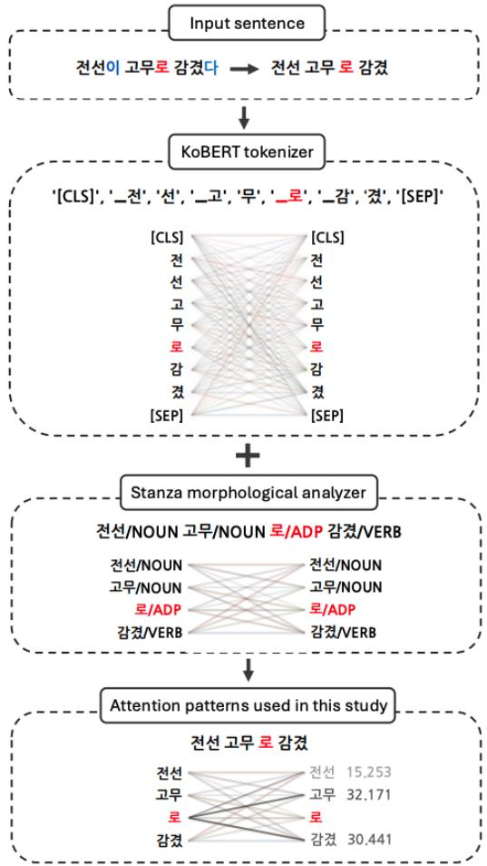
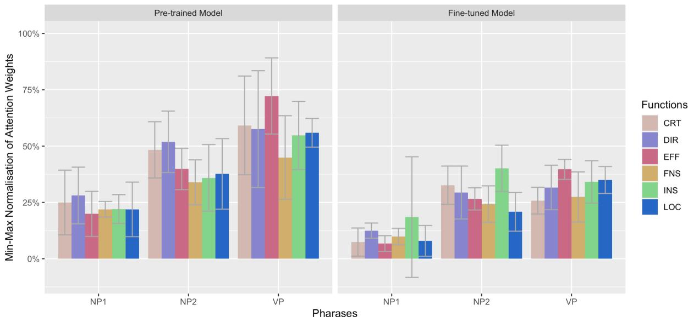

# Polysemy Interpretation and Transformer Language Models: A Case of Korean Adverbial Postposition -(u)lo

Seongmin Mun Humanities Research Institute Ajou University Suwon-si, Gyeonggi-do, South Korea stat34@ajou.ac.kr

## Abstract

This study examines how Transformer language models utilise lexico-phrasal information to interpret the polysemy of the Korean adverbial postposition -(u)lo. We analysed the attention weights of both a Korean pre-trained BERT model and a fine-tuned version. Results show a general reduction in attention weights following fine-tuning, alongside changes in the lexico-phrasal information used, depending on the specific function of -(u)lo. These findings suggest that, while fine-tuning broadly affects a model’s syntactic sensitivity, it may also alter its capacity to leverage lexico-phrasal features according to the function of the target word.

Gyu-Ho Shin   
Department of Linguistics   
University of Illinois Chicago   
Chicago, IL, USA   
ghshin@uic.edu

## 1 Introduction

Langacker (2002) critiques the traditional view that ‘case’ pertains solely to a structure lacking any semantic content. He argues that, despite varying degrees of abstractness, functional morphemes such as case particles also carry meanings. This is also found in Korean, a Subject-Object-Verb language with overt case-marking via dedicated particles (i.e., bound morphemes that add grammatical meaning/function to the content words to which they are attached; Sohn, 1999). The semantics of Korean case particles depends on the context in which they occur, and these particles often involve many-to-many mappings between form and meaning/function (Choo and Kwak, 2008). For example, the adverbial postposition -(u)lo (-ulo after a consonant), which is the focus of the present study, is interpreted with six major functions: criterion (CRT), direction (DIR), effector (EFF), final state (FNS), instrument (INS), and location (LOC) (Mun and Desagulier, 2022; Shin, 2008). (1) exemplifies the use of -(u)lo as INS within a sentence.

(1) 전선이 고무로 감겼다. censen-i komwu-lo kam-ki-ess-ta. wire-NOM rubber-INS wind-PSV-PST-DECL ‘The wire was wound in/with rubber.

Several studies have performed automatic analyses of this postposition (e.g., Bae et al., 2020a,b; Hong et al., 2020), reporting strong model performance in addressing its polysemous nature using transformer language models, as measured by F-scores ranging from 0.776 (Park et al., 2019) to 0.856 (Bae et al., 2020a). However, the exact reasons for the superior performance of transformers compared to other architectures remain somewhat unclear (Puccetti et al., 2021; Yun et al., 2021).

To address the performance of transformer language models, recent studies have increasingly focused on analysing the models’ attention weights (i.e., The higher the attention weight exchanged between one word token and another, the greater the syntax-sensitive behaviour between them; Clark et al., 2019; Kovaleva et al., 2019; Vig, 2019) and comparing the patterns with human language behaviours (Hawkins et al., 2020; Ryu and Lewis, 2021; Timkey and Linzen, 2023). For example, Ryu and Lewis (2021) examined whether information from preceding reflexive pronouns or verbs is more critical for a model’s assessment of the grammaticality of English sentences. The results of the study indicate that the surprisal value of the verb or reflexive pronoun affects subject-verb and reflexive pronoun agreement processing and that the Transformer model is influenced by distractors when processing such constructions. Hawkins et al. (2020) investigated whether language models attention weights are influenced by token information in English double-object versus prepositional dative sentences, particularly when the sentence interpretation varies depending on the verb. The findings indicate that larger models are more effective in understanding sentence meaning. For transformer language models, comprehension accuracy increases after processing the initial verb and its associated noun but declines when handling subsequent nouns.

While there is substantial research on understanding transformer language models through attention weights in English, little is known as to the role of attention weights in interpreting polysemy in languages that are underrepresented in the field and typologically different from English. In this study, we turn our attention to Korean, an understudied language for this purpose, with a special focus on the relationship between a BERT model’s attention weights and its polysemy interpretation of the adverbial postposition -(u)lo, which is frequently used and documented in the previous literature (e.g., Cho and Kim, 1996; Nam, 1993; Park, 1999). For a better demonstration of model performance, we also designed an attention distribution tailored for Korean, inspired by Vig (2019), and applied it to our analysis.

## 2 Methods

## 2.1 Data and Model Creation

Previous research on the various functions of this postposition often employed a specific clausal composition [NP1 NP2 -(u)lo VP] (Jeong, 2010), as in (2). In the given sentence, pemi-i serves as NP1, kolmok as NP2, and talan-ass-ta is used as the VP. We adhered to this basic structure by extracting a total of 60 sentences (10 instances for each of 6 functions) from a corpus developed in Mun and Desagulier (2022). We then manually reviewed these instances and made additional adjustments to ensure that all sentences maintained a nearly consistent structure.

## (2) 범인이 골목으로 달아났다.pemin-i kolmok-ulo talana-ss-ta.criminal-NOM alley-DIR flee-PST-DECL‘The criminal fled into the alley.’

To observe the attention weights for the input sentences, we employed a BERT-based pre-trained model – KoBERT (Jeon et al., 2019)1 – and finetuned it by using the corpus tagged with the functions of the target postposition -(u)lo as released in Mun and Desagulier (2022). The model was trained on function tags to capture the six major functions of the target postposition. During the training phase, we set the parameters in the following way, as advised by previous studies (e.g., McCormick, 2019; Mun and Desagulier, 2022; Vázquez et al., 2020; Wu et al., 2019): batch size (16), epoch (30), seed (42), sequence length (256), epsilon (0.00000008), and learning rate (0.0001).

## 2.2 NP/VP Treatment and Attention Transformation

The attention weights in a transformer language model generally consist of 12 heads and 12 layers, with attention matrices generated based on tokens segmented by each model’s tokeniser. Since the KoBERT tokeniser used in this study employs a syllable-based WordPiece algorithm for Korean, a sentence is not always split perfectly based on whitespace. Therefore, this study applied an improved method illustrated in Figure 1 to better obtain the attention outputs such as Vig (2019) while maintaining the structure of [NP1 NP2 -(u)lo VP] in the attention weights.

  
Figure 1: NP/VP treatment and attention transformation (example (1)).

First, we manually modified the structure of the input sentences while retaining the base form [NP1 NP2 -(u)lo VP] by removing the case marker from the first noun and the final ending of the verb. Next, we tokenised the input sentences using both the

<table><tr><td>Factor</td><td></td><td> $\overline { { \beta } }$ </td><td>SE</td><td>|T|</td><td>p</td></tr><tr><td rowspan="4">NP1</td><td>(Intercept)</td><td>0.168</td><td>0.012</td><td>13.009</td><td>&lt; 0.001***</td></tr><tr><td>Model</td><td>-0.126</td><td>0.014</td><td>8.474</td><td>&lt; 0.001***</td></tr><tr><td>Function</td><td>-0.001</td><td>0.006</td><td>0.163</td><td>0.871</td></tr><tr><td>Model × Function</td><td>0.015</td><td>0.008</td><td>1.802</td><td>0.076</td></tr><tr><td rowspan="4">NP2</td><td>(Intercept)</td><td>0.353</td><td>0.013</td><td>27.111</td><td>&lt; 0.001***</td></tr><tr><td>Model</td><td>-0.122</td><td>0.015</td><td>7.822</td><td>&lt; 0.001***</td></tr><tr><td>Function</td><td>-0.017</td><td>0.007</td><td>2.223</td><td>0.030*</td></tr><tr><td>Model × Function</td><td>0.022</td><td>0.009</td><td>2.426</td><td>0.018*</td></tr><tr><td rowspan="4">VP</td><td>(Intercept)</td><td>0.454</td><td>0.016</td><td>27.182</td><td>&lt; 0.001***</td></tr><tr><td>Model</td><td>-0.251</td><td>0.018</td><td>13.874</td><td>&lt; 0.001* ***</td></tr><tr><td>Function</td><td>-0.002</td><td>0.009</td><td>0.270</td><td>0.787</td></tr><tr><td>Model × Function</td><td>0.026</td><td>0.010</td><td>2.513</td><td>0.014*</td></tr></table>

Table 1: Model outputs (by phrase). ∗ < 0.05; ∗∗∗ < 0.001

KoBERT tokeniser and the Stanza morphological analyser (Qi et al., 2020). The tokenisation results from KoBERT were then concatenated to align with the morphological analysis from Stanza, and the information from each concatenated token was summed to produce a single set of attention weights. Finally, to derive a representative value for the attention weights indicating how -(u)lo interacts with surrounding morphemes, the attention weights across all 144 values (i.e., 12 heads \* 12 layers) were summed. This method was applied to both the pre-trained KoBERT model (which was not fine-tuned on the corpus specifying the functions of -(u)lo) and the fine-tuned model (trained on the corpus specifying the functions of -(u)lo), resulting in 60 analysed attention weights per model.

## 3 Results: Two Case Studies

Figure 2 presents the attention weights (standardised via min-max normalisation) exchanged between -(u)lo and surrounding morphemes in a sentence. Visual inspection of the figure reveals two major findings. First, the attention weights exchanged between -(u)lo and its surrounding morphemes were higher in the pre-trained model compared to the fine-tuned model. Second, in the pretrained model, the attention weights increased sequentially across the morphemes (i.e., NP1 < NP2 < VP) for all functions of -(u)lo. In contrast, while the fine-tuned model exhibited similar increasing attention weights for most functions, the weights for the functions involving CRT and INS decreased from NP2 to VP.

Based on these visual trends, we conducted two specific case studies to examine how transformer models interpret -(u)lo and identify which pharase is crucial for resolving its polysemy.

## 3.1 Do Attention Weights Differ Between the Pre-trained and Fine-tuned Models in Interpreting -(u)lo’s Polysemy?

We conducted linear mixed-effects modelling (fixed effects: Model, Function; random effects: Morpheme-in-phrase; maximal random-effects structure allowed by the model (Barr et al., 2013)). As Table 1 shows, there was a main effect of Model in all the phrases, indicating that the attention weights differed between the pre-trained model and the fine-tuned model in interpreting the polysemy of -(u)lo. We also found a main effect of Function and an interaction effect between the two factors in NP2, and an interaction effect between the two factors in VP. Post-hoc analysis (using emmeans; S. R. Searle and Milliken, 1980) revealed that the difference occurred in the CRT model $( p < . O O I )$

<table><tr><td></td><td>Factor</td><td>β</td><td>SE</td><td>|T|</td><td>p</td></tr><tr><td rowspan="4">Pre-trained Model</td><td>(Intercept)</td><td>0.410</td><td>0.011</td><td>36.930</td><td>&lt; 0.001***</td></tr><tr><td>Phrase</td><td>0.176</td><td>0.013</td><td>12.867</td><td>&lt; 0.001***</td></tr><tr><td>Function</td><td>-0.013</td><td>0.005</td><td>2.309</td><td>0.022*</td></tr><tr><td>Phrase × Function</td><td>0.008</td><td>0.006</td><td>1.324</td><td>0.188</td></tr><tr><td rowspan="4">Fine-tuned Model</td><td>(Intercept)</td><td>0.243</td><td>0.008</td><td>28.151</td><td>&lt; 0.001 1***</td></tr><tr><td>Phrase</td><td>0.110</td><td>0.010</td><td>10.371</td><td>&lt; 0.001***</td></tr><tr><td>Function</td><td>-0.001</td><td>0.004</td><td>0.381</td><td>0.704</td></tr><tr><td>Phrase × Function</td><td>0.004</td><td>0.004</td><td>0.999</td><td>0.322</td></tr></table>

Table 2: Model outputs (by model). ∗ < 0.05; ∗∗∗ < 0.001

  
Figure 2: Results: attention weights (standardised via min-max normalisation) that -(u)lo exchanged between -(u)lo and its surrounding morphemes in a sentence. X-axis = phrases used in the sentence; Y-axis = attention weights. Bar = standard deviation.

The results reveal two key aspects regarding model performance. First, the morphosyntactic sensitivity of -(u)lo to surrounding morphemes was higher in the pre-trained model compared to the fine-tuned model. This suggests that -(u)lo exhibited greater overall syntactic sensitivity in the pretrained model, particularly in the -(u)lo-VP dependency. Second, the notable differences between the two models in CRT implies that the syntactic sensitivity of -(u)lo as a CRT marker may have changed substantially with fine-tuning, given our training and simulation environments.

## 3.2 Do the Attention Weights Exchanged Between -(u)lo and Its Surrounding Morphemes Vary Depending on the Phrases?

Table 2 shows the outputs of another linear mixedeffects modeling (fixed effects: Phrase, Function; random effects: Morpheme-in-phrase; maximal random-effects structure allowed by the model (Barr et al., 2013)) to compare the attention weights across all the phrases within each model.

We found a main effect of Phrase in both models, indicating that -(u)lo interacted with NP1, NP2, and VP by exchanging different attention weights with each phrase. In addition, there was a main effect of Function in the pre-trained model, indicating that the attention weights for -(u)lo varied depending on its function. However, this effect disappeared after fine-tuning, indicating that the finetuning procedure altered the syntactic sensitivity of -(u)lo, leading to more even distribution of attention weights across all phrases.

The high attention weights between -(u)lo and the VP in Figure 2 suggest that the interaction strength with the VP can vary depending on the semantic function. For example, different attention weights when -(u)lo serves as a marker for DIR versus INS indicate that the model has learned appropriate syntactic binding between -(u)lo and the VP based on each function. These differences in function-specific attention distribution show that KoBERT effectively distinguishes the contextual meanings of polysemous words, providing key insights into how the model interprets polysemy.

Based on Clark et al. (2019) arguing that BERT’s attention weights reflect the degree of syntactic relationships between a word and its surrounding words, the overall reduction in attention weights after fine-tuning in our simulations suggests that the model adjusted the interaction strength with units involved in interpreting the functions of postpositions. This is further supported by the statistical model outputs – the fine-tuned model did not exhibit a main effect of Function. When specific syntactic relationships are unnecessary for a given task, attention weights may become non-operational, thereby minimising the model’s focus on less crucial information and enhancing performance efficiency. During fine-tuning, KoBERT likely learnt to interpret the various functions of postpositions uniformly by leveraging broader contextual information and selectively retaining critical information only when necessary. Therefore, the reduction in attention weights points to an adjustment in syntactic sensitivity, facilitating more effective recognition of each function.

## 4 Concluding Remarks

In this on-going project, we report three major findings. First, the attention weights exchanged for interpreting the polysemy of the Korean adverbial postposition -(u)lo generally decreased as the language model underwent fine-tuning. Second, with fine-tuning, the attention weights exchanged for this postposition varied according to its function in different phrases. Third, the differences in attention weights across the three phrases was mitigated as the language model was fine-tuned. We continue to extend this study by incorporating other metrics such as surprisal and entropy to further examine the models’ interpretability of -(u)lo in relation to the lexico-phrasal units surrounding this postposition. We also plan to enhance the test set by increasing the number of sentences per function to ensure more robust findings.

## Limitations

The current study identifies several areas for further investigation. One area involves the reliance on a fixed set of syntactic units, which does not encompass the comprehensive range of constructions using -(u)lo. The current study focused on three units — NP1, NP2, and VP — surrounding the target postposition during fine-tuning and model evaluation. Although we presented outcomes related to NP1 through visualisation and statistical modelling, we acknowledge that our scope in this respect is somewhat limited. In future research, we plan to broaden our analysis to include diverse linguistic units and structural compositions that may influence a computational model’s interpretation of this postposition. Exploring other BERTbased language models, such as DistilBERT (Sanh et al., 2019), RoBERTa (Liu et al., 2019), and ELECTRA (Clark et al., 2020), may also provide a more comprehensive evaluation of Transformer language models for this task. Finally, incorporating additional evaluation metrics, such as performance on real-world language tasks and comparisons between model performance and human judgement, could offer a more thorough assessment of the model’s capabilities of interpreting polysemy in human language.

## Supplementary Materials

All data and models are available in this repository. All contributions in this proceeding are licensed under the Creative Commons Attribution-Non-Commercial 4.0 International License (CC-BY-NC 4.0).

## Acknowledgments

This work was supported by the Ministry of Education of the Republic of Korea and the National Research Foundation of Korea (NRF-2022S1A5C2A02090368).

## References

Jangseong Bae, Changki Lee, Junho Lim, and Hyunki Kim. 2020a. Bert-based data augmentation techniques for korean semantic role labeling. pages 335– 337.

Jangseong Bae, Changki Lee, Soojong Lim, and Hyunki Kim. 2020b. Korean semantic role labeling with bert. The Korean Institute of Information Scientists and Engineers, 47(11):1021–1026.

Dale J. Barr, Roger Levy, Christoph Scheepers, and Harry J. Tily. 2013. Random effects structure for confirmatory hypothesis testing: Keep it maximal. Journal of Memory and Language, 68(3):255–278.

Jeong-mi Cho and Gil-cheng Kim. 1996. A study on the resolving of the ambiguity while interpretation of meaning in korean. The Korean Institute ofInformation Scientists and Engineers, 14(7):71–83.

Miho Choo and Hye-young Kwak. 2008. Using Korean. Cambridge University Press, New York, NY.

Kevin Clark, Urvashi Khandelwal, Omer Levy, and Christopher D. Manning. 2019. What does BERT look at? an analysis of BERT’s attention. In Proceedings ofthe 2019 ACL Workshop BlackboxNLP: Analyzing and Interpreting Neural Networksfor NLP,

pages 276–286, Florence, Italy. Association for Computational Linguistics.

Kevin Clark, Minh-Thang Luong, Quoc V Le, and Christopher D Manning. 2020. Electra: Pre-training text encoders as discriminators rather than generators. In Proceedings of the International Conference on Learning Representations (ICLR).

Robert Hawkins, Takateru Yamakoshi, Thomas Griffiths, and Adele Goldberg. 2020. Investigating representations of verb bias in neural language models. In Proceedings ofthe 2020 Conference on Empirical Methods in Natural Language Processing (EMNLP), pages 4653–4663, Online. Association for Computational Linguistics.

Seung-Yean Hong, Seung-Hoon Na, Jong-Hoon Shin, and Young-kil Kim. 2020. Roberta and stack pointer network for korean semantic role labeling. The Korean Institute of Information Scientists and Engineers, pages 362–364.

Heewon Jeon, Donggeon Lee, and Jangwon Park. 2019. Korean bert pre-trained cased (kobert).

Byong-cheol Jeong. 2010. An integrated study on the particle ‘-lo’ based on the simulation model. The Society OfKorean Semantics, 32:215–243.

Olga Kovaleva, Alexey Romanov, Anna Rogers, and Anna Rumshisky. 2019. Revealing the dark secrets of BERT. In Proceedings ofthe 2019 Conference on Empirical Methods in Natural Language Processing and the 9th International Joint Conference on Natu ral Language Processing (EMNLP-IJCNLP), pages 4365–4374, Hong Kong, China. Association for Computational Linguistics.

Ronald W. Langacker. 2002. Concept, Image, and Symbol: The Cognitive Basis ofGrammar. De Gruyter Mouton, Berlin, New York.

Y. Liu, M. Ott, N. Goyal, J. Du, M. Joshi, D. Chen, O. Levy, M. Lewis, L. Zettlemoyer, and V. Stoyanov. 2019. Roberta: A robustly optimized bert pretraining approach. arXiv preprint.

Chris McCormick. 2019. Bert fine-tuning tutorial with pytorch.

Seongmin Mun and Guillaume Desagulier. 2022. How do transformer-architecture models address polysemy of Korean adverbial postpositions? In Proceedings of Deep Learning Inside Out (DeeLIO 2022): The 3rd Workshop on Knowledge Extraction and Integrationfor Deep Learning Architectures, pages 11–21, Dublin, Ireland and Online. Association for Computational Linguistics.

Ki-sim Nam. 1993. The use of the korean postposition: focus on ‘-ey’ and ‘-(u)lo’. sekwang hakswul calyosa.

Chanmin Park, Yeongjoon Park, Youngjoong Ko, and Jungyun Seo. 2019. Semantic role labeling using the korean elmo embedding. The Korean Institute

ofInformation Scientists and Engineers, pages 608– 610.

Jeong-woon Park. 1999. A polysemy network of the korean instrumental case. Korean Journal ofLinguistics, 24(3):405–425.

Giovanni Puccetti, Alessio Miaschi, and Felice Dell’Orletta. 2021. How do BERT embeddings organize linguistic knowledge? In Proceedings of Deep Learning Inside Out (DeeLIO): The 2nd Workshop on Knowledge Extraction and Integration for Deep Learning Architectures, pages 48–57, Online. Association for Computational Linguistics.

Peng Qi, Yuhao Zhang, Yuhui Zhang, Jason Bolton, and Christopher D. Manning. 2020. Stanza: A python natural language processing toolkit for many human languages. In Proceedings ofthe 58th Annual Meeting ofthe Associationfor Computational Linguistics: System Demonstrations, pages 101–108, Online. Association for Computational Linguistics.

Soo Hyun Ryu and Richard Lewis. 2021. Accounting for agreement phenomena in sentence comprehension with transformer language models: Effects of similarity-based interference on surprisal and attention. In Proceedings ofthe Workshop on Cognitive Modeling and Computational Linguistics, pages 61– 71, Online. Association for Computational Linguistics.

F. M. Speed S. R. Searle and G. A. Milliken. 1980. Population marginal means in the linear model: An alternative to least squares means. The American Statistician, 34(4):216–221.

Victor Sanh, Lysandre Debut, Julien Chaumond, and Thomas Wolf. 2019. Distilbert, a distilled version of bert: Smaller, faster, cheaper and lighter. arXiv preprint.

Hyo-pil Shin. 2008. The 21st sejong project : with a focus on selk (sejong electronic lexicon of korean) and the knc (korean national corpus). In In The 3rd International Joint Conference on Natural Langauge Processing.

Ho-Min Sohn. 1999. The korean language. CambridgeUniversity Press, Cambridge, UK.

William Timkey and Tal Linzen. 2023. A language model with limited memory capacity captures interference in human sentence processing. In Findings ofthe Associationfor Computational Linguistics: EMNLP 2023, pages 8705–8720, Singapore. Association for Computational Linguistics.

Raúl Vázquez, Alessandro Raganato, Mathias Creutz, and Jörg Tiedemann. 2020. A systematic study of inner-attention-based sentence representations in multilingual neural machine translation. Computational Linguistics, 46(2):387–424.

Jesse Vig. 2019. A multiscale visualization of attention in the transformer model. In Proceedings of the 57th Annual Meeting of the Association for Computational Linguistics: System Demonstrations, pages 37– 42, Florence, Italy. Association for Computational Linguistics.

Yu Wu, Wei Wu, Chen Xing, Can Xu, Zhoujun Li, and Ming Zhou. 2019. A sequential matching framework for multi-turn response selection in retrieval-based chatbots. Computational Linguistics, 45(1):163–197.

Zeyu Yun, Yubei Chen, Bruno Olshausen, and Yann Le-Cun. 2021. Transformer visualization via dictionary learning: contextualized embedding as a linear superposition of transformer factors. In Proceedings of Deep Learning Inside Out (DeeLIO): The 2nd Workshop on Knowledge Extraction and Integration for Deep Learning Architectures, pages 1–10, Online. Association for Computational Linguistics.