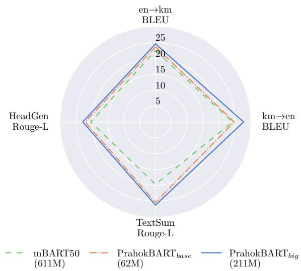
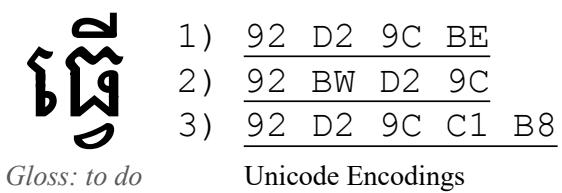

# PrahokBART: A Pre-trained Sequence-to-Sequence Model for Khmer Natural Language Generation

Hour Kaing, Raj Dabre, Haiyue Song,

Van-Hien Tran, Hideki Tanaka, Masao Utiyama,

National Institute of Information and Communications Technology, Kyoto, Japan {hour\_kaing, raj.dabre, haiyue.song}@nict.go.jp {tran.vanhien, hideki.tanaka, mutiyama}@nict.go.jp : https://github.com/hour/prahokbart : https://huggingface.co/prajdabre/prahokbart

## Abstract

This work introduces PrahokBART, a compact pre-trained sequence-to-sequence model trained from scratch for Khmer using carefully curated Khmer and English corpora. We focus on improving the pre-training corpus quality and addressing the linguistic issues of Khmer, which are ignored in existing multilingual models, by incorporating linguistic components such as word segmentation and normalization. We evaluate PrahokBART on three generative tasks: machine translation, text summarization, and headline generation, where our results demonstrate that it outperforms mBART50, a strong multilingual pre-trained model. Additionally, our analysis provides insights into the impact of each linguistic module and evaluates how effectively our model handles space during text generation, which is crucial for the naturalness of texts in Khmer.

## 1 Introduction

Pre-trained sequence-to-sequence (PS2S) models have been proven to be data-efficient and effective in enhancing performance across various natural language generation (NLG) tasks, including machine translation, text summarization (Lewis et al., 2020), and headline generation (Sarti and Nissim, 2024). These models are typically pretrained on extensive raw text corpora using denoising objectives and fine-tuned on task-specific data, as seen with models like BART (Lewis et al., 2020). Recently, many PS2S models have been developed as multilingual, with models like mBART50 (Tang et al., 2020) and mT5 (Xue et al., 2021) being trained on over fifty languages simultaneously. Such multilingual PS2S models have been particularly advantageous for low-resource languages (LRLs), as they can leverage linguistic similarities with high-resource languages (HRLs) (Dabre et al., 2020). Improvements in LRLs are often observed when they share linguistic features with

  
Figure 1: Overall performance of PrahokBART across tasks.

HRLs, such as similar syntax (Ahmad et al., 2019), overlapping vocabularies (Patil et al., 2022), and code-switching (Pires et al., 2019).

Despite the advantages of multilingual PS2S models, they face significant challenges due to the need for vast model parameters to accommodate a large and linguistically diverse corpus. This often leads to the under-representation of languages with scarce resources or unique linguistic features, such as distinctive writing systems. To address these issues, researchers have developed language-specific (Eddine et al., 2021; Tran et al., 2022; Araujo et al., 2024) and language group-specific (Dabre et al., 2022; Reid et al., 2021) PS2S models, which are smaller and offer higher performance in downstream tasks compared to their multilingual counterparts. However, many low-resource languages, particularly those with unique writing systems and minimal vocabulary overlap with other languages, like Khmer, still lack these specialized models.

Research on NLG for the Khmer language is scarce and predominantly limited to multilingual studies (Tang et al., 2020; Xue et al., 2021; Costajussà et al., 2022; Palen-Michel and Lignos, 2023). While these studies have made significant strides, they often overlook the linguistic challenges posed by Khmer, such as the absence of word boundaries (Buoy et al., 2021; Kaing et al., 2021), encoding ambiguities (Hosken et al., 2022), and linguistic roles of spaces. Although there is no standard way or requirement of spacing in Khmer texts, native speakers commonly use them between phrases or sentences, as a comma, or just for readability, which make texts more natural. Let’s denote such spaces as functional spaces. All these issues are frequently ignored due to the reliance on languageagnostic techniques such as the SentencePiece subword tokenizer which treats all characters indiscriminately, which are not tailored to the specific needs of Khmer. This raises critical questions: 1) do linguistic modules like word segmentation and normalization still hold value in PS2Sfor Khmer? 2) how well do the current models generate functional spaces?

This work addresses the aforementioned issues by introducing a language-specific PS2S model for the Khmer language, PrahokBART,12 in combination with linguistic modules such as normalization and word segmentation. Normalization ensures consistency and uniformity in the texts, making the corpus more predictable for the model to learn from. Word segmentation, applied before subword tokenization, ensures that the resulting subword tokens are more linguistically motivated and meaningful units. Additionally, our word segmentation module preserves functional spaces, treating them as individual tokens to enhance model learnability (Gow-Smith et al., 2022). Essentially, our model trained on carefully curated Khmer and English corpora is more compact and computationally efficient compared to its multilingual counterpart, mBART50. We evaluate PrahokBART on three generative tasks: machine translation, text summarization, and headline generation. Our experiments demonstrate that PrahokBART outperforms other models across all tasks as in Figure 1.

Our analysis highlights the essential role each module plays in enhancing the performance of our model. Additionally, a thorough evaluation of the functional spaces generated by our model, compared to baseline systems, demonstrates that our approach produces these functional spaces with superior quality and accuracy. By addressing these linguistic nuances, our model becomes a more effective PS2S model, adeptly managing the complexities of the Khmer language.

Our key contributions are as follows:

• We introduce PrahokBART, the first compact PS2S model specifically designed for the Khmer language, incorporating essential linguistic modules such as normalization and word segmentation.

• We evaluate our model on three generative tasks—machine translation, text summarization, and headline generation—and demonstrate that it outperforms the multilingual mBART50 model in terms of efficiency and generation quality measured by BLEU, ChrF, and Rouge-L.

• We analyze the impact of each linguistic module and assess the quality of the functional spaces generated by our model. Our findings indicate that word segmentation and normalization are crucial for PS2S models, particularly for languages with characteristics similar to Khmer.

## 2 Related Works

Pre-trained Models: Pre-trained models have revolutionized the field of natural language processing (NLP). Devlin et al. (2019) introduced BERT, an encoder-only model designed for natural language understanding (NLU). Although decoder-only models, such as GPT (Adelani et al., 2022) and other recent large models that support Khmer (Touvron et al., 2023; Nguyen et al., 2024), perform well across various natural language generation (NLG) tasks, encoder-decoder models, despite being more compact, have been proven to be the most effective for NLG (Radford et al., 2019; Tay et al., 2023). Notable state-of-the-art models in this category include BART (Lewis et al., 2020) and T5 (Raffel et al., 2020). These models have been further extended to multilingual settings, with examples such as mBERT (Devlin et al., 2019), XLM-R (Conneau et al., 2020), mBART50 (Tang et al., 2020) and mT5 (Xue et al., 2021), benefiting many languages simultaneously including Khmer.

Language-Specific Pre-trained Models: Research has also focused on pre-trained models tailored to specific languages or language groups. For natural language understanding (NLU), there are models designed for French (Martin et al., 2020), Vietnamese (Nguyen and Nguyen, 2020), Indian (Kakwani et al., 2020), and others. For natural language generation (NLG), many models exist for French (Eddine et al., 2021), Vietnamese (Tran et al., 2022), Spanish (Araujo et al., 2024), Indonesian (Cahyawijaya et al., 2021), African (Ogundepo et al., 2022; Adelani et al., 2022; Meyer et al., 2024), Indian (Dabre et al., 2022; J et al., 2024), and many more. Notably, models for Indonesian, African, and Indian languages are multilingual but are designed for specific language groups. Jiang et al. (2021) pre-trained a BERT model for Khmer, and evaluated the model on NLU tasks such as POS tagging and document classification. To the best of our knowledge, there is no work on NLG pre-trained models specified for Khmer.

Language-Specific NLG Benchmarks: There are NLG benchmarks for specific languages such as Indian (Kumar et al., 2022; Dixit et al., 2023), Indonesian (Cahyawijaya et al., 2021), French (Eddine et al., 2021), Vietnamese (Tran et al., 2022), and many African languages (Adebara et al., 2024; Adelani et al., 2022; Meyer et al., 2024). However, there is no formal NLG benchmark for Khmer, and the datasets accumulated in this paper could be used as a benchmark.

## 3 PrahokBART

We now describe the design behind PrahokBART.

## 3.1 Data Curation

Data Sources: We collect pre-training data in Khmer and English from two public sources: Common Crawl (CC) and Wikimedia (Wiki). We include English data in our pre-training process because Khmer texts often contain English words in their original Latin script form, primarily proper nouns. For Khmer data, we utilize CC data from mC4 (Raffel et al., 2020) and WMT2020 (Loïc et al., 2020), and extracte high-quality Khmer content from Wikipedia and Wikibooks.3 For English, we use CC data from mC4. Given that English data is much more abundant than Khmer data, we sample a portion that is five times larger than the Khmer data to balance the datasets. Additionally, the combined data includes both documentlevel and sentence-level content, particularly for Khmer, because the WMT2020 monolingual corpus is sentence-based. The reason we retain the English data at a size five times larger than the Khmer data is due to the scarcity of high-quality Khmer data for pre-training. Including more English data helps to better generalize the model during pretraining. Similarly, the mix of document-level and sentence-level data, particularly for Khmer, is maintained for the same reason: to maximize the available data and enhance the robustness of the model.

Data Cleaning: This step aims to minimize noisy texts that could negatively impact the learning capability of pre-trained models. It involves normalization, filtering, and removal of excessive spaces. We apply normalization to all texts to prevent the loss of high-quality content; details of this process are provided in Section 3.2. We also find that some Khmer texts, particularly from Common Crawl (CC), were tokenized with spaces as word delimiters. While we cannot trace the exact source, these texts likely originated from preprocessed corpora. Additionally, the functional spaces in those texts were eliminated perhaps by a particular segmenter. We do not need those word-delimiter spaces and remove them, resulting in zero spacing in those texts. We identify texts that contain worddelimiter spaces using a ratio of space-to-character whether their ratios are larger than 0.2.4 Furthermore, both Khmer and English texts are filtered according to the rules listed in Table 1, following the approach of Costa-jussà et al. (2022)5. The cleaned dataset for pre-training consists of approximately 4.2 billion tokens: 0.7 billion tokens for Khmer and 3.5 billion tokens for English.

## 3.2 Preprocessing

Normalization: This step consists of invisible characters removal (rm\_inv) and encodings normalization (enc\_norm). Khmer texts use complex scripts that can lead to encoding ambiguities (Hosken et al., 2022), which can adversely affect NLP models, including machine translation systems (Kaing et al., 2024). An example in Figure 2 is a word that can be represented by different encodings. The first sequence aligns with the word’s spelling and is typically used by typists. The other two sequences might be chosen occasionally based on the typist’s convenience. For example, a typist might use C1 and B8 instead of BE if they are more familiar with the keyboard positions of C1 and B8. Beside the ambiguous encodings, we find that invisible characters, such as zero-width white-spaces, are frequently used in Khmer corpora. These characters often control text appearance (Hosken et al., 2022) or serve as word separators to improve text display, particularly on web pages. We believe that these invisible characters are generally unnecessary for NLP models, with the exception of cases where text visuals depend on the zero-width white-spaces. However, such cases are rare and can be addressed using dictionaries or specific rules. Consequently, we remove invisible characters and apply normalization rules as outlined by Hosken et al. (2022). For a best practice, rm\_inv need to be applied before enc\_norm because normalization rules do not consider invisible characters and could be broken by the presence of the invisible characters. Implementation details are explained in Appendix A.

<table><tr><td colspan="2">Filtering Rules</td></tr><tr><td>Number of characters Number of time characters repeated</td><td>&lt; 10 &gt; 20</td></tr><tr><td>Ratio of functional spaces</td><td>&gt; 30%</td></tr><tr><td>Ratio of numbers</td><td>&gt; 20%</td></tr><tr><td>Ratio of emojis</td><td>&gt; 10%</td></tr><tr><td>Ratio of punctuation</td><td></td></tr><tr><td>Ratio of unmatched scripts</td><td>&gt; 20%</td></tr><tr><td>Probability of being target language</td><td>&gt; 5% &lt; 50%</td></tr></table>

Table 1: Rules for filtering noisy documents: A document is removed if any of these rules are satisfied. We used the language identifier used for NLLB (Costa-jussà et al., 2022) to compute the probability of being target language.

  
Figure 2: Example of ambiguous encodings. Three sequences on the right with different last two hexadecimal Unicode values represent the same word on the left. These Unicode values all start with U+17.

Word Segmentation: This step segments a text into a sequence of words, typically applied before subword tokenization or during the pretokenization stage (Mielke et al., 2021), particularly for languages without explicit word boundaries. Word segmentation is optional when using a Unigram tokenizer (Kudo, 2018). Consequently, many NLP systems, especially multilingual ones, often omit the word segmentation module to simplify the pipeline. However, without word segmentation, a frequency-based Unigram tokenizer might merge separate words or parts of words into a single subword, which can be semantically meaningless. As an example, consider a string like ‘regret at his’ without delimiter spaces between words as ‘regretathis’. A Unigram tokenizer might transform this into a sequence of subwords such as ‘regret a this’. Apparently, the tokenizer incorrectly combines ‘t’ and ‘his’ into a single subword due to their frequent co-occurrence in the corpus, which make the string meaningless. Therefore, segmenting the string into words beforehand prevents ‘t’ and ‘his’ from being combined. This way will generate more meaningful subword tokens, thereby enhancing the performance of downstream NLP systems (He et al., 2020; Song et al., 2022).

The word segmenter we used also preserves functional spaces in the text, treating them as individual tokens. This is crucial for a model when generating Khmer texts, as functional spaces are integral to making the text appear natural and readable. Without these spaces, Khmer text can become difficult to read and may seem unnatural. Similar to the motivation behind performing word segmentation, treating functional spaces as individual tokens prevents the subword tokenizer from combining them with subwords. To perform word segmentation, we utilize the khmer-nltk toolkit.6

Subword Tokenization: In this step, we utilize the Unigram subword tokenizer (Kudo, 2018), which has been widely used, especially for languages without explicit word boundaries. We train a subword tokenizer with a 32k vocabulary using SentencePiece (Kudo and Richardson, 2018), and apply this tokenizer to all models in the experiment, with the exception of the mBART50 model.

## 3.3 Model and Training Details

We introduce two versions of PrahokBART, that is, base and big models, trained using YANMTT toolkit7 (Dabre et al., 2023). The base model has 6 encoder and decoder layers with 8 attention heads, and 512 and 2048 dimension of hidden and intermediate layers. We double the attention heads (16), hidden (1024), and dimensions of intermediate (4096) layers for the big model. Both models have maximum sequence length of 1024, which can handle medium long documents. We split documents that exceed this maximum length and splitters are at the beginning of sentences that exceed the maximum length. We use sentence splitter provided by khmer-nltk. For other configuration, we mainly follow that of Dabre et al. (2022), which masks 35% of the words in each sentence by randomly sampling a span length according to a Poisson distribution $( \lambda = 3 . 5 )$ , which uses dropouts of 0.1, label smoothing of 0.1, Adam optimizer with a maximum learning rate of 0.001, weight decay of 0.00001, linear learning rate warm-up and decay with 16, 000 warm-up steps, and batch sizes of 4, 096 tokens. We pre-train both models with approximately 16 epochs on 40 NVIDIA V-100 GPUs.

## 4 Experiments

## 4.1 Tasks, Datasets and Evaluation

Machine Translation (MT): We evaluate our model on the English Khmer translation task. We use Asian Language Treebank (ALT) dataset (Riza et al., 2016) following the standard splits.8 For the English to Khmer direction, we preprocess both the translation output and the references by normalization, word segmentation, and removal of all functional spaces. We remove the functional space to focus only on the translation of the contents. For evaluation metrices, we compute $\mathrm { B L E U ^ { 9 } }$ (Papineni et al., 2002) and $\mathrm { C h r F ^ { 1 0 } }$ (Popovic´, 2015) using SacreBLEU (Post, 2018). We also evaluate this task using $\mathbf { C O M E T ^ { 1 1 } }$ (Rei et al., 2020) scores. In contrast to the evaluation using BLEU and ChrF, we do not preprocess neither translation outputs nor references, that is, word segmentation and functional space removal. COMET relies on XLM-RoBERTa encoder and our preprocessing step will cause its input texts incompatible with its tokenizer. For those translation outputs especially generated by our PrahokBART, we detokenize the subwords and then the words.

Text Summarization (TextSum): This task is to compress an article into a compact paragraph or summary. We use a multilingual dataset, Lr-sum (Palen-Michel and Lignos, 2023), which contains a Khmer dataset, for our experiment. The Lr-sum dataset contain titles, summaries, and body texts. We pair body texts and summaries as input and output for this task. Similar to the above MT task, we preprocess both output summaries and the references. We use Rouge-L (Lin, 2004), a wisely used evaluation metric for text summarization, and compute it using a modified version toolkit for multilangual summarization (Hasan et al., 2021).

Headline Generation (HeadGen): This task aims to generate a headline or title for an article. In our experiment, the models for this task take a summary as input and generate a title as output. We also evaluate our model on the Lr-sum dataset (Palen-Michel and Lignos, 2023) by pairing its summaries and titles as input and ouput. For evaluation, preprocessing and the evaluation metrics are the same as that of in TextSum. Additionally, we conducted a statistical significance test for all tasks using paired bootstrap resampling (Koehn, 2004) with 1k bootstrap resamples.

## 4.2 Model Fine-tuning and Baselines

Fine-tuning: We fine-tune all the tasks with Adam optimizer, learning rate of 0.001, dropout rate of 0.1, label smoothing of 0.1, warm up steps of 16k, and weight decay of 10−5. We fine-tune the model until convergence and validate it every 1k steps using development set with number of patience of 20 consecutive validations. We also set maximum length of source-target during fine-tuning to 256- 256 for MT, 512-64 for TextSum, and 64-32 for HeadGen.

Random: We train the downstream models with random parameter initialization. This baseline configuration, similar to PrahokB $\mathrm { A R T } _ { b a s e }$ , has 6 encoders and 6 decoders, each with 8 attention heads, and hidden and intermediate layer dimensions of 512 and 2048, respectively.

mBART50: This model was pre-trained on 50 languages including Khmer and features deeper encoder and decoder layers (12 layers each) compared to PrahokB $\mathbf { A R T } _ { b i g }$ . Other hyperparameters, such as the number of attention heads and the dimensions of hidden and intermediate layers, match those of $\mathbf { P r a h o k B A R T } _ { b i g }$ . Additionally, the vocabulary size of mBART50 is 250k to accommodate 50 languages, which is seven times larger than that of $\mathrm { P r a h o k B A R T } _ { b i g }$

<table><tr><td>Model (initialization)</td><td rowspan="2">#params (million) 1×</td><td rowspan="2">FLOPs (billion)</td><td rowspan="2">en→km</td><td colspan="2"></td><td rowspan="2">km→en BLEU ChrF</td><td rowspan="2">TextSum Rouge-L</td><td rowspan="2">HeadGen Rouge-L</td></tr><tr><td></td><td>BLEU</td><td>ChrF</td></tr><tr><td>Random mBART50</td><td>62 611 10×</td><td></td><td>1.13 9.06</td><td>19.47</td><td>49.07</td><td>19.47 45.48</td><td>10.67</td><td>11.10</td></tr><tr><td> $\mathrm { P r a h o k B A R T } _ { b a s e }$ </td><td>62</td><td>1.13</td><td>22.53 23.70</td><td>52.47 52.51</td><td>24.27 24.81</td><td>50.32</td><td>19.67</td><td>20.42</td></tr><tr><td></td><td>1× 3×</td><td></td><td></td><td></td><td></td><td>49.99</td><td>25.38</td><td>22.15</td></tr><tr><td> $\mathrm { P r a h o k B A R T } _ { b i g }$ </td><td>211</td><td>4.53</td><td></td><td>24.64† 53.54†</td><td>27.76†</td><td> $\mathbf { 5 3 . 2 6 } ^ { \dagger }$ </td><td>26.23</td><td>22.92</td></tr></table>

Table 2: Main results for 3 tasks. #params indicates number of model parameters including embeddings, FLOPs are per token FLOPs computed following Chinchilla (Hoffmann et al., 2022) without embedding and with the sequence length of one. † denotes statistical significance with $p < 0 . 0 1$ compared with the second best result.
<table><tr><td>Model</td><td>en→km</td><td>km→en</td></tr><tr><td>Random</td><td>70.51</td><td>72.41</td></tr><tr><td>mBART50</td><td>74.71</td><td>78.47</td></tr><tr><td> $\mathrm { P r a h o k B A R T } _ { b a s e }$ </td><td>76.28</td><td>79.36</td></tr><tr><td> $\mathrm { P r a h o k B A R T } _ { b i g }$ </td><td>77.69†</td><td>82.00†</td></tr></table>

Table 3: Translation results based on COMET. † denotes statistical significance with $p < 0 . 0 1$ compared with the second best result.

## 4.3 Main Results

Table 2 compares the performance of our pretrained models with mBART50 and Random baselines. It is not surprising that all pre-trained models bring a significant improvement compared with the Random baseline even by $\mathrm { P r a h o k B A R T } _ { b a s e }$ with the same number of parameters. We can further see that $\mathrm { P r a h o k B A R T } _ { b a s e }$ has comparable performance with mBART50 even the number of parameters is ten times smaller and lower computational cost in terms of $\mathrm { F L O P s } . ^ { 1 2 }$ Furthermore, by increasing the model size, we boosted the performance across all tasks with Prahok ${ \mathsf { B A R T } } _ { b i g } ,$ of which the number of parameters is still three times smaller than that of mBART50. However, having a larger model than $\mathrm { P r a h o k B A R T } _ { b i g }$ might not yield improvement and the number of parameter of $\mathrm { P r a h o k B A R T } _ { b i g }$ is approximately optimal for the current number of pretraining tokens (Hoffmann et al., 2022). The results suggest that there is room for improvement with more parameter-efficient methods compared to finetuning on multilingual pre-trained models, such as mBART50, especially for underrepresented languages like Khmer. We further reported COMET scores for the MT task as in Table 3 and showed the superior performance of our models compared with all baselines in terms of the COMET scores.

For TextSum, Palen-Michel and Lignos (2023) showed that simply taking the first three sentences (Lead-3) produces competitive results for Khmer in their experiment. They also showed that the extractive approach named LexRank (Erkan and Radev, 2004) achieved the best performance for Khmer. Table 4 further compares our model with Lead-3 and LexRank. Similar to Palen-Michel and Lignos (2023), we included the upper bound scores by selecting a single sentence from that article that has the highest Rouge-L score (Oracle). As a result, our model outperforms both Lead-3 and LexRank. However, TextSum is challenging as the best model is still far behind the oracle. We believe a more advanced technique would introduce a better result.

<table><tr><td>Method</td><td>Rouge-1</td><td>Rouge-2</td><td>Rouge-L</td></tr><tr><td>Lead-3</td><td>8.03</td><td>4.52</td><td>7.85</td></tr><tr><td>LexRank</td><td>7.59</td><td>4.57</td><td>7.38</td></tr><tr><td>PrahokBART</td><td>30.60</td><td>18.00</td><td>26.23</td></tr><tr><td>Oracle</td><td>65.36</td><td>57.56</td><td>63.51</td></tr></table>

Table 4: Comparing with two extractive approaches and the oracle for TextSum.
<table><tr><td>Preprocessing</td><td>CC</td><td>Wiki</td><td>ALT</td><td>Lr-sum</td></tr><tr><td>Original corpus</td><td>4.31</td><td>5.51</td><td>4.30</td><td>3.46</td></tr><tr><td>+ rm_inv</td><td>4.10</td><td>5.14</td><td>4.18</td><td>3.46</td></tr><tr><td>+ enc_norm</td><td>4.08</td><td>5.12</td><td>4.16</td><td>3.45</td></tr></table>

Table 5: Impact of cleaning on corpus perplexity.

## 5 Discussion and Analysis

Despite the straightforward evaluation of our models on the downstream task above, here we take a deeper look at the success of our models by analyzing the impact of normalization and word segmentation, functional space generation capability of our model, and the impact of pre-training data.

## 5.1 Impact of Normalization

Although the normalization module has a clear advantage in preventing certain cases of intentional adversarial attacks (Kaing et al., 2024) during inference, it is still valuable to assess its impact on the corpus during model training. Intuitively, the normalization module reduces the encoding ambiguities and makes the corpus more predictable. A direct way to evaluate this effect is by computing perplexity on the corpus. This involves training a 5-gram character-level frequency-based language model13 on a training corpus and calculating the perplexity on a held-out corpus. We evaluated the normalization module on pre-trained corpora, including CC and Wiki, as well as on corpora from downstream tasks such as ALT and Lr-sum. For ALT and Lr-sum, we used their standard splits, with the dev set as the held-out corpus. For CC, we used the mC4 dev set as the held-out corpus. We split the Wiki corpus by using the Wikipedia corpus for training and Wikibook as the held-out set. Table 5 compares the perplexity of the corpus when cleaned by rm\_inv and then followed by enc\_norm. As a result, the normalized corpora are indeed more predictable, particularly the corpora used for pretraining. Notably, invisible characters significantly hinder the predictability of the pre-trained corpora.

<table><tr><td>Tokenizer</td><td>Fertility ↓</td><td>Length Ratio ↓</td></tr><tr><td>mBART50</td><td>9.27</td><td>0.313</td></tr><tr><td>Unigram</td><td>7.09</td><td>0.238</td></tr><tr><td>PrahokBART</td><td>7.81</td><td>0.289</td></tr></table>

Table 6: Fertility of chunks and the average length ratio on ALT development set.

Additionally, we observed a reduction of around 20k and 2k unique vocabulary items14 for CC and Wiki, respectively, after applying enc\_norm. This suggests that while ambiguous encodings are present, they are relatively rare in the corpora, though they could potentially cause issues during inference (Kaing et al., 2024). Moreover, the differences in perplexity are relatively small for the fine-tuned corpora, which is expected, given that they originate from a single source and exhibit consistent text patterns.

## 5.2 Quality of Tokenizers

We assess the quality of our tokenizer using intrinsic metrics that measure how many subwords a tokenizer generates from a given text, such as fertility (Ács, 2019; Workshop et al., 2022) and average length ratio (Zhang et al., 2022). We compared our tokenizer against mBART50’s tokenizer and a variant of our tokenizer that does not use word segmentation, denoted Unigram. Since the Unigram tokenizer and mBART50’s tokenizer were trained on unsegmented texts, assessing their quality at the word level, which requires prior word segmentation, would be an unfair comparison with our tokenizer. Therefore, we measured fertility on phrase-like chunks. However, the average length ratio, which is the ratio between subwords and characters, is word-independent. Table 6 shows that our tokenizer generated shorter sequences compared to mBART50’s tokenizer, which is expected because mBART50 needs to cover other writing systems, such as Chinese, Japanese, Thai, and Myanmar, while ours covers only English and Khmer.

Interestingly, word segmentation generated longer sequences when comparing our tokenizer with Unigram. To investigate further, we analyzed some samples tokenized by the Unigram and PrahokBART tokenizers, as shown in Table 7. The Unigram tokenizer tends to generate larger chunks of tokens, resulting in shorter sequences, consistent with the results in Table 6. However, the Unigram tokenizer is not aware of the semantic units of words and often merges two separate words simply because they frequently occur together. Treating them as separate entities, however, is more beneficial for model learning. In the first example, the Unigram tokenizer merged ‘to have’ and ‘intention into a single token, which seems linguistically reasonable because ‘to have intention’ could be considered a compound phrase. However, this hinders the representation of ‘to have’ when it appears with other words. In the second and third examples, the Unigram tokenizer merged ‘to have’ with the nominal particle of ‘pressure’ and also combined ‘of’ with the prefix ‘mister,’ both of which we believe negatively impact model performance. Incorporating word segmentation prevents such cases and produces linguistically motivated tokens.

To further demonstrate the effectiveness of a linguistically motivated tokenizer, we conducted an extrinsic evaluation comparing our tokenizer with Unigram, as shown in Table 8. The results show that word segmentation, which produces linguistically motivated tokens, yields better performance, demonstrating the impact of utilizing a word segmentation module in the pre-trained models.

## 5.3 Quality of Functional Space Generation

We also quantify the model’s performance in functional space generation by measuring the difference between score values with and without functional spaces, expressed as $\Delta S = S _ { a l l } - S _ { }$ content. $S _ { c o n t e n t }$ , presented in the previous results, is the score measured without considering functional spaces, while $S _ { a l l }$ includes them. A higher $\Delta S$ indicates better functional space generation. Intuitively, a higher $\Delta S$ signifies that more functional spaces match the reference.

<table><tr><td>Raw →</td><td>Unigram</td><td>Pretokenized →</td><td>PrahokBART</td></tr><tr><td>NUSUN in = that, U7s = to have, unni = intention</td><td>_iNN/USUN</td><td>N US UNU</td><td> $- ^ { \prime } \theta ( \theta ) / - \theta ( \theta ) = \theta ^ { \prime } \theta ( \theta , \eta )$ </td></tr><tr><td>USNAUNH方 s = to have, nsāuá = pressure (nominalized verb)</td><td>_/USnS/A/U/H</td><td>US MAUNH</td><td>_US/_n/Ã/U///</td></tr><tr><td colspan="4">UiN inUS  $\bar { \partial } \bar { \Delta } \bar { \cup } \bar { \Delta } \bar { \bigcup } \bar { \Pi } / - \bar { \bar { \Pi } } \bar { \bar { \Pi } } / \bar { \Theta } / - / \ S \bar { \Bigl | } / \bar { \bar { \cdots } }$  U N iñU  $\Im$   $- 3 0 \pi ^ { 3 } \delta / - 1 0 \pi \pi / - \bar { 1 } \bar { \Pi } \Theta / - \bar { \mathcal { G } } ^ { 5 }$  su = of (particle), iuī = mister, iñu j = Kem Ley (name)</td></tr></table>

Table 7: Tokenization samples. Functional spaces in the third sample between the title, first and last name were excluded due to space limitation. mBART50 tokenized texts under Raw and PrahokBART tokenized those under word segmentation. ‘/’ represents a delimiter space.

<table><tr><td>Task</td><td>Unigram</td><td>PrahokBART</td></tr><tr><td>en→km</td><td>53.01</td><td>53.54*</td></tr><tr><td>km→en</td><td>52.93</td><td>53.26</td></tr><tr><td>TextSum</td><td>18.07</td><td>26.23†</td></tr><tr><td>HeadGen</td><td>20.49</td><td>22.92†</td></tr></table>

Table 8: PrahokB $\mathbf { A R T } _ { b i g }$ performance with and without word segmentation, in terms of ChrF (first two rows) and Rouge-L (last two rows). † and ∗ denote statistical significance with $p < 0 . 0 1$ and $p < 0 . 0 5$ , respectively.
<table><tr><td>Task</td><td>mBART50</td><td>Unigram</td><td>PrahokBART</td></tr><tr><td>en→km</td><td>0.78</td><td>1.86</td><td>1.99</td></tr><tr><td>TextSum</td><td>2.05</td><td>1.51</td><td>2.63</td></tr><tr><td>HeadGen</td><td>0.91</td><td>0.86</td><td>1.00</td></tr></table>

Table 9: Quality of generated functional spaces in terms of BLEU score differences ∆S.

<table><tr><td>Task</td><td>Low (39M)</td><td>Medium (401M)</td><td>High (4.2B)</td></tr><tr><td>en→km</td><td>49.03</td><td>52.48</td><td>53.54†</td></tr><tr><td>km→en</td><td>44.21</td><td>49.69</td><td>53.26†</td></tr><tr><td>TextSum</td><td>8.81</td><td>22.81</td><td>26.23*</td></tr><tr><td>HeadGen</td><td>12.66</td><td>17.36</td><td>22.92†</td></tr></table>

Table 10: PrahokB $\mathbf { A R T } _ { b i g }$ pre-trained on different data size, in terms of ChrF (first two rows) and Rouge-L (last two rows) scores. M and B denote million and billion of tokens, respectively. † and ∗ denote statistical significance between Medium and High with $p < 0 . 0 1$ and $p < 0 . 0 5 .$ , respectively.

Table 9 shows that functional spaces generated by PrahokBART matched the reference the most. Compared to Unigram, we observe that word segmentation also contributed to better functional space generation. This could be because the functional spaces were treated as individual tokens rather than occasionally as prefixes. This finding aligns with the work of Gow-Smith et al. (2022), who identified that combining spaces with other tokens is problematic. They improved several NLU tasks involving complex words by treating spaces as individual tokens. We further found that this solution is effective for Khmer, where texts lack word boundaries and spaces serve as functional tokens, resulting in better functional space generation.

## 5.4 Impact of Pre-training Data Size

We believe that our models were trained on only a limited subset of the available data for Khmer. Additional data sources, such as various snapshots from Common Crawl or extensive internal datasets, could enhance the training process. As illustrated in Table 10, increasing the amount of training data improves downstream performance. We believe performance will be further boosted with more data, but this will require a larger model, according to the scaling law (Hoffmann et al., 2022). For instance, if the pre-training data are doubled to eight billion tokens, the model size would need to increase to approximately 400 million parameters.

## 6 Conclusion

We have introduced the first language-specific PS2S model tailored specifically for the Khmer language—PrahokBART. This model incorporates two linguistic modules during the preprocessing steps: normalization and word segmentation. PrahokBART demonstrates superior performance compared to its multilingual counterpart, mBART50, across three NLG tasks: MT, TextSum, and Head-Gen. Our findings highlight the significant impact of linguistic modules in Khmer PS2S models. Specifically, normalization enhances the predictability of Khmer texts, while word segmentation generates linguistically motivated units, both of which improve downstream performance. Additionally, PrahokBART is capable of generating functional spaces that make output texts more natural. While PrahokBART shows promising results, there is still room for improvement. One key area for further development is the expansion of pretraining data. Although our model has achieved strong performance, we believe that with a larger pre-training dataset, PrahokBART’s potential could be further unlocked, leading to even better results in future iterations.

## 7 Limitations

Our model was trained exclusively on Khmer and English datasets, and the vocabulary is limited to these two languages. In other words, the model is beneficial only for downstream tasks that focus on the Khmer language or translation between English and Khmer. For other tasks, such as translation between Thai and Khmer, advanced techniques like vocabulary adaptation (Csaki et al., 2023) may be required to effectively utilize our models. Nevertheless, we believe this study provides valuable lessons for designing a language-specific PS2S model for languages that share similar characteristics with Khmer.

## Acknowledgments

We thank Jonas Belouadi for helping us plot Figure 1, and Haryo Akbarianto Wibowo and Ahmed Elshabrawy for their invaluable comments.

## References

Ife Adebara, AbdelRahim Elmadany, and Muhammad Abdul-Mageed. 2024. Cheetah: Natural language generation for 517 African languages. In Proceedings of the 62nd Annual Meeting of the Association for Computational Linguistics (Volume 1: Long Papers), pages 12798–12823, Bangkok, Thailand. Association for Computational Linguistics.

David Adelani, Jesujoba Alabi, Angela Fan, Julia Kreutzer, Xiaoyu Shen, Machel Reid, Dana Ruiter, Dietrich Klakow, Peter Nabende, Ernie Chang, et al. 2022. A few thousand translations go a long way! leveraging pre-trained models for african news translation. In Proceedings of the 2022 Conference of

the North American Chapter ofthe Associationfor Computational Linguistics: Human Language Technologies, pages 3053–3070.

Wasi Ahmad, Zhisong Zhang, Xuezhe Ma, Eduard Hovy, Kai-Wei Chang, and Nanyun Peng. 2019. On difficulties of cross-lingual transfer with order differences: A case study on dependency parsing. In Proceedings of the 2019 Conference of the North American Chapter of the Association for Computational Linguistics: Human Language Technologies, Volume 1 (Long and Short Papers), pages 2440–2452.

Vladimir Araujo, Maria Mihaela Trusca, Rodrigo Tufiño, and Marie Francine Moens. 2024. Sequenceto-sequence spanish pre-trained language models. In Proceedings of the 2024 Joint International Conference on Computational Linguistics, Language Resources and Evaluation (LREC-COLING 2024), pages 14729–14743.

Rina Buoy, Nguonly Taing, and Sokchea Kor. 2021. Joint khmer word segmentation and part-of-speech tagging using deep learning. arXiv preprint arXiv:2103.16801.

Samuel Cahyawijaya, Genta Indra Winata, Bryan Wilie, Karissa Vincentio, Xiaohong Li, Adhiguna Kuncoro, Sebastian Ruder, Zhi Yuan Lim, Syafri Bahar, Masayu Khodra, et al. 2021. Indonlg: Benchmark and resources for evaluating indonesian natural language generation. In Proceedings ofthe 2021 Conference on Empirical Methods in Natural Language Processing, pages 8875–8898.

Alexis Conneau, Kartikay Khandelwal, Naman Goyal, Vishrav Chaudhary, Guillaume Wenzek, Francisco Guzmán, Édouard Grave, Myle Ott, Luke Zettlemoyer, and Veselin Stoyanov. 2020. Unsupervised cross-lingual representation learning at scale. In Proceedings of the 58th Annual Meeting of the Association for Computational Linguistics, pages 8440– 8451.

Marta R Costa-jussà, James Cross, Onur Çelebi, Maha Elbayad, Kenneth Heafield, Kevin Heffernan, Elahe Kalbassi, Janice Lam, Daniel Licht, Jean Maillard, et al. 2022. No language left behind: Scaling human-centered machine translation. arXiv preprint arXiv:2207.04672.

Zoltan Csaki, Pian Pawakapan, Urmish Thakker, and Qiantong Xu. 2023. Efficiently adapting pretrained language models to new languages. In Prof. of NeurIPS.

Raj Dabre, Chenhui Chu, and Anoop Kunchukuttan. 2020. A survey of multilingual neural machine translation. ACM Comput. Surv., 53(5).

Raj Dabre, Diptesh Kanojia, Chinmay Sawant, and Eiichiro Sumita. 2023. Yanmtt: Yet another neural machine translation toolkit. In Proceedings of the 61st Annual Meeting of the Association for Computational Linguistics (Volume 3: System Demonstrations), pages 257–263.

Raj Dabre, Himani Shrotriya, Anoop Kunchukuttan, Ratish Puduppully, Mitesh M Khapra, and Pratyush Kumar. 2022. Indicbart: A pre-trained model for indic natural language generation. In Findings of the Associationfor Computational Linguistics: ACL 2022, pages 1849–1863.

Jacob Devlin, Ming-Wei Chang, Kenton Lee, and Kristina Toutanova. 2019. BERT: Pre-training of deep bidirectional transformers for language understanding. In Proceedings of the 2019 Conference of the North American Chapter ofthe Associationfor Computational Linguistics: Human Language Technologies, Volume 1 (Long and Short Papers), pages 4171–4186, Minneapolis, Minnesota. Association for Computational Linguistics.

Tanay Dixit, Vignesh Nagarajan, Anoop Kunchukuttan, Pratyush Kumar, Mitesh M Khapra, Raj Dabre, et al. 2023. Indicmt eval: A dataset to meta-evaluate machine translation metrics for indian languages. In Proceedings of the 61st Annual Meeting of the Association for Computational Linguistics (Volume 1: Long Papers), pages 14210–14228.

Moussa Kamal Eddine, Antoine Tixier, and Michalis Vazirgiannis. 2021. Barthez: a skilled pretrained french sequence-to-sequence model. In Proceedings of the 2021 Conference on Empirical Methods in Natural Language Processing, pages 9369–9390.

Gunes Erkan and Dragomir R Radev. 2004. Lexrank: Graph-based lexical centrality as salience in text summarization. Journal ofartificial intelligence research, 22:457–479.

Edward Gow-Smith, Harish Tayyar Madabushi, Carolina Scarton, and Aline Villavicencio. 2022. Improving tokenisation by alternative treatment of spaces. In Proceedings of the 2022 Conference on Empirical Methods in Natural Language Processing, pages 11430–11443.

Tahmid Hasan, Abhik Bhattacharjee, Md Saiful Islam, Kazi Mubasshir, Yuan-Fang Li, Yong-Bin Kang, M Sohel Rahman, and Rifat Shahriyar. 2021. Xl-sum: Large-scale multilingual abstractive summarization for 44 languages. In Findings of the Association for Computational Linguistics: ACL-IJCNLP 2021, pages 4693–4703.

Xuanli He, Gholamreza Haffari, and Mohammad Norouzi. 2020. Dynamic programming encoding for subword segmentation in neural machine translation. In Proceedings ofthe 58th Annual Meeting of the Association for Computational Linguistics, pages 3042–3051.

Jordan Hoffmann, Sebastian Borgeaud, Arthur Mensch, Elena Buchatskaya, Trevor Cai, Eliza Rutherford, Diego de Las Casas, Lisa Anne Hendricks, Johannes Welbl, Aidan Clark, et al. 2022. Training computeoptimal large language models. In Proc. ofNeurIPS.

Martin Hosken, Norbert Lindenberg, and Makara Sok. 2022. Khmer encoding structure. Technical report, The Unicode Technical Committee.

Jaavid J, Raj Dabre, Aswanth M, Jay Gala, Thanmay Jayakumar, Ratish Puduppully, and Anoop Kunchukuttan. 2024. RomanSetu: Efficiently unlocking multilingual capabilities of large language models via Romanization. In Proceedings of the 62nd Annual Meeting ofthe Associationfor Computational Linguistics (Volume 1: Long Papers), pages 15593–15615, Bangkok, Thailand. Association for Computational Linguistics.

Shengyi Jiang, Sihui Fu, Nankai Lin, and Yingwen Fu. 2021. Pretrained models and evaluation data for the khmer language. Tsinghua Science and Technology, 27(4):709–718.

Hour Kaing, Chenchen Ding, Hideki Tanaka, and Masao Utiyama. 2024. Robust neural machine translation for abugidas by glyph perturbation. In Proceedings of the 18th Conference ofthe European Chapter ofthe Associationfor Computational Linguistics (Volume 2: Short Papers), pages 311–318.

Hour Kaing, Chenchen Ding, Masao Utiyama, Eiichiro Sumita, Sethserey Sam, Sopheap Seng, Katsuhito Sudoh, and Satoshi Nakamura. 2021. Towards tokenization and part-of-speech tagging for khmer: Data and discussion. Transactions on Asian and Low-Resource Language Information Processing, 20(6):1– 16.

Divyanshu Kakwani, Anoop Kunchukuttan, Satish Golla, NC Gokul, Avik Bhattacharyya, Mitesh M Khapra, and Pratyush Kumar. 2020. Indicnlpsuite: Monolingual corpora, evaluation benchmarks and pre-trained multilingual language models for indian languages. In Findings of the Association for Computational Linguistics: EMNLP 2020, pages 4948– 4961.

Philipp Koehn. 2004. Statistical significance tests for machine translation evaluation. In Proceedings of the 2004 conference on empirical methods in natural language processing, pages 388–395.

Taku Kudo. 2018. Subword regularization: Improving neural network translation models with multiple subword candidates. In Proceedings ofthe 56th Annual Meeting of the Association for Computational Linguistics (Volume 1: Long Papers), pages 66–75.

Taku Kudo and John Richardson. 2018. Sentencepiece: A simple and language independent subword tokenizer and detokenizer for neural text processing. In Proceedings of the 2018 Conference on Empirical Methods in Natural Language Processing: System Demonstrations, pages 66–71.

Aman Kumar, Himani Shrotriya, Prachi Sahu, Amogh Mishra, Raj Dabre, Ratish Puduppully, Anoop Kunchukuttan, Mitesh M Khapra, and Pratyush Kumar. 2022. Indicnlg benchmark: Multilingual datasets for diverse nlg tasks in indic languages. In Proceedings of the 2022 Conference on Empirical Methods in Natural Language Processing, pages 5363–5394.

Mike Lewis, Yinhan Liu, Naman Goyal, Marjan Ghazvininejad, Abdelrahman Mohamed, Omer Levy, Veselin Stoyanov, and Luke Zettlemoyer. 2020. Bart: Denoising sequence-to-sequence pre-training for natural language generation, translation, and comprehension. In Proceedings ofthe 58th Annual Meeting of the Association for Computational Linguistics, pages 7871–7880.

Chin-Yew Lin. 2004. Rouge: A package for automatic evaluation of summaries. In Text summarization branches out, pages 74–81.

Barrault Loïc, Biesialska Magdalena, Bojar Ondˇrej, Federmann Christian, Graham Yvette, Grundkiewicz Roman, Haddow Barry, Huck Matthias, Joanis Eric, Kocmi Tom, et al. 2020. Findings of the 2020 conference on machine translation (wmt20). In Proceedings of the Fifth Conference on Machine Translation, pages 1–55. Association for Computational Linguistics,.

Louis Martin, Benjamin Muller, Pedro Ortiz Suarez, Yoann Dupont, Laurent Romary, Éric Villemonte De La Clergerie, Djamé Seddah, and Benoît Sagot. 2020. Camembert: a tasty french language model. In Proceedings of the 58th Annual Meeting of the Association for Computational Linguistics, pages 7203– 7219.

Francois Meyer, Haiyue Song, Abhisek Chakrabarty, Jan Buys, Raj Dabre, and Hideki Tanaka. 2024. Nglueni: Benchmarking and adapting pretrained language models for nguni languages. In Proceedings of the 2024 Joint International Conference on Computational Linguistics, Language Resources and Evaluation (LREC-COLING 2024), pages 12247–12258.

Sabrina J Mielke, Zaid Alyafeai, Elizabeth Salesky, Colin Raffel, Manan Dey, Matthias Gallé, Arun Raja, Chenglei Si, Wilson Y Lee, Benoît Sagot, et al. 2021. Between words and characters: A brief history of open-vocabulary modeling and tokenization in nlp. arXiv preprint arXiv:2112.10508.

Dat Quoc Nguyen and Anh Tuan Nguyen. 2020. Phobert: Pre-trained language models for vietnamese. In Findings ofthe Associationfor Computational Linguistics: EMNLP 2020, pages 1037–1042.

Xuan-Phi Nguyen, Wenxuan Zhang, Xin Li, Mahani Aljunied, Zhiqiang Hu, Chenhui Shen, Yew Ken Chia, Xingxuan Li, Jianyu Wang, Qingyu Tan, Liying Cheng, Guanzheng Chen, Yue Deng, Sen Yang, Chaoqun Liu, Hang Zhang, and Lidong Bing. 2024. SeaLLMs - large language models for Southeast Asia. In Proceedings of the 62nd Annual Meeting of the Associationfor Computational Linguistics (Volume 3: System Demonstrations), pages 294–304.

Odunayo Jude Ogundepo, Akintunde Oladipo, Mofetoluwa Adeyemi, Kelechi Ogueji, and Jimmy Lin. 2022. Afriteva: Extending? small data? pretraining approaches to sequence-to-sequence models. In

Proceedings of the Third Workshop on Deep Learning for Low-Resource Natural Language Processing, pages 126–135.

Chester Palen-Michel and Constantine Lignos. 2023. Lr-sum: Summarization for less-resourced languages. In Findings of the Association for Computational Linguistics: ACL 2023, pages 6829–6844.

Kishore Papineni, Salim Roukos, Todd Ward, and Wei-Jing Zhu. 2002. Bleu: a method for automatic evaluation of machine translation. In Proceedings ofthe 40th annual meeting ofthe Associationfor Computational Linguistics, pages 311–318.

Vaidehi Patil, Partha Talukdar, and Sunita Sarawagi. 2022. Overlap-based vocabulary generation improves cross-lingual transfer among related languages. In Proceedings of the 60th Annual Meeting ofthe Associationfor Computational Linguistics (Volume 1: Long Papers), pages 219–233.

Telmo Pires, Eva Schlinger, and Dan Garrette. 2019. How multilingual is multilingual bert? In Proceedings of the 57th Annual Meeting of the Association for Computational Linguistics, pages 4996–5001.

Maja Popovic. 2015. chrf: character n-gram f-score for´ automatic mt evaluation. In Proceedings of the tenth workshop on statistical machine translation, pages 392–395.

Matt Post. 2018. A call for clarity in reporting BLEU scores. In Proceedings of the Third Conference on Machine Translation: Research Papers, pages 186– 191, Belgium, Brussels. Association for Computational Linguistics.

Alec Radford, Jeff Wu, Rewon Child, David Luan, Dario Amodei, and Ilya Sutskever. 2019. Language models are unsupervised multitask learners.

Colin Raffel, Noam Shazeer, Adam Roberts, Katherine Lee, Sharan Narang, Michael Matena, Yanqi Zhou, Wei Li, and Peter J Liu. 2020. Exploring the limits of transfer learning with a unified text-to-text transformer. Journal ofMachine Learning Research, 21:1– 67.

Ricardo Rei, Craig Stewart, Ana C Farinha, and Alon Lavie. 2020. Comet: A neural framework for mt evaluation. In Proceedings of the 2020 Conference on Empirical Methods in Natural Language Processing (EMNLP), pages 2685–2702.

Machel Reid, Junjie Hu, Graham Neubig, and Yutaka Matsuo. 2021. Afromt: Pretraining strategies and reproducible benchmarks for translation of 8 african languages. In Proceedings ofthe 2021 Conference on Empirical Methods in Natural Language Processing, pages 1306–1320.

Hammam Riza, Michael Purwoadi, Teduh Uliniansyah, Aw Ai Ti, Sharifah Mahani Aljunied, Luong Chi Mai, Vu Tat Thang, Nguyen Phuong Thai, Vichet Chea, Sethserey Sam, et al. 2016. Introduction of the

asian language treebank. In 2016 Conference ofThe Oriental Chapter ofInternational Committeefor Coordination and Standardization ofSpeech Databases and Assessment Techniques (O-COCOSDA), pages 1–6. IEEE.

Gabriele Sarti and Malvina Nissim. 2024. It5: Text-totext pretraining for italian language understanding and generation. In Proceedings of the 2024 Joint International Conference on Computational Linguistics, Language Resources and Evaluation (LREC-COLING 2024), pages 9422–9433.

Haiyue Song, Raj Dabre, Zhuoyuan Mao, Chenhui Chu, and Sadao Kurohashi. 2022. Bertseg: Bert based unsupervised subword segmentation for neural machine translation. In Proceedings of the 2nd Conference of the Asia-Pacific Chapter of the Association for Computational Linguistics and the 12th International Joint Conference on Natural Language Processing (Volume 2: Short Papers), pages 85–94.

Yuqing Tang, Chau Tran, Xian Li, Peng-Jen Chen, Naman Goyal, Vishrav Chaudhary, Jiatao Gu, and Angela Fan. 2020. Multilingual translation with extensible multilingual pretraining and finetuning. arXiv preprint arXiv:2008.00401.

Yi Tay, Mostafa Dehghani, Vinh Q. Tran, Xavier Garcia, Jason Wei, Xuezhi Wang, Hyung Won Chung, Dara Bahri, Tal Schuster, Steven Zheng, Denny Zhou, Neil Houlsby, and Donald Metzler. 2023. UL2: Unifying language learning paradigms. In The Eleventh International Conference on Learning Representations.

Hugo Touvron, Thibaut Lavril, Gautier Izacard, Xavier Martinet, Marie-Anne Lachaux, Timothée Lacroix, Baptiste Rozière, Naman Goyal, Eric Hambro, Faisal Azhar, et al. 2023. Llama: Open and efficient foundation language models. arXiv preprint arXiv:2302.13971.

Nguyen Luong Tran, Duong Minh Le, and Dat Quoc Nguyen. 2022. BARTpho: Pre-trained Sequence-to-Sequence Models for Vietnamese. In Proceedings ofthe 23rd Annual Conference ofthe International Speech Communication Association.

BigScience Workshop, Teven Le Scao, Angela Fan, Christopher Akiki, Ellie Pavlick, Suzana Ilic, Daniel´ Hesslow, Roman Castagné, Alexandra Sasha Luccioni, François Yvon, et al. 2022. Bloom: A 176bparameter open-access multilingual language model. arXiv preprint arXiv:2211.05100.

Linting Xue, Noah Constant, Adam Roberts, Mihir Kale, Rami Al-Rfou, Aditya Siddhant, Aditya Barua, and Colin Raffel. 2021. mt5: A massively multilingual pre-trained text-to-text transformer. In Proceedings of the 2021 Conference of the North American Chapter of the Association for Computational Linguistics: Human Language Technologies, pages 483–498.

Shiyue Zhang, Vishrav Chaudhary, Naman Goyal, James Cross, Guillaume Wenzek, Mohit Bansal, and

Francisco Guzmán. 2022. How robust is neural machine translation to language imbalance in multilingual tokenizer training? In Proceedings ofthe 15th biennial conference ofthe Associationfor Machine Translation in the Americas (Volume 1: Research Track), pages 97–116.

Judit Ács. 2019. Exploring bert’s vocabulary. https://juditacs.github.io/2019/02/19/ bert-tokenization-stats.html. Accessed: 2024-09-09.

<table><tr><td>U+2063 U+FEFF U+E0067 U+180C U+17B5 U+180D U+E006E</td><td>U+202A U+202C U+FE0F U+E0065 U+180B U+E0062 U+2060 U+180E</td><td>U+E007F U+200F U+AD U+200E U+206E U+202B U+17B4 U+2061</td><td>U+200C U+FE0E U+202D U+E01D3 U+200B</td></tr></table>

Table 11: List of invisible characters to remove.

## A Implementation of Normalizer

For rm\_inv, we detect and remove 29 invisible characters listed in Table 11. For enc\_norm, we use normalization script provided by (Hosken et al., 2022) written from page 40 to page 42.

## B Units of Text

Khmer texts are written without spaces between words, and spaces, which we call functional spaces are used as commas or simply for readability. These spaces are commonly inserted between clauses or phrases and sometimes between words such as conjuncts and English words. In this paper, we simply refer to such units as ‘phrases’ because the units are larger than words in general. Furthermore, ‘words’ refers to those units segmented by a word segmenter, and ‘subwords’ refers to those tokenized by a subword tokenizer. There are two scenarios of subword tokenization in this paper: performing subword tokenization on phrases or on words. In Sections 5.2 and 5.3, ‘Unigram’ refers to the first scenario, where subword tokenization is performed on phrases, and ‘PrahokBART’, our model in which word segmentation is performed before subword tokenization, refers to the second scenario.

## C Quality Analysis

We randomly sampled an example for each task from a pool where the outputs generated by the Random baseline had low scores, and the references were short. By doing this, we aimed to assess the improvement brought by pre-trained models on those samples, as shown in Table 12.

For the MT task, we observe that PrahokBART excels at copying key words from the input to the target translation, especially proper nouns in English, compared to the baselines. This includes abbreviations in English and even numbers. In contrast, mBART50 seems to struggle to translate or copy these keywords effectively.

For TextSum, the task appears to be quite challenging, and none of the models generated an output that semantically matches the reference, apart from a few matching words. As seen in the sample, mBART50 simply copied the first two sentences, while our model only included the second sentence. Similar to TextSum, HeadGen is also challenging, as the models struggle to generate a headline that accurately describes the intent of the article. Although some words matched, the main keywords were often incorrectly generated by all the models. This analysis highlights the need for further research on TextSum and HeadGen for Khmer.

<table><tr><td rowspan=1 colspan=1>k←en</td><td rowspan=1 colspan=1>Input: Hajy Papadopoulos snisg 12 ieg  2008 unsñmywsiReference: A heavy smoker, Papadopoulos died on the 12th of December, 2008 after a battle withlung cancer.No pretrain: Smokers demise of the Kraft Program died on December 12, 2008 after struggles withlung cancer.mBART50: The majority of smokers, Fatdolos, died on December 12, 2008, after a battle with lungcancer.PrahokBART: The notorious smoker Papadopoulos died on December 12, 2008, after a battle withlung cancer.</td></tr><tr><td rowspan=1 colspan=1>enł←m</td><td rowspan=1 colspan=1>Input: His particular target was the 109 000 solo parents on the Domestic Purposes Benefit (DPB).Reference: ANUSN 109 000 SSNSHANnnu (DPB)9No pretrain: 109 000 g:(PB)9mBART50:IANUAGWiyiNUSIANUUW(DUP)9PrahokBART:109,000NUHnssāú (DPB)9</td></tr><tr><td rowspan=1 colspan=1>exxunm</td><td rowspan=1 colspan=1>Inut:  Ni:ginsiiiiiinsnyywis: [...] is isinninigwusnnigsi nu (Kaliurang) HisgsniGā msn   eReference: nui winsiisingisasiWiSNG NNHUiUGIGNo pretrain: nsywsssmminsaunimsunimssuwitUUIHUNHNAmBART50:  NHNmiamiisis  simissie wnUGs: Sgs iGwSggsinsusPrahokBART:    si uggs iinu</td></tr><tr><td rowspan=1 colspan=1>Heaen</td><td rowspan=1 colspan=1>Input: %G Shinzo Abe simisSSNmGimiNU igReference: GNo pretrain: āisymBART0: GSPrahokBART: SSGUUSHSHGSSNSU</td></tr></table>

Table 12: Additional samples for en km, TextSum, and HeadGen. Texts in red are incorrect translations and those in orange are acceptable.