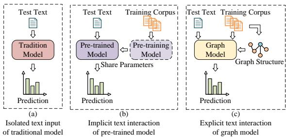
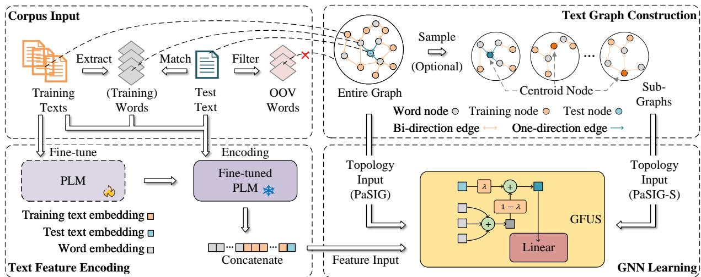
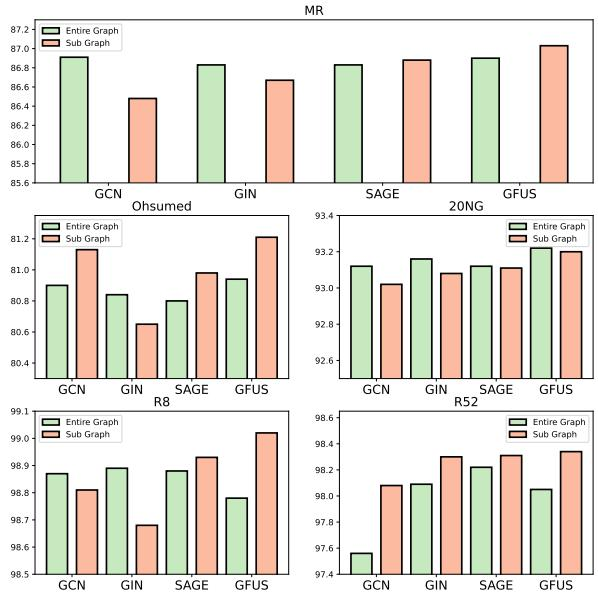
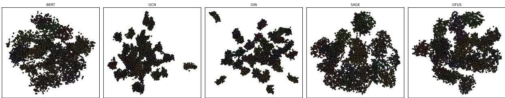
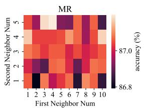
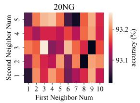
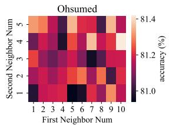
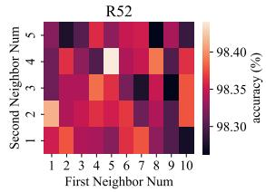
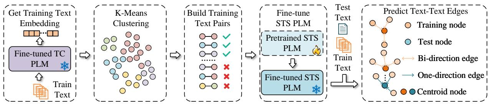

# Pre-trained Semantic Interaction based Inductive Graph Neural Networks for Text Classification

Shiyu Wang1 and Gang Zhou1,\* and Jicang Lu1 and Jing Chen1 and Ningbo Huang 1 1 State Key Laboratory of Mathematical Engineering and Advanced Computing, China   
share\_wind@163.com, lujicang@sina.com, cathysilense@126.com, rylynn\_ab@163.com \*Correspondence:zhougang\_ieu@126.com

## Abstract

Nowadays, research of Text Classification (TC) based on graph neural networks (GNNs) is on the rise. Both inductive methods and transductive methods have made significant progress. For transductive methods, the semantic interaction between texts plays a crucial role in the learning of effective text representations. However, it is difficult to perform inductive learning while modeling interactions between texts on the graph. To give a universal solution, we propose the graph neural network based on pre-trained semantic interaction called PaSIG. Firstly, we construct a text-word heterogeneity graph and design an asymmetric structure to ensure one-way message passing from words to the test texts. Meanwhile, we use the context representation capability of the pre-trained language model to construct node features that contain classification semantic information. Afterward, we explore the adaptative aggregation methods with a gated fusion mechanism. Extensive experiments on five datasets have shown the effectiveness of PaSIG, with the accuracy exceeding the baseline by 2.7% on average. While achieving state-of-the-art performance, we have also taken measures of subgraph sampling and intermediate state preservation to achieve fast inference.

## 1 Introduction

In the field of Natural Language Processing (NLP) based on deep learning, text classification has consistently been a focal point for researchers as it helps with the understanding and organization of data. The pivotal challenge encountered in text classification is how to effectively represent the text. Initially, sequence-based methods (Hochreiter and Schmidhuber, 1997; Schuster and Paliwal, 1997) are adopted to model text semantic information. Nevertheless, they face the issues of vanishing or exploding gradients when dealing with long sequences, making it difficult to handle long-distance dependencies. Subsequently, the emergence of selfattention (Vaswani et al., 2017) brings pre-training capabilities to models. With the help of residual connection and layer normalization techniques, pre-trained models (Devlin et al., 2019) have a strong ability to understand and memorize long sequences. Recently, large language models (Brown et al., 2020; Ouyang et al., 2022) have improved the accuracy of stance detection (Cruickshank and Ng, 2023) and sentiment classification (Deng et al., 2023) in zero-shot and few-shot settings through in-context learning. However, as the scale of model parameters and training data continues to expand, the computational efficiency progressively declines. Although pre-trained models can draw on knowledge from the pre-training corpora, text interaction is implicit in the calculation of model parameters.

Furthermore, researchers have also tried to represent texts with graphs (Yao et al., 2019; Zhang et al., 2020). By modeling the semantic information and grammatical structure within the text as graphs, the representation of the text is further enhanced. In graph-based methods, there is a special case called “transductive learning”. Unlike traditional methods, which perform independent reasoning for each text, the transductive method constructs a corpuslevel graph containing multiple text nodes. The semantic interaction among texts is represented as edges on the graph, then directing the model’s inference. The perception of explicit text semantic interaction has moved beyond the conventional learning of standalone modes, as shown in Figure 1.

While demonstrating effectiveness, the transductive method also brings new problems. Firstly, the model is visible to the test nodes during training. GNN can learn from the feature of the test nodes via message aggregation, which is the main contribution to its effectiveness. Secondly, once the text graph is constructed, it cannot be modified. If new texts await inference, it is inevitable to reconstruct the text graph and perform training from scratch.

  
Figure 1: The illustration of text interaction for traditional deep learning model (a), pre-trained model (b), and transductive graph model (c).

To solve this problem, we propose PaSIG, a Pre-trained Semantic Interaction-based Inductive Graph Neural Network. Firstly, it decomposes the relationships on the text graph and uses an asymmetric structure to avoid passing messages from test texts to words, which achieves the separation of training data and test data. Secondly, it uses the pre-trained model to represent the word and text nodes in the graph. After the fine-tuning on the labeled data, the built features contain category information to support node interactions. Finally, it not only supports semi-supervised learning on an entire graph but also facilitates low-cost learning on subgraphs by node sampling.

The contributions of the paper are as follows:

• We propose a framework of inductive text learning that can assist model inference by perceiving semantic interactions between texts on the uniquely designed asymmetric topology.

• We adopt the gated fusion mechanism with heterogeneous perception, making the model more flexible on feature updating, while the node sampling and hidden state preserving techniques reduce the cost of training.

• Extensive experiments are conducted on five benchmark datasets and illustrate the effectiveness of our method.

## 2 Related Works

## 2.1 Graph Neural Networks for Text Classification

Since the rise of GNNs (Kipf and Welling, 2017; Hamilton et al., 2017; Chen et al., 2018), researchers have attempted to combine text classification with GNNs on the text graphs. According to whether the test nodes are visible during training, existing methods can be divided into two categories: inductive and transductive. Inductive methods construct an independent graph for each text, transforming text tasks into graph tasks. Among them, TextING (Zhang et al., 2020) perceives word co-occurrence, HyperGAT (Ding et al., 2020) models topic information with hyperedges, DADGNN (Liu et al., 2021) uses diffusion along with attention mechanism, TextSSL (Piao et al., 2022) proposes sparse structure learning, TextFCG (Wang et al., 2023) fuses contextual relations to integrate various information, and MHGAT (Jin et al., 2024) perceives multiple elements with word position in heterogeneous hypergraph. Transductive methods introduce text nodes and construct heterogeneous graphs, transforming text tasks into node tasks. TextGCN (Yao et al., 2019) constructs the corpus-level graph based on the co-occurrence of words and texts. TextSGC (Wu et al., 2019) simplifies convolution operations by stacking linear layers. TensorGCN (Liu et al., 2020) uses graph tensors to describe semantic, syntactic, and sequence information. HeteGCN (Ragesh et al., 2021) decomposes the heterogeneous graph and learns cross-layer node embeddings. BertGCN (Lin et al., 2021) combines BERT and GCN for joint training.

## 2.2 Language Models for Text Classification

Since Vaswani et al. (Vaswani et al., 2017) proposed the self-attention mechanism, language models (LMs) based on the Transformer architecture are evolving along two paths: auto-encoder models represented by BERT (Devlin et al., 2019) and autoregressive models represented by GPT (Radford and Narasimhan, 2018). In this paper, we refer to the former as Pre-trained Language Models (PLMs) and the latter as Large Language Models (LLMs). Thanks to the pre-training on large-scale corpora, PLMs can generate richer semantic representations for texts, compared to shallow embeddings such as Bag-of-Words or Skip-gram (Mikolov et al., 2013). Although LLMs such as ChatGPT (Ouyang et al., 2022) can convert powerful text generation capabilities into discriminative abilities based on specific prompts, there are still limitations in multi-category text classification tasks (Wu et al., 2024), especially the high computational cost. To alleviate the semantic bias of LM, GNN-LM (Meng et al., 2022) expands the input by retrieving similar contexts based on the embeddings generated by LM, and then uses GNN to aggregate information on the context graph.

  
Figure 2: The framework of PaSIG. Firstly, we partition the corpus into a training set and a testing set, extracting words from the training text to form the word set. Next, we fine-tune a PLM with the training text, which enables the output of word and text embeddings enriched with category information. Subsequently, we use one-direction edges to ensure one-way message transmission from words to the test texts. Finally, we explore two distinct training methodologies: one utilizing a complete text graph for model training (referred to as PaSIG), the other employs sampling around each text node and leverages exported subgraphs for training (referred to as PaSIG-S).

## 3 Methods

The framework of PaSIG is shown in Figure 2. Firstly, we fine-tune the PLM with the training corpus to incorporate category knowledge. Following this, we uniformly encode both texts and words as input features for nodes using the fine-tuned PLM. In graph construction process, we adopt an asymmetric topology to realize one-way message passing from word nodes to test text nodes. Given that node features encapsulate category information, we implement a gated fusion mechanism to enable text nodes to adaptively preserve their features during semantic interactions. Through these strategies, we innovativly propose PaSIG, which is able to perceive semantic interactions among texts in an inductive way. Additionally, we have developed a cost-effective variant named PaSIG-S, which enables neighbor sampling around each text node and utilizes exported subgraphs for model training. The learning algorithm for PaSIG is detailed in Appendix B.

## 3.1 Construction of Text Graph

We aim to construct a heterogeneous text graph that includes nodes of two categories: text and word. Firstly, for the text graph containing n word nodes and m text nodes, the adjacency matrix A can be represented as the block matrix:

$$
\mathbf { A } = \left[ \begin{array} { c c } { \mathbf { N } } & { \mathbf { M ^ { \top } } } \\ { \mathbf { M } } & { \mathbf { Q } } \end{array} \right]\tag{1}
$$

where matrix $\mathbf { N } \in \mathbb { R } ^ { n \times n }$ reflects the co-occurrence between words, with edge weights calculated by Point-wise Mutual Information (PMI). Matrix M ∈ Rm×n reflects the occurrence of words in the text, with edge weights calculated by TF-IDF. Matrix $\mathbf { Q } \in \mathbb { R } ^ { m \times m }$ reflects the affinity information between texts. Due to the lack of direct methods to characterize the affinity between texts, and the fact that complex methods are prone to introducing noise, we ablate the matrix Q (see Appendix G for more details).

The above graph structure does not distinguish between training and test text nodes. To support inductive learning, we further partition the matrix M. For a text graph containing n word nodes, m training text nodes, and $p$ test text nodes, the adjacency matrix is represented as follows:

$$
\mathbf { A } = \left[ \begin{array} { c c c } { \mathbf { N } } & { \mathbf { M } ^ { \top } } & { \mathbf { P } ^ { \top } } \\ { \mathbf { M } } & { \mathbf { 0 } } & { \mathbf { 0 } } \\ { \mathbf { P } } & { \mathbf { 0 } } & { \mathbf { 0 } } \end{array} \right]\tag{2}
$$

where matrix $\mathbf { N } \in \mathbb { R } ^ { n \times n }$ only contains words appear in the training corpus. Matrix M $\in \mathbb { R } ^ { m \times n }$ and $\mathbf { P } \in \mathbb { R } ^ { p \times n }$ represents the co-occurrence about words with the training and test texts, respectively. Since the vocabulary is built from the training corpus, for words in test texts but out of the vocabulary, their edges with the test texts will be ignored.

The matrix P represents the message passing from test text nodes to word nodes, resulting in the exposure of the test set during training. Therefore, we set P as the zero matrix to ensure the one-way message passing from the word nodes to the test text nodes. In this way, the test text nodes only receive information from word nodes during inference but do not participate in training.

Notice that after removing matrix P, the adjacency matrix A becomes asymmetric. Before message propagation, it is necessary to perform normalization $\mathbf { \bar { A } } = \mathbf { D } ^ { - 1 / 2 } \mathbf { A } \mathbf { D } ^ { - 1 / 2 }$ , where D is the degree matrix. Due to the asymmetry of A, there are two strategies to calculate the degree matrix: using in-degree or out-degree. We will study the impact of normalization strategies in Section 4.5.

In addition, PMI-weighted word-word edges have the problems of dense connections and mismatches with TF-IDF weights (see Appendix F for more details). Therefore, we ablate the matrix N. Finally, we add a self-loop to each node and obtain the adjacency matrix as follows:

$$
\mathbf { A } = \left[ \begin{array} { c c c } { \mathbf { I } _ { n } } & { \mathbf { M } ^ { \top } } & { \mathbf { P } ^ { \top } } \\ { \mathbf { M } } & { \mathbf { I } _ { m } } & { \mathbf { 0 } } \\ { \mathbf { 0 } } & { \mathbf { 0 } } & { \mathbf { I } _ { p } } \end{array} \right]\tag{3}
$$

where $\mathbf { I } _ { n } , \mathbf { I } _ { m }$ , and $\mathbf { I } _ { p }$ are identity matrices with the shape of $n \times n , m \times m$ , and $p \times p .$ , respectively.

## 3.2 Fine-tuning and Encoding of BERT

Good node features are the prerequisite for an effective GNN. TextGCN (Yao et al., 2019) uses onehot vectors to embed words and text nodes because one-hot embedding can achieve fast convergence on full-batch training. TextING (Zhang et al., 2020) uses GloVe (Pennington et al., 2014) to initialize the representations of word nodes. However, neither of them meets the requirements of PaSIG as they cannot provide a representation containing category information for text nodes.

In this work, we use BERT (Devlin et al., 2019) (or other BERT-like models such as RoBERTa (Liu et al., 2019)) as the encoder of words and text nodes. Firstly, BERT can perform encoding for text and words independently, which meets the inductive requirement. Secondly, the fine-tuned BERT can output text features containing category semantics, benefitting from its good performance in downstream tasks. Finally, the embedding space of words and texts encoded by BERT is consistent.

To make the encoding of BERT have category information, it is necessary to fine-tune BERT first. We only use the training corpus for inductive finetuning. After fine-tuning, we deploy a token-wise tokenization as specified by BERT and divide the input into three parts: the set of words W, the set of training texts $\tau ,$ , and the set of test texts ${ \mathcal { S } } .$ For word $w \in \mathcal W$ , we build the input with the format $\{ [ C L S ] , w , [ S E P ] \}$ and use the output at position of w as the word feature $\mathbf { x } _ { w } ~ \in ~ \mathbb { R } ^ { d }$ where d is the dimension of hidden layers of BERT. For training text $t \in \tau$ , we add special tokens [CLS] and [SEP] at the beginning and end of text t, respectively. Due to the representation of token [CLS] is believed to contain global semantic information of the text, the output at the position of [CLS] is used as the text feature $\mathbf { x } _ { t } \in \mathbb { R } ^ { d }$

If there is a new test text $s \in S$ needs to be inferred, we can refer to the encoding of the training texts to obtain its feature $\mathbf { x } _ { s } \in \mathbb { R } ^ { d }$ . This process is independent of the encoding of the training corpus and is therefore inductive. Through BERT encoding, category information is embedded into the features of word and text nodes. Finally, the node features during inference are as follows:

$$
\mathbf { X } = [ \mathbf { X } _ { \mathcal { W } } , \mathbf { X } _ { \mathcal { T } } , \mathbf { X } _ { \mathcal { S } } ] ^ { \top }\tag{4}
$$

where $\mathbf { X } _ { \mathcal { W } } \in \mathbb { R } ^ { n \times d } , \mathbf { X } _ { \mathcal { T } } \in \mathbb { R } ^ { m \times d }$ and $\mathbf { X } _ { \mathcal { S } } \in$ $\mathbb { R } ^ { p \times d }$

## 3.3 GNN with Gated Fusion Mechanism

According to the message passing mechanism proposed by Gilmer et al., given the message function $M _ { l }$ and update function $U _ { l }$ , the message passing and updating of GNN can be represented as:

$$
\mathbf { m } _ { v } ^ { l + 1 } = \sum _ { u \in \mathcal { N } _ { v } } M _ { l } \left( \mathbf { h } _ { v } ^ { l } , \mathbf { h } _ { u } ^ { l } , \mathbf { e } _ { v u } \right)\tag{5}
$$

$$
\mathbf { h } _ { v } ^ { l + 1 } = U _ { l } \left( \mathbf { h } _ { v } ^ { l } , \mathbf { m } _ { v } ^ { l + 1 } \right)\tag{6}
$$

where $\mathbf { h } _ { v } ^ { l }$ is the hidden state of node v at layer l with $\mathbf h _ { v } ^ { 0 } = \mathbf x _ { v } . \ \mathbf e _ { v u }$ is the edge feature from node u to node $v . { \mathcal { N } } _ { v }$ is the set of neighboring nodes of node v.

Traditional GNNs, such as GCN (Kipf and Welling, 2017) and GIN (Xu et al., 2018), adopt the simple summation updating method for $\mathbf { h } _ { v } ^ { l }$ and $\mathbf { m } _ { v } ^ { l + 1 }$ at each layer. On the one hand, this updating is constrained by the graph structure and cannot flexibly extract valuable information from the features of the centroid node and the messages from neighbors. On the other hand, the text graph contains both text and word nodes, but due to their unified embedding space, the model is impeded in its ability to discern this heterogeneity.

To enable the model to flexibly decide how to preserve the node features containing category information while aggregating heterogeneous neighborhood information, we proposed a gated fusion mechanism with heterogeneous perception called GFUS. The formula is as follows:

$$
\mathbf { m } _ { v } ^ { l + 1 } = \sum _ { u \in \mathcal { N } _ { v } } \left( \tilde { \mathrm { A } } _ { v , u } \mathbf { h } _ { u } ^ { l } \right)\tag{7}
$$

$$
\lambda ^ { l } = \delta \left( \mathbf { h } _ { v } ^ { l } \mathbf { W } _ { h } ^ { l } + \mathbf { m } _ { v } ^ { l + 1 } \mathbf { W } _ { m } ^ { l } + \beta ^ { l } t _ { v } \right)\tag{8}
$$

$$
\tilde { \mathbf { h } } _ { v } ^ { l } = \lambda ^ { l } \cdot \mathbf { h } _ { v } ^ { l } + ( 1 - \lambda ^ { l } ) \cdot \mathbf { m } _ { v } ^ { l + 1 }\tag{9}
$$

$$
\mathbf { h } _ { v } ^ { l + 1 } = \sigma \left( \tilde { \mathbf { h } } _ { v } ^ { l } \mathbf { W } _ { t } ^ { l } \right)\tag{10}
$$

where $\mathbf { W } _ { h } ^ { l } \in \mathbb { R } ^ { d \times 1 }$ and $\mathbf { W } _ { m } ^ { l } \in \mathbb { R } ^ { d \times 1 }$ is the weight matrix of centroid node representation and neighbor aggregation representation at l-th layer, respectively. $\beta ^ { l } \in \mathbb { R }$ is the learnable parameter that controls the bias according to the type of centroid node. $t _ { v }$ denotes the type of node $v$ (0 for word node and 1 for text node). The sigmoid activation $\delta$ is used to adaptively calculate the gated signal $\lambda ^ { l }$ , which controls the proportion of two representations $\mathbf { h } _ { v } ^ { l }$ and $\mathbf { m } _ { v } ^ { l + 1 }$ during updating.

Due to PaSIG’s unique graph-building strategy, text nodes are only connected to word nodes, and vice versa (except for self-loops), so the centroid node and neighbor nodes are heterogeneous. $\beta \in$ [0, 1] allows the model to apply different biases to gated signal λ based on the type of centroid node, giving the perception of node heterogeneity.

Following the gated fusion, the node representation $\tilde { \mathbf { h } } _ { v } ^ { l }$ undergoes a nonlinear transformation before being forwarded to the subsequent layer. $\mathbf { W } _ { t } ^ { l } \in \mathbb { R } ^ { d \times d ^ { \prime } }$ is the weight matrix for linear transformations and the output dimension of the last layer is the number of categories, i.e. $d ^ { \prime } = C$ . The non-linear function $\sigma$ in the middle layer is relu, while the last layer is softmax. Upon completion of the GUS’s n-layer propagation, we compute the cross-entropy loss:

$$
\begin{array} { r } { \mathcal { L } = - \sum _ { i \in \mathcal { T } _ { l } } \mathbf { h } _ { i } ^ { n } \log ( \mathbf { y } _ { i } ) } \end{array}\tag{11}
$$

where $\mathcal { T } _ { l }$ records the indices of the labeled training texts, $\mathbf { y } _ { i } \in \mathbb { R } ^ { C }$ represents the one-hot vector corresponding to the ground truth label of the i-th text.

## 3.4 Partition and Sampling of Graph

We have identified the inputs and components of PaSIG, now we will introduce how it works on training and inference. As mentioned above, the adjacency matrix A and input feature X are both inductive. We only need to construct different inputs during the training and inference to easily achieve inductive learning. During training, all inputs related to the test data are excluded:

$$
\mathbf { A } _ { t r a i n } = \left[ \begin{array} { l l } { \mathbf { I } _ { n } } & { \mathbf { M } ^ { \top } } \\ { \mathbf { M } } & { \mathbf { I } _ { m } } \end{array} \right] , \mathbf { X } _ { t r a i n } = \left[ \begin{array} { l } { \mathbf { X } _ { \mathcal { W } } } \\ { \mathbf { X } _ { \mathcal { T } } } \end{array} \right]\tag{12}
$$

During inference, the test data is introduced:

$$
\mathbf { A } _ { t e s t } = \left[ \begin{array} { c c c } { \mathbf { I } _ { n } } & { \mathbf { M } ^ { \top } } & { \mathbf { P } ^ { \top } } \\ { \mathbf { M } } & { \mathbf { I } _ { m } } & { \mathbf { 0 } } \\ { \mathbf { 0 } } & { \mathbf { 0 } } & { \mathbf { I } _ { p } } \end{array} \right] , \mathbf { X } _ { t e s t } = \left[ \begin{array} { c } { \mathbf { X } _ { \mathcal { W } } } \\ { \mathbf { X } _ { \mathcal { T } } } \\ { \mathbf { X } _ { \mathcal { S } } } \end{array} \right]\tag{13}
$$

If there are new texts to be inferred, we only need to adjust the correlation matrix $\mathbf { P } ^ { \top }$ and initial features $\mathbf { X } _ { \mathcal { S } }$ . And there is no need to retrain the GNN. Compared to the transductive methods, PaSIG saves the time of retraining the model.

To analyze the complexity of PaSIG, assume that the dataset contains m texts, the vocabulary size is $n ,$ the average text length is L, BERT output dimension is $d ,$ the number of GNN’s layers is $T$ , then the space complexity of the input is $\mathcal { O } ( L m + m d + n d )$ and the time complexity is O(T Lmd). Performing message propagation on the entire graph ensures the integrity of textual interaction, but it incurs a high cost on a large-scale dataset.

Each text node just requires two-hop message passing to interact with similar text nodes on the graph. Additionally, the first and second-order neighbors covered by each node form a small part of the graph. Hence, PaSIG can be more efficient by sampling first-order word neighbors and secondorder text neighbors for each text to construct subgraphs for learning (denoted as PaSIG-S), as shown in Figure 2. The idea of "constructing independent graph for each text" in PaSIG-S aligns more closely with the graph construction strategy typically associated with inductive approaches. Conversely, the idea of "building heterogeneous corpus graph" in PaSIG bears greater resemblance to the graph construction strategy of transductive methods. Nevertheless, the asymmetric topology ensures that both methodologies will be executed inductively.

<table><tr><td rowspan="2">Model</td><td colspan="2">MR</td><td colspan="2">Ohsumed</td><td colspan="2">20NG</td><td colspan="2">R8</td><td colspan="2">R52</td></tr><tr><td>Accuracy</td><td>F1</td><td>Accuracy</td><td>F1</td><td>Accuracy</td><td>F1</td><td>Accuracy</td><td>F1</td><td>Accuracy</td><td>F1</td></tr><tr><td>TextING</td><td>79.75±0.78</td><td>79.63±0.85</td><td>73.51±1.05</td><td>68.15±0.77</td><td>85.13±0.66</td><td>84.32±0.12</td><td>97.45±0.70</td><td>95.94±0.63</td><td>94.95±0.95</td><td>76.71±0.87</td></tr><tr><td>HyperGAT</td><td>76.64±0.81</td><td>76.58±0.92</td><td>66.55±1.37</td><td>59.05±1.84</td><td>83.29±0.46</td><td>82.72±0.24</td><td>96.43±0.63</td><td>92.12±1.51</td><td>94.24±0.54</td><td>72.35±1.83</td></tr><tr><td>TextSSL</td><td>75.74±0.25</td><td>75.64±0.38</td><td>62.01±0.41</td><td>51.99±0.78</td><td>79.55±0.27</td><td>79.11±0.65</td><td>97.31±0.42</td><td>93.01±0.33</td><td>93.97±0.66</td><td>72.79±1.41</td></tr><tr><td>TextFCG</td><td>80.59±0.29</td><td>80.56±0.47</td><td>69.58±0.39</td><td>56.16±0.71</td><td>85.95±0.33</td><td>84.91±0.51</td><td>97.53±0.34</td><td>92.44±0.21</td><td>95.64±0.15</td><td>69.13±0.28</td></tr><tr><td>MHGAT </td><td>78.09±0.73</td><td>77.24±0.57</td><td>72.88±0.84</td><td>65.04±1.60</td><td>92.68±0.30</td><td>91.94±0.13</td><td>97.65±0.47</td><td>93.09±1.21</td><td>94.78±0.37</td><td>76.74±1.06</td></tr><tr><td>TextGCN</td><td>75.15±0.41</td><td>75.02±0.73</td><td>67.94±0.85</td><td>62.28±1.34</td><td>85.69±0.16</td><td>84.85±0.23</td><td>96.98±0.10</td><td>93.19±0.47</td><td>93.77±0.26</td><td>70.39±0.35</td></tr><tr><td>TextSGC</td><td>76.48±0.17</td><td>76.24±0.52</td><td>68.56±0.42</td><td>60.50±0.46</td><td>88.66±0.35</td><td>88.08±1.57</td><td>97.44±0.25</td><td>93.82±0.51</td><td>94.02±0.63</td><td>74.00±0.88</td></tr><tr><td>HeteGCN ‡</td><td>76.23±0.23</td><td>75.88±0.34</td><td>68.13±0.89</td><td>61.35±1.33</td><td>87.03±0.20</td><td>85.27±0.25</td><td>97.21±0.45</td><td>91.36±1.47</td><td>93.85±0.59</td><td>66.38±2.54</td></tr><tr><td>TensorGCN</td><td>76.48±0.69</td><td>76.40±0.42</td><td>64.48±0.71</td><td>49.42±0.66</td><td>76.57±0.21</td><td>75.60±0.35</td><td>96.07±0.76</td><td>90.46±0.67</td><td>93.89±1.35</td><td>64.37±0.51</td></tr><tr><td>BertGCN</td><td>84.92±0.84</td><td>84.05±0.67</td><td>71.88±0.52</td><td>62.72±0.47</td><td>88.69±0.45</td><td>88.02±0.20</td><td>97.94±0.73</td><td>94.60±0.44</td><td>95.50±0.44</td><td>52.30±0.73</td></tr><tr><td>w/o BE</td><td>69.20±0.26</td><td>69.15±0.29</td><td>47.52±0.22</td><td>36.19±0.65</td><td>59.02±0.33</td><td>56.91±0.33</td><td>87.92±0.38</td><td>77.35±1.56</td><td>68.93±2.34</td><td>13.03±3.31</td></tr><tr><td>w/o FB</td><td>72.98±0.23</td><td>72.95±0.24</td><td>41.83±0.28</td><td>25.30±0.67</td><td>65.02±0.66</td><td>63.07±0.85</td><td>91.34±0.16</td><td>79.31±1.97</td><td>80.31±0.51</td><td>20.45±0.56</td></tr><tr><td>w/o GS</td><td>78.59±0.21</td><td>78.56±0.19</td><td>69.33±0.31</td><td>53.32±0.27</td><td>87.62±0.21</td><td>86.97±0.42</td><td>97.49±0.20</td><td>94.07±0.33</td><td>96.34±0.35</td><td>65.99±0.79</td></tr><tr><td>PaSIG</td><td>86.90±0.16</td><td>86.88±0.16</td><td>80.94±0.10</td><td>74.09±0.32</td><td>93.22±0.08</td><td>92.88±0.07</td><td>98.78±0.02</td><td>97.70±0.19</td><td>98.05±0.09</td><td>79.46±1.25</td></tr><tr><td>PaSIG-S</td><td>87.05±0.09</td><td>87.04±0.09</td><td>81.18±0.21</td><td>74.58±0.42</td><td>93.21±0.07</td><td>92.91±0.08</td><td>99.02±0.04</td><td>98.16±0.12</td><td>98.34±0.03</td><td>85.99±1.52</td></tr></table>

Table 1: The average and standard deviation (%) of the text classification accuracy and macro F1-score on five datasets. BE denotes BERT Embeddings, FB denotes Fine-tuned BERT, GS denotes Graph Structures. Red color marks the optimal result, orange color marks the suboptimal result, yellow color marks the third best result. ‡ marks the model without open source, whose score is from the literature.

Assuming that $k _ { 1 }$ word nodes are sampled from the first-order neighbors for each text and $k _ { 2 }$ text nodes are sampled from the second-order neighbors for each first-order neighbor, the space complexity of the input is $\mathcal { O } ( k _ { 1 } k _ { 2 } + k _ { 1 } d + k _ { 2 } d )$ and the time complexity is $O ( k _ { 1 } k _ { 2 } m d )$ . Sampling subgraphs is a more cost-effective way for training and inference, but it may suffer from information loss because of the drop-out of nodes.

## 4 Experiments

In this section, we will introduce the datasets. The performance of PaSIG will be compared with baselines. In addition, we will observe the effects of ablations, GNN components, and degree calculation strategies on model performance. Finally, we will visualize the text representation output by PaSIG. The source code of PaSIG is available at https://github.com/WithMeteor/PaSIG.

## 4.1 Datasets and Baselines

We adopt widely used text classification datasets, including short-text sentiment classification dataset MR (Movie Review)1, long-text news classification dataset 20NG2, medical classification dataset Ohsumed3, and Reuters4 news datasets R8 and R52. The data preprocessing is in Appendix A.1.

We use state-of-the-art models on text graphs as baselines. For the transductive text graph model, we chose TextGCN (Yao et al., 2019), TextSGC (Wu et al., 2019), TensorGCN (Liu et al., 2020), HeteGCN (Ragesh et al., 2021), and BertGCN (Lin et al., 2021). For the inductive text graph model, we show the performance of TextING (Zhang et al., 2020), HyperGAT (Ding et al., 2020), TextSSL (Piao et al., 2022), TextFCG (Wang et al., 2023), and MHGAT (Jin et al., 2024). We implemented these methods with the official code provided by the authors, calculating the average and standard deviation of scores under 10 independent training. For the methods without open source, we used the results reported in the paper. For PaSIG, the settings of training parameters are introduced in Appendix A.2. We have also compared the performance of PaSIG and GPT-3 (Brown et al., 2020) in Appendix H.

## 4.2 Experimental Results

Table 1 shows the comparison of the performance between PaSIG and baselines. Upon examining the baseline scores, there appears to be little distinction in performance between inductive and transductive methods on datasets R8 and R52. The reason is that these two datasets are easier to fit. With the help of PLM for semantic supplementation of short texts, BertGCN achieved the best performance among the baselines on the short-text dataset MR. TextING can generate effective embeddings for unseen words, resulting in the best performance among the baselines on the medical dataset Ohsumed. MH-GAT is better at capturing high-order relationships in documents, resulting in the best performance on long-text dataset 20NG.

PaSIG surpasses all baselines on each dataset based on t-tests $( p \ < \ 0 . 0 5 )$ BertGCN is the only baseline that introduces BERT in learning, but PaSIG performs much better than it on longtext datasets, with faster inference speed and less resource consumption. For R8 and R52, the accuracy improvement of PaSIG is relatively small, at 1.08% and 2.00%, respectively. However, the increase in F1 score is more significant, at 2.22% and 9.25%, respectively. For the short-text dataset MR, PaSIG constructs semantic interactions between texts to compensate for the semantic loss and improve the accuracy and F1 by 2.13% and 2.99%. For the medical dataset Ohsumed, PaSIG uses the domain vocabulary as the medium to aggregate text information from specific categories, thereby improving accuracy and F1 by 7.67% and 6.43%. For the long-text dataset 20NG, PaSIG achieves the accuracy and F1 improvement of 0.54% and 0.97% by utilizing BERT’s ability to model long texts. Furthermore, the performance of PaSIG-S is better than PaSIG by the node sampling strategy. The reason is that sampling on the graph can reduce the proportion of discrepant text nodes (i.e. nodes with different labels from the centroid node) in the second-order neighbors. More details will be discussed in Appendix D.

## 4.3 Ablation Study

To further investigate the influence of PaSIG’s constituents on its overall performance, we executed meticulous ablation studies. We consider three variations: PaSIG w/o BERT embeddings, which substitutes with GloVe vectors; PaSIG w/o fine-tuned BERT, relying on pre-trained BERT for node encoding; PaSIG w/o graph structure, which is equivalent to the fine-tuned BERT alone. Table 1 illustrates a decline in performance across all variations. The greatest performance decline occurred upon removing the BERT encoder, underscoring the critical importance of effective text representation. Using the pre-trained BERT without fine-tuning also impacts performance, suggesting that textual category information contributes to PaSIG’s inferential capabilities. Even without a graph structure, BERT offers rich contextual semantics after fine-tuning and attains performance competitive with that of text graph baselines. Nonetheless, PaSIG does not entirely rely on BERT embedding as semantic interaction among texts continues to benefit it.

It has been revealed that PaSIG’s efficacy primarily derives from BERT’s representation ability and the categorical information it acquires. Yet, the baselines are at a disadvantage when unable to harness BERT’s capacities. To ensure fairness, we conducted an extensive investigation in Appendix E, examining the performance of baselines integrated with BERT. The findings suggest that BERT embeddings are incompatible with inductive baselines. While PaSIG’s unique architecture is designed to fully leverage BERT’s capabilities.

## 4.4 Comparison among GNN Components

As a text graph learning framework, PaSIG can substitute GNN components to attain diverse propagation outcomes. We compared the performance of four components: GCN (Kipf and Welling, 2017), GIN (Xu et al., 2018), SAGE (Hamilton et al., 2017), and our proposed GFUS in both entire-graph and subgraph scenarios. As shown in Figure 3.

  
Figure 3: PaSIG accuracy (%) with different GNN components in the entire-graph and subgraph scenarios.

From Figure 3, it can be seen that GFUS does not stand out in entire-graph propagation but performs the best in subgraph propagation. GCN and GIN are constrained by fixed graph structures due to their message aggregation based on simple summation. While SAGE adopts connection-based message updating, which is: $\mathbf { h } _ { v } ^ { l + 1 } = \mathbf { W } ^ { l } ( \mathbf { h } _ { v } ^ { l } | | \mathbf { m } _ { v } ^ { l + 1 } )$ Although SAGE considers centroid representation and neighborhood representation separately when performing updating, it is not as flexible as GFUS in preserving node features and cannot perceive different node types.

<table><tr><td>Model</td><td>Dataset</td><td>Out-Degree</td><td>In-Degree</td></tr><tr><td rowspan="4">GCN</td><td>MR</td><td>86.91±0.14</td><td>83.03±0.20 62.47±0.32</td></tr><tr><td>Ohsumed</td><td>80.90±0.33</td><td>91.68±0.43</td></tr><tr><td>R8</td><td>98.87±0.06 97.56±0.12</td><td>88.58±0.11</td></tr><tr><td>R52 20NG</td><td>93.12±0.09</td><td>85.42±0.32</td></tr><tr><td rowspan="4">GIN</td><td>MR Ohsumed</td><td>86.83±0.11 80.84±0.09</td><td>86.74±0.30 79.60±0.92</td></tr><tr><td>R8</td><td>98.89±0.05</td><td>98.56±0.35</td></tr><tr><td>R52</td><td>98.09±0.06</td><td>97.72±0.16</td></tr><tr><td>20NG</td><td>93.16±0.08</td><td>92.80±0.04</td></tr><tr><td rowspan="5">GFUS</td><td>MR Ohsumed</td><td>86.86±0.20 81.05±0.18</td><td>86.90±0.16 80.94±0.10</td></tr><tr><td>R8</td><td>98.77±0.09</td><td>98.78±0.02</td></tr><tr><td>R52</td><td>98.11±0.03</td><td>98.05±0.09</td></tr><tr><td></td><td></td><td></td></tr><tr><td>20NG</td><td>93.18±0.04</td><td>93.22±0.08</td></tr></table>

Table 2: Accuracy comparison (%) of PaSIG using GCN/GIN/GFUS as GNN components with out-degree and in-degree matrix, the larger values are bolded.

## 4.5 Analysis of Degree Matrix

As we introduced in Section 3.1, to achieve the message’s one-way transmission from words to test texts, the adjacency matrix A corresponding to the topology is asymmetric. Therefore, when using degree matrix D to perform symmetric normalization on adjacency matrix, there are two options: one is to use in-degree to calculate the degree matrix $\begin{array} { r } { \mathbf { D } _ { j j } = \sum _ { i } \mathbf { A } _ { i j } } \end{array}$ , and the other is to calculate out-degree matrix $\begin{array} { r } { \mathbf { D } _ { i i } = \sum _ { j } \mathbf { A } _ { i j } } \end{array}$ . We find that the two strategies will lead to different performances. We recorded the performance changes of three summation-based GNN components (GCN, GIN, and GFUS) before and after using the outdegree and in-degree to calculate matrices during full graph propagation, as shown in Table 2.

It can be seen that GCN and GIN exhibit a strong preference for out-degree matrix, while GFUS is almost unaffected by the choice of degree matrix. According to the analysis in Appendix C, the outdegree matrix can assign greater weights to the initial features of test nodes in message aggregation. The experiment suggests that it is a crucial factor in ensuring the efficacy of summation-based message aggregation. Due to the enhanced selffeatures of GIN, whose update function is $\mathbf { h } _ { v } ^ { l + 1 } =$ $\mathrm { M L P } ^ { l } ( ( 1 + \epsilon ) \mathbf { h } _ { v } ^ { l } + \mathbf { m } _ { v } ^ { l + 1 } )$ , the performance loss in Table 2 is smaller than that of GCN without enhanced self-features when the matrix changes from out-degree to in-degree. However, due to the gated fusion mechanism of GFUS, it can adaptively adjust the gated signal, experiencing only minimal interference from the normalization strategy.

## 4.6 Visualization

We visualize the text embeddings learned by the models to ascertain if PaSIG has acquired effective text representations via the semantic interaction between texts. The dataset 20NG is selected for visualization. T-SNE (Maaten and Hinton, 2008) is used to reduce the dimension of the text node embeddings output by BERT and PaSIG. We set embedding spatial dimension to 3 and perplexity to 50 for T-SNE. The results are shown in Figure 4.

It can be seen that although the embeddings of BERT contain category information, they are not distinguishable for certain categories. There are overlaps between clusters after dimensionality reduction. After GNN propagation, the discrimination in different categories is significantly improved, which is reflected in the further separation of clusters. For GNNs with message aggregation based on simple summation (GCN and GIN), nodes within the cluster are integrated more tightly, indicating that nodes of the same category have higher similarity in representation. However, this will also lead to easier misclassification of similar nodes between clusters. GNNs with uniquely designed update functions (SAGE and GFUS) can aggregate neighbor messages while also preserving their initial features, making the node representations more discriminative. This not only ensures the separation of different clusters but also prevents nodes within the cluster from being too tightly integrated.

## 5 Conclusion

We propose an inductive GNN framework for text graphs called PaSIG, which performs semisupervised learning on the text-word heterogeneous graph. While modeling the semantical interaction of the texts, PaSIG achieves the separation of training and test data by the asymmetric graph structure and different inputs at different stages, allowing the model to perform inductive learning. Moreover, our proposed gated fusion mechanism with heterogeneous perception has strong flexibility, which can help text nodes adaptively preserve their features when aggregating neighbor messages. Lastly, we propose a subgraph-propagation approach with node sampling to diminish training expenses and introduce a single-layer propagation technique that leverages intermediate states to hasten inference.

  
Figure 4: The text embeddings of 20NG output by five models. Different colors represent different categories.

## 6 Limitations

While PaSIG has contributed to the implementation of inductive text classification with pre-trained semantics and inter-textual interaction, there remain certain limitations. Firstly, PaSIG employs a fixed graph structure defined by TF-IDF, which presupposes that texts with similar contexts are semantically proximate in classification. This static structure may be suboptimal and lacks the flexibility for fine-tuning during the learning phase. Secondly, PaSIG builds node features by BERT, which cannot be incorporated into the learning process of PaSIG in an end-to-end manner. This not only heightens the deployment complexity of PaSIG but also precludes a tighter synergy between GNN and PLM. In the future, we hope to propose an end-toend architecture that incorporates feature building and structure learning into the PaSIG framework, thereby providing more flexible input for GNN models.

## Acknowledgments

The work was supported by the Henan Provincial Science and Technology Research Project (222102210081, 222300420590).

## References

Tom B. Brown, Benjamin Mann, Nick Ryder, Melanie Subbiah, Jared Kaplan, Prafulla Dhariwal, Arvind Neelakantan, Pranav Shyam, Girish Sastry, Amanda Askell, and et al. 2020. Language models are fewshot learners. In Proceedings of the 34th International Conference on Neural Information Processing Systems, NIPS’20, pages 1877–1901. Curran Associates Inc.

Jie Chen, Tengfei Ma, and Cao Xiao. 2018. Fastgcn: Fast learning with graph convolutional networks via importance sampling. In International Conference on Learning Representations.

Iain J. Cruickshank and Lynnette Hui Xian Ng. 2023. Use of large language models for stance classification. CoRR, abs/2309.13734.

Xiang Deng, Vasilisa Bashlovkina, Feng Han, Simon Baumgartner, and Michael Bendersky. 2023. Llms to the moon? reddit market sentiment analysis with large language models. In Companion Proceedings ofthe ACM Web Conference 2023, WWW ’23 Companion, pages 1014–1019. Association for Computing Machinery.

Jacob Devlin, Ming-Wei Chang, Kenton Lee, and Kristina Toutanova. 2019. Bert: Pre-training of deep bidirectional transformers for language understanding. In Proceedings of the 2019 Conference of the North American Chapter ofthe Associationfor Computational Linguistics: Human Language Technologies, volume 1, pages 4171–4186. Association for Computational Linguistics.

Kaize Ding, Jianling Wang, Jundong Li, Dingcheng Li, and Huan Liu. 2020. Be more with less: Hypergraph attention networks for inductive text classification. In Proceedings of the 2020 Conference on Empirical Methods in Natural Language Processing (EMNLP).

Justin Gilmer, Samuel S. Schoenholz, Patrick F. Riley, Oriol Vinyals, and George E. Dahl. Neural message passing for quantum chemistry. In Proceedings of the 34th International Conference on Machine Learning - Volume 70, ICML’17, pages 1263–1272. JMLR.org.

William L. Hamilton, Rex Ying, and Jure Leskovec. 2017. Inductive representation learning on large graphs. In Proceedings ofthe 31st International Conference on Neural Information Processing Systems, NIPS’17, pages 1025–1035. Curran Associates Inc.

Sepp Hochreiter and Jürgen Schmidhuber. 1997. Long short-term memory. Neural computation, 9(8):1735– 1780.

Piotr Indyk and Rajeev Motwani. 2000. Approximate nearest neighbors: Towards removing the curse of dimensionality. Theory ofComputing, 604-613(1).

Yilun Jin, Wei Yin, Haoseng Wang, and Fang He. 2024. Capturing word positions does help: A multi-element hypergraph gated attention network for document classification. Expert Systems with Applications, 251:124002.

Thomas N. Kipf and Max Welling. 2017. Semisupervised classification with graph convolutional networks. In International Conference on Learning Representations.

Yuxiao Lin, Yuxian Meng, Xiaofei Sun, Qinghong Han, Kun Kuang, Jiwei Li, and Fei Wu. 2021. Bertgcn: Transductive text classification by combining gnn and bert. In Findings of the Association for Computational Linguistics: ACL-IJCNLP 2021, pages 1456–1462. Association for Computational Linguistics.

Xien Liu, Xinxin You, Xiao Zhang, Ji Wu, and Ping Lv. 2020. Tensor graph convolutional networks for text classification. Proceedings ofthe AAAI Conference on Artificial Intelligence, 34(05):8409–8416.

Yinhan Liu, Myle Ott, Naman Goyal, Jingfei Du, Mandar Joshi, Danqi Chen, Omer Levy, Mike Lewis, Luke Zettlemoyer, and Veselin Stoyanov. 2019. Roberta: A robustly optimized bert pretraining approach.

Yonghao Liu, Renchu Guan, Fausto Giunchiglia, Yanchun Liang, and Xiaoyue Feng. 2021. Deep attention diffusion graph neural networks for text classification. In Proceedings ofthe 2021 Conference on Empirical Methods in Natural Language Processing, pages 8142–8152. Association for Computational Linguistics.

Laurens Maaten and Geoffrey Hinton. 2008. Visualizing data using t-sne. Journal of Machine Learning Research, 9(86):2579–2605.

Yuxian Meng, Shi Zong, Xiaoya Li, Xiaofei Sun, Tianwei Zhang, Fei Wu, and Jiwei Li. 2022. Gnn-lm: Language modeling based on global contexts via gnn. In International Conference on Learning Representations.

Tomas Mikolov, Kai Chen, Greg Corrado, and Jeffrey Dean. 2013. Efficient estimation of word representations in vector space. In International Conference on Learning Representations.

Long Ouyang, Jeffrey Wu, Xu Jiang, Diogo Almeida, Carroll Wainwright, Pamela Mishkin, Chong Zhang, Sandhini Agarwal, Katarina Slama, Alex Ray, and et al. 2022. Training language models to follow instructions with human feedback. In Advances in Neural Information Processing Systems, volume 35, pages 27730–27744. Curran Associates, Inc.

Jeffrey Pennington, Richard Socher, and Christopher Manning. 2014. Glove: Global vectors for word representation. In Proceedings of the 2014 Conference on Empirical Methods in Natural Language Processing (EMNLP), pages 1532–1543. Association for Computational Linguistics.

Yinhua Piao, Sangseon Lee, Dohoon Lee, and Sun Kim. 2022. Sparse structure learning via graph neural networks for inductive document classification. Proceedings of the AAAI Conference on Artificial Intelligence, 36(10):11165–11173.

Alec Radford and Karthik Narasimhan. 2018. Improving language understanding by generative pretraining.

Rahul Ragesh, Sundararajan Sellamanickam, Arun Iyer, Ramakrishna Bairi, and Vijay Lingam. 2021. Hetegcn: Heterogeneous graph convolutional networks for text classification. In Proceedings of the 14th ACM International Conference on Web Search and Data Mining, pages 860–868. Association for Computing Machinery.

Nils Reimers and Iryna Gurevych. Sentence-bert: Sentence embeddings using siamese bert-networks. In Proceedings of the 2019 Conference on Empirical Methods in Natural Language Processing and the 9th International Joint Conference on Natural Language Processing (EMNLP-IJCNLP), pages 3982– 3992. Association for Computational Linguistics.

M. Schuster and K.K. Paliwal. 1997. Bidirectional recurrent neural networks. IEEE Transactions on Signal Processing, 45(11):2673–2681.

Richard Socher, Alex Perelygin, Jean Wu, Jason Chuang, Christopher D. Manning, Andrew Ng, and Christopher Potts. 2013. Recursive deep models for semantic compositionality over a sentiment treebank. In Proceedings of the 2013 Conference on Empirical Methods in Natural Language Processing, pages 1631–1642. Association for Computational Linguistics.

Xiaofei Sun, Xiaoya Li, Jiwei Li, Fei Wu, Shangwei Guo, Tianwei Zhang, and Guoyin Wang. Text classification via large language models. In Findings of the Association for Computational Linguistics: EMNLP 2023, pages 8990–9005. Association for Computational Linguistics.

Hugo Touvron, Louis Martin, Kevin Stone, Peter Albert, Amjad Almahairi, Yasmine Babaei, Nikolay Bashlykov, Soumya Batra, Prajjwal Bhargava, Shruti Bhosale, and et al. 2023. Llama 2: Open foundation and fine-tuned chat models. Preprint, arxiv:2307.09288.

Ashish Vaswani, Noam Shazeer, Niki Parmar, Jakob Uszkoreit, Llion Jones, Aidan N Gomez, Łukasz Kaiser, and Illia Polosukhin. 2017. Attention is all you need. In Advances in Neural Information Processing Systems, volume 30. Curran Associates, Inc.

Yizhao Wang, Chenxi Wang, Jieyu Zhan, Wenjun Ma, and Yuncheng Jiang. 2023. Text fcg: Fusing contextual information via graph learning for text classification. Expert Systems with Applications, 219:119658.

Felix Wu, Amauri Souza, Tianyi Zhang, Christopher Fifty, Tao Yu, and Kilian Weinberger. 2019. Simplifying graph convolutional networks. In Proceedings of the 36th International Conference on Machine Learning, pages 6861–6871. PMLR.

Hui Wu, Yuanben Zhang, Zhonghe Han, Yingyan Hou, Lei Wang, Siye Liu, Qihang Gong, and Yunping Ge. 2024. Quartet logic: A four-step reasoning (qlfr) framework for advancing short text classification. Preprint, arxiv:2401.03158.

Keyulu Xu, Weihua Hu, Jure Leskovec, and Stefanie Jegelka. 2018. How powerful are graph neural networks? In International Conference on Learning Representations.

Liang Yao, Chengsheng Mao, and Yuan Luo. 2019. Graph convolutional networks for text classification. In Proceedings ofthe AAAI Conference on Artificial Intelligence, volume 33, pages 7370–7377. arXiv.

Xiang Zhang, Junbo Zhao, and Yann LeCun. 2015. Character-level convolutional networks for text classification. In Proceedings ofthe 28th International Conference on Neural Information Processing Systems - Volume 1, NIPS’15, pages 649–657. MIT Press.

Yufeng Zhang, Xueli Yu, Zeyu Cui, Shu Wu, Zhongzhen Wen, and Liang Wang. 2020. Every document owns its structure: Inductive text classification via graph neural networks. In Proceedings ofthe 58th Annual Meeting of the Association for Computational Linguistics, pages 334–339. Association for Computational Linguistics.

## A Experiment Set-up

## A.1 Data Preprocessing

We adopt a unified preprocessing strategy for the five datasets. Since both texts and words will be encoded by BERT as the initial features of nodes, we use the tokenizer of BERT to make sure each word will hold a unique encoding on the graph. We use the NLTK 5 library to remove the stop words and rare words with a frequency of less than 5 from the corpus. Finally, we perform a truncation with a length of 512. For 20NG, we have removed content unrelated to classification, such as email title, email address, URL, and phone number. Besides, we randomly select 60% of the 20NG data and truncate the text to a length of 125 so that the entire graph training can run on the 12G NVIDIA 4070Ti GPU. The statistics of the preprocessed datasets and built graphs are shown in Table 3 and Table 4, respectively. The text graph built according to the method in Section 3.1 is sufficiently sparse and exhibits significant variations in degree distribution. This allows us to test PaSIG’s effectiveness to handle diverse topological distributions without constraining its capabilities. We randomly select 10% of the training set as the validation set.

## A.2 Model Parameters

For PaSIG, we use BERT-base as the base model for BERT, with a feature dimension of 768. We set the learning rate to $5 \times 1 0 ^ { - 6 }$ , batch size to 8, and fine-tune BERT for 30 epochs. GFUS is used as the GNN component of PaSIG by default. All the GNN components adopt a two-layer architecture with a hidden layer dimension of 256. We set the learning rate to $1 0 ^ { - 3 }$ , the dropout rate to 0.5, and train GNN for 100 epochs. For PaSIG trained using subgraph sampling strategy, we set the batch size to 512 and the number of samples for first-order and secondorder neighbors is set to 5 and 25 $( k _ { 1 } = 5 , k _ { 2 } = 5 )$ respectively.

<table><tr><td>Dataset</td><td>#Text</td><td>#Train</td><td>#Test</td><td>#C</td><td>#Len</td></tr><tr><td>MR</td><td>10,662</td><td>7,108</td><td>3,554</td><td>2</td><td>14.54</td></tr><tr><td>Ohsumed</td><td>7,400</td><td>3,357</td><td>4,043</td><td>23</td><td>202.34</td></tr><tr><td>R8</td><td>7,674</td><td>5,485</td><td>2,189</td><td>8</td><td>80.38</td></tr><tr><td>R52</td><td>9,100</td><td>6,532</td><td>2,568</td><td>52</td><td>83.92</td></tr><tr><td>20NG</td><td>11,236</td><td>6,794</td><td>4,442</td><td>20</td><td>93.61</td></tr></table>

Table 3: Summary Statistics of the datasets, where #Text means text number, #Train means training text number, #Test means test text number, #C means class number, #Len means average length of texts.
<table><tr><td>Dataset</td><td> $\# \mathbf { N } _ { \mathbf { T } }$ </td><td> $\# \mathbf { N _ { W } }$ </td><td>#E</td><td>#Dns</td><td>#IQR</td></tr><tr><td>MR</td><td>10,662</td><td>5,554</td><td>213,474</td><td>0.0008</td><td>1.39</td></tr><tr><td>Ohsumed</td><td>7,400</td><td>9,617</td><td>938,421</td><td>0.0032</td><td>7.15</td></tr><tr><td>20NG</td><td>11,236</td><td>13,437</td><td>1,021,631</td><td>0.0017</td><td>3.96</td></tr><tr><td>R8</td><td>7,674</td><td>7,961</td><td>598,189</td><td>0.0024</td><td>5.25</td></tr><tr><td>R52</td><td>9,100</td><td>8,963</td><td>743,404</td><td>0.0023</td><td>5.65</td></tr></table>

Table 4: Summary Statistics of the graphs, where #N means text node number, #N means word node number, #E means edge number, #Dns means graph density, #IQR means inter-quartile range of node degrees.

We ran the model 10 times and saved the test results to calculate the mean and standard deviation as the score. All subsequent scores shall be recorded by running the model 10 times unless otherwise specified.

## B Algorithm of PaSIG

The pseudo-code for the PaSIG’s learning process and graph building is shown in Algorithm 1 and 2.

## C Proof of Accelerated Reasoning

Taking GCN as an example, the single-layer propagation formula represented by the matrix is $\mathbf { \bar { H } } ^ { l + 1 } = \sigma ( \mathbf { \tilde { A } } ^ { \top } \mathbf H ^ { l } \mathbf { W } ^ { l } )$ . If we use the in-degree matrix, due to the one-way transmission of information from words to test texts, the in-degree matrices of word nodes and training text nodes are the same before and after introducing test texts, that is:

Algorithm 1 PaSIG Learning Process   
Input: The training texts $\tau$ , test texts ${ \mathcal { S } } ,$ word set   
W from training corpus, ground truth labels   
of training and test texts y, pre-trained BERT   
parameterized by $\phi ,$ initial GNN component   
parameterized by ψ, BERT fine-tuning epoch   
$E _ { 1 }$ , GNN training epoch $E _ { 2 }$   
Output: The predicted labels of test texts $\hat { \mathbf { y } } _ { t e s t } .$   
1: Training Adjacency Matrix $\mathrm { ~ \bf ~ A ~ } _ { t r a i n } \mathrm { ~ \bf ~ \Omega ~ } $   
GraphBuilder(T, W)   
2: Test Adjacency Matrix $\mathbf { A } _ { t e s t }$ ←   
GraphBuilder $( \mathcal { T } \cup \mathcal { S } , \mathcal { W } )$   
3: while $1 \leq e \leq E _ { 1 }$ do . BERT fine-tuning   
4: for $t \in \mathcal { T }$ do   
5: $\tilde { \mathbf { y } } _ { t } \gets \mathrm { B E R T } _ { \phi } ( t )$   
6: end for   
7: $\begin{array} { r } { \mathcal { L } _ { \mathrm { B E R T } }  - { \sum _ { t \in T } } { \bf y } _ { t } \log ( \tilde { \bf y } _ { t } ) } \end{array}$   
8: Update φ with loss LBERT   
9: end while . Output fine-tuned $\mathrm { B E R T } _ { \phi ^ { * } }$   
10: for $t \in { \mathcal { T } } \cup S \cup \mathcal { W }$ do . BERT encoding   
11: $\mathbf { x } \gets \mathrm { B E R T } _ { \phi ^ { * } } ( t )$   
12: end for   
13: Training Input $\mathbf { X } _ { t r a i n } \gets S t a c k ( \mathbf { X } _ { \mathcal { W } } , \mathbf { X } _ { \mathcal { T } } )$   
14: Test Input ${ \bf X } _ { t r a i n } \gets S t a c k ( { \bf X } _ { \mathcal { W } } , { \bf X } _ { \mathcal { T } } , { \bf X } _ { \mathcal { S } } )$   
15: while $1 \leq e \leq E _ { 2 }$ do . GNN training   
16: $\hat { \mathbf { y } } \gets \mathrm { G N N } _ { \psi } ( \mathbf { A } _ { t r a i n } , \mathbf { X } _ { t r a i n } )$   
17: $\begin{array} { r } { \mathcal { L } _ { \mathrm { G N N } } \gets - \sum _ { t \in T } \mathbf { y } _ { t } \log ( \hat { \mathbf { y } } _ { t } ) } \end{array}$   
18: Update ψ with loss $\mathcal { L } _ { \mathrm { G N N } }$   
19: end while . Output trained $\mathrm { G N N } _ { \psi ^ { * } }$   
20: $\hat { \mathbf { y } } _ { t e s t }  \mathrm { G N N } _ { \psi ^ { \ast } } ( \mathbf { A } _ { t e s t } , \mathbf { X } _ { t e s t } )$   
21: return $\hat { \mathbf { y } } _ { t e s t }$

$$
\mathbf { D } _ { t r a i n } = \left[ \begin{array} { c c } { \mathbf { D } _ { \mathcal { W } } } & { \mathbf { 0 } } \\ { \mathbf { 0 } } & { \mathbf { D } _ { \mathcal { T } } } \end{array} \right]\tag{14}
$$

$$
\mathbf { D } _ { t e s t } = \left[ \begin{array} { c c c } { \mathbf { D } _ { \mathcal { W } } } & { \mathbf { 0 } } & { \mathbf { 0 } } \\ { \mathbf { 0 } } & { \mathbf { D } _ { \mathcal { T } } } & { \mathbf { 0 } } \\ { \mathbf { 0 } } & { \mathbf { 0 } } & { \mathbf { D } _ { \mathcal { S } } } \end{array} \right]\tag{15}
$$

where $\begin{array} { r } { \begin{array} { l l l l } { \mathbf { D } _ { \mathcal { W } } } & { = } & { d i a g ( \sum _ { i } \mathbf { M } _ { i j } ) \ + \ \mathbf { I } _ { n } , \mathbf { D } _ { \mathcal { T } } } \end{array} = } \end{array}$ $\begin{array} { r } { d i a g ( \sum _ { j } \mathbf { M } _ { i j } ) + \mathbf { I } _ { m } , \mathbf { D } _ { S } = d i a g ( \sum _ { j } \mathbf { P } _ { i j } ) + \mathbf { I } _ { p } . } \end{array}$ Therefore, the elements of $\tilde { \mathbf { A } } _ { t r a i n }$ and $\tilde { \mathbf { A } } _ { t e s t } [ 1$ $m + n , 1 ~ \colon { m + n } ]$ are the same at their corresponding positions after normalization $\begin{array} { l l } { { \tilde { \bf A } } } & { { = } } \end{array}$ $\mathbf { D } ^ { - 1 / 2 } \mathbf { A } \mathbf { D } ^ { - \hat { 1 } / 2 }$ by considering the formulas (3) and (15). In other words, $\tilde { \mathbf { A } } _ { t r a i n }$ can be regarded as the submatrix of $\tilde { \mathbf { A } } _ { t e s t } .$

$$
\tilde { \mathbf { A } } _ { t e s t } = \left[ \begin{array} { c c } { \tilde { \mathbf { A } } _ { t r a i n } \tilde { \mathbf { \Sigma } } _ { \mathrm { ~ } } ^ { \dagger } \tilde { \mathbf { P } } ^ { \top } } \\ { - \tilde { \mathbf { \Sigma } } _ { \mathbf { 0 } } ^ { - } \tilde { \mathbf { \Sigma } } _ { \mathrm { ~ } } ^ { - } \tilde { \mathbf { \Sigma } } _ { \mathbf { D } _ { \mathcal { S } } ^ { - } \mathrm { ~ } } ^ { \dagger } } \\ { \mathbf { \bar { \Sigma } } _ { \mathbf { 0 } } ^ { \top } \tilde { \mathbf { \Sigma } } _ { \mathbf { 0 } } ^ { - } \tilde { \mathbf { \Sigma } } _ { \mathrm { ~ } } ^ { - } } \end{array} \right]\tag{16}
$$

$$
L _ { e }
$$

$$
i \gets 0
$$

$$
t \in \tau
$$

$$
L _ { w } \gets T
$$

$$
\in L _ { w }
$$

$$
j \gets V o c a b ( w )
$$

$$
t f \gets C o u n t ( t , w )
$$

$$
i d f  I D F ( w )
$$

$$
L _ { e } \gets L _ { e } \cup ( j , i + | \mathcal { V } | , t f \cdot i d f )
$$

$$
L _ { e } \gets L _ { e } \cup ( i + | \mathcal { V } | , j , t f \cdot i d f ) \triangleright
$$

$$
i  i + 1
$$

$$
\mathbf { A } \gets L i s t T o M a t r i x ( L _ { e } )
$$

$$
\tilde { \mathbf { P } } ^ { \top } = \mathbf { D } _ { \mathcal { W } } ^ { - 1 / 2 } \mathbf { P } ^ { \top } \mathbf { D } _ { \mathcal { S } } ^ { - 1 / 2 } .
$$

Based on this condition, we can save the output of the word node $\mathbf { H } _ { \mathcal { W } } ^ { 1 }$ in the first layer and the model parameters $\mathbf { W } ^ { \mathrm { 2 } }$ in the second layer after training. During inference, we only need to input $\mathbf { H } _ { \mathcal { W } } ^ { 1 }$ along with the incidence matrix $\tilde { \textbf { P } } =$ $\mathbf { D } _ { \mathcal { S } } ^ { - 1 / 2 } \mathbf { P } \mathbf { D } _ { \mathcal { W } } ^ { - 1 / 2 }$ and perform single-layer propagation to obtain the prediction of test texts:

$$
\mathbf { H } _ { S } ^ { 2 } = \sigma \left( \tilde { \mathbf { P } } \mathbf { H } _ { \mathcal { W } } ^ { 1 } \mathbf { W } ^ { 2 } \right)\tag{17}
$$

Since the entire-graph propagation is not required and the input size is reduced, the model can achieve faster inference.

However, if the out-degree matrix is adopted, the degree matrix will change into $\begin{array} { r l } { \mathbf { D } ^ { \prime } { } _ { \mathcal { W } } } & { { } = } \end{array}$ $\begin{array} { r } { d i a g ( \sum _ { i } \mathbf { M } _ { i j } ) \ + \ d i a g ( \sum _ { i } \mathbf { P } _ { i j } ) \ + \ \mathbf { I } _ { n } , \mathbf { D } ^ { \prime } { \mathbf { \mathcal { T } } } } \end{array} =$ $\begin{array} { r } { d i a g ( \sum _ { j } { \bf M } _ { i j } ) + { \bf I } _ { m } , { \bf D } ^ { \prime } s = { \bf I } _ { p } . } \end{array}$ Then matrices $\tilde { \mathbf { A } } _ { t r a i n }$ and $\tilde { \mathbf { A } } _ { t e s t } [ 1 : m + n , 1 : m + n ]$ no longer satisfy the condition of equality, thus unable to achieve accelerated reasoning. Meanwhile, due to $\begin{array} { r } { \mathbf { D } ^ { \prime } s [ i , i ] < \mathbf { D } s [ i , i ] , \forall 1 \leq i \leq p . } \end{array}$ performing normalization with a smaller degree can give greater weight to the self-loops of test text nodes by the out-degree matrix.

<table><tr><td>Dataset</td><td>Entire Graph</td><td>Subgraph  $( \mathbf { k } \mathbf { 1 } { = } \bar { \mathbf { 5 } } , \mathbf { k } 2 { = } \bar { \mathbf { 5 } } )$ </td><td>Variation</td></tr><tr><td>MR</td><td>50.99</td><td>54.41</td><td>+3.42</td></tr><tr><td>Ohsumed</td><td>8.51</td><td>11.97</td><td>+3.46</td></tr><tr><td>R8</td><td>40.09</td><td>52.09</td><td>+12.00</td></tr><tr><td>R52</td><td>29.12</td><td>41.63</td><td>+12.51</td></tr><tr><td>20NG</td><td>5.41</td><td>11.36</td><td>+5.95</td></tr></table>

Table 5: The proportion (%) of nodes with the same label as the central node in second-order neighbors.

## D Effect of Sampling Parameters

From Table 1, we observe that the performance of PaSIG-S is not weaker than that of PaSIG. It even achieves better results on the R8 and R52 datasets, which contradicts our intuition. According to our conjecture, propagating across the entire graph can obtain complete semantic interaction information, while sampling nodes may lead to the loss of key information. We examine several nodes that are predicted correctly by PaSIG-S but predicted incorrectly by PaSIG and find a common phenomenon: in second-order neighbors, the proportion of text nodes with different labels from the central node is higher, indicating a high level of discrepancy. After sampling, the proportion of neighboring nodes with different labels has decreased. We count the changes in the proportion of second-order-neighbor text nodes that share the same label with the central text node before and after sampling, as shown in Table 5.

It can be seen that after sampling, the proportion of same-label second-order neighbors has increased, with R8 and R52 showing the greatest increase. We believe that the reduction in discrepancy on these datasets is the main reason why PaSIG-S performs better than PaSIG in Table 1.

To investigate the distribution of the optimal sampling parameters of each dataset, we employ a grid search approach and record the classification accuracy corresponding to different sampling parameter settings. We present PaSIG’s performance with various sampling parameters on four datasets: MR, Ohsumed, R52, and 20NG, as shown in Figure 5.

We observe that as the text length expands, there is a growing trend in the number of secondorder nodes sampled by PaSIG-S. For the shorttext dataset MR, the optimal sampling parameters are $k _ { 1 } = 4 , k _ { 2 } = 5$ . For the long-text dataset Ohsumed, the optimal sampling parameters are $k _ { 1 } = 1 0 , k _ { 2 } = 4$ . For 20NG and R52 with text lengths between MR and Ohsumed, the optimal sampling parameters are $k _ { 1 } = 3 , k _ { 2 } = 3 .$ , and $k _ { 1 } = 5 , k _ { 2 } = 4$ , respectively. We have established the default sampling parameters as $k _ { 1 } = 5 , k _ { 2 } = 5 .$ a setting chosen to equilibrate performance across long and short texts. In real-world applications, these parameters can be adjusted according to the text length.

Figure 5: The variation of PaSIG-S’s accuracy with sampling parameters.
<table><tr><td>Baseline</td><td>MR</td><td>20NG</td><td>R8</td><td>R52</td><td>Ohsu- med</td></tr><tr><td>TextING†</td><td>77.78</td><td>86.75</td><td>96.53</td><td>93.26</td><td>69.05</td></tr><tr><td>TextING</td><td>74.40</td><td>78.49</td><td>96.71</td><td>92.49</td><td>62.80</td></tr><tr><td>HyperGAT†</td><td>76.53</td><td>84.35</td><td>96.85</td><td>94.40</td><td>66.88</td></tr><tr><td>HyperGAT↓</td><td>66.71</td><td>83.92</td><td>96.21</td><td>93.85</td><td>67.28</td></tr><tr><td>DADGNN†</td><td>78.21</td><td>80.06</td><td>96.14</td><td>93.32</td><td>54.84</td></tr><tr><td>DADGNN↓</td><td>75.91</td><td>77.90</td><td>96.78</td><td>92.70</td><td>53.37</td></tr></table>

Table 6: Baseline accuracy (%) with different embeddings, where † denotes GloVe and ‡ denotes BERT.

## E Baselines with BERT Embeddings

In Section 4.3, we noted the critical importance of BERT embeddings within PaSIG. However, inductive baselines often employ shallow GloVe vectors for node feature representation. To ensure equitable comparison, we chose three baseline models: TextING (Zhang et al., 2020), HyperGAT (Ding et al., 2020), DADGNN (Liu et al., 2021) and evaluated their performance variance with both GloVe and BERT embeddings, as presented in Table 6.

It becomes apparent that the introduction of BERT does not necessarily lead to enhancements. The performance improvement of PaSIG stems from it harnessing the discriminative power of finetuned BERT, which infuses category information into text nodes, facilitating their semantic interaction. In contrast, inductive baselines only embed word nodes, deriving a greater advantage from the global semantics of GloVe embeddings over the contextual semantics provided by BERT.

<table><tr><td>Dataset</td><td>W-W #Wgt</td><td>W-W #Dns</td><td>W-D #Wgt</td><td>W-D #Dns</td><td>Vari- ation</td></tr><tr><td>MR</td><td>3.29</td><td>0.0060</td><td>0.34</td><td>0.0008</td><td>+0.3%</td></tr><tr><td>Ohsumed</td><td>2.53</td><td>0.0086</td><td>0.05</td><td>0.0032</td><td>-0.7%</td></tr><tr><td>20NG</td><td>3.14</td><td>0.0040</td><td>0.07</td><td>0.0017</td><td>OOM</td></tr><tr><td>R8</td><td>2.85</td><td>0.0084</td><td>0.08</td><td>0.0024</td><td>-0.1%</td></tr><tr><td>R52</td><td>2.78</td><td>0.0083</td><td>0.08</td><td>0.0023</td><td>-0.2%</td></tr></table>

Table 7: The average Weight (#Wgt) and Density (#Dns) of Word-Word (W-W) edges and Word-Text (W-T) edges, and accuracy variation after the introduction of Word-Word edges. OOM denotes Out-Of-Memory.

## F Add Word-Word Edges

In Section 3.1, we removed the edges between words weighted by PMI (i.e. matrix N), which is computed by:

$$
\operatorname { P M I } ( i , j ) = \log \frac { p ( i , j ) } { p ( i ) p ( j ) }\tag{18}
$$

$$
p ( i , j ) = \log \frac { W ( i , j ) } { W }\tag{19}
$$

$$
p ( i ) = \log { \frac { W ( i ) } { W } }\tag{20}
$$

where W is the total number of sliding windows, $W ( i )$ is the number of sliding windows contain word i, and $W ( i , j )$ is the number of sliding windows contain both word i and word j.

To demonstrate the validity of ablating matrix N, we monitor the average weight and density of PMI weighted word-word edges and TF-IDF weighted word-text edges, along with the changes in PaSIG’s performance after the introduction of word-word edges as shown in Table 7.

The data indicates that word-word edges generally have higher weight and density. However, upon their addition, most datasets experience a decline in performance, except for the short-text dataset MR which benefits from supplementary semantic information. Notably, the 20NG dataset encounters memory overflow issues. Introducing word-word edges fails to enhance performance but augments the graph size, elevating computational complexity. Consequently, we exclude word-word edges when devising the graph structure.

## G Add Text-Text Edges

In this work, text nodes use word nodes as the media to achieve indirect interaction. We aim to restore the ablated affinity matrix Q in Section 3.1 and demonstrate the effect of introducing text-text edges. To perform inductive learning, following the same approach as constructing adjacency matrices A, we block the message passing from the test texts to the training texts and represent the affinity matrix in the form of a block matrix as follows:

$$
\mathbf { Q } = \left[ \mathbf { \overline { { G } } } \mathbf { \Sigma } \mathbf { \Sigma } \mathbf { F } ^ { \top } \right]\tag{21}
$$

where matrix $\mathbf { G } \in \mathbb { R } ^ { m \times m }$ describes the affinity among the training texts, and matrix $\mathbf { F } \in \mathbb { R } ^ { p \times }$ m describes the affinity between the test texts and the training texts, for the text graph containing m training texts and p test texts.

The affinity of text, also referred to as semantic similarity, boasts a variety of computational approaches. We can opt to use vectorization techniques such as the bag-of-words models, or fine-tune discriminative PLMs, or engage generative LLMs to recognize semantic similarities. In this study, we employ S-BERT (Reimers and Gurevych), a model meticulously designed for the Semantic Text Similarity (STS) task. S-BERT features a siamese network architecture, adept at determining the semantic similarity between text pairs.

The specific framework for constructing text-text edges is illustrated in Figure 6. Initially, we cluster the text embeddings that have been encoded by BERT, extract pairs of text from each cluster, and assemble the training data for S-BERT. Subsequently, we fine-tune S-BERT to capture semantic similarities. Finally, we identify the most similar texts to each text and use the cosine similarity scores yielded by S-BERT as weights to establish the direct edges between texts.

When assembling the training data for finetuning S-BERT, considering all possible pairings within the training corpus would result in the formation of m text pairs from a corpus containing m texts. To mitigate the scale of the training set, we adopt the K-Means clustering on the training texts and extract text pairs solely from within these clusters, reducing the training set size to $c \cdot \binom { m / c } { 2 }$ with the number of clusters c. Then, we derive text pairs from each cluster and designate whether their category labels align (where positive samples share the same label, and negative samples have different labels). To ensure a balanced training, we mandate an equal number of positive and negative samples. Through the aforementioned procedures, we acquire the data for fine-tuning S-BERT.

  
Figure 6: Diagram of constructing text-text edges. Different colors correspond to different clusters. Text pairs marked with a green checkmark are positive samples, while negative samples are marked with a red crossmark.

<table><tr><td>Dataset</td><td> $\gamma$ </td><td>Acc</td><td>Train</td><td>Valid</td><td>Test</td></tr><tr><td>MR</td><td>70.04</td><td>79.17</td><td>91.22</td><td>81.08</td><td>78.92</td></tr><tr><td>Ohsumed</td><td>52.51</td><td>75.18</td><td>76.74</td><td>67.35</td><td>64.53</td></tr><tr><td>R8</td><td>57.64</td><td>98.06</td><td>98.80</td><td>97.74</td><td>97.25</td></tr><tr><td>R52</td><td>52.11</td><td>95.61</td><td>97.49</td><td>95.65</td><td>95.00</td></tr><tr><td>20NG</td><td>39.36</td><td>91.76</td><td>89.97</td><td>84.14</td><td>78.77</td></tr></table>

Table 8: The similarity threshold $\gamma ,$ corresponding S-BERT accuracy, and hit rates under three partitions (%).

We employ the fine-tuned S-BERT to identify the most similar texts from the training set for each text. The textual similarity ascertained by S-BERT is employed as the affinity between text pairs to construct the affinity matrix. To accelerate the search process, we devise an Approximate Nearest Neighbor (Indyk and Motwani, 2000) that locally scouts for text pairs exhibiting high similarity. Finally, the adjacency matrix with text-text edges is as follows:

$$
\mathbf { A } = \left[ \begin{array} { c c c } { \mathbf { I } _ { n } } & { \mathbf { M } ^ { \top } } & { \mathbf { P } ^ { \top } } \\ { \mathbf { M } } & { \mathbf { G } + \mathbf { I } _ { m } } & { \mathbf { F } ^ { \top } } \\ { \mathbf { 0 } } & { \mathbf { 0 } } & { \mathbf { I } _ { p } } \end{array} \right]\tag{22}
$$

Furthermore, to counteract the disparity in weight distribution between text-word edge $\mathcal { E } _ { t e x t - w o r d }$ and text-text edge $\mathcal { E } _ { t e x t - t e x t }$ , we adjust the weights of the text-text edges. This adjustment ensures that the average weight across both edge types is uniformly maintained.

For K-Means clustering, we maintain a consistency between the number of clusters and the number of categories (except for R52, whose cluster number is set to 20). We adopt the MpNet-base as the base model for S-BERT, configure the batch size to 8, set the learning rate at $2 \times 1 0 ^ { - 5 }$ , impose a weight decay of 0.01, and execute training over 2 epochs. 10% of the data is partitioned for validation. During the inference, S-BERT calculates the similarity scores for text pairs and ascertains semantic congruence based on a predefined similarity threshold γ, with cosine similarity as the evaluative metric. After fine-tuning, we choose the top $q = 1 0$ similar texts as deduced by S-BERT for each text and establish edges between them.

<table><tr><td></td><td>MR</td><td>Ohsu- med</td><td>20NG</td><td>R8</td><td>R52</td></tr><tr><td>PaSIG</td><td>86.90</td><td>80.94</td><td>93.22</td><td>98.78</td><td>98.05</td></tr><tr><td>PaSIG*</td><td>86.63</td><td>80.93</td><td>93.21</td><td>98.81</td><td>97.94</td></tr><tr><td>Variation</td><td>- 0.27</td><td>- 0.01</td><td>- 0.01</td><td>+ 0.03</td><td>- 0.11</td></tr><tr><td>PaSIG-S</td><td>87.03</td><td>81.21</td><td>93.20</td><td>99.02</td><td>98.34</td></tr><tr><td>PaSIG-S*</td><td>82.99</td><td>81.08</td><td>93.22</td><td>99.01</td><td>98.28</td></tr><tr><td>Variation</td><td>-4.04</td><td>- 0.13</td><td>+ 0.02</td><td>- 0.01</td><td>- 0.06</td></tr></table>

Table 9: The average accuracy (%) and variation of PaSIG before and after (\*) adding text-text edges.

The accuracy of S-BERT on the fine-tuning task with corresponding $\gamma$ is shown in Table 8. We also report the hit rate of text-text edges inferred by S-BERT, which is the proportion of connected text pairs with the same label. It shows that the hit rate sequentially diminishes across the training, validation, and test set. This trend is due to that S-BERT is solely fine-tuned on the training set, which explains its highest accuracy on it. Nevertheless, owing to the preservation of the optimal model based on the validation set, induction bias leads to a further decline in the hit rate on the test set. Although the input adjacency matrix is modified, the training parameters for PaSIG remain congruent with the configurations outlined in Section A.2.

We then exhibit the testing results alongside performance variations, as illustrated in Table 9. We find that the introduction of text-text edges yields performance improvement in a few instances, whereas in the majority of cases, it brings a decline in performance. The primary cause is the suboptimal hit rate text pairs on the test set, which introduces noise. The proposition of more advanced methods for assessing text affinity may potentially boost PaSIG’s performance, and exploring strategies to integrate higher-quality text-text edges in inductive scenarios warrants further investigation.

<table><tr><td>Model</td><td>MR</td><td>SST-2</td><td>AG- News</td><td>R8</td><td>R52</td></tr><tr><td>GPT-3 zero-shot</td><td>88.69</td><td>91.55</td><td>90.72</td><td>90.19</td><td>89.06</td></tr><tr><td>GPT-3 few-shot</td><td>89.59</td><td>94.36</td><td>93.50</td><td>94.36</td><td>92.40</td></tr><tr><td>PaSIG</td><td>86.90</td><td>91.43</td><td>93.63</td><td>98.78</td><td>98.05</td></tr></table>

Table 10: Accuracy comparison (%) between GPT-3 and PaSIG. GPT-3 denotes text-davinci-003. In fewshot experiments, 16 annotated examples (k=16) are sampled for every test instance.

## H Compare with GPT-3

LLMs such as GPT-3 (Brown et al., 2020) and LLaMA-2 (Touvron et al., 2023), have shown exceptional performance in text classification, particularly in single-label tasks. For an extensive study, we compare PaSIG with GPT-3 (Brown et al., 2020) under both zero-shot and few-shot settings across five datasets. For GPT-3, we reference the scores reported in the literature by Sun et al.. In alignment with their dataset configurations, PaSIG is specifically trained on two additional datasets: AGNews (Zhang et al., 2015) and SST-2 (Socher et al., 2013). Since most baselines have not been evaluated on these datasets, we exclude them from Section 4.1 and instead present the results separately here, as detailed in Table 10.

GPT-3 outperforms PaSIG on the sentiment classification datasets MR and SST-2 because they only consider two categories (positive or negative). Nevertheless, PaSIG maintains an advantage over GPT-3 on the multi-category news classification datasets AGNews and Reuters (R8 and R52). GPT-3 struggles with crafting multi-category prompts for few-shot learning because of the input text length, whereas its inference process requires substantially more computational resources compared to PaSIG. Therefore, we argue that by leveraging pre-trained semantics and text interactions, PaSIG demonstrates superior competitiveness in text classification tasks over GPT-3.