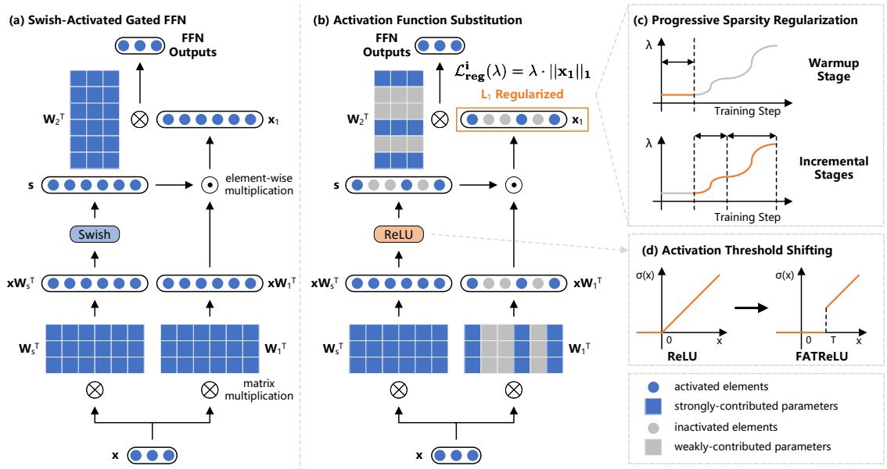
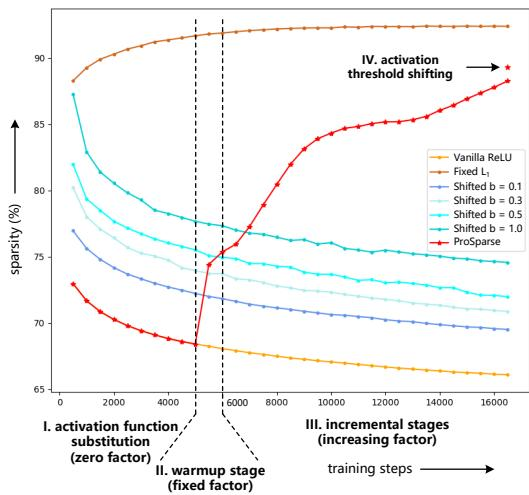
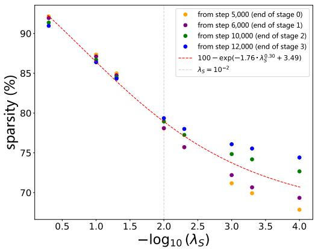
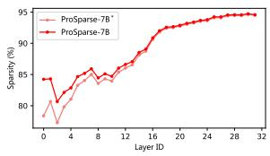
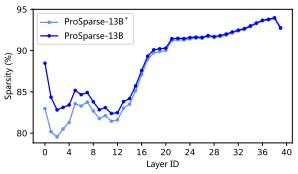

# ProSparse: Introducing and Enhancing Intrinsic Activation Sparsity within Large Language Models

Chenyang Song<sup>1</sup>, Xu Han<sup>1∗</sup>, Zhengyan Zhang<sup>1</sup>, Shengding Hu<sup>1</sup>, Xiyu Shi<sup>2</sup> Kuai Li<sup>3</sup>, Chen Chen<sup>3</sup>, Zhiyuan Liu<sup>1</sup>\*, Guangli Li<sup>2</sup>, Tao Yang<sup>3</sup>, Maosong Sun<sup>1</sup> <sup>1</sup> Dept. of Comp. Sci. & Tech., Institute for AI, Tsinghua University, Beijing, China <sup>2</sup> SKLP, Institute of Computing Technology, Chinese Academy of Sciences, China <sup>3</sup> Tencent Machine Learning Platform, China

scy22@mails.tsinghua.edu.cn, {han-xu,liuzy}@tsinghua.edu.cn

## Abstract

Activation sparsity refers to the existence of considerable weakly-contributed elements among activation outputs, serving as a promising paradigm for accelerating model inference. Nevertheless, most large language models (LLMs) adopt activation functions without intrinsic activation sparsity (e.g., GELU and Swish). Some recent efforts have explored introducing ReLU or its variants as the substitutive activation function to pursue activation sparsity and acceleration, but few can simultaneously obtain high activation sparsity and comparable model performance. This paper introduces a simple and effective method named “ProSparse” to sparsify LLMs while achieving both targets. Specifically, after introducing ReLU activation, ProSparse adopts progressive sparsity regularization with a factor smoothly increasing for multiple stages. This can enhance activation sparsity and mitigate performance degradation by avoiding radical shifts in activation distributions. With ProSparse, we obtain high sparsity of 89.32% for LLaMA2-7B, 88.80% for LLaMA2-13B, and 87.89% for end-size MiniCPM-1B, respectively, with comparable performance to their original Swish-activated versions. These present the most sparsely activated models among open-source LLaMA versions and competitive end-size models. Inference acceleration experiments further demonstrate the significant practical acceleration potential of LLMs with higher activation sparsity, obtaining up to 4.52× inference speedup.

## 1 Introduction

Recent years have witnessed significant breakthroughs made by large language models (LLMs) with commendable performance across a wide range of NLP tasks (Brown et al., 2020; Wei et al.,

2021; Ouyang et al., 2022; OpenAI, 2023; Achiam et al., 2023). Nevertheless, the formidable computational costs required by the deployment and inference of LLMs pose a considerable challenge (Aminabadi et al., 2022; Pope et al., 2023). The utilization of activation sparsity is one of the most promising techniques to enhance inference efficiency (Liu et al., 2023; Song et al., 2023), by discarding the redundant computation associated with the elements among LLM activation outputs that contribute weakly to the final outputs.

The adoption of ReLU, which naturally outputs zero elements, as the activation function is a straightforward method to achieve intrinsic activation sparsity in early LLMs (Raffel et al., 2020; Zhang et al., 2022a). However, recent LLMs predominantly favor non-ReLU activation functions, such as GELU and Swish (Touvron et al., 2023a; Chowdhery et al., 2023; Almazrouei et al., 2023). Although these non-ReLU LLMs may also display activation sparsity (Zhang et al., 2024), such sparsity is manually imposed by searching adaptive activation thresholds (i.e., non-intrinsic), which can potentially lose minor neuron outputs and degrade performance. To pursue the sparsity-based inference acceleration, the task of ReLUfication is proposed, aiming to introduce ReLU-based intrinsic activation sparsity into non-ReLU LLMs. Preliminary methods (Zhang et al., 2022b, 2024) directly substitute the activation functions with ReLU. As such substitution cannot overcome the inherent limitation imposed by the original dense activation distribution, inserted and shifted ReLU functions (Mirzadeh et al., 2023) are introduced to enforce higher sparsity through radically shifting the activation distribution. However, existing efforts fail to achieve satisfactory sparsity and risk performance degradation.

In this paper, we propose a simple and effective ReLUfication method named “ProSparse” to help non-ReLU LLMs obtain high activation sparsity without performance degradation. ProSparse includes three steps shown in Figure 1: activation function substitution, progressive sparsity regularization, and activation threshold shifting. The first step is to replace the activation function with ReLU and then apply continual training. As discussed above, this can hardly achieve satisfactory sparsity. Therefore, in the second step, we apply sparsity regularization (Ma et al., 2019) to the intermediate activation outputs of the feed-forward networks (FFNs) within LLMs to seek higher sparsity. Considering the potential performance risks of forcing the fixed regularization factor (Ma et al., 2019; Li et al., 2020), we progressively increase the factor in multiple stages, including one flat warmup stage and multiple incremental stages along gentle sine curves. Such progressive regularization can provide more time for adaption to increasing regularization and avoid a radical shift in activation distribution, thereby mitigating performance degradation. The final step adopts FATReLU (Kurtz et al., 2020), shifting the ReLU activation threshold to a positive value. This prunes less influential neurons to improve sparsity.

  
Figure 1: The overall architecture of ProSparse, which includes three steps: activation function substitution, progressive sparsity regularization, and activation threshold shifting.

In experiments, we apply ProSparse to the Re-LUfication of LLaMA2 (Touvron et al., 2023b) and end-size MiniCPM (Hu et al., 2024). Activation sparsity of 89.32%, 88.80%, and 87.89% are successfully achieved for LLaMA2-7B, LLaMA2- 13B, and MiniCPM-1B, respectively, with performance comparable to their original Swish-activated versions on various LLM benchmarks. Furthermore, we demonstrate the practical inference acceleration of higher activation sparsity, by respectively applying an approximate algorithm and an accurate algorithm to the inference of models with different sparsity. For the approximate one, we use PowerInfer (Song et al., 2023), which achieves state-of-theart speedup ratios tailored for sparsely activated LLMs but risks inaccurate inference due to the mistakes of activation predictors. For the accurate one, we implement and release two GPU operators that leverage the input-side and output-side sparsity during the computation of ReLU-activated FFNs<sup>\*</sup>.

The experimental results demonstrate that models with higher sparsity can achieve more significant inference acceleration with both approximate and accurate algorithms (e.g., up to 4.52× speedup with PowerInfer). Moreover, comprehensive analyses are conducted to figure out the quantitative relationship between the activation sparsity and the regularization factor, making the activation sparsity obtained by ProSparse more controllable. We also discuss the rationality of progressive L<sub>1</sub> regularization, empirical methods of performing supervised fine-tuning (SFT) on sparsely activated models, and the sparsity distribution among distinct datasets or layers.

In summary, we make the following contributions in this paper: (1) We propose ProSparse, an effective ReLUfication method that converts non-ReLU LLMs into much sparser ReLUactivated LLMs without performance degradation. (2) Sparsely activated versions of LLaMA2-7B, LLaMA2-13B, and MiniCPM-1B comparable to their original Swish-activated versions in performance are both obtained and available<sup>†</sup>. (3) We demonstrate the practical inference acceleration effect of higher activation sparsity that ProSparse can reach. Valuable observations and analyses are also conducted.

## 2 Preliminaries and Related Works

Here we discuss how to improve LLM inference efficiency. Refer to existing surveys (Zhao et al., 2023) for works about LLMs and Appendix A for works about $L _ { 1 }$ regularization.

Inference Acceleration for LLMs Efficiency has long been a crucial topic in various AI applications (Chen et al., 2023b). The sustainable increase in LLM scales brings the exponential growth of inference computations, making the deployment of LLMs a formidable challenge (Kaplan et al., 2020; Liu et al., 2023). To reduce the computational costs required by LLM inference, various model compression or decoding acceleration methods have been proposed, such as quantization (Jacob et al., 2018; Nagel et al., 2019; Zhao et al., 2019; Bai et al., 2022; Xiao et al., 2023; Yao et al., 2023), pruning (Hoefler et al., 2021; Ma et al., 2023; Sun et al., 2023; Frantar and Alistarh, 2023; Xia et al., 2023), distillation (Tang et al., 2019; Touvron et al., 2021; Gu et al., 2023; Hsieh et al., 2023), and efficient sampling methods (Leviathan et al., 2023; Wang et al., 2023; Chen et al., 2023a; Miao et al., 2023). While these works have proved effective for inference acceleration and other scenarios (e.g., secure federated learning (Ding et al., 2023b)), none of these methods leverages the intrinsic mechanisms within LLMs.

Activation Sparsity Recent works (Li et al., 2022; Liu et al., 2023; Song et al., 2023) have noticed the intrinsic activation sparsity within some LLMs and its potential in inference acceleration. Activation sparsity refers to the phenomenon where considerable zero or negligible elements in activation outputs, corresponding to certain model parameters (i.e., neurons), have a weak impact on

LLM outputs given a specific input. These weaklycontributed parameters are regarded as inactivated and can thus be skipped during inference to save computational resources. Notably, the utilization of activation sparsity is orthogonal to model compression and efficient sampling, and these approaches can be readily combined. Another fact worth attention is the fundamental difference between activation sparsity and pruning, see Appendix A.

ReLUfication Activation sparsity naturally exists in ReLU-activated architecture (Li et al., 2022), from LLMs (Raffel et al., 2020; Zhang et al., 2022a) to vision models (Dosovitskiy et al., 2020). However, recent LLMs such as Falcon (Almazrouei et al., 2023) and LLaMA (Touvron et al., 2023b) prevalently adopt non-ReLU activation functions such as GELU (Hendrycks and Gimpel, 2016) and Swish (Elfwing et al., 2018) without intrinsic activation sparsity. Therefore, to leverage the merits of activation sparsity without training a ReLUactivated LLM from scratch, many works conduct ReLUfication, introducing sparse ReLU-based activations into non-ReLU LLMs. Zhang et al. (2022b) converts a GELU-activated BERT (Devlin et al., 2018) into a ReLU-activated version through activation function substitution and additional training. ReluLLaMA and ReluFalcon apply a similar paradigm to Falcon and LLaMA, respectively (Zhang et al., 2024). Since activation substitution cannot reach satisfactory sparsity, mainly due to the unhandled limitation of the original dense activation distribution, the inserted and shifted ReLU activation functions are introduced (Mirzadeh et al., 2023), conducting a radical shift in activation distribution. Although these operations are claimed to achieve sparsity of nearly 95%, we cannot replicate the results in our experiments (see the 3rd paragraph of Section 4.4) and the sparsity is still limited. By contrast, ProSparse is a ReLUfication method designed to achieve high sparsity and mitigate performance degradation concurrently.

## 3 Methods

## 3.1 Definitions and Notations

For the convenience of subsequent demonstrations, here we define activation sparsity in detail. Since the activation function mainly exists in the FFNs within LLMs, we first discuss the computation process of FFNs. Given the hidden dimension d<sub>model</sub> and the intermediate dimension $d _ { f f }$ , the computation process of a gated FFN (i.e., the most widely adopted FFN architecture in recent LLMs (Dauphin et al., 2017; Shazeer, 2020)) can be formalized as:

$$
\begin{array} { r } { \mathbf { s } = \sigma ( \mathbf { x } \mathbf { W } _ { s } ^ { T } ) , \mathbf { x } _ { 1 } = \mathbf { s } \odot ( \mathbf { x } \mathbf { W } _ { 1 } ^ { T } ) , } \\ { \mathbf { F F N } ( \mathbf { x } ) = \mathbf { x } _ { 1 } \mathbf { W } _ { 2 } ^ { T } , \qquad } \end{array}\tag{1}
$$

where $\mathbf { x } \in \mathbb { R } ^ { d _ { m o d e l } } , \mathbf { s } , \mathbf { x } _ { 1 } \in \mathbb { R } ^ { d _ { f f } } , \sigma ,$ , and $\odot$ denote the input hidden states, the gating scores, the intermediate outputs, the activation function, and the element-wise multiplication respectively. $\mathbf { W } _ { s } , \mathbf { W } _ { 1 } \in \mathbb { R } ^ { d _ { f f } \times d _ { m o d e l } }$ and $\mathbf { W } _ { 2 } \in \mathbb { R } ^ { d _ { m o d e l } \times d _ { f f } }$ are learnable weights.

We define the activation sparsity (hereinafter abbreviated as sparsity) as the ratio of zero elements (i.e., inactivated elements) in $\mathbf { x } _ { 1 }$ for a specific input x. The sparsity of an LLM is evaluated using the average sparsity, defined as the average value of sparsity across all layers in an LLM on a sufficiently large amount of input data.

In this paper, we focus on the task of ReLUfication, namely converting an LLM using a non-ReLU activation function $\sigma$ (e.g., GELU or Swish) into a ReLU-activated one, while making the average sparsity as high as possible and mitigating performance degradation.

## 3.2 ProSparse

We propose ProSparse to achieve the above targets. Three steps are carefully designed to introduce and enhance the intrinsic activation sparsity for a non-ReLU LLM: (1) activation function substitution; (2) progressive sparsity regularization; (3) activation threshold shifting.

Activation Function Substitution For lack of attention to activation sparsity, a majority of recent mainstream LLMs adopt non-ReLU activation functions such as GELU and Swish that output few zero elements (i.e., low activation sparsity according to the above definition). Therefore, the first step of ProSparse is to introduce intrinsic sparsity through activation function substitution, which replaces the FFN activation function $\sigma$ with ReLU, namely $\sigma ( x ) = \operatorname* { m a x } ( x , 0 )$ , followed by continual training. This can make the ratio of zero activation elements significantly larger and preliminarily adapt the LLM to new ReLU activation.

Progressive Sparsity Regularization Nevertheless, activation function substitution by nature does not change the activation distribution, which will potentially limit the sparsity to relatively low values. To push for higher sparsity, a typical method is $L _ { 1 }$ sparsity regularization (Li et al., 2022), which introduces the $L _ { 1 }$ regularization loss as an extra training target. Given the intermediate output $\mathbf { x } _ { 1 }$ of the i-th FFN layer in an LLM, the regularization loss is defined as:

$$
\mathcal { L } _ { r e g } ^ { i } ( \lambda ) = \lambda \cdot | | \mathbf { x } _ { 1 } | | _ { 1 } ,\tag{2}
$$

where $| | \cdot | | _ { 1 }$ is the $L _ { 1 }$ norm operator and λ is the regularization factor. For an LLM with K FFN layers, the total regularization loss is summed from the losses of all layers, namely $\mathcal { L } _ { r e g } ( \lambda ) =$ $\begin{array} { r } { \sum _ { i = 1 } ^ { K } \mathcal { L } _ { r e g } ^ { i } ( \lambda ) } \end{array}$ . The overall optimization target is $\mathcal { L } _ { l m } + \mathcal { L } _ { r e g } ( \lambda )$ , where $\mathcal { L } _ { l m }$ is the vanilla language modeling loss.

Considering the potential performance degradation due to fixed regularization factors (Georgiadis, 2019; Kurtz et al., 2020; Li et al., 2022), we propose the progressive sparsity regularization, where the factor λ is carefully scheduled to gently increase in multiple stages. Refer to Appendix B for more details.

Concretely, for the warmup stage, we set λ to a constant value, which is relatively small to prevent radical activation distribution shifts and introduce higher preliminary sparsity. Next, for each of the remaining stages (called incremental stages), λ is scheduled to increase along a smooth sine curve from a trough value to a peak value. Inspired by the cosine annealing scheduler for learning rates (Loshchilov and Hutter, 2016), we choose the sine function owing to its special trend, as the small derivatives near its troughs and peaks can make λ not increase radically around these two points. This provides the LLMs with more time to adapt the activation distributions to the newly increased $L _ { 1 }$ regularization. Notably, each stage is accompanied by certain steps of training. The step numbers and peak λ values are chosen according to the target sparsity and stability.

Activation Threshold Shifting As demonstrated by recent works, there exist considerable amounts of non-zero low elements in the activation outputs, which have little influence on final results and thus can be pruned for higher sparsity (Zhang et al., 2024). Therefore, we convert the ReLU into FA-TReLU (Kurtz et al., 2020) by shifting the activation threshold, i.e.,

$$
\sigma ( x ) = { \left\{ \begin{array} { l l } { x } & { { \mathrm { w h e n ~ } } x \geq t , } \\ { 0 } & { { \mathrm { o t h e r w i s e } } , } \end{array} \right. }\tag{3}
$$

where $t > 0$ is a positive threshold. As long as t is properly chosen (see Appendix O), FATReLU can increase sparsity with negligible losses (Zhang et al., 2024).

## 3.3 Practical Inference Acceleration

To go beyond theoretical analyses based on FLOPS (Floating Point Operations Per Second) (Mirzadeh et al., 2023) and establish the practical value of ProSparse, we discuss how to realize inference acceleration with sparsely activated LLMs on real hardware and how to evaluate the practical acceleration effects. We consider two categories of acceleration algorithms based on activation sparsity: approximate algorithms and accurate algorithms.

Approximate Acceleration Algorithms Utilizing activation sparsity, recent approximate acceleration algorithms predominantly rely on activation predictors, typically small neural networks, to forecast the activation distributions indicated by the sparse intermediate outputs x<sub>1</sub> given a specific input x (Liu et al., 2023; Song et al., 2023). In this way, they can make wiser hardware allocation or computation policies to avoid resource waste on weakly-contributed parameters. However, their efficiency and accuracy largely depend on the predictors’ performance, and invalid predictions can cause suboptimal hardware allocation or even inference inaccuracy. Therefore, to gain more practical acceleration effects from approximate algorithms, both high activation sparsity and predictability are indispensable.

To this end, we focus on three metrics for acceleration analysis: the activation recall, the predicted sparsity, and the inference speed. The former two metrics evaluate the performance of activation predictors as well as the activation predictability of a sparse LLM (Zhang et al., 2024). For inference speed, we adopt PowerInfer (Song et al., 2023), a state-of-the-art approximate algorithm to measure practical speedup ratios. Refer to Appendix C for more related introductions and the detailed approach to calculating these metrics.

Accurate Acceleration Algorithms Targeting acceleration without potential inference inaccuracies, we implement two hardware-efficient sparse GPU operators with system-level optimizations, such as operator fusion, coalesced memory access, and vectorization, thereby exploiting input-side and output-side sparsity in Equation 1.

Concretely, we reorganize a ReLU-activated gated FFN into three major steps and our two operators are responsible for the step (2) and (3) respectively: (1) A dense matrix-vector multiplication operator $\mathbf { x } \mathbf { W } _ { s } ^ { T }$ directly supported by vendor libraries such as cuBLAS; (2) A fused operator of ReLU and $\mathbf { s } \odot ( \mathbf { x } \mathbf { W } _ { 1 } ^ { T } )$ with output-side sparsity; (3) A sparse matrix-vector multiplication operator $\mathbf { x } _ { 1 } \mathbf { W } _ { 2 } ^ { T }$ with input-side sparsity. We adopt the single-step speedup ratios of steps (2) and (3) with these two operators respectively to reflect the practical accurate acceleration potential of sparse LLMs. Refer to Appendix D for implementation details.

## 4 Experiments

## 4.1 Experimental Settings

Our training data consists of both language modeling datasets and instruction tuning datasets. For evaluation, we adopt comprehensive benchmarks covering code generation, commonsense reasoning, reading comprehension, and 4 other popular tasks. Refer to Appendix E for more details.

## 4.2 Overall Results

We apply ProSparse to Swish-activated LLaMA2- 7B, LLaMA2-13B (Touvron et al., 2023b), and MiniCPM-1B (Hu et al., 2024). The obtained sparsely activated models are then compared with their original Swish-activated versions. For comprehensiveness, we also consider ReluLLaMA<sup>‡</sup>, the only open-source ReLU-based LLMs finetuned from LLaMA2. All the average sparsity values are computed on the same mixed dataset sampled from training datasets. For more hyperparameters, see Appendix L and O.

Results are shown in Table 1 (see Appendix G for performance on each independent benchmark). We can draw three conclusions:

(1) Effectiveness: ProSparse simultaneously achieves high sparsity and comparable downstream performance for all the three Swish-activated models considered. The activation sparsity obtained by ProSparse is significantly higher than ReluLLaMA, reaching the state-of-the-art level among all the open-source LLaMA versions and competitive endsize models.

(2) Scale Generalizability: The effectiveness of ProSparse consistently holds under three model scales. The promising results on the end-size model (i.e., MiniCPM-1B) reveal the potential of ProSparse as well as activation sparsity on end-user devices, where the inference efficiency of LLMs is significantly emphasized.

<table><tr><td>Setting</td><td>Code Generation</td><td>Commonsense Reasoning</td><td>Reading Comprehension</td><td>GSM8K MMLU BBH AGI Eval</td><td></td><td></td><td></td><td>Average Performance</td><td>Average Sparsity</td></tr><tr><td>LLaMA2-7B</td><td>16.37</td><td>69.59</td><td>61.87</td><td>12.96</td><td>44.45</td><td>32.96</td><td>27.53</td><td>37.96</td><td></td></tr><tr><td>ReluLLaMA-7B</td><td>15.85</td><td>69.64</td><td>70.54</td><td>5.84</td><td>38.64</td><td>35.07</td><td>27.73</td><td>37.62</td><td>66.98</td></tr><tr><td>ProSparse-7B*</td><td>19.47</td><td>66.29</td><td>63.33</td><td>12.74</td><td>45.21</td><td>33.59</td><td>27.55</td><td>38.31</td><td>88.11</td></tr><tr><td>ProSparse-7B</td><td>19.42</td><td>66.27</td><td>63.50</td><td>12.13</td><td>45.48</td><td>34.99</td><td>27.46</td><td>38.46</td><td>89.32</td></tr><tr><td>LLaMA2-13B</td><td>20.19</td><td>72.58</td><td>71.55</td><td>22.21</td><td>54.69</td><td>37.89</td><td>29.33</td><td>44.06</td><td></td></tr><tr><td>ReluLLaMA-13B</td><td>20.19</td><td>70.44</td><td>73.29</td><td>18.50</td><td>50.58</td><td>37.97</td><td>28.22</td><td>42.74</td><td>71.56</td></tr><tr><td>ProSparse-13B*</td><td>29.03</td><td>69.75</td><td>67.54</td><td>25.40</td><td>54.78</td><td>40.20</td><td>28.76</td><td>45.07</td><td>87.97</td></tr><tr><td>ProSparse-13B</td><td>28.42</td><td>69.76</td><td>66.91</td><td>26.31</td><td>54.35</td><td>39.90</td><td>28.67</td><td>44.90</td><td>88.80</td></tr><tr><td>MiniCPM-1B</td><td>36.85</td><td>63.67</td><td>60.90</td><td>35.48</td><td>50.44</td><td>35.03</td><td>28.71</td><td>44.44</td><td></td></tr><tr><td>ProSparse-1B*</td><td>41.38</td><td>64.55</td><td>60.69</td><td>34.72</td><td>49.36</td><td>34.04</td><td>28.27</td><td>44.72</td><td>86.25</td></tr><tr><td>ProSparse-1B</td><td>42.04</td><td>64.37</td><td>60.73</td><td>34.57</td><td>49.51</td><td>34.08</td><td>27.77</td><td>44.72</td><td>87.89</td></tr></table>

Table 1: The overall experimental results with the comparison of activation sparsity (%) and downstream performance (%). $\mathbf { \ddot { \Gamma } } \mathrm { L L a M A } 2 ^ { \prime \prime }$ and “MiniCPM” refer to the original Swish-activated LLaMA2 (Touvron et al., 2023b) and MiniCPM (Hu et al., 2024) versions respectively. “ProSparse-7B<sup>∗</sup>”, “ProSparse-13B<sup>∗</sup>”, and “ProSparse-1B<sup>∗</sup>” denote the ProSparse versions without activation threshold shifting.

(3) Effect of Activation Threshold Shifting: Based on the results without activation threshold shifting (i.e., those with the “<sup>∗</sup>” marker), we can demonstrate the effectiveness of this technique in improving the sparsity without compromising performance. Notably, the threshold t must be carefully chosen, see Appendix O.

## 4.3 Acceleration Effect of Sparsity

Approximate Acceleration Algorithm In this section, we train the activation predictors for each sparse LLM and compute the recalls, predicted sparsity, and actual inference speeds on PowerInfer (Song et al., 2023). As the FFN in each Transformer layer has different activation distributions as well as different predictors, the former two metrics are averaged from the results of all layers. Note that MiniCPM-1B has not been tested since PowerInfer does not support its architecture at present. Refer to Appendix F for training details of predictors.

As demonstrated by the results shown in Table 2, compared with llama.cpp<sup>§</sup>, an acceleration framework without sparsity utilization, PowerInfer achieves up to 4.52× speedup, revealing the significant potential of sparsity-based acceleration. Moreover, an increased activation sparsity can considerably improve the activation recall, the predicted sparsity, and the inference speed of PowerInfer. This proves the considerable practical values of even more sparsely activated LLMs in improving the inference speed with predictor-based approximate acceleration algorithms and mitigating the inaccurate inference problem. ProSparse, which reaches a high sparsity without performance degradation, can thus gain the most acceleration effects with PowerInfer.

Accurate Acceleration Algorithm Furthermore, with LLMs of different sparsity, we measure the average single-step wall-clock time spent by our two sparse GPU operators, which are responsible for step (2) and step (3) in Section 3.3 respectively. As demonstrated in Table 2, higher activation sparsity can make accurate algorithms based on GPU operators more efficient. Besides, our two sparse GPU operators also display satisfactory speedup ratios up to 2.44× and 1.70× respectively with better acceleration effects for larger models. Note that despite the less significant acceleration effects than PowerInfer, our GPU operators are highly pluggable, predictor-free, and immune to potential inference accuracies.

## 4.4 Analysis and Discussion

Q1: What is the effect of $L _ { 1 }$ regularization and its trend of increase? For this question, we consider two regularization-free ReLUfication baselines: vanilla ReLU (Zhang et al., 2024) and shifted ReLU (Mirzadeh et al., 2023). Both only include the substitution of activation functions with ReLU (i.e., max(x, 0)) and shifted ReLU (i.e., max $( x - b , 0 )$ , where b is a tunable bias) respectively.

First, we consider the training dynamics of the above two baselines and ProSparse, as shown in Figure 2. The setting “Fixed ${ { L } _ { 1 } } ^ { \prime }$ is a reference setting with a constant regularization factor. Clearly, the training stages with increasing sparsity only include those with regularization applied, namely the whole “Fixed ${ { L } _ { 1 } } ^ { \prime \prime }$ , the warmup stage, and the incremental stages of ProSparse. Therefore, among the settings involved, the trend of sparsity is incremental only if non-zero $L _ { 1 }$ regularization is applied<sup>¶</sup>. Neither vanilla ReLU nor shifted ReLU can push for higher sparsity without regulatization.

<table><tr><td></td><td></td><td colspan="4">Approximate Acceleration</td><td colspan="4">Accurate Acceleration</td></tr><tr><td>Setting</td><td>Average Sparsity</td><td>Activation Recall</td><td>Predicted Sparsity</td><td>Inference Speed</td><td>Speedup to Dense</td><td>Step (2) Time (↓)</td><td>Speedup to Dense</td><td>Step (3) Time (↓)</td><td>Speedup to Dense</td></tr><tr><td>Dense-7B</td><td></td><td></td><td></td><td>3.67</td><td>1.00</td><td>90.55</td><td>1.00</td><td>82.92</td><td>1.00</td></tr><tr><td>ReluLLaMA-7B</td><td>66.98</td><td>90.89</td><td>58.95</td><td>11.37</td><td>3.10</td><td>67.12</td><td>1.35</td><td>63.00</td><td>1.32</td></tr><tr><td>ProSparse-7B*</td><td>88.11</td><td>93.46</td><td>75.24</td><td>16.30</td><td>4.44</td><td>46.66</td><td>1.94</td><td>55.56</td><td>1.49</td></tr><tr><td>ProSparse-7B</td><td>89.32</td><td>92.34</td><td>78.75</td><td></td><td></td><td>45.38</td><td>2.00</td><td>55.05</td><td>1.51</td></tr><tr><td>Dense-13B</td><td></td><td></td><td></td><td>1.92</td><td>1.00</td><td>131.36</td><td>1.00</td><td>113.68</td><td>1.00</td></tr><tr><td>ReluLLaMA-13B</td><td>71.56</td><td>86.41</td><td>71.93</td><td>6.59</td><td>3.43</td><td>69.92</td><td>1.88</td><td>75.47</td><td>1.51</td></tr><tr><td>ProSparse-13B*</td><td>87.97</td><td>91.02</td><td>77.93</td><td>8.67</td><td>4.52</td><td>55.29</td><td>2.38</td><td>67.50</td><td>1.68</td></tr><tr><td>ProSparse-13B</td><td>88.80</td><td>91.11</td><td>78.28</td><td></td><td></td><td>53.78</td><td>2.44</td><td>66.73</td><td>1.70</td></tr></table>

† For “Dense” settings, the “Inference Speed” is obtained by llama.cpp, and the time for steps (2) and (3) is measured without sparse GPU operators. For other sparse settings, the “Inference Speed” is obtained by PowerInfer, and sparse GPU operators are applied. ProSparse settings with activation threshold shifting and the MiniCPM architecture are not supported by PowerInfer at present.

Table 2: The comparison of activation recalls (%), predicted sparsity (%), inference speeds (tokens per second) by llama.cpp (Dense) or PowerInfer (others), and the average wall-clock time (us) without (Dense) or with (others) our sparse GPU operators among LLMs with different sparsity. “Step (2)” and “Step (3)” correspond to the steps in Section 3.3.  
  
Figure 2: The trend of sparsity (7B models) along the training process. “Shifted” denotes Shited ReLU and $b = 0 . 1$ corresponds to the results in Table 4.

However, concerns may naturally arise about the performance, as the additional $L _ { 1 }$ loss term can unavoidably influence the optimization of the language modeling target. For this problem, we evaluate the above methods given different numbers of training tokens. Through experiments (see Appendix H), while a performance gap exists between ProSparse and two baselines given limited 34.60B tokens, it obtains comparable performance when sufficient 89.13B tokens are provided and thus the regularization can increase more smoothly, with a final sparsity value close to the limited-token setting. Therefore, $L _ { 1 }$ regularization can reach far higher activation sparsity and maintain comparable performance to regularization-free methods with a sufficiently smooth increase trend of the factor, at the cost of an acceptable rise in training tokens (i.e., 54.53B, only 2.73% of the 2T tokens used to pre-train LLaMA2 (Touvron et al., 2023b)).

  
Figure 3: The activation sparsity obtained by applying different final-stage regularization factors $\lambda _ { S }$ to the checkpoints at different training stages (16,500 steps in total) of ProSparse-7B.

Q2: How to reach a target activation sparsity value? Considering the additional training costs needed to reach higher sparsity, a common requirement lies in how to manipulate ProSparse to reach a desired sparsity given a limited computation budget. The key challenge is the search for suitable regularization factors. To this end, we manage to find the quantitative relationship between the final activation sparsity and the regularization factors to avoid the empirical hyper-parameter search.

Specifically, we select checkpoints at different training stages of ProSparse-7B (see Table 6), apply a constant regularization factor $\lambda _ { S } ,$ and then resume training for sufficient steps (i.e., no less than 4,000 steps) as the last regularization stage. With the same accumulated training token numbers as ProSparse-7B, we can obtain different activation sparsity by tuning the value of $\lambda _ { S }$ . The results shown in Figure 3 provide two observations: (1) The final activation sparsity is mainly dependent on the last-stage regularization factor $\lambda _ { S }$ when $\lambda _ { S }$ is relatively large $( \mathrm { e . g . , } \lambda _ { S } > = 1 0 ^ { - 2 }$ for ProSparse-7B). (2) The activation sparsity shows a negative exponential relationship with $\lambda _ { S } ^ { \alpha } .$ For ProSparse-7B, specifically, the sparsity approximates $1 0 0 - \exp ( - 1 . 7 6 \cdot \lambda _ { S } ^ { 0 . 3 0 } + 3 . 4 9 )$ (i.e., the red fitted curve in Figure 3). In summary, to reach a given relatively high sparsity level (e.g., sparsity larger than 80%, satisfying $\lambda _ { S } > = 1 0 ^ { - 2 } )$ , the only thing needed is to control the regularization factor $\lambda _ { S }$ of the final progressive regularization stage. Therefore, given the fixed model size, ProSparse is a highly controllable ReLUfication method in terms of sparsity adjustment.

Q3: Is progressive sparsity regularization effective? If the activation sparsity mainly depends on the final-stage regularization factor, why should we increase the factor progressively? The answer lies in the performance concern. To substantiate the effectiveness of progressive sparsity regularization, the second step of ProSparse, we conduct ablation studies by making the regularization factor constant throughout the training process after activation function substitution. By setting the factor to 0.1, we obtain a model with activation sparsity of 88.62%, slightly lower than ProSparse-7B (89.32%). However, with the same number of training tokens, this model only has an average performance of 36.34%, considerably lower than ProSparse-7B (38.46%). Similarly, for the 13B setting, we obtain a model with the comparable sparsity of 88.96% and an average performance of 42.85%, lower than ProSparse-13B (see Appendix I). Therefore, progressive sparsity regularization is indispensable in mitigating the performance degradation caused by ReLUfication.

Q4: How to SFT sparsely activated models? It is non-trivial to apply SFT to sparsely activated models obtained by ProSparse. Our practice of training ProSparse-1B can provide some experience: SFT can be applied to sparsely activated models obtained by ProSparse with a well-chosen regularization factor, and this factor for SFT is empirically smaller than $\lambda _ { S }$ to accommodate newly injected knowledge and avoid performance degradation. See Appendix J for more details and observations.

Q5: How does the sparsity distribute? Another interesting observation is the imbalanced sparsity distributions among distinct datasets and layers. Specifically, the activation sparsity of ProSparse models is higher on more formatted instruction tuning datasets and higher layers (i.e., layers closer to outputs). More detailed analyses are provided in Appendix M and N.

## 5 Conclusion

In this work, we propose ProSparse, an effective ReLUfication method for introducing and enhancing intrinsic activation sparsity from non-ReLU LLMs with comparable performance. Extensive experiments demonstrate the effectiveness of ProSparse and its practical values in inference acceleration with various algorithms. Deeper analyses concerned with certain ProSparse techniques, model properties, and SFT issues further substantiate the practicality of ProSparse and provide valuable insights.

## Broader Impacts

This paper presents a simple and effective method, ProSparse, for introducing and enhancing ReLUbased intrinsic activation sparsity into non-ReLU LLMs. There may exist many potential societal consequences of our work, none of which we feel must be specifically highlighted here.

## Limitations

Firstly, more comprehensive studies on huge-scale models (e.g., 70B or more) should be included in the future given sufficient computing resources. Moreover, we only focus on the sparsity-based acceleration of step (2) and step (3) of FFN, leaving a considerable ratio of LLM computation unoptimized. Actually, there already exist preliminary works in the sparsification of the attention layers (Shen et al., 2023; Wortsman et al., 2023). Methods such as pruning and low-rank decomposition may also be helpful in optimizing the FFN step (1) (Ji et al., 2024). For future works, we will continue to explore how to introduce and enhance sparsity in the attention layer as well as the acceleration issue of the FFN step (1).

## Acknowledgments

This work is supported by National Natural Science Foundation of China (No. 62236004, No. 62236011, No. 62302479), China Postdoctoral Science Foundation (2023M733566), and Institute Guo Qiang at Tsinghua University.

## References

Josh Achiam, Steven Adler, Sandhini Agarwal, Lama Ahmad, Ilge Akkaya, Florencia Leoni Aleman, Diogo Almeida, Janko Altenschmidt, Sam Altman, Shyamal Anadkat, et al. 2023. GPT-4 technical report. arXiv preprint arXiv:2303.08774.

Ebtesam Almazrouei, Hamza Alobeidli, Abdulaziz Alshamsi, Alessandro Cappelli, Ruxandra Cojocaru, Mérouane Debbah, Étienne Goffinet, Daniel Hesslow, Julien Launay, Quentin Malartic, et al. 2023. The Falcon series of open language models. arXiv preprint arXiv:2311.16867.

Reza Yazdani Aminabadi, Samyam Rajbhandari, Ammar Ahmad Awan, Cheng Li, Du Li, Elton Zheng, Olatunji Ruwase, Shaden Smith, Minjia Zhang, Jeff Rasley, et al. 2022. DeepSpeed-Inference: enabling efficient inference of Transformer models at unprecedented scale. In SC22: International Conferencefor High Performance Computing, Networking, Storage and Analysis, pages 1–15. IEEE.

Jacob Austin, Augustus Odena, Maxwell Nye, Maarten Bosma, Henryk Michalewski, David Dohan, Ellen Jiang, Carrie Cai, Michael Terry, Quoc Le, et al. 2021. Program synthesis with large language models. arXiv preprint arXiv:2108.07732.

Haoli Bai, Lu Hou, Lifeng Shang, Xin Jiang, Irwin King, and Michael R Lyu. 2022. Towards efficient posttraining quantization of pre-trained language models. Advances in Neural Information Processing Systems, 35:1405–1418.

Yonatan Bisk, Rowan Zellers, Jianfeng Gao, Yejin Choi, et al. 2020. PIQA: Reasoning about physical commonsense in natural language. In Proceedings ofthe AAAI conference on artificial intelligence, volume 34, pages 7432–7439.

Tom Brown, Benjamin Mann, Nick Ryder, Melanie Subbiah, Jared D Kaplan, Prafulla Dhariwal, Arvind Neelakantan, Pranav Shyam, Girish Sastry, Amanda Askell, et al. 2020. Language models are few-shot learners. Advances in neural information processing systems, 33:1877–1901.

Charlie Chen, Sebastian Borgeaud, Geoffrey Irving, Jean-Baptiste Lespiau, Laurent Sifre, and John Jumper. 2023a. Accelerating large language model decoding with speculative sampling. arXiv preprint arXiv:2302.01318.

Jiajun Chen, Yin Gao, Zhuang Liu, and Dapeng Li. 2023b. Future vision on artificial intelligence assisted green energy efficiency network. ZTE Communications, 21(2).

Mark Chen, Jerry Tworek, Heewoo Jun, Qiming Yuan, Henrique Ponde de Oliveira Pinto, Jared Kaplan, Harri Edwards, Yuri Burda, Nicholas Joseph, Greg Brockman, et al. 2021. Evaluating large language models trained on code. arXiv preprint arXiv:2107.03374.

Yu Cheng, Duo Wang, Pan Zhou, and Tao Zhang. 2017. A survey of model compression and acceleration for deep neural networks. arXiv preprint arXiv:1710.09282.

Aakanksha Chowdhery, Sharan Narang, Jacob Devlin, Maarten Bosma, Gaurav Mishra, Adam Roberts, Paul Barham, Hyung Won Chung, Charles Sutton, Sebastian Gehrmann, et al. 2023. PaLM: Scaling language modeling with pathways. Journal ofMachine Learning Research, 24(240):1–113.

Christopher Clark, Kenton Lee, Ming-Wei Chang, Tom Kwiatkowski, Michael Collins, and Kristina Toutanova. 2019. BoolQ: Exploring the surprising difficulty of natural yes/no questions. In Proceedings ofthe 2019 Conference ofthe North American Chapter ofthe Associationfor Computational Linguistics: Human Language Technologies, Volume 1 (Long and Short Papers), pages 2924–2936.

Jonathan H Clark, Eunsol Choi, Michael Collins, Dan Garrette, Tom Kwiatkowski, Vitaly Nikolaev, and Jennimaria Palomaki. 2020. TyDi QA: A benchmark for information-seeking question answering in typologically diverse languages. Transactions of the Associationfor Computational Linguistics, 8:454–470.

Karl Cobbe, Vineet Kosaraju, Mohammad Bavarian, Mark Chen, Heewoo Jun, Lukasz Kaiser, Matthias Plappert, Jerry Tworek, Jacob Hilton, Reiichiro Nakano, et al. 2021. Training verifiers to solve math word problems. arXiv preprint arXiv:2110.14168.

Yann N Dauphin, Angela Fan, Michael Auli, and David Grangier. 2017. Language modeling with gated convolutional networks. In International Conference on Machine Learning, pages 933–941. PMLR.

Jacob Devlin, Ming-Wei Chang, Kenton Lee, and Kristina Toutanova. 2018. BERT: Pre-training of deep bidirectional Transformers for language understanding. arXiv preprint arXiv:1810.04805.

Ning Ding, Yulin Chen, Bokai Xu, Yujia Qin, Zhi Zheng, Shengding Hu, Zhiyuan Liu, Maosong Sun, and Bowen Zhou. 2023a. Enhancing chat language models by scaling high-quality instructional conversations. arXiv preprint arXiv:2305.14233.

Yahao Ding, Mohammad Shikh-Bahaei, Zhaohui Yang, Chongwen Huang, and Weijie Yuan. 2023b. Secure federated learning over wireless communication networks with model compression. ZTE Communications, 21(1):46.

Alexey Dosovitskiy, Lucas Beyer, Alexander Kolesnikov, Dirk Weissenborn, Xiaohua Zhai, Thomas Unterthiner, Mostafa Dehghani, Matthias Minderer, Georg Heigold, Sylvain Gelly, et al. 2020. An image is worth 16x16 words: Transformers for image recognition at scale. In International Conference on Learning Representations.

Stefan Elfwing, Eiji Uchibe, and Kenji Doya. 2018. Sigmoid-weighted linear units for neural network function approximation in reinforcement learning. Neural networks, 107:3–11.

Elias Frantar and Dan Alistarh. 2023. SparseGPT: Massive language models can be accurately pruned in one-shot. In International Conference on Machine Learning, pages 10323–10337. PMLR.

Leo Gao, Stella Biderman, Sid Black, Laurence Golding, Travis Hoppe, Charles Foster, Jason Phang, Horace He, Anish Thite, Noa Nabeshima, et al. 2020. The Pile: An 800GB dataset of diverse text for language modeling. arXiv preprint arXiv:2101.00027.

Georgios Georgiadis. 2019. Accelerating convolutional neural networks via activation map compression. In Proceedings ofthe IEEE/CVF Conference on Computer Vision and Pattern Recognition, pages 7085– 7095.

Yuxian Gu, Li Dong, Furu Wei, and Minlie Huang. 2023. Knowledge distillation of large language models. arXiv preprint arXiv:2306.08543.

Song Han, Jeff Pool, John Tran, and William Dally. 2015. Learning both weights and connections for efficient neural network. Advances in neural information processing systems, 28.

Trevor Hastie, Robert Tibshirani, Jerome H Friedman, and Jerome H Friedman. 2009. The elements ofstatistical learning: data mining, inference, andprediction, volume 2. Springer.

Dan Hendrycks, Collin Burns, Steven Basart, Andy Zou, Mantas Mazeika, Dawn Song, and Jacob Steinhardt. 2020. Measuring massive multitask language understanding. arXiv preprint arXiv:2009.03300.

Dan Hendrycks and Kevin Gimpel. 2016. Gaussian error linear units (GELUs). arXiv preprint arXiv:1606.08415.

Torsten Hoefler, Dan Alistarh, Tal Ben-Nun, Nikoli Dryden, and Alexandra Peste. 2021. Sparsity in deep learning: Pruning and growth for efficient inference and training in neural networks. The Journal ofMachine Learning Research, 22(1):10882–11005.

Or Honovich, Thomas Scialom, Omer Levy, and Timo Schick. 2022. Unnatural instructions: Tuning language models with (almost) no human labor. arXiv preprint arXiv:2212.09689.

Cheng-Yu Hsieh, Chun-Liang Li, Chih-Kuan Yeh, Hootan Nakhost, Yasuhisa Fujii, Alexander Ratner, Ranjay Krishna, Chen-Yu Lee, and Tomas Pfister. 2023. Distilling step-by-step! outperforming larger language models with less training data and smaller model sizes. arXiv preprint arXiv:2305.02301.

Shengding Hu, Yuge Tu, Xu Han, Chaoqun He, Ganqu Cui, Xiang Long, Zhi Zheng, Yewei Fang, Yuxiang Huang, Weilin Zhao, et al. 2024. MiniCPM: Unveiling the potential of small language models with scalable training strategies. arXiv preprint arXiv:2404.06395.

Benoit Jacob, Skirmantas Kligys, Bo Chen, Menglong Zhu, Matthew Tang, Andrew Howard, Hartwig Adam, and Dmitry Kalenichenko. 2018. Quantization and training of neural networks for efficient integer-arithmetic-only inference. In Proceedings of the IEEE conference on computer vision and pattern recognition, pages 2704–2713.

Yixin Ji, Yang Xiang, Juntao Li, Wei Chen, Zhongyi Liu, Kehai Chen, and Min Zhang. 2024. Featurebased low-rank compression of large language models via bayesian optimization. arXiv preprint arXiv:2405.10616.

Jared Kaplan, Sam McCandlish, Tom Henighan, Tom B Brown, Benjamin Chess, Rewon Child, Scott Gray, Alec Radford, Jeffrey Wu, and Dario Amodei. 2020. Scaling laws for neural language models. arXiv preprint arXiv:2001.08361.

Mark Kurtz, Justin Kopinsky, Rati Gelashvili, Alexander Matveev, John Carr, Michael Goin, William Leiserson, Sage Moore, Nir Shavit, and Dan Alistarh. 2020. Inducing and exploiting activation sparsity for fast inference on deep neural networks. In International Conference on Machine Learning, pages 5533–5543. PMLR.

Yaniv Leviathan, Matan Kalman, and Yossi Matias. 2023. Fast inference from Transformers via speculative decoding. In International Conference on Machine Learning, pages 19274–19286. PMLR.

Patrick Lewis, Yuxiang Wu, Linqing Liu, Pasquale Minervini, Heinrich Küttler, Aleksandra Piktus, Pontus Stenetorp, and Sebastian Riedel. 2021. PAQ: 65 million probably-asked questions and what you can do with them. Transactions ofthe Associationfor Computational Linguistics, 9:1098–1115.

Gen Li, Yuantao Gu, and Jie Ding. 2020. The efficacy of $l _ { 1 }$ regularization in two-layer neural networks. arXiv preprint arXiv:2010.01048.

Raymond Li, Loubna Ben Allal, Yangtian Zi, Niklas Muennighoff, Denis Kocetkov, Chenghao Mou, Marc Marone, Christopher Akiki, Jia Li, Jenny Chim, et al. 2023. StarCoder: may the source be with you! arXiv preprint arXiv:2305.06161.

Zonglin Li, Chong You, Srinadh Bhojanapalli, Daliang Li, Ankit Singh Rawat, Sashank J Reddi, Ke Ye, Felix Chern, Felix Yu, Ruiqi Guo, et al. 2022. The lazy neuron phenomenon: On emergence of activation sparsity in Transformers. In The Eleventh International Conference on Learning Representations.

Zichang Liu, Jue Wang, Tri Dao, Tianyi Zhou, Binhang Yuan, Zhao Song, Anshumali Shrivastava, Ce Zhang, Yuandong Tian, Christopher Re, et al. 2023. Deja Vu: Contextual sparsity for efficient LLMs at inference time. In International Conference on Machine Learning, pages 22137–22176. PMLR.

Shayne Longpre, Le Hou, Tu Vu, Albert Webson, Hyung Won Chung, Yi Tay, Denny Zhou, Quoc V. Le, Barret Zoph, Jason Wei, and Adam Roberts. 2023. The Flan collection: designing data and methods for effective instruction tuning. In Proceedings of the 40th International Conference on Machine Learning. JMLR.org.

Ilya Loshchilov and Frank Hutter. 2016. SGDR: Stochastic gradient descent with warm restarts. In International Conference on Learning Representations.

Rongrong Ma, Jianyu Miao, Lingfeng Niu, and Peng Zhang. 2019. Transformed l<sub>1</sub> regularization for learning sparse deep neural networks. Neural Networks, 119:286–298.

Xinyin Ma, Gongfan Fang, and Xinchao Wang. 2023. LLM-Pruner: On the structural pruning of large language models. arXiv preprint arXiv:2305.11627.

Xupeng Miao, Gabriele Oliaro, Zhihao Zhang, Xinhao Cheng, Zeyu Wang, Rae Ying Yee Wong, Zhuoming Chen, Daiyaan Arfeen, Reyna Abhyankar, and Zhihao Jia. 2023. SpecInfer: Accelerating generative LLM serving with speculative inference and token tree verification. arXiv preprint arXiv:2305.09781.

Iman Mirzadeh, Keivan Alizadeh, Sachin Mehta, Carlo C Del Mundo, Oncel Tuzel, Golnoosh Samei, Mohammad Rastegari, and Mehrdad Farajtabar. 2023. ReLU strikes back: Exploiting activation sparsity in large language models. arXiv preprint arXiv:2310.04564.

Markus Nagel, Mart van Baalen, Tijmen Blankevoort, and Max Welling. 2019. Data-free quantization through weight equalization and bias correction. In Proceedings ofthe IEEE/CVF International Conference on Computer Vision, pages 1325–1334.

OpenAI. 2023. ChatGPT.

Long Ouyang, Jeffrey Wu, Xu Jiang, Diogo Almeida, Carroll Wainwright, Pamela Mishkin, Chong Zhang, Sandhini Agarwal, Katarina Slama, Alex Ray, et al. 2022. Training language models to follow instructions with human feedback. Advances in Neural Information Processing Systems, 35:27730–27744.

Denis Paperno, Germán Kruszewski, Angeliki Lazaridou, Ngoc-Quan Pham, Raffaella Bernardi, Sandro Pezzelle, Marco Baroni, Gemma Boleda, and Raquel Fernández. 2016. The LAMBADA dataset: Word prediction requiring a broad discourse context. In Proceedings of the 54th Annual Meeting of the Associationfor Computational Linguistics (Volume 1: Long Papers), pages 1525–1534.

Reiner Pope, Sholto Douglas, Aakanksha Chowdhery, Jacob Devlin, James Bradbury, Jonathan Heek, Kefan Xiao, Shivani Agrawal, and Jeff Dean. 2023. Efficiently scaling Transformer inference. Proceedings of Machine Learning and Systems, 5.

Yogi Prasetyo, Novanto Yudistira, and Agus Wahyu Widodo. 2023. Sparse then prune: Toward efficient vision Transformers. arXiv preprint arXiv:2307.11988.

Colin Raffel, Noam Shazeer, Adam Roberts, Katherine Lee, Sharan Narang, Michael Matena, Yanqi Zhou, Wei Li, and Peter J Liu. 2020. Exploring the limits of transfer learning with a unified text-to-text Transformer. The Journal ofMachine Learning Research, 21(1):5485–5551.

Melissa Roemmele, Cosmin Adrian Bejan, and Andrew S Gordon. 2011. Choice of plausible alternatives: An evaluation of commonsense causal reasoning. In 2011 AAAI Spring Symposium Series.

Keisuke Sakaguchi, Ronan Le Bras, Chandra Bhagavatula, and Yejin Choi. 2020. WinoGrande: An adversarial winograd schema challenge at scale. In Proceedings of the AAAI Conference on Artificial Intelligence, volume 34, pages 8732–8740.

Victor Sanh, Albert Webson, Colin Raffel, Stephen Bach, Lintang Sutawika, Zaid Alyafeai, Antoine Chaffin, Arnaud Stiegler, Arun Raja, Manan Dey, et al. 2021. Multitask prompted training enables zero-shot task generalization. In International Conference on Learning Representations.

Maarten Sap, Hannah Rashkin, Derek Chen, Ronan Le Bras, and Yejin Choi. 2019. SocialIQA: Commonsense reasoning about social interactions. In Proceedings of the 2019 Conference on Empirical Methods in Natural Language Processing and the 9th International Joint Conference on Natural Language Processing (EMNLP-IJCNLP), pages 4463–4473.

Simone Scardapane, Danilo Comminiello, Amir Hussain, and Aurelio Uncini. 2017. Group sparse regularization for deep neural networks. Neurocomputing, 241:81–89.

Noam Shazeer. 2020. GLU variants improve Transformer. arXiv preprint arXiv:2002.05202.

Kai Shen, Junliang Guo, Xu Tan, Siliang Tang, Rui Wang, and Jiang Bian. 2023. A study on ReLU and Softmax in Transformer. arXiv preprint arXiv:2302.06461.

Yixin Song, Zeyu Mi, Haotong Xie, and Haibo Chen. 2023. PowerInfer: Fast large language model serving with a consumer-grade GPU. arXiv preprint arXiv:2312.12456.

Mingjie Sun, Zhuang Liu, Anna Bair, and J Zico Kolter. 2023. A simple and effective pruning approach for large language models. arXiv preprint arXiv:2306.11695.

Mirac Suzgun, Nathan Scales, Nathanael Schärli, Sebastian Gehrmann, Yi Tay, Hyung Won Chung, Aakanksha Chowdhery, Quoc V Le, Ed H Chi, Denny Zhou, et al. 2022. Challenging big-bench tasks and whether chain-of-thought can solve them. arXiv preprint arXiv:2210.09261.

Raphael Tang, Yao Lu, Linqing Liu, Lili Mou, Olga Vechtomova, and Jimmy Lin. 2019. Distilling taskspecific knowledge from bert into simple neural networks. arXiv preprint arXiv:1903.12136.

Robert Tibshirani. 1996. Regression shrinkage and selection via the Lasso. Journal ofthe Royal Statistical Society Series B: Statistical Methodology, 58(1):267– 288.

Hugo Touvron, Matthieu Cord, Matthijs Douze, Francisco Massa, Alexandre Sablayrolles, and Hervé Jégou. 2021. Training data-efficient image Transformers & distillation through attention. In International Conference on Machine Learning, pages 10347–10357. PMLR.

Hugo Touvron, Thibaut Lavril, Gautier Izacard, Xavier Martinet, Marie-Anne Lachaux, Timothée Lacroix, Baptiste Rozière, Naman Goyal, Eric Hambro, Faisal Azhar, et al. 2023a. LLaMA: Open and efficient foundation language models. arXiv preprint arXiv:2302.13971.

Hugo Touvron, Louis Martin, Kevin Stone, Peter Albert, Amjad Almahairi, Yasmine Babaei, Nikolay Bashlykov, Soumya Batra, Prajjwal Bhargava, Shruti Bhosale, et al. 2023b. LLaMA 2: Open foundation and fine-tuned chat models. arXiv preprint arXiv:2307.09288.

Huan Wang, Qiming Zhang, Yuehai Wang, Lu Yu, and Haoji Hu. 2019. Structured pruning for efficient ConvNets via incremental regularization. In 2019 International Joint Conference on Neural Networks (IJCNN), pages 1–8. IEEE.

Yiding Wang, Kai Chen, Haisheng Tan, and Kun Guo. 2023. Tabi: An efficient multi-level inference system for large language models. In Proceedings of the Eighteenth European Conference on Computer Systems, pages 233–248.

Yizhong Wang, Swaroop Mishra, Pegah Alipoormolabashi, Yeganeh Kordi, Amirreza Mirzaei, Atharva Naik, Arjun Ashok, Arut Selvan Dhanasekaran, Anjana Arunkumar, David Stap, et al. 2022. Super-NaturalInstructions: Generalization via declarative instructions on 1600+ NLP tasks. In Proceedings

of the 2022 Conference on Empirical Methods in Natural Language Processing, pages 5085–5109.

Jason Wei, Maarten Bosma, Vincent Y Zhao, Kelvin Guu, Adams Wei Yu, Brian Lester, Nan Du, Andrew M Dai, and Quoc V Le. 2021. Finetuned language models are zero-shot learners. arXiv preprint arXiv:2109.01652.

Wei Wen, Chunpeng Wu, Yandan Wang, Yiran Chen, and Hai Li. 2016. Learning structured sparsity in deep neural networks. Advances in neural information processing systems, 29.

Wikimedia Foundation. 2022. Wikimedia downloads.

Mitchell Wortsman, Jaehoon Lee, Justin Gilmer, and Simon Kornblith. 2023. Replacing softmax with ReLU in vision Transformers. arXiv preprint arXiv:2309.08586.

Mengzhou Xia, Tianyu Gao, Zhiyuan Zeng, and Danqi Chen. 2023. Sheared LLaMA: Accelerating language model pre-training via structured pruning. arXiv preprint arXiv:2310.06694.

Guangxuan Xiao, Ji Lin, Mickael Seznec, Hao Wu, Julien Demouth, and Song Han. 2023. Smoothquant: Accurate and efficient post-training quantization for large language models. In International Conference on Machine Learning, pages 38087–38099. PMLR.

Zhewei Yao, Cheng Li, Xiaoxia Wu, Stephen Youn, and Yuxiong He. 2023. A comprehensive study on post-training quantization for large language models. arXiv preprint arXiv:2303.08302.

Ming Yuan and Yi Lin. 2006. Model selection and estimation in regression with grouped variables. Journal ofthe Royal Statistical Society Series B: Statistical Methodology, 68(1):49–67.

Rowan Zellers, Ari Holtzman, Yonatan Bisk, Ali Farhadi, and Yejin Choi. 2019. HellaSwag: Can a machine really finish your sentence? In Proceedings ofthe 57th Annual Meeting ofthe Association for Computational Linguistics, pages 4791–4800.

Susan Zhang, Stephen Roller, Naman Goyal, Mikel Artetxe, Moya Chen, Shuohui Chen, Christopher Dewan, Mona Diab, Xian Li, Xi Victoria Lin, et al. 2022a. OPT: Open pre-trained Transformer language models. arXiv preprint arXiv:2205.01068.

Zhengyan Zhang, Yankai Lin, Zhiyuan Liu, Peng Li, Maosong Sun, and Jie Zhou. 2022b. MoEfication: Transformer feed-forward layers are mixtures of experts. In Findings of the Association for Computational Linguistics: ACL 2022, pages 877–890.

Zhengyan Zhang, Yixin Song, Guanghui Yu, Xu Han, Yankai Lin, Chaojun Xiao, Chenyang Song, Zhiyuan Liu, Zeyu Mi, and Maosong Sun. 2024. ReLU<sup>2</sup> wins: Discovering efficient activation functions for sparse llms. arXiv preprint arXiv:2402.03804.

Hang Zhao, Orazio Gallo, Iuri Frosio, and Jan Kautz. 2016. Loss functions for image restoration with neural networks. IEEE Transactions on computational imaging, 3(1):47–57.

Ritchie Zhao, Yuwei Hu, Jordan Dotzel, Chris De Sa, and Zhiru Zhang. 2019. Improving neural network quantization without retraining using outlier channel splitting. In International Conference on Machine Learning, pages 7543–7552. PMLR.

Wayne Xin Zhao, Kun Zhou, Junyi Li, Tianyi Tang, Xiaolei Wang, Yupeng Hou, Yingqian Min, Beichen Zhang, Junjie Zhang, Zican Dong, et al. 2023. A survey of large language models. arXiv preprint arXiv:2303.18223.

Wanjun Zhong, Ruixiang Cui, Yiduo Guo, Yaobo Liang, Shuai Lu, Yanlin Wang, Amin Saied, Weizhu Chen, and Nan Duan. 2023. AGIEval: A human-centric benchmark for evaluating foundation models. arXiv preprint arXiv:2304.06364.

Mingjian Zhu, Yehui Tang, and Kai Han. 2021. Vision Transformer pruning. arXiv preprint arXiv:2104.08500.

## A Extended Related Works

$L _ { 1 }$ Regularization In statistical learning such as linear regression, $L _ { 1 }$ regularization has been long adopted as a classical and effective technique for sparsification (Tibshirani, 1996; Hastie et al., 2009). With the advent of deep learning, researchers also explore paradigms of applying $L _ { 1 }$ regularization to neural networks. One prominent usage is model pruning (Cheng et al., 2017). Specifically, a term of loss calculated as the $L _ { 1 }$ norm of the sparsification target is added to the optimization target function to prompt sparse weights for faster computation. This has helped acceleration in various conventional neural networks (Han et al., 2015; Zhao et al., 2016; Wen et al., 2016; Scardapane et al., 2017; Ma et al., 2019; Wang et al., 2019) as well as Transformerbased models (Zhu et al., 2021; Prasetyo et al., 2023). Inspired by these works, some researchers also try to adopt $L _ { 1 }$ regularization for activation sparsity, mainly in ReLU-activated convolutional networks (Georgiadis, 2019; Kurtz et al., 2020) and Transformer-based architectures (Li et al., 2022).

To the best of our knowledge, ProSparse is the first work using a dynamic $L _ { 1 }$ regularization factor for prompting activation sparsity in neural networks. By contrast, a majority of the former works adopt fixed factors. For more adaptive control, some of them introduce group regularization (Yuan and Lin, 2006), namely using different factors for different parameter groups. Nevertheless, without dynamic factors, these paradigms can cause a substantial shift in activation distribution and thus potentially risk performance degradation. The work most related to ProSparse is IncReg (Wang et al., 2019), which introduces incremental regularization factors that change for different parameter groups at each iteration. While they focus on the pruning of convolutional networks, ProSparse handles a distinct scenario of prompting activation sparsity in Transformer-based LLMs and adopts a completely different strategy consisting of a progressively incremental factor.

Difference between Activation Sparsity and Pruning Generally, pruning realizes sparsity by removing certain elements (e.g., neurons, weights, or structured blocks) in LLMs. However, the sparsity introduced by pruning is statically limited to model weights and independent of the inputs. High static sparsity is often accompanied by considerable performance degradation compared to the original dense model (Frantar and Alistarh, 2023; Xia et al., 2023). By contrast, activation sparsity is dynamically determined by the input data and thus potentially compromises less model capacity and downstream task performance.

## B Detailed Algorithm for Progressive Sparsity Regularization

The detailed algorithm for scheduling the factor λ in progressive sparsity regularization is listed in Algorithm 1.

```tcl
Algorithm 1 Progressive factor scheduling adopted
in ProSparse
Require: The total number of stages $S \geq 1$
Require: A sequence of peak λ values $\{ \lambda _ { i } \} _ { i = 1 } ^ { S } ,$
s.t. $0 < \lambda _ { 1 } \leq \lambda _ { 2 } \leq . . . \leq \lambda _ { S } .$
Require: Accumulated step numbers of each
stage $\{ T _ { i } \} _ { i = 1 } ^ { S } , { \mathrm { s . t . ~ } } 0 < T _ { 1 } < T _ { 2 } < \ldots < T _ { S }$
1: $/ /$ warmup stage
2: for $t \gets 1$ to $T _ { 1 }$ do
3: $\lambda  \lambda _ { 1 }$
4: update model by loss $\mathcal { L } _ { l m } + \mathcal { L } _ { r e g } ( \lambda )$
5: end for
6: $/ /$ incremental stages
7: for $i \gets 2$ to S do
8: for $t \gets T _ { i - 1 } + 1$ to $T _ { i }$ do
9: $\begin{array} { r } { \eta  \frac { 1 } { 2 } [ \sin ( - \frac { \pi } { 2 } + \frac { t - T _ { i - 1 } } { T _ { i } - T _ { i - 1 } } \pi ) + 1 ] } \end{array}$
10: $\lambda  \lambda _ { i - 1 } + \eta ( \lambda _ { i } - \lambda _ { i - 1 } )$
11: update model by loss $\mathcal { L } _ { l m } + \mathcal { L } _ { r e g } ( \lambda )$
12: end for
13: end for
```

## C Extented Introduction of Approximate Acceleration Algorithms

Existing approximate algorithms are mostly dependent on activation predictors, which are small neural networks to predict the intermediate activations $\mathbf { x } _ { 1 }$ based on the input hidden states x (Liu et al., 2023; Song et al., 2023). If one element at a specific position of $\mathbf { x } _ { 1 }$ is predicted to be zero, then all the computations associated with this position can be saved with little or no hardware resources allocated. This is the key mechanism with which approximate algorithms realize acceleration.

Nevertheless, such a predictor-dependent acceleration effect is largely dependent on the performance of the pre-trained activation predictors. For example, a typical bad case is that an actually activated element in $\mathbf { x } _ { 1 }$ is predicted to be inactivated.

This can bring about negative results including unwise hardware resource allocation and erroneously ignored intermediate logits, which limits the practical speedup ratios and even causes inference inaccuracies. Therefore, a sparse LLM can gain more benefits from approximate algorithms if its activation distribution is more predictable.

To test a sparse LLM’s practical acceleration value with approximate algorithms, we involve the predictability of its activation distribution, which is evaluated by the performance of its specifically pre-trained activation predictor. This involves two key metrics: the activation recall and the predicted sparsity.

The activation recall refers to the average ratio of correctly predicted activated elements among all the truly activated elements in $\mathbf { x } _ { 1 }$ . The predicted sparsity is calculated as the ratio of predicted inactivated elements among all the elements in $\mathbf { x } _ { 1 }$ $\mathbf { A }$ predictor with higher recall will miss less truly activated elements, therefore reducing inference inaccuracies and bringing about wiser hardware allocation. Under comparable recalls, a higher predicted sparsity indicates fewer elements to be falsely predicted activated, which largely alleviates the waste of computational resources. These can help an acceleration framework obtain a better grasp of activation distribution and thus make wiser policies for faster inference as well as low inference inaccuracies (Liu et al., 2023).

## D Implementation Details of Sparse GPU Operators

Input-Side Sparse Operator. The input-side sparse operator is a sparse matrix-vector multiplication operator for accelerating $\mathbf { x } _ { 1 } \mathbf { W } _ { 2 } ^ { T }$ , where the input $\mathbf { x } _ { 1 }$ is sparse. Due to the sparsity of input, any operation involving a zero element in $\mathbf { x } _ { 1 }$ can be omitted. Compared with a standard implementation of matrix-vector multiplication, both memory access and computation of the sparse operator will decrease with the sparsity increasing.

Output-Side Sparse Operator. The outputside sparse operator is a fused operator consisting of ReLU, sparse matrix-vector multiplication, and element-wise multiplication, for accelerating $\mathbf { s } \odot ( \mathbf { x } \mathbf { W } _ { 1 } ^ { T } )$ , where s is sparse. The sparsity of s can be propagated to the output of $\mathbf { x } \mathbf { W } _ { 1 } ^ { T }$ through element-wise multiplication, which means that the computation of matrix-vector multiplication in $\mathbf { x } \mathbf { W } _ { 1 } ^ { T }$ can be skipped whenever a result element will be multiplied by zero of sparse s. In addition, we postpone the ReLU activation function in $\sigma ( \mathbf { x W } _ { s } ^ { T } )$ into this operator so that $\sigma$ can be implicitly performed along with the element-wise multiplication. These operations are fused into a single operator, thereby reducing the data movement between operations.

For implementation, we first load the result of $\mathbf { x W } _ { s } ^ { T }$ , determine which elements are greater than zero (or a positive threshold after activation threshold shifting), and then select the corresponding columns of $\mathbf { W } _ { 1 } ^ { T }$ to load from GPU memory, performing multiplication operations with x. As the matrix $\mathbf { W } _ { 1 } ^ { T }$ is sparse by column, we store the matrix in a column-major format to coalesce memory access and fully utilize vectorized loads/store instructions. After this step, we get the sparse result vector of $\mathbf { x } \mathbf { W } _ { 1 } ^ { T }$ and multiply the corresponding elements with activated elements of s, with other elements filled with zeros directly. Finally, the result vector $\mathbf { x } _ { 1 }$ is obtained.

## E Training and Evaluation Datasets

Training Datasets Our mixed training data consists of both language modeling datasets and instruction tuning datasets. The language modeling datasets are directly cleaned and filtered from raw corpus, including StarCoder (Li et al., 2023), Wikipedia (Wikimedia Foundation, 2022), Pile (Gao et al., 2020), and other collected datasets. The instruction tuning datasets mainly involve input instructions and annotated target answers, including UltraChat (Ding et al., 2023a), multiplechoice QA data of P3 (Sanh et al., 2021) (Choice P3), PAQ (Lewis et al., 2021), Unnatural Instructions (Honovich et al., 2022), Flan (Longpre et al., 2023), Super-Natural Instructions (Wang et al., 2022), and other collected datasets.

Evaluation Benchmarks To evaluate the taskspecific performance of the LLMs obtained by ProSparse, we adopt the following comprehensive benchmarks.

(1) Code Generation: We compute the average pass@1 scores on HumanEval (0-shot) (Chen et al., 2021) and MBPP (3-shot) (Austin et al., 2021). (2) Commonsense Reasoning: We report the average 0-shot accuracies on PIQA (Bisk et al., 2020), SIQA (Sap et al., 2019), HellaSwag (Zellers et al., 2019), WinoGrande (Sakaguchi et al., 2020), and COPA (Roemmele et al., 2011). (3) Reading Comprehension: We compute the average 0-shot accura-

<table><tr><td>Setting</td><td>HumanEval</td><td>MBPP</td><td>PIQA</td><td>SIQA</td><td>HellaSwag</td><td>WinoGrande</td><td>COPA</td><td>BoolQ</td><td>LAMBADA</td><td>TyDi QA</td></tr><tr><td>Original-7B</td><td>10.98</td><td>21.77</td><td>78.40</td><td>47.70</td><td>75.67</td><td>67.17</td><td>79.00</td><td>75.99</td><td>72.81</td><td>36.82</td></tr><tr><td>ReluLLaMA-7B</td><td>12.20</td><td>19.51</td><td>77.86</td><td>49.54</td><td>72.85</td><td>64.96</td><td>83.00</td><td>78.10</td><td>70.33</td><td>63.18</td></tr><tr><td>ProSparse-7B</td><td>16.46</td><td>22.48</td><td>75.79</td><td>43.50</td><td>71.08</td><td>64.09</td><td>77.00</td><td>62.48</td><td>67.73</td><td>59.77</td></tr><tr><td>ProSparse-7B</td><td>16.46</td><td>22.38</td><td>75.68</td><td>43.55</td><td>71.09</td><td>64.01</td><td>77.00</td><td>62.51</td><td>68.21</td><td>59.77</td></tr><tr><td>Original-13B</td><td>16.46</td><td>23.92</td><td>79.38</td><td>47.90</td><td>79.12</td><td>70.48</td><td>86.00</td><td>82.54</td><td>76.21</td><td>55.91</td></tr><tr><td>ReluLLaMA-13B</td><td>17.07</td><td>23.31</td><td>78.40</td><td>47.13</td><td>76.60</td><td>69.06</td><td>81.00</td><td>81.16</td><td>73.49</td><td>65.23</td></tr><tr><td>ProSparse-13B*</td><td>25.61</td><td>32.44</td><td>77.04</td><td>45.14</td><td>75.91</td><td>68.67</td><td>82.00</td><td>79.27</td><td>71.08</td><td>52.27</td></tr><tr><td>ProSparse-13B</td><td>23.78</td><td>33.06</td><td>77.26</td><td>45.29</td><td>75.88</td><td>68.35</td><td>82.00</td><td>78.93</td><td>71.36</td><td>50.45</td></tr><tr><td>MiniCPM-1B</td><td>41.46</td><td>32.24</td><td>74.10</td><td>48.87</td><td>67.27</td><td>59.12</td><td>69.00</td><td>69.30</td><td>58.18</td><td>55.23</td></tr><tr><td>ProSparse-1B*</td><td>48.78</td><td>33.98</td><td>73.99</td><td>47.54</td><td>68.46</td><td>59.75</td><td>73.00</td><td>74.92</td><td>53.74</td><td>53.41</td></tr><tr><td>ProSparse-1B</td><td>50.61</td><td>33.47</td><td>74.16</td><td>47.54</td><td>68.40</td><td>59.75</td><td>72.00</td><td>75.08</td><td>53.74</td><td>53.36</td></tr></table>

Table 3: The performance (%) on each independent benchmark.
<table><tr><td>Setting</td><td>Accumulated Tokens (B)</td><td>Average Sparsity (%)</td><td>Average Performance (%)</td><td>Accumulated Tokens (B)</td><td>Average Sparsity (%)</td><td>Average Performance (%)</td></tr><tr><td>Vanilla ReLU</td><td>34.60</td><td>66.04</td><td>41.40</td><td>89.13</td><td>64.93</td><td>41.52</td></tr><tr><td>Shifted ReLU</td><td>34.60</td><td>69.59</td><td>41.33</td><td>89.13</td><td>68.35</td><td>41.40</td></tr><tr><td>ProSparse</td><td>34.60</td><td>89.32</td><td>38.46</td><td>89.13</td><td>88.29</td><td>40.67</td></tr></table>

† Note that ProSparse with 89.13B tokens applies different hyper-parameters (i.e., more training stages and step numbers) for a smoother trend of regularization factor increase and thus obtains higher performance than the 34.60B setting.

Table 4: Comparison of ProSparse with two regularization-free former ReLUfication methods (7B). The bias b for shifted ReLU is tuned to ensure the best performance.

cies on BoolQ (Clark et al., 2019), LAMBADA (Paperno et al., 2016), and TyDi QA (Clark et al., 2020). (4) Other Popular Benchmarks: We report the average accuracies on GSM8K (8-shot) (Cobbe et al., 2021), MMLU (5-shot) (Hendrycks et al., 2020), Big Bench Hard (BBH) (3-shot) (Suzgun et al., 2022), and AGI-Eval (0-shot) (Zhong et al., 2023). Refer to Appendix K for more details.

## F Training Details of Activation Predictors

Following Deja Vu (Liu et al., 2023), the predictor is a two-layer FFN, composed of two linear projection layers with a ReLU activation in between them. Notably, as each layer of a sparse LLM has different activation distributions, we should introduce the same number of predictors as that of Transformer layers. For predictor training, we first collect about 400,000 pairs of input hidden states x and intermediate activations x at the corresponding layer. Next, we train the predictor on 95% pairs with the binary cross entropy loss and compute the predictability metrics on the remaining 5% pairs. We reserve the checkpoint with the highest recall to ensure the best inference accuracy with the least falsely ignored activations.

## G Performance on Independent Benchmarks

In this section, we report the performance on each independent benchmark of Code Generation, Com-

monsense Reasoning, and Reading Comprehension, as displayed in Table 3.

## H Performance Comparison between ProSparse and Baselines

Given the different amounts of training tokens, we compare ProSparse with the other two baselines (i.e., vanilla ReLU and shifted ReLU) in terms of the average sparsity and performance. As shown in Table 4, ProSparse can achieve far higher sparsity than two baselines. Besides, with more training tokens given, ProSparse is able to apply a smoother trend of regularization increase and thus better mitigate performance degradation. This is why the performance gap between ProSparse and two regularization-free baselines is bridged when the tokens increase from 34.60B to 89.13B. The additional training costs, namely 54.53B tokens, only account for about 2.73% of the pre-training costs of the original LLaMA2 (Touvron et al., 2023b) and are well acceptable.

## I Ablation Studies of Progressive Sparsity Regularization

Here we provide more detailed experimental results about the ablation of progressive sparsity regularization, as shown in Table 5. Note that for ablation settings, we keep the regularization factor constant without progressive increase. More specifically, the whole training process consists of three steps: activation function substitution, continual training with a constant regularization factor, and activation threshold shifting.

<table><tr><td>Scale</td><td>λ</td><td></td><td>Average Sparsity (%) Average Performance (%) Scale</td><td></td><td>λ</td><td>Average Sparsity (%) Average Performance (%)</td><td></td></tr><tr><td>7B</td><td> $5 e - 2$ </td><td>85.95</td><td>37.83</td><td>13B</td><td> $1 e - 2$ </td><td>86.23</td><td>43.87</td></tr><tr><td>7B</td><td> $1 e - 1$ </td><td>88.62</td><td>36.34</td><td>13B</td><td> $2 e - 2$ </td><td>88.96</td><td>42.85</td></tr><tr><td>7B</td><td> $5 e - 1$ </td><td>93.15</td><td>33.86</td><td>13B</td><td> $5 e - 2$ </td><td>92.65</td><td>40.13</td></tr><tr><td></td><td>7B ProSparse</td><td>89.32</td><td>38.46</td><td></td><td>13B ProSparse</td><td>88.80</td><td>44.90</td></tr></table>

Table 5: Ablation study results about progressive sparsity regularization, the second step of ProSparse. λ refers to the constant regularization factor in the second stage of ablation settings.

## J SFT for Sparsely Activated Models

The key problem for SFT sparsely activated models is how to feed instruction following knowledge into the model while maintaining the sparsity simultaneously. From the above observations about training dynamics, the regularization factor is still indispensable during SFT to avoid a considerable drop in sparsity. Moreover, the factor is probably not equal to the one used in the final progressive regularization stage $( \mathrm { i } . \mathrm { e } . , \lambda _ { S } )$ , as the data distribution has shifted radically.

Our practice of training ProSparse-1B can provide empirical answers to this problem. Concretely, while ProSparse-7B and ProSparse-13B are directly trained from the original LLaMA2 on mixed data through the three-step ProSparse, the training of ProSparse-1B includes an extra decay stage and an SFT stage, following the original practice of MiniCPM for better performance (see Table 7). The decay stage is conducted on the mixed data, with a decreasing learning rate and a fixed regularization factor of value $\lambda _ { S } .$ . By contrast, the SFT stage is performed only on the instruction tuning data. We find that the regularization factor for SFT should be empirically smaller than $\lambda _ { S }$ in order to accommodate newly injected knowledge from SFT data and avoid performance degradation. For ProSparse-1B, an SFT factor of 1e − 2 works the best with an average performance of 44.72%, while the performance drops to 44.32% with $\lambda _ { S } = 5 e - 2 .$ . Therefore, SFT can be applied to sparsely activated models obtained by ProSparse with a well-chosen regularization factor.

## K Evaluation Details

For evaluation benchmarks including PIQA, SIQA, HellaSwag, WinoGrande, COPA, BoolQ, LAM-BADA, TyDi QA, and AGI-Eval, we obtain the predicted answers based on maximized perplexity.

Specifically, the predicted answer to a given question corresponds to the candidate that produces the lowest perplexity when it is concatenated to the question. For GSM8K, MMLU, and BBH, the predicted answers are determined by the option numbers directly generated by the models.

## L Important Hyperparameters

We provide the important hyperparameters for ProSparse training, as shown in Table 6 and Table 7. Note that the peak regularization factors of two contiguous stages can be set to the same value to introduce an extra constant-factor stage, mainly for stability requirements. For ProSparse-7B and ProSparse-13B, We use a cosine annealing learning rate scheduler throughout the training process and the peak learning rates are 3e − 5 and $5 e - 5$ for 7B and 13B respectively. For ProSparse-1B, we use exactly the same hyper-parameter settings as MiniCPM-1B (Hu et al., 2024) except for the $L _ { 1 }$ regularization. After pre-training on the language modeling dataset with the paradigm of ProSparse, following the original practice, we add an extra decay stage (mixed data with a decreasing learning rate) and an SFT stage (only instruction tuning data with a fixed learning rate). Each of the additional stages has a constant regularization factor. The context length is 4,096 for all settings. Considering cost issues, the hyper-parameters for ProSparse are set to appropriate values to just match the original Swish-activated versions in terms of benchmark performance.

All the 7B models are trained with the AdamW optimizer on 8 A100 80GB GPUs for about 10 days. All the 13B models are trained on 32 A100 80GB GPUs for about 20-30 days. The LLMs of each method involved in this paper are trained once due to the formidable training costs.

## M Dataset-Wise Sparsity Distribution

Despite the satisfactory average sparsity, there still exist gaps between the mixed training dataset and the actual input texts that the model will encounter in real-life applications. To investigate the sparsity of our model under different scenarios, we compute the sparsity on each component of the mixed training data respectively.

<table><tr><td colspan="4">ProSparse-7B</td><td colspan="4">ProSparse-13B</td></tr><tr><td>Stage Number i</td><td> $\lambda _ { i }$ </td><td> $T _ { i }$ </td><td>Accumulated Tokens (B)</td><td>Stage Number i</td><td> $\lambda _ { i }$ </td><td> $T _ { i }$ </td><td>Accumulated Tokens (B)</td></tr><tr><td>0</td><td>0</td><td>5,000</td><td>10.49</td><td>0</td><td>0</td><td>5,500</td><td>46.14</td></tr><tr><td>1</td><td> $5 e - 3$ </td><td>6,000</td><td>12.58</td><td>1</td><td> $5 e - 3$ </td><td>6,750</td><td>56.62</td></tr><tr><td>2</td><td> $5 e - 2$ </td><td>10,000</td><td>20.97</td><td>2</td><td> $1 e - 2$ </td><td>10,750</td><td>90.18</td></tr><tr><td>3</td><td> $5 e - 2$ </td><td>12,000</td><td>25.17</td><td>3</td><td> $1 e - 2$ </td><td>11,000</td><td>92.27</td></tr><tr><td>4</td><td> $2 e - 1$ </td><td>16,000</td><td>33.55</td><td>4</td><td> $2 e - 2$ </td><td>15,000</td><td>125.83</td></tr><tr><td>5</td><td> $2 e - 1$ </td><td>16,500</td><td>34.60</td><td>5</td><td> $2 e - 2$ </td><td>16,000</td><td>134.22</td></tr></table>

Table 6: The important hyperparameters for training ProSparse-7B and ProSparse-13B. For simplicity, the 0th stage refers to the continual training in activation function substitution. The 1st stage is the warmup stage with a fixed regularization factor $\lambda _ { 1 }$ . The remaining stages are incremental stages with an increasing factor.

<table><tr><td colspan="4">ProSparse-1B</td></tr><tr><td>Stage Number i</td><td> $\lambda _ { i }$ </td><td>Ti</td><td>Accumulated Tokens (B)</td></tr><tr><td>0</td><td>0</td><td>10,000</td><td>49.15</td></tr><tr><td>1</td><td> $1 e - 3$ </td><td>15,000</td><td>73.73</td></tr><tr><td>2</td><td> $5 e - 3$ </td><td>20,000</td><td>98.30</td></tr><tr><td>3</td><td> $5 e - 3$ </td><td>25,000</td><td>122.88</td></tr><tr><td>4</td><td> $5 e - 2$ </td><td>35,000</td><td>172.03</td></tr><tr><td>decay</td><td> $5 e \mathrm { ~ - ~ } 2 ( \mathrm { f i x e d } )$ </td><td>95,000</td><td>466.94</td></tr><tr><td>SFT</td><td> $1 e \mathrm { ~ - ~ } 2 \left( \mathrm { f i x e d } \right)$ </td><td>101,000</td><td>473.02</td></tr></table>

Table 7: The important hyperparameters for ProSparse-1B. Compared with the other two settings, we follow the original practice of MiniCPM-1B (Hu et al., 2024), appending an extra decay stage and an SFT stage. Note that each of the additional stages has a constant regularization factor.

As demonstrated in Table 8, the sparse LLMs obtained through ProSparse have a pronounced property of inconsistent dataset-wise sparsity. Concretely, the sparsity on instruction tuning datasets is significantly higher than those on language modeling datasets (i.e., StarCoder, Wikipedia, and Pile). Considering the contents of datasets, we come to the following assumption: the more formatted a dataset is, the less hybrid knowledge is needed for generation, and thus the $L _ { 1 }$ -regularized models can achieve higher activation sparsity with fewer neurons activated. Plain text datasets including Wikipedia and Pile have the lowest sparsity, followed by the more formatted code dataset StarCoder. Among instruction tuning datasets, QA datasets (e.g., Choice P3) with the most monotonic input-output formats obtain the highest sparsity. By contrast, the sparsity is relatively lower on Ultra-Chat and Flan, covering general dialogues and a wide variety of tasks respectively. Notably, dialogues and tasks with formatted instructions cover a majority of input contents of conversational AI, the mainstream application form of LLMs. Such higher sparsity on instruction tuning data will endow ProSparse with more significant practical values.

## N Layer-Wise Sparsity Distribution

Another problem worth concern is the layer-wise sparsity, which potentially impacts the load balance and the inference efficiency. Therefore, we compute the sparsity of each layer for ProSparse models, as shown in Figure 4.



  
Figure 4: The layer-wise sparsity of ProSparse models. The marker “<sup>∗</sup>” denotes the settings without activation threshold shifting.

From the tendency of the line chart, we clearly observe layer-wise sparsity imbalance in that lower layers are significantly denser than higher layers. Nevertheless, the activation threshold shifting can considerably improve the sparsity of lower layers with little impact on higher layers. Although this technique only contributes marginally to the average sparsity, it is still indispensable in alleviating the layer-wise sparsity imbalance issue.

## O Effect of Different Thresholds in Activation Threshold Shifting

As mentioned in Section 3.2, the threshold t is an important hyper-parameter in activation threshold shifting, the last step of ProSparse. In the overall experimental results, we choose $t = 0 . 0 1$ for both ProSparse-7B and ProSparse-13B to balance the sparsity and performance. Here we list the results under other thresholds in Table 9. As can be observed, a small t results in a quite limited sparsity improvement compared with the version without activation threshold shifting, while a larger t can cause more performance degradation. Therefore, we choose $t = 0 . 0 1$ to strike a balance.

<table><tr><td>Setting</td><td></td><td>Mixed StarCoder</td><td>Wikipedia</td><td>Pile</td><td>UltraChat</td><td> $\begin{array} { c } { { \mathrm { C h o i c e } } } \\ { { \mathrm { P 3 } } } \end{array}$ </td><td>PAQ</td><td>Flan</td><td>Unnatural Instructions</td><td>Super-Natural Instructions</td></tr><tr><td>ReluLLaMA-7B</td><td>66.98</td><td>66.60</td><td>67.16</td><td>67.35</td><td>67.91</td><td>67.35</td><td>66.98</td><td>67.35</td><td>66.42</td><td>66.98</td></tr><tr><td>ProSparse-7B*</td><td>88.11</td><td>88.20</td><td>83.30</td><td>84.24</td><td>91.23</td><td>97.94</td><td>96.74</td><td>90.76</td><td>93.00</td><td>95.71</td></tr><tr><td>ProSparse-7B</td><td>89.32</td><td>89.13</td><td>84.33</td><td>85.35</td><td>93.66</td><td>98.33</td><td>97.28</td><td>91.74</td><td>93.80</td><td>96.32</td></tr><tr><td>ReluLLaMA-13B</td><td>71.56</td><td>71.33</td><td>71.45</td><td>71.56</td><td>72.27</td><td>71.80</td><td>71.21</td><td>71.56</td><td>70.85</td><td>71.33</td></tr><tr><td>ProSparse-13B*</td><td>87.97</td><td>87.50</td><td>81.64</td><td>83.06</td><td>92.45</td><td>98.41</td><td>97.54</td><td>91.65</td><td>92.92</td><td>96.40</td></tr><tr><td>ProSparse-13B</td><td>88.80</td><td>88.63</td><td>83.65</td><td>84.12</td><td>92.65</td><td>98.73</td><td>97.99</td><td>92.54</td><td>93.66</td><td>96.92</td></tr><tr><td>ProSparse-1B*</td><td>86.25</td><td>86.84</td><td>82.72</td><td>83.23</td><td>88.50</td><td>89.83</td><td>83.36</td><td>83.93</td><td>90.16</td><td>90.70</td></tr><tr><td>ProSparse-1B</td><td>87.89</td><td>88.44</td><td>84.71</td><td>85.17</td><td>89.93</td><td>91.01</td><td>85.36</td><td>85.82</td><td>91.36</td><td>91.76</td></tr></table>

Table 8: The average sparsity (%) on our mixed training dataset (denoted as “Mixed”) and its components, divided into language modeling datasets and instruction tuning datasets.
<table><tr><td>Setting</td><td>Average Sparsity</td><td>Code Generation</td><td>Commonsense Reasoning</td><td>Reading Comprehension</td><td>GSM8K MMLU BBH AGI Eval</td><td></td><td></td><td></td><td>Average Performance</td></tr><tr><td>ProSparse-7B*</td><td>88.11</td><td>19.47</td><td>66.29</td><td>63.33</td><td>12.74</td><td>45.21</td><td>33.59</td><td>27.55</td><td>38.31</td></tr><tr><td> $\mathrm { P r o S p a r s e } { \cdot } 7 \mathrm { B } ~ t = 0 . 0 0 5$ </td><td>88.62</td><td>19.68</td><td>66.23</td><td>62.59</td><td>12.05</td><td>44.95</td><td>34.43</td><td>27.46</td><td>38.20</td></tr><tr><td>ProSparse-7B t = 0.01</td><td>89.32</td><td>19.42</td><td>66.27</td><td>63.50</td><td>12.13</td><td>45.48</td><td>34.99</td><td>27.46</td><td>38.46</td></tr><tr><td>ProSparse-7B t = 0.02</td><td>90.35</td><td>18.39</td><td>66.09</td><td>62.93</td><td>12.59</td><td>45.02</td><td>34.34</td><td>27.14</td><td>38.07</td></tr><tr><td>ProSparse  $\mathbf { \nabla } \cdot 7 \mathbf { B } \ t = 0 . 0 3$ </td><td>90.95</td><td>18.65</td><td>66.24</td><td>62.72</td><td>12.13</td><td>44.83</td><td>34.92</td><td>27.36</td><td>38.12</td></tr><tr><td>ProSparse-13B*</td><td>87.97</td><td>29.03</td><td>69.75</td><td>67.54</td><td>25.40</td><td>54.78</td><td>40.20</td><td>28.76</td><td>45.07</td></tr><tr><td>ProSparse-13B t = 0.005</td><td>88.24</td><td>29.04</td><td>69.69</td><td>67.62</td><td>26.23</td><td>54.75</td><td>39.52</td><td>28.74</td><td>45.08</td></tr><tr><td>ProSparse-13B t = 0.01</td><td>88.80</td><td>28.42</td><td>69.76</td><td>66.91</td><td>26.31</td><td>54.35</td><td>39.90</td><td>28.67</td><td>44.90</td></tr><tr><td>ProSparse-13B t = 0.02</td><td>89.40</td><td>29.29</td><td>69.63</td><td>65.28</td><td>24.94</td><td>54.88</td><td>39.79</td><td>28.88</td><td>44.67</td></tr><tr><td>ProSparse-13B t = 0.03</td><td>90.23</td><td>28.12</td><td>69.28</td><td>64.79</td><td>25.85</td><td>54.68</td><td>40.08</td><td>28.71</td><td>44.50</td></tr></table>

Table 9: The sparsity (%) and performance (%) under different thresholds t of the activation threshold shifting step.