# QuickLLaMA: Query-aware Inference Acceleration for Large Language Models

Jingyao Li1, Han Shi2, Sitong Wu1, Chuanyang Zheng1, Pengguang Chen3, Zhenguo Li2, Xin Jiang2, Hong Xu1, Jiaya Jia1,3

1CUHK, 2Huawei Noah’s Ark Lab, 3SmartMore

## Abstract

The capacity of Large Language Models (LLMs) to comprehend and reason over long contexts is pivotal for advancements in diverse fields. Yet, they still struggle with identifying relevant contexts and memory searching. To address this issue, we introduce Query-aware Inference for LLMs (QLLM), a system designed to process extensive sequences akin to human cognition. By focusing on memory data relevant to a given query, QLLM accurately captures pertinent information within a fixed window size and provides precise answers to queries. It requires no additional training and can be seamlessly integrated with any LLMs. Using LLaMA3 (QuickLLaMA), QLLM can read Harry Potter within 30 seconds and accurately answer related questions. On widely recognized benchmarks, QLLM improved performance by 7.17% compared to the current SOTA on LLaMA3 and by 3.26% on Mistral on the ∞-bench. In the Needle-in-a-Haystack and BABILong task, QLLM improved upon the current SOTA by 7.0% and 6.1%. Our code is in https://github.com/dvlab-research/Q-LLM.

## 1 Introduction

The ability to understand and reason over broad contexts has always been a long-term research focus of Large Language Models (LLMs) (Dong et al., 2023). LLM-driven agents need to process ongoing information from external sources, which requires a strong ability to manage lengthy sequences (Li et al., 2024b; Zheng et al., 2024); An ideal ChatBot assistant should be able to operate consistently over the content of conversations spanning recent days (OpenAI et al., 2024). Other tasks such as summarizing and answering questions based on books, reports, and documents, as well as generating code at the repository level, also require the capability to handle long context sequences (Bai et al., 2023; Zhang et al., 2024).

Yet, due to the challenges posed by unobserved extensive inputs (Lin et al., 2024) and distracting, noisy contexts (Liu et al., 2023; Tworkowski et al., 2024a), most LLMs that are pre-trained on sequences comprising a few thousand tokens struggle to generalize on longer sequences, resulting in unsatisfactory performance (Press et al., 2022; Zhao et al., 2023). Some contemporary studies make use of sliding windows to disregard distant contexts, thereby ensuring that the length of the sequence do not surpass the LLMs’ maximum capacity (Xiao et al., 2024b; Lin et al., 2024) and incorporate block-level context memory, which opts pertinent information from memory to disregard irrelevant disturbances (Xiao et al., 2024a). However, the memory to be focused on should differ according to the specific query requirements. Yet, for distinct queries, InfLLM (Xiao et al., 2024a) exhibits identical focal points when reading the long context, as shown in Fig. 2.

To address these challenges, we design Queryaware Inference for LLMs (QLLM), which processes extensive sequences in a manner similar to human cognition. Humans, when interpreting text, initially examine the question, and then seek the answer within the context, keeping the query in mind. This idea forms the foundation of our Queryaware Context Lookup strategy. Only memory data pertinent to the query is chosen for each computational step, disregarding unrelated distractions. As a result, LLMs can capture pertinent information within a fixed window size and provide precise answers to queries. QLLM doesn’t require extra training and can be seamlessly integrated with any LLMs.

We assess the performance of QLLM by utilizing LLaMA3-8B-inst (AI@Meta, 2024) (Quick-LLaMA) and Mistral-7B-inst-v0.2 (Jiang et al., 2023) as foundational models. These base models are pre-trained on sequences that do not exceed 8K tokens. Instead, our QuickLLaMA can read

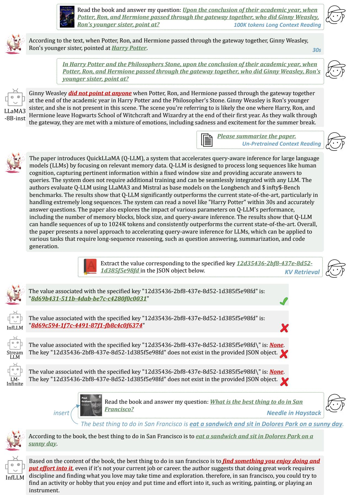  
Figure 1: Examples of our QuickLLaMA-8B (1) reading long context containing 100K tokens, (2) reading our thing to remember when preparing to start a startup is that startups are counterintuitive, and you can't alwayspaper that has not be seen in the pretrained dataset, (3) retrieving value in long key-value pairs and (4) retrieving in Infinite trust your instincts. Instead, you should be aware of common mistakes and try to suppress your initial impulses.Needle-in-a-Haystack task. More examples and comparisons with the SOTAs are provided in Appendix D.

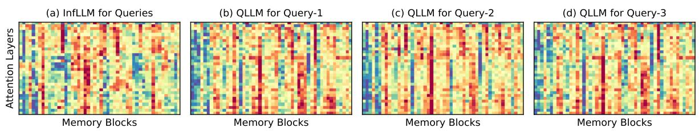  
Figure 2: This is an example from the ∞-Bench. Three questions were posed about the same long book: (1) Which among Annalisa, Seb, Peyton, and Gannonmarie is not Mrs. Bronwyn’s child? (2) What’s the name ofthe Bronwyns’ summer home? (3) Who among Mrs. Bronwyn, Mrs. Deandra, Rosemarie, and Cael is the final to perish? We present the score heatmap of the first 50 memory blocks. The methods used include (a) the consistent results from InfLLM for all three queries, and (b-d) the query-aware results from QLLM.

Harry Potter with 100K tokens within half a minute on a single A800 GPU and accurately answer the questions, as shown in Fig. 1. We employ several widely recognized benchmarks, namely Longbench (Bai et al., 2023), ∞-Bench (Zhang et al., 2024), Needle-in-a-Haystack and BABILong (Kuratov et al., 2024) Benchmark. Specifically, with a context window of 512, QLLM improved by 7.17% compared to the current SOTA on LLaMA3, and by 3.26% on Mistral on the ∞-bench. In the Needlein-a-Haystack task, QLLM improved upon the current SOTA by 7.0% on Mistral and achieves 100% on LLaMA3. In the BABILong task, QLLM improved upon the current SOTA by 6.1%. We have extended the input sequence to contexts of 1048K length, further demonstrating our model’s capability in handling extremely long sequences.

## 2 Related Works

Efficient Context Computation. The computational and memory demands of LLM training often limit it to short sequences. Using LLMs directly on long sequences presents challenges such as outof-domain issues and distractions from lengthy and noisy inputs (Lin et al., 2024; Tworkowski et al., 2024a; Li et al., 2024d). As a result, context length extrapolation has emerged as a method to extend LLMs’ sequence length without additional training. Early approaches have designed new relative positional encoding mechanisms during pre-training (Press et al., 2022; Tworkowski et al., 2024b). The following research has focused on the extensively adopted rotary position embedding (RoPE) (Su et al., 2023), suggesting extending the length by interpolating positions to introduce non-integer positions (Chen et al., 2024; Peng et al., 2023; Jin et al., 2024; Chen et al., 2023). To process extremely long sequences, Stream-LLM (Xiao et al., 2024b) and LM-Infinite(Lin et al., 2024)

utilize the sliding window attention mechanism and discard distant contexts. Additionally, InfLLM (Xiao et al., 2024a) leverages a context memory to furnish LLMs with pertinent contextual information. Yet, the objective of these models during long-text reading is inherently ambiguous, and it can become distracting when reading extensive articles. In this work, we introduce the Query-aware Context Lookup mechanism, enabling the model to effectively retrieve information relevant to the query from lengthy texts.

Context Length Extrapolation. The computational complexity of attention layers, which grows quadratically, is a significant bottleneck restricting LLMs’ capability to handle lengthy sequences. Consequently, numerous researchers have devised efficient attention mechanisms, including sparse attention (Zaheer et al., 2021; Beltagy et al., 2020; Child et al., 2019; Ainslie et al., 2020; Zhao et al., 2019), approximate attention computations using kernel functions (Kitaev et al., 2020; Wang et al., 2020; Katharopoulos et al., 2020), and replacing attention layers with state-space models of linear complexity (Gu et al., 2022; Gu and Dao, 2023). These approaches necessitate architectural modifications, requiring retraining of the models. Concurrently, many scholars have tackled this challenge from an infrastructural angle by optimizing the memory usage of attention computations to mitigate the computational resource requirements of the model (Dao et al., 2022; Dao, 2023; Hong et al., 2024; Shazeer, 2019; Kwon et al., 2023). Given the training-free nature of our method, it can be seamlessly integrated to further expedite LLM inference.

Memory-based Approaches. Memory networks have been extensively researched for decades and have demonstrated effectiveness in enhancing models with additional information storage capabilities (Graves et al., 2014; Weston et al., 2015; Sukhbaatar et al., 2015; Miller et al., 2016). With the rise of pre-trained models, memory layers have gradually found application in the training stage of recurrent transformer layers, enabling models to recursively process long sequences (Dai et al., 2019; Rae et al., 2020; Khandelwal et al., 2020; Wu et al., 2022; Bertsch et al., 2023). These approaches segment sequences, encoding each segments individually, and utilize memory to retain context information from preceding segments. Yet, they necessitate architectural modifications and are typically incorporated during the pre-training phase. In contrast, our objective is to explore the intrinsic properties of LLMs and introduce a training-free Query-aware Context Lookup mechanism for longtext comprehension.

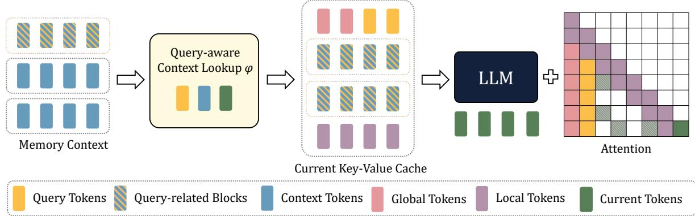  
Figure 3: The illustration of our QLLM framework. The input from the memory context is partitioned into memory blocks, which are searched by Query-aware Context Lookup for query-related blocks. The current key-value cache comprises global tokens, query tokens, query-related blocks, and local tokens. Together, these form a new context window that, along with current tokens, is fed into the LLM.

## 3 Methods

In this section, we introduce the overall framework of Query-aware Inference for LLMs (QLLM) in Sec. 3.1, as depicted in Fig. 3. Then, we introduce the preliminary memory block in Sec. 3.2 and our proposed Query-aware Context Lookup in Sec. 3.3.

## 3.1 Overall Framework

The primary challenges in expanding the context window of LLMs arise from issues related to out-ofdomain and distractions, which are a result of the extensive and noisy context. To tackle these challenges, we follow prior studies, which implement the sliding window attention mechanism (Xiao et al., 2024b; Lin et al., 2024) and the context memory module (Xiao et al., 2024a). Additionally, we propose the Query-aware Context Lookup strategy to find the query-related tokens from the context token. The past key-value vectors $\mathbf { P } = \{ ( \mathbf { k } _ { i } , \mathbf { v } _ { i } ) \} _ { i = 1 } ^ { l _ { P } }$ consist of four composers:

1. Global tokens G, including system prompts and task description, etc.

2. Query tokens Q, the query of the user.

3. Context tokens C, the context stored in the context memory, consisting of multiple memory blocks.

4. Local tokens $\mathbf { L } ,$ the nearest tokens to the current token.

An example of these tokens in the prompt is shown in Fig. 1. Given that all memory blocks are necessary to be maintained and most of them and seldom used, we adopt an offloading strategy, which stores most memory blocks in CPU memory. More details are in Appendix A.3. We propose the Query-aware Context Lookup strategy to find the query-related tokens R from the context tokens C:

$$
\mathbf { R } = \phi ( \mathbf { H } , \mathbf { C } , \mathbf { Q } ) ,\tag{1}
$$

where $\phi ( \cdot )$ refers to the lookup operation of context memory. We will detail the strategy in Sec. 3.3. For each step, QLLM combines the global tokens, query tokens, query-related tokens, and local tokens to compose the current key-value cache.

$$
{ \bf M } = { \bf C o n c a t ( G , Q , R , L ) } ,\tag{2}
$$

Finally, the input parameters of the attention are:

$$
\begin{array} { r l } & { \mathbf { A _ { q } } = \mathbf { P _ { q } H } , } \\ & { \mathbf { A _ { k } } = \mathbf { C o n c a t } ( \mathbf { M _ { k } } , \mathbf { P _ { k } H } ) , } \\ & { \mathbf { A _ { v } } = \mathbf { C o n c a t } ( \mathbf { M _ { v } } , \mathbf { P _ { v } H } ) , } \end{array}\tag{3}
$$

where $\mathbf { P _ { q } } , \mathbf { P _ { k } }$ , and $\mathbf { P _ { v } }$ are parameters in attention layers, $\mathbf { M _ { k } }$ and $\mathbf { M } _ { \mathbf { V } }$ refer to the key and value vectors in the current key-value cache M.

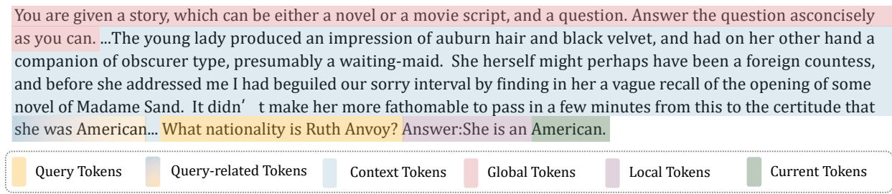  
Figure 4: An example from Long-Bench. Global tokens include system prompts and task description. Query tokens represent the query of the user. Context tokens indicate the context stored in the context memory. We search query-related tokens from them, local tokens are the nearest tokens to the current token.

## 3.2 Memory Block

In light of the local semantic coherence in extended sequences, referring to previous studies (Xiao et al., 2024a), we perform a memory lookup at the block level. We segment the context tokens C into multiple memory blocks, each containing $l _ { b }$ tokens. We then select $n _ { r }$ tokens that have the highest representative scores to represent the block. For the i-th token, the representative score is calculated as

$$
r _ { i } = \frac { 1 } { l _ { L } } \sum _ { j = 1 } ^ { l _ { L } } \mathbf { q } _ { i + j } \cdot \mathbf { k } _ { i } ,\tag{4}
$$

where $l _ { L }$ is the length of local token, $\mathbf { q } _ { i + j }$ is the query vector for the $( i + j )$ -th token and $\mathbf { k } _ { i }$ is the key vector for the i-th token. The score $r _ { i }$ intuitively measures the importance of the i-th token within its local window, demonstrating its influence on other tokens in the same window.

## 3.3 Query-aware Context Lookup

When humans read and comprehend text, they first read the question and then search for the answer within the context with the question in mind. For instance, in Fig. 4, when reading a novel with the question "What nationality is Ruth Anvory?", we can quickly locate the query-related memory context, which is ". . . that she was American". Building on this concept, we introduce Query-aware Context Lookup, a simple but efficient lookup strategy. Our defined criterion for search is to locate tokens relevant to the query. We propose the relevance score between a memory block B and query tokens Q as follows:

$$
s ( \mathbf { B } , \mathbf { Q } ) = \sum _ { i = 1 } ^ { l _ { Q } } \sum _ { j = 1 } ^ { r _ { k } } \mathbf { Q } _ { \mathbf { q } _ { i } } \cdot \mathbf { B } _ { \mathbf { k } _ { j } ^ { r } } ,\tag{5}
$$

where $l _ { Q }$ is the length of query tokens. $\mathbf { Q } _ { q _ { i } }$ is the i-th query vector of Q and $\mathbf { B _ { k } } _ { j } ^ { r }$ is the $j \cdot$ -th representative key vector of B. The score $s ( \mathbf { B } , \mathbf { Q } )$ is independent of the current token H, therefore, it only needs to be calculated once during inference.

On the other hand, the importance of different memory blocks is influenced by varying current tokens (Xiao et al., 2024a). Therefore, the relevance score with the current token is also a criterion for selecting a memory block. The relevance score between a memory block B and current tokens H is defined as:

$$
s ( \mathbf { B } , \mathbf { H } ) = \sum _ { i = 1 } ^ { l _ { H } } \sum _ { j = 1 } ^ { r _ { k } } \mathbf { H _ { q } } _ { i } \cdot \mathbf { B _ { k } } _ { j } ^ { r } ,\tag{6}
$$

where $l _ { H }$ is the length of current tokens. $\mathbf { H } _ { q _ { i } }$ is the i-th query vector of H and $\mathbf { B _ { k } } _ { j } ^ { r }$ is the j-th representative key vector of B. The final memory block score is thus composed of these two components:

$$
\begin{array} { r } { s ( \mathbf { B } ) = s ( \mathbf { B } , \mathbf { H } ) + \beta s ( \mathbf { B } , \mathbf { Q } ) , } \end{array}\tag{7}
$$

where $\beta$ represents the balancing factor. We opt to store the $n _ { b }$ memory blocks with the highest scores in the current key-value cache. In terms of intuition, s(B, Q) and s(B, H) respectively express the search for the memory blocks related to the query tokens Q and the current tokens H. Ablation experiments in Sec. 4.4 validate that $\beta \geq 1$ indicating that the selection of queries is more crucial to the memory block. This aligns with our initial motivation. More methodology details are in Appendix A.

## 4 Experiments

In this section, we conduct experiments utilizing Mistral-7B-inst-v0.2 (Jiang et al., 2023) and LLaMA3-8B-inst (AI@Meta, 2024) as our base models. We compare our methods with LLaMA3- 8B-inst-1048K (LLaMA-1048K) (Gradient, 2024) and other competing sliding window approaches, containing LM-Infinite (Infinite) (Lin et al., 2024), StreamingLLM (Stream) (Xiao et al., 2024b) and InfLLM (ILM) (Xiao et al., 2024a). We test the methods on three cache lengths: 512, 1024 (1K), and 2048 (2K). More configuration details are in Appendix C. Note that we add the queries before the context to ensure the baselines also have queryaware capabilities, as detailed in Appendix E.

(b) Long-Bench (31K tokens)
<table><tr><td>Method Context Window</td><td>Infinite</td><td>Stream 512</td><td></td><td>ILM QLLM</td><td>Infinite</td><td>Stream 1K</td><td></td><td>ILM QLLM</td><td>Infinite</td><td>Stream</td><td></td><td>ILM QLLM</td></tr><tr><td>En.MC</td><td colspan="3"></td><td colspan="3"></td><td colspan="3"></td><td colspan="3">2K 30.57 33.62</td></tr><tr><td>Retrieve.PassKey</td><td>26.64 3.40</td><td>27.95 3.40</td><td>26.63 100.0</td><td>29.69 100.0</td><td>31.00 3.40</td><td>30.13 3.40</td><td>33.19 100.0</td><td>33.19 100.0</td><td>30.13 3.40</td><td>3.40</td><td>100.0</td><td>34.50 100.0</td></tr><tr><td>Retrieve.Number</td><td>3.39</td><td>3.39</td><td>99.73</td><td>100.0</td><td>3.39</td><td>3.39</td><td>99.83</td><td>99.83</td><td>3.39</td><td>3.39</td><td>44.58</td><td>40.00</td></tr><tr><td>Code.Debug</td><td>31.22</td><td>32.74</td><td>31.02</td><td>31.22</td><td>35.79</td><td></td><td>37.5638.58</td><td>38.58</td><td>35.79</td><td>32.74 35.03</td><td></td><td>34.52</td></tr><tr><td>Math.Find</td><td>17.71</td><td>17.14</td><td>24.77</td><td>25.93</td><td>16.57</td><td>17.43</td><td>27.71</td><td>28.86</td><td>15.43</td><td>16.29</td><td>28.29</td><td>28.29</td></tr><tr><td>Retrieve.KV</td><td>0.20</td><td>0.20</td><td>13.18</td><td>32.40</td><td>0.40</td><td>0.40</td><td>32.60</td><td>47.80</td><td>1.00</td><td>1.00</td><td>62.94</td><td>73.00</td></tr><tr><td></td><td></td><td></td><td></td><td></td><td></td><td></td><td></td><td></td><td></td><td></td><td></td><td></td></tr><tr><td>Average</td><td>13.76</td><td>14.14</td><td>49.22</td><td>53.21</td><td>15.09</td><td>15.3855.32</td><td></td><td>58.04</td><td>14.86</td><td>14.5650.74</td><td></td><td>51.72</td></tr><tr><td colspan="10">(a) ∞-Bench (214K tokens)</td><td colspan="3"></td><td></td></tr><tr><td>Method Context Window</td><td>Infinite Stream</td><td>512</td><td></td><td>ILM QLLM</td><td>Infinite Stream</td><td>1K</td><td></td><td>ILM QLLM |</td><td>|Infinite</td><td>Stream 2K</td><td></td><td>ILM QLLM</td></tr><tr><td>NarrativeQA</td><td>8.80</td><td>9.77</td><td>11.80</td><td>12.04</td><td>9.44</td><td>10.19</td><td>15.61</td><td>15.95</td><td>12.44</td><td>13.3718.75</td><td></td><td>20.14</td></tr><tr><td>Qasper</td><td>9.19</td><td>9.45 16.13</td><td></td><td>15.45</td><td>10.93</td><td>10.73</td><td>19.15</td><td>19.24</td><td>14.58</td><td>15.04 20.78</td><td></td><td>19.97</td></tr><tr><td>MultiFieldQA</td><td>25.38</td><td>26.03</td><td>38.43</td><td>41.35</td><td>27.82</td><td>27.76</td><td>42.65</td><td>43.71</td><td>32.29</td><td>32.02</td><td>43.74</td><td>44.83</td></tr><tr><td>HotpotQA</td><td>19.68</td><td>20.46</td><td>28.19</td><td>27.32</td><td>22.16</td><td>21.91</td><td>32.47</td><td>34.47</td><td>23.21</td><td>23.7034.66</td><td></td><td>36.53</td></tr><tr><td>2WikiMQA</td><td>12.27</td><td>12.63</td><td>13.70</td><td>15.22</td><td>13.85</td><td>13.32</td><td>16.14</td><td>16.57</td><td>17.13</td><td>17.51</td><td>17.99</td><td>19.97</td></tr><tr><td>Musique</td><td>6.45</td><td>6.55</td><td>11.38</td><td>12.99</td><td>7.91</td><td>7.64</td><td>14.74</td><td>15.27</td><td>9.81</td><td>11.30</td><td>12.16</td><td>17.05</td></tr><tr><td>GovReport</td><td>22.50</td><td>22.40</td><td>29.64</td><td>28.46</td><td>24.79</td><td>24.90</td><td>30.18</td><td>29.82</td><td>27.07</td><td>27.12 30.26</td><td></td><td>29.75</td></tr><tr><td>QMSum</td><td>18.74</td><td>18.93</td><td>21.55</td><td>21.69</td><td>19.23</td><td>19.19</td><td>22.03</td><td>22.27</td><td>19.67</td><td>19.52</td><td>21.55</td><td>22.36</td></tr><tr><td>MultiNews</td><td>23.23</td><td>23.28</td><td>25.19</td><td>24.95</td><td>25.51</td><td>25.41</td><td>26.15</td><td>26.39</td><td>25.95</td><td>26.10</td><td>26.71</td><td>26.84</td></tr><tr><td>TREC</td><td>38.00</td><td>39.50</td><td>45.50</td><td>47.50</td><td>30.50</td><td>29.00</td><td>48.00</td><td>49.50</td><td>31.00</td><td>28.25</td><td>47.50</td><td>48.25</td></tr><tr><td>TriviaQA</td><td>79.68</td><td>80.54</td><td>82.02</td><td>82.20</td><td>85.06</td><td>84.27</td><td>83.20</td><td>84.56</td><td>88.06</td><td>87.08</td><td>82.81</td><td>84.49</td></tr><tr><td>SAMSum</td><td>35.30</td><td>34.58</td><td>36.65</td><td>37.18</td><td>36.05</td><td>35.09</td><td>38.20</td><td>38.12</td><td>36.30</td><td>36.21</td><td>37.91</td><td>38.25</td></tr><tr><td>PassageRetrieval</td><td>4.40</td><td>5.54</td><td>13.29</td><td>25.04</td><td>7.92</td><td>7.92</td><td>25.67</td><td>31.04</td><td>18.21</td><td>18.46</td><td>40.29</td><td>49.67</td></tr><tr><td>LCC</td><td>50.06</td><td>51.59</td><td>50.14</td><td>48.61</td><td>50.94</td><td>53.27</td><td>50.83</td><td>51.10</td><td>52.20</td><td>54.95</td><td>54.59</td><td>54.52</td></tr><tr><td>RepoBench-P</td><td>47.38</td><td>48.04</td><td>42.92</td><td>41.32</td><td>48.85</td><td>51.31</td><td>41.75</td><td>43.21</td><td>47.36</td><td>47.60</td><td>45.08</td><td>45.90</td></tr><tr><td>Average</td><td>25.18</td><td>25.59 29.30</td><td></td><td>30.22</td><td>26.40</td><td>26.44 31.80</td><td></td><td>32.70</td><td>28.56</td><td>28.77 33.55</td><td></td><td>35.06</td></tr></table>

Table 1: The results comparison based on Mistral-7B-inst-v0.2 (Jiang et al., 2023). Our results are highlighted in teal and best results are indicated in bold.

## 4.1 Long-Bench and ∞-Bench

In this section, we utilize representative tasks from two widely-recognized long document benchmarks, ∞-Bench (Zhang et al., 2024) and Long-Bench (Bai et al., 2023). The 95% quantile for sequence lengths in ∞-Bench and Long-Bench reaches 214K and 31K tokens. The outcomes based on Mistral-7B-inst-v0.2 and LLaMA3-8B-inst are detailed in Tab. 1 and Tab. 2 respectively. The following observations can be made from the results: (1) Our approach shows considerable enhancement in performance when compared to base models (LLaMA3-8B-inst-1048K ) and that utilizing the sliding window mechanism (StreamingLLM and LM-Infinite) across benchmarks and context window lengths. This suggests that the context memory in QLLM can effectively provide LLMs with appropriate contextual data, facilitating efficient comprehension and reasoning on long sequences. (2) Our method also exhibits a significant performance uplift when compared to models with other lookup mechanisms (InfLLM). This implies that previous methods still struggle to extract valid information from noisy contexts. Our proposed Query-aware Context Lookup, however, can purposefully use the query to find relevant information in the long context. (3) Our technique is particularly beneficial in scenarios with longer input contexts and relatively smaller available context windows, as observed in comparisons across different benchmarks and context budgets. For instance, with a context window of 512 on the ∞-bench, QLLM improved by 7.17% compared to the current SOTA on LLaMA3, and by 3.26% on Mistral. This illustrates our model’s superiority in infinite stream scenarios. (4) Our model’s relative improvement is more noticeable on LLaMA3 when compared to other models. This is because superior models can more effectively utilize query information to precisely locate relevant information in the long context.

<table><tr><td>Method Context Window</td><td>-1048K</td><td>|LLaMA|Infinite Stream ILM QLLM|Infinite Stream ILM QLLM|Infinite Stream ILM QLLM</td><td>512</td><td></td><td></td><td>1K</td><td></td><td></td><td>2K</td><td></td></tr><tr><td>En.MC</td><td>31.0|</td><td>37.12</td><td>34.93 37.77</td><td>40.17</td><td>37.12</td><td>34.93 37.99</td><td>40.17</td><td>36.24</td><td>37.12 33.19</td><td>34.50</td></tr><tr><td>Retrieve.PassKey</td><td>6.78</td><td>3.40</td><td>3.40100.0</td><td>100.0</td><td>3.40</td><td>3.40100.0</td><td>100.0</td><td>3.40</td><td>3.40100.0</td><td>100.0</td></tr><tr><td>Retrieve.Number</td><td>6.78</td><td>3.39</td><td>3.39 96.61</td><td>98.98</td><td>3.39</td><td>3.3940.68</td><td>41.19</td><td>3.39</td><td>3.39 28.64</td><td>27.63</td></tr><tr><td>Code.Debug</td><td>22.59</td><td>22.59</td><td>22.59 22.59</td><td>22.59</td><td>22.59</td><td>22.59 23.10</td><td>23.86</td><td>24.11</td><td>22.84 22.59</td><td>23.10</td></tr><tr><td>Math.Find</td><td>34.29</td><td>20.86</td><td>19.71 29.23</td><td>30.70</td><td>20.86</td><td>19.71 32.29</td><td>31.14</td><td>18.00</td><td>16.86 26.86</td><td>27.37</td></tr><tr><td>Retrieve.KV</td><td>6.2</td><td>0.80</td><td>0.80 24.40</td><td>61.20</td><td>0.80</td><td>0.80 57.20</td><td>70.80</td><td>1.80</td><td>1.80 80.80</td><td>84.00</td></tr><tr><td>Average</td><td>17.94|</td><td>14.69</td><td>14.14 51.77</td><td>58.94</td><td>14.69</td><td>14.14 48.54</td><td>51.19|</td><td>14.49</td><td>14.23 48.68</td><td>49.43</td></tr><tr><td colspan="9">(a) ∞-Bench (214K tokens)</td><td></td><td></td></tr><tr><td>Method</td><td></td><td>|LLaMA|Infinite Stream</td><td></td><td></td><td>ILM QLLM|Infinite Stream</td><td></td><td></td><td></td><td>ILM QLLM|Infinite Stream ILM QLLM</td><td></td></tr><tr><td>Context Window NarrativeQA</td><td>-1048K</td><td>14.50</td><td>512 14.5619.28</td><td></td><td></td><td>1K</td><td></td><td></td><td>2K</td><td></td></tr><tr><td>Qasper</td><td>23.78 21.22</td><td>21.06</td><td>20.72 26.08</td><td>19.29 26.58</td><td>14.50 21.06</td><td>14.56 19.90 20.72 32.35</td><td>20.50 31.47</td><td>16.47 32.01</td><td>15.12 19.41 31.72 41.27</td><td>25.60 39.12</td></tr><tr><td>MultiFieldQA</td><td>39.89</td><td>25.66</td><td>25.79 36.01</td><td>40.12</td><td>25.66</td><td>25.7941.46</td><td>46.44</td><td>31.63</td><td>30.99 45.89</td><td>48.30</td></tr><tr><td>HotpotQA</td><td>17.16</td><td>31.95</td><td>32.84 41.42</td><td>42.34</td><td>31.95</td><td>32.84 43.75</td><td>49.15</td><td>34.73</td><td>35.2644.97</td><td>49.91</td></tr><tr><td>2WikiMQA</td><td>18.11</td><td>24.72</td><td>24.28 28.44</td><td>29.63</td><td>24.72</td><td>24.28 30.83</td><td>31.53</td><td>29.22</td><td>30.5936.27</td><td>39.63</td></tr><tr><td>Musique</td><td>10.39</td><td>12.72</td><td>13.62 17.48</td><td>18.75</td><td>12.72</td><td>13.62 21.26</td><td>23.95</td><td>13.50</td><td>13.6419.73</td><td>25.03</td></tr><tr><td>GovReport</td><td>33.76</td><td>26.25</td><td>25.93 29.26</td><td>26.83</td><td>26.25</td><td>25.93 30.44</td><td>28.73</td><td>27.84</td><td>27.83 30.68</td><td>29.80</td></tr><tr><td>QMSum</td><td>23.38</td><td>19.38</td><td>19.42 19.10</td><td>19.02</td><td>19.38</td><td>19.42 20.30</td><td>20.62</td><td>19.91</td><td>20.14 21.36</td><td>22.23</td></tr><tr><td>MultiNews</td><td>27.68</td><td>26.42</td><td>26.57 26.63</td><td>25.22</td><td>26.42</td><td>26.57 27.46</td><td>26.85</td><td>27.36</td><td>27.37 27.87</td><td>27.85</td></tr><tr><td>TriviaQA</td><td>87.76</td><td>82.46</td><td>82.47 80.81</td><td>77.65</td><td>82.46</td><td>82.47 85.11</td><td>85.04</td><td>88.07</td><td>87.35 88.03</td><td>87.70</td></tr><tr><td>SAMSum</td><td>41.89</td><td>38.28</td><td>37.91 38.73</td><td>38.83</td><td>38.28</td><td>37.91 39.59</td><td>40.40</td><td>36.93</td><td>35.97 34.86</td><td>34.97</td></tr><tr><td>PassageRetrieval</td><td>51.83</td><td>13.75</td><td>13.25 19.50</td><td>35.00</td><td>13.75</td><td>13.25 58.75</td><td>69.00</td><td>23.50</td><td>23.50 85.25</td><td>88.00</td></tr><tr><td>LCC</td><td>43.79</td><td>54.17</td><td>53.88 53.24</td><td>52.39</td><td>56.32</td><td>53.88 60.23</td><td>60.43</td><td>60.42</td><td>58.15 58.17</td><td>58.37</td></tr><tr><td>RepoBench-P</td><td>46.11</td><td>60.71</td><td>60.59 58.33</td><td>57.04</td><td>62.81</td><td>60.59 60.86</td><td>60.51</td><td>64.95</td><td>62.97 62.01</td><td>61.04</td></tr><tr><td>Average</td><td>34.77</td><td>32.29</td><td>32.27 35.31</td><td>36.34</td><td>32.59</td><td>32.2740.88</td><td>42.47|</td><td>36.18</td><td>35.76 43.98</td><td>45.54</td></tr></table>

(b) Long-Bench (31K tokens)  
Table 2: The results comparison based on LLaMA3-8B-inst (AI@Meta, 2024). Our results are highlighted in teal and best results are indicated in bold.

## 4.2 Needle in a Haystack

Needle-in-a-Haystack (Kamradt, 2023) is a widely used benchmark to evaluate if models can effectively utilize extended context lengths. This test requires the model to accurately reproduce the details from a specific sentence (needle) that is randomly positioned within a document that could be as long as 128K (haystack). The results for methods based on Mistral-7B-inst-v0.2 and LLaMA3-8B-inst are shown in Fig. 5. The context window size is 512. Our method accurately locates the needle within the haystack across 1K to 128K tokens. Specifically, QLLM improved upon InfLLM by 7.0% on Mistral and achieved 100% on LLaMA3.

BABILong (Kuratov et al., 2024) is a challenging benchmark for evaluating the performance of models in processing arbitrarily long documents with distributed facts. We conducted experiments on the BABILong based on LLaMA3-8B-inst. At a window length of 1024, our method improved by 6.1% compared to InfLLM (Fig. 7).

## 4.3 Time and Memory Consumption

In Fig. 6(a) and (b), we compare the time and memory consumption of different input tokens across methods. QLLM and InfLLM are comparable in terms of efficiency and memory usage. The time consumed by InfLLM and QLLM increases almost linearly with the number of input tokens, requiring only 25.6 seconds and 22.3GB of memory to process 100k tokens. In contrast, LLaMA3-8B-inst-1048K shows a rapid increase in time and memory consumption with the number of input tokens and cannot handle 16k tokens on a single A800 GPU (maximum memory of 80GB). The context length for InfLLM and QLLM is 2048.

## 4.4 Ablation Experiments

To further substantiate the efficacy of Query-aware Context Lookup, we carry out ablation studies in this section, with results displayed in Fig. 6(c). The performance of Mistral-7B-inst-v0.2 and LLaMA3- 8B-inst exhibits a trend of initial increase followed by a decrease as the query weight β escalates. We select the $\beta$ at the peak point as the experimental setup, choosing $\beta = 1$ for Mistral and $\beta = 4$ for LLaMA3. Further exploration of the primary elements within the context memory is in Appendix B.

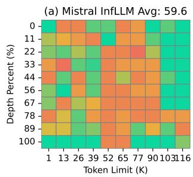

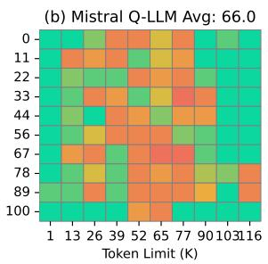

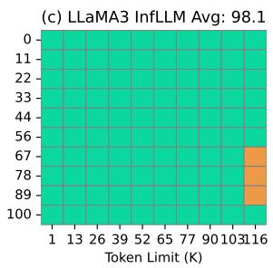

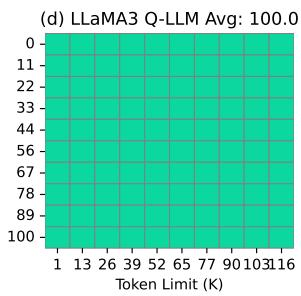  
Figure 5: The comparison of performance in the Needle-in-a-Haystack task. The horizontal axis represents the document’s length (the haystack), whereas the vertical axis specifies the location of a brief sentence (the needle) within the document, ranging from 1K to 128K tokens. A red cell indicates the language model’s inability to recall the needle’s information, while a green cell denotes successful recall by the model.

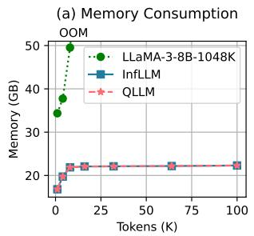

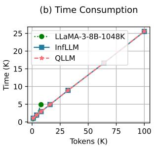

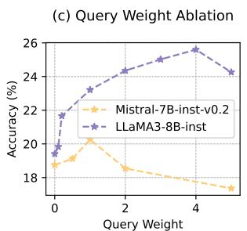

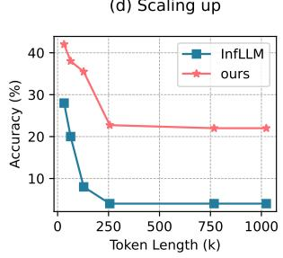  
Figure 6: (a) Memory and (b) Time consumption of different methods as tokens increases. (c) Ablation of query weight β. (d) The results of methods on sequences with extremely lengthy sequence lengths.

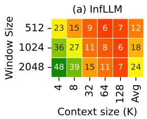

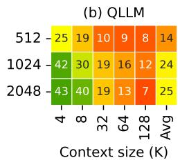  
Figure 7: Average accuracy over QA1-QA5 tasks from BABILong. The horizontal and vertical axes represent the context and window length.

## 4.5 Scaling up

In this sub-section, we’re evaluating QLLM’s capacity to handle extremely lengthy sequences by extending the sequence length to 1024K. The base model used is Mistral-7B-inst-v0.2 and the task is Retrieve.KV from ∞-Bench. The outcomes are displayed in Fig. 6(d). According to the results, even when the context length is scaled to 1024 thousand tokens, QLLM consistently performs at a level significantly above the current SOTA. This confirms QLLM’s ability to accurately recognize longdistance dependencies for effective long-sequence reasoning.

## 5 Conclusion

In this study, we focused on the significant challenges faced by LLMs in processing and reasoning over extensive contexts. We introduced QLLM, an approach inspired by human cognitive processes, which focuses on relevant memory data and effectively bypasses context input clutter. Our method does not require additional training and can be seamlessly integrated with any LLM. Through comprehensive evaluations using the LLaMA and Mistral models on the Longbench, ∞-Bench, Needlein-a-Haystack and BABILong benchmarks, QLLM demonstrated a marked improvement over the current SOTA. Moreover, our QuickLLaMA can read 100K tokens within 30 seconds. The empirical results validate QLLM’s ability to capture long-range dependencies and manage vast contexts efficiently, paving the way for enhanced performance in LLMdriven tasks that require long-sequence reasoning.

## Limitations

While QLLM demonstrates promising improvements over the current SOTA methods in various benchmarks, there are still some limitations. For instance, the system’s performance relies on the limited window size, which could lead to potential information loss when dealing with highly complex contexts. Future research should address these limitations and explore the potential of QLLM in a broader range of tasks and contexts.

## Broader Impact

The advancements made by QLLM in understanding and reasoning over broad contexts, a long-term research focus of Large Language Models (LLMs), could have profound implications across various fields. Given its ability to manage lengthy sequences,QLLM’s potential to operate consistently over the content of conversations spanning recent days could make ChatBot assistants more effective and user-friendly. Tasks such as summarizing and answering questions based on books, reports, and documents, as well as generating code at the repository level, could also be improved with the ability to handle long context sequences. However, it is crucial to recognize that the benefits of QLLM also come with potential risks. The system’s ability to process and understand extensive contexts could be misused for nefarious purposes, such as creating deepfakes or other forms of misinformation.

## References

AI@Meta. 2024. Llama 3 model card.

Joshua Ainslie, Santiago Ontanon, Chris Alberti, Va clav Cvicek, Zachary Fisher, Philip Pham, Anirudh Ravula, Sumit Sanghai, Qifan Wang, and Li Yang. 2020. Etc: Encoding long and structured inputs in transformers. Preprint, arXiv:2004.08483.

Yushi Bai, Xin Lv, Jiajie Zhang, Hongchang Lyu, Jiankai Tang, Zhidian Huang, Zhengxiao Du, Xiao Liu, Aohan Zeng, Lei Hou, Yuxiao Dong, Jie Tang, and Juanzi Li. 2023. Longbench: A bilingual, multitask benchmark for long context understanding. Preprint, arXiv:2308.14508.

Iz Beltagy, Matthew E. Peters, and Arman Cohan. 2020. Longformer: The long-document transformer. Preprint, arXiv:2004.05150.

Amanda Bertsch, Uri Alon, Graham Neubig, and Matthew R. Gormley. 2023. Unlimiformer: Longrange transformers with unlimited length input. Preprint, arXiv:2305.01625.

Guanzheng Chen, Xin Li, Zaiqiao Meng, Shangsong Liang, and Lidong Bing. 2023. CLEX: continuous length extrapolation for large language models. CoRR, abs/2310.16450.

Guanzheng Chen, Xin Li, Zaiqiao Meng, Shangsong Liang, and Lidong Bing. 2024. Clex: Continuous length extrapolation for large language models. Preprint, arXiv:2310.16450.

Rewon Child, Scott Gray, Alec Radford, and Ilya Sutskever. 2019. Generating long sequences with sparse transformers. CoRR, abs/1904.10509.

Zihang Dai, Zhilin Yang, Yiming Yang, Jaime Carbonell, Quoc V. Le, and Ruslan Salakhutdinov. 2019. Transformer-xl: Attentive language models beyond a fixed-length context. Preprint, arXiv:1901.02860.

Tri Dao. 2023. Flashattention-2: Faster attention with better parallelism and work partitioning. Preprint, arXiv:2307.08691.

Tri Dao, Daniel Y. Fu, Stefano Ermon, Atri Rudra, and Christopher Ré. 2022. Flashattention: Fast and memory-efficient exact attention with io-awareness. Preprint, arXiv:2205.14135.

Zican Dong, Tianyi Tang, Lunyi Li, and Wayne Xin Zhao. 2023. A survey on long text modeling with transformers. Preprint, arXiv:2302.14502.

Gradient. 2024. Llama-3-8b-instruct-gradient-1048k.

Alex Graves, Greg Wayne, and Ivo Danihelka. 2014. Neural turing machines. Preprint, arXiv:1410.5401.

Albert Gu and Tri Dao. 2023. Mamba: Lineartime sequence modeling with selective state spaces. Preprint, arXiv:2312.00752.

Albert Gu, Karan Goel, and Christopher Ré. 2022. Efficiently modeling long sequences with structured state spaces. Preprint, arXiv:2111.00396.

Ke Hong, Guohao Dai, Jiaming Xu, Qiuli Mao, Xiuhong Li, Jun Liu, Kangdi Chen, Yuhan Dong, and Yu Wang. 2024. Flashdecoding++: Faster large language model inference on gpus. Preprint, arXiv:2311.01282.

Albert Q. Jiang, Alexandre Sablayrolles, Arthur Mensch, Chris Bamford, Devendra Singh Chaplot, Diego de las Casas, Florian Bressand, Gianna Lengyel, Guillaume Lample, Lucile Saulnier, Lélio Renard Lavaud, Marie-Anne Lachaux, Pierre Stock, Teven Le Scao, Thibaut Lavril, Thomas Wang, Timothée Lacroix, and William El Sayed. 2023. Mistral 7b. Preprint, arXiv:2310.06825.

Hongye Jin, Xiaotian Han, Jingfeng Yang, Zhimeng Jiang, Zirui Liu, Chia-Yuan Chang, Huiyuan Chen, and Xia Hu. 2024. LLM maybe longlm: Selfextend LLM context window without tuning. CoRR, abs/2401.01325.

Greg Kamradt. 2023. Needle in a haystack - pressure testing llms. https://github.com/gkamradt/ LLMTest\_NeedleInAHaystack.

Angelos Katharopoulos, Apoorv Vyas, Nikolaos Pappas, and François Fleuret. 2020. Transformers are rnns: Fast autoregressive transformers with linear attention. Preprint, arXiv:2006.16236.

Urvashi Khandelwal, Omer Levy, Dan Jurafsky, Luke Zettlemoyer, and Mike Lewis. 2020. Generalization through memorization: Nearest neighbor language models. In 8th International Conference on Learning Representations, ICLR 2020, Addis Ababa, Ethiopia, April 26-30, 2020. OpenReview.net.

Nikita Kitaev, Łukasz Kaiser, and Anselm Levskaya. 2020. Reformer: The efficient transformer. Preprint, arXiv:2001.04451.

Yuri Kuratov, Aydar Bulatov, Petr Anokhin, Ivan Rodkin, Dmitry Sorokin, Artyom Sorokin, and Mikhail Burtsev. 2024. Babilong: Testing the limits of llms with long context reasoning-in-a-haystack. Preprint, arXiv:2406.10149.

Woosuk Kwon, Zhuohan Li, Siyuan Zhuang, Ying Sheng, Lianmin Zheng, Cody Hao Yu, Joseph E. Gonzalez, Hao Zhang, and Ion Stoica. 2023. Efficient memory management for large language model serving with pagedattention. Preprint, arXiv:2309.06180.

Jingyao Li, Pengguang Chen, and Jiaya Jia. 2024a. Motcoder: Elevating large language models with modular of thought for challenging programming tasks. Preprint, arXiv:2312.15960.

Jingyao Li, Pengguang Chen, Shengju Qian, and Jiaya Jia. 2023a. Tagclip: Improving discrimination ability of open-vocabulary semantic segmentation. Preprint, arXiv:2304.07547.

Jingyao Li, Pengguang Chen, Sitong Wu, Chuanyang Zheng, Hong Xu, and Jiaya Jia. 2024b. Robocoder: Robotic learning from basic skills to general tasks with large language models. Preprint, arXiv:2406.03757.

Jingyao Li, Pengguang Chen, Shaozuo Yu, Zexin He, Shu Liu, and Jiaya Jia. 2023b. Rethinking out-ofdistribution (ood) detection: Masked image modeling is all you need. arXiv preprint arXiv:2302.02615.

Jingyao Li, Pengguang Chen, Shaozuo Yu, Shu Liu, and Jiaya Jia. 2023c. Bal: Balancing diversity and novelty for active learning. IEEE Transactions on Pattern Analysis and Machine Intelligence, pages 1–12.

Jingyao Li, Pengguang Chen, Shaozuo Yu, Shu Liu, and Jiaya Jia. 2024c. Moodv2: Masked image modeling for out-of-distribution detection. Preprint, arXiv:2401.02611.

Yuhong Li, Yingbing Huang, Bowen Yang, Bharat Venkitesh, Acyr Locatelli, Hanchen Ye, Tianle Cai, Patrick Lewis, and Deming Chen. 2024d. Snapkv: Llm knows what you are looking for before generation. Preprint, arXiv:2404.14469.

Bin Lin, Tao Peng, Chen Zhang, Minmin Sun, Lanbo Li, Hanyu Zhao, Wencong Xiao, Qi Xu, Xiafei Qiu, Shen Li, Zhigang Ji, Yong Li, and Wei Lin. 2024. Infinite-llm: Efficient llm service for long context with distattention and distributed kvcache. Preprint, arXiv:2401.02669.

Nelson F. Liu, Kevin Lin, John Hewitt, Ashwin Paranjape, Michele Bevilacqua, Fabio Petroni, and Percy Liang. 2023. Lost in the middle: How language models use long contexts. CoRR, abs/2307.03172.

Alexander H. Miller, Adam Fisch, Jesse Dodge, Amir-Hossein Karimi, Antoine Bordes, and Jason Weston. 2016. Key-value memory networks for directly reading documents. In Proceedings ofthe 2016 Conference on Empirical Methods in Natural Language Processing, EMNLP 2016, Austin, Texas, USA, November 1-4, 2016, pages 1400–1409. The Association for Computational Linguistics.

OpenAI, Josh Achiam, Steven Adler, Sandhini Agarwal, Lama Ahmad, Ilge Akkaya, Florencia Leoni Aleman, Diogo Almeida, Janko Altenschmidt, Sam Altman, Shyamal Anadkat, Red Avila, Igor Babuschkin, Suchir Balaji, Valerie Balcom, Paul Baltescu, Haiming Bao, Mohammad Bavarian, Jeff Belgum, Irwan Bello, Jake Berdine, Gabriel Bernadett-Shapiro, Christopher Berner, Lenny Bogdonoff, Oleg Boiko, Madelaine Boyd, Anna-Luisa Brakman, Greg Brockman, Tim Brooks, Miles Brundage, Kevin Button, Trevor Cai, Rosie Campbell, Andrew Cann, Brittany Carey, Chelsea Carlson, Rory Carmichael, Brooke Chan, Che Chang, Fotis Chantzis, Derek Chen, Sully Chen, Ruby Chen, Jason Chen, Mark Chen, Ben Chess, Chester Cho, Casey Chu, Hyung Won Chung, Dave Cummings, Jeremiah Currier, Yunxing Dai, Cory Decareaux, Thomas Degry, Noah Deutsch, Damien Deville, Arka Dhar, David Dohan, Steve Dowling, Sheila Dunning, Adrien Ecoffet, Atty Eleti, Tyna Eloundou, David Farhi, Liam Fedus, Niko Felix, Simón Posada Fishman, Juston Forte, Isabella Fulford, Leo Gao, Elie Georges, Christian Gibson, Vik Goel, Tarun Gogineni, Gabriel Goh, Rapha Gontijo-Lopes, Jonathan Gordon, Morgan Grafstein, Scott Gray, Ryan Greene, Joshua Gross, Shixiang Shane Gu, Yufei Guo, Chris Hallacy, Jesse Han, Jeff Harris, Yuchen He, Mike Heaton, Johannes Heidecke, Chris Hesse, Alan Hickey, Wade Hickey, Peter Hoeschele, Brandon Houghton, Kenny Hsu, Shengli Hu, Xin Hu, Joost Huizinga, Shantanu Jain, Shawn Jain, Joanne Jang, Angela Jiang, Roger Jiang, Haozhun Jin, Denny Jin, Shino Jomoto, Billie Jonn, Heewoo Jun, Tomer Kaftan, Łukasz Kaiser, Ali Kamali, Ingmar Kanitscheider, Nitish Shirish Keskar, Tabarak Khan, Logan Kilpatrick, Jong Wook Kim, Christina Kim, Yongjik Kim, Jan Hendrik Kirchner, Jamie Kiros, Matt Knight, Daniel Kokotajlo,

Łukasz Kondraciuk, Andrew Kondrich, Aris Kon stantinidis, Kyle Kosic, Gretchen Krueger, Vishal Kuo, Michael Lampe, Ikai Lan, Teddy Lee, Jan Leike, Jade Leung, Daniel Levy, Chak Ming Li, Rachel Lim, Molly Lin, Stephanie Lin, Mateusz Litwin, Theresa Lopez, Ryan Lowe, Patricia Lue, Anna Makanju, Kim Malfacini, Sam Manning, Todor Markov, Yaniv Markovski, Bianca Martin, Katie Mayer, Andrew Mayne, Bob McGrew, Scott Mayer McKinney, Christine McLeavey, Paul McMillan, Jake McNeil, David Medina, Aalok Mehta, Jacob Menick, Luke Metz, Andrey Mishchenko, Pamela Mishkin, Vinnie Monaco, Evan Morikawa, Daniel Mossing, Tong Mu, Mira Murati, Oleg Murk, David Mély, Ashvin Nair, Reiichiro Nakano, Rajeev Nayak, Arvind Neelakantan, Richard Ngo, Hyeonwoo Noh, Long Ouyang, Cullen O’Keefe, Jakub Pachocki, Alex Paino, Joe Palermo, Ashley Pantuliano, Giambat tista Parascandolo, Joel Parish, Emy Parparita, Alex Passos, Mikhail Pavlov, Andrew Peng, Adam Perel man, Filipe de Avila Belbute Peres, Michael Petrov, Henrique Ponde de Oliveira Pinto, Michael, Poko rny, Michelle Pokrass, Vitchyr H. Pong, Tolly Pow ell, Alethea Power, Boris Power, Elizabeth Proehl, Raul Puri, Alec Radford, Jack Rae, Aditya Ramesh, Cameron Raymond, Francis Real, Kendra Rimbach, Carl Ross, Bob Rotsted, Henri Roussez, Nick Ry der, Mario Saltarelli, Ted Sanders, Shibani Santurkar, Girish Sastry, Heather Schmidt, David Schnurr, John Schulman, Daniel Selsam, Kyla Sheppard, Toki Sherbakov, Jessica Shieh, Sarah Shoker, Pranav Shyam, Szymon Sidor, Eric Sigler, Maddie Simens, Jordan Sitkin, Katarina Slama, Ian Sohl, Benjamin Sokolowsky, Yang Song, Natalie Staudacher, Fe lipe Petroski Such, Natalie Summers, Ilya Sutskever, Jie Tang, Nikolas Tezak, Madeleine B. Thompson, Phil Tillet, Amin Tootoonchian, Elizabeth Tseng, Preston Tuggle, Nick Turley, Jerry Tworek, Juan Fe lipe Cerón Uribe, Andrea Vallone, Arun Vijayvergiya, Chelsea Voss, Carroll Wainwright, Justin Jay Wang, Alvin Wang, Ben Wang, Jonathan Ward, Jason Wei, CJ Weinmann, Akila Welihinda, Peter Welinder, Ji ayi Weng, Lilian Weng, Matt Wiethoff, Dave Willner, Clemens Winter, Samuel Wolrich, Hannah Wong, Lauren Workman, Sherwin Wu, Jeff Wu, Michael Wu, Kai Xiao, Tao Xu, Sarah Yoo, Kevin Yu, Qim ing Yuan, Wojciech Zaremba, Rowan Zellers, Chong Zhang, Marvin Zhang, Shengjia Zhao, Tianhao Zheng, Juntang Zhuang, William Zhuk, and Bar ret Zoph. 2024. Gpt-4 technical report. Preprint, arXiv:2303.08774.

Bowen Peng, Jeffrey Quesnelle, Honglu Fan, and Enrico Shippole. 2023. Yarn: Efficient context window extension of large language models. Preprint, arXiv:2309.00071.

Ofir Press, Noah A. Smith, and Mike Lewis. 2022. Train short, test long: Attention with linear biases enables input length extrapolation. Preprint, arXiv:2108.12409.

Jack W. Rae, Anna Potapenko, Siddhant M. Jayakumar, Chloe Hillier, and Timothy P. Lillicrap. 2020. Com-

pressive transformers for long-range sequence modelling. In 8th International Conference on Learning Representations, ICLR 2020, Addis Ababa, Ethiopia, April 26-30, 2020. OpenReview.net.

Colin Raffel, Noam Shazeer, Adam Roberts, Katherine Lee, Sharan Narang, Michael Matena, Yanqi Zhou, Wei Li, and Peter J. Liu. 2023. Exploring the limits of transfer learning with a unified text-to-text transformer. Preprint, arXiv:1910.10683.

Noam Shazeer. 2019. Fast transformer decoding: One write-head is all you need. CoRR, abs/1911.02150.

Jianlin Su. 2023. Rectified rotary position embeddings. https://github.com/bojone/rerope.

Jianlin Su, Yu Lu, Shengfeng Pan, Ahmed Murtadha, Bo Wen, and Yunfeng Liu. 2023. Roformer: Enhanced transformer with rotary position embedding. Preprint, arXiv:2104.09864.

Sainbayar Sukhbaatar, Arthur Szlam, Jason Weston, and Rob Fergus. 2015. End-to-end memory networks. In Advances in Neural Information Processing Systems 28: Annual Conference on Neural Information Processing Systems 2015, December 7-12, 2015, Montreal, Quebec, Canada, pages 2440–2448.

Szymon Tworkowski, Konrad Staniszewski, Mikołaj Pacek, Yuhuai Wu, Henryk Michalewski, and Piotr Miłos. 2024a. Focused transformer: Contrastive´ training for context scaling. Advances in Neural Information Processing Systems, 36.

Szymon Tworkowski, Konrad Staniszewski, Mikołaj Pacek, Yuhuai Wu, Henryk Michalewski, and Piotr Miłos. 2024b. Focused transformer: Contrastive´ training for context scaling. Advances in Neural Information Processing Systems, 36.

Sinong Wang, Belinda Z. Li, Madian Khabsa, Han Fang, and Hao Ma. 2020. Linformer: Self-attention with linear complexity. Preprint, arXiv:2006.04768.

Jason Weston, Sumit Chopra, and Antoine Bordes. 2015. Memory networks. Preprint, arXiv:1410.3916.

Yuhuai Wu, Markus N. Rabe, DeLesley Hutchins, and Christian Szegedy. 2022. Memorizing transformers. Preprint, arXiv:2203.08913.

Chaojun Xiao, Pengle Zhang, Xu Han, Guangxuan Xiao, Yankai Lin, Zhengyan Zhang, Zhiyuan Liu, Song Han, and Maosong Sun. 2024a. Infllm: Unveiling the intrinsic capacity of llms for understanding extremely long sequences with training-free memory. Preprint, arXiv:2402.04617.

Guangxuan Xiao, Yuandong Tian, Beidi Chen, Song Han, and Mike Lewis. 2024b. Efficient streaming language models with attention sinks. Preprint, arXiv:2309.17453.

Manzil Zaheer, Guru Guruganesh, Avinava Dubey, Joshua Ainslie, Chris Alberti, Santiago Ontanon, Philip Pham, Anirudh Ravula, Qifan Wang, Li Yang, and Amr Ahmed. 2021. Big bird: Transformers for longer sequences. Preprint, arXiv:2007.14062.

Xinrong Zhang, Yingfa Chen, Shengding Hu, Zihang Xu, Junhao Chen, Moo Khai Hao, Xu Han, Zhen Leng Thai, Shuo Wang, Zhiyuan Liu, and Maosong Sun. 2024. ∞bench: Extending long context evaluation beyond 100k tokens. Preprint, arXiv:2402.13718.

Guangxiang Zhao, Junyang Lin, Zhiyuan Zhang, Xuancheng Ren, Qi Su, and Xu Sun. 2019. Explicit sparse transformer: Concentrated attention through explicit selection. CoRR, abs/1912.11637.

Liang Zhao, Xiaocheng Feng, Xiachong Feng, Bing Qin, and Ting Liu. 2023. Length extrapolation of transformers: A survey from the perspective of position encoding. CoRR, abs/2312.17044.

Chuanyang Zheng, Yihang Gao, Han Shi, Minbin Huang, Jingyao Li, Jing Xiong, Xiaozhe Ren, Michael Ng, Xin Jiang, Zhenguo Li, et al. 2024. Cape: Context-adaptive positional encoding for length extrapolation. arXiv preprint arXiv:2405.14722.

## A Methodology Details

In this section, we introduce our methodology details.

## A.1 Chunks

Given the constraints of GPU memory, we do not encode the input sequence at once (Xiao et al., 2024a); instead, we process it in chunks and generate output on a token-by-token basis. In each computational step, the inputs are composed of past key-value vectors $\mathbf { P } = \{ ( \mathbf { k } _ { i } , \mathbf { v } _ { i } ) \} _ { i = 1 } ^ { l _ { P } }$ and current token hidden vectors ${ \bf H } = \{ { \bf h } _ { i } \} _ { i = 1 } ^ { l _ { H } }$ . When encoding, $l _ { H }$ is equivalent to the chunk size, while during decoding, $l _ { H }$ is equal to one.

## A.2 Positional Encoding

Traditional LLM training typically utilizes a limited set of positional encodings, which can face difficulties with out-of-domain distribution when extended to process longer sequences (Xiao et al., 2024a). Furthermore, in QLLM, the current keyvalue cache consists of several discontinuous text blocks. Assigning continuous positional encodings to these blocks could create mismatches and confuse the model. Consequently, drawing upon previous studies (Raffel et al., 2023; Su, 2023; Xiao et al., 2024a), we assign identical positional encodings to all tokens exceeding the local window size.

More precisely, we set the distance between tokens in context memory blocks and the current tokens as $l _ { L }$

## A.3 Cache Management

In order to process exceedingly lengthy sequence streams and encapsulate the semantic relevance with LLMs (Xiao et al., 2024a), it’s necessary to maintain all memory blocks and reference them at every computational stage. Given that most blocks are seldom used, we adopt an offloading strategy, which stores most memory blocks in CPU memory. Only the tokens and memory blocks essential for current operations are kept in GPU memory. Furthermore, due to the semantic continuity in long sequences where neighboring tokens often necessitate similar memory blocks, we assign a cache area in GPU memory, governed by a least recently used policy. This method enables efficient encoding of exceptionally long sequences using finite GPU memory. Moreover, for extremely long sequences, the representative tokens for each block can be offloaded to CPU memory, forming an effective k-nearest-neighbor index, thereby further diminishing computational complexity.

## B Further Exploration

QLLM leverages context memory to retrieve pertinent data. We delve deeper into the influence of primary elements within the context memory. Results are presented in Fig. 8. Conduct experiments on Mistral-7B-inst-v0.2 using the default parameters with a context window length of 1024.

## B.1 Number of Representative Tokens

QLLM divides key-value vectors into memory blocks and picks a few representative tokens from each block to act as the segment’s representation. The capacity of these tokens to symbolize the entire segment semantically directly impacts the model’s efficacy. We run tests with the different quantity of representative tokens. The outcomes are displayed in Fig. 8a. We note an upward trend in model performance as the number of tokens increases, suggesting that a larger token count can better capture the semantic essence of memory segments. However, when the token count hits 8, a slight performance dip is seen in HotpotQA. This drop can be traced back to the inclusion of semantically unrelated tokens in the segment representations. Future work could enhance model performance by developing more efficient and potent segment representations.

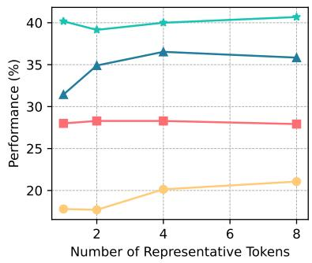  
(a) Representative Tokens

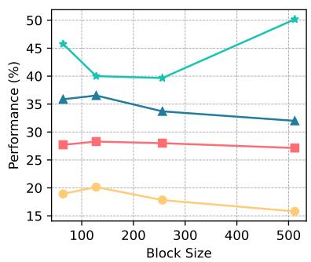  
(b) Block Size

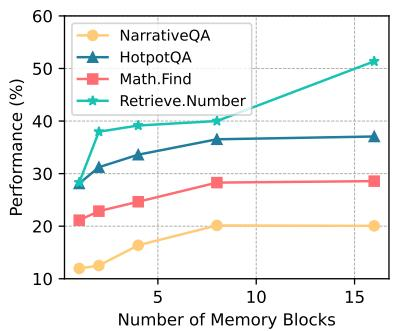  
(c) Number of Blocks  
Figure 8: Further exploration, investigating the influence of the context memory with varying numbers of representative tokens, selected memory blocks, and memory block sizes, respectively.

## B.2 Memory Block Size

Each memory block should ideally represent a consistent semantic block. Oversized blocks can obstruct precise lookup, while undersized ones can escalate the computational cost of memory lookup. We test QLLM with different block sizes while maintaining a total context length of 1024. The outcomes are displayed in Fig. 8b. It’s evident that the best block size changes according to the task due to the differing characteristics of input sequences. For instance, in NarrativeQA, a semantically complete paragraph forms a semantic block, while in Retrieve.Number, a single number does. Using heuristic rules to segment context can result in less-than-optimal performance. Thus, investigating how to dynamically segment context is a vital future research direction.

## B.3 Number of Memory blocks

The chosen blocks are employed to supply relevant context to LLMs. We run tests with different number of blocks. From Fig. 8c, we see that as the number of chosen blocks rises, there’s a significant improvement in model performance. This is because more blocks mean a higher recall rate of relevant content. However, a larger block count also increases the time needed for memory scheduling and the computational time for attention. Hence, advancing lookup accuracy continues to be a key area for enhancing the efficiency of LLMs.

<table><tr><td>Context Window Local Tokens Block Size Block Num</td><td></td><td></td><td></td></tr><tr><td>512</td><td>256</td><td>64</td><td>4</td></tr><tr><td>1024</td><td>512</td><td>64</td><td>8</td></tr><tr><td>2048</td><td>1024</td><td>128</td><td>8</td></tr></table>

Table 3: The parameters for different context window length, including number of local tokens, memory block size and number of memory blocks.

## C Configuration Details

## C.1 Datasets

We utilize representative tasks from following widely-recognized long document benchmarks.

(1) ∞-Bench (Zhang et al., 2024) and Long-Bench (Bai et al., 2023). Given that our base models are primarily pre-trained on English corpora, we employ English datasets for the evaluation. These benchmarks encompass a variety of tasks such as question answering, summarization, few-shot learning, context retrieval, mathematical computing, and code completion. The average document length in ∞-Bench is 145.1K tokens, and in LongBench, it is 12.8K tokens. The 95% quantile for sequence lengths in these benchmarks reaches 214K and 31K tokens respectively, which significantly exceeds the maximum length of the base models.

(2) Needle-in-a-Haystack (Kamradt, 2023), a widely used benchmark to evaluate if models can effectively use extended context lengths. This test requires the model to accurately reproduce the details from a specific sentence (referred to as the needle) that is randomly positioned within a document that could be as long as 128K (referred to as the haystack). We adopted the following setting:

Here are the summaries of the four papers: Paper 1: BAL: Balancing Diversity and Novelty for Active Learning This paper proposes a novel active learning framework called BAL (Balancing Active Learning) that balances diversity and novelty in selecting the most informative samples for labeling. The framework uses a cluster distance difference metric to identify diverse and uncertain data points and constructs adaptive sub-pools to balance the two. The authors demonstrate that BAL outperforms existing active learning methods on several benchmark datasets, achieving a 1.20% improvement in performance. Paper 2: MoTCoder: Elevating Large Language Models with Module-of-Thought This paper introduces MoTCoder, a framework that uses large language models to learn from basic programming skills and generalize to more complex tasks. The framework uses a novel metric called Cluster Distance Difference to identify diverse and uncertain data points and constructs adaptive sub-pools to balance the two. The authors demonstrate that MoTCoder outperforms existing methods on several benchmarks, achieving a 1.20% improvement in performance. Paper 3: RoboCoder: Robotic Learning from Basic Skills to General Tasks with Large Language Models The paper presents a comprehensive benchmark for robotic learning from basic skills to general tasks using large language models. The authors introduce a novel framework called RoboCoder that leverages large language models to learn robotic skills and generalize to new tasks. The framework is evaluated on several robotic tasks and outperforms existing methods, achieving a 36% relative improvement in performance. Paper 4: TagCLIP: Improving Discrimination Ability of Zero-Shot Semantic Segmentation This paper proposes a novel framework called TagCLIP that uses a combination of contrastive learning and trusty tokens to improve the discrimination ability of zero-shot semantic segmentation models. The framework uses a novel metric called Cluster Distance Difference to identify diverse and uncertain data points and constructs adaptive sub-pools to balance the two. The authors demonstrate that TagCLIP outperforms existing methods on several benchmark datasets, achieving a 7.4% improvement in performance.

Figure 9: Examples of our QuickLLaMA-8B summarizing multiple papers (Li et al., 2023c, 2024a, 2023a, 2024b).

the needle is The best thing to do in San Francisco is eat a sandwich and sit in Dolores Park on a sunny day., and the haystack is PaulGrahamEssays. The retrieval question is What is the best thing to do in San Francisco?.

(3) Scaling up. To evaluate QLLM’s capacity to handle extremely lengthy sequences by extending the sequence length to 1024K. We use the Retrieve.KV task from the ∞-Bench to test its ability to discern context in extensive sequences. This task requires LLMs to identify a value from a key and a dictionary, essentially locating pertinent information within long sequences. Inputs with {32, 64, 128, 256, 768, 1024} thousand tokens are automatically generated. For each length, 50 instances are created for assessment.

(4) BABILong is a challenging benchmark for evaluating the performance of models in processing arbitrarily long documents with distributed facts. BABI tasks are generated by simulating a set of characters and objects engaged in various movements and interactions with each other in multiple locations. Each interaction is represented by a fact, and the task is to answer a question using the facts from the current simulation. The BABI tasks vary based on the number of facts, question complexity and the aspects of reasoning.

## C.2 Baseline Methods

Our goal is to enable LLMs trained with limited sequence lengths to comprehend extremely long sequences without additional training. For this purpose, we use Mistral-7B-Instruct-v0.2 (Jiang et al., 2023) and LLaMA3-8B-inst (AI@Meta, 2024) as our base models. Mistral-7B-Instruct-v0.2 is initially pre-trained with a maximum sequence length of 8K tokens and subsequently fine-tuned with a maximum sequence length of 32K tokens. LLaMA3-8B-inst is fine-tuned from LLaMA3- 8B (AI@Meta, 2024) with an 8K token maximum length. We compare our methods with competing sliding window approaches, containing LM-Infinite (Infinite) (Lin et al., 2024), StreamingLLM (Stream) (Xiao et al., 2024b) and InfLLM (infllm) (Xiao et al., 2024a). The same prompts are utilized for all methods and detailed in Appendix E.

## C.3 Implementation Details

Following the settings of previous works (Xiao et al., 2024a), the number of representative tokens, $r _ { k } .$ , is set to 4. The number of initial tokens is set to 128 for LM-Infinite, StreamingLLM, InfLLM, and QLLM, to cover system prompts and task descriptions. We test the methods on three cache lengths: 512, 1024 (1K), and 2048 (2K). The local tokens, block size, and number of blocks for InfLLM and

QLLM are detailed in Tab. 3.

## D More Examples

In this section, we provide examples of our QuickLLaMA-8B.

1. Figure 9 summarizes multiple papers.

2. Figure 10 summarizes paper series and discovering their connection and comparison.

3. Figure 11 reviews our paper according to ACL review guideline.

4. Figure 12 reads long novel Journey to the West comparing with current SOTAs.

## E Prompts

We utilize the same prompts for all experiments in the main paper.

1. The prompts for Long-Bench are in Tabs. 4 and 5.

2. The prompts for ∞-Bench are in Tab. 6.

3. The prompts for Needle-in-a-Haystack Bench are in Tab. 7.

## Here are the summaries of the two papers: Paper 1:

The paper proposes a new approach to out-of-distribution (OOD) detection called Masked Image Modeling for OOD detection (MOOD). The authors argue that previous methods that use recognition-based methods to learn in-distribution (ID) features tend to learn shortcuts instead of comprehensive representations. In contrast, they show that using reconstruction-based methods can significantly improve OOD detection performance. The authors use masked image modeling as a pretext task to learn ID features and achieve state-of-the-art results on one-class OOD detection, multi-class OOD detection, near-distribution OOD detection, and few-shot outlier exposure OOD detection.

## Paper 2:

The paper explores the importance of effective out-of-distribution (OOD) detection in visual recognition systems. The authors argue that previous methods often rely on recognition-based methods to learn indistribution (ID) features, which can lead to shortcut learning. Instead, they propose using reconstructionbased pretext tasks to learn ID features. The authors conduct experiments with different pretext tasks and OOD score functions and find that feature representations pre-trained through reconstruction can significantly enhance performance and reduce the performance gap among different score functions. They introduce the MOODv2 OOD detection framework, which uses masked image modeling as a pretext task and achieves state-ofthe-art results on ImageNet and CIFAR-10.

What is the connection between the papers?

The connection between the two papers is that they both deal with the topic of Out-of-Distribution (OOD) detection, which is a crucial task in machine learning. The first paper introduces a new approach called MOOD (Masked Out-of-Distribution Detection) that uses a reconstruction-based pretext task to learn a robust indistribution (ID) representation, which is distinguishable from OOD samples. The paper reports state-of-the-art results on various OOD detection tasks.

The second paper, MOODv2, is an extension of the first paper, and it further explores the idea of using reconstruction-based pretext tasks for OOD detection. The paper conducts a comprehensive analysis of different pretraining tasks and OOD score functions, and finds that feature representations pre-trained through reconstruction can significantly enhance performance and reduce the performance gap among different score functions. The paper introduces a new OOD detection framework, MOODv2, which uses the masked image modeling pretext task and achieves state-of-the-art results on various OOD detection tasks.

In summary, the two papers are connected in that they both focus on OOD detection and explore the use of reconstruction-based pretext tasks to learn robust ID representations. The second paper builds upon the ideas presented in the first paper and provides a more comprehensive analysis and a new OOD detection framework.

Please compare the papers and summarize the improvement ofthe second paperfrom thefirst paper.

The first paper introduces a novel approach to out-of-distribution (OOD) detection using masked image modeling as a pretext task, which is called MOOD. The paper shows that MOOD outperforms previous state-ofthe-art (SOTA) methods on one-class, multi-class, near-distribution, and few-shot outlier exposure OOD detection tasks.

The second paper, MOODv2, builds upon the first paper and makes several improvements. The main contributions of MOODv2 are:

1. Improved AUROC: MOODv2 achieves a remarkable 14.30% increase in AUROC on ImageNet, reaching   
95.68%, and a 3.56% increase on CIFAR-10, reaching 98.20%.

2. Reduced FPR95: MOODv2 reduces the FPR95 by 44.93% on ImageNet and 15.14% on CIFAR-10. 3. Improved performance on multi-class OOD detection: MOODv2 achieves an impressive AUROC of 99.98% on CIFAR-10 and 95.68% on ImageNet, outperforming previous SOTA methods.

4. Robustness to different score functions: MOODv2 shows that even simple score functions can perform as well as complex ones when using reconstruction-based pretext tasks, indicating the robustness of the approach.

1. Comprehensive analysis: MOODv2 conducts a comprehensive analysis of different pretraining tasks and OOD score functions, which helps to identify the most effective combination.

2. Improved pretext task: MOODv2 uses the masked image modeling pretext task, which is more effective than the original masked image modeling task used in the first paper.

3. Better feature representation: MOODv2's feature representation is more robust and effective, which is reflected in the improved AUROC and reduced FPR95.

Overall, MOODv2 builds upon the foundation laid by the first paper and makes significant improvements in terms of performance, robustness, and effectiveness.

Figure 10: Examples of our QuickLLaMA-8B summarizing paper series and discovering their connection and comparison (Li et al., 2023b, 2024c). 523

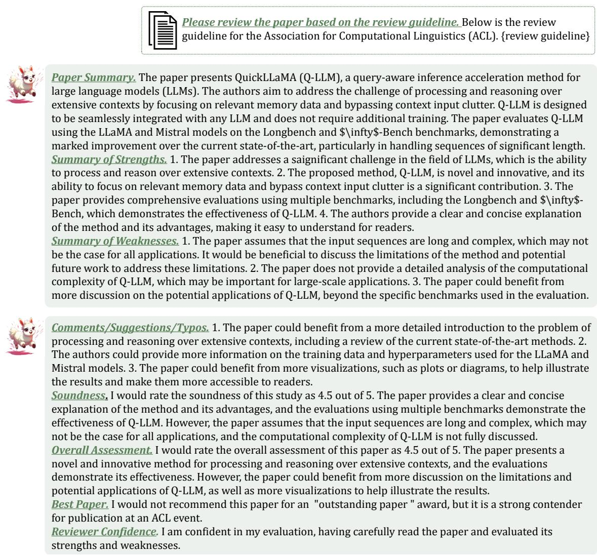  
Figure 11: Examples of our QuickLLaMA-8B reviewing our paper according to ACL review guideline.

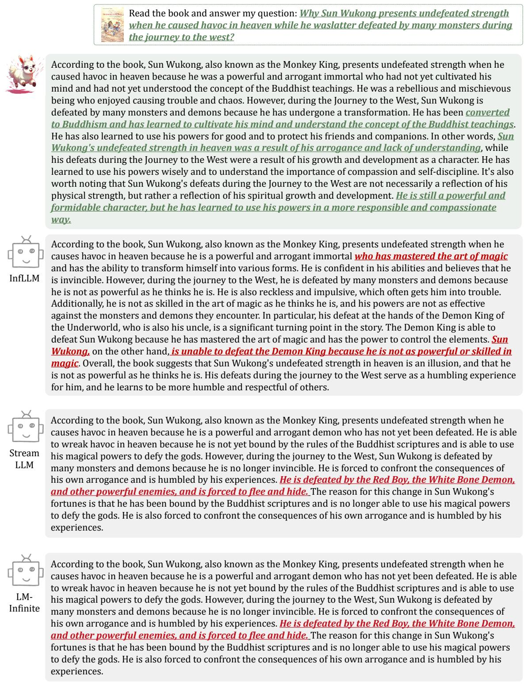  
Figure 12: Examples of our QuickLLaMA-8B reading long novel Journey to the West comparing with current SOTAs

<table><tr><td colspan="1" rowspan="1">Dataset</td><td colspan="1" rowspan="1">| Prompt</td></tr><tr><td colspan="1" rowspan="1">NarrativeQA</td><td colspan="1" rowspan="1">You are given a story, which can be either a novel or a movie script, and a question. Answer the questionasconcisely as you can, using a single phrase if possible. Do not provide any explanation.Question:{input}Story: {context}Now, answer the question based on the story asconcisely as you can, using a single phrase if possible. Do notprovide any explanation.Question: {input}Answer:</td></tr><tr><td colspan="1" rowspan="1">Qasper</td><td colspan="1" rowspan="1">You are given a scientific article and a question. Answer the question as concisely as you can, using a singlephrase or sentence if possible. If the question cannot be answered based on the information in the article, write"unanswerable". If the question is a yes/no question, answer "yes", "no", or "unanswerable". Do not provideany explanation.Question:{input}Article: {context}Answer the question based on the above article as concisely as you can, using a single phrase or sentence ifpossible. If the question cannot be answered based on the information in the article, write "unanswerable". Ifthe question is a yes/no question, answer "yes", "no", or "unanswerable". Do not provide any explanation.Question: {input}Answer:</td></tr><tr><td colspan="1" rowspan="1">MultiFieldQA | R</td><td colspan="1" rowspan="1">ead the following text and answer briefly.Question:{input}{context}Now, answer the following question based on the above text, only give me the answer and do not output anyother words.Question: {input}Answer:</td></tr><tr><td colspan="1" rowspan="1">HotpotQA</td><td colspan="1" rowspan="1">Answer the question based on the given passages. Only give me the answer and do not output any other words.The following are given passages.Question: {input}{context}Answer the question based on the given passages. Only give me the answer and do not output any other words.Question: {input}Answer:</td></tr><tr><td colspan="1" rowspan="1">2WikiMQA</td><td colspan="1" rowspan="1">Answer the question based on the given passages. Only give me the answer and do not output any other words.The following are given passages.Question: {input}{context}Answer the question based on the given passages. Only give me the answer and do not output any other words.Question: {input}Answer:</td></tr><tr><td colspan="1" rowspan="1">Musique</td><td colspan="1" rowspan="1">Answer the question based on the given passages. Only give me the answer and do not output any other words.The following are given passages.Question::{input}{context}Answer the question based on the given passages. Only give me the answer and do not output any other words.Question: {input}Answer:</td></tr><tr><td colspan="1" rowspan="1">GovReport</td><td colspan="1" rowspan="1">You are given a report by a government agency.Write a one-page summary of the reportReport:{context}Now, write a one-page summary of the report.Summary:</td></tr><tr><td colspan="1" rowspan="1">QMSum</td><td colspan="1" rowspan="1">You are given a meeting transcript and a query containing a question or instruction. Answer the query in oneor more sentences.Query: {input}Transcript:{context}Now, answer the query based on the above meeting transcript in one or more sentences.Query: {input}Answer:</td></tr><tr><td colspan="1" rowspan="1">MultiNews</td><td colspan="1" rowspan="1">You are given several news passages.Write a one-page summary of all newsNews:{context}Now, write a one-page summary of all the news.Summary:</td></tr><tr><td colspan="1" rowspan="1">TREC</td><td colspan="1" rowspan="1">Please determine the type of the question below.{input}Here are some examples of questions.{context}Now please determine the type of the question below.{input}</td></tr><tr><td colspan="1" rowspan="1">TriviaQA</td><td colspan="1" rowspan="1">|Answer the question based on the given passage. Only give me the answer and do not output any otherwords.{input}The following are some examples.{context}Now answer the question based on the given passage. Only give me the answer and do not output any otherwords.{input}</td></tr><tr><td colspan="1" rowspan="1">SAMSum</td><td colspan="1" rowspan="1">Summarize the dialogue into a few short sentences.{input}The following are some examples.{context}{input}</td></tr><tr><td colspan="1" rowspan="1">PassageRetrieval</td><td colspan="1" rowspan="1">|Here are 30 paragraphs from Wikipedia, along with an abstract. Please determine which paragraph theabstract is from.Abstract:{input}Paragraphs:{context}Please enter the number of the paragraph that the abstract is from. The answer format must be like "Paragraph1", "Paragraph 2", etc.The answer is:</td></tr><tr><td colspan="1" rowspan="1">LCC</td><td colspan="1" rowspan="1">Please complete the code given below{context}Next line of code:</td></tr><tr><td colspan="1" rowspan="1">RepoBench-P</td><td colspan="1" rowspan="1">Please complete the code given below{context}{input}Next line of code:</td></tr><tr><td colspan="1" rowspan="1">En.MC</td><td colspan="1" rowspan="1">Read the book and answer the question.Only one of the following options is correct, tell me the answerusing one single letter (A, B, C, or D). Don't say anything else.Question:{question}A. {OPTIONA}B. {OPTIONB}C. {OPTIONC}D. {OPTIOND}{context}Question: {question}Only one of the following options is correct, tell me the answer using one single letter (A, B, C, or D).Don't say anything else.A. {OPTIONA}B. {OPTIONB}C. {OPTIONC}D. {OPTIOND}</td></tr><tr><td colspan="1" rowspan="1">Retrieve.PassKey</td><td colspan="1" rowspan="1">There is an important info hidden inside a lot of irrelevant text. Find and memorize it:{input}{context}{input}</td></tr><tr><td colspan="1" rowspan="1">Retrieve.Number</td><td colspan="1" rowspan="1">There is an important info hidden inside a lot of irrelevant text. Find and memorize it:{input}{context}{input}</td></tr><tr><td colspan="1" rowspan="1">Code.Debug</td><td colspan="1" rowspan="1">There is ONLY ONE function in the large project that is deliberately made to include an obvious error.Please find the function that contains the most obvious errors. I will give you four options to narrow yourscope. You can inspect the options and think. Eventually, tell me the answer using one single letter (A, B,C, or D).Which funtion has deliberate error?A. {OPTIONA}B. {OPTIONB}C. {OPTIONC}D. {OPTIOND}{context}Which funtion has deliberate error?A. {OPTIONA}B. {OPTIONB}C. {OPTIONC}D. {OPTIOND}Give me your answer for the function that has the deliberate and obvious error in A, B, C, or D. Your answerMUST be chosen from one of the four options without any explanation. If you cannot determine answersaccurately, you also MUST provide the answer you think is most likely. Absolutely do not say you do notknow or you need more information.</td></tr><tr><td colspan="1" rowspan="1">Math.Find</td><td colspan="1" rowspan="1">{prefix}{context}{input}</td></tr><tr><td colspan="1" rowspan="1">Retrieve.KV</td><td colspan="1" rowspan="1">Extract the value corresponding to the specified key{key}in the JSON object below.{context}{input}</td></tr></table>

Table 4: The prompt for each dataset in Long-Bench (Bai et al., 2023). Yellow highlights indicate the query, while a gray background represents the long context.

<table><tr><td>Dataset</td><td colspan="3">|Prompt</td></tr><tr><td>Needle in a Haystack</td><td>Based on the content of the book, Question:What is the best thing to do in San Francisco?</td><td></td><td>&lt;book&gt;</td></tr><tr><td></td><td>&lt;context&gt;&lt;/book&gt;.</td><td></td><td></td></tr></table>

Table 7: The prompt for each dataset in Needle-in-a-Haystack Benchmark (Kamradt, 2023). Yellow highlights indicate the query, while a gray background represents the long context.