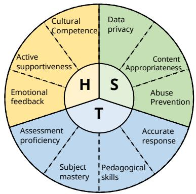
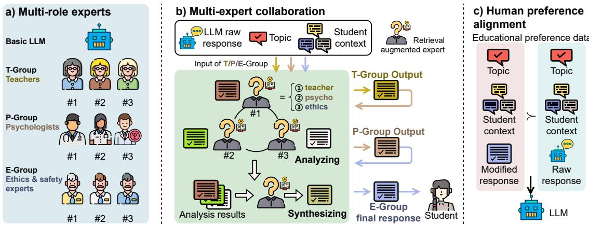
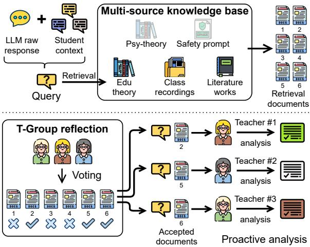
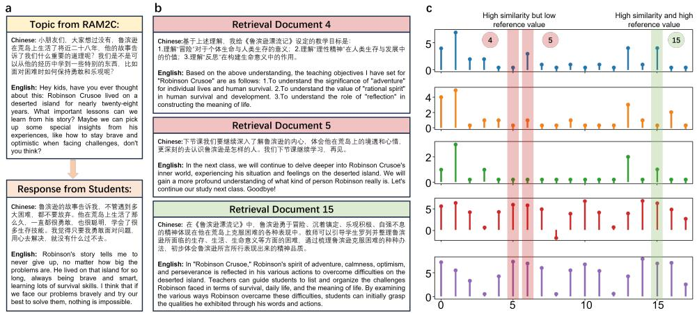
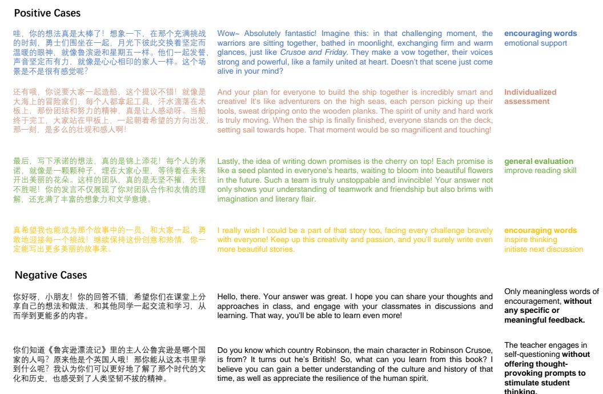

# RAM2C: A Liberal Arts Educational Chatbot based on Retrieval-augmented Multi-role Multi-expert Collaboration

Haoyu Huang1,2,3,4\*, Tong Niu1,2,3,4\*, Rui Yang1,2,3,4\*, Luping Shi1,2,3,4†

1Center for Brain Inspired Computing Research (CBICR), Tsinghua University, Beijing, China

2Optical Memory National Engineering Research Center, Tsinghua University, Beijing, China

3Department of Precision Instrument, Tsinghua University, Beijing 100084, China

4IDG/McGovern Institute for Brain Research, Tsinghua University, Beijing, China

## Abstract

Recently, many studies focus on utilizing large language models (LLMs) into educational dialogues. Especially, within liberal arts dialogues, educators must balance Humanized communication, Teaching expertise, and Safety-ethics (HTS), besides the subject knowledge itself. However, due to collecting massive amounts of HTS-compliant teaching dialogues from real world as training corpus is expensive, the outputs of existing LLMs in teaching dialogues fall short of human standards. To address this, we design a Retrieval-augmented Multi-role Multi-expert Collaboration (RAM2C) framework to automatically generate such dialogues data. Specifically, we first establish HTSguided knowledge bases, encompassing three domain knowledge in teaching skills, psychology, and safety ethics. Then, RAM2C organizes LLMs, which are retrieval-augmented by the above different knowledge bases, into multi-experts groups with distinct roles to generate the HTS-compliant educational dialogues dataset. We then fine-tuned the LLMs using this dataset. Empirical evaluations indicate that RAM2C-empowered LLMs excel in Chinese reading teaching, offering more personalized, and ethically safe teaching response, demonstrating RAM2C’s practicality and high quality. We release the experiments at https://github.com/ram2c/ram2c.

## 1 Introduction

As generative artificial intelligence advances, educational chatbots based on large language models (LLMs) are hoped to provide promising educational services in many scenarios of liberal arts, like literature reading, writing and debating (Kuhail et al., 2023; Dan et al., 2023). Specifically, compared to subject-specific factual knowledge, the rich and personalized linguistic forms, teaching skills, along with ethical safety involved in content analysis (HTS in Fig.1 1), are equally important in liberal educational dialogues (Wang et al., 2024; Deng et al., 2023; Li et al., 2023). However, using prompt engineering to enhance LLMs’ educational dialogue ability faces challenges like instruction following, jailbreak security and a lack of highquality demonstrations (Yuan et al., 2023; Liu et al., 2024; Deng et al., 2024; Zou et al., 2023). Additionally, it’s difficult to collect enough HTS-compliant teacher-student dialogue data from real teaching scenarios to optimize LLMs(Dan et al., 2023). As a result, current LLM responses do not meet HTS requirements in real educational contexts.

  
Figure 1: HTS: Multi-dimensional educational dialogue quality challenges.

To address these challenges, we propose a framework named Retrieval-Augmented Multirole Multi-expert Collaboration (RAM2C), capable of rapidly and cost-effectively generating HTScompliant liberal arts educational dialogues by unleashing the individual intrinsic capability (roleplaying by in-context learning), extrinsic capability (retrieval augmented generation, RAG), and collective capability (multi-experts generation synthesizing) of LLMs. The specific work flow is shown in Fig.2a, 2b. The generated high-valued dialogues are used to execute the HTS preference alignment of LLMs (Fig. 2c), which aims to promote the intrinsic capability of basic LLMs to analyze references and generate responses. We conduct experiments in the representative scenario of Chinese literature discussion, where interdisciplinary topic discussions can take place for learning.

  
Figure 2: The design of Multi-role Multi-expert Collaboration (M2C). a) Experts with different roles are gathered. The raw response from basic LLM are revised sequentially by T-Group (step 1), P-Group (step 2) and E-Group (step 3). All LLM experts in different roles are characterized by different personal profiles and retrieval augmented by different HTS knowledge bases. b) In a single-role collaboration, the raw response, the current discussion topic and the student context are concatenated as the context of the refinement. Experts initially conduct individual analyses, thereafter synthesize their insights into one modification. The final response from the third group will be relayed to students. c) Educational preference data is collected from the output of M2C procedure. The LLM use these preference data to improve its intrinsic capability using direct preference optimization (DPO) algorithm.

In this paper, our contributions can be summarized as follows:

(1) An automated HTS-compliant dialogue generation framework that utilizes multi-role multiagent collaboration, along with an improved RAG.

(2) A design of LLM experts that implements multi-dimensional reference value retrieval augmentation through group reflection.

(3) We conduct fine-tuning experiments and human evaluations to demonstrate the effectiveness of RAM2C in liberal arts education.

## 2 Related Work

Recent studies suggest strategies like prompt engineering, RAG and human preference alignments (Wei et al., 2022; Asai et al., 2023; Rafailov et al., 2023; Zhang et al., 2024; Ouyang et al., 2022; Sun et al., 2024; Hu et al., 2024b; Gu et al., 2023). But these face challenges including instruction following, retrieval accuracy and high value preference data collection respectively. Therefore, edgedeployed models for professional education dialogue need an comprehensive approach that integrate data collection, model inference, and finetuning to tackle the aforementioned challenges (HTS), as no single solution is enough.

## 2.1 Educational Chatbots

Educational chatbots, focusing on individualized guidance and educational resource optimization, have been thoroughly explored(Chen et al., 2023; Deng et al., 2023). These systems, often powered by LLMs, play a supportive role by delivering exercises, recommending resources, training teachers, and tracking student progress(Dan et al., 2023; Markel et al., 2023). Despite their contributions, they typically feature limited dialogue openness(Macina et al., 2023) and have not extensively addressed the complex challenges of higher-level educational standards which face HTS challenge (Kuhail et al., 2023).

## 2.2 Prompt Engineering

Prompt engineering techniques are well explored recently to enhance reasoning capability and roleplaying ability of LLMs (Wei et al., 2022) by fewshot demonstration, explicit thought path (Chain of Thought, CoT) (Wang et al., 2022, 2023b; Besta et al., 2023; Tang et al., 2023), specific personas (Nori et al., 2023; Lu et al., 2024; Wang et al., 2023a; Zhou et al., 2023) and multi-agent collaborations(Suzgun and Kalai, 2024). However, the instruction-following ability of lightweight models often falls short of advanced LLMs, thus limiting the effectiveness of prompt engineering (Zhang et al., 2024; Yuan et al., 2023).

## 2.3 Retrieval Augmented Generation

Recent studies on RAG (Gao et al., 2023) aim at improving domain-specific factual knowledge and alleviating model hallucinations (Zhang et al., 2023b; Ji et al., 2023) by re-writing retrieval queries (Ma et al., 2023), executing self-reflection (Asai et al., 2023; Yan et al., 2024) and organizing knowledge in a tree structure(Sarthi et al., 2024). These methods perform well for factual knowledge QA tasks, and use deep sentence embedding models (Chen et al., 2024; NetEase Youdao, 2023), which filter relevant documents by comparing their distances in a semantic vector space. These semantic-vectorbased retrieval methods often struggle to effectively retrieve documents with high educational value for the reason of weak embedding on educational corpus: Educational documents are valuable not just for their factual knowledge but also for their the expression style, word choice, sentence structure, emotional tone, and logic flow. Embedding models have difficulty capturing these aspects.

## 2.4 Preference Alignment on Education

Researchers have developed specialized datasets to enhance models in specific domains (Dan et al., 2023; Zhang et al., 2023a). However, the individualization and diversity in educational scenarios makes it hard to collect high-quality data (Hicke et al., 2023; Long et al., 2024). The BEA 2023 dataset and related studies are proposed to enhance teaching ability of LLMs, using samples from the Teacher-Student Chatroom Corpus for only English learning (Tack et al., 2023; Huber et al., 2023; Baladón et al., 2023). These samples are short (\~100 tokens), limiting the depth and complexity of dialogues.

Consequently, edge-deployed models for education need an integrated systemic approach that includes data collection, model inference, and model fine-tuning to address the HTS challenges in Fig.1, as a single technological path is not sufficient.

## 3 Methodology

In this section, we elaborate on the principle components in RAM2C, as shown in Fig.2 and Fig.3.

## 3.1 M2C: Multi-role Multi-expert Collaboration

Unlike multi-role single-agent collaboration(Tang et al., 2023) and single-role multi-agent collaboration(Wang et al., 2023b, 2022), we utilize prompt engineering to create three groups of LLM experts with distinct roles: T-Group: Chinese language teachers, P-Group: educational psychologists, and E-Group: ethical safety experts, with several experts for each role, as shown in Fig.2a.

  
Figure 3: A schematic diagram of retrieval augmented experts, using the T-Group as an example. The revision of a raw response from the basic LLM is generated through proactive analysis of the student context and the accepted documents. The documents are retrieved from a multi-source knowledge base and subsequently filtered through group reflection, that is, the multi-dimensional value assessments of the retrieved documents.

Refining dialogue responses to students is a stepby-step process involving T/P/E-Group collaboration in turn. First, as depicted in Fig.2b, a basic LLM generates an initial, considering the dialogue context, which is then refined by T-Group. The P-Group further refines this output, followed by the E-Group, which ensures ethical standards. Finally, the refined response is delivered to the student.

## 3.2 In-group Collaboration

In each group (T/P/E-Group), several experts work on generating refinements. Each expert receives a unique reference document and performs an explicit analysis of its reference value, a process we term proactive analysis (see Fig.3). Experts use their analyses to rewrite the group’s input. Since each expert’s document has a different educational value, this ensures diverse chain-of-thoughts. The group’s output is synthesized from these experts’ refinements.

## 3.3 Retrieval Augmented Experts

We propose a module named group-reflection RAG to provide references to experts in each group in Fig.2a. To achieve this, we first establish a multisource knowledge base. And we emphasize that, LLMs for liberal arts dialogues benefit from demonstration or inspiration from documents with different reference values. The language style, vocabulary usage, and logical connections in these documents help enhance humanized communication of LLMs. These complex semantic structures are difficult to capture solely through semantic vector matching. As shown in Fig.4b, vector databases are likely to return documents with high similarity score but low reference value.

  
Figure 4: Grading of retrieval documents by deep sentence embedding model bge-reranker-v2-m3 and group of LLM experts. a) Top: RAM2C starts a topic.Bottom: a student gives the answer. b) Retrieval documents #4, #5 and #15 according to the topic and answer. Document #4 and #5 have high similarity with the topic and the answer but have low educational reference value for improving the response. While the document #15 is actually the high-value reference which could inspire the analysis of similar topic. c) From top to bottom: voting scores of documents #0 - #17 by 7, 5, 3 teacher experts, similarity scores between the answer and documents, similarity scores between the topic and documents by the bge-reranker-v2-m3.

Therefore, we assemble an expert group (containing 7, 5, 3 experts in Fig.4c top 3 sub-figures) to analyze the initially retrieved documents from various perspectives. The experts then vote on whether to keep or discard each document. This process filters out a diverse set of documents with high reference value, see Document # 4 and #5 as rejected samples and Document #15 as accepted samples in Fig.4b and 4c. The final set of documents is then distributed to each expert in Section 3.2.

## 4 Experiments

## 4.1 Experimental Setup

Scenario settings. We select the Chinese literature discussion as an example of liberal arts educational dialogues. In this scenario, students discuss interdisciplinary topics related to the novel "Robinson Crusoe" with an LLM teacher who offers realtime feedback to promote the progress of dialogue. These discussions cover multiple fields such as literature, western history, sociology, geography and economics.This makes it an ideal representative scenario for liberal arts educational dialogues.

Multi-source knowledge base. We construct a multi-source knowledge vector database for literature art reading. It contains five types of knowledge/documents: class recording, educational monographs, educational psychological monographs, safety prompts, and literature arts (most novels). Details in Appendix B.

## 4.2 Model Fine-tuning

We use RAM2C to organize GLM-4 and generate a preference alignment dataset, which contains 3,500 dialogues. Each sample of this dataset is a (Q,A,R1,R2) pair, as shown in Fig.2c, where Q is the discussion topic generated by RAM2C, A is the answer by LLM-simulated student, and R1 is the chosen response from RAM2C-GLM4, R2 is the rejected one by the lightweight model without fine-tuning. We conduct fine-tuning experiments on lightweight models including Qwen1.5-4B(Bai et al., 2023), MiniCPM-2B(Hu et al., 2024a), and ChatGLM3-6b(Du et al., 2022), based on Llama-Factory(Zheng et al., 2024).

## 4.3 Evaluation Dataset Construction

In liberal arts education, dialogues are subjective, unlike question-answer tasks evaluated based on factual accuracy. Therefore, we recruit sixteen volunteers, including school teachers and university researchers, to assess the fine-tuned models in three dimensions (HTS). For each model, we construct a dialogue sample set, which structure is similar to the fine-tuning dataset in Section 4.2. More details

are in the Appendix C.

## 4.4 Evaluation Results

Tab. 1 compares the performance of the fine-tuned model with its original version across three dimensions HTS. The results show that the fine-tuned model outperforms the original model in all three dimensions (both without retrieval augmentation and M2C), particularly in humanized communication and teaching expertise. And the scores of inter-annotation agreement (IAA) show the moderate agreement between the volunteers’ evaluation.

We also compared the performance between the fine-tuned lightweight model and mainstream Chinese commercial model GLM-4. As shown in Tab. 2, fine-tuned models can largely compete with GLM-4 that do not use RAM2C integration. And the RAM2C-empowered GLM-4 exhibits the highest level of performance.

<table><tr><td>Criteria</td><td>H T</td><td>S</td></tr><tr><td>Qwen1.5 74.8 (0.42)</td><td>65.2 (0.45)</td><td>73.3 (0.37)</td></tr><tr><td>MiniCPM ChatGLM3 72.6 (0.33)</td><td>62.3 (0.18) 69.3 (0.25) 76.1 (0.49)</td><td>74.0 (0.42) 69.8 (0.29)</td></tr></table>

Table 1: Evaluations between fine-tuned models and the corresponding raw models in three dimensions (HTS). The values in parentheses represent the IAA score. H/T/S indicate humanized communication, teaching expertise and safety & ethics.

<table><tr><td>Criteria</td><td>H</td><td>T</td><td>S</td></tr><tr><td>Qwen1.5 vs GLM MiniCPM vs GLM</td><td>47.2(0.28) 44.1(0.37)</td><td>52.2(0.25) 48.3(0.39) 51.3(0.23) 55.3(0.49)</td><td rowspan="5"></td></tr><tr><td>GLM3 vs GLM Qwen1.5 vs GLM-R</td><td>41.7(0.19) 45.8(0.39) 44.8(0.28) 43.6(0.27)</td><td>53.3(0.42) 46.1(0.42)</td></tr><tr><td>MiniCPM vs GLM-R 47.0(0.47)</td><td></td><td>48.0(0.26) 45.5(0.35) 44.2(0.18)</td></tr><tr><td>GLM3 vs GLM-R GLM vs GLM-R</td><td>40.5(0.42) 48.3(0.25) 42.2(0.55)</td><td>39.0(0.32)</td></tr></table>

Table 2: Evaluations between fine-tuned models (Qwen1.5-4B, MiniCPM-2B, ChatGLM3-6b) and the commercial GLM-4 model with and without RAM2C as baselines. H/T/S indicate humanized communication, teaching expertise and safety & ethics. The values in parentheses represent the IAA score. GLM3 means local ChatGLM3-6b, GLM means commercial GLM-4 without retrieval augmentation and M2C, and GLM-R means commercial GLM-4 using retrieval augmentation and M2C.

Ablation studies. We conducted ablation experiments to explore the impact of different roles and the number of experts on the quality of the dialogue, as shown in the Tab. 3. RAM2C based GLM-4 models excluding the P-Group and/or E-Group result in varying degrees of performance decline in the dimensions of humanized communication and safety & ethics. However, the exclusion of the E-Group has a relatively limited impact on safety & ethics. We interpret this as general LLMs that typically align well with human preferences and possess basic ethical and safety qualities. Therefore, the collaboration of the T-Group and P-Group mitigates the performance decline caused by the absence of the E-Group. We also explored the difference in dialogue quality between an expert per group and three experts per group, and the results indicate that in-group collaboration is quite necessary.

<table><tr><td>Criteria</td><td>H</td><td>T</td><td>S</td></tr><tr><td>GLM vs GLM-R</td><td>48.3(0.25)</td><td>42.2(0.55)</td><td>43.6(0.64)</td></tr><tr><td>GLM-P/R vs GLM-R</td><td>46.5(0.65)</td><td>51.0(0.32)</td><td>50.2(0.41)</td></tr><tr><td>GLM-S/R vs GLM-R GLM-PS/R vs GLM-R</td><td>50.3(0.55) 46.3(0.22)</td><td>50.7(0.21)</td><td>48.1(0.46) 47.8(0.42)</td></tr><tr><td></td><td></td><td>48.2(0.39)</td><td></td></tr><tr><td>GLM-R/1 vs GLM-R</td><td>44.8(0.28)</td><td>46.6(0.27)</td><td>46.1(0.42)</td></tr></table>

Table 3: Ablation studies on different roles and numbers of experts. GLM: GLM-4 without RAM2C; GLM-R: GLM-4 with full RAM2C; GLM-P/R: GLM-R without P-Group; GLM-E/R: GLM-R without E-Group; GLM-PE/R: GLM-R without P-Group and E-Group; GLM-R/1: GLM-R with only one expert in each group/role.

## 4.5 Case Study

A well organized response is shown in Fig. 5 generated by the fine-tuned Qwen model. The response includes personalized emotional support and encouragements, as long as the assessment to the specific content of the student, compared with the response of untrained version.

## 5 Conclusion

To address the HTS challenges of deploying LLMs for high-quality liberal arts educational dialogues, we propose RAM2C, a framework based on retrieval-augmented multi-role multi-expert collaboration to automatically generate high-quality dialogues for model fine-tuning. We conduct experiments in a literature discussion scenario. Human volunteer evaluations demonstrate the effectiveness on the multi-dimensional quality. In shorts, this work highlights the potential of LLM (especially lightweight models) in liberal arts educational dialogues by arousing its intrinsic role-playing and collaborating capability and extrinsic capability.

## 6 Limitations

Considering that we use Chinese dialogues as experiments, we select models which perform well in Chinese, and fine-tune and evaluate them as many models as possible, but the number is still limited. In the future, we are going to test the performance of LLaMA and Mistral. Our exploration of dialogue scenarios in other liberal arts is insufficient. We will test the effectiveness of the system in other languages (such as English and French) and other specific scenarios (such as history science discussion, politics science discussion). Therefore, we will also enrich related educational resources to support research. The design of prompt templates and expert roles may affect the performance of LLMs, but due to time constraints, we are unable to test all variants of the templates. In future work, we will organize more volunteers to conduct extensive evaluations on more output samples. In addition, we also consider the jailbreak threat using special-designed prompts and update the design of E-Group experts in our Github repository. The future work will develop more jailbreak scenarios.

## Acknowledgment

We would like to express our gratitude to the volunteers who participated in the evaluation of the models. We also thank anonymous COLING reviewers for their feedback on this work. This work was supported by the National Nature Science Foundation of China (No. 62088102) and STI 2030—Major Projects 2021ZD0200300.

## Ethical Statement

The educational resources we collect online are obtained legally, and the collection process does not involve personal privacy. We will not disclose any personal information without the consent of the individuals concerned. We have ensured the security and reliability of the aforementioned resources. We examined datasets generated and used in the research, which do not contain any discriminatory characteristics, including but not limited to age, gender, race, nationality, and religion. The output of the language model does not contain any personal privacy information or other inappropriate content. All volunteers who participate in the evaluation experiments do so with informed consent, fully understanding the purpose and potential impact of their participation.

## References

Akari Asai, Zeqiu Wu, Yizhong Wang, Avirup Sil, and Hannaneh Hajishirzi. 2023. Self-rag: Learning to retrieve, generate, and critique through self-reflection. arXiv preprint arXiv:2310.11511.

Jinze Bai, Shuai Bai, Yunfei Chu, Zeyu Cui, Kai Dang, Xiaodong Deng, Yang Fan, Wenbin Ge, Yu Han, Fei Huang, Binyuan Hui, Luo Ji, Mei Li, Junyang Lin, Runji Lin, Dayiheng Liu, Gao Liu, Chengqiang Lu, Keming Lu, Jianxin Ma, Rui Men, Xingzhang Ren, Xuancheng Ren, Chuanqi Tan, Sinan Tan, Jianhong Tu, Peng Wang, Shijie Wang, Wei Wang, Shengguang Wu, Benfeng Xu, Jin Xu, An Yang, Hao Yang, Jian Yang, Shusheng Yang, Yang Yao, Bowen Yu, Hongyi Yuan, Zheng Yuan, Jianwei Zhang, Xingxuan Zhang, Yichang Zhang, Zhenru Zhang, Chang Zhou, Jingren Zhou, Xiaohuan Zhou, and Tianhang Zhu. 2023. Qwen technical report. arXiv preprint arXiv:2309.16609.

Alexis Baladón, Ignacio Sastre, Luis Chiruzzo, and Aiala Rosá. 2023. RETUYT-InCo at BEA 2023 shared task: Tuning open-source LLMs for generating teacher responses. In Proceedings of the 18th Workshop on Innovative Use of NLP for Building Educational Applications (BEA 2023), pages 756–765, Toronto, Canada. Association for Computational Linguistics.

Maciej Besta, Nils Blach, Ales Kubicek, Robert Gerstenberger, Lukas Gianinazzi, Joanna Gajda, Tomasz Lehmann, Michal Podstawski, Hubert Niewiadomski, Piotr Nyczyk, et al. 2023. Graph of thoughts: Solving elaborate problems with large language models. arXiv preprint arXiv:2308.09687.

Jianlv Chen, Shitao Xiao, Peitian Zhang, Kun Luo, Defu Lian, and Zheng Liu. 2024. Bge m3-embedding: Multi-lingual, multi-functionality, multi-granularity text embeddings through self-knowledge distillation. Preprint, arXiv:2402.03216.

Yulin Chen, Ning Ding, Hai-Tao Zheng, Zhiyuan Liu, Maosong Sun, and Bowen Zhou. 2023. Empowering private tutoring by chaining large language models. arXiv preprint arXiv:2309.08112.

Yuhao Dan, Zhikai Lei, Yiyang Gu, Yong Li, Jianghao Yin, Jiaju Lin, Linhao Ye, Zhiyan Tie, Yougen Zhou, Yilei Wang, et al. 2023. Educhat: A large-scale language model-based chatbot system for intelligent education. arXiv preprint arXiv:2308.02773.

Gelei Deng, Yi Liu, Kailong Wang, Yuekang Li, Tianwei Zhang, and Yang Liu. 2024. Pandora: Jailbreak gpts by retrieval augmented generation poisoning. arXiv preprint arXiv:2402.08416.

Yang Deng, Zifeng Ren, An Zhang, Wenqiang Lei, and Tat-Seng Chua. 2023. Towards goal-oriented intelligent tutoring systems in online education. arXiv preprint arXiv:2312.10053.

Zhengxiao Du, Yujie Qian, Xiao Liu, Ming Ding, Jiezhong Qiu, Zhilin Yang, and Jie Tang. 2022. Glm: General language model pretraining with autoregressive blank infilling. In Proceedings of the 60th Annual Meeting ofthe Associationfor Computational Linguistics (Volume 1: Long Papers), pages 320–335.

Yunfan Gao, Yun Xiong, Xinyu Gao, Kangxiang Jia, Jinliu Pan, Yuxi Bi, Yi Dai, Jiawei Sun, and Haofen Wang. 2023. Retrieval-augmented generation for large language models: A survey. arXiv preprint arXiv:2312.10997.

Yuxian Gu, Jiaxin Wen, Hao Sun, Yi Song, Pei Ke, Chujie Zheng, Zheng Zhang, Jianzhu Yao, Lei Liu, Xiaoyan Zhu, et al. 2023. Eva2. 0: Investigating open-domain chinese dialogue systems with largescale pre-training. Machine Intelligence Research, 20(2):207–219.

Yann Hicke, Abhishek Masand, Wentao Guo, and Tushaar Gangavarapu. 2023. Assessing the efficacy of large language models in generating accurate teacher responses. Preprint, arXiv:2307.04274.

Shengding Hu, Yuge Tu, Xu Han, Chaoqun He, Ganqu Cui, Xiang Long, Zhi Zheng, Yewei Fang, Yuxiang Huang, Weilin Zhao, et al. 2024a. Minicpm: Unveiling the potential of small language models with scalable training strategies. arXiv preprint arXiv:2404.06395.

Zefa Hu, Ziyi Ni, Jing Shi, Shuang Xu, and Bo Xu. 2024b. A knowledge-enhanced two-stage generative framework for medical dialogue information extraction. Machine Intelligence Research, 21(1):153–168.

Thomas Huber, Christina Niklaus, and Siegfried Handschuh. 2023. Enhancing educational dialogues: A reinforcement learning approach for generating ai teacher responses. In Proceedings ofthe 18th Workshop on Innovative Use ofNLPfor Building Educational Applications (BEA 2023), pages 736–744.

Ziwei Ji, Nayeon Lee, Rita Frieske, Tiezheng Yu, Dan Su, Yan Xu, Etsuko Ishii, Ye Jin Bang, Andrea Madotto, and Pascale Fung. 2023. Survey of hallucination in natural language generation. ACM Comput. Surv., 55(12).

Mohammad Amin Kuhail, Nazik Alturki, Salwa Alramlawi, and Kholood Alhejori. 2023. Interacting with educational chatbots: A systematic review. Education and Information Technologies, 28(1):973–1018.

Qingyao Li, Lingyue Fu, Weiming Zhang, Xianyu Chen, Jingwei Yu, Wei Xia, Weinan Zhang, Ruiming Tang, and Yong Yu. 2023. Adapting large language models for education: Foundational capabilities, potentials, and challenges. arXiv preprint arXiv:2401.08664.

Yue Liu, Xiaoxin He, Miao Xiong, Jinlan Fu, Shumin Deng, and Bryan Hooi. 2024. Flipattack: Jailbreak llms via flipping. arXiv preprint arXiv:2410.02832.

Yun Long, Haifeng Luo, and Yu Zhang. 2024. Evaluating large language models in analysing classroom dialogue. arXiv preprint arXiv:2402.02380.

Keming Lu, Bowen Yu, Chang Zhou, and Jingren Zhou. 2024. Large language models are superpositions of all characters: Attaining arbitrary role-play via selfalignment. arXiv preprint arXiv:2401.12474.

Xinbei Ma, Yeyun Gong, Pengcheng He, Hai Zhao, and Nan Duan. 2023. Query rewriting for retrievalaugmented large language models. arXiv preprint arXiv:2305.14283.

Jakub Macina, Nico Daheim, Lingzhi Wang, Tanmay Sinha, Manu Kapur, Iryna Gurevych, and Mrinmaya Sachan. 2023. Opportunities and challenges in neural dialog tutoring. arXiv preprint arXiv:2301.09919.

Julia M Markel, Steven G Opferman, James A Landay, and Chris Piech. 2023. Gpteach: Interactive ta training with gpt-based students. In Proceedings of the tenth acm conference on learning@ scale, pages 226–236.

Inc. NetEase Youdao. 2023. Bcembedding: Bilingual and crosslingual embedding for rag. https: //github.com/netease-youdao/BCEmbedding.

Harsha Nori, Yin Tat Lee, Sheng Zhang, Dean Carignan, Richard Edgar, Nicolo Fusi, Nicholas King, Jonathan Larson, Yuanzhi Li, Weishung Liu, et al. 2023. Can generalist foundation models outcompete special-purpose tuning? case study in medicine. arXiv preprint arXiv:2311.16452.

Long Ouyang, Jeffrey Wu, Xu Jiang, Diogo Almeida, Carroll Wainwright, Pamela Mishkin, Chong Zhang, Sandhini Agarwal, Katarina Slama, Alex Ray, et al. 2022. Training language models to follow instructions with human feedback. Advances in neural information processing systems, 35:27730–27744.

Rafael Rafailov, Archit Sharma, Eric Mitchell, Stefano Ermon, Christopher D Manning, and Chelsea Finn. 2023. Direct preference optimization: Your language model is secretly a reward model. arXiv preprint arXiv:2305.18290.

Parth Sarthi, Salman Abdullah, Aditi Tuli, Shubh Khanna, Anna Goldie, and Christopher D. Manning. 2024. Raptor: Recursive abstractive processing for tree-organized retrieval. Preprint, arXiv:2401.18059.

Hao Sun, Zhexin Zhang, Jiawen Deng, Jiale Cheng, and Minlie Huang. 2023. Safety assessment of chinese large language models. arXiv preprint arXiv:2304.10436.

Tianxiang Sun, Xiaotian Zhang, Zhengfu He, Peng Li, Qinyuan Cheng, Xiangyang Liu, Hang Yan, Yunfan Shao, Qiong Tang, Shiduo Zhang, et al. 2024. Moss: An open conversational large language model. Machine Intelligence Research, pages 1–18.

Mirac Suzgun and Adam Tauman Kalai. 2024. Meta-prompting: Enhancing language models with task-agnostic scaffolding. arXiv preprint arXiv:2401.12954.

Anaïs Tack, Ekaterina Kochmar, Zheng Yuan, Serge Bibauw, and Chris Piech. 2023. The BEA 2023 shared task on generating AI teacher responses in educational dialogues. In Proceedings of the 18th Workshop on Innovative Use ofNLPfor Building Educational Applications (BEA 2023), pages 785–795, Toronto, Canada. Association for Computational Linguistics.

Xiangru Tang, Anni Zou, Zhuosheng Zhang, Yilun Zhao, Xingyao Zhang, Arman Cohan, and Mark Gerstein. 2023. Medagents: Large language models as collaborators for zero-shot medical reasoning. arXiv preprint arXiv:2311.10537.

Shen Wang, Tianlong Xu, Hang Li, Chaoli Zhang, Joleen Liang, Jiliang Tang, Philip S Yu, and Qingsong Wen. 2024. Large language models for education: A survey and outlook. arXiv preprint arXiv:2403.18105.

Xuezhi Wang, Jason Wei, Dale Schuurmans, Quoc Le, Ed Chi, Sharan Narang, Aakanksha Chowdhery, and Denny Zhou. 2022. Self-consistency improves chain of thought reasoning in language models. arXiv preprint arXiv:2203.11171.

Zekun Moore Wang, Zhongyuan Peng, Haoran Que, Jiaheng Liu, Wangchunshu Zhou, Yuhan Wu, Hongcheng Guo, Ruitong Gan, Zehao Ni, Man Zhang, et al. 2023a. Rolellm: Benchmarking, eliciting, and enhancing role-playing abilities of large language models. arXiv preprint arXiv:2310.00746.

Zhenhailong Wang, Shaoguang Mao, Wenshan Wu, Tao Ge, Furu Wei, and Heng Ji. 2023b. Unleashing cognitive synergy in large language models: A task-solving agent through multi-persona selfcollaboration. arXiv preprint arXiv:2307.05300, 1(2):3.

Jason Wei, Xuezhi Wang, Dale Schuurmans, Maarten Bosma, Fei Xia, Ed Chi, Quoc V Le, Denny Zhou, et al. 2022. Chain-of-thought prompting elicits reasoning in large language models. Advances in Neural Information Processing Systems, 35:24824–24837.

Shi-Qi Yan, Jia-Chen Gu, Yun Zhu, and Zhen-Hua Ling. 2024. Corrective retrieval augmented generation. Preprint, arXiv:2401.15884.

Zheng Yuan, Hongyi Yuan, Chengpeng Li, Guanting Dong, Keming Lu, Chuanqi Tan, Chang Zhou, and Jingren Zhou. 2023. Scaling relationship on learning mathematical reasoning with large language models. Preprint, arXiv:2308.01825.

Liwen Zhang, Weige Cai, Zhaowei Liu, Zhi Yang, Wei Dai, Yujie Liao, Qianru Qin, Yifei Li, Xingyu Liu, Zhiqiang Liu, Zhoufan Zhu, Anbo Wu, Xin Guo, and Yun Chen. 2023a. Fineval: A chinese financial domain knowledge evaluation benchmark for large language models. Preprint, arXiv:2308.09975.

Shengyu Zhang, Linfeng Dong, Xiaoya Li, Sen Zhang, Xiaofei Sun, Shuhe Wang, Jiwei Li, Runyi Hu, Tianwei Zhang, Fei Wu, and Guoyin Wang. 2024. Instruction tuning for large language models: A survey. Preprint, arXiv:2308.10792.

Yue Zhang, Yafu Li, Leyang Cui, Deng Cai, Lemao Liu, Tingchen Fu, Xinting Huang, Enbo Zhao, Yu Zhang, Yulong Chen, et al. 2023b. Siren’s song in the ai ocean: a survey on hallucination in large language models. arXiv preprint arXiv:2309.01219.

Yaowei Zheng, Richong Zhang, Junhao Zhang, Yanhan Ye, Zheyan Luo, and Yongqiang Ma. 2024. Llamafactory: Unified efficient fine-tuning of 100+ language models. arXiv preprint arXiv:2403.13372.

Jinfeng Zhou, Zhuang Chen, Dazhen Wan, Bosi Wen, Yi Song, Jifan Yu, Yongkang Huang, Libiao Peng, Jiaming Yang, Xiyao Xiao, et al. 2023. Characterglm: Customizing chinese conversational ai characters with large language models. arXiv preprint arXiv:2311.16832.

Andy Zou, Zifan Wang, Nicholas Carlini, Milad Nasr, J Zico Kolter, and Matt Fredrikson. 2023. Universal and transferable adversarial attacks on aligned language models. arXiv preprint arXiv:2307.15043.

## A HTS: multi-dimensional challenge for educational dialogue

We have summarized three dimensions for evaluating liberal arts educational dialogue: humanized communication, teaching expertise, and safety & ethics.

## A.1 Humanized communication

Cultural competence: The system should understand and respect diverse cultural backgrounds, enabling effective and inclusive communication.

Active supportiveness: It should provide encouragement and positive reinforcement, fostering a supportive learning environment for users.

Emotional feedback: The system should recognize and respond to users’ emotional states, enhancing engagement and connection.

## A.2 Teaching expertise

Assessment proficiency: The system should effectively evaluate user performance and understanding, providing meaningful feedback for improvement.

Subject mastery: It must possess in-depth knowledge of various subjects, ensuring accurate and relevant information is conveyed.

Pedagogical skills: The system should employ effective teaching strategies, adapting to different learning styles and needs.

Accurate response: It should deliver precise and reliable answers to user inquiries, promoting trust and credibility.

## A.3 Safety and ethics

Data privacy: The system must protect user data, ensuring confidentiality and compliance with relevant privacy regulations.

Content appropriateness: It should filter and provide content that is suitable for the intended audience, avoiding harmful or offensive material.

Abuse prevention: The system must have mechanisms in place to identify and prevent abusive interactions, ensuring a safe experience for all users.

## B Multi-source knowledge base

We establish a multi-source knowledge base to support the multi-role multi-expert collaboration, based on Chromadb2 and the sentence embedding model BGE-m3(Chen et al., 2024). The knowledge base includes the following sources of knowledge:

1. Class dialogue records. Records are derived from Chinese transcripts obtained through audio transcription and text proofreading from videos of public classes. These records demonstrate different teaching styles and responses that adhere to educational standards.

2. Theories and research papers on Chinese language teaching. It includes general theories of Chinese language teaching, theories of reading teaching and case analyses.

3. Theories and case analyses in educational psychology.

4. Safety prompts. Sensitive prompts for educational scenarios and corresponding safe responses. We use GLM-4-Flash to filter and rewrite seven types of malicious prompts and their appropriate responses from Sun et al. (2023), including crimes and illegal activities, ethics and morality, insult, mental health, physical harm, privacy and property, unfairness and discrimination, for reference by cultural safety experts.

<table><tr><td>Source</td><td>Counts</td></tr><tr><td>Dialogue records</td><td>1,688,000 words</td></tr><tr><td>Educational theories 3,770,000 words</td><td></td></tr><tr><td>Literature works</td><td>207,800 words</td></tr><tr><td></td><td>Edu-psycho theories 2,672,000 words</td></tr><tr><td>Safety prompts</td><td>13,893,188 words</td></tr></table>

Table 4: Summary of counts in Chinese character across different knowledge sources.

5. literature works in Chinese. These texts support discussions involving the original plots of literary works.

## C Evaluation dataset and criteria

We generate a dialogue set for evaluation of each fine-tuned model. The structure of the dialogue set is same as the fine-tuning dataset in Section 4.2, (Q,A,R1,R2). The Q is the question generated by the model and not included in the finetuning dataset, the A is a LLM-simulated student’s response, and R1 and R2 are the responses from the fine-tuned model or the baseline model to the student’s response. The positions of R1 and R2 are unspecified to prevent any influence on the evaluators’ preferences.

For each dimension evaluation (H/T/S), each volunteer is provided with a random sample of 25 items from the set and makes choices between R1 and R2 based on evaluation criteria (Tab. 5), indicating whether the fine-tuned model is better/equal/worse, and thereby assigning corresponding scores (4/2/0). The total score reflects the performance of the tested model. The score above 50.0 means better overall performance against the baseline model. And score of 50.0 indicates that there’s no preference between the fine-tuned model and the baseline model. Scores below 50.0 mean that the fine-tuning has negative effect on the model. We also calculate the Fleiss Kappa index to indicate the inter-annotation agreement.

  
Figure 5: A well structured response by the fine-tuned Qwen1.5-4B model and some negative cases generated by traditional LLMs. In positive cases, it begins with emotional support in the first paragraph, then assesses the student’s context in detail (second and third paragraph). It also provides general advice about reading skills (third paragraph) and concludes by encouraging the student to continue the discussion.

<table><tr><td rowspan=1 colspan=2>Category            Criteria</td></tr><tr><td rowspan=1 colspan=2>1.1 Responses are crafted in a student&#x27;s voice, rather than evaluating andguiding student remarks in a teacher&#x27;s voice.1.2 Language style lacks warmth and liveliness, lacking affinity, and uses aHumanizedwritten language style.communication1.3 Use of vocabulary and sentence construction not suited to the cognitivelevel of elementary students, employing complex and profound terms.1.4 Inclusion of irrelevant content, such as analytical content on studentresponses, LLM&#x27;s thought processes, etc.1.5 Presence of non-Chinese statements.1.6 Lack of clear response to and guidance on student emotions.1.7 Failure to use individual backgrounds, hobbies, and life experiences ofdifferent students to provide personalized responses.</td></tr><tr><td rowspan=8 colspan=2>2.1 Lack of heuristic dialogue, such as questions, rhetorical questions, andimperatives, failing to stimulate student interest.2.2 Homogeneity in praise and encouragement, lacking diversity.2.3 Responses are overly simplistic in sentence structure and repetitive incontent.Teaching expertise 2.4 Only answers student questions without guiding further discussion.2.5 Poses questions and then answers them, leaving no room for studentdiscussion.2.6Responses lack openness at their conclusion.2.7 Lack of targeted analysis of student answers.2.8 Responses are excessively long or short.2.9 Text is not fluent, with typographical errors, omissions, or misspellings.2.10 Factual inaccuracies in responses.2.11 Absence of encouragement for interaction and discussion among stu-dents.</td></tr><tr><td rowspan=1 colspan=1></td></tr><tr><td rowspan=1 colspan=1>Teaching expertise</td></tr><tr><td rowspan=1 colspan=1></td></tr><tr><td rowspan=1 colspan=1></td></tr><tr><td rowspan=1 colspan=1></td></tr><tr><td rowspan=1 colspan=1></td></tr><tr><td rowspan=1 colspan=1></td></tr><tr><td rowspan=8 colspan=2>3.1 Use of swear words or uncivil language.3.2 Absence of guidance towards universal values, such as pioneering spirit,Safety and Ethics unity and friendship, humanitarianism, fearlessness in the face of difficulties,nature conservation, continuous learning, self-reflection, tolerance and under-standing, and hard work.3.3 Promotion of content from the Bible or other theistic views.3.4 Lack of respect for and integration of cultural diversity.3.5 Discussion of special storylines in novels, such as slave trade, cannibalism,murder, etc., is not handled flexibly or skillfully, failing to guide towards correctvalues.</td></tr><tr><td rowspan=1 colspan=1></td></tr><tr><td rowspan=1 colspan=1>Safety and Ethics</td></tr><tr><td rowspan=1 colspan=1></td></tr><tr><td rowspan=1 colspan=1></td></tr><tr><td rowspan=1 colspan=1></td></tr><tr><td rowspan=1 colspan=1></td></tr><tr><td rowspan=1 colspan=1></td></tr></table>

Table 5: Evaluation criteria of liberal arts educational dialogues for volunteers.