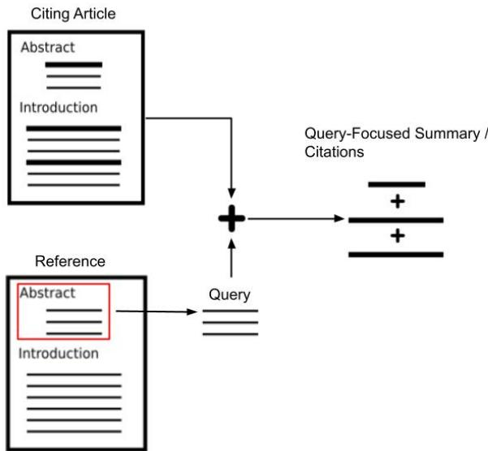
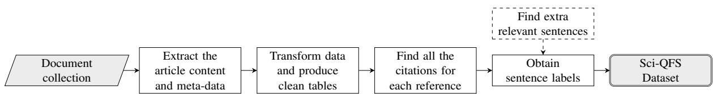
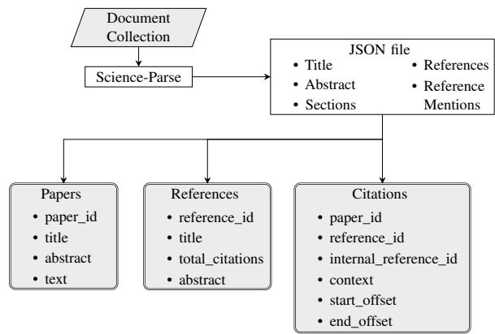
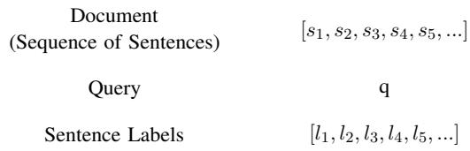
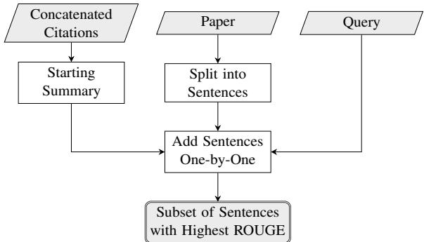
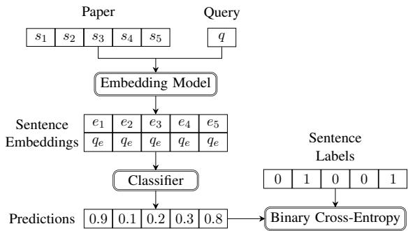

# ROUGE-SciQFS: A ROUGE-based Method to Automatically Create Datasets for Scientific Query-Focused Summarization

Juan Ramirez-Orta Evangelos Milios Faculty of Computer Science Dalhousie University

## Abstract

So far, the task of Scientific Query-Focused Summarization (Sci-QFS) has lagged in development when compared to other areas of Scientific Natural Language Processing because of the lack of data. In this work, we propose a methodology to take advantage of existing collections of academic papers to obtain largescale datasets for this task automatically. After applying it to the papers from our reading group, we introduce a novel dataset for Sci-QFS composed of 8,695 examples, each one with a query, the sentences of the full text from a paper and the relevance labels for each. After testing several classical and stateof-the-art embedding models on this data, we found that the task of Sci-QFS is far from being solved, although it is relatively straightforward for humans. Surprisingly, we found that classical methods outperformed modern pretrained Deep Language Models (sometimes by a large margin), showing the need for large datasets to better fine-tune the latter. We share our experiments, data and models at https: //github.com/jarobyte91/rouge\_sciqfs.

## 1 Introduction

Scientists must review and summarize dozens of academic articles frequently to stay up-to-date with the state of the art in their fields. This is especially true before starting a new project, as they need to ensure they incorporate the latest advances in their work. As the number of academic documents keeps increasing yearly, this task has become challenging and time-consuming, especially for students and young researchers (Landhuis, 2016).

A solution for this problem is Query-Focused Summarization (QFS) systems (Dang, 2005), which are helpful to process the extensive collections of papers that practitioners need to analyze. In QFS systems, the objective is to take a long document (or a document collection) along with the user query and produce a relevant summary, thus

Ana Maguitman   
Axel J. Soto   
Institute for Computer Science   
and Engineering, UNS - CONICET   
Department of Computer Science   
and Engineering,   
Universidad Nacional del Sur

reducing the amount of text the users need to read and facilitating the task of literature review.

Despite their potential applications, creating such systems is not easy (Dang, 2005). First, it is difficult to determine the correct summary from a long document (or a document collection), as different people would give a different answer depending on their background and what they are looking for. And second, these tasks usually have small datasets, as having experts read and summarize long documents or extensive collections of documents is a complicated process.

In this work, we propose a methodology to address the lack of data for training and evaluating QFS systems in the scientific domain by taking advantage of the citations found in peer-reviewed academic publications. The basic idea is that when the authors of a paper cite other documents as references in their work, they implicitly build training examples for QFS, as the citing sentences show precisely where the references are relevant. A diagram describing our approach is shown in Fig. 1.

This paper makes the following contributions:

• It proposes a methodology to automatically build datasets for Scientific Query-Focused Summarization directly from raw collections of academic articles. The datasets are composed of three tables: the first contains the text and meta-data of the papers present in the collection, the second one contains the metadata of the articles cited by the papers in the collection, and the third one contains the citations linking the first two tables. With these tables, it is straightforward to find examples for the task by concatenating the citations to build query-focused summaries or to use them as they are to find citations to predict.

• By applying this methodology to the papers of our reading group, it introduces a novel dataset composed of 8,965 examples for the task of Scientific Query-Focused Summarization in the fields of Artificial Intelligence and Natural Language Processing.

  
Figure 1: Overview of our approach to automatically build datasets for Scientific Query-Focused Summarization. The idea is that when the authors of a paper cite other documents as references in their work, they implicitly build examples for the task, as the citing sentences show where the references are relevant. In our approach, the abstract of the referenced article plays the role of the query, and the concatenation of the citing sentences constitute the query-focused summary.

• It explores the difficulty of the task of Scientific Query-Focused Summarization by applying several classical as well as state-of-the-art methods, showing that, although the task is natural for scholars, even pre-trained Deep Language Models struggle with them.

The remainder of this paper is organized as follows: Section 2 provides an overview of previous datasets for QFS and the corresponding methodologies employed to build them. Section 3 presents our proposed methodology for leveraging the citations from a document collection to build QFS datasets. Section 4 describes the experiments we performed on the collected data. Section 5 offers a discussion and elaboration on the obtained results. Finally, Section 6 pinpoints our conclusions and directions for future research.

## 2 Related Work

## 2.1 Summarization

The field of Summarization has always been an important area of Natural Language Processing, offering valuable solutions for condensing large volumes of text into concise and coherent summaries. On one hand, Extractive Summarization techniques involve selecting and presenting important sentences or phrases verbatim from the source document (Moratanch and Chitrakala, 2017). On the other hand, Abstractive Summarization attempts to generate summaries by paraphrasing and restructuring the source content (Lin and Ng, 2019).

One of the first methods to automatically obtain summaries of news articles was introduced in Hermann et al. (2015). This methodology involves querying the news articles obtained from the CNN and DailyMail websites using a variety of combinatorial heuristics so that the models capture how the different entities in the article relate to each other. They tested the performance of several stateof-the-art methods on their data and demonstrated that their approach is general enough to produce datasets for different domains.

Other text summarization datasets also focus on the news domain. For instance, the Gigaword dataset (Graff et al., 2003), created by the Linguistic Data Consortium (LDC), contains nearly 10 million news documents sourced from seven major outlets, with summaries derived from the headlines. The XSum dataset (Narayan et al., 2018) consists of 226,711 BBC news articles from 2010 to 2017, each paired with a professionally written, singlesentence summary spanning various topics.

The first large-scale dataset for Multi-Document Summarization was introduced in Fabbri et al. (2019). This paper exploits the data available at newser.com, with 56,216 article-summary pairs, each written by professional editors and with links to the source articles. The novelty of this dataset lies in its size and diversity, surpassing those of previously published datasets. Additionally, they introduced a novel model incorporating Maximal Marginal Relevance into a Pointer-Generator Network, improving the fluency and conciseness of previous multi-document summarization models.

## 2.2 Scientific Summarization

One of the first attempts to create a dataset for scientific document summarization was introduced during the Joint Workshop on Bibliometricenhanced Information Retrieval and Natural Language Processing for Digital Libraries (BIRNDL 2016) (Jaidka et al., 2019). To build the dataset for the competition, they heuristically filtered the most important papers from the ACL Anthology repository (https://aclanthology.org/). After that, they instructed their annotators to find the citing sentences along with the most important sentences in the citing paper, following the BiomedSumm shared task of the same event.

A methodology to automatically obtain summaries from academic articles using presentation and conference talks was introduced in Lev et al. (2019). In this work, the authors exploited the fact that when a researcher presents a paper, they must express their ideas concretely and concisely, often using key phrases and findings from their research. This means that the talk transcripts or blog posts are often good summaries of the entire article, and hence they introduce a novel unsupervised algorithm based on Hidden Markov Models to align the summaries with the original articles.

A large-scale dataset composed of 10,148 scientific articles, along with their abstracts, highlighted statements and author-defined keywords, was introduced in Collins et al. (2017). In this work, the authors extracted articles from http://www. sciencedirect.com/ and proposed a method called HighlightROUGE to extend the dataset automatically. Additionally, they introduced a metric (called AbstractROUGE) to extract summaries by leveraging the abstract of the paper. Finally, they compared several traditional and modern summarization methods and analyzed how different sections of the paper contributed to the final summary.

A related approach was presented in (Cohan et al., 2018) to generate two datasets from the academic repositories arXiv.org and PubMed.com, totaling over 300,000 papers with abstracts as summaries. The approach involves filtering the documents, normalizing math formulas and citation markers, and converting LATEX files to plain text.

## 2.3 Query-Focused Summarization

The first time that the task of QFS was formally studied was during the 2005 Document Understanding Conference (DUC 2005) (Dang, 2005). The purpose of the conference was to study how the variability of the summaries produced by humans affected the performance of the existing methods of the time. To this end, DUC 2005 had a unique summarization task, focusing on the user queries instead of the summaries, as in previous efforts.

In that shared task, the objective was to produce a well-organized and fluent answer to a complex question using a set of 25 to 50 documents. Even while there was a generous allowance of 250 words for each answer, the results revealed that the best systems of the time had a hard time summarizing multiple documents. The two subsequent editions of the conference (DUC 2006 (Dang, 2006) and DUC 2007 (Dang, 2007)) refined the data and results produced in the first conference, and they still are an important reference in the field.

Despite their importance and popularity, the DUC datasets lack diversity, as shown by Baumel et al. (2016). This paper introduced a new metric called Topic Concentration, which the authors used to show that the queries in the DUC datasets already are very close to their document collections. Hence, QFS systems did not significantly improve upon generic summarization methods. Therefore, they introduced TD-QFS, a dataset with controlled levels of Topic Concentration, and showed that when evaluated on this data, there is a clear difference between QFS systems and generic summarizers.

A novel dataset for Multi-Document QFS was introduced in Liu et al. (2024). The dataset, composed of 27,041 examples, was produced by cleaning and filtering several online resources including Answers.com, Google and Wikipedia and manually checking the correctness of the answers. After that, the authors introduced a novel architecture to summarize several documents at once and produce a single query-focused summary.

A different direction to generate examples for QFS was introduced in Xu et al. (2023). In this work, the authors introduced a methodology using pre-existing datasets and leveraged the robust few-shot capabilities of InstructGPT (Ouyang et al., 2024) to synthesize a query using the information used by the annotator to craft the summary, resulting in a dataset of over 1.1 million examples.

The task of Citation Worthiness, closely related to Sci-QFS, was studied extensively in Gosangi et al. (2021). In Citation Worthiness, the objective is to determine if a sentence in a scientific article requires a citation. Hence, they formulate the problem as a sequence labeling task, solving it with a hierarchical Bi-LSTM model. Also, they introduced a novel dataset with over 2,000,000 sentences, and show through error analysis that context plays an essential role in predicting Citation Worthiness.

A novel method to build large-scale datasets for paper writing support was introduced in Kobayashi et al. (2022). In this paper, the authors take advantage of the fact that scientific papers already include a list of relevant references in the Related Work section, and extend the method introduced in (Narimatsu et al., 2021) to consume papers in raw PDF format with the help of PDFBoT (Yu et al., 2020) and GROBID (Lopez, 2008–2024).

  
Figure 2: Overview of the proposed methodology.

Two automatic methods to determine where a citation should go inside a sentence were introduced in Buscaldi et al. (2024). Both methods, based on a similar task than the one used to train BERT (Devlin et al., 2019), leverage the Transformer (Vaswani et al., 2017) to solve a Mask-Filling or a Named Entity Recognition problem and predict the placement of citations. Additionally, they introduced s2orc-9k, an open dataset to fine-tune models for this task.

Finally, a human-centric methodology along with a novel dataset for Sci-QFS was introduced in Ramirez-Orta et al. (2023). In this work, the authors proposed an interactive system that performs Sci-QFS using Active Learning to train a classifier on-the-fly that finds sentences similar to the user query. However, the dataset they collected is small, as it is composed of only 23 examples, collected during the user study of the system.

## 3 Methodology

Our methodology is composed of four main steps to extract the content from the papers in a document collection and clean it to obtain the examples that make up the final dataset. It also includes an optional step to improve the quality of the examples found by finding more relevant sentences. An overview of the process is shown in Fig. 2.

## 3.1 Extracting the Article Content and Meta-Data

First, all the PDF files from our document collection were processed with Science-Parse (AllenAI, 2019), an LSTM-based (Hochreiter and Schmidhuber, 1997) software by AllenAI to extract text from scientific articles. The input for Science-Parse is a raw PDF file, and its output is a JSON file containing the content and meta-data of the paper, such as its title, abstract, sections, information about its authors, the list of its references and the citing sentences from the text, among other fields. An overview of the fields produced is shown in Fig. 3.

  
Figure 3: The Data Extraction process. First, the content and meta-data of each paper in the collection are extracted using Science-Parse (AllenAI, 2019) into a JSON file. Then, the JSON files are merged, cleansed and de-duplicated to obtain three clean tables: the Papers table contains the information about the papers in the collection, the References table contains the information about the references cited by the papers in the collection, and the Citations table contains the information about the citations that link the first two tables.

## 3.2 Transforming the Data and Producing Clean Tables

From the raw JSON files, three tables are produced: Papers, References and Citations. An overview of the fields in each one is shown in Fig. 3. The Papers table contains the information describing each one of the articles in the collection, using the following fields: paper\_id, title, abstract and text. The paper\_id fields contain a unique identifier for each paper, obtained after merging and de-duplicating all the papers in the collection. The title and abstract fields contain the title and abstract of the article obtained after the de-duplication process. Finally, the text field contains the full text of the paper, which was obtained as the concatenation of the text present in the Sections field of the raw

JSON files obtained in the data extraction step.

The References table contains the information about the papers cited by the papers from the collection, using the following fields: reference\_id, title, total\_citations and abstract. The reference\_id field contains a unique identifier for each reference, obtained after merging and de-duplicating the References field of the raw JSON files. The title field contains the title of the reference obtained after the de-duplication process. The total\_citations field contains the total number of times the reference was mentioned in the papers of the collection. The field abstract contains the abstract of the reference paper, obtained after joining the title field with the arXiv dataset (Clement et al., 2019).

The Citations table contains the citations that link the Papers and References tables, using the following fields: paper\_id, reference\_id, internal\_reference\_id, context, start\_offset, end\_offset. The paper\_id field contains the unique paper identifier from the Papers database. The reference\_id field contains the unique reference identifier from the References database. The internal\_reference\_id field contains the reference number as it appears in the citing paper. The context field contains the sentence where the paper cited the reference. The start\_offset and the end\_offset fields contain the character span inside the sentence where the reference was cited.

## 3.3 Finding All the Citations for each Reference

Once the clean tables have been produced, it is straightforward to join the Citations table with the Papers and References tables via the unique identifiers of the articles and references to obtain an augmented Citations table, which can be grouped by both paper\_id and reference\_id to obtain a table in which every row has the following data:

• paper\_id   
• paper\_text   
• reference\_id   
• reference\_abstract   
• citations\_concatenated

## 3.4 Obtaining the Sentence Labels

The final step in our methodology is to produce a True/False label for each one of the sentences from the text of the paper, which encodes its relevance to the query. To do this, the abstract of the reference takes the role of the query, and both the paper text and the concatenated citations are tokenized into sentences. Finally, the relevance label for each sentence from the paper is obtained by checking if the sentence is one of the sentences from the concatenated citations. A diagram displaying how the final dataset looks is shown below in Fig. 4.

  
Figure 4: Structure of the final dataset. Each example has three elements: a list with the sentences from the full text of the paper, a paragraph query and a list containing the relevance labels for each one of the sentences.

## 3.5 Finding Extra Relevant Sentences

Since each reference was cited by at least one of the papers in the collection, it is guaranteed that there is at least one positive-labeled sentence in each one of the examples. However, it is important to note that for many examples, there might be only one positive label in the entire paper. Hence, to obtain more positive labels, we used a greedy approach in which sentences are added one by one to the summary, using ROUGE (Lin, 2004) to compare it to the abstract of the reference. Although this method to find extra relevant sentences is limited and expensive (given how ROUGE works), we found that this augmentation technique worked well in practice. An overview of this process is shown in Fig. 5.

  
Figure 5: The (optional) data augmentation step. First, the concatenated citations are taken as the starting summary. Then, the sentence that introduces the best ROUGE score in the current summary when compared against the query is added. This process continues until the ROUGE score stops improving. Ultimately, the selected sentences are a good approximation of the subset of sentences that would give the best ROUGE score.

## 4 Experiments

## 4.1 Data

We applied our methodology to the collection of papers from our reading group, composed of 1,365 PDF files. After grouping the augmented citations table by reference\_id, we ended up with 10,790 examples with the structure shown in Fig. 4. Nonetheless, some examples had documents that were too long to feed into the data augmentation process using our hardware, so after filtering them out, we obtained our final dataset, described in Table 1.

<table><tr><td>Total Size: Mean Document Length: Max Document Length:</td><td>8,965 examples 353 sentences 4,447 sentences</td></tr><tr><td>Mean Fraction of Positive Labels:</td><td>: 3.9%</td></tr><tr><td>Train Set Size:</td><td>7,172 examples</td></tr><tr><td>Development Set Size:</td><td>897 examples</td></tr><tr><td>Test Set Size:</td><td>897 examples</td></tr></table>

Table 1: Details of the final dataset collected after applying our methodology to the papers of our reading group. The original collection consisted of 1,365 PDF files, which produced 10,790 examples. The final dataset was obtained after excluding the examples with documents too long to process with our data augmentation method.

## 4.2 Model Architecture

First, the paper (viewed as a sequence of sentences) and the query are embedded into a Euclidean Space using a classical frequency-based method or a Deep Language Model. Then, each sentence embedding is concatenated with a copy of the query embedding to produce a sequence of augmented sentence embeddings. Next, the augmented sentence embeddings are fed into a binary classifier (which may or may not be aware of the sequence order) to produce a binary label for each sentence, which encodes if the sentence is relevant or not. Finally, the predictions are compared with the reference labels using Binary Cross Entropy to train the classifier. A diagram of this process is shown in Fig. 6.

## 4.3 Models

To embed the query and the sentences from the papers, we used embedding models both classical (based on frequency counts) and modern (based on Deep Language Models). For the classical ones, we used TFIDF (Sparck Jones, 1988) based on word unigrams and character trigrams. For the modern ones, we used Sentence-BERT (Reimers and Gurevych, 2019) and SPECTER (Cohan et al.,

  
Figure 6: Training of the models. First, the sentences from the paper and the query are embedded into an Euclidean Space. Then, the query embedding is copied and concatenated with each one of the sentence embeddings, which are then fed into a classifier to estimate the relevance label for each one of them. Finally, the predictions from the classifier are compared with the reference labels via Binary Cross Entropy.

2020). To produce the relevance labels for the sentences, we also used both classical and modern classifiers. For the classical ones, we used the typical Cosine Similarity/Euclidean Distance Classifier and the Multi-Layer Perceptron (MLP). For the modern ones, we used two sequence-aware classifiers: the LSTM (Hochreiter and Schmidhuber, 1997) and the Transformer (Vaswani et al., 2017). The combinations of embedding models and classifiers we used are shown in Table 2, while the exact hyper-parameters can be found in the Appendix.

<table><tr><td>Classifier</td><td>TFIDF- Words</td><td>TFIDF- Chars</td><td>Sentence- BERT</td><td>SPECTER</td></tr><tr><td>Euclidean Distance</td><td rowspan="4">X X</td><td></td><td></td><td>X</td></tr><tr><td>Cosine Similarity</td><td>X</td><td>X</td><td></td></tr><tr><td>Multi-Layer Perceptron (MLP)</td><td>X</td><td>X</td><td>X</td></tr><tr><td>LSTM</td><td></td><td>X</td><td>X</td></tr><tr><td>Transformer</td><td></td><td></td><td>X</td><td>X</td></tr></table>

Table 2: Model variations used during the experiments.

## 4.4 Results

Since the objective is to produce a binary label for each sentence, we evaluated the models using both Average Precision and Area under the ROC Curve (ROC AUC), as shown in Table 3. Both metrics were computed on each one of the examples in the Test Set using the standard implementation found in scikit-learn (Pedregosa et al., 2011).

## 5 Discussion

Although some models display decent values of ROC AUC, the Average Precision shows that they struggle with this task, as none could obtain more than 0.21 on this metric. Overall, the best models are the Cosine Similarity Classifier on top of TFIDF-Word unigram embeddings and the LSTM on top of SPECTER embeddings, well above the others. Interestingly, the task appears to be considerably easier when the user is involved in the process, as shown in (Ramirez-Orta et al., 2023).

<table><tr><td>Classifier</td><td>Embeddings</td><td>Average Precision</td><td>ROC AUC</td></tr><tr><td>Cosine Similarity</td><td>TFIDF-Words</td><td> $0 . 1 9 7 \pm 0 . 0 0 8$ </td><td> $\mathbf { 0 . 7 6 5 \pm 0 . 0 0 6 }$ </td></tr><tr><td>MLP</td><td>TFIDF-Chars</td><td> $0 . 1 4 8 \pm 0 . 0 0 6$ </td><td> $0 . 7 1 2 \pm 0 . 0 0 7$ </td></tr><tr><td>MLP</td><td>TFIDF-Words</td><td> $0 . 1 4 5 \pm 0 . 0 0 6$ </td><td> $0 . 7 0 3 \pm 0 . 0 0 7$ </td></tr><tr><td>Cosine Similarity</td><td>TFIDF-Chars</td><td> $0 . 1 5 2 \pm 0 . 0 0 7$ </td><td> $0 . 7 0 1 \pm 0 . 0 0 6$ </td></tr><tr><td>LSTM</td><td>SPECTER</td><td> ${ \bf 0 . 2 0 8 \pm 0 . 0 1 8 }$ </td><td> $0 . 6 9 1 \pm 0 . 0 0 9$ </td></tr><tr><td>Transformer</td><td>SPECTER</td><td> $0 . 1 9 3 \pm 0 . 0 1 7$ </td><td> $0 . 6 8 5 \pm 0 . 0 1 0$ </td></tr><tr><td>LSTM</td><td>Sentence-BERT</td><td> $0 . 2 0 2 \pm 0 . 0 1 8$ </td><td> $0 . 6 8 4 \pm 0 . 0 0 9$ </td></tr><tr><td>MLP</td><td>SPECTER</td><td> $0 . 1 1 5 \pm 0 . 0 0 5$ </td><td> $0 . 6 7 8 \pm 0 . 0 0 6$ </td></tr><tr><td>MLP</td><td>Sentence-BERT</td><td> $0 . 1 0 3 \pm 0 . 0 0 5$ </td><td> $0 . 6 5 4 \pm 0 . 0 0 7$ </td></tr><tr><td>Cosine Similarity</td><td>Sentence-BERT</td><td> $0 . 1 2 5 \pm 0 . 0 0 6$ </td><td> $0 . 6 3 3 \pm 0 . 0 0 7$ </td></tr><tr><td>Transformer</td><td>Sentence-BERT</td><td> $0 . 1 6 0 \pm 0 . 0 1 6$ </td><td> $0 . 6 2 8 \pm 0 . 0 1 0$ </td></tr><tr><td>Euclidean Distance</td><td>SPECTER</td><td> $0 . 1 1 4 \pm 0 . 0 0 6$ </td><td> $0 . 6 0 0 \pm 0 . 0 0 8$ </td></tr></table>

Table 3: Mean Average Precision and Mean ROC AUC on the Test Set. The best-performing models are in bold.

Surprisingly, the models based on classical embeddings (TFIDF-Chars and TFIDF-Words) performed well despite their simplicity. Out of these models, it is striking that the Cosine Similarity Classifier on top of TFIDF-Words is the best of all the models in terms of ROC AUC.

Another interesting fact is that for the Cosine Similarity classifiers, the ones based on TFIDF embeddings (character trigrams and word unigrams) performed better than the neural-based ones (Sentence-BERT and SPECTER), although TFIDF-Chars performed worse than TFIDF-Words. As an explanation for these results, it makes sense that simply matching words between the query and the sentences provides a strong baseline for this task.

For the models based on embeddings produced by neural networks, it is interesting to see that the LSTMs outperformed the Transformers. Also, except for the Cosine Similarity/Euclidean Distance Classifier, the SPECTER embeddings performed better than the Sentence-BERT ones, a trend confirmed with the LSTMs, the Transformers and the MLPs. Finally, it is interesting that the MLPs are on par with the Transformers regarding ROC AUC, although their Average Precision is worse.

To further investigate our results, we computed the fraction of relevant sentences and the mean length of spans of consecutive positive labels for each example in the Train Set, as shown in Table 4. This shows that around 4% of the sentences in a given example are relevant and that around 5% of them come in sequences of 2 or more. This fact might explain why the models that are unaware of the sequence order (all but the LSTMs and the Transformers) perform so similarly and why the LSTMs outperformed the Transformers.

<table><tr><td colspan="2">Fraction of Relevant Sentences</td><td rowspan="2">Span Length</td><td rowspan="2">Relative Frequency(%)</td></tr><tr><td>Mean</td><td>3.90%</td></tr><tr><td>STD</td><td>2.00%</td><td>1</td><td>94.953</td></tr><tr><td>Min</td><td>0.01%</td><td>2</td><td>4.739</td></tr><tr><td>First Quartile</td><td>2.43%</td><td>3</td><td>0.269</td></tr><tr><td>Median</td><td>3.66%</td><td>4</td><td>0.032</td></tr><tr><td>Third Quartile</td><td>5.03%</td><td>5</td><td>0.005</td></tr><tr><td>Max</td><td>22.73%</td><td></td><td></td></tr></table>

Table 4: Distribution of positive labels in the Train Set.

Furthermore, it is interesting that the Euclidean Distance/Cosine Similarity Classifier based on the SPECTER embeddings is worse than the one based on Sentence-BERT embeddings. This is striking, as SPECTER is trained to embed scientific documents. It is important to note that even while it seems that this classifier requires some hyperparameter tuning, in reality, what matters is the ranking of similarities between the query and the document sentences, which is based on the pairwise distances of their respective embeddings. Nonetheless, the classifiers based on the SPECTER embeddings outperformed their counterparts based on the Sentence-BERT embeddings (sometimes by a large margin), so they appear well-suited for this task.

To finalize the discussion of our results, we evaluated the models on the ground truth data produced by real users collected using QuOTeS (Ramirez-Orta et al., 2023), as shown in Table 5. Although the results obtained with this dataset are different from the ones obtained during our experiments, it is important to note that this dataset is much smaller (only 23 examples) and that the documents from these examples are much shorter than the ones we obtained with our methodology.

Nonetheless, the main conclusions we obtained in our experiments are the same: the classical embedding models still provide strong baselines for the task, the LSTMs outperformed the Transformers and the SPECTER embeddings proved superior than the Sentence-BERT ones.

## 6 Conclusions and Future Work

In this work, we introduced a novel methodology for the automatic creation of datasets for the task of Scientific Query-Focused Summarization. After applying it to the collection of papers from our reading group, we obtained a dataset composed of 8,965 examples.

<table><tr><td>Classifier</td><td>Embeddings</td><td>Average Precision</td><td>ROC AUC</td></tr><tr><td>MLP</td><td>TFIDF-Chars</td><td> $0 . 6 6 4 \pm 0 . 1 3$ </td><td> ${ \bf 0 . 6 8 2 \pm 0 . 1 1 }$ </td></tr><tr><td>MLP</td><td>SPECTER</td><td> $0 . 6 5 2 \pm 0 . 1 1$ </td><td> $0 . 6 5 4 \pm 0 . 1 1$ </td></tr><tr><td>MLP</td><td>TFIDF-Words</td><td> $0 . 6 5 4 \pm 0 . 1 2$ </td><td> $0 . 6 5 0 \pm 0 . 1 3$ </td></tr><tr><td>Cosine Similarity</td><td>TFIDF-Chars</td><td> $\mathbf { 0 . 6 7 4 \pm 0 . 1 0 }$ </td><td> $0 . 6 3 4 \pm 0 . 1 3$ </td></tr><tr><td>LSTM</td><td>Sentence-BERT</td><td> $0 . 6 0 0 \pm 0 . 1 1$ </td><td> $0 . 6 3 1 \pm 0 . 0 9$ </td></tr><tr><td>LSTM</td><td>SPECTER</td><td> $0 . 6 3 7 \pm 0 . 1 0$ </td><td> $0 . 6 2 7 \pm 0 . 1 0$ </td></tr><tr><td>Cosine Similarity</td><td>TFIDF-Words</td><td> $0 . 5 7 5 \pm 0 . 1 1$ </td><td> $0 . 5 4 3 \pm 0 . 1 3$ </td></tr><tr><td>MLP</td><td>Sentence-BERT</td><td> $0 . 6 0 0 \pm 0 . 1 2$ </td><td> $0 . 5 4 0 \pm 0 . 1 3$ </td></tr><tr><td>Euclidean Distance</td><td>SPECTER</td><td> $0 . 5 3 2 \pm 0 . 1 1$ </td><td> $0 . 5 0 5 \pm 0 . 1 2$ </td></tr><tr><td>Transformer</td><td>Sentence-BERT</td><td> $0 . 5 4 5 \pm 0 . 1 0$ </td><td> $0 . 4 8 5 \pm 0 . 1 2$ </td></tr><tr><td>Transformer</td><td>SPECTER</td><td> $0 . 5 5 6 \pm 0 . 0 9$ </td><td> $0 . 4 7 9 \pm 0 . 1 2$ </td></tr><tr><td>Cosine Similarity</td><td>Sentence-BERT</td><td> $0 . 5 2 6 \pm 0 . 0 9$ </td><td> $0 . 4 2 0 \pm 0 . 1 2$ </td></tr></table>

Table 5: Results obtained by the models on the ground truth data collected using QuOTeS (Ramirez-Orta et al., 2023). The best-performing models are in bold.

Through several experiments, we have shown that the task of Query-Focused Summarization is far from being solved, despite being relatively simple for domain experts (Ramirez-Orta et al., 2023). We have also shown that state-of-the-art systems struggle with this task and that classical, simple models perform better.

In particular, the traditional Cosine Similarity Classifier based on TFIDF embeddings outperformed by a large margin modern off-the-shelf methods based on deep neural networks. Furthermore, we found surprising that, contrary to the current state of the art, a system based on a bidirectional LSTM model outperformed the more complex Transformer. This provides evidence that the task of Sci-QFS is an interesting challenge inside Scientific Natural Language Processing.

For future work, we would like to investigate why this task is so difficult for current models. Given the performance shown by Large Language Models (LLMs) on several benchmarks, it would appear that this task should be easy to solve, but our experiments proved otherwise.

Another future direction would be to investigate how LLMs like GPT-4 (OpenAI et al., 2024) behave on this task and how they can enhance the data collected in this work. One idea in this direction is to feed the query and the text from the article into the model and ask it to verify the correctness of the summary produced with the methodology introduced here. A more sophisticated approach would be to ask the model to generate the Query-Focused Summary, although this idea would be susceptible to hallucination and lack of reproducibility.

## 7 Limitations

The first main limitation of the methodology presented in this work is that in some cases, it is difficult to obtain the full query-focused summary or all the citations relevant to a given query. The reason for this is that when the authors of a paper are composing it, they usually stop citing a reference after using it a few times. This means that the citing paper has usually more implicit references than the ones found by Science-Parse, so sentences that could have been potentially relevant to the query are left out. Unfortunately, we cannot think of a way to fully verify the quality of the data obtained with our method other than reading the full papers and manually extracting all the citations. Nonetheless, a simple solution for this problem is to filter out the examples with very few positive labels. Finally, a more complicated way to overcome this limitation is the optional data augmentation process we included at the end of our methodology.

The second main limitation of this work is that the hardware requirements to use our methodology can be quite high. First, the data augmentation process can be very expensive (as actually happened during our experiments), because if the document is very long, the process of adding all the sentences and computing the ROUGE scores of the potential summaries is computationally prohibitive, and it cannot be accelerated with specialized hardware, like GPUs. Second, as outlined in the original repository, Science-Parse requires a lot of heap memory, which can be an issue for most users (in our experiments, we ended up using a separate workstation with 32 GB of RAM to extract the raw JSON files). And third, for the examples with very long documents, it is difficult to train the models that are aware of the sequence order (LSTM and Transformer) because of their inherent limitations on the number of sentences they can process at once. Unfortunately, the examples with longer documents are usually the most interesting ones, so future users of the method presented here will have to balance this trade-off between document length and hardware requirements.

## 8 Ethical Considerations

Since our methodology does not require human input and does not collect sensitive information, the topics of Bias, Fairness or Offensive Speech are not an issue. However, the main ethical consideration about the methodology introduced in this paper is the copyright surrounding the papers on which our methodology is applied. Nonetheless, each one of the users of our methodology is responsible for the correct use of the files in their personal computer.

## Acknowledgments

We thank the Digital Research Alliance of Canada (https://alliancecan.ca/en), CONICET (PUE 22920160100056CO, PIBAA 2872021010 1236CO), MinCyT (PICT PRH-2017-0007 and PICT 2019-03944), UNS (PGI 24/N060, 24/ZN41) and the Natural Sciences and Engineering Research Council of Canada (NSERC) for the resources provided to enable this research.

## References

AllenAI. 2019. Science Parse. GitHub repository. Visited on September 23, 2024.

Tal Baumel, Raphael Cohen, and Michael Elhadad. 2016. Topic Concentration in Query Focused Summarization Datasets. In Proceedings of the Thirtieth AAAI Conference on Artificial Intelligence, volume 30.

James Bergstra and Yoshua Bengio. 2012. Random Search for Hyper-Parameter Optimization. Journal ofMachine Learning Research, 13(2):281–305.

Davide Buscaldi, Danilo Dessí, Enrico Motta, Marco Murgia, Francesco Osborne, and Diego Reforgiato Recupero. 2024. Citation prediction by leveraging transformers and natural language processing heuristics. Information Processing & Management, 61(1):103583.

Colin B Clement, Matthew Bierbaum, Kevin P O’Keeffe, and Alexander A Alemi. 2019. On the Use of arXiv as a Dataset. arXiv preprint arXiv:1905.00075.

Arman Cohan, Franck Dernoncourt, Doo Soon Kim, Trung Bui, Seokhwan Kim, Walter Chang, and Nazli Goharian. 2018. A Discourse-Aware Attention Model for Abstractive Summarization of Long Documents. In Proceedings of the 2018 Conference of the North American Chapter ofthe Associationfor Computational Linguistics: Human Language Technologies, Volume 2 (Short Papers), pages 615–621, New Orleans, Louisiana. Association for Computational Linguistics.

Arman Cohan, Sergey Feldman, Iz Beltagy, Doug Downey, and Daniel Weld. 2020. SPECTER: Document-level Representation Learning using Citation-informed Transformers. In Proceedings of the 58th Annual Meeting of the Association for Computational Linguistics, pages 2270–2282, Online. Association for Computational Linguistics.

Ed Collins, Isabelle Augenstein, and Sebastian Riedel. 2017. A Supervised Approach to Extractive Summarisation of Scientific Papers. In Proceedings of the 21st Conference on Computational Natural Language Learning (CoNLL 2017), pages 195–205, Vancouver, Canada. Association for Computational Linguistics.

Hoa Trang Dang. 2005. Overview of DUC 2005. In Proceedings ofthe document understanding conference, volume 2005, pages 1–12.

Hoa Trang Dang. 2006. Overview of DUC 2006. In Proceedings ofthe document understanding conference, volume 2006, pages 1–10.

Hoa Trang Dang. 2007. Overview of DUC 2007. In Proceedings of the document understanding conference, volume 2007, pages 1–53.

Jacob Devlin, Ming-Wei Chang, Kenton Lee, and Kristina Toutanova. 2019. BERT: Pre-training of Deep Bidirectional Transformers for Language Understanding. In Proceedings ofthe 2019 Conference ofthe North American Chapter ofthe Associationfor Computational Linguistics: Human Language Technologies, Volume 1 (Long and Short Papers), pages 4171–4186, Minneapolis, Minnesota. Association for Computational Linguistics.

Alexander R. Fabbri, Irene Li, Tianwei She, Suyi Li, and Dragomir R. Radev. 2019. Multi-News: a Large-Scale Multi-Document Summarization Dataset and Abstractive Hierarchical Model. Preprint, arXiv:1906.01749.

Rakesh Gosangi, Ravneet Arora, Mohsen Gheisarieha, Debanjan Mahata, and Haimin Zhang. 2021. On the Use of Context for Predicting Citation Worthiness of Sentences in Scholarly Articles. In Proceedings of the 2021 Conference of the North American Chapter of the Association for Computational Linguistics: Human Language Technologies, pages 4539–4545, Online. Association for Computational Linguistics.

David Graff, Junbo Kong, Ke Chen, and Kazuaki Maeda. 2003. English Gigaword. Linguistic Data Consortium, Philadelphia, 4(1):34.

Karl Moritz Hermann, Tomáš Kociský, Edward Grefen-ˇ stette, Lasse Espeholt, Will Kay, Mustafa Suleyman, and Phil Blunsom. 2015. Teaching Machines to Read and Comprehend. In Proceedings ofthe 28th International Conference on Neural Information Processing Systems - Volume 1, NIPS’15, page 1693–1701, Cambridge, MA, USA. MIT Press.

Sepp Hochreiter and Jürgen Schmidhuber. 1997. Long Short-Term Memory. Neural Computation, 9(8):1735–1780.

Kokil Jaidka, Michihiro Yasunaga, Muthu Kumar Chandrasekaran, Dragomir Radev, and Min-Yen Kan. 2019. The cl-scisumm shared task 2018: Results and key insights. arXiv preprint arXiv:1909.00764.

Diederik P Kingma and Jimmy Ba. 2014. Adam: A method for stochastic optimization. arXiv preprint arXiv:1412.6980.

Keita Kobayashi, Kohei Koyama, Hiromi Narimatsu, and Yasuhiro Minami. 2022. Dataset Construction for Scientific-Document Writing Support by Extracting Related Work Section and Citations from PDF Papers. In Proceedings of the Thirteenth Language Resources and Evaluation Conference, pages 5673– 5682, Marseille, France. European Language Resources Association.

Esther Landhuis. 2016. Scientific literature: Information overload. Nature, 535(7612):457–458.

Guy Lev, Michal Shmueli-Scheuer, Jonathan Herzig, Achiya Jerbi, and David Konopnicki. 2019. Talk-Summ: A Dataset and Scalable Annotation Method for Scientific Paper Summarization Based on Conference Talks. In Proceedings of the 57th Annual Meeting of the Association for Computational Linguistics, pages 2125–2131, Florence, Italy. Association for Computational Linguistics.

Chin-Yew Lin. 2004. ROUGE: A Package for Automatic Evaluation of Summaries. In Text Summarization Branches Out, pages 74–81, Barcelona, Spain. Association for Computational Linguistics.

Hui Lin and Vincent Ng. 2019. Abstractive Summarization: A Survey of the State of the Art. Proceedings of the AAAI Conference on Artificial Intelligence, 33(01):9815–9822.

Yushan Liu, Zili Wang, and Ruifeng Yuan. 2024. Query-Sum: A Multi-Document Query-Focused Summarization Dataset Augmented with Similar Query Clusters. Proceedings ofthe AAAI Conference on Artificial Intelligence, 38(17):18725–18732.

Patrice Lopez. 2008–2024. GROBID. GitHub Repository. Visited on December 10, 2024.

N. Moratanch and S. Chitrakala. 2017. A survey on extractive text summarization. In 2017 International Conference on Computer, Communication and Signal Processing (ICCCSP), pages 1–6.

Shashi Narayan, Shay B. Cohen, and Mirella Lapata. 2018. Don’t Give Me the Details, Just the Summary! Topic-Aware Convolutional Neural Networks for Extreme Summarization. In Proceedings of the 2018 Conference on Empirical Methods in Natural Language Processing, pages 1797–1807, Brussels, Belgium. Association for Computational Linguistics.

Hiromi Narimatsu, Kohei Koyama, Kohji Dohsaka, Ryuichiro Higashinaka, Yasuhiro Minami, and Hirotoshi Taira. 2021. Task Definition and Integration For Scientific-Document Writing Support. In Proceedings ofthe Second Workshop on Scholarly Document Processing, pages 18–26, Online. Association for Computational Linguistics.

OpenAI, Josh Achiam, Steven Adler, Sandhini Agarwal, Lama Ahmad, Ilge Akkaya, Florencia Leoni Aleman, Diogo Almeida, Janko Altenschmidt, Sam Altman, Shyamal Anadkat, et al. 2024. GPT-4 Technical Report. Preprint, arXiv:2303.08774.

Long Ouyang, Jeff Wu, Xu Jiang, Diogo Almeida, Carroll L. Wainwright, Pamela Mishkin, Chong Zhang, Sandhini Agarwal, Katarina Slama, Alex Ray, John Schulman, Jacob Hilton, Fraser Kelton, Luke Miller, Maddie Simens, Amanda Askell, Peter Welinder, Paul Christiano, Jan Leike, and Ryan Lowe. 2024. Training language models to follow instructions with human feedback. In Proceedings ofthe 36th International Conference on Neural Information Processing Systems, NIPS ’22, Red Hook, NY, USA. Curran Associates Inc.

Fabian Pedregosa, Gaël Varoquaux, Alexandre Gramfort, Vincent Michel, Bertrand Thirion, Olivier Grisel, Mathieu Blondel, Peter Prettenhofer, Ron Weiss, Vincent Dubourg, Jake Vanderplas, Alexandre Passos, David Cournapeau, Matthieu Brucher, Matthieu Perrot, and Édouard Duchesnay. 2011. Scikit-Learn: Machine Learning in Python. Journal of Machine Learning Research, 12:2825–2830.

Juan Ramirez-Orta, Eduardo Xamena, Ana Maguitman, Axel J. Soto, Flavia P. Zanoto, and Evangelos Milios. 2023. QuOTeS: Query-Oriented Technical Summarization. In Document Analysis and Recognition - ICDAR 2023: 17th International Conference, San José, CA, USA, August 21–26, 2023, Proceedings, Part III, page 98–114, Berlin, Heidelberg. Springer-Verlag.

Nils Reimers and Iryna Gurevych. 2019. Sentence-BERT: Sentence Embeddings using Siamese BERT-Networks. In Proceedings ofthe 2019 Conference on Empirical Methods in Natural Language Processing. Association for Computational Linguistics.

Karen Sparck Jones. 1988. A Statistical Interpretation ofTerm Specificity and Its Application in Retrieval, page 132–142. Taylor Graham Publishing, GBR.

Ashish Vaswani, Noam Shazeer, Niki Parmar, Jakob Uszkoreit, Llion Jones, Aidan N. Gomez, Lukasz Kaiser, and Illia Polosukhin. 2017. Attention is All you Need. In Advances in Neural Information Processing Systems, volume 30. Curran Associates, Inc.

Ruochen Xu, Song Wang, Yang Liu, Shuohang Wang, Yichong Xu, Dan Iter, Pengcheng He, Chenguang Zhu, and Michael Zeng. 2023. LMGQS: A Largescale Dataset for Query-focused Summarization. In Findings ofthe Associationfor Computational Linguistics: EMNLP 2023, pages 14764–14776, Singapore. Association for Computational Linguistics.

Changfeng Yu, Cheng Zhang, and Jie Wang. 2020. Extracting Body Text from Academic PDF Documents for Text Mining. CoRR, abs/2010.12647.

## A Model Details

In this section, we describe the hyper-parameters needed to implement the models that performed the best in this work. For each one of them, we used Random Search (Bergstra and Bengio, 2012) to tune the hyper-parameters on the ranges described below.

## A.1 Embedding Models

Regarding the TFIDF embeddings, we used the standard implementation found in Pedregosa et al. (2011) with default parameters for both word unigrams and character trigrams. For the neuralbased embeddings, we used the standard implementation from https://www.sbert.net/ (Reimers and Gurevych, 2019). For Sentence-BERT we used all-MiniLM-L6-v2, while for SPECTER we used allenai-specter.

## A.2 Multi-Layer Perceptron (MLP)

For the MLPs on top of TFIDF embeddings, we tried from 1 to 4 layers of 100, 200, 300 or 400 hidden units each, trained for 16 epochs. All the other hyper-parameters were left as the default value from the standard implementation found in Pedregosa et al. (2011). For the word unigrams model, the one that performed the best had a single layer of 400 hidden units, with a total training time of 18.18 hours. For the character trigrams model, the one that performed the best had three layers of 100 hidden units each, with a total training time of 4.05 hours.

For the MLPs on top of neural-based embeddings, we tried from 1 to 4 layers of 100 to 500 hidden units each, in steps of 50. Each model was trained for 2,000 epochs using the Adam optimizer (Kingma and Ba, 2014) with a constant learning rate of $1 0 ^ { - 4 }$ and a $L ^ { 2 }$ regularization term of $0 , 1 0 ^ { - 1 } , 1 0 ^ { - 2 } , 1 0 ^ { - 3 } , 1 0 ^ { - 4 } \mathrm { o r } 1 0 ^ { - 5 }$ . For the Sentence-BERT embeddings, the best model had 3 layers of 300 hidden units each, a regularization value of $1 0 ^ { - 4 }$ and a total training time of 45 minutes. For the SPECTER embeddings, the best model had 4 layers of 450 hidden units each, a regularization value of 0 with a total training time of 91 minutes.

## A.3 LSTM

For both the models built on top of Sentence-BERT and SPECTER embeddings, we tried from 1 to 4 layers of 100 to 500 hidden units each, in steps of 50. Each model was trained for 2,000 epochs using the Adam optimizer (Kingma and Ba, 2014) with a constant learning rate of $1 0 ^ { - 4 }$ and a $L ^ { 2 }$ regularization term of 0, $1 0 ^ { - 1 } , 1 0 ^ { - 2 } , 1 0 ^ { - 3 } , 1 0 ^ { - 4 }$ $\mathrm { o r 1 0 ^ { - 5 } }$ . For the Sentence-BERT embeddings, the best model had 3 layers of 500 hidden units each, a regularization value of 0 and a total training time of 3.9 hours. For the SPECTER embeddings, the best model had a single layer of 500 hidden units each, a regularization value of 0, with a total training time of 102 minutes.

## A.4 Transformer

For both the models built on top of Sentence-BERT and SPECTER embeddings, we tried from 2 to 4 Transformer layers, having from 100 to 500 units in its feed-forward networks, in steps of 50, and from 2 to 4 attention heads. Each model was trained for 2,000 epochs using the Adam optimizer (Kingma and Ba, 2014) with a constant learning rate of 10−4 and a $L ^ { 2 }$ regularization term of $0 , \ 1 0 ^ { - 1 } , \ 1 0 ^ { - 2 }$ $1 0 ^ { - 3 } , 1 0 ^ { - 4 } \mathrm { o r } 1 0 ^ { - 5 }$ . For the Sentence-BERT embeddings, the best model had 3 layers of 250 units in its feed-forward networks and 4 attention heads, a regularization value of 0 and a total training time of 11.96 hours. For the SPECTER embeddings, the best model had 3 layers, 350 units in its feedforward networks, 4 attention heads, a regularization value of $1 0 ^ { - 5 }$ and a total training time of 30.25 hours.