# Read Before Grounding: Scene Knowledge Visual Grounding via Multi-step Parsing

Haixiang Zhu\* Independent Researcher xiangxiangzhu6324@gmail.com

Shuangming Mao Independent Researcher shuangming@suou.waseda.jp

Lixian Su\* Independent Researcher cpkensei@gmail.com

## Abstract

## 1 Introduction

Jing Ye† Independent Researcher yejing901020@gmail.com

Visual grounding (VG) is an important task in vision and language that involves understanding the mutual relationship between query terms and images. However, existing VG datasets typically use simple and intuitive textual descriptions, with limited attribute and spatial information between images and text. Recently, the Scene Knowledge Visual Grounding (SK-VG) task has been introduced, which constructs VG datasets using visual knowledge and relational referential expressions. Due to the length of textual visual knowledge and the complexity of the referential relationships between entities, previous models have struggled with this task. Therefore, we propose ReadVG, a zero-shot, plug-and-play method that leverages the robust language understanding capabilities of Large Language Models (LLMs) to transform long visual knowledge texts into concise, information-dense visual descriptions. To improve the accuracy of target localisation, we employ a multi-step parsing algorithm that can progressively extract the query targets and their features from the visual knowledge and relational referencing expressions, thereby assisting multimodal models to more accurately localise the target for grounding purposes. Extensive experiments and case studies show that our approach can significantly improve the performance of multimodal grounding models. Code is available at https://github.com/xiang-xiangzhu/ReadVG.

Visual grounding (VG) task (Deng et al., 2021, 2023a; Hu et al., 2015) aims to localize target objects in images based on query expressions, and serves as a fundamental task for visual question answering (Zhu et al., 2020; Shi et al., 2020; Sun et al., 2020) and visual language navigation (Zhou et al., 2023, 2024). However, existing benchmarks such as RefCOCO (Kazemzadeh et al., 2014), RefCOCO+ (Yu et al., 2016), and RefCOCOg (Mao et al., 2016) feature relatively simple query expressions, allowing models to focus on simple visuallinguistic associations, thereby reducing the complexity of the grounding task.

Scene Knowledge Visual Grounding (SK-VG) task (Chen et al., 2023c) is introduced, which focuses on the complex interplay between images and language. It consists of three main components: scene knowledge, query expressions, and images. The scene knowledge describes the appearance and relationships of entities within the image, while the query expression emphasizes the relationships between these entities rather than their direct visual features. This task uses images derived from movie scenes that contain multiple anonymized characters and objects. SK-VG requires models not only to understand visual content, but also to reason in a rich visual context, thus placing high demands on the joint reasoning capabilities of vision and language.

Existing approaches (Chen et al., 2023c) use smaller end-to-end architectures, which can limit performance when dealing with complex scene text information. Conversely, Multimodal Large Language Models (MLLMs) (Wang et al., 2023; Chen et al., 2024b, 2023b; Li et al., 2024) have demonstrated robust capabilities across a variety of tasks, excelling in inference and text comprehension. However, these larger models often underperform in visual grounding tasks, as shown in Figure 1. This may be due to the lack of groundingspecific data in their pre-training datasets (Yang et al., 2023). In addition, almost all multimodal models fail under the SK-VG framework, possibly due to the influence of scene text length on model performance.

In recent years, Large Language Models (LLMs) (Bai et al., 2023; Touvron et al., 2023a,b; Rozière et al., 2023) have significantly improved

  
Query: the cat

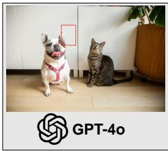

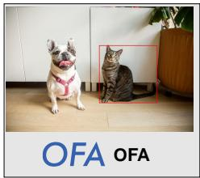

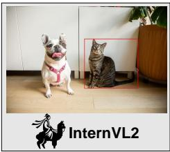  
(a) Traditional Visual Grounding (b) Scene Knowledge Visual Grounding

Scene Knowledge: The housekeeper Danny, who is a man in a black suit, comes out of the house. The woman in front of him, Sunny, is walking towards her husband Leon, who is wearing a gray suit. Leon has just come home from work when he sees his wife walking towards him. He feels very happy.

Query: The man who is a housekeeper

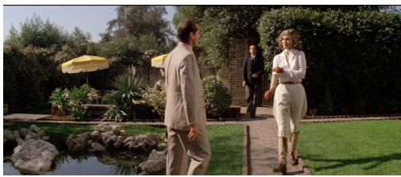

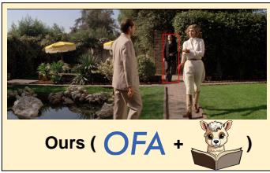

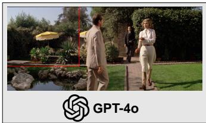

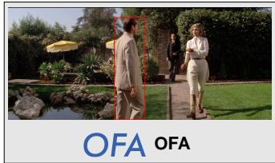

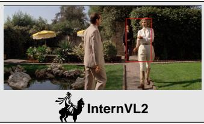  
Figure 1: Examples from our analysis of the localization capabilities of existing query-based MLLMs. GPT-4o fails to produce valid bounding boxes for two visual grounding tasks. MLLMs that can easily accomplish traditional visual grounding task struggle with target localization in the SK-VG task. Additional examples and detailed prompts are provided in the Appendix.

their text understanding capabilities through pretraining on massive datasets aligned with human preferences and subsequent optimization through methods such as instruction fine-tuning,achieving impressive results in various downstream tasks. Inspired by these advances, we proposed ReadVG, a plug-and-play solution for visual grounding that does not require additional training or fine-tuning. This approach consists of a reading module and a visual descriptor generation module. The reading module uses the LLM to identify the object to be localized and its category, effectively narrowing the search scope. Subsequently, the Visual Descriptor Generation Module synthesizes a visual descriptor of the target object based on the output of the Reading Module and the provided scene knowledge. This descriptor is then input into the localization model along with the image to generate bounding boxes for the target objects. In summary, our contributions are as follows:

• We propose ReadVG, a zero-shot approach for Scene Knowledge Visual Grounding (SK-VG) tasks. ReadVG is plug-and-play and can be applied to SK-VG tasks with extremely long text lengths;

• With ReadVG, the multimodal grounding model significantly reduces the search area of the image, while also reducing the performance impact of long scene knowledge texts;

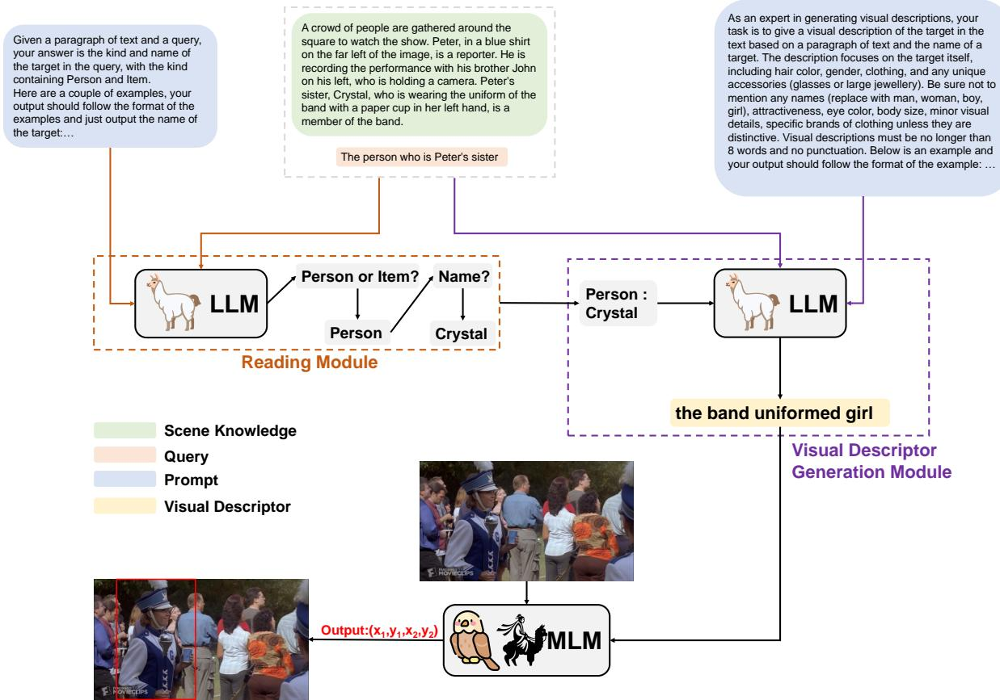  
Figure 2: ReadVG, comprises a Reading module and a Visual Descriptor Generation module. The Reading module receives scene knowledge and a query, generating the category and name of the target in the query. Then, the Visual Descriptor Generation module produces a concise visual descriptor for the target based on its name, scene knowledge, and the query. Finally, a multimodal grounding model generates the bounding box of the target using the visual descriptor and the image

• Extensive experiments on a wide range of MLLMs demonstrate the effectiveness of ReadVG in the SK-VG task, and case studies are used to show how the proposed method is effective in completing the task

## 2 Related Works

## 2.1 Visual Grounding

Visual Grounding (VG) aims at identifying image regions corresponding to textual descriptions, and serves as a cornerstone for interdisciplinary research between Computer Vision and Natural Language Processing, particularly for applications such as Visual Question Answering (VQA) (Selvaraju et al., 2019). VG approaches are typically categorized into one-stage and two-stage methods. One-stage methods (Yang et al., 2022; Li et al., 2023b; Chen et al., 2024a; Shi et al., 2023; Deng et al., 2023a, 2021), process images and text directly to predict bounding boxes. Conversely, twostep methods (Yu et al., 2018; Yang et al., 2019;

Wang et al., 2019, 2018; Hu et al., 2017; Hong et al., 2019), first generate region proposals before selecting the best match based on similarity scores, To improve interpretability and generalization,some studies (Yang et al., 2020; Ding et al., 2021; Chen et al., 2022; Yang et al., 2019; Wang et al., 2019) have focused on modeling object attributes and their relationships. However, current datasets often contain simple text queries, which limits the exploration of sophisticated semantic relationships between text and images.

## 2.2 Large Language Model

Recent advances in Large Language Models (LLMs) have significantly enhanced both the theoretical development and practical applications of Natural Language Processing(NLP). After the advent of ChatGPT, LLMs, characterized by their massive parameter sizes and extensive training data, have demonstrated unprecedented capabilities in language understanding and generation,

<table><tr><td>Level</td><td>Person Count</td><td>Item Count</td><td>PP</td><td>IP</td><td>LP</td></tr><tr><td>Easy</td><td>2006</td><td>1022</td><td>66.25%</td><td>33.75%</td><td>45.89%</td></tr><tr><td>Medium</td><td>1457</td><td>371</td><td>79.70%</td><td>20.30%</td><td>27.71%</td></tr><tr><td>Hard</td><td>1735</td><td>7</td><td>99.60%</td><td>0.40%</td><td>26.40%</td></tr></table>

Table 1: Statistics for the Test Set of the SK-VG Dataset. Where PP represents the proportion of Person data in the subset of this difficulty level, IP represents the proportion of Item data in the subset of this difficulty level, and LP represents the proportion of data at this difficulty level within the total test set.

These models excel at various linguistic tasks such as translation (Jiao et al., 2023), question answering (Tan et al., 2023; Long et al., 2023), sentiment analysis (Zhong et al., 2023; Deng et al., 2023b), and text-to-SQL conversion (Li et al., 2023a; Liu et al., 2023a). In addition, they possess reasoning (Shakarian et al., 2023; Frieder et al., 2023; Liu et al., 2023b; Pan et al., 2023) and computational argumentation skills (Chen et al., 2023a). Prominent LLMs such as ChatGPT, GPT-4, LLaMA (Touvron et al., 2023a), CodeLLaMA (Rozière et al., 2023) not only outperform on NLP tasks, but also handle complex code-related intelligence tasks without specialized domain training (Rozière et al., 2023; Zheng et al., 2018; Luo et al., 2023; Nijkamp et al., 2022). This suggests the potential of LLMs for cross-domain transfer learning, allowing them to effectively tackle diverse challenges.

## 3 Method

We propose ReadVG, which addresses the SK-VG task by exploiting the robust language understanding capabilities of LLMs. Our approach consists mainly of: (1) a reading comprehension module based on scene knowledge and query expressions; (2) a visual descriptor generation module guided by the target category of the query expression. In this section, we first provide a definition of the task, followed by an introduction to our method, including the reading comprehension module and the visual descriptor generation module.

## 3.1 Task Definition

The Scene Knowledge Visual Grounding (SK-VG) task requires models to identify a specific target in an image based on a query $Q$ and associated scene knowledge K. Here, scene knowledge refers to additional contextual information such as background details, character relationships. Formally, the task involves an image I and a query $Q$ describing the target to be located. The goal is to predict a bounding box B around the target referred to by $Q ,$ which is provided with K that provides context about the scene depicted in I. The task requires models to perform complex reasoning over the joint space of images, textual queries, and scene knowledge. This means that the models must not only understand the visual content of I and $Q ,$ but also reason about the connections between these components and the provided K in order to accurately identify the target. The K includes background information, character relationships, emotional states and contextual details that are not necessarily directly observable in the image. It is therefore essential that the model understands both the query Q and the scene knowledge K in order to accurately locate the target.

## 3.2 Reading Module

The query $Q$ may contain entities beyond the target object to be delineated; for example, in the phrase "The person who wants to hug his younger brother", there are two entity mentions, "younger brother" and "the person." The intended target is "the person". Extraneous entity information within $Q$ could potentially lead the grounding model in selecting the incorrect target. To address this issue, our approach first isolates the target object from $Q .$ . In the SK-VG task, K provides comprehensive annotations of the visual content, aiding in the selection of the target object. However, $K$ might include redundant information not directly relevant to $Q$ , which may interfere with the model selection process. To obtain accurate information about the target in $Q ,$ we introduce a reading module (figure 2) that generates the classification and name of the object to be boxed based on K and $Q .$ . Specifically, the LLM receives a triplet (Q, K). The LLM initially parses $Q$ to determine the category $C$ of the target object. In this task, C comprises two categories: person and item. For the person category, similar to a reading comprehension task, the LLM treats $Q$ and $C$ as the question and K as the text, searching for an answer that matches the name specified in $Q ,$ , thereby identifying the person’s name N. For item, given that they do not possess unique names like persons, we directly extract the name N of the item:

$$
\begin{array} { r } { C = L L M ( Q , K ) \phantom { x x x x x x x x x x x x x x x x x x x x x x x x x x x x x x x x x x x x x x x x x x } } \\ { N = \left\{ L L M ( Q , K , C ) , \quad i f \quad C = p e r s o n \right. \phantom { x x x x x x x x x x x x x x x x x x x x x x x x x x x x x x x x x x x x x x } } \\ { i t e m n n a m e , \phantom { x x x x x x x x x x x x x x x } } & { i f \quad C = i t e m } \end{array}\tag{1}
$$

(2)

## 3.3 Visual Descriptor Generation Module

Once the reading module has produced the target identification, the visual descriptor generation module then generates the visual descriptors for the target, based on the output of the reading module. For grounding models, the accuracy of information contained in the query and the minimization of redundancy facilitate more precise target localization. The scene knowledge K encompasses descriptions of most entities within an image, aiding the grounding model in identifying the target using the query $Q ,$ category $C ,$ and name N of target. However, K often comprises lengthy text with complex entity relationships and visual details, presenting a challenge to the grounding model’s textual comprehension capabilities. Longer texts can also impact model performance (Pope et al., 2023). Therefore, we propose the Visual Descriptor Generation Module (figure 2), which aims to generate easy-tounderstand, informative and concise visual descriptors directly for the query’s target, and to reduce the text length impact of the K. Formally, the LLM receives the reading module’s output $( C , N )$ and the K, producing the visual descriptor V for the target:

$$
V = L L M ( N , Q , K )\tag{3}
$$

As illustrated in figure 2, we establish guidelines for generating visual descriptors to assist the LLM in formulating appropriate $V { : }$

• The description should focus on the target itself, including hair color, gender, attire, and distinctive accessories (e.g., glasses, significant jewelry).

• Avoid mentioning names (use ’man,’ ’woman, ’boy,’ ’girl’ instead), attractiveness, eye color, body size, minor visual details, and specific clothing brands unless they are distinctive.

• Visual descriptions must not exceed eight words and should omit punctuation.

## 4 Experiment

## 4.1 Implement Details

We applied our method to both LLM-based and Non-LLM-based multimodal grounding models. Specifically, for the Non-LLM-Based models, we utilized KeViLi (Chen et al., 2023c), UNINEXT (Yan et al., 2023), OFA (Wang et al., 2022), ONE-PEACE (Wang et al., 2023), and GroundVLP (Shen et al., 2023). For KeViLi, in the non-zero-shot setting, we initialized the model with pretrained weights on Refcoco and fine-tuned it on the SK-VG dataset; we also initialized the weights and pre-trained exclusively on the SK-VG dataset. In the zero-shot setting, we initialized with detr-unc50; for OFA, we used ofa\_visual-grounding\_refcoco\_large\_en; and for ONE-PEACE, we employed ONE-PEACE-4B. For the LLM-based models, we adopted Shikra (Chen et al., 2023b), InternVL2 (Chen et al., 2024b), and GroundingGPT (Li et al., 2024). The Shikra model was instantiated with shikra-7b-delta-v1, and InternVL2 was configured with its 2B version.

Evaluation was performed on the SK-VG dataset consisting of 6,598 test instances with 4 to 6 objects per image. The experiments were divided into three setups: Q (using original dataset queries), Q+K (concatenating scene knowledge and queries), and Ours (using visual descriptors from ReadVG). Performance was measured by average Intersection over Union (IoU) at 50% threshold, categorized by difficulty levels, easy $\left( A c c _ { e } \right)$ , medium $\left( A c c _ { m } \right)$ , and hard $\left( A c c _ { h } \right)$ and overall average accuracy $\left( A c c _ { a v g } \right)$ . The reading module and LLM used for visual descriptor generation were based on Qwen-turbo (Bai et al., 2023).

## 4.2 Main Results

Table 2 shows the performance of different visual language models with different settings on the SK-VG dataset. Since Shikra does not output bounding box coordinates when both query and scene knowledge are input, no results are available for this method. In the non-zero-shot group, we observe that KeViLi achieves an average accuracy $( A c c _ { a v g } )$ of 28.43 after fine tuning (FT), while its performance drops significantly to 9.43 with pre-training (PT). This suggests that the performance of visual language models depends on the amount of training data. For KeViLi, all results in the zero-shot setting are better than those with PT, further confirming the previous statement. The performance of Q is significantly better than that of Q+K, suggesting that the length of the input text has a significant impact on model performance. In addition, we see that PT outperforms all zero-shot settings, suggesting that fine-tuning can improve model performance. However, our approach comes closest to the performance of fine-tuned models, with only a 6.1% drop compared to the baseline, whereas Q and Q+K drop by 16.8% and 43.3% respectively.

<table><tr><td colspan="2">Method</td><td> $A c c _ { e }$ </td><td> $A c c _ { m }$ </td><td> $A c c _ { h }$ </td><td> $A c c _ { a v g }$ </td></tr><tr><td>Non Zero-shot</td><td></td><td></td><td></td><td></td><td></td></tr><tr><td rowspan="2">KeViLi</td><td>FT</td><td>27.80</td><td>29.42</td><td>29.17</td><td>28.43</td></tr><tr><td>PT</td><td>9.33</td><td>9.48</td><td>9.72</td><td>9.43</td></tr><tr><td>Zero-shot</td><td></td><td></td><td></td><td></td><td></td></tr><tr><td rowspan="3">KeViLi</td><td>Q</td><td>23.93</td><td>23.60</td><td>22.45</td><td>23.64</td></tr><tr><td>Q+K</td><td>15.96</td><td>16.33</td><td>16.44</td><td>16.13</td></tr><tr><td>Ours</td><td>27.18</td><td>26.29</td><td>25.35</td><td>26.69</td></tr><tr><td rowspan="3">OFA NNo-B sed</td><td>Q</td><td>42.01</td><td>32.17</td><td>27.10</td><td>35.34</td></tr><tr><td>Q+K</td><td>14.07</td><td>21.11</td><td>24.57</td><td>18.80</td></tr><tr><td>Ours</td><td>36.39</td><td>38.29</td><td>48.51</td><td>40.12</td></tr><tr><td rowspan="3">ONE-PEACE</td><td>Q</td><td>44.48</td><td>35.45</td><td>31.34</td><td>38.51</td></tr><tr><td>Q+K</td><td>11.72</td><td>19.20</td><td>24.00</td><td>17.04</td></tr><tr><td>Ours</td><td>40.92</td><td>41.69</td><td>53.44</td><td>44.44</td></tr><tr><td rowspan="3">UNINEXT</td><td>Q</td><td>32.53</td><td>27.30</td><td>26.12</td><td>29.39</td></tr><tr><td>Q+K</td><td>13.87</td><td>20.13</td><td>25.14</td><td>18.58</td></tr><tr><td>Ours</td><td>28.83</td><td>33.59</td><td>42.77</td><td>33.83</td></tr><tr><td rowspan="3">GroundVLP</td><td>Q</td><td>42.11</td><td>29.43</td><td>22.79</td><td>33.49</td></tr><tr><td>Q+K</td><td>9.71</td><td>12.91</td><td>16.42</td><td>12.37</td></tr><tr><td>Ours</td><td>41.51</td><td>33.92</td><td>31.98</td><td>36.87</td></tr><tr><td rowspan="3">Shikra</td><td>Q</td><td>13.57</td><td>16.47</td><td>13.38</td><td>14.32</td></tr><tr><td>Q+K</td><td></td><td></td><td></td><td></td></tr><tr><td>Ours</td><td>12.32</td><td>17.51</td><td>23.36</td><td>16.67</td></tr><tr><td rowspan="4">LL-Bsed GroundingGPT</td><td>Q</td><td>46.70</td><td>38.02</td><td>31.29</td><td>40.22</td></tr><tr><td>Q+K</td><td>29.92</td><td>32.60</td><td>38.12</td><td>32.83</td></tr><tr><td>Ours</td><td>34.97</td><td>39.50</td><td>51.44</td><td>40.57</td></tr><tr><td>Q</td><td>25.36</td><td>26.09</td><td>24.40</td><td>25.31</td></tr><tr><td rowspan="3">InternVL2</td><td>Q+K</td><td>19.29</td><td>18.27</td><td>21.87</td><td>19.69</td></tr><tr><td>Ours</td><td>24.50</td><td>29.60</td><td>40.87</td><td>30.24</td></tr><tr><td></td><td></td><td></td><td></td><td></td></tr></table>

Table 2: Comparison on object localisation on SK-VG dataset, where FT represents the result of fine-tuning KeViLi and PT represents the result of pre-training. The best scores in each group are highlighted in bold.

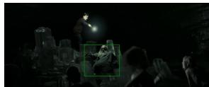  
The person lying on the iceberg  
Scene Knowledge: The gray-haired man Danny is lying on the iceberg because he accidentally fell down. He looks at the man Bob in front of him in fear, because Bob wants to kill him. Kevin is standing behind Danny and is protecting Danny with a weapon in his hand. Amy, the woman on the far right of the image, is thinking about how to attack Kevin.

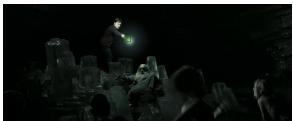  
The weapon in Kevin's hand

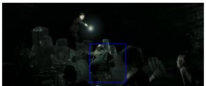  
Gray-haired man lying on iceberg

(a)  
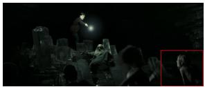  
The gray-haired man

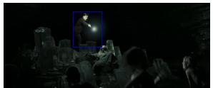  
The boy taking up the magic weapon

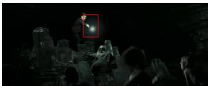  
(b)  
Magic weapon  
Figure 3: A case of the ablation study for GroundingGPT. Green text and bounding boxes represent ground truth data; red text and bounding boxes denote our proposed method (Ours); and blue text and bounding boxes indicate the results without the reading module (w/o Reading).

<table><tr><td colspan="2">Method</td><td></td><td> $A c c _ { e }$ </td><td> $A c c _ { m }$ </td><td> $A c c _ { h }$ </td><td> $A c c _ { a v g }$ </td></tr><tr><td rowspan="5">NNoo-B sed</td><td>KeViLi</td><td>w/o Reading Ours</td><td>26.43 27.18</td><td>26.34 26.29</td><td>25.46 25.35</td><td>26.28 26.69</td></tr><tr><td>OFA</td><td>w/o Reading Ours</td><td>35.24 36.39</td><td>39.01 38.29</td><td>48.16 48.51</td><td>39.69 40.12</td></tr><tr><td>ONE-PEACE</td><td>w/o Reading Ours</td><td>37.85 40.92</td><td>41.96 41.69</td><td>52.93 53.44</td><td>42.97 44.44</td></tr><tr><td>UNINEXT</td><td>w/o Reading Ours</td><td>27.61 28.83</td><td>32.49 33.59</td><td>43.28 42.77</td><td>33.10 33.83</td></tr><tr><td>GroudVLP</td><td>w/o Reading Ours</td><td>31.87 41.51</td><td>27.79 33.92</td><td>29.05 31.98</td><td>29.99 36.87</td></tr><tr><td rowspan="3">LL-Bsed</td><td>Shikra</td><td>w/o Reading Ours</td><td>11.62 12.32</td><td>17.07 17.51</td><td>20.90 23.36</td><td>15.58 16.67</td></tr><tr><td>GroundingGPT</td><td>w/o Reading Ours</td><td>37.35 34.97</td><td>40.43 39.50</td><td>50.06 51.44</td><td>41.56 40.57</td></tr><tr><td>InternVL2</td><td>w/o Reading Ours</td><td>23.05 24.50</td><td>29.24 29.60</td><td>38.81 40.87</td><td>28.92 30.24</td></tr></table>

Table 3: Ablation Experiments on ReadVG, where w/o Reading represent removing the reading module and generating visual descriptors directly from scene knowledge and query. The best scores in each group are highlighted in bold.

In the zero-shot group, our method exceeds most baselines. Notably, it performs slightly worse than using only the query in easy level, possibly due to ReadVG’s reading module outputting only names, potentially neglecting multiple identical items in the scene. However, our method surpasses the baselines in medium and hard levels, showing improvements of up to 79% over OFA and 70.5% over ONE-PEACE. We also note that the best methods, ONE-PEACE and GroundingGPT, in the Non-LLM-based and LLM-based groups, respectively, have ONE-PEACE weaker than GroundingGPT in the Q and Q+K settings. However, upon applying our method, ONE-PEACE outperforms all LLM-Based approaches, demonstrating that the size of the text encoder is not the most critical factor in visual grounding tasks. Our proposed method effectively enhances the performance of smaller models and explores their potential.

## 4.3 Ablation Study

Table 3 shows the results of ablation study. Removing the reading module resulted in a drop in performance for almost all models, which indicated effectiveness of reading module. The decrease in performance may be because without the reading module, the LLM struggles to simultaneously perform target detection and visual descriptor generation, resulting in lower quality visual descriptors. Notably, for GroundingGPT, the variant without the reading module outperforms ours at easy difficulty levels. This could be because the reading module first locates the query target before generating the descriptor, resulting in more concise and intuitive output. However, this approach can lead to confusion when several objects have similar visual descriptor. As shown in Figure 3, in (a) our method generates the visual descriptor "The grey-haired man", while the no-reading variant produces "Gray-haired man lying on iceberg". Given the strong visual-linguistic understanding of the LLM-based GroundingGPT, it misidentifies an object in the lower right corner with the same descriptor based on our output, leading to an error. Conversely, as shown in (b), our visual descriptor "magic weapon" is more accurate than that produced by the w/o reading, capturing finer-grained objects.

Moreover, as demonstrated in Figure 4, we pro-

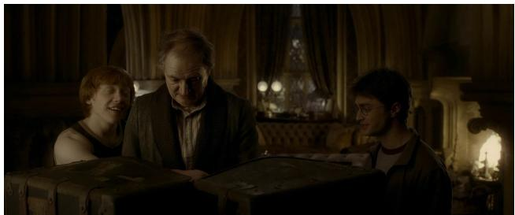

Scene Knowledge: The family had just moved to a new house and are packing two large suitcases in front of them. The man on the middle of the image with his head bowed is David. His eldest son Jack is on his right and leaning on his shoulder. Standing on their left with glasses is David's younger son Alan, delighted at the reconciliation between his father and his brother.

Query: The son who has reconciled with his father

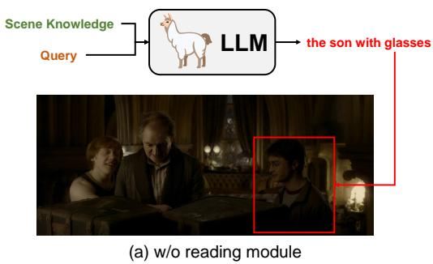

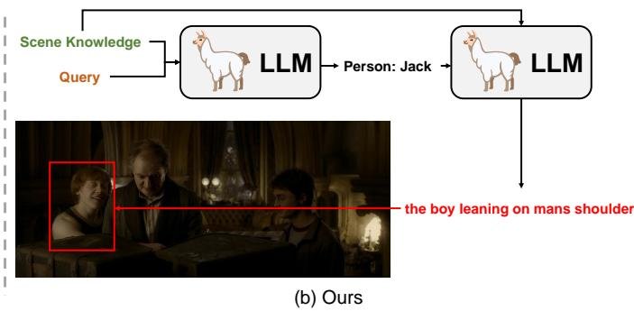

Figure 4: A case of the ablation study for GroundingGPT.
<table><tr><td colspan="2">Model</td><td> $A c c _ { e }$ </td><td> $A c c _ { m }$ </td><td> $A c c _ { h }$ </td><td> $A c c _ { a v g }$ </td></tr><tr><td rowspan="4">OFA</td><td>Q</td><td>42.01</td><td>32.17</td><td>27.10</td><td>35.34</td></tr><tr><td>Q+K</td><td>14.07</td><td>21.11</td><td>24.57</td><td>18.80</td></tr><tr><td>Ours(GLM4-flash)</td><td>33.36</td><td>33.26</td><td>38.92</td><td>34.80</td></tr><tr><td>Ours(Qwen-turbo)</td><td>36.39</td><td>38.29</td><td>48.51</td><td>40.12</td></tr><tr><td rowspan="4">GroundVLP</td><td>Q</td><td>42.11</td><td>29.43</td><td>22.79</td><td>33.49</td></tr><tr><td>Q+K</td><td>9.71</td><td>12.91</td><td>16.42</td><td>12.37</td></tr><tr><td>Ours(GLM4-flash)</td><td>37.92</td><td>29.32</td><td>27.67</td><td>32.69</td></tr><tr><td>Ours(Qwen-turbo)</td><td>41.51</td><td>33.92</td><td>31.98</td><td>36.87</td></tr><tr><td rowspan="4">InternVL2</td><td>Q</td><td>25.36</td><td>26.09</td><td>24.40</td><td>25.31</td></tr><tr><td>Q+K</td><td>19.29</td><td>18.27</td><td>21.87</td><td>19.69</td></tr><tr><td>Ours(GLM4-flash)</td><td>22.03</td><td>26.64</td><td>33.58</td><td>26.36</td></tr><tr><td>Ours(Qwen-turbo)</td><td>24.50</td><td>29.60</td><td>40.87</td><td>30.24</td></tr></table>

Table 4: Results of ReadVG Across Different LLMs; the Best Performance Are Highlighted in Bold, and the Second-Best results Are Indicated by Underlining.

vide a comparative analysis of target localization accuracy. Specifically, Figure 4(a) shows that the LLM incorrectly identified the query target as ’Alan’. Conversely, Figure 4(b) exhibits the correct identification of the target as ’Jack’, along with the corresponding visual descriptor ’the boy leaning on man’s shoulder’. This result indicates that incorporating the reading module enhances the LLM’s capability to accurately interpret scene information and precisely locate relevant entities.

## 4.4 Analysis

In this section, we analyze the impact of different LLMs on the performance of our proposed method.

In Table 4, it can be observed that in most cases, our method (Ours) significantly outperforms using the query (Q) alone or in combination with scene knowledge (Q+K). This indicates that our approach effectively leverages the capabilities of LLMs to enhance the accuracy of visual grounding tasks. When comparing the performance of GLM-4 flash and Qwen-turbo, although GLM-4 flash scores slightly lower than Qwen-turbo on certain metrics, its performance remains impressive given its smaller size and faster response time. This demonstrates the adaptability of our method, facilitating its transfer across LLMs of varying sizes. Despite these differences, our method consistently delivers strong results across all tested LLMs, further validating its effectiveness and versatility.

## 5 Conclusion

We propose ReadVG, a method that can be used without additional training. ReadVG leverages the robust text comprehension capabilities of LLMs to first identify the targets within the scene knowledge and then generate corresponding visual descriptors, thereby providing precise search scopes for subsequent grounding models. This approach alleviates the workload on the grounding model and effectively addresses the performance degradation issue caused by excessively long scene knowledge texts. Experimental results demonstrate that ReadVG achieves commendable performance across various multimodal large language models, validating its effectiveness and practicality in the SK-VG task.

## Limitations

While this study introduces a novel approach to the Scene Knowledge Visual Grounding (SK-VG) task and demonstrates its potential benefits, several limitations remain. First, our method relies heavily on the robust text understanding and reasoning capabilities of Large Language Models (LLMs), which may introduce some uncertainty when dealing with unconventional or complex linguistic expressions. Secondly, although the ReadVG method can reduce the workload on grounding models to some extent, it may still encounter performance bottlenecks when dealing with dense scenes containing a large number of entities and complex relationships. In addition, without fine-tuning the LLMs to domain-specific data, the model’s performance on the long textual background knowledge unique to the SK-VG task might be somewhat limited. Finally, the image data used in this study were primarily derived from film scenes, and the characteristics of these specific scenarios may not fully represent all types of visual grounding tasks, thus limiting the generalisability of the method to a wider range of applications. Future research should aim to address these limitations in order to further improve the model’s performance in more complex scenarios.

## References

Jinze Bai, Shuai Bai, Yunfei Chu, Zeyu Cui, Kai Dang, Xiaodong Deng, Yang Fan, Wenbin Ge, Yu Han, Fei Huang, and Binyuan Hui. 2023. Qwen technical report. arXiv preprint arXiv:2309.16609.

Guizhen Chen, Liying Cheng, Anh Tuan Luu, and Lidong Bing. 2023a. Exploring the potential of large

language models in computational argumentation. ArXiv, abs/2311.09022.

Keqin Chen, Zhao Zhang, Weili Zeng, Richong Zhang, Feng Zhu, and Rui Zhao. 2023b. Shikra: Unleashing multimodal llm’s referential dialogue magic. arXiv preprint arXiv:2306.15195.

Peijia Chen, Ke Qi, Xi Tao, Wenhao Xu, and Jingdong Zhang. 2024a. Mfvg: A visual grounding network with multi-scale fusion. In Proceedings ofthe 2024 International Conference on Multimedia Retrieval, pages 713–721.

Zhe Chen, Weiyun Wang, Hao Tian, Shenglong Ye, Zhangwei Gao, Erfei Cui, Wenwen Tong, Kongzhi Hu, Jiapeng Luo, Zheng Ma, et al. 2024b. How far are we to gpt-4v? closing the gap to commercial multimodal models with open-source suites. arXiv preprint arXiv:2404.16821.

Zhenfang Chen, Kexin Yi, Yunzhu Li, Mingyu Ding, Antonio Torralba, Joshua B. Tenenbaum, and Chuang Gan. 2022. Comphy: Compositional physical reasoning of objects and events from videos. ArXiv, abs/2205.01089.

Zhihong Chen, Ruifei Zhang, Yibing Song, Xiang Wan, and Guanbin Li. 2023c. Advancing visual grounding with scene knowledge: Benchmark and method. In Proceedings of the IEEE/CVF Conference on Computer Vision and Pattern Recognition, pages 15039– 15049.

Jiajun Deng, Zhengyuan Yang, Tianlang Chen, Wengang Zhou, and Houqiang Li. 2021. Transvg: Endto-end visual grounding with transformers. In Proceedings ofthe IEEE/CVF International Conference on Computer Vision, pages 1769–1779.

Jiajun Deng, Zhengyuan Yang, Daqing Liu, Tianlang Chen, Wengang Zhou, Yanyong Zhang, Houqiang Li, and Wanli Ouyang. 2023a. Transvg++: End-to-end visual grounding with language conditioned vision transformer. IEEE transactions on pattern analysis and machine intelligence.

Xiang Deng, Vasilisa Bashlovkina, Feng Han, Simon Baumgartner, and Michael Bendersky. 2023b. Llms to the moon? reddit market sentiment analysis with large language models. Companion Proceedings of the ACM Web Conference 2023.

Mingyu Ding, Zhenfang Chen, Tao Du, Ping Luo, Joshua B. Tenenbaum, and Chuang Gan. 2021. Dynamic visual reasoning by learning differentiable physics models from video and language. In Neural Information Processing Systems.

Simon Frieder, Luca Pinchetti, Ryan-Rhys Griffiths, Tommaso Salvatori, Thomas Lukasiewicz, Philipp Christian Petersen, Alexis Chevalier, and J J Berner. 2023. Mathematical capabilities of chatgpt. ArXiv, abs/2301.13867.

Richang Hong, Daqing Liu, Xiaoyu Mo, Xiangnan He, and Hanwang Zhang. 2019. Learning to compose and reason with language tree structures for visual grounding. IEEE transactions on pattern analysis and machine intelligence, 44(2):684–696.

Ronghang Hu, Marcus Rohrbach, Jacob Andreas, Trevor Darrell, and Kate Saenko. 2017. Modeling relationships in referential expressions with compositional modular networks. In Proceedings ofthe IEEE conference on computer vision and pattern recognition, pages 1115–1124.

Ronghang Hu, Huazhe Xu, Marcus Rohrbach, Jiashi Feng, Kate Saenko, and Trevor Darrell. 2015. Natural language object retrieval. 2016 IEEE Conference on Computer Vision and Pattern Recognition (CVPR), pages 4555–4564.

Wenxiang Jiao, Wenxuan Wang, Jen tse Huang, Xing Wang, and Zhaopeng Tu. 2023. Is chatgpt a good translator? a preliminary study. ArXiv, abs/2301.08745.

Sahar Kazemzadeh, Vicente Ordonez, Mark Matten, and Tamara Berg. 2014. ReferItGame: Referring to objects in photographs of natural scenes. In Proceedings of the 2014 Conference on Empirical Methods in Natural Language Processing (EMNLP), pages 787– 798, Doha, Qatar. Association for Computational Linguistics.

Jinyang Li, Binyuan Hui, Ge Qu, Binhua Li, Jiaxi Yang, Bowen Li, Bailin Wang, Bowen Qin, Rongyu Cao, Ruiying Geng, Nan Huo, Chenhao Ma, Kevin C. Chang, Fei Huang, Reynold Cheng, and Yongbin Li. 2023a. Can llm already serve as a database interface? a big bench for large-scale database grounded textto-sqls. ArXiv, abs/2305.03111.

Kun Li, Jiaxiu Li, Dan Guo, Xun Yang, and Meng Wang. 2023b. Transformer-based visual grounding with cross-modality interaction. ACM Transactions on Multimedia Computing, Communications and Applications, 19(6):1–19.

Zhaowei Li, Qi Xu, Dong Zhang, Hang Song, YiQing Cai, Qi Qi, Ran Zhou, Junting Pan, Zefeng Li, Vu Tu, Zhida Huang, and Tao Wang. 2024. GroundingGPT: Language enhanced multi-modal grounding model. In Proceedings of the 62nd Annual Meeting of the Association for Computational Linguistics (Volume 1: Long Papers), pages 6657–6678, Bangkok, Thailand. Association for Computational Linguistics.

Aiwei Liu, Xuming Hu, Lijie Wen, and Philip S. Yu. 2023a. A comprehensive evaluation of chatgpt’s zeroshot text-to-sql capability. ArXiv, abs/2303.13547.

Hanmeng Liu, Ruoxi Ning, Zhiyang Teng, Jian Liu, Qiji Zhou, and Yuexin Zhang. 2023b. Evaluating the logical reasoning ability of chatgpt and gpt-4. ArXiv, abs/2304.03439.

Phuoc Pham Van Long, Duc Anh Vu, Nhat M. Hoang, Xuan Long Do, and Anh Tuan Luu. 2023. Chatgpt as

a math questioner? evaluating chatgpt on generating pre-university math questions. Proceedings of the 39th ACM/SIGAPP Symposium on Applied Computing.

Ziyang Luo, Can Xu, Pu Zhao, Qingfeng Sun, Xiubo Geng, Wenxiang Hu, Chongyang Tao, Jing Ma, Qingwei Lin, and Daxin Jiang. 2023. Wizardcoder: Empowering code large language models with evolinstruct. ArXiv, abs/2306.08568.

Junhua Mao, Jonathan Huang, Alexander Toshev, Oana Camburu, and Kevin Murphy. 2016. Generation and comprehension of unambiguous object descriptions. In 2016 IEEE Conference on Computer Vision and Pattern Recognition (CVPR).

Erik Nijkamp, Bo Pang, Hiroaki Hayashi, Lifu Tu, Haiquan Wang, Yingbo Zhou, Silvio Savarese, and Caiming Xiong. 2022. Codegen: An open large language model for code with multi-turn program synthesis. In International Conference on Learning Representations.

Liangming Pan, Xiaobao Wu, Xinyuan Lu, Anh Tuan Luu, William Yang Wang, Min-Yen Kan, and Preslav Nakov. 2023. Fact-checking complex claims with program-guided reasoning. ArXiv, abs/2305.12744.

Reiner Pope, Sholto Douglas, Aakanksha Chowdhery, Jacob Devlin, James Bradbury, Jonathan Heek, Kefan Xiao, Shivani Agrawal, and Jeff Dean. 2023. Efficiently scaling transformer inference. In Proceedings ofMachine Learning and Systems, volume 5, pages 606–624. Curan.

Baptiste Rozière, Jonas Gehring, Fabian Gloeckle, Sten Sootla, Itai Gat, Xiaoqing Tan, Yossi Adi, Jingyu Liu, Tal Remez, Jérémy Rapin, Artyom Kozhevnikov, I. Evtimov, Joanna Bitton, Manish P Bhatt, Cristian Cantón Ferrer, Aaron Grattafiori, Wenhan Xiong, Alexandre D’efossez, Jade Copet, Faisal Azhar, Hugo Touvron, Louis Martin, Nicolas Usunier, Thomas Scialom, and Gabriel Synnaeve. 2023. Code llama: Open foundation models for code. ArXiv, abs/2308.12950.

Ramprasaath R Selvaraju, Stefan Lee, Yilin Shen, Hongxia Jin, Shalini Ghosh, Larry Heck, Dhruv Batra, and Devi Parikh. 2019. Taking a hint: Leveraging explanations to make vision and language models more grounded. In Proceedings of the IEEE/CVF international conference on computer vision, pages 2591–2600.

Paulo Shakarian, Abhinav Koyyalamudi, Noel Ngu, and Lakshmivihari Mareedu. 2023. An independent evaluation of chatgpt on mathematical word problems (mwp). ArXiv, abs/2302.13814.

Haozhan Shen, Tiancheng Zhao, Mingwei Zhu, and Jianwei Yin. 2023. Groundvlp: Harnessing zero-shot visual grounding from vision-language pre-training and open-vocabulary object detection. arXiv preprint arXiv:2312.15043.

Fengyuan Shi, Ruopeng Gao, Weilin Huang, and Limin Wang. 2023. Dynamic mdetr: A dynamic multimodal transformer decoder for visual grounding. IEEE Transactions on Pattern Analysis and Machine Intelligence.

Jiaxin Shi, Shulin Cao, Liangming Pan, Yutong Xiang, Lei Hou, Juan-Zi Li, Hanwang Zhang, and Bin He. 2020. Kqa pro: A large diagnostic dataset for complex question answering over knowledge base. ArXiv, abs/2007.03875.

Yawei Sun, Lingling Zhang, Gong Cheng, and Yuzhong Qu. 2020. SPARQA: skeleton-based semantic parsing for complex questions over knowledge bases. In The Thirty-Fourth AAAI Conference on Artificial Intelligence, AAAI 2020, The Thirty-Second Innovative Applications ofArtificial Intelligence Conference, IAAI 2020, The Tenth AAAI Symposium on Educational Advances in Artificial Intelligence, EAAI 2020, New York, NY, USA, February 7-12, 2020, pages 8952–8959. AAAI Press.

Yiming Tan, Dehai Min, Yu Li, Wenbo Li, Nan Hu, Yongrui Chen, and Guilin Qi. 2023. Evaluation of chatgpt as a question answering system for answering complex questions. ArXiv, abs/2303.07992.

Hugo Touvron, Thibaut Lavril, Gautier Izacard, Xavier Martinet, Marie-Anne Lachaux, Timothée Lacroix, Baptiste Rozière, Naman Goyal, Eric Hambro, Faisal Azhar, Aurelien Rodriguez, Armand Joulin, Edouard Grave, and Guillaume Lample. 2023a. Llama: Open and efficient foundation language models. ArXiv, abs/2302.13971.

Hugo Touvron, Louis Martin, Kevin R. Stone, Peter Albert, Amjad Almahairi, Yasmine Babaei, Nikolay Bashlykov, Soumya Batra, Prajjwal Bhargava, Shruti Bhosale, Daniel M. Bikel, Lukas Blecher, Cristian Cantón Ferrer, Moya Chen, Guillem Cucurull, David Esiobu, Jude Fernandes, Jeremy Fu, Wenyin Fu, Brian Fuller, Cynthia Gao, Vedanuj Goswami, Naman Goyal, Anthony S. Hartshorn, Saghar Hosseini, Rui Hou, Hakan Inan, Marcin Kardas, Viktor Kerkez, Madian Khabsa, Isabel M. Kloumann, A. V. Korenev, Punit Singh Koura, Marie-Anne Lachaux, Thibaut Lavril, Jenya Lee, Diana Liskovich, Yinghai Lu, Yuning Mao, Xavier Martinet, Todor Mihaylov, Pushkar Mishra, Igor Molybog, Yixin Nie, Andrew Poulton, Jeremy Reizenstein, Rashi Rungta, Kalyan Saladi, Alan Schelten, Ruan Silva, Eric Michael Smith, R. Subramanian, Xia Tan, Binh Tang, Ross Taylor, Adina Williams, Jian Xiang Kuan, Puxin Xu, Zhengxu Yan, Iliyan Zarov, Yuchen Zhang, Angela Fan, Melanie Kambadur, Sharan Narang, Aurelien Rodriguez, Robert Stojnic, Sergey Edunov, and Thomas Scialom. 2023b. Llama 2: Open foundation and fine-tuned chat models. ArXiv, abs/2307.09288.

Liwei Wang, Yin Li, Jing Huang, and Svetlana Lazebnik. 2018. Learning two-branch neural networks for image-text matching tasks. IEEE Transactions on Pattern Analysis and Machine Intelligence, 41(2):394–407.

Peng Wang, Shijie Wang, Junyang Lin, Shuai Bai, Xiaohuan Zhou, Jingren Zhou, Xinggang Wang, and Chang Zhou. 2023. One-peace: Exploring one general representation model toward unlimited modalities. arXiv preprint arXiv:2305.11172.

Peng Wang, Qi Wu, Jiewei Cao, Chunhua Shen, Lianli Gao, and Anton van den Hengel. 2019. Neighbourhood watch: Referring expression comprehension via language-guided graph attention networks. In Proceedings ofthe IEEE/CVF Conference on Computer Vision and Pattern Recognition, pages 1960–1968.

Peng Wang, An Yang, Rui Men, Junyang Lin, Shuai Bai, Zhikang Li, Jianxin Ma, Chang Zhou, Jingren Zhou, and Hongxia Yang. 2022. Ofa: Unifying architectures, tasks, and modalities through a simple sequence-to-sequence learning framework. CoRR, abs/2202.03052.

Bin Yan, Yi Jiang, Jiannan Wu, Dong Wang, Zehuan Yuan, Ping Luo, and Huchuan Lu. 2023. Universal instance perception as object discovery and retrieval. In CVPR.

Jianwei Yang, Hao Zhang, Feng Li, Xueyan Zou, Chunyuan Li, and Jianfeng Gao. 2023. Set-of-mark prompting unleashes extraordinary visual grounding in gpt-4v. arXiv preprint arXiv:2310.11441.

Li Yang, Yan Xu, Chunfeng Yuan, Wei Liu, Bing Li, and Weiming Hu. 2022. Improving visual grounding with visual-linguistic verification and iterative reasoning. In Proceedings ofthe IEEE/CVF Conference on Computer Vision and Pattern Recognition, pages 9499–9508.

Sibei Yang, Guanbin Li, and Yizhou Yu. 2019. Dynamic graph attention for referring expression comprehension. In Proceedings ofthe IEEE/CVF International Conference on Computer Vision, pages 4644–4653.

Sibei Yang, Guanbin Li, and Yizhou Yu. 2020. Graphstructured referring expression reasoning in the wild. 2020 IEEE/CVF Conference on Computer Vision and Pattern Recognition (CVPR), pages 9949–9958.

Licheng Yu, Zhe Lin, Xiaohui Shen, Jimei Yang, Xin Lu, Mohit Bansal, and Tamara L Berg. 2018. Mattnet: Modular attention network for referring expression comprehension. In Proceedings of the IEEE conference on computer vision and pattern recognition, pages 1307–1315.

Licheng Yu, Patrick Poirson, Shan Yang, Alexander C. Berg, and Tamara L. Berg. 2016. Modeling context in referring expressions. ArXiv, abs/1608.00272.

Mengya Zheng, Xingyu Pan, and David Lillis. 2018. Codex: Source code plagiarism detection based on abstract syntax tree. In Irish Conference on Artificial Intelligence and Cognitive Science.

Qihuang Zhong, Liang Ding, Juhua Liu, Bo Du, and Dacheng Tao. 2023. Can chatgpt understand too? a comparative study on chatgpt and fine-tuned bert. ArXiv, abs/2302.10198.

Gengze Zhou, Yicong Hong, Zun Wang, Xin Eric Wang, and Qi Wu. 2024. Navgpt-2: Unleashing navigational reasoning capability for large vision-language models. ArXiv, abs/2407.12366.

Gengze Zhou, Yicong Hong, and Qi Wu. 2023. Navgpt: Explicit reasoning in vision-and-language navigation with large language models. arXiv preprint arXiv:2305.16986.

Shuguang Zhu, Xiang Cheng, and Sen Su. 2020. Knowledge-based question answering by tree-tosequence learning. Neurocomputing, 372:64–72.

## A Grounding capability of GPT-4o

In this section, we explore the performance of the GPT-4o model in the visual grounding task. The visual grounding task requires the model to accurately identify and annotate the location of specified objects within an image. Despite being a powerful language model with notable capabilities in natural language processing, our experiments show that the GPT-4o model fails to accomplish this seemingly simple task.

In order to gain a deeper understanding of this issue, we conducted multiple trials using different prompts each time, as shown in Figure 5. However, regardless of the different prompts, the results remained consistent - the GPT-4o model was unable to correctly locate the target object in the images. These experimental results suggest that the GPT-4o model may lack the necessary skills to perform visual grounding task.

This limitation may be due to the pre-training dataset used for GPT-4o. While the dataset contains a large amount of textual information, the visual grounding task requires an understanding and ability to parse image content, which may be either poorly represented or absent in the original GPT-4o training dataset.

## B Case Study

Through the case study of SK-VG, we explore why the ReadVG system is able to successfully perform localisation tasks under complex scene knowledge. As shown in Figure 6, when provided with scene knowledge and a query, ReadVG is able to accurately identify the target entity name "Ann" within the query.

ReadVG then uses this identified name to further search for relevant descriptive information within the scene knowledge, ultimately distilling it down to concise and critical visual features, namely "blonde woman". This process demonstrates not only an improvement in the accuracy of the information, but also an optimisation in terms of textual conciseness. It thus confirms that ReadVG has the ability to efficiently extract core information, effectively assisting the model in accurate localisation.

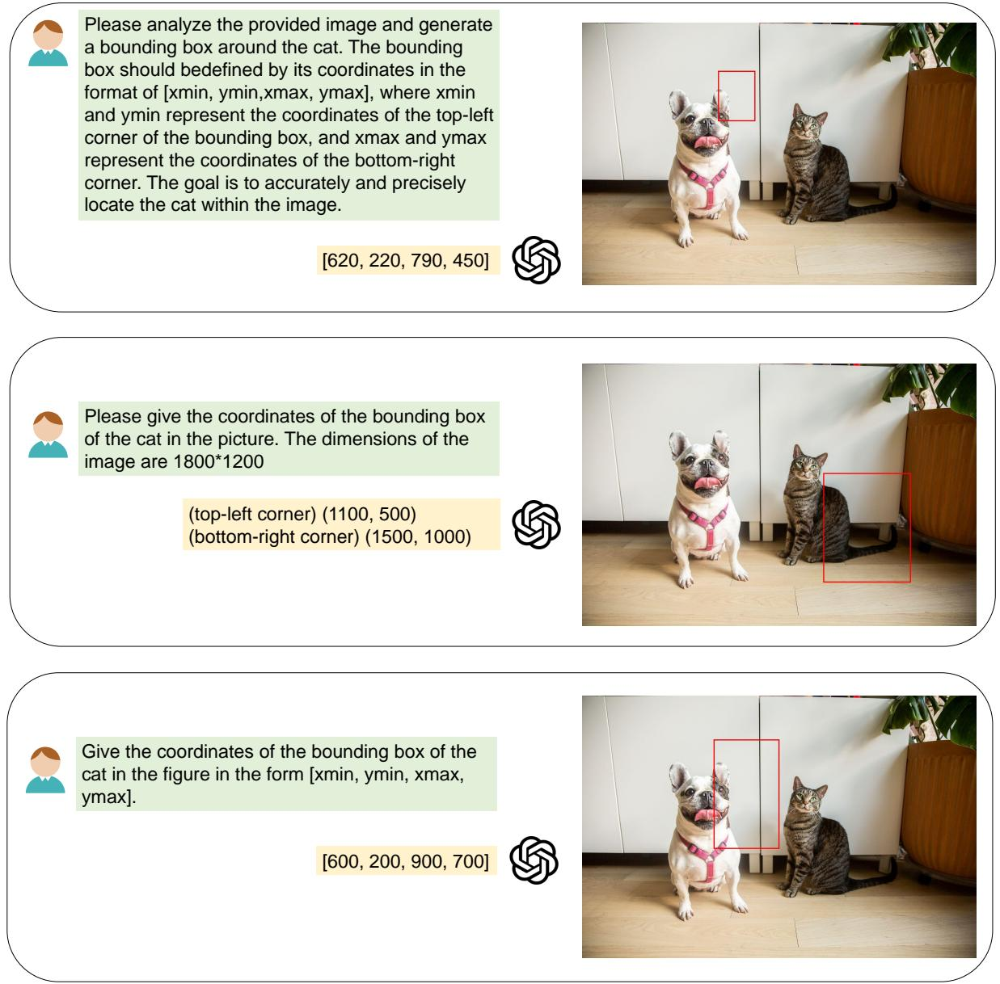  
Figure 5: Results of GPT-4o for the visual grounding task at different prompts

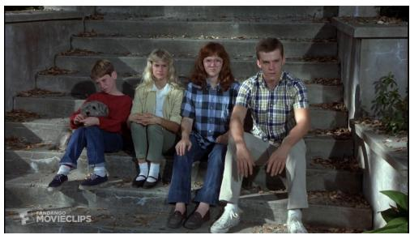

Scene Knowledge: The man on the far right of the image is Mark. He takes his family out to climb the mountain. His sister Lisa is sitting on Mark's right with glasses. Ann has blonde hair and sits on Lisa's right, too tired to speak. Alan, dressed in red, sits on Ann's left and holds his pet dog Coco.

Query: The person who is too tired to speak

Given a text and a query, your answer is the kind and name of the target in the query, with the kind containing Person and Item. Here are a couple of examples, your output should follow the format of the examples and just output the name of the target: …

Person: 'Ann'

As an expert in generating visual descriptions, your task is to give a visual description of the target in the text based on a paragraph of text and the name of a target. The description focuses on the target itself, including hair color, gender, clothing, and any unique accessories (glasses or large jewellery). Be sure not to mention any names (replace with man, woman, boy, girl), attractiveness, eye color, body size, minor visual details, specific brands of clothing unless they are distinctive. Visual descriptions must be no longer than 8 words and no punctuation. Here are a few examples, and your output should follow the format of the examples: …

the blonde woman

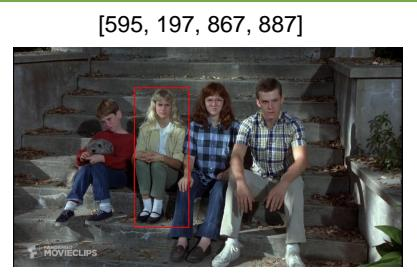  
Figure 6: A case on SK-VG dataset.