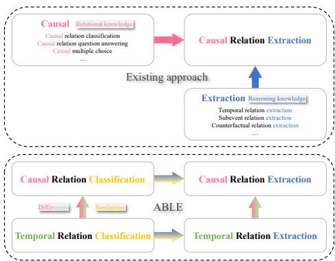
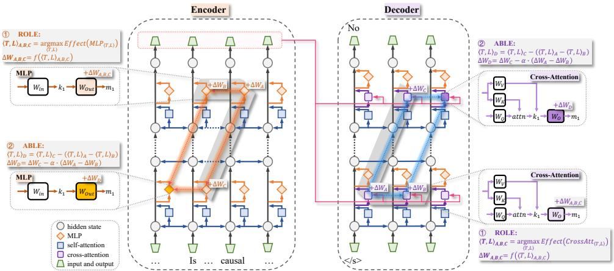
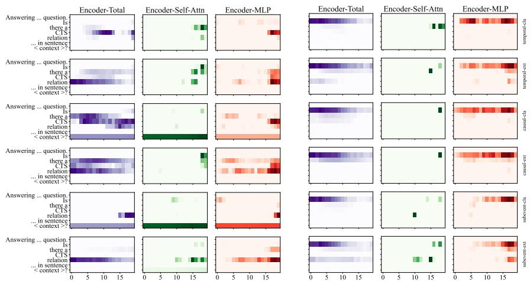
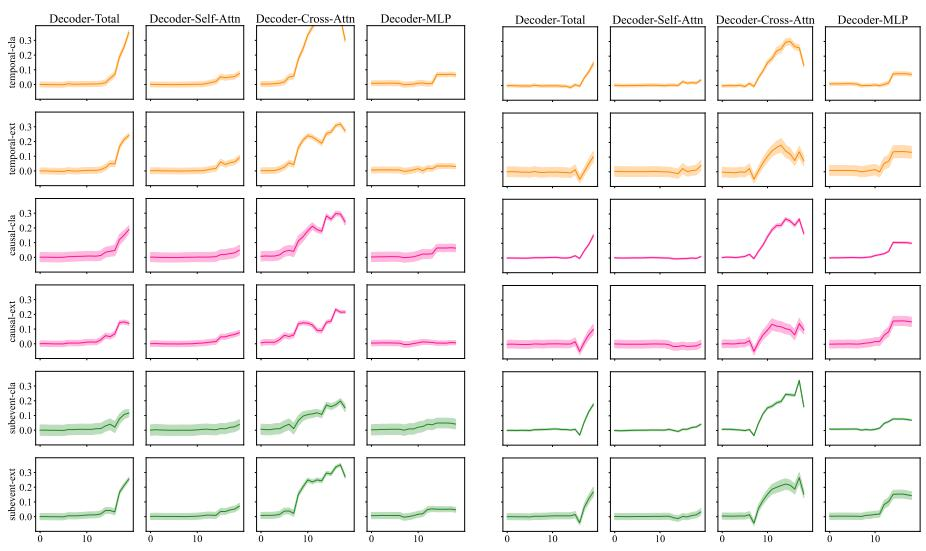
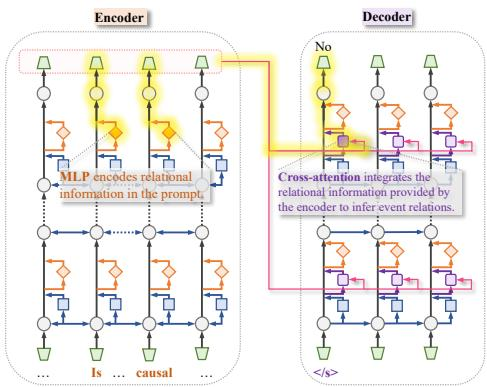
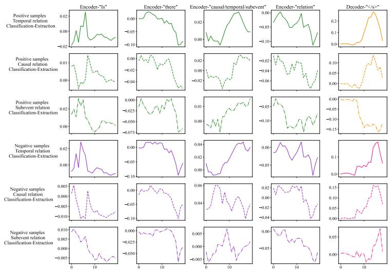
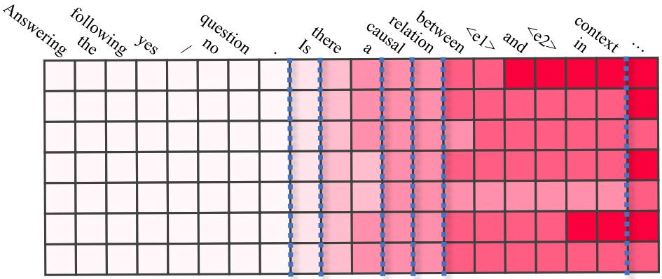

# Reasoning-Oriented and Analogy-Based Methods for Locating and Editing in Zero-Shot Event-Relational Reasoning

Jingyao Tang 1 Lishuang Li 1\*Liteng Mi1 Haiming Wu ² Hongbin Lu³ 1School of Computer Science and Technology, Dalian University of Technology 2School of Computer Science and Technology, Beijing Institute of Technology 3School of Computer Science and Artificial Intelligence, Liaoning Normal University tangjingyao@mail.dlut.edu.cn, lils@dlut.edu.cn, dlutmlt@mail.dlut.edu.cn hm.wu@bit.edu.cn, luhongbin-123@163.com

## Abstract

Zero-shot event-relational reasoning is an important task in natural language processing, and existing methods jointly learn a variety of eventrelational prefixes and inference-form prefixes to achieve such tasks. However, training prefixes consumes large computational resources and lacks interpretability. Additionally, learning various relational and inferential knowledge inefficiently exploits the connections between tasks. Therefore, we first propose a method for Reasoning-Oriented Locating and Editing (ROLE)1, which locates and edits the key modules of the language model for reasoning about event relations, enhancing interpretability and also resource-efficiently optimizing the reasoning ability. Subsequently, we propose a method for Analogy-Based Locating and Editing (ABLE)¹, which efficiently exploits the similarities and differences between tasks to optimize the zero-shot reasoning capability. Experimental results show that ROLE improves interpretability and reasoning performance with reduced computational cost. ABLE achieves SOTA results in zero-shot reasoning.

## 1 Introduction

In the information extraction domain, reasoning about relations (e.g., causal, temporal, sub-events) between events (Man et al., 2024a; Niu et al., 2024; Wang et al., 2022; Lai et al., 2022) is crucial. These relationships have been used to construct event graphs (Frisoni et al., 2022; Chen et al., 2022), event prediction (Shi et al., 2024), commonsense reasoning (Lv et al., 2024), dialog generation (Wang et al., 2024), and question answering (Majumdar et al., 2024).

Due to the limitations of manual labeling, we turn our attention to zero-shot event-relational reasoning. Existing approaches (Tao et al., 2023) use a multi-task framework to jointly learn the various relational and inferential prefixes, and then use the corresponding prefixes to achieve zero-shot relational reasoning. However, fine-tuning prefixes requires high computational cost and lacks interpretability. In addition, learning multiple relational and inferential knowledge inefficiently utilizes connections between tasks (see Figure 1).

  
Figure 1: Comparison of knowledge transfer between existing methods and ABLE in various event-relational reasoning tasks. Top: Existing methods rely on many tasks to learn relational and reasoning knowledge, inefficiently exploiting the connections between tasks. Bottom: ABLE efficiently learns similarities and differences between tasks to enhance knowledge transfer.

Therefore, we propose a method for Reasoning-Oriented Locating and Editing (ROLE), which locates the key modules of the language model in event-relational reasoning, and explores the reasoning mechanism, thus enhancing the interpretability. Meanwhile, ROLE edits the key modules, resourceefficiently optimizing the reasoning ability of the language model. Moreover, we propose a method for Analogy-Based Locating and Editing (ABLE), which learns the similarities and differences among various tasks, and efficiently migrates knowledge, thereby enhancing zero-shot reasoning (see Figure 1).

We locate key modules on 6 event-relational reasoning tasks and evaluate the performance of reasoning about event relations on 10 datasets. The experimental results show that ROLE improves interpretability and reasoning performance with reduced computational cost; ABLE achieves State-Of-The-Art (SOTA) results of zero-shot event-relational reasoning on most datasets. Our main contributions are as follows:

(1) We propose ROLE, which locates and edits key modules for reasoning about event relations in language models, and explores reasoning mechanisms, further improving interpretability and reasoning performance with reduced computational cost.

(2) We propose ABLE, which exploits similarities and differences in analogies among tasks, thereby achieving SOTA results for zero-shot reasoning. Additionally, we analyze the analogicality of locating and editing to further validate the effectiveness of ABLE.

## 2 Related Work

## 2.1 Zero-shot event-relational reasoning

As Large Language Models (LLMs) rapidly evolve, the reasoning ability of LLMs have drawn attention. Tao et al. (Tao et al., 2023) proposed UniEvent, which prefix-tune T5 to optimize zero-shot eventrelational reasoning. Moreover, Yuan et al. (Yuan et al., 2023) investigated the performance of GPT-3.5 in zero-shot temporal-relational extraction, and Gao et al. (Gao et al., 2023) evaluated the ability of various LLMs in causal reasoning tasks. Subsequently, Tao et al. (Tao et al., 2024) provided zero-shot results for event-relational reasoning using different LLMs.

These studies suggest that LLMs are competitive in relational reasoning tasks. However, the underlying reasoning mechanisms in LLMs remain underexplored. Therefore, our approach aims to explore the key modules and reasoning mechanisms of language models from an interpretable perspective.

## 2.2 Knowledge editing

Existing methods can be divided into two categories (Yao et al., 2023): preserving the parameters of the model, and modifying them directly. The first type of methods (Huang et al., 2023; Dong et al., 2022) adds additional parameters to update the knowledge without changing the original parameters. The second type of methods (Mitchell et al., 2021; Meng et al., 2022a,b) directly updates the internal parameters of the model. For example, MEMIT (Meng et al., 2022b) achieves precise modification of knowledge by locating key modules and editing them, and are effective in reducing computational cost.

These approaches aim to insert or update knowledge by adjusting the parameters of specific modules without re-training the model. This motivated us to consider whether there are critical modules that can be edited to improve the reasoning ability.

## 3 Method

Recently, researchers have started to utilize generative models (e.g., T5) for event-relational reasoning (Man et al., 2022, 2024b; Chen et al., 2024; Yang et al., 2024), as such models utilize prompts more efficiently. Therefore, in this section, we propose ROLE and ABLE using Flan-t5-large as the backbone model, and their overall framework is shown in Figure 2.

## 3.1 Reasoning-oriented locating and editing

We propose reasoning-oriented locating and editing, inspired by knowledge editing (Meng et al., 2022b). First, reasoning-oriented locating identifies the key modules $H _ { \langle T , L \rangle }$ of the language model in the reasoning task. Second, reasoning-oriented editing computes the change magnitude $\Delta W _ { H _ { \langle T , L \rangle } }$ of the key module to optimize the reasoning performance.

## 3.1.1 Reasoning-oriented locating

This subsection aims to identify key modules. We iterate over each module $h _ { \langle t , l \rangle }$ of the language model and compute the effect of these modules on the reasoning task using the average indirect effect (Pearl, 2022). For positive samples, the formula for calculating the effect is:

$$
\begin{array} { r } { E f f e c t { \left( h _ { \left. t , l \right. } \right) } = \sum _ { x _ { p o s } } \left[ P \left( { Y e s } \middle | x _ { p o s } ^ { \ast } , h _ { \left. t , l \right. } \right) - P \left( { Y e s } \middle | x _ { p o s } ^ { \ast } , h _ { \left. t , l \right. } ^ { \ast } \right) \right] , } \end{array}\tag{1}
$$

For negative samples, the effect is given by:

$$
\begin{array} { r } { E f f e c t { \left( h _ { \left. t , l \right. } \right) } = \sum _ { x _ { n e g } } \left[ P \left( N o \middle | x _ { n e g } ^ { * } , h _ { \left. t , l \right. } ^ { * } \right) - P \left( N o \middle | x _ { n e g } ^ { * } , h _ { \left. t , l \right. } \right) \right] , } \end{array}\tag{2}
$$

where, h denotes the module type in the language model, t and l denote the token and the layer number, respectively, so that $h _ { \langle t , l \rangle }$ denotes the module h in the l-th layer associated with token t. In addition, x is the prompt, $x ^ { * }$ is the prompt with noise, and $h ^ { * }$ denotes the noise-affected module. The reverse order of the subtraction of conditional probabilities in Eq. (2) and Eq. (1) is to ensure that the value of the E f fect is positive. Because, for negative samples, noise disrupts the key information in the prompts, making it difficult for the model to accurately capture the relation type, i.e., the model prefers to output "No" under the condition of $h ^ { * }$

  
Figure 2: Overview of ROLE and ABLE. The left side shows the application of ROLE and ABLE in the Flan-T5-large encoder, and the right side shows their application in the decoder. First, ROLE is used to determine the position and editing information of tasks A, B and C (corresponding to the three vertices of the parallelogram). Then, ABLE migrates this information to task D (the fourth vertex) by analogy.

Thus, we first select the key module type H based on the overall Effect. Then identify the position $\langle T , L \rangle$ with the largest Effect to determine the key module $H _ { \langle T , L \rangle }$

$$
\langle T , L \rangle = a r g m a x E f f e c t \left( H _ { \langle t , l \rangle } \right) .\tag{3}
$$

Specifically, we study 4 module types, including Transformer, MLP, Self-Attention, and Cross-Attention (available only for Decoder) modules. Meanwhile, we focus on 6 types of reasoning tasks, including classification and extraction tasks for temporal, causal and sub-event relations. The design of the prompt and verbalizers, the setup of positive and negative samples, and other preprocessing specifics are detailed in Appendix A as well as in Table 10.

Figure 3 and Figure 4 show that the MLP module in the encoder and the Cross-Attention module in the decoder have the greatest overall impact on all reasoning tasks, as their impact graphs are most similar to those of the corresponding Transformer. Further, Table 1 shows the locations where these two types of modules have the greatest impact on different tasks, leading to key modules $H _ { \langle T , L \rangle }$ being identified. Finally, we analyze the location of key modules and propose the following hypothesis for the reasoning mechanism:

Hypothesis (Reasoning Mechanism for Event-Relational Reasoning Task in Flan-t5-large): In the encoder, the MLP module encodes relational information in the prompts, including relationtype words (e.g., “causal" and “relatio") and question words (e.g., “Is"). In the decoder, the crossattention module integrates the relational information provided by the encoder with the start token $( \mathrm { e . g . , \uparrow ^ { 6 } < } / \mathrm { s } > ^ { 3 } )$ to infer event relations, as shown in Figure 5.

<table><tr><td></td><td colspan="2">Encoder&#x27;s MLP</td><td colspan="2">Decoder&#x27;s cross-attention</td></tr><tr><td></td><td>Positive</td><td>Negative</td><td>Positive</td><td>Negative</td></tr><tr><td>Temporal relation classification</td><td>&lt;&quot;temporal&quot;, 17&gt;</td><td>&lt;&quot;Is&quot;, 16&gt;</td><td>&lt;&quot;&lt;/s&gt;&quot;, 14&gt;</td><td>&lt;&quot;&lt;/s&gt;&quot;, 15&gt;</td></tr><tr><td>Temporal relation extraction</td><td>&lt;&quot;relation&quot;, 17&gt;</td><td>&lt;&quot;Is&quot;, 18&gt;</td><td>&lt;&quot;&lt;|s&gt;”, 17&gt;</td><td>&lt;&quot;&lt;/s&gt;”, 13&gt;</td></tr><tr><td>Causal relation classification</td><td>&lt;&quot;causal&quot;, 18&gt;</td><td>&lt;&quot;Is&quot;, 17&gt;</td><td>&lt;&quot;&lt;/s&gt;”, 16&gt;</td><td>&lt;&quot;&lt;/s&gt;”, 14&gt;</td></tr><tr><td>Causal relation extraction</td><td>&lt;&quot;relation&quot;, 18&gt;</td><td>&lt;&quot;Is&quot;, 17&gt;</td><td>&lt;&quot;&lt;/s&gt;”, 16&gt;</td><td>&lt;&quot;&lt;|s&gt;”, 17&gt;</td></tr><tr><td>Sub-event relation classification</td><td>&lt;&quot;relation&quot;, 19&gt;</td><td>&lt;&quot;Is&quot;, 17&gt;</td><td>&lt;&quot;&lt;|s&gt;”, 17&gt;</td><td>&lt;&quot;&lt;|s&gt;”, 17&gt;</td></tr><tr><td>Sub-event relation extraction</td><td>&lt;&quot;relation&quot;, 18&gt;</td><td>&lt;&quot;Is&quot;, 17&gt;</td><td>&lt;&quot;&lt;|s&gt;”, 17&gt;</td><td>&lt;&quot;&lt;|s&gt;”, 17&gt;</td></tr></table>

Table 1: Locations (both tokens and layers) of the encoder's MLP module and the decoder's cross-attention module that most significantly affect performance across tasks. “Positive" denotes positive samples and “Negative" denotes negative samples. Refer to Table 10 and Table 11 in Appendix B for detailed layer ordering.

## 3.1.2 Reasoning-oriented editing

This subsection aims to compute the magnitude of editing $\Delta W _ { H _ { \langle T , L \rangle } }$ in the parameters of the localized module $H _ { \langle T , L \rangle }$ . We edit the weights $W _ { o u t }$ and $W _ { O }$ of the last linear layer in the MLP module and the cross-attention module, respectively (see Figure 2), because they directly affect the output of the modules and modifying them can most effectively influence the model's decisions.

Moreover, we find that the T5 model tends to answer “Yes" when inferring event relations (recall is much higher than precision as observed in Table 3 and Table 5). This tendency aligns with existing research, which, for example, shows that LLMs are inclined to identify events as causally related (Gao et al., 2023). This inclination arises from the “memory hallucination" (Mckenna et al., 2023), as the pre-training corpus contains a large number of causally related samples, and thus the model may tend to judge the test samples as causally related as well. To mitigate this tendency, we construct an objective function for the output of the module $H _ { \langle T , L \rangle } { \mathrm { : } }$

  
Figure 3: Heatmaps of the effect of Transformer, MLP, and Self-Attention modules on each token for each layer in the encoder, with positive samples on the left and negative samples on the right. The horizontal axis indicates the number of layers, the vertical axis indicates the tokens, and the color depth indicates the intensity of the effect. tokens are presented in 7 groups (see Appendix C for details).

$$
\begin{array} { l } { { \displaystyle M _ { 1 } = \arg \operatorname* { m i n } \left[ - \sum _ { \stackrel { x _ { n e g } } { x _ { n e g } } } \log P _ { H \left. T , L \right. = m } \left( \mathrm { N o } | x _ { n e g } \right) \right. } } \\ { { \displaystyle \left. + \sum _ { \stackrel { x _ { p o s } } { x _ { p o s } } } D _ { K L } \left[ P _ { H \left. T , L \right. = m } \left( \mathrm { Y e s } | x _ { p o s } \right) \right] \bigg | P \left( \mathrm { Y e s } | x _ { p o s } \right) \right] \Bigg ] \ : , } } \\ { { \displaystyle H \in \left\{ \mathrm { E n c } _ { M L P } , \mathrm { D e c } _ { C r o s s A t t } \right\} , } } \end{array}\tag{4}
$$

where, $x _ { n e g }$ and $x _ { p o s }$ denote negative and positive samples, respectively. $P _ { H _ { \langle T , L \rangle } = m } ( \cdot )$ denotes the output probability of the model after updating the output of the module $H _ { \langle T , L \rangle }$ to m. $M _ { 1 }$ the updated output of $H _ { \langle T , L \rangle } . \ D _ { K L } [ \cdot ]$ computes the KL divergence. This objective function aims to let the false negative samples answer “No" after editing, while keeping the positive samples still answering “Yes". Thus, according to the theory proposed by Meng et al. (Meng et al., 2022b), using the updated output $M _ { 1 }$ , we can obtain the editing magnitude $\Delta W _ { H _ { \langle T , L \rangle } }$ of the module $H _ { \langle T , L \rangle }$

$$
\begin{array} { r } { \dot { \Delta W } _ { H _ { \langle T , L \rangle } } = R K _ { 1 } ^ { T } \left( C _ { 0 } + K _ { 1 } K _ { 1 } ^ { T } \right) ^ { - 1 } , } \end{array}\tag{5}
$$

where, $R \triangleq M _ { 1 } - W _ { 0 } K _ { 1 } , C _ { 0 } = \lambda \cdot E _ { k } \left[ k k ^ { T } \right]$ $K _ { 1 }$ denotes the input of the module $H _ { \langle T , L \rangle }$ , which can be computed by forward propagation. $W _ { 0 }$ denotes the original parameters of the module $H _ { \langle T , L \rangle }$ . We used the corpus Colossal Clean Crawled Corpus (C4) (Raffel et al., 2020) from pre-training T5 to compute k and $C _ { 0 } . \lambda$ is a hyperparameter.

## 3.2 Analogy-based locating and editing approach

This subsection aims to fully utilize the similarities and differences between tasks to enhance zero-shot reasoning. We set four analogizable tasks $A , B , C$ and D, i.e., the relationship between task A and task B can be analogized to the relationship between task C and task D. We first utilize ROLE to obtain the locating and editing information of tasks $A , B$ and $C { \mathrm { : } }$

$$
\begin{array} { r l } & { \left. T , L \right. _ { T a s k } = a r g m a x \left[ P \left( N o \middle | x ^ { * } , H _ { T , L } ^ { * } \right) - P \left( N o \middle | x ^ { * } , H _ { T , L } \right) \right] , } \\ & { } \\ & { H \in \left\{ E n c _ { M L P } , D e c _ { C r o s s A t t } \right\} , T a s k \in \left\{ A , B , C \right\} , } \end{array}\tag{6}
$$

$$
\Delta W _ { T a s k } = R K _ { 1 } ^ { T } \left( C _ { 0 } + K _ { 1 } K _ { 1 } ^ { T } \right) ^ { - 1 } , T a s k \in \left\{ A , B , C \right\} ,\tag{7}
$$

where, $\Delta W _ { h _ { \langle T _ { 1 } L _ { 1 } \rangle } }$ simplifies to $\Delta W$ . These informations are thēn migrated analogously to task D (see Figure 2):

$$
\langle T , L \rangle _ { D } = \langle T , L \rangle _ { C } - \left( \langle T , L \rangle _ { A } - \langle T , L \rangle _ { B } \right) ,\tag{8}
$$

$$
\Delta W _ { D } = \Delta W _ { C } - \alpha \cdot \left( \Delta W _ { A } - \Delta W _ { B } \right) ,\tag{9}
$$

where, α is a hyperparameter that regulates the degree of being analogized. Finally, we optimize zero-shot learning using the locating and editing information of task D.

  
Figure 4: Line plots of the effect of the Transformer, MLP, Self-Attention and Cross-Attention modules on the </s> token for each layer in the decoder, with positive samples on the left and negative samples on the right. The horizontal axis indicates the number of layers and the vertical axis indicates the intensity of the impact.

  
Figure 5: Reasoning mechanism for Flan-T5-large inferring event relations.

## 4 Experiment

## 4.1 Datasets

We perform zero-shot event-relational reasoning tasks on 10 datasets, covering three types of tasks: causal relation extraction, causal relation classification, and sub-event relation extraction.

Causal relation extraction: following Gao et al. (Gao et al., 2023), we evaluate intrasentence pairs of causal events in EventStory-Line v0.9 (ESC-intra) (Caselli and Vossen, 2017), Causal-TimeBank (CTB-intra) (Mirza et al., 2014) and MAVEN-ERE (MAVEN-intra-causal) (Wang et al., 2022). Furthermore, following the work of Tao et al. (Tao et al., 2023) for UniEvent, we evaluate SCITE (SCI-uni), EventStoryLine (ESL-uni) and Causal-TimeBank (CTB-uni).

Causal relation classification: we evaluate Causal News Corpus (CNC) (Tan et al., 2022) and AltLex (ALT-uni) (Hidey and McKeown, 2016) (Tao et al., 2023).

Sub-event relation extraction: we evaluate HiEve (Glavaš et al., 2014) and MAVEN-ERE (MAVEN-intra-subevent) (Wang et al., 2022).

In addition, temporal relation extraction is a multi-classification task (our method only supports binary classification), and also, there are no published studies on temporal relation classification and sub-event relation classification, so we did not evaluate these tasks in the main experiment. Finally, binary-F1 score is used as the main evaluation metric in all tasks.

## 4.2 Baselines

T5 and T5-large (Raffel et al., 2020): is a pretrained language model based on the Transformer architecture, containing encoders and decoders, for a variety of natural language processing tasks.

T0-3B (Sanh et al., 2022): a language model optimized for zero-shot learning scenarios based on the T5 architecture.

UniEvent (Tao et al., 2023): based on the T5 architecture, utilizes prefix-tuning and multi-task learning to achieve zero-shot event-relational reasoning.

GPT series models (Gao et al., 2023): including text-davinci-002, text-davinci-003, GPT-3.5, and GPT-4, which are progressively optimized based on OpenAI's GPT-3 model, improving the ability to handle complex tasks. For datasets with no readily available results, we conduct experiments using the API² provided by OpenAI and our designed prompts (see Table 10 in Appendix A).

<table><tr><td>Model</td><td>SCI-uni</td><td>ESL-uni</td><td>CTB-uni</td><td>ESC-intra</td><td>CTB-intra</td><td>MAVEN-intra-causal</td><td>CNC</td><td>ALT-uni</td><td>MAVEN-intra-subevent</td><td>HiEve</td></tr><tr><td>T5</td><td>49.89*</td><td>31.40*</td><td>3.49*</td><td>30.19</td><td>8.37</td><td>30.36</td><td>51.01</td><td>67.90*</td><td>6.58</td><td>12.12</td></tr><tr><td>T5-large</td><td>51.03</td><td>32.61</td><td>4.46</td><td>30.05</td><td>6.09</td><td>30.05</td><td>66.37</td><td>66.41</td><td>6.57</td><td>11.18</td></tr><tr><td>T0-3B</td><td>49.87*</td><td>72.21*</td><td>4.39*</td><td>28.38</td><td>6.59</td><td>29.12</td><td>67.74</td><td>68.03*</td><td>6.70</td><td>10.22</td></tr><tr><td>UniEvent</td><td>82.78*</td><td>70.64*</td><td>8.95*</td><td></td><td></td><td></td><td>一</td><td>62.50*</td><td></td><td>一</td></tr><tr><td>text-davinci-002</td><td></td><td></td><td>一</td><td>36.00*</td><td>9.30*</td><td>32.40*</td><td>一</td><td></td><td>一</td><td>一</td></tr><tr><td>text-davinci-003</td><td>一</td><td></td><td>一</td><td>45.90*</td><td>15.00*</td><td>37.50*</td><td>一</td><td>一</td><td>一</td><td>一</td></tr><tr><td>Claude-3.5</td><td>62.60</td><td>63.60</td><td>4.91</td><td></td><td></td><td></td><td>52.70</td><td>68.18</td><td>9.59</td><td>15.83</td></tr><tr><td>GPT-3.5</td><td>40.99</td><td>48.56</td><td>4.71</td><td>41.00*</td><td>12.80*</td><td>32.30*</td><td>63.10</td><td>63.57</td><td>7.85</td><td>9.90</td></tr><tr><td>GPT-4</td><td>41.58</td><td>54.57</td><td>2.49</td><td>42.20*</td><td>11.50*</td><td>36.20*</td><td>61.90</td><td>67.57</td><td>10.33</td><td>9.84</td></tr><tr><td>ABLE</td><td>83.48</td><td>72.42</td><td>13.64</td><td>38.48</td><td>21.63</td><td>37.43</td><td>69.90</td><td>68.42</td><td>12.59</td><td>17.69</td></tr></table>

Table 2: Results on zero-shot inter-event causal relation extraction, causal relation classification, and sub-event relation extraction. The best results for each dataset are bolded, \* indicates that the original paper results are cited, and the others are the results we reproduced.
<table><tr><td rowspan="2">Model</td><td colspan="3">SCI-uni</td><td colspan="3">ESL-uni</td><td colspan="3">CTB-uni</td><td colspan="3">ESC-intra</td><td colspan="3">CTB-intra</td><td colspan="3">MAVEN-intra</td></tr><tr><td>P</td><td>R</td><td>F1</td><td>P</td><td>R</td><td>F1</td><td>P</td><td>R</td><td>F1</td><td>P</td><td>R</td><td>F1</td><td>P</td><td>R</td><td>F1</td><td>P</td><td>R</td><td>F1</td></tr><tr><td> $\overline { { A B L E _ { E n c } ^ { \mathrm { T } } } }$ </td><td>67.05</td><td>79.05</td><td>72.56</td><td>83.33</td><td>64.04</td><td>72.42</td><td>3.12</td><td>21.05</td><td>5.44</td><td>27.95</td><td>61.75</td><td>38.48</td><td>6.85</td><td>36.58</td><td>11.53</td><td>27.15</td><td>60.23</td><td>37.43</td></tr><tr><td> $A B L E _ { E n c } ^ { 2 }$ </td><td>66.94</td><td>82.09</td><td>73.75</td><td>71.04</td><td>64.04</td><td>67.36</td><td>2.67</td><td>31.58</td><td>4.92</td><td>29.74</td><td>54.52</td><td>38.48</td><td>6.40</td><td>27.52</td><td>10.39</td><td>25.50</td><td>65.25</td><td>36.67</td></tr><tr><td> $A B L E _ { D e c } ^ { \mathrm { 1 } }$ </td><td>78.39</td><td>82.09</td><td>80.20</td><td>74.68</td><td>56.65</td><td>64.43</td><td>6.06</td><td>10.53</td><td>7.69</td><td>30.82</td><td>49.89</td><td>38.10</td><td>13.22</td><td>26.17</td><td>17.57</td><td>22.21</td><td>74.34</td><td>34.20</td></tr><tr><td> $A B L E _ { D e c } ^ { \frac { 1 } { 2 } }$ </td><td>86.02</td><td>81.08</td><td>83.48</td><td>64.47</td><td>48.28</td><td>55.21</td><td>12.00</td><td>15.79</td><td>13.64</td><td>25.40</td><td>68.53</td><td>37.07</td><td>16.19</td><td>32.55</td><td>21.63</td><td>24.57</td><td>71.60</td><td>36.58</td></tr><tr><td> $R O L E _ { E n c }$ </td><td>85.15</td><td>68.18</td><td>75.73</td><td>71.60</td><td>60.10</td><td>65.35</td><td>2.37</td><td>84.21</td><td>4.62</td><td>26.52</td><td>65.71</td><td>37.78</td><td>5.71</td><td>27.85</td><td>9.48</td><td>28.11</td><td>48.59</td><td>35.62</td></tr><tr><td> $R O L E _ { D e c }$ </td><td>81.11</td><td>76.57</td><td>78.78</td><td>59.31</td><td>62.69</td><td>60.96</td><td>0.78</td><td>55.56</td><td>1.54</td><td>23.82</td><td>78.79</td><td>36.58</td><td>11.99</td><td>20.81</td><td>15.21</td><td>27.01</td><td>51.53</td><td>35.44</td></tr><tr><td> $w / o A l l$ </td><td>34.66</td><td>100.00</td><td>51.03</td><td>21.26</td><td>69.95</td><td>32.61</td><td>2.28</td><td>94.74</td><td>4.46</td><td>17.79</td><td>96.55</td><td>30.05</td><td>3.15</td><td>93.96</td><td>6.09</td><td>17.73</td><td>98.41</td><td>30.05</td></tr></table>

Table 3: Ablation experiments on causal relation extraction. The highest F1 scores under each dataset are bolded.

Claude-3.5 Sonnet: a language model developed by Anthropic that performs well in zero-shot learning scenarios. We conduct experiments using the $\mathrm { \ A P I s } ^ { 3 }$ provided by Anthropic.

## 4.3 Zero-Shot Results

Table 2 shows the performance of ABLE and the baseline models on the zero-shot causal relation extraction, causal relation classification, and subevent relation extraction tasks. For causal relation extraction, ABLE achieves SOTA on the SCIuni, ESL-uni, CTB-uni, and CTB-intra datasets, and shows competitive performance comparable to LLMs on the ESC-intra and MAVEN-intra datasets. For causal relation classification and sub-event relation extraction, ABLE achieves SOTA on all datasets. These results show that ABLE efficiently learns and transfers reasoning knowledge, which improves the performance of various types of zeroshot event-relational reasoning tasks.

## 4.4 Ablation study

To verify the effectiveness of ROLE and ABLE, we conduct ablation experiments. We construct four forms of ABLE, including $A B L E _ { E n c } ^ { 1 } ,$ $A B L E _ { E n c } ^ { 2 } , A B L E _ { D e c } ^ { 1 } ,$ and $A B L E _ { D e c } ^ { 2 }$ (see

Table 6 for the specific forms); two forms of ROLE, including $R O L E _ { E n c }$ and $R O L E _ { D e c } ;$ and ${ w \mathord { \left/ { \vphantom { w \ A l l } } \right. \kern - delimiterspace } o A l l }$ (Flan-T5-large without applying ROLE and ABLE). The subscripts Enc and Dec indicate that our method is applied to the encoder and decoder.

Table 3, Table 4 and Table 5 show the results, which are evaluated by Precision (P), Recall (R) and F1 score (F1). From Table 3 and Table 5, it is observed that $R O L E _ { E n c }$ and $R O L E _ { D e c }$ improve the precision and F1 score of causal and sub-event relation extraction task, which achieves the goal of ROLE and validates its effectiveness. $A B L E _ { E n c } ^ { 1 } ,$ $A B L E _ { E n c } ^ { 2 } , A B L E _ { D e c } ^ { 1 }$ and $A B L E _ { D e c } ^ { 2 }$ improve the F1 score of all tasks , which validates its effectiveness.

Table 4 shows that ROLE performs poorly because the key positions of the positive and negative samples partially overlap in this task, and ROLE strengthens the positive sample to predict $\mathbf { \tilde { \Sigma } } ^ { 6 6 } \mathbf { N } \mathbf { o } ^ { \mathbf { \Sigma } \mathbf { \Lambda } }$ which leads to a decrease in the recall. ABLE improves the F1 score, demonstrating its strong knowledge transfer capability.

In addition, based on the best results of ABLE in each table, we observe that strong analogies are shown between causal and temporal relations, and between causal and sub-event relations, but the analogies between temporal and sub-event relations are relatively weak (see the results of $A B L E _ { E n c } ^ { 2 }$ and $A B L E _ { D e c } ^ { \mathrm { 2 } }$ in Table 5).

<table><tr><td rowspan="2">Model</td><td colspan="3">ALT</td><td colspan="3">CNC</td></tr><tr><td>P</td><td>R</td><td>F1</td><td>P</td><td>R</td><td>F1</td></tr><tr><td> $\overline { { A B L E _ { E n c } ^ { \mathrm { T } } } }$ </td><td>54.64</td><td>86.03</td><td>66.83</td><td>56.96</td><td>82.09</td><td>67.26</td></tr><tr><td> $A B L E _ { E n c } ^ { \stackrel {  } { 2 } }$ </td><td>53.38</td><td>92.70</td><td>67.75</td><td>55.60</td><td>90.88</td><td>68.99</td></tr><tr><td> $A B L E _ { D e c } ^ { 1 }$ </td><td>52.28</td><td>98.10</td><td>68.21</td><td>53.90</td><td>98.62</td><td>69.70</td></tr><tr><td> $A B L E _ { D e c } ^ { 2 }$ </td><td>52.26</td><td>99.05</td><td>68.42</td><td>53.99</td><td>99.12</td><td>69.90</td></tr><tr><td> $R O L E _ { E n c }$ </td><td>55.36</td><td>82.95</td><td>66.40</td><td>57.31</td><td>78.21</td><td>66.15</td></tr><tr><td> $R O L E _ { D e c }$ </td><td>55.73</td><td>81.31</td><td>66.13</td><td>57.71</td><td>72.98</td><td>64.46</td></tr><tr><td> $w / o A l l$ </td><td>55.22</td><td>83.28</td><td>66.41</td><td>57.11</td><td>79.22</td><td>66.37</td></tr></table>

Table 4: Ablation experiments on causal relation classification. The highest F1 scores under each dataset are bolded.

<table><tr><td rowspan="2">Model</td><td colspan="3">MAVEN-intra</td><td colspan="3">HiEve</td></tr><tr><td>P</td><td>R</td><td>F1</td><td>P</td><td>R</td><td>F1</td></tr><tr><td> $\overline { { A B L E _ { E n c } ^ { 1 } } }$ </td><td>8.10</td><td>28.33</td><td>12.59</td><td>10.58</td><td>43.20</td><td>16.99</td></tr><tr><td> $A B L E _ { E n c } ^ { \overleftarrow { 2 } }$ </td><td>3.41</td><td>98.18</td><td>6.59</td><td>59.00</td><td>98.82</td><td>11.14</td></tr><tr><td> $A B L E _ { D e c } ^ { \mathrm { 1 } }$ </td><td>5.26</td><td>40.15</td><td>9.30</td><td>11.54</td><td>37.80</td><td>17.69</td></tr><tr><td> $A B L E _ { D e c } ^ { \stackrel { \cdot } { 2 } }$ </td><td>4.01</td><td>58.94</td><td>7.51</td><td>9.70</td><td>35.69</td><td>15.25</td></tr><tr><td> $R O L E _ { E n c }$ </td><td>7.35</td><td>20.46</td><td>10.82</td><td>10.72</td><td>38.79</td><td>16.79</td></tr><tr><td> $R O L E _ { D e c }$ </td><td>5.75</td><td>42.00</td><td>10.11</td><td>11.33</td><td>28.34</td><td>16.19</td></tr><tr><td> $w / o A l l$ </td><td>3.40</td><td>97.88</td><td>6.57</td><td>5.92</td><td>98.82</td><td>11.18</td></tr></table>

Table 5: Ablation experiments on sub-event relation extraction. The highest F1 scores under each dataset are bolded.

## 4.5 Analysis of the analogicality of location

This subsection analyzes the analogicality of the location of key modules. First, Table 6 shows the layers of editing for ROLE and ABLE under different tasks. $R O L E _ { E n c }$ selects the top 3 module layers in terms of average indirect effects (see Equation 2) in negative samples. $R O L E _ { D e c }$ selects the 1st ranked module layer (the sub-event relation extraction task selects the 3rd ranked layer because the 1st and 2nd ranked positions overlap for the positive and negative samples). ABLE determines the module layer analogously (see Equation 8). Table 6 shows that ABLE obtains positions that are close to the top ranked positions obtained by ROLE (see Table 11 in Appendix B), which validates the analogicality of the location to some extent.

Second, as seen from Figure 6, the difference line plots of temporal, causal, and sub-event relations show similar trends for either positive or negative samples for most tokens, which further validates the analogous nature of location.

Additionally, for the positive samples, in the decoder's $\mathrm { \Omega ^ { 6 6 } } < / \mathrm { s } > \mathrm { \Omega }$ token (first 3 rows of the last column), the line plots of the causal and temporal relations are similar, while the plots of the sub-event relations are different. For the negative samples, in the encoder's “causal/temporal/sub-event" token (the last 3 rows of the 3rd column), the line plots of causal and subevent relations are similar, while the plots of temporal relations are different. These results indicate a strong analogical nature between the causal and temporal relations, as well as between the causal and sub-event relations, and a weaker analogous nature between the temporal and sub-event relations. This also explains the limited effect of $A B L E _ { E n c } ^ { 2 }$ and $A B L E _ { D e c } ^ { 2 }$ in Table 5.

<table><tr><td>Model</td><td>Causal relation extrac- tion</td><td>Causal relation classifica- tion</td><td>Sub-event traction</td><td>relation ex-</td></tr><tr><td>ROLEEnc</td><td>[15,16,17]</td><td>[15,16,17]</td><td>[16,17,18]</td><td></td></tr><tr><td>ROLEDec</td><td>[17]</td><td>[14]</td><td>[15]</td><td></td></tr><tr><td rowspan="4"> $A B L E _ { E n c } ^ { 1 }$ </td><td>Sub-event cla: [17]</td><td>Sub-event ext: [17]</td><td>Causal cla: [17]</td></tr><tr><td>Sub-event ext: [17]</td><td>Sub-event cla: [17]</td><td>Causal ext: [17]</td></tr><tr><td>Causal cla: [17]</td><td>Causal ext: [17]</td><td>Sub-event cla: [17]</td></tr><tr><td>→ Causal ext: [17]</td><td>→ Causal cla: [17]</td><td>→ Sub-event ext: [17]</td></tr><tr><td rowspan="4"> $A B L E _ { E n c } ^ { 2 }$ </td><td>Temporal cla: [15,16,17]</td><td>Temporal ext: [16,17,18]</td><td>Temporal cla: [16]</td></tr><tr><td>Temporal ext: [16,17,18]</td><td>Temporal cla: [15,16,17]</td><td>Temporal ext: [18]</td></tr><tr><td>Causal cla: [15,16,17]</td><td>Causal ext: [15,16,17]</td><td>Sub-event cla: [17]</td></tr><tr><td>→ Causal ext: [16,17,18]</td><td>→ Causal cla: [14,15,16]</td><td>→ Sub-event ext: [19]</td></tr><tr><td rowspan="4"> $A B L E _ { D e c } ^ { 1 }$ </td><td>Sub-event cla: [17]</td><td>Sub-event ext: [15]</td><td>Causal cla: [14]</td></tr><tr><td>Sub-event ext: [15]</td><td>Sub-event cla: [17]</td><td>Causal ext: [12]</td></tr><tr><td>Causal cla: [14]</td><td>Causal ext: [12]</td><td>Sub-event cla: [17]</td></tr><tr><td>→ Causal ext: [12]</td><td>→ Causal cla: [14]</td><td>→ Sub-event ext: [15]</td></tr><tr><td rowspan="4"> $A B L E _ { D e c } ^ { 2 }$ </td><td>Temporal cla: [15]</td><td>Temporal ext: [11,12,13]</td><td>Temporal cla: [14,15,16]</td></tr><tr><td>Temporal ext: [13]</td><td>Temporal cla: [14,15,16]</td><td>Temporal ext: [11,12,13]</td></tr><tr><td>Causal cla: [14]</td><td>Causal ext: [11,12,13]</td><td>Sub-event cla: [14,15,16]</td></tr><tr><td>→ Causal ext: [12]</td><td>→ Causal cla: [14,15,16]</td><td>→ Sub-event ext: [11,12,13</td></tr></table>

Table 6: The layers of editing for different models under each task, and the analogous forms of $A B L E _ { E n c } ^ { 1 } ,$ $A B L E _ { E n c } ^ { 2 } , \ A B L E _ { D e c } ^ { 1 } ,$ and $A B L E _ { D e c } ^ { 2 } .$ The subscripts Enc and Dec indicate that our method is applied to encoder and decoder respectively.

## 4.6 Analysis of the analogicality of editing magnitude

This subsection analyzes the analogicality of editing magnitude. Let A, B, C, D, E, F denote the classification and extraction tasks of temporal, causal, and sub-event relations, respectively. Let $\Delta W _ { X }$ denote the editing magnitude for a module parameter of task X, and let $\Delta W _ { X Y } =$ $\Delta W _ { X } - \Delta W _ { Y }$ , where $X \in \{ A , C , E \}$ and $Y \in$ $\{ B , D , F \}$

Table 7 shows the similarity between different $\Delta W _ { X Y }$ . We use the cosine of the main eigenvectors of the matrices to compute the similarity, because it reflects the degree of similarity between the main transformation directions of the matrices. If the similarity is near 1, the directions are similar; if it is near -1, the directions are opposite.

As seen in Table 7, similarities between $\Delta W _ { X Y }$ of analogous tasks are higher than those between $\Delta W _ { X Y }$ of non-analogous tasks, which verifies the analogicality of editing magnitude to some extent.

## 4.7 Analysis on computational resources and time

We analyze the computational resources and time required for ROLE, ABLE, the fine-tuning method and UniEvent (prefix fine-tuning), respectively, with respect to the amount of parameters (Params),

  
Figure 6: Line plots of the effect difference between classification and extraction for temporal, causal, and subevent relations. Horizontal coordinates indicate the layer of the module and vertical coordinates indicate the difference in average indirect effects. The first three rows indicate positive samples and the last three rows indicate negative samples. The first four columns show the four tokens of the encoder and the last column shows the “</s>" token of the decoder.

<table><tr><td>Analogous tasks</td><td></td><td>Non-analogous tasks</td><td>Non-analogous tasks</td></tr><tr><td></td><td> $\frac { \circ } { s i m \left( \Delta W _ { A B } , \Delta W _ { C D } \right) }$ </td><td> $\overline { { s i m \left( \Delta W _ { A B } , \Delta W _ { C F } \right) } }$ </td><td> $\overline { { s i m \left( \Delta W _ { A B } , \Delta W _ { A D } \right) } }$ </td></tr><tr><td>Sim</td><td>0.08</td><td>0.06</td><td>-0.05</td></tr><tr><td></td><td> $\overline { { s i m \left( \Delta W _ { C D } , \Delta W _ { E F } \right) } }$ </td><td> $\overline { { s i m \left( \Delta W _ { C D } , \Delta W _ { E B } \right) } }$ </td><td> $\overline { { s i m \left( \Delta W _ { C D } , \Delta W _ { C F } \right) } }$ </td></tr><tr><td>Sim 0.19</td><td></td><td>-0.04</td><td>-0.20</td></tr><tr><td></td><td>sim (∆W EF, ∆W AB)</td><td> $\overline { { s i m \left( \Delta W _ { E F } , \Delta W _ { A D } \right) } }$ </td><td> $\overline { { s i m \left( \Delta W _ { E F } , \Delta W _ { E B } \right) } }$  1</td></tr><tr><td>Sim</td><td>0.05</td><td>0.04</td><td>-0.03</td></tr></table>

Table 7: Similarity between different $\Delta W _ { X Y }$ . “Sim" denotes the cosine similarity of the main eigenvectors of the matrix.

<table><tr><td></td><td>Params (M)</td><td>GPU memory (MB)</td><td>Training time (s)</td></tr><tr><td> $\overline { { R O L E _ { E n c } / R O L E _ { D e c } } }$ </td><td>2.88 / 1.05</td><td>3969 / 3789</td><td>12.60 / 8.60</td></tr><tr><td> $A B L E _ { E n c } / A B L E _ { D e c }$ </td><td>11.53 / 4.19</td><td>3761 / 3729</td><td>0.09 / 0.03</td></tr><tr><td>UniEvent</td><td>50.95</td><td>6735</td><td>24.53</td></tr><tr><td>Fine-tuning</td><td>783.15</td><td>13951</td><td>23.23</td></tr></table>

Table 8: Computational resources and time required for ROLE, ABLE, fine-tuning methods and UniEvent on the CTB-uni dataset, respectively.

GPU memory consumption and time for model training, as shown in Table 8. We show the results of ROLE and ABLE for encoder (Enc) and decoder (Dec). To facilitate the implementation of UniEvent, we add prefixes to the decoder and set the length to 5. All models use 10 training samples with a training epoch of 10 and a batch size of 1.

Table 8 shows that $R O L E _ { D e c }$ and $A B L E _ { D e c }$ consume less computational cost than $R O L E _ { E n c }$ and $A B L E _ { E n c }$ since fewer parameters are edited in the decoder. Moreover, our method is significantly lower than the fine-tuning method and UniEvent in all the metrics, which verifies the efficiency of our method.

## 5 Conclusion

We first propose ROLE to locate and edit key modules of language models in reasoning about event relations. The results show that ROLE improves interpretability and reasoning performance with reduced computational cost. Then, we propose ABLE to analogize the similarities and differences between tasks. The results show that ABLE achieves SOTA results for zero-shot eventrelational reasoning on most datasets.

Furthermore, our experiments provide insights into the mechanisms of reasoning about event relations in language models and verify the feasibility of model editing to optimize reasoning capabilities. Future work could utilize ROLE and ABLE to further explore the reasoning capabilities of large language models.

## 6 Limitations

Our methods mainly address binary reasoning tasks. Moreover, our study on the reasoning ability of language models is not comprehensive enough. Therefore, future work can be extended to more complex reasoning scenarios, and also, more experiments can be conducted to explore the reasoning mechanism in depth.

## Acknowledgments

This work is supported by grant from the National Natural Science Foundation of China (No.

62076048), the Science and Technology Innovation Foundation of Dalian (2020JJ26GX035).

## References

Tommaso Caselli and Piek Vossen. 2017. The event storyline corpus: A new benchmark for causal and temporal relation extraction. In Proceedings of the Events and Stories in the News Workshop, pages 77– 86.

Meiqi Chen, Yixin Cao, Kunquan Deng, Mukai Li, Kun Wang, Jing Shao, and Yan Zhang. 2022. Ergo: Event relational graph transformer for document-level event causality identification. In Proceedings of the 29th International Conference on Computational Linguistics, pages 2118–2128.

Mingliang Chen, Wenzhong Yang, Fuyuan Wei, Qicai Dai, Mingjie Qiu, Chenghao Fu, and Mo Sha. 2024. Event causality identification via structure optimization and reinforcement learning. Knowledge-Based Systems, 284:111256.

Qingxiu Dong, Damai Dai, Yifan Song, Jingjing Xu, Zhifang Sui, and Lei Li. 2022. Calibrating factual knowledge in pretrained language models. In Findings of the Association for Computational Linguistics: EMNLP 2022, pages 5937–5947.

Giacomo Frisoni, Gianluca Moro, and Lorenzo Balzani. 2022. Text-to-text extraction and verbalization of biomedical event graphs. In Proceedings of the 29th International Conference on Computational Linguistics, pages 2692–2710.

Jinglong Gao, Xiao Ding, Bing Qin, and Ting Liu. 2023. Is chatgpt a good causal reasoner? a comprehensive evaluation. In Findings of the Association for Computational Linguistics: EMNLP 2023, pages 11111– 11126.

Goran Glavaš, Jan Šnajder, Marie Francine Moens, and Parisa Kordjamshidi. 2014. Hieve: A corpus for extracting event hierarchies from news stories. In Proceedings of the Ninth International Conference on Language Resources and Evaluation (LREC'14), pages 3678–3683.

Christopher Hidey and Kathleen McKeown. 2016. Identifying causal relations using parallel wikipedia articles. In Proceedings of the 54th Annual Meeting of the Association for Computational Linguistics (Volume 1: Long Papers), pages 1424–1433.

Zeyu Huang, Yikang Shen, Xiaofeng Zhang, Jie Zhou, Wenge Rong, and Zhang Xiong. 2023. Transformerpatcher: One mistake worth one neuron. arXiv preprint arXiv:2301.09785.

Viet Lai, Hiu Mn, Linh Ngo, Franck Dernoncourt, and Thien Nguyen. 2022. Multilingual subevent relation extraction: A novel dataset and structure induction method. In Findings of the Association for Computational Linguistics: EMNLP 2022, pages 5559–5570.

Changsheng Lv, Shuai Zhang, Yapeng Tian, Mengshi Qi, and Huadong Ma. 2024. Disentangled counterfactual learning for physical audiovisual commonsense reasoning. Advances in Neural Information Processing Systems, 36.

Arjun Majumdar, Anurag Ajay, Xiaohan Zhang, Pranav Putta, Sriram Yenamandra, Mikael Henaff, Sneha Silwal, Paul Mcvay, Oleksandr Maksymets, Sergio Arnaud, et al. 2024. Openeqa: Embodied question answering in the era of foundation models. In Proceedings of the IEEE/CVF Conference on Computer Vision and Pattern Recognition, pages 16488–16498.

Hieu Man, Franck Dernoncourt, and Thien Huu Nguyen. 2024a. Mastering context-to-label representation transformation for event causality identification with diffusion models. In Proceedings of the AAAI Conference on Artificial Intelligence, volume 38, pages 18760-18768.

Hieu Man, Minh Van Nguyen, and Thien Huu Nguyen 2022. Event causality identification via generation of important context words. In Proceedings of the 11th Joint Conference on Lexical and Computational Semantics (\* SEM) at NAACL 2022.

Hiu Man, Chien Van Nguyen, Nghia Trung Ngo, Linh Ngo, Franck Dernoncourt, and Thien Huu Nguyen. 2024b. Hierarchical selection of important context for generative event causality identification with optimal transports. In Proceedings of the 2024 Joint International Conference on Computational Linguistics, Language Resources and Evaluation (LREC-COLING 2024), pages 8122–8132.

Nick Mckenna, Tianyi Li, Liang Cheng, Mohammad Hosseini, Mark Johnson, and Mark Steedman. 2023. Sources of hallucination by large language models on inference tasks. In Findings of the Association for Computational Linguistics: EMNLP 2023, pages 2758–2774.

Kevin Meng, David Bau, Alex Andonian, and Yonatan Belinkov. 2022a. Locating and editing factual associations in gpt. Advances in Neural Information Processing Systems, 35:17359–17372.

Kevin Meng, Arnab Sen Sharma, Alex Andonian, Yonatan Belinkov, and David Bau. 2022b. Massediting memory in a transformer. arXiv preprint arXiv:2210.07229.

Paramita Mirza, Rachele Sprugnoli, Sara Tonelli, and Manuela Speranza. 2014. Annotating causality in the tempeval-3 corpus. In Proceedings of the EACL 2014 Workshop on Computational Approaches to Causality in Language (CAtoCL), pages 10–19.

Eric Mitchell, Charles Lin, Antoine Bosselut, Chelsea Finn, and Christopher D Manning. 2021. Fast model editing at scale. arXiv preprint arXiv:2110.11309.

Jingcheng Niu, Saifei Liao, Victoria Ng, Simon De Montigny, and Gerald Penn. 2024. Contempo: A unified

temporally contrastive framework for temporal relation extraction. In Findings of the Association for Computational Linguistics ACL 2024, pages 1521– 1533.

Judea Pearl. 2022. Direct and indirect effects. Probabilistic and Causal Inference: The Works of Judea Pearl, page 373.

Colin Raffel, Noam Shazeer, Adam Roberts, Katherine Lee, Sharan Narang, Michael Matena, Yanqi Zhou, Wei Li, and Peter J Liu. 2020. Exploring the limits of transfer learning with a unified text-to-text transformer. Journal of machine learning research, 21(140):1–67.

Victor Sanh, Albert Webson, Colin Raffel, Stephen H Bach, Lintang Sutawika, Zaid Alyafeai, Antoine Chaffin, Arnaud Stiegler, Teven Le Scao, Arun Raja, et al. 2022. Multitask prompted training enables zero-shot task generalization. In ICLR 2022-Tenth International Conference on Learning Representations.

Xiaoming Shi, Siqiao Xue, Kangrui Wang, Fan Zhou, James Zhang, Jun Zhou, Chenhao Tan, and Hongyuan Mei. 2024. Language models can improve event prediction by few-shot abductive reasoning. Advances in Neural Information Processing Systems, 36.

Fiona Anting Tan, Ali Hürriyetoğlu, Tommaso Caselli, Nelleke Oostdijk, Tadashi Nomoto, Hansi Hettiarachchi, Iqra Ameer, Onur Uca, Farhana Ferdousi Liza, and Tiancheng Hu. 2022. The causal news corpus: Annotating causal relations in event sentences from news. In Proceedings of the Thirteenth Language Resources and Evaluation Conference, pages 2298–2310.

Zhengwei Tao, Zhi Jin, Yifan Zhang, Xiancai Chen, Xiaoying Bai, Yue Fang, Haiyan Zhao, Jia Li, and Chongyang Tao. 2024. A comprehensive evaluation on event reasoning of large language models. arXiv preprint arXiv:2404.17513.

Zhengwei Tao, Zhi Jin, Haiyan Zhao, Chengfeng Dou, Yongqiang Zhao, Tao Shen, and Chongyang Tao. 2023. Unievent: Unified generative model with multi-dimensional prefix for zero-shot eventrelational reasoning. In Proceedings of the 61st Annual Meeting of the Association for Computational Linguistics (Volume 1: Long Papers), pages 7088– 7102.

Jin Wang, JinFei Wang, Shuying Dai, Jiqiang Yu, and Keqin Li. 2024. Research on emotionally intelligent dialogue generation based on automatic dialogue system. Journal of Computer Technology and Applied Mathematics, 1(1):1–5.

Xiaozhi Wang, Yulin Chen, Ning Ding, Hao Peng, Zimu Wang, Yankai Lin, Xu Han, Lei Hou, Juanzi Li, Zhiyuan Liu, et al. 2022. Maven-ere: A unified large-scale dataset for event coreference, temporal,

causal, and subevent relation extraction. In Proceedings of the 2022 Conference on Empirical Methods in Natural Language Processing, pages 926–941.

Jing Yang, Yu Zhao, Yang Linyao, Xiao Wang, and Fei-Yue Wang. 2024. Temprompt: Multi-task prompt learning for temporal relation extraction in rag-based crowdsourcing systems. arXiv preprint arXiv:2406.14825.

Yunzhi Yao, Peng Wang, Bozhong Tian, Siyuan Cheng, Zhoubo Li, Shumin Deng, Huajun Chen, and Ningyu Zhang. 2023. Editing large language models: Problems, methods, and opportunities. In Proceedings of the 2023 Conference on Empirical Methods in Natural Language Processing, pages 10222–10240.

Chenhan Yuan, Qianqian Xie, and Sophia Ananiadou. 2023. Zero-shot temporal relation extraction with chatgpt. In The 22nd Workshop on Biomedical Natural Language Processing and BioNLP Shared Tasks, pages 92–102.

## A Data Preprocessing in Reasoning-Oriented Locating

We use the MAVEN dataset (Wang et al., 2022) for reasoning-oriented locating, which contains temporal, causal, and sub-event relations, and its statistical information is shown in Table 9. To explore the key modules of the language model in reasoning about event relations, we design 6 tasks, including classification and extraction tasks for temporal, causal and sub-event relations. Extraction tasks aim to identify event relations given context and head and tail events, and classification tasks aim to identify event relations given context only.

Subsequently, we designed prompt and verbalizer (see Table 10) for each task to stimulate the reasoning ability of the language model. Meanwhile, for each task, we randomly selected 500 positive and 500 negative samples for analysis. To make the key positions of each task centralized, we pick only one class of relations as the positive class. Specifically:

(1) For temporal relations, we only selected the samples of “BEFORE" relations as positive samples, and the samples other than "BEFORE, OVER-LAP, CONTAINS, SIMULTANEOUS, ENDS-ON, BEGINS-ON" as negative samples.

(2) For causal relations, we selected the samples of “CAUSE" relations as positive samples, and the samples other than “CAUSE, PRECONDITION" as negative samples.

(3) For sub-event relations, we directly selected the samples of “SUBEVENT” relation as positive samples, and the samples other than “SUBEVENT" as negative samples.

## B Average Indirect Effects Ranking of Layers for Specific Modules in Various Tasks

Table 11 and Table 12 show the layer ordering (in ascending order) of the average indirect effects for the encoder's MLP module and the decoder's crossattention module. We focus on the top 3 ranked layers of indirect effects in each task.

## C Prompt Segmentation Algorithm Based on Singular Value Decomposition

We propose an algorithm based on Singular Value Decomposition (SVD) for segmenting the tokens in the prompt as shown in Table 13. The algorithm aims to utilize the linear independence between the indirect effect vectors of neighboring tokens to determine the division point.

Specifically, the initial state is set to 2 eigenvalues. As the new token is added, the number of eigenvalues of the indirect effect matrix increases gradually. When the number of eigenvalues increases, it indicates that the relationship between the new token and the existing tokens has changed significantly, and then the token sequence is divided. The steps above are repeated until all the tokens are processed.

Figure 7 shows the segmentation results of the algorithm on multiple samples. Each row of the figure represents a sample, and each column corresponds to a token. Changes in color shades indicate changes in the number of eigenvalues, and also indicate where the segmentation needs to be performed.

Based on the segmentation results of these samples, we divide the prompts into the following sections: “Answering the following yes\no question.", "Is”, "there a”, “temporal\causal\sub-event”, “relation", “(between <event1> and <event2>) in sentence", “<context>'?". This division can show the influence of each module on the final result more clearly, which effectively improves the interpretability of the analysis.

<table><tr><td>Relation</td><td>The number of samples</td><td>Specific relation types</td></tr><tr><td>Temporal relation</td><td>1216217</td><td>BEFORE, OVERLAP, CONTAINS, SIMUL-</td></tr><tr><td>Causal relation</td><td>57992</td><td>TANEOUS, ENDS-ON, BEGINS-ON CAUSE, PRECONDITION</td></tr><tr><td></td><td></td><td></td></tr><tr><td>Sub-event relation</td><td>15841</td><td></td></tr></table>

Table 9: Statistical information on temporal, causal and sub-event relations in the MAVEN dataset.

<table><tr><td>Task</td><td>Prompt</td><td>Verbalizer</td></tr><tr><td>Temporal relation classification</td><td>1 Answering the following yes/no ques- TEMPORAL: Yes, NONE: No tion. Is there a temporal relation in &lt;Sentence&gt;?</td><td></td></tr><tr><td>Temporal relation extraction</td><td>tion. Is there a temporal relation be- tween &lt;event1&gt; and &lt;event2&gt; in &lt;Sen- tence&gt;?</td><td>Answering the following yes/no ques- TEMPORAL: Yes, NONE: No</td></tr><tr><td>Causal relation classification</td><td>Answering the following yes/no ques- CAUSAL: Yes, NONE: No tion. Is there a causal relation in &lt;Sen- tence&gt;?</td><td></td></tr><tr><td>Causal relation extraction</td><td>Answering the following yes/no ques- CAUSAL: Yes, NONE: No tion. Is there a causal relation between &lt;event1&gt; and &lt;event2&gt; in &lt;Sentence&gt;?</td><td></td></tr><tr><td></td><td>tion. Is there a sub-event relation in &lt;Sentence&gt;?</td><td>Sub-event relation classification Answering the following yes/no ques- SUB-EVENT: Yes, NONE: No</td></tr><tr><td>Sub-event relation extraction</td><td>tion. Is there a sub-event relation be- tween &lt;event1&gt; and &lt;event2&gt; in &lt;Sen- tence&gt;?</td><td>Answering the following yes/no ques- SUB-EVENT: Yes, NONE: No</td></tr></table>

Table 10: Prompts and verbalizers for classification and extraction tasks of temporal, causal and sub-event relations. Extraction tasks aim to identify event relations given context and head and tail events, and classification tasks aim to identify event relations given context only.

<table><tr><td>Task</td><td>MLP module in encoder for “Is&quot; token</td><td>Cross-Attention module in decoder for “&lt;s&gt;&quot;token</td></tr><tr><td>Temporal relation classification</td><td>1, 0, 4, 3, 5, 2, 8, 6, 7, 19, 13, 11, 14, 12, 9, 10, 18, 15, 17, 16</td><td>5, 7, 0, 3, 1, 2, 4, 6, 8, 9, 18, 10, 11, 12, 13, 17, 16, 14, 15</td></tr><tr><td>Temporal relation extraction</td><td>0, 1, 4, 3, 5, 6, 2, 8, 7, 9, 13, 14, 12, 11, 10, 19, 15, 16, 17, 18</td><td>7, 3, 2, 1, 5, 0, 4, 8, 6, 9 ,18, 16, 10, 15, 17, 14, 11, 12, 13</td></tr><tr><td>Causal relation classification</td><td>9, 18, 16, 15, 17</td><td>0, 1, 8, 19, 2, 13, 14, 4.5, 3, 7, 11, 10, 6, 12,7, 3, 0, 2, 1, 4, 5, 6, 8, 9, 10, 18, 11, 12, 16, 13, 15, 17, 14</td></tr><tr><td>Causal relation extraction</td><td>0, 1, 2, 8, 4, 19, 3, 5, 6, 13 ,14, 7, 10, 11, 9, 12, 18, 16, 15, 17</td><td>7, 2, 0, 3, 1, 4, 5, 8, 6, 9, 16, 10, 18, 15, 14, 13, 12, 11, 17</td></tr><tr><td>Sub-event relation classification</td><td>1, 4, 3, 2, 0, 5, 8, 6, 7, 9, 11, 13, 19, 10, 14, 12, 15, 16, 18, 17</td><td>7, 5, 4, 3, 6, 0, 2, 1, 8, 9, 10, 18, 11, 12, 13, 16, 15, 14, 17</td></tr><tr><td>Sub-event relation extraction</td><td>1, 4, 0, 3, 5, 2, 8, 6, 7, 9, 10, 11, 13, 14, 12, 19, 15, 16, 18, 17</td><td>7, 2, 3, 1, 0, 5, 4, 6, 8, 9, 10, 18, 11, 16, 12, 13, 15,14, 17</td></tr></table>

Table 11: Layer ordering of average indirect effects of specific modules on specific tokens for negative samples in each task.

<table><tr><td>Task</td><td>MLP module in encoder for “relation&quot; token</td><td>MLP module in encoder for “&quot;relation&quot; token</td><td>Cross-Attention module in de- coder for “&lt;s&gt;&quot; token</td></tr><tr><td>Temporal relation classification</td><td>11, 12, 13, 10, 14, 15, 3, 1, 7, 6, 4, 9, 2, 8, 0, 5, 16, 19, 18, 17</td><td>15, 14, 13, 8, 16, 9, 12, 10, 0, 2, 11, 7, 4, 6, 1, 3, 17, 5, 18, 19</td><td>1, 0, 2, 3, 4, 5, 6, 7, 8, 9, 18, 10, 11, 13, 12, 17, 16, 15, 14</td></tr><tr><td>Temporal relation extraction</td><td>12, 11, 13, 14, 10, 15, 9, 8, 0, 2, 7, 3, 1, 4, 6, 5, 16, 19, 18, 17</td><td>12, 2, 3, 15, 4, 11, 14, 0, 1, 10, 9, 13, 5, 8, 6, 16, 7, 19, 18, 17</td><td>2, 1, 0, 3, 4, 5, 7, 6, 8, 13, 12, 9, 11, 10, 14, 15, 18, 16, 17</td></tr><tr><td>Causal relation classification</td><td>7, 11, 8, 12, 13, 10, 14, 9, 0, 1, 15, 2, 3, 6, 5, 4, 16, 19, 17, 18</td><td>15, 12, 13, 5, 1, 4, 9, 14, 16, 6, 0, 7, 10, 3, 11, 8, 17, 2, 18, 19</td><td>0, 2, 1, 3, 4, 5, 7, 6, 8, 9, 13, 10, 12, 11, 18, 15, 14, 17, 16</td></tr><tr><td>Causal relation extraction</td><td>14, 15, 12, 13, 0, 11, 8, 9, 10, 1, 7, 2, 3, 4, 5, 16, 6, 17, 19, 18</td><td>12, 0, 4, 1, 5, 10, 2, 3, 9, 15, 11, 14, 8, 13, 6, 7, 16, 19, 17, 18</td><td>0, 2, 3, 1, 4, 6, 5, 7, 13, 12, 11, 8, 10, 9, 14, 15, 17, 18, 16</td></tr><tr><td>Sub-event relation classification</td><td>17, 2, 3, 1, 18, 4, 12, 19, 6, 16, 0, 11, 5, 9, 10, 8, 7, 15, 14, 13</td><td>6, 9, 10, 8, 13, 0, 11, 7, 12, 14, 5, 4, 2, 15, 1, 3, 16, 17, 18, 19</td><td>2, 1, 0, 3, 4, 7, 5, 6, 8, 9, 10, 13, 11, 12, 18, 15, 14, 16, 17</td></tr><tr><td>Sub-event relation extraction</td><td>17, 19, 18, 16, 12, 3, 11, 1, 2, 14, 10, 15, 9, 4, 0, 13, 8, 5, 7, 6</td><td>0, 1, 2, 4, 3, 5, 11, 6, 10, 12, 9, 15, 14, 8, 7, 16, 13, 19, 17, 18</td><td>0, 2, 1, 3, 4, 7, 5, 6, 8, 9, 11, 13, 12, 10, 18, 15, 14, 16, 17</td></tr></table>

Table 12: Layer ordering of average indirect effects of specific modules on specific tokens for positive samples in each task.

Algorithm 1 SVD-Based Prompt Segmentation Algorithm   
Input: Indirect effect matrix M of all tokens under each layer of the module, the length of the   
token is N, and the initialized index i = 0.   
for i in range(N):   
count [i] = SV D (M [: i]) # Calculate the number of eigenvalues of the current matrix   
if count [i] > count [i − 1]:   
print i, count [i]) # Show segmentation results  
Table 13: SVD-Based Prompt Segmentation Algorithm

  
Figure 7: A graphical illustration of the segmentation results of the SVD-based prompt segmentation algorithm on different samples. Each row represents a sample and each column corresponds to a token. The change in color shade reflects the change in the number of eigenvalues and also indicates the location of segmentation. The blue dotted line indicates the final division.