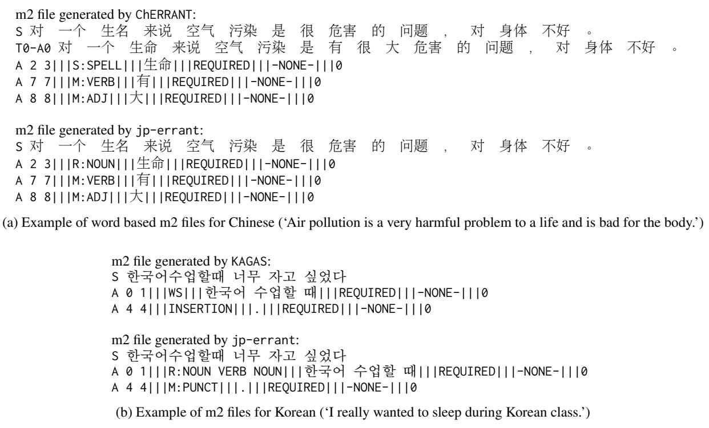

# Refined Evaluation for End-to-End Grammatical Error Correction Using an Alignment-Based Approach

Junrui Wang1\* Mengyang Qiu2,3† Yang Gu3 Zihao Huang3 Jungyeul Park1,3†

1Department of Linguistics, The University of British Columbia, Canada

2Department of Psychology, Trent University, Canada

3Open Writing Evaluation, France

http://open-writing-evaluation.github.io

## Abstract

We propose a refined alignment-based method to assess end-to-end grammatical error correction (GEC) systems, aiming to reproduce and improve results from existing evaluation tools, such as errant, even when applied to raw text input—reflecting real-world language learners writing scenarios. Our approach addresses challenges arising from sentence boundary detection deviations in text preprocessing, a factor overlooked by current GEC evaluation metrics. We demonstrate its effectiveness by replicating results through a re-implementation of errant, utilizing stanza for error annotation and simulating end-to-end evaluation from raw text. Additionally, we propose a potential multilingual errant, presenting Chinese and Korean GEC results. Previously, Chinese and Korean errant were implemented independently for each language, with different annotation formats. Our approach generates consistent error annotations across languages, establishing a basis for standardized grammatical error annotation and evaluation in multilingual GEC contexts.

## 1 Introduction

In modern natural language processing (NLP), endto-end systems have become increasingly popular due to their ability to manage entire tasks from start to finish, offering streamlined and efficient solutions. In this context, evaluation is important as it allows for consistent and objective assessment of these systems, ensuring they meet the intended goals without the need for manual intervention. A good evaluation system must be flexible, able to adapt to various tasks and data types, and robust, providing reliable results even in the face of diverse or unexpected inputs. It should also align with highquality standards to accurately measure the effectiveness of the design or implementation being evaluated. For instance, the CoNLL 2017-2018 Shared Task: Multilingual Parsingfrom Raw Text to Universal Dependencies (Zeman et al., 2017, 2018) demonstrated that a system could take raw text and parse it into a structured format that shows how words relate to each other in many languages. This approach is comprehensive, covering everything from identifying sentence boundaries and breaking the text into words, to labeling parts of speech and analyzing dependency relationships. Most importantly, the evaluation method of Universal Dependencies (UD) is designed to accurately measure the performance of the entire process, even if there are mismatches in sentence boundaries between the system’s output and the predefined standard. This makes the metric flexible, robust, and applicable in various settings, accommodating differences that might arise in the preprocessing stages.

Grammatical error correction (GEC) plays an essential role in facilitating effective communication, supporting language learning, and ensuring the accuracy of written texts. GEC systems provide automated assistance for both instructors and learners, making them invaluable tools in educational and professional settings. Over the years, various NLP systems and methodologies have been developed to enhance the effectiveness of automated GEC. Alongside these advancements, several evaluation metrics, including M2 (Dahlmeier and Ng, 2012), GLEU (Napoles et al., 2015), errant (Bryant et al., 2017; Bryant, 2019), and PT M2 (Gong et al., 2022), have been introduced to measure the performance and reliability of these systems, ensuring they meet the high standards required for accurate grammatical correction. However, these metrics often share a common limitation: they require predefined, consistent sentence boundaries between the gold standard—an ideal set of corrections—and the outputs generated by the system.

When applied to raw text input—reflecting realworld language learners’ writing scenarios—the current GEC evaluation method suffers due to differing sentence boundaries detected during preprocessing, where the sentences in learners’ writing and the predefined corrections might not align. This challenge is similar to issues faced in other NLP tasks, such as Machine Translation (MT), where sentence alignment between source and target sentences is crucial for creating a parallel corpus. In MT, sentence alignment involves matching sentences in two or more languages, connecting each sentence in one language to its corresponding sentences in another. Sentence alignment has evolved over several decades, leading to the development of various algorithms. Initially, alignment studies relied on a length-based statistical method (Gale and Church, 1993), which used bilingual corpora to model differences in sentence length across languages as a basis for alignment. Later advancements included more sophisticated techniques like Bleualign, which uses an iterative bootstrapping method to refine length-based alignment. Other early approaches improved alignment accuracy by incorporating lexical correspondences, exemplified by hunalign (Varga et al., 2005) and the IBM model’s lexicon translation approach (Moore, 2002). More recent efforts, like vecalign (Thompson and Koehn, 2019), integrate linguistic knowl edge, heuristics, and various scoring methods to enhance alignment efficiency.

Built upon advancements in MT alignment, we propose a refined approach to address GEC-specific challenges, particularly in end-to-end evaluation scenarios. The key contributions of our work are as follows: We introduce an alignment-based method that significantly improves end-to-end GEC evaluation by addressing sentence boundary discrepancies that often arise during preprocessing, especially when systems process raw, unsegmented text. Our approach employs an advanced jointly preprocessed algorithm, overcoming limitations of traditional methods that rely on predefined sentence boundaries. Moreover, we provide additional enhancements to GEC evaluation by reimplementing errant: (i) We improve error annotation accuracy by replacing spaCy with stanza for language processing, leading to more precise part-of-speech tagging and dependency parsing (§5). (ii) We extend our approach to multilingual contexts, demonstrating its potential for consistent grammatical error annotation and evaluation across multiple languages (§6). Our work aims to enhance the robustness, relevance, and real-world applicability of GEC evaluation methodologies. Our approach addresses the complexities of language learners’ writing in realworld contexts, ensuring reliable evaluations across diverse text inputs and more precisely reflecting the demands of actual language usage.

## 2 Previous GEC Evaluation Measures

The MaxMatch $( \mathsf { M } ^ { 2 } )$ metric identifies the sequence of edits from the input to the system correction that achieves the maximum overlap with the gold standard edits, based on Levenshtein distance (Dahlmeier and Ng, 2012). The GLEU metric extends the BLEU metric used in machine translation (Papineni et al., 2002), modifying the precision calculation by giving extra weight to n-grams in the candidate text that align with the reference but not with the source (i.e., the set of n-grams $R \backslash S )$ . It also introduces a penalty for n-grams present in both the candidate and the source but absent in the reference, referred to as false negatives $( S \backslash R )$ (Napoles et al., 2015).

A novel pretraining-based approach to $\mathsf { M } ^ { 2 }$ uses BERTScore and BARTScore to calculate edit scores, allowing assessments based on insights from pretrained metrics. However, directly applying PT-based metrics often yields unsatisfactory correlations with human judgments due to an excessive focus on unchanged sentence parts. To address this, $\mathsf { P T } - \mathsf { M } ^ { 2 }$ has been introduced, leveraging PT-based metrics only for scoring corrected parts, significantly improving correlation with human evaluations and achieving a state-of-the-art Pearson correlation of 0.95 on the CoNLL14 evaluation task (Gong et al., 2022).

While these different metrics have their strengths and limitations, currently errant (ERRor ANnotation Toolkit) is the de facto standard for evaluating GEC. errant compares error annotations between the gold standard and system m2 $\mathrm { \ f l e s { } ^ { 1 } }$ , calculating precision, recall, and reporting the $\mathrm { F _ { 0 . 5 } }$ score. This score emphasizes precision over recall, reflecting the importance of providing accurate feedback to language learners in GEC systems (Bryant et al., 2017; Bryant, 2019). errant addresses an important limitation of the original $\mathsf { M } ^ { 2 }$ metric–the tendency to inflate performance by heavily weighting true positives. Another advantage of errant over other metrics is that in addition to providing a score, it also offers detailed error annotation, which facilitates a deeper analysis of system performance and specific error patterns. errant has been adapted for multiple languages, including German, Chinese, and Korean, among others (Boyd, 2018; Hinson et al., 2020; Zhang et al., 2022; Sonawane et al., 2020; Belkebir and Habash, 2021; Náplava et al., 2022; Katinskaia et al., 2022; Yoon et al., 2023).

Given the advantages of errant and its widely accepted status as the de facto standard for GEC evaluation, our work adapted errant by incorporating an alignment-based preprocessing approach. This adaptation addresses challenges in end-toend GEC scenarios, particularly discrepancies in sentence boundaries between the gold standard and system predictions during preprocessing. Our method ensures accurate evaluations even with differing sentence boundaries, maintaining errant’s reliability in real-world GEC applications.

## 3 Alignment-based errant

We utilize an alignment-based evaluation algorithm to enhance end-to-end GEC evaluation measures. Recognizing that sentence boundaries between the gold standard and system outputs may vary during preprocessing, this algorithm employs sentence alignment to accurately match sentences from the gold and system GEC results, ensuring correct evaluations. Consequently, while the fundamental GEC evaluation measures remain unchanged, they are now applied to sentence-aligned results, improving the accuracy and reliability of the metrics.

We adapt a jointly preprocessed algorithm, where it preprocesses sentence boundary and tokenization between source and target through alignment, as described in Algorithm 1. This algorithm is specifically designed for environments where gold and system sentences are nearly identical in a monolingual context. A similar alignment-based joint preprocessing approach has been shown to be effective in improving evaluation of constituent parsing (Jo et al., 2024a; Park et al., 2024) and preprocessing tasks (Jo et al., 2024b) where they have shown the effectiveness of the algorithm for several languages including several European languages as well as Chinese and Korean. This contrasts with traditional sentence alignment methods in MT that often require recursive editing to accommodate significant differences between source and target languages. In cases of mismatches due to varying sentence boundaries, our pattern matching-based algorithm accumulates sentences until it finds a matching pair. The computational efficiency of our approach is notable, requiring linear time, $O ( m + n )$ where m and n are the lengths of the gold and system sentences, respectively. This is a significant improvement over the traditional cubic complexity, $n ^ { 3 }$ , of standard length-based sentence alignment algorithms in MT. Figure 1 shows an example where sentence boundaries between the gold standard and system outputs may vary during preprocessing. The proposed jp-algorithm introduces sentence alignment to ensure correct GEC evaluations.

Algorithm 1 Pseudo-code for sentence alignment   
1: function PATTERNMATCHINGSA (L, R):   
2: while L and R do   
3: if ${ \mathcal { L } } _ { i ( \sqcup ) } = { \mathcal { R } } _ { j ( \sqcup ) }$ then   
4: $\mathcal { L } ^ { ' } , \mathcal { R } ^ { \prime }  \mathcal { L } ^ { \prime } + \mathcal { L } _ { i } , \mathcal { R } ^ { \prime } + \mathcal { R } _ { j }$ where $0 < i \le$   
$\mathrm { L E N } ( \mathcal { L } ) , 0 < j \leq \mathrm { L E N } ( \mathcal { R } )$   
5: else   
6: while $\neg ( \mathcal { L } _ { i ( \mathcal { Y } ) } = \mathcal { R } _ { j ( \mathcal { Y } ) } )$ do   
7: if LEN $^ { \prime } ( \dot { \mathcal { L } } _ { i } ) _ { . } < \mathrm { L E N } ( \mathcal { R } _ { j } )$ then   
8: $L ^ { \prime } \gets \dot { L } ^ { \prime } + \mathcal { L } _ { i }$   
9: $i \gets i + 1$   
10: else   
11: $R ^ { \prime } \gets R ^ { \prime } + \mathcal { R } _ { j }$   
12: $j \gets j + 1$   
13: end if   
14: end while   
15: $\mathcal { L } ^ { \prime } , \mathcal { R } ^ { \prime }  \mathcal { L } ^ { \prime } + L ^ { \prime } , \mathcal { R } ^ { \prime } + R ^ { \prime }$   
16: end if   
17: end while   
18: return $\mathcal { L } ^ { \prime } , \mathcal { R } ^ { \prime }$

In Equation (1), we define that sequences $\mathcal { L } _ { i }$ and $\mathcal { R } _ { j }$ can be aligned if they match when all spaces are removed, denoted as $\mathcal { L } _ { i } ~ \mathcal { \ U }$ and $\begin{array} { r l } { \mathcal { R } _ { j } } & { { } \binom { \ j } { \dag } . } \end{array}$ . This method aims to minimize differences due to tokenization.

$$
\mathscr { L } _ { i ( \boldsymbol { \mathscr { u } } ) } = = \mathscr { R } _ { j ( \boldsymbol { \mathscr { u } } ) }\tag{1}
$$

However, simply removing spaces and concatenating words may not sufficiently identify identical sentence pairs. Variations in tokenization can introduce grammatical morphemes absent in the goldstandard sentences, or vice versa. For example, the contraction can’t presents tokenization challenges, as it can be tokenized as can not or ca n’t, with each version introducing different characters. Such variations mean that our character-level evaluation may fail to accurately capture these discrepancies. The inconsistency in tokenization standards across different corpora further complicates this issue. For instance, the English UD corpus from EWT tokenizes can’t as ca and $n ^ { \prime } t ,$ whereas Par-

<table><tr><td rowspan=1 colspan=1></td><td rowspan=1 colspan=1>L (SYSTEM)</td><td rowspan=1 colspan=1>R (GOLD)</td></tr><tr><td rowspan=1 colspan=1>(before alignment)</td><td rowspan=1 colspan=1>Mike McConnel1 07/06/2000 14:57 John , Hello from SouthAmerica. </td><td rowspan=2 colspan=1>Mike McConnell 07/06/200014:57 □John, Hello from South America . Mike McConne11 ~~~−07/06/2000−14:57 ~~~ John −,Hello from South America. </td></tr><tr><td rowspan=1 colspan=1>(after alignment)</td><td rowspan=1 colspan=1>Mike McConne11 07/06/2000 14:57 John, He11o from SouthAmerica. □</td></tr></table>

Figure 1: Examples with the sentence alignment algorithm where ⊓ is a sentence delimiter.

TUT tokenizes it as can and not. We therefore propose to align sequences $\mathcal { L } _ { i }$ and $\mathcal { R } _ { j } .$ , denoted as $\mathcal { L } _ { i \mathcal { U } }$ and $\mathcal { R } _ { j \mu }$ respectively, when they demonstrate close character similarities that exceed a predefined threshold, $\alpha .$ . Moreover, the subsequent sequences, $\mathcal { L } _ { i + 1 }$ and $\mathcal { R } _ { j + 1 }$ , must either directly match or exhibit sufficient similarity, as outlined in Equation (2).

$$
\begin{array} { r } { ( \mathcal { L } _ { i ( \mathcal { Y } ) } \simeq \mathcal { R } _ { j ( \mathcal { Y } ) } ) \wedge } \\ { ( \mathcal { L } _ { i + 1 ( \mathcal { Y } ) } = = \mathcal { R } _ { j + 1 ( \mathcal { Y } ) } \vee \mathcal { L } _ { i + 1 ( \mathcal { Y } ) } \simeq \mathcal { R } _ { j + 1 ( \mathcal { Y } ) } ) } \end{array}\tag{2}
$$

We modify the Jaro-Winkler distance, traditionally used to measure the similarity between two strings, by incorporating a suffix scale in addition to the existing prefix scale. The original Jaro similarity, denoted by $s i m _ { j } .$ , calculates matches based on the number of forward-matching characters between two strings, $s _ { 1 }$ and $s _ { 2 }$ . The Jaro-Winkler distance enhances this similarity by introducing a prefix scale p for a specified prefix length l. Our modification extends this method by adding a similar scale for a defined suffix length, thereby improving the algorithm’s ability to recognize suffix similarities as well.

$$
\alpha = s i m _ { j } - \frac { ( l p + l ^ { \prime } p ) ( 1 - s i m _ { j } ) } { 2 }\tag{3}
$$

where $s i m _ { j }$ is the Jaro similarity between two strings $s _ { 1 }$ and $s _ { 2 }$ , l and $l ^ { \prime }$ are the lengths of the common prefix and suffix of the strings, respectively, and $p$ is a constant scaling factor (set to $0 . 1 ) . ^ { 2 }$ If $\mathcal { L } _ { i }$ and $\mathcal { R } _ { j }$ cannot be aligned, we proceed by concatenating sequences based on their lengths. Specifically, if the length of $\mathcal { L } _ { i : m }$ exceeds that of $\mathcal { R } _ { j : n }$ , then $\mathcal { L } _ { i }$ is concatenated with $\mathcal { L } _ { i + 1 }$ Conversely, if $\mathcal { R } _ { j : n }$ is longer, then $\mathcal { R } _ { j }$ is concatenated with $\mathcal { R } _ { j + 1 }$ . This concatenation process is repeated until the pairs $\mathcal { L } _ { i + 1 }$ and $\mathcal { R } _ { j + 1 }$ meet the established sentence matching criteria.

We have re-implemented errant incorporating a joint preprocessing step, now referred to as jp-errant. Unlike the original errant, which used spaCy for language processing, jp-errant employs the part-of-speech tagging capabilities of stanza (Qi et al., 2020), chosen for its demonstrably clear performance.3 We maintain the original error annotation scheme of errant, but we adjust word positions by re-indexing them during the sentence alignment process when sentences are concatenated. This adjustment is crucial to handle discrepancies in sentence boundaries between the gold standard and those processed by stanza.

In the alignment algorithm, concatenating sentences necessitates updates to the positions of corresponding edits. After sentence alignment, the re-indexing process is carried out in two primary steps: First, we update all non-empty edits. For each concatenated sentence, we accumulate its token count to serve as the offset for subsequent edits. Consider the following example: when concatenating sentences $S _ { i } = [ w _ { 1 } , w _ { 2 } , . . . , w _ { m } ]$ and $S _ { j } =$ $[ w _ { 1 } , w _ { 2 } , . . . , w _ { n } ]$ , the edits ${ \cal E } _ { i } = [ e _ { ( a , b ) } ]$ and $E _ { j } =$ $[ e _ { ( c , d ) } ]$ are adjusted to become $[ e _ { ( a , b ) } , e _ { ( c + m , d + m ) } ]$ in the concatenated sequence. Second, after reindexing all edits, we proceed to remove any unnecessary empty edits. This step is crucial to ensure that the m2 results are fully aligned, with no unnecessary empty edits.

Details of the re-indexing process by jp-errant are shown in Figure 2. For example, the m2 file’s state is shown both before and after sentence alignment. The gold m2 file features an empty edit (-1 -1|||noop) and a capitalization edit (0 1|||R:ADV), where the adverb how is replaced by How. Conversely, the stanza m2 file contains two empty edits, which indicate places where no grammatical errors were corrected by the system.

## 4 Extended Gale-Church Algorithm

To assess the effectiveness of our proposed alignment method, we first extended the original Gale-Church sentence alignment algorithm (Gale and Church, 1993) to accommodate the concatenation of up to m and n sentences for comparison with our proposed algorithm. We begin by enhancing the original Gale-Church sentence alignment algorithm. Our modification allows for aligning sentences beyond the traditional 1:1, 1:0, 0:1, 2:1, 1:2, and 2:2 alignments prescribed by the original algorithm. Notably, during sentence alignment, more than two sentences may be contracted as shown in Figure 1. The present value of $D ( i , j )$ is determined by minimizing across the following scenarios. We assume there is no 1:0 and 0:1, and expand the algorithm to enable contraction for up to m and n sentences:

<table><tr><td rowspan=1 colspan=2>1. Preparation</td></tr><tr><td rowspan=1 colspan=1>gold m2</td><td rowspan=2 colspan=1>S Kate Ashby,A -1 -1|I|noop|||-NONE-|||REQUIRED||I-NONE-|||0S how are you ? I hope you are well .A 0 1|||R:ADV|||How|||REQUIRED|||-NONE-|||0S Kate Ashby, how are you?A -1 -1|I|noop|||-NONE-|||REQUIRED||I-NONE-|||0S I hope you are well.A -1 -1|I|noop||I|-NONE-|||REQUIRED||I-NONE-|||0</td></tr><tr><td rowspan=1 colspan=1>stanza m2</td></tr><tr><td rowspan=1 colspan=1>2. Sentence al</td><td rowspan=1 colspan=1>ignment</td></tr><tr><td rowspan=1 colspan=1>gold m2stanza m2</td><td rowspan=1 colspan=1>S Kate Ashby, how are you ? I hope you are wel1A -1 -1|I|noop|||-NONE-|||REQUIRED||I-NONE-|||0A 0 1|||R:ADV|||How|I|REQUIRED|||-NONE-|||0S Kate Ashby, how are you? I hope you are wel1.A -1 -1|||noop|||-NONE-|||REQUIRED|||-NONE-|||0A-1-1||noopII-NONE-REQUIRED|I-NONE-1110</td></tr><tr><td rowspan=1 colspan=1>3. Re-indexin</td><td rowspan=1 colspan=1>g</td></tr><tr><td rowspan=1 colspan=1>gold m2stanza m2</td><td rowspan=1 colspan=1>S Kate Ashby , how are you ? I hope you are well.A 3 4|||R:ADV|||How|I|REQUIRED|I|-NONE-I||0s Kate Ashby, how are you? I hope you are wel1.A-1-1|||noop|||-NONE-|||REQUIRED|||-NONE-|||0</td></tr></table>

Figure 2: Procedure example of jp-errant: stanza m2 indicates that sentence boundaries are detected by stanza from raw text.

$$
\operatorname* { m i n } \left\{ \begin{array} { l l } { D ( i - 1 , j - 1 ) + \mathrm { c o s T } ( 1 ; 1 \mathrm { ~ a l i g n ~ } s _ { i } , t _ { j } ) } \\ { D ( i - 1 , j - 2 ) + \mathrm { c o s T } ( 1 ; 2 \mathrm { ~ a l i g n ~ } s _ { i } , t _ { j - 1 } , t _ { j } ) } \\ { D ( i - 2 , j - 1 ) + \mathrm { c o s T } ( 2 ; 1 \mathrm { ~ a l i g n ~ } s _ { i - 1 } , s _ { i } , t _ { j } ) } \\ { D ( i - 2 , j - 2 ) + \mathrm { c o s T } ( 2 ; 2 \mathrm { ~ a l i g n ~ } s _ { i - 1 } , s _ { i } , t _ { j - 1 } , t _ { j } ) } \\ { \ldots } \\ { D ( i - m , j - n ) + \mathrm { c o s T } ( \mathrm { m } ; \mathrm { n } \mathrm { ~ a l i g n ~ } s _ { i - m } , s _ { i } , t _ { j - n } , t _ { j } ) } \\ { \ldots } \end{array} \right.
$$

Implementation details We utilize the same COST function and other constants as the Gale-Church algorithm proposed. Nevertheless, this expansion increases its search space exponentially. Therefore, to manage this expansive search space, we introduce the following constraint.

$$
L _ { i ( \mathcal { Y } ) } = = R _ { j ( \mathcal { Y } ) }\tag{4}
$$

where the notation $\bigstar$ represents spaces removed during sentence alignment when comparing Li and $R j$ , regardless of their tokenization results. By incorporating this constraint, we effectively reduce the search space, limiting the expansion only until before enforcing the constraint. The original Gale and Church algorithm exhibits a linear search complexity, as it evaluates only a constant pair of potential matches, resulting in a time complexity of $O ( n ^ { 3 } )$ . We generalize the algorithm to achieve a higher search complexity of $O ( n ^ { 2 } )$ , while maintaining a time complexity of $O ( n ^ { 3 } )$

We modified the prior probability of a match between source and target sentences, Prob(match) parameter of the Gale and Church algorithm, obtaining its value from texts of UD\_English-EWT, which we consider general English text, using stanza’s sentence boundary detection results. This adjustment allowed us to improve the estimation of match probabilities. For instance, in UD\_English-EWT, the match probability for 1:1 sentence alignment is raised from 0.89, as computed by the Gale and Church algorithm, to 0.95 in our implementation. We have also integrated a straightforward Laplace smoothing technique to address unseen match probabilities. The maximum match count is set to 11, which accounts for scenarios such as a 9:11 sentence alignment.

Alignment result comparison We evaluate our sentence alignment approaches using the joint preprocessing algorithm by calculating similarities between the source and target texts post-alignment. This involves using a defined similarity measure, as shown in Equation 5, to assess the correspondence of sentences after alignment, which is important for the effectiveness of our text processing tasks. To calculate these similarities, we concatenate the sentences in each alignment pair, remove all spaces from both the gold and system sentences, and then compute the edit distance ratio between them. The results in Table 1, show perfect similarity scores across the proficiency levels of the Cambridge English Write & Improve (W&I) development dataset (further described in § 5), indicating accurate alignment of sentences by the proposed algorithm. Additionally, to further analyze the alignment quality, we examined the number of sentences in each alignment pair, with findings documented in Table 2.

$$
{ \mathrm { s i m i l a r i t i e s } } = { \frac { \sum { \mathrm { s i m i l a r i t i e s ~ o f ~ e a c h ~ p a i r } } } { \# { \mathrm { o f ~ a l i g n e d ~ s e n t e n c e ~ p a i r s } } } }\tag{5}
$$

## 5 Experiments and Results

GEC dataset For our experiments, we utilized the development dataset from the Cambridge English Write & Improve (W&I) corpus, which was introduced during the Building Educational Applications 2019 Shared Task: Grammatical Error Correction (BEA2019) (Bryant et al., 2019). This dataset is manually annotated with Common European Framework of Reference (CEFR) proficiency levels—beginner (A), intermediate (B), and advanced (C) (Yannakoudakis et al., 2018). The texts, written by L2 English learners, show a trend where sentences from higher proficiency levels tend to be longer than those from lower levels. Specifically, the average token counts per sentence for levels A, B, and C are 17.538, 18.304, and 19.212, respectively. We analyzed the distribution of errors across different language proficiency levels. The error types in levels B and C are similar, including missing punctuation marks (M:PUNCT), incorrect prepositions (R:PREP), and missing determiners (M:DET). Additionally, level A frequently exhibits orthographic errors (R:ORTH), such as case or whitespace issues. Table 3 presents the ratios of the most frequent error types within the W&I training data, where the ratios represent the distribution of grammatical errors (Zeng et al., 2024).

<table><tr><td rowspan="2"></td><td colspan="3"># of aligned sentences</td><td colspan="3">similarities</td></tr><tr><td>A</td><td>B</td><td>C</td><td>A</td><td>B</td><td>C</td></tr><tr><td>gold</td><td>957</td><td>1209</td><td>1015</td><td>1.0</td><td>1.0</td><td>1.0</td></tr><tr><td>EGC</td><td>933</td><td>1193</td><td>999</td><td>0.993</td><td>0.997</td><td>0.996</td></tr><tr><td>JP</td><td>948</td><td>1201</td><td>1008</td><td>1.0</td><td>1.0</td><td>1.0</td></tr></table>

Table 1: Sentence alignment results for the W&I development dataset by the extended Gale-Church algorithm (EGC) and the jp algorithm (JP)
<table><tr><td></td><td>A ratio</td><td>B</td><td></td><td>C</td><td></td><td>ALL</td></tr><tr><td></td><td>number</td><td>number</td><td>ratio</td><td>number ratio</td><td>number</td><td>ratio</td></tr><tr><td>(1, 1)</td><td>853 89.13</td><td>1109</td><td>91.73</td><td>938 92.41</td><td>2900</td><td>91.86</td></tr><tr><td>(,2)</td><td>43 4.49</td><td>38</td><td>3.16</td><td>30 2.98</td><td>īīī</td><td>3.52</td></tr><tr><td>(②,1) beyond</td><td>27 2.85 25− - 2.64</td><td>25 29</td><td>2.08 1.33</td><td>24 2.38 16 1.59</td><td>76 70</td><td>2.41 2.22</td></tr></table>

Table 2: Statistics for sentence alignment and its corresponding ratios

<table><tr><td colspan="2">Proficiency A</td><td colspan="2">Proficiency B</td><td colspan="2">Proficiency C</td></tr><tr><td>M:PUNCT</td><td>0.0933</td><td>M:PUNCT</td><td>0.1134</td><td>M:PUNCT</td><td>0.1183</td></tr><tr><td>R:ORTH</td><td>0.0602</td><td>R:PREP</td><td>0.0589</td><td>R:PREP</td><td>0.0517</td></tr><tr><td>R:PREP</td><td>0.0506</td><td>M:DET</td><td>0.0442</td><td>M:DET</td><td>0.0345</td></tr><tr><td>R:VERB:TENSE</td><td>0.0455</td><td>R:VERB</td><td>0.0414</td><td>R:VERB</td><td>0.0323</td></tr><tr><td>R:VERB</td><td>0.0419</td><td>R:VERB:TENSE</td><td>0.0393</td><td>R:VERB:TENSE</td><td>0.0273</td></tr></table>

Table 3: The most frequent errors and their ratios in the W&I dataset

GEC evaluation results We utilized two offthe-shelf state-of-the-art GEC systems: GECTOR (Omelianchuk et al., 2020) and T5 (Rothe et al., 2021). Briefly, GECTOR employs a sequence tagging approach instead of sequence generation. This system uses a Transformer encoder to predict tokenlevel edit operations, making it significantly faster and more efficient than traditional seq2seq models. In our experiments, we used the RoBERTa pre-trained model as the encoder, which showed the best performance among various transformer models tested (Omelianchuk et al., 2020).4 T5, or Text-To-Text Transfer Transformer, is a unified framework for NLP tasks that converts all tasks into a text-to-text format. We used the T5-small model, a smaller variant with approximately 60 million parameters. This model was fine-tuned on the cleaned English LANG-8 corpus and achieved reported $F _ { 0 . 5 }$ scores of 60.54 and 65.01 on the CoNLL2014 and BEA2019 test sets, respectively (Rothe et al., 2021).5

The GEC results using the original errant and jp-errant with the gold-standard sentence boundaries, as well as jp-errant with the systemgenerated sentence boundaries, are presented in Table 4. It’s important to note that the original errant does not allow the use of different sentence boundaries, which precludes a “SYS + errant” setup. The results of GEC may also differ between texts with gold-standard sentence boundaries and those with system-generated boundaries due to the nature of sequence-to-sequence GEC. The former shows the reproducibility of jp-errant, while the latter presents how the proposed method can handle real-world scenarios. If there are mismatches in sentence boundaries between the gold-standard and system-generated results, we initiate a sentence alignment process.

We have integrated the English-specific classification module from the original errant, which identifies types of grammatical errors for English. This module categorizes detailed grammatical error types, such as NOUN:POSS for errors related to possessive noun suffixes. It utilizes universal part-of-speech tags (Petrov et al., 2012) and dependency relation tags to determine error types. For instance, if the first token in an edit is tagged as PART—typically indicating particles or function words—and its dependency relation is case:poss (indicative of a possessive case), the classifier labels it as a NOUN:POSS error based on this information. Without the classification module, jp-errant can still produce generic error annotations with corresponding POS labels and evaluate the results based on error edits regardless of languages. However, with this language-specific classification module, it can generate language-specific error annotations for other languages.

<table><tr><td rowspan="2">GECTOR</td><td colspan="6">A</td><td colspan="6">B</td></tr><tr><td>TP</td><td>FP</td><td>FN</td><td>Prec</td><td>Rec</td><td>F0.5</td><td>TP</td><td>FP</td><td>FN</td><td>Prec</td><td>Rec</td><td>F0.5</td></tr><tr><td>GOLD + errant</td><td>1299</td><td>798</td><td>1680</td><td>0.6195</td><td>0.4361</td><td>0.5714</td><td>1049</td><td>621</td><td>1470</td><td>0.6281</td><td>0.4164</td><td>0.5702</td></tr><tr><td>GOLD + jp-errant</td><td>1295</td><td>794</td><td>1678</td><td>0.6199</td><td>0.4356</td><td>0.5715</td><td>1047</td><td>623</td><td>1456</td><td>0.6269</td><td>0.4183</td><td>0.5701</td></tr><tr><td>SYS + jp-errant</td><td>1220</td><td>842</td><td>1753</td><td>0.5917</td><td>0.4104</td><td>0.5436</td><td>1039</td><td>626</td><td>1464</td><td>0.624</td><td>0.4151</td><td>0.5670</td></tr><tr><td></td><td></td><td></td><td></td><td>C</td><td></td><td></td><td></td><td></td><td></td><td>all</td><td></td><td></td></tr><tr><td></td><td>TP</td><td>FP</td><td>FN</td><td>Prec</td><td>Rec</td><td>F0.5</td><td>TP</td><td>FP</td><td>FN</td><td>Prec</td><td>Rec</td><td>F0.5</td></tr><tr><td>GOLD + errant</td><td>415</td><td>350</td><td>706</td><td>0.5425</td><td>0.3702</td><td>0.4963</td><td>2763</td><td>1769</td><td>3856</td><td>0.6097</td><td>0.4174</td><td>0.5582</td></tr><tr><td>GOLD + jp-errant</td><td>414</td><td>350</td><td>703</td><td>0.5419</td><td>0.3706</td><td>0.496</td><td>2756</td><td>1767</td><td>3837</td><td>0.6093</td><td>0.4180</td><td>0.5582</td></tr><tr><td>SYS + jp-errant</td><td>413</td><td>347</td><td>704</td><td>0.5434</td><td>0.3697</td><td>0.4968</td><td>2672</td><td>1815</td><td>3921</td><td>0.5955</td><td>0.4053</td><td>0.5444</td></tr><tr><td>T5</td><td colspan="6"></td><td colspan="6"></td></tr><tr><td></td><td>TP</td><td>FP</td><td>FN</td><td>A Prec</td><td>Rec</td><td>F0.5</td><td>TP</td><td>FP</td><td>FN</td><td>B Prec</td><td>Rec</td><td>F0.5</td></tr><tr><td>GOLD + errant</td><td>1271</td><td>696</td><td>1708</td><td>0.6462</td><td>0.4267</td><td>0.5859</td><td>960</td><td>593</td><td>1559</td><td>0.6182</td><td>0.3811</td><td>0.5498</td></tr><tr><td>GOLD + jp-errant</td><td>1265</td><td>689</td><td>1708</td><td>0.6474</td><td>0.4255</td><td>0.5862</td><td>945</td><td>592</td><td>1558</td><td>0.6148</td><td>0.3775</td><td>0.5462</td></tr><tr><td>SYS + jp-errant</td><td>1173</td><td>771</td><td>1800</td><td>0.6034</td><td>0.3946</td><td>0.5456</td><td>928</td><td>614</td><td>1575</td><td>0.6018</td><td>0.3708</td><td>0.5351</td></tr><tr><td></td><td></td><td></td><td></td><td>C</td><td></td><td></td><td></td><td></td><td></td><td>all</td><td></td><td></td></tr><tr><td></td><td>TP</td><td>FP</td><td>FN</td><td>Prec</td><td>Rec</td><td>F0.5</td><td>TP</td><td>FP</td><td>FN</td><td>Prec</td><td>Rec</td><td>F0.5</td></tr><tr><td>GOLD + errant</td><td>358</td><td>350</td><td>763</td><td>0.5056</td><td>0.3194</td><td>0.4528</td><td>2589</td><td>1639</td><td>4030</td><td>0.6123</td><td>0.3911</td><td>0.5501</td></tr><tr><td>GOLD + jp-errant</td><td>355</td><td>332</td><td>762</td><td>0.5167</td><td>0.3178</td><td>0.4592</td><td>2565</td><td>1613</td><td>4028</td><td>0.6139</td><td>0.3890</td><td>0.5503</td></tr><tr><td>sYS + jp-errant</td><td>35ī</td><td>332</td><td>766</td><td>0.5139</td><td>0.3142</td><td>0.456</td><td>2452</td><td>1717</td><td>4141</td><td>0.5882</td><td>0.3719</td><td>0.5269</td></tr></table>

Table 4: SOTA GEC results achieved by GECTOR and T5 with the English-specific error classification module with gold and system sentence boundaries

While we successfully reproduced errant, discrepancies persist, as shown in Figure 3. One notable distinction lies in preposition naming: all POS labels adhere to the Universal POS label names, yet the original errant continues to use PREP instead of ADP for prepositions. Another difference arises from an error in POS tagging by spaCy, which was employed by the original errant. In the second sentence, your at positions 3 and 4 is identified as a pronoun (PRON) by stanza, whereas spaCy labels it as a determiner (DET).

## 6 Multilingual Alignment-based errant

We present multilingual errant results, focusing on Chinese and Korean L2 GEC. By aligning and evaluating these languages, we demonstrate the challenges and potential solutions in applying the proposed GEC evaluation methodology across different languages.

Chinese L2 GEC dataset Multi-Reference Multi-Source Evaluation Dataset for Chinese Grammatical Error Correction (CGEC) is a multireference multi-source dataset comprising sentences from the NLPCC18 test set (Zhao et al., 2018), CGED-2018 and CGED-2020 test datasets (Rao et al., 2018, 2020), and randomly selected Lang-8 dataset (Zhang et al., 2022).6 The MuCGEC dataset exhibits an average number of target references per sentence exceeding 2. They discovered that augmenting the average number of references per sentence enhances the reliability of evaluations, attributed to its multi-reference characteristics.

Korean L2 GEC dataset The GEC dataset for Korean consists of two distinct types: L1 writing from the Center for Teaching and Learning for Korean, and L2 writing from the National Institute of Korean Language (NIKL) corpus (Yoon et al., 2023).7 This dataset includes the original text, the corrected text, and its corresponding errorannotated errant-style m2 file, automatically generated for Korean. Utilizing the proposed split (70/15/15) of the GEC dataset for Korean. The original L2 dataset is collected by NIKL with 3613 files. It provides the original L2 sentences, and their morphological segmentation with part-of-speech tags. The correction is annotated at the morpheme level by adding, deleting and replacing the grammatical error morpheme.

Multilingual experiments and results For Chinese GEC, we employed a recent system based on the Chinese BART-large model (Zhang et al., 2023). The model was trained using a combination of the HSK and Lang8 datasets, totaling approximately 1.3 million sentence pairs. This model is designed to effectively handle grammatical errors in texts written by Chinese L2 learners.8 Similarly, for Korean GEC, we utilized a system based on the Korean BART model (Yoon et al., 2023). The model was fine-tuned using both Korean L1 and L2 datasets. Compared to Hanspell, a widely regarded top rule-based Korean GEC system, this model demonstrates both efficiency and superior performance in correcting grammatical errors in Korean texts.9

<table><tr><td>jp-errant</td><td>errant</td></tr><tr><td>S It &#x27;s difficult answer at the question &quot;</td><td>S It &#x27;s difficult answer at the question &quot;</td></tr><tr><td>A 3 3|||M:VERB:FORM|||to|||REQUIRED|||-NONE-|||0</td><td>A 3 3|||M:VERB:FORM|||to|||REQUIRED|||-NONE-|||0</td></tr><tr><td>A 45111U:PREP11111|REQUIREDI11-NONE-1110</td><td>A 4511U:ADPI1111REQUIRED|I-NONE-1110</td></tr><tr><td>S Thank you for your e - mail, it was wonderful to hear from you .</td><td>S Thank you for your e - mail , it was wonderful to hear from you .</td></tr><tr><td>A 3 4|||R:PRON||Iyour|||REQUIRED|||-NONE-|||0</td><td>A 3 4|||R:DET||Iyour|||REQUIRED|||-NONE-|||0</td></tr><tr><td>A 7 9|||R:PUNCT|||. It|||REQUIRED|||-NONE-|||0</td><td>A 7 9|||R:PUNCT|||. It|||REQUIRED|||-NONE-|||0</td></tr></table>

Figure 3: Differences between errant and jp-errant
<table><tr><td rowspan="2"></td><td colspan="6">Chinese</td><td colspan="6">Korean</td></tr><tr><td>TP</td><td>FP</td><td>FN</td><td>Prec</td><td>Rec</td><td>F0.5</td><td>TP</td><td>FP</td><td>FN</td><td>Prec</td><td>Rec</td><td>F0.5</td></tr><tr><td>GOLD + previous work</td><td>699</td><td>1854</td><td>3534</td><td>0.2738</td><td>0.1651</td><td>0.242</td><td>3037</td><td>7323</td><td>5822</td><td>0.2931</td><td>0.3428</td><td>0.3019</td></tr><tr><td>GOLD + jp-errant</td><td>788</td><td>2215</td><td>3765</td><td>0.2624</td><td>0.1731</td><td>0.2379</td><td>3187</td><td>2212</td><td>5090</td><td>0.5903</td><td>0.385</td><td>0.5334</td></tr><tr><td>SYS + jp-errant</td><td>499</td><td>1781</td><td>4054</td><td>0.2189</td><td>0.1096</td><td>0.1825</td><td>3418</td><td>2307</td><td>4859</td><td>0.597</td><td>0.413</td><td>0.5482</td></tr></table>

Table 5: Multilingual GEC results from previous work ChERRANT for Chinese and KAGAS for Korean) and jp-errant, using both gold and system-detected sentence boundaries.

In previous work, language-specific tools were used for error annotation and evaluation: ChERRANT for Chinese (Zhang et al., 2022) and KAGAS for Korean (Korean Automatic Grammatical error Annotation System; Yoon et al., 2023)10. In the present work, we apply the generic jp-errant to generate m2 files for Chinese and Korean without any language-specific error classification. The m2 files generated by jp-errant adhere to the original m2 file conventions (Missing, Unecessary, and Replacement) to support future multilingual GEC evaluations. Discrepancies between previous work and jp-errant would be reduced if languagespecific error classifications were provided. Figure 4 shows examples of the multilingual m2 files for Chinese and Korean.

Table 5 presents the multilingual GEC results obtained using jp-errant. For results from previous work, GOLD sentence boundaries are used. All input text is concatenated into a single text block, and sentence boundaries are detected using stanza for SYS. For Chinese L2 data, ChERRANT and jp-errant exhibit similar performance regardless of potential different sentence boundaries, likely due to the relatively low proportion of languagespecific grammatical error annotations. According to results from ChERRANT, about 4.56% of the errors in the validation set belong to language-specific error types that were not part of the the original errant: spelling errors (SPELL), missing components (MC), and quantifier errors (QUANT). Spelling errors in Chinese are defined based on the strings similarity in pinyin pronunciation and character shape. Missing components are defined as placeholders for important words that were somehow omitted in the source sentence. Quantifiers are not part of the original errant labels. Among these, spelling errors are the most common, accounting for 3.96% of all errors. In contrast, Table 5 shows large discrepancies in the Korean results. It has been recognized that the previous KAGAS system has limitations in error detection and annotation. Our current implementation using stanza demonstrates improved language processing capabilities for Korean. A refined Korean-specific error annotation system is currently in development, aiming to address existing issues and enhance the accuracy of Korean GEC evaluation.

## 7 Conclusion

In this study, we addressed various challenges in grammatical error correction by implementing and refining a methodology for end-to-end processing. We demonstrated the effectiveness of our methods by reproducing previous methodologies and highlighting our contributions. Our primary contribution is the refined alignment process, which addresses discrepancies in sentence boundaries between gold-standard and system-generated results. Despite successfully reproducing errant using stanza, we identified persistent discrepancies, such as differences in POS label naming conventions and tagging errors, which was used in the original errant. We also took an additional step to facilitate multilingual evaluation by generalizing errant, and we presented case studies for Chinese and Korean, which enabled potential multilingual evaluation for GEC. Such universality will provide a framework for the consistent annotation of grammatical errors across different languages. In conclusion, we lay a robust foundation for advancing grammatical error correction, particularly its evaluation, and enhancing its applicability in real-world contexts.

  
Figure 4: Differences in m2 files for Chinese and Korean

## Limitations

While this study is comprehensive in nature, we acknowledge three minor limitations. First, adaptations for language-specific error classification in the multilingual evaluation using jp-errant are left for future work, presenting an opportunity for further refinement and specialization of the tool for various languages. Second, our study primarily focused on adapting errant, as it is currently the de facto GEC evaluation tool in the field. However, it’s worth noting that our jointly preprocessed algorithm can potentially be applied to other reference-based evaluation metrics, including the M2 scheme. We leave the exploration and implementation of these applications to future research efforts. Third, unlike the original errant which uses spaCy, jp-errant employs stanza’s POS tagging capabilities, chosen for its demonstrated performance across diverse languages (Qi et al., 2020). However, discrepancies in POS tagging contribute to challenges in comparisons between the two frameworks, as observed in variations in English precision scores and performance gaps in Korean GEC. A comprehensive error analysis quantifying the impact of these POS mismatches and tagging errors remains as future work. These limitations do not significantly impact the overall findings of our study but rather point to promising directions for future research in the field of GEC evaluation.

## References

Riadh Belkebir and Nizar Habash. 2021. Automatic Error Type Annotation for Arabic. In Proceedings of the 25th Conference on Computational Natural Language Learning, pages 596–606, Online. Association for Computational Linguistics.

Adriane Boyd. 2018. Using Wikipedia Edits in Low Resource Grammatical Error Correction. In Proceedings of the 2018 EMNLP Workshop W-NUT: The 4th Workshop on Noisy User-generated Text, pages 79–84, Brussels, Belgium. Association for Computational Linguistics.

Christopher Bryant, Mariano Felice, Øistein E. Andersen, and Ted Briscoe. 2019. The BEA-2019 Shared Task on Grammatical Error Correction. In Proceedings of the Fourteenth Workshop on Innovative Use of NLP for Building Educational Applications, pages 52–75, Florence, Italy. Association for Computational Linguistics.

Christopher Bryant, Mariano Felice, and Ted Briscoe. 2017. Automatic Annotation and Evaluation of Error Types for Grammatical Error Correction. In Proceedings of the 55th Annual Meeting of the Association for Computational Linguistics (Volume 1: Long Papers), pages 793–805, Vancouver, Canada. Association for Computational Linguistics.

Christopher Jack Bryant. 2019. Automatic annotation of error typesfor grammatical error correction. Ph.D. thesis, University of Cambridge, Churchill College, Cambridge, UK.

Wanxiang Che, Zhenghua Li, and Ting Liu. 2010. LTP: A Chinese Language Technology Platform. In Coling 2010: Demonstrations, pages 13–16, Beijing, China. Coling 2010 Organizing Committee.

Daniel Dahlmeier and Hwee Tou Ng. 2012. Better Evaluation for Grammatical Error Correction. In Proceedings of the 2012 Conference of the North American Chapter of the Association for Computational Linguistics: Human Language Technologies, pages 568–572, Montréal, Canada. Association for Computational Linguistics.

William A. Gale and Kenneth W. Church. 1993. A Program for Aligning Sentences in Bilingual Corpora. Computational Linguistics, 19(1):75–102.

Peiyuan Gong, Xuebo Liu, Heyan Huang, and Min Zhang. 2022. Revisiting Grammatical Error Correction Evaluation and Beyond. In Proceedings of the 2022 Conference on Empirical Methods in Natural Language Processing, pages 6891–6902, Abu Dhabi, United Arab Emirates. Association for Computational Linguistics.

Charles Hinson, Hen-Hsen Huang, and Hsin-Hsi Chen. 2020. Heterogeneous Recycle Generation for Chinese Grammatical Error Correction. In Proceedings of the 28th International Conference on Computational Linguistics, pages 2191–2201, Barcelona, Spain (Online). International Committee on Computational Linguistics.

Eunkyul Leah Jo, Angela Yoonseo Park, and Jungyeul Park. 2024a. A Novel Alignment-based Approach for PARSEVAL Measures. Computational Linguistics, pages 1–10.

Eunkyul Leah Jo, Angela Yoonseo Park, Grace Tianjiao Zhang, Izia Xiaoxiao Wang, Junrui Wang, MingJia Mao, and Jungyeul Park. 2024b. An Untold Story of Preprocessing Task Evaluation: An Alignmentbased Joint Evaluation Approach. In Proceedings of the 2024 Joint International Conference on Computational Linguistics, Language Resources and Evaluation (LREC-COLING 2024), pages 1327–1338, Torino, Italy. ELRA and ICCL.

Anisia Katinskaia, Maria Lebedeva, Jue Hou, and Roman Yangarber. 2022. Semi-automatically Annotated Learner Corpus for Russian. In Proceedings of the Thirteenth Language Resources and Evaluation Conference, pages 832–839, Marseille, France. European Language Resources Association.

Robert C. Moore. 2002. Fast and Accurate Sentence Alignment of Bilingual Corpora. In Proceedings of the 5th Conference of the Association for Machine Translation in the Americas on Machine Translation: From Research to Real Users, pages 135–244, Tiburon, CA, USA. Springer-Verlag.

Jakub Náplava, Milan Straka, Jana Straková, and Alexandr Rosen. 2022. Czech Grammar Error Correction with a Large and Diverse Corpus. Transactions ofthe Associationfor Computational Linguistics, 10:452–467.

Courtney Napoles, Keisuke Sakaguchi, Matt Post, and Joel Tetreault. 2015. Ground Truth for Grammatical Error Correction Metrics. In Proceedings ofthe 53rd Annual Meeting ofthe Associationfor Computational Linguistics and the 7th International Joint Conference on Natural Language Processing (Volume 2: Short Papers), pages 588–593, Beijing, China. Association for Computational Linguistics.

Kostiantyn Omelianchuk, Vitaliy Atrasevych, Artem Chernodub, and Oleksandr Skurzhanskyi. 2020. GECToR – Grammatical Error Correction: Tag, Not Rewrite. In Proceedings of the Fifteenth Workshop on Innovative Use of NLP for Building Educational Applications, pages 163–170, Seattle, WA, USA → Online. Association for Computational Linguistics.

Kishore Papineni, Salim Roukos, Todd Ward, and Wei-Jing Zhu. 2002. Bleu: a Method for Automatic Evaluation of Machine Translation. In Proceedings of 40th Annual Meeting ofthe Associationfor Computational Linguistics, pages 311–318, Philadelphia, Pennsylvania, USA. Association for Computational Linguistics.

Jungyeul Park, Junrui Wang, Eunkyul Jo, and Angela Park. 2024. jp-evalb: Robust Alignment-based PAR-SEVAL Measures. In Proceedings ofthe 2024 Conference of the North American Chapter of the Associationfor Computational Linguistics: Human Language Technologies (Volume 3: System Demonstrations), pages 70–77, Mexico City, Mexico. Association for Computational Linguistics.

Slav Petrov, Dipanjan Das, and Ryan McDonald. 2012. A Universal Part-of-Speech Tagset. In Proceedings of the Eighth International Conference on Language Resources and Evaluation (LREC-2012), pages 2089– 2096, Istanbul, Turkey. European Language Resources Association (ELRA).

Peng Qi, Yuhao Zhang, Yuhui Zhang, Jason Bolton, and Christopher D Manning. 2020. Stanza: A Python Natural Language Processing Toolkit for Many Human Languages. In Proceedings ofthe 58th Annual Meeting of the Association for Computational Linguistics: System Demonstrations, pages 101–108, Online. Association for Computational Linguistics.

Gaoqi Rao, Qi Gong, Baolin Zhang, and Endong Xun. 2018. Overview of NLPTEA-2018 Share Task Chinese Grammatical Error Diagnosis. In Proceedings

ofthe 5th Workshop on Natural Language Processing Techniques for Educational Applications, pages 42–51, Melbourne, Australia. Association for Computational Linguistics.

Gaoqi Rao, Erhong Yang, and Baolin Zhang. 2020. Overview of NLPTEA-2020 Shared Task for Chinese Grammatical Error Diagnosis. In Proceedings ofthe 6th Workshop on Natural Language Processing Techniques for Educational Applications, pages 25– 35, Suzhou, China. Association for Computational Linguistics.

Sascha Rothe, Jonathan Mallinson, Eric Malmi, Sebastian Krause, and Aliaksei Severyn. 2021. A Simple Recipe for Multilingual Grammatical Error Correction. In Proceedings of the 59th Annual Meeting ofthe Associationfor Computational Linguistics and the 11th International Joint Conference on Natural Language Processing (Volume 2: Short Papers), pages 702–707, Online. Association for Computational Linguistics.

Ankur Sonawane, Sujeet Kumar Vishwakarma, Bhavana Srivastava, and Anil Kumar Singh. 2020. Generating Inflectional Errors for Grammatical Error Correction in Hindi. In Proceedings of the 1st Conference of the Asia-Pacific Chapter ofthe Associationfor Computational Linguistics and the 10th International Joint Conference on Natural Language Processing: Student Research Workshop, pages 165–171, Suzhou, China. Association for Computational Linguistics.

Brian Thompson and Philipp Koehn. 2019. Vecalign: Improved Sentence Alignment in Linear Time and Space. In Proceedings of the 2019 Conference on Empirical Methods in Natural Language Processing and the 9th International Joint Conference on Natural Language Processing (EMNLP-IJCNLP), pages 1342–1348, Hong Kong, China. Association for Computational Linguistics.

Dániel Varga, Lázló Németh, Péter Halácsy, András Kornai, Viktor Trón, and Viktor Nagy. 2005. Parallel corpora for medium density languages. In Proceedings ofthe RANLP (Recent Advances in Natural Language Processing), pages 590–596, Borovets, Bulgaria.

Helen Yannakoudakis, Øistein E. Andersen, Ardeshir Geranpayeh, Ted Briscoe, and Diane Nicholls. 2018. Developing an automated writing placement system for ESL learners. Applied Measurement in Education, 31(3):251–267.

Soyoung Yoon, Sungjoon Park, Gyuwan Kim, Junhee Cho, Kihyo Park, Gyu Tae Kim, Minjoon Seo, and Alice Oh. 2023. Towards standardizing Korean Grammatical Error Correction: Datasets and Annotation. In Proceedings ofthe 61st Annual Meeting of the Association for Computational Linguistics (Volume 1: Long Papers), pages 6713–6742, Toronto, Canada. Association for Computational Linguistics.

Daniel Zeman, Jan Hajic, Martin Popel, Martin Pot-ˇ thast, Milan Straka, Filip Ginter, Joakim Nivre, and

Slav Petrov. 2018. CoNLL 2018 Shared Task: Multilingual Parsing from Raw Text to Universal Dependencies. In Proceedings ofthe CoNLL 2018 Shared Task: Multilingual Parsingfrom Raw Text to Universal Dependencies, pages 1–21, Brussels, Belgium. Association for Computational Linguistics.

Daniel Zeman, Martin Popel, Milan Straka, Jan Hajic, Joakim Nivre, Filip Ginter, Juhani Luotolahti,ˇ Sampo Pyysalo, Slav Petrov, Martin Potthast, Francis Tyers, Elena Badmaeva, Memduh Gokirmak, Anna Nedoluzhko, Silvie Cinková, Jan Hajic Jr., Jaroslavaˇ Hlavácová, Václava Kettnerová, Zdeˇ nka Urešová,ˇ Jenna Kanerva, Stina Ojala, Anna Missilä, Christopher D. Manning, Sebastian Schuster, Siva Reddy, Dima Taji, Nizar Habash, Herman Leung, Marie-Catherine de Marneffe, Manuela Sanguinetti, Maria Simi, Hiroshi Kanayama, Valeria de Paiva, Kira Droganova, Héctor Martínez Alonso, Çagrı Çöltekin,˘ Umut Sulubacak, Hans Uszkoreit, Vivien Macketanz, Aljoscha Burchardt, Kim Harris, Katrin Marheinecke, Georg Rehm, Tolga Kayadelen, Mohammed Attia, Ali Elkahky, Zhuoran Yu, Emily Pitler, Saran Lertpradit, Michael Mandl, Jesse Kirchner, Hector Fernandez Alcalde, Jana Strnadová, Esha Banerjee, Ruli Manurung, Antonio Stella, Atsuko Shimada, Sookyoung Kwak, Gustavo Mendonça, Tatiana Lando, Rattima Nitisaroj, and Josie Li. 2017. CoNLL 2017 Shared Task: Multilingual Parsing from Raw Text to Universal Dependencies. In Proceedings of the CoNLL 2017 Shared Task: Multilingual Parsingfrom Raw Text to Universal Dependencies, pages 1–19, Vancouver, Canada. Association for Computational Linguistics.

Min Zeng, Jiexin Kuang, Mengyang Qiu, Jayoung Song, and Jungyeul Park. 2024. Evaluating Prompting Strategies for Grammatical Error Correction Based on Language Proficiency. In Proceedings of the 2024 Joint International Conference on Computational Linguistics, Language Resources and Evaluation (LREC-COLING 2024), pages 6426–6430, Torino, Italy. ELRA and ICCL.

Yue Zhang, Zhenghua Li, Zuyi Bao, Jiacheng Li, Bo Zhang, Chen Li, Fei Huang, and Min Zhang. 2022. MuCGEC: a Multi-Reference Multi-Source Evaluation Dataset for Chinese Grammatical Error Correction. In Proceedings of the 2022 Conference ofthe North American Chapter ofthe Associationfor Computational Linguistics: Human Language Technologies, pages 3118–3130, Seattle, United States. Association for Computational Linguistics.

Yue Zhang, Bo Zhang, Haochen Jiang, Zhenghua Li, Chen Li, Fei Huang, and Min Zhang. 2023. NaSGEC: a Multi-Domain Chinese Grammatical Error Correction Dataset from Native Speaker Texts. In Findings of the Association for Computational Linguistics: ACL 2023, pages 9935–9951, Toronto, Canada. Association for Computational Linguistics.

Yuanyuan Zhao, Nan Jiang, Weiwei Sun, and Xiaojun Wan. 2018. Overview of the NLPCC 2018 Shared Task: Grammatical Error Correction. In Natural

Language Processing and Chinese Computing, pages 439–445, Cham. Springer International Publishing.

## A Error Annotation for Chinese and Korean

Chinese ChERRANT (Chinese errant), an adaptation of the original English errant, is the most recent development in annotating Chinese grammatical errors and evaluating Chinese GEC systems (Zhang et al., 2022). ChERRANT operates at two levels of granularity: character-based and wordbased, and primarily categorizes errors into three operational types: redundant (R, equivalent to U for unnecessary in the original errant), missing (M), and substitution (S, equivalent to R for replacement in the original errant) errors. For word-based error annotation, ChERRANT utilizes LTP-based word segmentation (Che et al., 2010)11 and converts its part-of-speech (POS) tags to Universal POS labels (Petrov et al., 2012). While word-based annotation allows for more detailed error categorization (e.g., S:VERB would indicate a verb substitution error), due to potential word segmentation inaccuracies, ChERRANT applies character-level annotation by default and has not fully implemented all wordlevel annotations. jp-errant, as proposed in the current work, attempts to address the limitations of ChERRANT by: 1) using stanza for improved Chinese word segmentation and POS tagging, and 2) adhering to the original errant conventions (Missing, Unecessary, and Replacement) for consistent multilingual grammatical error annotation.

Korean While the original Koraen L2 dataset collected by the National Institute of Korean Language (NIKL), provided error annotations with three different levels based on the POS of the morpheme (e.g. noun, verb, case marker, and other grammatical categories), transformation of the morpheme (omission, addition, replacement, and misformation12), and its linguistic dimensions (pronunciation, syntax, and discourse), the previous work proposed fourteen error types such as INSERTION, DELETION, and WS (word space) at the word level by converting sequences of morphemes into words (Yoon et al., 2023). Given that grammatical errors manifest at the morpheme level, while the current error annotation operates at the word level, the previous work established two priority rules for categorizing error types to assign a single error type for each word, as follows: (i) INSERTION > DELETION > others, and (ii) WS > WO > SPELL > SHORTEN > PUNCTUATION > others, where WO stands for ’word order’. However, the PUNC-TUATION and WO error types do not appear in the m2 files, indicating that this type of error might not have been explicitly annotated or utilized in the previous work.