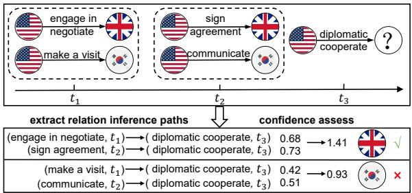
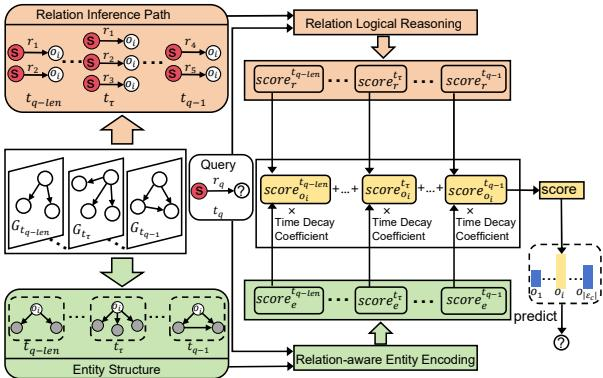
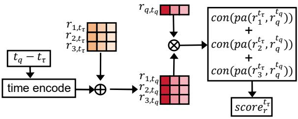
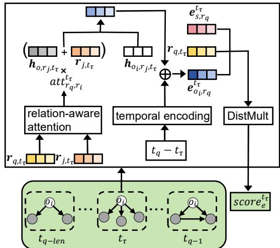

# Relation Logical Reasoning and Relation-aware Entity Encoding for Temporal Knowledge Graph Reasoning

Longzhou Liu1, Chenglong Xiao1, Shanshan Wang 1\* , Tingwen Liu2\* 1Department of Computer Science, Shantou University, Shantou, China 2Institute of Information Engineering, Chinese Academy of Sciences, Beijing, China {22lzliu, chlxiao, sswang}@stu.edu.cn liutingwen@iie.ac.cn

## Abstract

Temporal Knowledge Graph Reasoning (TKGR) aims to predict future facts based on historical data. Current mainstream models primarily use embedding techniques, which predict missing facts by representing entities and relations as low-dimensional vectors. However, these models often consider only the structural information of individual entities and relations, overlooking the broader structure of the entire TKG. To address these limitations, we propose a novel model called Relation Logical Reasoning and Relation-aware Entity Encoding (RLEE), drawing inspiration from attention mechanisms and logical rule-based techniques. RLEE introduces a two-layer representation of the TKG: an entity layer and a relation layer. At the relation layer, we extract relation paths to mine potential logical correlations between different relations, learning relation embeddings through a process of relation logical reasoning. At the entity layer, we use the relation-aware attention mechanism to learn the entity embeddings specific to the predicted query relations. These learned relation and entity embeddings are then used to predict facts at future timestamps. When evaluated on five commonly used public datasets, RLEE consistently outperforms state-of-the-art baselines.

## 1 Introduction

Temporal Knowledge Graphs (TKGs) integrate temporal information into traditional knowledge graphs, representing real-world facts (events) as quadruples (subject, relation, object, timestamp). TKGs consist of static subgraphs divided by the temporal dimension, with each subgraph containing all the facts that occurred at a specific corresponding timestamp. TKGR under the extrapolation setting focuses on inferring unfinished events in future subgraphs based on the information contained in historical subgraphs. Given its practical significance, TKGR under extrapolation settings has been widely used in areas such as financial early warning and behavioral prediction. To predict future events more accurately, more and more researchers are focusing on mining information from historical subgraphs in TKG to learn embedding representations of relations and entities. This is a representation learning problem in a lowdimensional space, aiming at efficient encoding of temporal information in the knowledge graph by capturing the dynamics of entity-to-entity connections. However, there are still two challenges that need to be addressed.

  
Figure 1: An example of reasoning using relational logic correlation between pairs of entities.

Neglecting the logical correlation of relations at the temporal level. Some graph-structurebased TKGR methods CyGNet (Zhu et al. (2021)), CENET (Xu et al. (2023)), HGLS (Zhang et al. (2023)), EvoExplore (Zhang et al. (2022)) do not focus on the changes of relations of the same entity pairs at different timestamps, ignoring the logical correlations that are implied between these relations. The predicted query (USA, diplomatic cooperate, ?, t3) in Figure 1 is an example from the ICEWS dataset, and we choose Britain and South Korea as candidates. First, we extract the relation inference paths between the two entity pairs (USA, Britain) and (USA, South Korea). We then evaluate the confidence that a relation inference path holds by mining the logical correlations between historical and query relations. Finally, we summarize the confidence scores of the relation inference paths and use the highest-scoring candidate entity, Britain, as the inference result.

Neglecting the dependence of entities on relations. Existing methods aggregate subgraphs of entities to obtain a common entity representation, which remains unchanged when predicting different future events. However, an entity plays different roles under different relations, and its specific entity representation should vary with the relations. For example, when answering queries (Obama, criticize, ?) and (Obama, endorse,?), the entity "Obama" should learn two embeddings with different semantic information, focusing on information related to the relation "criticize" and the relation "endorse", respectively. When learning entity embeddings, we should pay attention to the association between entities and relations and learn entity embeddings specific to the current query relation when facing different queries.

To address the aforementioned challenges, we propose a model called RLEE, which has two main modules that model relation information and entity information. To address Challenge 1, we introduce the Relation Logical Reasoning module, which mines the potential logical correlations between different relations by extracting the relation inference paths between pairs of entities and in this way learns the relation embeddings, enabling different relations to determine the degree of logical correlations between the relations by their distance in the embedding space. To address Challenge 2, we introduce the Relation-aware Entity Encoding module, which aims to learn the encoding of entities located under different relations. Specifically, we use a relation-aware attention mechanism to assign different weights to the subgraph neighbors of an entity, and finally aggregate the subgraphs based on the weights to obtain the embedding of an entity that is specific to a particular relation.

In summary, the contribution of our work is as follows:

1) We mine the underlying logical correlations between relations by exploring the relation inference paths between pairs of entities.

2) We learn relation-specific entity embeddings, which can effectively avoid the interference of irrelevant information in subgraphs when reasoning about predictions.

3) Extensive experiments indicate that our model substantially outperforms existing methods.

## 2 Related Work

Depending on the type of historical information a model focuses on, existing models can be divided into two categories: models based on historical entity information and models based on historical relation information.

Models based on historical entity information focus on modeling information about the entity. For instance, CyGNet (Zhu et al. (2021)) counts the frequency of entities occurring repeatedly in history and uses a copy mechanism to select prediction results from the entities that appear frequently. CENET (Xu et al. (2023)) adopts a comparative learning approach to capture the dependency of queries on both historical and non-historical entities. EvoExplore (Zhang et al. (2022)) implements a hierarchical attention mechanism to model the intricate local and global structures of entities.

Models based on historical relation information are completely independent of entities and focus on modeling the temporal path of relations. For instance, CluSTeR (Li et al. (2021a)) utilizes reinforcement learning to develop cluster search strategies that identify explicit and reliable relation clues for predicting future facts. DaeMon (Dong et al. (2023)) introduces a novel architecture that leverages timeline relations to adaptively capture temporal path information between query topics and candidate objects. ALRE-IR (Mei et al. (2022)) extracts relation paths from historical subgraphs, aligns these paths with current events to formulate rules, and then uses these rules to predict missing entities.

## 3 Method

## 3.1 Preliminaries

Let $\varepsilon , R , T$ denote the finite set of entities, relations, and timestamps, respectively. In the temporal knowledge graph, each fact is represented by a quaternion $\left( s , r , o , t \right)$ , where $s \in \varepsilon$ is the subject entity, $o \in \varepsilon$ is the object entity, and $r \in R$ is the relation between s and o that occurs at timestamp $t \in T$ . Specifically, given a query $q = ( s , r _ { q } , ? , t _ { q } )$ we take the candidate object $o _ { i } \in \varepsilon _ { c }$ as an example, where the subscript c of $\varepsilon _ { c }$ is the initial letter of the candidate, and $\varepsilon _ { c }$ is denoted as the set of all entities connected in the history of the query subject s,which we take as the set of candidate entities.

  
Figure 2: The overall architecture of RLEE. The orange portion is to get the relation level contribution score and the green portion is to get the entity level contribution score.

## 3.2 Model Overview

For prediction queries, we perform a two-step process. First, from a relational perspective: The subject s and the candidate object $o _ { i }$ have relations $r _ { 1 }$ and $r _ { 2 }$ under timestamps t and $t + \triangle t$ , which form an inference path $p a ( r _ { 1 } ^ { t } , r _ { 2 } ^ { t + \triangle t } ) = ( r _ { 1 } , t ) $ $( r _ { 2 } , t + \triangle t )$ suggesting that any pair of entities that have a relation $r _ { 1 }$ under timestamp t, that pair will have relation $r _ { 2 }$ after the time interval $\triangle t$ . We use the training data to obtain confidence that different relation inference paths hold, and the relation embeddings learned in this way effectively capture logical correlations with other relations. In predicting query $q = ( s , r _ { q } , o _ { i } , t _ { q } )$ , we aggregate the confidence scores of all relation inference paths between subject s and candidate $o _ { i }$ at historical timestamp $t _ { \tau }$ and use this score as the contribution score of the historical subgraph at timestamp $t _ { \tau }$ to support the construction of query $q = ( s , r _ { q } , o _ { i } , t _ { q } )$ at the relational level.

Next, from the perspective of entities: Based on the learned relation embeddings, we use the relation-aware attention mechanism to obtain a representation of entity embeddings specific to the query relation. We then use the DistMult function to capture semantic associations between entities and relations. This approach can obtain a score for the contribution of the history subgraph of the timestamp $t _ { \tau }$ to the establishment of the query $q = ( s , r _ { q } , o _ { i } , t _ { q } )$ at the level of the entity structure.

We integrate the contribution scores from both the relational level and the entity structural level using the product method to determine the subgraph contribution score for a specific timestamp. Subsequently, we calculate the probability score that query $q = ( s , r _ { q } , o _ { i } , t _ { q } )$ holds, by performing a weighted aggregation of the subgraph contribution scores throughout the historical time frame from $t _ { q - l e n } \mathrm { t o } t _ { q - 1 }$ using a time decay function. The overall methodology of our proposed model is shown in Figure 2.

  
Figure 3: A framework for relation logic reasoning that obtains contribution scores at the relational level under timestamp $t _ { \tau }$

## 3.3 Relation Logical Reasoning

The workflow of this module is shown in Figure 3. To discern the logical correlations across time between the query subject s and the candidate object $o _ { i }$ entity pairs, we begin by encoding the temporal information. Temporal information captures both the periodic and non-periodic nature of event occurrences—for instance, presidential elections occur periodically. In contrast, the lifespan of an individual, from birth to death, occurs non-periodically. Recognizing the significance of these temporal patterns, we specifically design separate vectors to represent periodic and non-periodic time characteristics:

$$
\mathbf { v } _ { \triangle t } ^ { p } = c o s ( \beta _ { t } \triangle t + \phi _ { c } )\tag{1}
$$

$$
\mathbf { v } _ { \triangle t } ^ { n p } = t a n h ( \gamma _ { t } \triangle t + \phi _ { t } )\tag{2}
$$

$$
\mathbf { T } _ { \triangle t } = \mathbf { v } _ { \triangle t } ^ { p } + \mathbf { v } _ { \triangle t } ^ { n p }\tag{3}
$$

$\mathbf { v } _ { t } ^ { p }$ and ${ \bf v } _ { t } ^ { n p }$ are d-dimensional periodic and nonperiodic vectors, respectively. $\beta _ { t } , \gamma _ { t } , \phi _ { c }$ and $\phi _ { t }$ are learnable parameters, $\triangle t = t _ { q } - t _ { \tau }$ . After encoding the temporal information, we add the temporal encoding to the relational encoding $\mathbf { r } _ { j , t _ { \tau } }$ :

$$
\mathbf { r } _ { j , t _ { q } } = \mathbf { r } _ { j , t _ { \tau } } + \mathbf { T } _ { \Delta t }\tag{4}
$$

Next, we obtain the relation inference path $p a ( r _ { j } ^ { t _ { \tau } } , r _ { q } ^ { t _ { q } } ) = ( r _ { j } , t _ { \tau } )  ( r _ { q } , t _ { q } )$ from the relation $r _ { j }$ between the entity pairs s and $o _ { i }$ to the relation $r _ { q } .$ We consider $r _ { j }$ as the cause and $r _ { q }$ as the effect. Finally, we assess the confidence that the relation inference path $p a ( r _ { j } ^ { t _ { \tau } } , r _ { q } ^ { t _ { q } } )$ holds by capturing the logical correlation between $r _ { j }$ and $r _ { q } .$ . To compute this, we directly use the dot product method:

  
Figure 4: A framework for relation-aware entity encoding, which obtains contribution scores at the entity level under timestamp $t _ { \tau } .$

$$
c o n ( p a ( r _ { j } ^ { t _ { \tau } } , r _ { q } ^ { t _ { q } } ) ) = { \bf r } _ { j , t _ { q } } * { \bf r } _ { q , t _ { q } }\tag{5}
$$

We aggregate the confidence scores of all relation inference paths for subject s and candidate $o _ { i }$ at timestamp $t _ { \tau }$ to obtain the contribution score of the history subgraph at timestamp $t _ { \tau }$ to get the contribution scores at the relational level.

$$
s o c r e _ { r } ^ { t _ { \tau } } = \sum _ { j = 1 } ^ { | R _ { s  o _ { i } } ^ { t \tau } | } c o n ( p a ( r _ { j } ^ { t _ { \tau } } , r _ { q } ^ { t _ { q } } ) )\tag{6}
$$

Where $r _ { j } ^ { t _ { \tau } } \in R _ { s  o _ { i } } ^ { t _ { \tau } } , R _ { s  o _ { i } } ^ { t _ { \tau } }$ denote the set of all relations connected by s and $o _ { i }$ at timestamp $t _ { \tau }$ .

## 3.4 Relation-aware Entity Encoding

The workflow of this module is shown in Figure 4. Current methodologies often overlook the impact of relations on entities whose attributes should not be static but vary according to the relation. After learning the relation embeddings, we delve deeper into learning entity embeddings tailored to specific query relations. Initially, we assign varying weights to the neighbors of the subgraphs, based on the degree of logical correlations between the relation $r _ { q }$ and the adjacency $r _ { j }$ of the entity $o _ { i }$ at timestamp $t _ { \tau }$ . Subsequently, we aggregate the subgraphs, using the weighted neighbors to derive the entity embeddings. This embedding framework is inspired by RGCN, and we employ a ω-layer RGCN for encoding, which is defined as follows:

$$
\begin{array} { l } { { \displaystyle { \bf h } _ { o _ { i } , r _ { q } , t _ { \tau } } ^ { l } = f \big ( \frac { 1 } { | N _ { o _ { i } , t } | } \sum _ { ( r _ { j } , o ) \in N _ { o _ { i } , t _ { \tau } } } a t t _ { r _ { q } , r _ { j } } ^ { t _ { \tau } } W _ { 1 } ^ { l } ( { \bf h } _ { o , r _ { j } , t _ { \tau } } ^ { l } + { \bf r } _ { j , t _ { \tau } } ) } } \\ { { \displaystyle ~ + W _ { 2 } ^ { l } { \bf h } _ { o _ { i } , r _ { q } , t _ { \tau } } ^ { l - 1 } ) } } \end{array}\tag{7}
$$

Where $f ( \cdot )$ is the RReLU activation function, $N _ { o _ { i } , t }$ is the set of neighbors of entity $o _ { i }$ in the static subgraph that is at timestamp t, $a t t _ { r , r _ { i } } ^ { t }$ is the relationaware attentional weight, $W _ { 1 } ^ { l } \in \mathbb { R } ^ { d \times d }$ and $W _ { 2 } ^ { l } \in$ $\mathbb { R } ^ { d \times d }$ are the weight parameters.

In Equation 7 we use the normalized attention mechanism $a t t _ { r , r _ { i } } ^ { t }$ to assign the attentional weights, $a t t _ { r , r _ { j } } ^ { t }$ is computed as follows:

$$
a t t _ { r _ { q } , r _ { j } } ^ { t _ { \tau } } = \frac { e x p ( c o s ( \mathbf { r } _ { j , t _ { \tau } } , \mathbf { r } _ { q , t _ { \tau } } ) ) } { \sum _ { r _ { k } \in { \cal R } _ { o _ { i } , t _ { \tau } } } e x p ( c o s ( \mathbf { r } _ { k , t _ { \tau } } , \mathbf { r } _ { q , t _ { \tau } } ) ) }\tag{8}
$$

Where $R _ { o _ { i } , t _ { \tau } }$ is the set of all relations to which entity $o _ { i }$ is connected.

Similarly, we add time coding to the entity embedding to obtain dynamic entity coding:

$$
\mathbf { e } _ { o _ { i } , r _ { q } } ^ { t _ { \tau } } = \mathbf { h } _ { o _ { i } , r _ { q } , t _ { \tau } } ^ { \omega } + \mathbf { T } _ { \triangle { t } }\tag{9}
$$

Since the DistMult function uses simple mathematical operations to represent the semantic associations between entities and relations with high computational efficiency and good interpretability, here we use this function as the scoring function for the entity structure part as follows:

$$
s o c r e _ { e } ^ { t _ { \tau } } = \sigma ( < { \bf e } _ { s , r _ { q } } ^ { t _ { \tau } } , { \bf r } _ { q , t _ { \tau } } , { \bf e } _ { o _ { i } , r _ { q } } ^ { t _ { \tau } } > )\tag{10}
$$

Where $\sigma ( \cdot )$ is a sigmoid function and $< \cdot >$ denotes the trilinear dot product. Eventually we obtain the score of the contribution of the history subgraph of the timestamp $t _ { \tau }$ to the establishment of query $q = ( s , r _ { q } , o _ { i } , t _ { q } )$ at the level of entity structure.

## 3.5 Result Prediction

In the ablation experiments in Section 4.3 below, we found a strong dependence between the relation inference path scores and the entity structure scores. Here, we use multiplication to combine relation and entity-level scores to obtain the predicted score at time $t _ { \tau }$

$$
s c o r e _ { o _ { i } } ^ { t _ { \tau } } = s o c r e _ { r } ^ { t _ { \tau } } \cdot s o c r e _ { e } ^ { t _ { \tau } }\tag{11}
$$

After obtaining the candidate entity $o _ { i }$ scores at each timestamp in the time range of $[ t _ { q - l e n } , t _ { q - 1 } ]$ through Equation 11, we aggregate these scores. Considering that the impact of historical events varies with the proximity of their occurrence, we design a power function based time decay coefficient:

$$
W _ { d } ( t _ { q } , t _ { \tau } ) = ( t _ { q } - t _ { \tau } ) ^ { - \gamma }\tag{12}
$$

The larger the value of $\gamma$ in the above equation, the faster the rate at which $W _ { d }$ decays over time. The time decay coefficient $W _ { d }$ ensures that relation inference paths closer in time to the query time $t _ { q }$ are assigned higher weights. We then weighted the predicted scores at each timestamp together to get the final score:

$$
s c o r e ( o _ { i } | s , r _ { q } , t _ { q } ) = \sum _ { \tau = q - l e n } ^ { q - 1 } W _ { d } ( t _ { q } , t _ { \tau } ) s c o r e _ { o _ { i } } ^ { t _ { \tau } }\tag{13}
$$

Finally, we take the candidate entity with the highest score as the final prediction:

$$
\hat { o } = a r g m a x _ { o \in { \varepsilon _ { c } } } s c o r e ( o | s , r _ { q } , t _ { q } )\tag{14}
$$

Where $s c o r e ( o | s , r _ { q } , t _ { q } )$ denotes the predicted probability of all candidate object entities $o \in \varepsilon$

## 3.6 Train

We use positive and negative sample comparison learning for training. First, we negatively sample and generate the error quaternion. Specifically, given a correct quaternion $p o s = ( s , r , o , t )$ we randomly sample an object entity from historical events and disrupt the quaternion to generate an incorrect quaternion neg that satisfies the condition $n e g = \{ ( s , r , o ^ { \prime } , t ) | o ^ { \prime } \in \pmb { \varepsilon } - o \}$ . We ensure that the correct quaternions (positive samples) receive higher scores and the incorrect quaternions (negative samples) receive lower scores by using the SoftMarginLoss function, expressed as follows:

$$
L = \sum _ { ( s , r , o , t ) \in P \bigcup N } l o g ( 1 + e x p ( - y \cdot s c o r e ( s , r , o , t ) ) )\tag{15}
$$

$$
y = \left\{ \begin{array} { l l } { 1 , \quad ( s , r , o , t ) \in P } \\ { - 1 , \quad ( s , r , o , t ) \in N } \end{array} \right.\tag{16}
$$

where $P$ is the set of correct quaternions and N is the set of error quaternions.

From the level of the embedding space of relations, the loss function’s task is to bring the historical relation embedding of the relation inference path in the positive examples close to the query relation embedding, and at the same time to move the historical relation embedding of the relational inference path in the negative examples away from the query relation embedding. The learned relation embeddings by this method can reflect the logical correlations between relations at the level of the embedding space. From the entity structure level, the task of the loss function is to learn an entity embedding specific to the query relation that can focus more on features related to the query relation to answer a specific query more efficiently, avoiding the interference of irrelevant information in the subgraphs in predicting the query.

## 4 Experiment

## 4.1 Experimental Setup

## 4.1.1 Datasets

We use five benchmark datasets (ICEWS14 (Li et al. (2022b)), ICEWS0515 (Ren et al. (2023)), ICEWS18 (Boschee et al. (2015)), WIKI (Vrandeciˇ c and Krötzsch´ (2014)), and YAGO (Suchanek et al. (2007))) to evaluate the performance of the model on the link prediction task. Table 1 below provides statistics for these datasets. All datasets are categorized chronologically into training, validation, and test sets.

## 4.1.2 Baselines

Our RLEE model is compared with TKGC models under the extrapolation setting. We chose DistMult (Yang et al. (2014)), ComplEX (Trouillon et al. (2016)) and R-GCN (Schlichtkrull et al. (2018)) as static models for comparison. TTransE (Leblay and Chekol (2018)), HyTE (Dasgupta et al. (2018)) and TA-DistMult (García-Durán et al. (2018)) as interpolated TKGR models for comparison. CyGNet (Zhu et al. (2021)), xERTE (Han et al. (2020)), TiTer (Sun et al. (2021)), RE-GCN (Li et al. (2021b)), CluSTeR (Li et al. (2021a)), HiSMatch (Li et al. (2022b)), CEN (Li et al. (2022a)), Evo-Explore (Zhang et al. (2022)), TECHS (Lin et al. (2023)), DaeMon (Dong et al. (2023)), CENET (Xu et al. (2023)), RPC (Liang et al. (2023)), TiPNN (Dong et al. (2024)), and DLGR (Xiao et al. (2024)) as extrapolated TKGR models for comparison.

## 4.1.3 Evaluation Metrics

We employ widely used evaluation metrics, namely mean reversed rank (MRR), hits@1, hits@3, and hits@10. For a fair comparison, we perform timeaware filtering where all correct entities at the query timestamp except for the true query object are filtered out from the answers. In comparison to the alternative setting that filters out all other objects that appear together with the query subject and relation at any timestamp, time-aware filtering yields a more realistic performance estimate. Our experiments report average results over four runs.

<table><tr><td>Datasets</td><td>Entities</td><td>Relations</td><td>Training</td><td>Validation</td><td>Test</td><td>Time Granules</td></tr><tr><td>ICEWS14</td><td>6869</td><td>230</td><td>74845</td><td>8514</td><td>7371</td><td>365</td></tr><tr><td>ICEWS0515</td><td>10488</td><td>251</td><td>368868</td><td>46302</td><td>46159</td><td>4017</td></tr><tr><td>ICEWS18</td><td>23033</td><td>256</td><td>373018</td><td>45995</td><td>49545</td><td>304</td></tr><tr><td>WIKI</td><td>12554</td><td>24</td><td>539286</td><td>67538</td><td>63110</td><td>232</td></tr><tr><td>YAGO</td><td>10623</td><td>10</td><td>161540</td><td>19523</td><td>20026</td><td>189</td></tr></table>

Table 1: Statistical data for the datasets.
<table><tr><td rowspan="2">Model</td><td colspan="4">ICEWS14</td><td colspan="4">ICEWS18</td><td colspan="4">ICEWS0515</td></tr><tr><td>MRR</td><td>H@1</td><td>H@3</td><td>H@10</td><td>MRR</td><td>H@1</td><td>H@3</td><td>H@10</td><td>MRR</td><td>H@1</td><td>H@3</td><td>H@10</td></tr><tr><td>DistMult(2015)</td><td>20.32</td><td>6.13</td><td>27.59</td><td>46.61</td><td>13.86</td><td>5.61</td><td>15.22</td><td>31.26</td><td>19.91</td><td>5.63</td><td>27.22</td><td>47.33</td></tr><tr><td>ComplEX(2016)</td><td>22.61</td><td>9.88</td><td>28.93</td><td>47.57</td><td>15.45</td><td>8.04</td><td>17.19</td><td>30.73</td><td>20.26</td><td>6.66</td><td>26.43</td><td>47.31</td></tr><tr><td>R-GCN(2018)</td><td>28.03</td><td>19.42</td><td>31.95</td><td>44.83</td><td>15.05</td><td>8.13</td><td>16.49</td><td>29.00</td><td>27.13</td><td>18.83</td><td>30.41</td><td>43.16</td></tr><tr><td>TTransE(2016)</td><td>12.86</td><td>3.14</td><td>15.72</td><td>33.65</td><td>8.44</td><td>1.85</td><td>8.95</td><td>22.38</td><td>16.53</td><td>5.51</td><td>20.77</td><td>39.26</td></tr><tr><td>HyTE(2018)</td><td>16.78</td><td>2.13</td><td>24.84</td><td>43.94</td><td>7.41</td><td>3.10</td><td>7.33</td><td>16.01</td><td>16.05</td><td>6.53</td><td>20.20</td><td>34.72</td></tr><tr><td>TA-DistMult(2018)</td><td>26.22</td><td>16.83</td><td>29.72</td><td>45.23</td><td>16.42</td><td>8.60</td><td>18.13</td><td>32.51</td><td>27.51</td><td>17.57</td><td>31.46</td><td>47.32</td></tr><tr><td>CyGNet(2021)</td><td>32.73</td><td>23.69</td><td>36.31</td><td>50.67</td><td>24.93</td><td>15.90</td><td>28.28</td><td>42.61</td><td>34.97</td><td>25.67</td><td>39.09</td><td>52.94</td></tr><tr><td>xERTE(2021)</td><td>40.79</td><td>32.70</td><td>45.67</td><td>57.30</td><td>29.31</td><td>21.03</td><td>33.51</td><td>46.48</td><td>46.62</td><td>37.84</td><td>52.31</td><td>63.92</td></tr><tr><td>TiTer(2021)</td><td>41.23</td><td>32.54</td><td>46.10</td><td>58.44</td><td>29.98</td><td>22.05</td><td>33.46</td><td>44.83</td><td>46.35</td><td>37.06</td><td>52.42</td><td>66.13</td></tr><tr><td>RE-GCN*(2021)</td><td>41.99</td><td>32.93</td><td>46.60</td><td>62.47</td><td>30.55</td><td>20.00</td><td>34.73</td><td>51.46</td><td>46.41</td><td>37.17</td><td>52.76</td><td>67.64</td></tr><tr><td>CluSTeR(2021)</td><td>46.00</td><td>33.80</td><td></td><td>71.20</td><td>32.30</td><td>20.60</td><td></td><td>55.90</td><td>44.60</td><td>34.90</td><td></td><td>63.00</td></tr><tr><td>HiSMatch(2022)</td><td>46.42</td><td>35.91</td><td>51.63</td><td>66.84</td><td>33.99</td><td>23.91</td><td>37.90</td><td>53.94</td><td>52.85</td><td>42.01</td><td>59.05</td><td>73.28</td></tr><tr><td>CEN*(2022)</td><td>41.52</td><td>31.38</td><td>46.02</td><td>61.36</td><td>30.85</td><td>20.53</td><td>34.28</td><td>49.86</td><td>49.21</td><td>37.52</td><td>56.74</td><td>71.68</td></tr><tr><td>EvoExplore(2022)</td><td>43.60</td><td>32.10</td><td>50.60</td><td>64.70</td><td>31.50</td><td>21.70</td><td>35.90</td><td>51.00</td><td>50.00</td><td>39.40</td><td>56.10</td><td>69.60</td></tr><tr><td>TECHS(2023)</td><td>43.88</td><td>34.59</td><td>49.36</td><td>61.95</td><td>30.85</td><td>21.81</td><td>35.39</td><td>49.82</td><td>48.38</td><td>38.34</td><td>54.69</td><td>68.92</td></tr><tr><td>DaeMon(2023)</td><td>45.32</td><td>34.96</td><td>50.07</td><td>63.72</td><td>31.23</td><td>22.51</td><td>35.65</td><td>48.76</td><td>47.85</td><td>37.90</td><td>52.61</td><td>68.57</td></tr><tr><td>CENET(2023)</td><td>41.30</td><td>32.58</td><td></td><td>58.22</td><td>29.65</td><td>19.98</td><td></td><td>48.23</td><td>47.13</td><td>37.25</td><td></td><td>67.61</td></tr><tr><td>RPC(2023)</td><td>44.55</td><td>34.87</td><td>49.80</td><td>65.08</td><td>34.91</td><td>24.34</td><td>38.74</td><td>55.89</td><td>51.14</td><td>39.47</td><td>57.11</td><td>71.75</td></tr><tr><td>TiPNN(2024)</td><td></td><td></td><td></td><td></td><td>32.17</td><td>22.74</td><td>36.24</td><td>50.72</td><td></td><td></td><td></td><td></td></tr><tr><td>DLGR(2024)</td><td>46.72</td><td>36.67</td><td>51.61</td><td></td><td>35.48</td><td>25.11</td><td>40.03</td><td></td><td>=</td><td>一</td><td></td><td></td></tr><tr><td>RLEE</td><td>52.63</td><td>39.53</td><td>58.70</td><td>78.35</td><td>36.71</td><td>25.73</td><td>41.35</td><td>58.42</td><td>56.84</td><td>44.37</td><td>63.08</td><td>80.23</td></tr><tr><td>Absolute Boost</td><td>5.91</td><td>2.86</td><td>7.07</td><td>7.15</td><td>1.23</td><td>0.62</td><td>1.32</td><td>2.52</td><td>3.99</td><td>2.36</td><td>4.03</td><td>6.95</td></tr><tr><td>Relative Boost</td><td>12.65</td><td>7.80</td><td>13.69</td><td>10.04</td><td>3.46</td><td>2.47</td><td>3.30</td><td>4.51</td><td>7.55</td><td>5.62</td><td>6.82</td><td>9.48</td></tr></table>

Table 2: Performance (in percentage) on ICEWS14, ICEWS18, ICEWS0515. The best performance is highlighted in boldface, and the second-best is underlined. ∗ indicates that we remove the static information from the model to ensure the fairness of comparisons between all baselines.

## 4.1.4 Implementation Details

Referring to previous research, we use random initialization to generate entity and relation embeddings of dimension 200. To optimize all model parameters, we used the Adam optimizer and set the initialized learning rate to 0.001. The number of layers w of the RGCN is set to 2; for each layer of the RGCN, the dropout rate is set to 0.2 and the history length parameter len is set to 10. The value of the parameter γ of the time decay coefficient is set to 0.8. Specifically, we train the model for 100 epochs, and stop the training if the verification loss does not decrease for 10 consecutive epochs. All experiments were conducted on a single Tesla T4 GPU with 16GB of memory. For the static reasoning methods, the time dimension is removed from all the TKG datasets. Some of the baseline results are adopted from RE-GCN. For the important CENET, DaeMon, EvoExplore, HiSMatch, RE-GCN, TiTer, xERTE, and CyGNet baseline works, we use their default parameters and replicate the results obtained under the original setup using their open codes. For CEN, we report the results obtained in the online setting. For DLGR, TiPNN, RPC, TECHS, and CluSTeR baseline works, we report the results presented in their papers since the model is not open source.

## 4.2 Experimental Result

Table 2 and Table 3 presents the performance comparison of all baseline models. On the ICEWS14, ICEWS18, and ICEWS0515 datasets, our proposed RLEE model outperforms other baselines on all assessment metrics, which validates the effectiveness of our model. Specifically, RLEE significantly outperforms static models, which demonstrates the importance of modeling temporal information in TKGR. However, some dynamic approaches, such as TransE and HyTE, perform even worse than static approaches because adding temporal representation to the scoring function destroys the transformation between entities. This illustrates the importance of modeling temporal information in a sensible way. RLEE still performs higher compared to the embedded models of CyGNet, xERTE,

<table><tr><td rowspan="2">Model</td><td colspan="4">WIKI</td><td colspan="4">YAGO</td></tr><tr><td>MRR</td><td>H@1</td><td>H@3</td><td>H@10</td><td>MRR</td><td>H@1</td><td>H@3</td><td>H@10</td></tr><tr><td>DistMult(2015)</td><td>27.96</td><td></td><td>32.45</td><td>39.51</td><td>44.05</td><td></td><td>49.70</td><td>59.94</td></tr><tr><td>ComplEX(2016)</td><td>27.69</td><td></td><td>31.99</td><td>38.61</td><td>44.09</td><td></td><td>49.57</td><td>59.64</td></tr><tr><td>R-GCN(2018)</td><td>13.96</td><td>-</td><td>15.75</td><td>22.05</td><td>20.25</td><td>-</td><td>24.01</td><td>37.30</td></tr><tr><td>TTransE(2016)</td><td>20.66</td><td>1</td><td>23.88</td><td>33.04</td><td>26.10</td><td></td><td>36.28</td><td>47.73</td></tr><tr><td>HyTE(2018)</td><td>25.40</td><td></td><td>29.16</td><td>37.54</td><td>14.42</td><td></td><td>39.73</td><td>46.98</td></tr><tr><td>TA-DistMult(2018)</td><td>26.44</td><td></td><td>31.36</td><td>38.51</td><td>44.98</td><td></td><td>50.64</td><td>61.11</td></tr><tr><td>CyGNet(2021)</td><td>58.78</td><td>47.89</td><td>66.44</td><td>78.70</td><td>68.98</td><td>58.97</td><td>76.80</td><td>86.98</td></tr><tr><td>xERTE(2021)</td><td>73.60</td><td>69.05</td><td>78.03</td><td>79.73</td><td>84.19</td><td>80.09</td><td>88.02</td><td>89.78</td></tr><tr><td>TiTer(2021)</td><td>73.91</td><td>71.70</td><td>75.41</td><td>76.96</td><td>87.47</td><td>80.09</td><td>89.96</td><td>90.27</td></tr><tr><td>RE-GCN*(2021)</td><td>51.53</td><td></td><td>58.29</td><td>69.53</td><td>63.07</td><td></td><td>71.17</td><td>82.07</td></tr><tr><td>HiSMatch(2022)</td><td>78.07</td><td>73.89</td><td>81.32</td><td>84.65</td><td>87.21</td><td>84.10</td><td>90.64</td><td>91.83</td></tr><tr><td>CEN*(2022)</td><td>78.93</td><td>75.05</td><td>81.90</td><td>84.90</td><td>82.37</td><td>79.52</td><td>85.93</td><td>88.64</td></tr><tr><td>TECHS(2023)</td><td>75.98</td><td></td><td></td><td>82.39</td><td>89.24</td><td></td><td></td><td>92.39</td></tr><tr><td>DaeMon(2023)</td><td>82.38</td><td>78.26</td><td>86.03</td><td>88.01</td><td>91.59</td><td>90.03</td><td>93.00</td><td>93.34</td></tr><tr><td>RPC(2023)</td><td>81.18</td><td>76.28</td><td>85.43</td><td>88.71</td><td>88.87</td><td>85.10</td><td>92.57</td><td>94.04</td></tr><tr><td>TiPNN(2024)</td><td>83.04</td><td>79.04</td><td>86.45</td><td>88.54</td><td>92.06</td><td>90.79</td><td>93.15</td><td>93.58</td></tr><tr><td>DLGR(2024)</td><td>82.14</td><td>80.14</td><td>84.04</td><td></td><td>88.87</td><td>84.60</td><td>92.35</td><td></td></tr><tr><td>RLEE</td><td>85.53</td><td>81.65</td><td>88.22</td><td>89.95</td><td>92.43</td><td>91.02</td><td>94.17</td><td>95.21</td></tr><tr><td>Absolute Boost</td><td>2.49</td><td>1.51</td><td>1.77</td><td>1.24</td><td>0.37</td><td>0.23</td><td>1.02</td><td>1.17</td></tr></table>

Table 3: Performance (in percentage) on WIKI, YAGO. The best performance is highlighted in boldface, and the second-best is underlined. ∗ indicates that we remove the static information from the model to ensure the fairness of comparisons between all baselines.

RE-GCN, HiSMatch, CEN, EvoExplore, RPC, and DLGR, because these methods ignore the association between entities and relations. TiTer, CluS-TeR, TECHS, Daemon, and TiPNN are logic rulebased models that extract potential logic rules from graphs by path searching. However, these methods are constrained by existing paths, limiting the scope of their searches and impairing their performance.

Further, we find that most models achieve good predictions on the ICEWS0515 and ICEWS14 datasets, but perform much worse on the ICEWS18 dataset. Upon observing Table 1, we note that the ICEWS18 dataset contains a large number of entities that introduce many relation inference paths with low confidence, making it difficult to learn valid relational logical associations.

On the WIKI and YAGO datasets, most of the models achieve high prediction performance, mainly because these two datasets contain a small number of relations, and the structure of the knowledge graphs they constitute is simple and easy to analyze. In particular, the YAGO dataset has only 10 relations, and we found through careful data analysis that the relations “isMarriedTo”, “owns” and “isAffiliatedTo” in the YAGO dataset occur more than 80% of the time. This results in a very simple knowledge graph constructed from the YAGO dataset, which does not need to take into account the complex connections between entities in the reasoning process.

## 4.3 Ablation Study

To further analyze the contribution that each part of the model makes to the final prediction results, we report in Table 4 above the results of the MRR metrics for the six sub-models on the test sets of the three datasets.

<table><tr><td></td><td>ICEWS14</td><td>ICEWS18</td><td>YAGO</td></tr><tr><td>RLEE</td><td>52.63</td><td>36.71</td><td>92.43</td></tr><tr><td>RLEE w/o R</td><td>49.16</td><td>33.26</td><td>87.32</td></tr><tr><td>RLEE w/o E</td><td>50.81</td><td>34.05</td><td>85.65</td></tr><tr><td>RLEE-Add</td><td>48.81</td><td>33.17</td><td>86.02</td></tr><tr><td>RLEE w/o relation-attention</td><td>50.13</td><td>34.95</td><td>83.72</td></tr><tr><td>RLEE w/o (temporal encoding)</td><td>47.22</td><td>34.16</td><td>82.37</td></tr></table>

Table 4: Results (in percentage) by different variants of our model on three datasets.

The several sub-models in the table are:1. RLEE, the complete model. 2. RLEE w/o R represents the model that does not use the Relational Logic Reasoning module. 3. RLEE w/o E represents the model that does not use the Relation-aware Entity Encoding module. 4. RLEE-Add represents the use of addition to combine the relation inference path scores and the entity structure scores. 5. RLEE w/o relation-attention represents models that do not use the Relation-aware Attention mechanism during entity embedding learning. 6. RLEE w/o (temporal encoding) represents models that do not use temporal encoding in the model.

From the experimental data presented in the table above, it is clear that both the Relation Logical Reasoning module and the Relation-aware Entity Encoding module are critical. Further to explore the extent to which the relation inference path score and entity structure score contribute to the final prediction results, we combine the scores at both the relation and entity levels by addition to obtain the RLEE-Add model. Compared to the RLEE model, which integrates scores through multiplication, the

<table><tr><td>Datasets</td><td>|ε|</td><td>R</td><td>Training</td><td>Validation</td><td>Test</td></tr><tr><td>YAGO</td><td>10623</td><td>10</td><td>161540</td><td>19523</td><td>20026</td></tr><tr><td>YAGOs</td><td>10038</td><td>10</td><td>51205</td><td>10973</td><td>10973</td></tr></table>

Table 5: Statistical data for YAGO and YAGOs.
<table><tr><td></td><td>MRR</td><td>H@1</td><td>H@3</td><td>H@10</td></tr><tr><td>YAGOs</td><td>51.71</td><td>46.93</td><td>57.02</td><td>59.36</td></tr><tr><td>YAGO→YAGOs</td><td>49.35</td><td>44.02</td><td>53.26</td><td>56.94</td></tr><tr><td>LIMP</td><td>95.44</td><td>93.80</td><td>93.41</td><td>95.92</td></tr><tr><td>YAGO</td><td>92.43</td><td>91.02</td><td>94.17</td><td>95.21</td></tr><tr><td>YAGOs→YAGO</td><td>88.03</td><td>85.78</td><td>90.23</td><td>92.42</td></tr><tr><td>LIMP</td><td>95.25</td><td>94.24</td><td>95.82</td><td>97.07</td></tr></table>

Table 6: Logical Inference migration Performance(→ denotes the cross-dataset inference result).

RLEE-Add model’s performance is substantially lower. This significant disparity suggests a strong interdependence between the relational inference path score and the entity structure score, indicating that high scores in both categories are imperative for achieving accurate inference outcomes.

The performance of RLEE w/o relation-attention drops significantly compared to RLEE, suggesting that learning relation-specific entity embeddings can be more beneficial in answering the query at hand. RLEE w/o temporal encoding also does not perform as well as RLEE, demonstrating that temporal numerical information is essential in learning embedded representations of entities and relations.

## 4.4 Validation of the Effectiveness of the Relation Logical Reasoning

The relation logical reasoning module learns the temporal logical correlations of relations that exist only between relations and are entity-independent, which means that the logical correlations can be migrated to other datasets with the same set of relations. In other words, the RLEE model is trained on one dataset to learn the logical correlations between relations, which can then be applied to different datasets with the same set of relations for inference. To demonstrate the effectiveness of the relation logical reasoning module, we conducted an experimental analysis.

We first select a target dataset “A” and another homologous dataset “B”, which means that “A” and “B” have the same set of relation types. Secondly, we train the relation logical reasoning module using the training data of “A” and test the performance with the testing data of “A”, and we can obtain the direct result of the relation logical reasoning module on the target dataset “A”. Then, we use the training data of “B” to train the relation logical reasoning module and use the testing data of $\mathbf { \ddot { \delta A } } ^ { \prime \prime }$ to test the performance, and we can get the cross-dataset inference result of the relation logical reasoning module on the target dataset “A” using the logical correlations learned from dataset “B”. Finally, we evaluate the ability of the relation logical reasoning module to capture logical correlations between relations by looking at the logical inference migration performance(LIMP), which is calculated by the percentage ratio of the cross-dataset inference result divided by the direct result.

More specifically, YAGO and YAGOs are homologous datasets (compared as shown in Table 5), and there is no intersection between their entity identifiers. Therefore, we use YAGO and YAGOs as target datasets in turn. Table 6 shows the results of the logical inference migration performance evaluation of the relation logical reasoning module on YAGO and YAGOs datasets. We can observe that all the logical inference migration performance of the relation logical reasoning module is above 90%. Even when learning relation logical correlations from the smaller dataset YAGOs and testing on the larger dataset YAGO, the relation logical reasoning module achieves effective performance on each of the TKG reasoning evaluation metrics. Thus, the experiments demonstrate that the relation logical reasoning module can effectively capture the logical correlations of different relations at the temporal level and that the learned logical correlations can be effectively applied to different datasets.

## 5 Conclusion

How to learn effective relation embeddings and entity embeddings is a problem that current models have been studying. In terms of relational embedding learning, this paper extracts relation inference paths between entity pairs and learns relational embeddings by evaluating whether these relation inference paths hold in the reasoning process so that the learned relation embeddings can reflect the logical correlations of different relations on the temporal level in the embedding space. In terms of entity embedding learning, we use the relation-aware attention mechanism to learn relation-specific entity embeddings, which enables the learned entity embeddings to pay more attention to the structural information related to the query relation and avoids the interference of irrelevant information. Experiments on five benchmark datasets demonstrate the effectiveness of our model in temporal knowledge graph extrapolation tasks.

## Acknowledgements

This work was supported by the National Key Research and Development Program of China (Grant No.2021YFB3100600), Scientific Research Project of Colleges and Universities in Guangdong Province (2021ZDZX1027), Guangdong Basic and Applied Basic Research Foundation (2022A1515110712 and 2023A1515010077), and STU Scientific Research Foundation for Talents (NTF20016 and NTF20017).

## References

Elizabeth Boschee, Jennifer Lautenschlager, Sean O’Brien, Steve Shellman, James Starz, and Michael Ward. 2015. Icews coded event data. Harvard Dataverse, 12:2. Doi:10.7910/DVN/28075.

Shib Sankar Dasgupta, Swayambhu Nath Ray, and Partha Talukdar. 2018. Hyte: Hyperplane-based temporally aware knowledge graph embedding. In Proceedings of the 2018 conference on empirical methods in natural language processing, pages 2001– 2011.

Hao Dong, Zhiyuan Ning, Pengyang Wang, Ziyue Qiao, Pengfei Wang, Yuanchun Zhou, and Yanjie Fu. 2023. Adaptive path-memory network for temporal knowledge graph reasoning. In Proceedings ofthe Thirty-Second International Joint Conference on Artificial Intelligence, pages 2086–2094.

Hao Dong, Pengyang Wang, Meng Xiao, Zhiyuan Ning, Pengfei Wang, and Yuanchun Zhou. 2024. Temporal inductive path neural network for temporal knowledge graph reasoning. Artificial Intelligence, 329:104085.

Alberto García-Durán, Sebastijan Dumanciˇ c, and Math-´ ias Niepert. 2018. Learning sequence encoders for temporal knowledge graph completion. arXiv preprint arXiv:1809.03202.

Zhen Han, Peng Chen, Yunpu Ma, and Volker Tresp. 2020. Explainable subgraph reasoning for forecasting on temporal knowledge graphs. In International Conference on Learning Representations.

Julien Leblay and Melisachew Wudage Chekol. 2018. Deriving validity time in knowledge graph. In Companion proceedings of the the web conference 2018, pages 1771–1776.

Zixuan Li, Saiping Guan, Xiaolong Jin, Weihua Peng, Yajuan Lyu, Yong Zhu, Long Bai, Wei Li, Jiafeng Guo, and Xueqi Cheng. 2022a. Complex evolutional pattern learning for temporal knowledge graph reasoning. In Proceedings of the 60th Annual Meeting of the Association for Computational Linguistics (Volume 2: Short Papers), pages 290–296.

Zixuan Li, Zhongni Hou, Saiping Guan, Xiaolong Jin, Weihua Peng, Long Bai, Yajuan Lyu, Wei Li, Jiafeng Guo, and Xueqi Cheng. 2022b. Hismatch: Historical structure matching based temporal knowledge graph reasoning. In Findings ofthe Associationfor Computational Linguistics: EMNLP 2022, pages 7328– 7338. Doi:10.48550/arXiv.2210.09708.

Zixuan Li, Xiaolong Jin, Saiping Guan, Wei Li, Jiafeng Guo, Yuanzhuo Wang, and Xueqi Cheng. 2021a. Search from history and reason for future: Two-stage reasoning on temporal knowledge graphs. arXiv preprint arXiv:2106.00327.

Zixuan Li, Xiaolong Jin, Wei Li, Saiping Guan, Jiafeng Guo, Huawei Shen, Yuanzhuo Wang, and Xueqi Cheng. 2021b. Temporal knowledge graph reasoning based on evolutional representation learning. In Proceedings of the 44th international ACM SIGIR conference on research and development in information retrieval, pages 408–417.

Ke Liang, Lingyuan Meng, Meng Liu, Yue Liu, Wenxuan Tu, Siwei Wang, Sihang Zhou, and Xinwang Liu. 2023. Learn from relational correlations and periodic events for temporal knowledge graph reasoning. In Proceedings of the 46th International ACM SIGIR Conference on Research and Development in Information Retrieval, pages 1559–1568.

Qika Lin, Jun Liu, Rui Mao, Fangzhi Xu, and Erik Cambria. 2023. Techs: Temporal logical graph networks for explainable extrapolation reasoning. In Proceedings of the 61st Annual Meeting of the Association for Computational Linguistics (Volume 1: Long Papers), pages 1281–1293.

Xin Mei, Libin Yang, Xiaoyan Cai, and Zuowei Jiang. 2022. An adaptive logical rule embedding model for inductive reasoning over temporal knowledge graphs. In Proceedings of the 2022 Conference on Empirical Methods in Natural Language Processing, pages 7304–7316.

Xin Ren, Luyi Bai, Qianwen Xiao, and Xiangxi Meng. 2023. Hierarchical self-attention embedding for temporal knowledge graph completion. In Proceedings of the ACM Web Conference 2023, pages 2539–2547. Doi:10.1145/3543507.358339.

Michael Schlichtkrull, Thomas N Kipf, Peter Bloem, Rianne Van Den Berg, Ivan Titov, and Max Welling. 2018. Modeling relational data with graph convolutional networks. In The semantic web: 15th international conference, ESWC 2018, Heraklion, Crete, Greece, June 3–7, 2018, proceedings 15, pages 593– 607. Springer.

Fabian M Suchanek, Gjergji Kasneci, and Gerhard Weikum. 2007. Yago: a core of semantic knowledge. In Proceedings ofthe 16th international conference on World Wide Web, pages 697–706.

Haohai Sun, Jialun Zhong, Yunpu Ma, Zhen Han, and Kun He. 2021. Timetraveler: Reinforcement learning

for temporal knowledge graph forecasting. In Proceedings of the 2021 Conference on Empirical Methods in Natural Language Processing, pages 8306– 8319.

Théo Trouillon, Johannes Welbl, Sebastian Riedel, Éric Gaussier, and Guillaume Bouchard. 2016. Complex embeddings for simple link prediction. In International conference on machine learning, pages 2071– 2080. PMLR.

Denny Vrandeciˇ c and Markus Krötzsch. 2014. Wiki-´ data: a free collaborative knowledgebase. Communications ofthe ACM, 57(10):78–85.

Yao Xiao, Guangyou Zhou, Zhiwen Xie, Jin Liu, and Jimmy Xiangji Huang. 2024. Learning dual disentangled representation with self-supervision for temporal knowledge graph reasoning. Information Processing & Management, 61(3):103618.

Yi Xu, Junjie Ou, Hui Xu, and Luoyi Fu. 2023. Temporal knowledge graph reasoning with historical contrastive learning. In Proceedings of the AAAI Conference on Artificial Intelligence, volume 37, pages 4765–4773. Doi:10.1609/aaai.v37i4.25601.

Bishan Yang, Wen-tau Yih, Xiaodong He, Jianfeng Gao, and Li Deng. 2014. Embedding entities and relations for learning and inference in knowledge bases. arXiv preprint arXiv:1412.6575.

Jiasheng Zhang, Shuang Liang, Yongpan Sheng, and Jie Shao. 2022. Temporal knowledge graph representation learning with local and global evolutions. Knowledge-Based Systems, 251:109234. Doi:10.1016/j.knosys.2022.109234.

Mengqi Zhang, Yuwei Xia, Qiang Liu, Shu Wu, and Liang Wang. 2023. Learning long-and short-term representations for temporal knowledge graph reasoning. In Proceedings of the ACM Web Conference 2023, pages 2412–2422. Doi:10.1145/3543507.3583242.

Cunchao Zhu, Muhao Chen, Changjun Fan, Guangquan Cheng, and Yan Zhang. 2021. Learning from history: Modeling temporal knowledge graphs with sequential copy-generation networks. In Proceedings of the AAAI conference on artificial intelligence, volume 35, pages 4732–4740. Doi:10.1609/aaai.v35i5.16604.