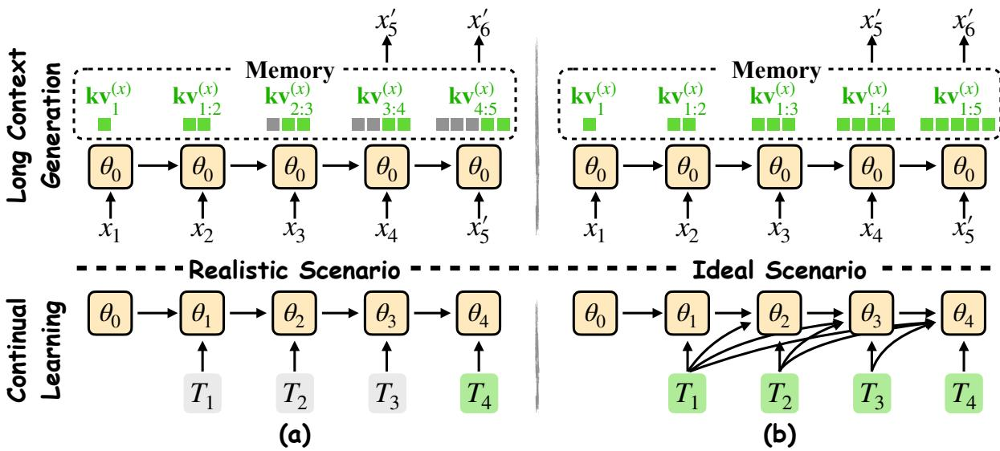
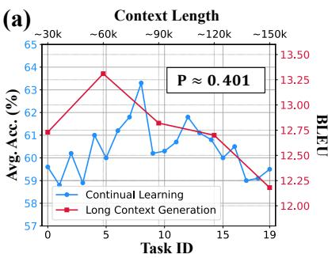
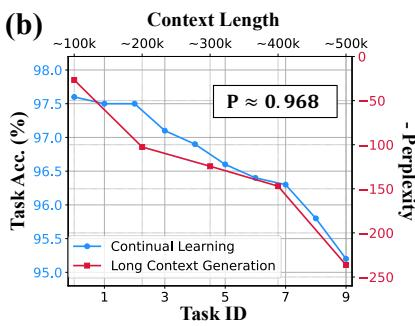
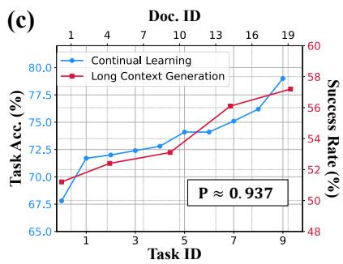
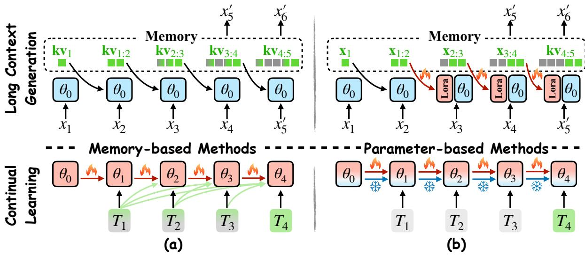
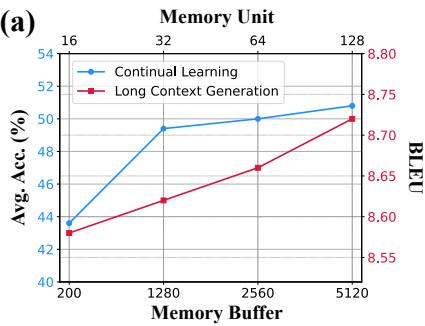
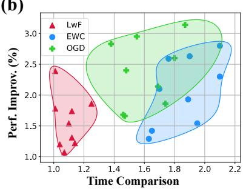
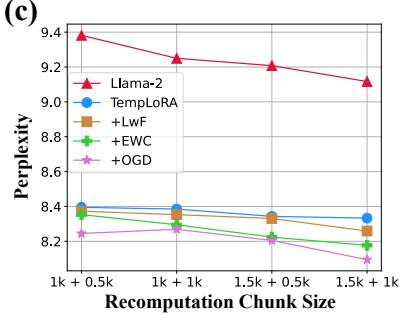

# Rethinking Long Context Generation from the Continual Learning Perspective

Zeyuan Yang1, Fangzhou Xiong1, Peng Li∗2, Yang Liu\*1,2,3, 1Dept. of Comp. Sci. & Tech., Institute for AI, Tsinghua University, Beijing, China, 2Institute for AI Industry Research (AIR), Tsinghua University, Beijing, China, 3Jiangsu Collaborative Innovation Center for Language Competence, Jiangsu, China,

## Abstract

Due to the limited context window, Large Language Models (LLMs) struggle with processing long contexts. Although fine-tuning can extend the context window, it incurs substantial computation costs. In contrast, recent tuning-free approaches reallocate the attention mechanism or incorporate temporary trainable parameters. In this work, by jointly modeling instance-level generation with a limited context window and learning over sequential data, we rethink the long context generation of LLMs from a continual learning perspective. In practice, we inspect existing representative approaches and analyze their synergy with continual learning strategies. Moreover, we integrate these strategies into current approaches to further boost LLMs’ efficiency in processing long contexts. Comprehensive experiments and analysis confirm the feasibility of continual learning insights for improving long-context processing.

## 1 Introduction

Large Language Models (LLMs) (Radford et al., 2018; Touvron et al., 2023; Achiam et al., 2023) serve as a crucial component across numerous language-based applications, such as chatbots (Du et al., 2022; Zeng et al., 2022), web agents (Xi et al., 2023), and collaborative writing assistants (Lee et al., 2022; Roziere et al., 2023). In practical deployments, these tasks necessitate the processing of long context sequences (Chen et al., 2023a; Peng et al., 2023). However, the inherent Transformer (Vaswani et al., 2017) architecture of LLMs incurs quadratically increasing memory and computation costs with longer input lengths (Wang et al., 2020). Despite recent efforts on efficient structures and hardware (Cai et al., 2022; Lin et al., 2023; Su et al., 2024), LLMs struggle to process longer sequences beyond the limited context window during pre-training (Tan et al., 2024).

Training on longer contexts (Tworkowski et al., 2023; Xiong et al., 2023) presents a straightforward method for enlarging the effective context window. However, fine-tuning pre-trained LLMs remains considerably expensive (Chen et al., 2023b) and the extended window size remains limited. Instead, prompt compression (Jiang et al., 2023a; Wingate et al., 2022) involves extra models to condense the original prompt through successive generations, inherently resulting in the loss of relevant information (Jiang et al., 2023b). Recent techniques (Xiao et al., 2023; Han et al., 2023) further adeptly design attention masks targeting selective value states. Alternatively, TempLoRA (Wang et al., 2024c) introduces instance-level temporary and trainable modules to consolidate the knowledge of the most recent evicted tokens. Nevertheless, it remains a significant challenge for LLMs to generate over infinite sequences during continuous deployment (Xiao et al., 2023).

In this work, given the inherently limited context window, we rethink the long context generation problem from a continual learning (Thrun and Mitchell, 1995; McCloskey and Cohen, 1989) perspective. As depicted in Fig. 1, the underlying objective of both challenges is to globally optimize output based on partially observed inputs. During continuous deployment, window attention (Beltagy et al., 2020) preserves a sliding window of the most recent tokens, enabling LLMs to generate subsequent tokens despite the absence of evicted ones. In parallel, continual learning endeavors to optimize the model parameters across sequential data without revisiting previous data (Chen and Liu, 2018). Moreover, just as recent key-value states encode historical information, the parameter initialization for each new task incorporates the knowledge from past tasks. Through comprehensive analysis, we investigate the parallels and distinctions between long context generation and continual learning.

In addition, we review representative approaches (Kirkpatrick et al., 2017; Lopez-Paz and Ranzato, 2017) in both fields, exploring their underlying analogies. To delve deeper into this comparison, we incorporate several well-established continual learning strategies into the existing TempLoRA to facilitate knowledge consolidation. Comprehensive experiments underline the effectiveness of our methodology, thereby showcasing the potential of applying continual learning principles to extend the contextual window. We summarize our contributions as follows:

  
Figure 1: Comparison of long context generation and continual learning process. Visible and invisible inputs are indicated in different colors. (a) Illustration of ideal scenarios, where the context window is infinite and all seen tasks are accessible. (b) Illustration of real scenarios, where the context window is limited and only the current task data is accessible for continual learning.

• By jointly modeling instance-level generation with a limited context window and learning over sequential data, we rethink the long context generation from a continual learning perspective, revealing internal similarities.

• We inspect existing approaches and analyze their synergy. Experiments demonstrate that integrating continual learning strategies enhances knowledge consolidation in context generation, showcasing the potential of leveraging continual learning insights.

## 2 Rethink Long Context Generation from the Continual Learning Perspective

## 2.1 Preliminaries

During deployment, LLMs iteratively generate subsequent tokens upon given prompts. To better characterize this process, we first provide a simplified general formulation of the sequential optimization problem. Given a sequence of inputs $\{ x _ { 1 } , x _ { 2 } , \ldots , x _ { t } \}$ at each time step t, the output yt is computed as follows:

$$
y _ { t } = f ( x _ { 1 } , \ldots , x _ { t } ; \theta ) ,\tag{1}
$$

where $\theta$ represents the model parameters and $f$ is the optimization algorithm. Specifically, in sequential context generation, the model constructs temporary memory to encode preceding tokens, rather than repeatedly processing the entire sequence, serving as inputs for subsequent steps. Assuming frozen model parameters and an infinite context window, the expected next token $x _ { s + 1 } ^ { ' * }$ is computed as:

$$
x _ { s + 1 } ^ { \prime * } , \mathrm { M e m } _ { s } = f _ { \mathrm { L L M } } ( \mathrm { M e m } _ { s - 1 } , \hat { x _ { s } } ; \theta ) ,\tag{2}
$$

with memory Mems caching all preceding tokens $\{ \hat { x _ { 1 } } , \dotsc , \hat { x _ { s } } \}$ and $\hat { x _ { s } }$ indicating the certain input token, ground truth token $x _ { s }$ for $s \leq t$ and generated token $x _ { s } ^ { \prime } { } ^ { * }$ otherwise. Recalling the attention mechanism within the transformer architecture, in most cases, LLMs compute and cache the Key and Value states (KV) as the temporary memory $\mathbf { M e m } _ { s } = \{ \mathbf { K } \mathbf { V } _ { 1 } , \dots , \mathbf { K } \mathbf { V } _ { s } \}$ for sequential generation, which fully encodes the generated token $x ^ { \prime }$

Similarly, in the context of continual learning, where t tasks $\{ D _ { t } \} = \{ ( X _ { t } ^ { c } , Y _ { t } ^ { c } ) \}$ arrive as a sequence, the optimization objective is to minimize the expected loss over all previously encountered tasks. During learning task t, the optimal model parameter $\theta _ { t } ^ { * }$ is thus expressed as:

<table><tr><td>Evaluation Metrics</td><td>Long Context Generation</td><td>Continual Learning</td></tr><tr><td>Overall Performance Learning Plasticity Memory Stability</td><td>Global generation quality Inherent generation fluency Key information extraction</td><td>Average accuracy Forward Transfer Backward transfer</td></tr></table>

Table 1: Comparison of evaluation metrics for long context generation and continual learning.

$$
\theta _ { t } ^ { * } = \arg \operatorname* { m i n } _ { \theta } \sum _ { i = 1 } ^ { t } \mathbb { E } \left[ L ( f _ { t } ^ { c } ( X _ { i } ^ { c } ; \theta ) , Y _ { i } ^ { c } ) \right] ,\tag{3}
$$

where $f _ { t } ^ { c }$ denotes the network for task t. Besides, task t learning extends optimization beyond $\theta _ { t - 1 }$ In particular, assuming an ideal scenario, where each task remains accessible, at each step t, the learning process is formulated as:

$$
\theta _ { t } = f _ { \mathrm { C L } } ( D _ { 1 } , \dots , D _ { t } ; \theta _ { t - 1 } ) ,\tag{4}
$$

where $\theta _ { 0 }$ represents parameters initialization and $f _ { \mathrm { C L } }$ denotes the training strategy. In this manner, this process parallels the general format in Eq. 1, with $\theta _ { t }$ as the objective yt. Moreover, akin to the context generation in $\operatorname { E q . }$ . 2, the current output serves as the input at the next step.

In essence, context generation with an unlimited context window, as well as continual learning with unrestricted task access, can both be conceptualized as distinct variations of the sequential optimization problem, where continual learning particularly incorporates external inputs at each time step. We illustrate this process in Fig. 1-(a).

## 2.2 Problem Formulation

In this section, we explore the long context generation with a limited context window from the continual learning perspective and propose a unified framework for analysis. To begin, we introduce the formulation of continual learning. In contrast to the ideal scenario depicted in Eq. 4, where all tasks are fully visible, a continual learning model is required to learn the incoming task with restricted or no access to prior task datasets, while maintaining performance on their test sets. Formally, for each task $t ,$ the model parameters are derived as:

$$
\begin{array} { r } { \theta _ { t } = h _ { \mathrm { C L } } ( D _ { t } ; \theta _ { t - 1 } ) , } \end{array}\tag{5}
$$

where $h _ { \mathrm { C L } }$ denotes the optimizing strategy. Although previous datasets are inaccessible, the optimized model $\theta _ { t - 1 }$ retains the knowledge of previous tasks. Recall that, as depicted in Eq. 3, the optimization goal is minimizing expected loss. Moreover, by approximating the expected loss using global optimal parameters $\theta _ { t } ^ { * }$ , we can estimate the continual learning objective as follows:

$$
\begin{array} { r l } {  { h _ { \mathrm { C L } } ^ { * } = \arg \operatorname* { m i n } _ { h } \sum _ { i = 1 } ^ { t } \mathbb { E } \big [ L \big ( f _ { t } ^ { c } ( X _ { i } ^ { c } ; \backslash } } \\ & { ~ \qquad h _ { \mathrm { ~ K C L } } ( D _ { t } ; \theta _ { t - 1 } ) ) , Y _ { i } ^ { c } \big ) \big ] }  \\ & { \approx \arg \operatorname* { m i n } _ { h _ { \mathrm { C L } } } L _ { \mathrm { C L } } \big ( h _ { \mathrm { C L } } ( D _ { t } ; \theta _ { t - 1 } ) , \theta _ { t } ^ { * } \big ) , } \end{array}\tag{6}
$$

where $L _ { \mathrm { C I } }$ indicates the loss function approximation, emphasizing the parameter optimization towards the global optimum. Recalling that $\theta _ { t } ^ { * }$ is the expected output $y _ { t } ^ { * }$ of time step t, we can frame this process as a specialized variant of restricted optimization. At each time step t, inputs prior to $t _ { v }$ remain unobservable. Formally, this can be articulated as:

$$
\left\{ \begin{array} { l l } { y _ { t } ^ { \prime } = h ( x _ { t _ { v } } , \ldots , x _ { t } ; y _ { t - 1 } ) } \\ { h ^ { * } = \arg \operatorname* { m i n } _ { h } L ( y _ { t } ^ { \prime } , y _ { t } ^ { * } ) , } \end{array} \right.\tag{7}
$$

where $t _ { v } = t$ and $y _ { t } = \theta _ { t }$ for the continual learning scenario. Under this framework, the process is distinguished by two principal characteristics: (1) It operates on an iterative basis, where at each step t, the outputs of the prior step $y _ { t - 1 }$ become the inputs for the following stage; (2) It is constrained by partial observability of the input sequence. With a fixed cache limit, as new inputs arrive, the earliest inputs are evicted, yet their information is captured in accessible outputs from previous steps. The challenge lies in developing an optimization approach h that effectively leverages incomplete inputs to produce the desired outputs.

Building upon the general constricted optimization formulation, we rethink the long context generation process. In this work, we consider the prevalent sliding window attention mechanism (Beltagy et al., 2020), where LLMs retain the most recent w tokens’ keys and values, thus maintaining constant memory usage and decoding speed across long sequences. Assuming static model parameters θ, the generation process is formulated as:

  
Figure 2: Performance evaluation comparison: (a) Overall performance by BLEU scores and average accuracy; (b) Learning plasticity by perplexity scores and new task accuracy; (c) Memory stability by information retrieval success rates and final task accuracy. Detailed experimental settings are reported in the Appendix.

$$
\left\{ \begin{array} { l l } { x _ { s + 1 } ^ { \prime } , \mathbf { M e m } _ { s } ^ { w } = h _ { \mathrm { L L M } } ( \mathbf { M e m } _ { s - 1 } ^ { w } , \hat { x } _ { s } ; \theta ) , } \\ { h _ { \mathrm { L L M } } ^ { * } = \arg \operatorname* { m i n } _ { h _ { \mathrm { L L M } } } L ( x _ { s + 1 } ^ { \prime } , x _ { s + 1 } ^ { * } ) , } \end{array} \right.\tag{8}
$$

where $h _ { \mathrm { L L M } }$ is the generation strategy and $\mathbf { M e m } _ { s - 1 } ^ { w } = \left\{ \mathbf { K V } _ { s - w } , \dots , \mathbf { K V } _ { s - 1 } \right\}$ is the memory of length w for token s. In this manner, this sequential process embodies a variant of the constrained optimization in Eq. 7, where subsequent tokens are generated by leveraging a subset of preceding KV states within the context window. This token, in turn, acts as the input for the next phase. Despite the absence of evicted tokens, their information is implicitly preserved and integrated into recent caches. Hence, the underlying process of vanilla long context comprehension and generation resembles continual learning.

In general, from a continual learning perspective, the long-context challenge represents an iterative process of restricted optimization. An optimal strategy seeks to exploit the knowledge within recent tokens or parameters to simulate the generation or optimization process as if all preceding inputs were considered. We provide a comparison in Fig. 1-(b).

## 2.3 Evaluation

In this section, we further investigate the performance metrics of long-context generation from a continual learning perspective. Building upon the analogous restricted optimization problem formulation, their evaluation exhibits inherent similarities. Predominantly, the most commonly utilized metrics for context generation include BLEU (Papineni et al., 2002), ROUGE (Chin-Yew, 2004), and perplexity-based scores. For instance, Han et al. (2023) adopted these metrics to reflect inherent fluency and overall performance. Recent metrics (Kamradt, 2023; Zhao et al., 2024) extracting critical information from the long text extend the evaluation to the capability of consolidating knowledge from previously encountered contexts. Intriguingly, we observe that these trending metrics span three intertwined yet distinct aspects of continual learning: overall performance, memory stability, and learning plasticity (Wang et al., 2024a). A brief comparison is illustrated in Tab. 1.

Overall Performance. In continual learning, the foremost measure of performance is average accuracy: $\textstyle \mathbf { A } \mathbf { A } = { \frac { 1 } { t } } \sum _ { j = 1 } ^ { t } a _ { t , j }$ , where $a _ { i , j }$ signifies the evaluated performance on task $j$ after learning task i. This metric reflects the system’s proficiency across all previously encountered tasks at the current moment. In the context of context generation, this metric translates to the quality of generated output across the preceding sequence, typically measured against reference texts via metrics like BLEU or ROUGE (Lin, 2004), indicating the overall generation performance. We provide a comparison in Fig. 2-(a). As the context length increases, the overall generation quality initially improves slightly due to the increased reference text. However, with further increases in context length, the quality gradually declines. Similarly, in continual learning, initial tasks lead to better parameter initialization, and performance declines as more tasks are encountered. This initial rise and then decline trend demonstrates a certain similarity.

Learning Plasticity. Optimal performance necessitates the effective assimilation of new knowledge.

  
Figure 3: Comparison of representative methods. (a) Illustration of memory-based methods, which retains a complementary replay buffer of previous tokens or samples to consolidate knowledge. (b) Illustration of parameter based methods, which restrictedly update model parameters to maintain performance.

Hence, the capability of acquiring new tasks is critical for continual learning, usually assessed by forward transfer (Lopez-Paz and Ranzato, 2017): $\begin{array} { r } { \mathbf { F W T } = \frac { 1 } { t - 1 } \sum _ { j = 2 } ^ { t } ( a _ { j , j } - a _ { j } ^ { * } ) } \end{array}$ , with $a _ { j } ^ { * }$ representing the accuracy of the model trained on task $D _ { j }$ . Concurrently, streaming perplexity (PPL) (Han et al., 2023) evaluates the inherent fluency within recent contexts during continuous generation, thereby distinguishing itself from overall performance metrics by emphasizing generative plasticity. According to Fig. 2-(b), as the context length increases, the perplexity continues to rise. Similarly, here we adopt GPM (Saha et al., 2020) for continual learning, and as the number of tasks increases, the optimization space becomes increasingly constrained, leading to deteriorating performance, which is widely observed in parameter-based methods.

Memory Stability. Recall the restricted optimization formulation, the absence of prior information underscores the importance of stable memory consolidation for superior overall performance. Backward transfer (Lopez-Paz and Ranzato, 2017), computed as $\begin{array} { r } { \mathbf { B W T } = \frac { 1 } { t - 1 } \sum _ { j = 1 } ^ { t - 1 } ( a _ { t , j } - a _ { j , j } ) } \end{array}$ , is widely adopted to measure the performance degrade during the sequential process. For context generation, the Needle in A Haystack test (Kamradt, 2023) gauges whether LLMs can effectively extract the randomly inserted key information. Assuming the availability of relevant information allows LLMs to produce accurate responses, these metrics (Zhao et al., 2024) further emphasize the competency in consolidating knowledge consolidation through long context comprehension. As shown in Fig. 2- (c), the final accuracy and the retrieval success rate exhibit a highly correlated trend across the input sequence, with a Pearson coefficient over 0.9.

Generally, effectively integrating emergent knowledge alongside retaining prior information is pivotal for achieving desired overall performance. Tab. 1 demonstrates that long context generation and continual learning are assessed across three interrelated dimensions. Fig. 2 further reveals their synergy. The principal challenge lies in improving general performance and ensuring a proper stability-plasticity trade-off (McNaughton and O’Reilly, 1995; McCloskey and Cohen, 1989) between learning plasticity and memory stability.

## 3 Representative Methods

In this section, we delve into representative approaches that augment long context generation or mitigate catastrophic forgetting. Rather than adhering to the conventional tripartite classification (De Lange et al., 2021), we roughly categorize continual learning methods into two groups based on their mechanism for encoding historical information. As depicted in Fig. 3, memory-based methods adopt a strategic cache memory scheme to consolidate previous knowledge. In contrast, parameter-based methods facilitate the optimization process $h _ { C L }$ by integrating auxiliary explicit constraints on parameters or implicit constraints on gradients. Our analysis further reveals the inherent connections among the approaches.

## 3.1 Memory-based Methods

In continual learning, memory-based approaches maintain a complementary memory buffer to retain samples from previous tasks. While learning new tasks, the cached samples are replayed to prevent forgetting. In this context, the learning process is:

$$
\theta _ { t } = h _ { \mathrm { C L } } ^ { \mathrm { r e p l a y } } ( D _ { t } , M _ { \mathrm { C L } , t } ^ { \mathrm { r e p l a y } } ; \theta _ { t - 1 } ) ,\tag{9}
$$

where $M _ { t } ^ { \mathrm { { r e p l a y } } }$ is the replay buffer for learning task t. After learning each task, this buffer is then updated to encapsulate key information.

$$
\boldsymbol { M } _ { \mathrm { C L } , t } ^ { \mathrm { r e p l a y } } = \boldsymbol { \mathrm { U p d a t e } } _ { \mathrm { C L } } ( \boldsymbol { M } _ { \mathrm { C L } , t - 1 } ^ { \mathrm { r e p l a y } } , \boldsymbol { D } _ { t } , \boldsymbol { \theta } _ { t } ) .\tag{10}
$$

Likewise, throughout processing a long sequence, retaining the KV states of the evicted tokens facilitates the model’s generation while retaining critical historical information, akin to the memory-based methods. For simplification, the process is:

$$
\boldsymbol { x } _ { t + 1 } ^ { \prime } , \mathbf { K } \mathbf { V } _ { t } = h _ { \mathrm { L L M } } ( \boldsymbol { M } _ { \mathrm { K V } , t } ^ { \mathrm { r e p l a y } } , \mathbf { K } \mathbf { V } _ { t } ^ { \mathrm { r e c e n t } } , \boldsymbol { x } _ { t } ; \theta ) ,\tag{11}
$$

where $\mathsf { K V } _ { t } ^ { \mathrm { r e c e n t } } = \{ \mathbf { K } \mathbf { V } _ { t - w : t } \}$ represents the KV states within the context window and $M _ { \mathrm { K V } , t } ^ { \mathrm { r e p l a y } }$ denotes the preserved replay buffer.

Recent research (Han et al., 2023) reveals that language models assign large attention scores to initial tokens in a sequence. Specifically, StreamingLLM (Xiao et al., 2023) thus optimizes generation by integrating the KV states of these initial tokens. The replay buffer $M _ { \mathrm { K V } , t } ^ { \mathrm { r e p l a y } }$ here is the static KV states of the initial c tokens $\{ \mathrm { K V } _ { 0 : c } \}$ which stores critical knowledge of the preceding sequences and facilitates subsequent generation. To ensure constant memory usage, which is important for deployment, the recent cache is thus marginally reduced as $\left\{ \mathrm { K V } _ { t - w + c : t } \right\}$ . From the continual learning perspective, this aligns with the Experience Replay (Rolnick et al., 2019) strategy, where the memory buffer retains selected samples from previous tasks, reinforcing previously acquired knowledge. Notably, in this instance, only the initial samples are preserved. This stems from the unique dynamics of the context generation process, which deviates from the typical continual learning assumption that each task’s data distribution and importance are independent. As shown in Eq. 8, the KV states are computed from those of preceding tokens, leading to an uneven attention distribution.

Similarly, by maintaining all previous KV states and selectively resuing representative samples regarding recent tokens, InfLLM (Xiao et al., 2024) captures long-distance dependencies among massive contexts. Considering replay c tokens, the recent cache is thus $\left\{ \mathbf { K } \mathbf { V } _ { t - w + c : t } \right\}$ and the replay buffer $M _ { \mathrm { K V } , t } ^ { \mathrm { r e p l a y } }$ here is $f _ { r } ( \mathbf { K } \mathbf { V } _ { 0 : t - w + c } )$ , where $f _ { r }$ denotes the pre-defined retrieval strategy. The context memory acts as a full buffer that stores all samples from previous tasks in continual learning scenarios, while for each new task, it selectively replays relevant samples to improve learning. Consequently, despite the variety of caching strategies, memorybased techniques enhance performance in context generation by effectively reusing old samples.

Moreover, Buzzega et al. (2020) indicate that increasing the replay buffer size ensures better performance in continual learning. Similar patterns are observed in long context generation. As shown in Fig. 4-(a), a larger buffer size improves performance in both scenarios, further demonstrating this similarity. However, despite the significant performance improvements, particularly in retrieval tasks, this approach faces challenges similar to continual learning (Buzzega et al., 2020). Maintaining complete KV states incurs increasing memory costs despite constant computational costs, making lengthy sequences in real-world applications inconvenient.

In summary, memory-based strategies, akin to those in continual learning, effectively capture longterm dependencies by retaining previous KV states. A comparison is provided in Fig. 3-(a).

## 3.2 Parameter-based Methods

Continual learning can be facilitated not only with an additional memory buffer but also by designing specific constraints that manipulate the optimization process during parameter updates, which we refer to as parameter-based approaches (Wang et al., 2024a). Examples include regularization-based approaches (Kirkpatrick et al., 2017; Zenke et al., 2017), which incorporate explicit loss terms, and optimization-based approaches (Farajtabar et al., 2020; Saha et al., 2020), which guide the direction of optimization. However, in long context generation scenarios, the token generation process remains static considering frozen parameters, impeding the application of parameter-based approaches.

Nevertheless, recent TempLoRA (Wang et al., 2024c) enables dynamic parameter adjustments for improved generation by introducing auxiliary, temporarily trainable modules. Rather than sliding the attention window for each token, TempLoRA updates the LoRA module after processing each chunk. Assuming a chunk size of c, xct and KVct represent the t-th chunk’s tokens and KV states, respectively. The forward process is thus:

(b)  

(c)  
  
Figure 4: (a) Comparison of increasing the memory buffer of GEM on CIFAR-100 and the memory units of InfLLM on PG19 datasets; (b) Comparison of performance boost and time consumption under different settings; (c) Comparison of PPL results on PG19 datasets under different context window and recomputation chunk sizes.

$$
\left\{ \begin{array} { l } { \boldsymbol { x } _ { t + 1 } ^ { \prime c } , \mathbf { M e m } _ { t } ^ { c } = h _ { \mathrm { L L M } } ( \mathbf { M e m } _ { t - n _ { c } : t } ^ { c } , \boldsymbol { x } _ { t } ^ { c } ; \boldsymbol { \theta } , \boldsymbol { \Theta } _ { t } ) } \\ { \boldsymbol { \Theta } _ { t + 1 } = \mathbf { U p d a t e } _ { \mathrm { L o R A } } ( \boldsymbol { x } _ { t } ^ { c } , \boldsymbol { \Theta } _ { t } ) , } \end{array} \right.\tag{12}
$$

where $\Theta _ { t }$ denotes the LoRA module fine-tuned on the t-th chunk, and $n _ { c } ~ = ~ \lfloor w / c \rfloor$ is the number of chunks within the context window. This dynamic module thus continuously encodes historical information within auxiliary trainable parameters, resembling the constrained parameter updates in parameter-based approaches.

Building upon TempLoRA, both regularizationbased and gradient-based methods can be integrated into the long context generation process. To explore the inherent analogy further, we incorporate several well-established continual learning approaches into TempLoRA, including EWC (Kirkpatrick et al., 2017), LwF (Li and Hoiem, 2017), and OGD (Farajtabar et al., 2020). We provide detailed experimental results and analysis in Sec. 4.

## 4 Experiments and Analysis

## 4.1 Experimental Setup

Datasets. Following Wang et al. (2024c), we evaluate our proposed methods on the PG19 (Rae et al., 2019) and GuoFeng (Wang et al., 2023) datasets, using PPL (Press et al., 2021) metrics as the primary measure and BLEU (Papineni et al., 2002) and COMET (Rei et al., 2020) scores for comprehensive evaluation in translation tasks.

Baselines. For memory-based approaches, we adopt StreamingLLM (Han et al., 2023) and InfLLM (Xiao et al., 2024). For parameter-based approaches, we apply continual learning techniques to TempLoRA (Wang et al., 2024c), enabling parameter updates. In practice, we use EWC (Kirkpatrick et al., 2017) and LwF (Li and Hoiem, 2017) for regularization-based methods and OGD (Farajtabar et al., 2020) for gradient-based methods.

<table><tr><td>Method</td><td>300k+</td><td>400k+</td><td>500k+</td><td>Avg.</td></tr><tr><td>Llama-2</td><td>(Sliding Window) 368.04</td><td></td><td></td><td></td></tr><tr><td>Streaming. InfLLM</td><td>10.11</td><td>8.64</td><td>4.94</td><td>7.90 7.88</td></tr><tr><td></td><td>9.54</td><td>9.21</td><td>4.89</td><td></td></tr><tr><td></td><td>(Chunk Recomputation)</td><td></td><td></td><td></td></tr><tr><td>Llama-2</td><td>9.57</td><td>9.28</td><td>4.99</td><td>9.25</td></tr><tr><td>TempLoRA</td><td>8.58</td><td>8.43</td><td>4.18</td><td>7.07</td></tr><tr><td>+ LwF</td><td>8.42</td><td>8.34</td><td>4.08</td><td>6.94</td></tr><tr><td>+ EWC</td><td>8.34</td><td>8.31</td><td></td><td>6.88</td></tr><tr><td>+ OGD</td><td>8.31</td><td>8.29</td><td>4.03 4.02</td><td>6.87</td></tr></table>

Table 2: Comparison of PPL results of Llama-2 7B on PG19 datasets. Here we set the context window size to 2k and the recomputation chunk size to 1k.

Setup. Unless otherwise stated, all experiments were performed with the standard Llama2-7B 4K model 1. For efficiency, we set the context window to 2k. For TempLoRA and its variants, the chunk size is set to 1k. Implementation details are provided in the Appendix.

## 4.2 Main Results

We present the comparative results on PG19 in Tab. 2. In practice, parameter-based approaches operate under the chunk recomputation setting rather than the sliding window setting. This involves recomputing the KV states during the processing of each chunk token, leading to better performance at the cost of increased time consumption. As shown in Tab. 2, both memory-based and parameter-based approaches show significant improvements over the base model. Compared to TempLoRA, which serves as the baseline finetuning setting in continual learning, all proposed approaches demonstrate general improvements across different lengths. Similar patterns are observed in the results on GouFeng, as reported in Tab. 3. Foundational continual learning methods such as LwF and EWC achieve modest progress, while the wellestablished approach OGD shows the most significant improvement, with gains of 0.2 and 1.2 BLEU scores on two benchmarks, respectively. These results confirm the potential of continual learning insights for enhancing long-context processing.

<table><tr><td>Method</td><td>PPL↓</td><td>BLEU↑</td><td>COMET ↑</td></tr><tr><td>Llama-2</td><td>5.89</td><td>14.54</td><td>76.60</td></tr><tr><td>TempLoRA</td><td>3.71</td><td>18.85</td><td>78.86</td></tr><tr><td>+LwF</td><td>3.72</td><td>19.37</td><td>79.59</td></tr><tr><td>+EWC</td><td>3.74</td><td>19.24</td><td>79.77</td></tr><tr><td>+ OGD</td><td>3.69</td><td>20.03</td><td>79.83</td></tr></table>

Table 3: Results of Llama-2 7B on GuoFeng datasets.

To deepen the understanding of the interconnection between long context generation and continual learning, we conducted a comparative analysis of various approaches in both fields. The results are presented in Fig. 4-(b) and Tab. 4 respectively. Our observations indicate consistent patterns across the adopted approaches in both fields. Specifically, LwF demonstrated modest improvements with minimal time consumption, while OGD achieved the most significant progress with less time consumption than EWC. This alignment in performance underscores the synergistic relationship between long context generation and continual learning.

For computational efficiency, we set the context window size to 2k instead of the full size of 4k. However, we believe the findings remain consistent. The PPL results of various methods under different window sizes are presented in Fig. 4-(c). As shown in Fig. 4-(c), as the context window size increases, the generation performance improves while maintaining the patterns within the proposed methods. Integrating OGD consistently yields the best performance. Therefore, despite the reduced window size, our experiments and analysis remain valid for context-generation research.

<table><tr><td rowspan="2">Method</td><td colspan="2">CIFAR-100</td><td colspan="2">MiniImageNet</td></tr><tr><td>Time</td><td>Acc. (%)</td><td>Time</td><td>Acc. (%)</td></tr><tr><td>LwF</td><td>0.91</td><td>63.73</td><td>0.94</td><td>48.78</td></tr><tr><td>EWC</td><td>1.22</td><td>68.80</td><td>1.31</td><td>52.01</td></tr><tr><td>OGD</td><td>1.00</td><td>70.96</td><td>1.00</td><td>59.83</td></tr></table>

Table 4: Time and accuracy comparison on two benchmarks. The time is normalized with respect to OGD.

## 5 Related Work

## 5.1 Long Context Generation

To improve long sequence inference during deployment (Kaddour et al., 2023; Anil et al., 2022), various techniques (Ratner et al., 2023; Bertsch et al., 2024) have been developed. One straightforward method (Pal et al., 2023; Tworkowski et al., 2024) is to fine-tune LLMs on longer sequences, though requiring significant training resources (Wang et al., 2024b). Instead of resource-intensive training, recent methods craftily design position encoding schemes (Su et al., 2024; Kazemnejad et al., 2024) or selectively retain important tokens (Han et al., 2023; Xiao et al., 2023). Additionally, some approaches (Xiao et al., 2024; Munkhdalai et al., 2024) incorporate extra token memory to enhance context generation. In this work, we focus on training-free approaches that enable LLMs to process longer sequences.

## 5.2 Continual Learning

To achieve continual learning, replay-based methods (Lopez-Paz and Ranzato, 2017; Shin et al., 2017) store a portion of old samples in memory, while expansion-based methods (Rusu et al., 2016; Yoon et al., 2018, 2019) increase the model structure to incorporate new knowledge. These strategies, however, demand additional memory buffers (Parisi et al., 2019) or an expanding network architecture (Kong et al., 2022), leading to high computational costs (De Lange et al., 2021). To promote performance within a fixed network capacity, regularization-based methods (Kirkpatrick et al., 2017; Aljundi et al., 2018) design penalties on parameter updates via regularization terms. Moving beyond explicit neuron constraints, recent gradient projection methods (Zeng et al., 2019; Saha et al., 2020) restrict the gradient update directions, achieving better performance. In this work, we focus on leveraging continual learning strategies to enhance context generation.

## 6 Conclusion

In this paper, we reexamine long context generation from a continual learning perspective, revealing the inherent synergy between these two challenges. Our analysis highlights the relationship between various approaches in both fields. Furthermore, by applying continual learning techniques to long context generation, our comprehensive experimental results demonstrate the efficiency and scalability of these strategies, underscoring the potential of continual learning insights for effectively processing extended contexts.

## Acknowledgment

This work is supported by the National Natural Science Foundation of China (No. 61925601, 62276152) and funding from Wuxi Research Institute of Applied Technologies, Tsinghua University under Grant 20242001120.

## References

Josh Achiam, Steven Adler, Sandhini Agarwal, Lama Ahmad, Ilge Akkaya, Florencia Leoni Aleman, Diogo Almeida, Janko Altenschmidt, Sam Altman, Shyamal Anadkat, et al. 2023. Gpt-4 technical report. arXiv preprint arXiv:2303.08774.

Rahaf Aljundi, Francesca Babiloni, Mohamed Elhoseiny, Marcus Rohrbach, and Tinne Tuytelaars. 2018. Memory aware synapses: Learning what (not) to forget. In Proceedings ofthe European conference on computer vision (ECCV), pages 139–154.

Cem Anil, Yuhuai Wu, Anders Andreassen, Aitor Lewkowycz, Vedant Misra, Vinay Ramasesh, Ambrose Slone, Guy Gur-Ari, Ethan Dyer, and Behnam Neyshabur. 2022. Exploring length generalization in large language models. Advances in Neural Information Processing Systems, 35:38546–38556.

Iz Beltagy, Matthew E Peters, and Arman Cohan. 2020. Longformer: The long-document transformer. arXiv preprint arXiv:2004.05150.

Amanda Bertsch, Uri Alon, Graham Neubig, and Matthew Gormley. 2024. Unlimiformer: Long-range transformers with unlimited length input. Advances in Neural Information Processing Systems, 36.

Pietro Buzzega, Matteo Boschini, Angelo Porrello, Davide Abati, and Simone Calderara. 2020. Dark experience for general continual learning: a strong, simple baseline. Advances in neural information processing systems, 33:15920–15930.

Han Cai, Chuang Gan, and Song Han. 2022. Efficientvit: Enhanced linear attention for highresolution low-computation visual recognition. arXiv preprint arXiv:2205.14756.

Shouyuan Chen, Sherman Wong, Liangjian Chen, and Yuandong Tian. 2023a. Extending context window of large language models via positional interpolation. arXiv preprint arXiv:2306.15595.

Yukang Chen, Shengju Qian, Haotian Tang, Xin Lai, Zhijian Liu, Song Han, and Jiaya Jia. 2023b. Longlora: Efficient fine-tuning of long-context large language models. arXiv preprint arXiv:2309.12307.

Zhiyuan Chen and Bing Liu. 2018. Lifelong machine learning. Synthesis Lectures on Artificial Intelligence and Machine Learning, 12(3):1–207.

Lin Chin-Yew. 2004. Rouge: A package for automatic evaluation of summaries. In Proceedings ofthe Work shop on Text Summarization Branches Out, 2004.

Matthias De Lange, Rahaf Aljundi, Marc Masana, Sarah Parisot, Xu Jia, Aleš Leonardis, Gregory Slabaugh, and Tinne Tuytelaars. 2021. A continual learning survey: Defying forgetting in classification tasks. IEEE transactions on pattern analysis and machine intelligence, 44(7):3366–3385.

Zhengxiao Du, Yujie Qian, Xiao Liu, Ming Ding, Jiezhong Qiu, Zhilin Yang, and Jie Tang. 2022. Glm: General language model pretraining with autoregressive blank infilling. In Proceedings of the 60th Annual Meeting ofthe Associationfor Computational Linguistics (Volume 1: Long Papers), pages 320–335.

Mehrdad Farajtabar, Navid Azizan, Alex Mott, and Ang Li. 2020. Orthogonal gradient descent for continual learning. In International Conference on Artificial Intelligence and Statistics, pages 3762–3773. PMLR.

Chi Han, Qifan Wang, Wenhan Xiong, Yu Chen, Heng Ji, and Sinong Wang. 2023. Lm-infinite: Simple on-the-fly length generalization for large language models. arXiv preprint arXiv:2308.16137.

Huiqiang Jiang, Qianhui Wu, Chin-Yew Lin, Yuqing Yang, and Lili Qiu. 2023a. Llmlingua: Compressing prompts for accelerated inference of large language models. In Proceedings ofthe 2023 Conference on Empirical Methods in Natural Language Processing, pages 13358–13376.

Huiqiang Jiang, Qianhui Wu, Xufang Luo, Dongsheng Li, Chin-Yew Lin, Yuqing Yang, and Lili Qiu. 2023b. Longllmlingua: Accelerating and enhancing llms in long context scenarios via prompt compression. arXiv preprint arXiv:2310.06839.

Jean Kaddour, Joshua Harris, Maximilian Mozes, Herbie Bradley, Roberta Raileanu, and Robert McHardy. 2023. Challenges and applications of large language models. arXiv preprint arXiv:2307.10169.

G Kamradt. 2023. Needle in a haystack–pressure testing llms.

Amirhossein Kazemnejad, Inkit Padhi, Karthikeyan Natesan Ramamurthy, Payel Das, and Siva Reddy. 2024. The impact of positional encoding on length generalization in transformers. Advances in Neural Information Processing Systems, 36.

James Kirkpatrick, Razvan Pascanu, Neil Rabinowitz, Joel Veness, Guillaume Desjardins, Andrei A Rusu, Kieran Milan, John Quan, Tiago Ramalho, Agnieszka Grabska-Barwinska, et al. 2017. Overcoming catastrophic forgetting in neural networks. Proceedings of the national academy of sciences, 114(13):3521–3526.

Yajing Kong, Liu Liu, Zhen Wang, and Dacheng Tao. 2022. Balancing stability and plasticity through advanced null space in continual learning. In European Conference on Computer Vision, pages 219– 236. Springer.

Mina Lee, Percy Liang, and Qian Yang. 2022. Coauthor: Designing a human-ai collaborative writing dataset for exploring language model capabilities. In Proceedings of the 2022 CHI conference on human factors in computing systems, pages 1–19.

Zhizhong Li and Derek Hoiem. 2017. Learning without forgetting. IEEE transactions on pattern analysis and machine intelligence, 40(12):2935–2947.

Chin-Yew Lin. 2004. Rouge: A package for automatic evaluation of summaries. In Text summarization branches out, pages 74–81.

Ji Lin, Ligeng Zhu, Wei-Ming Chen, Wei-Chen Wang, and Song Han. 2023. Tiny machine learning: Progress and futures [feature]. IEEE Circuits and Systems Magazine, 23(3):8–34.

David Lopez-Paz and Marc’Aurelio Ranzato. 2017. Gradient episodic memory for continual learning. Advances in neural information processing systems, 30.

Michael McCloskey and Neal J Cohen. 1989. Catastrophic interference in connectionist networks: The sequential learning problem. In Psychology oflearning and motivation, volume 24, pages 109–165. Elsevier.

Bruce L McNaughton and Randall C O’Reilly. 1995. Why there are complementary learning systems in the hippocampus and neocortex: Insights from the successes and failures of. Psychological Review, 102(3):419–457.

Tsendsuren Munkhdalai, Manaal Faruqui, and Siddharth Gopal. 2024. Leave no context behind: Efficient infinite context transformers with infiniattention. arXiv preprint arXiv:2404.07143.

Arka Pal, Deep Karkhanis, Manley Roberts, Samuel Dooley, Arvind Sundararajan, and Siddartha Naidu. 2023. Giraffe: Adventures in expanding context lengths in llms. arXiv preprint arXiv:2308.10882.

Kishore Papineni, Salim Roukos, Todd Ward, and Wei-Jing Zhu. 2002. Bleu: a method for automatic evaluation of machine translation. In Proceedings ofthe 40th annual meeting of the Association for Computational Linguistics, pages 311–318.

German I Parisi, Ronald Kemker, Jose L Part, Christopher Kanan, and Stefan Wermter. 2019. Continual lifelong learning with neural networks: A review. Neural Networks, 113:54–71.

Bowen Peng, Jeffrey Quesnelle, Honglu Fan, and Enrico Shippole. 2023. Yarn: Efficient context window extension of large language models. arXiv preprint arXiv:2309.00071.

Ofir Press, Noah Smith, and Mike Lewis. 2021. Train short, test long: Attention with linear biases enables input length extrapolation. In International Conference on Learning Representations.

Alec Radford, Karthik Narasimhan, Tim Salimans, Ilya Sutskever, et al. 2018. Improving language understanding by generative pre-training.

Jack W Rae, Anna Potapenko, Siddhant M Jayakumar, Chloe Hillier, and Timothy P Lillicrap. 2019. Compressive transformers for long-range sequence modelling. In International Conference on Learning Representations.

Nir Ratner, Yoav Levine, Yonatan Belinkov, Ori Ram, Inbal Magar, Omri Abend, Ehud Karpas, Amnon Shashua, Kevin Leyton-Brown, and Yoav Shoham. 2023. Parallel context windows for large language models. In Proceedings of the 61st Annual Meeting of the Association for Computational Linguistics (Volume 1: Long Papers), pages 6383–6402.

Ricardo Rei, Craig Stewart, Ana C Farinha, and Alon Lavie. 2020. Comet: A neural framework for mt evaluation. In Proceedings of the 2020 Conference on Empirical Methods in Natural Language Processing (EMNLP), pages 2685–2702.

David Rolnick, Arun Ahuja, Jonathan Schwarz, Timothy Lillicrap, and Gregory Wayne. 2019. Experience replay for continual learning. Advances in neural information processing systems, 32.

Baptiste Roziere, Jonas Gehring, Fabian Gloeckle, Sten Sootla, Itai Gat, Xiaoqing Ellen Tan, Yossi Adi, Jingyu Liu, Tal Remez, Jérémy Rapin, et al. 2023. Code llama: Open foundation models for code. arXiv preprint arXiv:2308.12950.

Andrei A Rusu, Neil C Rabinowitz, Guillaume Desjardins, Hubert Soyer, James Kirkpatrick, Koray Kavukcuoglu, Razvan Pascanu, and Raia Hadsell. 2016. Progressive neural networks. arXiv preprint arXiv:1606.04671.

Gobinda Saha, Isha Garg, and Kaushik Roy. 2020. Gradient projection memory for continual learning. In International Conference on Learning Representations.

Hanul Shin, Jung Kwon Lee, Jaehong Kim, and Jiwon Kim. 2017. Continual learning with deep generative replay. Advances in neural information processing systems, 30.

Jianlin Su, Murtadha Ahmed, Yu Lu, Shengfeng Pan, Wen Bo, and Yunfeng Liu. 2024. Roformer: Enhanced transformer with rotary position embedding. Neurocomputing, 568:127063.

Sijun Tan, Xiuyu Li, Shishir Patil, Ziyang Wu, Tianjun Zhang, Kurt Keutzer, Joseph E. Gonzalez, and Raluca Ada Popa. 2024. Lloco: Learning long contexts offline. Preprint, arXiv:2404.07979.

Sebastian Thrun and Tom M Mitchell. 1995. Lifelong robot learning. Robotics and autonomous systems, 15(1-2):25–46.

Hugo Touvron, Thibaut Lavril, Gautier Izacard, Xavier Martinet, Marie-Anne Lachaux, Timothée Lacroix, Baptiste Rozière, Naman Goyal, Eric Hambro, Faisal Azhar, et al. 2023. Llama: Open and efficient foundation language models. arXiv preprint arXiv:2302.13971.

Szymon Tworkowski, Konrad Staniszewski, Mikołaj Pacek, Yuhuai Wu, Henryk Michalewski, and Piotr Miłos. 2023. Focused transformer: Con-´ trastive training for context scaling. arXiv preprint arXiv:2307.03170.

Szymon Tworkowski, Konrad Staniszewski, Mikołaj Pacek, Yuhuai Wu, Henryk Michalewski, and Piotr Miłos. 2024. Focused transformer: Contrastive train-´ ing for context scaling. Advances in Neural Information Processing Systems, 36.

Ashish Vaswani, Noam Shazeer, Niki Parmar, Jakob Uszkoreit, Llion Jones, Aidan N Gomez, Łukasz Kaiser, and Illia Polosukhin. 2017. Attention is all you need. Advances in neural information processing systems, 30.

Hanrui Wang, Zhanghao Wu, Zhijian Liu, Han Cai, Ligeng Zhu, Chuang Gan, and Song Han. 2020. Hat: Hardware-aware transformers for efficient natural language processing. In Annual Conference of the Association for Computational Linguistics.

Liyuan Wang, Xingxing Zhang, Hang Su, and Jun Zhu. 2024a. A comprehensive survey of continual learning: Theory, method and application. IEEE Transactions on Pattern Analysis and Machine Intelligence.

Longyue Wang, Zhaopeng Tu, Yan Gu, Siyou Liu, Dian Yu, Qingsong Ma, Chenyang Lyu, Liting Zhou, Chao-Hong Liu, Yufeng Ma, et al. 2023. Findings of the wmt 2023 shared task on discourse-level literary translation: A fresh orb in the cosmos of llms. In Proceedings of the Eighth Conference on Machine Translation, pages 55–67.

Shengnan Wang, Youhui Bai, Lin Zhang, Pingyi Zhou, Shixiong Zhao, Gong Zhang, Sen Wang, Renhai Chen, Hua Xu, and Hongwei Sun. 2024b. Xl3m:

A training-free framework for llm length extension based on segment-wise inference. arXiv preprint arXiv:2405.17755.

Y Wang, D Ma, and D Cai. 2024c. With greater text comes greater necessity: Inference-time training helps long text generation. arXiv preprint arXiv:2401.11504.

David Wingate, Mohammad Shoeybi, and Taylor Sorensen. 2022. Prompt compression and contrastive conditioning for controllability and toxicity reduction in language models. In Findings ofthe Association for Computational Linguistics: EMNLP 2022, pages 5621–5634, Abu Dhabi, United Arab Emirates. Association for Computational Linguistics.

Zhiheng Xi, Wenxiang Chen, Xin Guo, Wei He, Yiwen Ding, Boyang Hong, Ming Zhang, Junzhe Wang, Senjie Jin, Enyu Zhou, et al. 2023. The rise and potential of large language model based agents: A survey. arXiv preprint arXiv:2309.07864.

Chaojun Xiao, Pengle Zhang, Xu Han, Guangxuan Xiao, Yankai Lin, Zhengyan Zhang, Zhiyuan Liu, Song Han, and Maosong Sun. 2024. Infllm: Unveiling the intrinsic capacity of llms for understanding extremely long sequences with training-free memory. arXiv preprint arXiv:2402.04617.

Guangxuan Xiao, Yuandong Tian, Beidi Chen, Song Han, and Mike Lewis. 2023. Efficient streaming language models with attention sinks. arXiv preprint arXiv:2309.17453.

Wenhan Xiong, Jingyu Liu, Igor Molybog, Hejia Zhang, Prajjwal Bhargava, Rui Hou, Louis Martin, Rashi Rungta, Karthik Abinav Sankararaman, Barlas Oguz, et al. 2023. Effective long-context scaling of foundation models. arXiv preprint arXiv:2309.16039.

Jaehong Yoon, Saehoon Kim, Eunho Yang, and Sung Ju Hwang. 2019. Scalable and order-robust continual learning with additive parameter decomposition. In International Conference on Learning Representations.

Jaehong Yoon, Eunho Yang, Jeongtae Lee, and Sung Ju Hwang. 2018. Lifelong learning with dynamically expandable networks. In 6th International Conference on Learning Representations, ICLR 2018. International Conference on Learning Representations, ICLR.

Aohan Zeng, Xiao Liu, Zhengxiao Du, Zihan Wang, Hanyu Lai, Ming Ding, Zhuoyi Yang, Yifan Xu, Wendi Zheng, Xiao Xia, et al. 2022. Glm-130b: An open bilingual pre-trained model. arXiv preprint arXiv:2210.02414.

Guanxiong Zeng, Yang Chen, Bo Cui, and Shan Yu. 2019. Continual learning of context-dependent processing in neural networks. Nature Machine Intelligence, 1(8):364–372.

Friedemann Zenke, Ben Poole, and Surya Ganguli. 2017. Continual learning through synaptic intelligence. In International conference on machine learning, pages 3987–3995. PMLR.

Jun Zhao, Can Zu, Hao Xu, Yi Lu, Wei He, Yiwen Ding, Tao Gui, Qi Zhang, and Xuanjing Huang. 2024. Longagent: Scaling language models to 128k context through multi-agent collaboration. arXiv preprint arXiv:2402.11550.