# Rethinking Vocabulary Augmentation: Addressing the Challenges of Low-Resource Languages in Multilingual Models

Nankai Lin1, Peijian Zeng2, Weixiong Zheng2, Shengyi Jiang3, Dong Zhou1, , Aimin Yang2,4,  1 School of Information Science and Technology, Guangdong University of Foreign Studies 2 School of Computer Science and Technology, Guangdong University of Technology 3 School of Information Technology and Engineering, Guangzhou College of Commerce School of Computer Science and Intelligence Education, Lingnan Normal University Correspondence: dongzhou@gdufs.edu.cn, amyang18@163.com

## Abstract

The performance of multilingual language models (MLLMs) is notably inferior for lowresource languages (LRL) compared to highresource ones, primarily due to the limited available corpus during the pre-training phase. This inadequacy stems from the underrepresentation of low-resource language words in the subword vocabularies of MLLMs, leading to their misidentification as unknown or incorrectly concatenated subwords. Previous approaches are based on frequency sorting to select words for augmenting vocabularies. However, these methods overlook the fundamental disparities between model representation distributions and frequency distributions. To address this gap, we introduce a novel Entropy-Consistency Word Selection (ECWS) method, which integrates semantic and frequency metrics for vocabulary augmentation. Our results indicate an improvement in performance, supporting our approach as a viable means to enrich vocabularies inadequately represented in current MLLMs.

## 1 Introduction

Multilingual language models (MLLMs) (Devlin et al., 2019; Conneau and Lample, 2019) are pretrained on extensive multilingual corpora to enable the representation of text across various languages. For low-resource languages (LRL), previous research has incorporated language-specific corpora for fine-tuning (Fu et al., 2023). During the process, MLLMs are accommodated for a specific downstream task in a particular language, while retaining the original vocabulary. This approach presents limitations, as words from LRL often represent inadequacies in the subword vocabularies. Specifically, due to the corpus imbalance in the pretraining stage, LRL words may not be segmented into subwords by the vocabulary. More problematically, while the vocabulary may have enough subwords to construct LRL words, the embeddings for these subwords often overlap with those used in high-resource languages (Conneau et al., 2020; Bosboom et al., 2020). This hinders the formation of effective LRL word embeddings, potentially degrading task performance for these languages.

Therefore, incorporating words from lowresource languages into the vocabulary of MLLMs can enhance the representation quality of these languages within the model. Hong et al. (2021) has contended that vocabulary adaptation should occur concurrently with fine-tuning for downstream tasks. Some research (Tai et al., 2020; Nag et al., 2023) has demonstrated that a vocabulary tailored to a specific downstream domain outperforms one that is derived from the pre-training phase.

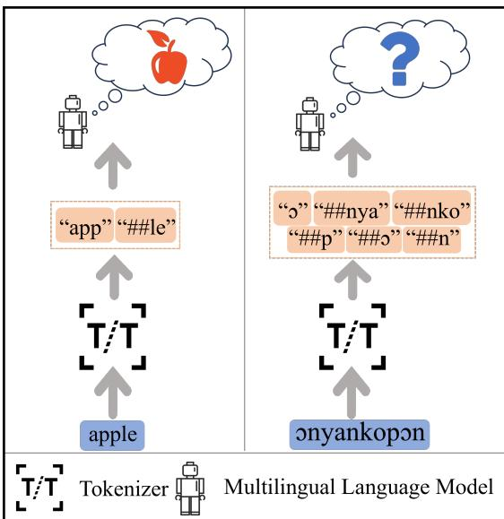  
Figure 1: Illustration of different words in MLMs. The left sub-figure illustrates a word encountered by MLLMs during pre-training, while the right sub-figure depicts a word that MLLMs may not have seen. The word “OnyankopOn” means “God” or “deity” in Akan.

Existing vocabulary augmentation methods (Hong et al., 2021; Nag et al., 2023) often rely on vocabulary frequency to identify and add vulnerable1 words to the dictionary. While these methods are effective to a certain extent, they rely on the assumption that a word’s vulnerability is determined by its frequency distribution after tokenization. However, this assumption is not accurate enough because evaluating a word’s vulnerability should consider its performance not only at the tokenizer level but also at the model level. For instance, as shown in the left of Figure 1, the tokenizer segments “apple” into “app” and “##le”. The word previously encountered by this model can still be accurately interpreted by MLLMs, even after segmentation by the tokenizer. Conversely, in the right of Figure 1, the tokenizer segments “OnyankopOn” into “O”, “##nya”, “##nko”, “##p”, “##O”, and “##n”, resulting in the model’s failure to comprehend the word. The tokenizer segments words into multiple subwords. However, the aggregation of these subwords may lead to an incomplete representation of the semantic meaning of the original word. We consider such word to be vulnerable. The discrepancy between the frequency of this downstream vocabulary and its actual representation in models arises from differences between the pre-training corpus and the downstream corpus. If the downstream vocabulary were fully learned during the pre-training stage, it would not easily become vulnerable. However, we cannot ascertain whether a vocabulary is fully learned based solely on word frequency. Therefore, employing the representation distributions2 of the MLLMs for vocabulary screening can effectively determine whether the vocabulary has been fully learned. This approach facilitates the identification of words that genuinely need to be added to the vocabulary.

To fill this gap, this paper introduces a novel methodology aimed at enhancing the vocabularies of MLLMs, with a particular focus on improving their performance across a spectrum of text classification tasks. We introduce a novel consistency assessment method utilizing semantic space metrics from the perspective of evaluating the disparities between model representation distributions and frequency distributions. Our approach calculates the proportion of category-specific information within a word by assessing its semantic distance from category-defining words. We then derive the word’s semantic-distribution-based entropy from these information ratios within the semantic space. Additionally, we determine the word’s frequency-based entropy in downstream tasks through frequency analysis. We calculate the information disparity between semantic-distribution-based entropy and frequency-based entropy to measure the consistency of these two distributions. After sorting by consistency assessment, we select the words with the lowest consistency score to add to the dictionary for fine-tuning. By refining the process of vocabulary augmentation, we extend the applicability and effectiveness of MLLMs in capturing the nuances of diverse linguistic contexts. The main contributions of this paper are:

(1) We propose a novel consistency assessment method from the perspective of evaluating the disparities between the model representation distributions and the frequency distributions.

(2) Our results suggest a modest improvement in performance, which supports our approach as one potential method to enrich vocabularies inadequately represented in current MLLMs.

(3) Our method enhances the performance of low-resource languages in multilingual tasks.

## 2 Related Work

Continued pre-training, with or without vocabulary augmentation, of existing language models such as mBERT (Devlin et al., 2019) and XLM-R (Conneau and Lample, 2019) enhances domain-specific and language-specific performance across diverse tasks. Beltagy et al. (2019) innovatively trained a language model SciBERT from scratch using a substantial domain-specific corpus. This approach demonstrated that a vocabulary derived from such a corpus significantly enhanced performance. Following this advancement, Lee et al. (2020) and Gururangan et al. (2020) conducted additional training on a pre-trained language model using a large domain-specific corpus, further refining the model prior to fine-tuning. However, these methods are resource-intensive, requiring substantial computational power. Therefore, existing work primarily focuses on the vocabulary augmentation methods, as well as the tokenizer optimization methods and embedding initialization methods.

Tokenizer Optimization. For methods that do not involve vocabulary augmentation, one approach is tokenizer optimization, as explored by Sachidananda et al. (2021); Moon and Okazaki (2020) and Hofmann et al. (2021), bypassed the preliminary step of vocabulary augmentation. For example, Purkayastha et al. (2023) found that using the UROMAN tool for enabling UTF-8 to Latin transliteration enhanced the adaptability of mPLMs to a diverse set of low-resource languages. Hofmann et al. (2022) suggested a straightforward algorithm that tweaked the tokenization process to retain the morphological integrity of words.

Embedding Initialization. Other methods focus on embedding initialization, including those by Ruzzetti et al. (2022) and Yu et al. (2022), which concentrate on addressing the challenges posed by rare or out-of-vocabulary (OOV) words. Liu et al. (2021) introduced an embedding generator module within the pretraining and finetuning pipeline to mitigate vocabulary discrepancies. Perez et al. (2023) addressed the limitations of subword-based models by aligning the word embedding layer of a vocabulary-rigid transformer model to a vocabulary-free one. Downey et al. (2023) explored fine-tuning embedding structures to adapt multilingual vocabularies to new languages, and Dobler and de Melo (2023) introduced a novel embedding initialization method called FO-CUS. Liu et al. (2024); Minixhofer et al. (2022) optimized and initialized word embeddings, enabling models to efficiently adapt to new languages. However, these methods do not fundamentally resolve domain-specific and language-specific challenges in token representation within dictionaries.

Vocabulary Augmentation. Yamaguchi et al. (2024) proposed cross-lingual vocabulary adaptation methods, which adjust and expand vocabularies to adapt models to target languages. Poerner et al. (2020); Sato et al. (2020) and Tai et al. (2020) enriched pre-trained models by incorporating domain-specific vocabulary, thereby tailoring the models more closely to specific domains. Focusing on multilingual tasks, Chung et al. (2020) investigated the creation of multilingual vocabularies from language clusters, contributing to the field’s understanding of linguistic diversity. Most notably, Nag et al. (2023) developed an entropybased language model that enhanced vocabulary.

However, these approaches’ reliance on word frequency for word selection might not have fully accounted for potential representational distortions of selected words within the models, suggesting an important area for further inquiry and refinement.

## 3 Entropy-Consistency Word Selection

## 3.1 Task Definition

In this study, we aim to enrich the multilingual model’s vocabulary by selecting and incorporating suitable words from low-resource languages. Let V represent the original vocabulary of a given multilingual model M, with $\tau$ denoting the associated tokenizer, and |V| indicating the size of the original vocabulary, i.e., the total count of words it comprises. For a particular downstream task, we designate the total count of categories as C, with a specific category represented by c within the set $[ C ] = \{ 1 , \ldots , C \}$ . For the label of the downstream task, we obtain its specific category-defining words set $L = \{ l _ { 1 } , l _ { 2 } , . . . , l _ { C } \}$ . The term “categorydefining words” refers to specific words that are representative of the categories or classes within the dataset. For example, in a sentiment analysis task, category-defining words for the classes might include “positive” for positive sentiments and “negative” for negative sentiments. These words are chosen based on their strong association with the respective class they represent and their ability to encapsulate the essence of the class within the context of the task at hand. The set of words derived from the corpus statistics of downstream tasks, which are not included in the original vocabulary V, is denoted as $V _ { d }$

## 3.2 Overview

As shown in Figure 2, our method includes three steps: semantic-distribution-based entropy calculation (SEC), frequency-based entropy calculation (FEC), consistency calculation and word selection (CCWS). Our method quantifies category-specific information in a word by evaluating its semantic proximity to category-defining terms, thereby calculating the word’s semanticdistribution-based entropy. We also assess the word’s frequency-based entropy in downstream tasks via frequency analysis. By comparing the entropy from semantic distributions and frequency distributions, we assess the alignment between these two distributions. Words with the lowest consistency scores are then chosen for inclusion and fine-tuning in the vocabulary. The pseudocode of ECWS is shown in Appendix A.

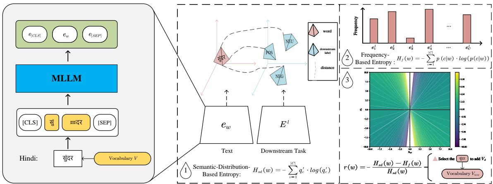  
Figure 2: Overview of ECWS. The Hindi word is tokenized into multiple subwords by vocabulary (V). The subwords generated after tokenization are encoded by the MLLM along with the “[CLS]” and “[SEP]” tokens. The representation of a word, $e _ { w } ,$ is derived from the representations of its corresponding subwords. This representation is then used to calculate the semantic distribution-based entropy in relation to the category-defining words of the downstream task. Simultaneously, the frequency distribution-based entropy of the word is computed. These two entropy values are combined to determine a consistency score, which is used to decide whether to add the word to the dictionary, thereby forming a new dictionary $V _ { n e w }$

Semantic-distribution-based entropy quantifies the semantic proximity of words to categorydefining terms, reflecting their relevance across different linguistic contexts. Frequency-based entropy assesses words’ distribution across categories based on their frequency of occurrence, indicating their empirical utility in the language model. Consistency assessment carefully evaluates the alignment between semantic-distributionbased and frequency-based entropy measures.

## 3.3 Semantic-distribution-based Entropy Calculation

For word w from the vocabulary $V _ { d }$ , we employ the tokenizer T of the model M for tokenization. This process involves breaking down w into subwords that the model can interpret. The semantic distribution of $w$ is assessed by its closeness to category-defining words ${ { l } _ { c } } ,$ indicating its relevance to specific categories in the dataset.

Using tokenizer $\tau$ , w is fragmented into subword sequence ${ \cal S } _ { w } = [ s _ { 1 } , s _ { 2 } , . . . , s _ { T } ]$ , where $T$ is the length of subword sequence $S _ { w }$ . We splice the subword sequence $S _ { w }$ with start and end placeholders as input for the multilingual model:

$$
{ \cal S } _ { w } ^ { ' } = [ C L S ] s _ { 1 } , s _ { 2 } , . . . , s _ { T } [ S E P ] .\tag{1}
$$

We then utilize the multilingual model M for encoding the $S _ { w } ^ { ' }$ and use the first vector from the token vector matrix corresponding to the “[CLS]” token as word w’s primary semantic representation in the multilingual model M. We denote the semantic representation of the word w as $e _ { w }$

For category-defining words pertinent to the downstream task, we apply the same segmentation method. For each category-defining word ${ { l } _ { c } } ,$ the corresponding subword sequence is denoted as $S _ { l _ { c } }$ , which serves as the input $\bar { S } _ { l _ { c } } ^ { ' }$ for the MLLMs. Similarly, the first vector of $S _ { l _ { c } } ^ { ' }$ ’s word vector matrix serves as word ${ l _ { c } } ^ { \mathrm { { ' } } } { \mathrm { s } }$ semantic representation in the multilingual model M. The category-defining word matrix corresponding to the categories of downstream tasks is $E ^ { l } ~ = ~ \{ e _ { 1 } ^ { l } , e _ { 2 } ^ { l } , . . . , e _ { C } ^ { l } \} ~ \in$ $\mathbb { R } ^ { C \times m }$ . For the c-th category-defining word $l _ { c } ,$ its vector is denoted as $e _ { c } ^ { l } ( e _ { c } ^ { l } \in E ^ { l } )$ . We further calculate the distance between word w and the categorydefining word $l _ { c }$ :

$$
q _ { c } = \frac { 1 } { c o s ( e _ { c } ^ { l } , e _ { w } ) } = \frac { | | e _ { c } ^ { l } | | \times | | e _ { w } | | } { e _ { c } ^ { l } \cdot e _ { w } } ,\tag{2}
$$

where $c o s ( \cdot )$ is the cosine similarity of the two vectors, and the distance between the two vectors in the representational distribution is the reciprocal of the cosine similarity. Then the distance among word w and category-defining words set L is $Q$ $\{ q _ { 1 } , q _ { 2 } , . . . q _ { C } \}$ . We further normalize the distance among word w and category-defining words set L. The normalized distance between word w and the c-th category-defining word $l _ { c }$ is:

$$
q _ { c } ^ { ' } = \frac { q _ { c } } { \sum _ { i = 1 } ^ { C } q _ { i } } .\tag{3}
$$

Then the normalized distance among word w and category-defining words set L is $\boldsymbol { Q } ^ { \prime } \ : = \ :$ $\{ q _ { 1 } ^ { ' } , q _ { 2 } ^ { ' } , . . . q _ { C } ^ { ' } \}$ . Based on the calculated spatial distance, we obtain the semantic-distribution-based entropy as:

$$
H _ { s d } ( w ) = - \sum _ { i = 1 } ^ { C } \dot { q _ { c } ^ { ' } } \cdot l o g ( \dot { q _ { c } ^ { ' } } ) .\tag{4}
$$

The calculation of $H _ { s d } ( w )$ involves aggregating these distances to reflect the overall semantic spread of w. A high $H _ { s d } ( w )$ value indicates that the word w is more evenly and broadly distributed among different categories within the representational distribution, suggesting that the fragmentation of w could pose a significant challenge.

## 3.4 Frequency-based Entropy Calculation

In this subsection, we introduce the method for calculating frequency-based entropy $H _ { f } ( w )$ for a given word $w .$ . This measure assesses the word’s distribution across different categories within the dataset based on its frequency of occurrence. In the corpus pertaining to the downstream task, the frequency of the term w within each category c is represented as $n ( w , c )$ . Based on these counts, we define the following multinomial distributions:

$$
p ( c | w ) = \frac { n ( w , c ) } { \sum _ { c ^ { ' } } n ( w , c ^ { ' } ) } .\tag{5}
$$

Based on the above frequency distribution, we obtain the frequency-based entropy as:

$$
H _ { f } ( w ) = - \sum _ { i = 1 } ^ { C } p ( c | w ) \cdot l o g ( p ( c | w ) ) .\tag{6}
$$

A low $H _ { f } ( w )$ value suggests that w could potentially be a highly effective feature for downstream tasks, considering word frequency.

## 3.5 Consistency Calculation and Word Selection

Through the comparison of entropy derived from semantic and frequency distributions, we evaluate the consistency between the model’s representational distributions and its frequency distributions. The goal is to identify words lacking balance in semantic and frequency aspects. A small $H _ { f } ( w )$ and large $H _ { s d } ( w )$ indicate that word w is a discriminative feature in downstream tasks but lacks specificity due to its even distribution across semantic categories. A word with a high $H _ { f } ( w )$ value is considered non-discriminative for the downstream task and can be excluded from the new dictionary. We use the negative of the relative attenuation of semantic-distribution-based entropy and frequencybased entropy as the representation of consistency:

$$
r ( w ) = - \frac { H _ { s d } ( w ) - H _ { f } ( w ) } { H _ { s d } ( w ) } ,\tag{7}
$$

where $r ( w )$ represents the consistency score. The greater the relative attenuation of semanticdistribution-based entropy and frequency-based entropy, the more obvious the difference between this word in semantic space and frequency statistics, indicating a lower overall consistency.

Words with lower consistency scores are deemed more suitable for inclusion in the vocabulary, as they exhibit an imbalanced distribution both semantically and across categories. The word selection process involves ranking words by their consistency scores and incorporating those with the lowest scores into the model’s vocabulary for fine-tuning. We filter out the words with frequency less than k in $V _ { d } ,$ and then select Z words with the lowest consistency score to add to the original dictionary $V$ to form a new dictionary $V _ { n e w }$ . We explore the influence of parameter $Z$ on performance in Appendix B.

## 4 Datasets

We conduct experiments on three single langauge text classification tasks (IITP Product Review, Hate Speech and Headline Prediction) and a Hindi-English code-mixed task (GLUECos Sentiment). Furthermore, we undertake a multilingual text classification task AfriSenti-SemEval. AfriSenti-SemEval is a multilingual sentiment classification challenge in 12 African languages (Hausa, Yoruba, Igbo, Nigerian Pidgin, Amharic, Algerian Arabic, Moroccan Arabic, Swahili, Kinyarwanda, Twi, Mozambican Portuguese, and Xitsonga). Details of all datasets are presented in Table 1. We also list the category-defining words set in each dataset. The detailed fragmentation of datasets is shown in the Appendix C.

<table><tr><td>Tasks</td><td>Language</td><td>Train Validation</td><td></td><td>Test</td><td>Category-defining Words</td></tr><tr><td>IITP Product Review</td><td>Hindi</td><td>4182</td><td>523</td><td>523</td><td>positive, negative, neutral geopoitical hate,</td></tr><tr><td>Hate Speech</td><td>Bengali</td><td>981</td><td>126</td><td>295</td><td>gender abusive hate, religious hate, political hate, personal hate, political normal</td></tr><tr><td>Headline Prediction</td><td>Gujarati</td><td>5269</td><td>659</td><td>659</td><td>technology, business, entertainment</td></tr><tr><td>GLUECos Sentiment Hindi-English Code-mix 10079</td><td></td><td></td><td>1260</td><td>1260</td><td>positive, negative, neutral</td></tr><tr><td>AfriSenti-SemEval</td><td>Multilingual</td><td>63685</td><td>13653</td><td>30311</td><td>positive, negative, neutral</td></tr></table>

Table 1: Dataset distribution and category-defining words set for each task.

## 5 Experiments

## 5.1 Experimental Setups

For our experiment, we select mBERT-base (Devlin et al., 2019) as the main MLLM. Meanwhile, to validate the effectiveness of our method, we additionally adopt XLM-RoBERTa-base (Conneau et al., 2020) as the framework. The detailed results of the experiment using XLM-RoBERTa-base are presented in Appendix D. The models’ weights are initialized using a truncated normal distribution with a standard deviation of 0.02 and biases are set to 0. Experiments maintain a constant learning rate of 2e-5 and a maximum sequence length of 128 tokens. The training process encompasses a total of 15 epochs, utilizing a batch size of 16, and the procedure is conducted on an NVIDIA A100 GPU.

To expedite model convergence during training, we initialize embeddings for newly added LRL words. For the four single-language tasks, we employ the initialization method described by Nag et al. (2023), wherein the embeddings of new LRL words are initialized using existing LRL subwords in the MLLM dictionary and their corresponding English translation subwords. For the AfriSenti-SemEval task, due to the lack of English translation subwords corresponding to the LRL subwords, we only use existing LRL subwords in the MLLM dictionary to initialize the word’s embedding.

## 5.2 Metrics

We evaluate our model on five downstream tasks using accuracy and macro F1 metrics, followed by Nag et al. (2023). We present the average of these metrics over 5 runs, each with a different random seed, to ensure robustness in our findings.

## 5.3 Comparison Methods

We choose four methods as our baselines. Firstly, we compare the method Fine-tune, which directly utilizes LLMs for training. In addition, we primarily compare the method without dictionary augmentation, including the tokenizer optimization method (FLOTA (Hofmann et al., 2022)) and the embeddings initialization method (FOCUS (Dobler and de Melo, 2023)). Finally, we compare the method focused on dictionary augmentation method (EVALM (Nag et al., 2023)). A detailed description of the comparison method can be obtained from Appendix E.

<table><tr><td>Method</td><td>Macro F1</td><td>Accuracy</td></tr><tr><td colspan="3">Hate Speech (Bengali)</td></tr><tr><td>Fine-tune</td><td>63.58(±0.74)</td><td>63.12(±1.21)</td></tr><tr><td>FLOTA</td><td>66.54(±2.49)</td><td>65.98(±2.21)</td></tr><tr><td>EVALM</td><td>67.20(±0.62)</td><td>67.00(±0.75)</td></tr><tr><td>FOCUS</td><td>63.48(±1.00)</td><td>65.52(±0.81)</td></tr><tr><td>ECWS</td><td>68.16(±0.90)</td><td>68.10(±0.87)</td></tr><tr><td colspan="3">IITP Product Review</td></tr><tr><td>Fine-tune</td><td>71.58(±0.50)</td><td>(Hindi) 74.52(±0.55)</td></tr><tr><td>FLOTA</td><td>71.72(±0.82)</td><td>74.88(±0.67)</td></tr><tr><td>EVALM</td><td>71.88(±0.55)</td><td>74.60(±0.36)</td></tr><tr><td>FOCUS</td><td>65.54(±0.78)</td><td>69.94(±0.65)</td></tr><tr><td>ECWS</td><td>72.28(±0.44)</td><td>75.38(±0.39)</td></tr><tr><td colspan="3">GLUECoS (Hindi-English Code-mix)</td></tr><tr><td>Fine-tune</td><td>58.32(±0.34)</td><td>59.96(±0.32)</td></tr><tr><td>FLOTA</td><td>58.34(±0.43)</td><td>59.92(±0.36)</td></tr><tr><td>EVALM</td><td>59.34(±0.48)</td><td>60.72(±0.72)</td></tr><tr><td>FOCUS</td><td>55.28(±0.63)</td><td>56.20(±0.65)</td></tr><tr><td>ECWS</td><td>60.02(±0.45)</td><td>61.20(±0.51)</td></tr><tr><td colspan="3">Headline Prediction ( (Gujarati)</td></tr><tr><td>Fine-tune</td><td>88.34(±0.55)</td><td>89.98(±0.45)</td></tr><tr><td>FLOTA</td><td>84.72(±0.67)</td><td>86.40(±0.68)</td></tr><tr><td>EVALM</td><td>88.64(±0.32)</td><td>90.42(±0.26)</td></tr><tr><td>FOCUS</td><td>82.80(±0.56)</td><td>84.84(±0.41)</td></tr><tr><td>ECWS</td><td>89.04(±0.27)</td><td>90.74(±0.26)</td></tr><tr><td colspan="3">AfriSenti-SemEval (Multilingual)</td></tr><tr><td>Fine-tune</td><td>59.82(±0.56)</td><td>59.92(±0.55)</td></tr><tr><td>FLOTA</td><td>60.78(±0.21)</td><td>60.78(±0.23)</td></tr><tr><td>EVALM</td><td>61.48(±0.40)</td><td>61.58(±0.39)</td></tr><tr><td>FOCUS</td><td>62.14(±0.35)</td><td>62.14(±0.35)</td></tr><tr><td>ECWS</td><td>61.88(±0.50)</td><td>62.00(±0.50)</td></tr><tr><td colspan="3">Average</td></tr><tr><td>Fine-tune</td><td>68.33(±0.54)</td><td>69.50(±0.62)</td></tr><tr><td>FLOTA</td><td>68.42(±0.93)</td><td>69.59(±0.83)</td></tr><tr><td>EVALM</td><td>69.71(±0.48)</td><td>70.86(±0.50)</td></tr><tr><td>FOCUS</td><td>65.87(±0.66)</td><td>67.67(±0.57)</td></tr><tr><td>ECWS</td><td>70.28(±0.51)</td><td>71.48(±0.51)</td></tr></table>

Table 2: Main results. Experimental results are five runs averages, with standard errors shown in brackets.

## 5.4 Main Results

As demonstrated in Table 2, we conduct a comparative analysis of the ECWS against four baseline methods and our findings indicate that ECWS outperformed all baselines, achieving the SOTA.

Specifically, in the Hate Speech (Bengali) task, ECWS attains macro F1 score and accuracy of 68.16 and 68.10, respectively, outshining other models, and notably improving accuracy by 1.10 over the second-ranked EVALM. In the IITP Product Review (Hindi) task, ECWS reaffirms its superiority with macro F1 score and accuracy of 72.28 and 75.38. For the GLUECoS (Hindi-English Code-mix) task, ECWS leads with scores of 60.02 for macro F1 and 61.20 for accuracy, marking improvements of 0.68 and 0.48 points over EVALM, respectively. Although gains are modest in the Headline Prediction (Gujarati) task, ECWS still achieves top scores with macro F1 and accuracy of 89.04 and 90.74. It is noteworthy that FOCUS performs the worst in the first four tasks. We speculate that this may be because FOCUS requires a substantial external corpus to train a static word vector. For fairness in our comparisons, we meticulously train static word vectors solely using the training sets of the downstream tasks, without utilizing any external corpus. The scale of the training corpus for static word vectors significantly affects FOCUS’s performance in the first four tasks, leading to its poor performance.

Lastly, in the AfriSenti-SemEval (Multilingual) task, which involved a substantial training dataset, FOCUS achieves the best performance, with a macro F1 score of 62.14 and an accuracy score of 62.14. This aligns with our earlier speculation that FOCUS’s performance is heavily influenced by the volume of training data. ECWS ranks second, with a score of 61.88 for macro F1 and a score of 62.00 for accuracy. Aggregating performances across all five tasks, ECWS surpasses other methods in average macro F1 score and accuracy, enhancing by 0.57 and 0.62 points respectively when compared to the second-best method, EVALM. We further compare the performance of different methods on various languages in the AfriSenti-SemEval (Multilingual) task. The experimental results are presented in Appendix F.

In terms of standard errors, our method is slightly higher than the second-ranked EVALM, the overall performance remains the best. Specifically, in the Headline Prediction (Gujarati) task, our method achieved the lowest standard errors, with ±0.27 for macro F1 and ±0.26 for accuracy, highlighting the model’s stability.

<table><tr><td>Method</td><td>Macro F1</td><td>Accuracy</td></tr><tr><td colspan="3">Hate Speech (Bengali)</td></tr><tr><td>ECWS</td><td>68.16</td><td>68.10</td></tr><tr><td>w/o SEC w/o FEC</td><td>67.12 67.60</td><td>66.88 67.54</td></tr><tr><td></td><td>IITP Product Review (Hindi)</td><td></td></tr><tr><td colspan="3"></td></tr><tr><td>ECWS</td><td>72.28</td><td>75.38</td></tr><tr><td>w/o SEC</td><td>71.10</td><td>74.42</td></tr><tr><td>w/o FEC</td><td>71.08</td><td>74.10</td></tr><tr><td colspan="3">GLUECoS (Hindi-English Code-mix)</td></tr><tr><td>ECWS</td><td>60.02</td><td>61.20</td></tr><tr><td>w/o SEC</td><td>59.04</td><td>60.36</td></tr><tr><td>w/o FEC</td><td>59.20</td><td>60.74</td></tr><tr><td></td><td></td><td></td></tr><tr><td colspan="3">Headline prediction (Gujarati)</td></tr><tr><td>ECWS</td><td>89.04</td><td>90.74</td></tr><tr><td>w/o SEC</td><td>88.42</td><td>90.10</td></tr><tr><td>w/o FEC</td><td>88.74</td><td>90.48</td></tr><tr><td>AfriSenti-SemEval (Multilingual)</td><td></td><td></td></tr><tr><td colspan="3">ECWS</td></tr><tr><td></td><td>61.88</td><td>62.00</td></tr><tr><td>w/o SEC</td><td>61.70</td><td>61.78</td></tr><tr><td>w/o FEC</td><td>61.66</td><td>61.82</td></tr><tr><td colspan="3">Average</td></tr><tr><td>ECWS</td><td>70.28</td><td>71.48</td></tr><tr><td>w/o SEC</td><td>69.48</td><td>70.71</td></tr><tr><td>w/o FEC</td><td>69.66</td><td>70.94</td></tr></table>

Table 3: Results of ablation experiments. “SEC” and “FEC” denote semantic-distribution-based and frequency-based entropy calculations, respectively.

Overall, our method not only effectively improves performance but also maintains low standard errors, demonstrating its reliability and stability across different tasks.

## 5.5 Ablation Experiment

We conduct ablation experiments for our method, and the experimental results are shown in Table 3. In ablation experiments, we use only the FEC or the SEC to select the vocabulary. For the Hate Speech (Bengali) task and the IITP Product Review (Hindi), we see a decrease in both Macro F1 and accuracy when either SEC or FEC is removed, indicating that both components contribute positively to the model’s performance. Within the GLUECoS (Hindi-English Code-mix) task and the Headline prediction (Gujarati) task, removing SEC or FEC leads to a decrease in performance across both metrics, with a more notable decrease when SEC is removed. The AfriSenti-SemEval (Multilingual) task sees a decrease in performance when either component is removed, with the removal of SEC again showing a more substantial impact than the removal of FEC. Lastly, the average performance across all tasks shows that both components con-

tribute to the effectiveness of the model, with SEC appearing to be slightly more important overall.
<table><tr><td>Method</td><td>Macro F1</td><td>Accuracy</td></tr><tr><td colspan="3">Hate Speech (Bengali)</td></tr><tr><td>EVALM + FLOTA</td><td>67.20(±0.62) 67.24(±1.09)</td><td>67.00(±0.75) 66.80(±1.12)</td></tr><tr><td>+ FOCUS ECWS</td><td>66.66(±0.36) 68.16(±0.90)</td><td>67.00(±0.61) 68.10(±0.87)</td></tr><tr><td>+ FLOTA + FOCUS</td><td>66.96(±1.23)</td><td>67.42(±1.12) 66.46(±0.51)</td></tr><tr><td></td><td>66.70(±0.38) IITP Product Review</td><td>(Hindi)</td></tr><tr><td>EVALM</td><td>71.88(±0.55)</td><td>74.60(±0.36)</td></tr><tr><td>+ FLOTA</td><td>72.42(±0.58)</td><td>75.08(±0.31)</td></tr><tr><td>+ FOCUS</td><td></td><td>73.20(±0.51)</td></tr><tr><td>ECWS</td><td>69.98(±0.38)</td><td></td></tr><tr><td>+ FLOTA</td><td>72.28(±0.44)</td><td>75.38(±0.39)</td></tr><tr><td>+ FOCUS</td><td>72.54(±0.75)</td><td>75.82(±0.74)</td></tr><tr><td>GLUECoS (Hindi-English Code-mix)</td><td>71.18(±0.81)</td><td>74.28(±0.44)</td></tr><tr><td>EVALM</td><td></td><td></td></tr><tr><td>+ FLOTA</td><td>59.34(±0.48)</td><td>60.72(±0.72)</td></tr><tr><td></td><td>59.94(±0.51)</td><td>60.26(±0.60)</td></tr><tr><td>+ FOCUS</td><td>58.52(±0.67)</td><td>59.94(±0.63)</td></tr><tr><td>ECWS</td><td>60.02(±0.45)</td><td>61.20(±0.51)</td></tr><tr><td>+ FLOTA</td><td></td><td>60.58(±0.74)</td></tr><tr><td>+ FOCUS</td><td>59.30(±0.41)</td><td>59.52(±0.69)</td></tr><tr><td>Headline Prediction</td><td>58.56(±0.62)</td><td></td></tr><tr><td>EVALM</td><td></td><td>(Gujarati)</td></tr><tr><td>+ FLOTA</td><td>88.64(±0.32)</td><td>90.42(±0.26)</td></tr><tr><td>+FOCUS</td><td>88.54(±0.37)</td><td>89.48(±0.24)</td></tr><tr><td>ECWS</td><td>88.54(±0.26)</td><td>90.16(±0.17)</td></tr><tr><td>+ FLOTA</td><td>89.04(±0.27)</td><td>90.74(±0.26)</td></tr><tr><td></td><td>89.04(±0.41)</td><td>90.78(±0.33)</td></tr><tr><td>+ FOCUS</td><td>88.12(±0.20)</td><td>89.88(±0.20)</td></tr><tr><td></td><td>AfriSenti-SemEval (Multilingual)</td><td></td></tr><tr><td>EVALM + FLOTA</td><td>61.48(±0.40)</td><td>61.58(±0.39)</td></tr><tr><td>+FOCUS</td><td>62.34(±0.28)</td><td>62.40(±0.30)</td></tr><tr><td>ECWS</td><td>63.58(±0.15)</td><td>63.58(±0.15)</td></tr><tr><td></td><td>61.88(±0.50)</td><td>62.00(±0.50)</td></tr><tr><td>+ FLOTA</td><td>62.30(±0.23)</td><td>62.44(±0.21)</td></tr><tr><td>+ FOCUS</td><td>64.50(±0.15)</td><td>64.50(±0.16)</td></tr><tr><td>EVALM</td><td>Average</td><td></td></tr><tr><td>+ FLOTA</td><td>69.71(±0.48)</td><td>70.86(±0.50)</td></tr><tr><td></td><td>70.10(±0.57)</td><td>70.80(±0.53)</td></tr><tr><td>+FOCUS</td><td>69.46(±0.36)</td><td>70.78(±0.41)</td></tr><tr><td>ECWS</td><td>70.28(±0.51)</td><td>71.48(±0.51)</td></tr><tr><td>+ FLOTA</td><td></td><td></td></tr><tr><td>+ FOCUS</td><td>70.03(±0.61) 69.81(±0.43)</td><td>71.41(±0.54) 70.93(±0.40)</td></tr></table>

Table 4: Results of Combined Methods. The “+” sign indicates the combination of two methods.

## 5.6 Result of Combined Methods

We further delve into the integration of vocabulary augmentation techniques with tokenizer optimization and embedding initialization. We examine if combining these strategies could yield a more significant impact. As depicted in Table 4, we utilize EVALM and ECWS as baselines and integrated them with FLOTA and FOCUS respectively.

Specifically, in the Hate Speech (Bengali) task, only EVALM + FLOTA shows a slight improvement in macro F1 score, increasing by 0.04. In the IITP Product Review (Hindi) task, both EVALM and ECWS experience enhancements when integrated with FLOTA. In the GLUECoS (Hindi-English Code-mix) task, the EVALM + FLOTA combination shows an improvement of 0.60 in macro F1, though it is accompanied by a decline in accuracy by 0.46. For the Headline Prediction (Gujarati) task, only the ECWS + FLOTA exhibits a minor increase in accuracy, by 0.04. It is noteworthy that, consistent with the main results, the integration of FOCUS with EVALM and ECWS does not enhance performance in the first four tasks. This corroborates our hypothesis that the smaller training corpus in these tasks adversely affects the model’s static word vectors when combined with FOCUS, leading to poor performance.

Lastly, in the AfriSenti-SemEval (Multilingual) task, where the training datasets are larger, both EVALM and ECWS achieve their best performance following the integration with FOCUS. Specifically, for EVALM, the combination with FLOTA results in improvements of 0.86 and 0.82 in macro F1 and accuracy, respectively. The integration with FOCUS boosts the macro F1 and accuracy by 1.24 and 1.18, respectively. For ECWS, the integration with FLOTA improves the macro F1 and accuracy by 0.42 and 0.44, respectively. Furthermore, the addition of FOCUS dramatically increases these metrics by 2.62 and 2.50, respectively.

In summary, while the baseline methods generally exhibit superior performance across the five different tasks, the results of the AfriSenti-SemEval (Multilingual) task highlight that combining vocabulary enhancement strategies with methods that do not augment the vocabulary has advantages in certain scenarios.

## 6 Conclusion

In this study, we focus on the vocabulary augmentation of MLLMs by incorporating relevant words from low-resource languages using the proposed ECWS method, which combines semantic and frequency metrics. Across all tasks, ECWS achieves an average macro F1 score of 70.28 and an accuracy of 71.48, marking it as an effective method for vocabulary augmentation in low-resource language settings. The results of ECWS illustrate the usefulness of semantic and frequency metrics in vocabulary selection, contributing to advancements in the field. This research supports the efficacy of the ECWS approach and suggests its potential to improve the capabilities of multilingual models, especially for low-resource languages.

## Acknowledgments

This work was supported by the National Natural Science Foundation of China (No. 62376062), the Ministry of Education of Humanities and Social Science Project (No. 23YJAZH220, No. 24YJAZH244), the Philosophy and Social Sciences 14th Five-Year Plan Project of Guangdong Province (No. GD23CTS03, No. GD21CTS02), and the Guangdong Basic and Applied Basic Research Foundation of China (No. 2023A1515012718).

## Limitations

Our framework has proven effective, yet its limitations should be recognized for accurate evaluation and interpretation. Our study is limited to encoderbased models, excluding large-scale language models. Additionally, we only use the semantic representation of the explicit category-defining words of the category as the semantic representation of the category, which is biased to a certain extent.

## Ethics Statement

The datasets and pre-trained language models employed in our study are sourced from open-access repositories, ensuring compliance with all relevant ethical standards and authorizations. We adhere rigorously to established research ethics throughout our work. As for the AI assistant, we utilize ChatGPT to identify textual errors and polish paper.

## References

Iz Beltagy, Kyle Lo, and Arman Cohan. 2019. SciB-ERT: A pretrained language model for scientific text. In Proceedings of the 2019 Conference on Empirical Methods in Natural Language Processing and the 9th International Joint Conference on Natural Language Processing (EMNLP-IJCNLP), pages 3615–3620, Hong Kong, China. Association for Computational Linguistics.

Jeffrey Bosboom, Charlotte Chen, Lily Chung, Spencer Compton, Michael Coulombe, Erik D. Demaine, Martin L. Demaine, Ivan Tadeu Ferreira Antunes Filho, Dylan Hendrickson, Adam Hesterberg, Calvin Hsu, William Hu, Oliver Korten, Zhezheng Luo, and Lillian Zhang. 2020. Edge matching with inequalities, triangles, unknown shape, and two players. Journal of Information Processing, 28:987–1007.

Hyung Won Chung, Dan Garrette, Kiat Chuan Tan, and Jason Riesa. 2020. Improving multilingual models with language-clustered vocabularies. In Proceedings of the 2020 Conference on Empirical

Methods in Natural Language Processing (EMNLP), pages 4536–4546, Online. Association for Computational Linguistics.

Alexis Conneau, Kartikay Khandelwal, Naman Goyal, Vishrav Chaudhary, Guillaume Wenzek, Francisco Guzmán, Edouard Grave, Myle Ott, Luke Zettlemoyer, and Veselin Stoyanov. 2020. Unsupervised cross-lingual representation learning at scale. In Proceedings of the 58th Annual Meeting of the Association for Computational Linguistics, pages 8440–8451, Online. Association for Computational Linguistics.

Alexis Conneau and Guillaume Lample. 2019. Cross-lingual language model pretraining. Curran Associates Inc., Red Hook, NY, USA.

Jacob Devlin, Ming-Wei Chang, Kenton Lee, and Kristina Toutanova. 2019. BERT: Pre-training of deep bidirectional transformers for language understanding. In Proceedings of the 2019 Conference of the North American Chapter of the Association for Computational Linguistics: Human Language Technologies, Volume 1 (Long and Short Papers), pages 4171–4186, Minneapolis, Minnesota. Association for Computational Linguistics.

Konstantin Dobler and Gerard de Melo. 2023. FO-CUS: Effective embedding initialization for monolingual specialization of multilingual models. In Proceedings of the 2023 Conference on Empirical Methods in Natural Language Processing, pages 13440–13454, Singapore. Association for Computational Linguistics.

C.m. Downey, Terra Blevins, Nora Goldfine, and Shane Steinert-Threlkeld. 2023. Embedding structure matters: Comparing methods to adapt multilingual vocabularies to new languages. In Proceedings of the 3rd Workshop on Multi-lingual Representation Learning (MRL), pages 268–281, Singapore. Association for Computational Linguistics.

Yingwen Fu, Nankai Lin, Xiaohui Yu, and Shengyi Jiang. 2023. Self-training with double selectors for low-resource named entity recognition. IEEE/ACM Transactions on Audio, Speech, and Language Processing, 31:1265–1275.

Suchin Gururangan, Ana Marasovic, Swabha´ Swayamdipta, Kyle Lo, Iz Beltagy, Doug Downey, and Noah A. Smith. 2020. Don’t stop pretraining: Adapt language models to domains and tasks. In Proceedings of the 58th Annual Meeting of the Association for Computational Linguistics, pages 8342–8360, Online. Association for Computational Linguistics.

Valentin Hofmann, Janet Pierrehumbert, and Hinrich Schütze. 2021. Superbizarre is not superb: Derivational morphology improves BERT’s interpretation of complex words. In Proceedings of the 59th Annual Meeting of the Association for Computational Linguistics and the 11th

International Joint Conference on Natural Language Processing (Volume 1: Long Papers), pages 3594– 3608, Online. Association for Computational Linguistics.

Valentin Hofmann, Hinrich Schuetze, and Janet Pierrehumbert. 2022. An embarrassingly simple method to mitigate undesirable properties of pretrained language model tokenizers. In Proceedings of the 60th Annual Meeting of the Association for Computational Linguistics (Volume 2: Short Papers), pages 385–393, Dublin, Ireland. Association for Computational Linguistics.

Jimin Hong, TaeHee Kim, Hyesu Lim, and Jaegul Choo. 2021. AVocaDo: Strategy for adapting vocabulary to downstream domain. In Proceedings of the 2021 Conference on Empirical Methods in Natural Language Processing, pages 4692–4700, Online and Punta Cana, Dominican Republic. Association for Computational Linguistics.

Jinhyuk Lee, Wonjin Yoon, Sungdong Kim, Donghyeon Kim, Sunkyu Kim, Chan Ho So, and Jaewoo Kang. 2020. Biobert: a pre-trained biomedical language representation model for biomedical text mining. Bioinformatics, 36(4):1234–1240.

Xin Liu, Baosong Yang, Dayiheng Liu, Haibo Zhang, Weihua Luo, Min Zhang, Haiying Zhang, and Jinsong Su. 2021. Bridging subword gaps in pretrainfinetune paradigm for natural language generation. In Proceedings of the 59th Annual Meeting of the Association for Computational Linguistics and the 11th International Joint Conference on Natural Language Processing (Volume 1: Long Papers), pages 6001–6011, Online. Association for Computational Linguistics.

Yihong Liu, Peiqin Lin, Mingyang Wang, and Hinrich Schuetze. 2024. OFA: A framework of initializing unseen subword embeddings for efficient largescale multilingual continued pretraining. In Findings of the Association for Computational Linguistics: NAACL 2024, pages 1067–1097, Mexico City, Mexico. Association for Computational Linguistics.

Benjamin Minixhofer, Fabian Paischer, and Navid Rekabsaz. 2022. WECHSEL: Effective initialization of subword embeddings for cross-lingual transfer of monolingual language models. In Proceedings of the 2022 Conference of the North American Chapter of the Association for Computational Linguistics: Human Language Technologies, pages 3992–4006, Seattle, United States. Association for Computational Linguistics.

Sangwhan Moon and Naoaki Okazaki. 2020. Patch-BERT: Just-in-time, out-of-vocabulary patching. In Proceedings of the 2020 Conference on Empirical Methods in Natural Language Processing (EMNLP), pages 7846–7852, Online. Association for Computational Linguistics.

Arijit Nag, Bidisha Samanta, Animesh Mukherjee, Niloy Ganguly, and Soumen Chakrabarti. 2023.

Entropy-guided vocabulary augmentation of multilingual language models for low-resource tasks. In Findings of the Association for Computational Linguistics: ACL 2023, pages 8619–8629, Toronto, Canada. Association for Computational Linguistics.

Alejandro Rodriguez Perez, Korn Sooksatra, Pablo Rivas, Ernesto Quevedo Caballero, Javier S. Turek, Gisela Bichler, Tomas Cerny, Laurie Giddens, and Stacie Petter. 2023. An empirical analysis towards replacing vocabulary-rigid embeddings by a vocabulary-free mechanism. In LatinX in AI Workshop at ICML 2023 (Regular Deadline).

Nina Poerner, Ulli Waltinger, and Hinrich Schütze. 2020. Inexpensive domain adaptation of pretrained language models: Case studies on biomedical NER and covid-19 QA. In Findings of the Association for Computational Linguistics: EMNLP 2020, pages 1482–1490, Online. Association for Computational Linguistics.

Sukannya Purkayastha, Sebastian Ruder, Jonas Pfeiffer, Iryna Gurevych, and Ivan Vulic. 2023.´ Romanization-based large-scale adaptation of multilingual language models. In Findings of the Association for Computational Linguistics: EMNLP 2023, pages 7996–8005, Singapore. Association for Computational Linguistics.

Elena Sofia Ruzzetti, Leonardo Ranaldi, Michele Mastromattei, Francesca Fallucchi, Noemi Scarpato, and Fabio Massimo Zanzotto. 2022. Lacking the embedding of a word? look it up into a traditional dictionary. In Findings of the Association for Computational Linguistics: ACL 2022, pages 2651–2662, Dublin, Ireland. Association for Computational Linguistics.

Vin Sachidananda, Jason Kessler, and Yi-An Lai. 2021. Efficient domain adaptation of language models via adaptive tokenization. In Proceedings of the Second Workshop on Simple and Efficient Natural Language Processing, pages 155–165, Virtual. Association for Computational Linguistics.

Shoetsu Sato, Jin Sakuma, Naoki Yoshinaga, Masashi Toyoda, and Masaru Kitsuregawa. 2020. Vocabulary adaptation for domain adaptation in neural machine translation. In Findings of the Association for Computational Linguistics: EMNLP 2020, pages 4269–4279, Online. Association for Computational Linguistics.

Wen Tai, H. T. Kung, Xin Dong, Marcus Comiter, and Chang-Fu Kuo. 2020. exBERT: Extending pretrained models with domain-specific vocabulary under constrained training resources. In Findings of the Association for Computational Linguistics: EMNLP 2020, pages 1433–1439, Online. Association for Computational Linguistics.

Atsuki Yamaguchi, Aline Villavicencio, and Nikolaos Aletras. 2024. An empirical study on cross-lingual vocabulary adaptation for efficient generative llm inference. arXiv preprint arXiv:2402.10712.

Wenhao Yu, Chenguang Zhu, Yuwei Fang, Donghan Yu, Shuohang Wang, Yichong Xu, Michael Zeng, and Meng Jiang. 2022. Dict-BERT: Enhancing language model pre-training with dictionary. In Findings of the Association for Computational Linguistics: ACL 2022, pages 1907–1918, Dublin, Ireland. Association for Computational Linguistics.

## A Pseudocode of Our Proposed Method

The pseudocode of the implementation process of our proposed method ECWS is shown in Algorithm 1.

Algorithm 1 LRL vocabulary selection in ECWS   
1: Input:   
2: Pretrained vocabulary $V$   
3: C-class LRL downstream task’s corpus D   
4: MLLM’s tokenizer $\tau$   
5: Word frequency threshold k   
6: Number of new words to add to the dictio  
nary $Z$   
7: Category-defining word matrix $\begin{array} { r l } { E ^ { l } } & { { } = } \end{array}$   
$\{ e _ { 1 } ^ { l } , e _ { 2 } ^ { l } , . . . , e _ { C } ^ { l } \}$   
8: Output: ECWS vocabulary $V _ { \mathrm { n e w } } .$   
9: $V _ { d } \gets$ all words from D but not included in V   
10: $\gamma ~ $ Corresponding consistency threshold   
when adding $Z$ words   
11: Initialize hyperparameters $k .$   
12: for each LRL word $w \in V _ { d }$ do   
13: $n ( w ) $ Frequency of the word w in cor  
pus D   
14: if $n ( w ) >$ k then   
15: for each category-defining word $l _ { c } \in$   
$E ^ { l }$ do   
16: compute distance $\begin{array} { r } { q _ { c } = \frac { | | e _ { c } ^ { l } | | \times | | e _ { w } | | } { e _ { \bar { \mathbf { \Theta } } } ^ { l } \cdot e _ { w } } } \end{array}$   
17: normalize distance $\begin{array} { r } { q _ { c } ^ { ' } = \frac { q _ { c } } { \sum _ { i = 1 } ^ { C } q _ { i } } } \end{array}$   
18: end for   
19: compute $\begin{array} { r c l } { { H _ { s d } ( w ) } } & { { = } } & { { - \sum _ { i = 1 } ^ { C } q _ { c } ^ { ' } } } \end{array}$   
${ l o g ( q _ { c } ^ { ' } ) }$   
20: compute $\begin{array} { r } { H _ { f } ( w ) = - \sum _ { i = 1 } ^ { C } p ( c | w ) } \end{array}$   
$l o g ( p ( c | w ) )$   
21: compute $\begin{array} { r } { r ( w ) = - \frac { H _ { s d } ( w ) - H _ { f } ( w ) } { H _ { s d } ( w ) } } \end{array}$   
22: $\mathbf { i f } \ r ( w ) < \gamma$ then   
23: $V _ { n e w } = V \cup \{ w \}$   
24: end if   
25: end if   
26: end for   
27: return $V _ { n e w }$

## B Impact of the Scale of the Dictionary

In our investigation, we also explore the impact of the scale of the dictionary. As illustrated in Figure 3 and Figure 4, we plot the correlation between macro F1 scores and accuracy scores against the extent of vocabulary augmentation across five tasks, ensuring vocabulary augmentation is comparable in size. Yellow, blue, red, and green lines respectively represent the performance of FLOTA, Fine-tune, EVALM, and our method, with the corresponding colored bands showing standard deviation spreads.

For the Fine-tune, FLOTA and FOCUS, as they do not change the dictionary, the model performance remains unaffected on scale of the dictionary. For EVALM and our method, we anticipate that with the increase in the dictionary, performance exhibits a monotonically increasing trend. However, this trend is not universally applicable to EVALM.

Specifically, as shown in Figure 3, we observe that EVALM does not exhibit a positive correlation between the macro F1 scores and dictionary expansion, particularly in the IITP Product Review task, GLUECoS task, and AfriSenti-SemEval task, suggesting that the words EVALM identifies for inclusion in the dictionary are not always directly relevant to the downstream tasks, which can partly explain its variable performance. In contrast, our method demonstrates the anticipated consistent effect across all tasks. Specifically, across all tasks, the performance of our method consistently shows a linear increase, exhibiting a positive correlation. It surpasses other methods upon reaching a certain threshold, achieving SOTA performance. This indicates that the words identified and added to the dictionary through our method are always directly relevant to the downstream tasks.

Similarly, in Figure 4, EVALM’s accuracy metric does not show a positive correlation with the dictionary expansion, further confirming its performance instability. In contrast, our method consistently demonstrates a positive correlation with dictionary expansion throughout the process and surpasses the performance of other methods upon exceeding a specific threshold, once again achieving SOTA status. This outcome emphasizes the effectiveness of our approach in precisely identifying words directly relevant to downstream tasks and significantly enhancing model performance through the dictionary augmentation strategy, thereby consistently improving the Accuracy metric across multiple tasks.

## C Fragmentation of Each Dataset

The datasets chosen for this study are diverse in nature. The fragmentation of each dataset is shown in the Table 5. The values in the table represent the Word/Subword Ratio, which serves as an indicator of vocabulary fragmentation. To elaborate, these ratios are calculated by dividing the count of unique words by the count of total subwords in each dataset. A lower ratio implies higher fragmentation, meaning that the default vocabulary does not adequately represent the text, resulting in a higher number of subwords per word. In our experiments, we aim to highlight how fragmentation affects the model’s performance. Fragmentation is particularly severe in datasets with a high incidence of out-of-vocabulary words when using the default vocabulary set. For example, in the Hate Speech dataset in Bengali, the lower ratio signifies that a significant portion of words are split into smaller subwords, indicating a substantial vocabulary mismatch.

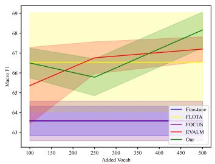  
(a)

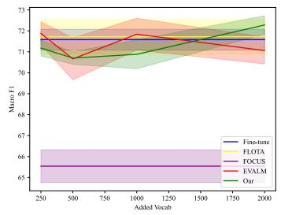  
(b)

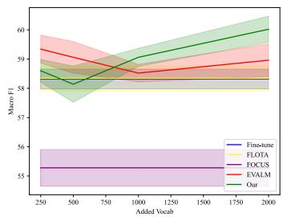  
(c)

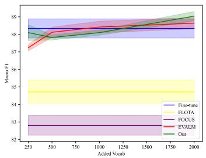  
(d)

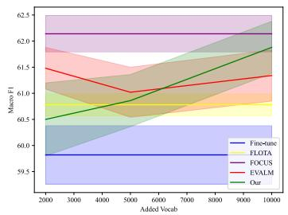  
(e)  
Figure 3: Macro F1 vs. increasing low-resource language words added to MLLM dictionary. Figures (a) to (e) correspond to the tasks Hate Speech (Bengali), IITP Product Review (Hindi), Headline Prediction (Gujarati), GLUECos Sentiment (Hindi-English Code-mix) and AfriSenti-SemEval (Multilingual) respectively.

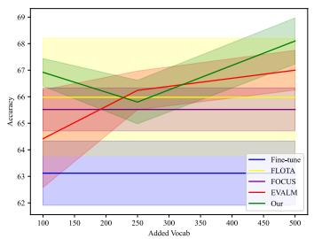  
(a)

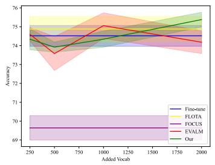  
(b)

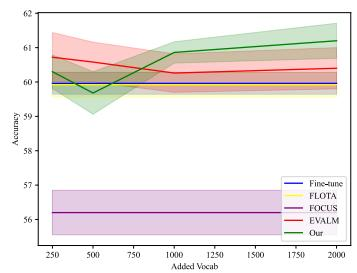  
(c)

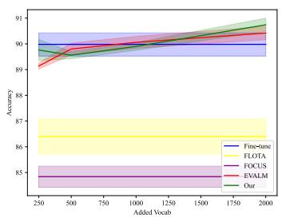  
(d)

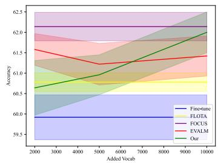  
(e)  
Figure 4: Accuracy vs. increasing low-resource language words added to MLLM dictionary. Figures (a) to (e) correspond to the tasks Hate Speech (Bengali), IITP Product Review (Hindi), Headline Prediction (Gujarati), GLUECos Sentiment (Hindi-English Code-mix) and AfriSenti-SemEval (Multilingual) respectively.

<table><tr><td>Tasks</td><td>Train</td><td>Validation</td><td>Test</td></tr><tr><td>IITP Product Review</td><td>0.50</td><td>0.49</td><td>0.50</td></tr><tr><td>Hate Speech</td><td>0.36</td><td>0.37</td><td>0.37</td></tr><tr><td>Headline Prediction</td><td>0.29</td><td>0.29</td><td>0.29</td></tr><tr><td>GLUECos Sentiment</td><td>0.59</td><td>0.60</td><td>0.60</td></tr><tr><td>AfriSenti-SemEval</td><td>0.48</td><td>0.46</td><td>0.53</td></tr></table>

Table 5: The fragmentation statistics of each dataset.

<table><tr><td>Method</td><td>Macro F1 Accuracy</td></tr><tr><td>Hate Speech (Bengali) Fine-tune 70.34 69.52</td></tr><tr><td>EVALM 70.90 69.90</td></tr><tr><td>ECWS 71.24</td></tr><tr><td>70.48 IITP Product Review (Hindi)</td></tr><tr><td>Fine-tune 77.28 79.32</td></tr><tr><td></td></tr><tr><td>EVALM 77.48 79.72 ECWS 78.20 80.46</td></tr></table>

Table 6: Results of the XLM-RoBERTa-base model.

## D Performance of Different Multilingual Language Models

We extend our experiments to include the XLM-RoBERTa-base (Conneau et al., 2020) model to further validate the generalizability of our approach. We conduct experiments on two datasets: the Hate Speech (Bengali) dataset and the IITP Product Review (Hindi) dataset. The experimental setup for the XLM-RoBERTa followed the same protocol as our initial experiments with mBERT. As shown in Table 6, the improved performance metrics on both the Hate Speech (Bengali) and IITP Product Review (Hindi) datasets underscore the versatility of our approach. These findings suggest that our method is not only effective for mBERT but also enhances other MLLMs like XLM-RoBERTa.

## E Comparison Methods

We choose four methods as our baselines. Firstly, we compare the method Fine-tune, which directly utilizes LLMs for training. In addition, we primarily compare the method without dictionary augmentation, including the tokenizer optimization method (FLOTA (Hofmann et al., 2022)) and the embeddings initialization method (FOCUS (Dobler and de Melo, 2023)). Finally, we compare the method focused on dictionary augmentation method (EVALM (Nag et al., 2023)).

Fine-tune: Compared to other baselines, Finetune adopts a more refined and direct approach. Rather than expanding the model’s linguistic comprehension by incorporating additional vocabulary into the dictionary, it fine-tunes parameters using the small LRL task corpus based on the existing vocabulary foundation to adapt to specific downstream tasks.

FLOTA (Hofmann et al., 2022): FLOTA introduces an advanced tokenization strategy that enhances the performance of pre-trained language models by focusing on longer subwords during segmentation, preserving the original morphological structure of the text and minimizing information loss. This approach also improves robustness against whitespace noise, reducing errors in words splits, particularly around spaces.

EVALM (Nag et al., 2023): EVALM utilizes a task-aware measurement method to identify and address susceptibility in low-resource language vocabularies caused by poor subword segmentations. It employs entropy calculations to detect words at risk, where a lower entropy indicates suitability for LRL tasks, while higher entropy suggests potential for excessive fragmentation. EVALM assesses the average entropy of subwords and their increase relative to the LRL vocabulary, using this data to guide the initial embedding settings and subsequent fine-tuning with a targeted LRL corpus.

FOCUS (Dobler and de Melo, 2023): FOCUS is a novel embedding initialization method that effectively initializes embeddings for new tokenizers using the source model’s embedding matrix. It represents new words as combinations of overlapping words from the source and target vocabularies, selected for their semantic similarity in a static embedding space.

<table><tr><td rowspan="2">Language</td><td colspan="2">Fine-tune</td><td colspan="2">FLOTA</td><td colspan="2">EVALM</td><td colspan="2">ECWS</td></tr><tr><td>Macro F1 Accuracy</td><td></td><td>Macro F1</td><td>Accuracy</td><td>Macro F1</td><td>Accuracy</td><td>Macro F1</td><td>Accuracy</td></tr><tr><td>Amharic</td><td>22.26</td><td>24.46</td><td>16.16 (-6.09)</td><td>16.60 (-7.86)</td><td></td><td>29.81 (+7.55) 34.11 (+9.64)</td><td>35.43 (+13.17)</td><td>40.05 (+15.59)</td></tr><tr><td>Algerian Arabic</td><td>54.68</td><td>59.56</td><td>56.11 (+1.43)</td><td>)60.81 (+1.25) 55.37 (+0.69) 61.00 (+1.44)</td><td></td><td></td><td>56.30 (+1.62)</td><td>61.52 (+1.96)</td></tr><tr><td>Hausa</td><td>65.94</td><td>67.36</td><td>68.22 (+2.28) 68.93 (+1.57) 67.09 (+1.14) 68.15 (+0.79)</td><td></td><td></td><td></td><td>67.06 (+1.11)</td><td>68.21 (+0.84)</td></tr><tr><td>Igbo</td><td>67.79</td><td>67.87</td><td>70.01 (+2.22)</td><td>) 70.10 (+2.23) 69.46 (+1.68) 69.51 (+1.64)</td><td></td><td></td><td>68.50 (+0.71)</td><td>68.48 (+0.61)</td></tr><tr><td>Kinyarwanda</td><td>56.38</td><td>56.30</td><td>53.93 (-2.45)</td><td>53.94 (-2.36)</td><td></td><td>56.96 (+0.58) 57.00 (+0.70)</td><td>57.92 (+1.54)</td><td>57.66 (+1.36)</td></tr><tr><td>Moroccan Arabic</td><td>47.25</td><td>47.54</td><td>55.74 (+8.49) 56.45 (+8.91) 48.55 (+1.30) 48.67 (+1.12)</td><td></td><td></td><td></td><td>50.65 (+3.41)</td><td>51.20 (+3.65)</td></tr><tr><td>Nigerian Pidgin</td><td>45.72</td><td>66.42</td><td>47.24 (+1.53)</td><td>66.16 (-0.26)</td><td></td><td>46.48 (+0.77) 66.68 (+0.26)</td><td>46.84 (+1.13)</td><td>66.61 (+0.19)</td></tr><tr><td>Portuguese</td><td>53.01</td><td>61.10</td><td>51.87 (-1.15)</td><td>59.98 (-1.13)</td><td></td><td>53.46 (+0.44) 62.24 (+1.14)</td><td>53.00 (-0.01)</td><td>61.59 (+0.49)</td></tr><tr><td>Swahili</td><td>39.80</td><td>54.30</td><td>40.52 (+0.72)</td><td>53.93 (-0.37)</td><td>39.30 (-0.51)</td><td>54.22 (-0.08)</td><td>41.48 (+1.68)</td><td>55.03 (+0.72)</td></tr><tr><td>Xitsonga</td><td>45.74</td><td>48.90</td><td>45.36 (-0.38)</td><td>47.56 (-1.34)</td><td>46.65 (+0.91)</td><td>48.82 (-0.08)</td><td>48.72 (+2.98)</td><td>51.73 (+2.83)</td></tr><tr><td>Twi</td><td>54.86</td><td>62.68</td><td>55.86 (+1.01)</td><td>62.80 (+0.13)</td><td>54.24 (-0.61)</td><td>61.88 (-0.80)</td><td>54.91 (+0.05)</td><td>62.26 (-0.42)</td></tr><tr><td>Yoruba</td><td>60.93</td><td>63.43</td><td></td><td>62.49 (+1.56) 64.64 (+1.21) 62.71 (+1.78) 64.81 (+1.38)</td><td></td><td></td><td>62.69 (+1.76)</td><td>65.20 (+1.78)</td></tr></table>

Table 7: Results of Different Languages in Multilingual Tasks. Bold line for best performance and dash line for performance degradation.

## F Improvements of Different Languages in Multilingual Tasks

We further explore the performance improvement of each method for different languages in multilingual tasks. The experimental results are shown in Table 7.

It can be seen that FLOTA’s improvement in AfriSenti-SemEval mainly comes from improving the performance of the Moroccan Arabic language. However, in the process of direct fine-tuning, Moroccan Arabic is not among the languages with the worst performance. FLOTA sacrifices the performance of four languages in exchange for the performance of the Moroccan Arabic language, specifically reducing the performance of Amharic and Kinyarwanda.

The results demonstrate that ECWS outperforms the three comparison methods across various languages on the multilingual task, showing a consistent improvement in both macro F1 scores and accuracy scores. ECWS has enhanced performance in Amharic and Swahili, languages that previously showed the poorest results, and addressed the issue of underperformance in resource-limited languages for multilingual tasks, a challenge not fully met by the alternative methods FLOTA and EVALM.

Overall, ECWS’s performance is especially notable in its ability to enhance the performance of models on low-resource languages, as indicated by the positive differences in performance metrics compared to the Fine-tune method, which serves as a baseline. This highlights ECWS’s effectiveness in addressing the challenges of low-resource languages in multilingual models through its novel approach to vocabulary augmentation.

<table><tr><td>Strategy Macro F1</td><td>Accuracy</td></tr><tr><td>Hate Speech (Bengali) LCS 68.16</td><td>68.10</td></tr><tr><td>HCS 66.40</td><td>66.26</td></tr><tr><td>RS 67.70</td><td>67.40</td></tr><tr><td></td><td>IITP Product Review (Hindi)</td></tr><tr><td>LCS 72.28</td><td>75.38</td></tr><tr><td>HCS 71.78 RS 71.98</td><td>74.50 74.88</td></tr></table>

Table 8: Results of different word selection strategies.

## G Impact of the Word Selection Strategies

The experimental results in Table 8 present different word selection strategies—Lowest Consistency Selection (LCS), Highest Consistency Selection (HCS), and Random Selection (RS)—on two datasets: the Hate Speech Dataset (Bengali) and the IITP Product Review Dataset (Hindi). In the two tasks, the LCS strategy yields the highest performance. This indicates that selecting words with the lowest consistency scores is the most effective approach for improving model performance in this context. The HCS strategy results in lower performance compared to the lowest consistency scores. This suggests that words with higher consistency scores are less beneficial for the model. The random selection strategy performs better than the highest consistency scores but is still less effective than the lowest consistency scores. Across both datasets, the strategy of selecting words with the lowest consistency scores consistently outperforms the other strategies in both macro F1 and accuracy metrics. This indicates that our proposed method of selecting words based on the lowest consistency scores is effective in enhancing model performance.