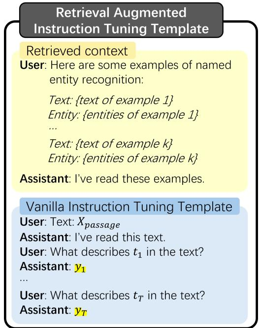
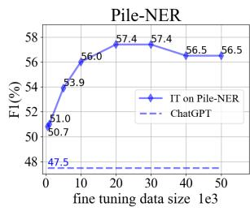
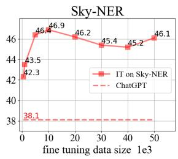
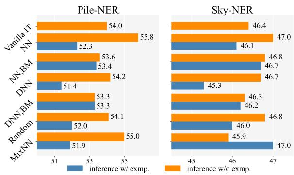
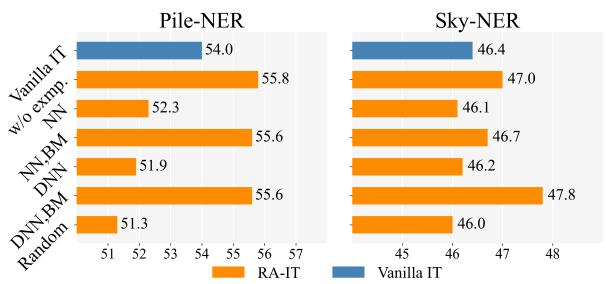
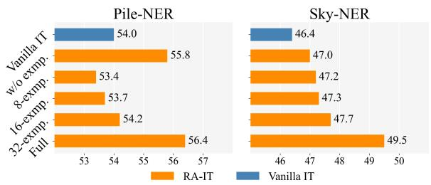
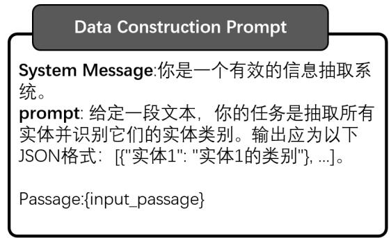

# Retrieval Augmented Instruction Tuning for Open NER with Large Language Models

Tingyu Xie1∗, Jian Zhang1∗, Yan Zhang2\*, Yuanyuan Liang3, Qi Li1, Hongwei Wang 1† 1Zhejiang University, 2National University of Singapore, 3East China Normal University {tingyuxie, jianzhang.22, hongweiwang}@zju.edu.cn, yanzhang.jlu@gmail.com

## Abstract

The strong capability of large language models (LLMs) has been applied to information extraction (IE) through either retrieval augmented prompting or instruction tuning (IT). However, the best way to incorporate information with LLMs for IE remains an open question. In this paper, we explore Retrieval Augmented Instruction Tuning (RA-IT) for IE, focusing on the task of open named entity recognition (NER). Specifically, for each training sample, we retrieve semantically similar examples from the training dataset as the context and prepend them to the input of the original instruction. To evaluate our RA-IT approach more thoroughly, we construct a Chinese IT dataset for open NER and evaluate RA-IT in both English and Chinese scenarios. Experimental results verify the effectiveness of RA-IT across various data sizes and in both English and Chinese scenarios. We also conduct thorough studies to explore the impacts of various retrieval strategies in the proposed RA-IT framework.1

## 1 Introduction

The powerful generalizability of large language models (LLMs) (OpenAI, 2024; Touvron et al., 2023; Bai et al., 2023) has been widely applied to information extraction (IE) (Sainz et al., 2024; Wang et al., 2023b). The major two lines of works for generative IE with LLMs, are prompt designing with retrieval augmented generation (RAG) using an off-the-shelf LLM (Wang et al., 2023a; Guo et al., 2023; Xie et al., 2024), and task-specific instruction tuning (IT) (Zhou et al., 2024; Sainz et al., 2024; Li et al., 2024). However, the best approach to incorporate information to LLMs for IE remains an open question. Inspired by recent studies on retrieval aware and context-enhanced IT (Jiang et al., 2023; Luo et al., 2023; Zhang et al., 2024; Asai et al., 2024; Lin et al., 2024; Liu et al., 2024) for enhancing the LLM capability in downstream tasks, we conduct an empirical study of exploring Retrieval Augmented IT (RA-IT) for IE, with a focus on the of open NER task.

The previous work UniNER (Zhou et al., 2024) distills the strong capability of ChatGPT in open NER into smaller models through IT without any human-annotated data. We follow this line and investigate RA-IT under this targeted distillation setting. Other works of IT for IE like Sainz et al. (2024); Li et al. (2024) using code-style instruction data, are orthogonal to this work since RA-IT can be integrated into various instruction styles.

In our RA-IT approach, for each training sample, we retrieve semantically similar examples from the training dataset and prepend them to the original instruction, forming the context-enhanced instruction. We also explore the impacts of diverse retrieval strategies. Moreover, we construct a Chinese IT dataset for open NER and evaluate our method in both English and Chinese scenarios. We conduct thorough experiments across various data sizes and obtain the following key findings: (1) RA-IT achieves consistent improvements on various data sizes, suggesting the need for context-enhanced fine-tuning. (2) Retrieving semantically similar examples benefits the most for training among various retrieval strategies. Random retrieval also exhibits improvement but shows inferior performance to similar examples. (3) Retrieving out-domain examples for inference requires applying example filtering strategies to achieve improvements. Providing in-domain examples benefits inference.

Our main contributions are two folds: (1) We empirically study the RA-IT framework for open NER. We prepare the retrieval augmented instruction data with semantically similar examples. We conduct thorough experimental analysis to study the impact of various retrieval strategies. (2) We construct an IT dataset for Chinese open NER and conduct our investigations in English and Chinese scenarios across various data sizes. Experimental results verify the benefits of RA-IT for open NER.

## 2 Method

Preliminary: Targeted Distillation. We follow UniNER (Zhou et al., 2024) to conduct our study in the setting of targeted distillation, where they successfully distill the strong capability of Chat-GPT in open NER into smaller models, without any human-annotated data. The pipeline is as follows: (1) Data construction. They sample inputs from a large corpus across diverse domains, then use ChatGPT to automatically generate NER outputs. (2) Distillation. After obtaining the automatically constructed data, they apply IT to distill the open NER capability of ChatGPT into smaller models.

Vanilla IT. The original instruction tuning template used in targeted distillation is shown in the bottom part of Fig. 1, which we refer to as Vanilla IT, where each passage and its associated entity output are converted into a multi-turn conversation.

RA-IT. We explore an alternative way to conduct IT in targeted distillation: we introduce RA-IT, a context-enhanced tuning approach, of which the overview is in Fig. 1. In our RA-IT approach, each data is augmented with a retrieved context, which consists of k semantically similar examples retrieved from the training dataset. The retrieved context is prepended to the original conversation, forming the retrieval augmented instruction. By fine tuning LMs in this recipe, we equip the LMs with the ability to generate NER answer with on-demand RAG. This means we could flexibly adapting LMs to different scenarios by determining whether to use RAG during inference based on the specific characteristics of the scenario.

Retriever. We use sentence embedding-based retrieval and adopt cosine similarity as our similarity metric. We retrieve the k nearest neighbors as context. We also investigate various retrieval strategies for both training and inference stages.

## 3 Experiment

## 3.1 Experimental Settings

Backbones: We adopt LLaMA-3-8B (Meta, 2024) and Qwen-1.5-7B (Team, 2024) as the backbone models for English and Chinese scenarios respectively. Training: For English, we use the training data Pile-NER released by Zhou et al. (2024). For Chinese, we use the training data Sky-NER constructed in this paper as described in Section 3.2. We use LoRA (Hu et al., 2021) to train models. Our training infrastructure was 1 NVIDIA A100 80GB. Retrieval: We adopt $\mathrm { \bf G T E - l a r g e } ^ { 2 }$ (Li et al., 2023) to generate text embeddings and set $k = 2$ in main experiments. Evaluation: We mainly focus on the zero-shot evaluation. For English, we adopt benchmarks CrossNER, MIT-Movie and MIT-restaurant following Zhou et al. (2024). For Chinese, we collect eight benchmarks across diverse domains, of which details are in Appendix C. We report micro-F1 value.

  
Figure 1: The RA-IT template, where the retrieved context consists of semantically similar examples retrieved from the training dataset and is prepended to the original vanilla IT template. The vanilla IT template, presented by Zhou et al. (2024) converts each NER sample into a conversation, where $X _ { p a s s a g e }$ is the input text, $[ t 1 , \dots , t _ { T } ]$ are entity types to extract, and $y _ { i }$ is the list of entity mentions that are $t _ { i } .$ . The highlighted parts are used to compute the loss during training.

## 3.2 Chinese IT Data Construction

Following the data construction recipe of UniNER (Zhou et al., 2024), we construct an IT dataset for Chinese open NER. We sample input passages from the large-scale Sky corpus (Wei et al., 2023) across various domains, then use ChatGPT (gpt-3.5-turbo) to generate entity mentions and types based on the sampled passages. More details of data construction procedures are in Appendix A. We name this dataset as Sky-NER, which consists of 50K NER examples, and the type statistics are in Table 3.

<table><tr><td>Data size</td><td>Method</td><td>Movie</td><td>Restaurant</td><td>AI</td><td>Literature</td><td>Music</td><td>Politics</td><td>Science</td><td>Avg.</td></tr><tr><td>-</td><td>ChatGPT</td><td>5.30</td><td>32.80</td><td>52.40</td><td>39.80</td><td>66.60</td><td>68.50</td><td>67.00</td><td>47.50</td></tr><tr><td>5K</td><td>Vanilla IT RA-IT</td><td>44.87 50.26</td><td>42.72 45.75</td><td>52.87 52.61</td><td>59.00 60.01</td><td>60.47 63.04</td><td>59.35 60.02</td><td>58.36 58.91</td><td>53.95 55.80</td></tr><tr><td>10K</td><td>Vanilla IT RA-IT</td><td>49.81 53.79</td><td>41.47 45.73</td><td>53.78 55.90</td><td>60.99 62.58</td><td>63.79 66.52</td><td>60.84 62.40</td><td>61.47 63.67</td><td>56.02 58.65</td></tr><tr><td>50K</td><td>Vanilla IT RA-IT</td><td>44.83 45.18</td><td>40.39 40.78</td><td>58.63 58.01</td><td>62.88 63.60</td><td>64.12 64.76</td><td>61.63 61.90</td><td>63.22 62.79</td><td>56.53 56.72</td></tr></table>

Table 1: Zero-shot evaluation in English scenario. We report F1 values (%). Numbers in bold indicates the best results of each category. RA-IT shows consistent improvements across various dats sizes, suggesting the need of context-enhanced training.
<table><tr><td>Data size</td><td>Method</td><td>Ontonotes 4</td><td>MSRA</td><td>Weibo</td><td>Boson</td><td>ClueNER</td><td>CMeEE</td><td>Ren.</td><td>Yidu</td><td>Avg.</td></tr><tr><td></td><td>ChatGPT</td><td>29.70</td><td>41.36</td><td>30.25</td><td>46.65</td><td>44.75</td><td>43.16</td><td>34.25</td><td>34.90</td><td>38.13</td></tr><tr><td>5K</td><td>Vanilla IT RA-IT</td><td>48.88 49.23</td><td>51.47 53.08</td><td>38.95 37.43</td><td>52.47 52.64</td><td>43.54 43.27</td><td>41.50 43.87</td><td>47.51 48.31</td><td>47.23 48.47</td><td>46.44 47.04</td></tr><tr><td>10K</td><td>Vanilla IT RA-IT</td><td>46.28 47.69</td><td>52.56 55.06</td><td>39.26 37.38</td><td>52.92 53.86</td><td>45.42 45.25</td><td>42.59 43.71</td><td>47.99 49.25</td><td>47.95 47.86</td><td>46.87 47.51</td></tr><tr><td>50K</td><td>Vanilla IT RA-IT</td><td>43.99 46.72</td><td>50.02 54.15</td><td>34.55 33.28</td><td>54.98 54.43</td><td>43.59 43.86</td><td>42.52 43.78</td><td>49.37 49.50</td><td>49.63 50.24</td><td>46.08 47.00</td></tr></table>

Table 2: Zero-shot evaluation in Chinese scenario. We report F1 values (%). Numbers in bold indicates the best results of each category. RA-IT shows consistent improvements across diverse data sizes in Chinese scenario, which further verifies the benefits of our RA-IT approach.

<table><tr><td>Frequency Entity Type</td><td></td></tr><tr><td>Top 1% (75.3%)</td><td>概念(concept),地点(location),人物(person), 组织(organization),产品(product)...</td></tr><tr><td>1%-10% (17.5%)</td><td>荣誉(honor),技术类(technical),场所(place), 情绪(emotion),节目(program)...</td></tr><tr><td>(7.2%)</td><td>10%-100%比赛组别(competition category), 房产类型(property type)...</td></tr></table>

Table 3: Statistics of Sky-NER, the constructed IT dataset for Chinese open NER. Example entity types from various frequency ranges - top 1%, 1-10% and 10-100%, along with the percentage of total frequencies for each range.

## 3.3 Preliminary Study on Data Efficiency

We conduct a preliminary study on IT data efficiency in targeted distillation for open NER by exploring the impact of varous datas sizes: [0.5K, 1K, 5K, 10K, 20K, 30K, 40K, 50K]. We use vanilla IT for preliminary study. Results are visualized in Fig. 2. The following observations are consistent in English and Chinese: (1) a small data size already surpass ChatGPT’s performances. (2) Performances are improving as the data sizes increased to 10K or 20K, but begin to decline and then remain at a certain level as data sizes further increased to 50K. Recent work for IT data selection, Xia et al. (2024); Ge et al. (2024); Du et al. (2023) also find the superior performances of only limited data size. We leave selecting more beneficial IT data for IE as future work. Accordingly, we conduct main experiments on 5K, 10K and 50K data sizes.

  
Figure 2: Preliminary study of IT data efficiency for open NER in English (left) and Chinese (right) scenarios, where the training data are Pile-NER and Sky-NER respectively. Average zero-shot results of evaluated benchmarks are illustrated. The performance does not necessarily improve as the data increases.

## 3.4 Main results

The main results are summarized in Table 1 and 2 respectively. We report the results of inference without examples for RA-IT here, since we found this setting exhibits more consistent improvements. The impacts of inference with examples are studied in Section 3.5. As shown in the tables, RA-IT shows consistent improvements on English and Chinese across various data sizes. This presumably because the retrieved context enhance the model ability to understand the inputs. This suggests the need for context-enhanced instructions.

  
Figure 3: Impacts of training using various retrieval strategies in RA-IT. The average F1 value of the evaluated benchmarks is reported. NN exhibits the best performances, suggesting the need of training with retrieved context.

## 3.5 Analysis

We explore the impacts of diverse retrieval strategies. We conduct analysis on 5K data size for cost saving as the effect of RA-IT is consistent across various data sizes as shown in Section 3.4. We report the average results of the evaluated benchmarks here.

Diverse retrieval strategies. The following strategies are explored in the subsequent analysis. (1) Nearest neighbor (NN), the strategy used in the main experiments, retrieves k nearest neighbors of the current sample. (2) Nearest neighbor with BM25 filter (NN, BM), where we apply BM25 scoring to filters out NN examples not passing a predefined threshold. Samples with no satisfied examples are used with the vanilla instruction template. (3) Diverse nearest neighbor (DNN), retrieves K nearest neighbors with K >> k and randomly selects k examples from them. (4) Diverse nearest with BM25 filter (DNN,BM), filters out DNN examples not reaching the BM25 threshold. (5) Random, uniformly selects k random examples. (6) Mixed nearest neighbors (MixedNN), mixes the using of the NN and random retrieval strategies with the ratio of NN set to a.

Training with diverse retrieval strategies. Fig. 3 visualize the results of training with various retrieval strategies. We conduct inference with and without examples for each strategy, and set the retrieval strategy of inference the same as of training. The most straight forward method NN shows best performances, suggesting the benefits of semantically similar examples. Random strategy, though inferior to NN, also shows improvements, indicating that random examples might introduce some general information of NER taks to the model. Meanwhile, inference with examples does not guarantee improvements and often hurt performances. This may due to the differences of the annotation schema between the automatically constructed data and the human-annotated benchmarks.

  
Figure 4: Impacts of inferece with out-domain examples using various retrieval strategies. The average F1 value of the evaluated benchmarks are reported. w/o exmp. means inference without example. Applying example filtering strategy such as BM25 filtering benefits RAG with out-domain examples.

  
Figure 5: Impacts of inference with in-domain examples using NN retrieval. The average F1 value of the evaluated benchmarks are reported. N-exmp. means the example pool of size N. The results indicate that sufficient in-domain examples are helpful for inference with RAG.

Inference with out-domain examples. During inference, since examples from the automatically constructed data is not aligned with the domains and schemas of the human-annotated benchmarks, we refer to them as out-domain examples. Fig. 4 shows the results of inference with out-domain examples using diverse retrieval strategies. We use the model trained with NN strategy here. After applying example filtering such as BM25 scoring, inference with out-domain examples shows improvements compared to the baseline, suggesting the need of example filtering when implementing RAG with out-domain examples.

Inference with in-domain examples. We explore the setting where a few in-domain examples are available for inference. We randomly sample an example pool of size N from the original training sets of the benchmarks, then retrieve k NN from this pool as in-domain examples. We also evaluate on full pool where the entire training set is used for retrieval. Results are shown in Fig. 5. Indomain examples show substantial improvements in Chinese. Meanwhile, sufficient in-domain examples are required for improvements in English. This indicates the benefits of providing sufficient in-domain examples for RAG.

Based on the above analysis, we suggest implementing on-demand RAG for inference after RA-IT. When sufficient in-domain examples are available, conduct RAG with similar examples to boost inference. When only out-domain examples are available, apply an example filtering method such as BM25 scoring for RAG, or simply conduct inference without examples.

## 4 Related Work

## 4.1 IE with LLMs

The main techniques studied in the area of IE with LLMs fall under advanced prompt designing(Guo et al., 2023; Xie et al., 2023; Wang et al., 2023a), instruction tuning (IT) (Sainz et al., 2024; Zhou et al., 2024; Li et al., 2024) and data augmentation (Josifoski et al., 2023; Zhang et al., 2023; Ma et al., 2023). Many of the prompt designing methods apply RAG to an off-the-shelf LLM to assist inference (Guo et al., 2023; Wan et al., 2023; Xie et al., 2024), which retrieves similar examples to provide more useful information for the LLM. Works of IT incorporate the information for IE into the LLMs through task-specific fine-tuning (Sainz et al., 2024; Zhou et al., 2024). Different from previous works, we explore retrieval augmented IT (RA-IT) for IE, with a focus on the open NER task.

Following UniNER (Zhou et al., 2024), we conduct investigations under the targeted distillation setting, since UniNER successfully distills the strong capability of ChatGPT in open NER into a smaller model without any human-annotated data. Other works of IT for IE, Sainz et al. (2024); Li et al. (2024) adopt the code-style instruction to fine-tune LLMs in effectively generating IE outputs through code generation. They are orthogonal to this work since the strategy of RA-IT can be integrated into various styles of instructions. Moreover, Zaratiana et al. (2023) integrated the strong capability of ChatGPT in open NER into smaller-scale bidirectional LMs (BiLMs) such as BERT (Devlin et al., 2019). How to integrate retrieval augmentation into the BiLMs frameworks is also worth exploring in future work.

## 4.2 Retrieval aware Fine-Tuning

Retrieval augmented generation (RAG) has achieved large improvements in diverse tasks with the off-the-shelf LLMs (Ram et al., 2023). Recent works has explored retrieval aware IT for LLMs (Jiang et al., 2023; Zhang et al., 2024). Jiang et al. (2023) pre-trains a retriever and LM jointly, then conducts few-shot fine-tuning on downstream tasks. Luo et al. (2023) instruction-tunes LMs with retrieved passages prepended to inputs. Zhang et al. (2024) retrieves both gold and distractor documents for IT to make the model resistant to unhelpful documents. Liu et al. (2024) explores contextenhanced IT to enhance model’s capability for conversational QA over a given context. However, retrieval augmented and context-enhanced IT has remained unexplored in IE. We fill this gap and explore (RA-IT) on the task of open domain NER.

## 5 Conclusion

This paper explores RA-IT for open NER. We retrieve semantically similar examples to form the context-enhanced instruction data. RA-IT achieves consistent improvements across various data sizes in English and Chinese, suggesting the need of context-enhanced training. Thorough analysis verifies the benefits of semantically similar examples for training and the need of example filtering and in-domain examples for inference.

## Limitations

This work faces the following limitations:

(1) Although the RA-IT strategy improves the open NER performance, it does not guarantee improvements when using RAG during inference. Applying some example filtering strategies and introducing in-domain examples alleviate this problem, but the effectiveness is till marginal. More advanced approaches of improving RA-IT models in conducting RAG for open NER are worth exploring.

(2) The investigation of data efficiency in this work is merely a small preliminary empirical study. However, data efficiency, such as selecting most influential and beneficial data is important for realworld applications of IE since it might effectively save computation and annotation costs.

## Acknowledgements

This research is supported by Zhejiang Provincial Natural Science Foundation of China (LDT23F02023F02) and the National Natural Science Foundation of China (72350710798).

## References

Moonshot AI. 2024a. Moonshot ai.

Zhipu AI. 2024b. Glm-4 releasing.

Anthropic. 2024. Claude 3 haiku: our fastest model yet.

Akari Asai, Zeqiu Wu, Yizhong Wang, Avirup Sil, and Hannaneh Hajishirzi. 2024. Self-RAG: Learning to retrieve, generate, and critique through self-reflection. In The Twelfth International Conference on Learning Representations.

Jinze Bai, Shuai Bai, Yunfei Chu, Zeyu Cui, Kai Dang, Xiaodong Deng, Yang Fan, Wenbin Ge, Yu Han, Fei Huang, Binyuan Hui, Luo Ji, Mei Li, Junyang Lin, Runji Lin, Dayiheng Liu, Gao Liu, Chengqiang Lu, Keming Lu, Jianxin Ma, Rui Men, Xingzhang Ren, Xuancheng Ren, Chuanqi Tan, Sinan Tan, Jianhong Tu, Peng Wang, Shijie Wang, Wei Wang, Shengguang Wu, Benfeng Xu, Jin Xu, An Yang, Hao Yang, Jian Yang, Shusheng Yang, Yang Yao, Bowen Yu, Hongyi Yuan, Zheng Yuan, Jianwei Zhang, Xingxuan Zhang, Yichang Zhang, Zhenru Zhang, Chang Zhou, Jingren Zhou, Xiaohuan Zhou, and Tianhang Zhu. 2023. Qwen technical report. Preprint, arXiv:2309.16609.

Jacob Devlin, Ming-Wei Chang, Kenton Lee, and Kristina Toutanova. 2019. BERT: Pre-training of deep bidirectional transformers for language understanding. In Proceedings ofthe 2019 Conference of the North American Chapter ofthe Associationfor Computational Linguistics: Human Language Technologies, Volume 1 (Long and Short Papers), pages 4171–4186, Minneapolis, Minnesota. Association for Computational Linguistics.

Qianlong Du, Chengqing Zong, and Jiajun Zhang. 2023. Mods: Model-oriented data selection for instruction tuning. Preprint, arXiv:2311.15653.

Yuan Ge, Yilun Liu, Chi Hu, Weibin Meng, Shimin Tao, Xiaofeng Zhao, Hongxia Ma, Li Zhang, Hao Yang, and Tong Xiao. 2024. Clustering and ranking: Diversity-preserved instruction selection through expert-aligned quality estimation. arXiv preprint arXiv:2402.18191.

Yucan Guo, Zixuan Li, Xiaolong Jin, Yantao Liu, Yutao Zeng, Wenxuan Liu, Xiang Li, Pan Yang, Long Bai, Jiafeng Guo, and Xueqi Cheng. 2023. Retrievalaugmented code generation for universal information extraction. Preprint, arXiv:2311.02962.

Edward J. Hu, Yelong Shen, Phillip Wallis, Zeyuan Allen-Zhu, Yuanzhi Li, Shean Wang, Lu Wang, and Weizhu Chen. 2021. Lora: Low-rank adaptation of large language models. Preprint, arXiv:2106.09685.

Zhengbao Jiang, Frank Xu, Luyu Gao, Zhiqing Sun, Qian Liu, Jane Dwivedi-Yu, Yiming Yang, Jamie Callan, and Graham Neubig. 2023. Active retrieval augmented generation. In Proceedings of the 2023 Conference on Empirical Methods in Natural Language Processing, pages 7969–7992, Singapore. Association for Computational Linguistics.

Martin Josifoski, Marija Sakota, Maxime Peyrard, and Robert West. 2023. Exploiting asymmetry for synthetic training data generation: SynthIE and the case of information extraction. In Proceedings ofthe 2023 Conference on Empirical Methods in Natural Language Processing, pages 1555–1574, Singapore. Association for Computational Linguistics.

Gina-Anne Levow. 2006. The third international Chinese language processing bakeoff: Word segmentation and named entity recognition. In Proceedings of the Fifth SIGHAN Workshop on Chinese Language Processing, pages 108–117, Sydney, Australia. Association for Computational Linguistics.

Zehan Li, Xin Zhang, Yanzhao Zhang, Dingkun Long, Pengjun Xie, and Meishan Zhang. 2023. Towards general text embeddings with multi-stage contrastive learning. arXiv preprint arXiv:2308.03281.

Zixuan Li, Yutao Zeng, Yuxin Zuo, Weicheng Ren, Wenxuan Liu, Miao Su, Yucan Guo, Yantao Liu, Xiang Li, Zhilei Hu, Long Bai, Wei Li, Yidan Liu, Pan Yang, Xiaolong Jin, Jiafeng Guo, and Xueqi Cheng. 2024. Knowcoder: Coding structured knowledge into llms for universal information extraction. Preprint, arXiv:2403.07969.

Xi Victoria Lin, Xilun Chen, Mingda Chen, Weijia Shi, Maria Lomeli, Richard James, Pedro Rodriguez, Jacob Kahn, Gergely Szilvasy, Mike Lewis, Luke Zettlemoyer, and Wen tau Yih. 2024. RA-DIT: Retrieval-augmented dual instruction tuning. In The Twelfth International Conference on Learning Representations.

Jingjing Liu, Panupong Pasupat, Scott Cyphers, and Jim Glass. 2013. Asgard: A portable architecture for multilingual dialogue systems. In 2013 IEEE International Conference on Acoustics, Speech and Signal Processing, pages 8386–8390.

Zihan Liu, Wei Ping, Rajarshi Roy, Peng Xu, Chankyu Lee, Mohammad Shoeybi, and Bryan Catanzaro. 2024. Chatqa: Surpassing gpt-4 on conversational qa and rag. Preprint, arXiv:2401.10225.

Zihan Liu, Yan Xu, Tiezheng Yu, Wenliang Dai, Ziwei Ji, Samuel Cahyawijaya, Andrea Madotto, and Pascale Fung. 2021. Crossner: Evaluating cross-domain named entity recognition. Proceedings of the AAAI Conference on Artificial Intelligence, 35(15):13452– 13460.

Hongyin Luo, Yung-Sung Chuang, Yuan Gong, Tianhua Zhang, Yoon Kim, Xixin Wu, Danny Fox, Helen Meng, and James Glass. 2023. Sail: Search-augmented instruction learning. Preprint, arXiv:2305.15225.

Mingyu Derek Ma, Xiaoxuan Wang, Po-Nien Kung, P. Jeffrey Brantingham, Nanyun Peng, and Wei Wang. 2023. STAR: Improving low-resource information extraction by structure-to-text data generation with large language models. In NeurIPS 2023 Workshop on Synthetic Data Generation with Generative AI.

Meta. 2024. Introducing meta llama 3: The most capable openly available llm to date.

OpenAI. 2022. Introducing chatgpt.

OpenAI. 2024. Hello gpt-4o.

Nanyun Peng and Mark Dredze. 2015. Named entity recognition for Chinese social media with jointly trained embeddings. In Proceedings of the 2015 Conference on Empirical Methods in Natural Language Processing, pages 548–554, Lisbon, Portugal. Association for Computational Linguistics.

Ori Ram, Yoav Levine, Itay Dalmedigos, Dor Muhlgay, Amnon Shashua, Kevin Leyton-Brown, and Yoav Shoham. 2023. In-context retrieval-augmented language models. Transactions of the Association for Computational Linguistics, 11:1316–1331.

Oscar Sainz, Iker García-Ferrero, Rodrigo Agerri, Oier Lopez de Lacalle, German Rigau, and Eneko Agirre. 2024. GoLLIE: Annotation guidelines improve zero-shot information-extraction. In The Twelfth International Conference on Learning Representations.

Qwen Team. 2024. Introducing qwen1.5.

Hugo Touvron, Louis Martin, Kevin Stone, Peter Albert, Amjad Almahairi, Yasmine Babaei, Nikolay Bashlykov, Soumya Batra, Prajjwal Bhargava, Shruti Bhosale, Dan Bikel, Lukas Blecher, Cristian Canton Ferrer, Moya Chen, Guillem Cucurull, David Esiobu, Jude Fernandes, Jeremy Fu, Wenyin Fu, Brian Fuller, Cynthia Gao, Vedanuj Goswami, Naman Goyal, Anthony Hartshorn, Saghar Hosseini, Rui Hou, Hakan Inan, Marcin Kardas, Viktor Kerkez, Madian Khabsa, Isabel Kloumann, Artem Korenev, Punit Singh Koura, Marie-Anne Lachaux, Thibaut Lavril, Jenya Lee, Diana Liskovich, Yinghai Lu, Yuning Mao, Xavier Martinet, Todor Mihaylov, Pushkar Mishra, Igor Molybog, Yixin Nie, Andrew Poulton, Jeremy Reizenstein, Rashi Rungta, Kalyan Saladi, Alan Schelten,

Ruan Silva, Eric Michael Smith, Ranjan Subramanian, Xiaoqing Ellen Tan, Binh Tang, Ross Taylor, Adina Williams, Jian Xiang Kuan, Puxin Xu, Zheng Yan, Iliyan Zarov, Yuchen Zhang, Angela Fan, Melanie Kambadur, Sharan Narang, Aurelien Rodriguez, Robert Stojnic, Sergey Edunov, and Thomas Scialom. 2023. Llama 2: Open foundation and finetuned chat models. Preprint, arXiv:2307.09288.

Zhen Wan, Fei Cheng, Zhuoyuan Mao, Qianying Liu, Haiyue Song, Jiwei Li, and Sadao Kurohashi. 2023. GPT-RE: In-context learning for relation extraction using large language models. In Proceedings of the 2023 Conference on Empirical Methods in Natural Language Processing, pages 3534–3547, Singapore. Association for Computational Linguistics.

Shuhe Wang, Xiaofei Sun, Xiaoya Li, Rongbin Ouyang, Fei Wu, Tianwei Zhang, Jiwei Li, and Guoyin Wang. 2023a. Gpt-ner: Named entity recognition via large language models. Preprint, arXiv:2304.10428.

Xiao Wang, Weikang Zhou, Can Zu, Han Xia, Tianze Chen, Yuansen Zhang, Rui Zheng, Junjie Ye, Qi Zhang, Tao Gui, Jihua Kang, Jingsheng Yang, Siyuan Li, and Chunsai Du. 2023b. Instructuie: Multi-task instruction tuning for unified information extraction. Preprint, arXiv:2304.08085.

Tianwen Wei, Liang Zhao, Lichang Zhang, Bo Zhu, Lijie Wang, Haihua Yang, Biye Li, Cheng Cheng, Weiwei Lv, Rui Hu, Chenxia Li, Liu Yang, Xilin Luo, Xuejie Wu, Lunan Liu, Wenjun Cheng, Peng Cheng, Jianhao Zhang, Xiaoyu Zhang, Lei Lin, Xiaokun Wang, Yutuan Ma, Chuanhai Dong, Yanqi Sun, Yifu Chen, Yongyi Peng, Xiaojuan Liang, Shuicheng Yan, Han Fang, and Yahui Zhou. 2023. Skywork: A more open bilingual foundation model. Preprint, arXiv:2310.19341.

Ralph Weischedel, Sameer Pradhan, Lance Ramshaw, Martha Palmer, Nianwen Xue, Mitchell Marcus, Ann Taylor, Craig Greenberg, Eduard Hovy, Robert Belvin, et al. 2011. Ontonotes release 4.0. LDC2011T03, Philadelphia, Penn.: Linguistic Data Consortium, 17.

Mengzhou Xia, Sadhika Malladi, Suchin Gururangan, Sanjeev Arora, and Danqi Chen. 2024. Less: Selecting influential data for instruction tuning.

Tingyu Xie, Qi Li, Jian Zhang, Yan Zhang, Zuozhu Liu, and Hongwei Wang. 2023. Empirical study of zero-shot NER with ChatGPT. In Proceedings of the 2023 Conference on Empirical Methods in Natural Language Processing, pages 7935–7956, Singapore. Association for Computational Linguistics.

Tingyu Xie, Qi Li, Yan Zhang, Zuozhu Liu, and Hongwei Wang. 2024. Self-improving for zero-shot named entity recognition with large language models. Preprint, arXiv:2311.08921.

Liang Xu, Yu tong, Qianqian Dong, Yixuan Liao, Cong Yu, Yin Tian, Weitang Liu, Lu Li, Caiquan Liu, and Xuanwei Zhang. 2020. Cluener2020: Fine-grained

named entity recognition dataset and benchmark for chinese. Preprint, arXiv:2001.04351.

Urchade Zaratiana, Nadi Tomeh, Pierre Holat, and Thierry Charnois. 2023. Gliner: Generalist model for named entity recognition using bidirectional transformer. Preprint, arXiv:2311.08526.

Ningyu Zhang, Mosha Chen, Zhen Bi, Xiaozhuan Liang, Lei Li, Xin Shang, Kangping Yin, Chuanqi Tan, Jian Xu, Fei Huang, Luo Si, Yuan Ni, Guotong Xie, Zhifang Sui, Baobao Chang, Hui Zong, Zheng Yuan, Linfeng Li, Jun Yan, Hongying Zan, Kunli Zhang, Buzhou Tang, and Qingcai Chen. 2022. CBLUE: A Chinese biomedical language understanding evaluation benchmark. In Proceedings ofthe 60th Annual Meeting of the Association for Computational Linguistics (Volume 1: Long Papers), pages 7888–7915, Dublin, Ireland. Association for Computational Linguistics.

Ruoyu Zhang, Yanzeng Li, Yongliang Ma, Ming Zhou, and Lei Zou. 2023. LLMaAA: Making large language models as active annotators. In Findings of the Associationfor Computational Linguistics: EMNLP 2023, Singapore. Association for Computational Linguistics.

Tianjun Zhang, Shishir G. Patil, Naman Jain, Sheng Shen, Matei Zaharia, Ion Stoica, and Joseph E. Gonzalez. 2024. Raft: Adapting language model to domain specific rag. Preprint, arXiv:2403.10131.

Wenxuan Zhou, Sheng Zhang, Yu Gu, Muhao Chen, and Hoifung Poon. 2024. UniversalNER: Targeted distillation from large language models for open named entity recognition. In The Twelfth International Conference on Learning Representations.

## A Chinese Data Construction

Data construction prompt. Fig. 6 shows the prompt used for Chinese distillation data construction. We follow Zhou et al. (2024) to design the prompt for Chinese data construction. We adopt the data construction prompt of Pile-NER-type 3, since it shows the best performance as in (Zhou et al., 2024).

  
Figure 6: Data construction prompt for Chinese open domain NER.

Data processing. Following (Zhou et al., 2024), we chunk the passages sampled from the Sky corpus4 to texts of a max length of 256 tokens and randomly sample 50K passages. Due to limited computation resources, we sample the first twenty files in Sky corpus for data construction, since the size of the entire Sky corpus is beyond the processing capability of our machines. We conduct the same data processing procedures including output filtering and negative sampling as in UniNER. Specifically, the negative sampling strategy for entity types, is applied with a probability proportional to the frequency of entity types in the entire constructed dataset.

Instruction data construction. The instruction tuning data for Chinese scenario is as shown in Table. 15.

## B Diverse Teachers for Data Construction

We explored the effect of using diverse teachers for data construction. We also tried ensemble distillation: multiple teachers are used to annotate entities simultaneously, and the final annotation is acquired by majority voting on the answers from all teachers. The results are shown in Table 4

<table><tr><td colspan="2">Model</td><td>Ontonotes 4</td><td>MSRA</td><td>Weibo</td><td>Boson</td><td>ClueNER</td><td>CMeEE</td><td>Ren.</td><td>Yidu</td><td>Avg.</td></tr><tr><td rowspan="2">ChatGPT</td><td>Teacher</td><td>29.7</td><td>41.4</td><td>30.3</td><td>46.7</td><td>44.8</td><td>43.2</td><td>34.3</td><td>34.9</td><td>38.1</td></tr><tr><td>Student</td><td>48.0</td><td>52.6</td><td>38.0</td><td>52.2</td><td>42.4</td><td>41.0</td><td>48.8</td><td>49.0</td><td>46.5</td></tr><tr><td rowspan="2">Claude</td><td>Teacher</td><td>35.0</td><td>46.4</td><td>29.9</td><td>35.7</td><td>46.3</td><td>43.1</td><td>34.1</td><td>31.1</td><td>37.7</td></tr><tr><td>Student</td><td>50.1</td><td>52.6</td><td>36.9</td><td>47.2</td><td>44.0</td><td>42.6</td><td>49.7</td><td>46.6</td><td>46.2</td></tr><tr><td rowspan="2">Moonshot</td><td>Teacher</td><td>43.4</td><td>51.6</td><td>27.5</td><td>51.6</td><td>49.6</td><td>43.1</td><td>41.8</td><td>34.7</td><td>42.9</td></tr><tr><td>Student</td><td>50.8</td><td>49.7</td><td>34.9</td><td>54.3</td><td>43.5</td><td>43.0</td><td>48.2</td><td>52.1</td><td>47.0</td></tr><tr><td rowspan="2">GLM-4</td><td>Teacher</td><td>36.7</td><td>49.4</td><td>28.3</td><td>38.3</td><td>49.1</td><td>45.9</td><td>34.4</td><td>35.5</td><td>39.7</td></tr><tr><td>Student</td><td>47.9</td><td>45.2</td><td>35.0</td><td>49.1</td><td>42.8</td><td>44.1</td><td>45.2</td><td>48.1</td><td>44.7</td></tr></table>

Table 4: The method of LLMs’ extraction and LLM-guided SFT on Chinese dataset. "Teacher" refers to the results directly returned by instruct-LLM. "Student" refers to the results after SFT using the UniNER method by LLMs results.
<table><tr><td>Language</td><td>Dataset</td><td>Labels</td><td>Train</td><td>Valid</td><td>Test</td></tr><tr><td rowspan="5">English</td><td>CrossNER_AI</td><td>13</td><td>100</td><td>350</td><td>431</td></tr><tr><td>CrossNER_literature</td><td>11</td><td>100</td><td>400</td><td>416</td></tr><tr><td>CrossNER_music</td><td>12</td><td>100</td><td>380</td><td>465</td></tr><tr><td>CrossNER_politics</td><td>8</td><td>199</td><td>540</td><td>650</td></tr><tr><td>CrossNER_science MIT Moive Review</td><td>16 12</td><td>200 9774</td><td>450 2442</td><td>543 2442</td></tr><tr><td rowspan="6"></td><td>MIT Restaurant Review</td><td>8</td><td>7659</td><td>1520</td><td>1520</td></tr><tr><td>Ontonotes4</td><td>4</td><td>15724</td><td>4301</td><td>4346</td></tr><tr><td>MSRA</td><td>3</td><td>46364</td><td></td><td>4365</td></tr><tr><td>Weibo</td><td>4</td><td>1350</td><td>270</td><td>270</td></tr><tr><td>Boson</td><td>6</td><td>1637</td><td>184</td><td>179</td></tr><tr><td>ClueNER</td><td>10</td><td>10748</td><td>1343</td><td></td></tr><tr><td rowspan="5"></td><td>CMeEE</td><td>9</td><td>15000</td><td></td><td></td></tr><tr><td>Ren.</td><td>4</td><td>228616</td><td>5000 28768</td><td>28885</td></tr><tr><td>Yidu</td><td>6</td><td>1000</td><td></td><td>379</td></tr><tr><td></td><td></td><td></td><td></td><td></td></tr></table>

Table 5: Dataset statistic.

We investigated four representative powerful teacher models, ChatGPT (gpt-3.5-turbo-0125) (OpenAI, 2022), Claude 3 (claude-3-haiku) (Anthropic, 2024), Moonshot (moonshot-v1-8k) (AI, 2024a) and GLM-4 (glm-4) (AI, 2024b) for distilling open NER capability.

## C More Details of Experimental Settings

## C.1 Preliminary Study on Data Efficiency

We explore the impact of various data sizes: [0.5K, 1K, 5K, 10K, 20K, 30K, 40K, 50K]. For each data size, we randomly sample two sets of data and report the average.

## C.2 Training

we use the training data Pile-NER released by Zhou et al. (2024), and we adopt the Pile-NER-type version5, which shows better performance than Pile-NER-definition6. In our practice, we filter out samples with unparseable entity outputs in Pile-NERtype, which finally leaves 45K samples for actual experiments.

Through our experiments, we train models for 3 epochs with a batch size of 8 and a learningrate of 5e-5. A cosine scheduler is adopted. Each experiment is run on one single A100 GPU.

## C.3 Retrieval

For diverse nearest strategy, we set K = 128. For example filtering with BM25 scoring, we set the BM25 score threshold as 20.

## C.4 Benchmarks

For English, we adopt benchmarks CrossNER (Liu et al., 2021) and MIT-movie/restaurant (Liu et al., 2013). For Chinese, we collect eight benchmarks across diverse domains, include Ontonotes 4 (Weischedel et al., 2011), MSRA (Levow, 2006), Weibo (Peng and Dredze, 2015), ClueNER (Xu et al., 2020), CMeEE (Zhang et al., 2022), Yidu-S4k 7, Boson and PeopleDaily2014(abbreviated as ’Ren.’ in the text and tables) 8 The following are our sampling strategies on evaluation data: For evaluated benchmarks, we sample 2000 examples for each test set for evaluation and keep the original test set with fewer than or slightly more than 2000 examples. For those datasets with only the training set and validation set publicly accessible, we randomly select half of the validation data as the test data and the other half as the new validation data.

## D Full results on data size study

We provide the full results of preliminary study on data sizes. English dataset results are shown in Table 6. When the number of training data is less than 10K, the model performance improves significantly with data increasing. However, the results do not improve the performance after the number of data exceeds 20K. When applied to the Chinese datasets, the threshold increases to 30K in Table 7

## E Extended Analysis

## E.1 Varying Numbers of Examples

We keep the number of examples as 2 through our main experiments. Here we explore the impact of increasing the number of examples. We found that increasing the number of examples does not guarantee improvements. This is presumably because that the entire inputs get lengthy when the number of examples increases. And the very long input sequence is challenging for the 7B model to understand. The results for the Chinese datasets and the English datasets are shown in Table 11 and Table 8, respectively.

## E.2 Ablation for Mixed NN

We conduct ablation experiments by mixing different sampling methods, constructing the training set using NN strategy and random strategy in various proportions. The samples were mixed at four different ratios of 0.2, 0.4, 0.6, and 0.8, respectively. Additionally, we both used two different strategies which inference with and without using examples. The experimental results for the Chinese and English datasets are shown in Table 12 and Table 13, respectively. The NN strategy performed the best overall, while the random sampling strategy did not contribute to the results.

## F Examples of Instruction Data

We show examples of instruction data for English and Chinese in Table 14 and Table 15, respectively. For each sample, we used different strategies to find the k number of different examples in the training set. These prompts were formatted as "Text: sample text.\n Entity: [{entity text 1: entity type 1}, {entity text 2: entity type 2}]\n " for the large model to learn from. After the model learned from these examples, we had the model read the test sample text. Then, we asked a question for each entity category. The model’s answers were organized as the information extraction results for the test samples.

## G Case Study

We conduct case study to explore the advantages and disadvantages of the proposed RA-IT method. Table 9 are two cases that demonstrate that RA-IT benefits the long-tail entity types. We exclude the top 30% of frequent types and regard the remaining types as long-tail types. The entities in bold are long-tail types that are misclassified by vanilla-IT and corrected by RA-IT. These two cases are also commonsense-related.

Table 10 are some bad cases where RA-IT fails to improve. The entities in bold are vanilla-IT wrongly recognized, and RA-IT failed to improve. These professional entities in biomedical or AI domains require domain knowledge to be recognized. This shows that RA-IT benefits commonsenserelated cases more than knowledge-seeking cases.

<table><tr><td></td><td>Data Size</td><td>Movie</td><td>Restaurant</td><td>AI</td><td>Literature</td><td>Music</td><td>Politics</td><td>Science</td><td>Avg.</td></tr><tr><td>ChatGPT</td><td>-</td><td>68.50</td><td>67.00</td><td>5.30</td><td>32.80</td><td>52.40</td><td>39.80</td><td>66.60</td><td>47.50</td></tr><tr><td rowspan="7"></td><td>0.5K</td><td>50.92</td><td>41.50</td><td>47.61</td><td>54.27</td><td>54.15</td><td>54.78</td><td>52.16</td><td>50.77</td></tr><tr><td>1K</td><td>44.88</td><td>39.74</td><td>50.21</td><td>56.14</td><td>55.97</td><td>56.28</td><td>54.01</td><td>51.03</td></tr><tr><td>5K</td><td>44.87</td><td>42.72</td><td>52.87</td><td>59.00</td><td>60.47</td><td>59.35</td><td>58.36</td><td>53.95</td></tr><tr><td>10K</td><td>49.81</td><td>41.47</td><td>53.78</td><td>60.99</td><td>63.79</td><td>60.84</td><td>61.47</td><td>56.02</td></tr><tr><td>20K</td><td>50.14</td><td>42.17</td><td>57.07</td><td>62.02</td><td>65.43</td><td>61.92</td><td>63.35</td><td>57.44</td></tr><tr><td>30K</td><td>47.21</td><td>40.84</td><td>58.15</td><td>63.11</td><td>65.33</td><td>62.64</td><td>64.46</td><td>57.39</td></tr><tr><td>40K</td><td>45.89</td><td>40.34</td><td>56.34</td><td>62.48</td><td>64.71</td><td>62.12</td><td>63.58</td><td>56.49</td></tr></table>

Table 6: Impact of different dataset sizes on model performance in English scenario. Data size indicates the number of sampled data for prompt fine-tuning.

<table><tr><td></td><td>Data Size</td><td>Ontonotes 4</td><td>MSRA</td><td>Weibo</td><td>Boson</td><td>ClueNER</td><td>CMeEE</td><td>Ren.</td><td>Yidu</td><td>Avg.</td></tr><tr><td>ChatGPT</td><td>-</td><td>29.70</td><td>41.36</td><td>30.25</td><td>46.65</td><td>44.75</td><td>43.16</td><td>34.25</td><td>34.90</td><td>38.13</td></tr><tr><td rowspan="8">RA-IT</td><td>0.5K</td><td>47.05</td><td>47.20</td><td>37.25</td><td>44.40</td><td>43.08</td><td>37.59</td><td>40.07</td><td>42.05</td><td>42.34</td></tr><tr><td>1K</td><td>43.55</td><td>46.48</td><td>42.41</td><td>47.58</td><td>42.87</td><td>38.28</td><td>41.39</td><td>45.23</td><td>43.47</td></tr><tr><td>5K</td><td>48.88</td><td>51.47</td><td>38.95</td><td>52.47</td><td>43.54</td><td>41.50</td><td>47.51</td><td>47.23</td><td>46.44</td></tr><tr><td>10K</td><td>46.28</td><td>52.56</td><td>39.26</td><td>52.92</td><td>45.42</td><td>42.59</td><td>47.99</td><td>47.95</td><td>46.87</td></tr><tr><td>20K</td><td>44.05</td><td>51.94</td><td>35.52</td><td>55.67</td><td>42.97</td><td>42.46</td><td>48.68</td><td>48.65</td><td>46.24</td></tr><tr><td>30K</td><td>42.75</td><td>48.46</td><td>35.44</td><td>53.49</td><td>43.04</td><td>42.75</td><td>48.43</td><td>35.44</td><td>48.71</td></tr><tr><td>40K</td><td>44.19</td><td>49.22</td><td>33.83</td><td>52.84</td><td>42.93</td><td>42.59</td><td>47.90</td><td>33.83</td><td>48.06</td></tr></table>

Table 7: Impact of different dataset sizes on model performance in Chinese scenario. Data size indicates the number of sampled data for prompt fine-tuning.

<table><tr><td></td><td>#Example</td><td>Ontonotes 4</td><td>MSRA</td><td>Weibo</td><td>Boson</td><td>ClueNER</td><td>CMeEE</td><td> ${ \mathrm { R e n } } .$ </td><td>Yidu</td><td>Avg.</td></tr><tr><td>ChatGPT</td><td>1</td><td>29.70</td><td>41.36</td><td>30.25</td><td>46.65</td><td>44.75</td><td>43.16</td><td>34.25</td><td>34.90</td><td>38.13</td></tr><tr><td>Vanilla IT</td><td>-</td><td>48.88</td><td>51.47</td><td>38.95</td><td>52.47</td><td>43.54</td><td>41.50</td><td>47.51</td><td>47.23</td><td>46.44</td></tr><tr><td rowspan="5">RA-IT</td><td>2</td><td>49.23</td><td>53.08</td><td>37.43</td><td>52.64</td><td>43.27</td><td>43.87</td><td>48.31</td><td>48.47</td><td>47.04</td></tr><tr><td>4</td><td>48.80</td><td>53.32</td><td>35.50</td><td>50.65</td><td>43.41</td><td>43.82</td><td>48.34</td><td>48.86</td><td>46.59</td></tr><tr><td>6</td><td>47.27</td><td>53.42</td><td>38.17</td><td>53.77</td><td>44.09</td><td>42.90</td><td>47.67</td><td>48.51</td><td>46.98</td></tr><tr><td>8</td><td>52.20</td><td>50.56</td><td>40.18</td><td>50.10</td><td>43.69</td><td>39.17</td><td>44.53</td><td>49.45</td><td>46.24</td></tr><tr><td>10</td><td>42.56</td><td>35.15</td><td>33.71</td><td>43.48</td><td>37.28</td><td>30.71</td><td>37.23</td><td>49.88</td><td>38.75</td></tr></table>

Table 8: Impact of different number of example on RA-IT performance of Chinese scenario. #Example column indicates the number of examples used for RA-IT

<table><tr><td colspan="2">Case 1</td></tr><tr><td>Input text</td><td>What is the theme song to stand by me?</td></tr><tr><td>Ground Truth</td><td>[{'stand by me': 'title'}]</td></tr><tr><td>Answer from Vanilla-IT</td><td>| [{'stand by me': 'song'}, {'theme song': 'song'}]</td></tr><tr><td>Answer from RA-IT</td><td>| [{'stand by me': 'title'}, {'theme song': 'song'}]</td></tr><tr><td colspan="2">Case 2</td></tr><tr><td>Input text</td><td>How many times has matt damon been jason bourne?</td></tr><tr><td>Ground Truth</td><td>[{jason bourne: character}, {matt damon: actor}]</td></tr><tr><td></td><td>Answer from Vanilla-IT | [{paul greengrass: director},{jason bourne: title}, {matt damon: actor }]</td></tr><tr><td>Answer from RA-IT</td><td> [{jason bourne: character}, {matt damon: actor}]</td></tr><tr><td colspan="1" rowspan="1">Input text</td><td colspan="1" rowspan="1">Viral TK phosphorylates aciclovir into its monophosphate form , which is subse-quently phosphorylated to active aciclovir triphoshate by cellular kinase s, thusselectively inhibiting viral DNA polymerase.</td></tr><tr><td colspan="1" rowspan="1">Ground Truth</td><td colspan="1" rowspan="1">[{Viral TK: enzyme}, {cellular kinase: enzyme}, {DNA polymerase: enzyme},{aciclovir triphoshate: chemical compound}]</td></tr><tr><td colspan="1" rowspan="1">Answer from Vanilla-IT</td><td colspan="1" rowspan="1">[{Viral TK: scientist}, {cellular kinase s: scientist}, ...]</td></tr><tr><td colspan="1" rowspan="1">Answer from RA-IT</td><td colspan="1" rowspan="1">[{Viral TK: scientist}, {cellular kinase s: scientist}, ...]</td></tr><tr><td colspan="2" rowspan="1">Case 2</td></tr><tr><td colspan="1" rowspan="1">Input text</td><td colspan="1" rowspan="1">NIST also differs from Bilingual evaluation understudy in its calculation of thebrevity penalty insofar as small variations in translation length do not impact theoverall score as much.</td></tr><tr><td colspan="1" rowspan="1">Ground Truth</td><td colspan="1" rowspan="1">[{NIST: metrics}, {bilingual evaluation understudy: metrics}]</td></tr><tr><td colspan="1" rowspan="1">Answer from Vanilla-IT</td><td colspan="1" rowspan="1">[{NIST: organization}, {bilingual evaluation understudy: organization}, ...]</td></tr><tr><td colspan="1" rowspan="1">Answer from RA-IT</td><td colspan="1" rowspan="1">[{NIST: organization}, {bilingual evaluation understudy: organization}, ...]</td></tr></table>

Table 9: Cases that RA-IT benefits the long-tail entity types. We exclude the top 30% of frequent types and regard the remaining types as long-tail types. The entities in bold are long-tail types that are misclassified by vanilla-IT and corrected by RA-IT. These two cases are also commonsense-related.

Table 10: Cases where RA-IT fails to improve. The entities in bold are vanilla-IT wrongly recognized, and RA-IT failed to improve. These professional entities in biomedical or AI domains require domain knowledge to be recognized.

<table><tr><td>Method</td><td>#Example</td><td>Movie</td><td>Restaurant</td><td>AI</td><td>Literature</td><td>Music</td><td>Politics</td><td>Science</td><td>Avg.</td></tr><tr><td>ChatGPT</td><td></td><td>68.50</td><td>67.00</td><td>5.30</td><td>32.80</td><td>52.40</td><td>39.80</td><td>66.60</td><td>47.50</td></tr><tr><td>Vanilla-IT</td><td>-</td><td>52.87</td><td>59.00</td><td>60.47</td><td>59.35</td><td>58.36</td><td>44.87</td><td>42.72</td><td>53.95</td></tr><tr><td rowspan="5">RA-IT</td><td>2</td><td>52.61</td><td>60.01</td><td>63.04</td><td>60.02</td><td>58.91</td><td>50.26</td><td>45.75</td><td>55.80</td></tr><tr><td>4</td><td>51.08</td><td>59.30</td><td>62.40</td><td>59.18</td><td>58.15</td><td>51.15</td><td>45.88</td><td>55.31</td></tr><tr><td>6</td><td>48.79</td><td>54.46</td><td>55.75</td><td>54.62</td><td>50.93</td><td>54.79</td><td>46.81</td><td>52.31</td></tr><tr><td>8</td><td>34.61</td><td>36.17</td><td>34.12</td><td>34.30</td><td>35.27</td><td>45.29</td><td>36.50</td><td>36.61</td></tr><tr><td>10</td><td>22.89</td><td>30.35</td><td>22.03</td><td>30.24</td><td>26.41</td><td>38.31</td><td>35.80</td><td>29.43</td></tr></table>

Table 11: Impact of different number of example on RA-IT performance of English scenario. #Example column indicates the number of examples used for RA-IT

<table><tr><td>Method</td><td>ratio</td><td>#Exam.</td><td>Movie</td><td>Restaurant</td><td>AI</td><td>Literature</td><td>Music</td><td>Politics</td><td>Science</td><td>Avg.</td></tr><tr><td>ChatGPT</td><td>-</td><td>-</td><td>68.50</td><td>67.00</td><td>5.30</td><td>32.80</td><td>52.40</td><td>39.80</td><td>66.60</td><td>47.49</td></tr><tr><td>Vanilla-IT</td><td>-</td><td></td><td>44.87</td><td>42.72</td><td>52.87</td><td>59.00</td><td>60.47</td><td>59.35</td><td>58.36</td><td>53.95</td></tr><tr><td rowspan="7">RA-IT</td><td>0.2</td><td>0 2</td><td>45.65 41.58</td><td>45.25 39.04</td><td>51.89 50.21</td><td>58.36 57.21</td><td>62.00 59.23</td><td>59.26 58.89</td><td>58.21 58.30</td><td>54.37 52.31</td></tr><tr><td>0.4</td><td>0 2</td><td>46.81 42.84</td><td>45.62 39.24</td><td>51.72 50.05</td><td>58.92 57.48</td><td>62.42 59.85</td><td>59.39 59.16</td><td>58.62 58.37</td><td>54.78 52.43</td></tr><tr><td>0.6</td><td>0 2</td><td>48.56 42.92</td><td>45.05 37.70</td><td>51.5 49.99</td><td>58.89 57.41</td><td>61.47 59.01</td><td>59.05 58.76</td><td>57.18 57.84</td><td>54.53 51.95</td></tr><tr><td>0.8</td><td>0 2</td><td>47.82 41.60</td><td>45.49 37.72</td><td>52.29 49.89</td><td>58.81 57.63</td><td>61.90 59.62</td><td>59.61 58.89</td><td>58.70 57.69</td><td>54.95 51.86</td></tr><tr><td>1</td><td>0</td><td>53.20</td><td>47.36</td><td>52.50</td><td>60.86</td><td>63.13</td><td>60.77</td><td>61.02</td><td>56.98</td></tr><tr><td></td><td>2</td><td>43.24</td><td>38.56</td><td>49.71</td><td>58.29</td><td>60.74</td><td>59.94</td><td>59.10</td><td>52.80</td></tr><tr><td></td><td></td><td></td><td></td><td></td><td></td><td></td><td></td><td></td><td></td></tr></table>

Table 12: Results of mixing random strategy with NN strategy at different ratios in English dataset. ’ratio’ indicates the proportion of NN strategy in the total number of samples while training. When ratio=1, all samples are from NN strategy. ’#exam.’ indicates whether example data was added to prompts during testing, with 0 indicating no addition, and 2 indicating 2 examples retrieved by NN strategy added to the test examples.

<table><tr><td>Method</td><td>ratio</td><td>#Exam.</td><td>Ontonotes 4</td><td>MSRA</td><td>Weibo</td><td>Boson</td><td>ClueNER</td><td>CMeEE</td><td>Ren.</td><td>Yidu</td><td>Avg.</td></tr><tr><td>ChatGPT</td><td></td><td>-</td><td>29.70</td><td>41.36</td><td>30.25</td><td>46.65</td><td>44.75</td><td>43.16</td><td>34.25</td><td>34.90</td><td>38.13</td></tr><tr><td>Vanilla-IT</td><td></td><td>-</td><td>48.88</td><td>51.47</td><td>38.95</td><td>52.47</td><td>43.54</td><td>41.50</td><td>47.51</td><td>47.23</td><td>46.44</td></tr><tr><td rowspan="8">RA-IT</td><td>0.2</td><td>0 2</td><td>49.36 47.93</td><td>52.53 49.97</td><td>37.57 37.30</td><td>52.42 51.40</td><td>42.86 43.10</td><td>43.44 41.71</td><td>48.45 47.97</td><td>48.03 47.35</td><td>46.83 45.84</td></tr><tr><td>0.4</td><td>0</td><td>49.03</td><td>52.71</td><td>37.81</td><td>52.52</td><td>42.83</td><td>43.53</td><td>48.33</td><td>48.04</td><td>46.85</td></tr><tr><td></td><td>2</td><td>48.03</td><td>50.30</td><td>37.33</td><td>51.43</td><td>43.17</td><td>41.59</td><td>47.62</td><td>46.99</td><td>45.81</td></tr><tr><td rowspan="2">0.6</td><td>0</td><td>48.91</td><td>52.43</td><td>37.01</td><td>51.35</td><td>42.59</td><td>43.68</td><td>48.24</td><td>48.04</td><td>46.53</td></tr><tr><td>2</td><td>47.83</td><td>49.85</td><td>37.62</td><td>53.03</td><td>42.92</td><td>41.77</td><td>47.79</td><td>47.87</td><td>46.09</td></tr><tr><td rowspan="2">0.8</td><td>0</td><td>49.25</td><td>52.86</td><td>37.27</td><td>52.88</td><td>43.15</td><td>43.92</td><td>48.32</td><td>48.35</td><td>47.00</td></tr><tr><td>2</td><td>48.04</td><td>49.95</td><td>38.12</td><td>50.61</td><td>43.04</td><td>41.58</td><td>47.81</td><td>47.63</td><td>45.85</td></tr><tr><td rowspan="2">1</td><td>0</td><td>50.46</td><td>53.73</td><td>38.10</td><td>54.36</td><td>43.70</td><td>43.78</td><td>48.65</td><td>48.87</td><td>47.71</td></tr><tr><td>2</td><td>47.96</td><td>50.90</td><td>40.00</td><td>53.68</td><td>43.98</td><td>42.09</td><td>47.75</td><td>48.56</td><td>46.87</td></tr></table>

Table 13: Results of mixing random strategy with NN strategy at different ratios in Chinese dataset. ’ratio’ indicates the proportion of NN strategy in the total number of samples while training. When ratio=1, all samples are from NN strategy. ’#exam.’ indicates whether example data was added to prompts during testing, with 0 indicating no addition, and 2 indicating 2 examples retrieved by NN strategy added to the test examples.

<table><tr><td colspan="1" rowspan="1">Role</td><td colspan="1" rowspan="1">Conversation</td></tr><tr><td colspan="1" rowspan="1">Human</td><td colspan="1" rowspan="1">Here are some examples of named entity recognition:Text: 50 Top B2B Marketing Influencers 2017. It's October and you know what that means?Its B2B Marketing influencer speaker list time again. One of my all-time favorite conferencesis MarketingProfs B2B Forum in Boston and for the past few years. I've had some fun listingout a top list of speakers ranked by influence around the topic of "B2B marketing". As usual,I used the influencer marketing platform Traackr to import the list of speakers from #mpb2b2017 and rank them according to a combination of topical resonance and relevance as well asnetwork reach related to "b2b marketing". Of course, use of their platform in this way is like1% of what Traackr can do. I imagine they cringe every time I use their robust tool for such asimple list - but hey, they provide me with access and I use the tool as I see fit. To clarify, myagency TopRank Marketing is also a paying customer of the Traackr platform for clients, whereit is used in support of B2B influencer marketing programs for brands like SAP, BMC SoftwareMcKesson and others in ways that are more in line with the platform's capabilities. This is alegit list that recognizes people creating content around B2B marketing that resonates with theirsocial following.Entity: [ {'TopRank Marketing': 'agency'}, ... {'mpb2b 2017': 'event'} ]Text: How to know and choose online games: differences between current and potential players.This study investigated how different adolescent players acquire game information and thecriteria they use in choosing online games and found that (1) current players generally usecomprehensive information sources more than potential players do; (2) current players rely onfree trials and smooth display of motion graphics as choice criteria more than potential playersdo; (3) potential players rely on the look of advertisements more than current players do; (4)both current and potential players most likely use word-of-mouth and gaming programs on TVas information sources; and (5) endorser attractiveness is ranked the least important among sixchoice criteria by both current and potential players.Entity: [{'online games': 'Product' }, ... {'potential players': 'Person'}]</td></tr><tr><td colspan="1" rowspan="1">LLM</td><td colspan="1" rowspan="1">I've read these examples.</td></tr><tr><td colspan="1" rowspan="1">Human</td><td colspan="1" rowspan="1">Text: For brands looking to get into the rising world of esports, sponsoring live streamers ontwitch is a popular choice. However, it appears competition may be heating up for endorsementsfrom the top 0.2% of talent. These superstars typically represent the top 50 channels online atany given time and typically have lined up between 2 and 8 simultaneous sponsors leading toa crowded space for brands looking to get involved with esports. Meanwhile, brands able toengage popular streamers below the superstar level, are on average the channel's only sponsor.At Endorse.gg we provide an integrated analytics and engagement platform to help managelarge scale and largely exclusive campaigns across a much greater number of these smaller buthigh quality broadcasters. Source: Analysis of live streamers on twitch.tv over the course of aweek. "Top 10 channels" refers to the top 10 online at any given moment. Based on an analysisof currently live channels at several points over the course of a week, we see that the top 10channels by number of viewers typically command 15% of the total twitch viewership and have3 actively endorsed brands. Meanwhile, channels #11-50 capture an additional 25% of the viewswhile promoting 2.2 brands on average.</td></tr><tr><td colspan="1" rowspan="1">LLM</td><td colspan="1" rowspan="1">I've read this text.</td></tr><tr><td colspan="1" rowspan="1">Human</td><td colspan="1" rowspan="1">What describes "organization" in the text?</td></tr><tr><td colspan="1" rowspan="1">LLM</td><td colspan="1" rowspan="1">["brands", "twitch", "Endorse.gg"]</td></tr><tr><td colspan="1" rowspan="1">Human</td><td colspan="1" rowspan="1">以下是一些命名实体识别的例子：文本：创刊以来，办刊质量和水平不断提高，主要栏目设置有：论著、社区卫生管理、综述讲座、社区疾病预防、社区健康教育、卫生政策、社区计划生育等。期刊收录：知网收录(中)上海图书馆馆藏维普收录(中)国家图书馆馆藏万方收录(中)《四川医学》杂志在全国影响力巨大，创刊于1980年，公开发行的月刊杂志。创刊以来，办刊质量和水平不断提高，主要栏目设置有：基金论文、实验研究、临床研究、医学进展、自学辅导站、卫生管理、检验医学、调查报告等。期刊收录：知网收录(中)万方收录(中)国家图书馆馆藏维普收录(中)CA化学文摘(美)上海图书馆馆藏统计源核心期刊(中国科技论文核心期刊)《中国医学工程》杂志在全国影响力巨大，创刊于2002年，公开发行的月刊杂志。实体：「'期刊收录'：’事件'，.…，’检验医学’：'类别’]文本：《中国骨伤》杂志是我国大陆地区第一个被美国《医学索引》(IndexMedic本刊由国家中医药管理局主管，中国中医科学院中药研究所和中华中医药学会主办，是以报道、介绍中医药实验方剂研究为主旨的专业性学术期刊，创刊于1995年10月。本刊办刊方针以提高为主、提高与普及相结合。设置栏目有中医临床、药理、毒理、药物代谢、药剂与炮制、化学与分析、资源与鉴定、综述、专论、数据挖掘、中医传承、标准与规范等，交流方剂及其主要组成药物的研究成果与最新进展。读者对象是从事中、《中华中医药杂志》原名《中国医药学报》，是中国科学技术协会主管、中华中医药学会主办的国家级高级中医药学术期刊，是中国科学技术协会所属的自然科技期刊中反映中医药研究进展的中医学科杂志。实体：[’国家级高级中医药学术期刊'：'期刊'，….，'毒理’：'栏目”]</td></tr><tr><td colspan="1" rowspan="1">LLM</td><td colspan="1" rowspan="1">我已读完这些例子。</td></tr><tr><td colspan="1" rowspan="1">Human</td><td colspan="1" rowspan="1">文本：《福建医药》是综合性医药学术期刊，综合因子为：0.164，期刊级别为：省级期刊。福建医药及时报道国内外医药卫生科研成果及防治疾病经验，反映其进展及水平，为省内外各级医药卫生技术人员提供学术交流平台。期刊收录：国家图书馆馆藏上海图书馆馆藏维普收录(中)知网收录(中)万方收录(中)CA化学文摘(美) 《机械工程与自动化》（CN：14-1319/TH)是一本有较高学术价值的大型双月刊，自创刊以来，选题新奇而不失报道广度，服务大众而不失理论高度。颇受业界和广大读者的关注和好评。《齐齐哈尔大学学报》是省级期刊、荣获首届全国优秀社科学报，综合影响因子为0.074。</td></tr><tr><td colspan="1" rowspan="1">LLM</td><td colspan="1" rowspan="1">我已读完这段文本。</td></tr><tr><td colspan="1" rowspan="1">Human</td><td colspan="1" rowspan="1">文本中属于"组织"的实体有哪些?</td></tr><tr><td colspan="1" rowspan="1">LLM</td><td colspan="1" rowspan="1">0</td></tr><tr><td colspan="2" rowspan="1">Human  文本中属于"期刊"的实体有哪些?</td></tr><tr><td colspan="2" rowspan="1">LLM   ["齐齐哈尔大学学报","机械工程与自动化","福建医药"]</td></tr><tr><td colspan="1" rowspan="1">Human</td><td colspan="1" rowspan="1">文本中属于"收录机构"的实体有哪些？</td></tr><tr><td colspan="2" rowspan="1">LLM  ["上海图书馆","维普","万方","CA化学文摘","知网","国家图书馆"]</td></tr></table>

Table 14: A English sample of prompts and LLM’s responses. In the Role column, "Human" indicates the prompt and "LLM" indicates the LLM response.

Table 15: A Chinese sample of prompts and LLM’s responses. In the Role column, "Human" indicates the prompt and "LLM" indicates the LLM response. The format of the Chinese prompts is the same as the English.