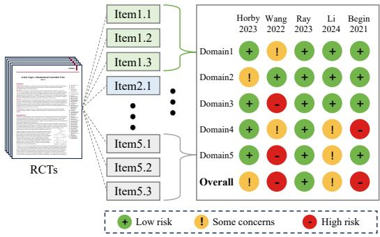
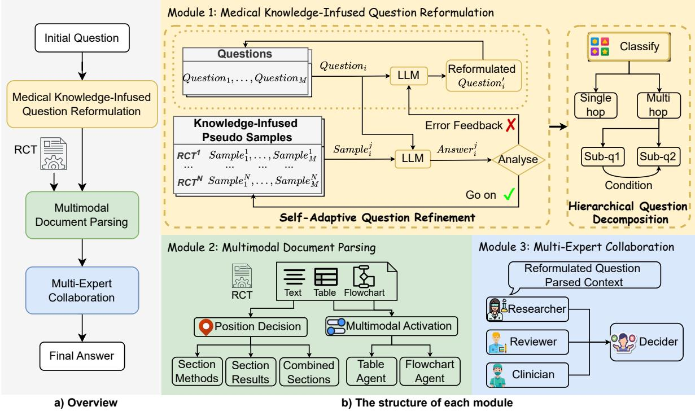
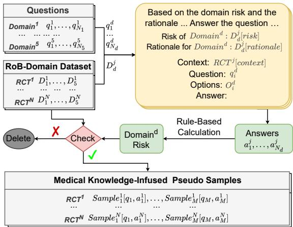
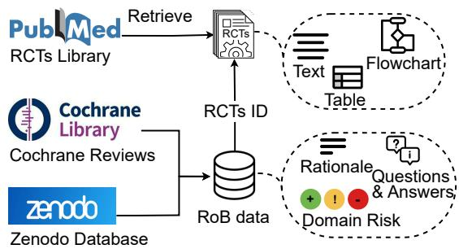
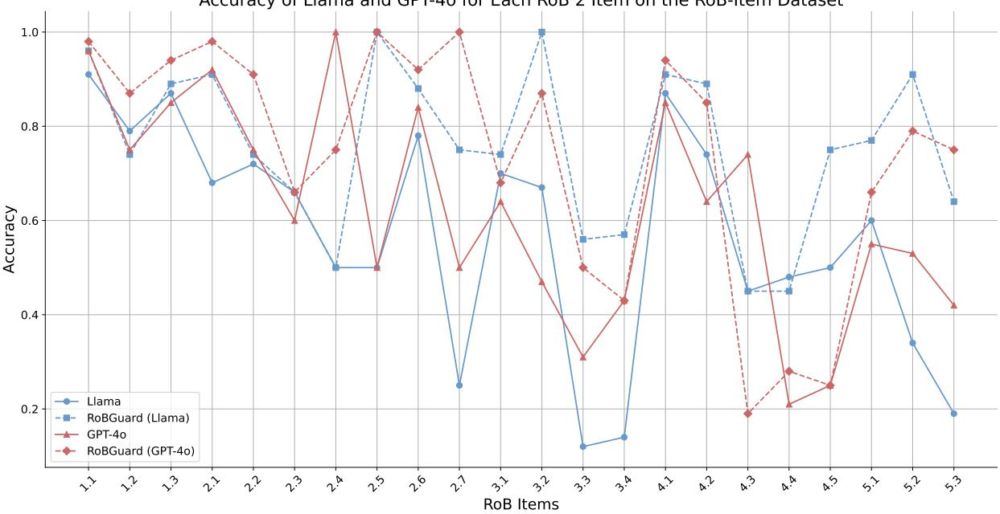
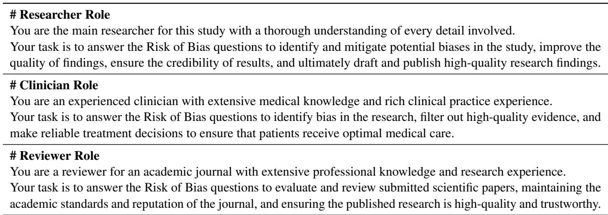
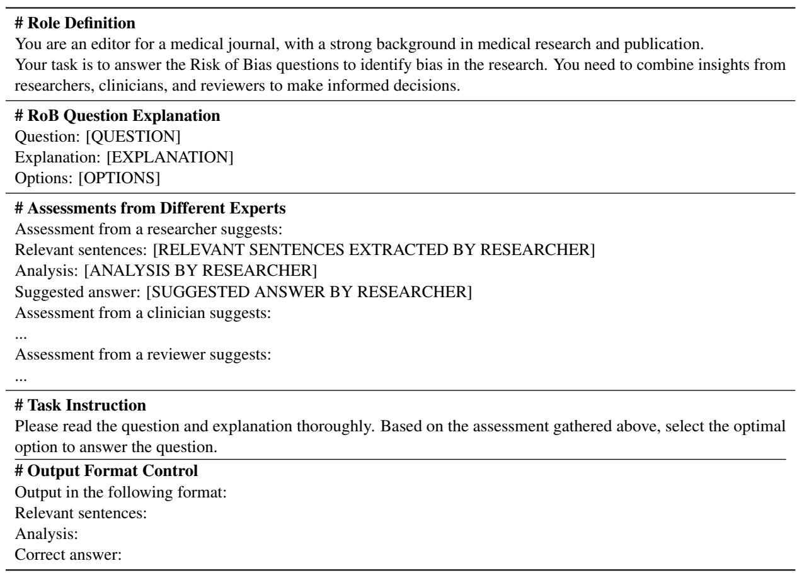

# RoBGuard: Enhancing LLMs to Assess Risk of Bias in Clinical Trial Documents

Changkai Ji1, Bowen Zhao1, Zhuoyao Wang1, Yingwen Wang2,

Yuejie Zhang1, Ying Cheng1, Rui Feng1,2\*, Xiaobo Zhang2\*,

1School of Computer Science, Shanghai Key Laboratory of Intelligent Information Processing, Fudan University, Shanghai 200433,

2National Children’s Medical Center, Children’s Hospital of Fudan University, Shanghai, China Correspondence: fengrui@fudan.edu.cn, zhangxiaobo0307@163.com

## Abstract

Randomized Controlled Trials (RCTs) are rigorous clinical studies crucial for reliable decision-making, but their credibility can be compromised by bias. The Cochrane Risk of Bias tool (RoB 2) assesses this risk, yet manual assessments are time-consuming and laborintensive. Previous approaches have employed Large Language Models (LLMs) to automate this process. However, they typically focus on manually crafted prompts and a restricted set of simple questions, limiting their accuracy and generalizability. Inspired by the human bias assessment process, we propose RoBGuard, a novel framework for enhancing LLMs to assess the risk of bias in RCTs. Specifically, RoB-Guard integrates medical knowledge-enhanced question reformulation, multimodal document parsing, and multi-expert collaboration to ensure both completeness and accuracy. Additionally, to address the lack of suitable datasets, we introduce two new datasets: RoB-Item and RoB-Domain. Experimental results demonstrate RoBGuard’s effectiveness on the RoB-Item dataset, outperforming existing methods.

## 1 Introduction

Randomized Controlled Trials (RCTs) are widelyused scientific experiments in clinical research (Hariton and Locascio, 2018), regarded as the gold standard, and they directly influence clinical decision-making (Sackett et al., 1996; Cartwright, 2007). The risk of bias (RoB) is essential in evaluating the credibility of RCTs, as a high risk can significantly distort experimental outcomes, leading to suboptimal clinical decisions (DeKay et al., 2009). To systematically assess bias in trials, Sterne et al. (2019) introduced the Risk of Bias tool1 (RoB 2), which provides a structured assessment across five domains, each containing multiple specific items, as shown in Figure 1 (Please refer to Appendix A.1 for more details). However, the assessment process of RoB 2 remains complex and time-consuming, with manual evaluations often yielding inconsistent results (Dhrangadhariya et al., 2023). As the number of RCTs continues to grow, manual assessments have become increasingly insufficient for ensuring efficiency and accuracy (de Souza Leão and Eyal, 2019). Consequently, there is an urgent need for an automated, reliable, and efficient RoB assessment method in clinical research.

  
Figure 1: Illustration of the RoB 2 tool assessing the risk of bias across five studies, with each column corresponding to a single study. The RoB 2 tool includes five domains. Each domain contains several assessment items, with responses to these items aggregated to provide a domain risk. The overall risk of bias is then classified as “low risk”, “some concerns”, or “high risk” based on the combined domain risks.

Recent advancements in LLMs (Brown et al., 2020; OpenAI, 2022; Touvron et al., 2023; Bai et al., 2023; OpenAI, 2023) have attracted significant attention in the medical field (Omiye et al., 2023; Thirunavukarasu et al., 2023). Previous efforts have used LLMs for RoB assessment (Lai et al., 2024; Eisele-Metzger et al., 2024), but these approaches rely on manually designed prompts and focus only on simple items, making them unsuitable for the more complex RoB 2 items and limiting both their accuracy and scalability. Automating the full RoB 2 assessment is challenging due to the complexity of certain items, which involve specialized medical terminology and require a deep understanding of the RoB items themselves. Additionally, these items often necessitate comprehension of extensive RCT documents and may require the integration of tables and flowcharts for a comprehensive evaluation. Moreover, the responses to these items are often inherently subjective, further complicating the automation process.

To address these issues, we recall the human evaluation process for RoB assessments: first, interpret the RoB questions, then identify and extract relevant information from the RCTs, and finally rely on multiple assessors to cross-verify and balance judgments, ensuring accuracy and fairness. Drawing inspiration from this process, we propose RoBGuard, an automated framework that addresses the challenge from three key perspectives: question interpretation, document analysis, and evaluation process. Specifically, we introduce a medical knowledge-infused question reformulation module that adaptively refines and decomposes RoB 2 items, which can simplify their interpretation to enhance both efficiency and accuracy. To manage the hierarchical structure, extensive texts, and multimodal data in RCT documents, we develop a multimodal document parsing module, improving document comprehension through a position decision-making strategy and multimodal coordination mechanisms. Finally, to mitigate subjectivity in the assessment process, we implement a multi-expert collaboration mechanism that integrates insights from diverse professional domains, thereby ensuring fairness and consistency in the final evaluation.

Additionally, high-quality datasets are crucial for advancing research. However, annotating medical data is a time-consuming and labor-intensive task that demands specialized expertise (Rother et al., 2021). This challenge is particularly pronounced for RoB 2 assessments, which require not only a deep understanding of RCTs but also extensive knowledge of the specific items in RoB 2. Currently, no publicly available RoB dataset has been released, obstructing advancements in this field.

To fill this research gap, we have developed two datasets: the RoB-Item and RoB-Domain datasets. The RoB-Item dataset includes 53 RCTs, documenting specific answers and supporting rationale for each assessment item across various domains of the RoB 2 tool, offering refined data for itemlevel bias assessment. The RoB-Domain dataset includes 319 RCTs, providing domain-specific risk of bias evaluations. These datasets not only serve as invaluable resources for automated RoB assessment but also contribute to broader multimodal comprehension tasks in medical research.

Overall, our contributions are as follows:

• We propose a novel automated RoB assessment framework, RoBGuard, incorporating medical knowledge-infused question reformulation, multimodal document parsing, and multi-expert collaboration to enhance the accuracy and fairness of RoB assessments.

• We introduce the RoB datasets that integrate reasoning across text, tables, and flowcharts of RCT documents, providing a robust foundation for automated RoB assessment.

• Experiments demonstrate the effectiveness of our approach, and we will make our dataset and code publicly available to support further advancements in RoB assessment research.

## 2 Related work

## 2.1 Automated Risk of Bias Assessment

The volume of clinical research continues to grow, with 254,698 RCTs retrieved between 1991 and 2020, reflecting an average annual growth rate of 7.68% (Zhao et al., 2022). As a result, the automation of risk of bias assessment has become increasingly important. Marshall et al. (2016) was the first to propose automating RoB assessment by introducing RobotReviewer, which used a Support Vector Machine (SVM) (Sain, 1996) to classify the risk of each RCT (Marshall et al., 2014, 2017) based on RoB 1 (Higgins et al., 2011)—the initial version of the RoB tool. RoB 1 provided a basic evaluation through five simple questions but was often found confusing in its application and was therefore replaced by RoB 2. Building on this foundation, Wang et al. (2022) advanced the field by implementing Convolutional Neural Networks (CNN) (Kim, 2014) and BERT-based architectures (Devlin, 2018) to automate RoB assessments. These traditional methods, however, rely on large amounts of training data, yet there is no publicly available RoB dataset, and manual labeling remains both time-consuming and labor-intensive.

With the rapid development of LLMs (Chang et al., 2024; Zhao et al., 2023b,a; Huang et al.,

2023), researchers like Lai et al. (2024) and Eisele-Metzger et al. (2024) have explored their use for RoB assessment by utilizing manually designed prompts. However, their efforts have focused on a few straightforward questions, falling short of the comprehensive evaluation required for RoB 2. In contrast, we are the first to conduct a comprehensive evaluation of RoB 2. Notably, we propose a self-adaptive prompt updating mechanism that integrates external medical knowledge, eliminating the need for manually designed prompts and enhancing the efficiency and accuracy of the assessment.

## 2.2 Large Language Models in Medical Question Answering

Recent advancements in LLMs have generated considerable interest in the medical field (Thirunavukarasu et al., 2023). Previous research has focused on evaluating these models using medical knowledge benchmarks, such as MedQA (Zhang et al., 2018), PubMedQA (Jin et al., 2019), and MedMCQA (Pal et al., 2022), which are designed to test factual recall through multiple-choice questions. However, there has been limited exploration of LLMs’ ability to perform question answering on complex medical documents. While current approaches excel in testing medical knowledge, they often struggle with the nuanced and multimodal information in medical documents (Goyal et al., 2024; Goel et al., 2023), which require deeper understanding and contextual analysis.

The emergence of multi-agent systems has further expanded the capabilities of LLMs in medical question answering (Tang et al., 2023; Yan et al., 2023; Sohail, 2024; Schmidgall et al., 2024). These systems leverage the strengths of multiple LLMs to enable more sophisticated and collaborative approaches to medical question answering. For example, Agent Hospital (Li et al., 2024) simulates a healthcare environment where LLMpowered agents, representing doctors, nurses, and patients, autonomously improve their treatment performance. Similarly, MedAgents (Tang et al., 2023) employs a multidisciplinary collaboration framework that enables LLM-based agents to engage in discussions, improving their proficiency in medical reasoning tasks. Building on these advancements, we adopt a document parsing module to analyze complex RCTs using multiple agents, such as a table agent and a flowchart agent. Additionally, we simulate a multi-expert environment to enhance the accuracy and consistency of RoB assessments.

## 3 Approach

In this section, we introduce RoBGuard, which consists of three modules: Medical Knowledge-Infused Question Reformulation, Multimodal Document Parsing, and Multi-Expert Collaboration. The overall framework is illustrated in Figure 2.

## 3.1 Task Formulation

The RoB assessment focuses on evaluating the Methods and Results sections of RCTs, which are critical in determining potential bias. The RoB 2 tool is structured into five domains, each addressing a specific aspect of trial bias, such as randomization and missing outcome data. Each domain contains multiple questions, denoted as $Q _ { d } = \{ q _ { 1 } ^ { d } , q _ { 2 } ^ { d } , . . . , q _ { N _ { d } } ^ { d } \}$ , where $N _ { d }$ is the number of questions in domain $d .$ Each question $q _ { i } ^ { d }$ is associated with a set of options $O _ { i } ^ { d }$ . The RoB assessment process involves selecting the appropriate option for each question based on the RCT context. The domain-level risk $r _ { d }$ is then calculated according to predefined rules. These domain-level assessments are finally aggregated to provide an overall RoB judgment for the entire RCT. The task can be viewed as a multimodal document questionanswering process, where the RCT is represented through text, tables, and flowcharts, and the goal is to systematically answer each question to determine the final overall risk of bias.

## 3.2 Medical Knowledge-Infused Question Reformulation

To enhance the understanding and processing of complex RoB questions, we propose a medical knowledge-infused question reformulation module. This module integrates external medical knowledge derived from pseudo-labeled item data to guide the optimization and simplification of RoB questions. The process is composed of three key components: (1) Medical Knowledge-Infused Pseudo Samples Labeling, (2) Self-Adaptive Question Refinement, and (3) Hierarchical Question Decomposition.

## 3.2.1 Medical Knowledge-Infused Pseudo Samples Labeling

To make better use of domain-level risk data in our RoB-Domain Dataset, we propose generating pseudo-labeled item-level samples based on this domain-level information. The RoB-Domain Dataset is treated as an external medical knowledge base, where the domain risks and rationales serve as medical knowledge to guide the generation of pseudo-labeled samples.

  
Figure 2: The framework of RoBGuard. To assess the risk of bias in an RCT, the initial RoB question undergoes reformulation through the Medical Knowledge-Infused Question Reformulation module, where LLMs are utilized to refine the question to improve clarity and understanding. Following this, the Multimodal Document Parsing module parses the RCT, including text, tables, and flowcharts, to improve comprehension through multimodal analysis. Finally, the reformulated question, alongside the parsed context, is forwarded to the Multi-Expert Collaboration module to generate the final answer.

  
Figure 3: The framework of medical knowledge-infused pseudo samples labeling. The texts in the yellow background are pseudo-labeling prompts, where the italic texts can be replaced. M is equal to $N _ { 1 } + \cdots + N _ { 5 }$

The pseudo sample labeling process is illustrated in Figure 3. Specifically, for a domain d containing $N _ { d }$ questions $\{ q _ { 1 } ^ { d } , q _ { 2 } ^ { \stackrel { . } { d } } , \ldots , q _ { N _ { d } } ^ { d } \}$ , given the corresponding domain-level information $D _ { d } ^ { j } =$ $\{ r _ { d } ^ { j } , r a _ { d } ^ { j } \}$ in an RCT $R _ { j }$ , where $r _ { d } ^ { j }$ represents the risk and $r a _ { d } ^ { j }$ is the rationale, we design a pseudo sample labeling prompt $P _ { p l }$ . This prompt guides an LLM to generate an answer $a _ { i } ^ { j }$ for the question $q _ { i } ^ { d }$ by taking into account the context $C _ { j }$ of the RCT and the domain-level information $D _ { d } ^ { j } .$ The answer generation process can be formally expressed as:

$$
a _ { i } ^ { j } = { \tt L L M } ( P _ { p l } , q _ { i } ^ { d } , C _ { j } , O _ { i } ^ { d } , D _ { d } ^ { j } ) .\tag{1}
$$

After generating all the item-level answers $A _ { j } =$ $( a _ { 1 } ^ { j } , a _ { 2 } ^ { j } , \ldots , a _ { N _ { d } } ^ { j } )$ within domain d for RCT $R _ { j }$ , we calculate the domain risk $r _ { d } ^ { \prime }$ based on the item-level answers using predefined domain risk rules:

$$
\boldsymbol { r } _ { d } ^ { \prime } = f ( a _ { 1 } ^ { j } , a _ { 2 } ^ { j } , \ldots , a _ { N _ { d } } ^ { j } ) ,\tag{2}
$$

where $f$ ✔︎is the function that calculates the domain risk based on the answers to the items in that domain, as detailed in Appendix A.2. This calculated domain risk $r _ { d } ^ { \prime }$ is then compared with the original domain risk rd. If $r _ { d } ^ { \prime } = r _ { d }$ , the question-answer samples ${ \cal S } = \{ s _ { 1 } ^ { j } , \ldots , s _ { N _ { d } } ^ { j } \}$ in domain $d ,$ where $s _ { i } ^ { j } \ = \ ( q _ { i } ^ { d } , a _ { i } ^ { j } )$ , are considered valid and labeled as medical knowledge-infused pseudo samples. If the risks do not match, the samples are discarded. This process is repeated for each RCT in the RoB-Domain Dataset, ensuring that all RCTs are processed, resulting in a pool of pseudo samples.

## 3.2.2 Self-Adaptive Question Refinement

Using the pseudo samples, we implement a selfadaptive question refinement process to enhance the clarity and precision of the RoB questions. We assume there are M questions in total, where $M = N _ { 1 } + \cdots + N _ { d }$ . Initially, we use an LLM to format each question $q _ { i }$ as follows: “Question: $q _ { i } ,$ Explanation: answer ... $i f . . . ^ { \prime } .$ For each item, we select a related pseudo sample $s _ { i } ^ { j }$ from the pseudo samples pool and design an initial RoB assessment prompt $P _ { r a } .$ The goal of $P _ { r a }$ is to generate an answer $a n s _ { i } ^ { \mathcal { I } }$ for $q _ { i }$ based on the RCT context $C _ { j }$ using the following process:

$$
a n s _ { i } ^ { j } = \mathrm { L L M } ( P _ { r a } , q _ { i } , C _ { j } , O _ { i } ) .\tag{3}
$$

If $a n s _ { i } ^ { j }$ matches the pseudo answer $a _ { i } ^ { j }$ from the pseudo sample, we proceed to the next sample. However, if $a n s _ { i } ^ { j }$ is incorrect, we hypothesize that the explanation for $q _ { i }$ may be unclear or difficult to interpret. In such cases, we ask the LLM to provide an error feedback $e f$ using the prompt $P _ { e f } \mathrm { : }$

$$
e f = \mathrm { L L M } ( P _ { e f } , q _ { i } , a n s _ { i } ^ { j } , a _ { i } ^ { j } ) .\tag{4}
$$

Once the LLM provides error analysis and feedback, we instruct the LLM to refine the explanation for the question using the prompt $P _ { r \epsilon }$ . The refined question $q _ { i } ^ { \prime }$ then replaces the original question $q _ { i } \colon$

$$
q _ { i } ^ { \prime } = \operatorname { L L M } ( P _ { r e } , q _ { i } , e f ) .\tag{5}
$$

This refinement process repeats until all pseudo samples have been processed. The knowledgeinfused refinement enhances the clarity and understanding of each question, ensuring that the model accurately captures the essence of each RoB item, thus improving the overall quality of the assessment process.

## 3.2.3 Hierarchical Question Decomposition

Furthermore, a hierarchical question decomposition module is introduced to break down complex RoB questions that require multi-step reasoning into simpler sub-questions. As illustrated in Figure 2, questions are first classified as either single-hop or multi-hop. Single-hop questions are answered directly, while multi-hop questions are decomposed into smaller sub-questions, which are solved step by step. The final answer is obtained by combining the sub-questions with the sub-answers. This structured decomposition reduces the model’s cognitive load, leading to more accurate and efficient RoB item processing.

## 3.3 Multimodal Document Parsing

## 3.3.1 Position Decision-making

RCTs often contain lengthy texts, with crucial biasrelated information intricately embedded within the text, creating significant challenges for context comprehension. To address this issue, we leverage the hierarchical structure of RCTs by implementing an intelligent position decision-making system. Before responding to questions, our approach involves precisely identifying the relevant background information, whether located in the methods section, the results section, or a combination of both. By accurately isolating these key sections, we effectively reduce the interference caused by dispersed data in lengthy documents, thereby enhancing the model’s analytical efficiency and response accuracy.

## 3.3.2 Multimodal Coordination

Additionally, RCTs include not only traditional textual data but also multimodal content, such as tables and flowcharts, which further complicates comprehension. To manage this complexity, we develop the Table Agent and Flowchart Agent, specialized tools designed to analyze tables and flowcharts, respectively. Specifically, two agents are defined as skilled table and flowchart analysts, respectively, extracting information in the order presented within the table or flowchart. All agents are used LLMs. The agents take the question and corresponding table or flowchart as input, and the final answer is derived by integrating their analysis with the RCT text analysis results (More details in the Appendix D.3). These agents are automatically activated when the system detects relevant questions, ensuring that the system maintains both efficiency and accuracy when processing complex multimodal information.

## 3.4 Multi-Expert Collaboration

Given the varied backgrounds and experiences of evaluators, discrepancies in the interpretation and judgment of the same item may occur, leading to concerns about subjectivity and consistency in assessment outcomes. To enhance fairness and reliability, we have established a panel of experts who work together to reach a consensus, reducing the subjective biases of individual evaluators.

  
Figure 4: Illustration of dataset construction. RoB data is collected from Cochrane Reviews and the Zenodo Database, including question-answer pairs, supporting rationales, and domain-specific risk assessments. Relevant RCTs are retrieved from the PubMed library, containing key elements such as text, table, and flowchart.

Within the Multi-Expert Collaboration Module, we have assembled a multidisciplinary team comprising a researcher, a clinician, and a reviewer. Each expert independently assesses the risk of bias in RCTs based on their specialized knowledge (Detailed role designs are in the Appendix D.4), with preliminary conclusions synthesized through a voting process. If there are tied votes or difficulties in reaching a consensus, a decider intervenes to integrate the diverse perspectives, ensuring that the final assessment is both fair and consistent.

## 4 Dataset Construction

## 4.1 Data Collection

A systematic review is a comprehensive summary of all available medical research on a specific clinical question, systematically collecting and synthesizing clinical studies to provide reliable evidence (Aromataris and Pearson, 2014). RCTs, often considered high-quality evidence, are typically included in these reviews and undergo RoB assessments. Therefore, we obtain RoB data through systematic reviews, eliminating the need for laborintensive manual annotation.

We collect systematic reviews published between July 2019 and June 2024 from the Cochrane Library2, focusing on those that utilize the RoB 2 tool for risk of bias assessment. Some systematic reviews have made detailed RCT assessment data publicly available on Zenodo3, including item-level answers and rationales, while others provide only domain-level risk assessments, offering the risk rating and rationale for each domain. We gather both types of data and trace the references using the RCT IDs. Subsequently, we filter RCTs indexed in PubMed Central4 (PMC) and extract the full content of these RCTs, including multimodal data such as text, tables, and flowcharts. The data collection process is illustrated in Figure 4.

<table><tr><td></td><td>RoB-Item</td><td>RoB-Domain</td></tr><tr><td>No. documents</td><td>53</td><td>319</td></tr><tr><td>Max No. words per document</td><td>7,067</td><td>10,775</td></tr><tr><td>Avg No. words per document</td><td>4,561</td><td>4,395</td></tr><tr><td>Avg No. sentences per document</td><td>236</td><td>229</td></tr><tr><td>Avg No. words per sentence</td><td>20</td><td>19</td></tr></table>

Table 1: The statistics of the RoB-Item and RoB-Domain datasets.

## 4.2 Dataset Analysis

Among the collected systematic reviews, 124 reviews employ the RoB 2 tool to assess risk of bias for the included RCTs, covering a total of 1,472 RCTs, of which 319 are successfully retrieved from PMC. Of these, only 12 systematic reviews publicly share item-level data for each RCT on Zenodo, covering 94 RCTs, with 53 available from PMC. Based on these data, we construct two distinct datasets: the RoB-Domain Dataset and the RoB-Item Dataset.

The statistics for the datasets are shown in Table 1. Both the RoB-Item and RoB-Domain datasets consist of lengthy documents. The RoB-Item dataset contains a maximum of 7,067 words in its longest document, with an average of 4,561 words per document. Nearly every RCT includes tables and flowcharts. Similarly, the RoB-Domain dataset exhibits comparable characteristics, presenting substantial challenges for current document understanding models.

## 5 Experiments

## 5.1 Setup

To demonstrate the generalizability of our approach, we conduct experiments using both the open-source Llama (Touvron et al., 2023) model and the closed-source GPT-4o (Islam and Moushi, 2024) model. Specifically, we utilize the Meta-Llama-3-8B-Instruct5 checkpoint and GPT-4o-mini 6. Since the context length limit of Llama 3 is 8k tokens, if the input exceeds this limit, we process the context in segments and combine the results. The full set of prompts can be found in the Appendix D.

<table><tr><td>Method</td><td>1.1</td><td>1.2</td><td>1.3</td><td>2.1</td><td>2.2</td><td></td><td>2.3</td><td>2.4</td><td>2.5</td><td>2.6</td><td>2.7</td><td>3.1</td><td>3.2</td><td>3.3</td><td>3.4</td><td></td><td>4.1</td><td>4.2</td><td>4.3</td><td>4.4</td><td>4.5</td><td>5.1</td><td>5.2</td><td>5.3</td></tr><tr><td>Llama</td><td>0.91</td><td>0.79</td><td>0.87</td><td>0.68</td><td></td><td>0.72</td><td>0.66</td><td>0.50</td><td>0.50</td><td>0.78</td><td>0.25</td><td>0.70</td><td>0.67</td><td></td><td>0.12</td><td>0.14</td><td>0.87</td><td>0.74</td><td>0.45</td><td>0.48</td><td>0.50</td><td>0.60</td><td></td><td>0.34 0.19</td></tr><tr><td>RoBGuard (Llama)</td><td>0.96</td><td>0.74</td><td>0.89</td><td>0.91</td><td></td><td>0.74</td><td>0.66</td><td>0.50</td><td>1.00</td><td>0.88</td><td>0.75</td><td>0.74</td><td>1.00</td><td>0.56</td><td>0.57</td><td>0.91</td><td></td><td>0.89</td><td>0.45</td><td>0.45</td><td>0.75</td><td>0.77</td><td>0.91</td><td>0.64</td></tr><tr><td>GPT-40</td><td>0.96</td><td>0.75</td><td>0.85</td><td>0.92</td><td></td><td>0.75</td><td>0.60</td><td>1.00</td><td>0.50</td><td>0.84</td><td>0.50</td><td>0.64</td><td>0.47</td><td>0.31</td><td>0.43</td><td>0.85</td><td>0.64</td><td></td><td>0.74</td><td>0.21</td><td>0.25</td><td>0.55</td><td>0.53</td><td>0.42</td></tr><tr><td>RoBGuard (GPT-4o)</td><td>0.98</td><td>0.87</td><td>0.94</td><td>0.98</td><td></td><td>0.91</td><td>0.66</td><td>0.75</td><td>1.00</td><td>0.92</td><td>1.00</td><td>0.68</td><td>0.87</td><td>0.50</td><td>0.43</td><td>0.94</td><td>0.85</td><td></td><td>0.19</td><td>0.28</td><td>0.25</td><td>0.66</td><td>0.79</td><td>0.75</td></tr></table>

Table 2: Accuracy of different models for each RoB 2 item on the RoB-Item Dataset. The best Accuracy for each item is highlighted in bold. A line graph presentation is available in the Appendix C.2 for better comparison.

<table><tr><td>Method</td><td>Metric</td><td>D1</td><td>D2</td><td>D3</td><td>D4</td><td>D5</td><td>Overall</td></tr><tr><td rowspan="3">Llama</td><td>Acc. Prec.</td><td>0.66 0.85</td><td>0.60</td><td>0.74</td><td>0.64</td><td>0.02</td><td>0.19</td></tr><tr><td></td><td></td><td>0.86</td><td>0.87</td><td>0.94</td><td>0.00</td><td>0.00</td></tr><tr><td>Rec. F1</td><td>0.78 0.81</td><td>0.68 0.76</td><td>0.85 0.86</td><td>0.69 0.80</td><td>0.00 0.00</td><td>0.00 0.00</td></tr><tr><td rowspan="4">RoBGuard (Llama)</td><td>Acc.</td><td>0.68</td><td>0.58</td><td>0.87</td><td>0.79</td><td>0.57</td><td>0.34</td></tr><tr><td>Prec.</td><td>0.85</td><td>0.88</td><td>0.87</td><td>0.91</td><td>0.85</td><td>0.62</td></tr><tr><td>Rec.</td><td>0.78</td><td>0.64</td><td>1.00</td><td>0.86</td><td>0.70</td><td>0.38</td></tr><tr><td>F1</td><td>0.81</td><td>0.74 0.93</td><td>0.88</td><td>0.77</td><td></td><td>0.48</td></tr><tr><td rowspan="4">GPT-40</td><td>Acc.</td><td>0.68</td><td>0.58</td><td>0.77</td><td>0.47</td><td>0.23</td><td>0.25</td></tr><tr><td>Prec.</td><td>0.92</td><td>0.87</td><td>0.85</td><td>0.96</td><td>0.88</td><td>1.00</td></tr><tr><td>Rec.</td><td>0.78</td><td>0.61</td><td>0.89</td><td>0.51</td><td>0.18</td><td>0.08</td></tr><tr><td>F1</td><td>0.84</td><td>0.72</td><td>0.87</td><td>0.67</td><td>0.29</td><td>0.14</td></tr><tr><td rowspan="4">RoBGuard (GPT-4o)</td><td>Acc.</td><td>0.81</td><td>0.72</td><td>0.87</td><td>0.75</td><td>0.43</td><td>0.34</td></tr><tr><td>Prec.</td><td>0.89</td><td>0.86</td><td>0.87</td><td>0.98</td><td>0.73</td><td>0.59</td></tr><tr><td>Rec.</td><td>0.93</td><td>0.82</td><td>1.00</td><td>0.80</td><td>0.55</td><td>0.38</td></tr><tr><td>Fl</td><td>0.91</td><td>0.84</td><td>0.93</td><td>0.88</td><td>0.63</td><td>0.47</td></tr></table>

Table 3: Performance of different models for domainlevel assessments on the RoB-Item Dataset. D1 to D5 refer to Domain 1 through Domain 5. “Acc.” represents the overall Accuracy across all risk categories, while “Prec.”, “Rec.”, and “F1” specifically refer to Precision, Recall, and F1 score for the identification of low-risk categories. The best results for each metric, both within each domain and overall, are highlighted in bold.

## 5.2 Evaluation Metrics

To comprehensively evaluate the model’s performance and ensure scientific rigor, we focus on two key aspects: item-level evaluation and domainlevel assessment. 1) For individual items, we use Accuracy to measure the correctness of the model’s responses. 2) For domain and overall risk assessment, where accurately identifying low-risk RCTs is critical for clinical application, we emphasize the model’s performance in recognizing the “lowrisk” category. Therefore, in addition to the overall Accuracy, we calculate Precision, Recall, and F1 score for the low-risk category.

## 5.3 Main Results

We present the performance of various models on the RoB-Item Dataset, including both item-level (Table 2) and domain-level (Table 3) assessments. The results demonstrate that our RoBGuard model outperforms baseline models (Llama and GPT-4o) across the majority of items. More experimental results on other mainstream LLMs are presented in Table 7 of Appendix C.2.

## 5.3.1 Item-Level Evaluation

In the item-level assessment (Table 2), RoBGuard outperforms both Llama and GPT-4o baselines on most RoB 2 items. Vanilla LLMs perform well on simpler items, such as item 1.1, which asks a straightforward question about randomization. However, as the complexity of the items increases, vanilla LLMs struggle to maintain competitive performance. For example, in item 5.2, which involves identifying multiple outcome measures and assessing selective reporting, RoBGuard achieves a notable Accuracy score of 0.91, whereas Llama significantly underperforms with an Accuracy score of only 0.34. This highlights RoBGuard’s superior ability to handle complex and nuanced RoB items. For items requiring multimodal parsing, such as item 1.3 and item 3.1, our approach shows modest improvements over both Llama and GPT-4o, demonstrating its capability to extract relevant information from multimodal data. However, in some cases, the performance gains are marginal. For instance, in item 4.3, RoBGuard does not outperform the baselines, suggesting that its multi-step reasoning approach may occasionally introduce unnecessary complexity or misinterpret information, leading to suboptimal results.

## 5.3.2 Domain-Level Evaluation

At the domain level (Table 3), RoBGuard also shows an advantage over the baseline models, especially in identifying low-risk RCTs. For example, in Domain 3, RoBGuard (Llama) achieves an Accuracy of 0.87 and F1 score of 0.93, compared to Llama’s 0.74 and 0.86, showcasing its strength in detecting low-risk cases. However, in simpler domains like Domain 1, the improvement is modest, suggesting RoBGuard excels in tasks requiring multi-step reasoning. For the overall domain-level performance, vanilla LLMs achieve both Precision and Recall scores of 0, indicating a tendency to classify all RCTs as non-low-risk. RoBGuard improves the model’s ability to identify low-risk RCTs, with higher precision indicating more reliable identification of true low-risk cases, while the boost in recall reduces the chance of overlooking low-risk, high-quality studies.

<table><tr><td>MDP</td><td>MKQR</td><td>MC</td><td>1.1</td><td>1.2</td><td>1.3</td><td>2.1</td><td>2.2</td><td>2.3</td><td>2.4</td><td>2.5</td><td>2.6</td><td>2.7</td><td>3.1</td><td>3.2</td><td>3.3</td><td>3.4</td><td>4.1</td><td>4.2</td><td>4.3</td><td>4.4</td><td></td><td>4.5</td><td>5.1</td><td>5.2 5.3</td></tr><tr><td></td><td></td><td></td><td>0.91</td><td>0.79</td><td>0.87</td><td>0.68</td><td>0.72</td><td>0.66</td><td>0.50</td><td>0.50</td><td>0.78</td><td>0.25</td><td>0.70</td><td>0.67</td><td>0.12</td><td>0.14</td><td>0.87</td><td>0.74</td><td>0.45</td><td>0.48</td><td>0.50</td><td>0.60</td><td>0.34</td><td>0.19</td></tr><tr><td>√</td><td></td><td></td><td>0.92</td><td>0.72</td><td>0.94</td><td>0.75</td><td>0.77</td><td>0.69</td><td>0.50</td><td>0.50</td><td>0.78</td><td>0.75</td><td>0.60</td><td>0.53</td><td>0.19</td><td>0.43</td><td>0.77</td><td>0.49</td><td>0.42</td><td>0.34</td><td>0.50</td><td>0.45</td><td>0.28</td><td>0.19</td></tr><tr><td>√</td><td>√</td><td></td><td>0.96</td><td>0.74</td><td>0.92</td><td>0.85</td><td>0.81</td><td>0.63</td><td>0.75</td><td>1.00</td><td>0.86</td><td>1.00</td><td>0.66</td><td>0.93</td><td>0.31</td><td>0.57</td><td>0.87</td><td>0.81</td><td>0.42</td><td>0.62</td><td>1.00</td><td>0.51</td><td>0.79</td><td>0.79</td></tr><tr><td>√</td><td>√</td><td>√</td><td>0.96</td><td>0.74</td><td>0.89</td><td>0.91</td><td>0.74</td><td>0.66</td><td>0.50</td><td>1.00</td><td>0.88</td><td>0.75</td><td>0.74</td><td>1.00</td><td>0.56</td><td>0.57</td><td>0.91</td><td>0.89</td><td>0.45</td><td>0.45</td><td>0.75</td><td>0.77</td><td>0.91</td><td>0.64</td></tr></table>

Table 4: Ablation study on the impact of different modules using Llama for item-level assessments on the RoB-Item Dataset, evaluated with the accuracy metric. MDP refers to multimodal document parsing, MKQR represents medical knowledge-infused question reformulation, and MC denotes multi-expert collaboration.
<table><tr><td rowspan="2">MDP</td><td rowspan="2">MKQR</td><td rowspan="2">MC</td><td rowspan="2">Acc.</td><td colspan="3">Domain1</td><td colspan="4">Domain2</td><td colspan="4">Domain3</td><td colspan="4">Domain4</td><td colspan="4">Domain5</td><td colspan="4">Overall</td></tr><tr><td>Prec.</td><td>Rec.</td><td>F1</td><td>Acc.</td><td>Prec.</td><td>Rec.</td><td>F1</td><td>Acc.</td><td>Prec.</td><td>Rec.</td><td>F1</td><td>Acc.</td><td>Prec.</td><td>Rec.</td><td>F1</td><td>Acc.</td><td>Prec.</td><td>Rec.</td><td>F1</td><td>Acc.</td><td>Prec.</td><td>Rec.</td><td>F1</td></tr><tr><td></td><td></td><td></td><td>0.66</td><td>0.78</td><td>0.81</td><td>0.60</td><td>0.86</td><td>0.68</td><td>0.76</td><td>0.74</td><td></td><td>0.87</td><td>0.85</td><td>0.86</td><td>0.64</td><td>0.94</td><td>0.69</td><td>0.80</td><td>0.02</td><td>0.00</td><td>0.00</td><td>0.00</td><td>0.19</td><td>0.00</td><td>0.00</td><td>0.00</td></tr><tr><td>√</td><td></td><td></td><td>0.66</td><td>0.85 0.87</td><td>0.76</td><td>0.57</td><td></td><td>0.81</td><td>0.68</td><td>0.74</td><td>0.72</td><td>0.84</td><td>0.83</td><td>0.84</td><td>0.40</td><td>0.95</td><td>0.43</td><td>0.59</td><td>0.06</td><td>1.00</td><td>0.02</td><td>0.05</td><td>0.15</td><td>0.00</td><td>0.00</td><td>0.00</td></tr><tr><td>√</td><td></td><td></td><td>0.70</td><td>0.88</td><td>0.82</td><td>0.81 0.85</td><td>0.66</td><td>0.89</td><td>0.75</td><td>0.81</td><td>0.85</td><td>0.87</td><td>0.98</td><td>0.92</td><td>0.68</td><td>0.95</td><td>0.73</td><td>0.83</td><td>0.40</td><td>0.73</td><td>0.40</td><td>0.52</td><td>0.30</td><td>0.73</td><td>0.31</td><td>0.43</td></tr><tr><td>V</td><td></td><td></td><td>0.68</td><td>0.85</td><td>0.78</td><td>0.81</td><td>0.58</td><td>0.88</td><td>0.64</td><td>0.74</td><td>0.87</td><td>0.87</td><td>1.00</td><td>0.93</td><td>0.79</td><td>0.91</td><td>0.86</td><td>0.88</td><td>0.57</td><td>0.85</td><td>0.70</td><td>0.77</td><td>0.34</td><td>0.62</td><td>0.38</td><td>0.48</td></tr></table>

Table 5: Ablation study on the impact of different modules using Llama for domain-level assessments on the RoB-Item Dataset.

## 5.4 Ablation Study

We systematically evaluate the contributions of the three modules in our framework—Multimodal Document Parsing (MDP), Medical Knowledge-Infused Question Reformulation (MKQR), and Multi-Expert Collaboration (MC)—on both itemlevel (Table 4) and domain-level (Table 5) assessments using the RoB-Item Dataset with Llama.

The MDP module provides marginal improvements across most items, suggesting that accurately locating relevant text helps mitigate the effect of dispersed information in lengthy documents. Notably, items like 1.3, which require an understanding of tables, show clear improvements, highlighting MDP’s ability to process and integrate multimodal content. The addition of the MKQR module further enhances performance, particularly for items requiring complex reasoning, such as 3.4 and 5.2. This underscores the importance of reformulating questions with external medical knowledge, enabling the model to better handle intricate items. The MC module provides additional performance improvements, especially in high-complexity cases where individual biases might affect outcomes, as observed in Domain 5. By integrating expert opinions, the MC ensures fairer assessments through voting, leading to more reliable conclusions.

## 5.5 Analysis

RoBGuard represents a significant advancement in automated RoB assessment, particularly in detecting low-risk cases. However, the Accuracy in assessing overall risk remains relatively low, primarily because the overall risk is calculated from domain risks using predefined rules. As a result, errors in individual domain assessments accumulate, ultimately affecting the final overall risk assessments. Additionally, not all modules are equally beneficial across all items; complex processing mechanisms can introduce unnecessary overhead for simpler tasks. Striking a balance between advanced reasoning for complex items and maintaining simplicity for straightforward ones will be a key focus for our future work.

## 6 Conclusion

We present RoBGuard, a novel automated framework for assessing risk of bias in RCTs. RoBGuard integrates three modules: medical knowledgeinfused question reformulation, multimodal document parsing, and multi-expert collaboration, all designed to enhance the precision and efficiency of RoB assessments. Additionally, we have developed two specialized datasets to support both item-level and domain-level evaluations, offering a valuable resource for the broader research community. Our work establishes a foundation for more reliable and efficient RoB evaluations, with significant implications for improving the quality of clinical research.

## Limitations

While our approach outperforms the baselines in both item-level and domain-level assessments, several limitations remain.

• First, overall risk accuracy is reduced due to error accumulation across domains, where misclassifications in one domain impact the final risk assessment.

• Second, the model exhibits varying performance across different items, which is influenced by the difficulty level of each item.

• Lastly, the complexity of certain modules may not benefit simpler items, potentially introducing unnecessary overhead. Future work should focus on optimizing module complexity to handle simpler items more efficiently.

## Ethics Statement

This research adheres to ethical standards in line with best practices for AI and clinical research. While our method assists in the automated assessment of bias in RCTs, it is intended to support—not replace—human expertise and judgment. We advocate for a collaborative model where technology enhances the efficiency of bias detection while researchers retain responsibility for interpreting results and making informed decisions. Our approach contributes to improving transparency in clinical trial reporting, encouraging responsible use and further refinement of the tool by the research community.

## Acknowledgements

This work was supported in part by the National Natural Science Foundation of China (No.62172101), and in part by the Science and Technology Commission of Shanghai Municipality (No.23511100602) and Corpus Construction for Large Language Models in Pediatric Respiratory Diseases(No.2024-GZL-RGZN-01013), and supported by the Postdoctoral Fellowship Program of CPSF (No. GZC20230483).

## References

Edoardo Aromataris and Alan Pearson. 2014. The systematic review: an overview. AJN The American Journal ofNursing, 114(3):53–58.

Jinze Bai, Shuai Bai, Yunfei Chu, Zeyu Cui, Kai Dang, Xiaodong Deng, Yang Fan, Wenbin Ge, Yu Han, Fei Huang, et al. 2023. Qwen technical report. arXiv preprint arXiv:2309.16609.

Tom Brown, Benjamin Mann, Nick Ryder, Melanie Subbiah, Jared D Kaplan, Prafulla Dhariwal, Arvind Neelakantan, Pranav Shyam, Girish Sastry, Amanda Askell, et al. 2020. Language models are few-shot learners. Advances in neural information processing systems, 33:1877–1901.

Nancy Cartwright. 2007. Are rcts the gold standard? BioSocieties, 2(1):11–20.

Yupeng Chang, Xu Wang, Jindong Wang, Yuan Wu, Linyi Yang, Kaijie Zhu, Hao Chen, Xiaoyuan Yi, Cunxiang Wang, Yidong Wang, et al. 2024. A survey on evaluation of large language models. ACM Transactions on Intelligent Systems and Technology, 15(3):1–45.

Luciana de Souza Leão and Gil Eyal. 2019. The rise of randomized controlled trials (rcts) in international development in historical perspective. Theory and Society, 48:383–418.

Michael L DeKay, Dalia Patiño-Echeverri, and Paul S Fischbeck. 2009. Distortion of probability and outcome information in risky decisions. Organizational Behavior and Human Decision Processes, 109(1):79– 92.

Jacob Devlin. 2018. Bert: Pre-training of deep bidirectional transformers for language understanding. arXiv preprint arXiv:1810.04805.

Anjani Dhrangadhariya, Roger Hilfiker, Martin Sattelmayer, Katia Giacomino, Rahel Caliesch, Simone Elsig, Nona Naderi, and Henning Müller. 2023. First steps towards a risk of bias corpus of randomized controlled trials. Caring is Sharing–Exploiting the Value in Datafor Health and Innovation, pages 586–590.

Angelika Eisele-Metzger, Judith-Lisa Lieberum, Markus Toews, Waldemar Siemens, Felix Heilmeyer, Christian Haverkamp, Daniel Boehringer, and Joerg J Meerpohl. 2024. Exploring the potential of claude 2 for risk of bias assessment: Using a large language model to assess randomized controlled trials with rob 2. medRxiv.

Team GLM, Aohan Zeng, Bin Xu, Bowen Wang, Chenhui Zhang, Da Yin, Diego Rojas, Guanyu Feng, Hanlin Zhao, Hanyu Lai, et al. 2024. Chatglm: A family of large language models from glm-130b to glm-4 all tools. arXiv preprint arXiv:2406.12793.

Akshay Goel, Almog Gueta, Omry Gilon, Chang Liu, Sofia Erell, Lan Huong Nguyen, Xiaohong Hao,

Bolous Jaber, Shashir Reddy, Rupesh Kartha, et al. 2023. Llms accelerate annotation for medical information extraction. In Machine Learningfor Health (ML4H), pages 82–100. PMLR.

Sagar Goyal, Eti Rastogi, Sree Prasanna Rajagopal, Dong Yuan, Fen Zhao, Jai Chintagunta, Gautam Naik, and Jeff Ward. 2024. Healai: A healthcare llm for effective medical documentation. In Proceedings of the 17th ACM International Conference on Web Search and Data Mining, pages 1167–1168.

Eduardo Hariton and Joseph J Locascio. 2018. Randomised controlled trials—the gold standard for effectiveness research. BJOG: an internationaljournal of obstetrics and gynaecology, 125(13):1716.

Julian PT Higgins, Douglas G Altman, Peter C Gøtzsche, Peter Jüni, David Moher, Andrew D Oxman, Jelena Savovic, Kenneth F Schulz, Laura´ Weeks, and Jonathan AC Sterne. 2011. The cochrane collaboration’s tool for assessing risk of bias in randomised trials. Bmj, 343.

Julian PT Higgins, Jelena Savovic, Matthew J Page,´ Roy G Elbers, and Jonathan AC Sterne. 2019. Assessing risk of bias in a randomized trial. Cochrane handbook for systematic reviews of interventions, pages 205–228.

Xinyu Huang, Youcai Zhang, Jinyu Ma, Weiwei Tian, Rui Feng, Yuejie Zhang, Yaqian Li, Yandong Guo, and Lei Zhang. 2023. Tag2text: Guiding visionlanguage model via image tagging. arXiv preprint arXiv:2303.05657.

Raisa Islam and Owana Marzia Moushi. 2024. Gpt-4o: The cutting-edge advancement in multimodal llm. Authorea Preprints.

Qiao Jin, Bhuwan Dhingra, Zhengping Liu, William W Cohen, and Xinghua Lu. 2019. Pubmedqa: A dataset for biomedical research question answering. arXiv preprint arXiv:1909.06146.

Yoon Kim. 2014. Convolutional neural networks for sentence classification. In Proceedings of the 2014 Conference on Empirical Methods in Natural Language Processing (EMNLP), pages 1746–1751, Doha, Qatar. Association for Computational Linguistics.

Honghao Lai, Long Ge, Mingyao Sun, Bei Pan, Jiajie Huang, Liangying Hou, Qiuyu Yang, Jiayi Liu, Jianing Liu, Ziying Ye, et al. 2024. Assessing the risk of bias in randomized clinical trials with large language models. JAMA Network Open, 7(5):e2412687– e2412687.

Junkai Li, Siyu Wang, Meng Zhang, Weitao Li, Yunghwei Lai, Xinhui Kang, Weizhi Ma, and Yang Liu. 2024. Agent hospital: A simulacrum of hospital with evolvable medical agents. Preprint, arXiv:2405.02957.

Iain J Marshall, Joël Kuiper, Edward Banner, and Byron C Wallace. 2017. Automating biomedical evidence synthesis: Robotreviewer. In Proceedings of the conference. Associationfor Computational Linguistics. Meeting, volume 2017, page 7. NIH Public Access.

Iain J Marshall, Joël Kuiper, and Byron C Wallace. 2014. Automating risk of bias assessment for clinical trials. In proceedings of the 5th ACM Conference on Bioinformatics, Computational Biology, and Health Informatics, pages 88–95.

Iain J Marshall, Joël Kuiper, and Byron C Wallace. 2016. Robotreviewer: evaluation of a system for automatically assessing bias in clinical trials. Journal ofthe American Medical Informatics Association, 23(1):193–201.

Silvia Minozzi, Michela Cinquini, Silvia Gianola, Marien Gonzalez-Lorenzo, and Rita Banzi. 2020. The revised cochrane risk of bias tool for randomized trials (rob 2) showed low interrater reliability and challenges in its application. Journal ofclinical epidemiology, 126:37–44.

Claude Models. 2023. Model card and evaluations for claude models.

Jesutofunmi A Omiye, Jenna C Lester, Simon Spichak, Veronica Rotemberg, and Roxana Daneshjou. 2023. Large language models propagate race-based medicine. NPJ Digital Medicine, 6(1):195.

OpenAI. 2022. Chatgpt.

OpenAI. 2023. GPT-4 technical report. ArXiv, abs/2303.08774.

Ankit Pal, Logesh Kumar Umapathi, and Malaikannan Sankarasubbu. 2022. Medmcqa: A large-scale multi-subject multi-choice dataset for medical domain question answering. In Conference on health, inference, and learning, pages 248–260. PMLR.

Anne Rother, Uli Niemann, Tommy Hielscher, Henry Völzke, Till Ittermann, and Myra Spiliopoulou. 2021. Assessing the difficulty of annotating medical data in crowdworking with help of experiments. PloS one, 16(7):e0254764.

David L Sackett, William MC Rosenberg, JA Muir Gray, R Brian Haynes, and W Scott Richardson. 1996. Evidence based medicine: what it is and what it isn’t.

Stephan R Sain. 1996. The nature of statistical learning theory.

Samuel Schmidgall, Rojin Ziaei, Carl Harris, Eduardo Reis, Jeffrey Jopling, and Michael Moor. 2024. Agentclinic: a multimodal agent benchmark to evaluate ai in simulated clinical environments. arXiv preprint arXiv:2405.07960.

Shahab Saquib Sohail. 2024. A promising start and not a panacea: Chatgpt’s early impact and potential in medical science and biomedical engineering research. Annals ofBiomedical Engineering, 52(5):1131–1135.

Jonathan AC Sterne, Jelena Savovic, Matthew J Page,´ Roy G Elbers, Natalie S Blencowe, Isabelle Boutron, Christopher J Cates, Hung-Yuan Cheng, Mark S Corbett, Sandra M Eldridge, et al. 2019. Rob 2: a revised tool for assessing risk of bias in randomised trials. bmj, 366.

Xiangru Tang, Anni Zou, Zhuosheng Zhang, Yilun Zhao, Xingyao Zhang, Arman Cohan, and Mark Gerstein. 2023. Medagents: Large language models as collaborators for zero-shot medical reasoning. arXiv preprint arXiv:2311.10537.

Gemini Team, Rohan Anil, Sebastian Borgeaud, Yonghui Wu, Jean-Baptiste Alayrac, Jiahui Yu, Radu Soricut, Johan Schalkwyk, Andrew M Dai, Anja Hauth, et al. 2023. Gemini: a family of highly capable multimodal models. arXiv preprint arXiv:2312.11805.

Arun James Thirunavukarasu, Darren Shu Jeng Ting, Kabilan Elangovan, Laura Gutierrez, Ting Fang Tan, and Daniel Shu Wei Ting. 2023. Large language models in medicine. Nature medicine, 29(8):1930– 1940.

Hugo Touvron, Thibaut Lavril, Gautier Izacard, Xavier Martinet, Marie-Anne Lachaux, Timothée Lacroix, Baptiste Rozière, Naman Goyal, Eric Hambro, Faisal Azhar, et al. 2023. Llama: Open and efficient foundation language models. arXiv preprint arXiv:2302.13971.

Qianying Wang, Jing Liao, Mirella Lapata, and Malcolm Macleod. 2022. Risk of bias assessment in preclinical literature using natural language processing. Research synthesis methods, 13(3):368–380.

Xu Yan, Xu Liu, Cuihuan Zhao, and Guo-Qiang Chen. 2023. Applications of synthetic biology in medical and pharmaceutical fields. Signal transduction and targeted therapy, 8(1):199.

Xiao Zhang, Ji Wu, Zhiyang He, Xien Liu, and Ying Su. 2018. Medical exam question answering with largescale reading comprehension. In Proceedings ofthe AAAI conference on artificial intelligence, volume 32.

Bowen Zhao, Changkai Ji, Yuejie Zhang, Wen He, Yingwen Wang, Qing Wang, Rui Feng, and Xiaobo Zhang. 2023a. Large language models are complex table parsers. arXiv preprint arXiv:2312.11521.

Wayne Xin Zhao, Kun Zhou, Junyi Li, Tianyi Tang, Xiaolei Wang, Yupeng Hou, Yingqian Min, Beichen Zhang, Junjie Zhang, Zican Dong, et al. 2023b. A survey of large language models. arXiv preprint arXiv:2303.18223.

Xiyi Zhao, Hao Jiang, Jianyun Yin, Hongchao Liu, Ruifang Zhu, Shencong Mei, and Chang-Tai Zhu. 2022. Changing trends in clinical research literature on pubmed database from 1991 to 2020. European Journal ofMedical Research, 27(1):95.

## A Details of the Risk of Bias Tool

## A.1 Risk of Bias Tool

RoB 2 is a tool developed by Cochrane to assess the risk of bias in RCTs, aiding systematic reviewers in evaluating the reliability of studies (Higgins et al., 2019; Sterne et al., 2019; Minozzi et al., 2020). It systematically evaluates five key domains of bias: the randomization process, deviations from intended interventions, missing data, outcome measurement, and selective reporting. Each domain is scored through a set of structured questions, leading to an overall assessment of low risk, some concerns, or high risk of bias. RoB 2 provides standardized forms and guidelines and is widely used in systematic reviews and meta-analyses to ensure study quality.

## A.2 Rule Calculation for Each Domain Risk and Overall Risk

The risk calculation rules for each domain, along with the overall risk, are specified in the RoB 2 framework. Each domain’s risk assessment adheres to a specific algorithm, and the overall risk is calculated by aggregating the domain-level judgments in line with the stipulated rules. These rules are represented in pseudocode, as shown in Algorithm 1 (Domain 1), Algorithm 2 (Domain 2), Algorithm 3 (Domain 3), Algorithm 4 (Domain 4), Algorithm 5 (Domain 5), and Algorithm 6 (Overall Risk).

Algorithm 1 Domain 1 Risk Calculation Flow   
Input: Answers to 1.1, 1.2, and 1.3   
Output: Risk for Domain 1 (Low, Some Concerns,   
High)   
1: if 1.1 == Yes then   
2: if 1.2 == Yes then   
3: if 1.3 == No then   
4: Risk = Low   
5: else   
6: Risk = Some Concerns or High   
7: end if   
8: else   
9: Risk = High   
10: end if   
11: else   
12: Risk = High   
13: end if   
14: return Risk

Algorithm 2 Domain 2 Risk Calculation Flow   
Input: Answers to 2.1, 2.2, 2.3, 2.4, 2.5, 2.6, and   
2.7   
Output: Risk for Domain 2 (Low, Some Concerns,   
High)   
1: Part 1: Questions 2.1 to 2.5   
2: if 2.1 == No AND 2.2 == No then   
3: Risk = Low   
4: else   
5: if 2.3 == No then   
6: if 2.4 == No then   
7: Risk = Low   
8: else   
9: Risk = Some Concerns   
10: end if   
11: else   
12: if 2.5 == Yes then   
13: Risk = Some Concerns   
14: else   
15: Risk = High   
16: end if   
17: end if   
18: end if   
19: Part 2: Questions 2.6 and 2.7   
20: if 2.6 == Yes then   
21: Risk = Low   
22: else   
23: if 2.7 == No then   
24: Risk = Some Concerns   
25: else   
26: Risk = High   
27: end if   
28: end if   
29: Final Risk Category Based on Both Parts   
30: if Risk in Part 1 == Low AND Risk in Part 2   
== Low then   
31: Final Risk = Low   
32: else if Risk in Part 1 == Some Concerns OR   
Risk in Part 2 == Some Concerns AND Neither   
== High then   
33: Final Risk = Some Concerns   
34: else   
35: Final Risk = High   
36: end if   
37: return Final Risk

Algorithm 3 Domain 3 Risk Calculation Flow   
Input: Answers to 3.1, 3.2, 3.3, and 3.4   
Output: Risk for Domain 3 (Low, Some Concerns,   
High)   
1: if 3.1 == Yes then   
2: Risk = Low   
3: else   
4: if 3.2 == Yes then   
5: Risk = Low   
6: else   
7: if 3.3 == No then   
8: Risk = Some Concerns   
9: else   
10: if 3.4 == No then   
11: Risk = Some Concerns   
12: else   
13: Risk = High   
14: end if   
15: end if   
16: end if   
17: end if   
18: return Risk

Algorithm 4 Domain 4 Risk Calculation Flow   
Input: Answers to 4.1, 4.2, 4.3, 4.4, and 4.5   
Output: Risk for Domain 4 (Low, Some Concerns,   
High)   
1: if 4.1 == Yes then   
2: Risk = High   
3: else   
4: if 4.2 == No then   
5: Risk = Low   
6: else if 4.2 == NI then   
7: if 4.3 == No then   
8: Risk = Low   
9: else   
10: if 4.4 == Yes then   
11: if 4.5 == Yes then   
12: Risk = High   
13: else   
14: Risk = Some Concerns   
15: end if   
16: else   
17: Risk = Some Concerns   
18: end if   
19: end if   
20: else   
21: if 4.3 == Yes then   
22: if 4.4 == Yes then   
23: if 4.5 == Yes then   
24: Risk = High   
25: else   
26: Risk = Some Concerns   
27: end if   
28: else   
29: Risk = Some Concerns   
30: end if   
31: else   
32: Risk = Low   
33: end if   
34: end if   
35: end if   
36: return Risk

Algorithm 5 Domain 5 Risk Calculation Flow   
Input: Answers to 5.1, 5.2, and 5.3   
Output: Risk for Domain 5 (Low, Some Concerns,   
High)   
1: if 5.1 == Yes then   
2: Risk = Low   
3: else   
4: if 5.2 == No AND 5.3 == No then   
5: Risk = Some Concerns   
6: else if Either 5.2 == Yes OR 5.3 == Yes   
then   
7: if At least one == NI AND neither == Yes   
then   
8: Risk = Some Concerns   
9: else   
10: Risk = High   
11: end if   
12: end if   
13: end if   
14: return Risk

Algorithm 6 Overall Risk of Bias Calculation Flow   
Input: Risk levels from all domains   
Output: Overall Risk (Low, Some Concerns,   
High)   
1: if any domain == High then   
2: Overall Risk = High   
3: else if any domain == Some Concerns AND   
no domain == High then   
4: Overall Risk = Some Concerns   
5: else   
6: Overall Risk = Low   
7: end if   
8: return Overall Risk

## B Details of Datasets

## B.1 Dataset Format

For clarification, we present the dataset format as follows.

## RoB-Domain:

Context (Cj): A complete RCT (text (.txt), tables (.csv), flowcharts (.png)).

Domain (d): One domain.

Answer $\mathrm { ( D _ { d } j ) }$ : Domain level; rationale for the level.

## RoB-Item:

Context (Cj): Same as RoB-Domain.

Question (qi): A question.

Answer (aij): Answer; rationale for the answer.

## C Details of Experiments

## C.1 Implementation Details

All agents in our paper use LLMs. The maximum length is set to 512, and the temperature is set to 0 to ensure the stability of the generation.

## C.2 More Experimental Results

The line graph representation of Table 2 is shown in Figure 5 for better comparison. Additionally, we conduct experiments using the models Claude-3- Haiku-20240307 (Models, 2023), Gemini-1.0-Pro-001 (Team et al., 2023), GLM-4-Long (GLM et al., 2024), and GPT-3.5-Turbo (OpenAI, 2022). We present the experimental results on the RoB-Item Dataset at the item level in Table 7.

## D Details of Prompt

## D.1 Prompt for Vanilla LLMs

The prompt for Vanilla LLMs, including LLaMA and GPT-4o, is detailed in Table 8.

## D.2 Prompt for Medical Knowledge-Infused Question Reformulation Module

The prompts for medical knowledge-infused pseudo sample labeling, question refinement, and multi-hop question decomposition are detailed in Tables 9, 10, and 11, respectively.

## D.3 Prompt for Multimodal Document Parsing Module

The prompt for the Table Agent is shown in Table 12, with the Flowchart Agent prompt being identical, except for replacing table-related content with flowchart-related content. The prompt for the combination of the table analysis answer and the text analysis answer is shown in Table 13.

## D.4 Prompt for Multi-Expert Collaboration Module

Our multi-expert collaboration team consists of a researcher, a clinician, and a reviewer. The role definitions for each role are detailed in Table 14. The task-related prompts for each role are the same as the prompts for Vanilla LLMs. The prompt for the decider to integrate multiple perspectives is detailed in Table 15.

Accuracy of Llama and GPT-4o for Each RoB 2 Item on the RoB-Item Dataset  
  
Figure 5: The line graph representation of the main results in Table 2.

<table><tr><td rowspan="2">Bias domain and signalling question</td><td colspan="3">Response options</td></tr><tr><td>Lower</td><td>Higher</td><td>Other</td></tr><tr><td colspan="4">Domain 1: Bias arising from the randomisation process</td></tr><tr><td>1.1 Was the allocation sequence random?</td><td>Y/PY</td><td>N/PN</td><td>NI</td></tr><tr><td>1.2 Was the allocation sequence concealed until participants were enrolled and assigned to interven- tions?</td><td>Y/PY</td><td>N/PN</td><td>NI</td></tr><tr><td>1.3 Did baseline differences between intervention groups suggest a problem with the randomisation process?</td><td>N/PN</td><td>Y/PY</td><td>NI</td></tr><tr><td colspan="4">Domain 2: Bias due to deviations from intended interventions</td></tr><tr><td>2.1 Were participants aware of their assigned intervention during the trial?</td><td>N/PN</td><td>Y/PY</td><td>NI</td></tr><tr><td>2.2 Were carers and people delivering the interventions aware of participants’ assigned intervention</td><td>N/PN</td><td>Y/PY</td><td>NI</td></tr><tr><td>during the trial? 2.3 If Y/PY/NI to 2.1 or 2.2: Were there deviations from the intended intervention that arose</td><td>N/PN</td><td>Y/PY</td><td>NA/NI</td></tr><tr><td>because of the trial context? 2.4 If Y/PY/NI to 2.3: Were these deviations likely to have affected the outcome?</td><td>N/PN</td><td>Y/PY</td><td>NA/NI</td></tr><tr><td>2.5 If Y/PY to 2.4: Were these deviations from intended intervention balanced between groups?</td><td>Y/PY</td><td>N/PN</td><td>NA/NI</td></tr><tr><td>2.6 Was an appropriate analysis used to estimate the effect of assignment to intervention?</td><td>Y/PY</td><td>N/PN</td><td>NI</td></tr><tr><td>2.7 If N/PN/NI to 2.6: Was there potential for a substantial impact (on the result) of the failure to</td><td>N/PN</td><td>Y/PY</td><td>NA/NI</td></tr><tr><td colspan="4">analyse participants in the group to which they were randomised? Domain 3: Bias due to missing outcome data</td></tr><tr><td>3.1 Were data for this outcome available for all, or nearly all, participants randomised?</td><td>Y/PY</td><td>N/PN</td><td>NI</td></tr><tr><td>3.2 If N/PN/NI to 3.1: Is there evidence that the result was not biased by missing outcome data?</td><td>Y/PY</td><td>N/PN</td><td>NA</td></tr><tr><td>3.3 If N/PN to 3.2: Could missingness in the outcome depend on its true value?</td><td>N/PN</td><td>Y/PY</td><td>NA/NI</td></tr><tr><td>3.4 If Y/PY/NI to 3.3: Is it likely that missingness in the outcome depended on its true value?</td><td>N/PN</td><td>Y/PY</td><td>NA/NI</td></tr><tr><td colspan="4">Domain 4: Bias in measurement of the outcome</td></tr><tr><td>4.1 Was the method of measuring the outcome inappropriate?</td><td>N/PN</td><td>Y/PY</td><td>NI</td></tr><tr><td>4.2 Could measurement or ascertainment of the outcome have differed between intervention groups?</td><td>N/PN</td><td>Y/PY</td><td>NI</td></tr><tr><td>4.3 If N/PN/NI to 4.1 and 4.2: Were outcome assessors aware of the intervention received by study</td><td>N/PN</td><td>Y/PY</td><td>NI</td></tr><tr><td>participants? 4.4 If Y/PY/NI to 4.3: Could assessment of the outcome have been influenced by knowledge of</td><td>N/PN</td><td>Y/PY</td><td>NA/NI</td></tr><tr><td>intervention received? 4.5 If Y/PY/NI to 4.4: Is it likely that assessment of the outcome was influenced by knowledge of intervention received?</td><td>N/PN</td><td>Y/PY</td><td>NA/NI</td></tr><tr><td colspan="4">Domain 5: Bias in selection of the reported result</td></tr><tr><td>5.1 Were the data that produced this result analysed in accordance with a prespecified analysis plan that was finalised before unblinded outcome data were available for analysis?</td><td>Y/PY</td><td>N/PN</td><td>NI</td></tr><tr><td>5.2 Is the numerical result being assessed likely to have been selected, on the basis of the results, from multiple eligible outcome measurements (eg, scales, definitions, time points) within the</td><td>N/PN</td><td>Y/PY</td><td>NI</td></tr><tr><td>outcome domain? 5.3 Is the numerical result being assessed likely to have been selected, on the basis of the results, from multiple eligible analyses of the data?</td><td>N/PN</td><td>Y/PY</td><td>NI</td></tr><tr><td colspan="4">Overall bias</td></tr><tr><td colspan="4">Y=yes; PY=probably yes; PN=probably no; N=no; NA=not applicable; NI=no information. *Signalling questions for bias due to deviations from intended interventions relate to the effect of assignment to intervention.</td></tr></table>

Table 6: Version 2 of the Cochrane risk-of-bias assessment tool for randomised trials: bias domains, signalling questions, response options, and risk-of-bias judgments (Sterne et al., 2019).

<table><tr><td>Method</td><td>1.1</td><td>1.2</td><td>1.3</td><td>2.1</td><td>2.2</td><td>2.3</td><td>2.4</td><td>2.5</td><td>2.6</td><td>2.7</td><td>3.1</td><td>3.2</td><td>3.3</td><td>3.4</td><td>4.1</td><td>4.2</td><td>4.3</td><td>4.4</td><td>4.5</td><td></td><td>5.1</td><td>5.2 5.3</td></tr><tr><td>Claude</td><td>0.96</td><td>0.77</td><td>0.85</td><td>0.91</td><td>0.89</td><td>0.63</td><td>0.25</td><td>0.00</td><td>0.86</td><td>0.75</td><td>0.66</td><td>0.20</td><td>0.19</td><td>0.43</td><td>0.91</td><td>0.96</td><td>0.74</td><td>0.34</td><td>0.25</td><td></td><td>0.66</td><td>0.81 0.77</td></tr><tr><td>RoBGuard (Claude)</td><td>0.98</td><td>0.83</td><td>0.94</td><td>0.98</td><td>0.91</td><td>0.69</td><td>0.75</td><td>0.25</td><td>0.92</td><td>1.00</td><td>0.72</td><td>0.67</td><td>0.50</td><td>0.29</td><td>0.94</td><td>0.94</td><td>0.43</td><td>0.48</td><td>0.25</td><td>0.55</td><td>0.92</td><td>0.92</td></tr><tr><td>Gemini</td><td>0.92</td><td>0.83</td><td>0.79</td><td>0.83</td><td>0.75</td><td>0.31</td><td>0.00</td><td>0.50</td><td>0.84</td><td>0.50</td><td>0.70</td><td>0.40</td><td>0.25</td><td>0.29</td><td>0.49</td><td>0.55</td><td>0.64</td><td>0.24</td><td>0.25</td><td>0.55</td><td>0.30</td><td>0.19</td></tr><tr><td>RoBGuard (Gemini)</td><td>0.96</td><td>0.87</td><td>0.94</td><td>0.94</td><td>0.87</td><td>0.29</td><td>0.00</td><td>0.50</td><td>0.94</td><td>1.00</td><td>0.68</td><td>0.87</td><td>0.50</td><td>0.29</td><td>0.57</td><td>0.87</td><td>0.23</td><td>0.55</td><td>0.75</td><td>0.40</td><td>0.91</td><td>0.53</td></tr><tr><td>GLM</td><td>0.98</td><td>0.79</td><td>0.89</td><td>0.87</td><td>0.85</td><td>0.69</td><td>0.75</td><td>0.00</td><td>0.92</td><td>1.00</td><td>0.66</td><td>0.33</td><td>0.25</td><td>0.29</td><td>0.92</td><td>0.79</td><td>0.58</td><td>0.34</td><td>0.25</td><td>0.38</td><td>0.83</td><td>0.85</td></tr><tr><td>RoBGuard (GLM)</td><td>0.98</td><td>0.85</td><td>0.91</td><td>0.98</td><td>0.92</td><td>0.57</td><td>0.50</td><td>0.50</td><td>0.86</td><td>1.00</td><td>0.75</td><td>0.40</td><td>0.44</td><td>0.43</td><td>0.94</td><td>0.94</td><td>0.23</td><td>0.66</td><td>0.50</td><td>0.58</td><td>0.89</td><td>0.87</td></tr><tr><td>ChatGPT</td><td>0.94</td><td>0.72</td><td>0.89</td><td>0.79</td><td>0.77</td><td>0.54</td><td>0.75</td><td>1.00</td><td>0.86</td><td>0.50</td><td>0.62</td><td>0.40</td><td>0.31</td><td>0.43</td><td>0.94</td><td>0.60</td><td>0.66</td><td>0.34</td><td>0.50</td><td>0.60</td><td>0.40</td><td>0.47</td></tr><tr><td>RoBGuard (ChatGPT)</td><td>0.98</td><td>0.70</td><td>0.94</td><td>0.94</td><td>0.85</td><td>0.63</td><td>0.75</td><td>1.00</td><td>0.90</td><td>1.00</td><td>0.68</td><td>0.80</td><td>0.50</td><td>0.29</td><td>0.72</td><td>0.89</td><td>0.43</td><td>0.48</td><td>0.75</td><td>0.51</td><td>0.81</td><td>0.81</td></tr></table>

Table 7: More experimental results on other mainstream LLMs for each RoB 2 item on the RoB-Item Dataset with Accuracy. The best Accuracy for each item with each model is highlighted in bold.

<table><tr><td># Role Definition You are an expert in assessing the risk of bias (RoB) in randomized controlled trials (RCTs).</td></tr><tr><td># Context and Question</td></tr><tr><td>Context: [RCT CONTEXT] Question: [QUESTION]</td></tr><tr><td>Explanation: [EXPLANATION]</td></tr><tr><td>Options: [OPTIONS]</td></tr><tr><td># Task Instruction</td></tr><tr><td>Please read the question and explanation thoroughly. Identify the relevant sentences from the given context, analyze them, and then select the best answer from the provided options.</td></tr><tr><td># Output Format Control</td></tr><tr><td>Output in the following format:</td></tr><tr><td>Relevant sentences:</td></tr><tr><td>Analysis:</td></tr><tr><td>Correct answer:</td></tr><tr><td></td></tr></table>

Table 8: Prompt for vanilla LLMs to assess RoB. The text in “[]” can be replaced according to the specific information in the RoB assessment process.

<table><tr><td># Role Definition You are an expert in assessing the risk of bias (RoB) in randomized controlled trials (RCTs).</td></tr><tr><td># Context and Question</td></tr><tr><td>Context: [RCT CONTEXT]</td></tr><tr><td></td></tr><tr><td>Question: [QUESTION]</td></tr><tr><td>Explanation: [EXPLANATION]</td></tr><tr><td>Options: [OPTIONS]</td></tr><tr><td># Domain Risk Risk of [DOMAIN]: [DOMAIN RISK]</td></tr><tr><td>Analysis for [DOMAIN]: [ANALYSIS FOR DOMAIN]</td></tr><tr><td># Task Instruction</td></tr><tr><td>Please read the question and explanation thoroughly. Based on the domain risk and analysis, identify the relevant</td></tr><tr><td>sentences from the given context, analyze them, and then select the best answer from the provided options.</td></tr><tr><td>Note that your sentences, analysis, and answer must comply with domain risk and analysis.</td></tr><tr><td># Output Format Control</td></tr><tr><td>Output in the following format:</td></tr><tr><td>Relevant sentences:</td></tr><tr><td>Analysis:</td></tr><tr><td>Correct answer:</td></tr><tr><td></td></tr><tr><td># RoB Question Explanation Below is a RoB question along with its corresponding explanation. Question: [QUESTION]</td></tr><tr><td>Original explanation: [EXPLANATION] # Answers Comparison and Errors Analysis</td></tr><tr><td>Expected output: Expected answer: [PSEUDO LABELED ANSWER]</td></tr><tr><td>Expected related sentences: [PSEUDO LABELED SENTENCES] Actual output:</td></tr><tr><td>Actual answer: [PREDICTED ANSWER] Actual related sentences: [PREDICTED SENTENCES]</td></tr><tr><td>The analysis and suggestion: [ERROR FEEDBACK]</td></tr><tr><td># Task Instruction The original explanation does not align with the expected output, leading to an incorrect actual result. Revise the</td></tr><tr><td></td></tr><tr><td>explanation based on the analysis and suggestion to accurately reflect the correct expected output.</td></tr><tr><td># Output Format Control Just output the modified explanation refer to the original explanation. Note that only rewrite the options that need to</td></tr><tr><td>be rewritten, but all three options need to be output. Options that do not need rewriting do not need to be changed. Output in the following format:</td></tr></table>

Table 9: Prompt for pseudo sample labeling in the medical knowledge-infused question reformulation module.

Table 10: Prompt for question refinement in the medical knowledge-infused question reformulation module.

<table><tr><td># Role Definition You are an expert in assessing the risk of bias (RoB) in randomized controlled trials (RCTs).</td></tr><tr><td># Context and Question</td></tr><tr><td>Question: [QUESTION]</td></tr><tr><td>Explanation: [EXPLANATION]</td></tr><tr><td>Options: [OPTIONS]</td></tr><tr><td></td></tr><tr><td># Task Instruction</td></tr><tr><td>Decompose the question into two sub-questions that can be executed sequentially to solve the question with the following format:</td></tr><tr><td>Sub-question 1:</td></tr><tr><td>Sub-explanation 1:</td></tr><tr><td>Sub-answer 1: If the answer is ..., proceed to Sub-question 2. If the answer is .., the answer to the original question is ...</td></tr><tr><td>Sub-question 2:</td></tr><tr><td>Sub-explanation 2:</td></tr><tr><td>Sub-answer 2: If the answer is ..., the answer to the original question is ...</td></tr><tr><td></td></tr><tr><td># Role Definition You are a skilled table data analyst.</td></tr><tr><td># Context and Question</td></tr><tr><td>Context: [TABLE CONTEXT]</td></tr><tr><td>Question: [QUESTION]</td></tr><tr><td>Explanation: [EXPLANATION]</td></tr><tr><td>Options: [OPTIONS]</td></tr><tr><td># Task Instruction</td></tr><tr><td>Please read the question and explanation thoroughly. Context is a table. Analyze the structure and content of the table then select the best answer from the provided options.</td></tr><tr><td></td></tr><tr><td># Output Format Control Output in the following format:</td></tr><tr><td>Relevant sentences:</td></tr><tr><td>Analysis:</td></tr><tr><td>Correct answer:</td></tr><tr><td></td></tr></table>

Table 11: Prompt for question decomposition in the multimodal document parsing module.

Table 12: Prompt for the Table Agent in the multimodal document parsing module. The italicized text can be replaced with the corresponding flowchart content.

<table><tr><td rowspan=1 colspan=1># Role DefinitionYou are an expert in assessing the risk of bias (RoB) in randomized controlled trials (RCTs).Your task is to answer the Risk of Bias questions to identify bias in the research. You need to combine insights fromtable and text sections of RCTs to make informed decisions.</td></tr><tr><td rowspan=1 colspan=1># RoB Question ExplanationQuestion: [QUESTION]Explanation: [EXPLANATION]Options: [OPTIONS]</td></tr><tr><td rowspan=1 colspan=1># Assessments from Different ComponentsAssessment from table suggests:Relevant sentences: [RELEVANT SENTENCES EXTRACTED FROM TABLE]Analysis: [ANALYSIS FROM TABLE]Suggested answer: [SUGGESTED ANSWER FROM TABLE]Assessment from text suggests:Relevant sentences: [RELEVANT SENTENCES EXTRACTED FROM TEXT]Analysis: [ANALYSIS FROM TEXT]Suggested answer: [SUGGESTED ANSWER FROM TEXT]</td></tr><tr><td rowspan=1 colspan=1># Task InstructionPlease read the question and explanation thoroughly. Based on the assessment gathered above, select the optimaloption to answer the question.</td></tr><tr><td rowspan=1 colspan=1># Output Format ControlOutput in the following format:Relevant sentences:Analysis:Correct answer:</td></tr></table>

Table 13: The prompt for the combination of the table analysis answer and the text analysis answer in the multimodal document parsing module. The italicized text can be replaced with the corresponding flowchart content.

  
Table 14: Role definition for each role in the multi-expert collaboration module.

  
Table 15: Prompt for the decider in the multi-expert collaboration module to get the final assessment response.