# Robustness Evaluation of the German Extractive Question Answering Task

Shalaka Satheesh1,2, Katharina Beckh1,2, Katrin Klug1,2,

Héctor Allende-Cid1,2, Sebastian Houben1,3, Teena Hassan3,

1Fraunhofer Institute for Intelligent Analysis and Information Systems IAIS

2Lamarr Institute for Machine Learning and Artificial Intelligence

3Bonn-Rhein-Sieg University of Applied Sciences

Correspondence: shalaka.satheesh@iais.fraunhofer.de

## Abstract

To ensure reliable performance of Question Answering (QA) systems, evaluation of robustness is crucial. Common evaluation benchmarks commonly only include performance metrics, such as Exact Match (EM) and the F1 score. However, these benchmarks overlook critical factors for the deployment of QA systems. This oversight can result in systems vulnerable to minor perturbations in the input such as typographical errors. While several methods have been proposed to test the robustness of QA models, there has been minimal exploration of these approaches for languages other than English. This study focuses on the robustness evaluation of German language QA models, extending methodologies previously applied primarily to English. The objective is to nurture the development of robust models by defining an evaluation method specifically tailored to the German language. We assess the applicability of perturbations used in English QA models for German and perform a comprehensive experimental evaluation with eight models. The results show that all models are vulnerable to character-level perturbations. Additionally, the comparison of monolingual and multilingual models suggest that the former are less affected by character and word-level perturbations.

## 1 Introduction

Question Answering (QA) systems have become integral components in various domains, including customer support, educational tools, and virtual assistants. In information retrieval-based QA, the objective is to extract the answer to a given question from documents or passages. This is carried out in two stages: (1) retrieval of the relevant documents or passages followed by (2) reading comprehension where the answer to the question is extracted as “spans of text" from the retrieved passage (Jurafsky and Martin, 2023). The focus of this work is on the second stage, which is frequently referred to as reading comprehension, extractive question answering, or simply question answering. The terms are used interchangeably throughout the paper.

QA systems process a wide variety of questions from users with diverse linguistic styles and backgrounds. Consequently, for the deployment it is crucial to ensure the robustness of QA systems – defined as the ability to maintain performance despite input variations (Goodfellow et al., 2015).

This paper focuses specifically on robustness in the context of noisy input data. Noisy data refers to input that contains various types of imperfections such as typographical errors, misspellings, missing words and other inconsistencies that deviate from clean and well-formatted data. In real-world applications, noisy data is prevalent due to human error, diverse user backgrounds, and the informal nature of many interactions with QA systems. The aim is to identify models which maintain high performance levels even when faced with noisy data. Several works have addressed this for the English language (Khashabi et al., 2020; Moradi and Samwald, 2021), but there is a lack of robustness evaluation for German QA likely stemming from the lack of data resources (Rogers et al., 2023).

The German language possesses alphabets, such as ‘Umlaute’ (e.g.: ä, ö, ü) and different capitalisation rules compared to the English language (e.g.: fragen: (VERB) to ask; Fragen: (NOUN, PLURAL) questions). Prior work has not adequately taken these aspects into account when evaluating model robustness. In this work, we therefore create perturbations for these features and analyse their effect on model performance.

From a practical standpoint, the selection of a suitable model for a target language other than English involves the key question of whether to use a monolingual model which has primarily undergone language-specific training or a multilingual model which received training in more than one language. We are starting to see research exploring this question scientifically (Conneau et al., 2020; Ye et al., 2023; Wang et al., 2020), however, the connection to robustness evaluation is scarce. We investigate whether monolingual models are more robust than multilingual models. Here, we assume a setting with one target language, namely German. To better understand the effect of multilinguality on model robustness, we employ both, Germanspecific and multilingual models.

In this study, we develop and apply a framework capable of producing input perturbations to investigate the robustness of QA models for the German language. We conduct extensive experiments with eight language models and a variety of input perturbations on the character, word, and sentence-level. In particular, we address perturbations that are specific to the German language. Based on the findings we consider the role of multilinguality and discuss possible future work. All code is made available on GitHub.1

## 2 Problem Definition and Related Work

The QA task in natural language processing (NLP) involves developing systems that can automatically answer questions posed in natural language. Formally, the QA task can be defined as follows:

Let $Q$ denote a question and C denote a context or a collection of documents containing information relevant to the question. The goal of a QA system is to find an answer A such that $A = f ( Q , C )$ where f is the function representing the QA system. To ensure robustness to a noisy data, the QA system must handle variations and imperfections in the input data (the question or the context). For example, let $Q ^ { \prime }$ be a noisy version of the question $Q .$ The noise could be due to typographical or grammatical errors. The system should ideally produce an answer $A ^ { \prime }$ such that $A ^ { \prime } = f ( Q ^ { \prime } , C )$ and $A ^ { \prime } \approx A ;$ where A is the answer to the original question $Q ,$ and denotes that $A ^ { \prime }$ should be approximately equal to A in terms of correctness and relevance.

## 2.1 Input Perturbations and Robustness

Robustness evaluation started with research on adversarial attacks which exposed the vulnerability of models to slight input manipulations (Goodfellow et al., 2015; Carlini and Wagner, 2017; Jia and Liang, 2017; Ebrahimi et al., 2018). They are aimed at identifying breaking points of NLP systems and some rely on access to model internals. From this, research concerned with the evaluation of real-world noise and data shifts emerged (Ribeiro et al., 2020; Khashabi et al., 2020). One line of research focuses on natural distribution shift, i.e., changing from Wikipedia to news articles (Miller et al., 2020).

Moradi and Samwald (2021) empirically investigated the effect of text perturbations at character and word-levels on model performance and their work is most relevant and similar to ours. The experiments were performed with several language models and different tasks including QA with the WikiQA dataset (Yang et al., 2015) and evaluated by absolute decrease in model performance. The results revealed that all evaluated models were susceptible to perturbations. Furthermore, the study showed that some models can handle perturbations more effectively than others.

Large Language Models (LLMs) offer new possibilities for questions answering. However, these models suffer from stability problems (Omar et al., 2023) and hallucinations (Bang et al., 2023). A study by Tan et al. (2023) compared GPT models (Radford et al., 2018) with the encoder-decoder FLAN-T5 model highlighting the capabilities of GPT-4 and ChatGPT but lacked a comparison to typical approaches with encoder-based models. Recent work studied the distinct differences of LLMs and discriminative models, such as BERT (Devlin et al., 2019), in sequence labeling tasks (Qiang et al., 2024), finding that LLMs did not surpass the performance of traditional approaches using BERT and conditional random fields. As the utility of LLMs for the task of extractive QA is inconclusive, we focus our study on discriminative models instead. In the future, the presented evaluation methodology can be extended through the inclusion of generative QA models by exploring prompting techniques.

There exists several packages which allow users to generate text perturbations on character, word and sentence-level (Morris et al., 2020; Dhole et al., 2023; Goel et al., 2021). NL-Augmenter is an opensource library that provides some model-agnostic data augmentations. In the corresponding work sentiment analysis, duplicate question detection and natural language inference were evaluated but not question answering (Dhole et al., 2023). CheckList is a framework which encourages the evaluation of language models through a behavioural testingbased approach (Ribeiro et al., 2020). Although proposed as a multilingual evaluation framework, upon closer inspection we observe that only the English language is supported for the majority of the features of the framework making it difficult to use it directly for other languages.

Lastly, there is research done to understand the reasons for difference in robustness in various models (Zhang et al., 2022; Le Bras et al., 2020) and strategies to mitigate lack of robustness (Yigit and Amasyali, 2023; Zhao et al., 2023). This is the subsequent step after evaluation, but not the focus of this work.

## 2.2 Influence of Language on Model Selection

Various decision factors play a role in the selection of a model, with language being one of them. Here, we distinguish between two types based on training data: multilingual models, which are trained on multiple languages, and monolingual models, primarily trained on a single language. The influence of language on model robustness is so far under-explored. While the first intuition may be that multilingual models show superior results, recent work has found that multilingual models do not necessarily perform better than monolingual models (Ye et al., 2023), in that case a comparison of multilingual and English-centric models. Furthermore, when deciding on a model, it is essential to consider whether a model not specifically finetuned on the target language but trained in another language can still be considered for the task due to its language transfer capabilities.

## 3 Experiments

In order to evaluate robustness of models for the German extractive QA task, a comprehensive framework encapsulating a range of perturbations at character, word and sentence-levels was designed and implemented. The implementation builds on methodologies established in previous work for English (Moradi and Samwald, 2021), but with enhancements to address the complexities of the German language. The list of perturbations implemented are described in Sections 3.3, 3.4 & 3.5. Further, the change in the performance metrics before and after the application of the perturbations on the GermanQuAD test dataset (see Section 3.1) are recorded and compared to assess the impact of perturbations on the performance.

To ensure statistically robust results, some of the perturbations (IPQ, ICRQ, DCRQ, DRQ - abbreviated as per Table 6 in Section A) were repeated 25 times in a randomized fashion similar to prior work (Moradi and Samwald, 2021). The other perturbations results are reported on the basis of a single run.

## 3.1 Dataset

GermanQuAD (Möller et al., 2021) is a dataset for German based QA, the test subset of which is used for evaluation in our work. It consists of 13, 722 question and answer pairs. The exact composition of the train and test datasets in GermanQuAD is shown in Table 1.

<table><tr><td></td><td>Passages</td><td>Questions</td><td>Answers</td></tr><tr><td>Train</td><td>2,540</td><td>11,518</td><td> $\overline { { 1 1 , 5 1 8 } }$ </td></tr><tr><td>Test</td><td>474</td><td>2,204</td><td>6,536</td></tr></table>

Table 1: GermanQuAD consists of (passage, question, answer) triplets based on German Wikipedia articles. The number of samples available in the train and test dataset are reported. Source: Möller et al. (2021)

## 3.2 Models

The models selected for evaluation are lightweight open-source models that are fine-tuned on the extractive question answering task. They have been chosen based on their popularity (number of total downloads) on the huggingface hub.2 The following models are considered to be monolingual since they are trained only on German language: deepset/gelectra-basegermanquad, deepset/gelectra-base-germanquaddistilled, deepset/gelectra-large-germanquad, Sahajtomar/German-question-answer-Electra, and deutsche-telekom/electra-base-de-squad2.

Whereas, the following models are considered to be multilingual since they are trained on more than one language including German: deutsche-telekom/bert-multi-english-germansquad2, deepset/xlm-roberta-base-squad2 and IProject-10/xlm-roberta-base-finetuned-squad2.

The details regarding the chosen models are described in Table 2. The underlying base models are XLM-RoBERTa (Conneau et al., 2020), GELEC-TRA (Chan et al., 2020) using ELECTRA (Clark et al., 2020) and BERT (Devlin et al., 2019). For better readability we are abbreviating the model names as seen in the table which we use for the remainder of the paper.

<table><tr><td>Model Name</td><td>Size</td><td>Lang.</td><td>Datasets (fine-tuned on)</td><td>Base Model</td><td>EM</td><td>F1</td></tr><tr><td>ds-gelectra-base-germanquad</td><td>109M</td><td>de</td><td>GermanQuAD train</td><td>gelectra-base</td><td>57.03</td><td>72.17</td></tr><tr><td>ds-gelectra-distilled-germanquad</td><td>109M</td><td>de</td><td>GermanQuAD train</td><td>gelectra-base</td><td>59.71</td><td>73.39</td></tr><tr><td>ds-gelectra-large-germanquad</td><td>335M</td><td>de</td><td>GermanQuAD train</td><td>gelectra-large</td><td>64.88 ↑</td><td>79.31 ↑</td></tr><tr><td>ds-gelectra-large-germanquad-mlqa*</td><td></td><td>de</td><td>German MLQA</td><td>gelectra-large</td><td>56.26</td><td>71.57</td></tr><tr><td>dt-electra-de-squad2</td><td>111M</td><td>de</td><td>deQuAD2.0</td><td>electra-base-GU</td><td>55.31</td><td>71.06</td></tr><tr><td>dt-bert-squad2-de-squad2</td><td>177M</td><td>de, en,+</td><td>deQuAD2.0, SQuAD2.0</td><td>bert-base-MC</td><td>52.45</td><td>68.03</td></tr><tr><td>ds-xlm-squad2</td><td>277M</td><td>de, en,+</td><td>SQuAD 2.0</td><td>xlm-roberta-base</td><td>48.63</td><td>66.31</td></tr><tr><td>iproject-xlm-squad2</td><td>277M</td><td>de, en,+</td><td>SQuAD 2.0</td><td>xlm-roberta-base</td><td>52.54</td><td>68.56</td></tr></table>

Table 2: Models selected for evaluation and their respective EM and F1 scores on the test dataset without perturbations ( indicates that a higher score is better). The base models electra-base-german-uncased and bertbase-multilingual-cased are abbreviated as electra-base-GU and bert-base-MC, respectively. \*The model card for ds-gelectra-large-germanquad-mlqa does not include the model size.

## 3.3 Character-level Perturbations

A summary of the available character-level perturbations is provided in Table 7. The next sections go into the details regarding their implementation. Some of the character-level perturbations are implemented for both the question and the context. When the perturbation is applied to the context, only words which do not appear in the ground truth answer are chosen for perturbation; the same applies to word-level perturbations in Section 3.4.

Inserting / Deleting / Repeating / Replacing / Swapping These perturbations were applied to both the questions and the contexts. It is possible to choose a maximum number of (1) words to be perturbed for a data instance and (2) characters to be perturbed per word. The words and the characters to be perturbed are chosen randomly. Additionally, there is the provision to perturb either a random word or a word having a part-of-speech (POS) tag of ‘verb’. Here, the assumption is that the verb is an important part of speech and therefore, its perturbation would lead to a decrease in the performance of a model. Provisions to perturb words with other POS tags is planned for future work. Stanza3 was used for the implementation of POS tagging. The minimum length of the word to perturb is set to a default value of two which can be altered as needed. All experiments in this work were performed with a default value of 2.

Simulating a typo In order to evaluate the model’s performance on typos, this character-level perturbation was applied to the questions. Here, a few random characters from a few random words in the given input were replaced with respective characters that are close to them on a keyboard with a German layout (QWERTZ). This perturbation was implemented based on the English version available in the NL-Augmenter perturbation package.4 (Dhole et al., 2023)

Case-based In order to study the effect of casing on the model’s performance, this perturbation was applied to the questions. There are provisions to invert/toggle the case of the text or to change the text to lower case, upper case, or title case. The current implementation changes the case of all the characters in a sentence.

Punctuation-based This perturbation was applied on the questions and was useful to determine effect of insertion or removal of punctuation from a sentence.

Replacing ‘Umlaute’ The German alphabet consists of four letters in addition to the 26 letters from the ISO Latin alphabet. Three of them are pairs of dots placed over the vowels a, o and u and each is called the ‘Umlaut’: ä, ö, ü. The last one is ß. This perturbation was used to replace the characters ä, ö, ü, Ä, Ö, Ü and ß in the questions with ae, oe, ue, AE, OE, UE and ss, respectively.

## 3.4 Word-level Perturbations

A summary of the available word-level perturbations is provided in Table 8. The sections below go into the details regarding their implementation.

Deleting / Repeating / Splitting These perturbations were applied to either the questions or the contexts. The maximum number of words, and the minimum length of the word to perturbed can be specified. The word to be deleted, repeated or split was either chosen randomly or specified to have a POS tag of ‘verb’ (POS tagging implemented using Stanza). When splitting a word, a space is added at a randomly chosen position between the first and last characters of a word.

Replacing This perturbation was applied to the questions to replace a word with its synonym. The implementation of this perturbation relies on the masked language modelling (MLM) task to predict a token that is masked in a given sentence/sequence. In order to enable the prediction of a contextual synonym through MLM inferencing, the selected word is to be first replaced with a ‘mask’. The advantage of this implementation is that the predicted contextual synonym can then be directly substituted in the place of the selected word without further standardisation of tense. For the experiments in this work, the model used for the MLM task is xlm-robertabase. The limitations of this implementation are that (1) the replaced words are restricted to those with the POS tag of verb; (2) the perturbation does not work as well for longer contexts because of model’s maximum sequence length (3) the quality of the selected synonyms must be manually analysed.

Swapping This perturbation was applied to the questions. Here, a randomly chosen word is swapped with another word in the same sentence. Swapping is not performed on contexts since this presents a risk of requiring a re-annotation of the ground truth answers.

## 3.5 Sentence-level Perturbations

A summary of the available sentence-level perturbations is provided in Table 9. The sections below go into the details regarding the implementation of each perturbation.

Repeating This perturbation was applied to the questions and contexts. When applied, the whole question or the whole context is repeated.

Back translating This perturbation was applied to the questions. Using a model available on the huggingface hub,facebook/nllb-200-3.3, the questions were first translated from German to English and then from English to German, resulting in the questions being rephrased. A limitation of this perturbation is that the quality of the results was not manually assessed. Additionally, the translation of the context is currently not carried out due to quality and length constraints of the context windows of the models. Future work may include measuring the cosine similarity before adding the translated sentence back into the test dataset.

## 3.6 Evaluation Metrics

The models have been evaluated using EM and F1 scores as described by Rajpurkar et al. (2016). EM measures if the model prediction is exactly equivalent to the ground truth answer. The F1 score measures the average overlap of the tokens between the ground truth answer and the predicted answer. Since most changes in EM and F1 score are similar, we report F1 because it is a more flexible metric that permits partial matches (See Figures 4, 5, 6, 8, 9, 10, 11, 12 & 13 in Section A).

## 3.7 Penalty System

In order to compare the performance of different models across these experiments, a penalty system, as shown in Table 3, was developed. The motivation for the development of such a system was to get an aggregated overview of the individual model performance over all experiments. The lower the penalty awarded to a model, the better the robustness.

<table><tr><td>Range (in %)</td><td>Description</td><td>Penalty awarded</td></tr><tr><td>(2, 10]</td><td>Medium increases</td><td>+1</td></tr><tr><td>(0,2]</td><td>Small increases</td><td>0</td></tr><tr><td>(-2, 0]</td><td>Small decreases</td><td>0</td></tr><tr><td>(-10, -2]</td><td>Medium decreases</td><td>+1</td></tr><tr><td>(-40, -10]</td><td>Large decreases</td><td>+2</td></tr><tr><td>(-70, -40]</td><td>Larger decreases</td><td>+3</td></tr><tr><td>[-100, -70]</td><td>Largest decreases</td><td>+4</td></tr></table>

Table 3: Defining the ranges and the penalties to be awarded for comparing performances of the models for various perturbations

## 3.8 Results

First, all models were evaluated on the original GermanQuAD test dataset without perturbations (Table 2).

The monolingual ds-gelectra-large-germanquad model performed best on this dataset. Additionally, all the monolingual models are found to outperform the multilingual models. The next step was to record the performance of all the models on the perturbed GermanQuAD dataset. Perturbations listed in Table 6 were applied to the GermanQuAD dataset and the models were evaluated on the perturbed datasets.

In order to visualise the variation of the percentage change in the EM and F1 scores before and after perturbation of the dataset across perturbation types, different ranges are defined as shown in Table 3. The scores are then plotted on a heatmap with the appropriate colours, as defined in the table.

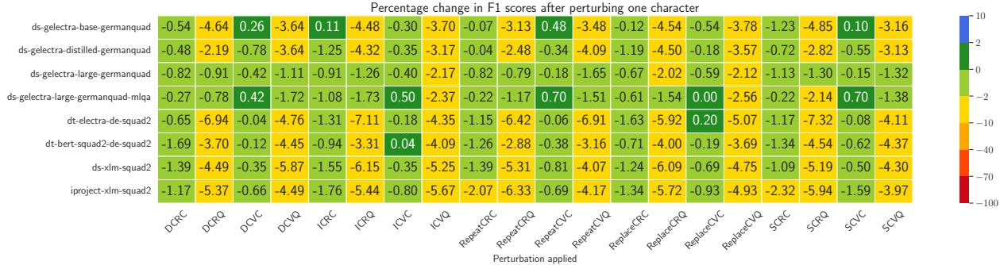  
Figure 1: Percentage Change in F1 scores after perturbation of a maximum of one character. Perturbations are abbreviated as below:

DCRC: Delete character from random word in context, DCRQ: Delete character from random word in question, DCVC: Delete character from random verb in context, DCVQ: Delete character from random verb in question, ICRC: Insert character from random word in context, ICRQ: Insert character from random word in question, ICVC: Insert character from random verb in context, ICVQ: Insert character from random verb in question, RepeatCRC: Repeat character from random word in context, RepeatCRQ: Repeat character from random word in question, RepeatCVC: Repeat character from random verb in context, RepeatCVQ: Repeat character from random verb in question, ReplaceCRC: Replace character from random word in context, ReplaceCRQ: Replace character from random word in question, ReplaceCVC: Replace character from random verb in context, ReplaceCVQ: Replace character from random verb in question, SCRC: Swap characters from random word in context, SCRQ: Swap characters from random word in question, SCVC: Swap characters from random verb in context, SCVQ: Swap characters from random verb in question  
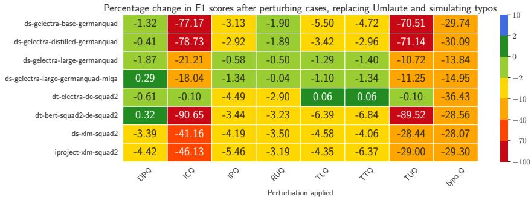  
Figure 2: Percentage Change in F1 scores after replacing ‘Umlaute’, simulating typos and applying cased-based perturbations. Perturbations are abbreviated as: DPQ: Delete punctuations in question, ICQ: Invert case in question, IPQ: Insert Punctuation in question, RUQ: Replace ‘Umlaute’ in question, TLQ: Change to lower case in question, TTQ: Change to title case in question, TUQ: Change to upper case in question, typo\_Q: Make a typo in question

Deletion (DCVC, DCRC), insertion (ICVC, ICRC), replacement (ReplaceCVC, ReplaceCRC), repetition (RepeatCVC, RepeatCRC) and swapping (SCVC, SCRC) of a single character in the context do not affect the performance of the models greatly (see Figure 1 and Table 6 in Section A). However, the same perturbations when applied to the question show a decrease in performance of almost all models except for ds-gelectra-large-germanquad and ds-gelectra-large-germanquad-mlqa.

All models except dt-electra-de-squad2 are sensitive to case-based perturbations (see Figure 2).5 Changing the cases to upper cases (TUQ) or inverting/toggling cases (ICQ) affects the performance of the models the most. Additionally, all the models are found to be affected by the presence of typos (typo\_Q). Additionally, all the multilingual models are affected by the replacement of the ‘Umlaute (RUQ, RUC) in the questions.

At the word-level, perturbations that involve the deletion of a random word (DRQ) or a random verb (DVQ) from the question, cause a decrease in the EM and F1 scores of all models. Replacing a word with a contextual synonym (ReplaceRQ) and swapping words in the question (SwapRQ) also causes notable disruption to the performance of all the models (see Figure 3).

Monolingual models, ds-gelectra-largegermanquad and ds-gelectra-large-germanquadmlqa have incurred lower penalties (calculated as described in Section 3.7) compared to the multilingual models. For character-level perturbations ds-gelectra-distilled-germanquad and iproject-xlm-squad2 perform the worst, whereas, for word perturbations, iproject-xlm-squad2 exhibits the worst performance (Figure 3).

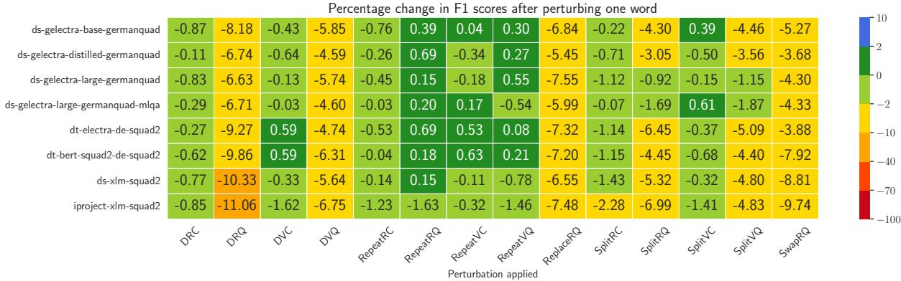  
Figure 3: Percentage Change in F1 scores after perturbation of a maximum of one word. Perturbations are abbreviated as below:  
DRC: Delete random word in context, DRQ: Delete random word in question, DVC: Delete random verb in context, DVQ: Delete random verb in question, RepeatRC: Repeat random word in context, RepeatRQ: Repeat random word in question, RepeatVC: Repeat random verb in context, RepeatVQ: Repeat random verb in question, ReplaceRQ: Replace random word in question with contextual synonym, SplitRC: Split random word in context, SplitRQ: Split random word in question, SplitVC: Split random verb in context, SplitVQ: Split random verb in question, SwapRQ: Swap random words in question

In order to compare the performance of models when perturbations are applied, some character perturbations were repeated by increasing the count of characters perturbed from 1 to 4 (see Table 4). The exact perturbations applied and the performance of the models in terms of F1 scores in these experiments are recorded in the heatmaps in Figures 1, 8, 9 & 10. To further weigh the model performances, the change in F1 scores for each experiment was compared to the ranges defined in Table 3 and penalties were calculated for each perturbation experiment. The sum total of the penalties collected when n number of characters were perturbed is recorded in Columns 2, 3, 4 and 5 for each model (Table 5). Further, the sum total of the penalties collected from all the experiments is recorded in the final column. The smaller the penalty accumulated by the model, the better the robustness.

Similar to the character perturbation experiments recorded in Table 4, word perturbation experiments were also performed by repeating word perturbations on the GermanQuAD dataset by increasing the count of words perturbed from 1 to 4. The exact perturbations applied and the performance of the models in terms of F1 scores these experiments are recorded in the heatmaps in Figures 3, 11, 12 & 13.

## 4 Discussion

Comparing the models’ performances based on the penalty scores awarded, the monolingual models ds-gelectra-large-germanquad-mlqa and dsgelectra-large-germanquad perform slightly better than the multilingual models for the character and word-based perturbation experiments. It can be argued that the comparatively more robust performance of the monolingual models dsgelectra-large-germanquad-mlqa and ds-gelectralarge-germanquad are to be attributed to: (1) the fact that they were fine-tuned on the training dataset of the GermanQuAD and (2) their size in terms of parameters. However, the monolingual model dtelectra-de-squad2, a smaller model, which has not been fine-tuned on the GermanQuAD train dataset shows the next best performance in terms of robustness especially at the character-level.

The results show that character perturbation causes a higher effect when occurring in the question than in the context, which can be due to the fact that questions are typically shorter and more focused in content compared to context paragraphs. Each word in a question often carries a weight in determining the nature of the information being sought. Thus, any disruption in the question’s wording, for instance, by perturbing characters, could lead to a more pronounced impact on the model’s ability to correctly interpret the question and retrieve the appropriate answer from the provided context.

Introducing a typo on randomly chosen words in the question and context also leads to substantial changes in the EM and F1 scores of all models. Since typos are likely to occur in the inputs to deployed systems, the change in performance before and after perturbations exposes the lack of robustness of the models to small input changes.

<table><tr><td rowspan="2">Models</td><td colspan="4">Aggregate penalties per n number of perturbated characters</td></tr><tr><td>n = 1</td><td> $n = 2$ </td><td> $n = 3$ </td><td>n = 4</td></tr><tr><td>ds-gelectra-base-germanquad</td><td>10</td><td>6</td><td>6</td><td>∑ 6 28</td></tr><tr><td>ds-gelectra-distilled-germanquad</td><td>11</td><td>7 7</td><td>7</td><td>38</td></tr><tr><td>ds-gelectra-large-germanquad</td><td>3↓</td><td>4↓</td><td>5↓ 6↓</td><td>18↓</td></tr><tr><td>ds-gelectra-large-germanquad-mlqa</td><td>3↓</td><td>4↓</td><td>5↓ 6↓</td><td>18↓</td></tr><tr><td>dt-electra-de-squad2</td><td>10</td><td>6</td><td>6 6↓</td><td>28</td></tr><tr><td>dt-bert-squad2-de-squad2</td><td>10</td><td>6</td><td>6</td><td>6↓ 28</td></tr><tr><td>ds-xlm-squad2</td><td>10</td><td>6</td><td>6 7</td><td>29</td></tr><tr><td>iproject-xlm-squad2</td><td>12</td><td>7</td><td>7 8</td><td>34</td></tr></table>

Table 4: Penalties incurred by models by varying the number of characters perturbed ( indicates that a lower penalty score is better).

<table><tr><td rowspan="2">Models</td><td colspan="4">Aggregate penalties per n number of perturbed words</td></tr><tr><td>n = 1</td><td> $n = 2$ </td><td> $n = 3$ </td><td> $n = 4$  ∑</td></tr><tr><td>ds-gelectra-base-germanquad</td><td>7</td><td>7</td><td>7</td><td>8 29</td></tr><tr><td>ds-gelectra-distilled-germanquad</td><td>8</td><td>8 8</td><td>9</td><td>33</td></tr><tr><td>ds-gelectra-large-germanquad</td><td>5</td><td>5 6</td><td>7</td><td>23</td></tr><tr><td>ds-gelectra-large-germanquad-mlqa</td><td>4↓</td><td>4↓</td><td>5↓ 7↓</td><td>20↓</td></tr><tr><td>dt-electra-de-squad2</td><td>7</td><td>7</td><td>7 9</td><td>30</td></tr><tr><td>dt-bert-squad2-de-squad2</td><td>7</td><td>7</td><td>7</td><td>8 29</td></tr><tr><td>ds-xlm-squad2</td><td>7</td><td>7</td><td>9 10</td><td>33</td></tr><tr><td>iproject-xlm-squad2</td><td>8</td><td>8</td><td>12 13</td><td>41</td></tr></table>

Table 5: Penalties incurred by models by varying the number of words perturbed ( indicates that a lower penalty score is better).

Changing cases (to upper case or mixed case) notably affects performance. We speculate that the models are trained on true-cased data, i.e., predominantly lower-cased, making them less adaptable to variations in case (also see Bodapati et al. (2019)). When choosing a German language model for a downstream task, we therefore recommend to consider appropriate fine-tuning or pre-processing. Additionally, the replacement of ‘Umlaute’ in the multilingual models demonstrate their vulnerability to subtle linguistic nuances. ‘Umlaute’ seem to carry crucial phonetic and semantic information in German, and their alteration can change word meanings, affecting model comprehension and performance.

Deletion of words and verbs, replacement of words with contextual synonyms or swapping words also cause a disruption by decreasing the model performances on the QA task in our study. These perturbations test the models’ ability to understand context and maintain performance despite

changes to whole words.

The repetition of random words and verbs in both the context and the question can exert minor positive or negative effects. This suggests that such systems possess a certain degree of resilience in processing repetition of words.

Overall, these findings highlight the importance of incorporating robustness evaluation and mitigation strategies in the model training processes.

## 5 Conclusion

In this work, we tested the robustness of different models fine-tuned on the German QA task with input perturbations. The results showed that QA models are sensitive to even slight noise in the input is consistent with results on English QA models. We found that existing evaluation packages are not necessarily available for the German language and therefore contribute open-source code to facilitate reproducibility. We found that monolingual models are less affected by character and word-level perturbations. For future work, experiments investigating the role of language and robustness is to be carried out in more detail. Further, a promising research direction is the exploration of generative QA models.

## 6 Limitations

In this work, the assumption when applying perturbations is that they they do not alter semantics. But it is acknowledged that some of the perturbations, for instance, deletion of characters or words, might alter the meaning of a given sentence. Additionally, a limitation of the work is that manual evaluation of the perturbed dataset was not carried out.

The focus of this study was to gauge the vulnerability of exisiting German language models to input perturbations. The detection of undesired behavior is only the first step, and executing mitigation strategies is an important next step. Although we made an informed decision on the choice of input perturbations, other perturbations are probable and we encourage NLP practitioners to select perturbations for evaluation based on the applied domain and context.

As mentioned, the goal of our paper is to introduce a methodology for evaluating the robustness of existing German extractive QA models. At the time of performing our experiments, there were no Large Language Models like the GPT and Llama variants that were fine-tuned for this task for German. Since fine-tuning a new model is a resource hungry and expensive process, our decision was to use models which have already been fine-tuned for the task and are publicly available. While zero-shot prompting was a possibility for evaluation, it was found that prompt selection introduced variability to the results. Therefore, designing experiments for evaluating these models was not within the scope of this paper.

The findings are so far limited to the dataset, task and language investigated and the transfer of these results to other tasks or languages remains open. Related to this, we chose existing fine-tuned models available from the huggingface model hub and acknowledge that, although we carefully checked each model card, we cannot completely rule out data leakage of the test set into model training or similar factors compromising the results. In particular, the model ds-gelectra-large-germanquad-mlqa does not contain sufficient documentation.

## Acknowledgments

This research has been funded by the Federal Ministry of Education and research of Germany and the state of North Rhine-Westphalia as part of the Lamarr Institute for Machine Learning and Artificial Intelligence.

## References

Yejin Bang, Samuel Cahyawijaya, Nayeon Lee, Wenliang Dai, Dan Su, Bryan Wilie, Holy Lovenia, Ziwei Ji, Tiezheng Yu, Willy Chung, Quyet V. Do, Yan Xu, and Pascale Fung. 2023. A multitask, multilingual, multimodal evaluation of ChatGPT on reasoning, hallucination, and interactivity. In Proceedings of the 13th International Joint Conference on Natural Language Processing and the 3rd Conference of the Asia-Pacific Chapter ofthe Associationfor Computational Linguistics (Volume 1: Long Papers), pages 675–718, Nusa Dua, Bali. Association for Computational Linguistics.

Sravan Bodapati, Hyokun Yun, and Yaser Al-Onaizan. 2019. Robustness to capitalization errors in named entity recognition. In Proceedings of the 5th Workshop on Noisy User-generated Text (W-NUT 2019), pages 237–242, Hong Kong, China. Association for Computational Linguistics.

Nicholas Carlini and David Wagner. 2017. Towards evaluating the robustness of neural networks. In 2017 IEEE Symposium on Security and Privacy (SP), pages 39–57.

Branden Chan, Stefan Schweter, and Timo Möller. 2020. German’s Next Language Model. In Proceedings of the 28th International Conference on Computational Linguistics, pages 6788–6796, Barcelona, Spain, Online. International Committee on Computational Linguistics.

Kevin Clark, Minh-Thang Luong, Quoc V. Le, and Christopher D. Manning. 2020. ELECTRA: pretraining text encoders as discriminators rather than generators. In 8th International Conference on Learning Representations, ICLR 2020, Addis Ababa, Ethiopia, April 26-30, 2020. OpenReview.net.

Alexis Conneau, Kartikay Khandelwal, Naman Goyal, Vishrav Chaudhary, Guillaume Wenzek, Francisco Guzmán, Edouard Grave, Myle Ott, Luke Zettlemoyer, and Veselin Stoyanov. 2020. Unsupervised cross-lingual representation learning at scale. In Proceedings of the 58th Annual Meeting of the Associationfor Computational Linguistics, pages 8440– 8451, Online. Association for Computational Linguistics.

Jacob Devlin, Ming-Wei Chang, Kenton Lee, and Kristina Toutanova. 2019. BERT: Pre-training of Deep Bidirectional Transformers for Language Understanding. In Proceedings ofthe 2019 Conference ofthe North American Chapter ofthe Associationfor Computational Linguistics: Human Language Technologies, Volume 1 (Long and Short Papers), pages 4171–4186, Minneapolis, Minnesota. Association for Computational Linguistics.

Kaustubh Dhole, Varun Gangal, Sebastian Gehrmann, Aadesh Gupta, Zhenhao Li, Saad Mahamood, Abinaya Mahadiran, Simon Mille, Ashish Shrivastava,

Samson Tan, et al. 2023. NL-Augmenter: A framework for task-sensitive natural language augmentation. Northern European Journal ofLanguage Technology, 9(1).

Javid Ebrahimi, Anyi Rao, Daniel Lowd, and Dejing Dou. 2018. HotFlip: White-box adversarial examples for text classification. In Proceedings ofthe 56th Annual Meeting of the Association for Computational Linguistics (Volume 2: Short Papers), pages 31–36, Melbourne, Australia. Association for Computational Linguistics.

Karan Goel, Nazneen Fatema Rajani, Jesse Vig, Zachary Taschdjian, Mohit Bansal, and Christopher Ré. 2021. Robustness Gym: Unifying the NLP Evaluation Landscape. In Proceedings of the Conference of the North American Chapter of the Association for Computational Linguistics: Human Language Technologies: Demonstrations, pages 42–55, Online. Association for Computational Linguistics.

Ian J. Goodfellow, Jonathon Shlens, and Christian Szegedy. 2015. Explaining and harnessing adversarial examples. In 3rd International Conference on Learning Representations, ICLR 2015, San Diego, CA, USA, May 7-9, 2015, Conference Track Proceedings.

Robin Jia and Percy Liang. 2017. Adversarial examples for evaluating reading comprehension systems. In Proceedings of the 2017 Conference on Empirical Methods in Natural Language Processing, pages 2021–2031, Copenhagen, Denmark. Association for Computational Linguistics.

Daniel Jurafsky and James H. Martin. 2023. Speech and Language Processing, chapter Question Answering and Information Retrieval. Draft. Accessed: 25.06.2023.

Daniel Khashabi, Tushar Khot, and Ashish Sabharwal. 2020. More bang for your buck: Natural perturbation for robust question answering. In Proceedings of the 2020 Conference on Empirical Methods in Natural Language Processing (EMNLP), pages 163–170, Online. Association for Computational Linguistics.

Ronan Le Bras, Swabha Swayamdipta, Chandra Bhagavatula, Rowan Zellers, Matthew E. Peters, Ashish Sabharwal, and Yejin Choi. 2020. Adversarial filters of dataset biases. In Proceedings ofthe 37th International Conference on Machine Learning, ICML’20.

John Miller, Karl Krauth, Benjamin Recht, and Ludwig Schmidt. 2020. The effect of natural distribution shift on question answering models. In International Conference on Machine Learning, pages 6905–6916. PMLR.

Timo Möller, Julian Risch, and Malte Pietsch. 2021. GermanQuAD and GermanDPR: Improving Non-English Question Answering and Passage Retrieval. In Proceedings of the 3rd Workshop on Machine Reading for Question Answering, pages 42–50, Punta Cana, Dominican Republic. Association for Computational Linguistics.

Milad Moradi and Matthias Samwald. 2021. Evaluating the robustness of neural language models to input perturbations. In Proceedings of the 2021 Conference on Empirical Methods in Natural Language Processing, pages 1558–1570, Online and Punta Cana, Dominican Republic. Association for Computational Linguistics.

John Morris, Eli Lifland, Jin Yong Yoo, Jake Grigsby, Di Jin, and Yanjun Qi. 2020. TextAttack: A framework for adversarial attacks, data augmentation, and adversarial training in NLP. In Proceedings of the 2020 Conference on Empirical Methods in Natural Language Processing: System Demonstrations, pages 119–126, Online. Association for Computational Linguistics.

Reham Omar, Omij Mangukiya, Panos Kalnis, and Essam Mansour. 2023. ChatGPT versus traditional question answering for knowledge graphs: Current status and future directions towards knowledge graph chatbots. Preprint, arXiv:2302.06466.

Yao Qiang, Subhrangshu Nandi, Ninareh Mehrabi, Greg Ver Steeg, Anoop Kumar, Anna Rumshisky, and Aram Galstyan. 2024. Prompt perturbation consistency learning for robust language models. In Findings ofthe Associationfor Computational Linguistics: EACL 2024, pages 1357–1370, St. Julian’s, Malta. Association for Computational Linguistics.

Alec Radford, Karthik Narasimhan, Tim Salimans, Ilya Sutskever, et al. 2018. Improving language understanding by generative pre-training.

Pranav Rajpurkar, Jian Zhang, Konstantin Lopyrev, and Percy Liang. 2016. SQuAD: 100,000+ Questions for Machine Comprehension of Text. In Proceedings of the Conference on Empirical Methods in Natural Language Processing, pages 2383–2392, Austin, Texas. Association for Computational Linguistics.

Marco Tulio Ribeiro, Tongshuang Wu, Carlos Guestrin, and Sameer Singh. 2020. Beyond accuracy: Behavioral testing of NLP models with CheckList. In Proceedings of the 58th Annual Meeting of the Associationfor Computational Linguistics, pages 4902– 4912, Online. Association for Computational Linguistics.

Anna Rogers, Matt Gardner, and Isabelle Augenstein. 2023. QA dataset explosion: A taxonomy of NLP resources for question answering and reading comprehension. ACM Comput. Surv., 55(10):1–45.

Yiming Tan, Dehai Min, Yu Li, Wenbo Li, Nan Hu, Yongrui Chen, and Guilin Qi. 2023. Can ChatGPT replace traditional KBQA models? an in-depth analysis of the question answering performance of the GPT LLM family. In International Semantic Web Conference, pages 348–367. Springer.

Zirui Wang, Zachary C. Lipton, and Yulia Tsvetkov. 2020. On negative interference in multilingual models: Findings and a meta-learning treatment. In Proceedings of the 2020 Conference on Empirical

Methods in Natural Language Processing (EMNLP), pages 4438–4450, Online. Association for Computational Linguistics.

Yi Yang, Wen-tau Yih, and Christopher Meek. 2015. WikiQA: A challenge dataset for open-domain question answering. In Proceedings of the 2015 Conference on Empirical Methods in Natural Language Processing, pages 2013–2018, Lisbon, Portugal. Association for Computational Linguistics.

Jiacheng Ye, Xijia Tao, and Lingpeng Kong. 2023. Language versatilists vs. specialists: An empirical revisiting on multilingual transfer ability. Preprint, arXiv:2306.06688.

Gulsum Yigit and Mehmet Fatih Amasyali. 2023. From text to multimodal: A comprehensive survey of adversarial example generation in question answering systems. Preprint, arXiv:2312.16156.

Yunxiang Zhang, Liangming Pan, Samson Tan, and Min-Yen Kan. 2022. Interpreting the robustness of neural NLP models to textual perturbations. In Findings of the Associationfor Computational Linguistics: ACL 2022, pages 3993–4007, Dublin, Ireland. Association for Computational Linguistics.

Yilun Zhao, Chen Zhao, Linyong Nan, Zhenting Qi, Wenlin Zhang, Xiangru Tang, Boyu Mi, and Dragomir Radev. 2023. RobuT: A systematic study of table QA robustness against human-annotated adversarial perturbations. In Proceedings of the 61st Annual Meeting ofthe Associationfor Computational Linguistics (Volume 1: Long Papers), pages 6064– 6081, Toronto, Canada. Association for Computational Linguistics.

## A Appendix

Here, we report additional experiments performed.

## A.1 EM scores

Figure 4 represents the percentage change in EM scores across models when a single character was perturbed and Figure 5 represents the percentage change in EM scores after replacing ‘Umlaute’, simulating typos and applying case-based perturbations. Similarly, Figure 6 represents the percentage change in EM scores across models when a single word was perturbed.

## A.2 Sentence-level Perturbations

It is observed that among the sentence perturbations, it is simply repeating the question that causes the most disruption to the performance of the models. Repeating the context causes negligible changes to the performance of the models in terms of the F1 score. Translation of the question to English and back to German also causes the performance of all the models to deteriorate, the most affected model in this case are the XLMs iprojectxlm-squad2 and ds-xlm-squad2. Of all the models, ds-gelectra-large-germanquad performs the best in all the sentence-based perturbations.

## A.3 Increased Perturbation Count per Instance

Some character and word perturbation experiments were repeated by increasing the count of the characters/words perturbed. The performance of all the models in these individual experiments are recorded in Figures 8, 9, 10, 11, 12 & 13.

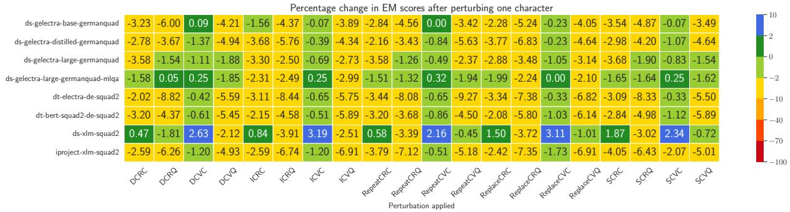  
Figure 4: Percentage Change in EM scores after perturbation of a maximum of one character. Perturbations are abbreviated as per Table 6.

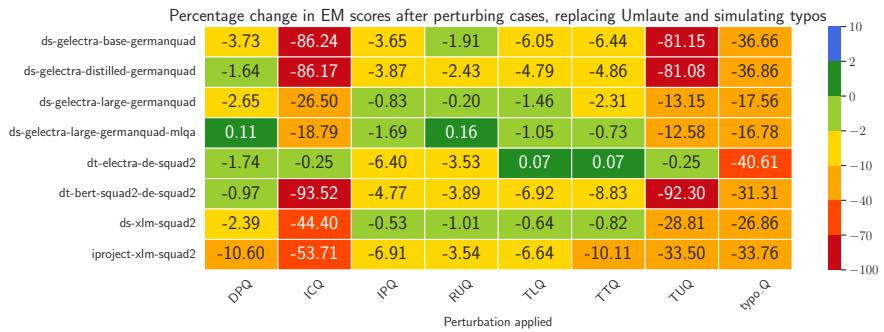  
Figure 5: Percentage Change in EM scores after replacing ‘Umlaute’, simulating typos and applying cased-based perturbations. Perturbations are abbreviated as per Table 6.

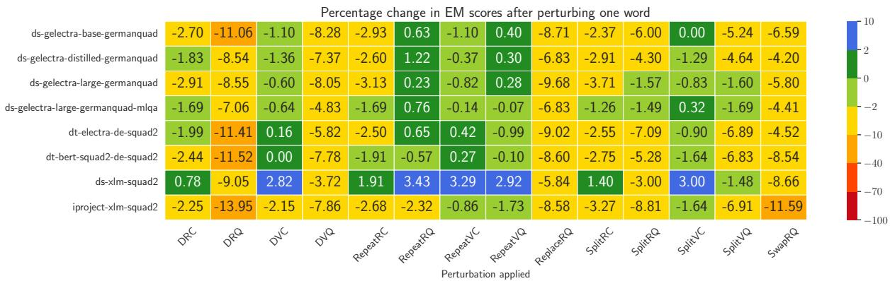  
Figure 6: Percentage Change in EM scores after perturbation of a maximum of one word. Perturbations are abbreviated as per Table 6.

Abbreviation Perturbation Applied   
ICQ Invert case in question   
TLQ Change to lower case in question   
TUQ Change to upper case in question   
TTQ Change to title case in question   
IPQ Insert punctuation in question   
DPQ Delete punctuation in question   
DCVC Delete character from random verb in context   
DCVQ Delete character from a random verb in question   
DCRC Delete character from random word in context   
DCRQ Delete character from a random word in question   
ICVC Insert character from random verb in context   
ICVQ Insert character from a random verb in question   
ICRC Insert character from random word in context   
ICRQ Insert character from random word in question   
RepeatCVC Repeat character from a random verb in context   
RepeatCVQ Repeat character from a random verb in question   
RepeatCRC Repeat character from a random word in context   
RepeatCRQ Repeat character from a random word in question   
ReplaceCVC Replace character from a random verb in context   
ReplaceCVQ Replace character from a random verb in question   
ReplaceCRC Replace character from a random word in context   
ReplaceCRQ Replace character from a random word in question   
SCVC Swap character from random verb in context   
SCVQ Swap character from a random verb in question   
SCRC Swap character from a random word in context   
SCRQ Swap character from a random word in question   
RUQ Replace ‘Umlaute’ in question   
typo\_Q Make a typo in question   
DRC Delete random word from context   
DRQ Delete random word from question   
DVC Delete random verb from context   
DVQ Delete random verb from question   
RepeatRC Repeat random word from context   
RepeatRQ Repeat random word from question   
RepeatVC Repeat random verb from context   
RepeatVQ Repeat random verb from question   
ReplaceRQ Replace random verb from the question with contextual synonym   
SplitRC Split random word from context   
SplitRQ Split random word from question   
SplitVC Split random verb from context   
SplitVQ Split random verb from question   
SwapRQ Swap random words from question   
repeat\_question Repeat the question   
translate\_question Translate the question from German to English and back to German

Table 6: Various perturbations applied during experimentation and their abbreviations as used in the heatmaps  
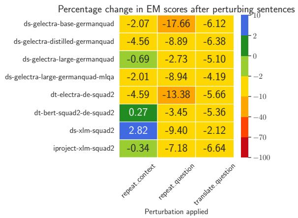

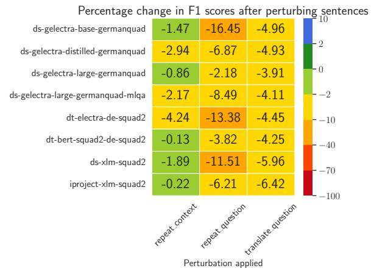  
Figure 7: Percentage change in EM and F1 scores after perturbation of sentences. Perturbations are abbreviated as per Table 6.

<table><tr><td>Function Name</td><td>Details</td><td>Example</td></tr><tr><td>DeleteChara</td><td>Deletes a random character (between the first and last characters) of a word from the question or the context</td><td>wohnen → wonen</td></tr><tr><td>InsertChara</td><td>Inserts a random letter of the alphabet (between the first and last characters) of a word from the question or the context</td><td>wohnen → wobhnen</td></tr><tr><td>RepeatChara</td><td>Repeats a random character (between the first and last characters) of a word from the question or the context</td><td>wohnen → woohnen</td></tr><tr><td>ReplaceChara</td><td>Deletes a random character and replaces it with a wohnen → wobnen random character (between the first and last charac- ters) of a word from the question or the context</td><td></td></tr><tr><td>SwapChara</td><td>Swaps two random characters of a word from the wohnen → whonen question or the context</td><td></td></tr><tr><td>KeyboardTypo</td><td>Chooses a random word and produces a typo based welcher → welyher on the keyboard layout</td><td></td></tr><tr><td>DeletePunctuation</td><td>Deletes all punctuation from the question or the context</td><td>Was kann den Verschleiß des seillosen Aufzuges minimieren? → Was kann den Verschleiß des seillosen Aufzuges</td></tr><tr><td>InsertPunctuation</td><td>Inserts punctuation at random positions of a ran- domly chosen word from the question or the context</td><td>minimieren welcher → welche/r</td></tr><tr><td>ChangeCase</td><td>Changes/Inverts the case of the question or context to lower, upper or title</td><td>In welcher deutschen Stadt wird der seillose Aufzug getestet? →</td></tr><tr><td>ReplaceUmlaute</td><td>Replace special German characters using the fol-</td><td>IN WELCHER DEUTSCHEN STADT WIRD DER SEILLOSE AUFZUG GETESTET? ausgewählt → ausgewaehlt</td></tr></table>

Table 7: Summary of the character perturbations
<table><tr><td>Function Name</td><td>Details</td><td>Example</td></tr><tr><td>DeleteWord</td><td>Deletes a random word from the question or the context</td><td>In welcher deutschen Stadt wird der seillose Aufzug getestet? → In deutschen Stadt wird der seillose Aufzug getestet?</td></tr><tr><td>RepeatWord</td><td>Repeats a random word from the question or the context</td><td>In welcher deutschen Stadt wird der seillose Aufzug getestet? → In welcher welcher deutschen Stadt wird der seillose Aufzug getestet?</td></tr><tr><td>Synonym</td><td>Replaces a verb from the question or the context with its contextual synonym</td><td>Was kann den Verschleiß des seillosen Aufzuges minimieren? → Was kann den Verschleiß des seil- losen Aufzuges verhindern?</td></tr><tr><td>SplitWord</td><td>Adds a space in a randomly chosen word from the question or the context</td><td>Aufzug → Auf zug</td></tr><tr><td>SwapWords</td><td>Swaps two random words in a sentence from the In welcher deutschen Stadt wird der seillose Aufzug question or the context</td><td>getestet? → In welcher welcher Stadt deutschen wird der seillose Aufzug getestet?</td></tr></table>

Table 8: Summary of the word perturbations
<table><tr><td>Function Name</td><td>Details</td><td>Example</td></tr><tr><td>RepeatSentence</td><td>Repeats the question or the context</td><td>Was kann den Verschleiß des seillosen Aufzuges minimieren? → Was kann den Verschleiß des seil- losen Aufzuges minimieren? Was kann den Ver- schleiß des seillosen Aufzuges minimieren?</td></tr><tr><td>BackTranslate</td><td>Translates the question from German to English and then back to German.</td><td>Was kann den Verschleiß des seillosen Aufzuges minimieren? → Wie kann der Verschleiß des draht- losen Aufzugs minimiert werden?</td></tr></table>

Table 9: Summary of the sentence perturbations

Percentage change in F1 scores after perturbing three characters  
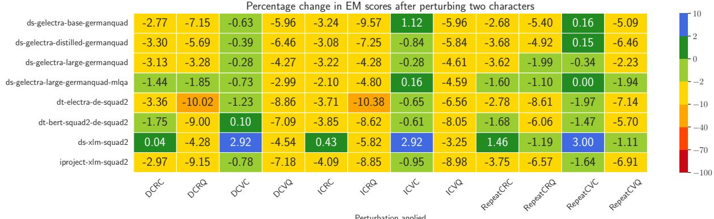

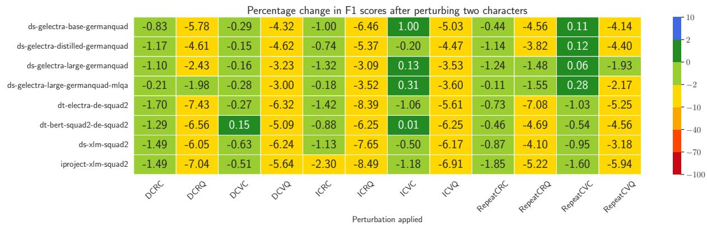  
Figure 8: Percentage change in EM and F1 scores after perturbation of a maximum of two characters (perturbations abbreviated as per Table 6).

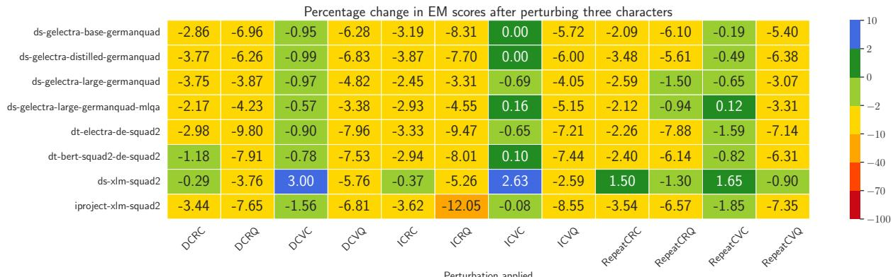

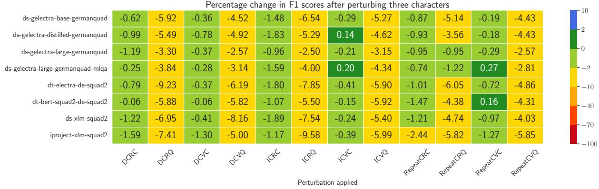  
Figure 9: Percentage change in EM and F1 scores after perturbation of a maximum of three characters (perturbations abbreviated as per Table 6).

<table><tr><td rowspan=1 colspan=1></td><td rowspan=1 colspan=1></td><td rowspan=1 colspan=1></td><td rowspan=1 colspan=1>Percentage</td><td rowspan=1 colspan=1>change in</td><td rowspan=1 colspan=1>F1 score</td><td rowspan=1 colspan=1>s after pe</td><td rowspan=1 colspan=1>rturbing</td><td rowspan=1 colspan=1>two words</td><td rowspan=1 colspan=1></td><td rowspan=1 colspan=1></td><td rowspan=1 colspan=1></td></tr><tr><td rowspan=1 colspan=1>-1.26</td><td rowspan=1 colspan=1>-21.32</td><td rowspan=1 colspan=1>-0.10</td><td rowspan=1 colspan=1>-6.79</td><td rowspan=1 colspan=1>-0.03</td><td rowspan=1 colspan=1>-0.01</td><td rowspan=1 colspan=1>0.33</td><td rowspan=1 colspan=1>-0.18</td><td rowspan=1 colspan=1>-2.33</td><td rowspan=1 colspan=1>-10.71</td><td rowspan=1 colspan=1>-0.42</td><td rowspan=1 colspan=1>-6.57</td></tr><tr><td rowspan=1 colspan=1>-1.36</td><td rowspan=1 colspan=1>-17.80</td><td rowspan=1 colspan=1>0.41</td><td rowspan=1 colspan=1>-6.51</td><td rowspan=1 colspan=1>-0.49</td><td rowspan=1 colspan=1>0.07</td><td rowspan=1 colspan=1>0.48</td><td rowspan=1 colspan=1>0.15</td><td rowspan=1 colspan=1>-2.53</td><td rowspan=1 colspan=1>-9.42</td><td rowspan=1 colspan=1>-0.35</td><td rowspan=1 colspan=1>-4.95</td></tr><tr><td rowspan=1 colspan=1>-1.07</td><td rowspan=1 colspan=1>-17.02</td><td rowspan=1 colspan=1>-0.06</td><td rowspan=1 colspan=1>-7.54</td><td rowspan=1 colspan=1>-0.69</td><td rowspan=1 colspan=1>-0.19</td><td rowspan=1 colspan=1>-0.53</td><td rowspan=1 colspan=1>0.24</td><td rowspan=1 colspan=1>-2.94</td><td rowspan=1 colspan=1>-3.81</td><td rowspan=1 colspan=1>-0.79</td><td rowspan=1 colspan=1>-1.88</td></tr><tr><td rowspan=1 colspan=1>-0.67</td><td rowspan=1 colspan=1>-17.35</td><td rowspan=1 colspan=1>0.15</td><td rowspan=1 colspan=1>-5.67</td><td rowspan=1 colspan=1>-1.22</td><td rowspan=1 colspan=1>-0.31</td><td rowspan=1 colspan=1>0.49</td><td rowspan=1 colspan=1>-0.29</td><td rowspan=1 colspan=1>-1.59</td><td rowspan=1 colspan=1>-3.95</td><td rowspan=1 colspan=1>0.10</td><td rowspan=1 colspan=1>-1.91</td></tr><tr><td rowspan=1 colspan=1>-0.48</td><td rowspan=1 colspan=1>-20.93</td><td rowspan=1 colspan=1>0.24</td><td rowspan=1 colspan=1>-6.25</td><td rowspan=1 colspan=1>-0.56</td><td rowspan=1 colspan=1>0.35</td><td rowspan=1 colspan=1>0.24</td><td rowspan=1 colspan=1>0.20</td><td rowspan=1 colspan=1>-2.93</td><td rowspan=1 colspan=1>-16.25</td><td rowspan=1 colspan=1>-0.93</td><td rowspan=1 colspan=1>-6.46</td></tr><tr><td rowspan=1 colspan=1>-0.75</td><td rowspan=1 colspan=1>-22.09</td><td rowspan=1 colspan=1>-0.12</td><td rowspan=1 colspan=1>-9.16</td><td rowspan=1 colspan=1>-0.91</td><td rowspan=1 colspan=1>-0.37</td><td rowspan=1 colspan=1>-0.15</td><td rowspan=1 colspan=1>0.79</td><td rowspan=1 colspan=1>-2.06</td><td rowspan=1 colspan=1>-13.01</td><td rowspan=1 colspan=1>-0.88</td><td rowspan=1 colspan=1>-5.84</td></tr><tr><td rowspan=1 colspan=1>-0.66</td><td rowspan=1 colspan=1>-23.60</td><td rowspan=1 colspan=1>0.33</td><td rowspan=1 colspan=1>-9.94</td><td rowspan=1 colspan=1>-0.50</td><td rowspan=1 colspan=1>-0.71</td><td rowspan=1 colspan=1>0.36</td><td rowspan=1 colspan=1>-0.68</td><td rowspan=1 colspan=1>-3.17</td><td rowspan=1 colspan=1>-11.55</td><td rowspan=1 colspan=1>-0.41</td><td rowspan=1 colspan=1>-6.38</td></tr><tr><td rowspan=1 colspan=1>-1.09</td><td rowspan=1 colspan=1>-24.59</td><td rowspan=1 colspan=1>-0.29</td><td rowspan=1 colspan=1>-9.93</td><td rowspan=1 colspan=1>-1.74</td><td rowspan=1 colspan=1>-2.03</td><td rowspan=1 colspan=1>-0.22</td><td rowspan=1 colspan=1>-1.66</td><td rowspan=1 colspan=1>-4.13</td><td rowspan=1 colspan=1>-13.16</td><td rowspan=1 colspan=1>-1.60</td><td rowspan=1 colspan=1>-6.87</td></tr></table>

Percentage change in F1 scores after perturbing two words

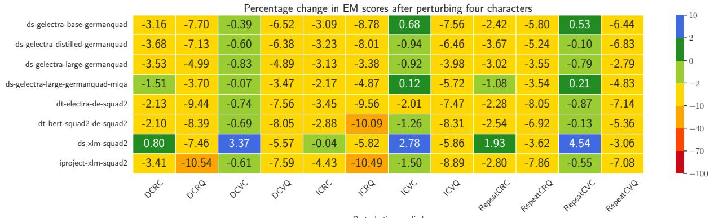

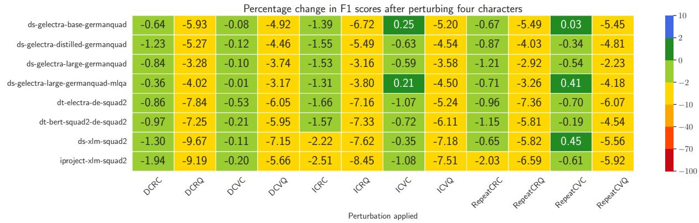  
Figure 10: Percentage change in EM and F1 scores after perturbation of a maximum of four characters (perturbations abbreviated as per Table 6).

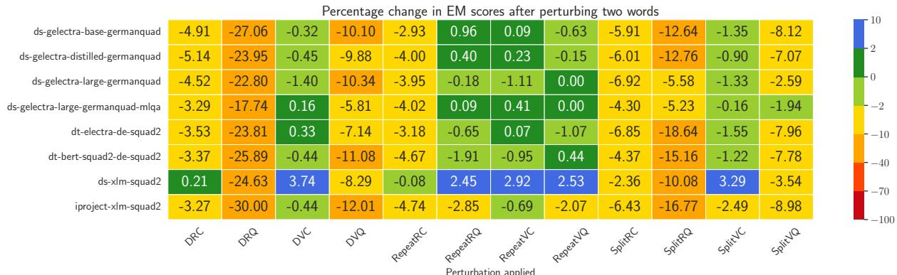  
Figure 11: Percentage change in EM and F1 scores after perturbation of a maximum of two words (perturbations abbreviated as per Table 6).

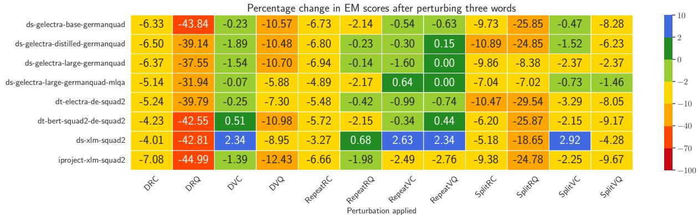

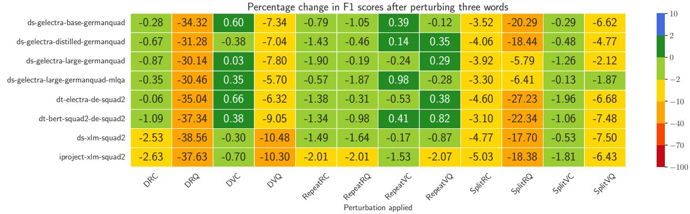  
Figure 12: Percentage change in EM and F1 scores after perturbation of a maximum of three words (perturbations abbreviated as per Table 6).

Percentage change in EM scores after perturbing four words  
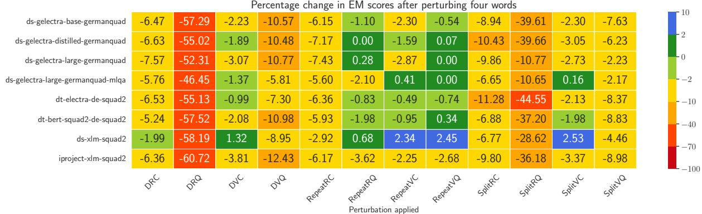

Percentage change in F1 scores after perturbing four words  
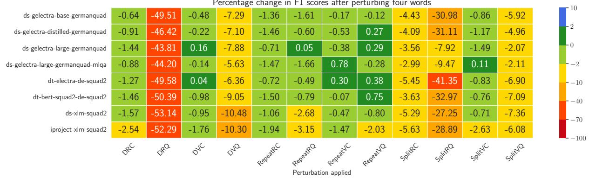  
Figure 13: Percentage change in EM and F1 scores after perturbation of a maximum of four words (perturbations abbreviated as per Table 6).