# SLARD: A Chinese Superior Legal Article Retrieval Dataset

Zhe Chen1\*, Pengjie Ren2, Fuhui Sun3, Xiaoyan Wang3†, Yunjun Li1‡, Siwen Zhao1, Tengyi Yang1,

1 School of information Science and Engineering, Shandong University 2School of Computer Science and Technology, Shandong University 3Information Technology Service Center of People’s Court

## Abstract

Retrieving superior legal articles involves identifying relevant legal articles that hold higher legal effectiveness. This process is crucial in legislative work because superior legal articles form the legal basis for drafting new laws. However, most existing legal information retrieval research focuses on retrieving legal documents, with limited research on retrieving superior legal articles. This gap restricts the digitization of legislative work. To advance research in this area, we propose SLARD: A Chinese Superior Legal Article Retrieval Dataset, which filters 2,627 queries and 9,184 candidates from over 4.3 million effective Chinese regulations, covering 32 categories, such as environment, agriculture, and water resources. Each query is manually annotated, and the candidates include superior articles at both the provincial and national levels. We conducted detailed experiments and analyses on the dataset and found that existing retrieval methods struggle to achieve ideal results. The best method achieved a R@1 of only 0.4719. Additionally, we found that existing large language models (LLMs) lack prior knowledge of the content of superior legal articles. This indicates the necessity for further exploration and research in this field.

## 1 Introduction

As society progresses, new regulations must be established to keep pace with rapid development (Dror, 1958; Donelan, 2022). During the drafting process, it is essential to retrieve relevant superior legal articles from existing documents as a legislative foundation. These articles, enacted by higher-ranking legislative bodies such as national or provincial legislatures, provide a guiding framework for subordinate regulations, ensuring alignment with overarching legal principles. This hierarchical structure is crucial for maintaining the integrity of the legal system, avoiding conflicts, and ensuring consistency in legal governance (Vinx, 2007; Posner, 1993). Lawmakers must ensure that proposed articles are consistent with existing superior legal articles, which are reviewed to prevent violations and promote coherence (Kealy, 2021). The retrieval of superior legal articles is also vital for legislative review, legal interpretation, and maintaining consistent legal frameworks (Kelsen, 2017).

Past research in digital legislative development has highlighted the importance of employing Natural Language Processing (NLP) and Information Retrieval (IR) technologies to enhance the accuracy of retrieving superior legal articles. This is crucial for maintaining legal coherence and preventing conflicts within the legal framework (Sansone and Sperlí, 2022; Van Gog and Van Engers, 2001; Curtotti et al., 2015; Opmane et al., 2019). In the past, legal information retrieval has predominantly centered on the retrieval of similar cases (Ma et al., 2021; Li et al., 2024) and on matching legal articles to specific legal issues (Sansone and Sperlí, 2022; Chalkidis et al., 2021; Su et al., 2024). Despite these advancements, several critical issues remain unresolved. First, while the focus on similar case retrieval has yielded significant insights, it often falls short in addressing the specific need for superior legal article retrieval. Second, the problem-legal article pair retrieval approach does not adequately cater to the nuanced requirements of retrieving superior legal articles. These limitations underscore a significant gap in existing research: the absence of a specialized dataset to facilitate the study of superior legal article retrieval. This gap hinders the development of more sophisticated retrieval systems capable of addressing the complexities inherent in legal hierarchies.

To bridge this gap, we present the Superior Legal Articles Retrieval Dataset (SLARD), designed to facilitate subsequent research in this domain. SLARD consists of 2,627 queries of municipallevel legal articles and 9,184 candidate articles, including 2,976 provincial-level and 6,208 nationallevel articles. This dataset is specifically geared towards article-level legal retrieval, characterized by higher information density and more abstract expressions than previous retrieval tasks. The development of SLARD involved a rigorous and systematic approach, eight workers with legal expertise were engaged to identify the relevant superior legal articles for each query. To ensure the dataset’s quality, each annotation was conducted by one worker and subsequently verified by another. This thorough annotation process underscores the reliability of SLARD and provides a valuable resource for advancing research in superior legal article retrieval.

This study conducted extensive and detailed experiments to validate their effectiveness in retrieving superior legal articles. Multiple retrieval models were evaluated to establish a performance benchmark, including traditional IR methods and modern deep learning-based approaches. Notably, several LLMs were also assessed for their performance in superior legal article retrieval. The results highlight the strengths and weaknesses of different methods, providing insights for future research. In this work, our contributions include:

• We introduced the task of retrieving superior legal articles, a novel scenario in the legal information retrieval field that addresses a critical need in the legislative process.

• We created and released $\mathbf { S L A R D } ^ { 1 }$ , the first publicly available dataset specifically designed for superior legal article retrieval and provides a valuable foundation for future research in legal information retrieval.

• We conducted extensive experiments using various retrieval models. This evaluation establishes a benchmark for the performance of these models on the superior legal articles retrieval task, offering insights into their strengths and limitations.

## 2 Related Work

The SLARD falls within the scope of legal information retrieval tasks. Existing legal information

retrieval tasks can mainly be categorized into the following two types:

## 2.1 Similar case retrieval

This task requires analyzing the factual aspects of a query case and retrieving cases with similar content from a set of candidates. The Competition on Legal Information Extraction/Entailment (COL-IEE) 2020 (Rabelo et al., 2022) released a similar case retrieval dataset containing 650 queries, each requiring the retrieval of similar cases from a corresponding set of 200 candidates. COLIEE 2021 (Rabelo et al., 2021) expanded the dataset size and did not provide specific candidate collections for each query, instead requiring retrieval from the entire set of candidate cases. Other work (Šavelka and Ashley, 2022) focuses on retrieving from case law with a legal article to argumentation about the meaning of the phrase. The LeCaRD series constructed a Chinese similar case retrieval dataset. LeCaRDv1 (Ma et al., 2021) contains 107 queries, each with 100 candidate cases. LeCaRDv2 (Li et al., 2024) refines the relevance criteria and expands the dataset.

## 2.2 Legal Articles Retrieval

Article retrieval focuses on finding relevant legal articles in response to specific queries, which are typically legal case documents or legal questions from the general public. From 2015 to 2017, the COLIEE competition focused on retrieving relevant articles from the Japanese Civil Code for given legal questions (Kim et al., 2015, 2016; Kano et al., 2017). A similar approach was applied in the French legal context, where a study (Louis and Spanakis, 2021) aimed to match 1,108 legal questions with the appropriate articles from a comprehensive collection of 22,633 articles. In the context of Chinese law, a study (Su et al., 2024) introduced a dataset that expanded the scope of such retrieval tasks, including 1,543 query cases and a large set of 55,348 candidate legal articles. The REG-IR (Chalkidis et al., 2021) involves retrieving relevant documents for UK/EU law queries, with both queries and candidates being lengthy and complex.

However, these tasks do not cover the specific scenario of retrieving superior legal articles relative to a given query article. The objective of superior legal article retrieval we proposed is to enhance the efficiency and accuracy of legal research, particularly in understanding the legislative hierarchy and the relationships between different legal articles.

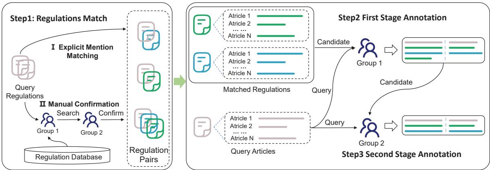  
Figure 1: Overview of the Construction Process of the SLARD.

## 3 Dataset Construction

Eight undergraduate workers with a law background are hired to perform the annotations to build a high-quality and reliable SLARD. The construction process of SLARD is shown in Fig 1. Firstly, original superior legal regulation pairs should be collected at the regulation level. Secondly, manually annotate each pair of articles and identify the superior legal articles at the article level. Finally, recheck the annotation results from the last step to ensure the quality of the dataset.

## 3.1 Task Definition

The task of superior legal articles retrieval is to identify articles related to the query articles from a set of candidates with higher legal effectiveness, thus providing a legal basis for legislators drafting new articles. Specifically, given the query article q and candidate set of legal articles $D = \{ d _ { 1 } , d _ { 2 } , \dotsc , d _ { k } , \dotsc , d _ { i - 1 } , d _ { i } \}$ , with i indicating the quantity of superior legal regulations, $d _ { k } = \{ a _ { k 1 } , a _ { k 2 } , \dotsc , a _ { k j } \}$ , where j denotes the number of articles within regulations $d _ { k }$ , the task involves retrieving the top-k related articles $D _ { q } = \{ a _ { k } | a _ { k } \in D \}$ with the highest degree of relevance to the query q.

## 3.2 Superior Legal Regulations Collection

To construct the SLARD, we collected 150 municipal regulations from the China Law and Regulations Database, covering 32 categories of topics. Each municipal regulation was then matched to the corresponding provincial and national superior regulations. This matching process involved two specific methods:

Explicit Mention Matching: Superior regulations explicitly mentioned within the text of the municipal regulations were identified and extracted. This method ensures that any legal articles directly referred to by the municipal regulation are included in our dataset.

Manual Confirmation by Legal Experts: In cases where the municipal regulations did not explicitly mention superior regulations, annotators with a legal background manually retrieved and confirmed the relevant superior regulations. Initially, the first group of annotators conducted searches within the legal database to identify the superior regulations they deemed appropriate. Subsequently, the results from the first group were reviewed by a second group of annotators. If the second group agreed with the results, these were accepted as the final regulation matches. In cases of disagreement, the data was randomly assigned to a third annotator in group 2 for final confirmation.

After obtaining the superior regulations, we systematically extracted the individual legal articles from each regulation for subsequent annotation. Formally, let the set of municipal regulations be denoted as $\mathbf { M } = \{ m _ { 1 } , m _ { 2 } , . . . , m _ { n } \}$ , where n represents the number of municipal regulations. Each municipal regulation $m _ { i }$ is associated with a set of articles $Q _ { i } ~ = ~ \{ q _ { i 1 } , q _ { i 2 } , . . . , q _ { i j } \}$ , where j denotes the number of articles in $m _ { i }$ The task is to identify a set of superior legal regulations ${ { D } _ { i } } = \left\{ { { d } _ { i 1 } } , { { d } _ { i 2 } } , \ldots , { { d } _ { i k } } \right\}$ for each municipal regulation $m _ { i }$ , where k indicates the number of superior regulations. The resulting dataset D consists of pairs $( Q _ { i } , D _ { i } )$ for all municipal regulations.

## 3.3 Manually Annotating

After obtaining the regulation-level matches, the next step involved annotating at the article level. First, we extracted all the collected municipal regulations and identified the corresponding superior regulations. The scope of the superior regulations included the corresponding provincial and national regulations collected as described in Section 3.2. To ensure a thorough and accurate annotation process, we implemented a two-stage annotation procedure, dividing the eight undergraduate workers into two groups of five and three.

In the first stage, each worker independently reviewed the municipal articles and matched them to the relevant superior articles, annotating the articles they believed to be superior based on their content and relevance to the municipal articles. This stage is tasked with identifying as many correctly matching higher-level articles as possible while ensuring content relevance. The annotators were instructed to be inclusive, allowing suspected superior articles to be annotated as correct superior articles. The objective was to ensure that no potential superior legal articles were missed.

In the second stage, a team of three reviewers assessed the annotations made by the initial group. Their task was to verify whether each annotated article truly qualified as a superior article, refining the initial annotations to ensure the accuracy and reliability of the final dataset. The team systematically reviewed each annotation, evaluating the relevance and accuracy of the labeled superior articles and retaining only those that genuinely met the criteria for superior legal articles. In cases of inconsistencies, the disputed annotations were randomly reassigned to another worker from the second team for confirmation.

Through this rigorous two-stage annotation process, the SLARD was curated to ensure both breadth and accuracy. This structured approach, leveraging the expertise of workers with a legal background and a thorough verification mechanism, ensures the dataset’s robustness and utility for legal analysis and retrieval tasks.

## 3.4 Quality Assurance

We implemented several measures to ensure the quality of the data. First, we provided comprehensive training for the annotators before the annotation process began. This training covered the task definition, the specifics of the two-stage annotation process, and the criteria for identifying superior legal articles. Additionally, we provided detailed guidelines2 to ensure consistency in annotation standards. These guidelines included examples and counterexamples of superior legal articles, definitions of key legal terms, and instructions on how to handle ambiguous cases.

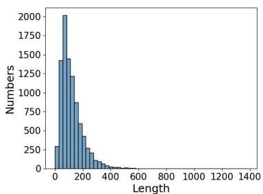  
(a) Candidate length distribution

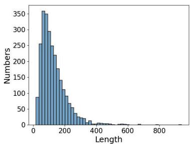  
(b) Query length distribution  
Figure 2: The length distribution of queries and candidates

The annotation process itself was designed to minimize errors and ensure reliability. Each query legal article was annotated independently by two different annotators. This redundancy helps to reduce the errors that can arise from single-person annotation and ensures that the final dataset reflects a consensus among multiple legal experts, thereby increasing its reliability.

To further ensure the quality of the annotations, we sampled 5% of the data for a final inspection. This sample was reviewed by a team of senior legal experts who checked for errors and inconsistencies. If errors were found in the sampled data, the relevant sections were flagged, and the annotators were asked to review and correct them until no errors were found in the sampled data. This feedback loop helped to maintain high standards of accuracy throughout the dataset.

## 3.5 Dataset Statistics

After the construction process described, we obtained a total of 2,627 manually annotated articles from 150 municipal regulations as query articles and 9184 articles as candidate articles which include 2,976 provincial-level articles and 6,208 national-level articles. The SLARD covers 32 distinct categories, ensuring broad coverage across various legal topics. As depicted in Fig 2, the SLARD reveals that the average length of a query article is 127 tokens, while the average length of articles within the candidate set is 119 tokens. This indicates a relatively balanced length distribution between the query and candidate articles.

## 4 Experimental Setups

## 4.1 Benchmark Settings

In our experiment, several models were finetuned to evaluate their performance on the SLARD. The dataset was partitioned into training and test sets with a 3:7 ratio for each regulation category, resulting in 1,978 samples for training and 649 for testing. From a practical application perspective, after consulting legal professionals, retrieving the top-5 results for reference was deemed acceptable. Therefore, retrieval performance was assessed using Recall@K $K \in ( 1 , 3 , 5 )$ and Mean Reciprocal Rank (MRR) @5 as evaluation metrics.

For the implementation of the BM25 algorithm, we utilized Elasticsearch. The docT5query model was implemented using the mt5 model (Xue et al., 2020). General pre-trained models were directly loaded from the Hugging Face model hub, ensuring that state-of-the-art models were used for comparison. Retrieval-oriented pre-trained models were based on the Chinese-BERT-WWM model, following the official implementation guidelines.

For the HyDE method, we employed the BGE3 (Xiao et al., 2023) model as the embedding model, and the LLMs indicated in Table 3 were represented by Qwen1.5-7B-Chat by default. During the training of the neural retrieval models, we set the maximum input length to 256 tokens and used a batch size of 16. To generate negative examples, we followed the approach of previous work (Kim et al., 2016; Wrzalik and Krechel, 2021), deriving these examples from incorrect search results produced by BM25. The ratio of positive to negative examples was set at 1:15.

## 4.2 Baselines

Four types of widely used retrieval models were used as baselines in this experiment: Sparse Retrieval Models, Generic Pre-trained Retrieval Mod-

els, Retrieval-oriented Pre-trained Models, and Retrieval Models Based on Large Language Models.

## • Sparse Retrieval Models

BM25(Robertson et al., 2009) is a traditional sparse retrieval model based on word frequency and document length.

docT5query(Nogueira et al., 2019) enhances query robustness by generating related queries.

## • Generic Pre-trained Retrieval Models

Chinese-BERT-WWM(Cui et al., 2021) is the Chinese version of Bert trained with Whole Word Mask (WWM) and Next Sentence Prediction(NSP) tasks.

Chinese-RoBERTa-WWM(Cui et al., 2021) is trained in enlarged datasets with only WWM tasks with the same architecture as Bert.

Lawformer(Xiao et al., 2021) is pre-trained on a legal corpus and extends the maximum supported input length of the model and enhances its performance in scenarios involving long legal texts.

## • Retrieval-oriented Pre-trained Models

DPR(Karpukhin et al., 2020) proposed a bi-encoder architecture, which maps all text into a low-dimensional continuous space to achieve highly robust semantic retrieval performance.

RetroMAE(Xiao et al., 2022) proposed a Masked Auto-Encoder pre-training strategy to enhance the model’s representation capabilities at the sentence level.

ColBERT(Khattab and Zaharia, 2020) performs late interaction at the token level to calculate the sentence similarity.

## • Retrieval Models Based on LLM

HyDE(Gao et al., 2022) uses pseudo documents generated by LLMs for semantic alignment, the pseudo documents are embedded and then vector retrieved to obtain relevant results.

Query2Doc(Wang et al., 2023) uses LLMs for query expansion and concatenation with the query for subsequent sparse or dense retrieval.

<table><tr><td colspan="2">Model</td><td colspan="4">Metrics</td></tr><tr><td colspan="2"></td><td>R@1</td><td>R@3</td><td>R@5</td><td>MRR@5</td></tr><tr><td rowspan="3">Sparse Retrieval Models</td><td>BM25</td><td>44.62</td><td>70.17</td><td>76.65</td><td>57.69</td></tr><tr><td>docT5query</td><td>38.14</td><td>60.88</td><td>67.6</td><td>49.94</td></tr><tr><td>Chinese-BERT-WWM</td><td>25.55</td><td>33.01</td><td>33.99</td><td>29.12</td></tr><tr><td rowspan="3">Generic Pre-trained Models Retrieval-oriented</td><td>Chinese-RoBERTa-WWM</td><td>27.63</td><td>35.82</td><td>38.51</td><td>31.94</td></tr><tr><td>Lawformer</td><td>26.16</td><td>34.6</td><td>37.41</td><td>30.57</td></tr><tr><td>DPR</td><td>47.19</td><td>74.33</td><td>81.3</td><td>61.07</td></tr><tr><td rowspan="3">Models Large Language Model</td><td>RetroMAE</td><td>47.19</td><td>74.57</td><td>81.66</td><td>61.18</td></tr><tr><td>ColBERT</td><td>40.22</td><td>66.63</td><td>73.47</td><td>53.76</td></tr><tr><td>HyDE</td><td>18.34</td><td>28</td><td>32.89</td><td>23.78</td></tr><tr><td rowspan="2">For Retrieval</td><td>Query2doc+BM25</td><td>38.75</td><td>63.08</td><td>70.05</td><td>51.46</td></tr><tr><td> $\mathbf { Q u e r y 2 d o c } _ { + D P R }$ </td><td>41.2</td><td>65.04</td><td>72.37</td><td>53.51</td></tr></table>

Table 1: Performance of different models on SLARD. The top-performing model for each method is highlighted in bold, while the second-best results are underlined.

## 5 Results and Analyses

In this section, we present and analyze the performance of various retrieval models on the SLARD. Through these experiments, we aim to provide a comprehensive assessment of the strengths and weaknesses of different retrieval approaches in the context of legal article retrieval and highlight areas for improvement.

## 5.1 Performance of existing methods on the SLARD

The performance of existing methods on the SLARD is presented in Table 1. Based on the experimental results, several insights can be drawn:

The sparse retrieval method, specifically BM25, demonstrates competitive performance in retrieving superior legal articles compared to other methods. Superior legal articles often form the basis for current articles, leading to significant overlap in vocabulary and phrasing between the query and the superior articles. This overlap enables BM25, which relies on term frequency and inverse document frequency, to achieve relatively good results by effectively matching similar terms. However, these results are only relatively good; with an R@5 of 76.65% and an R@1 of 44.62%, the performance remains less than satisfactory. This indicates that superior legal article retrieval continues to pose a challenge for the BM25 method.

In contrast, general pre-trained models significantly underperform compared to other methods. For example, Chinese-RoBERTa-WWM achieves only 33.85% in terms of R@5, which is inadequate for practical applications. This highlights that merely enhancing the representation capability of generic pre-trained models for legal texts does not yield satisfactory results. One key reason is the high degree of condensation and specificity in legal language, which poses challenges for general models to capture the necessary nuances. Additionally, Lawformer, despite being pre-trained on legal case data, does not perform optimally among general pre-trained models. This suboptimal performance can be attributed to the mismatch between its training data distribution and the actual content of the laws in the SLARD dataset.

Retrieval-oriented pre-trained models demonstrate the best overall performance. Fine-tuning these models with a substantial number of negative samples enables them to better differentiate between relevant and irrelevant articles, thereby improving accuracy in retrieval tasks. The topperforming method achieved 81.66% in R@5; however, R@1 is only 47.19%, indicating that approximately half of the superior legal articles are still missed. This highlights the ongoing need for improvements in recall rates for this task.

The performance of LLMs in retrieval tasks reflects their prior knowledge of superior legal articles. However, LLMs perform worse on the SLARD dataset, even compared to the traditional BM25 algorithm. This suggests that although LLMs are trained on a vast amount of general knowledge, the specificity and detailed nature of legal texts require more focused fine-tuning to enhance their performance in the legal domain.

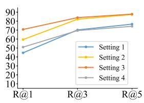  
(a) BM25

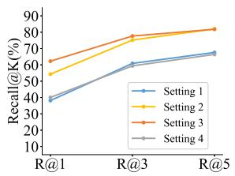  
(b) docT5query

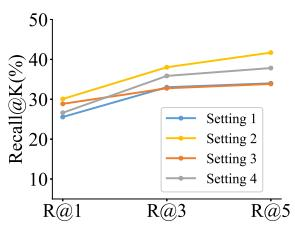  
(c) Chinese-BERT-WWM

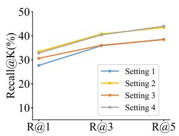  
(d) Chinese-RoBERTa-WWM

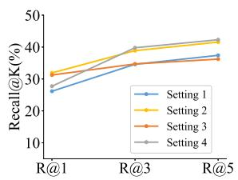  
(e) Lawformer

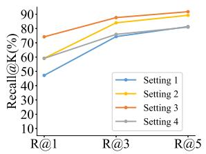  
(f) DPR

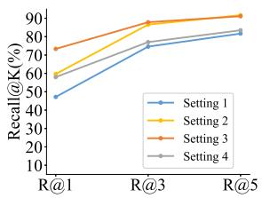  
(g) RetroMAE

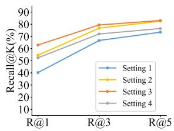  
(h) ColBERT

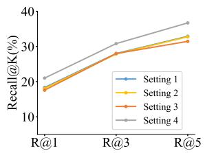  
(i) HyDE

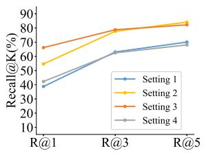  
(j) Query2doc+BM25

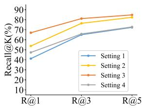  
(k) Query2doc+DP R  
Figure 3: The performance of the models under different candidate collection settings.

## 5.2 Performance under different candidate collections

In this section, we classify the candidate collections into four settings based on their levels of legal effectiveness to evaluate the model’s performance across various scenarios4.

Setting 1 (Section 5.1): The candidate collection includes all 9,184 legal articles with higher effectiveness levels, encompassing both provincial and national articles.

Setting 2: The candidate collection is tailored to the given query article and consists of articles contained in the corresponding superior regulations. In this setting, the candidate collection includes an average of 73 articles for each query.

Setting 3: The candidate collection is restricted to provincial-level legal articles, totaling 2,976 articles. This setting assesses the model’s performance within a specific jurisdictional scope, focusing on the retrieval of regional articles.

Setting 4: The candidate collection is limited to national-level legal articles, comprising a total of 6,208 articles. This setting evaluates the model’s ability to identify relevant national articles.

Based on the results shown in Figure 3, we can draw the following conclusions:

In Setting 2, reducing the candidate set from 9,184 articles to an average of 62 significantly enhances all performance metrics. This enhancement is anticipated because a smaller candidate set simplifies the retrieval task, thereby facilitating the models’ ability to pinpoint relevant articles. Typically, only one or two articles are pertinent to the query content. Nonetheless, the task of SLARD remains challenging. Under the R@1 metric, the best-performing method achieves only 59.66%, indicating that accurately retrieving the most relevant article continues to be a formidable challenge.

In Setting 3, where the candidate set comprises provincial articles, there is a marked improvement in performance metrics, with a 27% increase in R@1 for DPR compared to Setting 1. This boost is likely due to the narrowed query scope (from 9,184 to 2,976), which reduces interference from irrelevant results and the inherent similarities in context and lexicon between provincial and the queried municipal articles. These factors ease the challenge of semantic representation, corroborating the hypothesis that documents sharing similar scopes and terminologies yield better retrieval outcomes.

<table><tr><td rowspan="2">Method</td><td rowspan="2">Model</td><td colspan="4">Metrics</td></tr><tr><td>R@1</td><td>R@3</td><td>R@5</td><td>MRR@5</td></tr><tr><td rowspan="3">HyDE</td><td>Qwen</td><td>18.34</td><td>28</td><td>32.89</td><td>23.78</td></tr><tr><td>ChatGLM</td><td>19.56</td><td>28</td><td>32.4</td><td>24.28</td></tr><tr><td>Baichuan</td><td>20.05</td><td>27.75</td><td>31.78</td><td>24.36</td></tr><tr><td rowspan="3">Query2doc+BM25</td><td>Qwen</td><td>38.75</td><td>63.08</td><td>70.05</td><td>51.46</td></tr><tr><td>ChatGLM</td><td>39.98</td><td>66.01</td><td>71.03</td><td>52.64</td></tr><tr><td>Baichuan</td><td>41.44</td><td>65.65</td><td>72.25</td><td>53.96</td></tr><tr><td rowspan="3">Query2doc+DPR</td><td>Qwen</td><td>41.2</td><td>65.04</td><td>72.37</td><td>53.51</td></tr><tr><td>ChatGLM</td><td>41.44</td><td>64.55</td><td>72.13</td><td>53.43</td></tr><tr><td>Baichuan</td><td>42.3</td><td>65.77</td><td>73.35</td><td>54.76</td></tr></table>

Table 2: The retrieval performance of different Large Language Models on SLARD. The top-performing model for each method is highlighted in bold, while the second-best results are underlined.

In Setting 4, a notable decline in performance is observed across almost all models (except for ColBERT) relative to Setting 3. National articles, being more general, diverse, and abstract, increase the complexity for models to accurately discern relevant from irrelevant articles. Although the query scope is narrower than in Setting 1, enhancing retrieval metrics to a degree, the overall improvement is modest due to the heightened challenge of representing these documents accurately. This outcome highlights the critical role of document specificity and abstraction levels in optimizing legal document retrieval models.

## 5.3 Performance of different LLMs

In this section, we evaluate the performance of three widely used open-source LLMs for Chinese on the SLARD: Qwen1.5-7B-Chat (Bai et al., 2023), ChatGLM2-6B (GLM et al., 2024), Baichuan2-7B-Chat (Yang et al., 2023). Each of these models has been trained on extensive corpora.

Our experiment is grounded in the assumption that LLMs possess world knowledge about the content of superior legal articles acquired during training, which can assist in the retrieval task. We aim to comprehensively evaluate the memory and retrieval capabilities of existing open-source LLMs concerning superior legal articles. The experimental results are presented in Table 2.

The results demonstrate that Baichuan consistently outperformed the other LLMs across almost all metrics and retrieval methods. Although its R@3 and R@5 scores (27.75% and 31.78%, respectively) were slightly lower than those of Qwen and ChatGLM, Baichuan achieved the highest MRR@5 of 24.36%, indicating superior overall ranking quality. In the Query2doc+BM25 and Query2doc+DPR methods, Baichuan’s performance was markedly better across all metrics. These findings suggest that Baichuan2-7B-Chat possesses a higher degree of legal knowledge and superior retrieval capabilities for superior legal articles compared to the other models.

Despite these strengths, it is important to note that all LLMs, including Baichuan, underperformed compared to traditional retrieval methods and retrieval-oriented models. This underperformance underscores a critical limitation of current LLMs in specialized legal information retrieval tasks, highlighting the need for further fine-tuning and the incorporation of more domain-specific training data to enhance their performance.

Overall, our experimental findings suggest that while LLMs demonstrate promising potential in legal document retrieval, significant improvements are still necessary to effectively meet the specific demands of the legal domain.

## 6 Conclusion

In this paper, we introduce SLARD, a large-scale dataset for Chinese superior legal articles retrieval. SLARD includes 2,627 queries and 9,184 candidate articles across 32 categories, addressing a critical gap in legal information retrieval tasks. We evaluate several models on SLARD to establish a performance benchmark, with results indicating that it is a challenging dataset, particularly in retrieving national superior articles, where significant improvements are necessary. Moreover, experiments reveal that existing open-source LLMs lack prior knowledge of superior legal articles. SLARD serves as a valuable benchmark for the development of advanced retrieval techniques and the finetuning of models specific to legal texts. It is anticipated that SLARD will become a foundational resource for legislative research and will advance the field of superior legal article retrieval, contributing to more efficient and coherent legal systems.

## Limitations

We acknowledge two major limitations in this study that could be addressed in future research. The first limitation is the dynamic nature of regulations. Although we utilize the most up-to-date legal data, future modifications to existing regulations and the introduction of new ones remain a possibility. This inherent dynamism in regulatory frameworks presents challenges in maintaining the currency and accuracy of our analysis. The second limitation concerns the diversity of regulations. Regulations encompass a broad spectrum of social life, and while our dataset includes 32 common categories, some areas remain underrepresented. This diversity makes it challenging to ensure comprehensive coverage, underscoring the need for continuous updates and expansions of the dataset.

For future work, developing a more adaptive and scalable system that can automatically integrate new and updated regulations would be advantageous. Additionally, expanding the dataset to encompass a broader range of regulatory categories could further enhance the comprehensiveness and robustness of the analysis.

## Ethics Statement

Ethical considerations have been a cornerstone of this research from the very beginning. Throughout the dataset construction process, we prioritized the well-being and rights of all annotators. We ensured transparency and consent by fully informing them about the nature of their tasks and the research objectives. To safeguard their welfare, we controlled working hours to prevent overwork and provided fair compensation. Annotators who demonstrated proficiency in their tasks received an average hourly wage of 40 yuan, which exceeds the local minimum wage (22 yuan) of in our area.

All data used in this study were sourced from publicly available information on official government websites, which can be freely accessed and downloaded by the public under the terms of service outlined on each site. These sources are intended for public use and do not require special permissions for data retrieval. No modifications were made to the original data to ensure data integrity and rigor. Annotators were explicitly instructed to refrain from copying or reproducing any copyrighted material without proper authorization and were reminded to cite sources appropriately when necessary.

We recognize the potential risks associated with automating legal articles retrieval. Our system is designed to complement rather than replace human expertise. It aims to enhance efficiency and accuracy in legal research, allowing professionals to focus on more complex and strategic aspects of their work.

## Acknowledgments

This work is supported by the National Natural Science Foundation of China (62472261,62102234).

## References

Jinze Bai, Shuai Bai, Yunfei Chu, Zeyu Cui, Kai Dang, Xiaodong Deng, Yang Fan, Wenbin Ge, Yu Han, Fei Huang, et al. 2023. Qwen technical report. arXiv preprint arXiv:2309.16609.

Ilias Chalkidis, Manos Fergadiotis, Nikolaos Manginas, Eva Katakalou, and Prodromos Malakasiotis. 2021. Regulatory compliance through doc2doc information retrieval: A case study in eu/uk legislation where text similarity has limitations. arXiv preprint arXiv:2101.10726.

Yiming Cui, Wanxiang Che, Ting Liu, Bing Qin, and Ziqing Yang. 2021. Pre-training with whole word masking for chinese bert. IEEE/ACM Transactions on Audio, Speech, and Language Processing, 29:3504–3514.

Michael Curtotti, Eric McCreath, Tom Bruce, Sara Frug, Wayne Weibel, and Nicolas Ceynowa. 2015. Machine learning for readability of legislative sentences. In Proceedings ofthe 15th International Conference on Artificial Intelligence and Law, pages 53–62.

Edward Donelan. 2022. Regulatory governance: policy making, legislative drafting and law reform. Springer Nature.

Yehezkel Dror. 1958. Law and social change. Tul. L. Rev., 33:787.

Luyu Gao, Xueguang Ma, Jimmy Lin, and Jamie Callan. 2022. Precise zero-shot dense retrieval without relevance labels. arXiv preprint arXiv:2212.10496.

Team GLM, Aohan Zeng, Bin Xu, Bowen Wang, Chenhui Zhang, Da Yin, Diego Rojas, Guanyu Feng, Hanlin Zhao, Hanyu Lai, et al. 2024. Chatglm: A family of large language models from glm-130b to glm-4 all tools. arXiv preprint arXiv:2406.12793.

Yoshinobu Kano, Mi-Young Kim, Randy Goebel, and Ken Satoh. 2017. Overview of coliee 2017. In COL-IEE@ ICAIL, pages 1–8.

Vladimir Karpukhin, Barlas Oguz, Sewon Min, Patrick˘ Lewis, Ledell Wu, Sergey Edunov, Danqi Chen, and Wen-tau Yih. 2020. Dense passage retrieval for open-domain question answering. arXiv preprint arXiv:2004.04906.

Sean J Kealy. 2021. Legislative scrutiny in the united states: dynamic, whole-stream revision. The Theory and Practice ofLegislation, 9(2):227–249.

Hans Kelsen. 2017. General theory of law and state. Routledge.

Omar Khattab and Matei Zaharia. 2020. Colbert: Efficient and effective passage search via contextualized late interaction over bert. In Proceedings ofthe 43rd International ACM SIGIR conference on research and development in Information Retrieval, pages 39– 48.

Mi-Young Kim, Randy Goebel, Yoshinobu Kano, and Ken Satoh. 2016. Coliee-2016: evaluation of the competition on legal information extraction and entailment. In International Workshop on Jurisinformatics (JURISIN 2016).

Mi-Young Kim, Randy Goebel, and S Ken. 2015. Coliee-2015: evaluation of legal question answering. In Ninth International Workshop on Juris-informatics (JURISIN 2015).

Haitao Li, Yunqiu Shao, Yueyue Wu, Qingyao Ai, Yixiao Ma, and Yiqun Liu. 2024. Lecardv2: A largescale chinese legal case retrieval dataset. In Proceedings of the 47th International ACM SIGIR Conference on Research and Development in Information Retrieval, pages 2251–2260.

Antoine Louis and Gerasimos Spanakis. 2021. A statutory article retrieval dataset in french. arXiv preprint arXiv:2108.11792.

Yixiao Ma, Yunqiu Shao, Yueyue Wu, Yiqun Liu, Ruizhe Zhang, Min Zhang, and Shaoping Ma. 2021. Lecard: a legal case retrieval dataset for chinese law system. In Proceedings of the 44th international ACM SIGIR conference on research and development in information retrieval, pages 2342–2348.

Rodrigo Nogueira, Jimmy Lin, and AI Epistemic. 2019. From doc2query to doctttttquery. Online preprint, 6(2).

Inara Opmane, Juris Balodis, and Rihards Balodis. 2019. Governance of legislative requirements for the development of natural language processing tools. In MIC 2019: Managing Geostrategic Issues; Proceedings ofthe Joint International Conference, Opatija, Croatia, 29 May–1 June 2019, pages 13–27. University of Primorska Press.

Richard A Posner. 1993. The problems of jurisprudence. Harvard University Press.

Juliano Rabelo, Randy Goebel, Mi-Young Kim, Yoshinobu Kano, Masaharu Yoshioka, and Ken Satoh. 2022. Overview and discussion of the competition on legal information extraction/entailment (coliee) 2021. The Review of Socionetwork Strategies, 16(1):111– 133.

Juliano Rabelo, Mi-Young Kim, Randy Goebel, Masaharu Yoshioka, Yoshinobu Kano, and Ken Satoh. 2021. Coliee 2020: methods for legal document retrieval and entailment. In New Frontiers in Artificial Intelligence: JSAI-isAI 2020 Workshops, JURISIN, LENLS 2020 Workshops, Virtual Event, November 15–17, 2020, Revised Selected Papers 12, pages 196– 210. Springer.

Stephen Robertson, Hugo Zaragoza, et al. 2009. The probabilistic relevance framework: Bm25 and beyond. Foundations and Trends® in Information Retrieval, 3(4):333–389.

Carlo Sansone and Giancarlo Sperlí. 2022. Legal information retrieval systems: State-of-the-art and open issues. Information Systems, 106:101967.

Jaromír Šavelka and Kevin D Ashley. 2022. Legal information retrieval for understanding statutory terms. Artificial Intelligence and Law, pages 1–45.

Weihang Su, Yiran Hu, Anzhe Xie, Qingyao Ai, Zibing Que, Ning Zheng, Yun Liu, Weixing Shen, and Yiqun Liu. 2024. Stard: A chinese statute retrieval dataset with real queries issued by non-professionals. arXiv preprint arXiv:2406.15313.

Ron Van Gog and Tom M Van Engers. 2001. Modeling legislation using natural language processing. In 2001 IEEE International Conference on Systems, Man and Cybernetics. e-Systems and e-Man for Cybernetics in Cyberspace (Cat. No. 01CH37236), volume 1, pages 561–566. IEEE.

Lars Vinx. 2007. Hans Kelsen’s pure theory of law: legality and legitimacy. Oxford University Press, USA.

Liang Wang, Nan Yang, and Furu Wei. 2023. Query2doc: Query expansion with large language models. corr abs/2303.07678 (2023). arXiv preprint arXiv:2303.07678.

Marco Wrzalik and Dirk Krechel. 2021. Gerdalir: A german dataset for legal information retrieval. In Proceedings of the Natural Legal Language Processing Workshop 2021, pages 123–128.

Chaojun Xiao, Xueyu Hu, Zhiyuan Liu, Cunchao Tu, and Maosong Sun. 2021. Lawformer: A pre-trained language model for chinese legal long documents. AI Open, 2:79–84.

Shitao Xiao, Zheng Liu, Yingxia Shao, and Zhao Cao. 2022. Retromae: Pre-training retrieval-oriented language models via masked auto-encoder. arXiv preprint arXiv:2205.12035.

Shitao Xiao, Zheng Liu, Peitian Zhang, and Niklas Muennighof. 2023. C-pack: Packaged resources to advance general chinese embedding. arXiv preprint arXiv:2309.07597.

Linting Xue, Noah Constant, Adam Roberts, Mihir Kale, Rami Al-Rfou, Aditya Siddhant, Aditya Barua, and Colin Raffel. 2020. mt5: A massively multilingual pre-trained text-to-text transformer. arXiv preprint arXiv:2010.11934.

Aiyuan Yang, Bin Xiao, Bingning Wang, Borong Zhang, Ce Bian, Chao Yin, Chenxu Lv, Da Pan, Dian Wang, Dong Yan, et al. 2023. Baichuan 2: Open large-scale language models. arXiv preprint arXiv:2309.10305.

## A Example of SLARD

Table 3 presents an example of SLARD, including a municipal-level legal article and corresponding provincial and national superior legal articles.

## B Prompt Template

The Table 4 presents the prompt templates for article generation used in HyDE and Query2doc.

## C Category covered by SLARD

Table 5 presents the categories of legal articles included in SLARD, along with the number of instances in both the query and candidate sets.

## D The results of LLMs’ performance under different settings

Tabel 6 7 8 show the results of retrieval performance of different Large Language Models on SLARD in different candidate collection settings described on section 5.2.

Baichuan still performed the best overall. Compared to setting 1, the reduction in the number of candidate sets led to improvements in all metrics. However, the retrieval of national-level superior legal articles (setting 4) had relatively poor performance across all metrics, indicating that it remains a challenge.

## E Numerical results under different

Tables 9 10 and 11 provide the numerical accuracy results shown in Figure 3.

  
Table 3: An example of superior legal article retrieval. The article 4 of the Water and Soil Conservation Management Measures in Jining City stipulates the responsibilities of local governments in aspects such as work planning, system construction, and financial investment for soil and water conservation. Its superior articles, Article 4 of the Water and Soil Conservation Regulations in Shandong Province and Article 4 of the Water and Soil Conservation Law of the People’s Republic of China stipulate the responsibilities at the provincial and national levels respectively.

<table><tr><td>prompt template</td></tr><tr><td>You are a legal expert. Please provide the specific content of the superior legal article for the given current article. Only include the specific content</td></tr><tr><td>of the superior legal article, without any additional information.</td></tr><tr><td>## Current Article: ## Superior Legal Article Content:</td></tr></table>

Table 4: Prompt templates for article generation used in experiments.

<table><tr><td rowspan="2">Category</td><td colspan="2">Numbers</td></tr><tr><td>Query</td><td>Candidate</td></tr><tr><td>Forestry</td><td>148</td><td>293</td></tr><tr><td>Civil Affairs</td><td>313</td><td>721</td></tr><tr><td>Surveying</td><td>21</td><td>100</td></tr><tr><td>Energy</td><td>211</td><td>715</td></tr><tr><td>Agriculture</td><td>12</td><td>324</td></tr><tr><td>Real Estate</td><td>9</td><td>249</td></tr><tr><td>Environmental Protection</td><td>334</td><td>889</td></tr><tr><td>Tourism</td><td>133</td><td>288</td></tr><tr><td>Legal System</td><td>233</td><td>367</td></tr><tr><td>Animal Husbandry</td><td>18</td><td>425</td></tr><tr><td>National Security</td><td>37</td><td>243</td></tr><tr><td>Cultural Relics and History</td><td>0</td><td>246</td></tr><tr><td>Intellectual Property</td><td>97</td><td>302</td></tr><tr><td>Human Rights</td><td>171</td><td>484</td></tr><tr><td>Business Environment Optimization</td><td>96</td><td>139</td></tr><tr><td>Education</td><td>112</td><td>486</td></tr><tr><td>Land</td><td>104</td><td>313</td></tr><tr><td>Labor Unions</td><td>0</td><td>214</td></tr><tr><td>Water Conservancy</td><td>85</td><td>511</td></tr><tr><td>Sports</td><td>32</td><td>213</td></tr><tr><td>Constitution</td><td>18</td><td>86</td></tr><tr><td>Business Administration</td><td>38</td><td>207</td></tr><tr><td>Military</td><td>57</td><td>99</td></tr><tr><td>Advertising</td><td>40</td><td>119</td></tr><tr><td>Commerce and Trade</td><td>69</td><td>160</td></tr><tr><td>Industrial Management</td><td>57</td><td>405</td></tr><tr><td>Enterprise</td><td>30</td><td>120</td></tr><tr><td>Construction</td><td>65</td><td>55</td></tr><tr><td>Contracts</td><td>33</td><td>198</td></tr><tr><td>Fishing</td><td>20</td><td>92</td></tr><tr><td>Culture</td><td>22</td><td>48</td></tr><tr><td>Price</td><td>12</td><td>73</td></tr></table>

Table 5: Statistical of categories on SLARD

<table><tr><td colspan="2">Model</td><td colspan="4">Metrics</td></tr><tr><td colspan="2"></td><td>R@1</td><td>R@3</td><td>R@5</td><td>MRR@5</td></tr><tr><td rowspan="3">HyDE</td><td>Qwen</td><td>18.09</td><td>27.87</td><td>32.76</td><td>23.62</td></tr><tr><td>ChatGLM</td><td>19.68</td><td>28.24</td><td>32.27</td><td>24.34</td></tr><tr><td>Baichuan</td><td>19.93</td><td>27.87</td><td>31.91</td><td>24.33</td></tr><tr><td rowspan="3">Query2doc+BM25</td><td>Qwen</td><td>54.65</td><td>77.63</td><td>84.11</td><td>66.52</td></tr><tr><td>ChatGLM</td><td>54.89</td><td>78.85</td><td>84.23</td><td>66.89</td></tr><tr><td>Baichuan</td><td>55.75</td><td>79.34</td><td>84.96</td><td>67.71</td></tr><tr><td rowspan="3">Query2doc+DPR</td><td>Qwen</td><td>53.79</td><td>76.41</td><td>82.40</td><td>65.3</td></tr><tr><td>ChatGLM</td><td>52.08</td><td>74.94</td><td>81.05</td><td>63.64</td></tr><tr><td>Baichuan</td><td>54.03</td><td>76.77</td><td>84.47</td><td>66.71</td></tr><tr><td rowspan="3">HyDE</td><td>Qwen</td><td>17.57</td><td>27.98</td><td>31.45</td><td>23.08</td></tr><tr><td>ChatGLM</td><td>18.87</td><td>28.63</td><td>31.24</td><td>23.73</td></tr><tr><td>Baichuan</td><td>18.87</td><td>26.03</td><td>29.93</td><td>22.89</td></tr><tr><td rowspan="3"> $\mathbf { Q u e r y 2 d o c } _ { + B M 2 5 }$ </td><td>Qwen</td><td>66.16</td><td>78.74</td><td>82.21</td><td>72.4</td></tr><tr><td>ChatGLM</td><td>65.94</td><td>79.61</td><td>83.30</td><td>72.64</td></tr><tr><td>Baichuan</td><td>67.25</td><td>79.83</td><td>83.51</td><td>73.52</td></tr><tr><td rowspan="3"> $\mathbf { Q u e r y 2 d o c } _ { + D P R }$ </td><td>Qwen</td><td>67.03</td><td>81.13</td><td>84.82</td><td>74.15</td></tr><tr><td>ChatGLM</td><td>65.51</td><td>82.00</td><td>86.33</td><td>73.5</td></tr><tr><td>Baichuan</td><td>67.68</td><td>80.04</td><td>85.47</td><td>74.27</td></tr></table>

Table 6: The retrieval performance of different Large Language Models on SLARD in Setting 2

Table 7: The retrieval performance of different Large Language Models on SLARD in Setting 3

<table><tr><td colspan="2">Model</td><td colspan="4">Metrics</td></tr><tr><td colspan="2"></td><td>R@1</td><td>R@3</td><td>R@5</td><td>MRR@5</td></tr><tr><td rowspan="3">HyDE</td><td>Qwen</td><td>21.01</td><td>30.81</td><td>36.69</td><td>26.69</td></tr><tr><td>ChatGLM</td><td>22.69</td><td>31.37</td><td>35.85</td><td>27.5</td></tr><tr><td>Baichuan</td><td>23.25</td><td>32.77</td><td>37.25</td><td>28.58</td></tr><tr><td rowspan="3">Query2doc+BM25</td><td>Qwen</td><td>42.30</td><td>62.46</td><td>68.07</td><td>52.68</td></tr><tr><td>ChatGLM</td><td>45.38</td><td>65.27</td><td>70.87</td><td>55.63</td></tr><tr><td>Baichuan</td><td>47.90</td><td>65.55</td><td>72.27</td><td>57.45</td></tr><tr><td rowspan="3">Query2doc+DPR</td><td>Qwen</td><td>47.34</td><td>65.83</td><td>72.83</td><td>57.04</td></tr><tr><td>ChatGLM</td><td>43.98</td><td>64.43</td><td>71.15</td><td>54.48</td></tr><tr><td>Baichuan</td><td>50.42</td><td>68.07</td><td>77.03</td><td>60.26</td></tr></table>

Table 8: The retrieval performance of different Large Language Models on SLARD in Setting 4

<table><tr><td colspan="2">Model</td><td colspan="4">Metrics</td></tr><tr><td colspan="2"></td><td>R@1</td><td>R@3</td><td>R@5</td><td>MRR@5</td></tr><tr><td rowspan="3">Sparse Retrieval Models</td><td>BM25</td><td>59.41</td><td>82.15</td><td>87.41</td><td>71.08</td></tr><tr><td>docT5query</td><td>54.28</td><td>75.18</td><td>82.03</td><td>65.34</td></tr><tr><td>Chinese-BERT-WWM</td><td>30.07</td><td>38.02</td><td>41.69</td><td>34.46</td></tr><tr><td rowspan="3">Generic Pre-trained Models Retrieval-oriented</td><td>Chinese-RoBERTa-WWM</td><td>33.37</td><td>40.71</td><td>43.4</td><td>37.29</td></tr><tr><td>Lawformer</td><td>31.91</td><td>38.88</td><td>41.56</td><td>35.65</td></tr><tr><td>DPR</td><td>59.17</td><td>83.99</td><td>89.24</td><td>71.78</td></tr><tr><td rowspan="3">Models Large Language Model</td><td>RetroMAE</td><td>59.66</td><td>86.55</td><td>91.69</td><td>73.29</td></tr><tr><td>ColBERT</td><td>54.52</td><td>76.77</td><td>82.52</td><td>66</td></tr><tr><td>HyDE</td><td>18.09</td><td>27.87</td><td>32.76</td><td>23.62</td></tr><tr><td rowspan="2">For Retrieval</td><td>Query2doc+BM25</td><td>54.65</td><td>77.63</td><td>84.11</td><td>66.52</td></tr><tr><td>Query2doc+DPR</td><td>53.79</td><td>76.41</td><td>82.40</td><td>65.30</td></tr><tr><td rowspan="2">Model</td><td rowspan="2"></td><td colspan="4">Metrics</td></tr><tr><td>R@1</td><td>R@3</td><td>R@5</td><td>MRR@5</td></tr><tr><td>Sparse Retrieval Models</td><td>BM25</td><td>70.72</td><td>83.95</td><td>87.85</td><td>77.44</td></tr><tr><td rowspan="3">Generic Pre-trained Models</td><td>docT5query</td><td>62.26</td><td>77.66</td><td>81.78</td><td>69.92</td></tr><tr><td>Chinese-BERT-WWM</td><td>28.85</td><td>32.75</td><td>33.84</td><td>30.91</td></tr><tr><td>Chinese-RoBERTa-WWM</td><td>30.59</td><td>36.01</td><td>38.39</td><td>33.60</td></tr><tr><td rowspan="3">Retrieval-oriented Models</td><td>Lawformer</td><td>31.24</td><td>34.71</td><td>36.23</td><td>33.71</td></tr><tr><td>DPR</td><td>74.19</td><td>87.64</td><td>91.76</td><td>80.90</td></tr><tr><td>RetroMAE</td><td>73.32</td><td>87.85</td><td>91.11</td><td>80.33</td></tr><tr><td rowspan="3">Large Language Model For Retrieval</td><td>ColBERT</td><td>62.91</td><td>79.39</td><td>83.08</td><td>71.11</td></tr><tr><td>HyDE Query2doc+BM25</td><td>17.57 66.16</td><td>27.98 78.74</td><td>31.45 82.21</td><td>23.08</td></tr><tr><td>Query2doc+DPR</td><td>67.03</td><td>81.13</td><td>84.82</td><td>72.40 74.15</td></tr></table>

Table 9: Numerical accuracy results in Setting 2

Table 10: Numerical accuracy results in Setting 3

<table><tr><td rowspan="2"></td><td rowspan="2">Model</td><td colspan="4">Metrics</td></tr><tr><td>R@1</td><td>R@3</td><td>R@5</td><td>MRR@5</td></tr><tr><td rowspan="2">Sparse Retrieval Models</td><td>BM25</td><td>50.98</td><td>69.47</td><td>74.23</td><td>60.56</td></tr><tr><td>docT5query</td><td>40.06</td><td>59.38</td><td>66.39</td><td>50.05</td></tr><tr><td rowspan="3">Generic Pre-trained Models</td><td>Chinese-BERT-WWM</td><td>26.61</td><td>35.85</td><td>37.82</td><td>31.03</td></tr><tr><td>Chinese-RoBERTa-WWM</td><td>32.77</td><td>40.34</td><td>43.98</td><td>37</td></tr><tr><td>Lawformer</td><td>27.73</td><td>39.78</td><td>42.3</td><td>33.64</td></tr><tr><td rowspan="3">Retrieval-oriented Models</td><td>DPR</td><td>59.1</td><td>75.91</td><td>80.95</td><td>67.69</td></tr><tr><td>RetroMAE</td><td>57.98</td><td>77.03</td><td>83.47</td><td>68.1</td></tr><tr><td>ColBERT</td><td>52.38</td><td>71.99</td><td>76.47</td><td>61.95</td></tr><tr><td rowspan="3">Large Language Model For Retrieval</td><td>HyDE</td><td>21.01</td><td>30.81</td><td>36.69</td><td>26.69</td></tr><tr><td>Query2doc+BM25</td><td>42.3</td><td>62.46</td><td>68.07</td><td>52.68</td></tr><tr><td>Query2doc+DPR</td><td>47.34</td><td>65.83</td><td>72.83</td><td>57.04</td></tr></table>

Table 11: Numerical accuracy results in Setting 4