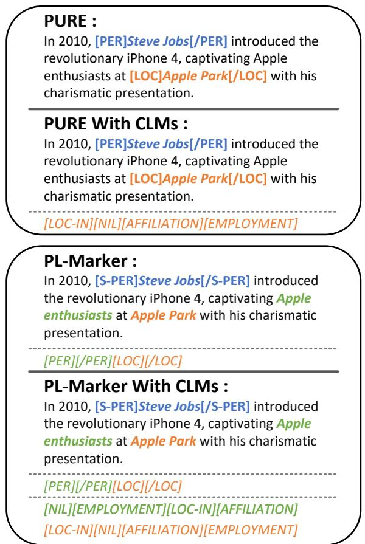
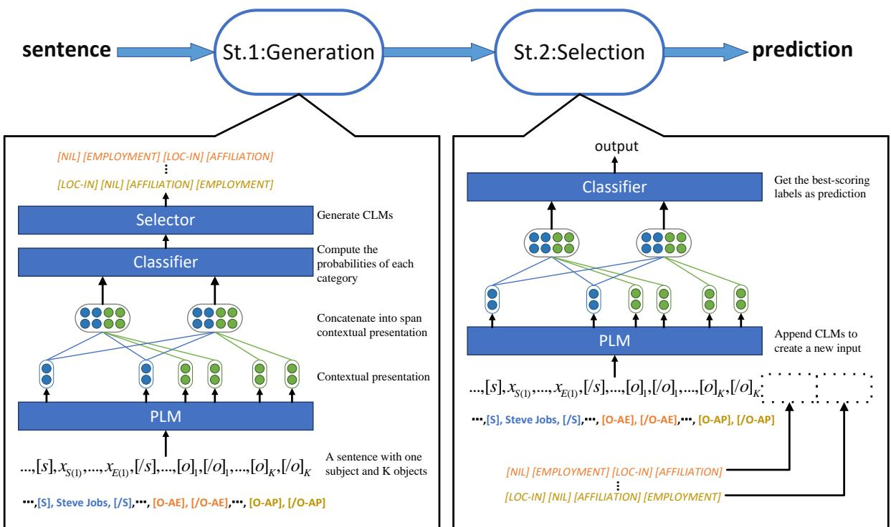
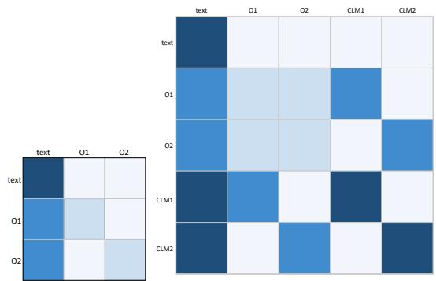

# SURE: Mutually Visible Objects and Self-generated Candidate Labels For Relation Extraction

Yuxuan Feng\*1, Qian Chen\*†1,2, Qianyou Wu1, Xin Guo1, Suge Wang1,2 1School of Computer and Information Technology, Shanxi University 2Key Laboratory of Computational Intelligence and Chinese Information Processing {hhiaa001,qianywu}@gmail.com {chenqian,guoxinjsj,wsg}@sxu.edu.cn

## Abstract

Joint relation extraction models effectively mitigate the error propagation problem inherently present in pipeline models. Nevertheless, joint models face challenges including high computational complexity, complex network architectures, difficult parameter tuning, and notably, limited interpretability. In contrast, recent advances in pipeline relation extraction models (PURE, PL-Marker) have attracted considerable attention due to their lightweight design and high extraction accuracy. A key advancement is the introduction of a marker mecha nism, which enhances relation extraction (RE) process by highlighting entities. However, these models primarily focus on generating correct labels. In doing so, they neglect the label selection process. Moreover, they fail to adequately capture the intricate interactions between entity pairs. To overcome these limitations, we develop a Candidate Label Markers (CLMs) mechanism that prioritizes strategic label selection over simple label generation. Furthermore, we facilitate interactions among diverse relation pairs, enabling the identification of more intricate relational patterns. Experimental results show that we achieve a new SOTA performance. Specifically, based on the same Named Entity Recognition (NER) results as theirs ‡, we improve the SOTA methods by 2.5%, 1.9%, 1.3% in terms of strict F1 scores on SciERC, ACE05 and ACE04.§

## 1 Introduction

Named Entity Recognition (NER) and Relation Extraction (RE) are fundamental tasks in information extraction (IE). Recent works have often adopted a pipeline approach, treating these two tasks separately (Zhong and Chen, 2021; Ye et al., 2022). However, prior to PURE (Zhong and Chen, 2021), several studies have explored the potential benefits of addressing NER and RE jointly, suggesting that such an approach could avoid error propagation and enhance overall extraction performance (Wei et al., 2020; Wang et al., 2020b; Sui et al., 2020). PURE adheres to a sequential methodology where NER is performed first, and followed by RE. PURE highlights input for RE task by inserting special markers around entities. These markers help the model focus on potential relation between marked entities, thereby improving precision in relation extraction.

  
Figure 1: An example in RE task. PURE processes a pair of entities once, while PL-Marker processes a batch with one subject and its corresponding left objects. With our CLMs, it is easier to select than to generate.

Recent works in RE have extensively utilized Pre-trained Language Models (PLMs) (Devlin et al., 2019; Lan et al., 2020) due to their robust understanding of the context. These models are fine-tuned to perform classification tasks to align with dataset-specific labels. This process can be likened to answering open-ended questions where the model generates responses based on question stem. During this process, the model implicitly learns the correct answers through backpropagation.

Moreover, there is a growing interest in enhancing the performance of PLMs on downstream tasks by providing them with additional auxiliary information, such as inserting special markers to highlight entities (Zhong and Chen, 2021), constructing knowledge graphs (Wang et al., 2021a), and utilizing prompts in Large Language Models (LLMs) (Li et al., 2023; Ashok and Lipton, 2023), helping models better understand context.

However, we argue that these methods resemble a Fill-In-The-Blank (FITB) approach. Considering a scenario, given the same question stem, it is easier to answer with multiple choices than with an empty blank. An education research (Medawela et al., 2017) presents that based on the same question stem, a group of students scores 10.05 on average with Multiple Choice Questions (MCQs), while another group scores 6.8 with FITB. This finding suggests that MCQs is easier than FITB. Consider an RE example of PURE shown in Figure 1, it is intuitively easier to select a relation option for the entities Steve Jobs and Apple Park when presented with choices, as opposed to having no options at all. We argue that this basic principle may similarly benefit models. MCQs potentially establish a more robust mapping from the original text to labels compared to FITB approach. Consequently, the presence of explicit choices may guide the model in predicting the correct label.

We adopt a two-stage approach. As shown in Figure 2, in Stage 1 (St.1), we introduce Candidate Label Markers (CLMs) by selecting potential useful labels based on classifier. For Stage 2 (St.2), these CLMs are then concatenated with the original text to form a new input, which is then re-fed into the model. This method, despite its simplicity, has been proven effective. Employing the same encoder architecture, we achieve SOTA results on three standard benchmarks. Using the same NER results as previous state-of-the-art model, we observed strict relation F1 improvements of 2.5%, 1.9%, and 1.3% on SciERC, ACE05, and ACE04, respectively.

To explain the effectiveness of our CLMs mech anism, we provide a detailed analysis contrast ing it with existing methods, particularly focusing on how it addresses limitations in current mod els: (1) Enhanced Auxiliary CLMs Comprehen sion: Research has demonstrated that the process of identifying the correct answer among distrac tors strengthens memory connections (Marsh et al., 2007). CLMs, inspired by cognitive and educa tional theories such as Item Discrimination and Distraction Conflict (Baron, 1986; Baker, 2001; Masters, 1988), may enhance the model’s semantic understanding by distinguishing between relevant and irrelevant labels, thus comprehend positive and negative aspects of knowledge. (2) Descending Ordered CLMs Learning: Establishing a specific order for CLMs during training is crucial. While it is widely acknowledged that introducing randomization into model inputs enhances robustness, we deliberately arrange the CLMs in descending or der. This approach facilitates learning efficiency and construction of multi-perspective knowledge. Notably, during the inference phase, the model no longer requires CLMs, as it has developed suffi cient contextual comprehension. (3) Improved Objects Interaction Awareness: As illustrated by the PL-Marker example in Figure 1, object mark ers representing Apple Park and Apple enthusiasts are invisible to each other in their implementation, resulting in poor performance between pairs. To address this, we enable Mutual Directional Atten tion in ObjectS (M-DOS) to capture objects inter action. To extract the relation that Steve Jobs is located\_in Apple Park, we must consider two di rect relationships: 1. Apple enthusiasts are located in Apple Park; 2. Steve Jobs attracts Apple enthusi asts. By understanding these direct relationships, model can infer the indirect relation that Steve Jobs is located\_in Apple Park. This inference is possible because Apple enthusiasts serve as a connecting element between Steve Jobs and Apple Park.

Our final system, called SURE (Shanxi University Relation Extraction system), along with our code, is publicly available for further experimentation and development.

We summarize our contributions as follows: (1)

We propose SURE, a simple yet effective two-stage method, in which CLMs is proposed to transform the task from FITB to MCQs, guiding the model in predicting the correct label. (2) SURE generates CLMs at St.1, which can capture nuanced semantic meanings and enable M-DOS to reinforce objects interactions at St.2 for better context understanding. (3) Our module, when integrated with existing RE models, significantly enhances their performance. Specifically, on SciERC dataset, it improves the strict relation F1 score of PURE by 1.8% and PL-Marker by 1.0%.

## 2 Related Work

RE is typically modeled jointly with NER. The introduction of PURE (Zhong and Chen, 2021) has significantly reshaped our understanding of both joint and pipeline approaches in capturing interactions between NER and RE. PURE challenges the prevailing assumption that joint models are inherently superior due to their reduction of error propagation, a common issue in pipeline models. Furthermore, the emergence of LLMs represents a notable shift, as these models are now being effectively applied to various sub-tasks, including RE.

LLMs: With their extensive parameters and computation, LLMs offer innovative solutions for information extraction. Recent advancements (Wadhwa et al., 2023) include combining LLMs with Chain of Thought (CoT) and fine-tuning techniques for RE. These models can support multiple tasks like NER, event detection (ED), sentiment analysis (SA) within a single model framework. However, this approach often involves higher training and inference costs compared to previous PLMs.

Joint Models: Joint models integrates NER and RE into a unified framework. Casrel (Wei et al., 2020) is a typical tagging-based approach, which first extracts a subject entity, then simultaneously extracts the relation and its corresponding object entity. However, this approach suffers from error propagation and exposure bias. TPLinker (Wang et al., 2020b), a table-filling approach, addresses the exposure bias problem by formalizing joint NER and RE tasks as a tag pair linking problem in one stage. KEPLER (Wang et al., 2020a) is a knowledge graph-based approach that enhances the ability to capture factual knowledge by combining knowledge embeddings (KE) with PLMs. HGERE (Yan et al., 2023) integrates NER and RE into a unified framework through two key components: high-recall pruners for filtering entity spans, and hypergraph neural networks for processing these spans. By using outputs from HGERE’s NER results as inputs for SURE, we have achieved notable improvements.

Pipeline Models: These models treat NER and RE as separate tasks. PURE (Zhong and Chen, 2021) is a notable pipeline model that innovatively uses text markers to highlight entity span pairs during RE phase, resulting in significant improvement. The PURE (Approx.) variant processes all entities simultaneously during inference phase, with a slight decrease in accuracy but 8x or 16x speed increase. PL-Marker (Ye et al., 2022) synthesizes elements from both PURE (Full) and PURE (Approx.) by introducing a subject-oriented bundling method during in RE phase. While PL-Marker is designed to capture relationships between multiple same-subject pairs simultaneously, our analysis suggests that it does not fully implement this mechanism effectively.

## 3 Method

We apply CLMs only in RE task, and the input of RE is from the output of NER. In this section, we will detail the architecture of our RE model and describe mechanisms in which CLMs are generated and the most appropriate ones are selected.

## 3.1 Background: PURE and PL-Marker

Consider a sentence containing N entities. PURE (Full) (Zhong and Chen, 2021) processes each pair of entities sequentially, resulting in a computational complexity of $O ( N ^ { 2 } )$ . This complexity arises because the method iterates over each possible pair, which is composed of the Cartesian product of the entity collection. In contrast, PURE (Approx.) (Zhong and Chen, 2021) reduces the computational complexity significantly by appending all entity markers at the end of the text, thereby achieving a complexity of O(1). Note that PURE (Approx.) is only utilized to speed up the inference phase. PL-Marker (Ye et al., 2022) integrates these two methods by incorporating one entity into the text as a solid marker and appending the remaining entities at the end as levitated markers. This hybrid strategy is applied during both training and inference phases, achieving a computational complexity of O(N).

  
Figure 2: The main architecture of our model. In St.1, we process the logits from classifier into CLMs. Then in St.2 we append those CLMs to form a new input. The sentence sample is the same with Figure 1. The abbreviation is: [O-AE]=[Object-Apple Enthusiasts], [O-AP]=[Object-Apple Park].

## 3.2 Ours: CLMs for Span Pairs

Enhancing the interaction between entity pairs that share the same subject is crucial, and this requires making object markers mutually visible. PL-Marker proposes that each pair of levitated markers is tied by the directional attention. However, they also note that continuing to apply directional attention across multiple pairs can lead to confusion, as markers may fail to identify their corresponding partners within the same span. Unlike PL-Marker, which does not facilitate this interaction, we propose CLMs to enrich semantic comprehension, thereby enabling M-DOS to work well.

M-DOS is a mutual directional attention mechanism that enable object markers to acquire sufficient knowledge to accurately recognize their corresponding partner markers within the same pair and understand the nuanced relation with other objects. By training the model to distinguish among CLMs, it is possible to select correct label.

Our model is built upon PL-Marker. As illustrated in Figure 2, we employ a two-stage approach in RE. Initially at St.1, like inferring phase, the model produces logits from the classifier without gradient accumulation. We then sort these logits and select the top n (best-scoring) labels and the bottom m (worst-scoring) labels. These selected labels are processed into markers, serving as CLMs and then appended to the end of input text. St.2 is a training phase with gradient accumulation, in which updated inputs is fed.

Problem Definition for RE Formally, given an input sequence with n tokens $\begin{array} { r l } { X } & { { } = } \end{array}$ $\{ x _ { 1 } , x _ { 2 } , . . . , x _ { n } \}$ , and entities discovered from X represented as $\boldsymbol { \varepsilon } = \{ e _ { 1 } , e _ { 2 } , \ldots , e _ { m } \}$ . The goal is to predict a relation type $y _ { r } ( e _ { i } , e _ { j } ) \in \{ 1 , 2 , 3 , . . . , K \}$ for each pair of entities $e _ { i } , e _ { j } \in \varepsilon$ , with the number of predefined relation types of K. If there is no relation, then $y _ { r } ( e _ { i } , e _ { j } ) = 0$

St.1: CLMs Generation Following PL-Marker, we designate one entity as the subject and the others as objects. Solid markers [S] and [/S] are inserted before and after the subject entity, and levitated object markers [O] and [/O] are inserted before and after the object entity, and the modified sequence is denoted as Xˆ :

$$
\begin{array} { r } { \hat { X } = \ldots [ \mathrm { S } ] , x _ { a } , \ldots , x _ { b } , [ / \mathrm { S } ] , \ldots , x _ { c 1 } \cup [ \mathrm { O } 1 ] , } \\ { x _ { d _ { 1 } } \cup [ / \mathrm { O } 1 ] , x _ { c _ { 2 } } \cup [ \mathrm { O } 2 ] , x _ { d _ { 2 } } \cup [ / \mathrm { O } 2 ] , \ldots , } \end{array}
$$

In this sequence, the markers [O1], [/O1], [O2] and [/O2], connected by the union symbol ∪, indicate that these object markers share the position

of corresponding objects. We apply a pre-trained encoder on $\hat { X }$ and the final span pair representation for $s _ { i } = ( a , b )$ and $s _ { j } = ( c , d )$ is:

$$
\theta ( s _ { i } , s _ { j } ) = [ h _ { a - 1 } ; h _ { b + 1 } ; h _ { c } ; h _ { d } ]
$$

Here, [;] denotes concatenation. $h _ { a - 1 }$ and $h _ { b + 1 }$ denote the contextualized embedding of the inserted solid markers for subject $s _ { i }$ , while $h _ { c }$ and $h _ { d }$ represent contextualized embedding of levitated markers for object $s _ { j }$ . This span pair representation $\theta ( s _ { i } , s _ { j } )$ is then input into a feed-forward network to predict the probability distribution of the relation type: $P _ { r } ( r | s _ { i } , s _ { j } ) = [ p _ { 0 } , p _ { 1 } , p _ { 2 } , . . . , p _ { K } ] ,$

We select n best-scoring and m worst-scoring labels out as CLMs by sorting this distribution $P _ { r } ( r | s _ { i } , s _ { j } )$ . These labels are then transformed into CLMs and appended to $\hat { X }$ to form a new input for St.2.

We denote the sorted probabilities in descending order as:

$$
\hat { P } = [ p _ { t _ { 0 } } , p _ { t _ { 1 } } , . . . , p _ { t _ { K } } ]
$$

where each element satisfies:

$$
p _ { t _ { i } } \geq p _ { t _ { i + 1 } , i } = 0 , 1 , . . . , K - 1
$$

Consequently, we select the top n labels $[ t _ { 0 } , t _ { 1 } , . . . , t _ { n - 1 } ]$ and the bottom m labels $[ t _ { K - m + 1 } , . . . , t _ { K - 1 } , t _ { K } ]$ Let $C$ denote the combined list:

$$
C = [ t _ { 0 } , t _ { 1 } , . . . , t _ { n - 1 } , t _ { K - m + 1 } , . . . , t _ { K - 1 } , t _ { K } ]
$$

Additionally, $x _ { i }$ is used to create marker indicating the label type. And we need to tag it with Pos and $N e g ,$ standing for positive and negative CLMs respectively:

$$
\begin{array} { r } { \mathbf { C L M s } = [ P o s : t _ { 0 } ] , [ P o s : t _ { 1 } ] , . . . , [ P o s : t _ { n - 1 } ] , } \\ { \mathbf { \Phi } [ N e g : t _ { K - m + 1 } ] , . . . , [ N e g : t _ { K - 1 } ] , [ N e g : t _ { K } ] } \end{array}
$$

Finally, CLMs is concatenated with $\hat { X }$ to form $X \colon$

$$
X = [ \hat { X } ; \mathrm { C L M s } ]
$$

St.2: CLMs Selection The updated sequence X is then processed to predict the most likely relation type like St.1:

$$
\theta ( s _ { i } , s _ { j } ) = [ h _ { a - 1 } ; h _ { b + 1 } ; h _ { c } ; h _ { d } ]
$$

## 3.3 Basic Knowledge Comprehension Phase

To ensure that our model gains adequate knowledge for our tasks and generates viable positive and negative CLMs, we initially apply solely with St.2. After several epochs of training, the model is typically able to generate valuable options. Subsequently, we implement a two-stage training process: St.1 for inferring CLMs and St.2 for choosing one from them.

## 4 Experiments

## 4.1 Dataset

We evaluate our RE model with three end-to-end datasets: ACE04, ACE05, SciERC. We follow previous approach to split ACE04\* into 5 folds, $\mathbf { A } \mathbf { C } \mathbf { E } 0 5 ^ { \dagger }$ into train, development and test sets, and to use official SciERC splits (Luan et al., 2018). Table 8 shows the statistics for these datasets.

## 4.2 Evaluation Metrics

We adhere to standard evaluation protocol and employ micro F1 score as our metric for evaluation. For NER, a predicted entity is deemed correct if both its span boundaries and the entity type match the ground truth. For RE, we utilize two metrics for evaluation:(1) Boundaries Evaluation (Rel): A predicted relation is considered correct if the span boundaries of both entities are accurate and the predicted type of relation between these entities is correct. (2) Strict Evaluation (Rel+): This builds on the boundaries evaluation(Rel) by also requiring that the predicted entity types be correct. Additionally, we follow PL-Marker (Wang et al., 2021b) by regarding each symmetric relational instance as two directed relational instances.

## 4.3 Implementation Details

We adopt bert-base-uncased (Devlin et al., 2019) and albert-xxlarge-v1 (Lan et al., 2020) encoders for ACE04 and ACE05. For SciERC, we use the in-domain scibert-scivocab-uncased (Beltagy et al., 2019) encoder. We also leverage the cross-sentence information (Wadden et al., 2019; Zhong and Chen, 2021; Luoma and Pyysalo, 2020), which extends each sentence by its context and ensures that the original sentence is located in the middle of the expanded sentence as much as possible. We also compare RE results based on different NER results, like PL-Marker (Ye et al., 2022), HGERE (Yan et al., 2023) and gold entities from dataset itself. We run all experiments with 5 different seeds and report the average score. The standard deviations and the detailed training configuration can be seen in appendix A.

<table><tr><td rowspan="2">Models</td><td rowspan="2">Encoder</td><td colspan="3">ACE05</td><td colspan="3">ACE04</td><td colspan="3">SciERC</td></tr><tr><td>Ent</td><td>Rel</td><td>Rel+</td><td>Ent</td><td>Rel</td><td>Rel+</td><td>Ent</td><td>Rel</td><td>Rel+</td></tr><tr><td>DYGIE++ (Wadden et al., 2019)</td><td rowspan="9"> $\mathbf { B E R T _ { B } } /$  SciBERT</td><td>88.6</td><td>63.4</td><td></td><td></td><td>I</td><td></td><td></td><td>–</td><td>=</td></tr><tr><td>TriMF (Shen et al., 2021)</td><td>87.6</td><td>66.5</td><td>62.8</td><td></td><td></td><td></td><td>70.2</td><td>52.4</td><td></td></tr><tr><td>UniRE (Wang et al., 2021b)</td><td>88.8</td><td></td><td>64.3</td><td>87.7</td><td></td><td>60.0</td><td>68.4</td><td></td><td>36.9</td></tr><tr><td>PURE (Zhong and Chen, 2021)</td><td>90.1</td><td>67.7</td><td>64.8</td><td>89.2</td><td>63.9</td><td>60.1</td><td>68.9</td><td>50.1</td><td>36.8</td></tr><tr><td>PL-Marker (Ye et al., 2022)</td><td>89.8</td><td>69.0</td><td>66.5</td><td>88.8</td><td>66.7</td><td>62.6</td><td>69.9</td><td>53.2</td><td>41.6</td></tr><tr><td>Recollect (Wu et al., 2024)</td><td>90.3</td><td>69.7</td><td>67.7</td><td>89.6</td><td>67.8</td><td>65.0</td><td>70.4</td><td>53.7</td><td>42.1</td></tr><tr><td>HGERE (Yan et al., 2023)**</td><td>90.4</td><td>70.4</td><td>67.1</td><td>90.0</td><td>67.8</td><td>63.5</td><td>73.4</td><td>54.3</td><td>41.8</td></tr><tr><td>SURE(Ours)</td><td>90.4</td><td>70.5</td><td>67.6</td><td>88.7</td><td>67.7</td><td>64.1</td><td>73.4</td><td>56.9</td><td>44.3</td></tr><tr><td>TableSeq (Wang and Lu, 2020)</td><td>89.5</td><td>67.6</td><td>64.3</td><td>88.6</td><td>63.3</td><td></td><td>59.6</td><td></td><td></td></tr><tr><td>UniRE (Wang et al., 2021b)</td><td>90.2</td><td></td><td>66.0</td><td>89.5</td><td></td><td></td><td>63.0</td><td></td><td></td></tr><tr><td>PURE (Zhong and Chen, 2021)</td><td>90.9</td><td>69.4</td><td>67.0</td><td>90.3</td><td>66.1</td><td>62.2</td><td></td><td></td><td></td></tr><tr><td>PL-Marker (Ye et al., 2022)</td><td>91.1</td><td>73.0</td><td>71.1</td><td>90.4</td><td>69.7</td><td>66.5</td><td></td><td></td><td></td></tr><tr><td>Recollect (Wu et al., 2024)</td><td>91.5</td><td>73.6</td><td>71.5</td><td>90.7</td><td>70.1</td><td>66.7</td><td></td><td></td><td></td></tr><tr><td>HGERE (Yan et al.,  $2 0 2 3 ) ^ { \circ \star }$ </td><td>91.2</td><td>72.6</td><td>69.7</td><td>90.3</td><td>69.8</td><td>66.1</td><td></td><td></td><td></td></tr><tr><td>SURE(Ours)</td><td>91.2</td><td>73.5</td><td>71.6</td><td>90.6</td><td>70.9</td><td>67.8</td><td></td><td></td><td></td></tr></table>

Table 1: We report the F1 scores for entity and relation extraction on the test sets of ACE04, ACE05, and SciERC. The encoders utilized in various models are designated as follows: $\mathrm { \Delta B E R T _ { B } = B E R T _ { B A S E } , A L B _ { X X L } = }$ $\mathbf { A L B E R T } _ { \mathrm { X X L A R G E } } ,$ . Models marked with ⋄ indicate that incorporate cross-sentence information. HGERE, marked with ⋆, was re-evaluated for comparison in RE using the same NER results. We adopt re-evaluated NER results from HGERE NER for ACE05 and SciERC. Additionally, it is important to note that we have adopted re-evaluated NER results from PL-Marker for ACE04. This is because HGERE deviates from the previous approach of using four out of five folds as the training set. Instead, HGERE splits the training set further, allocating one-tenth of it as a development set.

## 4.4 Our Method

## 4.4.1 Baseline

We compare our model with several SOTA models: PURE (Zhong and Chen, 2021), PL-Marker (Ye et al., 2022), and HGERE (Yan et al., 2023).

PURE: This model utilizes a simple yet effective strategy by inserting markers before and after each entity pair in RE. Additionally, to pursue effectiveness, they propose a batch computation method, though with a slight sacrifice in accuracy.

PL-Marker: This model combines the standard and batch computation method of PURE. It fixes one subject in the original text and places the remaining objects at the end of the text.

HGERE: This model applied a pruning method to filter impossible entity spans and utilizing a hypergraph network to handle both NER and RE tasks. This method allows the model to focus on effective spans and achieve better NER results, but RE performance is relatively weaker.

## 4.4.2 Results

As illustrated in Table 1, our approach, utilizing the same $\mathbf { B E R T _ { B A S E } }$ encoder, outperforms the previous state-of-the-art method, PL-Marker, with strict F1 score improvements of 1.1% on ACE05 and 1.5% on ACE04. Furthermore, when employing SciBERT encoder, our method demonstrates superior performance on SciERC, yielding a 2.7% increase. Additionally, employing the larger $\mathbf { A L B E R T } _ { \mathrm { X X L A R G E } }$ , it achieves a strict F1 score improvement of 0.5% on ACE05 dataset and a substantial 2.3% improvement on ACE04 dataset. These consistent improvements across different datasets and encoders establish our model as the new state-of-the-art. The enhanced performance can be attributed to our innovative CLMs and M-DOS mechanism, which effectively facilitate interactions between multiple entity pairs. Moreover, if we adopt more accurate NER results, our RE model would likely perform better.

<table><tr><td rowspan="2">Model</td><td colspan="2">SciERC</td></tr><tr><td>Rel (F1)</td><td>Speed (sents/s)</td></tr><tr><td>PURE (Full)</td><td>50.1</td><td>92.8 417.9</td></tr><tr><td>PURE (Approx.) PL-Marker</td><td>48.9 52.8</td><td>208.6</td></tr><tr><td>Ours</td><td>53.8</td><td>210.4</td></tr><tr><td></td><td></td><td></td></tr></table>

Table 2: Comparison of our RE model with PL-Marker and PURE.
<table><tr><td>Text</td><td>John, a senior engineer at Apple, often collaborates with Mary, a project manager</td></tr><tr><td>PL-Marker</td><td>at the same company. (John, employee_of, Apple)</td></tr><tr><td></td><td>(John, employee_of, Apple)</td></tr><tr><td>Ours</td><td>(John, colleague_of, Mary)</td></tr></table>

Table 3: Case study for our RE model

## 4.5 Inference Speed

In this section, we compare the inference speed of SURE with other models on a A800 GPU with a batch size of 16. As shown in Table 2, We use SciBert encoder for SciERC. We compared our model with PL-Marker and PURE. PURE (Full) processes only one pair of entities once, whereas PURE (Approx.) processes all entity pairs at once for batch processing. In contrast, PL-Marker processes only one subject and all its corresponding objects at a time. Since performance heavily depends on NER results, we used the same NER results from PL-Marker. It is found that our model achieved a 2x speedup over PURE (Full) model and also obtained better performance. Compared to PURE (Approx.), our model improved by 4.9% in strict relation F1 score. This demonstrates that our model not only performs better but also delivers greater accuracy.

## 4.6 Case Study

As shown in Table 3, John is subject, and both Mary and Apple are objects, PL-Marker (Ye et al., 2022) fails to extract the colleague\_of relation due to a lack of semantic connections between John and Mary. In contrast, our model makes Apple and Mary ([O1:Apple] [/O1] [O2: Mary] [/O2]) mutually visible to each other, enhancing the semantic representation. When extracting the relation between John and Apple, another relation employee\_of between Apple and Mary allows our model to infer the colleague\_of relation between John and Mary. This is because our model can capture more nuanced interaction between entity pairs while PL-Marker overlooks.

<table><tr><td rowspan="2">Model</td><td colspan="6">SciERC</td></tr><tr><td>PL</td><td>H</td><td>Cs</td><td>M</td><td>Sf gold</td><td>e2e</td></tr><tr><td>SURE</td><td></td><td>o o</td><td>o</td><td></td><td>73.0</td><td>57.0</td></tr><tr><td>a.</td><td>o</td><td>o</td><td>o</td><td></td><td>73.0</td><td>54.4</td></tr><tr><td>b.</td><td>O</td><td></td><td></td><td></td><td>72.5</td><td>53.2</td></tr><tr><td>C.</td><td>O</td><td></td><td>o</td><td></td><td>72.5</td><td>53.3</td></tr><tr><td>d.</td><td>o</td><td></td><td>o</td><td></td><td>72.3</td><td>53.0</td></tr><tr><td>e.</td><td>O</td><td></td><td>O</td><td>o O</td><td>72.7</td><td>53.8</td></tr></table>

Table 4: Ablation study of modules.We use abbreviations to represent: PL=PL-Marker NER results; H=HGERE NER results; Cs=CLMs; M=M-DOS; Sf=Shuffle CLMs. Besides, gold denotes that the gold standard NER results is used instead of any previous PL-Marker or HGERE NER results while e2e means the previous NER results (PL-Marker or HGERE NER results) is used end-to-end. ◦ denotes that we adopt this module or NER result.

## 4.7 Ablation Study

In this section, we carry out ablation studies to examine the impact of various components on our RE model. For these experiments, we utilize an encoder of BASE size.

M-DOS We enable these levitated object markers mutually visible to each other by using directional attention matrix. As shown in Table 4, based on CLMs, we continue to set M-DOS on, resulting in a 1.1% improvement (c.&a.). This suggests that CLMs enhance semantic knowledge, thereby improving M-DOS’s ability to accurately identify the relevant subjects and manage the relationships between objects.

CLMs We assessed our model by generating four CLMs for each entity pair, consisting of two positive and two negative CLMs. As illustrated in Table 5, we applied CLMs to PURE. For PL-Marker, we use both CLMs and M-DOS. This strategy resulted in significant performance enhancements, with Rel+ improvements of 1.8% for PURE and 1.0% for PL-Marker, demonstrating the effectiveness of CLMs.

Combination of n and m As shown in Table 6, we evaluated our model on SciERC dataset using various combinations of n and m with both CLMs and M-DOS activated. We find that the combination (n, m) = (2, 4) yields the best results. Additionally, our analysis revealed that the model achieves best performance when both positive and negative CLMs are included, highlighting the critical importance of learning from both types of CLMs.

<table><tr><td>Models</td><td>SciERC Rel Rel+</td></tr><tr><td>PURE</td><td>48.2 35.6</td></tr><tr><td>with CLMs</td><td>50.0 37.4</td></tr><tr><td>PL-Marker</td><td>53.2 41.8</td></tr><tr><td>with CLMs &amp; M-DOS</td><td>54.4 42.8</td></tr></table>

Table 5: Applying CLMs to PURE and CLMs & M-DOS to PL-Marker. Based on same NER results, we compare the RE results.
<table><tr><td>m n</td><td>0</td><td>1</td><td>2</td><td>3</td><td>4</td></tr><tr><td>0</td><td>41.8</td><td>42.4</td><td>42.2</td><td>42.2</td><td>42.2</td></tr><tr><td>1</td><td>42.5</td><td>42.4</td><td>42.1</td><td>42.2</td><td>42.6</td></tr><tr><td>2</td><td>42.1</td><td>42.7</td><td>42.5</td><td>42.3</td><td>42.3</td></tr><tr><td>3</td><td>42.5</td><td>42.1</td><td>42.6</td><td>42.3</td><td>42.4</td></tr><tr><td>4</td><td>42.5</td><td>42.4</td><td>42.8</td><td>42.4</td><td>42.3</td></tr></table>

Table 6: Combination of n and m

HGERE NER Results Based on CLMs and M-DOS, shown in Figure 4, we use NER results generated by HEGRE (Yan et al., 2023), PL-Marker and gold entity to evaluate our RE model (a.&b.). Our model could benefit a lot from HGERE’s NER results, so we adopted its results instead of PL-Marker for SciERC and ACE05.

Shuffle with CLMs As shown in Table 4(a.&e.), Using CLMs and M-DOS, we modify the arrangement of CLMs from a descending order to randomization and observed a 0.6% decrease in performance. This indicates that randomization does not enhance model’s robustness. Instead, learning in an organized way leads to better performance.

## 5 Conclusion

We have developed a simple yet effective approach that involves self-generated CLMs, enhancing the model’s capacity to capture diverse semantic perspectives and objects interactions. Our method, which integrates PLMs and M-DOS, has demonstrated superior performance across three standard benchmarks and achieving SOTA. In future work, we plan to explore how to select the appropriate size of CLMs for tasks that feature different scales of labels. Additionally, we plan to investigate the applicability of this approach to other subtasks within Information Extraction (IE), such as Sentimental Analysis (SA) and Event Extraction (EE). Furthermore, we aim to extend this method to some tasks in the field of Computer Vision (CV), where standard candidate label images can be used to steer model behavior towards label selection rather than label generation.

## 6 Limitation

One potential limitation of our approach is the need to run RE model twice during training. As we have mentioned in section 3.3, running solely with St.2 at beginning and with St.1 and St.2 later is crucial for basic knowledge comprehension. If there is a need to accelerate this two-stage process, the ratio of St.2 running alone can be increased, with little sacrifice with accuracy. It should be noted that we don’t adopt two-stage method in inferring phase.

## Acknowledgement

This work is supported by the National Natural Science Foundation of China (No.62376143, 62076158) and the Natural Science Foundation of Shanxi Province, China (No.20220302122021). We would like to thank Deming Ye, the author of PL-Marker (Ye et al., 2022), for his prompt response in clarifying our questions about their system. We also thank all anonymous reviewers and chairs for their valuable efforts.

## References

Dhananjay Ashok and Zachary Chase Lipton. 2023. Promptner: Prompting for named entity recognition. ArXiv, abs/2305.15444.

Frank B Baker. 2001. The basics of item response theory. ERIC.

Robert S. Baron. 1986. Distraction-conflict theory: Progress and problems. volume 19 of Advances in Experimental Social Psychology, pages 1–40. Academic Press.

Iz Beltagy, Kyle Lo, and Arman Cohan. 2019. SciB-ERT: A pretrained language model for scientific text. In Proceedings ofthe 2019 Conference on Empirical Methods in Natural Language Processing and the

9th International Joint Conference on Natural Language Processing (EMNLP-IJCNLP), pages 3615– 3620, Hong Kong, China. Association for Computational Linguistics.

Jacob Devlin, Ming-Wei Chang, Kenton Lee, and Kristina Toutanova. 2019. BERT: Pre-training of deep bidirectional transformers for language understanding. In Proceedings ofthe 2019 Conference of the North American Chapter ofthe Associationfor Computational Linguistics: Human Language Technologies, Volume 1 (Long and Short Papers), pages 4171–4186, Minneapolis, Minnesota. Association for Computational Linguistics.

Zhenzhong Lan, Mingda Chen, Sebastian Goodman, Kevin Gimpel, Piyush Sharma, and Radu Soricut. 2020. Albert: A lite bert for self-supervised learning of language representations. In International Conference on Learning Representations.

Guozheng Li, Peng Wang, and Wenjun Ke. 2023. Revisiting large language models as zero-shot relation extractors. In The 2023 Conference on Empirical Methods in Natural Language Processing.

Yi Luan, Luheng He, Mari Ostendorf, and Hannaneh Hajishirzi. 2018. Multi-task identification of entities, relations, and coreferencefor scientific knowledge graph construction. In Proc. Conf. Empirical Methods Natural Language Process. (EMNLP).

Jouni Luoma and Sampo Pyysalo. 2020. Exploring cross-sentence contexts for named entity recognition with BERT. In Proceedings ofthe 28th International Conference on Computational Linguistics, pages 904– 914, Barcelona, Spain (Online). International Committee on Computational Linguistics.

Elizabeth J Marsh, Henry L Roediger, Robert A Bjork, and Elizabeth L Bjork. 2007. The memorial consequences of multiple-choice testing. Psychonomic Bulletin & Review, 14:194–199.

Geofferey N Masters. 1988. Item discrimination: When more is worse. Journal of Educational Measurement, 25(1):15–29.

Rajapakse Mudiyanselage Sumudu Himesha Bandara Medawela, Dugganna Ralalage Dilini Lalanthi Ratnayake, Wijeyapala Abesinghe Mudiyanselage Udari Lakshika Abeyasinghe, Ruwan Duminda Jayasinghe, and Kosala Nirmalani Marambe. 2017. Effectiveness of “fill in the blanks” over multiple choice questions in assessing final year dental undergraduates. Educación Médica, 19:72–76.

Yongliang Shen, Xinyin Ma, Yechun Tang, and Weiming Lu. 2021. A trigger-sense memory flow framework for joint entity and relation extraction. In Proceedings of the Web Conference 2021, WWW ’21, page 1704–1715, New York, NY, USA. Association for Computing Machinery.

Dianbo Sui, Yubo Chen, Kang Liu, Jun Zhao, Xiangrong Zeng, and Shengping Liu. 2020. Joint entity

and relation extraction with set prediction networks. arXiv preprint arXiv:2011.01675.

David Wadden, Ulme Wennberg, Yi Luan, and Hannaneh Hajishirzi. 2019. Entity, relation, and event extraction with contextualized span representations. In Proceedings ofthe 2019 Conference on Empirical Methods in Natural Language Processing and the 9th International Joint Conference on Natural Language Processing (EMNLP-IJCNLP), pages 5784– 5789, Hong Kong, China. Association for Computational Linguistics.

Somin Wadhwa, Silvio Amir, and Byron C. Wallace. 2023. Revisiting relation extraction in the era of large language models. Preprint, arXiv:2305.05003.

Jue Wang and Wei Lu. 2020. Two are better than one: Joint entity and relation extraction with tablesequence encoders. In Proceedings ofthe 2020 Conference on Empirical Methods in Natural Language Processing (EMNLP), pages 1706–1721, Online. Association for Computational Linguistics.

Xiaozhi Wang, Tianyu Gao, Zhaocheng Zhu, Zhengyan Zhang, Zhiyuan Liu, Juanzi Li, and Jian Tang. 2020a. Kepler: A unified model for knowledge embedding and pre-trained language representation. Preprint, arXiv:1911.06136.

Xiaozhi Wang, Tianyu Gao, Zhaocheng Zhu, Zhengyan Zhang, Zhiyuan Liu, Juanzi Li, and Jian Tang. 2021a. KEPLER: A unified model for knowledge embedding and pre-trained language representation. Transactions ofthe Associationfor Computational Linguistics, 9:176–194.

Yijun Wang, Changzhi Sun, Yuanbin Wu, Hao Zhou, Lei Li, and Junchi Yan. 2021b. UniRE: A unified label space for entity relation extraction. In Proceedings ofthe 59th Annual Meeting ofthe Associationfor Computational Linguistics and the 11th International Joint Conference on Natural Language Processing (Volume 1: Long Papers), pages 220–231, Online. Association for Computational Linguistics.

Yucheng Wang, Bowen Yu, Yueyang Zhang, Tingwen Liu, Hongsong Zhu, and Limin Sun. 2020b. TPLinker: Single-stage joint extraction of entities and relations through token pair linking. In Proceedings of the 28th International Conference on Computational Linguistics, pages 1572–1582, Barcelona, Spain (Online). International Committee on Computational Linguistics.

Zhepei Wei, Jianlin Su, Yue Wang, Yuan Tian, and Yi Chang. 2020. A novel cascade binary tagging framework for relational triple extraction. In Proceedings of the 58th Annual Meeting of the Association for Computational Linguistics, pages 1476– 1488, Online. Association for Computational Linguistics.

Yizhao Wu, Yanping Chen, Yongbin Qin, Ruixue Tang, and Qinghua Zheng. 2024. A recollect-tuning method for entity and relation extraction. Expert Systems with Applications, 245:123000.

Zhaohui Yan, Songlin Yang, Wei Liu, and Kewei Tu. 2023. Joint entity and relation extraction with span pruning and hypergraph neural networks. In Proceedings of the 2023 Conference on Empirical Methods in Natural Language Processing, pages 7512–7526, Singapore. Association for Computational Linguistics.

Deming Ye, Yankai Lin, Peng Li, and Maosong Sun. 2022. Packed levitated marker for entity and relation extraction. In Proceedings ofthe 60th Annual Meeting of the Association for Computational Linguistics (Volume 1: Long Papers), pages 4904–4917, Dublin, Ireland. Association for Computational Linguistics.

Zexuan Zhong and Danqi Chen. 2021. A frustratingly easy approach for entity and relation extraction. In Proceedings of the 2021 Conference of the North American Chapter of the Association for Computational Linguistics: Human Language Technologies, pages 50–61, Online. Association for Computational Linguistics.

## A Appendix

## A.1 Configuration Details

Our model primarily relies on M-DOS and CLMs. Below, we detail our configurations for these components.

For M-DOS, we set those objects marker visible to each other. This is achieved by setting a directional attention matrix that allows objects to contribute mutually to each other’s processing. Shown in Figure 3, the top one is PL-Marker’s setting for directional attention matrix. The blue color indicates bits set to 1 (active attention), and white bits set to 0 (no attention). $( \mathrm { O } 1 , \mathrm { O } 2 ) = 0$ signifies O1 can not learn the interaction with O2. However, in our model shown in the lower part, $( \mathbf { O } 1 , \mathbf { O } 2 ) = 1$ means object marker O1 can see object marker O2. Thus, this visibility enables our model to better learn and understand the interactions between pairs compared to the PL-Marker.

For CLMs, we set different combination of n and m for different datasets. We set $( n , m ) = ( 2 , 4 )$ for SciERC, $( n , m ) = ( 3 , 2 )$ for ACE05 and $( n , m ) =$ (3, 1) for ACE04. Besides, we follow PL-Marker to run all experiments with 5 seeds(42, 43, 44, 45, 46). In the next section, we will report the standard deviation of each results.

Besides, we follow PL-Marker to set learning rate to 2e-5 for BASE size encoder and 1e-5 for XXLARGE size encoder. We train SciERC for 20 epochs and ACE04/ACE05 for 30 epochs. And we set the warm-up ratio to 0.33 for ACE04/ACE05.

  
Figure 3: The diagram displays the setup for the directional attention matrix, which is a directed graph. The x-axis represents the starting points, and the y-axis represents the endpoints. The colors range from dark blue to white, representing four scenarios: many-to-many, many-to-one, one-to-one, and no setting. The first image is the setup for PL-Marker, while the second image is our setup, which includes CLMs.

## A.2 Detailed RE results

<table><tr><td>Dataset</td><td>Encoder</td><td>Ent</td><td>Rel</td><td>Rel+</td></tr><tr><td>ACE05</td><td>BERTB  $\mathrm { \bf A L B _ { \mathrm { X X L } } }$ </td><td> $9 0 . 4 _ { \pm 0 . 2 }$   ${ \bf 9 1 . 2 } _ { \pm 1 . 1 }$ </td><td> $7 0 . 5 { \scriptstyle \pm 0 . 6 }$   $7 3 . 5 _ { \pm 1 . 1 }$ </td><td> $6 7 . 6 { \scriptstyle \pm 0 . 6 }$   ${ 7 1 . 6 _ { \pm 1 . 3 } }$ </td></tr><tr><td>ACE04</td><td> $\mathrm { B E R T _ { B } }$   $\mathrm { \bf A L B _ { \mathrm { X X L } } }$ </td><td> $8 8 . 7 _ { \pm 0 . 8 }$   ${ \bf 9 0 . 6 _ { \pm 0 . 6 } }$ </td><td> $6 7 . 7 _ { \pm 0 . 7 }$   $\mathbf { 7 0 . 9 } _ { \pm 3 . 9 }$ </td><td> $6 4 . 1 _ { \pm 1 . 1 }$   ${ \bf 6 7 . 8 _ { \pm 3 . 7 } }$ </td></tr><tr><td>SciERC</td><td>SciBERT</td><td> $7 3 . 4 _ { \pm 0 . 9 }$ </td><td> $\mathbf { 5 6 . 9 } _ { \pm 0 . 8 }$ </td><td> $4 4 . 3 _ { \pm 0 . 8 }$ </td></tr></table>

Table 7: We report average scores across five random seeds with standard deviations as subscripts.

## A.3 Datasets

<table><tr><td>Dataset</td><td>#Sents</td><td>#Ents (#Types)</td><td>#Rels (#Types)</td></tr><tr><td>ACE04</td><td>8683</td><td>22735(7)</td><td>4087(6)</td></tr><tr><td>ACE05</td><td>14525</td><td>38287(7)</td><td>7070(6)</td></tr><tr><td>SciERC</td><td>2687</td><td>8094(6)</td><td>4648(7)</td></tr></table>

Table 8: The statistics of datasets