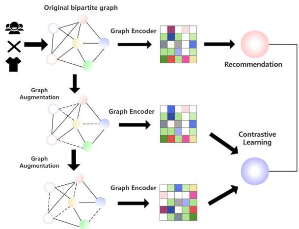
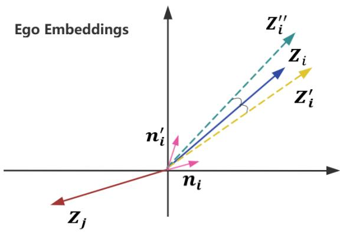
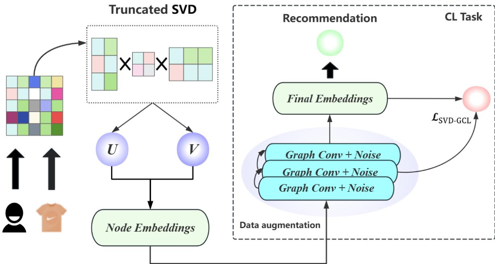
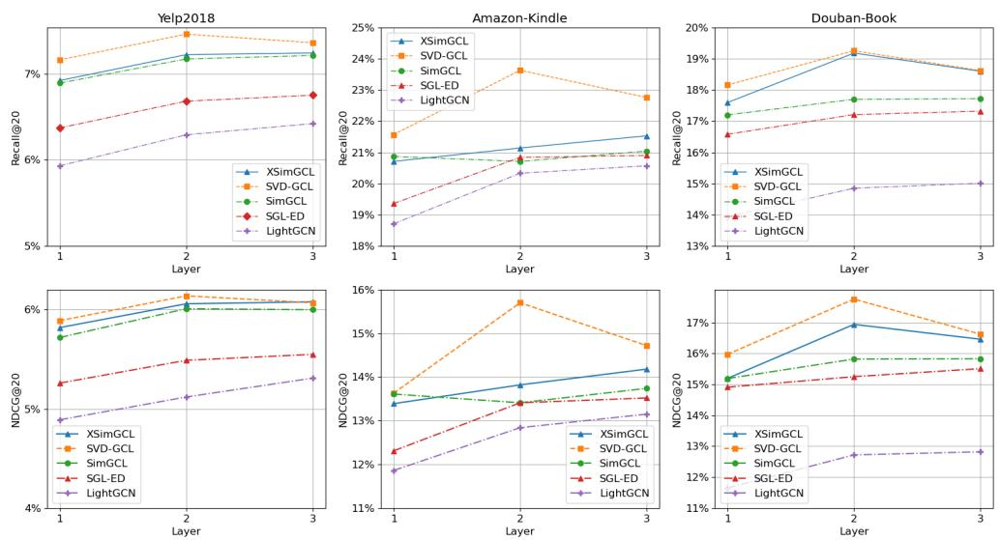
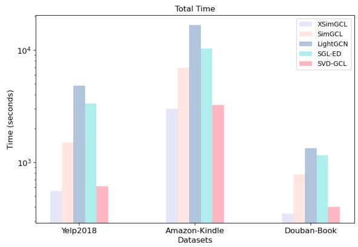
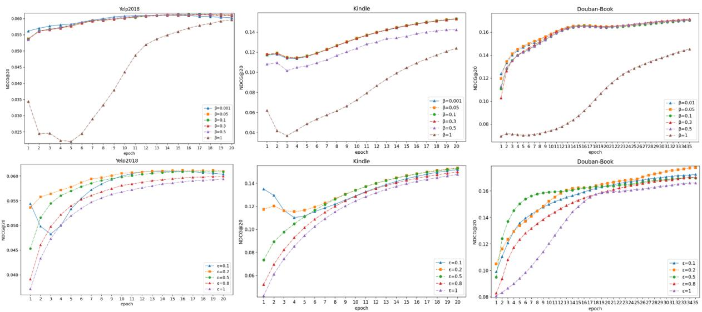
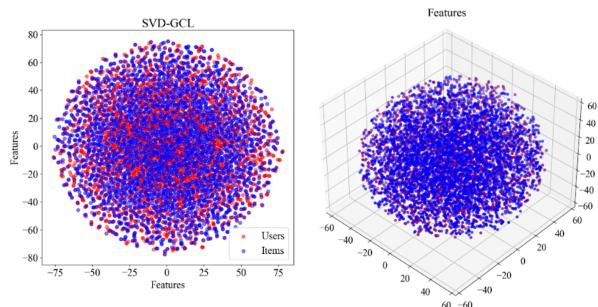

# SVD-GCL: A Noise-Augmented Hybrid Graph Contrastive Learning Framework for Recommendation

Liping Wang, Shichao Li\*, Hui Wang, Yuyan Gao, Mingyao Wei College of Computer Science and Technology Zhejiang University of Technology, Hangzhou, China {wlp, 221122120167, 1112012014, 211122090002, 221122120169}@zjut.edu.cn

## Abstract

Recently, deep graph neural networks (GNNs) have emerged as the predominant architecture for recommender systems based on collaborative filtering. Nevertheless, numerous GNNbased approaches confront challenges such as complex computations and skewed feature distributions, especially with high-dimensional, sparse, and noisy data, making it difficult to accurately capture user preferences. To tackle these issues, we introduce SVD-GCL, a streamlined graph contrastive learning recommendation model based on noise augmentation that integrates truncated singular value decomposition in the feature engineering stage. This hybrid optimization approach reduces the dimensionality and denoises the original data. Through extracting self-supervised signals and gradually adding noise to embeddings in the training phase to enrich data samples, the data sparsity is effectively alleviated. Experimental outcomes on three large public benchmark datasets illustrate that SVD-GCL effectively manages high-dimensional sparse data, remains stable in the presence of noise, and provides signif icant advantages in computational efficiency, recommendation performance, and robustness.

## 1 Introduction

Learning high-quality user and item representations from user-item interaction data constitutes the theme of collaborative filtering. In recent years, graph neural networks have been validated (Wang et al., 2019; He et al., 2020; Peng et al., 2022; Gao et al., 2022a) as being crucial in enhancing the performance of collaborative filtering recommender systems, given their capacity to capture complex relationships among nodes and generate high-quality embeddings for each node. They have substituted deep neural networks (Chen et al., 2020; Wang et al., 2018, 2020) as the mainstream architecture in recommender systems (Gao et al., 2022b; Wu et al., 2020). Simultaneously, contrastive learning (CL) has shown great promise across various domains (Gao et al., 2021; You et al., 2020), particularly in GNN-based recommender systems. CL effectively mitigates data sparsity by maximizing similarity between different views of the same node while minimizing similarity between different nodes (Wu et al., 2021; Xia et al., 2021; Yu et al., 2023; Lin et al., 2022). The traditional CL enhances the user item bipartite graph by losing a certain proportion of random edges / nodes, and then learns to maximize representation consistency under different views through a graph encoder. In this paradigm, the CL task is utilized as an auxiliary for the optimization of the recommendation task (Figure 1). Some studies have shown that even extremely sparse graph enhancements in CL can bring the required performance improvement (Lee et al., 2021; Zhou et al., 2023; Yu et al., 2021a), which is unexpected and counterintuitive. In graph structures, edges carry important relationship information between nodes, and random loss of edges may damage the overall structure of the graph, making it difficult for the model to capture the true relationships between nodes. Especially in sparse graphs, random loss of edges can lead to information loss, making the graph more sparse and incomplete. And node loss directly damages the local structure of nodes, which may result in the model being unable to learn the features of certain nodes and the relationships between their neighbors. Recent studies (Yu et al., 2022) suggest that graph augmentation plays a less significant role compared to the CL loss function and feature distribution uniformity in boosting recommendation performance. SimGCL, a novel approach introduced by (Yu et al., 2022), only employs random uniform noise rather than dropout-based augmentation, achieving better results. Nevertheless, the full potential of CL has yet to be tapped, necessitating exploration of additional techniques that could refine CL’s effectiveness in recommendation tasks. To overcome these challenges, we propose a novel recommendation model that integrates truncated singular value decomposition (TSVD) with graph contrastive learning (GCL) and utilizes variant noise based on the diffusion probability model (DDPM) for data augmentation (Ho et al., 2020). Our contributions are as follows:

  
Figure 1: A contrastive learning architecture based on graph augmentation.

• Introduced TSVD for feature engineering, optimizing embedding representation through dimensionality reduction initialization.

• Enhanced data augmentation using a variant noise model based on DDPM. Gradual noise addition in forward diffusion generates richer and more diverse samples, alleviating sparsity issues.

• Designed a simplified model architecture to reduce the complexity of processing large-scale data, resulting in improved computational efficiency and faster convergence.

• Extensive experiments on multiple publicly available datasets show that our approach outperforms state-of-the-art graph recommendation models in performance.

## 2 Related Work

## 2.1 Graph Neural Networks in Recommender Systems

In recent years, graph neural networks (GNNs) have significantly advanced recommender systems through effective cross-layer information dissemination and aggregation for message passing. GNNs construct user-item bipartite graphs to generate latent representations via cross-layer information propagation, as seen in NGCF (Wang et al., 2019), LightGCN (He et al., 2020), and SHT (Xia et al., 2022a). To enhance collaborative relationship learning under social influence, some studies have developed social relationship encoders based on GNNs. For instance, GraphRec (Fan et al., 2019), KCGN (Fan et al., 2019), and MHCN (Yu et al., 2021b) employ GNNs to capture social influences among users. Multimedia recommender systems, such as GRCN (Wei et al., 2020) and DualGNN (Wang et al., 2023a), also leverage GNNs to integrate multimodal information into recommendations. Furthermore, GNNs have proven effective in encoding temporal patterns of item sequences for time-aware recommendations, as demonstrated by studies like SURGE (Chang et al., 2021) and MAGNN (Fu et al., 2020).

## 2.2 Contrastive Learning

Contrastive learning, a self-supervised learning paradigm, has gained significant attention for enriching user representation learning through selfsupervised signals. In recommender systems, contrastive learning becomes a powerful tool by combining self-supervised signals for data augmentation with alignment between contrastive representation views. Numerous studies have proposed various embedding contrastive graph augmentation schemes to address data sparsity. For example, SGL (Wu et al., 2021), HCCF (Xia et al., 2022b), and NCL (Lin et al., 2022) use random node or edge dropout operations to generate views for graph contrastive learning. HCCF introduces local-global contrastive learning for self-supervised augmentation based on a parameterized hypergraph structure. InfoNCE-based (van den Oord et al., 2019) contrasts in these models enhance the uniformity of embeddings. Additionally, contrastive learning is employed to strengthen knowledge graph representation in recommender systems, as seen in KGCL (Yang et al., 2022) and KGIC (Zou et al., 2022).

## 2.3 Denoising Diffusion Probabilistic Models

Denoising diffusion probabilistic models (DDPMs) (Ho et al., 2020) are generative models based on probabilistic likelihood, originating from nonequilibrium thermodynamics. DDPMs employ two Markov chains to perturb data with increasing random noise and then denoise it to generate new data samples. This process generates high-quality data samples, enhancing user behavior data by improving diversity and scale, addressing data sparsity, and enhancing the generalization ability of recommendation models. For instance, CODIGEM (Walker et al., 2022) and DiffRec (Wang et al., 2023b) utilize diffusion processes to model sequential user behavior and generate predictions through denoising. BSPM (Choi et al., 2023) proposes a fuzzy sharpening process model to perturb and restore information, generating user data for recommendations. Overall, DDPMs present a promising approach for enriching and optimizing data to enhance recommendation quality.

## 3 Proposed Method

## 3.1 Embedding based on truncated singular value decomposition

Singular value decomposition (SVD) is a fundamental matrix decomposition technique widely used in recommender systems (Koren et al., 2009; Hu et al., 2008). It factorizes the complex cooccurrence matrix into matrices representing user and item embeddings multiplied by singular values, thus capturing latent factors that represent user preferences and item characteristics.

However, TSVD can be more effective in graph contrastive learning. By using only the top K largest singular values for efficient dimensionality reduction, TSVD filters out data noise corresponding to smaller singular values. This process aligns with the goals of contrastive learning, as it enhances the quality of the embeddings by retaining the most significant features and removing noise.

$$
\pmb { R } = \pmb { U } d i a g \left( \pmb { S } _ { k } \right) \pmb { V } ^ { T } \approx \sum _ { k = 1 } ^ { K } S _ { k } \pmb { U } _ { k } \pmb { V } _ { k } ^ { T }\tag{1}
$$

$$
e _ { u } = U _ { k } \sqrt { \Sigma _ { k } }\tag{2}
$$

$$
e _ { i } = V _ { k } ^ { T } \sqrt { \Sigma _ { k } }\tag{3}
$$

R is the original user-item interaction matrix, U and $V \left( U _ { k } \right.$ and $V _ { k } ^ { T } )$ and $S _ { k }$ are the left and right singular vectors and singular values, respectively; $\{ \pmb { s } _ { 1 } , \pmb { s } _ { 2 } , \cdots \pmb { s } _ { k } \}$ are the singular values in descending order: $\pmb { s } _ { 1 } \geq \pmb { s } _ { 2 } \geq \cdots \geq \pmb { s } _ { k } ;$ ; diag() is the diagonalization operation. ${ e } _ { u }$ and $e _ { i }$ are the embeddings of users and items, respectively. $\Sigma _ { k }$ is the diagonal matrix containing the top k singular values, used to correct the original $U _ { k }$ and $V _ { k } ^ { T }$

$$
\boldsymbol { W } \ : = \ : e _ { i } e _ { u }\tag{4}
$$

$$
\pmb { A } = \left[ \begin{array} { c c } { \mathbf { 0 } } & { \pmb { W } } \\ { \pmb { W } ^ { T } } & { 0 } \end{array} \right]\tag{5}
$$

W is a user-item interaction matrix generated using embedded outer products, and A is a user-item bipartite graph constructed using W.

Traditional recommendation models often use the decomposed vectors directly multiplied to predict user preferences, which means that the entire recommender system only uses a single method for recommendation tasks, with low accuracy and generalization ability. We focus on feature engineering instead, using truncated singular value decomposition in the embedding layer to generate the initial user-item interaction matrix, setting the truncated k as embedding size, and correcting $U _ { k }$ and $V _ { k } ^ { T }$ with square root singular values. The revised $U _ { k }$ and $V _ { k } ^ { T }$ will respectively serve as the initial embedding representations for users and items.

  
Figure 2: Data augmentation based on variant noise.

## 3.2 Data Augmentation based on Gaussian Noise

When reviewing recent graph contrastive learning recommendation models, most of them adopt Light-GCN (He et al., 2020) as the backbone to construct a graph neural network. Different node views (Wu et al., 2021) are established by applying node dropout, edge dropout, and random walk strategies to the adjacency matrix representing the user-item bipartite graph. The operators can be uniformly represented as follows:

$$
\begin{array} { r } { \pmb { Z } _ { 1 } ^ { ( l ) } = H \left( \pmb { Z } _ { 1 } ^ { ( l - 1 ) } , \pmb { s } _ { 1 } \left( \pmb { G } \right) \right) } \\ { \pmb { Z } _ { 2 } ^ { ( l ) } = H \left( \pmb { Z } _ { 2 } ^ { ( l - 1 ) } , \pmb { s } _ { 2 } \left( \pmb { G } \right) \right) \pmb { s } _ { 1 } , \pmb { s } _ { 2 } \sim \pmb { S } } \end{array}\tag{6}
$$

$Z _ { 1 } ^ { ( l ) }$ and $Z _ { 2 } ^ { ( l ) }$ are the node features at layer l. $Z _ { 1 }$ and $Z _ { 2 }$ represent nodes of different types or nodes in different subgraphs, respectively. H is an aggregation function, usually a neural network layer such as a multi-layer perceptron (MLP) or a convolutional layer, used to aggregate the information of neighboring nodes and the nodes themselves. $Z _ { 1 } ^ { ( l - 1 ) }$ and $\bar { Z } _ { 2 } ^ { ( l - 1 ) }$ are the node features at layer $\iota - 1$ The features at the current layer are updated based on the features from the previous layer. $s _ { 1 } ( G )$ and $s _ { 2 } ( G )$ are the sets of neighbors of the nodes sampled from the graph $G ,$ and $s _ { 1 } \sim S$ and $s _ { 2 } \sim s$ indicate that $s _ { 1 }$ and $s _ { 2 }$ are sampled from a distribution S.These methods, while effective, introduce significant system complexity and computational costs, and can sometimes disrupt the intrinsic structure of the graph, leading to the loss of vital information.

  
Figure 3: The architecture of SVD-GCL.

To overcome these limitations, we introduce a novel data augmentation strategy for our method. we integrates the forward diffusion concept from DDPM (Ho et al., 2020), unlike the original DDPM, which involves a multi-step denoising process, we apply a single-step Gaussian noise perturbation to the embeddings. This streamlined application retains the core idea of diffusion—introducing controlled noise to make the representations more resilient—while avoiding the complexity and computational overhead of multi-step diffusion processes.

$$
n _ { i } = \sqrt { 1 - \beta } \cdot e _ { i } + \sqrt { \beta } \cdot Z _ { i }\tag{7}
$$

$\mathbf { \nabla } n _ { i }$ is noise used for data augmentation, $e _ { i }$ is related to $z _ { i }$ Uniform random noise with the same shape, $\boldsymbol { Z } _ { i }$ It is the original embedding representation, and $\beta$ is the hyperparameter that controls the ratio of the original embedding to random noise.This variant of noise is relatively simple and uniform, introducing subtle disturbances while additionally enhancing the $\boldsymbol { Z } _ { i }$ The inherent characterization makes $\boldsymbol { Z } _ { i }$ Further align with its own characteristic distribution.

$$
{ \pmb Z ^ { \prime } = \pmb Z + s i g n \left( \pmb Z \right) \cdot \frac { \pmb n } { \parallel \pmb n \parallel } \cdot \epsilon }\tag{8}
$$

sign $( Z )$ denotes the sign of each element in $Z ,$ and $\frac { \pmb { n } } { \Vert \pmb { n } \Vert }$ represents the normalization of noise. ϵ is a hyperparameter that controls the intensity of the perturbation.We aim to strictly control the noise intensity to avoid significant vector deviations that could damage information.This ensures that the angle deviation of the enhanced z in space remains within θ, preserving most of the original features while introducing some variation to enrich its representation, bringing more uniformity to the augmentation. In order to obtain perturbation representations, this noisy representation learning can be represented as:

$$
\begin{array} { c } { { { \displaystyle Z ^ { \prime } = \frac { 1 } { L } \sum _ { l = 1 } ^ { L } \left( \overline { { { { \cal A } } } } ^ { l } { \cal Z } ^ { ( 0 ) } + \overline { { { { \cal A } } } } ^ { l - 1 } n ^ { ( 1 ) } + \right. } } } \\ { { \left. \ldots + \overline { { { { \cal A } } } } n ^ { ( l - 1 ) } + n ^ { ( l ) } \right) } } \end{array}\tag{9}
$$

$\boldsymbol { Z ^ { \prime } }$ represents the noise-enhanced embeddings,

$Z ^ { ( 0 ) }$ is the initial node embeddings, A is the normalized adjacency matrix, and $\mathbf { \Sigma } _ { n } ( l )$ denotes the random noise at the l-th layer.The enhanced embeddings are eventually substituted into the overall loss function (Equation (6)) for computation, and the Adam optimizer is used for optimization.

## 3.3 A Simplified Graph Contrastive Learning Model

Recent GCL models like SGL (Wu et al., 2021) and SimGCL (Yu et al., 2022) generate multiple independent views of the same node for contrastive tasks, which share a high degree of mutual information, leading to suboptimal results. Moreover, these models require additional forward and backward passes during training, making them computationally expensive compared to traditional recommendation models (Yu et al., 2023).

The architectural design of SVD-GCL addresses these issues. Instead of generating multiple similar views solely for contrastive tasks, SVD-GCL conducts cross-layer contrastive learning directly after data augmentation. Enhanced embeddings from specific layers and final embeddings are used for contrastive loss calculation and backpropagation, integrating the recommendation and contrastive learning tasks, as shown in Figure 3. The final user and item embeddings are used for recommendations via inner product. The loss function of SVD-GCL is defined as follows:

$$
\mathcal { L } = \mathcal { L } _ { r e c } + \lambda \mathcal { L } _ { c l }\tag{10}
$$

$$
\mathcal { L } _ { r e c } = - \sum _ { ( u , i ) \in \mathcal { B } } \log \left( \sigma \left( z _ { u } ^ { \prime \top } z _ { i } ^ { \prime } - z _ { u } ^ { \prime \top } z _ { j } ^ { \prime } \right) \right)\tag{11}
$$

$\mathcal { L } _ { r e c }$ uses BPR loss (Rendle et al., 2012), whose core idea is to maximize the difference in user ratings between known liked items (positive examples) and unknown or disliked items (negative examples). By optimizing this loss function, the model can learn a ranking that is more in line with user preferences.

$$
\mathcal { L } _ { c l } = \sum _ { i \in \mathcal { B } } - \log \frac { \exp { \left( \frac { c _ { i } ^ { \prime \top } c _ { i } ^ { l ^ { * } } } { \tau } \right) } } { \sum _ { j \in \mathcal { B } } \exp { \left( \frac { c _ { i } ^ { \prime \top } c _ { j } ^ { l ^ { * } } } { \tau } \right) } }\tag{12}
$$

$\mathcal { L } _ { c l }$ is a contrastive loss InfoNCE (van den Oord et al., 2019), which continuously learns and updates the embedding representation of samples to make the distance between similar samples (positive sample pairs) in the embedding space as close as possible, while making the distance between different samples (negative sample pairs) as far as possible, ultimately obtaining a high-quality embedding representation and enabling the model to more accurately calculate the similarity between users and items. It plays a key role in handling sparse data and cold start with a small amount of effective information.

$$
\begin{array} { r } { \mathcal { L } = - \displaystyle \sum _ { ( u , i ) \in \mathcal { B } } \log \left( \sigma \left( \mathbf { z } _ { u } ^ { \prime \top } \mathbf { z } _ { i } ^ { \prime } - \mathbf { z } _ { u } ^ { \prime \top } \mathbf { z } _ { j } ^ { \prime } \right) \right) } \\ { + \lambda \displaystyle \sum _ { i \in \mathcal { B } } - \log \frac { \exp \left( \frac { \mathbf { c } _ { i } ^ { \prime \top } \mathbf { c } _ { i } ^ { \prime * } } { \tau } \right) } { \sum _ { j \in \mathcal { B } } \exp \left( \frac { \mathbf { c } _ { i } ^ { \prime \top } \mathbf { c } _ { j } ^ { \prime * } } { \tau } \right) } } \end{array}\tag{13}
$$

The loss is determined by $\mathcal { L } _ { r e c }$ and $\mathcal { L } _ { c l }$ composition, $( \pmb { u } , \pmb { i } ) \in \mathcal { O } ^ { + } , ( \pmb { u } , \pmb { j } ) \in \mathcal { O } ^ { - } , \mathcal { O } ^ { + }$ and $\bullet ^ { - }$ are positive and negative sample sets respectively. $z _ { u } ^ { \prime }$ and $\boldsymbol { z } _ { i } ^ { \prime }$ are the embedding of user u and item $^ { i , }$ $\sigma ( \cdot )$ is the sigmoid function, and $\boldsymbol { c } _ { i } ^ { \prime }$ and $c _ { j } ^ { l ^ { * } }$ are the enhanced versions of the item i and item j embedding. $\imath ^ { * }$ represents the specified number of layers to compare with the final layer, $\tau$ is a temperature hyperparameter used to adjust the smoothness of the distribution, and λ is used to control the intensity of the CL task.

<table><tr><td>Dataset</td><td>Users</td><td>Items</td><td>Interactions</td><td>Density</td></tr><tr><td>Yelp2018</td><td>31,668</td><td>38,048</td><td>1,561,406</td><td>0.13%</td></tr><tr><td>Douban-Book</td><td>13,024</td><td>22,347</td><td>792,062</td><td>0.27%</td></tr><tr><td>Amazon-Kindle</td><td>138,333</td><td>98,572</td><td>1,909,965</td><td>0.014%</td></tr></table>

Table 1: Statistics of the datasets.

## 4 Experiments

## 4.1 Datasets

We carried out comprehensive experiments on three widely utilized large-scale public datasets: Yelp2018 (He et al., 2020), Douban-Book (Yu et al., 2021a) and Amazon-Kindle (He and McAuley, 2016) to assess the effectiveness of our proposed model. The partitioning of these datasets is presented in Table 1.

## 4.2 Baselines

In our experiment, we employed three types of models for performance comparison: traditional collaborative filtering (MF), a graph-based collaborative filtering model (LightGCN), and graph-based collaborative filtering models enhanced with contrastive learning (SGL-ED, SimGCL, XSimGCL).

<table><tr><td rowspan="2">Datasets Method</td><td colspan="2">Yelp2018</td><td colspan="2">Douban-Book</td><td colspan="2">Amazon-Kindle</td></tr><tr><td>Recall@20</td><td>NDCG@20</td><td>Recall@20</td><td>NDCG@20</td><td>Recall@20</td><td>NDCG@20</td></tr><tr><td>MF</td><td>0.0510</td><td>0.0416</td><td>0.1241</td><td>0.1031</td><td>0.1509</td><td>0.0930</td></tr><tr><td>LightGCN</td><td>0.0639</td><td>0.0528</td><td>0.1527</td><td>0.1304</td><td>0.2062</td><td>0.1311</td></tr><tr><td>SGL-ED</td><td>0.0675</td><td>0.0555</td><td>0.1732</td><td>0.1551</td><td>0.2105</td><td>0.1341</td></tr><tr><td>SimGCL</td><td>0.0721</td><td>0.0601</td><td>0.1772</td><td>0.1583</td><td>0.2114</td><td>0.1363</td></tr><tr><td>XSimGCL</td><td>0.0724</td><td>0.0608</td><td>0.1918</td><td>0.1694</td><td>0.2153</td><td>0.1418</td></tr><tr><td>SVD-GCL</td><td>0.0746</td><td>0.0614</td><td>0.1926</td><td>0.1776</td><td>0.2363</td><td>0.1570</td></tr></table>

Table 2: Model performance comparison on public datasets.

  
Figure 4: Model performance comparison with different number of layers.

MF (Koren et al., 2009) : A classic matrix factorization model that predicts user preferences by decomposing the user-item co-occurrence matrix into user and item vectors.

LightGCN (He et al., 2020) : A state-of-theart graph collaborative filtering (GCF) model that simplifies graph convolution by removing weight matrices and activation functions, updating node representations through neighbor aggregation.

SGL-ED (Wu et al., 2021) : A self-supervised learning model with LightGCN as the backbone. It uses random edge dropout for graph augmentation in contrastive learning.

SimGCL (Yu et al., 2022) : A simplified graph contrastive learning model that omits graph augmentation. It injects uniform random noise into latent embeddings for data augmentation, improving embedding uniformity and training performance.

XSimGCL (Yu et al., 2023) : A SOTA GCL model based on SimGCL. It employs noise for data augmentation and cross-layer contrastive learning, further enhancing training efficiency and recommendation accuracy.

## 4.3 Main results

As demonstrated in Table 2, in contrast to GNNbased models, traditional models like MF have difficulties in capturing complex user-item relationships, thereby leading to lower performance. GCF approaches, such as LightGCN, enhance performance by capturing high-order relationships in user-item bipartite graphs, yet they are computationally costly. SGL-ED boosts performance through contrastive learning, but it involves a complex training process and the risk of information loss. SimGCL and XSimGCL simplify these processes and enhance efficiency and accuracy; however, they need to generate multiple views and the enhancement method is overly simplistic.

<table><tr><td rowspan="2">Datasets Methods</td><td colspan="2">Yelp2018</td><td colspan="2">Douban-Book</td></tr><tr><td>Recall@20</td><td>NDCG@20</td><td>Recall@20</td><td>NDCG@20</td></tr><tr><td>SVD-GCL</td><td>0.0745</td><td>0.0614</td><td>0.1925</td><td>0.1776</td></tr><tr><td>-SN</td><td>0.0743 (-0.3%)</td><td>0.0613 (-0.1%)</td><td>0.1893 (-1.7%)</td><td>0.1683 (-5.2%)</td></tr><tr><td>-ON</td><td>0.0732 (-1.4%)</td><td>0.0601 (-2.1%)</td><td>0.1879 (-2.4%)</td><td>0.1679 (-5.4%)</td></tr><tr><td>-GN</td><td>0.0741 (-0.6%)</td><td>0.0612 (-0.2%)</td><td>0.1925 (-0.5%)</td><td>0.1716 (-3.3%)</td></tr></table>

Table 3: The results of ablation study.

Table 2 and Figure 4 depict the performance comparison of different models. The proposed SVD-GCL consistently outperforms all baseline methods in Recall@20 and NDCG@20 across all datasets. By integrating (TSVD) with various noises and implementing cross-layer contrastive learning, SVD-GCL effectively resolves the issues of data sparsity and noise and generates highquality embeddings. The outstanding performance on the Douban-book dataset is particularly conspicuous.

Furthermore, Figure 4 indicates that SVD-GCL consistently maintains optimal performance over different numbers of contrast layers, suggesting its remarkable stability and effectiveness.

## 4.4 Ablation Study

We conducted ablation experiments on several SVD-GCL variants to quantitatively assess the effect and influence of each component, and the corresponding degradation results are presented in Table 3. In SN, random noise is utilized to substitute the variant noise, and in ON and GN, random uniform noise is employed respectively, with the variant noise being used for data augmentation based on TSVD removal. The results indicate that each component improves the performance of the model to a certain extent, and particularly verifies the feasibility of the study. It is worth noting that the performance deteriorates most significantly upon eliminating TSVD, suggesting that the dimensionality reduction and denoising ability of TSVD can be fully integrated with contrastive learning to enhance the performance.

  
Figure 5: Computational performance comparison of the models.

## 4.5 Comparison of computational efficiency

We compared the total training time for various models on devices with an Intel (R) Core (TM) i7- 12700H and GeForce RTX3060 GPU, using Python implementations with optimal parameters.

According to Figure 6, despite LightGCN’s lightweight architecture, it requires hundreds of epochs to converge, resulting in the longest training time. SGL-ED, with added self-supervised learning, ranks second.SimGCL, with its three encoders and graph-free augmentation, outperforms the first two. XSimGCL, with its cross-layer contrastive structure, converges the fastest and has the shortest training time. SVD-GCL, utilizing TSVD during initialization, has a slightly longer training time but remains significantly faster overall.

In summary, contrastive learning greatly accelerates training. Compared to traditional methods, noise augmentation provides higher training efficiency. Cross-layer contrastive learning not only improves performance but also speeds up convergence.

  
Figure 6: The influence of $\beta$ and $\epsilon .$

## 4.6 Influence of $\beta$ and ϵ

We use NDCG@20 to examine the impact of noise generated by different values of $\beta$ and ϵ during data augmentation. ϵ explicitly controls the amplitude of normalized noise while preserving symbols.

For experiments on $\epsilon ,$ we set $\beta$ to 0.1 (Figure $6 ) .$ .When ϵ is small, performance differences are minor. Performance peaks at $\epsilon = 0 . 2$ across the three datasets. However, increasing ϵ beyond this point significantly degrades performance, likely because larger ϵ causes excessive perturbation, blending original features with noise and deviating from the original representation.

For experiments on $\beta ,$ we set ϵ to 0.2, optimizing performance close to its peak. Thus, NDCG@20 fluctuations with varying $\beta$ are moderate. Optimal performance occurs at $\beta = 0 . 1$ , while too large or too small $\beta$ values harm recommendation performance. Excessive $\beta$ introduces a higher proportion of random noise, damaging the embedded representation and causing instability. Conversely, too small $\beta$ provides insufficient learning signals, reducing the model’s robustness and generalization.

## 4.7 Evaluate the quality of embedding

To explore the feature distribution during learning, we retrieve the user and item embeddings produced by SVD-GCL from the Yelp2018 dataset and project them onto the spatial distributions in both 2D and 3D as shown in Figure 7. The images show a sufficiently uniform distribution of users and items. This is consistent with the view in (Yu et al., 2022) that the uniformity of distribution is the core factor to improve the recommendation performance, rather than redundant data augmentation.

  
Figure 7: Visualization of distributions learned by SVD-GCL.

## 5 Conclusions

In this paper, we reveal the challenges that current GNN-based recommendation systems face when handling high-dimensional sparse data. We have analyzed the limitations of traditional CL methods and propose a novel recommendation framework named SVD-GCL. By employing TSVD for dimensionality reduction and denoising, we optimize the initial embedding representation to achieve a more uniform spatial distribution. Additionally, we introduce an innovative noise enhancement paradigm aimed at improving the effectiveness of data augmentation, thereby making the model more robust and generalizable. A considerable number of experimental results demonstrate that the proposed method retains superior recommendation performance in complex data environments, and the lightweight architecture also holds advantages in computational efficiency.

## Limitations

Although our model has achieved considerable results, there are still some limitations. Firstly, although contrastive learning has been successfully applied in recommender systems recently, it still has a lot of room for exploration. Due to the limitations of the bipartite graph structure, various data augmentation strategies still introduce additional noise.

Secondly, although TSVD contributes to dimensionality reduction and denoising, when the data size surpasses a certain critical value, TSVD itself might introduce additional computational overhead. Designing a more superior dimensionality reduction algorithm is also a problem worthy of study in the future.

## Ethics Statement

We have carefully read and followed the ACL ethical guidelines.This study aims to improve the recommender system’s ability to maintain excellent recommendation performance even when facing complex sparse data by utilizing novel noise augmentation techniques and embedding optimization during the initialization stage.

We have clearly introduced the public datasets used in the experiment in the article, which do not have any serious ethical issues.

At present, the model has not been applied in real-world business scenarios, but we plan to further verify its effectiveness in practical applications in future work.Before practical application, we suggest conducting a comprehensive evaluation of the model to ensure its reliability and effectiveness in various business environments.We promise to strictly adhere to data privacy and ethical standards during the model application process.

## Acknowledgments

This work is supported by the Joint Funds of the Zhejiang Provincial Natural Science Foundation of China under Grant (LZJWZ22E090001).

## References

Jianmo Chang et al. 2021. Sequential recommendation with graph neural networks. In Proceedings of the 44th International ACM SIGIR Conference on Research and Development in Information Retrieval, pages 378–387, New York, NY, USA. ACM.

Tong Chen, Hongzhi Yin, Guanfeng Ye, Zhen Huang, Yan Wang, and Meng Wang. 2020. Try this instead: Personalized and interpretable substitute recommendation. In Proceedings of the 43rd International ACM SIGIR Conference on Research and Development in Information Retrieval, pages 891–900. ACM.

Jaeyong Choi, Seungho Hong, Nakwon Park, and Sung-Bae Cho. 2023. Blurring-sharpening process models for collaborative filtering. In Proceedings ofthe 46th International ACM SIGIR Conference on Research and Development in Information Retrieval, pages 1096–1106, Taipei, Taiwan. ACM.

Wenqi Fan et al. 2019. Graph neural networks for social recommendation. In The World Wide Web Conference, pages 417–426, New York, NY, USA. ACM.

Xinyu Fu, Jianxin Zhang, Zichun Meng, et al. 2020. Magnn: Metapath aggregated graph neural network for heterogeneous graph embedding. In Proceedings ofthe Web Conference 2020, pages 2331–2341, New York, NY, USA. ACM.

Chen Gao, Xiang Wang, Xiangnan He, and Yong Li. 2022a. Graph neural networks for recommender system. In Proceedings of the Fifteenth ACM International Conference on Web Search and Data Mining, pages 1623–1625, Virtual Event, AZ, USA. ACM.

Chen Gao, Xiang Wang, Xiangnan He, and Yong Li. 2022b. Graph neural networks for recommender system. In Proceedings of the Fifteenth ACM International Conference on Web Search and Data Mining, pages 1623–1625. ACM.

Tianyu Gao, Xiang Yao, and Danqi Chen. 2021. Simcse: Simple contrastive learning of sentence embeddings. In Proceedings of the 2021 Conference on Empirical Methods in Natural Language Processing, pages 6894–6910, Online and Punta Cana, Dominican Republic. Association for Computational Linguistics.

Ruining He and Julian McAuley. 2016. Ups and downs: Modeling the visual evolution of fashion trends with one-class collaborative filtering. In Proceedings of the 25th International Conference on World Wide Web, pages 507–517, Montréal, Québec, Canada. International World Wide Web Conferences Steering Committee.

Xiangnan He, Kuan Deng, Xiang Wang, Yan Li, Yong Zhang, and Meng Wang. 2020. LightGCN: Simplifying and powering graph convolution network for recommendation. In Proceedings of the 43rd International ACM SIGIR Conference on Research and Development in Information Retrieval, pages 639– 648, Virtual Event, China. ACM.

Jonathan Ho, Ajay Jain, and Pieter Abbeel. 2020. Denoising diffusion probabilistic models. arXiv preprint arXiv:2006.11239.

Yifan Hu, Yehuda Koren, and Chris Volinsky. 2008. Collaborative filtering for implicit feedback datasets. In 2008 Eighth IEEE International Conference on Data Mining, pages 263–272. IEEE.

Yehuda Koren, Robert Bell, and Chris Volinsky. 2009. Matrix factorization techniques for recommender systems. Computer, 42(8):30–37.

Dongmin Lee, Seongheon Kang, Hyunghoon Ju, Chanyoung Park, and Hwanjo Yu. 2021. Bootstrapping user and item representations for one-class collaborative filtering. In Proceedings of the 44th International ACM SIGIR Conference on Research and Development in Information Retrieval, pages 317–326, Virtual Event, Canada. ACM.

Zepeng Lin, Chuan Tian, Yiming Hou, and Wayne Xin Zhao. 2022. Improving graph collaborative filtering with neighborhood-enriched contrastive learning. In Proceedings ofthe ACM Web Conference 2022, pages 2320–2329, New York, NY, USA. ACM.

Shiqi Peng, Kazunari Sugiyama, and Tsutomu Mine. 2022. Svd-gcn: A simplified graph convolution paradigm for recommendation. In Proceedings of the 31st ACM International Conference on Information & Knowledge Management, pages 1625–1634, Atlanta, GA, USA. ACM.

Steffen Rendle, Christoph Freudenthaler, Zeno Gantner, and Lars Schmidt-Thieme. 2012. Bpr: Bayesian personalized ranking from implicit feedback. arXiv preprint arXiv:1205.2618.

Aaron van den Oord, Yazhe Li, and Oriol Vinyals. 2019. Representation learning with contrastive predictive coding. Preprint, arXiv:1807.03748.

J. Walker, T. Zhong, F. Zhang, Q. Gao, and F. Zhou. 2022. Recommendation via collaborative diffusion generative model. In Knowledge Science, Engineering and Management, volume 13370 of Lecture Notes in Computer Science, pages 593–605, Cham. Springer International Publishing.

Qing Wang, Yinwei Wei, et al. 2023a. Dualgnn: Dual graph neural network for multimedia recommendation. IEEE Transactions on Multimedia, 25:1074– 1084.

Qinyong Wang, Hongzhi Yin, Tong Chen, Zhen Huang, Hengshu Wang, Yizhou Zhao, and Nguyen Quoc Viet Hung. 2020. Next point-of-interest recommendation on resource-constrained mobile devices. In Proceedings ofthe Web Conference 2020, pages 906– 916. ACM.

Qinyong Wang, Hongzhi Yin, Zekun Hu, Defu Lian, Hengshu Wang, and Zhen Huang. 2018. Neural memory streaming recommender networks with adversarial training. In Proceedings of the 24th ACM SIGKDD International Conference on Knowledge Discovery & Data Mining, pages 2467–2475. ACM.

Weichen Wang et al. 2023b. Diffusion recommender model. In Proceedings ofthe 46th International ACM SIGIR Conference on Research and Development in Information Retrieval, pages 832–841, Taipei, Taiwan. ACM.

Xiang Wang, Xiangnan He, Meng Wang, Fuli Feng, and Tat-Seng Chua. 2019. Neural graph collaborative filtering. In Proceedings of the 42nd International ACM SIGIR Conference on Research and Development in Information Retrieval, pages 165–174, Paris, France. ACM.

Yinwei Wei, Xiang Wang, Liqiang Nie, Xiangnan He, and Tat-Seng Chua. 2020. Graph-refined convolutional network for multimedia recommendation with implicit feedback. In Proceedings ofthe ACM Multimedia, pages 3451–3459.

Jiawei Wu et al. 2021. Self-supervised graph learning for recommendation. In Proceedings of the 44th International ACM SIGIR Conference on Research and Development in Information Retrieval, pages 726–735, Virtual Event, Canada. ACM.

Shu Wu, Fei Sun, Wentao Zhang, Xing Xie, and Bin Cui. 2020. Graph neural networks in recommender systems: a survey. ACM Computing Surveys (CSUR).

Ling Xia, Chuan Huang, and Changsheng Zhang. 2022a. Self-supervised hypergraph transformer for recommender systems. In Proceedings of the 28th ACM SIGKDD Conference on Knowledge Discovery and Data Mining, pages 2100–2109, New York, NY, USA. ACM.

Ling Xia et al. 2022b. Hypergraph contrastive collaborative filtering. In Proceedings of the 45th International ACM SIGIR Conference on Research and Development in Information Retrieval, pages 70–79, New York, NY, USA. ACM.

Xin Xia, Hongzhi Yin, Jundong Yu, Quoc Viet Hung Wang, Lei Cui, and Xing Zhang. 2021. Selfsupervised hypergraph convolutional networks for session-based recommendation. In Proceedings of the AAAI Conference on Artificial Intelligence, volume 35, pages 4503–4511.

Yifan Yang, Chuan Huang, Ling Xia, and Changlong Li. 2022. Knowledge graph contrastive learning for recommendation. In Proceedings of the 45th International ACM SIGIR Conference on Research and Development in Information Retrieval, pages 1434– 1443, New York, NY, USA. ACM.

Yuning You, Tianlong Chen, Yuxin Sui, Ting Chen, Zhangyang Wang, and Yang Shen. 2020. Graph contrastive learning with augmentations. In Advances in Neural Information Processing Systems, pages 5812– 5823. Curran Associates, Inc.

Jie Yu, Xin Xia, Ting Chen, Lei Cui, Nguyen Quoc Viet Hung, and Hongzhi Yin. 2023. Xsimgcl: Towards extremely simple graph contrastive learning for recommendation. IEEE Transactions on Knowledge and Data Engineering, pages 1–14.

Jie Yu, Hongzhi Yin, Meng Gao, Xin Xia, Xing Zhang, and Nguyen Quoc Viet Hung. 2021a. Socially-aware self-supervised tri-training for recommendation. In Proceedings ofthe 27th ACM SIGKDD Conference

on Knowledge Discovery & Data Mining, pages 2084–2092, Virtual Event, Singapore. ACM.

Jie Yu, Hongzhi Yin, Jianzhong Li, Quoc Viet Hung Wang, Lei Cui, and Xing Zhang. 2021b. Selfsupervised multi-channel hypergraph convolutional network for social recommendation. In Proceedings of the Web Conference 2021, pages 413–424, New York, NY, USA. ACM.

Jie Yu, Hongzhi Yin, Xin Xia, Ting Chen, Lei Cui, and Nguyen Quoc Viet Hung. 2022. Are graph augmentations necessary?: Simple graph contrastive learning for recommendation. In Proceedings ofthe 45th International ACM SIGIR Conference on Research and

Development in Information Retrieval, pages 1294– 1303, Madrid, Spain. ACM.

Xinyi Zhou, Aixin Sun, Yilin Liu, Jun Zhang, and Chunyan Miao. 2023. Selfcf: A simple framework for selfsupervised collaborative filtering. ACM Transactions on Recommender Systems, 1(2):1–25.

Danyang Zou et al. 2022. Improving knowledge-aware recommendation with multi-level interactive contrastive learning. In Proceedings of the 31st ACM International Conference on Information & Knowledge Management, pages 2817–2826, New York, NY, USA. ACM.