# SyntheT2C: Generating Synthetic Data for Fine-Tuning Large Language Models on the Text2Cypher Task

Zijie Zhong Shanghai AI Laboratory zhongzijie@pjlab.org.cn

Qingyun Jin Beihang University sy2303108@buaa.edu.cn

Linqing Zhong Beihang University lqzhong@buaa.edu.cn

Zengchang Qin\* Beihang University zcqin@buaa.edu.cn

Zhaoze Sun Beihang University szz20241050@buaa.edu.cn

Xiaofan Zhang\* Shanghai AI Laboratory zhangxiaofan@pjlab.org.cn

## Abstract

Integrating Large Language Models (LLMs) with existing Knowledge Graph (KG) databases presents a promising avenue for enhancing LLMs’ efficacy and mitigating their “hallucinations”. Given that most KGs reside in graph databases accessible solely through specialized query languages (e.g., Cypher), it is critical to connect LLMs with KG databases by automating the translation of natural language into Cypher queries (termed as “Text2Cypher” task). Prior efforts tried to bolster LLMs proficiency in Cypher generation through Supervised Fine-Tuning (SFT). However, these explorations are hindered by the lack of annotated datasets of Query-Cypher pairs, resulting from the labor-intensive and domainspecific nature of such annotation. In this study, we propose SyntheT2C, a methodology for constructing a synthetic Query-Cypher pair dataset, comprising two distinct pipelines: (1) LLM-based prompting and (2) template-filling. SyntheT2C is applied to two medical KG databases, culminating in the creation of a synthetic dataset, MedT2C. Comprehensive experiments demonstrate that the MedT2C dataset effectively enhances the performance of backbone LLMs on Text2Cypher task via SFT. Both the SyntheT2C codebase and the MedT2C dataset will be released.

## 1 Introduction

Knowledge Graphs (KGs) constitute vital reservoirs of information within the Retrieval-Augmented Generation (RAG) paradigm (Lewis et al., 2020) of Large Language Models (LLMs). Distinguished from other information sources, KGs boast structured and meticulously curated data, rendering them conducive to seamless updates and rectifications. Such attributes position KGs as pivotal instruments for mitigating issues of knowledge cutoff and “hallucinations” within

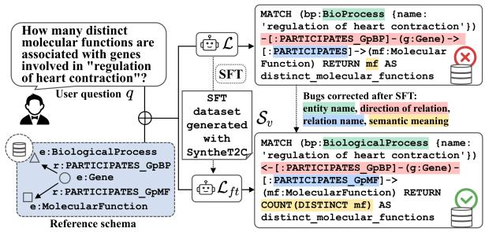  
Figure 1: SyntheT2C builds synthetic data with two pipelines to SFT LLMs so that their performance on Text2Cypher task is enhanced.

LLMs. The inherent fidelity and adaptability of KGs make them practical assets for numerous knowledge-intensive products and applications (Kertkeidkachorn et al., 2023; Cui et al., 2024; Xu et al., 2020). With the advent of LLMs, many researchers have focused on synergizing KGs with LLMs following the RAG framework, catapulting KGs to the forefront of academic research.

The efficient utilization of KG remains a formidable challenge because of the difference in format. Early methodologies involve direct extraction of triplets from KGs, subsequently integrating these text-form triplets directly into the prompts of LLMs (Fatemi et al., 2023). However, this approach often fails to concurrently preserve both semantic and structural nuances inherent within the KG. An alternative approach involves querying existing graph databases just like human users, promising accurate and interpretable results. Nonetheless, the primary impediment lies in the LLM’s ability to formulate correct and precise queries. To address this limitation, numerous query generation tools or methodologies (Zhang et al., 2022; Abdelaziz et al., 2021; Shen et al., 2023) are proposed, aiming to translate human users’ requests (in natural language) into query languages. This task assumes paramount importance for two pivotal reasons: (1) it empowers LLMs to consistently produce reliable queries, thereby enabling them to address knowledge deficits via direct interaction with KG databases; (2) it significantly facilitates human users’ interaction with KG databases because learning the specific query language is no longer necessary. Among the spectrum of query generation research, the sub-task of translating natural language into the Cypher (Francis et al., 2018) query language for Neo4j (Neo4j, 2012) databases stands out as a prominent research focus for two factors: (1) Neo4j is a widely adopted solution for KG databases, positioning Cypher as an essential tool for accessing these extensive repositories; (2) Cypher is a query language specifically designed for querying graph structures, offering significantly faster performance than other query languages, such as SQL, when processing graph data. Consequently, our work centers on this subtask, commonly termed as “Text2Cypher” (T2C).

A similar task to the Text2Cypher task is the “Text2SQL” task, wherein researchers endeavor to translate natural language sentences into SQL queries. Leveraging manually annotated datasets like SPIDER (Yu et al., 2019), numerous methodologies have emerged, including SpCQL (Guo et al., 2022) and SQLNet (Xu et al., 2017). Conversely, scant attention has been directed towards the Text2Cypher task. Existing approaches typically resort to decomposing a complete query into smaller components and translating each part separately. For instance, R3-NL2GQL (Zhou et al., 2023b) partitions the query generation process into CRUD keywords prediction, clause selection, and object type identification. Despite the success of these methods, adapting them to a specific KG database demands substantial extra effort. With the rise of LLMs, using LLMs for Cypher query generation appears promising. Notably, to the best of our knowledge, no endeavors have explored the potential application of LLMs to the Text2Cypher task. Our work aims to bridge this gap in the literature.

The Cypher writing performance of vanilla LLMs is not satisfactory. To improve it, we employ SFT, which necessitates a dataset of Question-Cypher pairs. However, creating such a dataset is challenging as it requires both domain-specific knowledge of the KG’s content and expertise in Cypher’s syntax. Consequently, there is currently no annotated dataset for the Text2Cypher task. To overcome this obstacle, we introduce SyntheT2C, a method designed to produce highquality synthetic Question-Cypher pairs through two distinct pipelines: LLM-based prompting and template-filling (as shown in Figure 1). The LLMbased prompting pipeline aims to generate Cypher queries with greater semantic flexibility, while the template-filling pipeline focuses on producing syntactically complex Cypher queries. The generated Question-Cypher pairs undergo rigorous automated and manual validation, before being used to finetune backbone LLMs. The performance of Cypher generation is evaluated with a manually annotated evaluation dataset, complemented by a qualitative assessment using GPT as a judge. Additionally, we conduct a scalability test by fine-tuning the LLMs with larger synthetic datasets, which demonstrates that the synthetic data generated using our method does not collapse into simple patterns, thereby establishing the robustness of our approach for largerscale applications.

SyntheT2C is tested with two medical KG databases: the LHY database and the Hetionet database (details in Section 4.1). The generated synthetic dataset, “MedT2C”, will be made public.

In conclusion, our main contributions are:

(1) We propose the SyntheT2C framework containing two pipelines to build synthetic datasets with any Neo4j database. Our method can generate Cypher that are both grammatically correct and syntactically diverse, facilitating the construction of SFT datasets.

(2) We test and validate the effectiveness and scalability of the synthetic dataset generated with SyntheT2C. The LLMs after fine-tuning show improved Cypher writing abilities.

(3) We opensource a synthetic dataset MedT2C of optimal size, ready to be used for SFT.

## 2 Related works

## 2.1 Knowledge Graph and graph database

KGs have emerged as fundamental resources for organizing, representing, and querying vast amounts of interconnected information or domain-specific knowledge. These graphs find applications across various domains, including but not limited to, healthcare (Cui et al., 2024; Abu-Salih et al., 2022), finance (Elhammadi et al., 2020; Kertkeidkachorn et al., 2023), and e-commerce (Xu et al., 2020). In the realm of Natural Language Processing, KGs serve as invaluable sources of context and factual knowledge, enabling systems to reason, infer, and generate responses with enhanced accuracy and coherence. To handle the processing of graph data, a series of graph databases were invented, including Neo4j (Neo4j, 2012), NebulaGraph (Wu et al., 2022), and Amazon Neptune (Bebee et al., 2018). Among them, our work focuses on the Neo4j database (Neo4j, 2012), a widely adopted graph database management system. Neo4j database employs Cypher query language for expressing complex graph patterns during the retrieval.

## 2.2 Large Language Models

LLMs are advanced AI models that have been trained on vast amounts of text data to understand and generate human-like language. Following the milestone release of InstructGPT (Ouyang et al., 2022) by OpenAI, a series of LLMs are built, featuring different advantages and drawbacks, e.g., the series of GPT models (Brown et al., 2020; OpenAI, 2023) by OpenAI, Llama (Meta, 2024) by Meta, Qwen (Bai et al., 2023) by Alibaba Cloud, InternLM (Cai et al., 2024b) by Shanghai AI Lab, etc. Recent researches highlight LLMs’ ability to utilize external existing tools like calculator, search engine, or databases (Patil et al., 2023; Nakano et al., 2022; Cai et al., 2024a; Qin et al., 2023), which is usually abstracted as “Function calling”. Many of its implementations involve generating codes or queries to interact with external tools.

## 2.3 Code generation

Code Generation is the process of automatically producing executable code from a higher-level representation or natural language. With the advent of LLMs, code generation has experienced a significant advancement. LLMs can now be trained on vast amounts of code and programming-related text materials, enabling them to understand and generate code snippets based on given requirements (e.g., Codex (Chen et al., 2021), Polycoder (Xu et al., 2022), and Code Llama (Rozière et al., 2024)). By leveraging the contextual understanding (Dong et al., 2023) and language capabilities of LLMs, code generation becomes more efficient, accurate, and adaptable. Code generation with LLM is not only useful in helping developers to write codes but also in providing a powerful “language” for LLM to interact with other tools: LLMs can be tuned to output executable codes or queries to manipulate external resources. This is the fundamental idea for research in “Function Calling” and Multi-Agent Systems. Current code generation methods rely on two methods for evaluation: either with automatic metrics calculated with an annotated evaluation dataset (Papineni et al., 2002; Lin, 2004; Banerjee and Lavie, 2005; Evtikhiev et al., 2023; Zhou et al., 2023a) or with comparison by a judge (human or powerful LLM like GPT-4) (Zheng et al., 2023). Both evaluation methods are used in our work.

## 3 Methodology

## 3.1 Preliminaries

The goal of the Text2Cypher task is to automatically translate a query q written in natural language to corresponding Cypher query c. With the proposed pipelines $\mathcal { P } _ { 1 }$ and $\mathcal { P } _ { 2 }$ , a synthetic dataset S is built to fine-tune the backbone LLM L. The synthetic data is generated and validated with a Neo4j database B and a series of automatic validators $\mathcal { V } = [ \mathcal { V } _ { 1 } , \mathcal { V } _ { 2 } , . . . , \mathcal { V } _ { 5 } ]$ . The synthetic dataset after all the validations is denoted as $S _ { v }$ . Using $S _ { v }$ , L is fine-tuned into $\mathcal { L } _ { f t }$ . The Cypher queries generated by L (resp. $\mathcal { L } _ { f t } )$ are noted as $c _ { 1 }$ (resp. c2).

## 3.2 Synthetic dataset generation

Generating the synthetic dataset is not trivial because synthetic data usually has difficulty in balancing grammatical correctness, semantic correctness, node coverage, edge coverage, and Cypher complexity. As a result, we propose a method of generation with two pipelines, as illustrated in Figure 2). The LLM-based prompting pipeline $( \mathcal { P } _ { 1 } )$ emphasizes semantic variety, while the templatefilling pipeline $( \mathcal { P } _ { 2 } )$ , focuses on syntactic complexity. By employing these complementary pipelines, we aim to produce a synthetic dataset that captures the nuanced balance of linguistic, semantic, and structural properties.

## 3.2.1 LLM-based prompting pipeline

This pipeline adopts an idea similar to Knowledge Distillation: we use the Cyphers generated by a stronger LLM to SFT weaker LLMs. Half of S is built by few-shot prompting GPT-4o (OpenAI, 2023). To simplify the process and ensure a higher quality of the generated data, we split the whole generation task into (1) extracting information from the database; (2) determining the question categories; and (3) generating the Cyphers for each category with extracted information.

The workflow for the LLM-based prompting method is delineated in Figure 2 (upper part, $\mathcal { P } _ { 1 } )$ Initially, we commence by extracting metadata from the KG stored in the Neo4j database B. This extraction includes sampling example nodes and edges to construct few-shot prompts, along with capturing the schema of the database to facilitate the generation of grounded Cyphers. An illustrative instance of extracted metadata is provided in Appendix A. Subsequently, this metadata serves as a foundational component in all ensuing prompts, ensuring the generation of executable Cyphers. Before initiating the Cypher generation process, a preliminary step involves prompting the LLM to propose potential question categories, thereby mitigating the risk of redundant outputs. The backbone LLM undergoes multiple iterations to propose these question categories, as detailed in the prompt showcased in Appendix B.1. These proposed categories are then consolidated to eliminate duplicates, as instructed in the prompt outlined in Appendix B.3. After the deduplication, GPT-4o is prompted to generate synthetic Question-Cypher pairs with the prompt outlined in Appendix B.2. In our experiment, we fix a list of 12 categories (referred to as categories ) to facilitate the comparison.

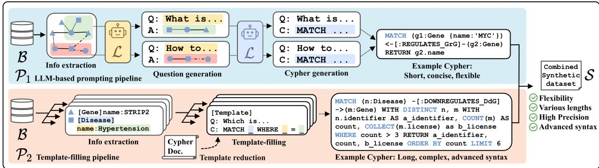  
Figure 2: Workflow of two pipelines inside SyntheT2C.

## 3.2.2 Template-filling pipeline

The second pipeline of Cypher generation adopts the template-filling method, a classic approach in code generation known for its flexible output and potentially complex syntax. We introduce this pipeline as a complement to the first one, leveraging manually crafted templates to generate Cyphers with more advanced syntax, thereby enabling backbone L to solve complicated questions.

In this pipeline, depicted in Figure 2 (lower part, $\mathcal { P } _ { 2 } )$ , numerous templates are initially manually authored. Subsequently, actual values from different fields are sampled from the Neo4j database B to populate these templates, resulting in the generation of complete executable Cypher queries.

One such template is illustrated in Figure 4. In this example, the subschema is introduced to manage cases where the entire database cannot be loaded at once, necessitating the selection and injection of only the relevant subgraph into the prompt. The variables label\_i and prop\_j represent the randomly sampled names of nodes and their attributes. These templates are initially crafted taking inspiration from Cypher Generator (Onofrei, 2024), then enriched and verified by the authors. More details about the construction process of the templates are presented in Appendix C.

Once these templates are established, synthetic Cyphers with complex syntax can be effortlessly generated. However, it is important to note that crafting and validating these templates require considerable time and effort.

## 3.3 Quality validation

To ensure the quality of the generated synthetic Question-Cypher pairs before their application in SFT, it’s imperative to conduct thorough validation. However, manually scrutinizing thousands of Cypher queries is arduous and time-consuming. In response, a suite of automatic validators are proposed to alleviate the burden of manual inspection. In the end, the Cyphers that pass through these automated validators undergo a final round of meticulous manual validation by researchers.

## 3.3.1 Automatic validation

We propose five automatic validators: the Grammatical Validator, Semantic Validator, Entity Validator, Schema Validator, and Coherence Validator, each playing a crucial role in ensuring the integrity of the generated synthetic data. These validators fundamental concepts are illustrated in Figure 3. The LLM used in the validators is GPT-3.5-Turbo.

The Grammatical Validator validates the syntax correctness of each Cypher in S by executing them in the deployed graph database B. If a Cypher is executed without encountering any “Error/Exceptions”, it is deemed to have passed this validation.

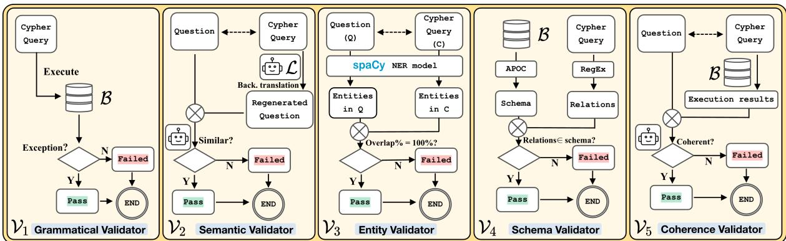  
Figure 3: Illustration of the automatic validators.

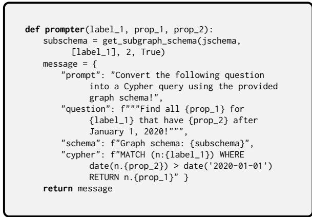  
Figure 4: Example template in Template-filling pipeline.

The design of Semantic Validator is inspired by the research in machine translation (Hoang et al., 2018). This validator utilizes an LLM to translate the generated Cypher back into a natural language question. It then computes the semantic similarity between the translated question and the original question. If the similarity score exceeds a predefined threshold, the Cypher passes validation. We also tested an alternative implementation, where the LLM assesses semantic similarity directly. Both versions produce coherent validation results, with the latter being adopted for efficiency in subsequent experiments. The prompt used in this validator is presented in Appendix D.1.

The Entity Validator assesses the coverage of entities in the generated Cyphers. The entities in the original question q are extracted via Named Entity Recognition (NER) using the spaCy (Honnibal and Montani, 2017) model en\_core\_web\_sm Entities in the generated Cypher c are parsed and extracted using Regular Expressions. A successful validation requires 100% coverage of q’s entities in c. English entities are first transformed into lemmas using spaCy for fuzzy matching.

Subsequently, the Schema Validator ensures the correctness of relations in the generated Cyphers. Relations in c are extracted via Regular Expressions and validated against the schema of B. A Cypher passes this validation only when all contained relations are valid edges.

Lastly, the Coherence Validator executes the Cypher against B and evaluates the coherence between the execution results and the original question with LLM (with prompt in Appendix D.2).

In the end, only Cyphers that have passed all validations proceed to manual validation.

## 3.3.2 Manual validation

Each Cypher checked by the validators is randomly assigned to two researchers, who independently assess its quality. If both researchers provide a unanimous judgment, their consensus is adopted. In cases of divergent opinions, a third researcher is brought in for further review. The final validation outcome for such Cyphers is determined through a majority vote among the three researchers. Over 98% of the pairs passed the manual validation. Manual expertise involved is marginal as only less than 2% of the pairs failed the manual validation.

## 4 Experiments

## 4.1 LHY and Hetionet Graph databases

In our experiment, we employed two Neo4j databases of general medical knowledge: the LHY Medical Knowledge Database (referred to as “LHY”) and the Hetionet Medical Knowledge Database (referred to as “Hetionet”). Both databases are publicly accessible, differing primarily in language: LHY is written in Chinese, whereas Hetionet is written in English. Their detailed statistics are presented in Appendix E.

The LHY Database (Liu, 2018) serves as the backend database for a Medical Question-Answering system. This database comprises comprehensive medical knowledge, encompassing a wide array of diseases, symptoms, drugs, and related information. Its content is sourced from medical websites, meticulously cleaned, reorganized, and stored within a Neo4j database. There are about 44k entities and 300k relations in it.

Hetionet (Himmelstein et al., 2017) is an open and free-to-use database of biomedical knowledge resource implementing “hetnet” model. Aggregating insights from 29 public databases, Hetionet boasts a knowledge network spanning various fields, encompassing a wide array of entities, including genes, compounds, anatomical structures, diseases, symptoms, side effects, etc. There are approximately 47k entities and 2.2 million relations in the Hetionet database.

## 4.2 Evaluation dataset and metrics

We utilize a dataset comprising 300 manually annotated and verified samples to evaluate our experiments. This dataset includes 150 questions annotated based on the Hetionet and LHY databases, respectively. Take Hetionet as an example, for every category among the 12 categories generated in Section 3.2.1, we employ GPT-3.5-Turbo to generate 10 new questions, forming 120 “in-domain” questions. Additionally, we introduce 3 unseen categories and generate 10 new questions for each new category, totaling 30 “out-of-domain” questions. For each of the 300 questions, the authors write a ground-truth Cypher query and test them manually to get the ground-truth execution results.

This annotated dataset allows us to evaluate two aspects of LLMs’ Cypher generating performance:

(1) Cypher quality, which is crucial if the generated Cypher is integrated into larger systems;

(2) Execution result accuracy, to gauge the quality of the output for end users.

## 4.2.1 Evaluation of Cypher quality

The backbone LLMs, both pre-SFT and post-SFT, are tasked with generating Cyphers for the 300 questions in the evaluation dataset. Using GPT-4o (OpenAI, 2023), we determine the superior Cypher from the two provided versions. For each pair of Cyphers, we conduct two evaluations by varying the order of presenting the Cypher queries in the prompt to mitigate order-induced bias. If evaluations of both orders yield identical results, this judgment is accepted as the final outcome; otherwise, it is deemed a “Draw”.

## 4.2.2 Evaluation of execution result accuracy

The generated Cyphers $c _ { 2 }$ are executed on database B to get execution results $r e s _ { g e n }$ . Then the accuracy (acc) is calculated with the ground-truth execution results $r e s _ { g t }$ like this:

$$
a c c = \frac { \# ( r e s _ { g e n } \cap r e s _ { g t } ) } { \# ( r e s _ { g e n } ) } ,\tag{1}
$$

where $\# ( . )$ calculates the cardinality of a set.

## 4.3 Experiment setup

## 4.3.1 Cypher LLMs (baselines)

Extensive experiments are conducted with four LLMs, including open/closed-source models. For open-source models, we evaluate Llama3, Qwen2 and InternLM2. For closed-sources model, we test GPT. The exact versions of the backbone LLMs are listed in Appendix F. Our experiments focus on the performance boost brought by the SFT, therefore, the pre-SFT vanilla LLMs are used as the natural baselines. Empirically, the vanilla LLMs of the parameter size around 7B perform poorly on Cypher writing task. Only about 15%-20% of the few-shot generated Cyphers are executable, and the rate of semantically correct Cyphers is even lower. Thus, the few-shot prompting has become a default choice for 7B-level LLMs on Cypher writing task, and all the prompts we used in the experiments are 2-shot prompts.

We selected these 7B level models for our experiments to highlight the effectiveness of our method to enhance the smaller models with the synthetic data constructed with larger models.

On top of this, we also report the performance of GPT-4 as a reference: when tested on the Evaluation dataset, GPT-4 achieves the averaged Execution Result Accuracy of 49.07% (zero-shot) and 50.42% (2-shot).

## 4.3.2 Supervised Fine-Tuning

We utilize Low-Rank Adaptation (LoRA) to finetune the vanilla LLMs. Specifically, the opensource models are trained for 6 epochs with a linear scheduler, starting at a learning rate of 1e-6. AdamW is used as the optimizer, and the training batch size is 6. The fine-tuning of GPT is facilitated by its official API. The experiments on all LLMs, are conducted on Nvidia GeForce 4090 GPU. All the experiments totaled about 1100 GPU hours.

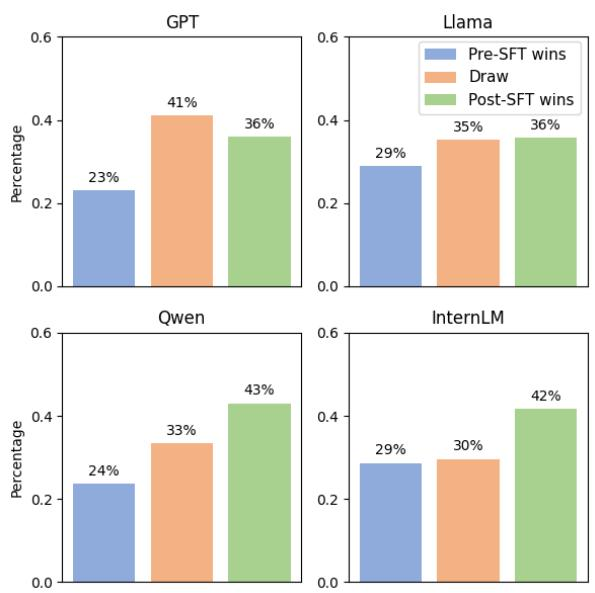

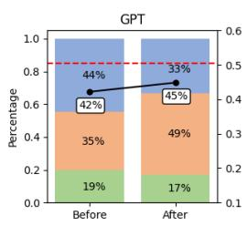

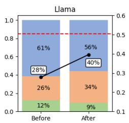

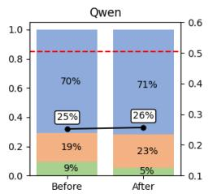

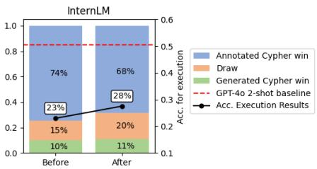  
Figure 5: Result of Supervised Fine-Tuning each LLMs with MedT2C. Accuracy annotations marked in white box.

## 4.4 Supervised Fine-Tuning experiments

The backbone LLMs are fine-tuned with the MedT2C dataset. MedT2C contains 3000 samples in total, with 750 samples generated from each combination of the two pipelines and the two Neo4j databases. The MedT2C dataset contains highquality Question-Cypher pairs that passed all the automatic validations as well as the manual validation. In Appendix G we report the passing rate of each validator as a guide for further improvement of MedT2C’s data quality.

A list of LLMs including GPT, Llama, Qwen, and InternLM are fine-tuned using MedT2C. We evaluated the change in Cypher writing performance of these LLMs, and the results are shown in Figure 5. The results show that MedT2C helps the LLM to produce more Cypher queries that are on par with or better than the human annotated ones.

In Figure 5, the win rates are calculated in comparison with the ground-truth Cyphers. We further conduct an experiment to compare directly the $c _ { 1 }$ and $c _ { 2 }$ generated with the same LLM with GPT-4o, using the prompt presented in Appendix H. The comparison results are shown in Figure 6. From these results, we can conclude that while the improvement may appear minor when comparing against the ground-truth Cyphers, a visible enhancement in Cypher quality is evident when comparing to the Cyphers generated by the pre-SFT model. We explain this difference as follows: the human annotations have a far higher quality than the Cyphers generated by vanilla LLMs. Therefore, even though the LLMs are enhanced after SFT, their output is still inferior to the human-annotated Cyphers, which is why the evaluation results in Figure 5 seem largely unchanged.

Figure 6: Impact of SFT on each LLM. The Cypher generated with pre-SFT and post-SFT LLMs are compared directly with GPT-4o.

## 4.5 Scaling experiments

In this section, we test the scalability of our pipeline for generating synthetic data. We rerun the data generation pipelines to create scaled versions that are 1/16, 1/4, 4, 8, and 16 times the size of the original MedT2C. Vanilla LLMs are then fine-tuned with these scaled datasets. The results are reported in Figure 7. These results demonstrate that, up to the size of the MedT2C dataset, increasing the size of the synthetic dataset leads to better performance, especially in terms of Cypher Quality. However, once the size exceeds that of MedT2C, further increasing the dataset size results in either marginal improvements or decreases. Based on this experiment, we determine the optimal size for the published MedT2C dataset (highlighted in red), as it balances efficiency and performance.

## 4.6 Ablation experiments

To evaluate the efficacy of each component introduced, we conduct a series of ablation experiments.

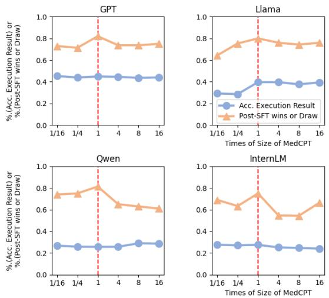

Figure 7: Plots of scaling test’s results.
<table><tr><td>Settings</td><td>Cypher Quality</td><td>Result Acc.</td></tr><tr><td>Pre-SFT</td><td>38.67%(→)</td><td>27.83%(→)</td></tr><tr><td>LHY-LLM</td><td>41.67%(+3.00)</td><td>27.86%(+0.03)</td></tr><tr><td>LHY-Temp.</td><td>34.67%(-4.00)</td><td>26.54%(-1.29)</td></tr><tr><td>Hetionet-LLM</td><td>42.83%(+4.16)</td><td>33.09%(+5.26)</td></tr><tr><td>Hetionet-Temp.</td><td>36.00%(-2.67)</td><td>26.68%(-1.15)</td></tr><tr><td>only LLM</td><td>41.00%(+2.33)</td><td>29.02%(+1.19)</td></tr><tr><td>All (MedT2C)</td><td>44.00%(+5.33)</td><td>39.65%(+11.82)</td></tr></table>

Table 1: Results of pipeline ablation test.

First, we test the pipelines by running SFT experiments using only the data generated by each pipeline individually. We then verify the effectiveness of each automatic validator by evaluating them in isolation, using only one validator at a time. Since each component is designed to be modular and independent, we adopt this mode of ablation, rather than removing the components one by one from the complete setting, to emphasize the increment brought by each component separately. For both ablation tests, the backbone LLM is fixed as Llama3. The dataset size is set to be the same as MedT2C (3000 in total). The experiments results are reported in Table 1 and Table 2 respectively. Here the Cypher Quality is calculated with respect to ground-truth Cyphers.

As presented in Table 1, when we use only the data generated by the template-filling pipeline to SFT the Llama3 model, the post-SFT performance actually declines. The reasons are: (1) templatefilling pipeline generates rigid Cyphers which are easier to overfit; (2) when SFT with only templatefilling data, LLMs tend to produce unnecessarily complicated Cypher queries (e.g., breaking one query into two and then merging them). From a global perspective, using data from both pipelines (marked as “All”) can enhance the LLM’s generalization capacity, as shown in comparison with the result obtained by fine-tuning only using the data generated with pipeline 1 (marked as "only LLM"). In other words, even though the template-filling data seems to have a negative impact, adding them to the fine-tuning dataset can further improve the overall Cypher writing performance.

<table><tr><td>Settings</td><td>Cypher Quality</td><td>Result Acc.</td></tr><tr><td>Pre-SFT</td><td>38.67%(→)</td><td>27.83%(-)</td></tr><tr><td>No validator</td><td>38.34%(-0.33)</td><td>27.96%(+0.13)</td></tr><tr><td>√Grammar V.</td><td>38.34%(-0.33)</td><td>28.95%(+1.12)</td></tr><tr><td>√Semantic V.</td><td>43.67%(+5.00)</td><td>31.65%(+3.82)</td></tr><tr><td>√Entity V.</td><td>40.00%(+1.33)</td><td>28.03%(+0.20)</td></tr><tr><td>√Schema V.</td><td>42.00%(+3.33)</td><td>26.11%(-1.72)</td></tr><tr><td>√Coherence V.</td><td>41.33%(+2.66)</td><td>32.05%(+4.22)</td></tr><tr><td>All (MedT2C)</td><td>44.00%(+5.33)</td><td>39.65%(+11.82)</td></tr></table>

Table 2: Results of validator ablation test.

Table 2 shows that each individual validator contributes some improvement, either in terms of Cypher quality or the accuracy of the execution results. Notably, the combination of all five validators yields the most significant increase in performance. This can be attributed to the validators’ collective ability to mitigate the majority of the bugs in the SFT dataset, thereby enhancing the overall quality of the generated Cypher queries.

## 5 Limitations

The primary limitation of our work is the challenge in writing the templates. Besides, some adaptation work is necessary when applying them to new Neo4j databases (more details about adaptation to new database are discussed in Appendix I). Also, a portion of the generated Cypher queries are directly filtered out during the construction of MedT2C, which is not the most efficient solution. Finally, our current work focuses only on Cypher query language, similar method can be applied on other structured query languages in future research.

## 6 Potential risks

Though SyntheT2C is designed to automatically generate synthetic datasets, its usage requires close monitoring to prevent the inadvertent inclusion of private or sensitive information. Additionally, there is a slight residual risk for post-SFT LLMs of producing endless embedded Cyphers, which could potentially lead to issues such as Out-of-Memory.

## 7 Conclusion

We present SyntheT2C, a comprehensive framework to generate synthetic data for SFT various LLMs on the Text2Cypher task. Our approach encompasses dataset construction, data validation, and SFT evaluation, providing a reference framework for future research in the Cypher-related field. Additionally, our findings confirm the effectiveness of synthetic data, suggesting that similar techniques can address problems where annotation is difficult or insufficient. Finally, we will also open-source the MedT2C dataset, aiming to contribute to the technical advancements in relevant topics.

## Acknowledgements

We would like to express our gratitude to all the supervisors and colleagues at Shanghai Artificial Intelligence Laboratory for their invaluable insights, feedback, and support throughout the research process. We also thank the reviewers for their constructive comments, which greatly improved the quality of this paper.

## References

Ibrahim Abdelaziz, Srinivas Ravishankar, Pavan Kapanipathi, Salim Roukos, and Alexander Gray. 2021. A semantic parsing and reasoning-based approach to knowledge base question answering. Proceedings of the AAAI Conference on Artificial Intelligence, 35(18):15985–15987.

Bilal Abu-Salih, Muhammad AL-Qurishi, Mohammed Alweshah, Mohammad AL-Smadi, Reem Alfayez, and Heba Saadeh. 2022. Healthcare knowledge graph construction: State-of-the-art, open issues, and opportunities. Preprint, arXiv:2207.03771.

Jinze Bai, Shuai Bai, Yunfei Chu, Zeyu Cui, Kai Dang, Xiaodong Deng, Yang Fan, Wenbin Ge, Yu Han, Fei Huang, Binyuan Hui, Luo Ji, Mei Li, Junyang Lin, Runji Lin, Dayiheng Liu, Gao Liu, Chengqiang Lu, Keming Lu, Jianxin Ma, Rui Men, Xingzhang Ren, Xuancheng Ren, Chuanqi Tan, Sinan Tan, Jianhong Tu, Peng Wang, Shijie Wang, Wei Wang, Shengguang Wu, Benfeng Xu, Jin Xu, An Yang, Hao Yang, Jian Yang, Shusheng Yang, Yang Yao, Bowen Yu, Hongyi Yuan, Zheng Yuan, Jianwei Zhang, Xingxuan Zhang, Yichang Zhang, Zhenru Zhang, Chang Zhou, Jingren Zhou, Xiaohuan Zhou, and Tianhang Zhu. 2023. Qwen technical report. Preprint, arXiv:2309.16609.

Satanjeev Banerjee and Alon Lavie. 2005. METEOR: An automatic metric for MT evaluation with improved correlation with human judgments. In Proceedings ofthe ACL Workshop on Intrinsic and Extrinsic Evaluation Measures for Machine Translation and/or Summarization, pages 65–72, Ann Arbor, Michigan. Association for Computational Linguistics.

Bradley R. Bebee, Daniel Choi, Ankit Gupta, Andi Gutmans, Ankesh Khandelwal, Yigit Kiran, Sainath Mallidi, Bruce McGaughy, Michael Personick, K. Jeric Rajan, Simone Rondelli, Alexander Ryazanov, Michael Schmidt, Kunal Sengupta, Bryan B. Thompson, Divij Vaidya, and Shawn Xiong Wang. 2018. Amazon neptune: Graph data management in the cloud. In International Workshop on the Semantic Web, pages 1–2.

Tom B. Brown, Benjamin Mann, Nick Ryder, Melanie Subbiah, Jared Kaplan, Prafulla Dhariwal, Arvind Neelakantan, Pranav Shyam, Girish Sastry, Amanda Askell, Sandhini Agarwal, Ariel Herbert-Voss, Gretchen Krueger, Tom Henighan, Rewon Child, Aditya Ramesh, Daniel M. Ziegler, Jeffrey Wu, Clemens Winter, Christopher Hesse, Mark Chen, Eric Sigler, Mateusz Litwin, Scott Gray, Benjamin Chess, Jack Clark, Christopher Berner, Sam Mc-Candlish, Alec Radford, Ilya Sutskever, and Dario Amodei. 2020. Language models are few-shot learners. Preprint, arXiv:2005.14165.

Tianle Cai, Xuezhi Wang, Tengyu Ma, Xinyun Chen, and Denny Zhou. 2024a. Large language models as tool makers. Preprint, arXiv:2305.17126.

Zheng Cai, Maosong Cao, Haojiong Chen, Kai Chen, Keyu Chen, Xin Chen, Xun Chen, Zehui Chen, Zhi Chen, Pei Chu, Xiaoyi Dong, Haodong Duan, Qi Fan, Zhaoye Fei, Yang Gao, Jiaye Ge, Chenya Gu, Yuzhe Gu, Tao Gui, Aijia Guo, Qipeng Guo, Conghui He, Yingfan Hu, Ting Huang, Tao Jiang, Penglong Jiao, Zhenjiang Jin, Zhikai Lei, Jiaxing Li, Jingwen Li, Linyang Li, Shuaibin Li, Wei Li, Yining Li, Hongwei Liu, Jiangning Liu, Jiawei Hong, Kaiwen Liu, Kuikun Liu, Xiaoran Liu, Chengqi Lv, Haijun Lv, Kai Lv, Li Ma, Runyuan Ma, Zerun Ma, Wenchang Ning, Linke Ouyang, Jiantao Qiu, Yuan Qu, Fukai Shang, Yunfan Shao, Demin Song, Zifan Song, Zhihao Sui, Peng Sun, Yu Sun, Huanze Tang, Bin Wang, Guoteng Wang, Jiaqi Wang, Jiayu Wang, Rui Wang, Yudong Wang, Ziyi Wang, Xingjian Wei, Qizhen Weng, Fan Wu, Yingtong Xiong, Chao Xu, Ruiliang Xu, Hang Yan, Yirong Yan, Xiaogui Yang, Haochen Ye, Huaiyuan Ying, Jia Yu, Jing Yu, Yuhang Zang, Chuyu Zhang, Li Zhang, Pan Zhang, Peng Zhang, Ruijie Zhang, Shuo Zhang, Songyang Zhang, Wenjian Zhang, Wenwei Zhang, Xingcheng Zhang, Xinyue Zhang, Hui Zhao, Qian Zhao, Xiaomeng Zhao, Fengzhe Zhou, Zaida Zhou, Jingming Zhuo, Yicheng Zou, Xipeng Qiu, Yu Qiao, and Dahua Lin. 2024b. Internlm2 technical report. Preprint, arXiv:2403.17297.

Mark Chen, Jerry Tworek, Heewoo Jun, Qiming Yuan, Henrique Ponde de Oliveira Pinto, Jared Kaplan, Harri Edwards, Yuri Burda, Nicholas Joseph, Greg Brockman, Alex Ray, Raul Puri, Gretchen Krueger, Michael Petrov, Heidy Khlaaf, Girish Sastry, Pamela Mishkin, Brooke Chan, Scott Gray, Nick Ryder, Mikhail Pavlov, Alethea Power, Lukasz Kaiser, Mohammad Bavarian, Clemens Winter, Philippe Tillet, Felipe Petroski Such, Dave Cummings, Matthias Plappert, Fotios Chantzis, Elizabeth Barnes, Ariel Herbert-Voss, William Hebgen Guss, Alex Nichol, Alex Paino, Nikolas Tezak, Jie Tang, Igor Babuschkin, Suchir Balaji, Shantanu Jain, William Saunders, Christopher Hesse, Andrew N. Carr, Jan Leike, Josh Achiam, Vedant Misra, Evan Morikawa, Alec Radford, Matthew Knight, Miles Brundage, Mira Murati, Katie Mayer, Peter Welinder, Bob McGrew, Dario Amodei, Sam McCandlish, Ilya Sutskever, and Wojciech Zaremba. 2021. Evaluating large language models trained on code. Preprint, arXiv:2107.03374.

Hejie Cui, Jiaying Lu, Shiyu Wang, Ran Xu, Wenjing Ma, Shaojun Yu, Yue Yu, Xuan Kan, Chen Ling, Tianfan Fu, Liang Zhao, Joyce Ho, Fei Wang, and Carl Yang. 2024. A review on knowledge graphs for healthcare: Resources, applications, and promises. Preprint, arXiv:2306.04802.

Qingxiu Dong, Lei Li, Damai Dai, Ce Zheng, Zhiyong Wu, Baobao Chang, Xu Sun, Jingjing Xu, Lei Li, and Zhifang Sui. 2023. A survey on in-context learning. Preprint, arXiv:2301.00234.

Sarah Elhammadi, Laks V.S. Lakshmanan, Raymond Ng, Michael Simpson, Baoxing Huai, Zhefeng Wang, and Lanjun Wang. 2020. A high precision

pipeline for financial knowledge graph construction. In Proceedings of the 28th International Conference on Computational Linguistics, pages 967–977, Barcelona, Spain (Online). International Committee on Computational Linguistics.

Mikhail Evtikhiev, Egor Bogomolov, Yaroslav Sokolov, and Timofey Bryksin. 2023. Out of the bleu: How should we assess quality of the code generation models? Journal ofSystems and Software, 203:111741.

Bahare Fatemi, Jonathan Halcrow, and Bryan Perozzi. 2023. Talk like a graph: Encoding graphs for large language models. Preprint, arXiv:2310.04560.

Nadime Francis, Alastair Green, Paolo Guagliardo, Leonid Libkin, Tobias Lindaaker, Victor Marsault, Stefan Plantikow, Mats Rydberg, Petra Selmer, and Andrés Taylor. 2018. Cypher: An evolving query language for property graphs. In Proceedings of the 2018 International Conference on Management of Data, SIGMOD ’18, page 1433–1445, New York, NY, USA. Association for Computing Machinery.

Aibo Guo, Xinyi Li, Guanchen Xiao, Zhen Tan, and Xiang Zhao. 2022. Spcql: A semantic parsing dataset for converting natural language into cypher. In Proceedings ofthe 31st ACM International Conference on Information & Knowledge Management, CIKM ’22, page 3973–3977, New York, NY, USA. Association for Computing Machinery.

Daniel Scott Himmelstein, Antoine Lizee, Christine Hessler, Leo Brueggeman, Sabrina L Chen, Dexter Hadley, Ari Green, Pouya Khankhanian, and Sergio E Baranzini. 2017. Systematic integration of biomedical knowledge prioritizes drugs for repurposing. eLife, 6:e26726.

Vu Cong Duy Hoang, Philipp Koehn, Gholamreza Haffari, and Trevor Cohn. 2018. Iterative backtranslation for neural machine translation. In Proceedings of the 2nd Workshop on Neural Machine Translation and Generation, pages 18–24, Melbourne, Australia. Association for Computational Linguistics.

Matthew Honnibal and Ines Montani. 2017. spaCy 2: Natural language understanding with Bloom embeddings, convolutional neural networks and incremental parsing. To appear.

Natthawut Kertkeidkachorn, Rungsiman Nararatwong, Ziwei Xu, and Ryutaro Ichise. 2023. Finkg: A core financial knowledge graph for financial analysis. In 2023 IEEE 17th International Conference on Semantic Computing (ICSC), pages 90–93.

Patrick Lewis, Ethan Perez, Aleksandra Piktus, Fabio Petroni, Vladimir Karpukhin, Naman Goyal, Heinrich Küttler, Mike Lewis, Wen-tau Yih, Tim Rocktäschel, Sebastian Riedel, and Douwe Kiela. 2020. Retrieval-augmented generation for knowledgeintensive nlp tasks. In Advances in Neural Information Processing Systems, volume 33, pages 9459– 9474. Curran Associates, Inc.

Chin-Yew Lin. 2004. ROUGE: A package for automatic evaluation of summaries. In Text Summarization Branches Out, pages 74–81, Barcelona, Spain. Association for Computational Linguistics.

Huanyong Liu. 2018. Question answering system on medical knowledge graph.

Meta. 2024. Introducing meta llama 3: The most capable openly available llm to date. Meta document.

Reiichiro Nakano, Jacob Hilton, Suchir Balaji, Jeff Wu, Long Ouyang, Christina Kim, Christopher Hesse, Shantanu Jain, Vineet Kosaraju, William Saunders, Xu Jiang, Karl Cobbe, Tyna Eloundou, Gretchen Krueger, Kevin Button, Matthew Knight, Benjamin Chess, and John Schulman. 2022. Webgpt: Browserassisted question-answering with human feedback. Preprint, arXiv:2112.09332.

Neo4j. 2012. Neo4j - the world’s leading graph database.

Silvia Onofrei. 2024. Cypher generation: The good, the bad and the messy.

OpenAI. 2023. Gpt-4 technical report. Preprint, arXiv:2303.08774.

Long Ouyang, Jeffrey Wu, Xu Jiang, Diogo Almeida, Carroll Wainwright, Pamela Mishkin, Chong Zhang, Sandhini Agarwal, Katarina Slama, Alex Ray, John Schulman, Jacob Hilton, Fraser Kelton, Luke Miller, Maddie Simens, Amanda Askell, Peter Welinder, Paul F Christiano, Jan Leike, and Ryan Lowe. 2022. Training language models to follow instructions with human feedback. In Advances in Neural Information Processing Systems, volume 35, pages 27730–27744. Curran Associates, Inc.

Kishore Papineni, Salim Roukos, Todd Ward, and Wei-Jing Zhu. 2002. Bleu: a method for automatic evaluation of machine translation. In Proceedings ofthe 40th Annual Meeting ofthe Associationfor Computational Linguistics, pages 311–318. Association for Computational Linguistics.

Shishir G. Patil, Tianjun Zhang, Xin Wang, and Joseph E. Gonzalez. 2023. Gorilla: Large language model connected with massive apis. Preprint, arXiv:2305.15334.

Yujia Qin, Shihao Liang, Yining Ye, Kunlun Zhu, Lan Yan, Yaxi Lu, Yankai Lin, Xin Cong, Xiangru Tang, Bill Qian, Sihan Zhao, Lauren Hong, Runchu Tian, Ruobing Xie, Jie Zhou, Mark Gerstein, Dahai Li, Zhiyuan Liu, and Maosong Sun. 2023. Toolllm: Facilitating large language models to master 16000+ real-world apis. Preprint, arXiv:2307.16789.

Baptiste Rozière, Jonas Gehring, Fabian Gloeckle, Sten Sootla, Itai Gat, Xiaoqing Ellen Tan, Yossi Adi, Jingyu Liu, Romain Sauvestre, Tal Remez, Jérémy Rapin, Artyom Kozhevnikov, Ivan Evtimov, Joanna Bitton, Manish Bhatt, Cristian Canton Ferrer, Aaron Grattafiori, Wenhan Xiong, Alexandre Défossez,

Jade Copet, Faisal Azhar, Hugo Touvron, Louis Martin, Nicolas Usunier, Thomas Scialom, and Gabriel Synnaeve. 2024. Code llama: Open foundation models for code. Preprint, arXiv:2308.12950.

Ran Shen, Gang Sun, Hao Shen, Yiling Li, Liangfeng Jin, and Han Jiang. 2023. Spsql: Step-by-step parsing based framework for text-to-sql generation. Preprint, arXiv:2305.11061.

Min Wu, Xinglu Yi, Hui Yu, Yu Liu, and Yujue Wang. 2022. Nebula graph: An open source distributed graph database. Preprint, arXiv:2206.07278.

Da Xu, Chuanwei Ruan, Evren Korpeoglu, Sushant Kumar, and Kannan Achan. 2020. Product knowledge graph embedding for e-commerce. In Proceedings ofthe 13th International Conference on Web Search and Data Mining, WSDM ’20. ACM.

Frank F. Xu, Uri Alon, Graham Neubig, and Vincent J. Hellendoorn. 2022. A systematic evaluation of large language models of code. Preprint, arXiv:2202.13169.

Xiaojun Xu, Chang Liu, and Dawn Song. 2017. Sqlnet: Generating structured queries from natural language without reinforcement learning. Preprint, arXiv:1711.04436.

Tao Yu, Rui Zhang, Kai Yang, Michihiro Yasunaga, Dongxu Wang, Zifan Li, James Ma, Irene Li, Qingning Yao, Shanelle Roman, Zilin Zhang, and Dragomir Radev. 2019. Spider: A large-scale human-labeled dataset for complex and cross-domain semantic parsing and text-to-sql task. Preprint, arXiv:1809.08887.

Minhao Zhang, Ruoyu Zhang, Yanzeng Li, and Lei Zou. 2022. Crake: Causal-enhanced table-filler for question answering over large scale knowledge base. Preprint, arXiv:2207.03680.

Lianmin Zheng, Wei-Lin Chiang, Ying Sheng, Siyuan Zhuang, Zhanghao Wu, Yonghao Zhuang, Zi Lin, Zhuohan Li, Dacheng Li, Eric. P Xing, Hao Zhang, Joseph E. Gonzalez, and Ion Stoica. 2023. Judging llm-as-a-judge with mt-bench and chatbot arena. Preprint, arXiv:2306.05685.

Shuyan Zhou, Uri Alon, Sumit Agarwal, and Graham Neubig. 2023a. CodeBERTScore: Evaluating code generation with pretrained models of code. In Proceedings ofthe 2023 Conference on Empirical Methods in Natural Language Processing, pages 13921– 13937, Singapore. Association for Computational Linguistics.

Yuhang Zhou, He Yu, Siyu Tian, Dan Chen, Liuzhi Zhou, Xinlin Yu, Chuanjun Ji, Sen Liu, Guangnan Ye, and Hongfeng Chai. 2023b. r3-nl2gql: A hybrid models approach for for accuracy enhancing and hallucinations mitigation. Preprint, arXiv:2311.01862.

## A Example of extracted KG information

Here we present the information (metadata) extracted from the KG database “Hetionet” in Figure 8. We stored the metadata of the KG, including the node properties, the relationship properties, and the valid relationships. This information is integrated in the following prompts to ensure that the LLM output is correct Cyphers. In other prompts, this metadata is referred to as schema .

## B Prompts for LLM-based prompting pipeline

In this appendix, we present all the prompts we used in the LLM-based prompting pipeline.

## B.1 Prompt to propose categories of questions

In Figure 9 we show the prompt used to propose candidate categories of questions. We decided to first generate categories of questions instead of generating directly the questions because this practice helps reduce duplicated questions.

## B.2 Prompt to generate questions for each category

This prompt presented in Figure 11 is used to generate questions in natural language for each proposed category . This prompt includes few-shot examples to help ensure the output Cypher follows the format requirements.

## B.3 Prompt to merge categories of questions

The prompt presented in Figure 10 is used to merge the previously generated categories. The merged and de-duplicated list of categories is then stored and will be referred to as category in later prompts.

## C Details about constructing the templates

Our templates are based on the 60 templates introduced in Cypher Generator (Onofrei, 2024). These templates were originally written for an older version of Neo4j, so the authors first correct and update them to match the syntax of Neo4j 5.13. Additionally, the authors refer to the official Neo4j documentation to create 20 new templates that cover the new syntax and new features in Neo4j 5.13. All the 80 templates are tested by filling them with sampled values and executing them manually. After testing, all templates are confirmed to be able to generate executable Cypher queries.

## D Prompts used in automatic validators

## D.1 Prompt of Semantic Validator

Here we present the prompt used in the Semantic Validator in Figure 12. The schema mentioned in this prompt is the metadata presented in Appendix 8. The example represents the few-shot examples written by the authors, here we show the English example for the Hetionet database in Figure 13. Lastly, the json\_object in the prompt contains the question and the Cypher query to be evaluated.

## D.2 Prompt of Coherence Validator

In this appendix, we present the prompt used in the Coherence Validator in Figure 14. Similar to other prompts, we provided few-shot examples in this prompt. The question and results in the prompt are the original question and execution results used as the input for this validation.

## E Important statistics of the LHY and the Hetionet databases

Here we present the important statistics of the LHY database in Table 3 and Table 4, including the examples of nodes and entities inside this database. The examples in both tables are translated from Chinese to English. Similarly, the important statistics of the Hetionet database with examples of nodes and entities are grouped in Table 5 and Table 6.

## F Exact versions of the backbone LLMs

The exact versions of the LLMs used in our experiments are listed in Table 7. Except GPT-3.5-Turbo, the backbone LLMs are deployed locally using the versions available on HuggingFace.

## G Passing rate of MedT2C for each automatic validator

The passing rate of MedT2C dataset for each automatic validator is reported in Table 8. The LLM used in the Semantic Validator and the Coherence Validator is GPT-3.5-Turbo. These two validators are not run on the LLM-based prompting pipeline because this pipeline uses GPT-4o. Given that GPT-4o is more powerful than GPT-3.5-Turbo, it is not accurate to evaluate its output with GPT-3.5-Turbo, nor with GPT-4o itself. Besides, noted that the passing rate of Coherence Validator is especially low compared to other passing rate. This is because for Coherence Validator specifically, the samples that failed any one of the previous validators is judged as False directly to save the calling of GPT API. Therefore the passing rate of Coherence Validator reported here is lower than the actual one, but it does not affect the “All passed” ratio.

## H Prompts used for Cypher quality evaluation

We use GPT-4o to judge the quality of two versions of Cypher queries corresponding to the same set of questions written in natural language. The prompt used for this part is shown in Figure 15. We provide different aspects of evaluation and ask GPT-4o to give detailed reasons when evaluating because these techniques bring more accurate evaluation results in practice.

## I Adaptation of templates to new database

The challenge of adapting a template-based pipeline to unseen databases is a known issue as described in the section of Limitations. It is even a common drawback of all template-based methods. However, we have made efforts to mitigate this inconvenience. Our templates are written based on the work Cypher Generator (Onofrei, 2024) and enriched referring to the official documentation of Cypher Query Language, aiming to cover all syntax patterns of Cypher. When adapting to a new database, we comment out the templates involving non-existent data types (e.g., there is no DATE data in LHY database, so we comment out the DATE-related templates when applying on LHY database). Similarly, developers can comment or un-comment these templates when applying them to other databases, using these templates directly without rewriting from scratch. This method has proven to be effective when we adapted the pipeline to Hetionet and LHY databases during our experiments.

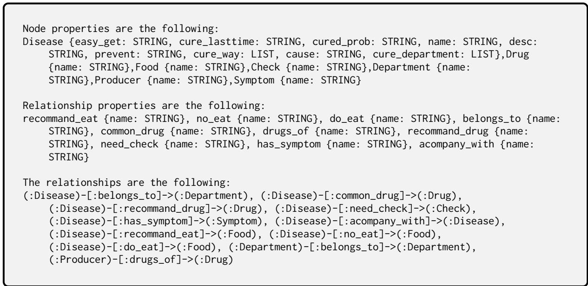

Figure 8: The metadata extracted from the Hetionet database.  
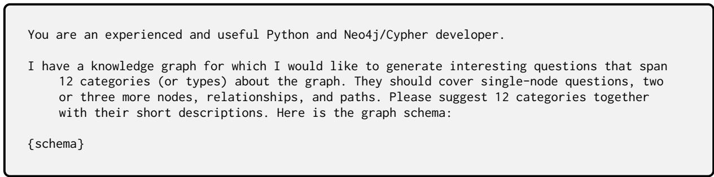

Figure 9: The prompt used to generate categories of questions.  
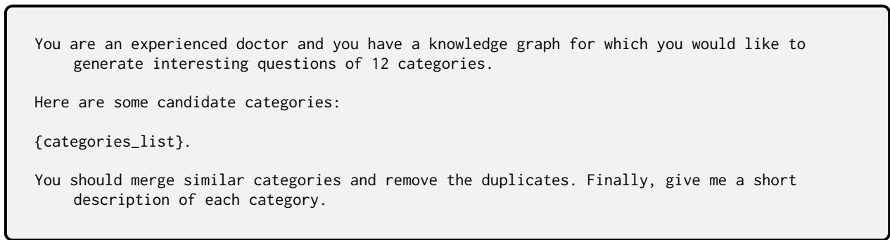

Figure 10: The prompt used to merge proposed categories.
<table><tr><td>Ent. Type</td><td># Ent.</td><td>Examples</td></tr><tr><td>Check</td><td>3,353</td><td>Bronchography</td></tr><tr><td>Department</td><td>54</td><td>Department of Plastic and Reconstructive Surgery</td></tr><tr><td>Disease</td><td>8,807</td><td>Thrombosed Vasculitis</td></tr><tr><td>Drug</td><td>3,828</td><td>Jingwanhong Hemorrhoid Cream</td></tr><tr><td>Food</td><td>4,870</td><td>Tomato and Vegetable Beef Ball Soup</td></tr><tr><td>Producer</td><td>17,201</td><td>Tongyi Pharmaceutical Penicillin V Potassium Tablets</td></tr><tr><td>Symptom</td><td>5,998</td><td>Hypertrophy of breast tissue</td></tr><tr><td>Total</td><td>44,111 1</td><td></td></tr></table>

Table 3: Entities in LHY Database.

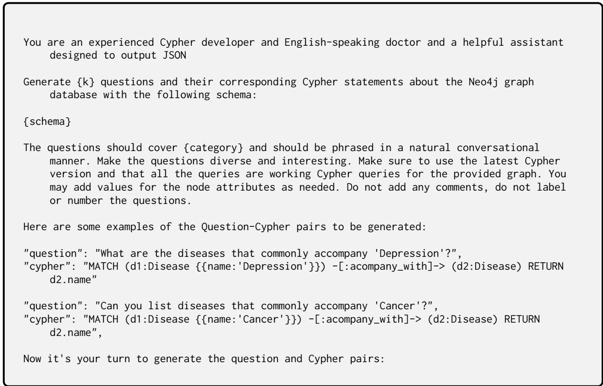

Figure 11: The prompt used to generate questions.
<table><tr><td>Rel. Type</td><td>#Rel.</td><td>Examples</td></tr><tr><td>belongs_to</td><td>8,844</td><td>&lt;Gynaecology, belongs_to, Obstetrics and Gynaecology&gt;</td></tr><tr><td>common _drug</td><td>14,649</td><td>&lt;Yang Qiang, common_drug, Phentolamine mesylate dispersible tablets&gt;</td></tr><tr><td>do_eat</td><td>22,238</td><td>&lt;Thoracic spine fracture, do_eat, Blackfish&gt;</td></tr><tr><td>drugs_of</td><td>17,315</td><td>&lt;Penicillin V Potassium Tablets, drugs_of, Tongyi Pharmaceuticals Penicillin V potassium tablets&gt;</td></tr><tr><td>need_check</td><td>39,422</td><td>&lt; Unilateral emphysema, need_check, Bronchography&gt;</td></tr><tr><td>no_eat</td><td>22,247</td><td>&lt;Lip disease, no_eat, Almonds&gt;</td></tr><tr><td>recommend_drug</td><td>59,467</td><td>&lt;Mixed hemorrhoids, recommend_drug, Jingwanhong Hemorrhoid</td></tr><tr><td>recommend_eat</td><td>40,221</td><td>Cream&gt; &lt;Synovial effusion, recommend_eat, Beef Ball Soup with Tomato and</td></tr><tr><td>has_ symptom accompany _with</td><td>5,998</td><td>Vegetable Punch&gt; &lt;Early Breast Cancer, has_symptom, Hypertrophy of breast tissue&gt;</td></tr><tr><td></td><td>12,029</td><td>&lt;Valvular insufficiency of the traffic veins of the lower extremities, accompany_with, Thromboembolic vasculitis&gt;</td></tr><tr><td>Total</td><td>294,149 1</td><td></td></tr></table>

Table 4: Relations in LHY Database.

<table><tr><td>Ent. Type</td><td># Ent.</td><td>Examples</td></tr><tr><td>Anatomy</td><td>402</td><td>Digestive System</td></tr><tr><td>Biological_process</td><td>11,381</td><td>Protein Sialylation</td></tr><tr><td>Cellular_component</td><td>1,391</td><td>Meiotic Spindle</td></tr><tr><td>Compound</td><td>1,552</td><td>Mannitol</td></tr><tr><td>Disease</td><td>137</td><td>Hypertension</td></tr><tr><td>Gene</td><td>20,945</td><td>STRIP2</td></tr><tr><td>Molecular_function</td><td>2,884</td><td>Vitamin Transporter Activity</td></tr><tr><td>Pathway</td><td>1,822</td><td>Glycolysis</td></tr><tr><td>Pharmacologic_class</td><td>345</td><td>Decreased Blood Pressure</td></tr><tr><td>Side_effect</td><td>5,734</td><td>Subileus</td></tr><tr><td>Symptom</td><td>438</td><td>Ageusia</td></tr><tr><td>Total</td><td>47,031</td><td>1</td></tr><tr><td>Rel. Type</td><td>#Rel.</td><td>Examples</td></tr><tr><td>Anatomy-downregulates-Gene</td><td>102,240</td><td>&lt;Bronchus, downregulates, GRIA2&gt;</td></tr><tr><td>Anatomy-expresses-Gene</td><td>526,407</td><td>&lt;Myocardium, expresses, EFHD1&gt;</td></tr><tr><td>Anatomy-upregulates-Gene</td><td>97,848</td><td>&lt;Adipose tissue, upregulates, PARM1&gt;</td></tr><tr><td>Compound-binds-Gene</td><td>11,571</td><td>&lt;Sildenafil, binds, CYP3A4&gt;</td></tr><tr><td>Compound-causes-Side_Effect</td><td>138,944</td><td>&lt;Ciprofloxacin, causes, Visual Disturbance&gt;</td></tr><tr><td>Compound-downregulates-Gene</td><td>21,102</td><td>&lt;Tacrolimus, downregulates, UBE2C&gt;</td></tr><tr><td>Compound-palliates-Disease</td><td>390</td><td>&lt;Fluvoxamine, palliates, Panic Disorder&gt;</td></tr><tr><td>Compound-resembles-Compound</td><td>6,486</td><td>&lt;Clotrimazole, resembles, Bifonazole&gt;</td></tr><tr><td>Compound-treats-Disease</td><td>755</td><td>&lt;Reserpine, treats, Hypertension&gt;</td></tr><tr><td>Compound-upregulates-Gene</td><td>18,756</td><td>&lt;Estriol, upregulates, KLHL9&gt;</td></tr><tr><td>Disease-associates-Gene</td><td>12,623</td><td>&lt;Parkinson's Disease, associates, HTR7&gt;</td></tr><tr><td>Disease-downregulates-Gene</td><td>7,623</td><td>&lt;Schizophrenia, downregulates, MLST8&gt;</td></tr><tr><td>Disease-localizes-Anatomy</td><td>3,602</td><td>&lt;Migraine, localizes, Brain&gt;</td></tr><tr><td>Disease-presents-Symptom</td><td>3,357</td><td>&lt;Lung Cancer, presents, Constipation&gt;</td></tr><tr><td>Disease-resembles-Disease</td><td>543</td><td>&lt;Bone Cancer, resembles, Head and Neck Cancer&gt;</td></tr><tr><td>Disease-upregulates-Gene</td><td>7,731</td><td>&lt;Malaria, upregulates, JAK2&gt;</td></tr><tr><td>Gene-covaries-Gene</td><td>61,690</td><td>&lt;IMP3, covaries, OR8U8&gt;</td></tr><tr><td>Gene-interacts-Gene</td><td>147,164</td><td>&lt;TRIM27, interacts, MED21&gt;</td></tr><tr><td>Gene-participates-Biological_Process</td><td>559,504</td><td>&lt;ABCA1, participates, Lipid Homeostasis&gt;</td></tr><tr><td>Gene-participates-Cellular_Component</td><td>73,566</td><td>&lt;KLHL14, participates, Neuronal Cell Body&gt;</td></tr><tr><td>Gene-participates-Molecular_Function</td><td>97,222</td><td>&lt;TOP2B, participates, ATPase Activity&gt;</td></tr><tr><td>Gene-participates-Pathway</td><td>84,372</td><td>&lt;GGT5, participates, Metabolism&gt;</td></tr><tr><td>Gene-regulates-Gene</td><td>265,672</td><td>&lt;BCCIP, regulates, HLTF&gt;</td></tr><tr><td>Pharmacologic_Class-includes-Compound</td><td>1,029</td><td>&lt;Allergens, includes, Benzocaine&gt;</td></tr><tr><td>Total</td><td>2,250,197</td><td>/</td></tr></table>

Table 5: Entities in Hetionet Database.

Table 6: Relations in Hetionet Database.

<table><tr><td>LLM name</td><td>LLM version</td><td>LLM site</td></tr><tr><td>GPT</td><td>gpt-3.5-turbo-16k</td><td>https://platform.openai.com/docs/models/gpt-3.5-turbo</td></tr><tr><td>Llama3</td><td>Meta-Llama-3-8B</td><td>https://huggingface.co/meta-llama/Meta-Llama-3-8B-Instruct</td></tr><tr><td>InternLM2</td><td>internlm2-7B</td><td>https://huggingface.co/internlm/internlm2-base-7b</td></tr><tr><td>Qwen2</td><td>Qwen2-7B</td><td>https://huggingface.co/Qwen/Qwen2-7B</td></tr></table>

Table 7: Versions of the backbone LLMs

<table><tr><td>Database</td><td>Pipeline</td><td>Grammatical Validator</td><td>Semantic Validator</td><td>Entity Validator</td><td>Schema Validator</td><td>Coherence Validator</td><td>All passed</td></tr><tr><td>LHY</td><td>LLM-based prompting</td><td>99.69%</td><td>N/A</td><td>99.62%</td><td>82.77%</td><td>N/A</td><td>83.87%</td></tr><tr><td>LHY</td><td>Template-filling</td><td>99.87%</td><td>92.34%</td><td>100%</td><td>99.87%</td><td>28.59%</td><td>27.21%</td></tr><tr><td>Hetionet</td><td>LLM-bâsed prompting</td><td>96.08%</td><td>N/A</td><td>99.08%</td><td>61.69%</td><td>N/A</td><td>64.79%</td></tr><tr><td>Hetionet</td><td>Template-filling</td><td>100%</td><td>91.81%</td><td>99.52%</td><td>100%</td><td>38.15%</td><td>36.66%</td></tr></table>

Table 8: MedT2C’s passing rates of each automatic validator.

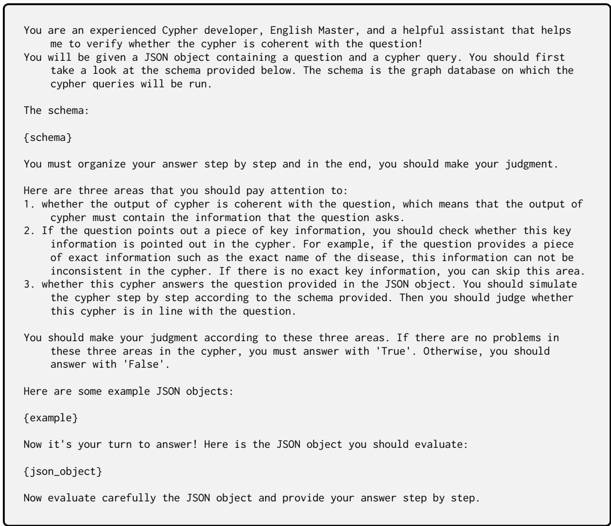  
Figure 12: The prompt used in Semantic validator.

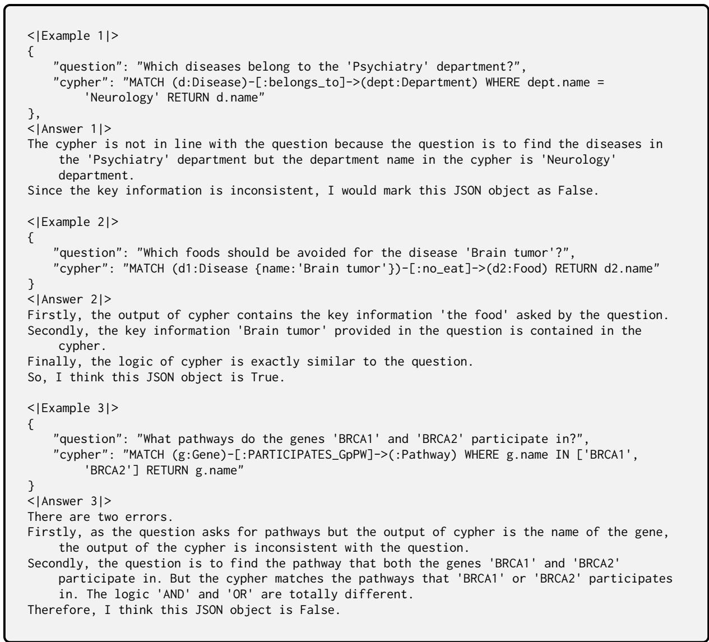  
Figure 13: The English few-shot examples used in the Semantic Validator.

  
Figure 14: The prompt used in Coherence Validator.

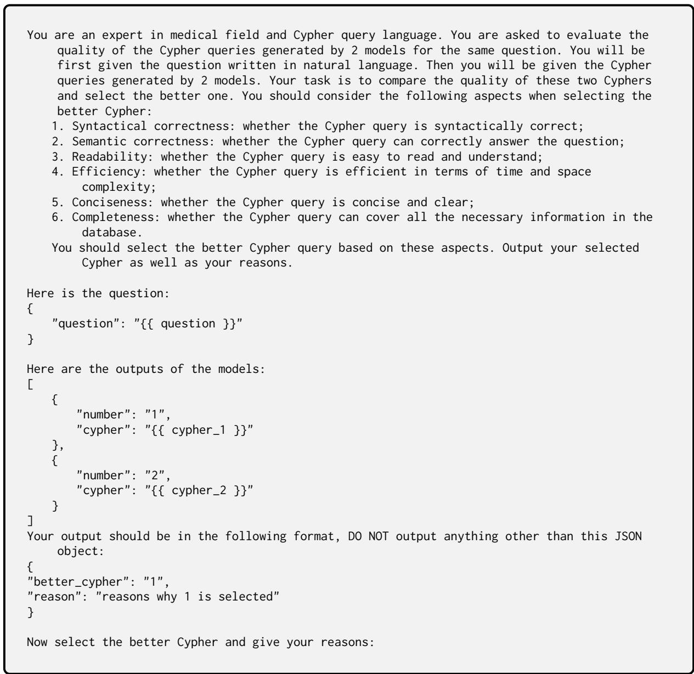  
Figure 15: The prompt used in Cypher quality evaluation.