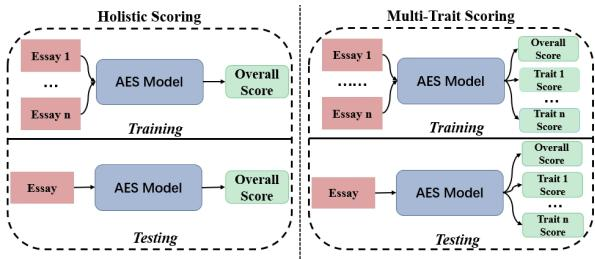
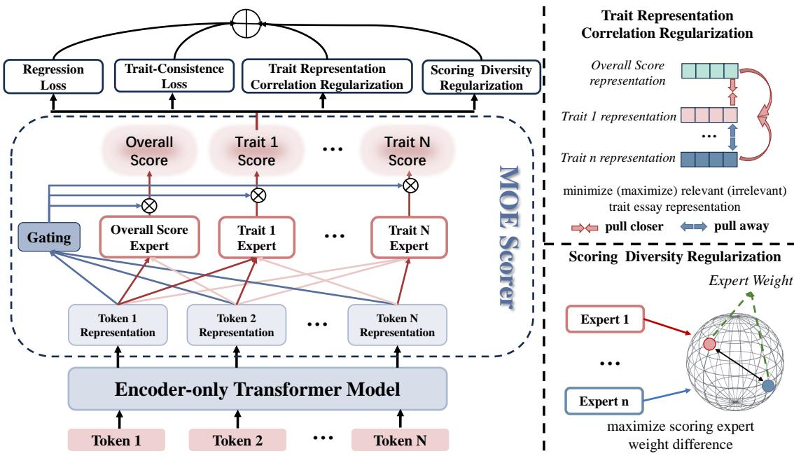
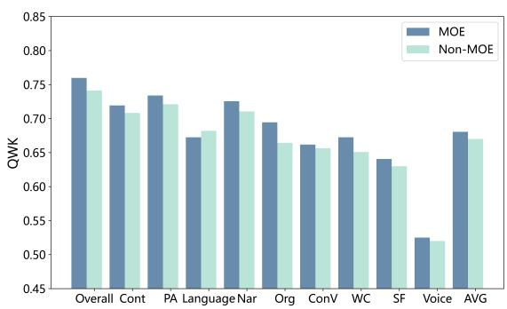
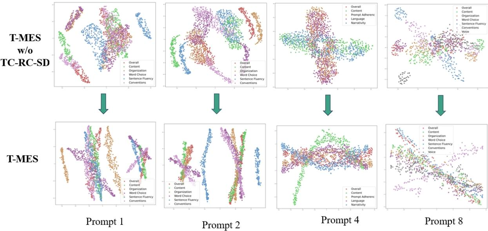
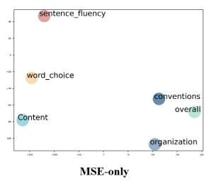
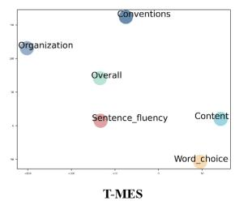
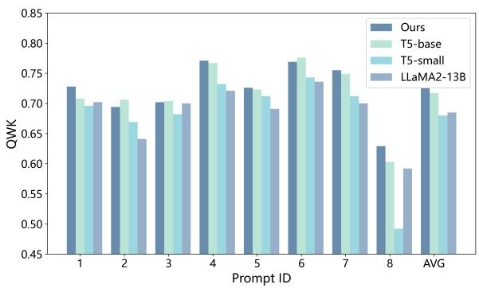
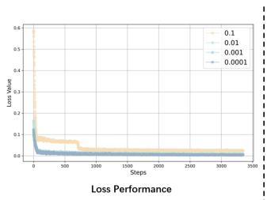
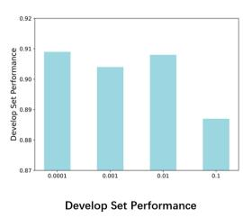

# T-MES: Trait-Aware Mix-of-Experts Representation Learning for Multi-trait Essay Scoring

Jiong Wang1 and Jie Liu2,3\*

1School of Artificial Intelligence, Beijing Normal University, Beijing, China   
2School of Information Science, North China University of Technology, Beijing, China   
China Language Intelligence Research Center, Capital Normal University, Beijing, China jjoinw@mail.bnu.edu.cn, lliujie@ncut.edu.cn

## Abstract

In current research on automatic essay scoring, related work tends to focus more on evaluating the overall quality or a single trait of prompt1- specific essays. However, when scoring essays in an educational context, it is essential not only to consider the overall score but also to provide feedback on various aspects of the writing. This helps students clearly identify areas for improvement, enabling them to engage in targeted practice. Although many methods have been proposed to address the scoring issue, they still suffer from insufficient learning of trait representations and overlook the diversity and correlations between trait scores in the scoring process. To address this problem, we propose a novel multi-trait essay scoring method based on Trait-Aware Mix-of-Experts Representation Learning. Our method obtains trait-specific essay representations using a Mixof-Experts scoring architecture. Furthermore, based on this scoring architecture, we propose a diversified trait-expert method to learn distinguishable expert weights. And to facilitate multi-trait scoring, we introduce two trait correlation learning strategies that achieve learning the correlations among traits. Experimental results demonstrate the effectiveness of our method, and compared to existing methods, it achieves a further improvement in computational efficiency.

## 1 Introduction

Automated essay scoring (AES) is a significant application of artificial intelligence technology in the field of education. Especially when faced with a large number of essays, an effective AES system can provide students with timely feedback on their writing and can effectively alleviate the workload of teachers. Traditional AES methods generally employ regression-based or classificationbased machine learning models, which are trained on textual features extracted from the target essays. With the evolution of deep learning, the field of automated essay scoring has integrated advanced feature extraction techniques for scoring (Taghipour and Ng, 2016; Dong and Zhang, 2016; Dong et al., 2017), such as convolutional neural networks (CNNs) (Cao et al., 2020) and long shortterm memory networks (LSTMs) (Uto et al., 2020).

  
Figure 1: A summary of AES Tasks.

In current AES research, an increasing number of researchers are focusing on utilizing pre-trained language models (Yang et al., 2020; Wang et al., 2022; Xie et al., 2022) to evaluate the overall scores of essays, achieving promising results. However, pre-trained language models have not yet been thoroughly explored in the context of multi-trait automated scoring. Unlike holistic scoring methods that assess essays based solely on overall quality, multi-trait scoring tasks require evaluation from multiple angles using diverse rubrics (Alikaniotis et al., 2016; Kumar et al., 2022; Do et al., 2024). When applying existing transformer-based AES methods to multi-trait tasks, it necessitates duplicating encoders for different traits, leading to inefficiencies in both training and inference. This can be illustrated in Figure 1.

Existing multi-trait scoring approaches (Ridley et al., 2021; Kumar et al., 2022; Chen and Li, 2023; Do et al., 2023b) typically employ holistic scoring models (Dong et al., 2017), incorporating multiple linear layers or separate trait-specific layers for 24

different traits. These methods continue to utilize deep neural networks such as CNNs and LSTMs to obtain essay representations of different traits, without leveraging the representational capabilities of transformer-based language models (such as BERT, RoBERTa). In this paper, we propose the utilization of transformer-based language models for the task of multi-trait essay scoring.

It is noted that using such language models for multi-trait scoring task suffers from at least two limitations. (1) For different traits, the corresponding essay representations may exhibit significant differences. Existing scoring methods based on pre-trained language models typically first obtain a document-level representation of the essay (such as the [CLS] output of the BERT model) and then feed it into the scorer. However, when scoring different traits, the essay representations used for scoring should differ, so it is necessary to ensure diversity in representation learning within a multi-task framework. (2) A single evaluation loss fails to capture the intrinsic relationships among traits. Most existing research uses mean squared error (MSE) as the loss function, but optimizing with MSE loss overlooks the dependencies between different traits. In fact, essay trait scores are not independent of each other, but have a certain degree of inherent consistency. For example, both Word Choice and Sentence Fluency can be used to evaluate the writing quality of an essay (Cross-Trait Collaboration Capability).

To address the aforementioned issues and limitations, we introduce a novel multi-trait essay scoring method based on Trait-Aware mix-of-experts representation learning (T-MES). Specifically, to ensure that each scorer can learn the specific knowledge required for scoring in a multi-trait framework, T-MES combines mixture-of-experts (MoE) representation learning networks based on pre-trained language models, with each network learning essay representations specific to a particular trait. Additionally, to further enhance the diversity of the learned essay representations and the intrinsic consistency of the scoring traits, we designed two different learning strategies from different perspectives: (1) To promote multi-trait scoring and improve the cross-trait collaboration capabilities among different trait scoring tasks, we designed two distinct regularization schemes for learning the intrinsic relationships between different traits; (2) To the diversification of scoring capabilities in the MoE framework, we introduced scoring diversity regularization, which diversify the outputs of different representation learning experts, allowing the expert scorer to focus more on scoring the target trait. To summarize, our contributions lie in the following aspects:

• To alleviate the computational burden of pretrained language models in multi-trait scoring tasks and enhance scoring efficiency, we propose a new multi-trait essay scoring method that uses a mixture-of-experts approach to learn diverse essay trait representations.

• To further enhance the diversity of learned trait representations, we have designed a regularization method that focuses on diversifying scoring expert weights. Additionally, we introduce two distinct regularization schemes to capture the intrinsic relationships between different traits, thereby improving the connections between various scoring tasks.

• Extensive experiments on the public datasets show the superiority of our proposed method over all baseline models.

## 2 Related Works

## 2.1 Automated Essay Scoring

Traditional automated essay scoring methods rely on handcrafted features for evaluation. With the advancement of deep learning, researchers have employed deep neural networks such as Long Short-Term Memory (LSTM) and Convolutional Neural Networks (CNN) for automated scoring, achieving performance that surpasses traditional methods (Taghipour and Ng, 2016; Dong et al., 2017; Cozma et al., 2018; Uto et al., 2020). These deep neural networks can automatically learn and extract complex features from essays, transforming AES into an end-to-end task.

Recently, there has been increasing interest in obtaining essay representations from pre-trained language models for the AES task (Cao et al., 2020; Yang et al., 2020; Xie et al., 2022; Wang et al., 2022; Boquio and Naval, 2024). However, current methods based on these models primarily focus on holistic essay scoring, which predicts only the overall score and has already achieved high assessment performance. In contrast, multi-trait scoring, which provides more detailed assessments, still lags behind in quality (Kumar et al., 2022; Do et al., 2024). Our method extends pre-trained language models to the multi-trait scoring task by utilizing a single encoder architecture to achieve multi-attribute scoring of essays, thereby improving scoring efficiency. Unlike existing research that obtains trait-specific essay representations by stacking trait learning modules, we adopt a model optimization approach to enhance scoring capability more efficiently.

  
Figure 2: The overall framework of proposed multi-trait scoring method. The left part shows our model framework, where we learn trait-specific essay representations through a Mixture-of-Experts network model and employ various learning strategies to achieve diversity and correlation learning of trait representations. The right part illustrates the two regularization strategies we designed. Through trait representation correlation regularization, we bring closer the essay trait representations that are correlated with each other. Through scoring diversity regularization, we enhance the focus of trait experts on the target traits.

## 2.2 Mixture-of-Experts Models

Mixture-of-Experts (MoE) (Jain et al., 2024) is a machine learning framework that uses multiple expert layers, each specialized in solving a specific subtask. Originally designed to manage neural network dynamics, MoE layers ensure that adding more experts does not increase the computational cost per token (Chi et al., 2022; Ye and Xu, 2023; Hu et al., 2024; Zhang et al., 2024). The MoE model consists of a series of expert networks and a gating network. The outputs of the expert networks are weighted by gating scores (or "gate values") generated by the gating network before being combined. In a multi-task framework, MoE differs from general neural networks by training multiple task-specific models (experts) separately based on the data (Liu et al., 2023; Xie et al., 2024).

To the best of our knowledge, this is the first attempt to explore the use of MoE architecture for multi-trait essay scoring, aiming to better capture the representations of different traits within essays. Our trait-expert model can generate scores for all traits simultaneously in a single forward pass, significantly improving multi-task training efficiency and facilitating cross-trait cooperative learning during the model training process.

## 3 Method

Our method consists of two main components: 1) a MoE-based multi-trait scorer for obtaining essay representations for different traits, and 2) proposed training strategies for achieving more effective multi-trait scoring. The overview of our framework is shown in Figure 2.

## 3.1 Task Definition

Given essay data $E = \{ E _ { i } \} _ { i = 1 } ^ { N }$ under a certain prompt, where N is the number of essays. Each essay consists of an essay text x and a set of attribute scores $Y = \{ y _ { m } \} _ { m = 1 } ^ { M }$ , where M is the number of traits and y0 represents the overall score. The model takes E as input and uses Y as the optimization label for the scoring task. The task of our approach is to train an AES model using E, enabling it to evaluate all traits score of an essay.

## 3.2 Trait Representation Learning via Mixture of Experts

The proposed pipeline model is shown on the left side of Figure 2. This multi-trait scoring framework can be applied to any encoder-based pre-trained language model, such as BERT (Devlin et al., 2019) or RoBERTa (Liu, 2019). To capture the attention of different trait experts on various essay token representations, we use a gating mechanism for controlled representation learning. This mechanism helps each expert capture distinct trait knowledge and learn distinguishable representations. Specifically, the pre-trained tokenizer splits the essay into a token sequence $T = [ t _ { 1 } , t _ { 2 } , . . . , t _ { n } ]$ , where $t _ { i }$ is the i-th token and n is the number of tokens in the essay. By leveraging the text representation capabilities of pre-trained models, we can obtain contextual information to represent each token.

In multi-trait scoring tasks, essay representations for each trait should be distinct. Existing methods achieve this by stacking various network architectures, such as CNNs and LSTMs (Kumar et al., 2022; Do et al., 2023b; Cho et al., 2024). In contrast, our approach draws inspiration from the MoE framework, which effectively learns task-specific knowledge. Instead of using complex architectures, we utilize parallel fully connected layers to create trait-specific scoring experts. This setup enhances the learning of specialized knowledge while reducing the number of expert parameters.

As illustrated in the figure, we use a gating mechanism to control how different token representations contribute to the scoring process for each trait (depicted by different shades of red lines). The gating mechanism computes the contribution of each expert for a given token representation. Given an input token representation $t _ { i } ,$ , the gating network produces gating scores $g$ for each of the n experts:

$$
g = \mathrm { s o f t m a x } ( W _ { g } t _ { i } + b _ { g } )\tag{1}
$$

where $W _ { g }$ is the weight matrix of the gating network, $b _ { g }$ is the bias vector of the gating network. Each expert $E _ { i }$ applies a linear transformation to the input token representations, producing an output $f _ { i } .$ . The combined output of the MoE layer is computed by weighting the expert outputs with the gating scores. Therefore, a learned trait representation can be defined as: $\begin{array} { r } { F _ { i } = \sum _ { i = 1 } ^ { n } g _ { i } \cdot f _ { i } } \end{array}$ where $f _ { i }$ is the output of the i-th expert, $g _ { i }$ is the gating score for expert $E _ { i }$ and $F _ { i }$ is learned i-th

trait representation.

This approach encourages trait-specific experts to learn essay representations tailored to their respective traits. From these experts, we obtain a series of expert weights $W = \{ w _ { 1 } , w _ { 2 } , \ldots , w _ { n } \}$ and the corresponding trait representations of the essay $F = \{ F _ { 1 } , F _ { 2 } , \dots , F _ { n } \}$

Finally, each trait representation is fed into a specific sigmoid dense layer to predict the corresponding trait score. The corresponding equations are as follows:

$$
\hat { y } ^ { k } = S i g m o i d ( W _ { y } ^ { k } F _ { k } + b _ { y } ^ { k } )\tag{2}
$$

where $\hat { y } ^ { k }$ is the predicted score of the k-th trait, $\boldsymbol { W } _ { y } ^ { k }$ is the trainable weight matrix, and $b _ { y } ^ { k }$ is the bias vector.

## 3.3 Joint Learning of Representation Diversity and Trait Correlation

To further improve the representations learned by each trait expert, increase their focus on specific traits, and enhance the model’s ability to capture intrinsic relationships between traits, we introduce three regularization-based training strategies. These strategies adjust the diversity of each expert’s weights to sharpen their focus on their respective traits and enhance the model’s ability to learn associations between different traits. This approach fosters cross-trait collaboration among the various trait scoring tasks.

Scoring diversity regularization. Firstly, to ensure that each trait scoring expert focuses more on capturing the representation of its target trait and to reduce interference from other traits during representation learning, we propose a scoring diversity regularization. This regularization aims to maximize the weight differences between the scoring experts, encouraging them to learn unique representations for each trait. Specifically, following Liu et al. 2023 to increase the diversified experts, we adopt the Minimum Hypersphere Separation (MHS) method (Liu et al., 2021) to maximize the separation distance between the weight vectors of different trait experts.

$$
\operatorname* { m a x } _ { \{ \hat { w } _ { 1 } , . . . , \hat { w } _ { m } \} \in S ^ { d - 1 } } \{ L _ { \mathrm { M H S } } ( \hat { W } ) : = \operatorname* { m i n } _ { i \neq j } d ( \hat { w } _ { i } , \hat { w } _ { j } ) \}\tag{3}
$$

where $L _ { \mathrm { M H S } } ( \cdot )$ represents the separation distance between each weight vector, and the weight matrix of the trait scoring experts $W = [ w _ { 1 } , w _ { 2 } , . . . , w _ { m } ]$ is vectorized as $\begin{array} { r } { \hat { w } _ { i } = \frac { w _ { i } } { | | w _ { i } | | _ { 2 } } } \end{array}$ . This means that each scoring expert’s weight matrix is vectorized and then projected onto the unit hypersphere $S ^ { d - 1 } : =$ $\{ \hat { w } \in \mathbf { R } ^ { d } , | | \hat { w } | | _ { 2 } = 1 \}$ , with $d ( \cdot , \cdot )$ denoting the shortest distance between two vertices. By maximizing the distance between the weights of different experts, we promote the model to learn diverse trait scoring information. In this paper, we define the aforementioned process as scoring diversity regularization $L _ { S D }$

Trait representation correlation regularization. Unlike holistic essay scoring, the multi-trait scoring task involves a certain degree of intrinsic correlation among different traits. Previous research on multi-trait scoring has typically used MSE as the sole optimization objective, overlooking the correlations between traits (Ridley et al., 2021; Kumar et al., 2022; Chen and Li, 2023). In the proposed MoE scoring framework, however, different traitscoring experts learn representations that naturally exhibit both correlations and mutual exclusivities.

To enhance cross-trait scoring ability between different traits, we maximize the consistency between closely related traits while increasing the dissimilarity between those with low intrinsic correlations. Specifically, to quantify the correlation between trait representations, we use cosine similarity to construct a similarity matrix. Let $F _ { i }$ and $F _ { j }$ represent the representations of traits i and $j ,$ respectively. The cosine similarity between trait i and trait $j$ is defined as follows:

$$
\mathrm { s i m } ( F _ { i } , F _ { j } ) = \frac { F _ { i } ^ { \top } F _ { j } } { | | F _ { i } | | _ { 2 } | | F _ { j } | | _ { 2 } }\tag{4}
$$

Then we select positive and negative sample pairs from the computed similarity matrix. Specifically, for each trait representation $F _ { i }$ , the positive sample pair is the trait representation $F _ { j }$ with the highest similarity, while the negative sample pair is the trait representation $F _ { k }$ with the lowest similarity. High similarity indicates that these trait representations focus on consistent essay features or content during trait learning.

Finally, we adopt a contrastive learning approach that aims to maximize the similarity between positive sample pairs while minimizing the similarity between negative sample pairs. The corresponding regularizer is formulated as:

$$
L _ { \mathrm { R C } } = - \frac { 1 } { 2 } \log \left( \frac { \sum _ { ( i , j ) \in \mathcal { P } } \exp \left( \frac { \sin \left( F _ { i } , F _ { j } \right) } { \tau } \right) } { \sum _ { ( i , k ) \in \mathcal { N } } \exp \left( \frac { \sin \left( F _ { i } , F _ { k } \right) } { \tau } \right) } \right)\tag{5}
$$

where $\mathcal { P }$ and $\mathcal { N }$ represent the sets of positive and negative sample pairs, respectively, and τ is the temperature parameter. Intuitively, traits with similar representations during training indicate that their respective traits are correlated. By reducing the distance between these similar representations, we encourage greater interaction between correlated traits. Thus, we introduce contrastive regularization to enhance both the correlation and diversity of trait representations, which in turn improves the model’s multi-trait scoring capabilities.

Trait correlation loss. To further learn the correlations between different traits, we introduce a trait correlation (TC) loss. Specifically, inspired by Do et al. 2023a, we calculate the correlation between ground-truth trait vectors as a control threshold for similarity loss computation, aiming for the model to learn in a direction that increases the consistency of the distribution of predicted trait score vectors. The TC loss $( L _ { T C } )$ is defined as follows:

$$
L _ { T C } ( \boldsymbol y , \hat { \boldsymbol y } ) = \frac { 1 } { c } \sum _ { j = 1 } ^ { M } \sum _ { k = j + 1 } ^ { M } \mathrm { T C } ( \hat { y } _ { j } , \hat { y } _ { k } , y _ { j } , y _ { k } )\tag{6}
$$

where $y _ { j } = [ y _ { 1 j } , y _ { 2 j } , . . . , y _ { N j } ]$ is j-th ground-truth trait vector, $\hat { y } _ { j } ~ = ~ [ \hat { y } _ { 1 j } , \hat { y } _ { 2 j } , . . . , \hat { y } _ { N j } ]$ is predicted trait vector. We use the Pearson correlation coefficient (PCC, P) to calculate the correlations between different trait scores, and by setting a threshold, we identify the trait relationships with strong correlations in the essays.

$$
\mathrm { T C } = \left\{ \begin{array} { l l } { 1 - \cos ( \hat { y } _ { j } , \hat { y } _ { k } ) , } & { \mathrm { i f } \ P ( y _ { j } , y _ { k } ) \ge \delta } \\ { 0 , } & { \mathrm { o t h e r w i s e } } \end{array} \right.\tag{7}
$$

where cos denotes the cosine similarity, δ is the threshold and c is the number of calculated TC that is not 0. Unlike the work of Do et al. 2023a, which focuses on reflecting the similarity between traits and overlooks the correlation between trait scores and the overall score, we consider that the distribution of trait scores can help evaluate overall quality. Finally, the overall loss function $\boldsymbol { L } _ { F i n a l }$ is the summation of the ground truth MSE loss $L _ { M S E }$ , TC loss $L _ { T C }$ , representation correlation regularization $L _ { R C }$ and scoring diversity regularization $L _ { S D } \mathrm { : }$

$$
L _ { F i n a l } = \lambda L _ { M S E } + ( 1 - \lambda ) L _ { T C } + \alpha L _ { R C } + \beta L _ { S D }\tag{8}
$$

λ, α,and $\beta$ are hyperparameters which control the importance of the corresponding regularization terms. The MSE loss is calculated as follows:

$$
L _ { M S E } ( y , \hat { y } ) = \frac { 1 } { N M } { \sum _ { i = 1 } ^ { N } } { \sum _ { j = 1 } ^ { M } } ( y _ { i j } - \hat { y } _ { i j } ) ^ { 2 }\tag{9}
$$

where M represents the number of traits for $N$ essays, y is ground truth and $\hat { y }$ is the prediction.

## 4 Experiments

## 4.1 Dataset and Evaluation Metric

Dataset. We utilize the Automated Student Assessment Prize (ASAP) and ASAP++ (Mathias and Bhattacharyya, 2018), which has been widely used for AES (Kumar et al., 2022; Xie et al., 2022). The dataset contains eight sets of essays, each of which belongs to a different essay prompt. The statistics are provided in Appendix A.

Evaluation metric. To evaluate the performance of our method, we use the widely adopted Quadratic Weighted Kappa (QWK) metric (Cohen, 1968), which measures the level of agreement between the human and predicted scores.

## 4.2 Baselines

The details of baseline models are as follows:

STL-LSTM (Dong et al., 2017): This model applies a CNN, LSTM and attention to get the final essay representation for scoring. HISK (Cozma et al., 2018): This model is a histogram intersection string kernel with a support vector regressor. BERT (Devlin et al., 2019): The pre-trained language model has shown great performance on many NLP tasks, including AES task. MTL-BiLSTM (Kumar et al., 2022): Based on CNN-LSTM architecture (Dong et al., 2017), this method uses multi-task learning where auxiliary multi-trait scoring tasks aid holistic scoring. DualTrans (Cho et al., 2024): Like MTL-BiLSTM, this transformerbased scoring method also uses multi-task learning, where auxiliary multi-trait scoring tasks aid holistic scoring. Note that HISK, STL-LSTM, and BERT are each applied individually for trait scoring.

## 4.3 Training Details

We trained a total of 50 epochs, and the one with the highest average QWK score for all traits in the validation set was selected for testing. We use $R o B E R T a _ { b a s e }$ as the pre-trained language model to obtain the token representations. For tokenization and vocabulary, we all use the preprocessing tools provided by the RoBERTa model. For the limitation of our GPU memory (a Geforce RTX4090 GPUcard is used.), we set the max length of the essay is 512 words and the batchsize is 32. In addition, we normalize all relative scores to the range of [0, 1] during training and the scores are rescaled back to the original score range for evaluation. Following previous work (Kumar et al., 2022), we conduct the evaluation in prompt-specific condition. More details are provided in Appendix B.

## 5 Results and Discussion

## 5.1 Experiments Results

The comparison results clearly show that T-MES outperforms the baseline methods for all prompts (Table 1) and most of traits (Table 2). In our experiments, we compared our approach with single-task methods (HISK, STL-LSTM, and BERT), which were individually applied for each trait scoring. Compared to these methods, our approach demonstrates significant advantages in multi-trait scoring. Compared to the BERT model, T-MES improves the average QWK by nearly 2%, and it does not require retraining a new model for predicting a trait score. Although different pre-trained models are used, in the following experiments, we also employ BERT as the pre-trained encoder combined with the MoE framework and the proposed optimization strategies to achieve multi-trait scoring. The results show that our approach significantly outperforms the single-task scoring method using only BERT, demonstrating the pluggability of T-MES.

Besides, our method also demonstrated a clear advantage in predicting trait score compared to the multi-task scoring methods in the baseline. From the comparative results, it can be observed that, compared to the LSTM-CNN-based model (MTL-BiLSTM), methods based on pre-trained models have significant advantages in multi-trait scoring (DualTrans, and Ours). Compared to methods that use trait scoring to assist overall scoring (MTL-BiLSTM, DualTrans), our approach demonstrates certain advantages in predicting trait scores, achieving better prediction performance in most trait predictions. However, when compared to DualTrans, which utilizes trait scoring to assist in holistic score prediction, our method showed some disadvantages in predicting the overall score. Additionally, it can be observed that our method’s scoring effectiveness for the Voice trait was inferior to DualTrans, which might be due to the severely lacking samples (726) for the Voice trait and issues related to the model’s parameter size. As shown in Table 3, the parameter count of the DualTrans method is more than twice that of our method.

<table><tr><td>Model</td><td>MTL</td><td>P1</td><td>P2</td><td>P3</td><td>P4</td><td>P5</td><td>P6</td><td>P7</td><td>P8</td><td>AVG↑</td></tr><tr><td>HISK</td><td>X</td><td>0.674</td><td>0.586</td><td>0.651</td><td>0.681</td><td>0.693</td><td>0.709</td><td>0.641</td><td>0.516</td><td>0.644</td></tr><tr><td>STL-LSTM</td><td>X</td><td>0.690</td><td>0.622</td><td>0.663</td><td>0.719</td><td>0.719</td><td>0.753</td><td>0.704</td><td>0.592</td><td>0.684</td></tr><tr><td>BERT</td><td>X</td><td>0.709</td><td>0.669</td><td>0.689</td><td>0.763</td><td>0.714</td><td>0.734</td><td>0.740</td><td>0.610</td><td>0.701</td></tr><tr><td>MTL-BiLSTM</td><td>√</td><td>0.670</td><td>0.611</td><td>0.647</td><td>0.708</td><td>0.704</td><td>0.712</td><td>0.684</td><td>0.581</td><td>0.665</td></tr><tr><td>DualTrans</td><td>√</td><td>0.712</td><td>0.671</td><td>0.690</td><td>0.760</td><td>0.714</td><td>0.740</td><td>0.748</td><td>0.620</td><td>0.707</td></tr><tr><td>T-MES (Ours)</td><td>√</td><td>0.728</td><td>0.684</td><td>0.702</td><td>0.771</td><td>0.726</td><td>0.754</td><td>0.755</td><td>0.629</td><td>0.719</td></tr></table>

Table 1: Average QWK scores across all traits for each prompt.
<table><tr><td>Model</td><td>MTL</td><td>Overall</td><td>Content</td><td>PA</td><td>Lang</td><td>Nar</td><td>Org</td><td>Conv</td><td>WC</td><td>SF</td><td>Style</td><td>Voice</td><td>AVG↑</td></tr><tr><td>HISK</td><td>X</td><td>0.718</td><td>0.679</td><td>0.697</td><td>0.605</td><td>0.659</td><td>0.610</td><td>0.527</td><td>0.579</td><td>0.553</td><td>0.609</td><td>0.489</td><td>0.611</td></tr><tr><td>STL-LSTM</td><td>X</td><td>0.750</td><td>0.707</td><td>0.731</td><td>0.640</td><td>0.699</td><td>0.649</td><td>0.605</td><td>0.621</td><td>0.612</td><td>0.659</td><td>0.544</td><td>0.656</td></tr><tr><td>BERT</td><td>X</td><td>0.762</td><td>0.719</td><td>0.731</td><td>0.659</td><td>0.703</td><td>0.669</td><td>0.656</td><td>0.676</td><td>0.625</td><td>0.693</td><td>0.610</td><td>0.682</td></tr><tr><td>MTL-BiLSTM</td><td>√</td><td>0.764</td><td>0.685</td><td>0.701</td><td>0.604</td><td>0.668</td><td>0.615</td><td>0.560</td><td>0.615</td><td>0.598</td><td>0.632</td><td>0.582</td><td>0.638</td></tr><tr><td>DualTrans</td><td>√</td><td>0.778</td><td>0.726</td><td>0.732</td><td>0.660</td><td>0.704</td><td>0.682</td><td>0.668</td><td>0.674</td><td>0.663</td><td>0.689</td><td>0.619</td><td>0.687</td></tr><tr><td>T-MES (Ours)</td><td>了</td><td>0.774</td><td>0.730</td><td>0.750</td><td>0.702</td><td>0.730</td><td>0.685</td><td>0.686</td><td>0.679</td><td>0.675</td><td>0.693</td><td>0.590</td><td>0.700</td></tr></table>

Table 2: Average QWK scores across all prompts for each trait.

<table><tr><td>MTL</td><td>Method</td><td>Parameter (M)</td><td>Inference Time (s)</td></tr><tr><td>X</td><td>BERT</td><td> $1 1 0 \times t _ { m }$ </td><td> $0 . 0 1 0 \times t _ { m }$ </td></tr><tr><td>√</td><td>DualTrans</td><td>277</td><td>0.030</td></tr><tr><td>√</td><td>T-MES</td><td>129</td><td>0.014</td></tr></table>

Table 3: Comparison of model parameters and single inference time for different Transformer-based trait essay scoring methods. $t _ { m }$ means the number of traits.

Computational Cost. We analyzed the computational cost of our method. Using single taskbased method that predict a single numeric score for multi-trait predictions would require replicating multiple models, making it resource-inefficient. As shown in Table 3, predicting 6 traits using a pre-trained model with 110M parameters would involve a substantial 110M × 6 parameters, along with increased training time and inference time. In contrast, our approach uses a RoBERTa-base model with 129M parameters, enabling multi-trait predictions across all prompts, with a single model training time of only 35 minutes. The time required for inferencing the trait scores of a single sample

is merely 0.014 seconds.

## 5.2 Ablation Experiment

To investigate the usefulness of our proposed multitrait scoring framework and training strategies, we conducted a series of ablation experiments. We still present the ablation results from two dimensions: the average trait scoring performance of the model on each prompt and the scoring performance of the model on each attribute.

The experimental results are shown in Table 4 and Table 5. From the experimental results, we can see that when all optimization strategies are removed and only MSE is used as the objective function (T-MES w/o TC-RC-SD), there is a significant decline in performance. When using trait correlation loss, the model’s scoring performance shows some improvement, but the improvement is not significant. This indicates that while learning the correlation between traits helps to some extent in improving model performance, there may still be some mutual interference between different traits. When adding scoring diversity regularization and trait representation correlation regularization, the model’s performance further improves, especially on Voice, showing a significant improvement. This demonstrates the effectiveness of the proposed regularized scoring method.

## 5.3 Discussion

The MoE Scoring Framework’s Assistance in Representation Learning. We further illustrate the advantages of the Mixture-of-Experts scoring framework in obtaining specific trait representations of essays through ablation experiments. In this experiment, we only use the [CLS] position of RoBERTa to obtain document-level representations of essays and acquire representations of different traits through multiple parallel linear transformation layers. By comparing this method of obtaining text representations, we highlight the advantages of the Mixture-of-Experts scoring framework used in our work. The experimental results are shown in Figure 3. As seen from the experimental results, the scoring model using the MoE scoring framework significantly outperforms the non-MoE framework in predicting most traits during multi-trait scoring. This demonstrates that different tokens contribute differently to various trait scoring tasks, and using a uniform representation (non-MoE) makes it difficult to learn these intrinsic differences. Therefore, it illustrates the rationality of the scoring framework proposed in this paper.

<table><tr><td>Model</td><td>1</td><td>2</td><td>3</td><td>4</td><td>5</td><td>6</td><td>7</td><td>8</td><td>AVG↑</td></tr><tr><td>T-MES</td><td>0.728</td><td>0.684</td><td>0.702</td><td>0.771</td><td>0.726</td><td>0.754</td><td>0.755</td><td>0.629</td><td>0.719</td></tr><tr><td>T-MES w/o TC-RC-SD</td><td>0.710</td><td>0.670</td><td>0.700</td><td>0.756</td><td>0.710</td><td>0.728</td><td>0.742</td><td>0.615</td><td>0.702</td></tr><tr><td>T-MES w/o RC-SD</td><td>0.712</td><td>0.671</td><td>0.701</td><td>0.769</td><td>0.714</td><td>0.730</td><td>0.754</td><td>0.609</td><td>0.706</td></tr><tr><td>T-MES w/o SD</td><td>0.715</td><td>0.672</td><td>0.699</td><td>0.761</td><td>0.722</td><td>0.743</td><td>0.743</td><td>0.627</td><td>0.710</td></tr><tr><td>T-MES w/o RC</td><td>0.716</td><td>0.682</td><td>0.697</td><td>0.769</td><td>0.723</td><td>0.745</td><td>0.746</td><td>0.625</td><td>0.714</td></tr></table>

Table 4: Ablation study results on across all traits for each prompt. TC represents trait-consistence loss. RC represents trait representation correlation regularization. SD represents scoring diversity regularization.
<table><tr><td>Model T-MES</td><td>Overall 0.774</td><td>Content 0.730</td><td>PA 0.750</td><td>Lang 0.702</td><td>Nar 0.730</td><td>Org 0.685</td><td>Conv 0.686</td><td>WC 0.679</td><td>SF 0.675</td><td>Style 0.693</td><td>Voice 0.590</td><td>AVG↑ 0.700</td></tr><tr><td>T-MES w/o TC-RC-SD</td><td>0.756</td><td>0.711</td><td>0.730</td><td>0.696</td><td>0.724</td><td>0.675</td><td>0.667</td><td>0.666</td><td>0.672</td><td>0.656</td><td>0.525</td><td>0.680</td></tr><tr><td>T-MES w/o RC-SD</td><td>0.759</td><td>0.719</td><td>0.740</td><td>0.672</td><td>0.725</td><td>0.684</td><td>0.661</td><td>0.672</td><td>0.640</td><td>0.683</td><td>0.530</td><td>0.684</td></tr><tr><td>T-MES w/o SD</td><td>0.764</td><td>0.725</td><td>0.730</td><td>0.693</td><td>0.725</td><td>0.671</td><td>0.673</td><td>0.668</td><td>0.671</td><td>0.679</td><td>0.572</td><td>0.690</td></tr><tr><td>T-MES w/o RC</td><td>0.768</td><td>0.722</td><td>0.735</td><td>0.697</td><td>0.727</td><td>0.667</td><td>0.679</td><td>0.669</td><td>0.666</td><td>0.692</td><td>0.589</td><td>0.694</td></tr></table>

Table 5: Ablation study results on across all prompts for each trait.

  
Figure 3: The comparison results of using MoE representation learning method to obtain the trait representation and only using the multi-scorer.

Comparison of different pre-trained language models. We investigated the performance variation with different mainstream encoder-based pre-trained language models including BERT and RoBERTa. The experimental results, as shown in Table 6, indicate that when we change the underlying pre-trained language model, the final scoring performance does not show significant differences. This suggests that the multi-trait scoring method proposed in this paper is relatively insensitive to the choice of pre-trained language models. More experiment results are provided in Appendix C.

<table><tr><td>Models</td><td>Average QWK</td></tr><tr><td>BERT</td><td>0.716</td></tr><tr><td>RoBERTa</td><td>0.719</td></tr></table>

Table 6: Performance of different encoder-only pretrained language models.

## 6 Conclusion

In this paper, we propose a novel multi-trait essay scoring method based on pre-trained models and a MoE scoring framework. This framework is a plugand-play method designed to assist any encoderbased pre-trained language models in learning trait representations. To further enhance the proposed scoring framework’s ability to distinguish between different scoring requirements for various traits and improve trait scoring collaboration, we introduce three regularization strategies to aid model training. Extensive experiments demonstrate the superiority of our approach. And compared to existing methods, our method achieves higher scoring efficiency while maintaining effectiveness.

## Limitations

Our work has several limitations. Firstly, although our method achieved competitive results overall, it showed performance degradation when dealing with limited data, such as the Voice trait, which had fewer than 600 training samples. This indicates that there is potential for further research in improving trait collaborative prediction ability. Secondly, while our method can obtain text representations specific to certain traits, it does not learn trait representations based on the structured organization of essays (i.e., integrating sentence-level and paragraph-level information). Therefore, exploring multi-scale trait representations of essays could further enhance the model’s ability to score multiple traits. In the future, we plan to explore more strategies for collaborative scoring between traits and provide additional insights into the application of artificial intelligence in automated educational text assessment by leveraging pre-trained language models.

## Acknowledgements

This work is supported by National Key Research and Development Program of China (2020AAA0109703), National Natural Science Foundation of China (62076167).

## References

Dimitrios Alikaniotis, Helen Yannakoudakis, and Marek Rei. 2016. Automatic text scoring using neural networks. ArXiv, abs/1606.04289.

Eujene Nikka V. Boquio and Prospero C. Naval, Jr. 2024. Beyond canonical fine-tuning: Leveraging hybrid multi-layer pooled representations of BERT for automated essay scoring. In Proceedings ofthe 2024 Joint International Conference on Computational Linguistics, Language Resources and Evaluation (LREC-COLING 2024), pages 2285–2295, Torino, Italia. ELRA and ICCL.

Yue Cao, Hanqi Jin, Xiaojun Wan, and Zhiwei Yu. 2020. Domain-adaptive neural automated essay scoring. In International ACM SIGIR Conference on Research and Development in Information Retrieval, pages 1011–1020. ACM.

Yuan Chen and Xia Li. 2023. PMAES: Promptmapping contrastive learning for cross-prompt automated essay scoring. In Proceedings of the 61st Annual Meeting of the Association for Computational Linguistics (Volume 1: Long Papers), pages 1489– 1503, Toronto, Canada. Association for Computational Linguistics.

Zewen Chi, Li Dong, Shaohan Huang, Damai Dai, Shuming Ma, Barun Patra, Saksham Singhal, Payal Bajaj, Xia Song, Xian-Ling Mao, et al. 2022. On the representation collapse of sparse mixture of experts. Advances in Neural Information Processing Systems, 35:34600–34613.

Minsoo Cho, Jin-Xia Huang, and Oh-Woog Kwon. 2024. Dual-scale bert using multi-trait representations for holistic and trait-specific essay grading. ETRI Journal, 46(1):82–95.

J. Cohen. 1968. Weighted kappa: nominal scale agreement with provision for scaled disagreement or partial credit. Psychological bulletin, 70 4:213–20.

Mad˘ alina Cozma, Andrei Butnaru, and Radu Tudor˘ Ionescu. 2018. Automated essay scoring with string kernels and word embeddings. In Proceedings ofthe 56th Annual Meeting of the Association for Computational Linguistics (Volume 2: Short Papers), pages 503–509, Melbourne, Australia. Association for Computational Linguistics.

Jacob Devlin, Ming-Wei Chang, Kenton Lee, and Kristina Toutanova. 2019. BERT: Pre-training of deep bidirectional transformers for language understanding. In Proceedings of the 2019 Conference of the North American Chapter ofthe Associationfor Computational Linguistics: Human Language Technologies, Volume 1 (Long and Short Papers), pages 4171–4186, Minneapolis, Minnesota. Association for Computational Linguistics.

Heejin Do, Yunsu Kim, and Gary Lee. 2024. Autoregressive score generation for multi-trait essay scoring. In Findings ofthe Associationfor Computational Linguistics: EACL 2024, pages 1659–1666, St. Julian’s, Malta. Association for Computational Linguistics.

Heejin Do, Yunsu Kim, and Gary Geunbae Lee. 2023a. Prompt- and trait relation-aware cross-prompt essay trait scoring. In Findings ofthe Associationfor Computational Linguistics: ACL 2023, pages 1538–1551, Toronto, Canada. Association for Computational Linguistics.

Heejin Do, Yunsu Kim, and Gary Geunbae Lee. 2023b. Prompt-and trait relation-aware cross-prompt essay trait scoring. In Findings of the Association for Computational Linguistics: ACL 2023, pages 1538–1551.

Fei Dong and Yue Zhang. 2016. Automatic features for essay scoring – an empirical study. In Proceedings ofthe 2016 Conference on Empirical Methods in Natural Language Processing, pages 1072–1077, Austin, Texas. Association for Computational Linguistics.

Fei Dong, Yue Zhang, and Jie Yang. 2017. Attentionbased recurrent convolutional neural network for automatic essay scoring. In Proceedings of the 21st Conference on Computational Natural Language Learning (CoNLL 2017), pages 153–162, Vancouver, Canada. Association for Computational Linguistics.

Tianqi Hu, Lishuang Li, Xueyang Qin, and Yubo Feng. 2024. Event representation learning with multigrained contrastive learning and triple-mixture of experts. In Proceedings of the 2024 Joint International Conference on Computational Linguistics, Language Resources and Evaluation (LREC-COLING 2024), pages 6643–6654.

Yash Jain, Harkirat Behl, Zsolt Kira, and Vibhav Vineet. 2024. Damex: Dataset-aware mixture-of-experts for visual understanding of mixture-of-datasets. Advances in Neural Information Processing Systems, 36.

Rahul Kumar, Sandeep Mathias, Sriparna Saha, and Pushpak Bhattacharyya. 2022. Many hands make light work: Using essay traits to automatically score essays. In Proceedings of the 2022 Conference of the North American Chapter of the Association for Computational Linguistics: Human Language Technologies, pages 1485–1495.

Weiyang Liu, Rongmei Lin, Zhen Liu, Li Xiong, Bernhard Schölkopf, and Adrian Weller. 2021. Learning with hyperspherical uniformity. In International Conference On Artificial Intelligence and Statistics, pages 1180–1188. PMLR.

Yinhan Liu. 2019. Roberta: A robustly optimized bert pretraining approach. arXiv preprint arXiv:1907.11692.

Zheyuan Liu, Chunhui Zhang, Yijun Tian, Erchi Zhang, Chao Huang, Yanfang Ye, and Chuxu Zhang. 2023. Fair graph representation learning via diverse mixture-of-experts. In Proceedings ofthe ACM Web Conference 2023, pages 28–38.

Sandeep Mathias and Pushpak Bhattacharyya. 2018. ASAP++: Enriching the ASAP automated essay grading dataset with essay attribute scores. In Proceedings of the Eleventh International Conference on Language Resources and Evaluation (LREC 2018), Miyazaki, Japan. European Language Resources Association (ELRA).

Colin Raffel, Noam Shazeer, Adam Roberts, Katherine Lee, Sharan Narang, Michael Matena, Yanqi Zhou, Wei Li, and Peter J Liu. 2020. Exploring the limits of transfer learning with a unified text-to-text transformer. Journal of machine learning research, 21(140):1–67.

Robert Ridley, Liang He, Xinyu Dai, Shujian Huang, and Jiajun Chen. 2021. Automated cross-prompt scoring of essay traits. In Proceedings ofAAAI Conference on Artificial Intelligence.

Kaveh Taghipour and Hwee Tou Ng. 2016. A neural approach to automated essay scoring. In Proceedings of the 2016 Conference on Empirical Methods in Natural Language Processing, pages 1882–1891, Austin, Texas. Association for Computational Linguistics.

Hugo Touvron, Louis Martin, Kevin Stone, Peter Albert, Amjad Almahairi, Yasmine Babaei, Nikolay

Bashlykov, Soumya Batra, Prajjwal Bhargava, Shruti Bhosale, et al. 2023. Llama 2: Open foundation and fine-tuned chat models. arXiv preprint arXiv:2307.09288.

Masaki Uto, Yikuan Xie, and Maomi Ueno. 2020. Neural automated essay scoring incorporating handcrafted features. In Proceedings of the 28th International Conference on Computational Linguistics, pages 6077–6088, Barcelona, Spain (Online). International Committee on Computational Linguistics.

Laurens Van der Maaten and Geoffrey Hinton. 2008. Visualizing data using t-sne. Journal of machine learning research, 9(11).

Yongjie Wang, Chuang Wang, Ruobing Li, and Hui Lin. 2022. On the use of bert for automated essay scoring: Joint learning of multi-scale essay representation. In Proceedings of the 2022 Conference of the North American Chapter of the Association for Computational Linguistics: Human Language Technologies, pages 3416–3425.

Jiayi Xie, Kaiwei Cai, Li Kong, Junsheng Zhou, and Weiguang Qu. 2022. Automated essay scoring via pairwise contrastive regression. In Proceedings of the 29th International Conference on Computational Linguistics, pages 2724–2733, Gyeongju, Republic of Korea. International Committee on Computational Linguistics.

Zhitian Xie, Yinger Zhang, Chenyi Zhuang, Qitao Shi, Zhining Liu, Jinjie Gu, and Guannan Zhang. 2024. Mode: A mixture-of-experts model with mutual distillation among the experts. In Proceedings of the AAAI Conference on Artificial Intelligence, volume 38, pages 16067–16075.

Ruosong Yang, Jiannong Cao, Zhiyuan Wen, Youzheng Wu, and Xiaodong He. 2020. Enhancing automated essay scoring performance via fine-tuning pre-trained language models with combination of regression and ranking. In Findings ofthe Associationfor Computational Linguistics: EMNLP 2020, pages 1560–1569, Online. Association for Computational Linguistics.

Hanrong Ye and Dan Xu. 2023. Taskexpert: Dynamically assembling multi-task representations with memorial mixture-of-experts. In Proceedings ofthe IEEE/CVF International Conference on Computer Vision, pages 21828–21837.

Zijian Zhang, Shuchang Liu, Jiaao Yu, Qingpeng Cai, Xiangyu Zhao, Chunxu Zhang, Ziru Liu, Qidong Liu, Hongwei Zhao, Lantao Hu, et al. 2024. M3oe: Multi-domain multi-task mixture-of experts recommendation framework. In Proceedings of the 47th International ACM SIGIR Conference on Research and Development in Information Retrieval, pages 893–902.

<table><tr><td>Prompt ID</td><td>No.of Essays</td><td>Essay Type</td><td>Attributes</td><td>Overall Score Range</td><td>Attribute Score Range</td></tr><tr><td>P1</td><td>1,783</td><td>Argumentative</td><td>Cont, Org, WC, SF, Conv</td><td>2-12</td><td>1-6</td></tr><tr><td>P2</td><td>1,800</td><td>Argumentative</td><td>Cont, Org, WC, SF, Conv</td><td>0-6</td><td>1-6</td></tr><tr><td>P3</td><td>1,726</td><td>Source-Dependent</td><td>Cont, PA, Lan, Nar</td><td>0-3</td><td>0-3</td></tr><tr><td>P4</td><td>1,772</td><td>Source-Dependent</td><td>Cont, PA, Lan, Nar</td><td>0-3</td><td>0-3</td></tr><tr><td>P5</td><td>1,805</td><td>Source-Dependent</td><td>Cont, PA, Lan, Nar</td><td>0-4</td><td>0-4</td></tr><tr><td>P6</td><td>1,800</td><td>Source-Dependent</td><td>Cont, PA, Lan, Nar</td><td>0-4</td><td>0-4</td></tr><tr><td>P7</td><td>1,569</td><td>Narrative</td><td>Cont, Org, Conv, Style</td><td>0-30</td><td>0-6</td></tr><tr><td>P8</td><td>723</td><td>Narrative</td><td>Cont, Org, WC, SF, Conv, Voice</td><td>0-60</td><td>2-12</td></tr></table>

Table 7: Composition of the ASAP/ASAP++ combined dataset. The prompt is an instruction that defines the writing theme. Over: Overall, WC: Word Choice, Org: Organization, SF: Sentence Fluency, Conv: Conventions, PA: Prompt Adherence, Nar: Narrativity, Lang: Language.

  
Figure 4: The t-SNE visualization of essay trait representation. Different colors represent different traits.

## A Statistics of Datasets

The dataset provides scores for various relevant traits for Prompts 1–8. These traits include Content, Organization, Word Choice, Sentence Fluency, Conventions, Prompt Adherence, Language, Narrativity, Style and Voice. Table 5 displays the statistics for both ASAP and ASAP++. The statistics of dataset are provided in Table 7.

## B Implementation Details

The more implementation details of our method are presented as follows:

We set the dropout rate as 0.1 and use AdamW as our optimizer to train the model and the initial learning rate is set to 1e − 5. For the final loss, the parameters λ is set to 0.7. For the scoring diversity regularization, the parameters α is set to 0.1 and the parameters $\beta$ of trait representation correlation regularization is set to $1 e - 4 ^ { 2 }$ . The weights λ, α and $\beta$ are tuned according to the performance on develop set. δ is set to 0.8. The temperature τ of trait representation correlation regularization is set to 0.1. For a fair comparison, we maintained training details of the baseline model, other than those required by T-MES.

## C Trait-Representation and Expert-Weight Correlation Analysis.

To further demonstrate the effects of the proposed method, we conducted two visual experiments. First, we analyzed the correlation between scoring expert weights under different optimization objectives. Then, we further visualized the extracted essay trait representations to observe the correlation and diversity among the learned trait representations. We use the t-SNE toolkit (Van der Maaten and Hinton, 2008) to visualize trait expert weights and essay representations.

  
Figure 5: Visualization of correlation and diversity of scoring expert weights. The image on the left uses only MSE as the optimization object.

Correlation and Diversity of Essay Trait Representation. To better understand and compare the results, we visualized the essay trait representations obtained using both the MSE loss function alone and the proposed T-MES method. The trait representations under different prompts (Prompt 1, 2, 4, 8) are shown in Figure 4. When using only the MSE loss, the different traits can be roughly clustered, but the boundaries between traits are blurred. This suggests that, within the multi-trait scoring framework of the hybrid model, using only MSE as the optimization objective fails to produce clearly distinguishable trait representations from the trait experts. In contrast, our proposed T-MES method maintains clear boundaries between different traits and forms compact clusters, exhibiting distinct and discrete states. This further demonstrates the effectiveness of our method in learning essay trait representations and illustrate the utility of the scoring framework.

Correlation and Diversity of Scoring Expert Weights. We conducted the trait expert analysis on Prompt 1, with the specific experimental results shown in Figure 5. From this figure, it can be observed that when only MSE is used as the optimization objective within the multi-trait scoring framework, the distribution of the scoring experts weight matrices in the feature space exhibits noticeable differences. For instance, the weight distribution indicates that the overall essay score is more significantly influenced by Convention and Organization, whereas Content has a lower impact on the overall score. Although Content shows a notable correlation with Word Choice and Sentence Fluency, it does not establish connections with other attributes. In contrast, the optimization objective we designed clearly enhances the learning of trait correlations. As demonstrated by the results, our method not only maintains the diversity of expert weights but also promotes stronger correlations be-

  
Figure 6: Comparison with the auto-regressive score method (T5-base, T5-small and Llama2-13B models).

  
Figure 7: Loss fluctuations and corresponding validation set performance under different hyper-parameter $\beta .$

tween them.

## D Compared with Generative Pre-trained Language Models.

To further assess the advantages of our method, we compare it with a generative scoring method (Do et al., 2024). In this method, the fine-tuned encoderdecoder (T5) (Raffel et al., 2020) and decoder-only pre-trained language models are adopted (Llama2- 13B) (Touvron et al., 2023) for multi-trait essay scoring task, which means this generative pretrained model can produce scores for multi-trait by inputting an essay. We report the comparison results in Figure 6. In this experiment, we utilize T5-Small, T5-Base and Llama2-13B, which contain 60 million, 220 million and 13B parameters, respectively. Our method has 129 million parameters. As shown in this figure, our method consistently outperforms generative-based scoring methods. Although the T5 model demonstrates better performance on some subsets, it has almost twice the number of model parameters as our method. Moreover, in terms of average performance, our method significantly surpasses the generative score method. Therefore, our approach offers clear advantages in both scoring effectiveness and efficiency.

<table><tr><td>α</td><td>0.7</td><td>0.8</td><td>0.9</td></tr><tr><td>AVG</td><td>0.700</td><td>0.698</td><td>0.697</td></tr></table>

Table 8: Average evaluation results of the trait correlation loss at different levels of involvement.

## E Effect of Hyper-parameters

The impact of different β values on training stability. We conduct a hyper-parameter analysis of the trait representation correlation regularization term under Prompt 1 to examine the effect of different β values on the training status. We perform a hyper-parameter search within the range of {0.1, 0.01, 0.001, 0.0001}, and set the hyper-parameter based on the training status and performance on the validation set. The experiment result is shown in Figure 7, where we analyzed the loss values for different β values and their corresponding optimal validation set performance. The experimental results show that setting β to 0.0001 results in a significantly faster stabilization of the loss, and the corresponding performance on the validation set is the best.

The impact of trait correlation loss. We also conducted a further analysis of the hyperparameter settings for the trait correlation loss. The specific results are shown in Table 8. It can be observed that varying levels of trait correlation loss do not significantly impact the final average results.