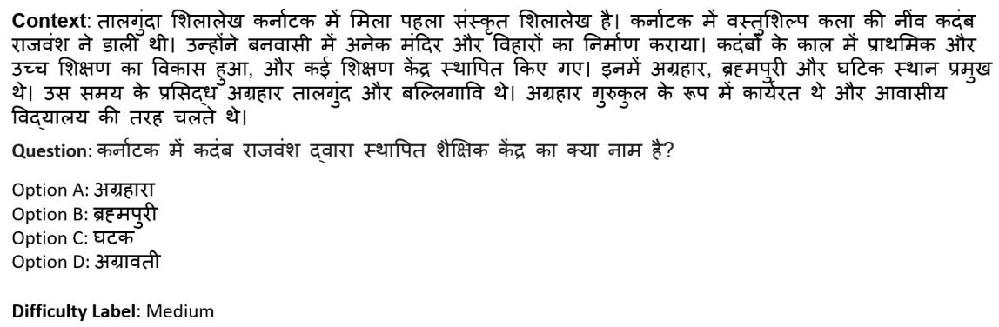
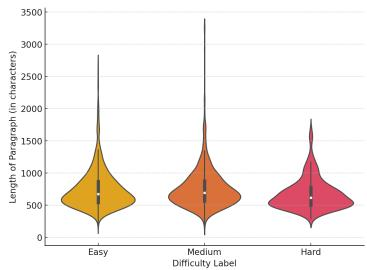
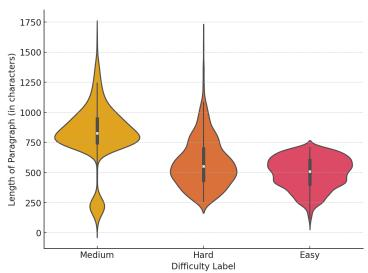
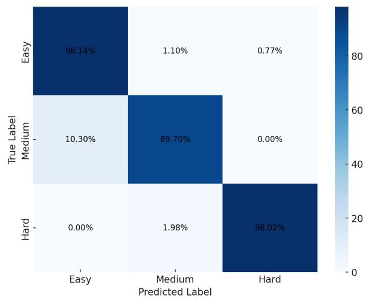
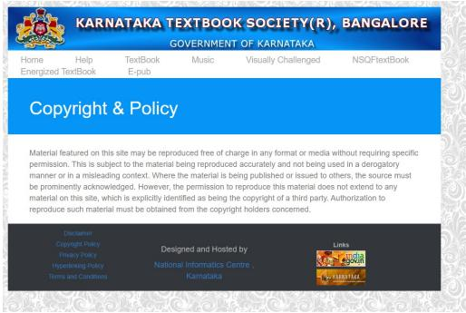
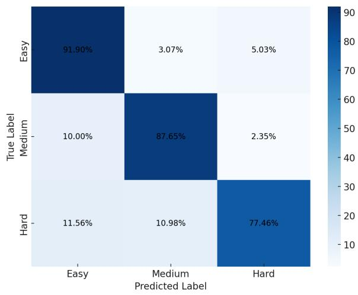

# TEEMIL : Towards Educational MCQ Difficulty Estimation in Indic Languages

Manikandan Ravikiran †\*, Siddharth Vohra‡, Rajat Verma†

Rohit Saluja†, Arnav Bhavsar †

† Indian Institute of Technology, Mandi, India

‡ Amazon, USA

erpd2301@students.iitmandi.ac.in

siddvoh@amazon.com

rohit@iitmandi.ac.in,arnav@iitmandi.ac.in

## Abstract

Difficulty estimation of multiple-choice questions (MCQs) is crucial for creating effective educational assessments, yet remains underexplored in Indic languages like Hindi and Kannada due to the lack of comprehensive datasets. This paper addresses this gap by introducing two datasets, TEEMIL-H and TEEMIL-K, containing 4689 and 4215 MCQs, respectively, with manually annotated difficulty labels. We benchmark these datasets using state-of-the-art multilingual models and conduct ablation studies to analyze the effect of context, the impact of options, and the presence of the None ofthe Above (NOTA) option on difficulty estimation. Our findings establish baselines for difficulty estimation in Hindi and Kannada, offering valuable insights into improving model performance and guiding future research in MCQ difficulty estimation .

## 1 Introduction

Difficulty estimation of multiple-choice questions (MCQs) is a growing field in educational technology and natural language processing (NLP), driven by the demand for personalized learning and datadriven methods to assess student understanding and customize educational content (Sajja et al., 2023). Traditionally, educators manually create and calibrate MCQs, a process that is time-consuming and subjective, leading to interest in automated methods for generating MCQs with varying difficulty levels (Kurdi et al., 2019). Most research in MCQ difficulty estimation focuses on language learning through lexico-semantics or end-to-end modeling. While these approaches show potential, they are often limited by the diversity of MCQ formats across subjects. Additionally, the majority of studies are centered on English-language datasets (Yaneva et al., 2024; Veeramani et al., 2024), leaving a significant gap in resources and methodologies for other languages.

For Indic languages like Hindi and Kannada, this gap is particularly pronounced due to the scarcity of MCQ datasets (Doddapaneni et al., 2022), which often lack the depth and alignment with curricular needs necessary for formal educational assessments (Yaneva et al., 2024). To address these challenges, we aim to (i) create MCQ datasets in Hindi and Kannada, (ii) develop specialized datasets for MCQ difficulty estimation in these languages, and (iii) establish evaluation benchmarks for difficulty estimation in Indic contexts. These efforts will help bridge gaps in Indic educational assessments and lay the foundation for future research in automated difficulty estimation across diverse linguistic backgrounds.

First, building on the work of Maity et al. (2024b), we created an educational MCQ dataset using high school textbooks in Hindi and Kannada, covering subjects such as history, sociology, geography, economics and physical education. The dataset includes 4215 MCQs in Kannada and 4689 MCQs in Hindi, complete with distractors and multiple-choice options, including None of the Above (NOTA).

Following this, each MCQ was annotated for difficulty levels similar to Liang et al. (2019), categorized as easy, medium, or hard, to ensure accuracy and consistency. Finally, we benchmarked state-ofthe-art language models, including mBERT (Devlin et al., 2019), XLM-R (Conneau et al., 2020), and IndicBERT (Kakwani et al., 2020), revealing that Kannada presents greater challenges than Hindi, establishing baselines for future studies on MCQ difficulty estimation. We also provide an analysis of the challenges encountered with these datasets to guide future research in Indic educational assessments. The dataset will be publicly released to encourage further studies in Indic languages 1. Overall our contributions can be summarized as follows:

  
Figure 1: Samples from TEEMIL-H dataset.

• We first create a dataset of MCQs in Hindi and Kannada from textbooks, covering a range of educational subjects.

• We develop TEEMIL-H and TEEMIL-K datasets with 4689 and 4215 MCQs for Hindi and Kannada respectively with annotated difficulty labels.

• We benchmark several state-of-the-art language models for difficulty estimation in Hindi and Kannada.

• We present ablation studies to identify various challenges in MCQ difficulty estimation for Hindi and Kannada.

The remainder of this paper is organized as follows: Section 2 reviews related work on MCQ datasets, generation techniques, and difficulty estimation methods. Section 3 details the construction and annotation of the dataset, followed by a comprehensive analysis in Section 4. Section 5 presents the experiments and results. Finally, Sections 6 and 7 conclude the paper with a discussion of limitations and implications for future research.

## 2 Related Work

In this section, we provide an overview of works related to existing MCQ datasets, automatic MCQ generation, and MCQ difficulty estimation, highlighting the key challenges and open issues in each area.

MCQ Datasets The development of multiplechoice question (MCQ) datasets has been crucial for advancing difficulty estimation. Early datasets like SQuAD (Rajpurkar et al., 2016), HotpotQA (Yang et al., 2018), and Natural Questions (Kwiatkowski et al., 2019) focused primarily on non-educational domains such as Wikipedia, offering valuable resources for question-answering tasks but lacking the specific educational context needed for pedagogical assessments. Similarly, datasets like NewsQA (Trischler et al., 2017), which focus on narrative content, are not tailored for educational purposes. Many of these datasets emphasize commonsense inference and complex question answering (Dhingra et al., 2017; Zellers et al., 2018; Yu et al., 2020; Sil et al., 2023). Educational datasets like RACE (Lai et al., 2017) and CLOTH (Xie et al., 2018) have been developed to assess reading comprehension in standardized tests, providing insights into question difficulty. However, these datasets are primarily limited to English, highlighting a significant gap for other languages. Datasets such as Crowdsourced MCQs (Welbl et al., 2017), LearningQ (Chen et al., 2018), ARC (Clark et al., 2018), Textbook MCQ (Li et al., 2018) and EduQG (Hadifar et al., 2022) are derived from online courses and textbooks but predominantly focus on English, underscoring the need for more diverse linguistic resources. Efforts to address these gaps with MCQ datasets in Indic languages include the XOR-QA (Asai et al., 2021), which includes Telugu as part of its cross-lingual evaluation and Belebele dataset (Bandarkar et al., 2023) which contains questions in Hindi and Kannada. Despite their value, these datasets are small, limited in scope, and lack annotations for difficulty estimation.

MCQ Generation Methods for generating multiple-choice questions (MCQs) have significantly evolved from early ontology-based (Papasalouros et al., 2008) and dependency-based (Afzal and Mitkov, 2013) approaches to advanced machine learning and transformer-based models. While these early methods were effective in controlled environments, they lacked adaptability across various subjects and contexts (Mitkov et al., 2006). The advent of neural networks and advanced transformer models (Correia et al., 2012; Vachev et al., 2022) has led to substantial improvements in generating contextually relevant and grammatically correct questions, especially when models are fine-tuned on domain-specific data (Jahangir et al., 2024). More recently, various methods have been explored, including integrating masked language models to enhance semantic understanding and syntactic accuracy (Matsumori et al., 2022), fine-tuning models like T5 on educational datasets (Wang et al., 2023), , employing hybrid methods (Kumar et al., 2023) that combine ontologies with machine learning for automatic MCQ generation, prompt-based methods (Kalpakchi and Boye, 2023; Kıyak and Kononowicz, 2024) and multi-step large language models (Maity et al., 2024a; Xiong et al., 2022). However, these methods have primarily been evaluated for English and lack adaptability for Indic languages.

MCQ Difficulty Estimation The task of predicting the difficulty of multiple-choice questions (MCQs) has evolved from traditional feature-based approaches (Freedle and Kostin, 1993; Perkins et al., 1995), which were less effective for domainspecific problems (Yasmine H. El Masri and Baird, 2017) due to their inability to adequately capture the complexities of varied content (Beinborn et al., 2014; Susanti et al., 2017), to neural network models that leverage advanced techniques from various fields (Huang et al., 2017; Hsu et al., 2018). The introduction of transformer models has further improved accuracy in difficulty prediction across multiple subjects, including programming, mathematics, and computer science (Zhou and Tao, 2020; Benedetto et al., 2020). Advancements in pretraining techniques have significantly enhanced difficulty estimation in math and computer science questions (Loginova et al., 2021), and large language models (LLMs) have also been employed to refine difficulty prediction for USMLE medical MCQs (Veeramani et al., 2024; Ram et al., 2024; Dueñas et al., 2024; Rogoz and Ionescu, 2024; Gombert et al., 2024). Beyond difficulty prediction, some models have been applied to generate questions at specific difficulty levels (He et al., 2021;

Liang et al., 2019). However, much of this research has focused on narrow domains and predominantly uses English as the language of study.

## 3 Dataset Construction

In this section, we describe the data construction process for the TEEMIL-K and TEEMIL-H datasets. The construction of these datasets was a collaborative effort that involved a team of two school instructors, two natural language processing experts, and four students from classes 8 to 11 (Appendix C).

## 3.1 Data Source

The primary challenge in developing educational applications for Indic languages is the scarcity of openly accessible resources. While global initiatives have promoted Open Educational Resources (OER), most efforts are focused on English, leaving Indic languages underserved. Moreover, many Indian textbooks are protected by strict copyright laws, restricting their use in educational technologies.

To address this, we first sourced textbooks for classes 6 to 12 from the Karnataka Text Book Society (KTBS)2. These textbooks, provided in epub format under a permissive license, were selected for their adaptability and suitability for integration into educational tools.

The EPUB files were converted into plain text (TXT) format to enable more efficient processing. Irrelevant content, such as prefaces and administrative details, was manually removed to retain only the core instructional material. For the Hindi and Kannada datasets, a total of 22 textbooks covering subjects like history, civics, geography, economics, and physical education were selected. However, due to formatting inconsistencies, the physical education textbooks for Hindi were excluded from further processing. From the remaining textbooks, approximately 15,000 paragraphs were extracted for both Kannada and Hindi. Subsequently, two subject-matter instructors curated around 5,000 key paragraphs per language for MCQ generation, adhering to the guidelines outlined in Appendix A.

## 3.2 MCQ Creation

Due to the lack of openly available educational MCQ datasets in Hindi and Kannada, and to address the inefficiencies of manual MCQ creation, we adapted an Automated MCQ Generation framework using Multistage Prompting (MSP) (Maity et al., 2024b). The original MSP framework involves four sequential stages: (a) paraphrasing, (b) key phrase identification, (c) question generation, and (d) distractor generation. However, MSP is resource-intensive, primarily because it requires separate prompts for each stage and relies on large models like GPT-4 (OpenAI, 2023). Besides, initial testing of MSP on Hindi and Kannada paragraphs showed that the paraphrasing stage offered minimal improvement in question diversity, and the distractor generation yielded similar results to simpler single-stage approaches.

To improve the efficiency of the process, we adapted the MSP framework by (i) removing the paraphrasing and distractor generation stages, (ii) merging key phrase identification and question generation into a single prompt, and (iii) replacing GPT-4 with the LLaMA-3-70B model (Touvron et al., 2023), which is pre-trained on 30 non-English languages, including Hindi and Kannada. The updated prompt instruction is: For the input paragraph <paragraph>, first identify the key phrases <keyphrase> and using them create five multiple-choice questions with answers in the original language. This simplified approach improves the efficiency of MCQ generation while maintaining relevance and accuracy. Using this adapted framework, each paragraph generated five MCQs, producing approximately 25,000 MCQs for both Hindi and Kannada.

<table><tr><td rowspan=1 colspan=1></td><td rowspan=1 colspan=1>TEEMIL-H</td><td rowspan=1 colspan=1>TEEMIL-K</td></tr><tr><td rowspan=1 colspan=1>MCQ&#x27;s</td><td rowspan=1 colspan=1>4689</td><td rowspan=1 colspan=1>4215</td></tr><tr><td rowspan=1 colspan=1>Number of NOTA</td><td rowspan=1 colspan=1>487</td><td rowspan=1 colspan=1>132</td></tr><tr><td rowspan=1 colspan=1>Avg. length of answersα</td><td rowspan=1 colspan=1>18</td><td rowspan=1 colspan=1>28</td></tr><tr><td rowspan=1 colspan=1>Avg length of questionsα</td><td rowspan=1 colspan=1>55</td><td rowspan=1 colspan=1>54</td></tr><tr><td rowspan=1 colspan=1>Avg length of paragraphsα</td><td rowspan=1 colspan=1>740</td><td rowspan=1 colspan=1>593</td></tr><tr><td rowspan=1 colspan=1>Rememberβ</td><td rowspan=1 colspan=1>2850</td><td rowspan=1 colspan=1>2706</td></tr><tr><td rowspan=1 colspan=1>Understandβ</td><td rowspan=1 colspan=1>1819</td><td rowspan=1 colspan=1>1463</td></tr><tr><td rowspan=1 colspan=1>Applyβ</td><td rowspan=1 colspan=1>11</td><td rowspan=1 colspan=1>38</td></tr><tr><td rowspan=1 colspan=1>Analysisβ</td><td rowspan=1 colspan=1>10</td><td rowspan=1 colspan=1>2</td></tr></table>

Table 1: Dataset statistics of TEEMIL-H and TEEMIL-K dataset. α: Number of characters, β: Bloom taxonomy statistics.

## 3.3 MCQ Annotation for Difficulty

The annotation process for our dataset was done in stages, each of which is described below:

MCQ Sampling: The two instructors were tasked with selecting one key MCQ per paragraph. The MCQs were chosen based on several criteria: grammatical clarity, answerability, diversity, complexity, and alignment with Bloom’s Taxonomy levels (Appendix B). This process resulted in 4689 MCQs for Hindi and 4215 MCQs for Kannada. Detailed statistics for this sampling are provided in Table 1. Also the final MCQ’s consists of all the selected subjects.

Annotator Training: The student annotators underwent comprehensive training sessions on how to annotate the MCQs through google sheet (Appendix C). Each student annotator was asked to solve the MCQs and rate the difficulty as easy, medium, or hard based on their inherent understanding. This method aimed to capture the natural perception of difficulty from a student’s perspective. This process continued until each MCQ was solved by at least two annotators.

Inter-Annotator Agreement (IAA): To evaluate the consistency of the annotations, an Inter-Annotator Agreement study was conducted, where each sample was annotated by two annotators. Cohen’s kappa (Fleiss and Cohen, 1973) was calculated for each language to measure the level of agreement between the annotators. The kappa score was 0.65 for Hindi and 0.69 for Kannada, indicating a substantial agreement between the annotators.

Final Annotation: After achieving satisfactory IAA scores, the NLP researchers proceeded with the final annotation of the dataset. If two annotators assigned the same label to an MCQ, that label was used. In cases of disagreement, a follow-up questionnaire (Appendix D) was discussed with the student annotators. The questionnaire included targeted queries to help determine the final difficulty annotation. Based on the responses, the NLP researchers assigned the final labels, resulting in the finalized TEEMIL-H and TEEMIL-K datasets. Example MCQ with difficulty labels are as shown in Figure 1.

## 4 Data Analysis

In this section, we analyze the properties of the TEEMIL-H and TEEMIL-K datasets. Since the estimation of difficulty depends on factors such as the options, distractors, and context, we present three types of analysis: question analysis, option-label analysis, and Bloom’s taxonomy analysis. Meanwhile, Table 2 compares TEEMIL with other educational MCQ datasets.

## 4.1 Question Analysis

We analyzed the distribution of question types in the TEEMIL-H and TEEMIL-K datasets, each consisting of multiple-choice questions (MCQs) generated using a large language model (LLM). The average question length is approximately 55 characters. To understand the relationship between question types and difficulty, we employed a heuristic method that categorized questions based on the presence of common interrogative words such as What, Who, How, When, Where, Which and Why. The resulting distribution is detailed in Appendix E.

Upon reviewing the distribution data, clear differences emerge between the TEEMIL-H and TEEMIL-K datasets. The TEEMIL-H dataset, which focuses on subjects like history, civics, geography, and economics, shows a predominance of certain question types. Specifically, the What (2078 instances), Which (1344 instances), and Who (678 instances) categories are heavily represented. This suggests that the Hindi curriculum leans toward questions that focus on factual recall, which may skew the overall difficulty distribution. Notably, there is a significant presence of How questions (348 instances), which are typically associated with more complex cognitive demands, but they are still fewer in number compared to the fact-based questions.

On the other hand, the TEEMIL-K dataset, which encompasses a broader curriculum that includes subjects like physical education along with history and civics, shows a different pattern. The What category is even more dominant here, with 3173 instances. However, the Which (330 instances) and Who (416 instances) categories are significantly less frequent than in TEEMIL-H, reflecting a different focus in question formulation. The How category, which could suggest more open-ended or higherorder thinking questions, is notably underrepresented in TEEMIL-K, with only 8 instances, indicating a potential focus on simpler or more direct questions. The Other category, with 188 instances, highlights the broader variety of questions present in the Kannada dataset.

These differences in question distribution point to variations in the cognitive demands of the two curricula. The TEEMIL-H dataset’s emphasis on fact-based questions (What, Which, and Who) likely skews the difficulty spectrum towards either easy or hard questions, with fewer medium-difficulty questions. In contrast, the TEEMIL-K dataset shows a broader mix of question types and, thus, a more balanced distribution of difficulty levels.

## 4.2 Option Analysis

Following the methodology of Rodriguez-Torrealba et al. (2022), we evaluated the quality of generated options using several automated metrics, including BLEU (1 to 4-grams) (Papineni et al., 2002), ROUGE-L (Lin, 2004), and cosine similarity (Buck and Koehn, 2016). For each sample, scores were calculated by comparing the correct answer with three generated distractor options. This evaluation was repeated for all the MCQ’s and the average scores for each language are shown in Table 3 . Subsequently, we analyzed the relationship between BLEU scores, question types, and their ground truth difficulty labels.

The BLEU scores across both languages revealed a consistent pattern, with TEEMIL-K MCQs achieving higher BLEU scores than TEEMIL-H MCQs. Specifically, TEEMIL-K BLEU-1 score was 0.44115, compared to 0.38785 for TEEMIL-H, and this trend persisted across all n-gram levels. This suggests that the distractors in TEEMIL-K are more lexically similar to the correct answers than those in Hindi. Moreover, TEEMIL-K also exhibited higher cosine similarity values (0.1467) compared to TEEMIL-H (0.11975), indicating a greater contextual similarity between distractors and correct answers in TEEMIL-K.

The granular analysis of BLEU scores across question types highlights clear trends in the relationship between distractor quality and question difficulty. Specifically, questions categorized as How consistently exhibit the lowest BLEU scores, averaging 0.389. This low similarity between distractors and correct answers suggests that these questions are inherently more challenging. Conversely, What, Who, and When questions, which are generally more fact-based, show moderate BLEU scores of around 0.41. This intermediate score corresponds to a more balanced distribution of difficulty labels, with these questions spanning easy, medium, and hard difficulty levels. This pattern suggests that the distractors for these questions are more moderately challenging and not drastically different from the correct answers, resulting in a more even spread of difficulty levels. Finally, the Other category of questions achieves the highest BLEU scores, averaging 0.43. The higher similarity between distractors and correct answers implies that these questions tend to be easier, as reflected by the assignment of a higher proportion of easy labels. The closer alignment between distractors and the correct options likely reduces the cognitive load required to eliminate incorrect answers, thus simplifying the overall difficulty of these questions.

<table><tr><td rowspan=1 colspan=1>Dataset</td><td rowspan=1 colspan=1>Size</td><td rowspan=1 colspan=1>Type</td><td rowspan=1 colspan=1>Data</td><td rowspan=1 colspan=1>Domain</td><td rowspan=1 colspan=1>DifficultyEstimation</td></tr><tr><td rowspan=1 colspan=1>LearningQ (Chen et al., 2018)</td><td rowspan=1 colspan=1>230K</td><td rowspan=1 colspan=1>E</td><td rowspan=1 colspan=1>document</td><td rowspan=1 colspan=1>Online courses</td><td rowspan=8 colspan=1>No</td></tr><tr><td rowspan=1 colspan=1>OpenBookQA (Banerjee et al., 2019)</td><td rowspan=1 colspan=1>6K</td><td rowspan=1 colspan=1>M</td><td rowspan=1 colspan=1>paragraph</td><td rowspan=1 colspan=1>textbook</td></tr><tr><td rowspan=1 colspan=1>TQA (Li et al., 2018)</td><td rowspan=1 colspan=1>26K</td><td rowspan=1 colspan=1>M</td><td rowspan=1 colspan=1>document</td><td rowspan=1 colspan=1>textbook</td></tr><tr><td rowspan=1 colspan=1>SciQ (Welbl et al., 2017)</td><td rowspan=1 colspan=1>13K</td><td rowspan=1 colspan=1>M</td><td rowspan=1 colspan=1>paragraph</td><td rowspan=1 colspan=1>textbook</td></tr><tr><td rowspan=1 colspan=1>ProcessBank (Berant et al., 2014)</td><td rowspan=1 colspan=1>0.5k</td><td rowspan=1 colspan=1>M</td><td rowspan=1 colspan=1>paragraph</td><td rowspan=1 colspan=1>textbook</td></tr><tr><td rowspan=1 colspan=1>EduQG (Hadifar et al., 2022)</td><td rowspan=1 colspan=1>3K</td><td rowspan=1 colspan=1>M</td><td rowspan=1 colspan=1>document</td><td rowspan=1 colspan=1>textbook</td></tr><tr><td rowspan=1 colspan=1>Social Questions (Scaria et al., 2024)</td><td rowspan=1 colspan=1>0.6K</td><td rowspan=1 colspan=1>E</td><td rowspan=1 colspan=1>document</td><td rowspan=1 colspan=1>textbook</td></tr><tr><td rowspan=1 colspan=1>Tukish QG (Çagatay Akyön et al., 2021)</td><td rowspan=1 colspan=1>4K</td><td rowspan=1 colspan=1>M</td><td rowspan=1 colspan=1>paragraph</td><td rowspan=1 colspan=1>textbook</td></tr><tr><td rowspan=1 colspan=1>MedicalMCQ (Yaneva et al., 2024)</td><td rowspan=1 colspan=1>0.9K</td><td rowspan=1 colspan=1>M</td><td rowspan=1 colspan=1>paragraph</td><td rowspan=1 colspan=1>Standardized tests</td><td rowspan=2 colspan=1>Yes</td></tr><tr><td rowspan=1 colspan=1>TEEMIL (Ours)</td><td rowspan=1 colspan=1>≈8K</td><td rowspan=1 colspan=1>M</td><td rowspan=1 colspan=1>paragraph</td><td rowspan=1 colspan=1>textbook</td></tr></table>

Table 2: Qualitative comparison of educational MCQ datasets for difficulty estimation. E: Extractive questions, M: Multiple-choice questions.

<table><tr><td rowspan=1 colspan=1>Dataset</td><td rowspan=1 colspan=1>BLEU-1</td><td rowspan=1 colspan=1>BLEU-2</td><td rowspan=1 colspan=1>BLEU-3</td><td rowspan=1 colspan=1>BLEU-4</td><td rowspan=1 colspan=1>ROUGE-L</td><td rowspan=1 colspan=1>CS</td></tr><tr><td rowspan=1 colspan=1>TEEMIL-H</td><td rowspan=1 colspan=1>38.78</td><td rowspan=1 colspan=1>27.49</td><td rowspan=1 colspan=1>22.54</td><td rowspan=1 colspan=1>19.11</td><td rowspan=1 colspan=1>18.61</td><td rowspan=1 colspan=1>11.97</td></tr><tr><td rowspan=1 colspan=1>TEEMIL-K</td><td rowspan=1 colspan=1>44.11</td><td rowspan=1 colspan=1>31.68</td><td rowspan=1 colspan=1>26.00</td><td rowspan=1 colspan=1>22.25</td><td rowspan=1 colspan=1>14.94</td><td rowspan=1 colspan=1>14.67</td></tr></table>

Table 3: Evaluation of distractor quality in the provided options. All values are reported as percentages.

## 4.3 Bloom Taxonomy Analysis

Bloom’s Taxonomy, which classifies cognitive skills from basic recall to complex analysis, offers a useful framework for estimating MCQ difficulty. Assigning Bloom’s levels to each question helps establish a link between cognitive demand and difficulty. In our dataset, approximately 60% of the questions fall under the Remember category of Bloom’s Taxonomy (see Table 1), with the remaining questions distributed across higher cognitive levels. This distribution is consistent with findings in educational research, which suggest that around 70% of classroom questions target lower cognitive skills, such as recall, while the remaining focus on higher-order thinking skills, including application and analysis (Tofade et al., 2013). Structuring the dataset to align with these cognitive levels increases its efficacy in training models to predict MCQ difficulty. This also ensures that models are exposed to a diverse range of cognitive challenges, accurately representing the spectrum of question difficulty typically found in educational settings.

## 5 Experiments

In this section, we detail the different models, describe their experimental configurations, and

present the results obtained for the TEEMIL-H and TEEMIL-K datasets, respectively.

## 5.1 Models and Experimental setup

In this study, we formalize difficulty estimation as a classification task and use the architecture proposed by Raina and Gales (2022) for MCQ complexity prediction. For our experiments we employ a transformer-based architecture with models such as mBERT, XLM-R, and IndicBERT, each optimized for processing Indic languages.

The input format for each multiple-choice question (MCQ) follows the structure: [CLS] Context [SEP] Question [SEP] Option A [SEP] Option B [SEP] Option C [SEP] Option D, where the context precedes the question and its four answer options, each delimited by the [SEP] token. This sequence is fed into the transformer encoder to produce contextualized representations, which are subsequently processed by a classification head. The classification head outputs a probability distribution over the difficulty levels (i.e., easy, medium, hard). During inference, the model assigns the difficulty label corresponding to the option with the highest predicted probability.

All models are fine-tuned on their pretrained weights, following the experimental protocol outlined in Appendix F. The dataset is split into training and testing sets in an 80:20 ratio. Post-training, each model is evaluated using standard performance metrics Precision (P), Recall (R), and F1- Score (F1) to assess its accuracy in predicting difficulty levels.

## 5.2 Results and Analysis

In this section, we establish baseline results for difficulty estimation by investigating key factors such as input context , options and presence of NOTA.

Baseline Results: The evaluation of multiple transformer-based models mBERT, XLM-R, and IndicBERT on the TEEMIL-K (Kannada) and TEEMIL-H (Hindi) datasets offers valuable insights into their effectiveness in difficulty estimation (Table 4). Among the models, XLM-R demonstrates superior performance, achieving the highest F1-scores of 0.9681 for Hindi and 0.8987 for TEEMIL-K, highlighting its robustness in handling diverse linguistic structures. While mBERT performs well, particularly on Hindi (F1: 0.9247), it lags behind XLM-R in TEEMIL-K. IndicBERT, on the other hand, shows lower performance, with F1-scores of 0.6887 for TEEMIL-K and 0.5415 for TEEMIL-H, indicating limitations in its handling of these tasks.

<table><tr><td rowspan=1 colspan=1></td><td rowspan=1 colspan=3>TEEMIL-H</td><td rowspan=1 colspan=3>TEEMIL-K</td></tr><tr><td rowspan=1 colspan=1></td><td rowspan=1 colspan=1>P</td><td rowspan=1 colspan=1>R</td><td rowspan=1 colspan=1>F1</td><td rowspan=1 colspan=1>P</td><td rowspan=1 colspan=1>R</td><td rowspan=1 colspan=1>F1</td></tr><tr><td rowspan=1 colspan=1>mBERT</td><td rowspan=1 colspan=1>0.9555</td><td rowspan=1 colspan=1>0.9045</td><td rowspan=1 colspan=1>0.9247</td><td rowspan=1 colspan=1>0.8757</td><td rowspan=1 colspan=1>0.8644</td><td rowspan=1 colspan=1>0.8597</td></tr><tr><td rowspan=1 colspan=1>XLM-R</td><td rowspan=1 colspan=1>0.9814</td><td rowspan=1 colspan=1>0.9457</td><td rowspan=1 colspan=1>0.9681</td><td rowspan=1 colspan=1>0.8965</td><td rowspan=1 colspan=1>0.9010</td><td rowspan=1 colspan=1>0.8987</td></tr><tr><td rowspan=1 colspan=1>IndicBERT</td><td rowspan=1 colspan=1>0.4873</td><td rowspan=1 colspan=1>0.6528</td><td rowspan=1 colspan=1>0.5415</td><td rowspan=1 colspan=1>0.7015</td><td rowspan=1 colspan=1>0.7193</td><td rowspan=1 colspan=1>0.6887</td></tr></table>

Table 4: Results of difficulty estimation using transformer models.

Further analysis, using BLEU scores (see Table 3), reveals that TEEMIL-K produces consistently higher BLEU-1 scores compared to TEEMIL-H, with values of 44.115 for TEEMIL-K and 38.785 for TEEMIL-H. The higher BLEU scores for TEEMIL-K indicate greater lexical similarity between distractors and correct answers, likely making it harder for models to differentiate difficulty levels. This is further supported by higher ROUGE-L and cosine similarity scores for TEEMIL-K, suggesting stronger contextual alignment between distractors and correct answers. Consequently, XLM-R and mBERT exhibit stronger performance on TEEMIL-K, likely due to their ability to handle the subtle difficulty levels associated with more closely related distractors.

An in-depth examination of the confusion matrices for XLM-R (see Appendix H) provides additional insights. For TEEMIL-H, errors are more concentrated, suggesting greater stability across difficulty levels, with most misclassifications occurring between medium and other two categories. For TEEMIL-K, the errors are more dispersed, implying challenges in consistently classifying difficulty levels. The models struggle to distinguish between easy, medium, and hard categories, particularly in medium and hard questions. The difficulty in differentiating these categories may stem from subtle and context-dependent factors, such as the presence of strong distractors or ambiguities in the labeling process, influenced by factors like student variability and cognitive abilities. Lastly we can see IndicBERT to underperform significantly, we think this has to do with the pretraining data and model simplicity of IndicBERT, however more experiments are needed in this regard.

Effect of Options: To assess the impact of options on difficulty estimation, we trained the transformer models using only the [CLS] Context [SEP] Question [SEP] input format, excluding the options and distractors. The results, presented in Table 5, demonstrate that the inclusion of options significantly influences model performance. When options are present, the models gain additional contextual clues from the distractors. However, when the distractors are too similar to the correct answer, as indicated by higher BLEU scores, model performance declines due to the increased difficulty of distinguishing between the correct answer and the distractors. On the other hand, when options are excluded, the task becomes simpler, leading to improved model performance, particularly in cases where the distractors closely resemble the correct answer. These findings suggest that while options enhance the context for the model, their distinctiveness and quality play a crucial role in determining overall model accuracy in difficulty estimation tasks.

<table><tr><td rowspan=1 colspan=1></td><td rowspan=1 colspan=3>TEEMIL-H</td><td rowspan=1 colspan=3>TEEMIL-K</td></tr><tr><td rowspan=1 colspan=1></td><td rowspan=1 colspan=1>P</td><td rowspan=1 colspan=1>R</td><td rowspan=1 colspan=1>F1</td><td rowspan=1 colspan=1>P</td><td rowspan=1 colspan=1>R</td><td rowspan=1 colspan=1>F1</td></tr><tr><td rowspan=1 colspan=1>mBERT</td><td rowspan=1 colspan=1>0.9422</td><td rowspan=1 colspan=1>0.9457</td><td rowspan=1 colspan=1>0.943</td><td rowspan=1 colspan=1>0.8885</td><td rowspan=1 colspan=1>0.8903</td><td rowspan=1 colspan=1>0.8894</td></tr><tr><td rowspan=1 colspan=1>XLM-R</td><td rowspan=1 colspan=1>0.9798</td><td rowspan=1 colspan=1>0.9611</td><td rowspan=1 colspan=1>0.9698</td><td rowspan=1 colspan=1>0.9071</td><td rowspan=1 colspan=1>0.9086</td><td rowspan=1 colspan=1>0.9077</td></tr><tr><td rowspan=1 colspan=1>IndicBERT</td><td rowspan=1 colspan=1>0.7086</td><td rowspan=1 colspan=1>0.7571</td><td rowspan=1 colspan=1>0.7192</td><td rowspan=1 colspan=1>0.8118</td><td rowspan=1 colspan=1>0.8112</td><td rowspan=1 colspan=1>0.8855</td></tr></table>

Table 5: Results of difficulty estimation using transformer models with the exclusion of options from the input.

Effect of Context: In our earlier results (Table 4), we reported a high F1 score when the model was provided with the context (paragraph), MCQ, and options. Interestingly, we observed that the F1 score increased further upon the removal of the options. This prompted a deeper investigation into the role of context in difficulty estimation.

To isolate the effect of context, we conducted an ablation study by removing the paragraph (context) and using only the MCQ and options as inputs. The results of this experiment, summarized in Table 6, show an improvement in the model’s performance for TEEMIL-H, surpassing both the original baseline and the variant without options. Meanwhile for TEEMIL-K, there is a drop in the results.

This unexpected improvement for TEEMIL-H may be attributed to two factors: (a) The model processes all inputs simultaneously, rather than evaluating each element (context, MCQ, and options) separately for its contribution to the difficulty. As a result, it may rely on simpler patterns in the question phrasing instead of fully leveraging the contextual information (McCoy et al., 2019). Removing the context simplifies the task, allowing the model to perform better by focusing on more straightforward elements. (b) The annotators (students), being non-native speakers, may have mentally translated or interpreted the questions into their native language when assigning difficulty labels. Although the model does not receive these translations directly, the annotators’ simplified understanding of the questions could have influenced the labels (Pavlick and Kwiatkowski, 2019). This inherently leads to proxy patterns, which are more easily picked up by the model, as these patterns are simpler and align with the annotators’ interpretation rather than the full linguistic and contextual complexity. As a result, performance scores improve and lead to skewed difficulty estimations.

<table><tr><td rowspan=2 colspan=1></td><td rowspan=1 colspan=3>TEEMIL-H</td><td rowspan=1 colspan=3>TEEMIL-K</td></tr><tr><td rowspan=1 colspan=1>P</td><td rowspan=1 colspan=1>R</td><td rowspan=1 colspan=1>F1</td><td rowspan=1 colspan=1>P</td><td rowspan=1 colspan=1>R</td><td rowspan=1 colspan=1>F1</td></tr><tr><td rowspan=1 colspan=1>mBERT</td><td rowspan=1 colspan=1>0.9742</td><td rowspan=1 colspan=1>0.9852</td><td rowspan=1 colspan=1>0.9787</td><td rowspan=1 colspan=1>0.6086</td><td rowspan=1 colspan=1>0.6258</td><td rowspan=1 colspan=1>0.5741</td></tr><tr><td rowspan=1 colspan=1>XLM-R</td><td rowspan=1 colspan=1>0.9825</td><td rowspan=1 colspan=1>0.9864</td><td rowspan=1 colspan=1>0.9843</td><td rowspan=1 colspan=1>0.7122</td><td rowspan=1 colspan=1>0.6135</td><td rowspan=1 colspan=1>0.5483</td></tr><tr><td rowspan=1 colspan=1>IndicBERT</td><td rowspan=1 colspan=1>0.9329</td><td rowspan=1 colspan=1>0.8874</td><td rowspan=1 colspan=1>0.9060</td><td rowspan=1 colspan=1>0.4679</td><td rowspan=1 colspan=1>0.5874</td><td rowspan=1 colspan=1>0.5186</td></tr></table>

Table 6: Results of difficulty estimation using transformer models with the exclusion of context from the input.

Effect of NOTA: To assess the generalization capacity of the models, we adopt the approach outlined by Wang et al. (2024), introducing None ofthe Above (NOTA) as an answer option in the test sets for both TEEMIL-H and TEEMIL-K, while keeping the training set unchanged. This adjustment compels the models to identify patterns to determine whether all given options are incorrect. The results, presented in Table 7, indicate a slight decline in performance across both datasets with the introduction of NOTA. For example, in TEEMIL-K, the F1-score for XLM-R decreases from 0.8987 (without NOTA) to 0.859 (with NOTA), with a similar trend observed in TEEMIL-H. We hypothesize that the inclusion of NOTA introduces ambiguity, thereby increasing the complexity of the task. For easier questions, an incorrect selection of NOTA may lead to an overestimation of difficulty, while for more challenging questions, the presence of strong distractors may cause the model to incorrectly select NOTA. These results suggest that the addition of NOTA poses additional challenges for difficulty estimation, complicating the models’ ability to accurately classify question difficulty.

<table><tr><td rowspan=1 colspan=1></td><td rowspan=1 colspan=3>TEEMIL-H</td><td rowspan=1 colspan=3>TEEMIL-K</td></tr><tr><td rowspan=1 colspan=1></td><td rowspan=1 colspan=1>P</td><td rowspan=1 colspan=1>R</td><td rowspan=1 colspan=1>F1</td><td rowspan=1 colspan=1>P</td><td rowspan=1 colspan=1>R</td><td rowspan=1 colspan=1>F1</td></tr><tr><td rowspan=1 colspan=1>mBERT</td><td rowspan=1 colspan=1>0.9315</td><td rowspan=1 colspan=1>0.9366</td><td rowspan=1 colspan=1>0.9330</td><td rowspan=1 colspan=1>0.8630</td><td rowspan=1 colspan=1>0.8279</td><td rowspan=1 colspan=1>0.8388</td></tr><tr><td rowspan=1 colspan=1>XLM-R</td><td rowspan=1 colspan=1>0.9316</td><td rowspan=1 colspan=1>0.9406</td><td rowspan=1 colspan=1>0.9359</td><td rowspan=1 colspan=1>0.8634</td><td rowspan=1 colspan=1>0.8566</td><td rowspan=1 colspan=1>0.8590</td></tr><tr><td rowspan=1 colspan=1>IndicBERT</td><td rowspan=1 colspan=1>0.5312</td><td rowspan=1 colspan=1>0.4932</td><td rowspan=1 colspan=1>0.4903</td><td rowspan=1 colspan=1>0.5895</td><td rowspan=1 colspan=1>0.5813</td><td rowspan=1 colspan=1>0.5725</td></tr></table>

Table 7: Results of difficulty estimation with the substitution of None ofthe Above (NOTA) in the options.

## 6 Conclusion

In this work, we introduce the task of multiplechoice question (MCQ) difficulty estimation for Indic languages, focusing on Kannada and Hindi, through the development of two comprehensive datasets: TEEMIL-K and TEEMIL-H. Each dataset contains over 4,000 manually annotated MCQs, designed to support benchmarking in this domain. We evaluate state-of-the-art transformer models, including mBERT, XLM-R, and IndicBERT, to establish baselines for difficulty estimation. Our experiments reveal that XLM-R consistently outperforms the other models on both datasets, setting new benchmarks, while IndicBERT demonstrates significant limitations in handling linguistic diversity across these languages.

Our study also highlights the effects of options and context on the performance of difficulty estimation, revealing several side effects. Additionally, we assess the impact of introducing the None of the Above (NOTA) option during testing, which adds complexity and results in a noticeable decline in model performance. This underscores the challenge of estimating question difficulty when ambiguous options like NOTA are present.

Overall, we believe the TEEMIL datasets, along with the benchmarks established in this work, will be valuable resources for future research, contributing to the development of automated educational tools tailored to Indic languages.

## 7 Limitation

This research has several limitations that leave room for further exploration. First, the study was restricted to two Indic languages, Kannada and Hindi, due to the lack of open corpora and the high cost of annotation for other low-resource languages, limiting the broader applicability of the findings. Second, the dataset used was focused only on subjects history, civics, geography, economics, and physical education resulting in limited coverage. Third, the difficulty estimation relied on only three transformer models (mBERT, XLM-R, and IndicBERT), without considering the performance of smaller or simpler models, which may have provided additional insights. Finally, the introduction of the None ofthe Above (NOTA) option in MCQs posed a significant challenge. Although NOTA adds complexity to difficulty estimation, its impact was not explored in depth. Addressing how models handle the ambiguity introduced by NOTA is crucial for accurately estimating question difficulty and remains an open area for future research.

## Ethics Statement

The data collection process for this study did not involve direct interaction with human participants that would require formal ethics board approval. The datasets utilized are publicly available and licensed for redistribution (See Appendix I). Annotations for difficulty levels were provided by students. We paid participants at a rate that was above both the living wage in our jurisdiction and Prolific’s current recommendation of at least 9.00 GBP/12.00 USD (Shmueli et al., 2021). By involving students in the annotation process, we ensured that the dataset reflects authentic insights into the perceived difficulty of questions, aligning more closely with real-world educational contexts.

We believe that the NLP systems developed from these datasets have the potential to greatly enhance educational assessment tools, fostering more effective and inclusive learning environments. When applied appropriately, these models and datasets can help deliver personalized and equitable educational experiences, improving student learning outcomes across diverse backgrounds.

However, we acknowledge potential biases in both the datasets and the models. While the datasets are constrained to specific languages and subjects, we have included educational content spanning classes 6 to 12 to mitigate bias toward any particular group of students. Moving forward, we aim to expand the scope of the data to include more languages and educational domains, ensuring greater inclusivity and fairness in the development of educational NLP systems.

## Acknowledgments

We thank all the reviwers for their insightful comments and suggestions. We would like to acknowledge the Karnataka Textbook Society (KTBS) for providing access to educational materials used in this research. The content utilized in this study has been reproduced in accordance with the copyright policy of KTBS, which permits free reproduction of materials in any format, provided they are accurately reproduced, not used in a misleading or derogatory manner, and appropriately cited. We confirm that all third-party materials, where applicable, have been excluded or properly sourced as per the guidelines.

## References

Naveed Afzal and Ruslan Mitkov. 2013. Automatic generation of multiple choice questions using dependency-based semantic relations. Soft Computing, 18:1269 – 1281.

Akari Asai, Jungo Kasai, Jonathan Clark, Kenton Lee, Eunsol Choi, and Hannaneh Hajishirzi. 2021. XOR QA: Cross-lingual open-retrieval question answering. In Proceedings ofthe 2021 Conference ofthe North American Chapter of the Association for Computational Linguistics: Human Language Technologies, pages 547–564, Online. Association for Computational Linguistics.

Lucas Bandarkar, Davis Liang, Benjamin Muller, Mikel Artetxe, Satya Narayan Shukla, Don Husa, Naman Goyal, Abhinandan Krishnan, Luke Zettlemoyer, and Madian Khabsa. 2023. The belebele benchmark: a parallel reading comprehension dataset in 122 language variants. In Annual Meeting of the Association for Computational Linguistics.

Pratyay Banerjee, Kuntal Kumar Pal, Arindam Mitra, and Chitta Baral. 2019. Careful selection of knowledge to solve open book question answering. In Proceedings ofthe 57th Annual Meeting ofthe Associationfor Computational Linguistics, pages 6120– 6129, Florence, Italy. Association for Computational Linguistics.

Lisa Beinborn, Torsten Zesch, and Iryna Gurevych. 2014. Predicting the difficulty of language proficiency tests. Transactions of the Association for Computational Linguistics, 2:517–530.

Luca Benedetto, Andrea Cappelli, Roberto Turrin, and Paolo Cremonesi. 2020. Introducing a framework to assess newly created questions with natural language processing. Artificial Intelligence in Education, 12163:43 – 54.

Jonathan Berant, Vivek Srikumar, Pei-Chun Chen, Abby Vander Linden, Brittany Harding, Brad Huang, Peter

Clark, and Christopher D. Manning. 2014. Modeling biological processes for reading comprehension. In Proceedings of the 2014 Conference on Empirical Methods in Natural Language Processing (EMNLP), pages 1499–1510, Doha, Qatar. Association for Computational Linguistics.

Christian Buck and Philipp Koehn. 2016. Quick and reliable document alignment via tf/idf-weighted cosine distance. In Conference on Machine Translation.

Guanliang Chen, Jie Yang, Claudia Hauff, and Geert-Jan Houben. 2018. Learningq: A large-scale dataset for educational question generation. In International Conference on Web and Social Media.

Peter Clark, Isaac Cowhey, Oren Etzioni, Tushar Khot, Ashish Sabharwal, Carissa Schoenick, and Oyvind Tafjord. 2018. Think you have solved question answering? try arc, the ai2 reasoning challenge. ArXiv, abs/1803.05457.

Alexis Conneau, Kartikay Khandelwal, Naman Goyal, Vishrav Chaudhary, Guillaume Wenzek, Francisco Guzmán, Edouard Grave, Myle Ott, Luke Zettlemoyer, and Veselin Stoyanov. 2020. Unsupervised cross-lingual representation learning at scale. In Proceedings of the 58th Annual Meeting of the Association for Computational Linguistics, pages 8440– 8451, Online. Association for Computational Linguistics.

Rui Correia, Jorge Baptista, Maxine Eskenazi, and Nuno Mamede. 2012. Automatic generation of cloze question stems. In Computational Processing of the Portuguese Language, pages 168–178, Berlin, Heidelberg. Springer Berlin Heidelberg.

Jacob Devlin, Ming-Wei Chang, Kenton Lee, and Kristina Toutanova. 2019. Bert: Pre-training of deep bidirectional transformers for language understanding. In North American Chapter of the Association for Computational Linguistics.

Bhuwan Dhingra, Kathryn Mazaitis, and William W. Cohen. 2017. Quasar: Datasets for question answering by search and reading. ArXiv, abs/1707.03904.

Sumanth Doddapaneni, Rahul Aralikatte, Gowtham Ramesh, Shreyansh Goyal, Mitesh M. Khapra, Anoop Kunchukuttan, and Pratyush Kumar. 2022. Towards leaving no indic language behind: Building monolingual corpora, benchmark and models for indic languages. In Annual Meeting ofthe Association for Computational Linguistics.

George Dueñas, Sergio Jimenez, and Geral Mateus Ferro. 2024. Upn-icc at bea 2024 shared task: Leveraging llms for multiple-choice questions difficulty prediction. In Workshop on Innovative Use ofNLP for Building Educational Applications.

Joseph L. Fleiss and Jacob Cohen. 1973. The equivalence of weighted kappa and the intraclass correlation coefficient as measures of reliability. Educational and Psychological Measurement, 33:613 – 619.

Roy O. Freedle and Irene Kostin. 1993. The prediction of toefl reading comprehension item difficulty for expository prose passages for three item types: Main idea, inference, and supporting idea items. ETS Research Report Series, 1993.

Sebastian Gombert, Lukas Menzel, Daniele Di Mitri, and Hendrik Drachsler. 2024. Predicting item difficulty and item response time with scalar-mixed transformer encoder models and rational network regression heads. In Workshop on Innovative Use ofNLP for Building Educational Applications.

Amir Hadifar, Semere Kiros Bitew, Johannes Deleu, Chris Develder, and Thomas Demeester. 2022. Eduqg: A multi-format multiple-choice dataset for the educational domain. IEEE Access, 11:20885– 20896.

Jun He, Li Peng, Bo Sun, Lejun Yu, and Yinghui Zhang. 2021. Automatically predict question difficulty for reading comprehension exercises. 2021 IEEE 33rd International Conference on Tools with Artificial Intelligence (ICTAI), pages 1398–1402.

Fu-Yuan Hsu, Hahn-Ming Lee, Tao-Hsing Chang, and Yao-Ting Sung. 2018. Automated estimation of item difficulty for multiple-choice tests: An application of word embedding techniques. Inf. Process. Manag., 54:969–984.

Zhenya Huang, Qi Liu, Enhong Chen, Hongke Zhao, Mingyong Gao, Si Wei, Yu Su, and Guoping Hu. 2017. Question difficulty prediction for reading problems in standard tests. In AAAI Conference on Artificial Intelligence.

Khushnur Jahangir, Philippe Muller, and Chloé Braud. 2024. Complex question generation using discoursebased data augmentation. In CODI.

Divyanshu Kakwani, Anoop Kunchukuttan, Satish Golla, Gokul N.C., Avik Bhattacharyya, Mitesh M. Khapra, and Pratyush Kumar. 2020. IndicNLPSuite: Monolingual corpora, evaluation benchmarks and pre-trained multilingual language models for Indian languages. In Findings of the Association for Computational Linguistics: EMNLP 2020, pages 4948– 4961, Online. Association for Computational Linguistics.

Dmytro Kalpakchi and Johan Boye. 2023. Quasi: a synthetic question-answering dataset in swedish using gpt-3 and zero-shot learning. In Nordic Conference ofComputational Linguistics.

Archana Praveen Kumar, Ashalatha Nayak, Manjula Shenoy K, Chaitanya, and Kaustav Ghosh. 2023. A novel framework for the generation of multiple choice question stems using semantic and machinelearning techniques. International Journal ofArtificial Intelligence in Education, pages 1–44.

Ghader Kurdi, Jared Leo, Bijan Parsia, Uli Sattler, and Salam Al-Emari. 2019. A systematic review of automatic question generation for educational purposes.

International Journal ofArtificial Intelligence in Education, 30:121–204.

Tom Kwiatkowski, Jennimaria Palomaki, Olivia Redfield, Michael Collins, Ankur Parikh, Chris Alberti, Danielle Epstein, Illia Polosukhin, Jacob Devlin, Kenton Lee, Kristina Toutanova, Llion Jones, Matthew Kelcey, Ming-Wei Chang, Andrew M. Dai, Jakob Uszkoreit, Quoc Le, and Slav Petrov. 2019. Natural questions: A benchmark for question answering research. Transactions ofthe Associationfor Computational Linguistics, 7:452–466.

Yavuz Selim Kıyak and Andrzej A. Kononowicz. 2024. Case-based mcq generator: A custom chatgpt based on published prompts in the literature for automatic item generation. Medical teacher, pages 1–3.

Guokun Lai, Qizhe Xie, Hanxiao Liu, Yiming Yang, and Eduard Hovy. 2017. RACE: Large-scale ReAding comprehension dataset from examinations. In Proceedings of the 2017 Conference on Empirical Methods in Natural Language Processing, pages 785– 794, Copenhagen, Denmark. Association for Computational Linguistics.

Juzheng Li, Hang Su, Jun Zhu, Siyu Wang, and Bo Zhang. 2018. Textbook question answering under instructor guidance with memory networks. 2018 IEEE/CVF Conference on Computer Vision and Pattern Recognition, pages 3655–3663.

Yichan Liang, Jianheng Li, and Jian Yin. 2019. A new multi-choice reading comprehension dataset for curriculum learning. In Proceedings of The Eleventh Asian Conference on Machine Learning, volume 101 of Proceedings ofMachine Learning Research, pages 742–757. PMLR.

Chin-Yew Lin. 2004. Rouge: A package for automatic evaluation of summaries. In Annual Meeting ofthe Associationfor Computational Linguistics.

Ekaterina Loginova, Luca Benedetto, Dries F. Benoit, and Paolo Cremonesi. 2021. Towards the application of calibrated transformers to the unsupervised estimation of question difficulty from text. In Recent Advances in Natural Language Processing.

Subhankar Maity, Aniket Deroy, and Sudeshna Sarkar. 2024a. Exploring the capabilities of prompted large language models in educational and assessment applications. ArXiv, abs/2405.11579.

Subhankar Maity, Aniket Deroy, and Sudeshna Sarkar. 2024b. A novel multi-stage prompting approach for language agnostic mcq generation using gpt. In European Conference on Information Retrieval.

Shoya Matsumori, Kohei Okuoka, Ryoichi Shibata, Minami Inoue, Yosuke Fukuchi, and Michita Imai. 2022. Mask and cloze: Automatic open cloze question generation using a masked language model. IEEE Access, 11:9835–9850.

Tom McCoy, Ellie Pavlick, and Tal Linzen. 2019. Right for the wrong reasons: Diagnosing syntactic heuristics in natural language inference. In Proceedings of the 57th Annual Meeting of the Association for Computational Linguistics, pages 3428–3448, Florence, Italy. Association for Computational Linguistics.

Ruslan Mitkov, Le An Ha, and Nikiforos Karamanis. 2006. A computer-aided environment for generating multiple-choice test items. Natural Language Engineering, 12:177 – 194.

OpenAI. 2023. Gpt-4 technical report. ArXiv, abs/2303.08774.

Andreas Papasalouros, Konstantinos Kanaris, and Konstantinos I. Kotis. 2008. Automatic generation of multiple choice questions from domain ontologies. In e-Learning.

Kishore Papineni, Salim Roukos, Todd Ward, and Wei-Jing Zhu. 2002. Bleu: a method for automatic evaluation of machine translation. In Annual Meeting of the Associationfor Computational Linguistics.

Ellie Pavlick and Tom Kwiatkowski. 2019. Inherent disagreements in human textual inferences. Transactions ofthe Associationfor Computational Linguistics, 7:677–694.

Kyle Perkins, Lalit Gupta, and Ravi Tammana. 1995. Predicting item difficulty in a reading comprehension test with an artificial neural network. Language Testing, 12:34 – 53.

Vatsal Raina and Mark John Francis Gales. 2022. Multiple-choice question generation: Towards an automated assessment framework. ArXiv, abs/2209.11830.

Pranav Rajpurkar, Jian Zhang, Konstantin Lopyrev, and Percy Liang. 2016. Squad: 100,000+ questions for machine comprehension of text. In Conference on Empirical Methods in Natural Language Processing.

Gummuluri Venkata Ravi Ram, Ashinee Kesanam, and Anand Kumar M. 2024. Leveraging physical and semantic features of text item for difficulty and response time prediction of usmle questions. In Workshop on Innovative Use of NLP for Building Educational Applications.

Ricardo Rodriguez-Torrealba, Eva Garcia-Lopez, and Antonio Garcia-Cabot. 2022. End-to-end generation of multiple-choice questions using text-to-text transfer transformer models. Expert Syst. Appl., 208:118258.

Ana-Cristina Rogoz and Radu Tudor Ionescu. 2024. Unibucllm: Harnessing llms for automated prediction of item difficulty and response time for multiplechoice questions. ArXiv, abs/2404.13343.

Ramteja Sajja, Yusuf Sermet, David Cwiertny, and Ibrahim Demir. 2023. Integrating ai and learning analytics for data-driven pedagogical decisions

and personalized interventions in education. ArXiv, abs/2312.09548.

Nicy Scaria, Suma Dharani Chenna, and Deepak N. Subramani. 2024. How good are modern llms in generating relevant and high-quality questions at different bloom’s skill levels for indian high school social science curriculum? In Workshop on Innovative Use of NLPfor Building Educational Applications.

Boaz Shmueli, Jan Fell, Soumya Ray, and Lun-Wei Ku. 2021. Beyond fair pay: Ethical implications of NLP crowdsourcing. In Proceedings ofthe 2021 Conference of the North American Chapter of the Associationfor Computational Linguistics: Human Language Technologies, pages 3758–3769, Online. Association for Computational Linguistics.

Avirup Sil, Jaydeep Sen, Bhavani Iyer, Martin Franz, Kshitij P. Fadnis, Mihaela A. Bornea, Sara Rosenthal, Scott McCarley, Rong Zhang, Vishwajeet Kumar, Yulong Li, Md Arafat Sultan, Riyaz Ahmad Bhat, Radu Florian, and Salim Roukos. 2023. Primeqa: The prime repository for state-of-the-art multilingual question answering research and development. ArXiv, abs/2301.09715.

Yunik Susanti, Takenobu Tokunaga, Hitoshi Nishikawa, and Hiroyuki Obari. 2017. Controlling item difficulty for automatic vocabulary question generation. Research and Practice in Technology Enhanced Learning, 12.

Toyin S. Tofade, Jamie N. Elsner, and Stuart T Haines. 2013. Best practice strategies for effective use of questions as a teaching tool. American Journal of Pharmaceutical Education, 77.

Hugo Touvron, Thibaut Lavril, Gautier Izacard, Xavier Martinet, Marie-Anne Lachaux, Timothée Lacroix, Baptiste Rozière, Naman Goyal, Eric Hambro, Faisal Azhar, Aurelien Rodriguez, Armand Joulin, Edouard Grave, and Guillaume Lample. 2023. Llama: Open and efficient foundation language models. ArXiv, abs/2302.13971.

Adam Trischler, Tong Wang, Xingdi Yuan, Justin Harris, Alessandro Sordoni, Philip Bachman, and Kaheer Suleman. 2017. NewsQA: A machine comprehension dataset. In Proceedings of the 2nd Workshop on Representation Learningfor NLP, pages 191–200, Vancouver, Canada. Association for Computational Linguistics.

Kristiyan Vachev, Momchil Hardalov, Georgi Karadzhov, Georgi Georgiev, Ivan Koychev, and Preslav Nakov. 2022. Leaf: Multiple-choice question generation. ArXiv, abs/2201.09012.

Hariram Veeramani, Surendrabikram Thapa, Natarajan Balaji Shankar, and Abeer Alwan. 2024. Large language model-based pipeline for item difficulty and response time estimation for educational assessments. In Workshop on Innovative Use of NLP for Building Educational Applications.

Haibo Wang, Kai-Yu Hsieh, Han-Cheng Yu, Jui-Ching Tsou, Yu-An Shih, Chen-Hua Huang, and Yao-Chung Fan. 2023. Distractor generation based on text2text language models with pseudo kullback-leibler divergence regulation. In Annual Meeting ofthe Associationfor Computational Linguistics.

Hao Wang, Sendong Zhao, Zewen Qiang, Bing Qin, and Ting Liu. 2024. Beyond the answers: Reviewing the rationality of multiple choice question answering for the evaluation of large language models. ArXiv, abs/2402.01349.

Johannes Welbl, Nelson F. Liu, and Matt Gardner. 2017. Crowdsourcing multiple choice science questions. ArXiv, abs/1707.06209.

Qizhe Xie, Guokun Lai, Zihang Dai, and Eduard Hovy. 2018. Large-scale cloze test dataset created by teachers. In Proceedings ofthe 2018 Conference on Empirical Methods in Natural Language Processing, pages 2344–2356, Brussels, Belgium. Association for Computational Linguistics.

Guanming Xiong, Junwei Bao, Wen Zhao, Youzheng Wu, and Xiaodong He. 2022. Autoqgs: Auto-prompt for low-resource knowledge-based question generation from sparql. Proceedings ofthe 31st ACM International Conference on Information & Knowledge Management.

Victoria Yaneva, Kai North, Peter Baldwin, Le An Ha, Saed Rezayi, Yiyun Zhou, Sagnik Ray Choudhury, Polina Harik, and Brian Clauser. 2024. Findings from the first shared task on automated prediction of difficulty and response time for multiple-choice questions. In Proceedings ofthe 19th Workshop on Innovative Use ofNLPfor Building Educational Applications (BEA 2024), pages 470–482, Mexico City, Mexico. Association for Computational Linguistics.

Zhilin Yang, Peng Qi, Saizheng Zhang, Yoshua Bengio, William W. Cohen, Ruslan Salakhutdinov, and Christopher D. Manning. 2018. Hotpotqa: A dataset for diverse, explainable multi-hop question answering. In Conference on Empirical Methods in Natural Language Processing.

Peter W. Foltz Yasmine H. El Masri, Steve Ferrara and Jo-Anne Baird. 2017. Predicting item difficulty of science national curriculum tests: the case of key stage 2 assessments. The Curriculum Journal, 28(1):59–82.

Weihao Yu, Zihang Jiang, Yanfei Dong, and Jiashi Feng. 2020. Reclor: A reading comprehension dataset requiring logical reasoning. ArXiv, abs/2002.04326.

Rowan Zellers, Yonatan Bisk, Roy Schwartz, and Yejin Choi. 2018. SWAG: A large-scale adversarial dataset for grounded commonsense inference. In Proceedings ofthe 2018 Conference on Empirical Methods in Natural Language Processing, pages 93–104, Brussels, Belgium. Association for Computational Linguistics.

Ya Zhou and Can Tao. 2020. Multi-task bert for problem difficulty prediction. 2020 International Conference on Communications, Information System and Computer Engineering (CISCE), pages 213–216.

Fatih Çagatay Akyön, Ali Devrim Ekin Çavusoglu, Cemil Cengiz, Sinan Onur Altinuc, and Alptekin Temizel. 2021. Automated question generation and question answering from turkish texts. Turkish J. Electr. Eng. Comput. Sci., 30:1931–1940.

## A Guidelines for Paragraph Selection

The guidelines used for paragraph selection is as follows

• Focus on Learning Goals: Choose paragraphs that cover important concepts and skills the students need to learn.

• Bloom’s Taxonomy: Select paragraphs for different question types:

– Easy: Basic facts and definitions.

– Medium: Paragraphs that explain or apply concepts.

– Hard: Complex ideas that require analysis or evaluation.

• Balance Cognitive Load: Pick paragraphs that range from simple recall to more complex thinking:

– Easy: Straightforward information.

– Medium: Multiple ideas but manageable.

– Hard: Deep understanding and critical thinking.

• Transfer of Learning: Ensure some paragraphs help students apply knowledge to new situations:

– Easy: Directly related to what they’ve learned.

– Medium: Slightly different context.

– Hard: Completely new situations.

• Contextual Complexity: Choose paragraphs based on how clear or complex they are:

– Easy: Simple, direct information.

– Medium: Some complexity but clear.

– Hard: Requires understanding complex ideas.

• Topic Coverage: Select paragraphs from a variety of topics to cover the entire subject area.

• Relevance to Core Ideas: Ensure the paragraphs are directly related to the main ideas students need to know.

• Length of Paragraphs: Choose paragraphs that are the right length for creating good questions, not too long or too short.

• Examples and Case Studies: Include paragraphs with examples or cases where students can apply their knowledge.

• Mix of Difficulty: After selection, make sure there’s a balance of easy, medium, and hard paragraphs to create a range of question difficulties.

## B MCQ selection Criteria

• Alignment with Bloom’s Taxonomy: Ensure that the MCQ corresponds to one of the cognitive levels in Bloom’s Taxonomy: Remember, Understand, Apply, Analyze, Evaluate, or Create. Each question should engage the student with an appropriate level of cognitive demand based on the content of the paragraph.

• Grammatical Clarity: The MCQ must be grammatically correct and easy to understand, ensuring clarity in both the question and answer options.

• Answerability: The question must have a clear, unambiguous answer based on the information provided in the paragraph. Avoid questions where the correct answer is not directly supported by the text.

• Diversity: Ensure that there is a diversity of question types (e.g., what, who, how, etc.) across the selected MCQs to cover different forms of inquiry. Avoid repetition of similar question styles within the dataset.

• Complexity: Consider the complexity of the question. It should challenge students at an appropriate level, based on the content of the paragraph and Bloom’s level.

## C Annotation on Google Sheets

Annotation done using google sheets via picker as shown in Figure 2. The annotation team details are in Table 8. All the instructors are school teachers with Masters Degree, teaching the subjects which are selected for MCQ generation.

<table><tr><td>Paragraph</td><td>MCQ</td><td>Option 1</td><td>Option 2</td><td>Option 3</td><td>Option 4</td><td>Difficulty</td><td></td><td></td></tr><tr><td>2,  2 23</td><td rowspan="2"></td><td rowspan="2"></td><td rowspan="2"></td><td rowspan="2"></td><td rowspan="2"></td><td rowspan="2"></td><td rowspan="2"></td><td rowspan="2"></td></tr><tr><td> </td></tr><tr><td>, 1 2 </td><td>aobe a20 to3a 26 </td><td>22 a880</td><td>OAOONNT 022</td><td>20003 DOwo</td><td>eeF</td><td></td><td></td></tr><tr><td>    </td><td>ふ?</td><td></td><td>Faaiaina</td><td>20233π8</td><td>ON Q</td><td></td><td></td></tr><tr><td rowspan="3">  </td><td rowspan="3"></td><td rowspan="3"></td><td rowspan="3"></td><td rowspan="3"></td><td></td><td></td><td></td></tr><tr><td></td><td></td><td rowspan="2"></td></tr><tr><td></td><td>Medium</td></tr><tr><td>1</td><td></td><td></td><td></td><td></td><td></td><td>Hard</td><td></td></tr><tr><td>2 </td><td>aabe</td><td></td><td></td><td></td><td></td><td></td><td></td></tr><tr><td></td><td>a 26</td><td></td><td>3</td><td></td><td></td><td></td><td>0</td></tr><tr><td></td><td>a</td><td></td><td>e</td><td>l</td><td>t</td><td></td><td></td></tr><tr><td></td><td>?</td><td>030</td><td>830</td><td>83o</td><td>aFad</td><td></td><td></td></tr></table>

Figure 2: Annotation using google sheets.

<table><tr><td rowspan=1 colspan=1>Participants</td><td rowspan=1 colspan=1>Gender</td><td rowspan=1 colspan=1>Education</td><td rowspan=1 colspan=1>NativeLanguage</td><td rowspan=1 colspan=1>Languageof Annotation</td></tr><tr><td rowspan=1 colspan=1>Instructor 1</td><td rowspan=1 colspan=1>Female</td><td rowspan=1 colspan=1>Masters Degree</td><td rowspan=1 colspan=1>Tamil</td><td rowspan=4 colspan=1>NA</td></tr><tr><td rowspan=1 colspan=1>Instructor 2</td><td rowspan=1 colspan=1>Female</td><td rowspan=1 colspan=1>Masters Degree</td><td rowspan=1 colspan=1>Kannada</td></tr><tr><td rowspan=1 colspan=1>Expert 1</td><td rowspan=1 colspan=1>Male</td><td rowspan=1 colspan=1>Masters Degree</td><td rowspan=1 colspan=1>Tamil/Kannada</td></tr><tr><td rowspan=1 colspan=1>Expert 2</td><td rowspan=1 colspan=1>Male</td><td rowspan=1 colspan=1>Bachelors Degree</td><td rowspan=1 colspan=1>Hindi</td></tr><tr><td rowspan=1 colspan=1>Student 1</td><td rowspan=1 colspan=1>Male</td><td rowspan=1 colspan=1>class 8</td><td rowspan=1 colspan=1>Tamil</td><td rowspan=1 colspan=1>Hindi</td></tr><tr><td rowspan=1 colspan=1>Student 2</td><td rowspan=1 colspan=1>Female</td><td rowspan=1 colspan=1>class 10</td><td rowspan=1 colspan=1>Marathi</td><td rowspan=1 colspan=1>Hindi</td></tr><tr><td rowspan=1 colspan=1>Student 3</td><td rowspan=1 colspan=1>Male</td><td rowspan=1 colspan=1>class 10</td><td rowspan=1 colspan=1>Kannada</td><td rowspan=1 colspan=1>Kannada</td></tr><tr><td rowspan=1 colspan=1>Student 4</td><td rowspan=1 colspan=1>Female</td><td rowspan=1 colspan=1>class 11</td><td rowspan=1 colspan=1>Tulu</td><td rowspan=1 colspan=1>Kannada</td></tr></table>

Table 8: Qualitative comparison of Annotation team

## D Questionnaire for Resolving annotation ambiguity

• Did you find the answer directly in the text, or did you have to think about it more?

• Did you have to compare multiple options that seemed similar?

• Was there anything in the question that confused you or made you think harder than usual?

• Did you need to use any specific strategies (like elimination or inference) to find the correct answer?

• Was the language or vocabulary used in the question difficult or unfamiliar?

• Did the structure or length of the question make it harder to understand?

## E Question Types in TEEMIL

Table 9 shows statistics of various question types in TEEMIL-H and TEEMIL-K dataset.

## F Hyperparameters

<table><tr><td rowspan=1 colspan=1>QuestionCategory</td><td rowspan=1 colspan=1>TEEMIL-H</td><td rowspan=1 colspan=1>TEEMIL-K</td></tr><tr><td rowspan=1 colspan=1>How</td><td rowspan=1 colspan=1>348</td><td rowspan=1 colspan=1>8</td></tr><tr><td rowspan=1 colspan=1>What</td><td rowspan=1 colspan=1>2078</td><td rowspan=1 colspan=1>3173</td></tr><tr><td rowspan=1 colspan=1>When</td><td rowspan=1 colspan=1>17</td><td rowspan=1 colspan=1>21</td></tr><tr><td rowspan=1 colspan=1>Where</td><td rowspan=1 colspan=1>45</td><td rowspan=1 colspan=1>58</td></tr><tr><td rowspan=1 colspan=1>Which</td><td rowspan=1 colspan=1>1344</td><td rowspan=1 colspan=1>330</td></tr><tr><td rowspan=1 colspan=1>Who</td><td rowspan=1 colspan=1>678</td><td rowspan=1 colspan=1>416</td></tr><tr><td rowspan=1 colspan=1>Why</td><td rowspan=1 colspan=1>136</td><td rowspan=1 colspan=1>21</td></tr><tr><td rowspan=1 colspan=1>Other</td><td rowspan=1 colspan=1>44</td><td rowspan=1 colspan=1>188</td></tr></table>

Various hyperparameters are as shown in Table 10.

Table 9: Question types in TEEMIL-H and TEEMIL-K dataset.
<table><tr><td rowspan=1 colspan=1>Model Name</td><td rowspan=1 colspan=1>mBERT</td><td rowspan=1 colspan=1>XLM-R</td><td rowspan=1 colspan=1>IndicBert</td></tr><tr><td rowspan=1 colspan=1>API</td><td rowspan=1 colspan=1>bert-base-multilingual-cased</td><td rowspan=1 colspan=1>xlm-roberta-base</td><td rowspan=1 colspan=1>ai4bharat/indic-bert</td></tr><tr><td rowspan=1 colspan=1>Batch Size</td><td rowspan=1 colspan=1>32</td><td rowspan=1 colspan=1>16</td><td rowspan=1 colspan=1>32</td></tr><tr><td rowspan=1 colspan=1>Learning Rate</td><td rowspan=1 colspan=3>5e-5</td></tr><tr><td rowspan=1 colspan=1>Epochs</td><td rowspan=1 colspan=3>10</td></tr><tr><td rowspan=1 colspan=1>Warm Up Steps</td><td rowspan=1 colspan=3>500</td></tr><tr><td rowspan=1 colspan=1>Optimizer</td><td rowspan=1 colspan=3>AdamW</td></tr></table>

Table 10: Experimental Setup used for difficulty Estimation

## G Dataset Analysis - Contd

Here we assume that length of the paragraph as the direct determinant of the difficulty. As such we analyze the relationship between the length of paragraph and difficulty labels to form set of rules. See Figure 3 and 4 respectively.

  
Figure 3: Relationship between length of paragraph and difficulty for TEEMIL-H.

  
Figure 4: Relationship between length of paragraph and difficulty for TEEMIL-K.

## H Confusion Matrices of XLM-R with TEEMIL

Confusion matrices are shown in Figure 5 & 6.

  
Figure 5: Confusion Matrix of XLM-R on TEEMIL-H.

  
Figure 7: Copyright and License details of Textbooks.

  
Figure 6: Confusion Matrix of XLM-R on TEEMIL-K.

## I Copyright Details of Text book

Copyright detail is as in Figure 7.