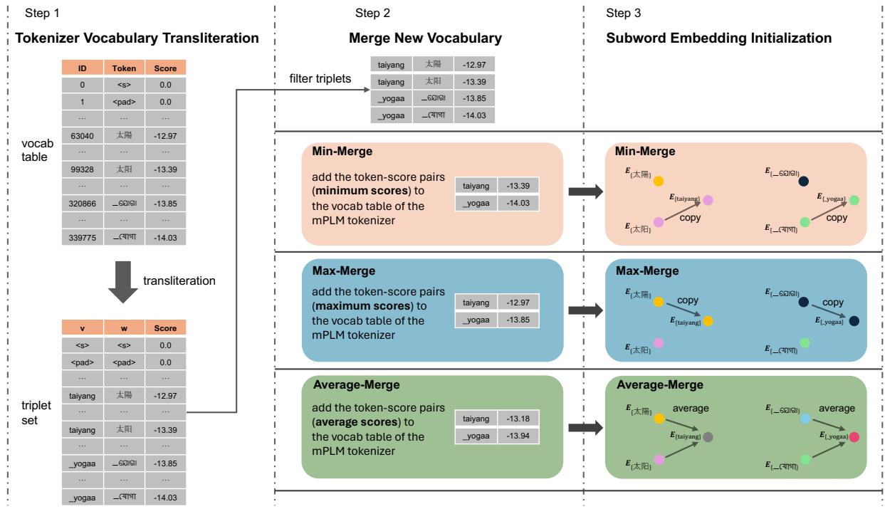
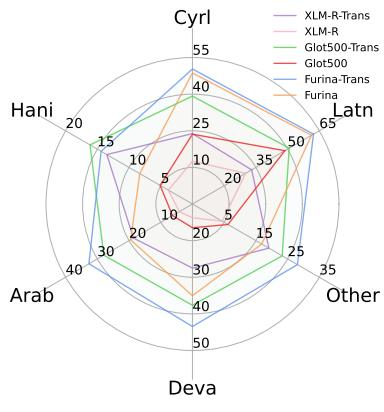
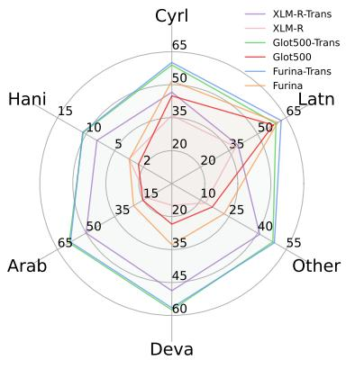
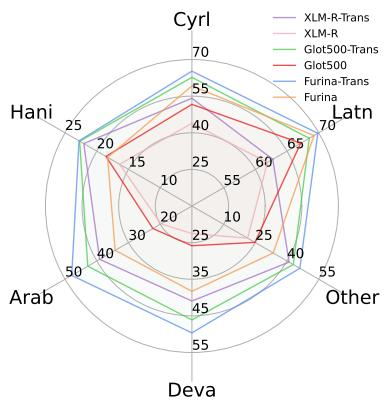

# TRANSMI: A Framework to Create Strong Baselines from Multilingual Pretrained Language Models for Transliterated Data

Yihong Liu, Chunlan Ma, Haotian Ye, and Hinrich Schütze

Center for Information and Language Processing, LMU Munich Munich Center for Machine Learning (MCML) {yihong, chunlan, yehao}@cis.lmu.de

## Abstract

Transliterating related languages that use different scripts into a common script is effective for improving crosslingual transfer in downstream tasks. However, this methodology often makes pretraining a model from scratch unavoidable, as transliteration brings about new subwords not covered in existing multilingual pretrained language models (mPLMs). This is undesirable because it requires a large computation budget. A more promising way is to make full use of available mPLMs. To this end, this paper proposes a simple but effective framework: Transliterate-Merge-Initialize (TRANSMI). TRANSMI can create strong baselines for data that is transliterated into a common script by exploiting an existing mPLM and its tokenizer without any training.1 TRANSMI has three stages: (a) transliterate the vocabulary of an mPLM into a common script; (b) merge the new vocabulary with the original vocabulary; and (c) initialize the embeddings of the new subwords. We apply TRANSMI to three strong recent mPLMs. Our experiments demonstrate that TRANSMI not only preserves the mPLM’s ability to handle nontransliterated data, but also enables it to effec tively process transliterated data, thereby facilitating crosslingual transfer across scripts. The results show consistent improvements of 3% to 34% for different mPLMs and tasks. We make our code and models publicly available at https://github.com/cisnlp/TransMI.

## 1 Introduction

Crosslingual transfer refers to applying knowledge gained from one language to the learning or processing of another language (Zoph et al., 2016; Wu and Dredze, 2019; Artetxe et al., 2020). This transfer is attractive as we often do not have enough training data for low-resource languages while

<table><tr><td>original sentence: transliteration:</td><td>今天是个好天气 jintianshigehaotianqi</td></tr><tr><td>original tokenizer</td><td>今天’，‘是个’，‘好’，‘天气 &#x27;_jint&#x27;, &#x27;ian&#x27;, &#x27;shig&#x27;, &#x27;ehao&#x27;, &#x27;tian&#x27;, &#x27;qi</td></tr><tr><td>modified tokenizer</td><td>今天’，‘是个’，‘好’，‘天气 _jintian&#x27;, &#x27;shige&#x27;, &#x27;hao&#x27;, &#x27;tianqi&#x27;</td></tr></table>

Table 1: Tokenization results of a sentence written in its original script (Hani) and its Latin transliteration.2 The correct word correspondences are: (今天 – jintian – <today>), (是个 – shige – <is>), (好 – hao – <good>), (天气 – tianqi – <weather>). The original tokenizer produces nonsensical strings that do not correspond to the meaning-bearing units. The modified tokenizer correctly tokenizes the transliterated text while also preserving the ability to handle the original sentence.

training data for high-resource languages is generally abundant (Magueresse et al., 2020; Hedderich et al., 2021; Liu, 2022). Although recent mPLMs have made remarkable progress in improving crosslingual transfer, they often cannot achieve strong performance when transferring to a wide spectrum of low-resource languages. Lexical overlap, i.e., the phenomenon where vocabularies are shared between languages, is a key factor influencing the quality of crosslingual transfer (Pires et al., 2019; Lin et al., 2019). However, because languages are written in different writing systems, or scripts, lexical overlap cannot be fully exploited.

To tackle this problem, a few recent works attempt to apply rule-based transliteration tools and convert all data to a common script (Dhamecha et al., 2021; Muller et al., 2021; Moosa et al., 2023). By doing this, the script diversity no longer poses difficulty in improving lexical overlap, therefore better performance can be obtained. However, this approach either requires training a brand-new mPLM from scratch (Dhamecha et al., 2021; Moosa et al., 2023) or involves (parameterefficient) parameter updates to adapt the transliterated data (Muller et al., 2021; Purkayastha et al., 2023), as the embeddings of the new subwords generated from transliteration need to be properly trained before a model can be applied to any downstream tasks. This inevitably demands a high computing budget. Additionally, such dedicated models specific to transliterated data can only deal with one script. Therefore, a natural research question is: Can one makefull use ofan mPLM and a transliteration tool to build a strong baseline well-suited for transliterated data, without any training?

To this end, this work presents a simple yet effective framework: Transliterate-Merge-Initialize (TRANSMI). TRANSMI has three stages. In the first stage, a transliteration tool is used to transliterate all the subwords in the vocabulary of an mPLM into a common script (Latin in our case). Next, we merge the new subwords obtained in the previous step into the original tokenizer, where we propose three different modes to account for the problem of transliteration ambiguity (different subwords in the vocabulary have the same transliteration). Lastly, we initialize the embeddings for the newly added subwords. In this way, we modify the original mPLM so that it can deal with transliterated data while not losing the ability to process non-transliterated data. In contrast to the original mPLM tokenizer that generates non-meaningful tokenization for transliteration, the modified tokenizer generates tokens that correspond well to natural linguistic units, as shown in Table 1.

We validate TRANSMI by applying it to three recent strong mPLMs that show remarkable crosslingual transfer and evaluating the resulting models on a variety of downstream tasks including sentence retrieval, text classification, and sequence labeling. We evaluate each resulting model on both transliterated and non-transliterated evaluation datasets. We show that the models enhanced by our framework not only achieve very similar performance on non-transliterated data as their original mPLM counterparts but also largely outperform them on transliterated data across all downstream tasks.

The contributions are as follows: (i) We present TRANSMI, a simple yet effective framework that creates strong baselines from mPLMs for transliterated data, without any training. (ii) We show that TRANSMI boosts the performance on transliterated data while not sacrificing performance on non-transliterated data. (iii) We investigate indepth how different modes in the Merge (Initialize) step in TRANSMI influence the performance. (iv) Through fine-grained analysis, we show that TRANSMI benefits languages from all script groups for transliterated data.

## 2 Related Work

## 2.1 Transliteration for Multilingual NLP

Transliteration is the process of converting text from one script into another (Wellisch et al., 1978). This process does not involve translating meanings but rather represents the source script symbols as faithfully as possible in the target script. Transliteration has been proven to be an effective method for improving neural machine translation between languages that are written in different scripts (Gheini and May, 2019; Goyal et al., 2020; Amrhein and Sennrich, 2020). Transliteration can also boost crosslingual alignment and transfer on a large scale when languages are transliterated into a common script, especially for languages that are mutually influenced but written in different scripts (Dhamecha et al., 2021; Muller et al., 2021; Chau and Smith, 2021; Purkayastha et al., 2023; Moosa et al., 2023; J et al., 2024; Ma et al., 2024). Recently, Liu et al. (2024b) and Xhelili et al. (2024) propose frameworks where transliterations are used as an auxiliary input along with the original-script text to improve the crosslingual alignment across languages using different scripts. Although this line of approaches improves crosslingual alignment (Liu et al., 2024c), extensive training for adaptation to transliterated data is necessary. In contrast, we propose a simple framework to construct strong baselines directly from existing mPLMs for transliterated data, without any training.

## 2.2 Vocabulary and Tokenizer Manipulation

Training a new tokenizer on data of unseen languages and optionally merging it with the original tokenizer is a common way for efficient language adaptation (Pfeiffer et al., 2021; Alabi et al., 2022; ImaniGooghari et al., 2023; Liu et al., 2024a). Similarly, adaptively manipulating the tokenizer and vocabulary also shows strong performance improvement for domain-specific data within the same language (Sachidananda et al., 2021; Lamproudis et al., 2022; Liu et al., 2023). Kajiura et al. (2023) propose to replace certain subwords in a tokenizer with new subwords learned from the domain-specific corpus for domain adaptation, thus not changing the vocabulary size. Nevertheless, this line of work requires training to learn good representations for the new subwords. Another related work (Hofmann et al., 2022), instead of modifying the vocabulary, directly changes the behavior of the tokenizer to preserve the morphological structure, enhancing robustness and performance. Our work also modifies the vocabulary and tokenizer by including new subwords. In contrast to previous work, we initialize the new subword embeddings by actively exploiting the original mPLM embeddings. Thus the resulting model can be directly adapted to the transliterated data without any training.

## 3 Preliminary: SentencePiece Unigram

Unigram (Kudo, 2018) is a tokenization algorithm for obtaining subword vocabulary, which is usually used in conjunction with SentencePiece (Kudo and Richardson, 2018). In contrast to Byte-Pair Encoding (BPE) (Gage, 1994; Sennrich et al., 2016) or WordPiece (Schuster and Nakajima, 2012; Wu et al., 2016), Unigram is based on a language model that outputs multiple subword segmentations with probabilities. In addition, Unigram does not learn subwords through merging frequent character combinations gradually as done by BPE. Instead, it initializes a large number of units as its vocabulary and progressively removes units that have low contributions to the likelihood of the training corpus, until a pre-defined vocabulary size is obtained. The optimization is done by expectationmaximization (EM) algorithm (Dempster et al., 1977) and the overall training objective is to maximize the marginal likelihood $\mathcal { L } \mathrm { : ~ }$

$$
\mathcal { L } = \sum _ { i = 1 } ^ { | \mathcal { D } | } \log \ P ( X _ { i } ) = \sum _ { i = 1 } ^ { | \mathcal { D } | } \log \big ( \sum _ { \substack { x \in S ( X _ { i } ) } } P ( \pmb { x } ) \big )
$$

where $\mathcal { D }$ is the training corpus, $X _ { i }$ is the ith sentence in ${ \mathcal { D } } ,$ , and $S ( X _ { i } )$ is the set of all possible segmentation candidates for the input sentence $X _ { i }$

Once the Unigram tokenizer is trained, in addition to its vocabulary $V ,$ the model will also save a score, i.e., the log probability, learned from the training corpus, for each subword w in V, as shown in Figure 1. This makes it possible for the model to provide the probability of each possible tokenization for a given sentence after training. In practice, the tokenizer is usually set to generate the most probable segmentation, i.e., the sequence of subwords that maximize the log probability:

$$
\pmb { x } ^ { * } = \mathrm { a r g m a x } _ { \pmb { x } \in S ( X ) } \sum _ { w \in \pmb { x } } \log P ( w )
$$

where $\scriptstyle { \pmb { x } } ^ { * }$ is the optimal tokenization given the sentence X and log $P ( w )$ is the log probability of subword w.

## 4 Methodology

We introduce TRANSMI, a framework that makes full use of an existing mPLM and a transliteration tool to create strong baselines for transliterated data without any training.3 There are three stages in TRANSMI: (1) transliterate the subwords in the original vocabulary; (2) merge the transliterated subwords into the original tokenizer; and (3) initialize the embeddings for the new subwords. In each stage, the information and knowledge from the mPLM and its tokenizer are carefully exploited. We illustrate the whole pipeline in Figure 1 and introduce each stage in detail in the following.

## 4.1 Tokenizer Vocabulary Transliteration

The vocabulary of a multilingual tokenizer contains subwords that are learned using tokenization algorithms such as SentencePiece4 (Kudo and Richardson, 2018) on a concatenation of data from different languages (Conneau et al., 2020; ImaniGooghari et al., 2023). As a result, many subwords are in non-Latin script. An intuitive way of adapting the vocabulary to Latin-script transliterated data is to add the transliterations of these non-Latin subwords into the vocabulary. Let $V ^ { \mathrm { o r i g } }$ be the vocabulary of the mPLM, and Transli be a deterministic transliterator. We create a set of transliteration triplets by applying Transli to every subword w and associating it with a score s, i.e., w’s log probability:

$$
T = \{ ( v , w , s ) | v = { \mathsf { T r a n s l i } } ( w ) \wedge w \in V ^ { \mathrm { o r i g } } \}
$$

It is important to note that $| T | = | V ^ { \mathrm { o r i g } } |$ and there will be no duplicates in T. That is, given two elements: $( v _ { i } , w _ { i } , s _ { i } )$ and $( v _ { j } , w _ { j } , s _ { j } )$ where $v _ { i } = v _ { j }$ we always have wi ̸= wj (usually also $s _ { i } \neq s _ { j } )$ For example, “taiyang” is the Latin transliteration for both “太阳” (“sun” in simplified Chinese) and “太陽” (“sun” in traditional Chinese). The score of “太陽” is higher than “太阳” since “太陽” is more frequent and therefore has a higher log probability. Note the higher score only indicates the more frequent occurrence in the pretraining data of the mPLM but does not reflect the true population of people who write in that certain script.

  
Figure 1: Overview of TRANSMI. We transliterate all the subwords from the vocabulary of the source mPLM tokenizer into Latin script in Step 1. We then merge the filtered triplets (ambiguous transliterations) into the tokenizer vocabulary table using one of the three proposed modes in Step 2. Note that we perform direct merge operations for the rest of the triplets that are not ambiguous (not shown in the figure). Lastly in Step 3, we initialize the embeddings for the newly added subwords according to the merge mode used in the previous step.

## 4.2 Merge New Vocabulary

Once we obtain $T ,$ , we can modify the original vocabulary $V ^ { \mathrm { o r i g } }$ by adding the subword transliterations $v _ { i }$ . However, we need to consider the possible transliteration ambiguity while merging. For subword transliterations that already exist in $V ^ { \mathrm { o r i g } }$ nothing needs to be done – this applies to all subwords in Latin script without any diacritics. For each subword transliteration $v ^ { \prime }$ that has a one-toone relation to a $w ^ { \prime } .$ , i.e., $\forall ( v , w , s ) \in T : v =$ $v ^ { \prime } \Rightarrow w = w ^ { \prime } ,$ , we can simply add it with its associated score to the vocabulary table.

For each of the remaining subwords $v ^ { \prime } ,$ we first define a new set of triplets $U ( v ^ { \prime } ) : = \{ ( v , w , s ) \in$ $T | v \ : = \ : v ^ { \prime } \}$ . Then, to address the transliteration ambiguity, we propose three different modes to merge them into the vocabulary.

Min-Merge Mode In this mode, we select the triplet whose score $s ^ { \prime }$ is the lowest for the transliteration $v ^ { \prime } { : }$ :

$$
s _ { \mathrm { \tiny ~ m i n } } ^ { \prime } ( v ^ { \prime } ) = \operatorname* { m i n } _ { ( v , w , s ) \in U ( v ^ { \prime } ) } s
$$

This mode will be favorable to preserve the less frequent subwords. Adding the subword transliteration $v ^ { \prime }$ and its associated score $s _ { \mathrm { \ m i n } } ^ { \prime } ( v ^ { \prime } )$ to the vocabulary table is likely to alter the tokenize ${ \bf \ddot { s } }$ behavior negatively. As a consequence, we expect this mode will perform worst among all modes.

Max-Merge Mode In contrast to Min-Merge Mode, this mode selects the triplet $( v ^ { \prime } , w ^ { \prime } , s ^ { \prime } ) \in T$ whose score is the highest:

$$
s _ { \mathrm { \tiny ~ m a x } } ^ { \prime } ( v ^ { \prime } ) = \operatorname* { m a x } _ { ( v , w , s ) \in U ( v ^ { \prime } ) } s
$$

For high-frequency subwords, this mode replicates the previous tokenization behavior for the original script: after transliteration, we are likely to obtain the same tokenization. Therefore, we expect this mode will achieve the best performance.

Average-Merge Mode This mode averages the scores of all triplets containing $v ^ { \prime }$

$$
s _ { \mathrm { \ a v g } } ^ { \prime } ( v ^ { \prime } ) = \frac { \sum _ { ( v , w , s ) \in U ( v ^ { \prime } ) } s } { | U ( v ^ { \prime } ) | }
$$

We then add subword $v ^ { \prime }$ with score $s _ { \mathrm { \ a v g } } ^ { \prime } ( v ^ { \prime } )$ to the vocabulary. Average-Merge Mode brings amount

a change in tokenizer behavior that lies between Min-Merge Mode and Max-Merge Mode.5

## 4.3 Subword Embedding Initialization

The last stage deals with embedding initialization for the newly introduced subwords, which are transliterations of the subwords in the original vocabulary. Therefore, we aim to make full use of the knowledge encoded in the original subword embedding matrix $E ^ { \mathrm { o r i g } }$ to avoid any sort of training. To achieve this, we create an additional embedding matrix $E ^ { \mathrm { a d d } }$ for the new subwords and initialize the embedding for each subword based on the correspondence we obtain in the previous vocabulary merge stage. Specifically, we directly copy the original embedding for those new subwords that have a one-to-one transliteration relation. For the rest of the subwords, we initialize their embeddings according to which mode is used in the last stage; this makes the resulting embeddings consistent with the updated tokenizer behavior.

Min-Merge Mode In Min-Merge Mode, we selected the triple $( v ^ { \prime } , s _ { \mathrm { \tiny ~ m i n } } ^ { \prime } ( v ^ { \prime } ) , w ^ { \prime } )$ . Correspondingly, we initialize the embedding of $v ^ { \prime }$ as $w ^ { \prime } \colon$ $E _ { v ^ { \prime } } ^ { \mathrm { { \mathrm { a d } } \bar { d } } } = E _ { w ^ { \prime } } ^ { \mathrm { { o r i g } } }$

Min-Merge Mode In Max-Merge Mode, we selected the triple $( v ^ { \prime } , s _ { \mathrm { \tiny ~ m a x } } ^ { \prime } ( v ^ { \prime } ) , w ^ { \prime } )$ . Correspondingly, we initialize the embedding of $v ^ { \prime }$ as $w ^ { \prime } \colon$ $E _ { v ^ { \prime } } ^ { \mathrm { { \mathrm { a d } } \bar { d } } } = E _ { w ^ { \prime } } ^ { \mathrm { { o r i g } } }$

Average-Merge Mode In Average-Merge Mode, we averaged the scores of all $w ^ { \prime }$ that are mapped to $v ^ { \prime } ,$ i.e., we averaged the scores in $U ( v ^ { \prime } )$ . Correspondingly, we initialize the embedding of $v ^ { \prime }$ as the average of the $w ^ { \prime } \colon$

$$
E _ { v ^ { \prime } } ^ { \mathrm { a d d } } = \frac { \sum ( v , w , s ) \in U ( v ^ { \prime } ) } { | U ( v ^ { \prime } ) | } E _ { w } ^ { \mathrm { o r i g } }
$$

By choosing any mode, each embedding in $E ^ { \mathrm { a d d } }$ is carefully initialized, and in the same representation space as $E ^ { \mathrm { o r i g } }$ . To construct the final embeddings, we simply concatenate $E ^ { \mathrm { o r i g } }$ and $E ^ { \mathrm { a d d } }$ and ensure the tokenizer subword indices and their indices in the embeddings are consistent.

<table><tr><td></td><td>1</td><td>2</td><td>3</td><td>&gt;3</td><td>Total</td></tr><tr><td>XLM-R</td><td>97,456</td><td>6,866</td><td>1,380</td><td>1,088</td><td>106,790</td></tr><tr><td>Glot500</td><td>123,001</td><td>8,373</td><td>1,706</td><td>1,274</td><td>134,354</td></tr></table>

Table 2: Transliteration ambiguity of the newly added subwords (transliterations). For example, 97,456 indicates that, out of the total newly added 106,790 subwords for the XLM-R model, 97,456 subwords have a 1-to-1 relationship, i.e., the subword is the Latin transliteration of only 1 subword in the original XLM-R vocabulary. Most of the new subwords are not ambiguous.

## 5 Experiments

## 5.1 Setups

We apply the proposed framework TRANSMI to three strong mPLMs: XLM-R, Glot500, and FU-RINA. XLM-R (Conneau et al., 2020) is pretrained on 100 languages using masked language modeling (MLM) (Devlin et al., 2019). Glot500 (Imani-Googhari et al., 2023) is a continued pretrained model from XLM-R on Glot500-c dataset that covers more than 500 languages. FURINA (Liu et al., 2024b) is a post-aligned version of Glot500, which is fine-tuned using 5% of pretraining data of $\mathrm { G l o t } 5 0 0 . ^ { 6 }$ We use Uroman (Hermjakob et al., 2018) as the rule-based transliteration tool. Note that the tokenizers of Glot500 and FURINA are the same. We show the number of newly added subwords and the transliteration ambiguity in Table 2. We use the base version of each model (their architectures are the same) for a fair comparison. There are 9 resulting models (3 merge modes $\times \ 3$ model types) in total. When evaluating the models, we use both the non-transliterated evaluation datasets (the original ones) and the transliterated Latin-script evaluation datasets, which are obtained by transliterating the original evaluation datasets using Uroman. Following ImaniGooghari et al. (2023), we refer to language-scripts supported by XLM-R as the head languages and the remaining language-scripts – those that are supported by Glot500 as the tail languages.7

## 5.2 Downstream Tasks

We consider the following three evaluation types. For each type, we consider two evaluation datasets. The evaluation is performed in an English-centric crosslingual zero-shot fashion: fine-tuning on the

<table><tr><td rowspan="3"></td><td colspan="3">SR-B</td><td colspan="3">SR-T</td><td colspan="3">Taxi1500</td><td colspan="3">SIB200</td><td colspan="3">NER</td><td colspan="3"></td><td colspan="3">POS</td></tr><tr><td>tail</td><td>head</td><td></td><td>all</td><td>tail</td><td>head</td><td>all</td><td>tail</td><td>head</td><td></td><td>all</td><td>tail</td><td>head</td><td>all</td><td>tail</td><td>head</td><td>all</td><td>tail</td><td>head</td><td></td><td>all</td></tr><tr><td>XLM-R</td><td>7.0</td><td>28.6</td><td>12.5</td><td></td><td>26.5</td><td>35.4</td><td>32.9</td><td>11.4</td><td>34.8</td><td></td><td>17.4</td><td>43.0</td><td>52.7</td><td>47.4</td><td>46.3</td><td>46.2</td><td>46.3</td><td></td><td>34.1</td><td>59.0</td><td>51.3</td></tr><tr><td>XLM-R (Max-Merge)</td><td>7.4</td><td>35.8</td><td>14.6</td><td></td><td>30.1</td><td>48.2</td><td>43.0</td><td>13.6</td><td>47.0</td><td>22.1</td><td>48.3</td><td></td><td>73.0</td><td>59.5</td><td>46.7</td><td>53.7</td><td>50.5</td><td>37.8</td><td></td><td>70.1</td><td>60.2</td></tr><tr><td>Glot500</td><td>33.1</td><td></td><td>31.6</td><td>32.7</td><td>44.9</td><td>42.3</td><td>43.0</td><td>41.5</td><td>36.4</td><td>40.2</td><td></td><td>59.3</td><td>56.2</td><td>57.9</td><td>54.0</td><td>49.0</td><td>51.3</td><td></td><td>48.9</td><td>59.8 56.4</td><td></td></tr><tr><td>Glot500 (Max-Merge)</td><td>34.3</td><td></td><td>38.4</td><td>35.4</td><td>49.2</td><td>55.5</td><td>53.7</td><td>45.1</td><td>48.9</td><td>46.0</td><td></td><td>66.8</td><td>74.7</td><td>70.4</td><td>57.3</td><td>57.2</td><td>57.2</td><td>52.5</td><td></td><td>68.8 63.8</td><td></td></tr><tr><td>FURINA</td><td>47.9</td><td></td><td>51.2</td><td>48.7</td><td>55.4</td><td>53.6</td><td>54.1</td><td>45.0</td><td>43.0</td><td>44.5</td><td></td><td>60.7</td><td>59.9</td><td>60.3</td><td>54.4</td><td>52.2</td><td>53.2</td><td></td><td>54.3</td><td>67.4</td><td>63.4</td></tr><tr><td>FURINA (Max-Merge)</td><td>49.4</td><td></td><td>54.2</td><td>50.6</td><td>56.4</td><td>59.1</td><td>58.3</td><td>49.6</td><td>53.0</td><td></td><td>50.5</td><td>66.7</td><td>74.1</td><td>70.1</td><td>57.6</td><td>58.5</td><td>58.1 55.9</td><td></td><td></td><td>71.7</td><td>66.8</td></tr></table>

Table 3: Performance of three model types on transliterated evaluation datasets across 5 random seeds. We report the performance as an average over head, tail, and all language-scripts for each model variant. Max-merge models consistently outperform the original model on transliterated evaluation data. Bold: best result per model type.
<table><tr><td></td><td colspan="3">SR-B</td><td colspan="3">SR-T</td><td colspan="3">Taxi1500</td><td colspan="3">SIB200</td><td colspan="3">NER</td><td colspan="3">POS</td></tr><tr><td></td><td>tail</td><td>head</td><td>all</td><td>tail</td><td>head</td><td>all</td><td>tail</td><td>head</td><td>all</td><td>tail</td><td>head</td><td>all</td><td>tail</td><td>head</td><td>all</td><td>tail</td><td>head</td><td>all</td></tr><tr><td>XLM-R</td><td>7.4</td><td>54.2</td><td>19.3</td><td>32.6</td><td>66.2</td><td>56.6</td><td>13.5</td><td>58.7</td><td>25.0</td><td>49.5</td><td>81.1</td><td>63.9</td><td>47.6</td><td>61.0</td><td>54.9</td><td></td><td>42.7</td><td>76.4 66.0</td></tr><tr><td>XLM-R (Max-Merge)</td><td>7.4</td><td>53.3</td><td>19.1</td><td>33.1</td><td>65.1</td><td>56.0</td><td>13.2</td><td>58.0</td><td>24.6</td><td>46.9</td><td>80.7</td><td>62.2</td><td>46.6</td><td>60.7</td><td>54.3</td><td>42.7</td><td>76.5</td><td>66.1</td></tr><tr><td>Glot500</td><td>43.2</td><td>59.0</td><td>47.3</td><td>59.8</td><td>75.0</td><td>70.7</td><td>52.5</td><td>60.9</td><td>54.6</td><td>68.5</td><td>80.4</td><td>73.9</td><td>60.8</td><td>63.7</td><td>62.4</td><td>62.0</td><td></td><td>76.0 71.7</td></tr><tr><td>Glot500 (Max-Merge)</td><td>41.7</td><td>57.8</td><td>45.8</td><td>58.3</td><td>72.8</td><td>68.7</td><td>51.5</td><td>60.8</td><td>53.8</td><td>69.5</td><td>81.2</td><td>74.8</td><td>59.6</td><td>63.2</td><td>61.6</td><td>62.1</td><td></td><td>76.071.7</td></tr><tr><td>FURINA</td><td>55.3</td><td>66.2</td><td>58.1</td><td>62.1</td><td>71.5</td><td>68.8</td><td>55.9</td><td>63.8</td><td>57.9</td><td>70.3</td><td>82.2</td><td>75.7</td><td>60.5</td><td>63.9</td><td>62.4</td><td>63.3</td><td></td><td>75.7 71.9</td></tr><tr><td>FURINA (Max-Merge)</td><td>55.3</td><td>65.9</td><td>58.0</td><td>60.9</td><td></td><td>70.6 67.9</td><td>56.6</td><td>63.8</td><td>58.4</td><td>71.8</td><td>82.5</td><td>76.7</td><td>60.1</td><td>64.2</td><td>62.4</td><td>62.1</td><td></td><td>76.5 72.1</td></tr></table>

Table 4: Performance of three model types on non-transliterated evaluation datasets across 5 random seeds. We report the performance as an average over head, tail, and all language-scripts for each model variant. Max-merge models perform close to the original models. Bold: best result per model type.

English train set, selecting the best checkpoint on the English development set, and then evaluating the best checkpoint on the test sets of all other language-scripts. An exception is Sentence Retrieval in that it does not involve any fine-tuning. For all tasks, only the subset of languages (head and tail languages) supported by Glot500 are considered. Details of the used dataset and hyperparameter settings for fine-tuning are reported in §A.

Sentence Retrieval. We use Bible (SR-B) and Tatoeba (Artetxe and Schwenk, 2019) (SR-T). The similarity is calculated using the mean pooling of contextualized word embeddings at the 8th layer.

Text Classification. We use Taxi1500 (Ma et al., 2023) and SIB200 (Adelani et al., 2024).

Sequence Labeling. We use WikiANN for named entity recognition (NER) (Pan et al., 2017) and Universal Dependencies (de Marneffe et al., 2021) for Part-Of-Speech (POS) tagging.

## 5.3 Results and Discussion

There are two goals to achieve with TRANSMI: (1) we want to build strong baselines directly from existing mPLMs for transliterated data, and (2) we want to preserve the mPLMs’ ability to deal with the original scripts, i.e., non-transliterated data. Therefore, we evaluate the original mPLMs and their corresponding variants modified by TRANSMI on both the transliterated evaluation datasets (all scripts are converted into Latin script) and the non-transliterated (original) evaluation datasets. We notice that the different merge modes offer very similar performance while the Max-Merge mode slightly outperforms the other modes. As a result, we only show the performance of the Max-Merge mode in this section (Table 3 and 4). The comparison between different modes is presented and discussed in §6.1.

## 5.3.1 Evaluation on Transliterated Data

We report performance on transliterated data in Table 3. We observe consistent improvement across all language-scripts and tasks. Generally, head languages enjoy a higher increase than tail languages. In addition, sentence-level tasks seem to benefit more from the method than the token-level tasks.

The original mPLMs are not pretrained on transliterated data and thus they perform suboptimally on transliterated evaluation datasets. Modifying these mPLMs with TRANSMI equips these models with the ability to deal with the transliterated texts, as new subwords (transliterations of the subwords covered by the original mPLMs) are included and their embeddings are wisely initialized. Consequently, the resulting models can process the transliterated data and achieve good performance.

<table><tr><td></td><td colspan="3">SR-B</td><td colspan="3">SR-T</td><td colspan="3">Taxi1500</td><td colspan="3">SIB200</td><td colspan="3">NER</td><td colspan="3">POS</td></tr><tr><td></td><td>tail</td><td>head</td><td>all</td><td>tail</td><td>head</td><td>all</td><td>tail</td><td>head</td><td>all</td><td>tail</td><td>head</td><td>all</td><td>tail</td><td>head</td><td>all</td><td>tail head</td><td></td><td>all</td></tr><tr><td>XLM-R (Min-Merge)</td><td>7.4</td><td>34.7</td><td>14.4</td><td>28.7</td><td>46.4</td><td>41.3</td><td>14.4</td><td>45.0</td><td>22.1</td><td>49.6</td><td>73.7</td><td>60.5</td><td>45.9</td><td>52.3</td><td>49.3</td><td>38.0</td><td>69.1</td><td>59.5</td></tr><tr><td>XLM-R (Average-Merge)</td><td>7.4</td><td>34.1</td><td>14.2</td><td>29.0</td><td>45.4</td><td>40.7</td><td>14.3</td><td>46.2</td><td>22.4</td><td>47.1</td><td>70.7</td><td>57.8</td><td>47.2</td><td>53.5</td><td>50.6</td><td>37.6</td><td>69.4</td><td>59.6</td></tr><tr><td>XLM-R (Max-Merge)</td><td>7.4</td><td>35.8</td><td>14.6</td><td>30.1</td><td>48.2</td><td>43.0</td><td>13.6</td><td>47.0</td><td>22.1</td><td>48.3</td><td>73.0</td><td>59.5</td><td>46.7</td><td>53.7</td><td>50.5</td><td>37.8</td><td>70.1</td><td>60.2</td></tr><tr><td>Glot500 (Min-Merge)</td><td>34.1</td><td>36.2</td><td>34.6</td><td>48.8</td><td>53.0</td><td>51.8</td><td>46.1</td><td>48.0</td><td>46.6</td><td>67.1</td><td>73.8</td><td>70.1</td><td>57.4</td><td>55.8</td><td>56.6</td><td>52.5</td><td>67.1</td><td>62.6</td></tr><tr><td>Glot500 (Average-Merge)</td><td>34.2</td><td>37.4</td><td>35.0</td><td>49.4</td><td>54.8</td><td>53.2</td><td>47.2</td><td>49.8</td><td>47.9</td><td>66.6</td><td>73.9</td><td>69.9</td><td>56.7</td><td>56.1</td><td>56.4</td><td>52.0</td><td>68.3</td><td>63.3</td></tr><tr><td>Glot500 (Max-Merge)</td><td>34.3</td><td>38.4</td><td>35.4</td><td>49.2</td><td>55.5</td><td>53.7</td><td>45.1</td><td>48.9</td><td>46.0</td><td>66.8</td><td>74.7</td><td>70.4</td><td>57.3</td><td>57.2</td><td>57.2</td><td>52.5</td><td>68.8</td><td>63.8</td></tr><tr><td>FURINA (Min-Merge)</td><td>49.3</td><td>52.3</td><td>50.1</td><td>56.2</td><td>58.0</td><td>57.4</td><td>48.5</td><td>50.2</td><td>49.0</td><td>66.7</td><td>72.8</td><td>69.5</td><td>58.2</td><td>59.0</td><td>58.6</td><td>55.5</td><td>71.0</td><td>66.2</td></tr><tr><td>FURINA (Average-Merge)</td><td>49.4</td><td>53.5</td><td>50.5</td><td>56.2</td><td>58.5</td><td>57.8</td><td>48.4</td><td>51.4</td><td>49.2</td><td>67.6</td><td>75.1</td><td>71.0</td><td>57.0</td><td>57.7</td><td>57.4</td><td>56.1</td><td>71.6</td><td>66.8</td></tr><tr><td>FURINA (Max-Merge)</td><td>49.4</td><td>54.2</td><td>50.6</td><td>56.4</td><td>59.1</td><td>58.3</td><td>49.6</td><td>53.0</td><td>50.5</td><td>66.7</td><td>74.1</td><td>70.1</td><td>57.6</td><td>58.5</td><td>58.1</td><td>55.9</td><td>71.7</td><td>66.8</td></tr></table>

Table 5: Performance of three merge modes applied to three mPLMs on transliterated evaluation datasets across 5 random seeds. The performance difference among the three modes are small but Min-Merge mode is favorable to tail languages while Max-Merge mode is favorable to head languages. In general, Max-Merge mode achieves the overall best performance. Bold (underlined): best (second-best) result for each task in each model type.

It can be observed that the improvement by modifying FURINA is relatively smaller than on other model types. We hypothesize this is because FU-RINA is already fine-tuned on transliterated data through MLM and transliteration contrastive modeling (Liu et al., 2024b). In this way, even though FURINA’s vocabulary is the same as Glot500, i.e., not extended and adapted accordingly for Latin transliterations, its fine-tuning phase still helps the model gain some knowledge beneficial for processing and understanding transliterated data.

## 5.3.2 Evaluation on Non-transliterated Data

We report performance on non-transliterated data in Table 4. Across all tasks, modified models achieve performance very close to the original mPLMs, with generally negligibly small performance degradation. This is expected as the vocabulary is only augmented with new subwords in Latin script (transliteration) and therefore the tokenization results for non-Latin texts remain the same (their embeddings are also not altered at all).

On the other hand, the slight decrease in performance is not surprising. The included new subwords will influence the tokenization results for all languages written in Latin script, including English. As the evaluation is done in an Englishcentric manner, even if the target language is not written in Latin script, altered English tokenization can still influence the crosslingual transfer performance. When the transfer target language is also written in Latin, the tokenization results and representation are changed on both the source side and target side, the performance therefore varies.

## 6 Analysis

## 6.1 Which Merge Mode Wins

To explore how different merge modes (Min-Merge, Average-Merge, and Max-Merge) influence the English-centric zero-shot crosslingual transfer, we report the performance of the three variants of each model type in Table 5. Generally, the performance differences among the three merge modes are very small across model types and downstream tasks. This can be explained by the fact that most of the newly added subwords (transliterations of subwords in the original mPLM vocabulary) are not ambiguous: 91% of subwords in XLM-R and 92% in Glot500 (also FURINA) have 1-to-1 relations, as shown in Table 2. Each merge mode simply does the same copy operation for these unambiguous subwords, and operates differently only on the remaining ambiguous subwords (the transliteration corresponds to more than one subword in the original vocabulary), which is a relatively small portion.

Although the difference is small, we observe that the Min-Merge mode supports tail languages better while the Max-merge mode supports head languages better. We hypothesize that the scores (log probabilities) of some subwords from tail languages (usually low-resource languages) are small, and the Min-Merge mode preserves the small scores and tokenization behavior when tokenizing texts that contain these tokens, therefore is favorable to tail languages. Similarly, the scores for some subwords from high-resource languages are large because of higher frequencies in the pretraining data, and the Max-Merge mode keeps their priority in tokenization. In general, the Max-Merge mode is the best option, as it has the overall best performance across all tasks in each model type.

(a) Sentence Retrieval  
(c) Sequence Labeling  

  
(b) Text Classification

  
Figure 2: Qualitative comparison between the original mPLMs and TRANSMI (Max-Merge mode) models (denoted with “-Trans”) on transliterated evaluation datasets. We compute the average performance for each evaluation type (e.g., Sentence Retrieval is the average of SR-B and SR-T) for different script groups. Each language is placed into a group according to the script that the language is originally written in. The script groups are: Latn (Latin), Cyrl (Cyrillic), Hani (Hani), Arab (Arabic), and Deva (Devanagari). Languages not written in these scripts are placed into Other. TRANSMI-modified models consistently outperform the original mPLMs across all tasks and groups.

## 6.2 Which Scripts Benefit

It is also important to know whether and how much TRANSMI-modified models outperform the original mPLMs on languages that are originally written in different scripts in the transliterated evaluation. Therefore, we compare the original mPLMs and their modified variants (using the Max-Merge mode) on the three evaluation types (transliterated evaluation) across different scripts in which the transfer target languages are originally written, as shown in Figure 2. Globally, each TRANSMImodified model consistently achieves better performance than its counterpart across all script groups and all evaluation types, since the original mPLMs are not specifically trained on transliterated data, except for FURINA, for which we observe similar performance occasionally. For example, FURINA and FURINA-Trans achieve very close performance in the Cyrl group in Sentence Retrieval.

We observe that the smallest improvement comes from the Hani group and the Latn group. This is not surprising and can be explained by the fact that the former is logograms and transliterated words potentially lose semantic or contextual nuances and are more prone to ambiguity (Liu et al., 2024b) while the latter does not change much after Uroman transliteration (only diacritics are removed). The rest of the script groups, i.e., Cyrl, Arab, Deva and Other, all enjoy large improvements, which indicates that TRANSMI is effective in creating strong baselines for transliterated data for languages originally written in phonetic scripts.

<table><tr><td>Latn</td><td>Cyrl Hani</td><td>Arab</td><td>Deva</td><td>Other</td></tr><tr><td>Sentence Retrieval</td><td>64.6 69.0 62.2 50.3</td><td>43.1 58.2 14.4 32.6</td><td>68.8 43.4</td><td>55.2 28.1</td></tr><tr><td>Text Classification</td><td>65.7 73.2 62.4 60.2</td><td>34.2 73.0</td><td>76.5 56.6</td><td>71.5</td></tr><tr><td>Sequence Labeling</td><td>70.8 72.0 69.8 65.2 22.8</td><td>10.6 29.2</td><td>58.2 62.8 59.6 47.9 49.6</td><td>48.8 60.0</td></tr></table>

Table 6: Comparison between the performance of FU-RINA (Max-Merge) on non-transliterated and transliterated evaluation datasets for different script groups. For each evaluation type, the results on non-transliterated (resp. transliterated) data are in the first (resp. second) row. FURINA (Max-Merge) consistently performs better on non-transliterated data than transliterated data.

## 6.3 Transliterated vs. Non-transliterated

We also want to explore how the performance varies before and after the evaluation datasets are transliterated. Therefore, we present the comparison between transliterated evaluation and nontransliterated evaluation across different script groups, using FURINA (Max-Merge) as a case study, in Table 6. Not surprisingly, the performance of all script groups drops after transliterating the evaluation datasets. There are mainly two reasons: (1) the embeddings of the newly added subwords that have transliteration ambiguity are not suitable for each occurrence within the same language, e.g., “shiwu” is the transliteration for both “食物” (“food” in Chinese) and “时务” (“current affairs”

<table><tr><td>Latn Cyrl Hani Arab Deva Other</td></tr><tr><td>45.7 39.4 42.7</td><td>42.3 44.1 44.5</td></tr><tr><td>FURINA 45.5 43.8</td><td>334.9 50.8 53.7 57.0</td></tr><tr><td>44.8 39.4 42.7 FURINA (Max-Merge)</td><td>42.3 44.1 44.5 43.3 36.0 30.9 36.3 38.4 38.9</td></tr></table>

Table 7: Average sequence length of SR-B dataset averaged by script group. The results on non-transliterated (resp. transliterated) data are in the first (resp. second) row. The tokenizer of FURINA (Max-Merge) has consistently shorter sequence lengths on transliterated data compared with the original FURINA tokenizer.

in Chinese) and across different languages, e.g., “miso” is the transliteration for both μισό (“half” in Greek) and “味噌” (“soybean paste” in Japanese); (2) the tokenization result is different before and after transliterating a sentence into Latin script. Although our method tries to preserve the tokenization behavior, it is impossible to prevent changes completely. As shown in Table 7, the average sequence length changes in all script groups for FU-RINA (Max-Merge), even for the Latin group, since the newly added subwords inevitably also change the tokenization for Latin-script languages. The different tokenizations alter the final representations of sentences, resulting in a drop in performance.

## 7 Conclusion and Future Work

This paper presents TRANSMI, a framework to create baseline models well-suited for transliterated data from existing mPLMs, without any training. We show TRANSMI-modified models not only preserve the ability to deal with data written in their original scripts but also demonstrate good capability in processing transliterations of data originally written in non-Latin scripts. Our experiments indicate the modified models consistently outperform the original mPLMs in the transliterated evaluation. In addition, we show that TRANSMI is particularly effective for transliterated data of languages written in phonetic scripts like Cyrillic and Devanagari. The modified models therefore serve as strong baselines for transliterated data.

TRANSMI can have multiple uses for future work in the community. First, TRANSMI can be used to create baselines for transliterated evaluation, which does not involve any training. Second, TRANSMI can be used to modify existing models and then the modified models can be used as good starting points for continued pretraining or finetuning on domain-specific (transliterated) data.

## Limitations

Though the TRANSMI-modified models can achieve much better performance than the original mPLMs on transliterated evaluation datasets, there is still a gap between it and the performance on nontransliterated (in the original script) evaluation. We propose several explanations for this phenomenon, such as subword transliteration ambiguity and tokenization differences. These issues should be able to be alleviated by further fine-tuning or continued pretraining on transliterated data. However, this is beyond the scope of the paper, as our motivation is to create strong baselines through a simple and effective framework for modifying existing mPLMs. We would therefore expect much stronger models can be obtained by using our TRANSMImodified mPLMs as the starting points of further training/fine-tuning, which we would leave for future exploration in the community.

Another possible limitation is that we only consider mPLMs that leverage SentencePiece Unigram tokenizers. This is due to the fact that the most recent strong mPLMs favor such choices. However, it should be very easy to extend TRANSMI to mPLMs that use other types of tokenizers. For example, mBERT (Devlin et al., 2019) uses Word-Piece subword tokenizer where the vocabulary is learned through BPE. The vocabulary keeps frequencies of subwords instead of log probabilities. Therefore, we can simply use the frequencies to replace the scores being manipulated in the Merge step of TRANSMI. We would leave this exploration in the community if other tokenizers are used in their studies for instance.

Lastly, we only try Uroman, a universal transliteration tool that can convert any script to Latin script. However, as we show in our analysis, the process is not optimal since it is not adapted to every single language. For example, for Chinese, the tones are removed which introduces substantial ambiguity, negatively influencing the performance. This can be improved by using better transliteration tools that are more language-specific when one does not want to cover as many languages as we do but focus on a small group of related languages.

## Acknowledgements

This research was supported by DFG (grant SCHU 2246/14-1) and The European Research Council (NonSequeToR, grant #740516).

## References

David Adelani, Hannah Liu, Xiaoyu Shen, Nikita Vassilyev, Jesujoba Alabi, Yanke Mao, Haonan Gao, and En-Shiun Lee. 2024. SIB-200: A simple, inclusive, and big evaluation dataset for topic classification in 200+ languages and dialects. In Proceedings ofthe 18th Conference ofthe European Chapter ofthe Associationfor Computational Linguistics (Volume 1: Long Papers), pages 226–245, St. Julian’s, Malta. Association for Computational Linguistics.

Jesujoba O. Alabi, David Ifeoluwa Adelani, Marius Mosbach, and Dietrich Klakow. 2022. Adapting pretrained language models to African languages via multilingual adaptive fine-tuning. In Proceedings of the 29th International Conference on Computational Linguistics, pages 4336–4349, Gyeongju, Republic of Korea. International Committee on Computational Linguistics.

Chantal Amrhein and Rico Sennrich. 2020. On Romanization for model transfer between scripts in neural machine translation. In Findings of the Association for Computational Linguistics: EMNLP 2020, pages 2461–2469, Online. Association for Computational Linguistics.

Mikel Artetxe, Sebastian Ruder, and Dani Yogatama. 2020. On the cross-lingual transferability of monolingual representations. In Proceedings of the 58th Annual Meeting ofthe Associationfor Computational Linguistics, pages 4623–4637, Online. Association for Computational Linguistics.

Mikel Artetxe and Holger Schwenk. 2019. Massively multilingual sentence embeddings for zeroshot cross-lingual transfer and beyond. Transactions of the Association for Computational Linguistics, 7:597–610.

Ethan C. Chau and Noah A. Smith. 2021. Specializing multilingual language models: An empirical study. In Proceedings of the 1st Workshop on Multilingual Representation Learning, pages 51–61, Punta Cana, Dominican Republic. Association for Computational Linguistics.

Alexis Conneau, Kartikay Khandelwal, Naman Goyal, Vishrav Chaudhary, Guillaume Wenzek, Francisco Guzmán, Edouard Grave, Myle Ott, Luke Zettlemoyer, and Veselin Stoyanov. 2020. Unsupervised cross-lingual representation learning at scale. In Proceedings of the 58th Annual Meeting of the Association for Computational Linguistics, pages 8440– 8451, Online. Association for Computational Linguistics.

Marie-Catherine de Marneffe, Christopher D. Manning, Joakim Nivre, and Daniel Zeman. 2021. Universal Dependencies. Computational Linguistics, 47(2):255–308.

Arthur P Dempster, Nan M Laird, and Donald B Rubin. 1977. Maximum likelihood from incomplete data via the em algorithm. Journal of the royal statistical society: series B (methodological), 39(1):1–22.

Jacob Devlin, Ming-Wei Chang, Kenton Lee, and Kristina Toutanova. 2019. BERT: Pre-training of deep bidirectional transformers for language understanding. In Proceedings of the 2019 Conference of the North American Chapter ofthe Associationfor Computational Linguistics: Human Language Technologies, Volume 1 (Long and Short Papers), pages 4171–4186, Minneapolis, Minnesota. Association for Computational Linguistics.

Tejas Dhamecha, Rudra Murthy, Samarth Bharadwaj, Karthik Sankaranarayanan, and Pushpak Bhattacharyya. 2021. Role of Language Relatedness in Multilingual Fine-tuning of Language Models: A Case Study in Indo-Aryan Languages. In Proceedings ofthe 2021 Conference on Empirical Methods in Natural Language Processing, pages 8584–8595, Online and Punta Cana, Dominican Republic. Association for Computational Linguistics.

Philip Gage. 1994. A new algorithm for data compression. The C Users Journal, 12(2):23–38.

Mozhdeh Gheini and Jonathan May. 2019. A universal parent model for low-resource neural machine translation transfer. arXiv preprint arXiv:1909.06516.

Vikrant Goyal, Sourav Kumar, and Dipti Misra Sharma. 2020. Efficient neural machine translation for lowresource languages via exploiting related languages. In Proceedings of the 58th Annual Meeting of the Associationfor Computational Linguistics: Student Research Workshop, pages 162–168, Online. Association for Computational Linguistics.

Michael A. Hedderich, Lukas Lange, Heike Adel, Jannik Strötgen, and Dietrich Klakow. 2021. A survey on recent approaches for natural language processing in low-resource scenarios. In Proceedings of the 2021 Conference of the North American Chapter ofthe Associationfor Computational Linguistics: Human Language Technologies, pages 2545–2568, Online. Association for Computational Linguistics.

Ulf Hermjakob, Jonathan May, and Kevin Knight. 2018. Out-of-the-box universal Romanization tool uroman. In Proceedings ofACL 2018, System Demonstrations, pages 13–18, Melbourne, Australia. Association for Computational Linguistics.

Valentin Hofmann, Hinrich Schuetze, and Janet Pierrehumbert. 2022. An embarrassingly simple method to mitigate undesirable properties of pretrained language model tokenizers. In Proceedings ofthe 60th Annual Meeting ofthe Associationfor Computational Linguistics (Volume 2: Short Papers), pages 385–393, Dublin, Ireland. Association for Computational Linguistics.

Ayyoob ImaniGooghari, Peiqin Lin, Amir Hossein Kargaran, Silvia Severini, Masoud Jalili Sabet, Nora Kassner, Chunlan Ma, Helmut Schmid, André Martins, François Yvon, and Hinrich Schütze. 2023. Glot500: Scaling multilingual corpora and language models to 500 languages. In Proceedings of the 61st

Annual Meeting of the Association for Computational Linguistics (Volume 1: Long Papers), pages 1082– 1117, Toronto, Canada. Association for Computational Linguistics.

Jaavid J, Raj Dabre, Aswanth M, Jay Gala, Thanmay Jayakumar, Ratish Puduppully, and Anoop Kunchukuttan. 2024. RomanSetu: Efficiently unlocking multilingual capabilities of large language models via Romanization. In Proceedings of the 62nd Annual Meeting of the Association for Computational Linguistics (Volume 1: Long Papers), pages 15593–15615, Bangkok, Thailand. Association for Computational Linguistics.

Masoud Jalili Sabet, Philipp Dufter, François Yvon, and Hinrich Schütze. 2020. SimAlign: High quality word alignments without parallel training data using static and contextualized embeddings. In Findings ofthe Associationfor Computational Linguistics: EMNLP 2020, pages 1627–1643, Online. Association for Computational Linguistics.

Teruno Kajiura, Shiho Takano, Tatsuya Hiraoka, and Kimio Kuramitsu. 2023. Vocabulary replacement in SentencePiece for domain adaptation. In Proceedings of the 37th Pacific Asia Conference on Language, Information and Computation, pages 645–652, Hong Kong, China. Association for Computational Linguistics.

Diederik P. Kingma and Jimmy Ba. 2015. Adam: A method for stochastic optimization. In 3rd International Conference on Learning Representations, ICLR 2015, San Diego, CA, USA, May 7-9, 2015, Conference Track Proceedings.

Taku Kudo. 2018. Subword regularization: Improving neural network translation models with multiple subword candidates. In Proceedings ofthe 56th Annual Meeting ofthe Associationfor Computational Linguistics (Volume 1: Long Papers), pages 66–75, Melbourne, Australia. Association for Computational Linguistics.

Taku Kudo and John Richardson. 2018. SentencePiece: A simple and language independent subword tokenizer and detokenizer for neural text processing. In Proceedings of the 2018 Conference on Empirical Methods in Natural Language Processing: System Demonstrations, pages 66–71, Brussels, Belgium. Association for Computational Linguistics.

Anastasios Lamproudis, Aron Henriksson, and Hercules Dalianis. 2022. Vocabulary modifications for domain-adaptive pretraining of clinical language models. In HEALTHINF, pages 180–188.

Peiqin Lin, Shaoxiong Ji, Jörg Tiedemann, André FT Martins, and Hinrich Schütze. 2024. Mala-500: Massive language adaptation of large language models. arXiv preprint arXiv:2401.13303.

Yu-Hsiang Lin, Chian-Yu Chen, Jean Lee, Zirui Li, Yuyan Zhang, Mengzhou Xia, Shruti Rijhwani, Junxian He, Zhisong Zhang, Xuezhe Ma, Antonios Anastasopoulos, Patrick Littell, and Graham Neubig. 2019.

Choosing transfer languages for cross-lingual learning. In Proceedings of the 57th Annual Meeting of the Association for Computational Linguistics, pages 3125–3135, Florence, Italy. Association for Computational Linguistics.

Siyang Liu, Naihao Deng, Sahand Sabour, Yilin Jia, Minlie Huang, and Rada Mihalcea. 2023. Taskadaptive tokenization: Enhancing long-form text generation efficacy in mental health and beyond. In Proceedings of the 2023 Conference on Empirical Methods in Natural Language Processing, pages 15264– 15281, Singapore. Association for Computational Linguistics.

Yihong Liu, Peiqin Lin, Mingyang Wang, and Hinrich Schuetze. 2024a. OFA: A framework of initializing unseen subword embeddings for efficient large-scale multilingual continued pretraining. In Findings ofthe Associationfor Computational Linguistics: NAACL 2024, pages 1067–1097, Mexico City, Mexico. Association for Computational Linguistics.

Yihong Liu, Chunlan Ma, Haotian Ye, and Hinrich Schuetze. 2024b. TransliCo: A contrastive learning framework to address the script barrier in multilingual pretrained language models. In Proceedings of the 62nd Annual Meeting of the Association for Computational Linguistics (Volume 1: Long Papers), pages 2476–2499, Bangkok, Thailand. Association for Computational Linguistics.

Yihong Liu, Mingyang Wang, Amir Hossein Kargaran, Ayyoob Imani, Orgest Xhelili, Haotian Ye, Chunlan Ma, François Yvon, and Hinrich Schütze. 2024c. How transliterations improve crosslingual alignment. arXiv preprint arXiv:2409.17326.

Zihan Liu. 2022. Effective Transfer Learningfor Low-Resource Natural Language Understanding. Hong Kong University of Science and Technology (Hong Kong).

Chunlan Ma, Ayyoob ImaniGooghari, Haotian Ye, Ehsaneddin Asgari, and Hinrich Schütze. 2023. Taxi1500: A multilingual dataset for text classification in 1500 languages. arXiv preprint arXiv:2305.08487.

Chunlan Ma, Yihong Liu, Haotian Ye, and Hinrich Schütze. 2024. Exploring the role of transliteration in in-context learning for low-resource languages written in non-latin scripts. arXiv preprint arXiv:2407.02320.

Alexandre Magueresse, Vincent Carles, and Evan Heetderks. 2020. Low-resource languages: A review of past work and future challenges. arXiv preprint arXiv:2006.07264.

Ibraheem Muhammad Moosa, Mahmud Elahi Akhter, and Ashfia Binte Habib. 2023. Does transliteration help multilingual language modeling? In Findings of the Association for Computational Linguistics: EACL 2023, pages 670–685, Dubrovnik, Croatia. Association for Computational Linguistics.

Benjamin Muller, Antonios Anastasopoulos, Benoît Sagot, and Djamé Seddah. 2021. When being unseen from mBERT is just the beginning: Handling new languages with multilingual language models. In Proceedings ofthe 2021 Conference ofthe North American Chapter of the Association for Computational Linguistics: Human Language Technologies, pages 448–462, Online. Association for Computational Linguistics.

Xiaoman Pan, Boliang Zhang, Jonathan May, Joel Nothman, Kevin Knight, and Heng Ji. 2017. Cross-lingual name tagging and linking for 282 languages. In Proceedings ofthe 55th Annual Meeting ofthe Association for Computational Linguistics (Volume 1: Long Papers), pages 1946–1958, Vancouver, Canada. Association for Computational Linguistics.

Jonas Pfeiffer, Ivan Vulic, Iryna Gurevych, and Sebas-´ tian Ruder. 2021. UNKs everywhere: Adapting multilingual language models to new scripts. In Proceedings ofthe 2021 Conference on Empirical Methods in Natural Language Processing, pages 10186–10203, Online and Punta Cana, Dominican Republic. Association for Computational Linguistics.

Telmo Pires, Eva Schlinger, and Dan Garrette. 2019. How multilingual is multilingual BERT? In Proceedings of the 57th Annual Meeting of the Association for Computational Linguistics, pages 4996–5001, Florence, Italy. Association for Computational Linguistics.

Sukannya Purkayastha, Sebastian Ruder, Jonas Pfeiffer, Iryna Gurevych, and Ivan Vulic. 2023.´ Romanization-based large-scale adaptation of multilingual language models. In Findings of the Association for Computational Linguistics: EMNLP 2023, pages 7996–8005, Singapore. Association for Computational Linguistics.

Vin Sachidananda, Jason Kessler, and Yi-An Lai. 2021. Efficient domain adaptation of language models via adaptive tokenization. In Proceedings of the Second Workshop on Simple and Efficient Natural Language Processing, pages 155–165, Virtual. Association for Computational Linguistics.

Mike Schuster and Kaisuke Nakajima. 2012. Japanese and korean voice search. In 2012 IEEE International Conference on Acoustics, Speech and Signal Processing, ICASSP 2012, Kyoto, Japan, March 25-30, 2012, pages 5149–5152. IEEE.

Rico Sennrich, Barry Haddow, and Alexandra Birch. 2016. Neural machine translation of rare words with subword units. In Proceedings of the 54th Annual Meeting of the Association for Computational Linguistics (Volume 1: Long Papers), pages 1715–1725, Berlin, Germany. Association for Computational Linguistics.

Hans H Wellisch, Richard Foreman, Lee Breuer, and Robert Wilson. 1978. The conversion of scripts, its nature, history, and utilization.

Shijie Wu and Mark Dredze. 2019. Beto, bentz, becas: The surprising cross-lingual effectiveness of BERT. In Proceedings of the 2019 Conference on Empirical Methods in Natural Language Processing and the 9th International Joint Conference on Natural Language Processing (EMNLP-IJCNLP), pages 833–844, Hong Kong, China. Association for Computational Linguistics.

Yonghui Wu, Mike Schuster, Zhifeng Chen, Quoc V Le, Mohammad Norouzi, Wolfgang Macherey, Maxim Krikun, Yuan Cao, Qin Gao, Klaus Macherey, et al. 2016. Google’s neural machine translation system: Bridging the gap between human and machine translation. arXiv preprint arXiv:1609.08144.

Orgest Xhelili, Yihong Liu, and Hinrich Schuetze. 2024. Breaking the script barrier in multilingual pretrained language models with transliteration-based post-training alignment. In Findings of the Associationfor Computational Linguistics: EMNLP 2024, pages 11283–11296, Miami, Florida, USA. Association for Computational Linguistics.

Barret Zoph, Deniz Yuret, Jonathan May, and Kevin Knight. 2016. Transfer learning for low-resource neural machine translation. In Proceedings of the 2016 Conference on Empirical Methods in Natural Language Processing, pages 1568–1575, Austin, Texas. Association for Computational Linguistics.

## A Settings and Hyperparameters

<table><tr><td></td><td>lheadl</td><td>Itaill</td><td>#class</td><td>measure (%)</td></tr><tr><td>SR-B</td><td>94</td><td>275</td><td></td><td>top-10 Acc.</td></tr><tr><td>SR-T</td><td>70</td><td>28</td><td>-</td><td>top-10 Acc.</td></tr><tr><td>Taxi1500</td><td>89</td><td>262</td><td>6</td><td>F1 score</td></tr><tr><td>SIB200</td><td>78</td><td>94</td><td>7</td><td>F1 score</td></tr><tr><td>NER</td><td>89</td><td>75</td><td>7</td><td>F1 score</td></tr><tr><td>POS</td><td>63</td><td>28</td><td>18</td><td>F1 score</td></tr></table>

Table 8: Information of the evaluation datasets and used measures. |head| (resp. |tail|): number of head (resp. tail) language-scripts according to ImaniGooghari et al. (2023) (a language-script is a head language if it is covered by XLM-R, otherwise it is tail) #class: the number of the categories if it belongs to a text classification or sequence labeling task.

The basic information of each downstream task dataset is shown in Table 8. The number of languages in each major script group for each dataset is shown in Table 9. We use the same fine-tuning hyperparameters for both transliterated evaluation (train / valid /test sets are transliterated to Latin script using Uroman for all languages) and nontransliterated evaluation. We introduce the detailed hyperparameters settings in the following.

<table><tr><td></td><td>|Latn</td><td>Cyrl Hani Arab</td><td></td><td></td><td>Deva</td><td>Other</td><td>All</td></tr><tr><td>SR-B</td><td>290</td><td>28</td><td>4</td><td>11</td><td>8</td><td>28</td><td>8369</td></tr><tr><td>SR-T</td><td>64</td><td>10</td><td>3</td><td>5</td><td>2</td><td>14</td><td>98</td></tr><tr><td>Taxi1500</td><td>281</td><td>25</td><td>4</td><td>8</td><td>7</td><td></td><td>26351</td></tr><tr><td>SIB200</td><td>117</td><td>11</td><td>0</td><td>13</td><td>6</td><td>28</td><td>172</td></tr><tr><td>NER</td><td>104</td><td>17</td><td>4</td><td>10</td><td>5</td><td>24</td><td>164</td></tr><tr><td>POS</td><td>57</td><td>8</td><td>3</td><td>5</td><td>3</td><td>15</td><td>91</td></tr></table>

Table 9: The number of languages in each script group in the evaluation datasets.

Sentence Retrieval For both SR-B and SR-T, we use English-aligned sentences (up to 500 and 1000 for SR-B and SR-T respectively) from languages that the Glot500 and FURINA supports (head + tail languages). This evaluation type does not involve any parameter updates: we directly use each model to generate the sentence-level representation by averaging the contextual token embeddings at the 8th layer (Jalili Sabet et al., 2020; ImaniGooghari et al., 2023) and then perform retrieval by sorting the pairwise cosine similarities.

Text Classification For both Taxi1500 and SIB200, we fine-tune sequence-level classification models with a 6-classes classification head on the English train set and then select the best checkpoint using the English validation set. We train all models using Adam optimizer (Kingma and Ba, 2015) for a maximum of 40 epochs, with a learning rate of 1e-5 and an effective batch size of 16 (batch size of 8, gradient accumulation of 2). We use a single GTX 1080 Ti GPU for training. The evaluation is done in zero-shot transfer: we directly apply the best checkpoint to the test sets of all other languages.

Sequence Labeling For NER and POS, we finetune token-level classification models with a suitable classification head (7 for NER and 18 for POS) on the English train set and select the best checkpoint using the English validation set. We train all models using Adam optimizer for a maximum of 10 epochs. The learning rate is set to 2e-5 and the effective batch size is set to 32 (batch size of 8, gradient accumulation of 4). The training is done on a single GTX 1080 Ti GPU. The evaluation is done in zero-shot transfer: we directly apply the best checkpoint to the test sets of all other languages.

## B Full Tokenization Performance

We further compare each model type by reporting their average sequence length on the SR-B dataset grouped by the scripts in Table 10. Glot500 and FU-

<table><tr><td rowspan=1 colspan=1>Latn Cyrl Hani Arab Deva Other</td></tr><tr><td rowspan=1 colspan=1>61.0 54.744.163.051.851.2XLM-R56.9 49.440.757.362.1 64.8</td></tr><tr><td rowspan=1 colspan=1>58.5 54.744.163.051.851.2XLM-R (Min-Merge)53.7 42.934.841.745.348.0</td></tr><tr><td rowspan=1 colspan=1>58.3 54.744.163.051.851.2XLM-R (Average-Merge)53.5 42.734.041.445.047.6</td></tr><tr><td rowspan=1 colspan=1>58.2 54.744.163.051.851.2XLM-R (Max-Merge)53.2 42.634.141.144.547.2</td></tr><tr><td rowspan=1 colspan=1>45.7 39.442.742.344.1 44.5Glot50045.5 43.834.950.853.757.0</td></tr><tr><td rowspan=1 colspan=1>44.939.442.742.344.1 44.5Glot500 (Min-Merge)43.5 36.1 30.836.738.839.1</td></tr><tr><td rowspan=1 colspan=1>44.9 39.442.742.344.144.5Glot500 (Average-Merge)43.4 36.130.636.538.739.0</td></tr><tr><td rowspan=1 colspan=1>44.8 39.442.742.344.144.5Glot500 (Max-Merge)43.336.030.936.338.438.9</td></tr><tr><td rowspan=1 colspan=1>45.7 39.442.742.344.144.5FURINA45.5 43.834.950.853.757.0</td></tr><tr><td rowspan=1 colspan=1>44.939.442.742.344.1 44.5FURINA (Min-Merge)43.536.130.836.738.839.1</td></tr><tr><td rowspan=1 colspan=1>44.939.442.742.344.1 44.5FURINA (Average-Merge)43.4 36.1 30.636.538.739.0</td></tr><tr><td rowspan=1 colspan=1>44.839.442.742.344.144.5FURINA (Max-Merge)43.3 36.0 30.9 36.338.438.9</td></tr></table>

Table 10: Full tokenization performance on SR-B dataset averaged by script group. The results on nontransliterated (resp. transliterated) data are in the first (resp. second) row for each model variant.

RINA have the same tokenizers, therefore, they possess identical tokenization behavior when the same merge mode is applied. We observe that TRANSMImodified models have consistently shorter lengths on transliterated data than the original mPLM.

## C Compete Crosslingual Transfer Results

We report the complete results of the performance of all model variants on transliterated evaluation datasets for all tasks and languages in Table 11, 12, 13, 14 (SR-B), Table 15 (SR-T), Table 16, 17, 18, 19(Taxi1500), 20, 21 (SIB200), Table 22, 23 (NER), and Table 24 (POS).

<table><tr><td></td><td></td><td></td><td></td><td></td><td></td><td></td><td></td><td></td><td></td><td></td></tr><tr><td></td><td></td><td></td><td></td><td></td><td></td><td></td><td></td><td></td><td></td><td></td></tr><tr><td></td><td></td><td></td><td></td><td></td><td></td><td></td><td></td><td></td><td></td><td></td></tr><tr><td></td><td></td><td></td><td></td><td></td><td></td><td></td><td></td><td></td><td></td><td></td></tr><tr><td></td><td></td><td></td><td></td><td></td><td></td><td></td><td></td><td></td><td></td><td></td></tr><tr><td></td><td></td><td></td><td></td><td></td><td></td><td></td><td></td><td></td><td></td><td></td></tr><tr><td></td><td></td><td></td><td></td><td></td><td></td><td></td><td></td><td></td><td></td><td></td></tr><tr><td></td><td></td><td></td><td></td><td></td><td></td><td></td><td></td><td></td><td></td><td></td></tr><tr><td></td><td></td><td></td><td></td><td></td><td></td><td></td><td></td><td></td><td></td><td></td></tr><tr><td></td><td></td><td></td><td></td><td></td><td></td><td></td><td></td><td></td><td></td><td></td></tr><tr><td></td><td></td><td></td><td></td><td></td><td></td><td></td><td></td><td></td><td></td><td></td></tr><tr><td></td><td></td><td></td><td></td><td></td><td></td><td></td><td></td><td></td><td></td><td></td></tr><tr><td></td><td></td><td></td><td></td><td></td><td></td><td></td><td></td><td></td><td></td><td></td></tr><tr><td></td><td></td><td></td><td></td><td></td><td></td><td></td><td></td><td></td><td></td><td></td></tr><tr><td></td><td></td><td></td><td></td><td></td><td></td><td></td><td></td><td></td><td></td><td></td></tr><tr><td></td><td></td><td></td><td></td><td></td><td></td><td></td><td></td><td></td><td></td><td></td></tr><tr><td></td><td></td><td></td><td></td><td></td><td></td><td></td><td></td><td></td><td></td><td></td></tr><tr><td>ary_Arab</td><td></td><td>4.6</td><td></td><td></td><td></td><td>8.6</td><td>10.8 17.0</td><td>14.0</td><td>15.6</td><td>14.6</td></tr><tr><td>arz_Arab</td><td>6.0</td><td>4.6</td><td>5.4 1 4</td><td>6.2</td><td>8.6</td><td>8.4</td><td>8.6 13.4</td><td>17.4</td><td>16.2</td><td>17.4</td></tr><tr><td>asm_Beng</td><td>4.6</td><td>6.2</td><td>6.4</td><td>6.0</td><td>15.6</td><td>11.8</td><td>14.6 32.0</td><td>26.2</td><td>25.8</td><td>30.4</td></tr><tr><td>ayr_Latn</td><td>4.8</td><td>5.0</td><td>5.2 5.0</td><td>44.4</td><td>44.8</td><td>45.6</td><td>45.4 65.2</td><td>64.8</td><td>65.0</td><td>65.4</td></tr><tr><td>azb_Arab</td><td>5.4</td><td>6.6</td><td>6.0 6.0</td><td>6.4</td><td>25.4</td><td>24.6</td><td>24.8 23.8</td><td>45.6</td><td>45.2</td><td>45.0</td></tr><tr><td>aze_Latn</td><td>24.4</td><td>48.4</td><td>51.0 52.8</td><td>37.2</td><td>54.4</td><td>59.6</td><td>59.8 72.4</td><td>72.0</td><td>73.2</td><td>73.8</td></tr><tr><td>bak_Cyrl</td><td>6.4</td><td>7.0</td><td>6.6 7.0</td><td>12.0</td><td>26.4</td><td>26.8</td><td>24.4 42.2</td><td>43.6</td><td>43.2</td><td>41.4</td></tr><tr><td>bam_Latn</td><td>7.4</td><td>6.8</td><td>6.8 7.0</td><td>32.0</td><td>37.2</td><td>39.0</td><td>38.8 53.6</td><td>54.6</td><td>57.2</td><td>55.6</td></tr><tr><td>ban_Latn</td><td>9.0</td><td>8.6</td><td>8.2 9.4</td><td>33.0</td><td>33.6</td><td>32.8</td><td>32.8 61.0</td><td>62.4</td><td>62.4</td><td>62.0</td></tr><tr><td>bar_Latn</td><td>13.6</td><td>17.2</td><td>17.6 15.2</td><td>34.8</td><td>29.6</td><td>31.8</td><td>65.0</td><td>68.6</td><td>68.2</td><td>67.8</td></tr><tr><td>bba_Latn</td><td>5.2</td><td>6.0</td><td>6.2 2 8 72 2</td><td>18.4</td><td>25.6</td><td>26.4</td><td>5 31.0</td><td>33.8</td><td>33.6</td><td>33.2</td></tr><tr><td>bbc_Latn</td><td>7.8</td><td>7.2</td><td>7.6</td><td>57.2</td><td>51.8</td><td>52.2</td><td>52.4 71.4</td><td>71.8</td><td>72.4</td><td>72.2</td></tr><tr><td>bci_Latn</td><td>5.6</td><td>5.0</td><td>5.4</td><td>14.4</td><td>15.0</td><td>16.4</td><td>16.2 35.0</td><td>36.6</td><td>35.2</td><td>34.2</td></tr><tr><td>bcl_Latn</td><td>10.2</td><td>10.6</td><td>10.8 10.8</td><td>79.8</td><td>78.0</td><td>78.2</td><td>78.0 85.8</td><td>86.2</td><td>86.6</td><td>86.0</td></tr><tr><td>bel_Cyrl</td><td>7.4</td><td>22.2</td><td>24.8 25.8</td><td>10.2</td><td>23.2</td><td>22.6</td><td>24.2 46.6</td><td>41.6</td><td>43.0</td><td>46.4</td></tr><tr><td>bem_Latn</td><td>6.6</td><td>7.2</td><td>6.4</td><td>6.8 58.6</td><td>56.2</td><td>56.4</td><td>56.8 59.0</td><td>58.8</td><td>59.0</td><td>59.4</td></tr><tr><td>ben_Beng</td><td>6.0</td><td>7.2</td><td>6.4</td><td>8.8 7.2</td><td>10.2</td><td>11.0</td><td>14.4 38.4</td><td>32.2</td><td>33.8</td><td>39.6</td></tr><tr><td>bhw_Latn</td><td>5.0</td><td>4.0</td><td>4.4</td><td>4.4 32.4</td><td>34.6</td><td>34.4</td><td>33.6 50.2</td><td>50.8</td><td>51.0</td><td>51.8</td></tr><tr><td>bim_Latn</td><td>4.2</td><td>3.4</td><td>4.2</td><td>4.2 41.2</td><td>41.8</td><td>40.2</td><td>40.4 57.6</td><td>58.8</td><td>57.8</td><td>57.0</td></tr><tr><td>bis_Latn</td><td>7.0</td><td>6.2</td><td>5.8</td><td>5.4 48.6</td><td>47.6</td><td>47.6</td><td>47.8 65.6</td><td>65.6</td><td>66.0</td><td>66.4</td></tr><tr><td>bod_Tibt</td><td>2.0</td><td>2.2</td><td>1.8</td><td>2.2 2.8</td><td>20.0</td><td>19.6</td><td>20.2 4.8 14.0</td><td>26.4</td><td>26.0</td><td>27.2 12.6</td></tr><tr><td>bqc_Latn</td><td>5.0 17.2</td><td>5.0 16.2</td><td>4.8 15.2</td><td>4.8 10.2 15.8 30.4</td></tr><tr><td></td><td></td><td></td><td></td><td></td><td></td><td></td><td></td><td></td><td></td><td></td></tr><tr><td></td><td></td><td></td><td></td><td></td><td></td><td></td><td></td><td></td><td></td><td></td></tr><tr><td></td><td></td><td></td><td></td><td></td><td></td><td></td><td></td><td></td><td></td><td></td></tr><tr><td></td><td></td><td></td><td></td><td></td><td></td><td></td><td></td><td></td><td></td><td></td></tr><tr><td></td><td></td><td></td><td></td><td></td><td></td><td></td><td></td><td></td><td></td><td></td></tr><tr><td></td><td></td><td></td><td></td><td></td><td></td><td></td><td></td><td></td><td></td><td></td></tr><tr><td></td><td></td><td></td><td></td><td></td><td></td><td></td><td></td><td></td><td></td><td></td></tr><tr><td></td><td></td><td></td><td></td><td></td><td></td><td></td><td></td><td></td><td></td><td></td></tr><tr><td></td><td></td><td></td><td></td><td></td><td></td><td></td><td></td><td></td><td></td><td></td></tr><tr><td></td><td></td><td></td><td></td><td></td><td></td><td></td><td></td><td></td><td></td><td></td></tr><tr><td></td><td></td><td></td><td></td><td></td><td></td><td></td><td></td><td></td><td></td><td></td></tr><tr><td></td><td></td><td></td><td></td><td></td><td></td><td></td><td></td><td></td><td></td><td></td></tr><tr><td></td><td></td><td></td><td></td><td></td><td></td><td></td><td></td><td></td><td></td><td></td></tr><tr><td>heb_Hebr</td><td></td><td>7.4</td><td>6.2</td><td>9.8 5.0</td><td>6.4</td><td>8.4</td><td>7.8 12.6</td><td>12.6</td><td>13.2</td><td>13.8</td></tr><tr><td>hif_Latn</td><td>15.2</td><td>16.6</td><td>15.6</td><td>18.2 44.6</td><td>29.8</td><td>31.2</td><td>31.4 73.4</td><td>67.4</td><td>66.8</td><td>64.0</td></tr><tr><td>hil_Latn</td><td>11.0</td><td>12.4</td><td>13.0</td><td>12.2 76.2</td><td>72.8</td><td>73.4</td><td>72.8 89.2</td><td>89.0</td><td>89.0</td><td>89.6</td></tr><tr><td>hin_Deva</td><td></td><td>19.0</td><td>14.0</td><td>29.4 26.2</td><td>33.4</td><td></td><td></td><td>52.8</td><td></td><td>61.8</td></tr><tr><td>hin_Latn</td><td>13.0</td><td></td><td></td><td>12.0 43.2</td><td>30.2</td><td>40.2</td><td>45.4 65.0</td><td>58.4</td><td>57.6</td><td></td></tr><tr><td></td><td>13.6</td><td>15.0</td><td>11.8</td><td>6.0 48.2</td><td></td><td>30.8</td><td>32.0 64.6</td><td></td><td>59.0</td><td>57.6</td></tr><tr><td>hmo_Latn</td><td>6.4</td><td>6.2</td><td>6.6</td><td>7.2</td><td>47.6</td><td>47.6</td><td>47.0 60.0</td><td>59.6</td><td>59.8</td><td>57.8</td></tr><tr><td>hne_Deva</td><td>5.8</td><td>6.6 3.2</td><td>6.2 3.6</td><td>8.4 3.2 54.2</td><td>19.2 53.8</td><td>20.6</td><td>23.4 33.8</td><td>40.2</td><td>40.8</td><td>45.0 65.4</td></tr><tr><td>hnj_Latn</td><td>2.8</td><td>5.4</td><td>5.6</td><td>5.4 45.4</td><td>43.2</td><td>53.4</td><td>54.8 64.0</td><td>64.6 53.6</td><td>65.2</td><td></td></tr><tr><td>hra_Latn hrv_Latn</td><td>5.2 69.0</td><td>63.0</td><td>63.8</td><td>63.6 66.6</td><td>61.0</td><td>44.6 61.6</td><td>45.2 56.6</td><td>71.4</td><td>55.0 71.6</td><td>55.2 71.2</td></tr><tr><td>hui_Latn</td><td>3.8</td><td>2.8</td><td>2.6</td><td>3.2 27.8</td><td>26.0</td><td></td><td>62.0 74.8 26.4</td><td>31.4</td><td>31.4</td><td>31.4</td></tr><tr><td>hun_Latn</td><td>39.0</td><td>58.0</td><td>57.8</td><td>55.6 24.2</td><td>35.2</td><td>26.4 36.0</td><td>30.6 36.8 56.4</td><td>62.6</td><td>62.2</td><td>61.8</td></tr><tr><td>hus_Latn</td><td>4.2</td><td>3.6</td><td>3.6</td><td>4.0 15.8</td><td>19.2</td><td>19.0</td><td></td><td>39.8</td><td>40.0</td><td>39.8</td></tr><tr><td>hye_Armn</td><td>5.4</td><td>9.0</td><td>6.4</td><td>8.2 11.2</td><td>18.6</td><td>19.8</td><td>18.8 40.2 21.4 25.4</td><td>28.4</td><td>31.4</td><td>30.4</td></tr><tr><td>iba_Latn</td><td>14.4</td><td>15.8</td><td>15.6</td><td>14.8 66.0</td><td>65.0</td><td>65.6</td><td>64.6 71.4</td><td>72.4</td><td>72.4</td><td>72.6</td></tr><tr><td>ibo_Latn</td><td>6.6</td><td>6.4</td><td>7.0</td><td>6.4 25.2</td><td>22.2</td><td>22.8</td><td>23.6 41.0</td><td>41.8</td><td>41.4</td><td>41.4</td></tr><tr><td></td><td>4.4</td><td>4.0</td><td>4.4</td><td>4.0 39.2</td><td>38.6</td><td>37.4</td><td>52.2</td><td>53.0</td><td>52.6</td><td>52.8</td></tr><tr><td>ifa_Latn</td><td>4.8</td><td>5.0</td><td>4.8</td><td>4.4 36.6</td><td>35.0</td><td>35.0</td><td>38.2 35.4 52.0</td><td>53.4</td><td>52.6</td><td>53.0</td></tr><tr><td>ifb_Latn</td><td>5.2</td><td>5.2</td><td>5.0</td><td>5.8 11.0</td><td>17.4</td><td>18.4</td><td>26.6</td><td>35.6</td><td>36.0</td><td>36.0</td></tr><tr><td>ikk_Latn</td><td>6.2</td><td>7.0</td><td>6.6</td><td>6.4 55.0</td><td>51.8</td><td>51.8</td><td>16.8 51.8 73.6</td><td>73.6</td><td>74.4</td><td>73.6 78.2</td></tr><tr><td>ilo_Latn ind_Latn</td><td>82.6 isl_Latn 16.6</td><td>80.2 34.6</td><td>79.8</td><td>79.2 72.2 33.2 24.6</td></tr></table>

Table 11: Top-10 accuracy of models on transliterated dataset of SR-B (Part I).

Table 12: Top-10 accuracy of models on transliterated dataset of SR-B (Part II).

<table><tr><td></td><td></td><td></td><td></td><td></td><td></td><td></td><td></td><td></td><td></td></tr><tr><td></td><td></td><td></td><td></td><td></td><td></td><td></td><td></td><td></td><td></td></tr><tr><td></td><td></td><td></td><td></td><td></td><td></td><td></td><td></td><td></td><td></td></tr><tr><td></td><td></td><td></td><td></td><td></td><td></td><td></td><td></td><td></td><td></td></tr><tr><td></td><td></td><td></td><td></td><td></td><td></td><td></td><td></td><td></td><td></td></tr><tr><td></td><td></td><td></td><td></td><td></td><td></td><td></td><td></td><td></td><td></td></tr><tr><td></td><td></td><td></td><td></td><td></td><td></td><td></td><td></td><td></td><td></td></tr><tr><td></td><td></td><td></td><td></td><td></td><td></td><td></td><td></td><td></td><td></td></tr><tr><td></td><td></td><td></td><td></td><td></td><td></td><td></td><td></td><td></td><td></td></tr><tr><td></td><td></td><td></td><td></td><td></td><td></td><td></td><td></td><td></td><td></td></tr><tr><td></td><td></td><td></td><td></td><td></td><td></td><td></td><td></td><td></td><td></td></tr><tr><td></td><td></td><td></td><td></td><td></td><td></td><td></td><td></td><td></td><td></td></tr><tr><td></td><td></td><td></td><td></td><td></td><td></td><td></td><td></td><td></td><td></td></tr><tr><td></td><td></td><td></td><td></td><td></td><td></td><td></td><td></td><td></td><td></td></tr><tr><td></td><td></td><td></td><td></td><td></td><td></td><td></td><td></td><td></td><td></td></tr><tr><td></td><td></td><td></td><td></td><td></td><td></td><td></td><td></td><td></td><td></td></tr><tr><td></td><td></td><td></td><td></td><td></td><td></td><td></td><td></td><td></td><td></td></tr><tr><td></td><td></td><td></td><td></td><td></td><td></td><td></td><td></td><td></td><td></td></tr><tr><td></td><td></td><td></td><td></td><td></td><td></td><td></td><td></td><td></td><td></td></tr><tr><td>mlg_Latn</td><td></td><td>24.8 25.4</td><td>25.6</td><td>65.2 62.8</td><td>64.4</td><td>61.8 64.8</td><td>63.4</td><td>64.2</td><td>64.4</td></tr><tr><td>mlt_Latn</td><td>5.4</td><td>7.4 7.4</td><td>6.6</td><td>38.0 39.6</td><td>38.2</td><td>38.4 71.4</td><td>72.4</td><td>71.6</td><td>70.8</td></tr><tr><td>mos_Latn</td><td>5.0</td><td>4.8 5.6</td><td>3.8</td><td>12.6 15.0</td><td>17.4</td><td>17.8 25.2</td><td>33.0</td><td>33.6</td><td>34.6</td></tr><tr><td>mps_Latn</td><td>3.2</td><td>3.4 3.4</td><td>3.4</td><td>22.2 23.0</td><td>23.0</td><td>22.6 27.6</td><td>27.6</td><td>27.6</td><td>29.0</td></tr><tr><td>mri_Latn</td><td>4.2</td><td>5.8 6.0</td><td>5.6</td><td>48.4 45.6</td><td>45.2</td><td>45.8 72.4</td><td>71.2</td><td>70.8</td><td>71.0</td></tr><tr><td>mrw_Latn</td><td>6.0</td><td>6.6 6.4</td><td>6.2</td><td>52.2 51.4</td><td>50.4</td><td>51.6 61.8</td><td>64.6</td><td></td><td>65.4</td></tr><tr><td>msa_Latn</td><td>40.6</td><td>40.4 40.6</td><td>40.6</td><td>41.4 40.2</td><td></td><td>46.0</td><td></td><td>64.6</td><td></td></tr><tr><td>mwm_Latn</td><td>6.0</td><td>6.4 5.2</td><td>6.4</td><td>7.4 7.8</td><td>40.4</td><td>40.8</td><td>46.2 15.4 17.0</td><td>46.8</td><td>46.4</td></tr><tr><td></td><td>3.6</td><td>2.8</td><td>2.8</td><td>6.2 7.8</td><td>7.6</td><td>7.4</td><td></td><td>17.4</td><td>17.6</td></tr><tr><td>mxv_Latn</td><td>3.0</td><td>3.2 8.4</td><td>10.2</td><td>3.2 7.4</td><td>8.4</td><td>7.2</td><td>16.8 19.2</td><td>18.2</td><td>17.4</td></tr><tr><td>mya_Mymr</td><td>4.8</td><td>4.4</td><td></td><td>7.0 9.0</td><td>7.8</td><td>10.8</td><td>6.2 11.6</td><td>14.8</td><td>17.4</td></tr><tr><td>myv_Cyrl</td><td>3.0</td><td>4.4 4.6</td><td>4.4</td><td>17.6 23.2</td><td>10.0</td><td>10.2</td><td>23.4 20.0</td><td>21.0</td><td>21.4</td></tr><tr><td>mzh_Latn</td><td></td><td>3.6 3.6</td><td>4.6</td><td>8.6</td><td>21.0</td><td>22.0</td><td>28.8 37.0</td><td>36.0</td><td>37.6</td></tr><tr><td>nan_Latn</td><td>3.8 3.8</td><td>3.6 4.6</td><td>4.4</td><td>7.0 17.0</td><td>9.2</td><td>8.4</td><td>15.8 15.0</td><td>15.2</td><td>16.6</td></tr><tr><td>naq_Latn</td><td></td><td>4.0 4.0</td><td>3.4</td><td>11.0</td><td>17.0</td><td>16.0</td><td>20.6 31.6</td><td>32.2</td><td>32.2</td></tr><tr><td>nav_Latn</td><td>3.6</td><td>2.8 3.0</td><td>2.8</td><td>7.0 7.4</td><td>7.2</td><td>7.8</td><td>12.8 13.2</td><td>11.8</td><td>12.2</td></tr><tr><td>nbl_Latn</td><td>9.2</td><td>9.2 10.0</td><td>9.8</td><td>53.8 49.2</td><td>49.8</td><td>49.8</td><td>62.6 60.2</td><td>59.8</td><td>59.8</td></tr><tr><td>nch_Latn</td><td>4.4</td><td>4.4</td><td>3.6 4.0</td><td>21.4 19.2</td><td>19.2</td><td>19.0</td><td>47.4 48.0</td><td>48.0</td><td>48.4</td></tr><tr><td>ncj_Latn</td><td>4.0</td><td>3.6</td><td>3.4 3.8</td><td>24.4 22.4</td><td>22.2</td><td>23.0</td><td>49.8 46.0</td><td>46.2</td><td>45.4</td></tr><tr><td>ndc_Latn</td><td>5.2</td><td>4.4</td><td>4.2 4.2</td><td>40.0 35.2</td><td>35.4</td><td>34.6</td><td>55.4 56.2</td><td>56.0</td><td>55.0</td></tr><tr><td>nde_Latn</td><td>13.0</td><td>12.2</td><td>12.8 12.0</td><td>53.8 51.2</td><td>52.8</td><td>53.0</td><td>62.0 61.4</td><td>62.4</td><td>62.4</td></tr><tr><td>ndo_Latn</td><td>5.2</td><td>5.2</td><td>4.2 4.6</td><td>48.2 43.6</td><td>43.6</td><td>43.2</td><td>63.8 63.4 66.4</td><td>63.6</td><td>63.4</td></tr><tr><td>nds_Latn</td><td>9.6 nep_Deva 4.2</td><td>9.0 18.8</td><td>8.4 8.6 17.0 23.4</td><td>36.6 36.2 9.6 24.2</td><td>37.6</td><td>36.4 66.4 31.2</td></table>

Table 13: Top-10 accuracy of models on transliterated dataset of SR-B (Part III).

<table><tr><td></td><td></td><td></td><td></td><td></td><td></td><td></td><td></td><td></td><td></td><td></td><td></td></tr><tr><td></td><td></td><td></td><td></td><td></td><td></td><td></td><td></td><td></td><td></td><td></td><td></td></tr><tr><td></td><td></td><td></td><td></td><td></td><td></td><td></td><td></td><td></td><td></td><td></td><td></td></tr><tr><td></td><td></td><td></td><td></td><td></td><td></td><td></td><td></td><td></td><td></td><td></td><td></td></tr><tr><td></td><td></td><td></td><td></td><td></td><td></td><td></td><td></td><td></td><td></td><td></td><td></td></tr><tr><td></td><td></td><td></td><td></td><td></td><td></td><td></td><td></td><td></td><td></td><td></td><td></td></tr><tr><td></td><td></td><td></td><td></td><td></td><td></td><td></td><td></td><td></td><td></td><td></td><td></td></tr><tr><td></td><td></td><td></td><td></td><td></td><td></td><td></td><td></td><td></td><td></td><td></td><td></td></tr><tr><td></td><td></td><td></td><td></td><td></td><td></td><td></td><td></td><td></td><td></td><td></td><td></td></tr><tr><td></td><td></td><td></td><td></td><td></td><td></td><td></td><td></td><td></td><td></td><td></td><td></td></tr><tr><td></td><td></td><td></td><td></td><td></td><td></td><td></td><td></td><td></td><td></td><td></td><td></td></tr><tr><td></td><td></td><td></td><td></td><td></td><td></td><td></td><td></td><td></td><td></td><td></td><td></td></tr><tr><td></td><td></td><td></td><td></td><td></td><td></td><td></td><td></td><td></td><td></td><td></td><td></td></tr><tr><td></td><td></td><td></td><td></td><td></td><td></td><td></td><td></td><td></td><td></td><td></td><td></td></tr><tr><td>som_Latn sop_Latn</td><td>4.6</td><td>5.8</td><td>5.8</td><td>6.6 32.6</td><td>28.2</td><td>29.0</td><td>29.2</td><td>54.8</td><td>54.0</td><td></td><td></td></tr><tr><td>sot_Latn</td><td>6.0</td><td>6.4</td><td>7.0</td><td>6.8 52.2</td><td>51.0</td><td>50.6</td><td>50.6</td><td></td><td>73.4</td><td>53.6</td><td>54.0</td></tr><tr><td>spa_Latn</td><td>77.8</td><td>78.8</td><td>79.2</td><td>78.4 78.6</td><td>78.0</td><td>78.2</td><td>78.2</td><td>73.0 84.4</td><td>84.0</td><td>72.6</td><td>73.4</td></tr><tr><td>sqi_Latn</td><td>49.2</td><td>48.0</td><td>47.4</td><td>47.0 55.8</td><td>56.2</td><td>56.8</td><td>57.2</td><td>75.2</td><td>69.4</td><td>83.8</td><td>84.2</td></tr><tr><td>srm_Latn</td><td>4.0</td><td>3.4</td><td>3.2</td><td>19.6</td><td>26.4</td><td>27.4</td><td>26.8</td><td>39.2</td><td>46.0</td><td>71.2</td><td>71.4</td></tr><tr><td>srn_Latn</td><td>7.6</td><td>7.4</td><td>7.2</td><td>3 0 79.2</td><td>79.2</td><td>79.0</td><td>79.4</td><td>83.0</td><td>83.0</td><td>45.6</td><td>43.8</td></tr><tr><td>srp_Cyrl</td><td>57.8</td><td>63.6</td><td>63.4</td><td>64.4 57.6</td><td>60.2</td><td>61.8</td><td>61.8</td><td>81.2</td><td>71.8</td><td>83.0</td><td>82.8</td></tr><tr><td>srp_Latn</td><td>77.8</td><td>70.6</td><td></td><td>70.2 73.0</td><td>69.4</td><td>69.4</td><td>69.6</td><td>83.6</td><td>79.2</td><td>73.2</td><td>73.8</td></tr><tr><td>ssw_Latn</td><td>4.8</td><td>6.0</td><td>72.0</td><td>5.8 47.0</td><td>45.2</td><td>46.4</td><td>45.4</td><td>58.4</td><td>57.8</td><td>80.4</td><td>80.2</td></tr><tr><td>sun_Latn</td><td>22.4</td><td>25.2</td><td>6.0</td><td>25.4 43.0</td><td>39.8</td><td>40.0</td><td>39.4</td><td></td><td>62.2</td><td>57.0</td><td>56.8</td></tr><tr><td>suz_Deva</td><td>2.4</td><td>3.4</td><td>24.0</td><td>3.8</td><td>4.0 8.4</td><td>9.8</td><td>8.8</td><td>63.8</td><td>13.2</td><td>62.2</td><td>62.2</td></tr><tr><td>swe_Latn</td><td>45.2</td><td>68.6</td><td>3.8 72.2</td><td>74.2 43.2</td><td>59.4</td><td>63.6</td><td>65.2</td><td>8.4 80.6</td><td>81.0</td><td>13.2</td><td>12.8</td></tr><tr><td>swh_Latn</td><td>47.8</td><td>45.8</td><td></td><td>45.6</td><td>66.4 60.0</td><td>59.4</td><td>60.8</td><td>74.6</td><td>74.0</td><td>81.2</td><td>82.0</td></tr><tr><td>sxn_Latn</td><td>5.4</td><td>4.6</td><td>46.0 4.6</td><td>5.0</td><td>25.0 26.6</td><td>26.6</td><td>26.4</td><td>45.0</td><td>48.4</td><td>75.4</td><td>75.6</td></tr><tr><td>tam_Taml</td><td>4.8</td><td>16.0</td><td>10.6</td><td>16.4</td><td>7.8 17.0</td><td>18.4</td><td>25.5.2</td><td>19.6</td><td>32.0</td><td>48.2</td><td>48.4</td></tr><tr><td>tat_Cyrl</td><td>7.4</td><td>7.4</td><td>7.8</td><td>7.8</td><td>13.6 28.6</td><td>25.4</td><td></td><td>48.2</td><td>50.4</td><td>33.4</td><td>34.8</td></tr><tr><td></td><td>4.2</td><td>4.2</td><td>4.0</td><td>4.8</td><td>7.2</td><td>9.0 7.6</td><td></td><td>8.2 13.0</td><td>13.0</td><td>51.6</td><td>49.0</td></tr><tr><td>tbz_Latn</td><td>2.4</td><td>2.8</td><td></td><td>3.4</td><td>4.0 13.8</td><td>13.8</td><td>15.6</td><td>9.8</td><td>27.0</td><td>12.2</td><td>12.8</td></tr><tr><td>tca_Latn</td><td>6.2</td><td>5.6</td><td>3.0</td><td>6.0</td><td>63.0 58.0</td><td>60.4</td><td>60.6</td><td>78.2</td><td>76.6</td><td>30.2</td><td>29.2</td></tr><tr><td>tdt_Latn</td><td>4.2</td><td>18.0</td><td>6.4</td><td>14.4</td><td>7.0</td><td>11.2 12.2</td><td>15.0</td><td>20.2</td><td>21.4</td><td>76.4</td><td>76.6</td></tr><tr><td>tel_Telu</td><td>5.6</td><td>6.0</td><td>13.6</td><td>6.0</td><td>24.6</td><td>24.0 24.0</td><td>24.0</td><td></td><td>27.8</td><td>24.4 29.4</td><td>25.6 29.4</td></tr><tr><td>teo_Latn tgk_Cyrl</td><td>6.8 tgl_Latn 61.2</td><td>7.4</td><td>5.8 6.6</td><td>6.6 57.4</td><td>17.4 78.8 76.2</td><td>30.4 28.6</td><td></td><td>28.6 29.8 56.6</td></table>

Table 14: Top-10 accuracy of models on transliterated dataset of SR-B (Part IV).

<table><tr><td></td><td></td><td></td><td></td><td></td><td></td><td></td><td></td><td></td><td></td><td></td></tr><tr><td></td><td>jpn_Jpan 3.0 kab_Latn 3.9 kat_Geor 6.6 kaz_Cyrl 13.0 khm_Khm 3.3 kor_Hang 2.7 kur_Latn 17.3 lat_Latn 34.5 lfn_Latn 37.6</td><td>24.4 4.1 23.9 30.3</td><td></td><td></td><td></td><td></td><td></td><td></td><td></td><td></td></tr><tr><td></td><td></td><td></td><td></td><td></td><td></td><td></td><td></td><td></td><td></td></tr><tr><td></td><td></td><td></td><td></td><td></td><td></td><td></td><td></td><td></td><td></td></tr><tr><td></td><td></td><td></td><td></td><td></td><td></td><td></td><td></td><td></td><td></td></tr><tr><td></td><td></td><td></td><td></td><td></td><td></td><td></td><td></td><td></td><td></td></tr><tr><td></td><td></td><td></td><td></td><td></td><td></td><td></td><td></td><td></td><td></td></tr><tr><td></td><td></td><td></td><td></td><td></td><td></td><td></td><td></td><td></td><td></td></tr><tr><td></td><td></td><td></td><td></td><td></td><td></td><td></td><td></td><td></td><td></td></tr><tr><td></td><td></td><td></td><td></td><td></td><td></td><td></td><td></td><td></td><td></td></tr><tr><td></td><td></td><td></td><td></td><td></td><td></td><td></td><td></td><td></td><td></td></tr><tr><td></td><td></td><td></td><td></td><td></td><td></td><td></td><td></td><td></td><td></td></tr><tr><td></td><td></td><td></td><td></td><td></td><td></td><td></td><td></td><td></td><td></td></tr><tr><td></td><td></td><td></td><td></td><td></td><td></td><td></td><td></td><td></td><td></td></tr><tr><td></td><td></td><td></td><td></td><td></td><td></td><td></td><td></td><td></td><td></td></tr><tr><td></td><td></td><td></td><td></td><td></td><td></td><td></td><td></td><td></td><td></td></tr><tr><td></td><td></td><td></td><td></td><td></td><td></td><td></td><td></td><td></td><td></td></tr><tr><td></td><td></td><td></td><td></td><td></td><td></td><td></td><td></td><td></td><td></td></tr><tr><td></td><td></td><td></td><td></td><td></td><td></td><td></td><td></td><td></td><td></td></tr><tr><td></td><td></td><td></td><td></td><td></td><td></td><td></td><td></td><td></td><td></td></tr><tr><td></td><td></td><td></td><td></td><td></td><td></td><td></td><td></td><td></td><td></td></tr><tr><td>ell_Grek</td><td>5.9</td><td>22.3</td><td>22.4</td><td>24.4 6.9</td><td>22.1 60.2</td><td>25.6</td><td>19.8</td><td>25.1 26.3</td><td>27.0</td></tr><tr><td>epo_Latn</td><td>46.8</td><td>51.1</td><td>51.3</td><td>51.8 56.7</td><td>59.1</td><td>59.9</td><td>76.6</td><td>77.1 76.7</td><td>77.0</td></tr><tr><td>est_Latn</td><td>47.4</td><td>59.3</td><td>57.8</td><td>59.2 49.7</td><td>61.1</td><td>61.2</td><td>65.6</td><td>72.2 71.1</td><td>71.6</td></tr><tr><td>eus_Latn</td><td>45.9</td><td>46.1</td><td>45.0</td><td>45.3 52.7</td><td>51.2 70.2</td><td>51.5</td><td>58.7</td><td>58.3 57.7 82.8 82.1</td><td>58.0 81.7</td></tr><tr><td>fao_Latn</td><td>37.0</td><td>38.5 76.2</td><td>38.9 74.8</td><td>40.1 58.4</td><td>62.5</td><td>71.8</td><td>80.2</td><td>71.4 71.0</td><td>70.9</td></tr><tr><td>fin_Latn</td><td>53.0 80.4</td><td>79.4</td><td>80.1</td><td>75.9 42.8 81.0 81.5</td><td>79.5</td><td>65.4</td><td>61.0</td><td>82.5 83.3</td><td>83.7</td></tr><tr><td>fra_Latn</td><td>63.6</td><td>61.3</td><td>63.0</td><td>62.4 78.0</td><td>76.3</td><td>79.5 73.4</td><td>83.1 85.5</td><td>85.5 85.0</td><td>84.4</td></tr><tr><td>fry_Latn gla_Latn</td><td>20.4</td><td>22.0</td><td>21.7</td><td>22.0 38.8</td><td>38.2</td><td>37.0</td><td>42.3</td><td>44.0 44.0</td><td>43.4</td></tr><tr><td>gle_Latn</td><td>21.5</td><td>26.6</td><td>26.6</td><td>27.2 36.7</td><td>42.1</td><td>41.5</td><td>38.8</td><td>43.2 43.1</td><td>42.8</td></tr><tr><td>glg_Latn</td><td>68.2</td><td>67.9</td><td>68.3</td><td>68.1 73.6</td><td>73.0 67.5</td><td>71.8</td><td>83.5</td><td>82.8 82.5</td><td>82.3</td></tr><tr><td>gsw_Latn</td><td>39.3</td><td>39.3</td><td>40.2</td><td>41.0 58.1</td><td>20.0</td><td>60.7</td><td>67.5</td><td>75.2 75.2 20.2 22.8</td><td>73.5 24.5</td></tr><tr><td>heb_Hebr</td><td>2.4</td><td>26.5 30.0</td><td>22.1</td><td>32.4 3.3</td><td>45.4</td><td>28.9</td><td>8.1</td><td>44.3 50.4</td><td>56.4</td></tr><tr><td>hin_Deva</td><td>15.3</td><td>69.3</td><td>25.1 68.7</td><td>41.6 24.9 69.2 83.5</td><td>84.2</td><td>59.0</td><td>52.9</td><td>86.3 85.6</td><td>85.5</td></tr><tr><td>hrv_Latn</td><td>69.1 22.4</td><td>23.8</td><td>24.0</td><td>24.0 33.3</td><td>36.0</td><td>83.8</td><td>87.5</td><td>57.8 56.9</td><td>56.5</td></tr><tr><td>hsb_Latn</td><td>47.9</td><td>66.5</td><td>65.1</td><td>65.3 37.1</td><td>56.7</td><td>36.0 57.5</td><td>58.4 52.4</td><td>64.2 63.5</td><td>64.1</td></tr><tr><td>hun_Latn</td><td>3.6</td><td>16.0</td><td>14.8</td><td>17.3 10.9</td><td>24.9</td><td>29.8</td><td>17.8</td><td>21.2 22.6</td><td>23.6</td></tr><tr><td>hye_Armn</td><td>25.5</td><td>27.2</td><td>27.3</td><td>28.3 57.5</td><td>55.3</td><td>55.3</td><td>76.6</td><td>75.5 74.7</td><td>74.8</td></tr><tr><td>ido_Latn</td><td>35.5</td><td>36.1</td><td>37.0</td><td>37.0 75.4</td><td>74.4</td><td>74.5</td><td>83.0</td><td>82.4 82.2</td><td>81.9</td></tr><tr><td>ile_Latn ina_Latn</td><td>62.7</td><td>63.0</td><td>63.8</td><td>64.0 91.4</td><td>90.3</td><td>89.5</td><td>93.4</td><td>93.1 92.7</td><td>93.2</td></tr><tr><td>ind_Latn</td><td>84.3</td><td>82.9</td><td>83.0</td><td>82.6 88.8</td><td>88.0 56.4</td><td>87.8 56.5</td><td>86.4</td><td>86.1 85.9 82.5 82.6</td><td>85.8 82.6</td></tr><tr><td>isl_Latn ita_Latn</td><td>25.6 78.3</td><td>52.6 78.5</td><td>52.9 77.7</td><td>53.8 32.3 78.2 84.1</td></tr><tr><td colspan="8"></td></tr><tr><td></td><td></td><td></td><td></td><td></td><td></td><td></td><td></td><td></td><td></td><td></td></tr><tr><td></td><td></td><td></td><td></td><td></td><td></td><td></td><td></td><td></td><td></td><td></td></tr><tr><td></td><td></td><td></td><td></td><td></td><td></td><td></td><td></td><td></td><td></td><td></td></tr><tr><td></td><td></td><td></td><td></td><td></td><td></td><td></td><td></td><td></td><td></td><td></td></tr><tr><td></td><td></td><td></td><td></td><td></td><td></td><td></td><td></td><td></td><td></td><td></td></tr><tr><td></td><td></td><td></td><td></td><td></td><td></td><td></td><td></td><td></td><td></td><td></td></tr><tr><td></td><td></td><td></td><td></td><td></td><td></td><td></td><td></td><td></td><td></td><td></td></tr><tr><td></td><td></td><td></td><td></td><td></td><td></td><td></td><td></td><td></td><td></td><td></td></tr><tr><td></td><td></td><td></td><td></td><td></td><td></td><td></td><td></td><td></td><td></td><td></td></tr><tr><td></td><td></td><td></td><td></td><td></td><td></td><td></td><td></td><td></td><td></td><td></td></tr><tr><td></td><td></td><td></td><td></td><td></td><td></td><td></td><td></td><td></td><td></td><td></td></tr><tr><td></td><td></td><td></td><td></td><td></td><td></td><td></td><td></td><td></td><td></td><td></td></tr><tr><td></td><td>8.9</td><td>13.4</td><td>11.6</td><td>11.2 37.1</td><td>52.9</td><td>51.0</td><td>39.4</td><td>49.2</td><td>47.8</td><td>46.9</td></tr><tr><td>aoj_Latn</td><td></td><td></td><td>8.0</td><td>8.2 30.7</td><td>44.5</td><td>47.1</td><td>41.3 32.4</td><td>43.9</td><td>46.2</td><td>45.6</td></tr><tr><td>arn_Latn</td><td>5.7</td><td>9.5</td><td></td><td>11.7 7.8</td><td>15.9</td><td></td><td></td><td></td><td></td><td></td></tr><tr><td>ary_Arab</td><td>11.3</td><td>10.6</td><td>9.7</td><td>10.4 11.0</td><td>17.3</td><td>17.8</td><td>19.2 15.4</td><td>15.4</td><td>17.5</td><td>20.8</td></tr><tr><td>arz_Arab</td><td>8.9</td><td>14.7</td><td>9.5</td><td></td><td></td><td>18.6</td><td>23.3 11.3</td><td>17.7</td><td>18.8</td><td>21.7</td></tr><tr><td>asm_Beng</td><td>9.5</td><td>16.6</td><td>15.1</td><td>19.4 9.4</td><td>31.0</td><td>33.2</td><td>33.2 18.4</td><td>25.9</td><td>24.3</td><td>34.8</td></tr><tr><td>ayr_Latn</td><td>9.1</td><td>13.0</td><td>10.1</td><td>11.1 59.4</td><td>60.2</td><td>62.0</td><td>59.4 60.0</td><td>60.0</td><td>60.8</td><td>62.3</td></tr><tr><td>azb_Arab</td><td>8.3</td><td>15.8</td><td>12.2</td><td>14.7 5.8</td><td>46.5</td><td>47.7</td><td>41.1 17.5</td><td>46.3</td><td>45.3</td><td>45.7</td></tr><tr><td>aze_Latn</td><td>47.7</td><td>59.5</td><td>65.2</td><td>62.6 53.3</td><td>63.9</td><td>63.3</td><td>60.5 62.1</td><td>62.0</td><td>60.4</td><td>63.8</td></tr><tr><td>bak_Cyrl</td><td>10.3</td><td>16.3</td><td>12.4</td><td>15.9 24.1</td><td>45.3</td><td>46.6</td><td>45.2 36.2</td><td>50.3</td><td>49.8</td><td>52.2</td></tr><tr><td>bam_Latn</td><td>8.0</td><td>10.9</td><td>11.3</td><td>12.1 38.0</td><td>40.5</td><td>42.3</td><td>38.6 39.8</td><td>37.6</td><td>37.2</td><td>39.1</td></tr><tr><td>ban_Latn</td><td>17.0</td><td>17.2</td><td>20.1</td><td>20.8 48.6</td><td>48.6</td><td>50.1</td><td>47.0 52.0</td><td>51.4</td><td>53.6</td><td>55.5</td></tr><tr><td>bar_Latn</td><td>25.9</td><td>33.2</td><td>34.3</td><td>34.2 45.0</td><td>46.9</td><td>49.7</td><td>48.1 50.9</td><td>52.7</td><td>49.8</td><td>54.3</td></tr><tr><td>bba_Latn</td><td>6.1</td><td>9.8</td><td>7.2</td><td>6.4 15.4</td><td>28.2</td><td>30.6</td><td>27.4 22.2</td><td>36.7</td><td>34.6</td><td>38.8</td></tr><tr><td>bci_Latn</td><td>6.6</td><td>6.6</td><td>8.4</td><td>7.1 30.3</td><td>33.8</td><td>37.5</td><td>31.0 39.2</td><td>39.3</td><td>40.4</td><td>38.3</td></tr><tr><td>bcl_Latn</td><td>29.5</td><td>29.1</td><td>33.4</td><td>30.4 58.4</td><td>61.4</td><td>60.4</td><td>56.0 58.9</td><td>61.1</td><td>57.7</td><td>58.2</td></tr><tr><td>bel_Cyrl</td><td>13.9</td><td>40.1</td><td>39.5</td><td>40.9 19.0</td><td>41.8</td><td>42.5</td><td>40.4 29.5</td><td>40.6</td><td>40.7</td><td>40.4</td></tr><tr><td>bem_Latn</td><td>9.9</td><td>13.2</td><td>13.5</td><td>12.0 52.3</td><td>51.0</td><td>49.0</td><td>48.6 53.1</td><td>56.1</td><td>56.1</td><td>56.9</td></tr><tr><td>ben_Beng</td><td>7.5</td><td>26.2</td><td>25.8</td><td>27.2 10.2</td><td>35.3</td><td>40.3</td><td>38.4 33.8</td><td>39.9</td><td>44.4</td><td>44.4</td></tr><tr><td>bhw_Latn</td><td>7.9</td><td>11.6</td><td>11.8</td><td>12.7 43.1</td><td>45.5</td><td>46.6</td><td>43.8 47.9</td><td>47.5</td><td>48.7</td><td>48.5</td></tr><tr><td>bim_Latn</td><td>5.7</td><td>9.3</td><td>8.8</td><td>7.8 48.8</td><td>52.3</td><td>48.2</td><td>48.7 49.4</td><td>54.8</td><td>52.6</td><td>56.0</td></tr><tr><td>bis_Latn</td><td>13.0</td><td>14.5</td><td>15.7</td><td>10.6 70.6</td><td>69.5</td><td>70.9</td><td>69.7 72.0</td><td>73.0</td><td>72.8</td><td>73.1</td></tr><tr><td>bqc_Latn</td><td>11.9</td><td>12.5</td><td>13.9</td><td>10.9 10.0</td><td>14.5</td><td>11.9</td><td>15.4 13.3</td><td>15.4</td><td>15.6</td><td>17.4</td></tr><tr><td>bre_Latn</td><td>24.2</td><td>21.8</td><td>25.5</td><td>23.1 36.2</td><td>35.8</td><td>38.3</td><td>34.1 42.2</td><td>38.2</td><td>39.8</td><td>40.6</td></tr><tr><td>btx_Latn</td><td>21.4</td><td>22.9</td><td>25.7</td><td>22.4 57.5</td><td>59.4</td><td>59.1</td><td>55.7 62.5</td><td>61.7</td><td>60.6</td><td>61.2</td></tr><tr><td>bul_Cyrl</td><td>29.0 bum_Latn 8.5</td><td>52.4 11.6</td><td>54.7</td><td>54.0 38.5 10.9 24.6</td><td>54.5</td><td>58.8</td><td>54.3 50.8</td><td>54.0</td><td>56.8</td><td>56.4 35.8</td></tr><tr><td></td><td></td><td></td><td></td><td></td><td></td><td></td><td></td><td></td><td></td><td></td></tr><tr><td></td><td></td><td></td><td></td><td></td><td></td><td></td><td></td><td></td><td></td><td></td></tr><tr><td></td><td></td><td></td><td></td><td></td><td></td><td></td><td></td><td></td><td></td><td></td></tr><tr><td></td><td></td><td></td><td></td><td></td><td></td><td></td><td></td><td></td><td></td><td></td></tr><tr><td></td><td></td><td></td><td></td><td></td><td></td><td></td><td></td><td></td><td></td><td></td></tr><tr><td></td><td></td><td></td><td></td><td></td><td></td><td></td><td></td><td></td><td></td><td></td></tr><tr><td></td><td></td><td></td><td></td><td></td><td></td><td></td><td></td><td></td><td></td><td></td></tr><tr><td></td><td></td><td></td><td></td><td></td><td></td><td></td><td></td><td></td><td></td><td></td></tr><tr><td></td><td></td><td></td><td></td><td></td><td></td><td></td><td></td><td></td><td></td><td></td></tr><tr><td>hau_Latn</td><td></td><td>39.0</td><td>43.0 40.6</td><td>52.0</td><td>53.9</td><td>55.1</td><td>52.6 61.1</td><td>58.3</td><td>60.6</td><td>60.0</td></tr><tr><td>haw_Latn</td><td>6.1</td><td>6.8</td><td>7.4 7.0</td><td>49.5</td><td>44.4</td><td>46.9</td><td>41.1 42.7</td><td>45.7</td><td>43.6</td><td>44.1</td></tr><tr><td>heb_Hebr</td><td>8.0</td><td>11.0</td><td>11.2 11.7</td><td>5.5</td><td>9.4</td><td>9.3</td><td>10.1 11.5</td><td>13.8</td><td>14.0</td><td>16.5</td></tr><tr><td>hif_Latn</td><td>18.4</td><td>23.9</td><td>24.9 22.5</td><td>46.1</td><td>46.1</td><td>51.5</td><td>46.7 50.2</td><td>52.4</td><td>48.8</td><td>47.4</td></tr><tr><td>hil_Latn</td><td>29.3</td><td>28.8</td><td>31.4 30.8</td><td>70.9</td><td>70.6</td><td>70.8</td><td>66.2 75.9</td><td>74.9</td><td>70.3</td><td>73.8</td></tr><tr><td>hin_Deva</td><td>21.6</td><td>40.0</td><td>42.6</td><td>50.2 35.8</td><td>55.2</td><td>57.2</td><td>59.4 43.7</td><td>52.2</td><td>55.7</td><td>56.4</td></tr><tr><td>hmo_Latn</td><td>11.4</td><td>14.1</td><td>12.9</td><td>11.7 62.6</td><td>58.8</td><td>62.1</td><td>59.7 60.4</td><td>65.6</td><td>63.5</td><td>64.4</td></tr><tr><td>hne_Deva</td><td>8.1</td><td>14.4</td><td>13.6</td><td>14.1 8.4</td><td>41.6</td><td>39.0</td><td>36.9 12.5</td><td>39.9</td><td>35.3</td><td>38.4</td></tr><tr><td>hnj_Latn</td><td>5.6</td><td>8.4</td><td>10.9</td><td>8.1 65.2</td><td>63.0</td><td>64.5</td><td>65.0 68.2</td><td>66.2</td><td>65.8</td><td>69.8</td></tr><tr><td>hra_Latn</td><td>7.0</td><td>10.6</td><td>11.2</td><td>12.2 52.4</td><td>52.5</td><td>53.6</td><td>54.5 56.3</td><td>56.6</td><td>56.7</td><td></td></tr><tr><td>hrv_Latn</td><td>66.6</td><td>66.8</td><td>67.8</td><td>66.4 64.8</td><td>63.2</td><td>63.5</td><td>62.7 67.8</td><td>62.3</td><td>65.5</td><td>57.0</td></tr><tr><td>hui_Latn</td><td>7.8</td><td>11.5</td><td>9.7</td><td>11.2 52.0</td><td>54.1</td><td>51.7</td><td>50.3 55.6</td><td>57.3</td><td>58.7</td><td>64.9</td></tr><tr><td>hun_Latn</td><td>61.7</td><td>64.3</td><td>65.5</td><td>66.1 45.2</td><td>47.6</td><td>50.2</td><td>51.4 49.8</td><td>55.0</td><td>57.6</td><td>60.6</td></tr><tr><td>hus_Latn</td><td>10.1</td><td>9.3</td><td>10.2</td><td>9.9 43.7</td><td>42.5</td><td>40.0</td><td>39.3 47.3</td><td>41.2</td><td>41.9</td><td>60.2</td></tr><tr><td>hye_Armn</td><td>9.2</td><td>29.3</td><td>35.1</td><td>37.5 23.6</td><td>49.4</td><td>50.3</td><td>49.8 25.9</td><td>43.7</td><td>46.3</td><td>43.3</td></tr><tr><td>iba_Latn</td><td>30.8</td><td>34.7</td><td>39.5</td><td>36.5 64.4</td><td>63.5</td><td>66.9</td><td>66.9 66.0</td><td>66.1</td><td>65.6</td><td>47.4</td></tr><tr><td>ibo_Latn</td><td>7.3</td><td>10.6</td><td>9.7</td><td>9.9 44.5</td><td>49.0</td><td>50.3</td><td>47.5 49.1</td><td>54.4</td><td>53.4</td><td>66.7</td></tr><tr><td>ifa_Latn</td><td>7.7</td><td>10.0</td><td>11.2</td><td>10.5 55.7</td><td>54.6</td><td>56.9</td><td>54.5 54.4</td><td>55.6</td><td>52.1</td><td>53.2</td></tr><tr><td>ifb_Latn</td><td>8.5</td><td>11.8</td><td>11.6</td><td>12.9 52.0</td><td>57.9</td><td>58.6</td><td>52.4 49.4</td><td>54.3</td><td>52.3</td><td>55.3</td></tr><tr><td>ikk_Latn</td><td>6.1</td><td>8.0</td><td>8.1</td><td>8.2 8.3</td><td>28.8</td><td>29.8</td><td>31.3 19.8</td><td>34.9</td><td>34.4</td><td>49.3</td></tr><tr><td>ilo_Latn</td><td>15.5</td><td>18.4</td><td>17.8</td><td>17.8 58.0</td><td>58.3</td><td>58.6</td><td>57.4 63.6</td><td>63.7</td><td>61.8</td><td>34.8</td></tr><tr><td></td><td>75.2</td><td>69.0</td><td>70.1</td><td>68.7 76.2</td><td>75.0</td><td>75.5</td><td>74.6 74.9</td><td>76.9</td><td>75.0</td><td>65.1</td></tr><tr><td>ind_Latn</td><td>27.6</td><td>45.8</td><td>46.7</td><td>45.1 29.7</td><td>44.5</td><td>47.1</td><td>44.2 47.7</td><td>49.8</td><td>51.2</td><td>74.9</td></tr><tr><td>isl_Latn</td><td>68.5</td><td>67.0</td><td>68.3</td><td>67.5 62.7</td><td>63.9</td><td>66.1</td><td>65.2 69.3</td><td>67.1</td><td>69.8</td><td>52.9</td></tr><tr><td>ita_Latn ium_Latn</td><td>5.4 8.3</td><td>6.7</td><td>6.6</td><td>6.2 64.8 8.3</td><td>60.9</td><td>63.7</td><td>60.0 63.4 34.0 43.5</td><td>61.0</td><td>62.4</td><td>65.4 65.8</td></tr></table>

Table 15: Top-10 accuracy of models on transliterated dataset of SR-T.

Table 16: F1 scores of models on transliterated dataset of Taxi1500 (Part I).

Table 17: F1 scores of models on transliterated dataset of Taxi1500 (Part II).

<table><tr><td></td><td></td><td></td><td></td><td></td><td></td><td></td><td></td><td></td><td></td><td></td><td></td></tr><tr><td></td><td></td><td></td><td></td><td></td><td></td><td></td><td></td><td></td><td></td><td></td><td></td></tr><tr><td></td><td></td><td></td><td></td><td></td><td></td><td></td><td></td><td></td><td></td><td></td><td></td></tr><tr><td></td><td></td><td></td><td></td><td></td><td></td><td></td><td></td><td></td><td></td><td></td><td></td></tr><tr><td></td><td></td><td></td><td></td><td></td><td></td><td></td><td></td><td></td><td></td><td></td><td></td></tr><tr><td></td><td></td><td></td><td></td><td></td><td></td><td></td><td></td><td></td><td></td><td></td><td></td></tr><tr><td></td><td></td><td></td><td></td><td></td><td></td><td></td><td></td><td></td><td></td><td></td><td></td></tr><tr><td></td><td></td><td></td><td></td><td></td><td></td><td></td><td></td><td></td><td></td><td></td><td></td></tr><tr><td></td><td></td><td></td><td></td><td></td><td></td><td></td><td></td><td></td><td></td><td></td><td></td></tr><tr><td></td><td></td><td></td><td></td><td></td><td></td><td></td><td></td><td></td><td></td><td></td><td></td></tr><tr><td></td><td></td><td></td><td></td><td></td><td></td><td></td><td></td><td></td><td></td><td></td><td></td></tr><tr><td></td><td></td><td></td><td></td><td></td><td></td><td></td><td></td><td></td><td></td><td></td><td></td></tr><tr><td></td><td></td><td></td><td></td><td></td><td></td><td></td><td></td><td></td><td></td><td></td><td></td></tr><tr><td></td><td></td><td></td><td></td><td></td><td>49.4</td><td>52.7</td><td>46.1</td><td>56.1</td><td>59.9</td><td></td><td></td></tr><tr><td>min_Latn</td><td>21.7</td><td>24.9</td><td>26.0</td><td>51.4</td><td>58.8</td><td></td><td>58.4</td><td>55.7</td><td>54.9</td><td>58.8</td><td>60.1</td></tr><tr><td>miq_Latn</td><td>5.0</td><td>8.2</td><td>7.5</td><td>7.7 60.9</td><td>61.4</td><td>63.1</td><td>63.0</td><td>73.0</td><td></td><td>57.3</td><td>57.0</td></tr><tr><td>mkd_Cyrl</td><td>44.9</td><td>56.6</td><td>62.8</td><td>58.8 59.2</td><td>55.3</td><td>63.4</td><td>52.9</td><td>56.0</td><td>69.3</td><td>68.7</td><td>67.5</td></tr><tr><td>mlg_Latn</td><td>33.2</td><td>36.3</td><td>35.4</td><td>35.8 51.5</td><td>49.6</td><td>56.2</td><td></td><td></td><td>56.3</td><td>55.2</td><td>56.3</td></tr><tr><td>mlt_Latn</td><td>10.0</td><td>9.3</td><td>12.0</td><td>10.6 47.7</td><td>18.3</td><td>50.1</td><td>47.7</td><td>55.1</td><td>54.5</td><td>54.9</td><td>52.8</td></tr><tr><td>mos_Latn</td><td>8.3</td><td>11.6</td><td>10.5</td><td>10.6 10.2</td><td>64.7</td><td>20.0</td><td>22.7</td><td>18.5</td><td>30.8</td><td>28.8</td><td>32.5</td></tr><tr><td>mps_Latn</td><td>8.7</td><td>8.8</td><td>9.8</td><td>8.3 64.6</td><td></td><td>66.3</td><td>63.8</td><td>59.4</td><td>61.8</td><td>63.4</td><td>60.3</td></tr><tr><td>mri_Latn</td><td>7.9</td><td>8.7</td><td>9.4</td><td>9.3 52.0</td><td>54.1</td><td>56.1</td><td>53.1</td><td>53.3</td><td>56.0</td><td>53.3</td><td>58.6</td></tr><tr><td>mrw_Latn</td><td>12.6</td><td>13.3</td><td>13.7</td><td>13.7 49.4</td><td>49.8</td><td>51.0</td><td>49.1</td><td>49.7</td><td>50.0</td><td>42.2</td><td>51.3</td></tr><tr><td>msa_Latn</td><td>48.4</td><td>40.8</td><td>44.5</td><td>43.4 50.0</td><td>51.8</td><td>50.3</td><td>49.9</td><td>52.1</td><td>56.4</td><td>53.9</td><td>56.1</td></tr><tr><td>mwm_Latn</td><td>8.6</td><td>12.9</td><td>10.7</td><td>10.5 4.9</td><td>14.7 19.6</td><td>15.3</td><td>16.2</td><td>9.3</td><td>18.0</td><td>18.9</td><td>21.6</td></tr><tr><td>mxv_Latn</td><td>5.5</td><td>8.0</td><td>10.9</td><td>6.9 19.9</td><td>20.9</td><td>22.6</td><td>18.0</td><td>25.1</td><td>27.9</td><td>25.5</td><td>26.9</td></tr><tr><td>mya_Mymr</td><td>5.5</td><td>21.2</td><td>16.6</td><td>23.0 4.9</td><td>14.5</td><td>20.6</td><td>24.4</td><td>6.0</td><td>15.6</td><td>20.5</td><td>29.9</td></tr><tr><td>myv_Cyrl</td><td>7.4</td><td>9.8</td><td>9.2</td><td>8.6 7.1</td><td>41.0</td><td>13.7</td><td>15.1</td><td>9.7</td><td>11.9</td><td>14.3</td><td>14.9</td></tr><tr><td>mzh_Latn</td><td>6.4</td><td>12.1</td><td>9.4</td><td>9.5 36.2</td><td>10.9</td><td>41.9</td><td>41.2</td><td>34.0</td><td>40.4</td><td>43.7</td><td>41.6</td></tr><tr><td>nan_Latn</td><td>5.6</td><td>7.9</td><td>8.4</td><td>7.5 4.9</td><td>31.7</td><td>12.6</td><td>11.5</td><td>7.4</td><td>14.2</td><td>15.3</td><td>19.2</td></tr><tr><td>naq_Latn</td><td>7.1</td><td>7.8</td><td>7.5</td><td>7.2 18.5</td><td>17.2</td><td>36.3 18.4</td><td>34.1 19.9</td><td>28.7 17.8</td><td>37.3</td><td>36.3</td><td>37.7</td></tr><tr><td>nav_Latn</td><td>7.0</td><td>9.0</td><td>7.1</td><td>7.5 12.0</td><td>55.0</td><td>54.5</td><td>51.8</td><td>52.2</td><td>19.8</td><td>19.5</td><td>23.0</td></tr><tr><td>nbl_Latn</td><td>15.7</td><td>18.6 8.0</td><td>19.6</td><td>16.6 54.9</td><td>44.3</td><td>47.3</td><td>43.6</td><td>49.6</td><td>57.0 51.0</td><td>53.7</td><td>57.2</td></tr><tr><td>nch_Latn</td><td>7.3</td><td>6.9</td><td>6.6</td><td>6.3 42.4 5.3 42.1</td><td>45.6</td><td>45.9</td><td>41.5</td><td>48.3</td><td>43.9</td><td>51.7</td><td>50.6</td></tr><tr><td>ncj_Latn</td><td>6.7</td><td>11.6</td><td>9.2</td><td>9.3</td><td>49.0</td><td>51.5</td><td>49.8</td><td>53.8</td><td>53.8</td><td>46.8 53.8</td><td>48.9 52.9</td></tr><tr><td>ndc_Latn nde_Latn</td><td>9.3 15.7 ndo_Latn</td><td>18.6</td><td>12.3 19.6</td><td>50.8 16.6 54.9</td><td>55.0 47.0</td><td>54.5</td><td>51.8 42.5</td><td>52.2 52.4</td></tr><tr><td colspan="8"></td></tr><tr><td></td><td></td><td></td><td></td><td></td><td></td><td></td><td></td><td></td><td></td><td></td><td></td></tr><tr><td></td><td></td><td></td><td></td><td></td><td></td><td></td><td></td><td></td><td></td><td></td><td></td></tr><tr><td></td><td></td><td></td><td></td><td></td><td></td><td></td><td></td><td></td><td></td><td></td><td></td></tr><tr><td></td><td></td><td></td><td></td><td></td><td></td><td></td><td></td><td></td><td></td><td></td><td></td></tr><tr><td></td><td></td><td></td><td></td><td></td><td></td><td></td><td></td><td></td><td></td><td></td><td></td></tr><tr><td></td><td></td><td></td><td></td><td></td><td></td><td></td><td></td><td></td><td></td><td></td><td></td></tr><tr><td></td><td></td><td></td><td></td><td></td><td></td><td></td><td></td><td></td><td></td><td></td><td></td></tr><tr><td></td><td></td><td></td><td></td><td></td><td></td><td></td><td></td><td></td><td></td><td></td><td></td></tr><tr><td>slv_Latn</td><td>63.3</td><td>61.1</td><td>62.5</td><td>62.8</td><td>60.7 66.7</td><td>67.4</td><td></td><td>65.4</td><td>68.9</td><td>68.5</td><td>68.0</td></tr><tr><td>sme_Latn</td><td>9.2</td><td>12.1</td><td>12.4</td><td>10.8</td><td>30.1 36.5</td><td>39.4</td><td>37.2</td><td>30.9</td><td>37.4</td><td>37.8</td><td>39.2</td></tr><tr><td>smo_Latn</td><td>9.7</td><td>10.6</td><td>9.5</td><td>9.4</td><td>60.1 60.6</td><td>58.8</td><td>59.4</td><td>62.2</td><td>60.6</td><td>60.7</td><td>59.2</td></tr><tr><td>sna_Latn</td><td>10.3</td><td>13.4</td><td>11.5</td><td>10.7</td><td>43.0 43.5</td><td>41.4</td><td>41.1</td><td>55.6</td><td>53.2</td><td>55.3</td><td>54.6</td></tr><tr><td>snd_Arab</td><td>6.4</td><td>39.1</td><td>38.9</td><td>44.9</td><td>5.1 43.5</td><td>53.6</td><td>51.0</td><td>10.6</td><td>42.1</td><td>45.4</td><td>49.9</td></tr><tr><td>som_Latn</td><td>34.5</td><td>32.7</td><td>37.0</td><td>38.2</td><td>41.0 35.5</td><td>38.7</td><td>34.4</td><td>36.0</td><td>38.0</td><td>35.6</td><td>35.9</td></tr><tr><td>sop_Latn</td><td>7.8</td><td>9.9</td><td>9.5</td><td>9.3</td><td>36.7 37.1</td><td>39.4</td><td></td><td>36.5 40.9</td><td>43.4</td><td>40.4</td><td>45.5</td></tr><tr><td>sot_Latn</td><td>10.4</td><td>11.9</td><td>11.4</td><td>10.7</td><td>57.9 55.6</td><td>58.4</td><td></td><td>51.7 60.6</td><td>58.3</td><td>57.3</td><td>57.1</td></tr><tr><td>spa_Latn</td><td>71.5</td><td>73.5</td><td>73.7</td><td>71.5</td><td>65.4 69.5</td><td>66.7</td><td></td><td>68.4 72.7</td><td>71.5</td><td>72.0</td><td>71.6</td></tr><tr><td>sqi_Latn</td><td>63.3</td><td>67.8</td><td>64.4</td><td>65.1</td><td>65.9 68.3</td><td>69.7</td><td></td><td>67.9 69.5</td><td>70.5</td><td>72.1</td><td>70.8</td></tr><tr><td>srm_Latn</td><td>7.7</td><td>12.1</td><td>10.7</td><td>9.4</td><td>45.0 55.1</td><td>54.7</td><td></td><td>50.1 46.1</td><td>59.5</td><td>61.0</td><td>58.9</td></tr><tr><td>srn_Latn</td><td>8.1</td><td>12.1</td><td>12.1</td><td>10.7</td><td>69.4 68.4</td><td>67.6</td><td></td><td>69.4 72.0</td><td>70.9</td><td>68.9</td><td>73.2</td></tr><tr><td>srp_Latn</td><td>65.8</td><td>60.9</td><td>64.0</td><td>65.0</td><td>65.1 68.7</td><td>71.1</td><td></td><td>68.3 69.8</td><td>71.7</td><td>71.3</td><td>74.6</td></tr><tr><td>ssw_Latn</td><td>10.5</td><td>13.8</td><td>12.7</td><td>12.3</td><td>48.6 48.1</td><td>49.4</td><td></td><td>45.2 52.9</td><td>48.9</td><td>50.2</td><td>46.8</td></tr><tr><td>sun_Latn</td><td>49.9</td><td>46.6</td><td>48.4</td><td>51.9</td><td>53.0 51.5</td><td>54.4</td><td></td><td>52.3 54.8</td><td>55.5</td><td>56.1</td><td>56.0</td></tr><tr><td>suz_Deva</td><td>10.8</td><td>11.4</td><td>10.6</td><td>11.1</td><td>5.9 22.7</td><td>22.8</td><td></td><td>22.7 7.9</td><td>29.9</td><td>29.6</td><td>31.2</td></tr><tr><td>swe_Latn</td><td>67.3</td><td>71.3</td><td>70.7</td><td>69.6</td><td>58.9 59.8</td><td>62.6</td><td></td><td>66.0 63.8</td><td>68.5</td><td>68.9</td><td>69.4</td></tr><tr><td>swh_Latn</td><td>59.2</td><td>60.5</td><td>58.1</td><td>60.2</td><td>63.3 62.4</td><td>62.9</td><td></td><td>60.2 65.7</td><td>67.5</td><td>65.9</td><td>65.9</td></tr><tr><td>sxn_Latn</td><td>6.7</td><td>10.3</td><td>11.6</td><td>12.5</td><td>41.0 44.9</td><td>48.2</td><td></td><td>43.9 46.7</td><td>50.6</td><td>50.8</td><td>53.3</td></tr><tr><td>tam_Taml</td><td>9.9</td><td>41.8</td><td>42.1</td><td>45.2</td><td>17.0 44.1</td><td>47.7</td><td></td><td>45.8 22.9</td><td>47.5</td><td>47.7</td><td>50.2</td></tr><tr><td>tat_Cyrl</td><td>9.9</td><td>18.1</td><td>16.5</td><td>16.9</td><td>33.7 55.1</td><td>58.2</td><td></td><td>47.3 41.8</td><td>52.3</td><td>49.8</td><td>52.7</td></tr><tr><td>tbz_Latn</td><td>8.9</td><td>12.7</td><td>12.2</td><td>12.1</td><td>8.7 15.2</td><td>18.4</td><td></td><td>19.1 14.0</td><td>19.9</td><td>21.5</td><td>21.6</td></tr><tr><td>tca_Latn</td><td>6.4</td><td>9.9</td><td>11.2</td><td>7.6</td><td>7.8 32.7</td><td>35.4</td><td></td><td>37.7 15.1</td><td>36.1</td><td>39.8</td><td>39.5</td></tr><tr><td>tdt_Latn</td><td>8.8</td><td>12.7</td><td>16.2</td><td>13.8</td><td>65.8 65.9</td><td>66.7</td><td></td><td>67.6 68.1</td><td>67.0</td><td>68.8</td><td>66.9</td></tr><tr><td>tel_Telu</td><td>5.9</td><td>31.4</td><td>33.4</td><td>31.4</td><td>8.4 30.6</td><td>29.5</td><td></td><td>33.1 20.9</td><td>37.3</td><td>39.0</td><td>39.6</td></tr><tr><td>teo_Latn</td><td>8.6</td><td>11.0</td><td>10.1</td><td>8.3 12.5</td><td>26.8 24.4</td><td>25.2</td><td></td><td>24.3 32.0</td><td>32.7</td><td>30.9</td><td>33.1</td></tr><tr><td>tgk_Cyrl</td><td>10.7</td><td>14.1</td><td>11.1 50.8</td><td>52.9</td><td>37.4 50.9 61.3 62.4</td><td>54.5 61.0</td><td></td><td>52.4 50.6 59.4 61.6</td><td>55.7 65.8</td><td>56.1 61.6</td><td>56.0</td></tr><tr><td>tgl_Latn tha_Thai</td><td>53.4 6.1</td><td>49.9 25.4</td></tr></table>

Table 18: F1 scores of models on transliterated dataset of Taxi1500 (Part III).

Table 19: F1 scores of models on transliterated dataset of Taxi1500 (Part IV).

Language XLM-R XLM-R (Min-Merge) XLM-R (Average-Merge) XLM-R (Max-Merge) Glot500 Glot500 (Min-Merge) Glot500 (Average-Merge) Glot500 (Max-Merge) F F (Min-Merge) F (Average-Merge) F (Max-Merge)
<table><tr><td></td><td></td><td></td><td></td><td></td><td></td><td></td><td></td><td></td><td></td><td></td><td></td><td></td></tr><tr><td></td><td></td><td></td><td></td><td></td><td></td><td></td><td></td><td></td><td></td><td></td><td></td><td></td></tr><tr><td></td><td></td><td></td><td></td><td></td><td></td><td></td><td></td><td></td><td></td><td></td><td></td><td></td></tr><tr><td></td><td></td><td></td><td></td><td></td><td></td><td></td><td></td><td></td><td></td><td></td><td></td><td></td></tr><tr><td></td><td></td><td></td><td></td><td></td><td></td><td></td><td></td><td></td><td></td><td></td><td></td><td></td></tr><tr><td></td><td></td><td></td><td></td><td></td><td></td><td></td><td></td><td></td><td></td><td></td><td></td><td></td></tr><tr><td></td><td></td><td></td><td></td><td></td><td></td><td></td><td></td><td></td><td></td><td></td><td></td><td></td></tr><tr><td></td><td></td><td></td><td></td><td></td><td></td><td></td><td></td><td></td><td></td><td></td><td></td><td></td></tr><tr><td></td><td></td><td></td><td></td><td></td><td></td><td></td><td></td><td></td><td></td><td></td><td></td><td></td></tr><tr><td></td><td></td><td></td><td>59.2</td><td>62.4</td><td>13.9</td><td>70.3</td><td>67.2</td><td>69.4 15.1</td><td>63.4</td><td></td><td></td><td></td></tr><tr><td>ary_Arab</td><td>12.2</td><td></td><td>69.0</td><td>71.9</td><td>15.2</td><td>72.2</td><td>73.0</td><td>76.3 16.6</td><td>72.3</td><td>68.4</td><td></td><td>64.1</td></tr><tr><td>arz_Arab</td><td>13.3</td><td>74.0 42.9</td><td>42.4</td><td>49.0</td><td>21.5</td><td>63.9</td><td>62.2</td><td>63.4 30.2</td><td>54.7</td><td>76.9 56.9</td><td></td><td>74.2</td></tr><tr><td>asm_Beng</td><td>11.9</td><td>83.0</td><td>79.5</td><td>80.8</td><td>88.1</td><td>87.6</td><td>85.3</td><td>86.2</td><td>85.5</td><td></td><td></td><td>57.9</td></tr><tr><td>ast_Latn</td><td>81.0</td><td></td><td>29.0</td><td></td><td></td><td></td><td></td><td>85.5</td><td></td><td></td><td>86.0</td><td>85.6</td></tr><tr><td>ayr_Latn</td><td>28.3</td><td>32.3 55.7</td><td>56.3</td><td>29.3 56.6</td><td>51.4</td><td>50.6 60.3</td><td>51.1 62.5</td><td>50.1 51.6 63.1 21.9</td><td>50.1 54.1</td><td></td><td>50.0</td><td>50.6</td></tr><tr><td>azb_Arab</td><td>11.9</td><td>80.9</td><td>76.5</td><td>79.9</td><td>19.3 76.8</td><td>83.1</td><td>84.9</td><td>84.6 80.0</td><td>84.5</td><td></td><td>57.3</td><td>54.3</td></tr><tr><td>azj_Latn</td><td>68.0</td><td>52.4</td><td>47.4</td><td>50.7</td><td>62.8</td><td>74.1</td><td>74.5</td><td>73.5</td><td>73.6</td><td></td><td>84.3</td><td>83.3</td></tr><tr><td>bak_Cyrl</td><td>50.5</td><td>31.3</td><td>28.8</td><td>30.2</td><td></td><td>46.2</td><td>46.2</td><td>68.6 45.3</td><td>48.8</td><td></td><td>75.6</td><td>73.1</td></tr><tr><td>bam_Latn ban_Latn</td><td>31.0</td><td>73.2</td><td>70.9</td><td>69.9</td><td>43.2 79.0</td><td>80.0</td><td>79.9</td><td>46.9 79.1</td><td></td><td></td><td>49.4</td><td>47.0</td></tr><tr><td></td><td>71.7</td><td>75.3</td><td>69.7</td><td>73.8</td><td>48.4</td><td>72.1</td><td>72.5</td><td>78.7 74.7 59.1</td><td>79.9</td><td></td><td>79.7</td><td>79.0</td></tr><tr><td>bel_Cyrl bem_Latn</td><td>43.5</td><td>35.9</td><td>32.9</td><td>32.2</td><td>64.3</td><td>66.5</td><td>65.3</td><td>67.0 65.7</td><td>77.1</td><td></td><td>78.8</td><td>77.2</td></tr><tr><td>ben_Beng</td><td>36.0</td><td>57.3</td><td>56.4</td><td>58.6</td><td></td><td>62.1</td><td>62.1</td><td></td><td>64.7</td><td></td><td>66.4</td><td>64.6</td></tr><tr><td></td><td>13.1</td><td>69.0</td><td>67.8</td><td>64.5</td><td>25.1 78.5</td><td>76.4</td><td>77.1</td><td>65.1 34.4 79.5</td><td>57.9</td><td></td><td>61.7</td><td>62.8</td></tr><tr><td>bjn_Latn bod_Tibt</td><td>69.7</td><td>11.7</td><td>9.4</td><td>11.1</td><td>13.6</td><td>64.8</td><td>63.8</td><td>76.8 63.9 13.6</td><td>77.6</td><td></td><td>79.4</td><td>78.8</td></tr><tr><td>bos_Latn</td><td>9.7</td><td>85.3</td><td>84.4</td><td>84.8</td><td>86.4</td><td>87.9</td><td>87.1</td><td></td><td>61.3</td><td></td><td>63.2</td><td>61.9</td></tr><tr><td></td><td>87.0</td><td>78.6</td><td>76.5</td><td>79.2</td><td>71.2</td><td>79.9</td><td>81.6</td><td>88.1 86.5 79.7 78.3</td><td>87.8 81.6</td><td></td><td>88.4</td><td>87.2</td></tr><tr><td>bul_Cyrl</td><td>68.6</td><td>88.0</td><td>86.5</td><td>85.2</td><td>84.9</td><td>84.7</td><td>84.2</td><td>85.9 85.0</td><td>85.7</td><td></td><td>81.8</td><td>81.7</td></tr><tr><td>cat_Latn</td><td>86.2</td><td>72.3</td><td>68.2</td><td>69.5</td><td>84.4</td><td>84.4</td><td>83.3</td><td>82.8 81.7</td><td>82.3</td><td></td><td>85.4</td><td>85.0</td></tr><tr><td>ceb_Latn</td><td>69.7</td><td>85.0</td><td>82.8</td><td>82.4</td><td>80.3</td><td>80.2</td><td>80.6</td><td>81.8 82.6</td><td>84.1</td><td></td><td>81.5</td><td>82.4</td></tr><tr><td>ces_Latn</td><td>81.5</td><td>32.6</td><td>32.2</td><td>31.6</td><td></td><td>49.8</td><td>48.5</td><td>48.9 46.8</td><td>43.9</td><td></td><td>85.3</td><td>85.3</td></tr><tr><td>cjk_Latn</td><td>31.5</td><td>20.7</td><td>19.0</td><td>20.4</td><td>49.7 23.5</td><td>70.5</td><td>70.0</td><td>72.2 27.0</td><td>69.3</td><td></td><td>47.2 70.4</td><td>46.5</td></tr><tr><td>ckb_Arab</td><td>20.2 62.7</td><td>71.5</td><td>68.7</td><td>70.0</td><td>68.6</td><td>76.2</td><td>75.1</td><td>74.7 75.1</td><td>76.6</td><td></td><td>78.2</td><td>70.4</td></tr><tr><td>crh_Latn</td><td>75.2</td><td>74.7</td><td>72.1</td><td>72.0</td><td>75.3</td><td>75.7</td><td>74.0 84.8</td><td>73.5 75.2</td><td>74.2</td><td></td><td>74.0</td><td>76.0 73.9 83.7</td></tr><tr><td>cym_Latn dan_Latn</td><td>85.0 87.2</td><td>84.7</td><td>85.4</td></table>

Table 20: F1 scores of models on transliterated dataset of SIB200 (Part I).

<table><tr><td></td><td></td><td></td><td></td><td></td><td></td><td></td><td></td><td></td><td></td><td></td><td></td></tr><tr><td></td><td></td><td></td><td></td><td></td><td></td><td></td><td></td><td></td><td></td><td></td><td></td></tr><tr><td></td><td></td><td></td><td></td><td></td><td></td><td></td><td></td><td></td><td></td><td></td><td></td></tr><tr><td></td><td></td><td></td><td></td><td></td><td></td><td></td><td></td><td></td><td></td><td></td><td></td></tr><tr><td></td><td></td><td></td><td></td><td></td><td></td><td></td><td></td><td></td><td></td><td></td><td></td></tr><tr><td></td><td></td><td></td><td></td><td></td><td></td><td></td><td></td><td></td><td></td><td></td><td></td></tr><tr><td></td><td></td><td></td><td></td><td></td><td></td><td></td><td></td><td></td><td></td><td></td><td></td></tr><tr><td></td><td></td><td></td><td></td><td></td><td></td><td></td><td></td><td></td><td></td><td></td><td></td></tr><tr><td></td><td></td><td></td><td></td><td></td><td></td><td></td><td></td><td></td><td></td><td></td><td></td></tr><tr><td></td><td></td><td></td><td></td><td></td><td></td><td></td><td></td><td></td><td></td><td></td><td></td></tr><tr><td></td><td></td><td></td><td></td><td></td><td></td><td></td><td></td><td></td><td></td><td></td><td></td></tr><tr><td>lus_Latn</td><td>54.5</td><td>56.1</td><td>53.5</td><td>55.2</td><td>70.0 70.9</td><td>69.9</td><td>69.5</td><td>69.9</td><td>71.6</td><td>71.4</td><td></td></tr><tr><td>Ivs_Latn</td><td>76.5</td><td>81.4</td><td>80.6</td><td>79.2</td><td>72.8 79.3</td><td>79.1</td><td>80.4</td><td>77.2</td><td>82.1</td><td>80.2 80.3</td><td></td></tr><tr><td>mai_Deva</td><td>16.7</td><td>64.1</td><td>59.8</td><td>68.2 34.1</td><td>72.1</td><td>69.4</td><td>72.3</td><td>40.7</td><td>61.4</td><td>64.4</td><td>68.6</td></tr><tr><td>mal_Mlym</td><td>11.8</td><td>59.2</td><td>56.5</td><td>63.1</td><td>16.1 58.7</td><td>59.1</td><td>65.3</td><td>24.2</td><td>56.6</td><td>66.5</td><td>60.3</td></tr><tr><td>mar_Deva</td><td>18.2</td><td>67.4</td><td>63.1</td><td>65.5</td><td>32.2 69.6</td><td>69.6</td><td>70.6</td><td>46.6</td><td>70.9</td><td>75.0</td><td>71.5</td></tr><tr><td>min_Latn</td><td>70.0</td><td>69.3</td><td>68.9</td><td>67.2</td><td>78.3 79.2</td><td>79.2</td><td>77.5</td><td>78.6</td><td>78.8</td><td>79.8</td><td>79.8</td></tr><tr><td>mkd_Cyrl</td><td>69.5</td><td>77.6</td><td>76.4</td><td>77.1</td><td>75.4 78.3</td><td>80.7</td><td>79.8</td><td>78.1</td><td>78.6</td><td>78.6</td><td>78.3</td></tr><tr><td>mlt_Latn</td><td>49.3</td><td>49.3</td><td>45.1</td><td>47.8</td><td>76.8 84.1</td><td>82.2</td><td>82.1</td><td>78.9</td><td>82.8</td><td>83.9</td><td>83.4</td></tr><tr><td>mos_Latn</td><td>31.9</td><td>33.2</td><td>34.1</td><td>33.7</td><td>42.9 40.7</td><td>39.6 60.7</td><td>38.6</td><td>43.3</td><td>44.3</td><td>42.0</td><td>39.5</td></tr><tr><td>mri_Latn</td><td>32.4</td><td>33.5</td><td>28.1</td><td>30.2</td><td>62.0 62.5</td><td>59.4</td><td>60.9</td><td>61.0</td><td>60.5</td><td>62.5</td><td>59.9</td></tr><tr><td>mya_Mymr</td><td>16.7</td><td>53.7</td><td>52.1</td><td>51.6</td><td>20.8 58.8</td><td>85.5</td><td>58.3</td><td>24.3</td><td>60.0</td><td>62.0</td><td>57.2</td></tr><tr><td>nld_Latn</td><td>88.1</td><td>88.1</td><td>87.9</td><td>87.2 82.9</td><td>86.8 86.0</td><td>83.1</td><td>86.5 85.3</td><td>86.0</td><td>87.0</td><td>85.9</td><td>85.5</td></tr><tr><td>nno_Latn</td><td>83.3</td><td>84.3</td><td>82.8</td><td>83.6</td><td>84.0 84.6</td><td>82.3</td><td>83.1</td><td>82.9</td><td>85.0</td><td>85.7</td><td>85.1</td></tr><tr><td>nob_Latn</td><td>83.5</td><td>85.1</td><td>84.9</td><td>72.4</td><td>83.8 82.5</td><td>74.5</td><td>75.2</td><td>83.7</td><td>83.1</td><td>82.7</td><td>83.1</td></tr><tr><td>npi_Deva</td><td>14.7</td><td>72.5</td><td>63.9</td><td>31.4</td><td>31.4 76.6</td><td>60.8</td><td></td><td>41.4</td><td>71.8 62.3</td><td>73.0</td><td>73.8</td></tr><tr><td>nso_Latn</td><td>28.8</td><td>30.5</td><td>30.0</td><td>38.2</td><td>63.7 60.6</td><td>73.0</td><td>62.0 72.4</td><td>65.2</td><td>73.8</td><td>65.7</td><td>65.0</td></tr><tr><td>nya_Latn</td><td>37.8</td><td>40.2</td><td>38.6</td><td>80.8</td><td>73.9 71.7</td><td>82.6</td><td></td><td>73.4</td><td></td><td>73.8</td><td>73.3</td></tr><tr><td>oci_Latn</td><td>82.0</td><td>83.5</td><td>79.8</td><td>59.7 27.4</td><td>83.0 83.5</td><td>62.4</td><td>82.1</td><td>84.2</td><td>83.5</td><td>84.0</td><td>83.1</td></tr><tr><td>ory_Orya</td><td>19.6</td><td>61.2</td><td>56.6 62.7</td><td>62.6</td><td>65.4</td><td>77.4</td><td>65.8 76.7</td><td>40.4</td><td>50.7 78.0</td><td>50.7</td><td>54.6</td></tr><tr><td>pag_Latn</td><td>62.2</td><td>63.6</td><td>47.1</td><td>54.3</td><td>78.8 77.5</td><td>50.8</td><td>59.1</td><td>80.0</td><td></td><td>79.2</td><td>78.2</td></tr><tr><td>pan_Guru</td><td>14.1</td><td>52.3</td><td>66.6</td><td>68.1 79.0</td><td>17.8 52.5</td><td>78.4</td><td>78.7</td><td>35.1</td><td>47.6 79.8</td><td>53.4</td><td>57.8</td></tr><tr><td>pap_Latn</td><td>69.0</td><td>70.4</td><td>76.7</td><td>81.8</td><td>78.3</td><td>80.9</td><td>82.2</td><td>79.7</td><td>78.3</td><td>80.0</td><td>79.7</td></tr><tr><td>pes_Arab</td><td>18.4</td><td>79.3</td><td>60.2</td><td>58.8 68.9</td><td>22.6 80.5</td><td>70.6</td><td>68.0</td><td>27.0</td><td>70.6</td><td>82.7</td><td></td></tr><tr><td>plt_Latn</td><td>59.1</td><td>64.6 86.6</td><td>83.2</td><td>85.3 81.7</td><td>72.4</td><td>83.7</td><td>84.1</td><td>70.3</td><td>83.6</td><td>72.5 85.0 83.5</td><td>81.1 70.4</td></tr><tr><td>pol_Latn por_Latn</td><td>82.2 86.2</td><td>89.5</td><td>87.3</td><td>88.6 84.3</td><td>85.5 85.7</td><td>85.5</td><td>86.3</td><td>83.8 83.5</td></table>

Table 21: F1 scores of models on transliterated dataset of SIB200 (Part II).

<table><tr><td></td><td></td><td></td><td></td><td></td><td></td><td></td><td></td><td></td><td></td></tr><tr><td></td><td colspan="5"></td><td></td><td></td><td></td><td></td></tr><tr><td></td><td></td><td></td><td></td><td></td><td></td><td></td><td></td><td></td><td></td></tr><tr><td></td><td></td><td></td><td></td><td></td><td></td><td></td><td></td><td></td><td></td></tr><tr><td></td><td></td><td></td><td></td><td></td><td></td><td></td><td></td><td></td><td></td></tr><tr><td></td><td></td><td></td><td></td><td></td><td></td><td></td><td></td><td></td><td></td></tr><tr><td></td><td>67.9</td><td>67.3 64.0</td><td></td><td>78.4</td><td>76.8</td><td>76.3</td><td>75.0 76.3</td><td>79.4</td><td>71.8 74.4</td></tr><tr><td>arg_Latn</td><td>11.2</td><td>29.9 26.4</td><td>35.3</td><td>8.9</td><td>35.6</td><td>31.5</td><td>38.1 13.4</td><td>40.2</td><td>42.1</td></tr><tr><td>arz_Arab</td><td></td><td>37.8 36.8</td><td>40.9</td><td>28.7</td><td>42.7</td><td>44.0</td><td>51.7</td><td>55.8</td><td>38.2</td></tr><tr><td>asm_Beng</td><td>29.8 80.9</td><td></td><td>80.2</td><td>82.9</td><td>83.2</td><td></td><td>41.6</td><td>43.6</td><td>55.9</td></tr><tr><td>ast_Latn</td><td>38.4</td><td>78.5 79.4</td><td>41.6</td><td>43.6</td><td>50.0</td><td>71.3</td><td>70.9 71.1</td><td>72.6 72.3</td><td>71.1</td></tr><tr><td>aym_Latn aze_Latn</td><td>51.1</td><td>39.1 40.5 57.3 59.9</td><td>57.9</td><td>55.7</td><td>60.4</td><td>45.9</td><td>45.1 46.6 61.5 60.2</td><td>45.7 44.3 66.0 64.3</td><td>46.6</td></tr><tr><td>bak_Cyrl</td><td>17.5</td><td>24.0 29.9</td><td>31.3</td><td>37.0</td><td>50.5</td><td>60.3</td><td>49.5 41.0</td><td>52.4</td><td>64.4 52.9</td></tr><tr><td>bar_Latn</td><td>55.0</td><td>55.6 56.1</td><td>55.6</td><td>70.1</td><td>73.3</td><td>50.2 69.9</td><td>69.2 74.2</td><td>52.7</td><td>54.0 67.6 72.3</td></tr><tr><td>bel_Cyrl</td><td>57.8</td><td>64.9 67.6</td><td>67.6</td><td>64.2</td><td>69.3</td><td>68.4</td><td>70.6 69.8</td><td>72.5</td><td>72.6 73.8</td></tr><tr><td>ben_Beng</td><td>24.7</td><td>37.3 42.1</td><td>43.9</td><td>28.9</td><td>46.3</td><td>49.6</td><td>52.6 47.9</td><td>57.1</td><td>52.3 53.9</td></tr><tr><td>bih_Deva</td><td>21.3</td><td>34.7 30.7</td><td>32.9</td><td>27.8</td><td>42.9</td><td>38.4</td><td>47.3 31.9</td><td>47.2</td><td>40.7 43.2</td></tr><tr><td>bod_Tibt</td><td>27.4</td><td>20.7 20.1</td><td>26.4</td><td>16.4</td><td>34.7</td><td>28.6</td><td>27.1 29.9</td><td>30.3</td><td>30.2 32.3</td></tr><tr><td>bos_Latn</td><td>71.2</td><td>73.2 73.0</td><td>72.5</td><td>71.1</td><td>72.3</td><td>71.1</td><td>70.9 72.5</td><td>74.1</td><td>73.7 74.3</td></tr><tr><td>bre_Latn</td><td>58.4</td><td>55.6 55.0</td><td>56.2</td><td>60.8</td><td>61.1</td><td>61.2</td><td>62.3 62.6</td><td>62.5</td><td>62.7 62.7</td></tr><tr><td>bul_Cyrl</td><td>65.1</td><td>68.6 69.4</td><td>68.5</td><td>71.0</td><td>72.2</td><td>74.0</td><td>73.4 74.4</td><td>75.2</td><td>75.1 74.7</td></tr><tr><td>cat_Latn</td><td>81.9</td><td>80.0 80.3</td><td>81.1</td><td>83.2</td><td>82.4</td><td>82.6</td><td>83.1 83.6</td><td>83.3</td><td>83.0 83.3</td></tr><tr><td>cbk_Latn</td><td>51.8</td><td>49.7 56.4</td><td>53.6</td><td>51.8</td><td>48.2</td><td>51.5</td><td>55.2 50.6</td><td>52.3</td><td>52.7 54.8</td></tr><tr><td>ceb_Latn</td><td>51.9</td><td>56.3 55.6</td><td>53.5</td><td>55.8</td><td>58.2</td><td>51.6</td><td>55.8 53.9</td><td>51.8</td><td>54.3 53.6</td></tr><tr><td>ces_Latn</td><td>74.5</td><td>75.0 75.6</td><td>75.2</td><td>74.7</td><td>76.8</td><td>76.5</td><td>76.9 75.9</td><td>78.0</td><td>77.6 77.4</td></tr><tr><td>che_Cyrl</td><td>13.9</td><td>15.4 16.3</td><td>16.3</td><td>30.9</td><td>53.6</td><td>62.0</td><td>50.8 38.3</td><td>26.5</td><td>40.9 32.2</td></tr><tr><td>chv_Cyrl</td><td>56.4</td><td>51.7 52.3</td><td>52.6</td><td>60.8</td><td>66.7</td><td>69.1</td><td>67.6 63.2</td><td>66.4</td><td>65.3 69.3</td></tr><tr><td>ckb_Arab</td><td>24.9</td><td>22.1 28.5</td><td>27.4</td><td>37.0</td><td>59.8</td><td>55.9</td><td>57.9 41.2</td><td>64.5</td><td>63.4 61.9</td></tr><tr><td>cos_Latn</td><td>56.3</td><td>57.0 58.8</td><td>55.4</td><td>60.3</td><td>58.4</td><td>59.6</td><td>62.5 57.4</td><td>59.1</td><td>56.9 61.7</td></tr><tr><td>crh_Latn</td><td>44.3</td><td>42.4 44.6</td><td>46.0</td><td>48.9</td><td>49.5</td><td>52.9</td><td>51.3 48.1</td><td>53.2</td><td>49.7 49.3</td></tr><tr><td>csb_Latn</td><td>56.0</td><td>55.2 59.0</td><td>57.7</td><td>60.5</td><td>61.0</td><td>61.9</td><td>66.0 57.3</td><td>61.1</td><td>63.3 64.8</td></tr><tr><td>cym_Latn</td><td>57.0</td><td>56.9 59.7</td><td>57.9</td><td>60.3</td><td>57.9</td><td>59.2</td><td>60.6 58.4</td><td>59.5</td><td>60.0 60.4</td></tr><tr><td>dan_Latn</td><td>80.6</td><td>81.2 81.5</td><td>81.8</td><td>78.7</td><td>81.2</td><td>80.7</td><td>81.4 81.1</td><td>82.3</td><td>81.9 81.9</td></tr><tr><td>deu_Latn</td><td>73.2</td><td>73.7 74.3</td><td>74.0</td><td>72.1</td><td>74.2</td><td>73.7</td><td>75.0 75.5</td><td>76.5</td><td>75.0 76.2</td></tr><tr><td>diq_Latn</td><td>39.9</td><td>38.4 39.4</td><td>39.1</td><td>56.1</td><td>51.4</td><td>50.7</td><td>51.1 42.9</td><td>54.4</td><td>54.0 52.4</td></tr><tr><td>div_Thaa</td><td>25.0</td><td>23.9 22.7</td><td>25.7</td><td>24.6</td><td>31.3</td><td>31.2</td><td>29.3 26.0</td><td>30.2</td><td>29.6 31.7</td></tr><tr><td>ell_Grek</td><td>41.9</td><td>56.5 57.3</td><td>56.9</td><td>54.2</td><td>62.2</td><td>61.9</td><td>63.3 59.9</td><td>66.3</td><td>65.3 65.6</td></tr><tr><td>eml_Latn</td><td>37.2</td><td>32.9 34.9</td><td>36.4</td><td>40.4</td><td>39.1</td><td>38.0</td><td>38.8 37.6</td><td>41.8</td><td>40.1 41.2</td></tr><tr><td>eng_Latn</td><td>82.8</td><td>82.4 82.4</td><td>82.7</td><td>83.4</td><td>83.4</td><td>83.3</td><td>83.4 83.7</td><td>83.4</td><td>83.1 83.5</td></tr><tr><td>epo_Latn</td><td>61.9</td><td>62.6 61.8</td><td>61.1</td><td>68.4</td><td>69.3</td><td>67.9</td><td>69.4 69.8</td><td>70.2</td><td>67.9 68.7</td></tr><tr><td>est_Latn</td><td>69.0</td><td>70.2 70.3</td><td>71.6</td><td>68.9</td><td>71.3</td><td>71.8</td><td>72.6 71.4</td><td>74.2 56.9</td><td>74.2 73.4 55.5</td></tr><tr><td>eus_Latn</td><td>58.0 41.0</td><td>58.8 58.0 36.5 39.9</td><td>61.2 39.7</td><td>56.4 44.3</td><td>56.2 44.0</td><td>55.6</td><td>58.5 56.3 44.2 44.0</td></table>

Table 22: F1 scores of models on transliterated dataset of NER (Part I).

<table><tr><td></td><td></td><td></td><td></td><td></td><td></td><td></td><td></td><td></td><td></td><td></td></tr><tr><td></td><td colspan="4"></td><td></td><td></td><td></td><td></td><td></td><td></td></tr><tr><td></td><td></td><td></td><td></td><td></td><td></td><td></td><td></td><td></td><td></td><td></td></tr><tr><td></td><td></td><td></td><td></td><td></td><td></td><td></td><td></td><td></td><td></td><td></td></tr><tr><td></td><td></td><td></td><td></td><td></td><td></td><td></td><td></td><td></td><td></td><td></td></tr><tr><td></td><td></td><td></td><td></td><td></td><td></td><td></td><td></td><td></td><td></td><td></td></tr><tr><td></td><td></td><td></td><td></td><td></td><td></td><td></td><td></td><td></td><td></td><td></td></tr><tr><td>ltz_Latn</td><td>49.5</td><td>50.2 51.1</td><td></td><td>66.7</td><td>67.6</td><td>67.5</td><td>67.5</td><td>68.9 70.0</td><td>68.2</td><td>69.8</td></tr><tr><td>lzh_Hani</td><td>8.3</td><td>5.8 4.8</td><td>6.8</td><td>9.0</td><td>7.7</td><td>4.3</td><td>6.2</td><td>6.6 9.0</td><td>9.6</td><td>6.1</td></tr><tr><td>mal_Mlym</td><td>7.5</td><td>25.4 28.7</td><td>34.1</td><td>11.9</td><td>31.5</td><td>31.9</td><td>35.9</td><td>23.7 41.1</td><td>40.1</td><td>39.9</td></tr><tr><td>mar_Deva</td><td>9.9</td><td>29.1 31.7</td><td>36.5</td><td>12.5</td><td>37.8</td><td>37.3</td><td>38.4</td><td>24.7 45.5</td><td>42.7</td><td>44.5</td></tr><tr><td>mhr_Cyrl</td><td>31.8</td><td>34.1 34.6</td><td>32.8</td><td>46.9</td><td>56.4</td><td>55.2</td><td>54.0</td><td>47.3 53.5</td><td>53.0</td><td>55.0</td></tr><tr><td>min_Latn</td><td>42.2</td><td>38.0 43.6</td><td>39.4</td><td>38.4</td><td>40.4</td><td>40.0</td><td>41.0</td><td>40.7 43.6</td><td>39.3</td><td>41.0</td></tr><tr><td>mkd_Cyrl</td><td>64.9</td><td>68.1 69.5</td><td>69.4</td><td>68.0 59.5</td><td>69.8</td><td>71.2</td><td>71.9</td><td>72.9</td><td>76.8 75.2</td><td>75.4</td></tr><tr><td>mlg_Latn</td><td>54.5</td><td>54.6 59.3</td><td>56.6 43.4</td><td>69.3</td><td>58.5 67.7</td><td>58.6</td><td>58.6</td><td>53.8</td><td>58.1 59.3</td><td>59.7</td></tr><tr><td>mlt_Latn</td><td>47.0 51.7</td><td>47.7 46.0 53.2</td><td>51.9</td><td>54.2</td><td>51.6</td><td>71.6</td><td>76.9</td><td>73.8 53.7</td><td>70.9 72.6</td><td>74.8</td></tr><tr><td>mon_Cyrl mri_Latn</td><td>14.4</td><td>58.1 26.2</td><td>12.3</td><td>55.9</td><td>61.6</td><td>53.8</td><td>52.5</td><td></td><td>56.5 58.3</td><td>58.9</td></tr><tr><td>msa_Latn</td><td>68.1</td><td>12.8</td><td>59.1</td><td>63.8</td><td>69.2</td><td>60.5</td><td>59.1</td><td>50.2</td><td>50.6 55.4</td><td>50.8</td></tr><tr><td>mwl_Latn</td><td>46.5</td><td>63.5 65.0</td><td>35.4</td><td>47.5</td><td>49.7</td><td>68.8</td><td>66.6</td><td>69.3</td><td>69.6 70.1</td><td>70.7</td></tr><tr><td>mya_Mymr</td><td>9.5</td><td>41.8 45.7</td><td>51.9</td><td>9.5</td><td>37.7</td><td>49.7</td><td>52.2</td><td>45.6</td><td>48.6 47.7</td><td>48.1</td></tr><tr><td>mzn_Arab</td><td>25.6</td><td>40.4 49.5</td><td>26.4</td><td>25.0</td><td>31.1</td><td>44.0</td><td>43.2</td><td>8.5</td><td>41.0 46.0</td><td>40.4</td></tr><tr><td>nan_Latn</td><td>57.6</td><td>19.8 22.1</td><td>49.3</td><td>60.3</td><td>60.2</td><td>27.4</td><td>33.6</td><td>31.8</td><td>40.2 34.6</td><td>33.8</td></tr><tr><td></td><td>53.0</td><td>49.3 56.6 60.5</td><td></td><td>55.2 54.9</td><td>56.9</td><td>66.4 53.9</td><td>64.2</td><td>54.8</td><td>69.9 68.6</td><td>61.0</td></tr><tr><td>nap_Latn nds_Latn</td><td>64.1</td><td>55.9 60.5 65.5</td><td></td><td>63.7 67.4</td><td>76.8</td><td></td><td>55.8 77.5</td><td>54.1</td><td>61.4 60.7</td><td>59.7</td></tr><tr><td></td><td>9.5</td><td>42.8 44.9</td><td></td><td>58.4 21.2</td><td>61.5</td><td>71.7 61.2</td><td>65.1</td><td>71.9 35.5</td><td>75.6 74.9</td><td>78.2</td></tr><tr><td>nep_Deva</td><td>79.6</td><td></td><td></td><td>78.6 79.6</td><td>79.7</td><td></td><td></td><td></td><td>66.9 59.3</td><td>61.3</td></tr><tr><td>nld_Latn</td><td>75.8</td><td>78.6 79.3 75.1 76.4</td><td></td><td>76.1 75.1</td><td>77.7</td><td>79.8 77.5</td><td>80.7 77.3</td><td>80.7 77.2</td><td>81.3 80.8</td><td>81.2</td></tr><tr><td>nno_Latn nor_Latn</td><td>75.3</td><td>76.4</td><td></td><td>75.9 74.6</td><td>75.7</td><td>75.4</td><td>77.2</td><td></td><td>78.6 77.4</td><td>75.8</td></tr><tr><td></td><td>65.2</td><td>75.4 62.6</td><td></td><td>64.2 75.7</td><td>67.9</td><td>68.8</td><td>71.3</td><td>76.8 74.7</td><td>78.9 77.4</td><td>77.2</td></tr><tr><td>oci_Latn</td><td>2.6</td><td>16.8</td><td>63.9 22.2</td><td>23.2 5.2</td><td>23.6</td><td>23.1</td><td>21.6</td><td>13.0</td><td>75.0 69.1</td><td>70.0</td></tr><tr><td>ori_Orya</td><td>33.2</td><td>33.8</td><td>34.0</td><td>37.3 42.0</td><td>58.8</td><td>51.9</td><td>47.1</td><td>40.2</td><td>23.0 21.7 52.5</td><td>25.1</td></tr><tr><td>oss_Cyrl</td><td>22.1</td><td>33.2</td><td>33.0</td><td>35.0 24.8</td><td>36.6</td><td>36.6</td><td>35.8</td><td>34.4</td><td>61.2 37.7</td><td>57.3</td></tr><tr><td>pan_Guru pms_Latn</td><td>69.2</td><td>66.3</td><td>68.2</td><td>69.8 79.2</td><td>76.5</td><td>77.7</td><td>79.6</td><td>78.6</td><td>33.3</td><td>38.0</td></tr><tr><td>pnb_Arab</td><td>26.1</td><td>29.1</td><td>27.6</td><td>33.9 29.8</td><td>45.3</td><td>43.7</td><td>46.5</td><td>31.2</td><td>77.8 75.6 46.6 46.4</td><td>80.0</td></tr><tr><td>pol_Latn</td><td>76.6</td><td>76.2</td><td>76.6</td><td>76.6 75.9</td><td>77.3</td><td>77.1</td><td>77.6</td><td>77.9</td><td>78.4 78.2</td><td>48.0</td></tr><tr><td>por_Latn</td><td>75.8</td><td>76.4</td><td>75.8</td><td>76.0 78.9</td><td>79.4</td><td>78.7</td><td>79.2</td><td>77.4</td><td>79.4 77.2</td><td>78.1</td></tr><tr><td>pus_Arab</td><td>13.1</td><td>26.5</td><td>26.9</td><td>26.1 16.1</td><td>31.9</td><td>34.1</td><td>29.7</td><td>16.8</td><td>29.6 28.9</td><td>78.6 31.4</td></tr><tr><td></td><td>58.0</td><td>55.2</td><td>57.6</td><td>61.2 65.0</td><td>71.6 62.5</td><td>66.7</td><td>65.0</td><td>66.4</td><td>65.5 64.2</td><td>60.3</td></tr><tr><td>que_Latn roh_Latn</td><td>59.2 70.6</td><td>50.8</td><td>53.9 70.0</td><td>50.5 54.5 68.8 73.0</td></tr><tr><td></td><td></td><td></td><td></td><td></td><td></td><td></td><td></td><td></td><td></td><td></td></tr><tr><td></td><td></td><td></td><td></td><td></td><td></td><td></td><td></td><td></td><td></td><td></td></tr><tr><td></td><td></td><td></td><td></td><td></td><td></td><td></td><td></td><td></td><td></td><td></td></tr><tr><td></td><td></td><td></td><td></td><td></td><td></td><td></td><td></td><td></td><td></td><td></td></tr><tr><td></td><td></td><td></td><td></td><td></td><td></td><td></td><td></td><td></td><td></td><td></td></tr><tr><td></td><td></td><td></td><td></td><td></td><td></td><td></td><td></td><td></td><td></td><td></td></tr><tr><td></td><td></td><td></td><td></td><td></td><td></td><td></td><td></td><td></td><td></td><td></td></tr><tr><td></td><td></td><td></td><td></td><td></td><td></td><td></td><td></td><td></td><td></td><td></td></tr><tr><td></td><td></td><td></td><td></td><td></td><td></td><td></td><td></td><td></td><td></td><td></td></tr><tr><td></td><td></td><td></td><td></td><td></td><td></td><td></td><td></td><td></td><td></td><td></td></tr><tr><td></td><td></td><td></td><td></td><td></td><td></td><td></td><td></td><td></td><td></td><td></td></tr><tr><td></td><td></td><td></td><td></td><td></td><td></td><td></td><td></td><td></td><td></td><td></td></tr><tr><td></td><td></td><td></td><td></td><td></td><td></td><td></td><td></td><td></td><td></td><td></td></tr><tr><td></td><td></td><td></td><td></td><td></td><td></td><td></td><td></td><td></td><td></td><td></td></tr><tr><td></td><td></td><td></td><td></td><td></td><td></td><td></td><td></td><td></td><td></td><td></td></tr><tr><td>dan_Latn</td><td>89.8</td><td></td><td>90.6</td><td>90.5 88.5</td><td>89.4</td><td>89.4</td><td>89.7</td><td>90.2 90.8</td><td>90.9</td><td>90.9</td></tr><tr><td>deu_Latn</td><td>87.7</td><td>88.5</td><td>88.4</td><td>88.3 87.1</td><td>88.1</td><td>87.8</td><td>87.8</td><td>87.3 88.7</td><td>88.7</td><td>88.5</td></tr><tr><td>ell_Grek</td><td>23.5</td><td>58.9</td><td>58.2</td><td>60.3 31.4</td><td>57.2</td><td>56.9</td><td>59.7</td><td>59.6 71.1</td><td>72.5</td><td>72.8</td></tr><tr><td>eng_Latn</td><td>96.2</td><td>96.2</td><td>96.2</td><td>96.2 96.1</td><td>96.0</td><td>96.0</td><td>96.0</td><td>96.0 96.0</td><td>96.0</td><td>96.0</td></tr><tr><td>est_Latn</td><td>80.6</td><td>84.6</td><td>84.5</td><td>84.9 76.1</td><td>79.5</td><td>80.0</td><td>80.0</td><td>80.2 82.2</td><td>82.2</td><td>82.4</td></tr><tr><td>eus_Latn</td><td>70.8</td><td>71.1</td><td>71.1</td><td>70.3 61.1</td><td>60.5</td><td>61.2</td><td>60.5</td><td>61.9 70.4</td><td>68.0</td><td>70.4</td></tr><tr><td>fao_Latn</td><td>63.7</td><td>73.2</td><td>72.4</td><td>72.1 77.7</td><td>84.0</td><td>85.3</td><td>85.3</td><td>86.3 87.4</td><td>88.5</td><td>88.3</td></tr><tr><td>fas_Arab</td><td>18.6</td><td>46.8</td><td>49.7</td><td>51.8 26.6</td><td>43.8</td><td>46.3</td><td>46.9</td><td>60.0 64.5</td><td>66.0</td><td>65.1</td></tr><tr><td>fin_Latn</td><td>78.2</td><td>84.0</td><td>83.9</td><td>84.1 69.8</td><td>77.8</td><td>79.0</td><td>78.9</td><td>78.8 80.2</td><td>80.6</td><td>80.5</td></tr><tr><td>fra_Latn</td><td>84.9</td><td>84.2</td><td>83.5</td><td>84.2 84.5</td><td>83.4</td><td>82.9</td><td>83.8</td><td>86.0 85.2</td><td>85.2</td><td>85.0</td></tr><tr><td>gla_Latn</td><td>54.8</td><td>55.0</td><td>54.5</td><td>54.5 57.3</td><td>56.9</td><td>56.8</td><td>56.8</td><td>59.2 57.6</td><td>58.7</td><td>57.4</td></tr><tr><td>gle_Latn</td><td>58.0</td><td>60.8</td><td>60.9</td><td>61.4 59.4</td><td>60.4</td><td>60.3</td><td>59.6</td><td>64.5 63.5</td><td>64.1</td><td>63.3</td></tr><tr><td>glg_Latn</td><td>83.2</td><td>82.8</td><td>81.5</td><td>81.5 80.2</td><td>81.0</td><td>82.1</td><td>82.8</td><td>83.2 82.5</td><td>82.5</td><td>82.6</td></tr><tr><td>glv_Latn</td><td>25.7</td><td>28.2</td><td>28.1</td><td>29.1 52.8</td><td>50.4</td><td>49.5</td><td>49.4</td><td>53.9 48.3</td><td>50.5</td><td>47.5</td></tr><tr><td>grc_Grek</td><td>14.3</td><td>26.3</td><td>24.7</td><td>24.6 22.0</td><td>29.9 16.7</td><td>31.2</td><td>33.8</td><td>37.2 43.7</td><td>44.9</td><td>43.7</td></tr><tr><td>grn_Latn</td><td>7.4</td><td>9.7</td><td>7.4</td><td>6.9 17.1</td><td>78.5</td><td>21.6</td><td>21.5</td><td>25.6 18.9</td><td>23.6</td><td>24.6</td></tr><tr><td>gsw_Latn</td><td>45.1</td><td>52.0 28.0</td><td>49.9</td><td>50.6 75.0</td><td>35.6</td><td>79.1</td><td>79.1</td><td>77.1 81.6</td><td>80.6</td><td>80.8</td></tr><tr><td>hbo_Hebr</td><td>27.4</td><td>56.8</td><td>27.6 62.4</td><td>27.5 29.4 63.0 30.0</td><td>49.5</td><td>37.3 57.8</td><td>38.0</td><td>27.6 35.3</td><td>38.6</td><td>37.1</td></tr><tr><td>heb_Hebr</td><td>30.9</td><td>52.6</td><td>53.9</td><td>56.8 49.2</td><td>56.7</td><td>59.7</td><td>59.3 59.8</td><td>35.9 51.0</td><td>58.5</td><td>58.7</td></tr><tr><td>hin_Deva</td><td>37.7</td><td>85.6</td><td>85.6</td><td>85.5 84.8</td><td>84.6</td><td>84.9</td><td>84.6</td><td>67.7 67.4</td><td>68.6</td><td>69.3</td></tr><tr><td>hrv_Latn</td><td>85.3</td><td>69.9</td><td>69.7</td><td>69.7 75.5</td><td>76.0</td><td>76.6</td><td>76.5</td><td>83.6 85.1</td><td>85.1</td><td>84.8</td></tr><tr><td>hsb_Latn</td><td>68.1</td><td>80.9</td><td>81.4</td><td>81.2 66.2</td><td>76.2 63.6</td><td>76.8</td><td>77.2</td><td>79.4 80.0 76.5 79.3</td><td>80.0 79.8</td><td>79.5 79.7</td></tr><tr><td>hun_Latn hye_Armn</td><td>77.7 32.4 27.4</td><td>55.6 44.4</td><td>55.4</td><td>56.0 56.1 48.3 41.8</td></tr></table>

Table 23: F1 scores of models on transliterated dataset of NER (Part II).

Table 24: Top-10 accuracy of models on transliterated dataset of POS.