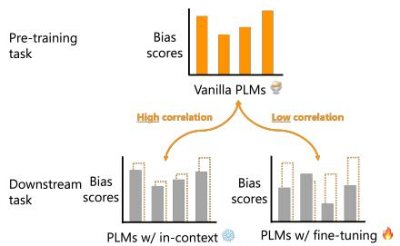
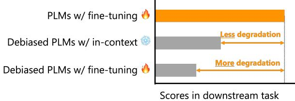
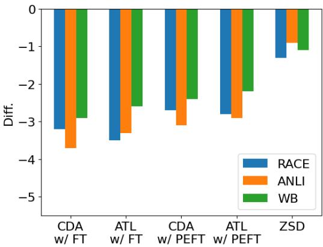
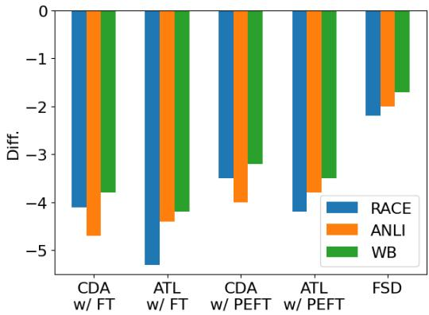

# The Gaps between Fine Tuning and In-context Learning in Bias Evaluation and Debiasing

Masahiro Kaneko1 Danushka Bollegala2,3\* Timothy Baldwin1

1MBZUAI 2University of Liverpool 3Amazon

Masahiro.Kaneko@mbzuai.ac.ae

danushka@liverpool.ac.uk Timothy.Baldwin@mbzuai.ac.ae

## Abstract

The output distribution of language models (LMs) varies markedly before and after fine tuning (FT) due to updates in the model parameters, which often leads to an exacerbation of social biases. For example, under FT-based debiasing methods designed to reduce extrinsic bias, it has been observed that there is a low correlation between the resultant intrinsic bias scores. Additionally, applying FT-based debiasing methods often leads to catastrophic forgetting, i.e. a decline in downstream performance. On the other hand, LMs trained on large datasets can learn without parameter updates via in-cotext learning (ICL) through prompting. Therefore, we hypothesize that the gap observed between base and FT models does not hold true for debiasing methods that use ICL. In this study, we demonstrate that ICL-based debiasing methods lead to a higher correlation between intrinsic and extrinsic bias scores compared to FT-based methods. Moreover, the performance degradation due to debiasing is also lower in the ICL case compared to FT.

## 1 Introduction

LMs learn not only beneficial information (Peters et al., 2018; Devlin et al., 2019; Brown et al., 2020; Touvron et al., 2023) but also undesirable social biases such as gender, race, and religious biases from the training data (Sun et al., 2019; Liang et al., 2020; Schick et al., 2021; Zhou et al., 2022; Guo et al., 2022; Kaneko and Baldwin, 2024; Kaneko et al., 2024). There are two major approaches to customize LMs to downstream tasks: FT and ICL. FT works by updating some or all parameters, while ICL uses prompts without modifying the model parameters.

(a) Bias evaluation.  
  
(b) Debiasing.  
Figure 1: The gap in bias scores when evaluating and debiasing LMs using FT- and ICL-based methods. A lower correlation between intrinsic and extrinsic bias scores (a), while a larger drop in downstream task performance (b) is encountered with FT compared to ICL.

Fine-tuned models diverge considerably from the corresponding base model in their output distributions (Chen et al., 2020). Similarly, the output distribution of a LM is significantly affected by FT-based debiasing methods, generally leading to catastrophic forgetting, or a systematic drop in performance on downstream tasks (Meade et al., 2022; Kaneko et al., 2023b; Oba et al., 2023; Hida et al., 2024). This is also the case for lighter-weight parameter-efficient fine tuning (PEFT) methods (Lauscher et al., 2021; Kumar et al., 2023; Xie and Lukasiewicz, 2023). Furthermore, bias evaluations exhibit a weak correlation between the base and fine-tuned LMs (Goldfarb-Tarrant et al., 2021; Kaneko et al., 2022a; Cao et al., 2022).

On the other hand, there has been no systematic analysis of whether this effect also occurs with ICL. We would expect that the absence of parameter updates in ICL to both curtail the effects of catastrophic forgetting, and avoid the disconnect between intrinsic and extrinsic bias.

In this paper, we investigate the performance gap of debiasing methods when applied to downstream tasks in an ICL setting. Additionally, we examine the correlation between bias evaluations for pretraining and downstream tasks enabled under ICL. Figure 1 shows our two investigations for debiasing and bias evaluation on FT and ICL. Our experimental results show that ICL results in a smaller gap than FT in terms of both catastrophic forgetting and the correlation between intrinsic and extrinsic bias, suggesting that ICL is a more effective approach to LM debiasing.

## 2 Experiments

## 2.1 Bias Evaluations

Pre-training settings. We target the following three intrinsic bias evaluation datasets: Crowds-Pairs (CP: Nangia et al. (2020)) and StereoSet (SS: Nadeem et al. (2021)) evaluate social biases of language models by comparing the likelihoods of pro-stereotypical (e.g. She is a nurse) and anti-stereotypical (e.g. She is a doctor) examples. Multilingual Bias Evaluation (MBE) (Kaneko et al., 2022b) evaluates gender bias in models across multiple languages by comparing likelihoods of feminine (e.g. She is a nurse) and masculine (e.g. He is a nurse) sentences. We compare the bias scores in pre-training and downstream tasks, requiring us to target the same language and bias type in both settings, in line with the benchmarks. As such, we focus exclusively on gender bias in English.

Downstream settings. We focus on three downstream tasks in our evaluations: question answering, natural language inference, and coreference resolution. Bias Benchmark for Question answering (BBQ: Parrish et al. (2022)) evaluates social biases by determining whether a model predicts prostereotypical, anti-stereotypical, or unknown answers when given ambiguous vs. disambiguated inputs. The Bias Natural Language Inference (BNLI: Anantaprayoon et al. (2023)) benchmark evaluates gender bias using premise and hypothesis sentences that share the same context and differ only in occupational and gender-related words. WinoBias (WB: Zhao et al. (2018)) evaluates gender bias by considering differences between model predictions on pro-stereotypical and anti-stereotypical sentences in a coreference resolution task.

## 2.2 Debiasing Methods

Fine-tuning. We use the following two FT- and PEFT-based debiasing methods that update the model parameters. Counterfactual Data Augmentation debiasing (CDA: Webster et al. (2020)) swaps gendered words in the training data to reduce bias. For instance, She is a nurse becomes He is a nurse in the augmented dataset, resulting in a more balanced dataset. All-Layer Token-level debiasing (ALT: Kaneko and Bollegala (2021)) mitigates biases in MLMs using orthogonal projections to address gender and occupational terms, offering broad applicability for token-level debiasing across all layers of an LM.

In-context learning. We use the following two ICL-based debiasing methods that do not modify the model parameters. Zero-Shot Debiasing (ZSD: Ganguli et al. (2023)) uses a specific prompt — Please ensure that your answer is unbiased and does not rely on stereotypes. — that has been shown to be effective in mitigating social biases. Few-Shot debiasing (FSD: Oba et al. (2023)) generates examples using manually-designed templates representing counterfactual statements.

## 2.3 Parameter-efficient fine tuning

Following Xie and Lukasiewicz (2023), we use the adapter method (Houlsby et al., 2019) as a PEFT method for evaluation and debiasing experiments. This adapter method inserts adapter modules between the model’s sublayers. We adopt the settings of Pfeiffer et al. (2021), inserting a single adapter after the feed-forward sublayer and determining the dimensions of the adapter modules by setting the reduction factor to 16.

## 2.4 Downstream Task Evaluations

We use the following three datasets to investigate the impact of the debiasing methods on the performance of question answering, natural language inference, and coreference resolution. RACE contains ca. 100K multiple-choice questions for reading comprehension, collected from English proficiency examinations for middle and high school students in China, covering a broad range of topics (Lai et al., 2017). Adversarial Natural Language Inference (ANLI), which determines whether the relationship between the two texts is entailment, contradiction, or neutral, includes ca. 170K pairs and was collected via an iterative, adversarial human-and-model-in-the-loop procedure (Nie et al., 2020). OntoNotes v5.0 dataset has 13K sentences for the coreference resolution task (Pradhan et al., 2013).

<table><tr><td rowspan="2"></td><td colspan="3">FT</td><td colspan="3">PEFT</td><td colspan="3">ICL</td></tr><tr><td>BBQ</td><td>BNLI</td><td>WB</td><td>BBQ</td><td>BNLI</td><td>WB</td><td>BBQ</td><td>BNLI</td><td>WB</td></tr><tr><td>CP</td><td>0.23</td><td>0.19</td><td>0.25</td><td>0.26</td><td>0.22</td><td>0.29</td><td>0.42†</td><td>0.39†</td><td>0.40†</td></tr><tr><td>SS</td><td>0.20</td><td>0.15</td><td>0.20</td><td>0.27</td><td>0.24</td><td>0.30</td><td>0.38†</td><td>0.44†</td><td>0.42†</td></tr><tr><td>MBE</td><td>0.10</td><td>-0.02</td><td>0.12</td><td>0.18</td><td>0.15</td><td>0.20</td><td>0.29†</td><td>0.35†</td><td>0.36†</td></tr></table>

Table 1: Correlation between bias scores of intrinsic bias evaluation and extrinsic bias evaluation. ‡ and † represent significant differences according to the t-test $( p < 0 . 0 1 )$ ) for FT vs. PEFT and PEFT vs. ICL, respectively.

## 2.5 Pre-trained Language Models

For our experiments, we need an LM that is of a size that allows for efficient FT and is able to follow instructions for ICL. For this reason, we select the LaMini models (Wu et al., 2023), which are distilled versions of larger large language models (LLMs). Specifically, we use: LaMini-T5-61M, LaMini-T5-223M, LaMini-GPT-124M, LaMini-Cerebras-111M, LaMini-Cerebras-256M, LaMini-Flan-T5-77M, LaMini-Flan-T5-248M, and LaMini-Neo-125M.

We fine-tune the models using the same instruction tuning process used in the LaMini knowledge distillation, and use huggingface implementations for our experiments (Wolf et al., 2019). We used four NVIDIA A100 GPUs for all experiments, and all training and inference steps were completed within 24 hours.

## 3 Results

## 3.1 Correlation between Bias Evaluations in Pre-training and Downstream Tasks

For intrinsic bias evaluation over CP, SS, and MBE, we focus on English gender bias, as described above. For the downstream evaluation with BBQ, BNLI, and WB, we fine-tuned on the downstream task datasets of RACE, ANLI, and OntoNotes, respectively, and evaluate gender bias in the downstream tasks. Furthermore, we used a few-shot ICL setting where we provided the LMs with 16 randomly-sampled instances from each downstream task dataset for FSD. To quantify the relationship between bias scores from CP, SS, and MBE and those from BBQ, BNLI, and WB across the eight LMs, we calculate the Pearson correlation r. This analysis elucidates the impact of finetuning LMs on downstream tasks. Moreover, we show an evaluation of the original LMs with respect to (w.r.t.) gender bias evaluations in pre-training and downstream tasks.

Table 1 shows the correlation between bias evaluation methods on the pre-training tasks (CP, SS, and MBE) and downstream tasks (BBQ, BNLI, and WB). Overall, the correlation is higher for ICL than FT and PEFT in all cases, and the difference between FT and PEFT is significant in only 2 out of 9 cases, indicating that they exhibit the same general tendencies in intrinsic and extrinsic bias evaluations.

It is well established that there is a negligible correlation between pre-training and downstream task bias evaluation scores for FT (Goldfarb-Tarrant et al., 2021; Cao et al., 2022; Kaneko et al., 2022a), and similar assumptions are commonly made for ICL settings (Oba et al., 2023; Goldfarb-Tarrant et al., 2023). However, the results for ICL-based debiasing methods must be interpreted with special care, and our results show that bias evaluations in pre-training tasks have the potential to reflect social biases related to a wide range of downstream tasks, especially when debiased with ICL-based methods.

## 3.2 Impact of Debiasing via Fine-tuning vs. ICL in Downstream Task Performance

Debiasing methods decrease the downstream task performance of LMs due to catastrophic forgetting (Kaneko et al., 2023a). Therefore, we must control for the degree of bias mitigation brought about by each debiasing method to fairly compare their downstream task performance. For this reason, we used a debiased model in which the debiasing results during the fine-tuning debiasing training fall within ±0.005 of the debiasing score on ZSD and FSD, respectively.2

(a) Bias mitigation equalized w.r.t. ZSD.  
  
(b) Bias mitigation equalized w.r.t. FSD.  
Figure 2: Performance difference between original and debiased LMs over the RACE, ANLI, and WB tasks. Here, LMs are debiased using CDA and ATL with (FT, PEFT) and ICL-based methods.

Figure 2 shows the performance difference between the original and debiased models over the RACE, ANLI, and WB tasks. Figure 2a and Figure 2b show the effect of bias mitigation of CDA and ATL (the two fine-tuning-based bias mitigation methods) equalized respectively against ZSD and FSD (the two ICL methods). The performance drops due to debiasing with both CDA and ATL, based on FT and PEFT, are higher than those of FSD and ZSD. We confirm that there are significant differences between ZSD and FSD for CDA and ATL under both FT and PEFT, according to McNemar’s test $( p \ < \ 0 . 0 1 )$ ). Moreover, we see that the drop in performance for CDA and ATL is higher when equalized w.r.t. ZSD than FSD, because ZSD imparts a lesser impact on the LM compared to FSD. Overall, compared to debiasing via ICL, debiasing via FT and PEFT results in a larger downstream task degradation due to the updating of model parameters.

<table><tr><td></td><td>RACE</td><td>ANLI</td><td>OntoNotes</td></tr><tr><td>CDA w/ FT</td><td>0.66</td><td>0.54</td><td>0.61</td></tr><tr><td>ALT w/ FT</td><td>0.60</td><td>0.51</td><td>0.54</td></tr><tr><td>CDA w/ PEFT</td><td>0.70</td><td>0.65</td><td>0.67</td></tr><tr><td>ALT w/ PEFT</td><td>0.65</td><td>0.59</td><td>0.62</td></tr><tr><td>ZSD</td><td>0.81F</td><td> $\overline { { 0 . 8 3 } } ^ { \dagger }$ </td><td>0.87F</td></tr><tr><td>FSD</td><td>0.73</td><td> $0 . 7 6 ^ { \circ }$ </td><td> $0 . 8 1 ^ { \circ }$ </td></tr></table>

Table 2: Cosine similarity between output states of the original and debiased models. ‡, †, and ⋄ represent significant difference determined by the t-test $( p < 0 . 0 1 )$ for FT vs. PEFT, ZSD vs. PEFT, and FSD vs. PEFT, respectively.

## 3.3 Change of Parameters in LMs

To quantify the change in model outputs due to FT vs. ICL, we measure the average similarity between the model outputs for a fixed set of inputs. Specifically, we feed the i-th instance, $x _ { i } .$ , from a downstream task dataset to the original (nondebiased) LM under investigation and retrieve its output state $e _ { i } ^ { o }$ (i.e. the hidden state corresponding to the final token in the last layer). Likewise, we retrieve the output states for the debiased model with FT, PEFT, and $\mathrm { I C L } ,$ denoted respectively by $e _ { i } ^ { f }$ and $e _ { i } ^ { c } .$ . We then calculate the cosine similarities cossim $( e _ { i } ^ { o } , e _ { i } ^ { f } )$ and cossim $( e _ { i } ^ { o } , e _ { i } ^ { c } )$ , and average them across the entire dataset as shown in Table 2 for the eight LaMini LMs. We can see that the cosine similarity is higher for the debiased models with ICL than with FT and PEFT. As such, models which are debiased with ICL have smaller changes in output states than debiased models with FT and PEFT, indicating that the former is less likely to suffer from catastrophic forgetting, and maintain downstream task performance. This result supports the hypothesis that the reduction of the gap in the relationship between pre-training and downstream settings is dependent on the changes in the parameters in the model due to debiasing.

## 4 Conclusion

We empirically investigated the gap between pretraining and downstream settings in bias evaluation and debiasing, and showed that this gap is higher for FT-based debiasing methods than for the FT-based ones. Furthermore, we showed that the performance degradation in downstream tasks due to debiasing is lower for ICL methods than FT methods.

Previous studies have referred to the results of FT-based results to discuss the relationship between pre-training and downstream task performance (Kaneko and Bollegala, 2019; Goldfarb-Tarrant et al., 2021; Cao et al., 2022). However, we emphasize that in-context learning and fine-tuning differ in their impact on the underlying models, and thus need to be considered separately.

## Limitations

Our study has the following limitations. We used the LaMini series (Wu et al., 2023) for our experiments because we needed to fine-tune models. To investigate whether larger LMs such as the LLaMa series (Touvron et al., 2023) and Flan-T5 (Chung et al., 2022) have the same tendencies, further experiments are needed with much higher computational needs. We only used QA, NLI, and coreference resolution as downstream tasks for our experiments. As more evaluation data for assessing social biases in downstream tasks becomes available in the future, the conclusions from our experiments should be analyzed across a broader range of tasks and datasets.

There are numerous types of social biases, such as race and religion, encoded in LMs (Meade et al., 2022), but we consider only gender bias in this work. Moreover, we only focus on binary gender and plan to consider non-binary gender in future work (Ovalle et al., 2023). In addition, we consider only the English language in our evaluations, which is a morphologically limited language. As some research points out, social biases also exist in multilingual LMs (Kaneko et al., 2022b; Levy et al., 2023), which require further investigation.

## Ethics Statement

In this study, we have not created or released new bias evaluation data, nor have we released any models. Therefore, to the best of our knowledge, there are no ethical issues present in terms of data collection, annotation or released models. We observed that when employing ICL, there exists a correlation between intrinsic and downstream bias evaluations. However, it must be emphasized that foregoing downstream bias evaluations and proceeding to deploy models presents a substantial risk.

## References

Panatchakorn Anantaprayoon, Masahiro Kaneko, and Naoaki Okazaki. 2023. Evaluating gender bias of pre-trained language models in natural language in-

ference by considering all labels. arXiv preprint arXiv:2309.09697.

Tom Brown, Benjamin Mann, Nick Ryder, Melanie Subbiah, Jared D Kaplan, Prafulla Dhariwal, Arvind Neelakantan, Pranav Shyam, Girish Sastry, Amanda Askell, et al. 2020. Language models are few-shot learners. Advances in neural information processing systems, 33:1877–1901.

Yang Trista Cao, Yada Pruksachatkun, Kai-Wei Chang, Rahul Gupta, Varun Kumar, Jwala Dhamala, and Aram Galstyan. 2022. On the intrinsic and extrinsic fairness evaluation metrics for contextualized language representations. In Proceedings of the 60th Annual Meeting of the Association for Computational Linguistics (Volume 2: Short Papers), pages 561–570, Dublin, Ireland. Association for Computational Linguistics.

Sanyuan Chen, Yutai Hou, Yiming Cui, Wanxiang Che, Ting Liu, and Xiangzhan Yu. 2020. Recall and learn: Fine-tuning deep pretrained language models with less forgetting. In Proceedings of the 2020 Conference on Empirical Methods in Natural Language Processing (EMNLP), pages 7870–7881, Online. Association for Computational Linguistics.

Hyung Won Chung, Le Hou, Shayne Longpre, Barret Zoph, Yi Tay, William Fedus, Yunxuan Li, Xuezhi Wang, Mostafa Dehghani, Siddhartha Brahma, et al. 2022. Scaling instruction-finetuned language models. arXiv preprint arXiv:2210.11416.

Jacob Devlin, Ming-Wei Chang, Kenton Lee, and Kristina Toutanova. 2019. BERT: Pre-training of deep bidirectional transformers for language understanding. In Proceedings of the 2019 Conference of the North American Chapter of the Association for Computational Linguistics: Human Language Technologies, Volume 1 (Long and Short Papers), pages 4171–4186, Minneapolis, Minnesota. Association for Computational Linguistics.

Deep Ganguli, Amanda Askell, Nicholas Schiefer, Thomas Liao, Kamile Lukoši˙ ut¯ e, Anna Chen, Anna˙ Goldie, Azalia Mirhoseini, Catherine Olsson, Danny Hernandez, et al. 2023. The capacity for moral selfcorrection in large language models. arXiv preprint arXiv:2302.07459.

Seraphina Goldfarb-Tarrant, Rebecca Marchant, Ricardo Muñoz Sánchez, Mugdha Pandya, and Adam Lopez. 2021. Intrinsic bias metrics do not correlate with application bias. In Proceedings of the 59th Annual Meeting of the Association for Computational Linguistics and the 11th International Joint Conference on Natural Language Processing (Volume 1: Long Papers), pages 1926–1940, Online. Association for Computational Linguistics.

Seraphina Goldfarb-Tarrant, Eddie Ungless, Esma Balkir, and Su Lin Blodgett. 2023. This prompt is measuring <mask>: evaluating bias evaluation in

language models. In Findings of the Association for Computational Linguistics: ACL 2023, pages 2209– 2225, Toronto, Canada. Association for Computational Linguistics.

Yue Guo, Yi Yang, and Ahmed Abbasi. 2022. Auto-debias: Debiasing masked language models with automated biased prompts. In Proceedings of the 60th Annual Meeting of the Association for Computational Linguistics (Volume 1: Long Papers), pages 1012–1023, Dublin, Ireland. Association for Computational Linguistics.

Rem Hida, Masahiro Kaneko, and Naoaki Okazaki. 2024. Social bias evaluation for large language models requires prompt variations. ArXiv, abs/2407.03129.

Neil Houlsby, Andrei Giurgiu, Stanislaw Jastrzebski, Bruna Morrone, Quentin De Laroussilhe, Andrea Gesmundo, Mona Attariyan, and Sylvain Gelly. 2019. Parameter-efficient transfer learning for nlp. In International conference on machine learning, pages 2790–2799. PMLR.

Masahiro Kaneko and Timothy Baldwin. 2024. A little leak will sink a great ship: Survey of transparency for large language models from start to finish. arXiv preprint arXiv:2403.16139.

Masahiro Kaneko and Danushka Bollegala. 2019. Gender-preserving debiasing for pre-trained word embeddings. arXiv preprint arXiv:1906.00742.

Masahiro Kaneko and Danushka Bollegala. 2021. Debiasing pre-trained contextualised embeddings. In Proceedings of the 16th Conference of the European Chapter of the Association for Computational Linguistics: Main Volume, pages 1256–1266, Online. Association for Computational Linguistics.

Masahiro Kaneko, Danushka Bollegala, and Timothy Baldwin. 2024. Eagle: Ethical dataset given from real interactions. arXiv preprint arXiv:2402.14258.

Masahiro Kaneko, Danushka Bollegala, and Naoaki Okazaki. 2022a. Debiasing isn’t enough! – on the effectiveness of debiasing MLMs and their social biases in downstream tasks. In Proceedings of the 29th International Conference on Computational Linguistics, pages 1299–1310, Gyeongju, Republic of Korea. International Committee on Computational Linguistics.

Masahiro Kaneko, Danushka Bollegala, and Naoaki Okazaki. 2023a. Comparing intrinsic gender bias evaluation measures without using human annotated examples. In Proceedings of the 17th Conference of the European Chapter of the Association for Computational Linguistics, pages 2857–2863, Dubrovnik, Croatia. Association for Computational Linguistics.

Masahiro Kaneko, Danushka Bollegala, and Naoaki Okazaki. 2023b. The impact of debiasing on the performance of language models in downstream tasks is underestimated. arXiv preprint arXiv:2309.09092.

Masahiro Kaneko, Aizhan Imankulova, Danushka Bollegala, and Naoaki Okazaki. 2022b. Gender bias in masked language models for multiple languages. In Proceedings of the 2022 Conference of the North American Chapter of the Association for Computational Linguistics: Human Language Technologies, pages 2740–2750, Seattle, United States. Association for Computational Linguistics.

Deepak Kumar, Oleg Lesota, George Zerveas, Daniel Cohen, Carsten Eickhoff, Markus Schedl, and Navid Rekabsaz. 2023. Parameter-efficient modularised bias mitigation via AdapterFusion. In Proceedings of the 17th Conference of the European Chapter of the Association for Computational Linguistics, pages 2738–2751, Dubrovnik, Croatia. Association for Computational Linguistics.

Guokun Lai, Qizhe Xie, Hanxiao Liu, Yiming Yang, and Eduard Hovy. 2017. RACE: Large-scale ReAding comprehension dataset from examinations. In Proceedings of the 2017 Conference on Empirical Methods in Natural Language Processing, pages 785–794, Copenhagen, Denmark. Association for Computational Linguistics.

Anne Lauscher, Tobias Lueken, and Goran Glavaš. 2021. Sustainable modular debiasing of language models. In Findings of the Association for Computational Linguistics: EMNLP 2021, pages 4782–4797, Punta Cana, Dominican Republic. Association for Computational Linguistics.

Sharon Levy, Neha John, Ling Liu, Yogarshi Vyas, Jie Ma, Yoshinari Fujinuma, Miguel Ballesteros, Vittorio Castelli, and Dan Roth. 2023. Comparing biases and the impact of multilingual training across multiple languages. In Proceedings of the 2023 Conference on Empirical Methods in Natural Language Processing, pages 10260–10280, Singapore. Association for Computational Linguistics.

Paul Pu Liang, Irene Mengze Li, Emily Zheng, Yao Chong Lim, Ruslan Salakhutdinov, and Louis-Philippe Morency. 2020. Towards debiasing sentence representations. In Proceedings of the 58th Annual Meeting of the Association for Computational Linguistics, pages 5502–5515, Online. Association for Computational Linguistics.

Nicholas Meade, Elinor Poole-Dayan, and Siva Reddy. 2022. An empirical survey of the effectiveness of debiasing techniques for pre-trained language models. In Proceedings of the 60th Annual Meeting of the Association for Computational Linguistics (Volume 1: Long Papers), pages 1878–1898, Dublin, Ireland. Association for Computational Linguistics.

Moin Nadeem, Anna Bethke, and Siva Reddy. 2021. StereoSet: Measuring stereotypical bias in pretrained language models. In Proceedings of the 59th Annual Meeting of the Association for Computational Linguistics and the 11th International Joint Conference on Natural Language Processing (Volume 1: Long Papers), pages 5356–5371, Online. Association for Computational Linguistics.

Nikita Nangia, Clara Vania, Rasika Bhalerao, and Samuel R. Bowman. 2020. CrowS-pairs: A challenge dataset for measuring social biases in masked language models. In Proceedings of the 2020 Conference on Empirical Methods in Natural Language Processing (EMNLP), pages 1953–1967, Online. Association for Computational Linguistics.

Yixin Nie, Adina Williams, Emily Dinan, Mohit Bansal, Jason Weston, and Douwe Kiela. 2020. Adversarial NLI: A new benchmark for natural language understanding. In Proceedings of the 58th Annual Meeting of the Association for Computational Linguistics, pages 4885–4901, Online. Association for Computational Linguistics.

Daisuke Oba, Masahiro Kaneko, and Danushka Bollegala. 2023. In-contextual bias suppression for large language models. arXiv preprint arXiv:2309.07251.

Anaelia Ovalle, Palash Goyal, Jwala Dhamala, Zachary Jaggers, Kai-Wei Chang, Aram Galstyan, Richard Zemel, and Rahul Gupta. 2023. “i’m fully who i am”: Towards centering transgender and non-binary voices to measure biases in open language generation. In Proceedings of the 2023 ACM Conference on Fairness, Accountability, and Transparency, pages 1246–1266.

Alicia Parrish, Angelica Chen, Nikita Nangia, Vishakh Padmakumar, Jason Phang, Jana Thompson, Phu Mon Htut, and Samuel Bowman. 2022. BBQ: A hand-built bias benchmark for question answering. In Findings of the Association for Computational Linguistics: ACL 2022, pages 2086–2105, Dublin, Ireland. Association for Computational Linguistics.

Matthew E. Peters, Mark Neumann, Mohit Iyyer, Matt Gardner, Christopher Clark, Kenton Lee, and Luke Zettlemoyer. 2018. Deep contextualized word representations. In Proceedings of the 2018 Conference of the North American Chapter of the Association for Computational Linguistics: Human Language Technologies, Volume 1 (Long Papers), pages 2227– 2237, New Orleans, Louisiana. Association for Computational Linguistics.

Jonas Pfeiffer, Aishwarya Kamath, Andreas Rücklé, Kyunghyun Cho, and Iryna Gurevych. 2021. AdapterFusion: Non-destructive task composition for transfer learning. In Proceedings of the 16th Conference of the European Chapter of the Association for Computational Linguistics: Main Volume, pages 487–503, Online. Association for Computational Linguistics.

Sameer Pradhan, Alessandro Moschitti, Nianwen Xue, Hwee Tou Ng, Anders Björkelund, Olga Uryupina, Yuchen Zhang, and Zhi Zhong. 2013. Towards robust linguistic analysis using OntoNotes. In Proceedings of the Seventeenth Conference on Computational Natural Language Learning, pages 143–152, Sofia, Bulgaria. Association for Computational Linguistics.

Timo Schick, Sahana Udupa, and Hinrich Schütze. 2021. Self-Diagnosis and Self-Debiasing: A Proposal for

Reducing Corpus-Based Bias in NLP. Transactions of the Association for Computational Linguistics, 9:1408–1424.

Tony Sun, Andrew Gaut, Shirlyn Tang, Yuxin Huang, Mai ElSherief, Jieyu Zhao, Diba Mirza, Elizabeth Belding, Kai-Wei Chang, and William Yang Wang. 2019. Mitigating gender bias in natural language processing: Literature review. In Proceedings of the 57th Annual Meeting of the Association for Computational Linguistics, pages 1630–1640, Florence, Italy. Association for Computational Linguistics.

Hugo Touvron, Louis Martin, Kevin Stone, Peter Albert, Amjad Almahairi, Yasmine Babaei, Nikolay Bashlykov, Soumya Batra, Prajjwal Bhargava, Shruti Bhosale, et al. 2023. Llama 2: Open foundation and fine-tuned chat models. arXiv preprint arXiv:2307.09288.

Kellie Webster, Xuezhi Wang, Ian Tenney, Alex Beutel, Emily Pitler, Ellie Pavlick, Jilin Chen, Ed Chi, and Slav Petrov. 2020. Measuring and reducing gendered correlations in pre-trained models. arXiv preprint arXiv:2010.06032.

Thomas Wolf, Lysandre Debut, Victor Sanh, Julien Chaumond, Clement Delangue, Anthony Moi, Pierric Cistac, Tim Rault, Rémi Louf, Morgan Funtowicz, et al. 2019. Huggingface’s transformers: State-ofthe-art natural language processing. arXiv preprint arXiv:1910.03771.

Minghao Wu, Abdul Waheed, Chiyu Zhang, Muhammad Abdul-Mageed, and Alham Fikri Aji. 2023. Lamini-lm: A diverse herd of distilled models from large-scale instructions. arXiv preprint arXiv:2304.14402.

Zhongbin Xie and Thomas Lukasiewicz. 2023. An empirical analysis of parameter-efficient methods for debiasing pre-trained language models. In Proceedings of the 61st Annual Meeting of the Association for Computational Linguistics (Volume 1: Long Papers), pages 15730–15745, Toronto, Canada. Association for Computational Linguistics.

Jieyu Zhao, Tianlu Wang, Mark Yatskar, Vicente Ordonez, and Kai-Wei Chang. 2018. Gender bias in coreference resolution: Evaluation and debiasing methods. In Proceedings of the 2018 Conference of the North American Chapter of the Association for Computational Linguistics: Human Language Technologies, Volume 2 (Short Papers), pages 15– 20, New Orleans, Louisiana. Association for Computational Linguistics.

Yi Zhou, Masahiro Kaneko, and Danushka Bollegala. 2022. Sense embeddings are also biased – evaluating social biases in static and contextualised sense embeddings. In Proceedings of the 60th Annual Meeting of the Association for Computational Linguistics (Volume 1: Long Papers), pages 1924–1935, Dublin, Ireland. Association for Computational Linguistics.