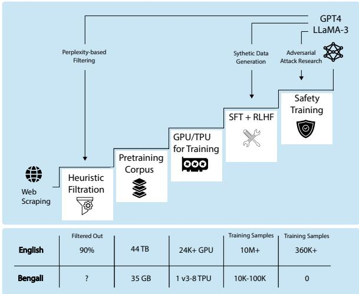
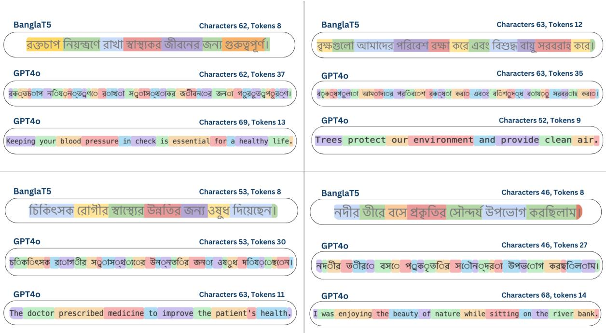

# Too Late to Train, Too Early To Use? A Study on Necessity and Viability of Low-Resource Bengali LLMs

Tamzeed Mahfuz<sup>1∗</sup>, Satak Kumar Dey<sup>1∗</sup>, Ruwad Naswan<sup>1∗</sup>, Hasnaen Adil<sup>1</sup> Khondker Salman Sayeed<sup>2</sup>, Haz Sameen Shahgir<sup>3†</sup>

Bangladesh University of Engineering and Technology<sup>1</sup>, IQVIA<sup>2</sup>, University of California Riverside<sup>3</sup>

## Abstract

Each new generation of English-oriented Large Language Models (LLMs) exhibits enhanced cross-lingual transfer capabilities and significantly outperforms older LLMs on lowresource languages. This prompts the question: Is there a need for LLMs dedicated to a particular low-resource language? We aim to explore this question for Bengali, a low-tomoderate resource Indo-Aryan language native to the Bengal region of South Asia.

We compare the performance of open-weight and closed-source LLMs such as LLaMA-3 and GPT-4 against fine-tuned encoder-decoder models across a diverse set of Bengali downstream tasks, including translation, summarization, paraphrasing, question-answering, and natural language inference. Our findings reveal that while LLMs generally excel in reasoning tasks, their performance in tasks requiring Bengali script generation is inconsistent. Key challenges include inefficient tokenization of Bengali script by existing LLMs, leading to increased computational costs and potential performance degradation. Additionally, we highlight biases in machine-translated datasets commonly used for Bengali NLP tasks. We conclude that there is a significant need for a Bengali-oriented LLM, but the field currently lacks the high-quality pretraining and instruction-tuning datasets necessary to develop a highly effective model.<sup>\*</sup>

## 1 Introduction

The release of GPT-3.5 (Brown et al., 2020) in late 2022 has kickstarted the current era of rapid progress in Large Language Models (LLMs). However, this progress is not merely a result of increased model scale, rather, it stems from a virtuous cycle of innovation, where lessons from each generation inform the development of the next. Techniques such as synthetic data generation (Eldan and Li, 2023; Gunasekar et al., 2023), the integration of mathematical and coding tasks to enhance reasoning capabilities (Ma et al., 2023), and research into adversarial attacks (Zou et al., 2023) for improved safety have all contributed to the ever-increasing capabilities of LLMs. As illustrated in Figure 1, developing state-of-the-art LLMs involves filtering vast amounts of web-scraped data, utilizing substantial computational resources, and implementing advanced techniques for alignment and safety.

  
Figure 1: Large Language Model Training Pipeline and Resource Comparison between BanglaT5 (Bhattacharjee et al., 2022) vs. LLaMA-3 (Meta, 2024). The first step towards capable Bengali LLMs is collecting a large pretraining corpus. However, the iterative nature of LLM development makes it unlikely that sufficient pretraining data and compute alone would enable Bengali LLMs to match the capabilities of their English-oriented counterparts.

However, this progress poses a dilemma for lowresource languages like Bengali. Despite being one of the most widely spoken languages, the size of Bengali pretraining and instruction-tuning data are minuscule compared to their English counterparts (Hasan et al., 2020; Bhattacharjee et al., 2021). To this date, BanglaT5 (Bhattacharjee et al., 2022), a 248 million parameter encoder-decoder T5 transformer (Raffel et al., 2020), remains the most capable Bengali Language Model. Furthermore, prematurely investing in training larger models might yield lackluster results due to the lack of high-quality Bengali data.

In this study, we aim to quantify the demand and viability of a Bengali-oriented LLM. To this end, we compile a representative benchmark of both Natural Language Understanding (NLU) and Natural Language Generation (NLG) downstream tasks for Bengali and evaluate a wide range of open-weights and closed-source models. Our key findings include:

1. Compared to fine-tuned BanglaT5 or BanglaBERT, English-oriented LLMs excel in comprehension tasks (NLU) and perform inconsistently in Bengali generation (NLG).

2. Using machine translation to translate English NLG datasets into Bengali biases the dataset towards specific writing styles and skews downstream metrics such as BLEU and ROUGE in favor of fine-tuned models regardless of generation quality.

3. Bengali is over-tokenized by the BPE tokenizer used English LLM, with an average of ∼ 0.85 characters-per-token compared to ∼ 4.5 for English. Over-tokenization leads to $O ( n ^ { 2 } )$ attention-based LLMs being highly inefficient in processing Bengali script.

4. The outputs of English LLMs on Bengali Reward Modeling tasks do not correlate strongly with human judgment. As such, these LLMs have limited applicability in generating Bengali RLHF datasets.

A comprehensive evaluation of state-of-the-art LLMs on 7 Bengali NLU and NLG tasks, revealing task-dependent performance variations. An analysis of the inefficient tokenization of Bengali script by existing LLMs and its impact on model performance. Insights into the challenges and potential strategies for developing Bengali-specific LLMs, balancing the need for language-specific models against the rapid progress in multilingual capabilities of existing LLMs.

## 2 Preliminaries

## 2.1 Tasks and Datasets

We evaluate the latest LLMs on a wide range of Bengali downstream tasks as shown in Table 1, covering both Natural Language Understanding (NLU) and Natural Language Generation (NLG). We elaborate on the differences between the Question-Answering datasets and the construction of the Reward Modeling dataset.

Question-Answering: Among the Question-Answering (QA) datasets, Squad-bn (Bhattacharjee et al., 2021) and BanglaRQA (Ekram et al., 2022) are close-ended reading comprehension datasets, i.e. the LLM is given a context and a question, and must first determine whether the answer is present in the context and then extract the answer if it does. BEnQA is a close-ended, open-domain QA dataset where the LLM is asked a factual STEM-related question from the middle-school/high-school curriculum of Bangladesh.

Reward Modeling: While combined fine-tuning downstream tasks (Chung et al., 2024) such as translation, summarization, and Question-Answering was the dominant post-pretraining paradigm from early Language Models such as T5 (Raffel et al., 2020), much of the impressible capabilities of Billion parameter-scale LLMs can be attributed to RLHF (Ouyang et al., 2022a,b), which improves the generalizability of LLMs even to unseen tasks. Lee et al. (2023) has shown that feedback from other LLMs can substitute the need for human feedback in RLHF, in a method dubbed RLAIF. RLAIF can also be more robust than simple synthetic fine-tuning data generation (Abdin et al., 2024) which might overfit benchmarks (Zhang et al., 2024). To test the capability of English LLMs to provide feedback on Bengali NLG, we created a new Reward Modeling task based on XLSum (Hasan et al., 2021a). In this abstractive summarization dataset, we give the LLM a Bengali article and two summaries and ask it to pick the better one. We take the summary in the XLSum as the gold summary and the article’s first sentence as the heuristically best summary. We instruct the LLM to prefer abstractive summaries over extractive ones. Refer to Appendix B for the instruction template used. We randomly pick 300 samples from the test dataset due to cost considerations.

<table><tr><td>Type</td><td>Task</td><td>Dataset</td><td>ITestl</td><td>Data Curation</td><td>Metric</td><td>Best Model</td></tr><tr><td rowspan="5">NLG</td><td>Translation</td><td>BanglaNMT (Hasan et al., 2020)</td><td>1000</td><td>aligned</td><td>BLEU</td><td>LLaMA-3-70B (B-E) NLLB-3.3B (E-B)</td></tr><tr><td>Monolingual Summarization</td><td>XLSum (Hasan et al., 2021a)</td><td>1012</td><td>in-language</td><td>ROUGE-2</td><td>BanglaT5-248M-FT</td></tr><tr><td>Crosslingual Summarization</td><td>CrossSum (Hasan et al., 2021b)</td><td>161 (E-B) 161 (B-E)</td><td>aligned</td><td>ROUGE-2</td><td>LLaMA-3-70B (E-B) LLaMA-3-70B (B-E)</td></tr><tr><td>Paraphrase</td><td>BanglaParaphrase (Akil et al., 2022)</td><td>23332</td><td>machine translated</td><td>ROUGE-2</td><td>BanglaT5-248M-FT</td></tr><tr><td>QA (compr.)</td><td>Squad-bn/BQA (Bhattacharjee et al., 2021)</td><td>2504</td><td>machine translated</td><td>F1/Match</td><td>LLaMA-3-70B</td></tr><tr><td rowspan="5">NLU</td><td>QA (compr.)</td><td>BanglaRQA (Ekram et al., 2022)</td><td>1493</td><td>in-language</td><td>F1/Match</td><td>LLaMA-3-8B-q4-FT</td></tr><tr><td>QA (open-dom.)</td><td>BEnQA (Shafayat et al., 2024)</td><td>5161</td><td>in-language</td><td>Acc.</td><td>GPT4</td></tr><tr><td>Inference</td><td>XNLI-bn (Bhattacharjee et al., 2021)</td><td>4895</td><td>machine translated</td><td>Acc.</td><td>LLaMA-3-8B-q4-FT</td></tr><tr><td>Reward Modeling</td><td>XLSum (adapted subset)</td><td>300</td><td>in-language</td><td>Acc.</td><td>LLaMA-3-70B</td></tr></table>

Table 1: Bengali datasets used in our experiments and the best model for each dataset. E-B stands for English-to-Bengali generative tasks. FT stands forfinetuned.

## 2.2 Models

Large Language Models can be categorized into open weights or closed-source models, based on whether individual users can download the model parameters or not. The current state-of-the-art LLM according to most benchmarks and user preference (Chiang et al., 2024) is the closedsource GPT4o. The leading open-weights LLM in LLaMA-3-70B-Instruct (Meta, 2024), which ranks 9<sup>th</sup> on the English-only LMSYS Leaderboard and 12<sup>th</sup> overall. We note that open-weights models are not open-source because most have proprietary licenses that restrict certain use cases such as commercial applications or synthetic data generation.

Open-weights Models: We test both the 8 and 70 billion variants of LLaMA-3 on all downstream tasks. We selectively include results from other open-weights LLMs such as Mistral-7B-0.3 (Jiang et al., 2023), Aya-23-8B (Aryabumi et al., 2024), Qwen-2-72B (Bai et al., 2023) for certain tasks. Aya-23 is a multilingual LLM family that was not specifically trained for Bengali but was trained on related language families. Qwen-2 is a primarily English-Chinese LLM family with Bengali-specific training data augmentation <sup>†</sup>.

For translation, we test 3 variants of the translation-only NLLB Language Model (Costajussà et al., 2022) on BanglaNMT (Hasan et al., 2020). We also test the performance of 8-bit quantized LLaMA-3-8B-Instruct to showcase what is possible on consumer-grade hardware. All reported models are Chat- or Instruct-tuned unless specified otherwise.

Closed-Source Models: Due to high inference costs on Bengali text, we report GPT4o performance only on the Reward Modeling task. We report the performance of closed-source models such as GPT3.5, GPT4, and Gemini-1.5-Pro (Team et al., 2023) if present in the literature.

## 2.3 Tokenization of Bengali Script

Almost all LLMs use some variant of Byte-Pair Encoding (BPE) (Sennrich et al., 2015), an algorithm that iteratively combines the most common substrings into tokens. This naturally leads to underrepresented scripts and notations being tokenized at higher granularities, leading to undertrained tokens, lower efficiency, and information density.

We run pilot experiments on how LLMs tokenize Bengali text using the articles in XLSum (Hasan et al., 2021a). We find that the average character-per-token value for Bengali using

English LLMs is ∼ 0.85, which means that each token corresponds to less than one Unicode Bengali character. In comparison, the characterper-token value for English is ∼ 4.5. The notable exception is BanglaT5 (Bhattacharjee et al., 2022) which trained the tokenizer mainly on Bengali text and NLLB (Costa-jussà et al., 2022), which upsampled low-resource languages and downsampled high-resource ones when training the tokenizer. Detailed findings are presented in Appendix C.

Doddapaneni et al. (2022) notes the excessive tokenization of Bengali by BERT-based models. Yuan et al. (2023) highlight a novel link between excessive tokenization and the subpar performance of finetuning on languages that use a non-Latin script. They further highlight the existence of redundant tokens and show that removing them improves finetuning results.

## 3 Experimental Setup

We use Together AI API for full-precision inference with open-weights LLMs. For NLLB and 8-bit quantized LLaMA-3-8B, we use Hugging Face library on a single NVIDIA RTX A6000 machine. For Aya-23-8B, we use a 3× NVIDIA RTX A6000 cluster. We use the sacreBLEU library to calculate BLEU and the Multilingualrouge-scoring repository for ROUGE scores on Bengali text. For summarization tasks (Hasan et al., 2021a,b), we truncate the articles to 7000 tokens using the LLaMA-3 tokenizer due to the 8192 context window of LLaMA-3 models.

In tasks where frozen LLMs underperform, we minimally fine-tune LLaMA-3-8B-Instruct to probe the limitations of LLMs. We finetune LLaMA-3-8B-Instruct using 4-bit integer quantization, QLoRA (Dettmers et al., 2024) using the Unsloth AI library on a single NVIDIA RTX A6000. Task-wise hyperparameters are in Appendix A.

## 4 Results

In this section, we cover the results of our experiments on NLG and NLU tasks sequentially. The excellent performance of the NLLB-1.3B-Distilled (Costa-jussà et al., 2022) on Bengali-to-English transition as highlighted in Section 4.1 and the lackluster performance of even GPT4o on Reward Modeling in Section 4.6 are particularly noteworthy since both are relevant to synthetic data generation and RLHF required to train LLMs.

## 4.1 Translation

Table 2 shows that Google Translate significantly outperforms all LLMs and encoder-decoder transformers on both Bengali-to-English (B-E) and English-to-Bengali (E-B) translations. The large difference between Google Translate and other LLMs potentially points to data contamination. On the FLORES-101 (Goyal et al., 2022) Bengali dev. test, NLLB-200 models were significantly better than Google Translate (Costa-jussà et al., 2022).

LLaMA-3-70B is the most capable B-E translator among the open-weights models, beating out the finetuned BanglaT5 (Bhattacharjee et al., 2022). This result disagrees with Asai et al. (2023) where small, finetuned encoder-decoder models outperformed LLaMA-2 on other tasks. Perhaps more impressively, the translation-specialized NLLB-3.3B (Costa-jussà et al., 2022) is the best E-B translator, with even smaller NLLB variants outperforming much larger LLMs. As highlighted in Appendix Table 8, The NLLB model family also boasts better tokenization support for Bengali, further improving inference speed and efficiency. Notably, the largest NLLB model is NLLB-54B-MoE which performs even better. See Appendix Table 10 for the comparison of NLLB variants on another English-Bengali dataset.

The consistent difference between E-B and B-E underlines how all translation systems find it harder to generate Bengali script (E-B) than to understand it (B-E).

<table><tr><td>Model</td><td>B-E</td><td>E-B</td></tr><tr><td>BanglaT5-248M-FT</td><td>31.30</td><td>17.40</td></tr><tr><td>NLLB-600M-dis.</td><td>29.52</td><td>17.56</td></tr><tr><td>NLLB-1.3B-dis. NLLB-3.3B</td><td>30.96</td><td>18.97</td></tr><tr><td></td><td>30.97</td><td>19.73</td></tr><tr><td>Mistral-7B-v0.3 LLaMA-3-8B-q8</td><td>14.91 26.82</td><td>3.67</td></tr><tr><td>LLaMA-3-8B</td><td>28.48</td><td>12.07 12.82</td></tr><tr><td>LLaMA-3-70B</td><td></td><td></td></tr><tr><td></td><td>33.55</td><td>18.92</td></tr><tr><td>Qwen-2-72B</td><td>32.68</td><td>14.34</td></tr><tr><td>Google Translate</td><td>38.58†</td><td>28.15†</td></tr></table>

Table 2: Bengali-to-English (B-E) and English-to-Bengali (E-B) Translation performance of different models on BanglaNMT (Hasan et al., 2020). Reporting BLEU scores. † Google Translate API was used on June 21, 2024. The large BLEU score gap suggests data contamination in the Google Translate engine.

## 4.2 Summarization

In Table 3, we show that the finetuned BanglaT5 (Bhattacharjee et al., 2022), a 248M encoderdecoder performs better than even LLaMA-3-70B, a 320× larger English LLM on Bengali-to-Bengali (B-B) summarization. B-B summarization requires both Bengali reading comprehension and generation. On the other hand, LLaMA-3-70B has 2× higher ROUGE-2 score than BanglaT5 on B-E cross-lingual summarization and outperforms it on E-B summarization as well. Even the smaller 8B LLaMA-3 variant outperforms BanglaT5 on B-E CrossSum while Qwen-2-72B performs on par with the similarly sized LLaMA-3.

<table><tr><td>Dataset</td><td>Model</td><td>B-B</td><td>B-E</td><td>E-B</td></tr><tr><td rowspan="3">XLSum</td><td rowspan="3">BanglaT5-FT Mistral-7B-v0.3 LLaMA-3-8B LLaMA-3-70B</td><td>13.7</td><td>1</td><td></td></tr><tr><td>6.40</td><td>1</td><td></td></tr><tr><td>7.36 8.66</td><td></td><td></td></tr><tr><td rowspan="3">CrossSum</td><td rowspan="3">Qwen-2-72B BanglaT5-FT Mistral-7B-v0.3</td><td>7.54</td><td>1 –</td><td></td></tr><tr><td>I</td><td>6.40</td><td>4.00</td></tr><tr><td></td><td>5.61</td><td>3.21</td></tr><tr><td rowspan="3"></td><td>LLaMA-3-8B</td><td></td><td>8.88</td><td>2.75</td></tr><tr><td>LLaMA-3-70B</td><td></td><td>12.83</td><td>4.93</td></tr><tr><td>Qwen-2-72B</td><td>=</td><td>12.54</td><td>4.91</td></tr></table>

Table 3: ROUGE-2 scores of LLMs on XLSum (Hasan et al., 2021a) and CrossSum (Hasan et al., 2021b). B-B denotes Bengali Article-to-Bengali summaries.

## 4.3 Paraphrasing

<table><tr><td>Dataset</td><td>Model</td><td>BLEU</td></tr><tr><td rowspan="5">Bangla- Paraphrase</td><td>BanglaT5-FT LLaMA-3-8B-q8</td><td>32.80 8.21</td></tr><tr><td>LLaMA-3-8B-q4-FT</td><td>26.99</td></tr><tr><td></td><td></td></tr><tr><td>LLaMA-3-8B</td><td>9.13</td></tr><tr><td>LLaMA-3-70B Qwen-2-72B</td><td>10.18 12.47</td></tr></table>

Table 4: Performance of different models on BanglaParaphrase (Akil et al., 2022).

Table 4 shows the finetuned BanglaT5 (Bhattacharjee et al., 2022) outperforms all LLMs on Bengali paraphrase generation. As with B-B summarization, BanglaParaphrase (Akil et al., 2022) is also a Bengali-to-Bengali task. However, BanglaT5’s BLEU metric is 3× higher than even the LLaMA-3-70B. We manually inspected the reference paraphrase in the dataset and BanglaT5’s and LLaMA-3-70B outputs. We discovered that the paraphrases generated by BanglaT5’s outputs were more similar to the reference paraphrase in word choice, succinctness, and grammatical structure, while LLaMA-3-70B generated different but still perfectly valid paraphrases, with a slight tendency to generate longer phrases. Therefore, we suspect the high BLEU score of BanglaT5 to the fact that BanglaParaphrase was generated synthetically using translation and back-translation. Specifically, Akil et al. (2022) used the translation model introduced by Hasan et al. (2020) to generate 5 paraphrases of each Bengali sentence in their corpus and filtered using LaBSE (Feng et al., 2022). Both the translation pipeline and the choice of filtration likely introduce grammatical and word-choice biases into the dataset.

To investigate our suspicion, we run a small-scale fine-tuning experiment on LLaMA-3-8B-Instruct. We finetune LLaMa-3 using 4-bit quantization and QLoRA (Dettmers et al., 2024) for only 1 epoch on the 420K training samples from BanglaParaphrase. <sup>‡</sup> Despite using int-4 quantization and QLoRA, our fine-tuned LLaMA-3-8B-q4-FT significantly outperformed all non-finetuned LLMs including LLaMA-3- 70B. Through manual inspection, we find that LLaMA-3-8B-q4-FT generates phrases similar to the reference paraphrase, with overlapping word choice and grammatical structure. Therefore, we surmise that the use of machine translation and LaBSE filtering has biased the reference summaries in Banglaphrase towards a certain linguistic style. As such, we advocate for human evaluation (Stiennon et al., 2020) over automated metrics such as BLEU or ROUGE for synthetic NLG tasks.

## 4.4 Question-Answering

Out of the 3 QA datasets tested, Squad-Bn (Bhattacharjee et al., 2021) and BanglaRQA (Ekram et al., 2022) are reading comprehension tasks where a passage is provided and the models must answer with a single substring/span of the passage. Squad-bn and BanglaRQA have non-answerable questions, i.e. the answer is not in the passage. Furthermore, BanglaRQA contains questions where the answers are yes-no or multiple spans from the passage.

<table><tr><td rowspan=1 colspan=1>Dataset</td><td rowspan=1 colspan=1>Model</td><td rowspan=1 colspan=2>F1</td><td rowspan=1 colspan=1>Exact</td></tr><tr><td rowspan=6 colspan=1>Squad-Bn</td><td rowspan=6 colspan=1>BanglaT5-FTMistral-7B-v0.3LLaMA-3-8B-q8LLaMA-3-8BLLaMA-3-70BAya-23-8B</td><td rowspan=1 colspan=2>74.8</td><td rowspan=1 colspan=1>68.5</td></tr><tr><td rowspan=1 colspan=2>54.9</td><td rowspan=1 colspan=1>49.8</td></tr><tr><td rowspan=1 colspan=2>75</td><td rowspan=1 colspan=1>68.5</td></tr><tr><td rowspan=1 colspan=2>75.5</td><td rowspan=1 colspan=1>68.8</td></tr><tr><td rowspan=1 colspan=2>81.9</td><td rowspan=1 colspan=1>75.8</td></tr><tr><td rowspan=1 colspan=2>36.8</td><td rowspan=1 colspan=1>29.4</td></tr><tr><td rowspan=3 colspan=1>BanglaRQA</td><td rowspan=3 colspan=1>BanglaBERT-FTBanglaT5-FTLLaMA-3-8BLLaMA-3-8B-q4-FTLLaMA-3-70B</td><td rowspan=1 colspan=2>63.2</td><td rowspan=1 colspan=1>47.6</td></tr><tr><td rowspan=1 colspan=2>78.1</td><td rowspan=1 colspan=1>62.4</td></tr><tr><td rowspan=1 colspan=2>69.28072.2</td><td rowspan=1 colspan=1>52.765.852.1</td></tr><tr><td rowspan=5 colspan=1>BEnQA</td><td rowspan=5 colspan=1>LLaMA-3-8BLLaMA-3-70BGPT3.5†GPT4†</td><td rowspan=1 colspan=2></td><td rowspan=4 colspan=1>45.7</td></tr><tr><td rowspan=3 colspan=2></td></tr><tr><td rowspan=1 colspan=1></td></tr><tr><td rowspan=1 colspan=1>64.8</td></tr><tr><td rowspan=1 colspan=1>37.275.1</td></tr></table>

Table 5: Bengali Question-Answering performance of LMs on Squad-bn (Bhattacharjee et al., 2021), BanglaRQA (Ekram et al., 2022) and BEnQA (Shafayat et al., 2024). Reporting accuracy in the “Exact" column for BEnQA. † Results from Shafayat et al. (2024).

We instruct LLMs to determine if the answer exists in the context passage instead of answering directly from their parametric memory. For BanglaRQA, we instruct the LLM to determine the type of answer it should produce (yes-no, singlespan, or multi-span) before writing the actual answer. See Appendix B for the exact prompts used. Table 5 shows that both LLaMA variants outperform the fine-tuned finetuned BanglaT5 on Squad-Bn. LLaMA-3-70B, in particular, shows convincing improvements in F1 (+7.1) and Exact Match (+7.3) metrics. However, in BanglaRQA, the fine-tuned BanglaT5 outperformed nonfinetuned LLM by large margins. We manually inspected the LLaMA-3-70B’s output and found it was prone to misclassifying yes-no and multiple-span questions as single-span questions.

We fine-tuned LLaMA-3-8B-Instruct using QLoRA and 4-bit integer quantization for 3 epochs on the BanglaRQA train set. LLaMA-3-8B-q4-FT outperformed fine-tuned BanglaT5 by 1.9 units higher F1 and 3.4 percent higher Exact Matches.

BEnQA (Shafayat et al., 2024) is an opendomain, multiple-choice QA dataset collected from the high school STEM curriculum of Bangladesh. Table 5 shows that GPT4 leads LLaMA-3-70B by a significant margin (+10.3). Notably, the much smaller LLama-3-8B outperforms GPT3.5 by 8.5 points, despite GPT3.5 and GPT4 using the same tokenizer. This suggests that the effect of overtokenization 2.3 is less pronounced on NLU tasks.

4.5 Natural Language Inference
<table><tr><td>Dataset</td><td>Model</td><td>Acc.</td></tr><tr><td>XNLI-bn</td><td>BanglaBERT-FT Mistral-7B-v0.3 LLaMA-3-8B-q8 LLaMA-3-8B-q4-FT LLaMA-3-8B LLaMA-3-70B Qwen-2-72B</td><td>82.8 47.4 54.9 83.1 57.3 64.6 61</td></tr><tr><td>XNLI-bn † (300 subset, 15-shot)</td><td>GPT-3.5 Turbo Gemini 1.5 Pro</td><td>92 91.5</td></tr></table>

Table 6: Bengali Natural Language Inference performance of LMs. † results from Faria et al. (2024).

Table 6 shows a significant gap between finetuned and non-finetuned models on Natural Language Inference. Due to the large gap in performance between the finetuned BanglaBERT-111M (Bhattacharjee et al., 2021) and LLaMA-3-70B, we minimally finetuned LLaMA-3-8B using parameter-efficient methods to probe the reason. Our finetuned LLaMA-3-8B-q4-FT even slightly outperforms BanglaBERT, showing that decoderonly LLMs can match encoder-only BERTs when finetuned. We additionally include results from Faria et al. (2024), where they find GPT-3.5 with 15-shot examples (Brown et al., 2020) significantly outperforms even finetuned models. We note that Faria et al. (2024) only tested 300 random samples of XNLI-bn (out of 4895) due to the high cost associated with few-shot prompting.

## 4.6 Reward Modeling

As prefaced in Section 2.1, we created a Reward Modeling task where we asked LLMs to choose the better summary of an article. See Appendix B for the exact instruction used.

Table 7 shows that LLaMA-3-8B largely fails to pick the correct summary, be it in English or Bengali. LLaMA-3-70B and GPT4o are evenly matched on the English dataset while LLaMA-3-8B performs close to random chance (50%). We manually inspect LLaMA-3-8B’s outputs and find that it prefers the verbatim nature of using the first sentence as the summary (Example LLaMA-3-8B output: “Summary 2 is better because it aligns closely to the article and does not include speculation or sensationalism."). In Bengali articles, the performance of both LLaMA-3-70B and GPT4o degrade substantially.

<table><tr><td rowspan=1 colspan=1>Dataset</td><td rowspan=1 colspan=1>Model</td><td rowspan=1 colspan=1>Acc.</td></tr><tr><td rowspan=1 colspan=1>XLSum-en-300</td><td rowspan=1 colspan=1>LLaMA-3-8BLLaMA-3-70BGPT40</td><td rowspan=1 colspan=1>58.6787.3387.33</td></tr><tr><td rowspan=1 colspan=1>XLSum-bn-300</td><td rowspan=1 colspan=1>LLaMA-3-8BLLaMA-3-70BGPT40</td><td rowspan=1 colspan=1>53.6767.6763.33</td></tr><tr><td rowspan=1 colspan=1>translated-XLSum-bn-300</td><td rowspan=1 colspan=1>LLaMA-3-8BLLaMA-3-70B</td><td rowspan=1 colspan=1>65.3373.33</td></tr></table>

Table 7: Bengali Reward Modeling performance of LLMs. translated-XLSum-bn-300 denotes XLSum-bn-300 translated into English using NLLB-1.3-Distilled.

Since the output of reward models are usually language-agnostic, numeric, or binary values, we explore whether translating the Bengali article and summaries using an automated translator can recover the lost performance. Specifically, we translate the Bengali articles to English using NLLB-1.3B-Distilled (Costa-jussà et al., 2022) and reattempt Reward Modeling on the translated dataset. This marginally recovers the accuracy of LLaMA-3-70B from 67.67% to 73.33%. However, assuming humans have a 100% accuracy on this task <sup>§</sup>, this wide gap between human and LLM preference bodes ill for using English LLMs as reward models for Bengali LLMs.

## 5 Discussion

In Section 5.1, we discuss potential issues with existing Bengali downstream tasks. In Sections 5.2 and 5.3, we present key arguments for and against training a Bengali LLM in the short term.

## 5.1 Pitfalls of Machine-Translated Datasets

Table 1 shows that 3 out of 8 datasets we used were machine-translated. Machine translation is a cost-effective alternative to manual data annotation that requires much less human labor Li et al. (2023). However, this risks translation errors being propagated through translated datasets, leading to second-order effects on LLM training and evaluation. Even if there are no errors, stylistic choices by automated translators can bias the dataset, something that is mitigated when there are multiple human annotators with different styles. We highlight such a case in Section 4.3 on the BanglaParaphrase (Akil et al., 2022) dataset.

## 5.2 A Case for Training Bengali LLMs

Better Generalization: Our experiments show that English-only LLMs surpass fine-tuned BanglaT5 on NLU tasks while performing well in NLG datasets. Furthermore, Asai et al. (2023) shows that well-known emergent capabilities of monolingual LLMs such as Instruction Tuning (Wei et al., 2021) and In-Context Learning (Brown et al., 2020) are less pronounced in other languages.

Better Tokenization and Efficiency: Yuan et al. (2023) shows that Bengali falls within the category of Stagnant Languages, i.e. does not noticeably improve if finetuned. The authors suspect this stagnation against finetuning occurs in languages, including Bengali, that are tokenized excessively and therefore are information-sparse. Excessive tokenization is also harmful from a performance perspective due to the $O ( n ^ { 2 } )$ time complexity and O(n) memory requirements of the standard attention mechanism in transformer-based LLMs.

Success of Chinese-oriented LLMs: The rapid progress of Chinese and English-Chinese bilingual LLMs (Baichuan, 2023; Cai et al., 2024; DeepSeek-AI, 2024; Bai et al., 2023) are particularly inspiring. Larger skews of Chinese LLMs such as Qwen-2-72B (Bai et al., 2023) and DeepSeek-V2-236B-MoE (DeepSeek-AI, 2024) far outperform GPT4 (Achiam et al., 2023) (90.1 vs. 70.95) on Chinese-MMLU (Li et al., 2023). Even smaller variants such as Baichuan2-13B (Baichuan, 2023), InternLM2-7B, and -20B (Cai et al., 2024) exhibit strong bilingual ICL capabilities.

The promise of a more capable and efficient Bengali Natural Language Generation, coupled with the proven success of Chinese LLMs are strong reasons to build a Bengali or English-Bengali LLMs. In fact, there have already been nascent attempts at such in the form of BanglaGPT (Salim et al., 2023), a GPT2-1.5B-based Bengali-only LLM.

## 5.3 A Case Against Training Bengali LLMs

Training Costs: Although exact training costs have not been released, it is rumored that LLaMA-3-8B cost Meta around 5 million USD on energy costs alone (Karpathy, 2024). Meta built two custom 24K GPU superclusters<sup>¶</sup> and trained LLaMA-3-8B ×75 longer than the Chinchilla (Hoffmann et al., 2022) optimal point. Even more efficient architectures and training recipes such as JetMoE-8B (Shen et al., 2024) required about 100K USD to train and it performs significantly worse than LLaMA-3-8B.

Limited Bengali Data: Beyond sheer training costs, the lack of high-quality Bengali datasets is another significant constraint. Currently, the largest Bengali pretraining corpus Bhattacharjee et al. (2021) is around 30GB while the largest open-source English corpus, FineWeb Penedo et al. (2024) is 36.7 TB. Bengali also lacks the necessary RLHF datasets for instruction-tuning LLMs, a crucial step that aligns LLMs to human preferences and values.

The training of smaller LLMs such as LLaMA-3 (Abdin et al., 2024) or the Phi series (Abdin et al., 2024) is highly iterative and heavily dependent on being able to filter out low-quality data with older LLMs and generating high-quality synthetic (textbook quality) data with larger LLMs such as GPT4 (Abdin et al., 2024). Limited training data and the lack of preexisting Bengali LLMs create a negative feedback loop when attempting to train LLMs for Bengali.

Rapid Progress of Closed-source LLMs: Any attempt to train a large-scale Bengali-oriented LLM may be premature due to the possibility of frontier AI labs increasing support for Bengali. For example, the latest model by OpenAI, GPT4o, reduced the token count of non-Latin scripts by as much as 4.4 times compared to GPT4-Turbo <sup>||</sup>. Better Bengali support in frontier LLMs would significantly help synthetic data generation.

Building two-staged pipelines with state-ofthe-art translation (Costa-jussà et al., 2022) and English LLMs might be a better research direction in the short term while also being a significant stepping stone towards training LLMs for Bengali.

## 5.4 Next Step towards Bengali LLMs: Compiling Pretraining Corpus

Both BanglaT5 (Bhattacharjee et al., 2022) and BanglaBERT (Bhattacharjee et al., 2021) were trained on a new pretraining corpus Bangla2B+, collected by the authors via web-crawl on 110 Bengali websites. Alternative data sources include OS-CAR (Abadji et al., 2022) and CCNet (Wenzek et al., 2020) but they reportedly contain noise and offensive text that is infeasible to filter out.

Bangla2B+ totals about 35 GB of data, a far cry from English pretraining corpora of 44 TB. Expanding the selection of scraped websites, transcribing Bengali media content, digitizing printed media, and translating English corpora using automated translation pipelines are possible methods to increase the Bengali pretraining corpus. As we have highlighted in 4.3, naive translation induces bias. We advocate for using multiple translation models in tandem, advanced prompting, and rigorous post-processing to ensure not just accuracy, but also linguistic naturalness and consistency.

## 6 Other Related Works

Alongside models pretrained exclusively on Bengali script such as BanglaT5 (Bhattacharjee et al., 2021) and BanglaBERT (Bhattacharjee et al., 2022), there exists multilingual models trained on related Indic languages including Bengali. These include encoder-only transformers such as MuRIL-BERT (Khanuja et al., 2021), IndicBERT (Doddapaneni et al., 2022), and encoder-decoder transformers such as IndicBART (Dabre et al., 2021).

Besides the datasets in Table 1, other Bengali downstream tasks include grammatical error detection and correction, sentiment analysis, and transliteration. Oshin et al. (2023) introduced a new Bengali error detection dataset and correction and found that BanglaBERT (Bhattacharjee et al., 2021) excels at detection while BanglaT5 (Bhattacharjee et al., 2022) excels at correction. However, Shahgir and Sayeed (2023) finds that BanglaT5 can match BanglaBERT on detection, albeit on a different dataset (Md Boktiar Mahbub Murad, 2023). Elahi et al. (2024) finds that BenglaBERT outperforms MuRIL (Khanuja et al., 2021) on both noisy and noise-reduced Bengali sentiment analysis (Islam et al., 2021). Roark et al. (2020) introduces a Bengali transliteration dataset and finds that a transformer (Chen et al., 2018) outperforms LSTMs at the task.

Asai et al. (2023) compares downstream task performance in multiple languages including Bengali. The authors find that in-context learning with LLMs such as BLOOMZ-7B, BLOOM-176B (Workshop et al., 2022) and GPT-3.5 underperform compared against fine-tuned mT5 (Muennighoff et al., 2022) baselines. Similarly, a concurrent work Kabir et al. (2023) finds that fine-tuned BanglaT5 and BanglaBERT outperforms GPT-3.5, LLaMA-2-7B (Touvron et al., 2023) and Claude 2 <sup>\*\*</sup>. In contrast, we test more recent and capable LLMs including LLaMA-3 (Meta, 2024), GPT4 Achiam et al. (2023) and find that LLMs outperform fine-tuned models in multiple Bengali benchmarks.

## 7 Conclusion

Our experiments reveal a mixed landscape; while LLMs generally outperform fine-tuned T5 baselines on Bengali NLU tasks, their performance on Bengali NLG tasks, particularly those requiring Bengali script generation, leaves room for improvement. Key findings include the inefficient tokenization of Bengali script by existing LLMs, task-dependent performance variations, and potential biases in machine-translated datasets. The study also highlights the significant costs and data requirements for training Bengali-specific LLMs, balanced against the rapid progress in the multilingual capabilities of existing models. In the short term, leveraging state-of-the-art translation models with powerful English LLMs may offer a pragmatic approach to improving Bengali language technologies. Future research should focus on developing more efficient tokenization methods for non-Latin scripts, creating high-quality Bengali datasets, and utilizing cross-lingual transfer.

## 8 Limitations

Lack of Human Evaluation : While we identified the need for human evaluation in tasks like paraphrasing, we did not conduct human evaluations ourselves due to resource constraints. This limits our ability to fully assess the quality of model outputs, especially for generation tasks.

Tokenization Analysis : Although we identified inefficiencies in Bengali script tokenization, a more in-depth analysis of its impact on model performance across different tasks and model sizes could provide further insights.

Fine-tuning Experiments : The evaluation of larger models was limited by available computational resources. Our fine-tuning experiments were limited in scope and primarily focused on LLaMA-3-8B. A more comprehensive exploration of fine-tuning across different model architectures and sizes could yield additional insights.

Temporal Limitations : Given the rapid pace of development in the field of LLMs, some of our findings may become outdated as new models and techniques are introduced.

## References

Julien Abadji, Pedro Ortiz Suarez, Laurent Romary, and Benoît Sagot. 2022. Towards a Cleaner Document-Oriented Multilingual Crawled Corpus. arXiv eprints, page arXiv:2201.06642.

Marah Abdin, Sam Ade Jacobs, Ammar Ahmad Awan, Jyoti Aneja, Ahmed Awadallah, Hany Awadalla, Nguyen Bach, Amit Bahree, Arash Bakhtiari, Harkirat Behl, et al. 2024. Phi-3 technical report: A highly capable language model locally on your phone. arXiv preprint arXiv:2404.14219.

Josh Achiam, Steven Adler, Sandhini Agarwal, Lama Ahmad, Ilge Akkaya, Florencia Leoni Aleman, Diogo Almeida, Janko Altenschmidt, Sam Altman, Shyamal Anadkat, et al. 2023. Gpt-4 technical report. arXiv preprint arXiv:2303.08774.

Ajwad Akil, Najrin Sultana, Abhik Bhattacharjee, and Rifat Shahriyar. 2022. Banglaparaphrase: a highquality bangla paraphrase dataset. arXiv preprint arXiv:2210.05109.

Viraat Aryabumi, John Dang, Dwarak Talupuru, Saurabh Dash, David Cairuz, Hangyu Lin, Bharat Venkitesh, Madeline Smith, Kelly Marchisio, Sebastian Ruder, Acyr Locatelli, Julia Kreutzer, Nick Frosst, Phil Blunsom, Marzieh Fadaee, Ahmet Üstün, and Sara Hooker. 2024. Aya 23: Open weight releases to further multilingual progress.

Akari Asai, Sneha Kudugunta, Xinyan Velocity Yu, Terra Blevins, Hila Gonen, Machel Reid, Yulia Tsvetkov, Sebastian Ruder, and Hannaneh Hajishirzi. 2023. Buffet: Benchmarking large language models for few-shot cross-lingual transfer. arXiv preprint arXiv:2305.14857.

Jinze Bai, Shuai Bai, Yunfei Chu, Zeyu Cui, Kai Dang, Xiaodong Deng, Yang Fan, Wenbin Ge, Yu Han, Fei Huang, Binyuan Hui, Luo Ji, Mei Li, Junyang Lin, Runji Lin, Dayiheng Liu, Gao Liu, Chengqiang Lu, Keming Lu, Jianxin Ma, Rui Men, Xingzhang Ren, Xuancheng Ren, Chuanqi Tan, Sinan Tan, Jianhong Tu, Peng Wang, Shijie Wang, Wei Wang, Shengguang Wu, Benfeng Xu, Jin Xu, An Yang, Hao Yang, Jian Yang, Shusheng Yang, Yang Yao, Bowen Yu, Hongyi Yuan, Zheng Yuan, Jianwei Zhang, Xingxuan Zhang, Yichang Zhang, Zhenru Zhang, Chang Zhou, Jingren Zhou, Xiaohuan Zhou, and Tianhang Zhu. 2023. Qwen technical report. arXiv preprint arXiv:2309.16609.

Baichuan. 2023. Baichuan 2: Open large-scale language models. arXiv preprint arXiv:2309.10305.

Abhik Bhattacharjee, Tahmid Hasan, Wasi Uddin Ahmad, Kazi Samin, Md Saiful Islam, Anindya Iqbal, M Sohel Rahman, and Rifat Shahriyar. 2021. Banglabert: Language model pretraining and benchmarks for low-resource language understanding evaluation in bangla. arXiv preprint arXiv:2101.00204.

Abhik Bhattacharjee, Tahmid Hasan, Wasi Uddin Ahmad, and Rifat Shahriyar. 2022. Banglanlg and banglat5: Benchmarks and resources for evaluating low-resource natural language generation in bangla. arXiv preprint arXiv:2205.11081.

Tom Brown, Benjamin Mann, Nick Ryder, Melanie Subbiah, Jared D Kaplan, Prafulla Dhariwal, Arvind Neelakantan, Pranav Shyam, Girish Sastry, Amanda Askell, et al. 2020. Language models are few-shot learners. Advances in neural information processing systems, 33:1877–1901.

Zheng Cai, Maosong Cao, Haojiong Chen, Kai Chen, Keyu Chen, Xin Chen, Xun Chen, Zehui Chen, Zhi Chen, Pei Chu, et al. 2024. Internlm2 technical report. arXiv preprint arXiv:2403.17297.

Mia Xu Chen, Orhan Firat, Ankur Bapna, Melvin Johnson, Wolfgang Macherey, George Foster, Llion Jones, Niki Parmar, Mike Schuster, Zhifeng Chen, et al. 2018. The best of both worlds: Combining recent advances in neural machine translation. arXiv preprint arXiv:1804.09849.

Wei-Lin Chiang, Lianmin Zheng, Ying Sheng, Anastasios Nikolas Angelopoulos, Tianle Li, Dacheng Li, Hao Zhang, Banghua Zhu, Michael Jordan, Joseph E Gonzalez, et al. 2024. Chatbot arena: An open platform for evaluating llms by human preference. arXiv preprint arXiv:2403.04132.

Hyung Won Chung, Le Hou, Shayne Longpre, Barret Zoph, Yi Tay, William Fedus, Yunxuan Li, Xuezhi Wang, Mostafa Dehghani, Siddhartha Brahma, et al. 2024. Scaling instruction-finetuned language models. Journal ofMachine Learning Research, 25(70):1–53.

Marta R Costa-jussà, James Cross, Onur Çelebi, Maha Elbayad, Kenneth Heafield, Kevin Heffernan, Elahe Kalbassi, Janice Lam, Daniel Licht, Jean Maillard, et al. 2022. No language left behind: Scaling human-centered machine translation. arXiv preprint arXiv:2207.04672.

Raj Dabre, Himani Shrotriya, Anoop Kunchukuttan, Ratish Puduppully, Mitesh M Khapra, and Pratyush Kumar. 2021. Indicbart: A pre-trained model for indic natural language generation. arXiv preprint arXiv:2109.02903.

DeepSeek-AI. 2024. Deepseek-v2: A strong, economical, and efficient mixture-of-experts language model.

Tim Dettmers, Artidoro Pagnoni, Ari Holtzman, and Luke Zettlemoyer. 2024. Qlora: Efficient finetuning of quantized llms. Advances in Neural Information Processing Systems, 36.

Sumanth Doddapaneni, Rahul Aralikatte, Gowtham Ramesh, Shreya Goyal, Mitesh M Khapra, Anoop Kunchukuttan, and Pratyush Kumar. 2022. Towards leaving no indic language behind: Building monolingual corpora, benchmark and models for indic languages. arXiv preprint arXiv:2212.05409.

Syed Mohammed Sartaj Ekram, Adham Arik Rahman, Md Sajid Altaf, Mohammed Saidul Islam, Mehrab Mustafy Rahman, Md Mezbaur Rahman, Md Azam Hossain, and Abu Raihan Mostofa Kamal. 2022. Banglarqa: A benchmark dataset for underresourced bangla language reading comprehensionbased question answering with diverse questionanswer types. In Findings of the Association for Computational Linguistics: EMNLP 2022, pages 2518–2532.

Kazi Toufique Elahi, Tasnuva Binte Rahman, Shakil Shahriar, Samir Sarker, Md Tanvir Rouf Shawon, and GM Shahariar. 2024. A comparative analysis of noise reduction methods in sentiment analysis on noisy bengali texts. arXiv preprint arXiv:2401.14360.

Ronen Eldan and Yuanzhi Li. 2023. Tinystories: How small can language models be and still speak coherent english? arXiv preprint arXiv:2305.07759.

Fatema Tuj Johora Faria, Mukaffi Bin Moin, Asif Iftekher Fahim, Pronay Debnath, and Faisal Muhammad Shah. 2024. Unraveling the dominance of large language models over transformer models for bangla natural language inference: A comprehensive study. arXiv preprint arXiv:2405.02937.

Fangxiaoyu Feng, Yinfei Yang, Daniel Cer, Naveen Arivazhagan, and Wei Wang. 2022. Language-agnostic BERT sentence embedding. In Proceedings of the 60th Annual Meeting of the Association for Computational Linguistics (Volume 1: Long Papers), pages 878–891, Dublin, Ireland. Association for Computational Linguistics.

Naman Goyal, Cynthia Gao, Vishrav Chaudhary, Peng-Jen Chen, Guillaume Wenzek, Da Ju, Sanjana Krishnan, Marc’Aurelio Ranzato, Francisco Guzmán, and Angela Fan. 2022. The Flores-101 evaluation benchmark for low-resource and multilingual machine translation. Transactions of the Association for Computational Linguistics, 10:522–538.

Suriya Gunasekar, Yi Zhang, Jyoti Aneja, Caio César Teodoro Mendes, Allie Del Giorno, Sivakanth Gopi, Mojan Javaheripi, Piero Kauffmann, Gustavo de Rosa, Olli Saarikivi, et al. 2023. Textbooks are all you need. arXiv preprint arXiv:2306.11644.

Tahmid Hasan, Abhik Bhattacharjee, Md Saiful Islam, Kazi Samin, Yuan-Fang Li, Yong-Bin Kang, M Sohel

Rahman, and Rifat Shahriyar. 2021a. Xl-sum: Largescale multilingual abstractive summarization for 44 languages. arXiv preprint arXiv:2106.13822.

Tahmid Hasan, Abhik Bhattacharjee, Kazi Samin, Masum Hasan, Madhusudan Basak, M Sohel Rahman, and Rifat Shahriyar. 2020. Not low-resource anymore: Aligner ensembling, batch filtering, and new datasets for bengali-english machine translation. arXiv preprint arXiv:2009.09359.

Tahmid Hasan, Abhik Bhattacharjee, Wasi Uddin Ahmad, Yuan-Fang Li, Yong-Bin Kang, and Rifat Shahriyar. 2021b. Crosssum: Beyond englishcentric cross-lingual abstractive text summarization for 1500+ language pairs. arXiv e-prints, pages arXiv–2112.

Jordan Hoffmann, Sebastian Borgeaud, Arthur Mensch, Elena Buchatskaya, Trevor Cai, Eliza Rutherford, Diego de Las Casas, Lisa Anne Hendricks, Johannes Welbl, Aidan Clark, et al. 2022. Training compute-optimal large language models. arXiv preprint arXiv:2203.15556.

Khondoker Ittehadul Islam, Sudipta Kar, Md Saiful Islam, and Mohammad Ruhul Amin. 2021. SentNoB: A dataset for analysing sentiment on noisy Bangla texts. In Findings of the Association for Computational Linguistics: EMNLP 2021, pages 3265–3271, Punta Cana, Dominican Republic. Association for Computational Linguistics.

Albert Q Jiang, Alexandre Sablayrolles, Arthur Mensch, Chris Bamford, Devendra Singh Chaplot, Diego de las Casas, Florian Bressand, Gianna Lengyel, Guillaume Lample, Lucile Saulnier, et al. 2023. Mistral 7b. arXiv preprint arXiv:2310.06825.

M. Golam Kabir, Mohammed Saidul Islam, Md Tahmid Rahman Laskar, Mir Tafseer Nayeem, M Saiful Bari, and Enamul Hoque. 2023. Benllm-eval: A comprehensive evaluation into the potentials and pitfalls of large language models on bengali nlp. ArXiv, abs/2309.13173.

Andrej Karpathy. 2024. Llama-3 training costs.

Simran Khanuja, Diksha Bansal, Sarvesh Mehtani, Savya Khosla, Atreyee Dey, Balaji Gopalan, Dilip Kumar Margam, Pooja Aggarwal, Rajiv Teja Nagipogu, Shachi Dave, et al. 2021. Muril: Multilingual representations for indian languages. arXiv preprint arXiv:2103.10730.

Harrison Lee, Samrat Phatale, Hassan Mansoor, Kellie Lu, Thomas Mesnard, Colton Bishop, Victor Carbune, and Abhinav Rastogi. 2023. Rlaif: Scaling reinforcement learning from human feedback with ai feedback. arXiv preprint arXiv:2309.00267.

Haonan Li, Yixuan Zhang, Fajri Koto, Yifei Yang, Hai Zhao, Yeyun Gong, Nan Duan, and Timothy Baldwin. 2023. Cmmlu: Measuring massive multitask language understanding in chinese. arXiv preprint arXiv:2306.09212.

Yingwei Ma, Yue Liu, Yue Yu, Yuanliang Zhang, Yu Jiang, Changjian Wang, and Shanshan Li. 2023. At which training stage does code data help llms reasoning? arXiv preprint arXiv:2309.16298.

Tasnim Nishat Islam Md Boktiar Mahbub Murad, Sushmit. 2023. Apurba presents bhashabhrom: Eee day 2023 datathon.

Meta. 2024. Llama 3.

Niklas Muennighoff, Thomas Wang, Lintang Sutawika, Adam Roberts, Stella Biderman, Teven Le Scao, M Saiful Bari, Sheng Shen, Zheng-Xin Yong, Hailey Schoelkopf, et al. 2022. Crosslingual generalization through multitask finetuning. arXiv preprint arXiv:2211.01786.

Nabilah Oshin, Syed Hoque, Md Fahim, Amin Ahsan Ali, M Ashraful Amin, and Akmmahbubur Rahman. 2023. BaTEClaCor: A novel dataset for Bangla text error classification and correction. In Proceedings of the First Workshop on Bangla Language Processing (BLP-2023), pages 124–135, Singapore. Association for Computational Linguistics.

Long Ouyang, Jeffrey Wu, Xu Jiang, Diogo Almeida, Carroll Wainwright, Pamela Mishkin, Chong Zhang, Sandhini Agarwal, Katarina Slama, Alex Ray, et al. 2022a. Training language models to follow instructions with human feedback. Advances in neural information processing systems, 35:27730–27744.

Long Ouyang, Jeffrey Wu, Xu Jiang, Diogo Almeida, Carroll Wainwright, Pamela Mishkin, Chong Zhang, Sandhini Agarwal, Katarina Slama, Alex Ray, et al. 2022b. Training language models to follow instructions with human feedback. Advances in neural information processing systems, 35:27730–27744.

Guilherme Penedo, Hynek Kydlícek, Leandro vonˇ Werra, and Thomas Wolf. 2024. Fineweb.

Colin Raffel, Noam Shazeer, Adam Roberts, Katherine Lee, Sharan Narang, Michael Matena, Yanqi Zhou, Wei Li, and Peter J Liu. 2020. Exploring the limits of transfer learning with a unified text-to-text transformer. Journal of machine learning research, 21(140):1–67.

Brian Roark, Lawrence Wolf-Sonkin, Christo Kirov, Sabrina J. Mielke, Cibu Johny, Isin Demirsahin, and Keith Hall. 2020. Processing South Asian languages written in the Latin script: the Dakshina dataset. In Proceedings ofthe Twelfth Language Resources and Evaluation Conference, pages 2413–2423, Marseille, France. European Language Resources Association.

Md. Shahidul Salim, Hasan Murad, Dola Das, and Faisal Ahmed. 2023. Banglagpt: A generative pretrained transformer-based model for bangla language. In 2023 International Conference on Information and Communication Technology for Sustainable Development (ICICT4SD), pages 56–59.

Rico Sennrich, Barry Haddow, and Alexandra Birch. 2015. Neural machine translation of rare words with subword units. arXiv preprint arXiv:1508.07909.

Sheikh Shafayat, HM Hasan, Minhajur Rahman Chowdhury Mahim, Rifki Afina Putri, James Thorne, and Alice Oh. 2024. Benqa: A question answering and reasoning benchmark for bengali and english. arXiv preprint arXiv:2403.10900.

HAZ Shahgir and Khondker Salman Sayeed. 2023. Bangla grammatical error detection using t5 transformer model. arXiv preprint arXiv:2303.10612.

Yikang Shen, Zhen Guo, Tianle Cai, and Zengyi Qin. 2024. Jetmoe: Reaching llama2 performance with 0.1 m dollars. arXiv preprint arXiv:2404.07413.

Nisan Stiennon, Long Ouyang, Jeffrey Wu, Daniel Ziegler, Ryan Lowe, Chelsea Voss, Alec Radford, Dario Amodei, and Paul F Christiano. 2020. Learning to summarize with human feedback. Advances in Neural Information Processing Systems, 33:3008– 3021.

Gemini Team, Rohan Anil, Sebastian Borgeaud, Yonghui Wu, Jean-Baptiste Alayrac, Jiahui Yu, Radu Soricut, Johan Schalkwyk, Andrew M Dai, Anja Hauth, et al. 2023. Gemini: a family of highly capable multimodal models. arXiv preprint arXiv:2312.11805.

Hugo Touvron, Louis Martin, Kevin Stone, Peter Albert, Amjad Almahairi, Yasmine Babaei, Nikolay Bashlykov, Soumya Batra, Prajjwal Bhargava, Shruti Bhosale, et al. 2023. Llama 2: Open foundation and fine-tuned chat models. arXiv preprint arXiv:2307.09288.

Jason Wei, Maarten Bosma, Vincent Y Zhao, Kelvin Guu, Adams Wei Yu, Brian Lester, Nan Du, Andrew M Dai, and Quoc V Le. 2021. Finetuned language models are zero-shot learners. arXiv preprint arXiv:2109.01652.

Guillaume Wenzek, Marie-Anne Lachaux, Alexis Conneau, Vishrav Chaudhary, Francisco Guzmán, Armand Joulin, and Édouard Grave. 2020. Ccnet: Extracting high quality monolingual datasets from web crawl data. In Proceedings of The 12th Language Resources and Evaluation Conference, pages 4003– 4012.

BigScience Workshop, Teven Le Scao, Angela Fan, Christopher Akiki, Ellie Pavlick, Suzana Ilic, Daniel´ Hesslow, Roman Castagné, Alexandra Sasha Luccioni, François Yvon, et al. 2022. Bloom: A 176bparameter open-access multilingual language model. arXiv preprint arXiv:2211.05100.

Fei Yuan, Shuai Yuan, Zhiyong Wu, and Lei Li. 2023. How multilingual is multilingual llm? arXiv preprint arXiv:2311.09071.

Hugh Zhang, Jeff Da, Dean Lee, Vaughn Robinson, Catherine Wu, Will Song, Tiffany Zhao, Pranav Raja, Dylan Slack, Qin Lyu, et al. 2024. A careful examination of large language model performance on grade school arithmetic. arXiv preprint arXiv:2405.00332.

Andy Zou, Zifan Wang, J Zico Kolter, and Matt Fredrikson. 2023. Universal and transferable adversarial attacks on aligned language models. arXiv preprint arXiv:2307.15043.

## A Finetuning Hyperparameters

We finetune LLaMA-3-8B-Instruct using QLoRA (r = 16, α = 16) and 4-bit integer quantization with learning rate $5 \times 1 0 ^ { - 5 }$ , warmup-ratio 0.05 and linear-rate scheduling for all tasks. We use a single Nvidia RTX A6000 for all experiments.

On BanglaParaphrase (Akil et al., 2022), we train for 1 epoch with batch size 32 and gradient accumulation every 4 batches.

For BanglaRQA (Ekram et al., 2022), we train for 3 epochs with batch size 4 and gradient accumulation every 8 batches. We filtered out training and validation samples with context smaller than 500 and longer than 3900 characters for efficient training.

For XNLI\_bn (Bhattacharjee et al., 2021), we train for 1 epoch with batch size 32 and gradient accumulation every 4 batches. We filtered out training samples where the combined length of the two sentences was less than 50 and longer than 350 characters for efficient training.

We did not extensively tune hyperparameters for any fine-tuning experiments.

## B Prompts

## Translation

SYSTEM:

You are a state-of-the-art AI assistant that translates sentences from {Language A} to {Language B}. The user provides you with a {Language A} sentence, and your task is to translate it into {Language B}. Just return the translation without any preamble, quotations, or explanations.

USER: {Language A sentence}

## Paraphrase Generation

SYSTEM:

You are a state-of-the-art AI assistant that generates Bengali paraphrases. The user provides you with a Bengali sentence, and your task is to generate a Bengali paraphrase of it. Just return the paraphrase without any preamble, quotations, or explanations.

USER: {Bengali sentence}

## Summarization

## SYSTEM:

Please write a one-sentence {Language A} summary/TL;DR of the given {Language B} article. The summary must be in {Language A} and not be longer than a sentence. Just return the summary without any preamble, quotations, or explanations.

USER: {Language B Passage}

## Natural Language Inference

SYSTEM:   
You will be given two sentences. Please determine whether the first sentence   
entails, contradicts, or is neutral to the second. Pay close attention to each   
word as you analyze the relation between the two sentences. Respond in the format:   
Thought: {thought on if the first second entails, contradicts, or is neutral   
to the second sentence}\n\nVerdict: {any one of <entailment>,   
<contradiction> or <neutral> tags}   
USER:   
Sentence 1: {}\n\nSentence 2: {}

## BQA/Squad-bn

```python
SYSTEM:
Is the to the question in the context? ('YES'/'NO'). What is the answer? (A substring
of the context/'<NOT_IN_CONTEXT>'). Return as a tuple (eg. ('YES', answer_substring
) or ('NO','<NOT_IN_CONTEXT>') without any preamble or explanations.
USER: Context: {context} \n\n Question: {question}
```

## BanglaRQA

SYSTEM:   
The user will provide a context and a question, both in Bengali.   
Read the context and the question carefully.   
Respond with a JSON object with the following keys:   
"answerable" (boolean, Is the question answerable from the context?)   
"question\_type" (yes-no / single-span / multiple-span)   
"answer" ('Yes' or 'No' for yes-no questions)/substring of the context for single  
span/list of substrings of the multiple-span/'<NOT\_IN\_CONTEXT>')   
USER:   
Context: {}\n\nQuestion: {}

We used the Bengali words for ’Yes’ and ’No’ when specifying the answer key in the above prompt.

UESR:   
Here is a news article:   
<article>   
{article}   
</article>   
Here is one person's summary of the article:   
<summary1>   
{summary1}   
</summary1>   
And here is a second person's summary of the same article:   
<summary2>   
{summary2}   
</summary2>   
Please read the article and both summaries carefully. Then, in <thoughts> tags,   
analyze the strengths and weaknesses of the two summaries, focusing on the following   
criteria:   
1) Faithfulness - does the summary accurately reflect the key points of the article   
without adding extraneous or false information?   
2) Coherence - is the summary well-structured and easy to understand?   
3) Concision - does the summary capture the essence of the article efficiently,   
without unnecessary detail or repetition?   
4) Abstraction - does the summary rephrase the article content in novel ways, or does   
it just extract verbatim snippets?   
Favor summaries that demonstrate abstraction and rephrase content in their own words   
over ones that just extract verbatim snippets.   
After you've thought it through, provide your final verdict on which summary   
is better inside <verdict> </verdict> tags, using either a <first> or <second> tag   
to indicate your choice. You must pick one or the other, you cannot hedge or say they   
are equal. The summary that does a better job meeting the above criteria, especially   
abstraction, should be selected as the better one.

## BEnQA

SYSTEM:   
You are given a multiple choice question and their options in English/Bengali and   
your job is to correctly answer the question. First reason step by step in English/   
Bengali and only then give me the final answer as "a", "b", "c" or "d".   
Keep these in mind:   
1. Only include the letter a, b, c, d as your final answer. Do not include the option   
text.   
2. Every question will have an answer in the given options. So, DO NOT say that none   
of the answers are correct.   
3. ONLY ONE of the given options will have the answer. So DO NOT provide multiple   
options as answers.   
4. The questions contain enough information to solve the problem, so DO NOT say that   
you need additional information.   
5. Answer in the format:   
\n'Let's think step by step.\n{reasoning}\n\nAnswer:{A/B/C/D}   
USER:   
Question:   
{Bengali question}   
Options:   
{Bengali options}

## C Tokenization of Bengali Script by English-oriented Language Models

<table><tr><td>Tokenizer</td><td>|Context|</td><td>|Vocab|</td><td>English</td><td>Bengali</td></tr><tr><td>BanglaT5</td><td>512</td><td>32K</td><td>3.05</td><td>5.09</td></tr><tr><td>NLLB</td><td>1024</td><td>256K</td><td>4.25</td><td>3.35</td></tr><tr><td>AYA-23</td><td>8192</td><td>255K</td><td>4.75</td><td>0.87</td></tr><tr><td>LLaMA-3</td><td>8196</td><td>128K</td><td>4.77</td><td>0.83</td></tr><tr><td>Mistral</td><td>32768</td><td>32K</td><td>4.31</td><td>0.90</td></tr><tr><td>Qwen2</td><td>131072</td><td>152K</td><td>4.69</td><td>0.94</td></tr></table>

Table 8: Average character per token values of different tokenizers on 11535 English and 8012 Bengali BBC articles from XLSum (Hasan et al., 2021a).

  
Figure 2: Qualitative Examples of Inefficient Bengali Script Tokenization.

## D Additional Results

## D.1 BEnQA

<table><tr><td>Subject</td><td>Total</td><td>LLaMA-3 8B 70B</td><td>GPT3.5</td><td>GPT4</td></tr><tr><td>8th-Math</td><td>209</td><td>0.584 0.722</td><td>0.486</td><td>0.808</td></tr><tr><td>8th-Science</td><td>228 351</td><td>0.465 0.499</td><td>0.640 0.356 0.638</td><td>0.721 0.775</td></tr><tr><td>10th-Biology 10th-Chemistry</td><td>389</td><td>0.494 0.658</td><td>0.351 0.404</td><td>0.741</td></tr><tr><td>10th-Math</td><td>380</td><td>0.453</td><td>0.700 0.407</td><td>0.775</td></tr><tr><td>10th-Math-II</td><td>393</td><td>0.478</td><td>0.695</td><td>0.383 0.781</td></tr><tr><td>10th-Physics</td><td>319</td><td>0.47</td><td>0.639</td><td>0.36 0.75</td></tr><tr><td>12th-Biology-I</td><td>310</td><td>0.445</td><td>0.603</td><td>0.346 0.721</td></tr><tr><td>12th-Biology-II</td><td>328</td><td>0.415</td><td>0.598</td><td>0.315 0.712</td></tr><tr><td>12th-Chemistry-I</td><td>367</td><td>0.469</td><td>0.638</td><td>0.314 0.775</td></tr><tr><td>12th-Chemistry-II</td><td>389</td><td>0.393</td><td>0.640</td><td>0.355 0.751</td></tr><tr><td></td><td>396</td><td></td><td>0.684</td><td></td></tr><tr><td>12th-Math-I</td><td>391</td><td>0.467</td><td></td><td>0.431 0.756</td></tr><tr><td>12th-Math-II</td><td></td><td>0.394</td><td>0.542</td><td>0.391 0.662</td></tr><tr><td>12th-Physics-I</td><td>304</td><td>0.457</td><td>0.664</td><td>0.375 0.774</td></tr><tr><td>12th-Physics-II</td><td>333</td><td>0.429</td><td>0.670</td><td>0.319 0.775</td></tr><tr><td>12th-Chemistry-I</td><td>367</td><td>0.469</td><td>0.638</td><td>0.314 0.775</td></tr><tr><td>Total/Avg</td><td>5087</td><td>0.457</td><td>0.648</td><td>0.372 0.751</td></tr></table>

Table 9: Subject-wise Accuracy in English.

## D.2 NLLB

<table><tr><td>Model</td><td>Arch.</td><td>IParametersl</td><td>E-B</td><td>B-E</td></tr><tr><td>NLLB-200</td><td>MoE</td><td>54.5B</td><td>50.0</td><td>62.2</td></tr><tr><td>NLLB-200</td><td>Dense</td><td>3.3B</td><td>48.7</td><td>61.1</td></tr><tr><td>NLLB-200</td><td>Dense</td><td>1.3B</td><td>47.3</td><td>59.8</td></tr><tr><td>NLLB-200-Distilled</td><td>Dense</td><td>1.3B</td><td>47.8</td><td>60.1</td></tr><tr><td>NLLB-200-Distilled</td><td>Dense</td><td>600M</td><td>46.2</td><td>57.9</td></tr></table>

Table 10: Translation Metric of the current state-of-the-art NLLB model family on the NLLB dataset (Costa-jussà et al., 2022). Reporting chrF++ scores.