# ToolEyes: Fine-Grained Evaluation for Tool Learning Capabilities of Large Language Models in Real-world Scenarios

Junjie Ye1, Guanyu Li1, Songyang Gao1, Caishuang Huang1, Yilong Wu1, Sixian Li1, Xiaoran Fan1, Shihan Dou1, Tao Ji1, Qi Zhang1,3,4\*, Tao Gui2,5∗, Xuanjing Huang1,3

1 School of Computer Science, Fudan University

2 Institute of Modern Languages and Linguistics, Fudan University

3 Research Institute of Intelligent Complex Systems, Fudan University

4 Shanghai Key Laboratory of Intelligent Information Processing 5 Pengcheng Laboratory

jjye23@m.fudan.edu.cn, {qz, tgui}@fudan.edu.cn

## Abstract

Existing evaluations of tool learning primarily focus on validating the alignment of selected tools (e.g., various APIs) for large language models (LLMs) with expected outcomes. However, these approaches rely on a limited set of scenarios where answers can be pre-determined. Furthermore, a sole emphasis on outcomes disregards the complex capabilities required for LLMs to effectively use tools. To tackle this issue, we propose ToolEyes, a fine-grained system tailored for the evaluation of the LLMs tool learning capabilities in authentic scenarios. The system meticulously examines seven realworld scenarios, analyzing five dimensions crucial to LLMs in tool learning: format alignment, intent comprehension, behavior planning, tool selection, and answer organization. Additionally, ToolEyes incorporates a tool library boasting approximately 600 tools, serving as an intermediary between LLMs and the physical world. Evaluations involving ten LLMs across three categories reveal a preference for specific scenarios and limited cognitive abilities in tool learning. Intriguingly, expanding the model size even exacerbates the hindrance to tool learning. The code and data are available at https://github.com/ Junjie-Ye/ToolEyes.

## 1 Introduction

Large language models (LLMs) (Brown et al., 2020; Bai et al., 2022b; Touvron et al., 2023a) represent a significant opportunity for advancing artificial intelligence (AI) owing to their remarkable performance across a diverse set of general-purpose tasks (Ye et al., 2023; Chen et al., 2023a; Guo et al., 2023). To further bolster the model’s capacity to meet real-world demands, researchers are actively exploring tool learning through the integration of external tools (e.g., various APIs) (Yang et al., 2023b; Mialon et al., 2023; Qin et al., 2023a;

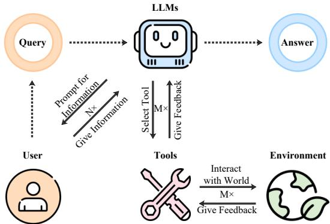  
Figure 1: Illustration of tool learning. To address user queries, LLMs must analyze user requirements, utilize appropriate tools, and extrapolate feedback from the environment. Each stage in this process plays a crucial role in shaping the formulation of the answer.

Ye et al., 2024). Illustrated in Figure 1, upon receiving a user request, the LLM scrutinizes the user’s needs, prompts for sufficient information, selects the appropriate tool, and inputs the required parameters in the specified format. Subsequently, the tool interacts with the environment to furnish feedback to the LLM. The LLM then employ logical reasoning based on the initial request, iterating through these steps until a conclusive answer is achieved.

Owing to the intricate nature of tool learning, initial evaluations heavily relied on manual efforts, engaging experts to assess the accuracy of LLMs tool invocation (Tang et al., 2023). Despite its reasonable effectiveness, the manpower costs hinder widespread adoption. Currently, researchers are exploring automated evaluation methods. One aspect is indirectly assessed by analyzing the performance improvement achieved through the use of tools in downstream tasks (Schick et al., 2023; Zhuang et al., 2023), while the other is directly evaluated by formulating rules to measure the exact match between the tools chosen by LLMs and the expected results (Huang et al., 2023).

However, these methods suffer from two significant drawbacks. One constraint lies in their limited applicability, primarily applicable to scenarios where tools can be predefined. Given the similarity among different tools (e.g., the ability of various search software to process the same query) and the variability in information provided by the same tool at different times (e.g., real-time updates of weather information), these methods struggle to capture the complexity of real-world applications involving diverse tools. Another limitation is their exclusive focus on evaluating the outcomes of tool selection, neglecting the intricate capabilities required for LLMs to use tools. Tool learning involves more than merely selecting a tool; it integrates the LLMs capabilities in comprehending instructions, logical reasoning, and generalizing information. Therefore, there is a necessity for a thorough examination of how various capabilities influence the entire process of tool learning.

To fill this gap, we introduce ToolEyes, a fine-grained system tailored for the evaluation of LLMs’ tool learning capabilities in real-world scenarios.1 The system meticulously formulates seven authentic scenarios, covering text generation, data understanding, real-time search, application manipulation, personal life, information retrieval, and financial transactions. Simultaneously, ToolEyes centers its attention on five essential capabilities vital to the tool learning for LLMs: format alignment, intent comprehension, behavior planning, tool selection, and answer organization. Moreover, the system establishes a tool library comprising 568 tools, serving as an interface for LLMs to interact with the environment.

We evaluate ten LLMs across three sources (i.e., open-source, tool-oriented, and closed-source), and identify scenario preferences and constrained cognitive capabilities in tool learning. Notably, augmenting model parameters exacerbates the impairment of tool learning performance.

The main contributions of our work are summarized as follows:

• We propose ToolEyes, a fine-grained system for the evaluation of LLMs’ tool learning capabilities, containing seven diverse realworld scenarios and 568 tools.

• We perform an in-depth analysis of the capabilities required for LLMs to effectively engage in tool learning across five dimensions, providing a comprehensive examination of the intricate tool learning process.

• We evaluate ten LLMs across three categories and discover their inclination toward specific scenarios and restricted cognitive abilities. These findings provide instructive insights for the future development of tool learning.

## 2 Evaluation System

As illustrated in Figure 2, ToolEyes formulates seven distinct real-world scenarios to comprehensively examine the entire tool learning process in accordance with actual application requirements. Each scenario incorporates a collection of related tools that LLMs can utilize to engage with the physical world and meet users’ practical needs. By evaluating LLMs’ capabilities across five dimensions, the system proficiently oversees the entirety of the tool learning process.

## 2.1 Scenario Construction

To extend the application of tool learning to capture the intricacies of the physical world, we have devised seven real-world scenarios.

Text Generation (TG) stands out as a highly representative generic scenario, tasking LLMs with generating text that meets user needs while adhering to the query’s genre, format, word count, and other specifications. Typical user requests for text generation encompass suggestions, jokes, translations, and more.

Data Understanding (DU) encapsulates a specialized requirement scenario wherein LLMs are tasked with comprehending user-input data and analyzing it across specific dimensions tailored to user needs, including sentiment analysis, relationship prediction, validity verification, and more.

Real-Time Search (RS) is extensively employed in the physical world, requiring LLMs to employ a variety of search tools for gathering information relevant to the user’s needs. Subsequently, LLMs are responsible for compiling and presenting the collected data back to the user in the form of natural language text.

Application Manipulation (AM) is a specialized scenario, requiring LLMs to select relevant tools based on user requests. It directly impacts the state of the external environment by executing code, manipulating files, and managing communications, thus surpassing the typical limitations of language model capabilities.

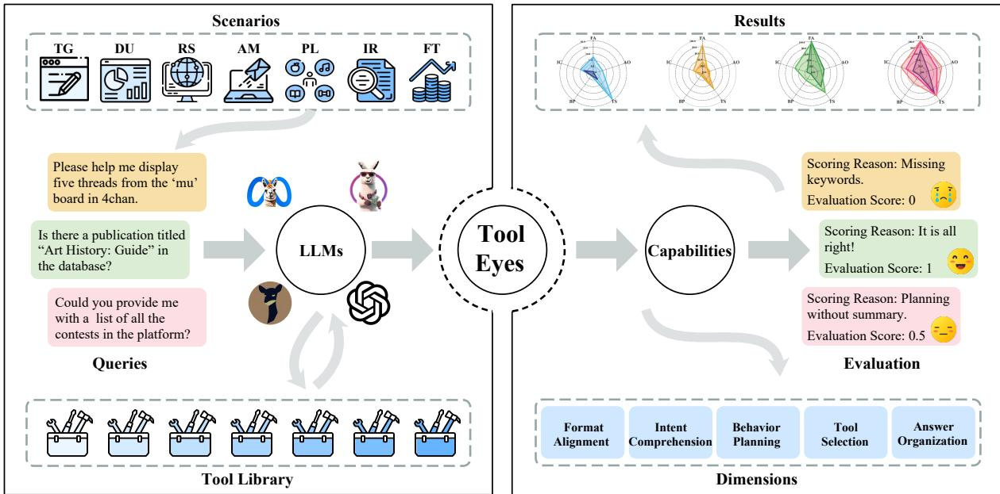  
Figure 2: The framework of ToolEyes. ToolEyes formulates seven distinct real-world scenarios. Each scenario incorporates a collection of related tools that LLMs can utilize to engage with the physical world and meet users’ practical needs. By evaluating LLMs’ capabilities across five dimensions, the system proficiently oversees the entirety of the tool learning process.

Personal Life (PL) encompasses scenarios tied to personal life needs, prompting LLMs to utilize given tools to gather information on entertainment, food, job, and other relevant topics. Subsequently, LLMs synthesize the acquired information to provide users with effective suggestions.

Information Retrieval (IR) is a subset of retrieval tasks, requiring LLMs to retrieve pertinent information from extensive existing databases. This distinguishes itself from RS, which prioritizes instantaneous information. Due to the varied retrieval methods supported by each database, LLMs are compelled to access different databases based on specific requirements.

Financial Transactions (FT) includes scenarios that require specialized financial and economic knowledge, prompting LLMs to employ tools for obtaining relevant financial information. Subsequently, LLMs analyze this information to solve the user’s problem or provide pertinent advice, which may involve discussions on stock movements or exchange rate fluctuations.

## 2.2 Tool Library Building

To establish interfaces for LLMs to engage with the environment, we review existing work for tool design (Schick et al., 2023; Zhuang et al., 2023; Qin et al., 2023b), gather real tools across various categories relevant to our constructed scenarios.2 We systematically rectify tool names and adhered to the GPT-4 format for crafting tool documentation,3 creating documentation for each gathered tool. Following this organization, each scenario is equipped with a related set of tools, where different tools may serve similar functions.4 After aggregation, a comprehensive tool library is established, encompassing 41 categories, 95 subcategories, and 568 tools, capable of fulfilling diverse societal needs. LLMs can invoke these tools using the specified format and retrieve actual information from them.5

## 2.3 Human-Driven Data Generation

Tailored to the constructed scenarios, we engage with a diverse group of professionals linked to each scenario, soliciting their input to identify actual requirements by reviewing the tool documentation. To ensure comprehensive coverage of requirements, we concentrate on one tool subcategory at a time, aiming to encompass the needs of as many tools in that subcategory as possible.6 Subsequently, we gathered a total of 382 user queries after thorough manual validation. For a detailed breakdown of the number of tools and queries associated with each scenario, please refer to Table 1.

<table><tr><td>Scenario</td><td>TG</td><td>DU</td><td>RS</td><td>PL</td><td>IR</td><td>AM</td><td>FT</td><td>Total</td></tr><tr><td># Cat</td><td>5</td><td>5</td><td>6</td><td>8</td><td>9</td><td>6</td><td>2</td><td>41</td></tr><tr><td># Subcat</td><td>6</td><td>5</td><td>14</td><td>30</td><td>19</td><td>7</td><td>14</td><td>95</td></tr><tr><td># Tool</td><td>27</td><td>26</td><td>75</td><td>164</td><td>150</td><td>164</td><td>96</td><td>568</td></tr><tr><td># Query</td><td>58</td><td>49</td><td>56</td><td>70</td><td>54</td><td>45</td><td>50</td><td>382</td></tr></table>

Table 1: Statistical information about the data for each scenario. “# Cat” denotes the number of tool categories, “# Subcat” represents the number of tool subcategories, “# Tool” indicates the quantity of tools, and “# Query” represents the number of user queries.

## 2.4 LLMs Capability Evaluation

Diverging from prior methods that necessitate a predetermined selection of tools, we conduct a comprehensive evaluation of LLMs’ interaction with their environments, considering the five dimensions of capability essential for tool learning.

Format alignment stands as a fundamental capability crucial to tool learning, necessitating LLMs to adhere to output formatting requirements in the instructions, ensuring the correct parsing of their output. This includes 1) incorporating corresponding keywords (e.g., Thought, Action, Action Input) to facilitate output separation, and 2) refraining from generating redundant sentences to enable the extraction of tools and parameters. If the total number of rounds in which LLMs invoke a tool is N, and the number of rounds where the output meets the specified format requirement is $N _ { v a l i d }$ the score $s F A$ corresponding to its instruction adherence capability is:

$$
s _ { F A } = N _ { v a l i d } / N\tag{1}
$$

Intent comprehension hinges on the inherent characteristics of tool learning, focusing on grasping user needs and conducting subsequent analyses. It is crucial to evaluate whether LLMs can continuously update acquired information and adjust solutions to accommodate evolving user input or changing requirements throughout the entire process. To assess this, we determine the intent comprehension capability score for LLMs by evaluating 1) the relevance of their thought processes to user needs and 2) their adaptability to newly provided information during interactions:

$$
s _ { I C } \in [ 0 , 1 ]\tag{2}
$$

Behavioral planning plays a crucial role in facilitating tool learning and assessing the thinking skills of LLMs. Aligned with the insights proposed by Wei et al. (2022b), a comprehensive understanding of how LLMs select tools and process information goes beyond mere tool and parameter choices. It is essential for LLMs to concisely summarize relevant information acquired and strategically plan for subsequent steps. When evaluating LLMs’ thinking processes, we scrutinize the validity and logical integrity of their thoughts separately. Concerning validity, we obtain the score $s _ { b - v a l i d i t y } ~ \in ~ [ 0 , 1 ]$ by assessing 1) the reasonableness of summarizing the current state, 2) the timeliness of planning for the next sequence of actions, and 3) the diversity of planning. For logical consistency, we calculate the score $s _ { b } .$ $\mathbf { \Gamma } _ { - i n t e g r i t y } \in$ [0, 1] by evaluating 1) grammatical soundness, 2) logical consistency, and 3) the ability to correct thinking. The composite score for behavioral planning capability is determined as follows:

$$
s _ { B P } = s _ { b - v a l i d i t y } \cdot s _ { b - i n t e g r i t y }\tag{3}
$$

Tool selection is a pivotal aspect of tool learning, assessing the capability to choose suitable tools and input accurate parameters. Recognizing that the approach to problem-solving through tools is not always singular, as seen in the case of querying weather information for two cities, A and B, where querying A first and querying B first are functionally equivalent, we shift away from the previous approach of pre-setting answers. Instead, our emphasis is on authenticity and validity in the process of tool selection. For the i-th round of valid output, our evaluation comprises two key aspects: 1) We scrutinize whether LLMs’ tool selection and parameter input align with the requirements. This involves confirming if the selected tool is documented, if the filled parameters correspond to the tool, and if all necessary parameters are included. This assessment is scored in this segment as $s _ { t - r e a l i t y } ^ { i } = 1$ when tool and parameters match the documentation, and 0 otherwise. 2) We prompt

<table><tr><td>Source</td><td>Models</td><td>TG</td><td>DU</td><td>RS</td><td>AM</td><td>PL</td><td>IR</td><td>FT</td><td>ALL</td></tr><tr><td rowspan="4">Open-Source</td><td>LLaMA-2-chat-7B LLaMA-2-chat-13B</td><td>15.33</td><td>24.48</td><td>13.56</td><td>11.45</td><td>12.39</td><td>10.09</td><td>8.33</td><td>13.59</td></tr><tr><td></td><td>19.97</td><td>25.06</td><td>15.59</td><td>24.48</td><td>12.62</td><td>15.68</td><td>15.57</td><td>17.98</td></tr><tr><td>LLaMA-2-chat-70B</td><td>3.84</td><td>6.07</td><td>5.77</td><td>9.04</td><td>4.77</td><td>4.03</td><td>4.40</td><td>5.29</td></tr><tr><td>Vicuna-1.5-7B Vicuna-1.5-13B</td><td>51.53 25.76</td><td>36.17 21.93</td><td>41.10 24.02</td><td>32.83 32.61</td><td>40.82 23.37</td><td>37.42 23.00</td><td>27.78 20.22</td><td>38.76 24.27</td></tr><tr><td>Tool-Oriented</td><td>ToolLLaMA-2-7B-v1 ToolLLaMA-2-7B-v2</td><td>49.33 72.90</td><td>40.85</td><td>40.14</td><td>39.81</td><td>40.56</td><td>40.92</td><td>38.88</td><td>41.61</td></tr><tr><td rowspan="2">Closed-Source</td><td>Text-davinvi-003</td><td></td><td>54.65</td><td>54.57</td><td>46.49</td><td>58.70</td><td>54.51</td><td>48.00</td><td>56.30</td></tr><tr><td></td><td>48.56</td><td>48.50</td><td>34.24</td><td>38.68</td><td>34.12</td><td>38.80</td><td>36.65</td><td>39.71</td></tr><tr><td></td><td>GPT-3.5-turbo GPT-4</td><td>63.25 80.24</td><td>60.14 71.58</td><td>60.91 73.99</td><td>55.06 70.33</td><td>61.50 68.06</td><td>61.50 65.68</td><td>52.86 61.58</td><td>59.61 70.31</td></tr></table>

Table 2: The performance of the different models in each scenario, tallied in $s _ { o v e r a l l } ( \% )$ , with “ALL” representing their score over all scenarios. The best result in each scenario is bolded.

LLMs in the instructions to explicitly articulate their thought process behind tool selection, and calculate a match score $s _ { t - m a t c h } ^ { i } ~ \in ~ [ 0 , 1 ]$ by comparing their chosen tool with their stated thought. Ultimately, the score corresponding to LLMs’ tool selection capability is derived as:

$$
s _ { T S } = \sum _ { i } s _ { t - r e a l i t y } ^ { i } \cdot s _ { t - m a t c h } ^ { i } / N _ { v a l i d }\tag{4}
$$

Answer organization marks the final phase of tool learning, requiring LLMs to amalgamate information gathered throughout the process and furnish a direct response to the user’s query. This evaluation unfolds in two dimensions: 1) We assess the capability of LLMs to deliver timely responses. Specifically, to safeguard against LLMs entering unproductive quandaries, we define the maximum number of rounds an LLM can engage with the environment for a given query as $N _ { m a x } .$ We designate $\begin{array} { l l l } { { s _ { a - p a s s } } } & { { = } } & { { 1 } } \end{array}$ if the LLM can respond within $N _ { m a x }$ rounds of interactions and 0 otherwise. 2) We scrutinize the quality of responses provided by LLMs. When $s _ { a - p a s s } ~ = ~ 1$ , the assessment is based on the response’s relevance to the user’s query and the accuracy of the information conveyed, denoted by $s _ { a - q u a l i t y } .$ . Consequently, the answer organization ability score of an LLM is derived by multiplying these two scores:

$$
s _ { A O } = s _ { a - p a s s } \cdot s _ { a - q u a l i t y }\tag{5}
$$

Upon acquiring the capability scores of LLMs for each of the five dimensions, we establish the overall scores for LLMs’ tool learning as:

$$
s _ { o v e r a l l } = \frac { s _ { F A } + s _ { I C } + s _ { B P } + s _ { T S } + s _ { A O } } { 5 }\tag{6}
$$

<table><tr><td rowspan=1 colspan=1>Source</td><td rowspan=1 colspan=1>Models</td><td rowspan=1 colspan=1>F Statistic   P Value</td></tr><tr><td rowspan=2 colspan=1>Open-Source</td><td rowspan=1 colspan=1>LLaMA-2-chat-7BLLaMA-2-chat-13BLLaMA-2-chat-70B</td><td rowspan=1 colspan=1>5.82     $8 . 2 0 \times 1 0 ^ { - 6 }$ 4.87     $8 . 2 7 \times 1 0 ^ { - 5 }$ 2.75     $1 . 2 7 \times 1 0 ^ { - 2 }$ </td></tr><tr><td rowspan=1 colspan=1>Vicuna-1.5-7BVicuna-1.5-13B</td><td rowspan=1 colspan=1>15.7     $4 . 2 3 \times 1 0 ^ { - 1 6 }$ 1.78     $1 . 0 1 \times 1 0 ^ { - 1 }$ </td></tr><tr><td rowspan=1 colspan=1>Tool-Oriented</td><td rowspan=1 colspan=1>ToolLLaMA-2-7B-v1ToolLLaMA-2-7B-v2</td><td rowspan=1 colspan=1>10.50    $8 . 9 3 \times 1 0 ^ { - 1 1 }$ 14.68    $4 . 4 9 \times 1 0 ^ { - 1 5 }$ </td></tr><tr><td rowspan=2 colspan=1>Closed-Source</td><td rowspan=1 colspan=1>Text-davinvi-003</td><td rowspan=1 colspan=1>7.06     $3 . 8 5 \times 1 0 ^ { - 7 }$ </td></tr><tr><td rowspan=1 colspan=1>GPT-3.5-turboGPT-4</td><td rowspan=1 colspan=1>3.47     $2 . 3 6 \times 1 0 ^ { - 3 }$ 8.47     $1 . 2 3 \times 1 0 ^ { - 8 }$ </td></tr></table>

Table 3: Welch’s ANOVA for $s _ { o v e r a l l }$ across the seven scenarios for various LLMs. A p-value below 0.05 indicate significant differences in the data.

## 3 Experiments

To comprehensively assess the tool learning capabilities of various LLMs, we conduct experiments on ten LLMs sourced from three origins, including open-source, tool-oriented, and closed-source.7

## 3.1 Experimental Setup

To avoid the effect of unfair testing due to the prompt format during inference, we refer to tooloriented models and require LLMs to use the ReAct (Yao et al., 2023) format for output. Since the open-source models were not trained on the tool-learning dataset, we use a five-shot for them and a zero-shot format for all other models.8 The maximum allowable interaction turns are set to 9. It is essential to note that, for all LLMs, our self-constructed tool documentation and user requirements remain out-of-domain. We set the temperature to 0.3 and top\_p to 0.5 to enhance the diversity of LLMs outputs while ensuring stability.

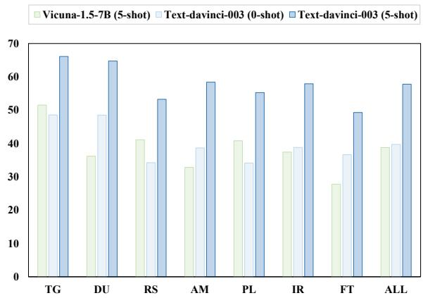  
Figure 3: Comparison of the performance of Vicuna-1.5-7B and Text-davinci-003 in each scenario.

In the evaluation, sFA, st−reality, sa−pass are evaluated based on established rules. Other scores are evaluated by GPT-4.9

## 3.2 Results in Different Scenarios

We evaluate the tool learning performance of the LLMs across seven real-world scenarios, documenting their overall performance scores in Table 2.10 There are several interesting observations from the results.

LLMs exhibit scenario-specific preferences in tool learning. We conduct Welch’s ANOVA test (Bl, 1947) to evaluate the performance of each model across seven scenarios. The results in Table 3 unveil noteworthy variations in LLMs performance across these diverse scenarios. Specifically, many LLMs exhibit remarkable proficiency in scenarios such as TG and DU, whereas they demonstrate limitations in scenarios like IR or FT. This discrepancy arises from the fact that, in the former scenarios, the tool’s return value can be directly utilized as the final output. In contrast, the return values of tools in the latter scenarios encompass more extraneous information, demanding a heightened ability to generalize relevant information effectively.

The variance in tool learning performance between open-source LLMs and closed-source LLMs is considerable. Upon evaluating the tool learning capabilities of various source LLMs, closed-source models generally surpass opensource ones, particularly GPT-4. While Vicuna-1.5- 7B performs comparably to Text-davinci-003 without demonstrations, Text-davinci-003 surpasses it by 15 points in the five-shot setting (See Figure 3). Moreover, even the leading tool-oriented model ToolLLaMA-2-7B-v2 only achieves 80% of GPT-4’s performance. This underscores a notable opportunity for enhancing tool learning across all categories of LLMs.

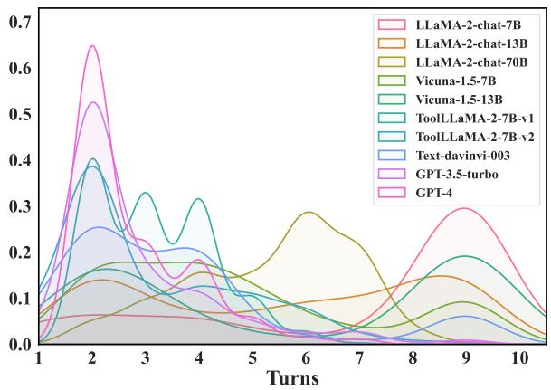  
Figure 4: Probability density distribution of the number of turns each LLM interacts with the environment.

LLMs with superior performance exhibit more effective problem-solving abilities. We analyze data across various scenarios to examine the distribution of interaction turns with the environment for different LLMs. The results (Figure 4) demonstrate that, in contrast to opensource LLMs that often necessitate multiple turns to complete tasks, tool-oriented and closed-source LLMs can efficiently address problems and meet user needs in a limited number of interaction turns. On average, LLaMA-2-chat-7B requires 7.0 turns of interaction, a figure significantly higher than the 3.1 turns needed by ToolLLaMA-2-7b-v2 and the 2.8 turns required by GPT-4.

## 3.3 Results of Different LLMs Capabilities

We examine the entirety of the tool learning process, focusing on the five dimensions of capability essential for LLMs to successfully undertake tool learning. The findings, illustrated in Figure 5, unveil noteworthy phenomena that capture our attention.

The present constraints in LLMs thinking skills present a substantial obstacle to tool learning. Irrespective of their origin, shortcomings in LLMs’ behavioral planning skills are apparent across various capabilities essential for effective tool learning. Even the most proficient model, GPT-4, exhibited a mere 35.70% proficiency in behavioral planning. This underscores a distinct gap in the validity and comprehensiveness of the cognitive processes employed by current LLMs, potentially resulting in suboptimal tool selection, particularly in scenarios demanding multiple interactions with the environment.

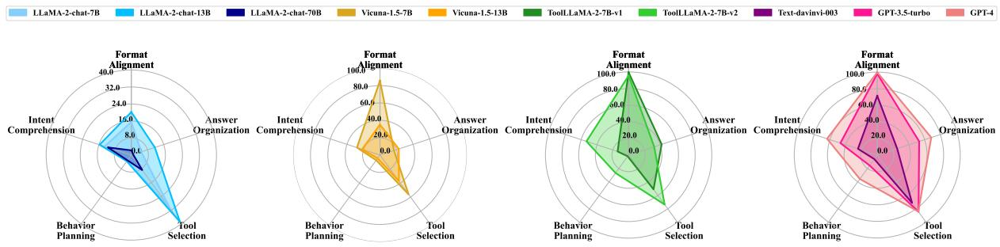  
Figure 5: Performance of various LLMs for each capability dimension over all scenarios.

LLMs’ tool learning capabilities are influenced by their optimization goals and training data. LLaMA-2-chat-7B, trained based on the LLaMA-2-base-7B, is optimized for generic conversations and aligned using RLHF. Vicuna-1.5-7B prioritizes instruction adherence, relying on a high-quality dataset of SFT instructions for fine-tuning. In contrast, ToolLLaMA-2-7B-v2 is tailored for tool learning and utilizes domain datasets for fine-tuning. Consequently, Vicuna-1.5- 7B demonstrates a 73.1% improvement in format alignment capability compared to LLaMA-2-chat-7B, but its overall performance is still 17.5% inferior to ToolLLaMA-2-7B-v2. Meanwhile, in a comparison with ToolLLaMA-2-7B-v1, the training set of ToolLLaMA-2-7B-v2 is optimized for the cognitive processes of LLMs. This optimization significantly enhances tool learning performance, particularly in intent comprehension and behavior planning.

The process of tool learning entails the interaction of various LLMs capabilities. We scrutinize the performance across the five capability dimensions and calculate Pearson correlation coefficients, as depicted in Figure 6. The analysis uncovers a positive correlation among most LLM competencies. For instance, the correlation between intent comprehension and behavior planning is 0.97, suggesting that LLMs adept at understanding user intent also excel in rational planning. Additionally, correlations surpassing

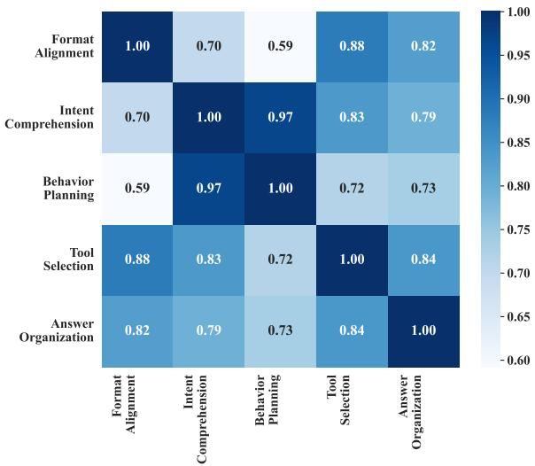  
Figure 6: Pearson correlation coefficients between various capabilities dimensions of LLMs.

0.7 are observed between LLMs’ tool selection and other capabilities. This underscores that tool learning is a multifaceted process requiring the synergy of multiple capabilities. Therefore, evaluating tool learning should extend beyond assessing tool selection outcomes.

## 3.4 Why do LLMs Capabilities NOT Increase with Size?

In contrast to prior studies that suggest increasing model parameters enhances the capabilities of LLMs (Kaplan et al., 2020; Chung et al., 2022; Wei et al., 2022a), our findings, depicted in Table 2 and Figure 5, reveal a noteworthy phenomenon. As the model size increases, there appears to be a potential weakening of the instrumental learning capabilities within the LLaMA-2-chat and Vicuna-1.5 family of models. To illuminate this phenomenon, we conduct a thorough analysis of model performance. Our study discerns that these limitations arise from inherent behavioral characteristics of LLMs.11

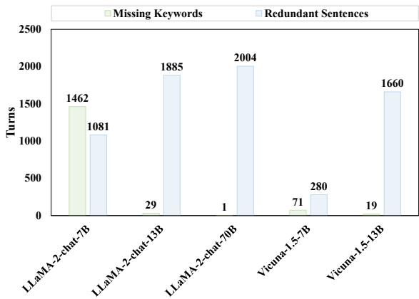  
Figure 7: Turns with missing keywords and turns with redundant sentences in LLMs output.

Aligning with dialog prompts LLMs to generate redundant sentences. As explained in Section 2.4, format alignment entails producing specified keywords while minimizing redundancy. We quantify instances of these errors across all scenarios for the LLaMA-2-chat and Vicuna-1.5 family of models. The results in Figure 7 depict a notable increase in the number of turns featuring redundant sentences as the number of parameters increases. This phenomenon can be attributed to LLMs appending extra sentences at the end of tool selection to align more closely with everyday conversations. This behavior is particularly evident in models trained on conversational data, and the impact is magnified with larger parameter sizes. Consequently, interactions by LLaMA-2-chat-70B fail completely in 91% of the test data, resulting in its markedly poor overall performance.

The automatic generation of escaped characters in Vicuna-1.5 leads to tool selection hallucinations. To examine the disparity in tool selection performance between Vicuna-1.5- 13B and Vicuna-1.5-7B, we compute the average scores of $s _ { t - r e a l i t y }$ and $s _ { t - m a t c h }$ for both models across all scenarios. The findings in Table 4 highlight that the primary factor contributing to the diminished tool selection capability in Vicuna-1.5- 13B is a more pronounced issue with tool selection hallucinations. This issue arises from the automatic inclusion of redundant escape characters by Vicuna-1.5, resulting in tool and parameter names that do not align with the information in the tool library. The exacerbation of this phenomenon in Vicuna-1.5-13B is attributed to its utilization of a larger training corpus.

It is noteworthy that LLaMA-2-chat-13B exhibits markedly improved answer organization compared to LLaMA-2-chat-7B. This is attributed to the tendency of LLaMA-2-chat-7B’s responses to deviate from the user’s query, leading to a significant decline in quality. Consequently, as the number of parameters increases, the model’s core abilities are enhanced. However, concurrently, its behavioral characteristics, which deviate from the task requirements, are amplified, thereby impacting the overall performance of the model.

<table><tr><td>Models</td><td>St-reality</td><td>St-match</td></tr><tr><td>Vicuna-1.5-7B</td><td>63.49</td><td>89.32</td></tr><tr><td>Vicuna-1.5-13B</td><td>51.86</td><td>93.14</td></tr></table>

Table 4: $s _ { t - r e a l i t y }$ and $s _ { t - m a t c h }$ (%) of Vicuna-1.5.

## 4 Related Works

Tool Learning Since LLMs exhibit the ability to reason and make decisions in intricate interactive environments (Nakano et al., 2021), researchers are keen to harness their potential in addressing more complex social needs through the integration of external tools. Currently, LLMs’ tool learning can be specifically classified into two categories: tool-oriented learning and tool-augmented learning. The former concentrates on enhancing the model’s ability to use tools, emphasizing the training of LLMs to become tool experts through specific techniques (Hao et al., 2023; Xu et al., 2023; Ruan et al., 2023). The latter, on the other hand, focuses on task processing, where tools are provided as a non-essential means for LLMs to handle tasks (Borgeaud et al., 2022; Lu et al., 2023; Song et al., 2023). In both scenarios, LLMs’ tool learning entails the integration of understanding instructions, logical reasoning, and generalizing information. In this paper, we evaluate the five capabilities required by LLMs and analyze the intricate process of tool learning.

Evaluations for Tool Learning Existing tool learning evaluations can be broadly classified into three pathways. The first involves manual reviews (Tang et al., 2023), wherein experts familiar with the tool analyze each step of LLMs tool learning to identify problem areas. While effective, the high cost of manpower and time poses challenges for practical application. The second pathway compares the performance of LLMs in downstream tasks before and after utilizing tools, aiming to assess their ability (Jin et al., 2023; Schick et al., 2023; Zhuang et al., 2023). However, this method relies on tooltask correlations and lacks generalizability to large-scale tool libraries. The recommended approach is to establish scenarios for automated evaluation, but the current practice demands predefined identification of LLMs tool selection and responses, limiting adaptability to real-world environments (Yang et al., 2023a; Li et al., 2023; Huang et al., 2023). To address these limitations, we introduce a fine-grained tool learning evaluation system, enabling in-depth analysis across five capability dimensions throughout the entire tool learning process in the real-world scenarios.

## 5 Conclusion

In this paper, we introduce ToolEyes, a system designed for the fine-grained evaluation of LLMs tool learning capabilities. The system encompasses 600 tools whose performance undergoes evaluation in seven real-world scenarios across five capability dimensions, spanning the entirety of the tool learning process. The evaluation outcomes include ten different LLMs span three categories, offering valuable insights to inform the ongoing development of tool learning.

## Limitations

While we have established a fine-grained tool learning evaluation system, conducted a comprehensive analysis of commonly used LLMs for tool learning, and outlined directions for future research, our work possesses two notable limitations. Firstly, we have not developed a novel LLM dedicated to tool learning, aiming to overcome the current deficiencies in tool learning capabilities exhibited by existing LLMs. On a positive note, we have identified key avenues for improvement, which will guide our forthcoming research endeavors. Secondly, the cost associated with scoring using GPT-4 limited our ability to evaluate all existing LLMs. It i important to highlight that we carefully choose the most representative LLMs from each source for analyzing, aiming to capture the overall problem. Additionally, we plan to explore the possibility of gathering more data to develop a dedicated scoring model, with the intention of mitigating future expenses.

## Acknowledgements

The authors wish to thank the anonymous reviewers for their helpful comments. This work was partially funded by the Major Key Project of PCL under Grant PCL2024A06, National Natural Science Foundation of China (No. 62476061,62206057,62076069), Shanghai Rising-Star Program (23QA1400200), Natural Science Foundation of Shanghai (23ZR1403500), Program of Shanghai Academic Research Leader under grant 22XD1401100.

## References

Yuntao Bai, Andy Jones, Kamal Ndousse, Amanda Askell, Anna Chen, Nova DasSarma, Dawn Drain, Stanislav Fort, Deep Ganguli, Tom Henighan, Nicholas Joseph, Saurav Kadavath, Jackson Kernion, Tom Conerly, Sheer El Showk, Nelson Elhage, Zac Hatfield-Dodds, Danny Hernandez, Tristan Hume, Scott Johnston, Shauna Kravec, Liane Lovitt, Neel Nanda, Catherine Olsson, Dario Amodei, Tom B. Brown, Jack Clark, Sam McCandlish, Chris Olah, Benjamin Mann, and Jared Kaplan. 2022a. Training a helpful and harmless assistant with reinforcement learning from human feedback. CoRR, abs/2204.05862.

Yuntao Bai, Saurav Kadavath, Sandipan Kundu, Amanda Askell, Jackson Kernion, Andy Jones, Anna Chen, Anna Goldie, Azalia Mirhoseini, Cameron McKinnon, Carol Chen, Catherine Olsson, Christopher Olah, Danny Hernandez, Dawn Drain, Deep Ganguli, Dustin Li, Eli Tran-Johnson, Ethan Perez, Jamie Kerr, Jared Mueller, Jeffrey Ladish, Joshua Landau, Kamal Ndousse, Kamile Lukosiute, Liane Lovitt, Michael Sellitto, Nelson Elhage, Nicholas Schiefer, Noemí Mercado, Nova DasSarma, Robert Lasenby, Robin Larson, Sam Ringer, Scott Johnston, Shauna Kravec, Sheer El Showk, Stanislav Fort, Tamera Lanham, Timothy Telleen-Lawton, Tom Conerly, Tom Henighan, Tristan Hume, Samuel R. Bowman, Zac Hatfield-Dodds, Ben Mann, Dario Amodei, Nicholas Joseph, Sam McCandlish, Tom Brown, and Jared Kaplan. 2022b. Constitutional AI: harmlessness from AI feedback. CoRR, abs/2212.08073.

Welch Bl. 1947. The generalisation of student’s problems when several different population variances are involved. Biometrika, 34(1-2):28–35.

Sebastian Borgeaud, Arthur Mensch, Jordan Hoffmann, Trevor Cai, Eliza Rutherford, Katie Millican, George van den Driessche, Jean-Baptiste Lespiau, Bogdan Damoc, Aidan Clark, Diego de Las Casas, Aurelia Guy, Jacob Menick, Roman Ring, Tom Hennigan, Saffron Huang, Loren Maggiore, Chris Jones, Albin Cassirer, Andy Brock, Michela Paganini, Geoffrey Irving, Oriol Vinyals, Simon Osindero,

Karen Simonyan, Jack W. Rae, Erich Elsen, and Laurent Sifre. 2022. Improving language models by retrieving from trillions of tokens. In International Conference on Machine Learning, ICML 2022, 17-23 July 2022, Baltimore, Maryland, USA, volume 162 of Proceedings ofMachine Learning Research, pages 2206–2240. PMLR.

Tom B. Brown, Benjamin Mann, Nick Ryder, Melanie Subbiah, Jared Kaplan, Prafulla Dhariwal, Arvind Neelakantan, Pranav Shyam, Girish Sastry, Amanda Askell, Sandhini Agarwal, Ariel Herbert-Voss, Gretchen Krueger, Tom Henighan, Rewon Child, Aditya Ramesh, Daniel M. Ziegler, Jeffrey Wu, Clemens Winter, Christopher Hesse, Mark Chen, Eric Sigler, Mateusz Litwin, Scott Gray, Benjamin Chess, Jack Clark, Christopher Berner, Sam McCandlish, Alec Radford, Ilya Sutskever, and Dario Amodei. 2020. Language models are few-shot learners. In Advances in Neural Information Processing Systems 33: Annual Conference on Neural Information Processing Systems 2020, NeurIPS 2020, December 6-12, 2020, virtual.

Xuanting Chen, Junjie Ye, Can Zu, Nuo Xu, Rui Zheng, Minlong Peng, Jie Zhou, Tao Gui, Qi Zhang, and Xuanjing Huang. 2023a. How robust is GPT-3.5 to predecessors? A comprehensive study on language understanding tasks. CoRR, abs/2303.00293.

Yuhan Chen, Ang Lv, Ting-En Lin, Changyu Chen, Yuchuan Wu, Fei Huang, Yongbin Li, and Rui Yan. 2023b. Fortify the shortest stave in attention: Enhancing context awareness of large language models for effective tool use.

Zehui Chen, Weihua Du, Wenwei Zhang, Kuikun Liu, Jiangning Liu, Miao Zheng, Jingming Zhuo, Songyang Zhang, Dahua Lin, Kai Chen, and Feng Zhao. 2024. T-eval: Evaluating the tool utilization capability of large language models step by step. Preprint, arXiv:2312.14033.

Wei-Lin Chiang, Zhuohan Li, Zi Lin, Ying Sheng, Zhanghao Wu, Hao Zhang, Lianmin Zheng, Siyuan Zhuang, Yonghao Zhuang, Joseph E. Gonzalez, Ion Stoica, and Eric P. Xing. 2023. Vicuna: An opensource chatbot impressing gpt-4 with 90%\* chatgpt quality.

Hyung Won Chung, Le Hou, Shayne Longpre, Barret Zoph, Yi Tay, William Fedus, Eric Li, Xuezhi Wang, Mostafa Dehghani, Siddhartha Brahma, Albert Webson, Shixiang Shane Gu, Zhuyun Dai, Mirac Suzgun, Xinyun Chen, Aakanksha Chowdhery, Sharan Narang, Gaurav Mishra, Adams Yu, Vincent Y. Zhao, Yanping Huang, Andrew M. Dai, Hongkun Yu, Slav Petrov, Ed H. Chi, Jeff Dean, Jacob Devlin, Adam Roberts, Denny Zhou, Quoc V. Le, and Jason Wei. 2022. Scaling instructionfinetuned language models. CoRR, abs/2210.11416.

Zishan Guo, Renren Jin, Chuang Liu, Yufei Huang, Dan Shi, Supryadi, Linhao Yu, Yan Liu, Jiaxuan Li, Bojian Xiong, and Deyi Xiong. 2023. Evaluating

large language models: A comprehensive survey. CoRR, abs/2310.19736.

Shibo Hao, Tianyang Liu, Zhen Wang, and Zhiting Hu. 2023. Toolkengpt: Augmenting frozen language models with massive tools via tool embeddings. CoRR, abs/2305.11554.

Yue Huang, Jiawen Shi, Yuan Li, Chenrui Fan, Siyuan Wu, Qihui Zhang, Yixin Liu, Pan Zhou, Yao Wan, Neil Zhenqiang Gong, and Lichao Sun. 2023. Metatool benchmark for large language models: Deciding whether to use tools and which to use. CoRR, abs/2310.03128.

Qiao Jin, Yifan Yang, Qingyu Chen, and Zhiyong Lu. 2023. Genegpt: Augmenting large language models with domain tools for improved access to biomedical information. CoRR, abs/2304.09667.

Jared Kaplan, Sam McCandlish, Tom Henighan, Tom B. Brown, Benjamin Chess, Rewon Child, Scott Gray, Alec Radford, Jeffrey Wu, and Dario Amodei. 2020. Scaling laws for neural language models. CoRR, abs/2001.08361.

Minghao Li, Yingxiu Zhao, Bowen Yu, Feifan Song, Hangyu Li, Haiyang Yu, Zhoujun Li, Fei Huang, and Yongbin Li. 2023. Api-bank: A comprehensive benchmark for tool-augmented llms. In Proceedings of the 2023 Conference on Empirical Methods in Natural Language Processing, EMNLP 2023, Singapore, December 6-10, 2023, pages 3102–3116. Association for Computational Linguistics.

Pan Lu, Baolin Peng, Hao Cheng, Michel Galley, Kai-Wei Chang, Ying Nian Wu, Song-Chun Zhu, and Jianfeng Gao. 2023. Chameleon: Plug-and-play compositional reasoning with large language models. CoRR, abs/2304.09842.

Grégoire Mialon, Roberto Dessì, Maria Lomeli, Christoforos Nalmpantis, Ramakanth Pasunuru, Roberta Raileanu, Baptiste Rozière, Timo Schick, Jane Dwivedi-Yu, Asli Celikyilmaz, Edouard Grave, Yann LeCun, and Thomas Scialom. 2023. Augmented language models: a survey. CoRR, abs/2302.07842.

Reiichiro Nakano, Jacob Hilton, Suchir Balaji, Jeff Wu, Long Ouyang, Christina Kim, Christopher Hesse, Shantanu Jain, Vineet Kosaraju, William Saunders, Xu Jiang, Karl Cobbe, Tyna Eloundou, Gretchen Krueger, Kevin Button, Matthew Knight, Benjamin Chess, and John Schulman. 2021. Webgpt: Browserassisted question-answering with human feedback. CoRR, abs/2112.09332.

OpenAI. 2023. GPT-4 technical report. CoRR, abs/2303.08774.

Shishir G. Patil, Tianjun Zhang, Xin Wang, and Joseph E. Gonzalez. 2023. Gorilla: Large language model connected with massive apis. CoRR, abs/2305.15334.

Yujia Qin, Shengding Hu, Yankai Lin, Weize Chen, Ning Ding, Ganqu Cui, Zheni Zeng, Yufei Huang, Chaojun Xiao, Chi Han, Yi Ren Fung, Yusheng Su, Huadong Wang, Cheng Qian, Runchu Tian, Kunlun Zhu, Shihao Liang, Xingyu Shen, Bokai Xu, Zhen Zhang, Yining Ye, Bowen Li, Ziwei Tang, Jing Yi, Yuzhang Zhu, Zhenning Dai, Lan Yan, Xin Cong, Yaxi Lu, Weilin Zhao, Yuxiang Huang, Junxi Yan, Xu Han, Xian Sun, Dahai Li, Jason Phang, Cheng Yang, Tongshuang Wu, Heng Ji, Zhiyuan Liu, and Maosong Sun. 2023a. Tool learning with foundation models. CoRR, abs/2304.08354.

Yujia Qin, Shihao Liang, Yining Ye, Kunlun Zhu, Lan Yan, Yaxi Lu, Yankai Lin, Xin Cong, Xiangru Tang, Bill Qian, Sihan Zhao, Runchu Tian, Ruobing Xie, Jie Zhou, Mark Gerstein, Dahai Li, Zhiyuan Liu, and Maosong Sun. 2023b. Toolllm: Facilitating large language models to master 16000+ real-world apis. CoRR, abs/2307.16789.

Baptiste Rozière, Jonas Gehring, Fabian Gloeckle, Sten Sootla, Itai Gat, Xiaoqing Ellen Tan, Yossi Adi, Jingyu Liu, Tal Remez, Jérémy Rapin, Artyom Kozhevnikov, Ivan Evtimov, Joanna Bitton, Manish Bhatt, Cristian Canton-Ferrer, Aaron Grattafiori, Wenhan Xiong, Alexandre Défossez, Jade Copet, Faisal Azhar, Hugo Touvron, Louis Martin, Nicolas Usunier, Thomas Scialom, and Gabriel Synnaeve. 2023. Code llama: Open foundation models for code. CoRR, abs/2308.12950.

Jingqing Ruan, Yihong Chen, Bin Zhang, Zhiwei Xu, Tianpeng Bao, Guoqing Du, Shiwei Shi, Hangyu Mao, Xingyu Zeng, and Rui Zhao. 2023. TPTU: task planning and tool usage of large language modelbased AI agents. CoRR, abs/2308.03427.

Timo Schick, Jane Dwivedi-Yu, Roberto Dessì, Roberta Raileanu, Maria Lomeli, Luke Zettlemoyer, Nicola Cancedda, and Thomas Scialom. 2023. Toolformer: Language models can teach themselves to use tools. CoRR, abs/2302.04761.

Yongliang Shen, Kaitao Song, Xu Tan, Wenqi Zhang, Kan Ren, Siyu Yuan, Weiming Lu, Dongsheng Li, and Yueting Zhuang. 2023. Taskbench: Benchmarking large language models for task automation. CoRR, abs/2311.18760.

Yifan Song, Weimin Xiong, Dawei Zhu, Cheng Li, Ke Wang, Ye Tian, and Sujian Li. 2023. Restgpt: Connecting large language models with real-world applications via restful apis. CoRR, abs/2306.06624.

Jianlin Su, Yu Lu, Shengfeng Pan, Bo Wen, and Yunfeng Liu. 2021. Roformer: Enhanced transformer with rotary position embedding. CoRR, abs/2104.09864.

Qiaoyu Tang, Ziliang Deng, Hongyu Lin, Xianpei Han, Qiao Liang, and Le Sun. 2023. Toolalpaca: Generalized tool learning for language models with 3000 simulated cases. CoRR, abs/2306.05301.

Nexusflow.ai team. 2023. Nexusraven-v2: Surpassing gpt-4 for zero-shot function calling.

Hugo Touvron, Thibaut Lavril, Gautier Izacard, Xavier Martinet, Marie-Anne Lachaux, Timothée Lacroix, Baptiste Rozière, Naman Goyal, Eric Hambro, Faisal Azhar, Aurélien Rodriguez, Armand Joulin, Edouard Grave, and Guillaume Lample. 2023a. Llama: Open and efficient foundation language models. CoRR, abs/2302.13971.

Hugo Touvron, Louis Martin, Kevin Stone, Peter Albert, Amjad Almahairi, Yasmine Babaei, Nikolay Bashlykov, Soumya Batra, Prajjwal Bhargava, Shruti Bhosale, Dan Bikel, Lukas Blecher, Cristian Canton-Ferrer, Moya Chen, Guillem Cucurull, David Esiobu, Jude Fernandes, Jeremy Fu, Wenyin Fu, Brian Fuller, Cynthia Gao, Vedanuj Goswami, Naman Goyal, Anthony Hartshorn, Saghar Hosseini, Rui Hou, Hakan Inan, Marcin Kardas, Viktor Kerkez, Madian Khabsa, Isabel Kloumann, Artem Korenev, Punit Singh Koura, Marie-Anne Lachaux, Thibaut Lavril, Jenya Lee, Diana Liskovich, Yinghai Lu, Yuning Mao, Xavier Martinet, Todor Mihaylov, Pushkar Mishra, Igor Molybog, Yixin Nie, Andrew Poulton, Jeremy Reizenstein, Rashi Rungta, Kalyan Saladi, Alan Schelten, Ruan Silva, Eric Michael Smith, Ranjan Subramanian, Xiaoqing Ellen Tan, Binh Tang, Ross Taylor, Adina Williams, Jian Xiang Kuan, Puxin Xu, Zheng Yan, Iliyan Zarov, Yuchen Zhang, Angela Fan, Melanie Kambadur, Sharan Narang, Aurélien Rodriguez, Robert Stojnic, Sergey Edunov, and Thomas Scialom. 2023b. Llama 2: Open foundation and fine-tuned chat models. CoRR, abs/2307.09288.

Jason Wei, Yi Tay, Rishi Bommasani, Colin Raffel, Barret Zoph, Sebastian Borgeaud, Dani Yogatama, Maarten Bosma, Denny Zhou, Donald Metzler, Ed H. Chi, Tatsunori Hashimoto, Oriol Vinyals, Percy Liang, Jeff Dean, and William Fedus. 2022a. Emergent abilities of large language models. Trans. Mach. Learn. Res., 2022.

Jason Wei, Xuezhi Wang, Dale Schuurmans, Maarten Bosma, Brian Ichter, Fei Xia, Ed H. Chi, Quoc V. Le, and Denny Zhou. 2022b. Chain-of-thought prompting elicits reasoning in large language models. In NeurIPS.

Qiantong Xu, Fenglu Hong, Bo Li, Changran Hu, Zhengyu Chen, and Jian Zhang. 2023. On the tool manipulation capability of open-source large language models. CoRR, abs/2305.16504.

Rui Yang, Lin Song, Yanwei Li, Sijie Zhao, Yixiao Ge, Xiu Li, and Ying Shan. 2023a. Gpt4tools: Teaching large language model to use tools via self-instruction. CoRR, abs/2305.18752.

Sherry Yang, Ofir Nachum, Yilun Du, Jason Wei, Pieter Abbeel, and Dale Schuurmans. 2023b. Foundation models for decision making: Problems, methods, and opportunities. CoRR, abs/2303.04129.

Shunyu Yao, Jeffrey Zhao, Dian Yu, Nan Du, Izhak Shafran, Karthik R. Narasimhan, and Yuan Cao. 2023. React: Synergizing reasoning and acting in language

models. In The Eleventh International Conference on Learning Representations, ICLR 2023, Kigali, Rwanda, May 1-5, 2023. OpenReview.net.

Junjie Ye, Xuanting Chen, Nuo Xu, Can Zu, Zekai Shao, Shichun Liu, Yuhan Cui, Zeyang Zhou, Chao Gong, Yang Shen, Jie Zhou, Siming Chen, Tao Gui, Qi Zhang, and Xuanjing Huang. 2023. A comprehensive capability analysis of GPT-3 and GPT-3.5 series models. CoRR, abs/2303.10420.

Junjie Ye, Yilong Wu, Songyang Gao, Caishuang Huang, Sixian Li, Guanyu Li, Xiaoran Fan, Qi Zhang, Tao Gui, and Xuanjing Huang. 2024. Rotbench: A multi-level benchmark for evaluating the robustness of large language models in tool learning. In Proceedings of the 2024 Conference on Empirical Methods in Natural Language Processing, EMNLP 2024, Miami, FL, USA, November 12-16, 2024, pages 313–333. Association for Computational Linguistics.

Yuchen Zhuang, Yue Yu, Kuan Wang, Haotian Sun, and Chao Zhang. 2023. Toolqa: A dataset for LLM question answering with external tools. CoRR, abs/2306.13304.

## A Comparison of ToolEyes with Existing Benchmarks

As described in Section 1, currently available tool learning assessment schemes either have a limited scope of application or a limited focus on dimensionality. To illustrate this, we compare ToolEyes with existing tool learning assessment methods in Table 5. As shown, ToolEyes overcomes the shortcomings of existing benchmarks, enabling a fine-grained and comprehensive evaluation.

## B Analysis of the Quality of ToolEyes

We rigorously examine ToolEyes’ evaluation outcomes for various LLMs to validate its reliability as an evaluation system.

## B.1 Alignment with Human Evaluations

In ToolEyes, some scores are calculated directly based on established rules, while others necessitate evaluation by GPT-4. Therefore, we compare the quality of GPT-4 scores with human evaluations.

Qualitative Analysis To illustrate the scoring outcomes generated by GPT-4, we present examples of GPT-4 scoring in Table 6 and Table 7. Through these examples, we observe GPT-4’s adherence to our specified scoring criteria, offering an objective and comprehensive assessment of the tool learning trajectory. The accompanying scoring rationale effectively assures the validity of our verification process.

Quantitative Analysis We randomly select 200 sets of tool-learning inference trajectories, each comprising two trajectories from different LLMs for the same user query, facilitating a comparison across various LLM types. Subsequently, we enlist three annotators to evaluate the strengths and weaknesses of these trajectories based on specific metrics outlined in our criteria.12 We then compare the majority of annotation results with those from the GPT-4 evaluation.13 As depicted in Figure 8, the level of agreement in preferences between the GPT-4 evaluation and human evaluation results consistently surpassed 83.50% across all dimensions, confirming the validity and reliability of our utilization of the GPT-4 assessment.

Discussion about Potential Bias Using GPT-4 for scoring, even though we validate its consistency with human evaluations, it’s crucial to scrutinize whether this scoring method exhibits bias towards GPT-4’s own performance. On one hand, we evaluate the proportion of other LLMs attaining scores equal to or surpassing GPT-4 across various metrics. As shown in Table 9, our findings indicate that GPT-4 displays no significant favoritism towards its own performance within the framework of our rubric. On the other hand, we examine 80 sets of trajectories between GPT-4 and other LLMs, comparing them with human evaluation outcomes. Figure 9 indicates sustained high agreement between GPT-4 scores and human scores. Notably, there are marginally lower preferences for GPT-4 results in $s _ { t - m a t c h }$ compared to human judgments, implying the absence of substantial bias towards GPT-4 performance in our assessment program’s design. The elevated scores attained by GPT-4 can be ascribed to its robust modeling and tool learning capabilities relative to other LLMs. This outcome underscores GPT-4’s inherent strengths in these domains rather than any scoring bias.

## B.2 Analysis of Evaluation Metrics

To ascertain the viability of our proposed five capability dimensions as effective evaluation metrics, we conduct an analysis to evaluate their stability and sensitivity.

<table><tr><td>Aspect</td><td>ToolEyes (Ours)</td><td>APIBench (Patil et al., 2023)</td><td>ToolBench1 (Xu et al., 2023)</td><td>ToolAlpaca (Tang et al., 2023)</td><td>ToolQA (Zhuang et al., 2023)</td><td>ToolBench2 (Qin et al., 2023b)</td><td>API-Bank (Li et al., 2023)</td><td>MetaTool (Huang et al., 2023)</td><td>TaskBench (Shen et al., 2023)</td><td>TEval (Chen et al., 2024)</td></tr><tr><td>Real-world Scenarios</td><td></td><td></td><td></td><td>X</td><td></td><td></td><td></td><td></td><td></td><td></td></tr><tr><td>Manual Crafted Queries</td><td></td><td></td><td></td><td></td><td></td><td></td><td></td><td></td><td></td><td></td></tr><tr><td>Multi-step Reasoning</td><td></td><td></td><td></td><td></td><td></td><td></td><td></td><td></td><td></td><td></td></tr><tr><td>Automatic Evaluation</td><td></td><td></td><td></td><td></td><td></td><td></td><td></td><td></td><td></td><td></td></tr><tr><td></td><td></td><td></td><td></td><td></td><td></td><td></td><td></td><td></td><td></td><td></td></tr><tr><td>Format Alignment Intent Comprehension</td><td></td><td></td><td></td><td></td><td></td><td></td><td></td><td></td><td></td><td></td></tr><tr><td>Behavior Planning</td><td></td><td></td><td></td><td></td><td></td><td></td><td></td><td></td><td></td><td></td></tr><tr><td>Tool Selection</td><td></td><td></td><td></td><td></td><td></td><td></td><td></td><td></td><td></td><td></td></tr><tr><td>Answer Organization</td><td></td><td></td><td></td><td></td><td></td><td></td><td></td><td></td><td></td><td></td></tr></table>

Table 5: Comparison of ToolEyes with existing benchmarks.

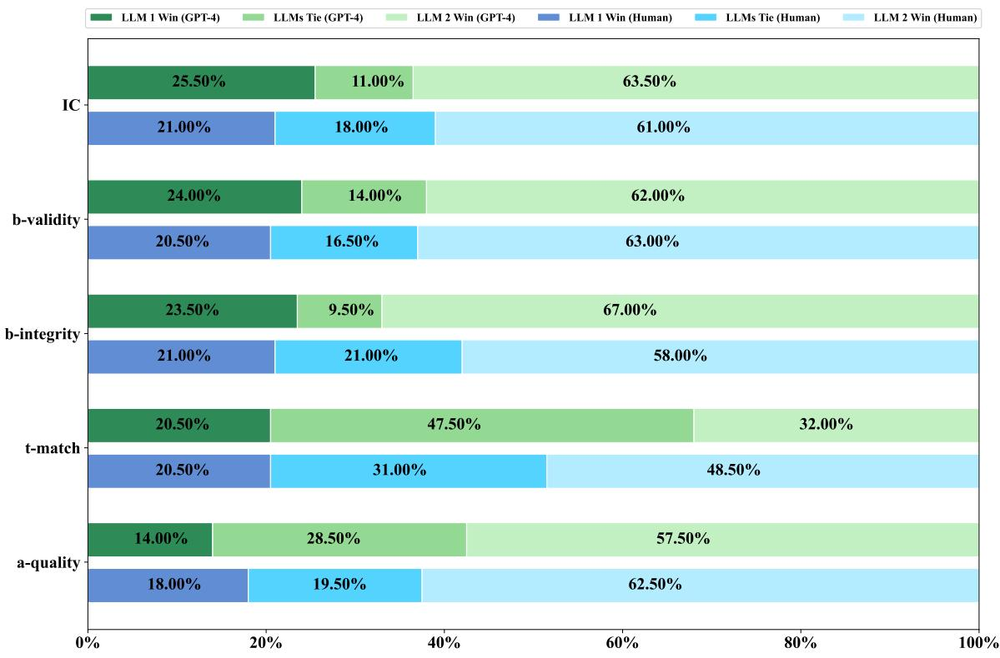  
Figure 8: Comparison of GPT-4 and human scoring across various LLMs.

Stability We analyze the score distribution of different LLMs in each of the five capability dimensions within each scenario separately. From the results shown in Figure 10, we find that for the same LLM, the score interval in the same scenario remains fixed for each capability dimension with very little difference. This indicates that the metrics we set give similar values for a same LLM in different test samples for the same task.

Sensitivity From Figure 5, Figure 10 and Figure 12, it is evident that distinctions in performance across five capability dimensions can be effectively made for different LLMs. For instance, consider ToolLLaMA-2-7B-v1 and ToolLLaMA-2-7B-v2, which share the same base model and training method but differ in model capability. Our evaluation system adeptly discerns variations in their performances across different capability dimensions, aligning well with the training characteristics of LLMs. This differentiation becomes even more pronounced when comparing LLMs from disparate sources. Thus, our metrics reliably rank two LLMs, even when their quality differs only slightly.

## C Experimental Details

## C.1 Details of Tool Collection

Criteria for Tool Collection To make our collection of tools suitable for the tool learning evaluation, we follow these criteria:

• The tools should fit within the seven realworld scenarios constructed and be relevant for daily use.

• The tools must be stable and able to be invoked successfully.

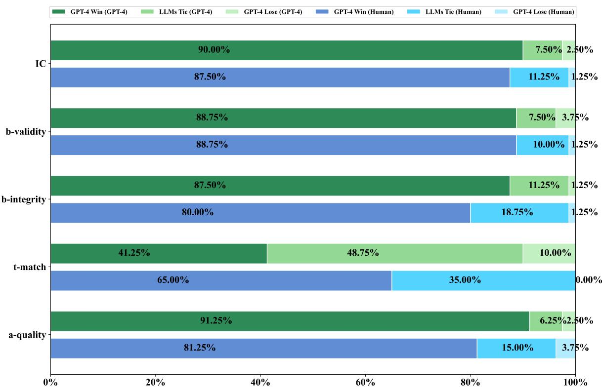  
Figure 9: Comparison of GPT-4 and human scoring between GPT-4 and other LLMs.

• The returned data from the tools should not exceed the model’s context limits and should be of appropriate length.

• The tools should be low-cost to invoke and easily testable by users.

• The tools must be well-documented to minimize documentation noise.

Process for Tool Collection We initially screen a large number of collected tools, excluding those with high costs (more than \$0.50 per call), unstable calls, return values exceeding 4096 tokens, or no return value. We then invite human reviewers to further screen the remaining tools, filtering out those that duplicate functions or are subsets of other tools. Next, we categorize the tools according to the constructed scenarios, filtering out those that do not fit these scenarios and specialized tools (e.g., specialized drawing tools) not useful to general users. Finally, we manually write documentation for the retained tools to ensure the clarity and validity of the tool information.

## C.2 Tool Categories and Subcategories

To establish a connection between LLMs and the environment, we develop a tool library comprising

41 categories and 95 subcategories. The precise names and containment relationships are detailed in Figure 11.

## C.3 Details of Data

## C.3.1 Criteria for Data Generation

Professionals related to each scenario are invited to formulate authentic requirements, and the criteria for building these requirements are outlined in Table 10.

## C.3.2 Examples of Data for Each Scenario

Three user queries for each scenario are presented in Table 11.

## C.4 Model Selection

To comprehensively assess the tool learning capabilities of various LLMs, we conduct experiments on ten LLMs sourced from three origins, and we will now provide a brief description of each series of models.

## C.4.1 Open-Source LLMs

LLaMA-2-chat LLaMA-2 (Touvron et al., 2023b) represents the second iteration of Meta’s open-source LLM. Building upon the foundation of LLaMA, it incorporates an increased token count for training and extends the context length to 4096. The LLaMA-2-chat series comprises models fine-tuned for conversational scenarios based on LLaMA-2, employing RLHF (Bai et al., 2022a) technology for alignment. These models, namely LLaMA-2-chat-7B, LLaMA-2-chat-13B, and LLaMA-2-chat-70B, are distinguished by variations in parameter numbers.

Vicuna-1.5 Vicuna (Chiang et al., 2023), a collection of open-source models introduced by LMSYS, includes Vicuna-1.5, which undergoes fine-tuning from LLaMA-2 using SFT and linear RoPE scaling techniques (Su et al., 2021) . Trained on approximately 125,000 conversations sourced from ShareGPT14, Vicuna-1.5 exhibits proficient command-following and natural language understanding capabilities. It is further classified based on model parameter scaling into two specific models: Vicuna-1.5-7B and Vicuna-1.5-13B.

## C.4.2 Tool-Oriented LLMs

ToolLLaMA-2-7B ToolLLaMA (Qin et al., 2023b) constitutes a series of specialized LLMs designed for tool learning, developed by Tsinghua University. One notable variant within this series is ToolLLaMA-2-7B, tailored for tool-oriented applications. It is derived from the base model LLaMA-2-7B and fine-tuned using 126 thousand instances of tool learning data associated with 16 thousand APIs through SFT. Depending on the version of the training data employed, it can be further classified into ToolLLaMA-2-7B-v1 and ToolLLaMA-2-7B-v2, with the latter showcasing a more advanced thought process in LLMs compared to the former.

## C.4.3 Closed-Source LLMs

Text-davinci-003 Text-davinci-00315, an LLM developed by OpenAI, is part of the GPT-3.5 series designed for tasks that require instruction following. Trained on a combination of text and code data until the fourth quarter of 2021, this model demonstrates proficiency in understanding and generating both natural language and code. With an extensive context window of 16,384 tokens, Text-davinci-003 is fine-tuned for a variety of tasks, including text completion, summarization, and question answering.

GPT-3.5-turbo GPT-3.5-turbo16 distinguishes itself as the most powerful and cost-effective model in the GPT-3.5 series. Tailored for chatbased applications, it leverages and enhances the capabilities of Text-davinci-003. This model excels in understanding and generating both natural language and code, while also demonstrating proficiency in traditional text-based tasks.

GPT-4 GPT-4 (OpenAI, 2023) represents OpenAI’s cutting-edge system, surpassing its predecessors with the ability to provide safer and more useful responses. Armed with expanded general knowledge and advanced reasoning capabilities, GPT-4 excels in accurately solving puzzles, solidifying its position as one of the most powerful LLMs currently in existence.

## C.5 Details of Result

We evaluate the capability scores (%) of the five dimensions of each LLMs in each scenario and plot them in Figure 12.

## D Error Examples

We outline the errors resulting from certain behavioral characteristics exhibited by the LLaMA-2-chat and Vicuna-1.5 model families, as detailed in Table 12.

## E Insights for Advancing Tool Learning

Based on our experimental results, we have several ideas for the advancement of tool learning.

Regarding task construction, recognizing the distinct behavioral characteristics of each LLM, we advocate considering the task’s output format in tandem with the model’s output traits. For instance, when utilizing LLaMA-2-chat as a foundation, it is essential to address strategies for mitigating its conversational behavior. Similarly, if building upon Vicuna-1.5, attention should be given to handling escaped characters. Moreover, drawing inspiration from team (2023), models like CodeLLaMA (Rozière et al., 2023) could serve as a foundation, incorporating structured languages such as code for output.

Concerning scenario generalization, acknowledging the variability in task difficulty and tool use complexity across scenarios, we propose the acquisition of more diverse data to authentically capture real-world requirements. Simultaneously, integrating model preferences, the adoption of innovative training techniques, such as “attention buckets,” (Chen et al., 2023b) can enhance the model’s processing efficacy across different return value types.

In terms of capability enhancement, recognizing the interconnected nature of $_ \mathrm { L L M s } ,$ tool learning capabilities, we stress the need to address the “barrel effect.” This entails comprehensively bolstering their capabilities across various dimensions, rather than solely prioritizing the accuracy of tool selection.

## F Prompt Template

## F.1 Prompt Template for Inference

During the inference of LLMs’ tool learning, we utilize five-shot learning for the open-source models and zero-shot learning for the other models. The prompt templates can be found in Table 13 and Table 14, respectively.

## F.2 Prompt Template for Evaluation

During the evaluation, some of our metrics are directly evaluated according to predefined rules, while others are assessed using GPT-4-1106- preview, which includes $s _ { I C }$ (Table 15), $s _ { b } .$ −validity (Table 16), $\begin{array} { r } { s _ { b - i n t e g r i t y } } \end{array}$ (Table 17), $s _ { t - m a t c h } ^ { i }$ (Table 18), $\scriptstyle { s _ { a - q u a l i t y } }$ (Table 19).

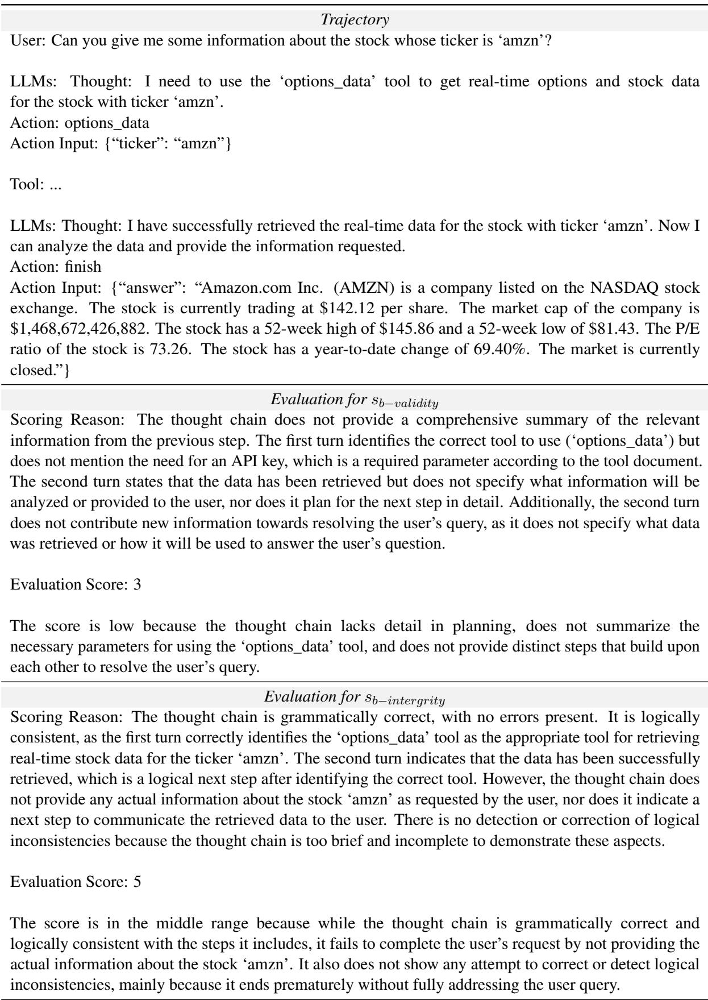  
Table 6: An example for the evaluation of $s _ { B P }$ by GPT-4.

Trajectory

User: I’m interested in books related to the fantasy genre, like ‘Harry Potter’. Can you help me find more?

LLMs: Thought: First, I need to use the ‘books\_related\_searches’ function to find books related to the fantasy genre, specifically similar to ‘Harry Potter’.

Action: books\_related\_searches

Action Input: {“q”: “Harry Potter”}

Tool: ...

LLMs: Thought: The search result returned a series of ‘Harry Potter’ books. However, I need to find other books related to the fantasy genre, similar to ‘Harry Potter’. I should ask the user for more specific preferences to narrow down the search.

Action: ask\_to\_user

Action Input: {“question”: “Could you please specify any particular elements or themes you enjoy in ‘Harry Potter’ that you’d like to see in other fantasy books?”}

User: I really enjoy the magical school setting and the coming-of-age themes in ‘Harry Potter’.   
I also like the elements of mystery and adventure in the series.

LLMs: Thought: Given the user’s preferences for a magical school setting, coming-of-age themes, and elements of mystery and adventure, I need to find books that incorporate these elements. However, the current toolset does not allow for such specific searches. I will use the ‘books\_related\_searches’ function again with a more general term ‘fantasy’ to find related books and then manually select those that seem to match the user’s preferences.

Action: books\_related\_searches

Action Input: {“q”: “fantasy”}

Tool: ...

LLMs: Thought: The search results returned a variety of fantasy books. However, based on the user’s preferences, the book “Grimgar of Fantasy and Ash: Volume 1” by Ao Jyumonji seems to be a good match. It’s a fantasy novel that includes elements of adventure and mystery. I will recommend this book to the user.

Action: finish

Action Input: {“answer”: “Based on your preferences, I recommend ‘Grimgar of Fantasy and Ash: Volume 1’ by Ao Jyumonji. It’s a fantasy novel that includes elements of adventure and mystery, similar to ‘Harry Potter’. You can find it here.”}

## Evaluation for sIC

Scoring Reason: The thought chain demonstrates a consistent focus on resolving the user query by seeking books related to the fantasy genre, similar to ‘Harry Potter’. The chain adapts to the user’s additional information about preferences for a magical school setting, coming-of-age themes, and elements of mystery and adventure. The thought process includes an attempt to refine the search based on these preferences and concludes with a specific book recommendation that aligns with the user’s interests. However, the thought chain could have been more effective if it had used the ‘ask\_to\_user’ tool to clarify or confirm the user’s preferences before making a recommendation.

## Evaluation Score: 8

The score is high because the thought chain is relevant and adapts to the user’s additional information. It loses some points because it could have engaged the user further to ensure the recommendation was as accurate as possible.

<table><tr><td>Dimension</td><td> $s _ { I C }$ </td><td> $\begin{array} { r l } { { s } _ { b - v a l i d i t y } } \end{array} { }$ </td><td> $\begin{array} { r } { s _ { b - i n t e g r i t y } } \end{array}$ </td><td> $s _ { t - m a t c h }$ </td><td> $\scriptstyle { s _ { a - q u a l i t y } }$ </td></tr><tr><td>Kappa</td><td>0.81</td><td>0.96</td><td>0.93</td><td>0.78</td><td>0.90</td></tr></table>

Table 8: The inter-annotator agreement score of three annotators.

<table><tr><td>Source</td><td>Models</td><td> $\mathbf { s _ { I C } }$ </td><td> $\mathbf { S _ { b - v a l i d a t y } }$ </td><td> $\mathbf { S _ { b - i n t e g r i t y } }$ </td><td> $\mathbf { S _ { a - q u a l i t y } }$ </td></tr><tr><td rowspan="4">Open-Source</td><td>LLaMA-2-chat-7B</td><td>11.52</td><td>14.40</td><td>11.26</td><td>6.02</td></tr><tr><td>LLaMA-2-chat-13B</td><td>14.40</td><td>13.09</td><td>13.87</td><td>11.26</td></tr><tr><td>LLaMA-2-chat-70B</td><td>10.99</td><td>13.61</td><td>13.87</td><td>4.19</td></tr><tr><td>Vicuna-1.5-7B</td><td>18.85</td><td>19.11</td><td>19.11</td><td>13.35</td></tr><tr><td rowspan="2">Tool-Oriented</td><td>Vicuna-1.5-13B</td><td>14.66</td><td>15.97</td><td>15.18</td><td>17.54</td></tr><tr><td>ToolLLaMA-2-7B-v1 ToolLLaMA-2-7B-v2</td><td>10.73 46.34</td><td>11.78 47.64</td><td>9.95 43.46</td><td>35.60</td></tr><tr><td rowspan="2">Closed-Source</td><td></td><td></td><td></td><td></td><td>21.47</td></tr><tr><td>Text-davinci-003</td><td>43.19</td><td>33.77</td><td>31.68</td><td>21.99</td></tr><tr><td></td><td>GPT-3.5-turbo</td><td>40.31</td><td>34.03</td><td>36.39</td><td>48.43</td></tr></table>

Table 9: The proportion of other LLMs achieving scores equal to or higher than GPT-4 across various metrics.  
As a {scenario} professional, your task is to devise pertinent requirements in collaboration with the provided tools, adhering to the following criteria:

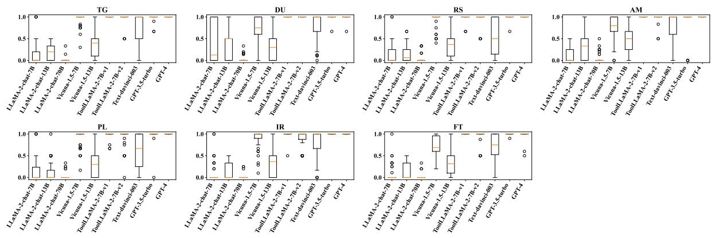  
(a) Format Alignment

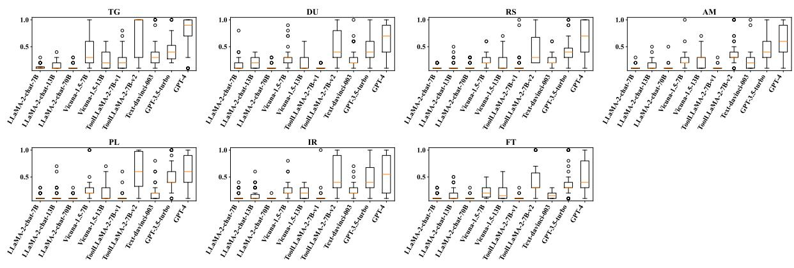  
(b) Intent Comprehension

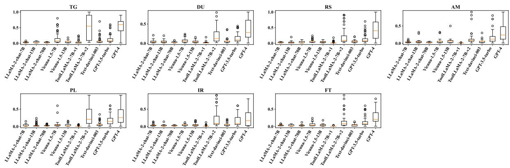  
(c) Behavior Planning

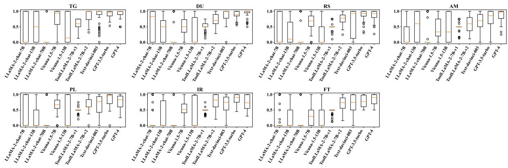  
(d) Tool Selection

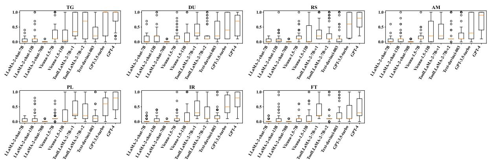  
(e) Answer Organization  
Figure 10: The score distribution of different LLMs in each of the five capability dimensions within each scenario.

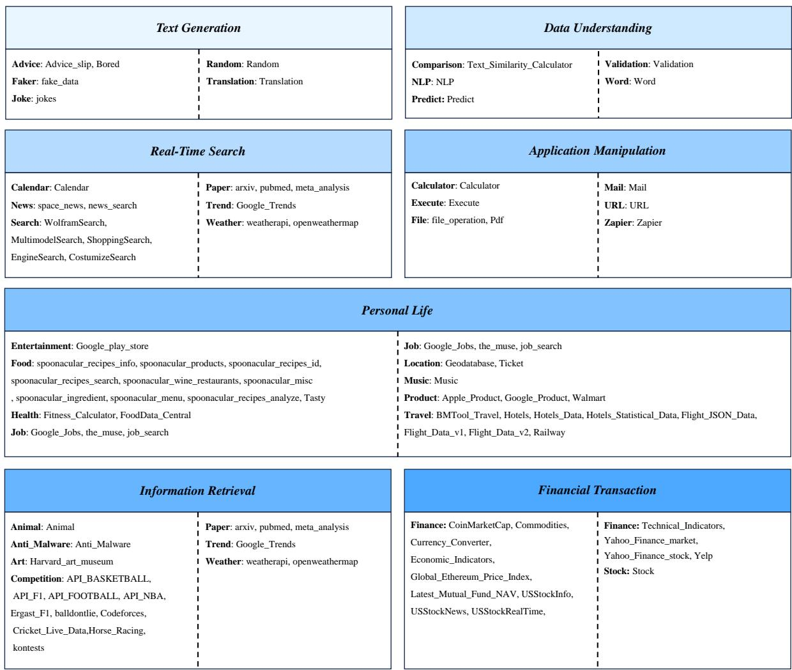  
Figure 11: Tool categories and subcategories in each scenario.

<table><tr><td>Text Generation</td></tr><tr><td>1. How should I say ‘glass&#x27; in Chinese? 2. My friend&#x27;s wedding is coming up, do you have any advice for the bride? 3. I&#x27;m in need of assistance in generating a random string with a length of 8, please give me one.</td></tr><tr><td>Data Understanding 1. Based on their names, what could be the nationalities of John and Maria? 2. What emotions are contained in the following text, Beneath the starry sky, serenity envelops the tranquil meadow, inviting contemplation and inner peace.&#x27; 3. Please help me assign classes to this text, “As the gentle waves caress the sandy beach and the sunlight</td></tr><tr><td>pours down its warm rays, I feel a sense of tranquility and peace within. The beauty and harmony of nature make me forget the hustle and bustle of the city, allowing me to quietly listen to the birds’ songs and feel the breath of the wind.&quot; Real-Time Search</td></tr><tr><td>1. Can you tell me what will the weather be like in London for the next week? 2. What were the most popular news articles related to technology on August 1st, 2023? 3. Can you create a line chart that depicts the search popularity score of restaurant over a period of time?</td></tr><tr><td>Personal Life 1. What is the distance between Bangkok and Phitsanulok?</td></tr><tr><td>2. I am looking for films with a style or genre similar to Pulp Fiction&#x27;, can you help me find them? 3. I will go to Seattle from Beijing next month. Can you make a recommendation on hotels and flight please?</td></tr><tr><td>Information Retrieval 1. Please display five threads from page one of the mu&#x27; board in 4chan. 2. Is there a publication titled “Art History: A Comprehensive Guide&quot; available at Harvard Art Museum?</td></tr><tr><td>3. Could you provide me with a comprehensive list of all the contests available on the Codeforces platform?</td></tr><tr><td>Application Manipulation 1. Please summary the content in ./test_file/read_test.md&#x27; using less than 5 sentences.</td></tr><tr><td>2. Could you execute this Python expression with Python Interpreter? (123 + 234) / 23 * 19? 3. Send an email to xxxxxxxxxx@qq.com with test_email&#x27; in the subject line and hello!’in the body. Financial Transactions</td></tr></table>

Table 11: Examples of evaluation data in each scenario.

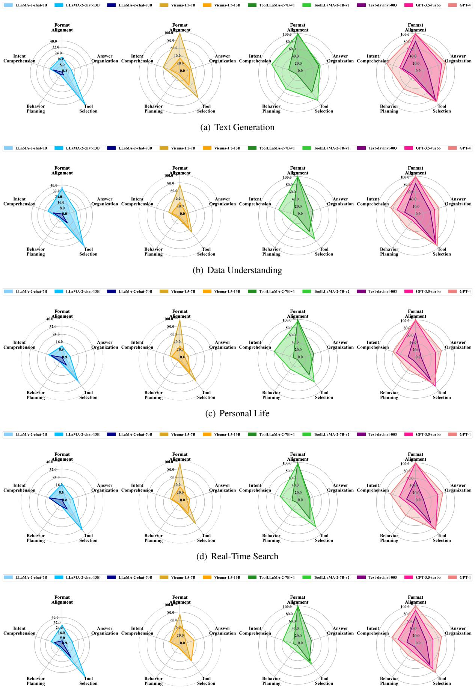  
(e) Application Manipulation

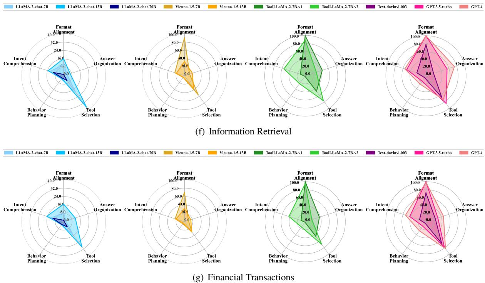  
Figure 12: Performance of various LLMs for each capability dimension in each scenario.

<table><tr><td rowspan=1 colspan=1>Error</td><td rowspan=1 colspan=1>Model</td><td rowspan=1 colspan=1>Example</td></tr><tr><td rowspan=1 colspan=1>MissingKeywords</td><td rowspan=1 colspan=1>LLaMA-2-chat-7B</td><td rowspan=1 colspan=1>I cannot handle this task. Please provide a valid task.</td></tr><tr><td rowspan=2 colspan=1>RedundantSentences</td><td rowspan=1 colspan=1>LLaMA-2-chat-13B</td><td rowspan=1 colspan=1>Thought: Sure! I can help you with that. First, I will usethe “games_related_searches&quot; function to find games similar toMinecraft.Action: games_related_searchesAction Input: {“q&quot;: “Minecraft&quot;}Please provide the result.</td></tr><tr><td rowspan=1 colspan=1>LLaMA-2-chat-70B</td><td rowspan=1 colspan=1>Thought: I will use the “google_trends_search&quot; function to comparethe search popularity of “coffee&quot; and “milk&quot; in Canada.Action: google_trends_searchAction Input: {“query&quot;: “coffee, milk&quot;, “geo&quot;: “CA&quot;, “data _type&quot;:“TIMESERIES&quot;, &quot;tz&quot;: “-7”, &quot;cat&quot;: “&quot;0&quot;, “gprop&quot;: “Web Search&quot;,&quot;date&quot;: &quot;now 1-d&quot;, &quot;limit&quot;: “5&quot;, &quot;offset&quot;: &quot;0&quot;}Please provide youranswer in the format above.</td></tr><tr><td rowspan=1 colspan=1>ToolHallucinations</td><td rowspan=1 colspan=1>Vicuna-1.5-7B</td><td rowspan=1 colspan=1>Thought: I will use the “get\_threads\_with\_preview&quot; function toshow the threads on the b&#x27; board of 4chan that have been archived.Action: get\_threads\_with\_previewAction Input: {&quot;board&quot;: &quot;b&quot;}</td></tr><tr><td rowspan=1 colspan=1>ParameterHallucinations</td><td rowspan=1 colspan=1>Vicuna-1.5-13B</td><td rowspan=1 colspan=1>Thought: First, I will use the “games&quot; function to get the list ofgames for the 2020NBA season.Action: gamesAction Input: {“season&quot;: &quot;2020&quot;, &quot;league&quot;: &quot;NB&quot;, “api\_key&quot;:&quot;your\_api\_key&quot;}</td></tr><tr><td rowspan=1 colspan=1>IrrelevantAnswers</td><td rowspan=1 colspan=1>LLaMA-2-chat-7B</td><td rowspan=1 colspan=1>Query: I hope to have some advice about studying.Answer: Taylor is 36 years old, and Jordan is 39 years old.</td></tr></table>

Table 12: Some examples of different error types, with errors marked in red.

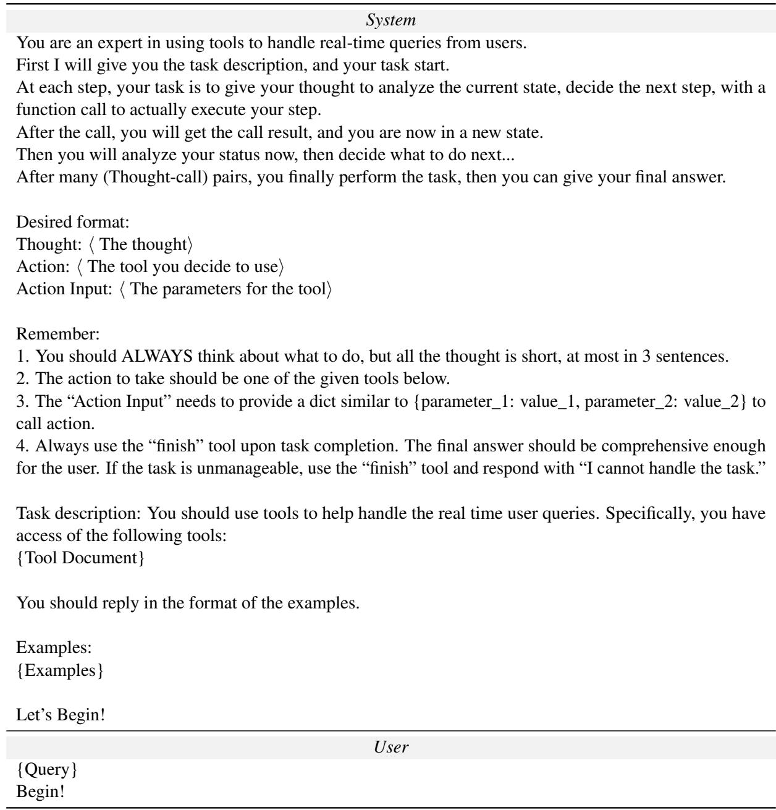  
Table 13: The five-shot learning prompt used for LLMs in tool learning, where “{Tool Document}” represents the tool documentation given to LLMs, “{Examples}” represents the examples used for LLMs, and “{Query}” represents the query given by the user.

Let’s Begin!
<table><tr><td>System</td></tr><tr><td>You are an expert in using tools to handle real-time queries from users.</td></tr><tr><td>First I will give you the task description, and your task start.</td></tr><tr><td>At each step, your task is to give your thought to analyze the current state, decide the next step, with a</td></tr><tr><td>function call to actually execute your step.</td></tr><tr><td>After the call, you will get the call result, and you are now in a new state.</td></tr><tr><td>Then you will analyze your status now, then decide what to do next...</td></tr><tr><td>After many (Thought-call) pairs, you finally perform the task, then you can give your final answer.</td></tr></table>

Desired format:

Thought: ⟨ The thought⟩

Action: ⟨ The tool you decide to use⟩

Action Input: ⟨ The parameters for the tool⟩

1. You should ALWAYS think about what to do, but all the thought is short, at most in 3 sentences.

2. The action to take should be one of the given tools below.

3. The “Action Input” needs to provide a dict similar to {parameter\_1: value\_1, parameter\_2: value\_2} to call action.

4. Always use the “finish” tool upon task completion. The final answer should be comprehensive enough for the user. If the task is unmanageable, use the “finish” tool and respond with “I cannot handle the task.”

Task description: You should use tools to help handle the real time user queries. Specifically, you have access of the following tools:

<table><tr><td>User</td></tr><tr><td>{Query}</td></tr><tr><td>Begin!</td></tr></table>

Table 14: The zero-shot learning prompt used for LLMs in tool learning, where “{Tool Document}” represents the tool documentation given to LLMs and “{Query}” represents the query given by the user.

System

As a professional assessment expert, your task is to objectively evaluate the quality of the provided data based on the given guidelines.

When given a tool document, a user query, and a thought chain that addresses the query, please rate the quality of the thought chain based on the following criteria:

1. The extent to which the thought chain consistently focuses on resolving the user query. The more relevant it is to the user query, the higher the score.

2. The ability of the thought chain to adapt promptly when the user provides new information or makes new requests. The higher the alignment with the new information and requests, the higher the score. If there is no new information or requests, please ignore the criteria.

Please provide your assessment in the following format:“‘

Scoring Reason: <Provide a reason for your score, referencing the given criteria>.

Evaluation Score: <Assign a score between 1 and 10>. ,,,

<table><tr><td>User</td></tr><tr><td>Tool Document:</td></tr><tr><td>{document}</td></tr><tr><td></td></tr><tr><td>User Query:“ {query}</td></tr><tr><td>,,,</td></tr><tr><td>Thought Chain:</td></tr><tr><td>{thought_chain}</td></tr><tr><td>,,,</td></tr><tr><td>Assessment:</td></tr></table>

Table 15: Prompt for evaluation of $s _ { I C }$ , where “{document}” represents the tool document, “{query}” represents the query given by user, and “{thought\_chain}” represents the thought chain given by LLM.

As a professional assessment expert, your task is to objectively evaluate the quality of the provided data based on the given guidelines.

When given a tool document, a user query, and a thought chain that addresses the query, please rate the quality of the thought chain based on the following criteria:

1. Each step should succinctly summarize relevant information from the previous step; the more comprehensive the summary, the higher the score.

2. Each step should timely plan for the next one; the more detailed the next step, the higher the score.

3. Each step should be distinct from the previous one and contribute to resolving the user’s query; the less repetition, the higher the score.

Please provide your assessment in the following format:“‘

Scoring Reason: <Provide a reason for your score, referencing the given criteria>.

Evaluation Score: <Assign a score between 1 and 10>.

<table><tr><td>User</td><td></td></tr><tr><td>Tool Document:</td><td></td></tr><tr><td>{document}</td><td></td></tr><tr><td>User Query:“</td><td></td></tr><tr><td>{query}</td><td></td></tr><tr><td>,,,</td><td></td></tr><tr><td>Thought Chain:“</td><td></td></tr><tr><td>{thought_chain}</td><td></td></tr><tr><td>,,,</td><td></td></tr></table>

Table 16: Prompt for evaluation of $s _ { b - v a l i d i t y } ,$ where “{document}” represents the tool document, “{query}” represents the query given by user, and “{thought\_chain}” represents the thought chain given by LLM.

As a professional assessment expert, your task is to objectively evaluate the quality of the provided data based on the given guidelines.

When given a tool document, a user query and a thought chain that addresses the query, please rate the quality of the thought chain based on the following criteria:

1. The presence or absence of grammatical errors in the thought chain. The fewer the errors, the higher the score.

2. The logical consistency of the thought chain. The fewer logical inconsistencies, the higher the score.

3. The timeliness of detection and correction of any logical inconsistencies in the thought chain. The more timely the correction, the higher the score.

Please provide your assessment in the following format:“‘

Scoring Reason: <Provide a reason for your score, referencing the given criteria>.

Evaluation Score: <Assign a score between 1 and 10>.

<table><tr><td>User</td><td></td></tr><tr><td>Tool Document:</td><td></td></tr><tr><td>{document}</td><td></td></tr><tr><td>User Query:“</td><td></td></tr><tr><td>{query}</td><td></td></tr><tr><td>,,,</td><td></td></tr><tr><td></td><td></td></tr><tr><td>Thought Chain:“ {thought_chain}</td><td></td></tr><tr><td>,,,</td><td></td></tr><tr><td></td><td></td></tr><tr><td>Assessment:</td><td></td></tr></table>

Table 17: Prompt for evaluation of $\begin{array} { r } { s _ { b - i n t e g r i t y } , } \end{array}$ where “{document}” represents the tool document, “{query}” represents the query given by user, and “{thought\_chain}” represents the thought chain given by LLM.

As a professional assessment expert, your task is to objectively evaluate the quality of the provided data based on the given guidelines.

When presented with a tool document, a THOUGHT, and a tool from the tool document, please ascertain the correlation between the specified tool and the given THOUGHT based on the guidelines below:

1. If the THOUGHT is empty, assign a score of 5 immediately.

2. If the THOUGHT is not empty, determine if the chosen tool is more pertinent to the planning in the THOUGHT compared to other tools in the tool document based on the tool documentation description. The more relevant the tool, the higher the score.

Please provide your assessment in the following format:“‘

Scoring Reason: <Provide a reason for your score, referencing the given criteria>.

Evaluation Score: <Assign a score between 1 and 10>.

<table><tr><td>User</td></tr><tr><td>Tool Document:</td></tr><tr><td>{document}</td></tr><tr><td></td></tr><tr><td>THOUGHT:“</td></tr><tr><td>{thought} ,,,</td></tr><tr><td></td></tr><tr><td>Tool:“</td></tr><tr><td>{tool}</td></tr><tr><td>,,,</td></tr><tr><td>Assessment:</td></tr></table>

Table 18: Prompt for evaluation of $s _ { t - m a t c h } ^ { i }$ , where “{document}” represents the tool document, “{thought}” represents the thought given by LLM, and “{tool}” represents the tool selected by LLM.

As a professional assessment expert, your task is to objectively evaluate the quality of the provided data based on the given guidelines.

When given a tool document, a user query, and a thought chain that addresses the query, please rate the quality of the thought chain based on the following criteria:

1. The extent to which the thought chain consistently focuses on resolving the user query. The more relevant it is to the user query, the higher the score.

2. The ability of the thought chain to adapt promptly when the user provides new information or makes new requests. The higher the alignment with the new information and requests, the higher the score. If there is no new information or requests, please ignore the criteria.

Please provide your assessment in the following format:“‘

Scoring Reason: <Provide a reason for your score, referencing the given criteria>.

Evaluation Score: <Assign a score between 1 and 10>. ,,,

<table><tr><td>User</td></tr><tr><td>Tool Document:</td></tr><tr><td>{document}</td></tr><tr><td></td></tr><tr><td>User Query:“ {query}</td></tr><tr><td>,,,</td></tr><tr><td>Thought Chain:</td></tr><tr><td>{thought_chain}</td></tr><tr><td>,,,</td></tr><tr><td>Assessment:</td></tr></table>

Table 19: Prompt for evaluation of $s _ { a - q u a l i t y } ,$ where “{document}” represents the tool document, “{query}” represents the query given by user, and “{thought\_chain}” represents the thought chain given by LLM.