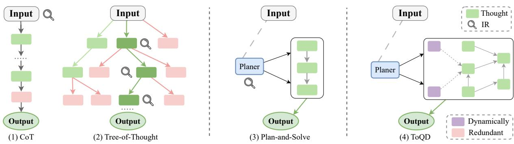
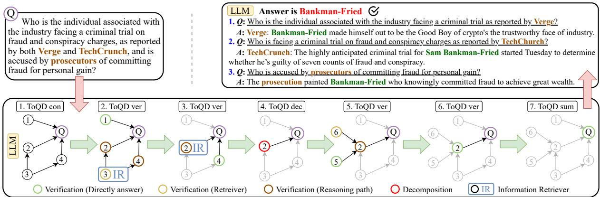
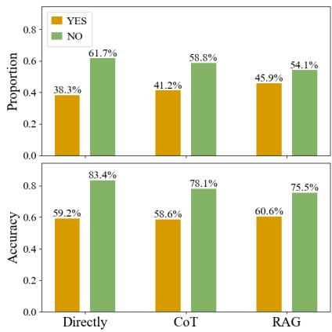
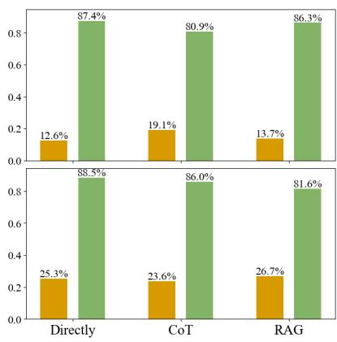
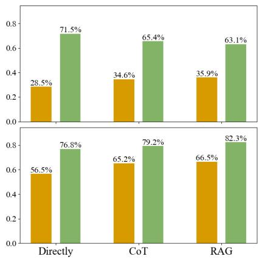
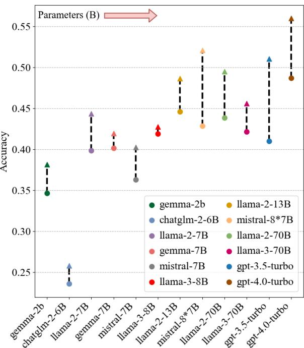
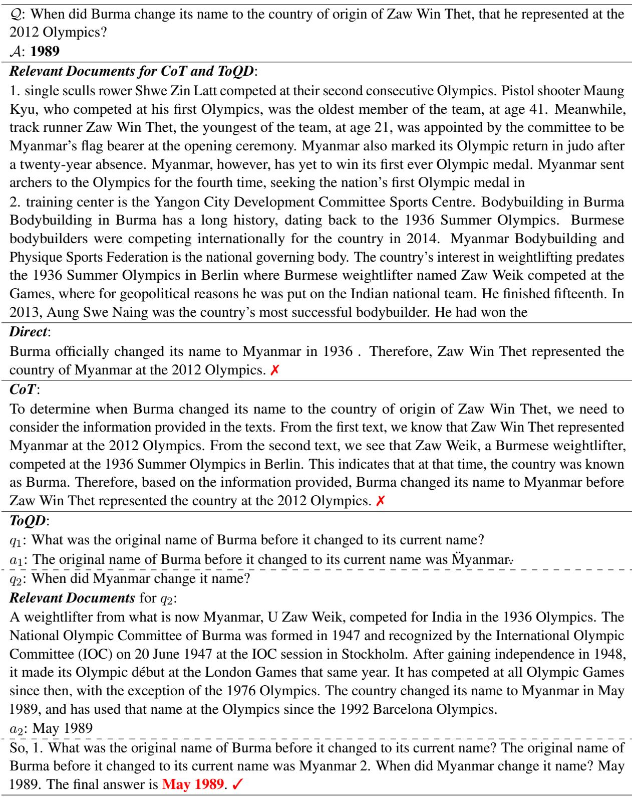

# Topology-of-Question-Decomposition: Enhancing Large Language Models with Information Retrieval for Knowledge-Intensive Tasks

Weijie Li1, Jin Wang1,\*, Liang-Chih Yu2,\* and Xuejie Zhang1

1School of Information Science and Engineering, Yunnan University, Yunnan, P.R. China 2Department of Information Management, Yuan Ze University, Taiwan liweijie1@stu.ynu.edu.cn, {wangjin, xjzhang}@ynu.edu.cn lcyu@saturn.yzu.edu.tw

## Abstract

Large language models (LLMs) are increasingly deployed for general problem-solving across various domains yet remain constrained to chaining immediate reasoning steps and depending solely on parametric knowledge. Integrating an information retrieval system directly into the reasoning process of LLMs can improve answer accuracy but might disrupt the natural reasoning sequence. Consequently, LLMs may underperform in complex, knowledge-intensive tasks requiring multiple reasoning steps, extensive real-world knowledge, or critical initial decisions. To overcome these challenges, we introduce a novel framework, Topology-of-Question-Decomposition (ToQD), which activates retrieval only when necessary. Globally, ToQD guides LLMs in constructing a topology graph from the input question, each node representing a subquestion. Locally, ToQD employs self-verify inference to determine whether a sub-question should retrieve relevant documents, necessitate further decomposition, or directly provide an answer. Experiments demonstrate that ToQD achieves superior performance and robustness in complex, knowledge-intensive tasks, significantly enhancing system response efficiency. The code repository is accessible at https://github.com/DCVDB/ToQD

## 1 Introduction

Despite the increased model size enabling large language models (LLMs) to excel in general knowledge domains (Hendrycks et al., 2021; Kwiatkowski et al., 2019), LLMs (OpenAI, 2020) continue to struggle with factual errors in the complex knowledge-intensive tasks (Petroni et al., 2021; Zelikman et al., 2022) that require multireasoning. To address the inherent knowledge constraints of LLMs (Zhang et al., 2023; Mallen et al., 2023), retrieval-augmented generation (RAG)

(Lewis et al., 2021; Gao et al., 2024) augment the input of LLMs with the relevant documents, thus reducing factual hallucination (Yu et al., 2023; Yoran et al., 2024) and bolstering performance in intricate tasks (Yang et al., 2018; Joshi et al., 2017). Additionally, advanced prompting strategies such as chain-of-thought (CoT) (Wei et al., 2023) enhance the reasoning capabilities of models by encouraging them to generate additional reasoning steps (Mavi et al., 2024). In light of these enhancements, prompt strategies incorporated within the RAG framework can be classified into two primary categories: local reasoning and global planning.

Local reasoning methods, primarily based on CoT approaches such (Auto-CoT (Zhang et al., 2022), Self-Consistency (Wang et al., 2023c), Recite-and-answer (Sun et al., 2023) and Tree-of-Thought (Yao et al., 2023a)), facilitate sequential reasoning steps to enhance response accuracy incrementally. However, these methods often generate reasoning steps without logical connection rather than a cohesive global planning strategy, frequently resulting in a disorganized reasoning process with significant redundancy (Figure 1). Moreover, integrating the RAG framework, as demonstrated by Self-Ask (Press et al., 2023b) and DSP (Khattab et al., 2023), disrupts sequential reasoning, limiting LLMs to localized sub-questions and curtailing their broader reasoning abilities (Jain et al., 2024). Consequently, in primarily local reasoning methods, interaction with IR typically involves retrieving all relevant documents upfront rather than as needed, contradicting the view that ’LLMs are knowledge warehouses.’ (Yin et al., 2023).

Compared to local reasoning, globalplanning methods like Plan-and-Solve (Wang et al., 2023a), Least-to-Most (Zhou et al., 2023), and SearChain (Xu et al., 2024) significantly enhance response accuracy by pre-planning a chain of reasoning to clarify logical relationships (Figure 1). However, the inherent rigidity of these methods limits their capacity to dynamically respond to complex reasoning steps, thus impeding deeper analytical processing. Simultaneously, it should be noted that complex knowledge-intensive tasks do not invariably require sequential reasoning; parallel reasoning can accelerate the process, a facet frequently neglected by chain reasoning methodologies.

  
Figure 1: Schematic illustrating various approaches to problem-solving with LLMs. Each green box represents an intermediate thought aimed at resolving a problem, while the blue box symbolizes the global planner. The red box denotes a redundant thought, and the purple box indicates a dynamically adjusted thought. Local reasoning: (1) CoT (2) Tree-of-Thought. Globalplanning: (3) Plan-and-Solve. Our method: (4) ToQD.

In addressing the limitations of local reasoning and global planning methods, this study proposes a novel approach termed Topology-of-Question-Decomposition (ToQD), which enables retrieval only when necessary (Figure 1 and 2). Globally, ToQD instructs LLMs to construct a topology graph $\mathcal { G } _ { t o p }$ based on the input question, where each node encapsulates a specific subquestion. Within $\mathcal { G } _ { t o p }$ should the nodes align either parallelly or sequentially, LLMs are programmed to adjust their responses to expedite the resolution process. Locally, at each subquestion node within $\mathcal { G } _ { t o p } ,$ LLMs apply self-verify inference to ascertain whether to retrieve relevant documents, necessitate further decomposition, or directly provide an answer. Following interactions with IR and subsequent reasoning, ToQD executes summarization at each node to construct the final answer for the input question.

Experiments demonstrate that ToQD surpasses state-of-the-art baselines in complex knowledgeintensive tasks while enhancing overall efficiency. Moreover, the ToQD prompt templates deliberately omit numerical examples to reduce dependency on the in-context learning capabilities of LLMs, thereby enhancing its applicability to models ranging from 2B to over 100B parameters.

## 2 Related Work

Chain-of-Thought Prompting. Chain-of-thought (CoT) prompting (Wei et al., 2023; Suzgun et al.,

2022), a gradient-free method, systematically facilitates the generation of intermediate reasoning steps by LLMs before delivering the final answer, with multiple task-specific variants (SelfAsk (Press et al., 2023b), Ask-me-anything (Arora et al., 2022), and ReSP (Jiang et al., 2024)). The fundamental principle underlying CoT prompting is its systematic decomposition of complex problems into a series of intermediate reasoning steps (Servantez et al., 2024; Kojima et al., 2023). However, CoT predominantly rely on the model’s in-context learning capabilities (Shi et al., 2024; Chung et al., 2022), limiting their applicability to smaller and medium-sized models (Raffel et al., 2023; Jiang et al., 2023). Moreover, methods (Yao et al., 2023a; Besta et al., 2024) employ LLMs to decompose complex questions and sequentially answer each sub-question iteratively.

Retrieval-Augmented LLMs. Recent studies show that retrieval-augmented generation (RAG) pipeline can enhance the reasoning ability of LLMs (Trivedi et al., 2023; He et al., 2022; Shao et al., 2023), make the responses more credible and traceable (Xu et al., 2024), reduce the factual hallucinations. However, the RAG still struggles with sourcing and assimilating factual evidence from multiple documents for complex multi-hop queries, often leading to factual errors that mislead LLMs (Tang and Yang, 2024; Mallen et al., 2023).

Self-Knowledge in LLMs. The concept of ’selfknowledge’ in LLMs, initially introduced by (Kadavath et al., 2022), is further defined as the LLMs’ ability to understand limitations concerning the unknowns and has been evaluated by (Yin et al., 2023). Simultaneously, recent scholarly focus on the quality of training data (Gunasekar et al., 2023; Touvron et al., 2023) indicates that inaccuracies in

  
Figure 2: The Topology-of-Question-Decomposition (ToQD) process involves several key steps. Globally, ToQD guides the LLM to construct a topology graph $\mathcal { G } _ { t o p }$ from the question Q, where each node symbolizes a subquestion q. Locally, at each node $q \in \mathcal { G } _ { t o p }$ , the LLMs employs self-verify inference to decide if q should retrieve documents, requires further decomposition, or can be answered outright. In the final stage, each node within $\mathcal { G } _ { t o p }$ contributes to answering the question Q.

## 3.1 Overview

Algorithm 1 ToQD Inference   
Require: Generator LM M, Self-Verify inference   
1: Input: Input the original question Q, Output: the   
answer A of the input question Q   
2: M decomposes Q into the sub-questions set Q′ and   
evaluate IsRel for $q \in \mathcal { Q } ^ { \prime }$ ▷ Critique   
3: M construct $\mathcal { G } _ { t o p }$ from Q and $Q ^ { \prime }$ ▷ Construct   
4: Initialize: indegree, queue, qa, path as per Gtop   
5: while not queue.empty() do   
6: q ← queue.popleft()   
7: Use the Self-verify to predict Decomposition and   
answer a based on the path ▷ Self-verify   
8: if Decomposition == YES then   
9: Though ▷ Critique and ▷ Construct to add a   
G for $\mathcal { G } _ { t o p } ;$ Update status   
10: else if Decomposition == NO then   
11: qa.append((q, a)); Update status   
12: end if   
13: end while   
14: M predicts A for Q based on qa

LLMs responses to complex knowledge-intensive questions are more likely due to the model’s fabrication of information rather than the propagation of erroneous learned content. Consequently, this paper posits that model knowledge should be the same as factual evidence.

## 3 Topology-of-Question-Decomposition

This section delineates the design of the Topologyof-Question-Decomposition (ToQD). The overall pipeline of ToQD is shown in Figure 2, which includes decomposing the input question Q into topology graph $\mathcal { G } _ { t o p }$ and using self-verify inference to answer each sub-question.

Algorithm 1 delineates the comprehensive procedural framework of ToQD. Given the input question Q, we use the prompts like "Decompose original question reasoning steps into 2 to 6 simply and logically connected sub-questions for helping students reason towards the answers." to instruct LLMs for decomposing Q into sub-questions $Q ^ { \prime } = \{ q _ { 1 } , q _ { 2 } , . . . , q _ { n } \}$ . Subsequently, employing the prompt like "Filter out any off-topic or irrelevant sub-question," ToQD guides the LLMs to critique (▷ Critique) the relevance of each $q \in Q ^ { \prime }$ in addressing Q, thereby eliminating redundant reasoning steps (IsRel indicates relevance). Throughout the processes of decomposition and critique, each $q \in Q _ { r e l } ^ { \prime }$ is sufficiently simplified for LLMs to determine their ability to respond, ideally restricting the focus to a single entity. These streamlined sub-questions enhance the precision of IR from knowledge sources by focusing exclusively on a single entity, thereby facilitating more efficient retrieval, predominantly through semantic search methodologies (Reimers and Gurevych, 2019; Chen et al., 2024). Following this, LLMs analyze the relationships between Q and $Q _ { r e l } ^ { \prime }$ as well as among $Q _ { r e l } ^ { \prime }$ themselves to construct a topology graph $\mathcal { G } _ { t o p }$ (▷ Construct), wherein each node within $\mathcal { G } _ { t o p }$ represents a sub-question $q \in \mathcal G _ { t o p } .$ In the resolution process of $\mathcal { G } _ { t o p }$ , LLMs employ self-verify (▷ Self-Verify) inference to determine whether q should retrieve documents, necessitates further decomposition (Decomposition is ’YES’), or can be directly answered. Within $\mathcal { G } _ { t o p }$ , if nodes align either in parallel (‘Composition’) or sequentially (‘Bridge’), the LLMs adjust their responses to expedite the resolution process. Upon resolving the sub-questions through topological sorting, ToQD summarizes each node of $q \in \mathcal { G } _ { t o p }$ to predict the final answer A for Q. Throughout the ToQD pipeline, ToQD employs selective retrieval via LLMs only when necessary to enhance the traceability of generated content and accelerate the reasoning process through expedited parallel reasoning. Appendix B illustrates ToQD’s management of three prevalent question types in multi-hop questions: "Composition," "Bridge," and "Bridge and Composition."

Algorithm 2 Self-Verify Inference   
Require: Generator LM M, Retriever R , Large-scale docu  
ment collections $\{ d _ { 1 } , \ldots , d _ { N } \}$   
1: Input: input question qt, preceding sub-questions   
$( q _ { < t } , a _ { < t } )$ Output: new $\left( q _ { t } , a _ { t } \right)$ or Decomposition   
2: M rewrite q for $q _ { n e w }$ if given $( q _ { < t } , a _ { < t } )$ for $q _ { n e w }$ and   
predicts the Retrieve based on the qt or qnew ▷ Rewrite   
3: if Retrieve == YES then   
4: Retrieve relevant documents D using R given qnew   
5: M predicts Decomposition given $q _ { n e w } ,$ ,each d $\in \mathcal { D }$   
6: if Decomposition == YES then   
7: Return Decomposition for ToQD inference   
8: else if Decomposition == NO then   
9: M predicts at given $q _ { n e w } ,$ each $d \in \mathcal { D }$   
10: end if   
11: else if Retrieve == NO then   
12: M predicts at given qnew   
13: end if

## 3.2 Self-Verify

Within the structure of $q \in \mathcal { G } _ { t o p } .$ , each sub-question node $q$ is subject to distinct processing pathways. If $q$ qualifies as an internal node, ToQD systematically rewrites $q$ into a new formulation question $q _ { n e w }$ adhering to the established reasoning path within $\mathcal { G } _ { t o p }$ (▷ Rewrite). Additionally, ToQD evaluates the necessity to procure pertinent documents D from an extensive knowledge source. In contrast, for leaf nodes within $\mathcal { G } _ { t o p } .$ , ToQD utilizes the prompt like "Can you directly answer the question ’{question}’" to gauge whether LLMs can directly answer subquestion $q ,$ thereby autonomously determining the necessity for immediate document retrieval. We hypothesize that LLMs are not capable (or capable) of solving the question when they respond with "NO!" (Retrieve is "YES"). Simultaneously, the ToQD commences interaction with IR to retrieve the relevant documents D using the retriever R. If LLMs respond with "YES", the LLMs will directly answer the subquestion q. Direct prompting operates intuitively and is independent of the model’s intrinsic in-context learning capabilities, thus enabling effective performance even on models with reduced parameter sizes and better assisting the model in assessing and evaluating its ability to answer the subquestion q. After obtaining the relevant documents D, ToQD employs the prompt like "Can you directly answer the question ’{question}’ based on the document ’ {document}’?" as a template to ascertain whether LLMs can answer the subquestion q based on the relevant documents D. Similarly, ToQD employs the LLMs criterion to determine whether to answer the question directly or decompose it further within the ToQD inference process. When further decomposition is required, the processes of decomposition, critique, and construct are employed to add a child graph to the existing $\mathcal { G } _ { t o p }$ , dynamically adjusting the reasoning steps in response to evolving analytical needs. The global perspective embedded within ToQD prompts LLMs to intensify their exploration of potential answers when encountering intermediate challenges. By minimizing interaction with IR and maximizing the use of LLMs’ self-knowledge, the self-verify strategy accelerates reasoning speed and reduces the potential factual errors from IR.

## 3.3 Awareness of Unknowns in Large Language Models

LLMs, often referred to as ’knowledge warehouses’ can generate well-calibrated predictions for token probabilities under on-distribution (Guo et al., 2017). LLMs such as GPT (Radford et al., 2019) predominantly utilize the Transformer architecture (Vaswani et al., 2023) for generating textual sequences. The probability of predicting the subsequent token $w _ { t + 1 }$ in the Transformer architecture, based on the preceding sequence $( w _ { 1 } , w _ { 2 } , . . . , w _ { t } )$ is mathematically expressed as:

$$
P ( w _ { t + 1 } | w _ { 1 } , w _ { 2 } , \dots , w _ { t } ) = \mathrm { s o f t m a x } ( \mathbf { h } _ { t } \mathbf { W } + \mathbf { b } )
$$

where, ht indicates the hidden state at time t, W denotes a weight matrix, and b is a bias vector. When LLMs encounter an unfamiliar entity, the likelihood of correctly predicting related subsequent tokens is low, indicating limited model familiarity. Thus, to determine whether black-box LLMs are capable of solving it is simple to ask them directly for a ’YES/NO,’ as detailed in Algorithm 2. Experiments (Section 4.4) also show that LLMs predominantly recognize their knowledge limitations, regardless of the prompting style used—whether "Directly," "CoT," or "RAG". Appendix B shows more visual cases illustrating how LLMs recognize their knowledge limitations.

<table><tr><td rowspan="2"></td><td colspan="2">Multi-Hop QA</td><td rowspan="2">Long-Form QA ELI5</td></tr><tr><td>HotPotQA MuSiQue</td><td>2WikiMultiHopQA</td></tr><tr><td></td><td>Without Information Retriever</td><td></td><td></td></tr><tr><td>Direct Prompting</td><td>31.95</td><td>5.91</td><td>25.82 21.90</td></tr><tr><td>Auto-CoT</td><td>33.53</td><td>10.55 29.15</td><td>21.55</td></tr><tr><td>CoT</td><td>35.04</td><td>9.46 30.41</td><td>21.79</td></tr><tr><td>CoT-SC</td><td>36.85</td><td>10.02 32.68</td><td>22.05</td></tr><tr><td>Recite-and-answer</td><td>36.49</td><td>10.97 32.53</td><td>22.10</td></tr><tr><td>Self-Ask w/o IR</td><td>33.95</td><td>11.10 35.65</td><td>21.73</td></tr><tr><td>Least-to-Most</td><td>34.05</td><td>11.45</td><td>32.88 21.95</td></tr><tr><td>Plan-and-Solve</td><td>36.33</td><td>12.95</td><td>35.68 22.23</td></tr><tr><td>SearChain w/o IR</td><td>38.36</td><td>13.61</td><td>40.49 22.54</td></tr><tr><td>ToQD w/o IR</td><td>39.47</td><td>15.91 43.85</td><td>23.17</td></tr><tr><td></td><td>Interaction with Information Retriever</td><td></td><td></td></tr><tr><td>Direct Retrieval</td><td>34.09</td><td>10.22</td><td>30.01 23.40</td></tr><tr><td>ToolFormer</td><td>36.75</td><td>12.98 35.49</td><td>23.05</td></tr><tr><td>Self-Ask</td><td>40.05</td><td>14.28</td><td>39.58 23.25</td></tr><tr><td>Plan-and-Solve w/ IR</td><td>41.65</td><td>15.07 42.05</td><td>24.56</td></tr><tr><td>React → CoT-SC</td><td>43.15</td><td>15.49 40.36</td><td>24.05</td></tr><tr><td>Verify-and-Edit</td><td>44.03</td><td>15.57 40.83</td><td>23.80</td></tr><tr><td>Tree-of-Thought w/ IR</td><td>50.65</td><td>15.61 42.49</td><td>24.20</td></tr><tr><td>DSP</td><td>51.97</td><td>15.83</td><td>43.52 23.46</td></tr><tr><td>SearChain</td><td>56.91</td><td>17.07</td><td>46.27 25.57</td></tr><tr><td>ToQD w/ IR</td><td>49.16</td><td>19.39</td><td>51.06 26.23</td></tr></table>

Table 1: Performance of ToQD and baselines on complex knowledge-intensive tasks. Bold text denotes the best result in different settings. Metric for Long-Form QA: ROUGE-L. Metric for others: cover-EM.

## 4 Experiments

For detailed descriptions of the experimental implementation, readers are directed to Appendix A, while further visual illustrations of the ToQD process can be found in Appendix B. Additionally, the comprehensive prompt utilized within the ToQD pipeline can be found in Appendix C.

## 4.1 Experiments Setup

Baselines. Our baseline models are categorized into two groups. The first group focuses on enhancing the reasoning capabilities of LLMs on complex tasks, including CoT (Wei et al., 2023), CoT-SC (Wang et al., 2023c), Auto-CoT (Zhang et al., 2022), Recite-and-answer (Sun et al., 2023), and Least-to-Most (Zhou et al., 2023). The second group not only introduces IR to LLMs but also aims to enhance their reasoning abilities, featuring Direct prompt, Plan-and-Solve (Wang et al., 2023b), SelfAsk (Press et al., 2023a), ToolFormer (Schick et al., 2023), React (Yao et al., 2023b), DSP (Khattab et al., 2023), Verify-and-Edit with CoT-SC (Zhao et al., 2023), and Tree-of-Thought (Yao et al., 2023a).

Datasets and Evaluation Metrics. To enhance the assessment of the ToQD, we engage with two complex knowledge-intensive tasks: multi-hop question-answering (HotPotQA (Yang et al., 2018), MuSiQue (Trivedi et al., 2022b), and 2WikiMulti-HopQA (Ho et al., 2020)) and long-form questionanswering (ELI5 (Fan et al., 2019)). For the evaluation metrics, ROUGEL (Lin, 2004) is utilized for ELI5, given its long and free-form ground truth. For other tasks, the metric applied is cover-EM (Rosset et al., 2021), which assesses whether the ground truth answer is encapsulated within the generated response.

Implementation Details. By default, the LLM employed in this study is gpt-3.5-turbo, sourced from the OpenAI API1. We utilized the top five documents from Contriever-MS MARCO (Izacard et al., 2022) for the Wikipedia 20172 as the knowledge corpus. A single RTX 4090 GPU powers the corresponding IR model. Additionally, within the experimental framework of this study, the interaction duration for the single-instance IR system was recorded at 1.72 seconds. All LLM APIs were tested under settings where both the temperature and top\_p were set to 0.1 to minimize randomness in the responses, thereby facilitating the LLMs’ recognition of their knowledge limitations during the self-verify inference process.

The main results are shown in Table 1.

Effect of Topology-of-Question Decomposition. We compare ToQD against recent state-of-the-art baselines in settings without IR. Comparative analyses demonstrate that ToQD without IR merely surpasses all CoT-based baselines (CoT, Auto-CoT, CoT-SC, and Recite-and-Answer), highlighting the efficacy of topology-graph reasoning through structured sub-questions over mere presentation of intermediate results. Furthermore, ToQD without IR outshines both Self-Ask without IR and Leastto-Most, demonstrating the superior efficacy of employing a global topology-graph reasoning approach over sequentially generating and addressing sub-questions step by step. Finally, ToQD without IR almost consistently outperforms SearChain without IR and Plan-and-Solve across all datasets. This suggests that explicitly defining logical relationships in a topology graph among sub-questions provides a distinct advantage over merely employing a chain-of-reasoning approach.

Effect of Minimizing Interactions with IR. In settings involving interaction with IR, ToQD still marginally outperforms all baselines. By leveraging self-verify inference strategies to minimize redundant interactions with information retrieval systems, ToQD enhances the utilization of intrinsic knowledge and mitigates the influence of potential factual errors from IR compared to the Verify-and-Edit approach. Additionally, ToQD increases the precision of IR retrieval by decomposing multireasoning questions into sub-questions that are as simple as possible and involve only a single simple entity. By initially decomposing complex questions into a topology graph (Globally) and employing self-verify inference at each node (Locally), ToQD not only ensures the coherence of LLM reasoning but also exhibits superior coherence compared to methods used in Self-Ask, DSP, and React. Simultaneously, by preemptively applying critical filtering to sub-questions through critique (▷ Critique), ToQD avoids redundant reasoning, thereby enhancing the effectiveness of the inference process compared to Tree-of-Thought, DSP, and SearChain. Lastly, ToQD allows for the further decomposition of overly complex sub-questions, enabling the LLM to modify the direction of reasoning compared to Plan-and-Solve dynamically.

<table><tr><td>Method</td><td>#n↓</td><td>#m↓</td><td>#r↓</td><td>t(s) ↓</td><td>Perf. (Avg) ↑</td></tr><tr><td>ToQD</td><td>370</td><td>110</td><td>1.30</td><td>6.29</td><td>36.46</td></tr><tr><td>- w/o Critique</td><td>487</td><td>145</td><td>1.47</td><td>10.05</td><td>34.95</td></tr><tr><td>- w/o Construct</td><td>329</td><td>87</td><td>1.16</td><td>9.97</td><td>34.41</td></tr><tr><td>- w/o Self-Verify</td><td>512</td><td>153</td><td>2.27</td><td>11.36</td><td>35.78</td></tr><tr><td>- w/o Rewrite</td><td>337</td><td>93</td><td>1.53</td><td>5.72</td><td>35.39</td></tr></table>

(a) Ablation analysis of removing each trigger action.

<table><tr><td>Method</td><td>#n↓</td><td>#m↓</td><td>#r↓</td><td>t(s) ↓</td><td>Perf. (Avg) ↑</td></tr><tr><td>Self-Ask</td><td>401</td><td>63</td><td>2.19</td><td>6.63</td><td>29.29</td></tr><tr><td>Plan-and-Solve</td><td>450</td><td>71</td><td>1</td><td>6.05</td><td>30.83</td></tr><tr><td>React → CoT-SC</td><td>938</td><td>110</td><td>2.35</td><td>8.25</td><td>30.76</td></tr><tr><td>Verify-and-Edit</td><td>565</td><td>307</td><td>2.40</td><td>13.90</td><td>31.06</td></tr><tr><td>Tree-of-Thought</td><td>622</td><td>341</td><td>2.29</td><td>13.28</td><td>33.24</td></tr><tr><td>DSP</td><td>1759</td><td>155</td><td>2.15</td><td>10.47</td><td>33.70</td></tr><tr><td>SearChain</td><td>390</td><td>189</td><td>2.21</td><td>8.52</td><td>36.46</td></tr><tr><td>ToQD</td><td>370</td><td>110</td><td>1.30</td><td>6.29</td><td>36.46</td></tr></table>

(b) Efficiency analysis of methods  
Table 2: Efficiency and Ablation analysis: n (input words), m (output words), r (interaction rounds), t (time per interaction), Perf(Avg) (average accuracy). The bold text indicates the best performance.

## 4.3 Analysis

Detailed setups of the retrieval effectiveness and robustness experiments can be found in Appendix A, with the results of the robustness tests displayed in Appendix A.1. For further visual illustrations of ToQD, readers are directed to Appendix B.

Effects of Removing Each Trigger Actions. To rigorously assess the efficacy of each triggered action in ToQD, systematic ablation studies were conducted by removing each trigger action from the ToQD. Table 2.a presents metrics for individual queries, including the number of words in the LLM’s input (n) and output (m), interaction rounds with IR (r), and overall running time (t). Additionally, the average performance score (Perf(Avg)), representing aggregate results across all datasets, is also detailed. Exceptionally, when actions such as critique (▷ Critique), construct (▷ Construct), and rewrite (▷ Rewrite) were removed, the efficiency of ToQD marginally increases. However, the significant decrease in average performance scores indicates that excessive ineffective reasoning, overly complex sub-questions, and a chain-like approach to answering sub-questions can reduce the accuracy of responses. On the other hand, when the action self-verify (▷ Self-Verify) inference was removed, the efficiency of ToQD significantly decreased, and the frequency of interactions with IR substantially increased. Concurrently, a slight decrease in accuracy suggests reducing the impact of factual errors from IR. The results show a performance drop no matter which action was removed, illustrating that each action contributed to improving the efficiency and accuracy of generation.

  
(a) HotPotQA

  
(b) MuSiQue

  
(c) 2WikiMultiHopQA  
Figure 3: Accuracy and proportion of ’YES!’/’NO!’ responses using different templates (Directly Prompt, CoT, and RAG) across four evaluation datasets. The upper section of the image displays the accuracy for ’YES!’/’NO!’ responses, while the lower section shows the percentage for ’YES!’/’NO!’ responses.

Effects of Self-Verify Inference. To rigorously assess the efficacy of utilizing self-verify inference to minimize interactions with IR systems in ToQD, systematic efficiency experiments and their results are detailed in Table 2.b. This table demonstrates that our method significantly enhances task performance by minimizing interactions with IR, whereas most baselines still require multiple rounds of interaction between IR and LLMs. Additionally, the reduced number of characters in input and output text and accelerated reasoning speeds demonstrate the improvements in reasoning efficiency resulting from minimizing interactions with IR. Concurrently, our efficiency experiments confirm two critical insights: (1) In multi-reasoning tasks, not all reasoning steps must be sequential; implementing parallel reasoning can accelerate the process. (2) LLMs are knowledge warehouses.—by leveraging the intrinsic knowledge of the model rather than heavily relying on the RAG pipeline for query responses, we can streamline reasoning processes, reduce the impact of factual errors from IR systems, and consequently enhance the accuracy of LLMs generations.

Effects of Different Templates on Eliciting Self-Knowledge in LLMs. To systematically elicit self-knowledge from large language models (LLMs), we designed and implemented three distinct prompting templates: Direct, CoT, and RAG, consistent with those used in the ToQD framework. We evaluated these templates using complex knowledge-intensive questions from four multi-hop datasets—HotPotQA, MuSiQue, and 2WikiMulti-HopQA —that LLMs had initially deemed challenging. The outcomes of these evaluations are depicted in Figure 3. The experimental procedures consisted of two distinct phases: initially, LLMs responded directly to questions using the specified templates. In a subsequent phase, we modified the prompts for each template to probe the LLMs’ selfassessment capabilities. This modification aimed to assess the LLMs’ self-awareness regarding their problem-solving abilities. We then quantitatively measured the accuracy of their self-assessment responses to determine their reliability in affirming or denying their capacity to solve the presented questions. This bifurcated methodology facilitated a thorough examination of both the direct response capabilities and the introspective accuracy of the LLMs across diverse prompt templates (Direct, CoT, and RAG).

Initially, across all prompt templates, LLMs exhibited either a positive response—directly providing the predicted answers—or a negative response, which indicated the necessity for external information or further decomposition in addressing specific questions. Secondly, regardless of the prompt template used, the gpt-3.5-turbo consistently demonstrated awareness of its limitations, a phenomenon colloquially known as “known unknowns.” Concurrently, the proportion of "NO!" responses from gpt-3.5-turbo aligned with its error rate when directly responding to queries from the dataset, revealing its ability to predominantly identify what LLMs do

<table><tr><td>Method</td><td>Hits@10</td><td>MAP@10</td><td>MRR@10</td></tr><tr><td>Native</td><td>0.586</td><td>0.160</td><td>0.353</td></tr><tr><td>HyDE</td><td>0.611</td><td>0.164</td><td>0.362</td></tr><tr><td>SubQuestion</td><td>0.334</td><td>0.040</td><td>0.085</td></tr><tr><td>MultiQuery</td><td>0.426</td><td>0.092</td><td>0.217</td></tr><tr><td>ToQD</td><td>0.614</td><td>0.168</td><td>0.329</td></tr><tr><td>w/o critique</td><td>0.573</td><td>0.142</td><td>0.357</td></tr><tr><td>w/o rewrite</td><td>0.597</td><td>0.151</td><td>0.334</td></tr></table>

Table 3: Retrieval performance of different rewrite query method in the MultiHop-RAG dataset.

not know.

Effects of Decomposing Complex Questions. To more accurately assess the impact of decomposing complex questions into simpler, single-entity questions on IR retrieval accuracy, we conducted our evaluation using the MultiHopRAG dataset (Tang and Yang, 2024). Our approach was compared against four query-rewrite baselines—native, HyDE (Gao et al., 2023), MultiQuery, and Sub-Question 3—employing retrieval evaluation metrics such as Mean Average Precision at K (MAP@K), Mean Reciprocal Rank at K (MRR@K), and Hit Rate at K (Hit@K) to assess retrieval quality. Table 3 indicates that our method not only facilitates reasoning but also enhances the precision of IR retrieval, surpassing the performance of directly retrieving factual evidence and various baselines. Furthermore, the reduction in retrieval effectiveness resulting from the removal of the trigger actions of critique (▷ Critique) and rewrite (▷ Rewrite) underscores the significant role these actions play in aiding retrieval. The experimental results from the MultiHop-RAG dataset demonstrate that employing a simple, single-entity question format can substantially improve retrieval effectiveness.

## 4.4 Robustness Test

We analyzed models with varying parametric capacities to rigorously assess the robustness of our proposed method’s reasoning capabilities. Figure 4 depicts the comparative performance of CoT with IR (•) and ToQD with IR (△) on models ranging from 2B to over 100B parameters within the 2WikiMultiHop subdataset (5k questions). The models evaluated encompass Gemma-2b (Team et al., 2024), Chatglm-2-6B (GLM et al., 2024), LLama-2 series (Touvron et al., 2023), LLama-3 series (Dubey et al., 2024), Mistral series (Jiang et al., 2023), and the GPT series4. The analysis reveals that ToQD with IR consistently outperformed CoT across all tested parametric scales. This improvement is ascribed to implementing simpler prompt templates without numerical examples, significantly reducing the reliance on the models’ in-context learning capabilities. Consequently, these findings corroborate the enhanced robustness of reasoning performance afforded by ToQD compared to CoT.

  
Figure 4: Evaluation of robustness across varying model sizes on the 2WikiMultiHop dataset. Key: • indicates CoT with IR; △ denotes ToQD with IR. Color variations represent different models, with model parameters increasing from left to right.

## 5 Conclusion

This paper examines the limitations of integrating IR into LLMs from perspectives of reasoning and knowledge while exploring how to more effectively utilize the inherent knowledge of LLMs for addressing complex, knowledge-intensive tasks. We introduce ToQD, a novel framework tailored to facilitate efficient interaction between IR systems and LLMs. ToQD methodically constructs a reasoning process by organizing sub-questions into a topology graph and employs self-verify inference to ascertain whether a sub-question requires further decomposition, the retrieval of relevant documents or can directly provide an answer. Experimental results demonstrate that ToQD surpasses state-ofthe-art baselines in handling complex tasks and significantly reduces interactions with IR, enhancing reasoning efficiency. Additionally, ToQD’s simplified template extends its applicability across models with parameters ranging from 2B to over 100B, showcasing robustness.

## Limitations

In this paper, we introduced ToQD, a novel framework intended to improve interactions between IR systems and LLMs. A key aspect of our approach involved utilizing self-verify inference to identify the constraints of LLMs. Despite its utility, this method has not achieved sufficient accuracy, highlighting a need for further research to enhance our understanding of the inherent limitations of blackbox LLMs. This is crucial for assisting large models in accurately addressing knowledge gaps. Additionally, the tasks of self-verification and topology graph construction were managed exclusively by LLMs. Future work should focus on optimizing these processes by investigating how smaller models might be employed to decrease dependency on LLMs.

## Acknowledgement

This work was supported by the National Natural Science Foundation of China (NSFC) under Grant Nos. 61966038 and 62266051, and by the National Science and Technology Council (NSTC) of Taiwan under Grant No. 113-2221-E-155-046-MY3. The authors would like to thank the anonymous reviewers for their constructive comments.

## References

Simran Arora, Avanika Narayan, Mayee F. Chen, Laurel Orr, Neel Guha, Kush Bhatia, Ines Chami, Frederic Sala, and Christopher Ré. 2022. Ask me anything: A simple strategy for prompting language models. Preprint, arXiv:2210.02441.

Maciej Besta, Nils Blach, Ales Kubicek, Robert Gerstenberger, Michal Podstawski, Lukas Gianinazzi, Joanna Gajda, Tomasz Lehmann, Hubert Niewiadomski, Piotr Nyczyk, and Torsten Hoefler. 2024. Graph of thoughts: Solving elaborate problems with large language models. Proceedings ofthe AAAI Conference on Artificial Intelligence, 38(16):17682–17690.

Jianlv Chen, Shitao Xiao, Peitian Zhang, Kun Luo, Defu Lian, and Zheng Liu. 2024. Bge m3-embedding: Multi-lingual, multi-functionality, multi-granularity text embeddings through self-knowledge distillation. Preprint, arXiv:2402.03216.

Hyung Won Chung, Le Hou, Shayne Longpre, Barret Zoph, Yi Tay, William Fedus, Yunxuan Li, Xuezhi Wang, Mostafa Dehghani, Siddhartha Brahma, Albert Webson, Shixiang Shane Gu, Zhuyun Dai, Mirac Suzgun, Xinyun Chen, Aakanksha Chowdhery, Alex Castro-Ros, Marie Pellat, Kevin Robinson, Dasha Valter, Sharan Narang, Gaurav Mishra, Adams Yu, Vincent Zhao, Yanping Huang, Andrew Dai, Hongkun Yu, Slav Petrov, Ed H. Chi, Jeff Dean, Jacob Devlin, Adam Roberts, Denny Zhou, Quoc V. Le, and Jason Wei. 2022. Scaling instruction-finetuned language models. Preprint, arXiv:2210.11416.

Abhimanyu Dubey, Abhinav Jauhri, Abhinav Pandey, Abhishek Kadian, Ahmad Al-Dahle, Aiesha Letman, Akhil Mathur, Alan Schelten, Amy Yang, Angela Fan, et al. 2024. The llama 3 herd of models. arXiv preprint arXiv:2407.21783.

Angela Fan, Yacine Jernite, Ethan Perez, David Grangier, Jason Weston, and Michael Auli. 2019. ELI5: Long form question answering. In Proceedings of the 57th Annual Meeting ofthe Associationfor Computational Linguistics, pages 3558–3567, Florence, Italy. Association for Computational Linguistics.

Luyu Gao, Xueguang Ma, Jimmy Lin, and Jamie Callan. 2023. Precise zero-shot dense retrieval without relevance labels. In Proceedings of the 61st Annual Meeting of the Association for Computational Linguistics (Volume 1: Long Papers), pages 1762–1777, Toronto, Canada. Association for Computational Linguistics.

Yunfan Gao, Yun Xiong, Xinyu Gao, Kangxiang Jia, Jinliu Pan, Yuxi Bi, Yi Dai, Jiawei Sun, Meng Wang, and Haofen Wang. 2024. Retrieval-augmented generation for large language models: A survey. Preprint, arXiv:2312.10997.

Team GLM, :, Aohan Zeng, Bin Xu, Bowen Wang, Chenhui Zhang, Da Yin, Dan Zhang, Diego Rojas, Guanyu Feng, Hanlin Zhao, Hanyu Lai, Hao Yu, Hongning Wang, Jiadai Sun, Jiajie Zhang, Jiale Cheng, Jiayi Gui, Jie Tang, Jing Zhang, Jingyu Sun, Juanzi Li, Lei Zhao, Lindong Wu, Lucen Zhong, Mingdao Liu, Minlie Huang, Peng Zhang, Qinkai Zheng, Rui Lu, Shuaiqi Duan, Shudan Zhang, Shulin Cao, Shuxun Yang, Weng Lam Tam, Wenyi Zhao, Xiao Liu, Xiao Xia, Xiaohan Zhang, Xiaotao Gu, Xin Lv, Xinghan Liu, Xinyi Liu, Xinyue Yang, Xixuan Song, Xunkai Zhang, Yifan An, Yifan Xu, Yilin Niu, Yuantao Yang, Yueyan Li, Yushi Bai, Yuxiao Dong, Zehan Qi, Zhaoyu Wang, Zhen Yang, Zhengxiao Du, Zhenyu Hou, and Zihan Wang. 2024. Chatglm: A family of large language models from glm-130b to glm-4 all tools. Preprint, arXiv:2406.12793.

Suriya Gunasekar, Yi Zhang, Jyoti Aneja, Caio César Teodoro Mendes, Allie Del Giorno, Sivakanth Gopi, Mojan Javaheripi, Piero Kauffmann, Gustavo de Rosa, Olli Saarikivi, Adil Salim, Shital Shah, Harkirat Singh Behl, Xin Wang, Sébastien Bubeck, Ronen Eldan, Adam Tauman Kalai, Yin Tat Lee, and Yuanzhi Li. 2023. Textbooks are all you need. Preprint, arXiv:2306.11644.

Chuan Guo, Geoff Pleiss, Yu Sun, and Kilian Q. Weinberger. 2017. On calibration of modern neural networks. Preprint, arXiv:1706.04599.

Hangfeng He, Hongming Zhang, and Dan Roth. 2022. Rethinking with retrieval: Faithful large language model inference. Preprint, arXiv:2301.00303.

Dan Hendrycks, Collin Burns, Steven Basart, Andy Zou, Mantas Mazeika, Dawn Song, and Jacob Steinhardt. 2021. Measuring massive multitask language understanding. Preprint, arXiv:2009.03300.

Xanh Ho, Anh-Khoa Duong Nguyen, Saku Sugawara, and Akiko Aizawa. 2020. Constructing a multihop QA dataset for comprehensive evaluation of reasoning steps. In Proceedings of the 28th International Conference on Computational Linguistics, pages 6609–6625, Barcelona, Spain (Online). International Committee on Computational Linguistics.

Gautier Izacard, Mathilde Caron, Lucas Hosseini, Sebastian Riedel, Piotr Bojanowski, Armand Joulin, and Edouard Grave. 2022. Unsupervised dense information retrieval with contrastive learning. Preprint, arXiv:2112.09118.

Palak Jain, Livio Baldini Soares, and Tom Kwiatkowski. 2024. From rag to riches: Retrieval interlaced with sequence generation. Preprint, arXiv:2407.00361.

Albert Q. Jiang, Alexandre Sablayrolles, Arthur Mensch, Chris Bamford, Devendra Singh Chaplot, Diego de las Casas, Florian Bressand, Gianna Lengyel, Guillaume Lample, Lucile Saulnier, Lélio Renard Lavaud, Marie-Anne Lachaux, Pierre Stock, Teven Le Scao, Thibaut Lavril, Thomas Wang, Timothée Lacroix, and William El Sayed. 2023. Mistral 7b. Preprint, arXiv:2310.06825.

Zhouyu Jiang, Mengshu Sun, Lei Liang, and Zhiqiang Zhang. 2024. Retrieve, summarize, plan: Advancing multi-hop question answering with an iterative approach. Preprint, arXiv:2407.13101.

Mandar Joshi, Eunsol Choi, Daniel Weld, and Luke Zettlemoyer. 2017. TriviaQA: A large scale distantly supervised challenge dataset for reading comprehension. In Proceedings of the 55th Annual Meeting of the Association for Computational Linguistics (Volume 1: Long Papers), pages 1601–1611, Vancouver, Canada. Association for Computational Linguistics.

Saurav Kadavath, Tom Conerly, Amanda Askell, Tom Henighan, Dawn Drain, Ethan Perez, Nicholas Schiefer, Zac Hatfield-Dodds, Nova DasSarma, Eli Tran-Johnson, Scott Johnston, Sheer El-Showk, Andy Jones, Nelson Elhage, Tristan Hume, Anna Chen, Yuntao Bai, Sam Bowman, Stanislav Fort, Deep Ganguli, Danny Hernandez, Josh Jacobson, Jackson Kernion, Shauna Kravec, Liane Lovitt, Kamal Ndousse, Catherine Olsson, Sam Ringer, Dario Amodei, Tom Brown, Jack Clark, Nicholas Joseph, Ben Mann, Sam McCandlish, Chris Olah, and Jared Kaplan. 2022. Language models (mostly) know what they know. Preprint, arXiv:2207.05221.

Omar Khattab, Keshav Santhanam, Xiang Lisa Li, David Hall, Percy Liang, Christopher Potts, and Matei Zaharia. 2023. Demonstrate-searchpredict: Composing retrieval and language models for knowledge-intensive nlp. Preprint, arXiv:2212.14024.

Takeshi Kojima, Shixiang Shane Gu, Machel Reid, Yutaka Matsuo, and Yusuke Iwasawa. 2023. Large language models are zero-shot reasoners. Preprint, arXiv:2205.11916.

Tom Kwiatkowski, Jennimaria Palomaki, Olivia Redfield, Michael Collins, Ankur Parikh, Chris Alberti, Danielle Epstein, Illia Polosukhin, Jacob Devlin, Kenton Lee, Kristina Toutanova, Llion Jones, Matthew Kelcey, Ming-Wei Chang, Andrew M. Dai, Jakob Uszkoreit, Quoc Le, and Slav Petrov. 2019. Natural questions: A benchmark for question answering research. Transactions ofthe Associationfor Computational Linguistics, 7:452–466.

Patrick Lewis, Ethan Perez, Aleksandra Piktus, Fabio Petroni, Vladimir Karpukhin, Naman Goyal, Heinrich Küttler, Mike Lewis, Wen tau Yih, Tim Rocktäschel, Sebastian Riedel, and Douwe Kiela. 2021. Retrieval-augmented generation for knowledgeintensive nlp tasks. Preprint, arXiv:2005.11401.

Zehan Li, Xin Zhang, Yanzhao Zhang, Dingkun Long, Pengjun Xie, and Meishan Zhang. 2023. Towards general text embeddings with multi-stage contrastive learning. Preprint, arXiv:2308.03281.

Chin-Yew Lin. 2004. ROUGE: A package for automatic evaluation of summaries. In Text Summarization Branches Out, pages 74–81, Barcelona, Spain. Association for Computational Linguistics.

Alex Mallen, Akari Asai, Victor Zhong, Rajarshi Das, Daniel Khashabi, and Hannaneh Hajishirzi. 2023. When not to trust language models: Investigating effectiveness of parametric and non-parametric memories. In Proceedings of the 61st Annual Meeting of the Association for Computational Linguistics (Volume 1: Long Papers), pages 9802–9822, Toronto, Canada. Association for Computational Linguistics.

Vaibhav Mavi, Anubhav Jangra, and Adam Jatowt. 2024. Multi-hop question answering. Preprint, arXiv:2204.09140.

OpenAI. 2020. Language models are few-shot learners. https://cdn.openai.com/papers/gpt-4. pdf. Accessed: insert-access-date-here.

Fabio Petroni, Aleksandra Piktus, Angela Fan, Patrick Lewis, Majid Yazdani, Nicola De Cao, James Thorne, Yacine Jernite, Vladimir Karpukhin, Jean Maillard, Vassilis Plachouras, Tim Rocktäschel, and Sebastian Riedel. 2021. KILT: a benchmark for knowledge intensive language tasks. In Proceedings of the 2021 Conference of the North American Chapter of the Association for Computational Linguistics: Human Language Technologies, pages 2523–2544, Online. Association for Computational Linguistics.

Ofir Press, Muru Zhang, Sewon Min, Ludwig Schmidt, Noah Smith, and Mike Lewis. 2023a. Measuring and narrowing the compositionality gap in language models. In Findings of the Association for Computational Linguistics: EMNLP 2023, pages 5687–5711, Singapore. Association for Computational Linguistics.

Ofir Press, Muru Zhang, Sewon Min, Ludwig Schmidt, Noah A. Smith, and Mike Lewis. 2023b. Measuring and narrowing the compositionality gap in language models. Preprint, arXiv:2210.03350.

Alec Radford, Jeffrey Wu, Rewon Child, David Luan, Dario Amodei, Ilya Sutskever, et al. 2019. Language models are unsupervised multitask learners. OpenAI blog, 1(8):9.

Colin Raffel, Noam Shazeer, Adam Roberts, Katherine Lee, Sharan Narang, Michael Matena, Yanqi Zhou, Wei Li, and Peter J. Liu. 2023. Exploring the limits of transfer learning with a unified text-to-text transformer. Preprint, arXiv:1910.10683.

Nils Reimers and Iryna Gurevych. 2019. Sentence-bert: Sentence embeddings using siamese bert-networks. Preprint, arXiv:1908.10084.

Corby Rosset, Chenyan Xiong, Minh Phan, Xia Song, Paul Bennett, and Saurabh Tiwary. 2021. Knowledgeaware language model pretraining. Preprint, arXiv:2007.00655.

Timo Schick, Jane Dwivedi-Yu, Roberto Dessì, Roberta Raileanu, Maria Lomeli, Luke Zettlemoyer, Nicola Cancedda, and Thomas Scialom. 2023. Toolformer: Language models can teach themselves to use tools. Preprint, arXiv:2302.04761.

Sergio Servantez, Joe Barrow, Kristian Hammond, and Rajiv Jain. 2024. Chain of logic: Rule-based reasoning with large language models. Preprint, arXiv:2402.10400.

Zhihong Shao, Yeyun Gong, Yelong Shen, Minlie Huang, Nan Duan, and Weizhu Chen. 2023. Enhancing retrieval-augmented large language models with iterative retrieval-generation synergy. In Findings of the Association for Computational Linguistics: EMNLP 2023, pages 9248–9274, Singapore. Association for Computational Linguistics.

Weijia Shi, Sewon Min, Maria Lomeli, Chunting Zhou, Margaret Li, Gergely Szilvasy, Rich James, Xi Victoria Lin, Noah A. Smith, Luke Zettlemoyer, Scott Yih, and Mike Lewis. 2024. In-context pretraining: Language modeling beyond document boundaries. Preprint, arXiv:2310.10638.

Zhiqing Sun, Xuezhi Wang, Yi Tay, Yiming Yang, and Denny Zhou. 2023. Recitation-augmented language models. Preprint, arXiv:2210.01296.

Mirac Suzgun, Nathan Scales, Nathanael Schärli, Sebastian Gehrmann, Yi Tay, Hyung Won Chung, Aakanksha Chowdhery, Quoc V. Le, Ed H. Chi, Denny Zhou, and Jason Wei. 2022. Challenging

big-bench tasks and whether chain-of-thought can solve them. Preprint, arXiv:2210.09261.

Yixuan Tang and Yi Yang. 2024. Multihop-rag: Benchmarking retrieval-augmented generation for multihop queries. Preprint, arXiv:2401.15391.

Gemma Team, Morgane Riviere, Shreya Pathak, Pier Giuseppe Sessa, Cassidy Hardin, Surya Bhupatiraju, Léonard Hussenot, Thomas Mesnard, Bobak Shahriari, Alexandre Ramé, et al. 2024. Gemma 2: Improving open language models at a practical size. arXiv preprint arXiv:2408.00118.

Hugo Touvron, Louis Martin, Kevin Stone, Peter Albert, Amjad Almahairi, Yasmine Babaei, Nikolay Bashlykov, Soumya Batra, Prajjwal Bhargava, Shruti Bhosale, et al. 2023. Llama 2: Open foundation and fine-tuned chat models. arXiv preprint arXiv:2307.09288.

Harsh Trivedi, Niranjan Balasubramanian, Tushar Khot, and Ashish Sabharwal. 2022a. Musique: Multihop questions via single-hop question composition. Preprint, arXiv:2108.00573.

Harsh Trivedi, Niranjan Balasubramanian, Tushar Khot, and Ashish Sabharwal. 2022b. MuSiQue: Multihop questions via single-hop question composition. Transactions of the Association for Computational Linguistics, 10:539–554.

Harsh Trivedi, Niranjan Balasubramanian, Tushar Khot, and Ashish Sabharwal. 2023. Interleaving retrieval with chain-of-thought reasoning for knowledgeintensive multi-step questions. In Proceedings of the 61st Annual Meeting ofthe Associationfor Computational Linguistics (Volume 1: Long Papers), pages 10014–10037, Toronto, Canada. Association for Computational Linguistics.

Ashish Vaswani, Noam Shazeer, Niki Parmar, Jakob Uszkoreit, Llion Jones, Aidan N. Gomez, Lukasz Kaiser, and Illia Polosukhin. 2023. Attention is all you need. Preprint, arXiv:1706.03762.

Lei Wang, Wanyu Xu, Yihuai Lan, Zhiqiang Hu, Yunshi Lan, Roy Ka-Wei Lee, and Ee-Peng Lim. 2023a. Plan-and-solve prompting: Improving zeroshot chain-of-thought reasoning by large language models. In Proceedings of the 61st Annual Meeting ofthe Associationfor Computational Linguistics (Volume 1: Long Papers), pages 2609–2634, Toronto, Canada. Association for Computational Linguistics.

Lei Wang, Wanyu Xu, Yihuai Lan, Zhiqiang Hu, Yunshi Lan, Roy Ka-Wei Lee, and Ee-Peng Lim. 2023b. Plan-and-solve prompting: Improving zeroshot chain-of-thought reasoning by large language models. Preprint, arXiv:2305.04091.

Xuezhi Wang, Jason Wei, Dale Schuurmans, Quoc Le, Ed Chi, Sharan Narang, Aakanksha Chowdhery, and Denny Zhou. 2023c. Self-consistency improves chain of thought reasoning in language models. Preprint, arXiv:2203.11171.

Jason Wei, Xuezhi Wang, Dale Schuurmans, Maarten Bosma, Brian Ichter, Fei Xia, Ed Chi, Quoc Le, and Denny Zhou. 2023. Chain-of-thought prompting elicits reasoning in large language models. Preprint, arXiv:2201.11903.

Shicheng Xu, Liang Pang, Huawei Shen, Xueqi Cheng, and Tat-Seng Chua. 2024. Search-in-the-chain: Interactively enhancing large language models with search for knowledge-intensive tasks. Preprint, arXiv:2304.14732.

Zhilin Yang, Peng Qi, Saizheng Zhang, Yoshua Bengio, William Cohen, Ruslan Salakhutdinov, and Christopher D. Manning. 2018. HotpotQA: A dataset for diverse, explainable multi-hop question answering. In Proceedings of the 2018 Conference on Empirical Methods in Natural Language Processing, pages 2369–2380, Brussels, Belgium. Association for Computational Linguistics.

Shunyu Yao, Dian Yu, Jeffrey Zhao, Izhak Shafran, Thomas L. Griffiths, Yuan Cao, and Karthik Narasimhan. 2023a. Tree of thoughts: Deliberate problem solving with large language models. Preprint, arXiv:2305.10601.

Shunyu Yao, Jeffrey Zhao, Dian Yu, Nan Du, Izhak Shafran, Karthik Narasimhan, and Yuan Cao. 2023b. React: Synergizing reasoning and acting in language models. Preprint, arXiv:2210.03629.

Zhangyue Yin, Qiushi Sun, Qipeng Guo, Jiawen Wu, Xipeng Qiu, and Xuanjing Huang. 2023. Do large language models know what they don’t know? In Findings ofthe Associationfor Computational Linguistics: ACL 2023, pages 8653–8665, Toronto, Canada. Association for Computational Linguistics.

Ori Yoran, Tomer Wolfson, Ori Ram, and Jonathan Berant. 2024. Making retrieval-augmented language models robust to irrelevant context. Preprint, arXiv:2310.01558.

Wenhao Yu, Dan Iter, Shuohang Wang, Yichong Xu, Mingxuan Ju, Soumya Sanyal, Chenguang Zhu, Michael Zeng, and Meng Jiang. 2023. Generate rather than retrieve: Large language models are strong context generators. Preprint, arXiv:2209.10063.

Eric Zelikman, Yuhuai Wu, Jesse Mu, and Noah D. Goodman. 2022. Star: Bootstrapping reasoning with reasoning. Preprint, arXiv:2203.14465.

Yue Zhang, Yafu Li, Leyang Cui, Deng Cai, Lemao Liu, Tingchen Fu, Xinting Huang, Enbo Zhao, Yu Zhang, Yulong Chen, Longyue Wang, Anh Tuan Luu, Wei Bi, Freda Shi, and Shuming Shi. 2023. Siren’s song in the ai ocean: A survey on hallucination in large language models. Preprint, arXiv:2309.01219.

Zhuosheng Zhang, Aston Zhang, Mu Li, and Alex Smola. 2022. Automatic chain of thought prompting in large language models. Preprint, arXiv:2210.03493.

<table><tr><td colspan="3">Multi-Hop QA</td><td rowspan="2">LFQA ELI5</td></tr><tr><td></td><td></td><td>HotPot MQ WQA</td></tr><tr><td>Without Information Retriever</td><td></td><td></td><td></td></tr><tr><td>Direct Prompting</td><td>0</td><td>0 0</td><td>0</td></tr><tr><td>Auto-CoT</td><td>4 4</td><td>4</td><td>2</td></tr><tr><td>CoT</td><td>4 4</td><td>4</td><td>2</td></tr><tr><td>CoT-SC</td><td>4</td><td>4 4</td><td>2</td></tr><tr><td>Recite-and-answer</td><td>4</td><td>4 4</td><td>2</td></tr><tr><td>Self-Ask w/o IR</td><td>4</td><td>4 4</td><td>2</td></tr><tr><td>Least-to-Most</td><td>4</td><td>4 4</td><td>2</td></tr><tr><td>Plan-and-Solve</td><td>4</td><td>4 4</td><td>2</td></tr><tr><td>SearChain w/o IR</td><td>2</td><td>2 2</td><td>2</td></tr><tr><td>ToQD w/o IR</td><td>0</td><td>0 0</td><td>0</td></tr><tr><td colspan="4">Interaction with Information Retriever</td></tr><tr><td>Direct Retrieval</td><td>0 0</td><td>0</td><td>0</td></tr><tr><td>ToolFormer</td><td>4</td><td>4 4</td><td>2</td></tr><tr><td>Self-Ask</td><td>4</td><td>4 4</td><td>2</td></tr><tr><td>Plan-and-Solve w/ IR</td><td>4</td><td>4 4</td><td>2</td></tr><tr><td>React →→ CoT − SC</td><td>6</td><td>4 4</td><td>2</td></tr><tr><td>Verify-and-Edit</td><td>2</td><td>2 2</td><td>2</td></tr><tr><td>Tree-of-Thought w/ IR</td><td>4</td><td>4 4</td><td>2</td></tr><tr><td>DSP</td><td>16</td><td>8 8</td><td>2</td></tr><tr><td>SearChain</td><td>2</td><td>2 2</td><td>2</td></tr><tr><td>ToQD w/ IR</td><td>0</td><td>0 0</td><td>0</td></tr></table>

Table 4: Number of examples in a prompt template used for in-content learning on different datasets.

Ruochen Zhao, Xingxuan Li, Shafiq Joty, Chengwei Qin, and Lidong Bing. 2023. Verify-and-edit: A knowledge-enhanced chain-of-thought framework. In Proceedings of the 61st Annual Meeting of the Association for Computational Linguistics (Volume 1: Long Papers), pages 5823–5840, Toronto, Canada. Association for Computational Linguistics.

Denny Zhou, Nathanael Schärli, Le Hou, Jason Wei, Nathan Scales, Xuezhi Wang, Dale Schuurmans, Claire Cui, Olivier Bousquet, Quoc Le, and Ed Chi. 2023. Least-to-most prompting enables complex reasoning in large language models. Preprint, arXiv:2205.10625.

## A Experiment Details

This section presents a comprehensive examination of the experimental configurations employed in our study, encompassing the main, retrieval, and robustness experiments.

## A.1 Number of Examples in Prompt Template

In Table 4, we delineate the count of examples utilized in the prompt templates for in-context learning across several datasets (HotPotQA (HotPot), MuSiQue (MQ), 2WikiMultiHopQA (WQA) and ELI5) corresponding to various baselines. Unlike baseline methods, which utilize at least two examples, the ToQD prompt templates employ 0 examples yet achieve superior performance, surpassing competitive baselines. This approach significantly enhances the applicability of the templates across a range of models, with parameters extending from 2B to over 100B, by minimizing reliance on incontext learning.

## A.2 Supplementary Details for Main Experiment Settings

The primary LLM utilized in this study segment is gpt-3.5-turbo, sourced from the OpenAI API. The top five documents from the Contriever-MS MARCO (Izacard et al., 2022) indexed from Wikipedia 2017 were employed for the knowledge corpus. A single RTX 4090 GPU powers the corresponding IR model. All LLM APIs were calibrated with temperature and top\_p parameters set to 0.1 to curtail randomness in the generated responses. This configuration was pivotal in enabling LLMs to ascertain their knowledge limitations during the self-verify inference process. Moreover, the limit of inference processes, $r _ { m a x } .$ , is restricted to 6, a measure to mitigate excessive cognitive extrapolation and constrain the topology graph’s expansion within the ToQD framework. Following methodologies such as DSP, Self-ASK, and SearChain, the model was evaluated on complete development datasets of MuSiQue and HotPotQA and selected subsets of 2WikiMultiHopQA (5k questions) and ELI5 (1.2k questions).

## A.3 Supplementary Details for Retrieval Experiment Settings.

MultiHop-RAG (Trivedi et al., 2022a) introduces an innovative dataset designed to support queries that require the retrieval and synthesis of multiple evidence pieces, thus more accurately reflecting real-world scenario complexities. The dataset comprises 2,556 multi-query instances, such as "Which company among Google, Apple, and Nvidia reported the largest profit margins in their thirdquarter reportsfor 2023?", which necessitates compiling evidence from multiple documents to derive an answer. It categorizes these multi-hop queries into four types—Inference, Comparison, Temporal, and Null—each mirroring the complexities often encountered in real-world situations. Concurrently, the MultiHop-RAG dataset defines the corpus content, enhancing the precision of search experiments and tests. When retrieving the top\_k chunks, denoted as $| \mathcal { R } _ { q } ~ = ~ K |$ , several retrieval evaluation metrics are employed, including Mean Average Precision at K (MAP@K), Mean Reciprocal Rank at K (MRR@K), and Hit Rate at K (Hit@K). MAP@K assesses the average precision of top-K retrievals across all queries, MRR@K calculates the average reciprocal ranks of the first relevant chunk for each query within the top-K set, and Hit@K gauges the proportion of relevant evidence within the top-K retrieved chunks. For this experimental setup, ChromaDB5 was utilized as the vector database, with gte-base(Li et al., 2023) employed for embedding text chunks and facilitating retrieval, the size of each chunk being 256.

Detailed analyses of the four baseline methods6 employed in our retrieval experiment are presented below:

(1) Native: This method straightforwardly retrieves relevant documents from the knowledge source based on the query.

(2) HyDE: The Hypothetical Document Embeddings (HyDE) method improves retrieval by generating and embedding a hypothetical document to represent a query, using this representation to find and retrieve similar real documents effectively.

(3) SubQuestion: This approach employs a subquestion query engine designed to address complex queries using multiple data sources. Initially, the method decomposes a complex query into subquestions tailored to each relevant data source. Subsequently, it aggregates the intermediate responses from these sources and synthesizes a comprehensive final response.

(4) MultiQuery: This approach features a multistep query engine designed to decompose complex queries into a series of sequential sub-questions, enabling detailed and focused information retrieval from various data sources.

## A.4 Details of the Robustness Test

To rigorously evaluate the robustness of our proposed method’s reasoning capabilities with IR, we analyzed models with parametric capacities ranging from 2 billion to over 100 billion parameters, explicitly focusing on the 2WikiMultiHop subdataset, which comprises 5,000 questions. The remaining baseline settings are consistent with those of the main experiment. The ablation of 6 presents the detailed improvements of ToQD with IR over

<table><tr><td colspan="3">2WikiMultiHopQA</td></tr><tr><td>Model</td><td>CoT w/ IR ToQD w/ IR</td><td>Imp (%)↑</td></tr><tr><td>gemma-2b</td><td>34.63 38.17</td><td>3.54</td></tr><tr><td>chatglm-2-6B</td><td>23.57 25.79</td><td>2.19</td></tr><tr><td>llama-2-7B</td><td>39.85 44.33</td><td>4.48</td></tr><tr><td>gemma-7B</td><td>40.14 41.95</td><td>1.81</td></tr><tr><td>mistral-7B</td><td>36.31 40.27</td><td>3.96</td></tr><tr><td>llama-3-8B</td><td>41.89 42.74</td><td>0.85</td></tr><tr><td>1lama-2-13B</td><td>44.62 48.67</td><td>4.05</td></tr><tr><td>mistral-8*7B</td><td>42.88 52.10</td><td>9.22</td></tr><tr><td>llama-2-70B</td><td>43.83 49.50</td><td>5.67</td></tr><tr><td>llama-3-70B</td><td>42.17 45.63</td><td>3.46</td></tr><tr><td>gpt-3.5-turbo</td><td>41.01 51.06</td><td>10.05</td></tr><tr><td>gpt-4.0-turbo</td><td>48.73 56.14</td><td>7.41</td></tr></table>

Table 5: Robustness tests for models of various sizes in 2WikiMultiHopQA: CoT w/ IR vs. ToQD w/ IR. Red text indicates ToQD’s accuracy percentage points lead over CoT.

CoT with IR, with the enhancement ranging from 0.8% to 10.05%.

## B Case study

In this section, we evaluate the efficacy of ToQD, Direct, and CoT under various experimental conditions, including scenarios without IR, with IR, and in solely retrieval-focused contexts, within the framework of a case study on generated content. We also employ a case study of the ToQD overall pipeline to analyze further why ToQD demonstrates superior reasoning abilities compared to baselines and to self-verify its inferences, thereby illustrating what LLMs predominantly do not know.

Case study for ToQD vs. Baselines in Reasoning. The case study associated with Table 6 delineates the reasoning processes employed by ToQD versus baseline models in environments without IR in three multi-hop reasoning question type: "Bridge," "Composition" and "Bridge and Composition". Compared to baselines, ToQD enhances logical clarity in reasoning by decomposing the input questions into sub-questions and analyzing their relationships to construct a topology graph. Furthermore, in scenarios without IR, ToQD employs selfverify inferences to determine whether a direct answer is feasible or if further decomposition is required, thereby dynamically adjusting the reasoning process. This approach compels LLMs to exert additional effort when confronted with intermediate difficulties, ultimately enabling them to address complex questions effectively.

Case study for ToQD vs. Baselines with IR. The

Q: Who lived longer, Giuseppe Cesari or Nicos Poulantzas? (Bridge)

Direct: Nicos Poulantzas lived longer than Giuseppe Cesari. ✗

CoT: Nicos Poulantzas lived longer than Giuseppe Cesari. Poulantzas was born on 1936, and passed away on 1979, 43 years old. Giuseppe Cesari, also known as Cavaliere d’Arpino, was born on 1568, and died on 1640, 72 years old. ✗

ToQD: 1. What are the birth and death dates of Giuseppe Cesari? Giuseppe Cesari was born on 1568, and died on 1640. 2. What are the birth and death dates of Nicos Poulantzas? Nicos Poulantzas was born on 1936, and he passed away on 1979. So. Giuseppe Cesari lived longer than Nicos Poulantzas. Cesari lived for 72 years , while Poulantzas lived for 43 years. ✓

Q: Who is Marie Zephyrine Of France’s paternal grandmother? (Composition)

Direct: Marie Zéphyrine of France’s paternal grandmother is Maria Josepha of Saxony. ✗ CoT: Marie Zéphyrine Of France’s paternal grandmother is Empress Maria Theresa of Austria. ✗

ToQD: 1. Who is Marie Zéphyrine Of France’s father? King Louis XVI of France 2. whose father is King Louis XVI of France? Marie Leszczyeska So, Marie Zéphyrine of France’s paternal grandmother is Marie Leszczyeska. ✓

Q: Which film has the director who was born later, A Quiet Place In The Country or When Were You Born? (Bridge, Composition) Direct: The director of "When Were You Born" was born later. ✗

CoT: To determine which film has the director who was born later, we need to find out the birthdates of the directors of both films. Let’s start by looking up the birthdates of the directors of "A Quiet Place In The Country" and "When Were You Born?".✗ ToQD: 1. Who is the director of "A Quiet Place In The Country" The director of Elio Petri 2. What is the birth date of Elio Petri? January 29, 1929. 3. Who is the director of "When Were You Born"? Vondie Curtis-Hall 4. What is the birth date of Vondie Curtis-Hall? September 30, 1956. So, the final answer is The director of "A Quiet Place In The Country" has the director who was born later.✓

Table 6: Case study for ToQD vs Baselines in Reasoning without IR in three different question types: (Bridge), (Composition) and (Bridge, Composition). ✓ means right, while ✗ is error. Red text is the right answer.

case study associated with Table 7 delineates the reasoning processes employed by ToQD versus baseline models with IR environments for complex, knowledge-intensive tasks. ToQD enhances the precision of IR by decomposing multi-reasoning questions into sub-questions that are as simple as possible and involve only a single entity, thereby improving document retrieval compared to direct approaches. Furthermore, ToQD minimizes interactions with IR by using self-verify inferences to ascertain whether to retrieve relevant documents, require further decomposition, or directly provide an answer, as further substantiated in Table 7.

Case study for ToQD vs Baselines in Retrieving. The case study corresponding to Table 8 delineates the process of retrieving relevant documents for complex, knowledge-intensive questions, which are classified into two types: "Bridge" and "Composition". As evidenced in Table 8, the strategic decomposition of these questions into simpler, single-entity sub-questions significantly improves retrieval accuracy.

Case study for ToQD in Overall Pipeline. The case study associated with Table 9 provides a detailed examination of the overall ToQD pipeline, applied to complex, knowledge-intensive questions categorized into two distinct types: "Bridge" and "Composition". This categorization facilitates a nuanced understanding of the various mechanisms employed by the ToQD pipeline to manage and resolve multifaceted inquiry challenges.

Case study for ToQD in Self-Verify Inference. The case study detailed in Table 10 lucidates the mechanism by which LLMs utilize structured prompts, specifically "Can you directly answer the question ’question’", to autonomously ascertain their capacity for direct question answering, thereby enabling an assessment of their intrinsic response capabilities.

## C Prompts in Experiment

We present the comprehensive prompt template utilized in the ToQD across Tables 11 though 19.

  
Table 7: Case study for ToQD vs Baselines with IR. ✓ means right, while ✗ is error. Red text is right answer.

<table><tr><td rowspan=1 colspan=2>Q: Where was the composer of song The Trail Of The Lonesome Pine (Song) born?            (Bridge)</td></tr><tr><td rowspan=1 colspan=2>Direct:1. The Trail of the Lonesome Pine (song) The Trail of the Lonesome Pine&quot; is a popular song published in1913, with lyrics by Ballard MacDonald and music by Harry Carroll.3. included &quot;The Trail of the Lonesome Pine&quot;. Released as a single, the song reached No. 2 in the UKSingles Chart, thanks largely to being championed by disc jockey John Peel on his Radio 1 evening show.The song was also recorded by Vivian Stanshall and (as &quot;Blue ...4. Starring Sylvia Sidney, Henry Fonda, and Fred MacMurray, the film was nominated for an AcademyAward for Best Original Song for Louis Alter and Sidney D. Mitchellś &quot;A Melody for the Sky.&#x27;</td></tr><tr><td rowspan=2 colspan=2>ToQD:q1: Who is the composer of song The Trail Of The Lonesome Pine (Song)?1. The Trail of the Lonesome Pine (song) &quot;The Trail of the Lonesome Pine&quot; is a popular song publishedin 1913, with lyrics by Ballard MacDonald and music by Harry Carroll. Inspired by John Fox, Jr. ..2. novelś author: it was designated the &quot;official outdoor drama&quot; by the Commonwealth of Virginia in1994, and is now the sixth longest running outdoor drama in the United States. The song was the favoritesong of Gertrude Stein. ...q2: Where was Harry Carroll born?1. Harry Carroll (November 28, 1892, in Atlantic City, New Jersey – December 26, 1962, in MountCarmel, Pennsylvania) was an American songwriter, pianist, and composer. ...2. Angeles and became involved in early movies.</td></tr><tr><td rowspan=1 colspan=1>ertrud</td></tr><tr><td></td><td rowspan=1 colspan=1>Q: Are Edmonton/Villeneuve Airport and Pembroke Airport located in the same country? (Composition)</td></tr><tr><td rowspan=2 colspan=1></td><td rowspan=2 colspan=1>Direct:1. Edmonton/Villeneuve Airport Edmonton/Villeneuve Airport or Villeneuve Airport is locatedwest of Villeneuve in Sturgeon County, Alberta, Canada. The closure of the Edmonton City Centre(Blatchford Field) Airport has stimulated expansion of the Villeneuve Airport as a partial replacement. ...2. after year. Static displays ...3. the facilities in 2015. Edmonton has scheduled daily non-stop service to all major Canadian cities andseveral major US hubs including Denver, Las Vegas, Minneapolis, Phoenix and Seattle. ...4. The show follows the airport&#x27;s day-to-day operations and how the staff are able to keep the airportrunning smoothly, even during the extreme winter weather. ..</td></tr><tr><td rowspan=1 colspan=1>(Blatchford F</td></tr><tr><td rowspan=1 colspan=2>ToQD:q1: Where was Edmonton/Villeneuve Airport located?1. Edmonton/Villeneuve Airport or Villeneuve Airport is located west of Villeneuve in SturgeonCounty, Alberta, Canada. The closure of the Edmonton City Centre (Blatchford Field) .2. after year. Static displays and food services are expected to grow. Edmonton Economic DevelopmentCorporation award the airshow the 2017 Outstanding Event award at the Edmonton Events Award Galafor the 10,000+ category, ...q2: Where was Pembroke Airport located?1. Pembroke Airport (IATA: YTA, ICAO: CYTA) is located 5.2 nautical miles (9.6 km; 6.0 mi)northwest of the city of Pembroke, Ontario, Canada. Pem-Air operated ...2. Haverfordwest Airport Haverfordwest Airport, also known as Withybush Airport, is a minor airportlocated north of Haverfordwest, Pembrokeshire. ...</td></tr></table>

Table 8: Case study for ToQD for vs Baslines in retrieving in two typical question type (Composition) and (Bridge). Red text is the factual evidence.

Q: Who is the mother of the director of film Polish-Russian War? (Bridge)   
Q′: 1.What is the name of the director of the film Polish-Russian War?; 2.Who is the mother of the   
director of the film Polish-Russian War?; 3.What is the relationship between the director of the film and   
his mother?; 4.How can we determine the identity of the director’s mother based on available information?   
$\bar { Q _ { r e l } } \colon$ 1. What is the name of the director of the film Polish-Russian War? 2. Who is the mother of the   
director of the film Polish-Russian War?   
$\mathcal { G } _ { t o p } \colon 1  2  \mathcal { Q }$   
Self-verify for $\bar { q _ { 1 } } \in \bar { Q _ { r e l } } .$ Can you answer the following question: ’What is the name of the director of   
the film Polish-Russian War?’? If you couldn’t, just simple respond with ’NO!’; otherwise, please provide   
a simple answer to the question. A: Xawery Zuławski˙ .   
Rewrite $q _ { 2 }$ for $q _ { n e w }$ based on the $\left( q _ { 1 } , a _ { 1 } \right) : q _ { 1 } :$ Who is the mother of the director of the film Polish-Russian   
$\mathbf { W a r ? } \to q _ { n e w } \colon \mathbf { W \mathsf { I } }$ ho is the mother of Xawery Zuławski?˙   
Self-verify for $\bar { q } _ { n e w } \in \bar { Q } _ { r e l } \colon$ Can you answer the following question: ’Who is the mother of Xawery   
Zuławski?’? If you couldn’t, just simple respond with ’NO!’; otherwise, please provide a simple answer ˙   
to the question. A: NO!.   
Retrieve D: Xawery Zuławski (born 22 December 1971 in Warsaw) is a Polish film director. In 1995˙   
he graduated National Film School in Łód´z. He is the son of actress Małgorzata Braunek and director   
Andrzej Zuławski. ...˙   
Self-verify for $q _ { n e w } \colon$ Given the context information: Xawery Zuławski ... Can you answer the following˙   
question based on the context information: ’Who is the mother of Xawery Zuławski?’ If you could, please˙   
provide the answer of the question. If not, simply respond with ’NO!’. A: Małgorzata Braunek   
Summary: 1.What is the name of the director of the film Polish-Russian War? Xawery Zuławski˙ . 2.Who   
is the mother of Xawery Zuławski?˙ Małgorzata Braunek. So, the answer is: Małgorzata Braunek ✓   
Q: Which music group has more members, Bleeker or Bracket? (Composition)   
Q′: 1. How many members are in the music group Bleeker? 2. How many members are in the music   
group Bracket? 3. How can we compare the number of members in Bleeker and Bracket to determine   
which group has more members?   
$\textstyle { \bar { Q } } _ { r e l } ^ { - } .$ 1. How many members are in the music group Bleeker? 2. How many members are in the music   
group Bracket?   
$\mathcal { G } _ { t o p } \colon 1 \to Q , 2 \to Q$   
Self-verify for $q _ { 1 } \in Q _ { r e l } \colon$ Can you answer the following question: ’How many members are in the music   
group Bleeker?’? If you couldn’t, just simple respond with ’NO!’; otherwise, please provide a simple   
answer to the question. A: Four.   
Self-verify for $q _ { 1 } \in Q _ { r e l } \colon$ Can you answer the following question: ’How many members are in the music   
group Bracket?’? If you couldn’t, just simple respond with ’NO!’; otherwise, please provide a simple   
answer to the question. A: Three.   
Summary: 1.How many members are in the music group Bleeker? Four. 2.How many members are in   
the music group Bracket? Three. So, the final answer is Bleeker ✓  
Table 9: Case study for ToQD for overall pipeline in two typical question type in multi-hop question: "Bridge" and "composition". ✓ means right, while ✗ is error. Red text is the LLM’s response.

<table><tr><td rowspan=1 colspan=1>Relevant Context</td></tr><tr><td rowspan=2 colspan=1>[1]: Şemsettin Baş (born January 4, 1973, in Istan-bul, Turkey) is a retired Turkish professional bas-ketball player and lastly was head coach of CSOVoluntari. At 6 ft 5.75 in (1.97 m), he played as ashooting guard and small forward. He is of Bosniakorigin and cousin of former NBA and Euroleagueplayer Mirsad Türkcan.[2]: Loïc Gwenc&#x27;hlan Le Scouëzec (11 November1929, Plouescat, Finistère – 6 February 2008[1])was a Breton medical doctor, writer, and GrandDruid of Brittany.</td></tr><tr><td rowspan=1 colspan=1>Directly Prompt</td></tr><tr><td rowspan=1 colspan=1>q1: When was the Şemsettin Baş born?a1: January 4, 1973√q1: When was the Loïc Gwenc&#x27;hlan Le Scouëzecborn?a1: November 29, 1932 X</td></tr><tr><td rowspan=1 colspan=1>Self-verify</td></tr><tr><td rowspan=1 colspan=1>q1: Can you answer the following question: &#x27;Whenwas the Şemsettin Baş born?&#x27;? If you couldn&#x27;t,just simple respond with &#x27;NO!&#x27;; otherwise, pleaseprovide a simple answer to the question.a1: Şemsettin Baş born in January 4, 1973√q2: Can you answer the following question: &#x27;Whenwas the Loïc Gwenc&#x27;hlan Le Scouëzec born?&#x27;?If you couldn&#x27;t, just simple respond with &#x27;NO!&#x27;;otherwise, please provide a simple answer to thequestion.√a2: NO!</td></tr><tr><td rowspan=1 colspan=1>Table 10: Awareness of Unknowns in Large LanguageModels Case. √ means right, while X is error. Red textis the factual evidence.</td></tr><tr><td rowspan=1 colspan=1>Given the original question:{original_question}Your task is to decompose original question rea-soning steps into 2 to 4 logically connected sub-questions for helping students reason towardsthe answers of the original question. Each sub-question should capture diverse critical contextof the original question clearly, concisely and en-tirely. These sub-questions should be logicallyconnected and are designed to guide studentstowards constructing a comprehensive answerthrough structured reasoning. Just output thesub-questions like this: &#x27;1. ...’</td></tr></table>

Table 11: Decompose the question Q into sub-questions Q′.

Table 12: Construct the topology graph Gtop.
<table><tr><td>Given the main question and its sub-questions:</td></tr><tr><td>Main question:&#x27;{original_question}&#x27; Sub questions: {sub_questions}</td></tr><tr><td>Your task is: 1. Filter out the sub-question cannot help stu- dents reason towards the answers of the original question.</td></tr><tr><td>2. Filter out the sub-question cannot capture critical context of the original question clearly</td></tr><tr><td>and concisely. 3. Filter out the sub-question semantics repeti- tion.</td></tr></table>

Table 13: Critique the irrelevant sub-questions.

<table><tr><td colspan="2">Given the question-answer dialog information:</td></tr><tr><td>{qa_dialog}</td><td>Original question:{original_question}</td></tr><tr><td>Please provide the answer of the question: &#x27;{original_question}&#x27;.</td><td>Context:{context} Your task is to identify aspects of the original</td></tr><tr><td>Table 14: Summary the question-answer dialog to an- swer the input question.</td><td rowspan="3">question that remain unresolved even with the provided context. Decompose these unresolved aspects int original question into two simple sub- questions that are entirely separated from the context. Decompose these unresolved aspects for original question into a few sub-questions that are entirely separated from the context. Each sub-question should challenge students to infer</td></tr><tr><td>Given the answers from the sub-questions: {qa_dialog}</td></tr><tr><td>Your task is to rewrite the main question: &#x27;{ques- tion}’ to just incorporate the answers from the sub-questions directly into the main question. Avoid repetition of the information already pro- vided in the sub-questions. The new ques-</td></tr><tr><td>tion should be simply and concisely help stu- dents reasoning the original question: &#x27;{origi- nal_question}&#x27;. Table 15: Incorporate relevant information into the ques-</td><td>Table 18: Decompose the leaf node question q into the sub-question to add a child graph.</td></tr><tr><td>tion according to the reasoning sub-questions.</td><td>Given the original question and relevant infor-</td></tr><tr><td>Can you answer the following question: &#x27;{ques- tion}&#x27;? If you couldn&#x27;t, just simple respond with &#x27;NO!&#x27;; otherwise, please provide a simple answer to the</td><td>mation: Original question: {original_question} Relevant information:{context} {qa_dialog}</td></tr><tr><td>question. Table 16: Self-verify to decide when to decompose the question in the leaf node for Gtop.</td><td>Your task is to identify aspects of the original question that remain unresolved even with the relevant information. Decompose these unre-</td></tr><tr><td>Given the context information:</td><td>solved aspects int original question into two sub- questions that are entirely separated from the relevant information. Each sub-question should challenge students to infer missing details or</td></tr><tr><td>{context}</td><td>apply deeper understanding beyond the explic- itly provided information. These sub-questions</td></tr><tr><td>Can you answer the following question based on the context information: &#x27;{question}&#x27; If you could, please provide the answer of the</td><td>should be focused on the unresolved aspects of original question and designed to guide students towards constructing a comprehensive answer</td></tr><tr><td>&#x27;{question}&#x27;. If not, simply respond with &#x27;NO!&#x27;. Table 17: Self-verify to decide when to decompose the</td><td>through structured reasoning. Table 19: Decompose the internal node question q into the sub-question to add a child graph Qchild .</td></tr></table>