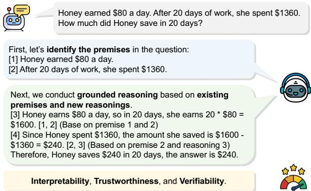
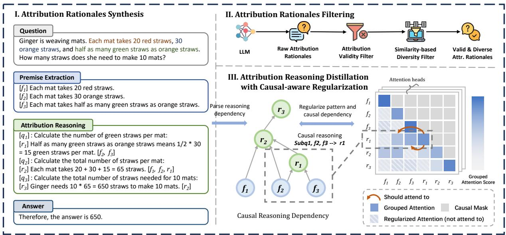
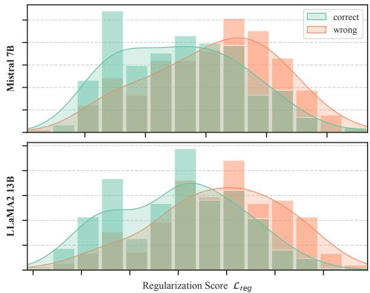
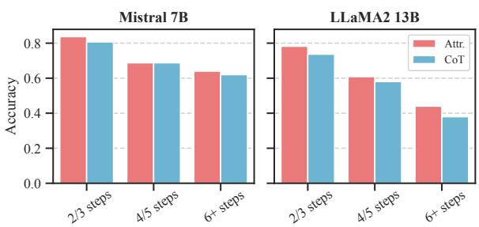

# Towards Faithful Multi-step Reasoning through Fine-Grained Causal-aware Attribution Reasoning Distillation

Zheng Chu1, Jingchang Chen1, Zhongjie Wang1, Guo Tang1 Qianglong Chen2, Ming Liu1,3\*, Bing Qin1,3

1Harbin Institute of Technology, Harbin, China

2Zhejiang University 3Peng Cheng Laboratory zchu@ir.hit.edu.cn

## Abstract

Despite the remarkable reasoning capabilities demonstrated by large language models (LLM), the substantial computational overhead limits their practices. Some efforts have been directed toward distilling multi-step reasoning capabilities into smaller models through chain of-thought (CoT). While CoT facilitates multistep reasoning, the dependencies between reasoning steps are not always clearly discernible, which may lead to inconsistent reasoning. In this paper, we introduce fine-grained attribution reasoning distillation (FARD), which in corporates grounded citations to consolidate the relationships between reasoning steps. Specifically, FARD distills attribution reasoning rationales from LLMs to substitute CoT reason ings, which clarifies the dependencies among reasoning steps. Besides, we regularize the model’s attention pattern by leveraging the causal dependencies between reasoning steps, thereby enhancing the consistency of reasoning. Grounded attribution reasoning also enhances interpretability and verifiability, thereby facil itating faithful reasoning. We evaluate FARD on mathematical and general reasoning bench marks. The experimental results indicate that FARD outperforms CoT distillation methods in mathematical reasoning, demonstrating its effectiveness. Furthermore, the small models trained with FARD have shown outstanding performance in out-of-distribution reasoning, proving strong generalization capabilities.1

## 1 Introduction

Recent advancements have witnessed large language models (LLMs) achieving significant milestones across various domains of natural language processing. A noteworthy point is the application of chain-of-thought prompting (Wei et al., 2022a), which facilitates LLMs to conduct step-by-step reasoning before providing definitive responses, consequently improving their accuracy and reliability. Chain-of-thought has demonstrated remarkable performance in complex reasoning, such as mathematical reasoning and logical reasoning (Wei et al., 2022b; Cobbe et al., 2021; Tafjord et al., 2021).

  
Figure 1: An example of attribution reasoning in mathematical tasks. Grounded attribution reasoning enhances interpretability, trustworthiness, and verifiability.

Despite the remarkable achievement, the vast number of parameters and high computational costs of LLMs limit their deployment, thereby constraining their availability. In response, some works attempt to transfer the capabilities of LLMs into smaller ones. One viable approach is distilling CoT reasoning trajectories from LLMs to fine-tune smaller models, thereby endowing them with the step-by-step reasoning capabilities (Fu et al., 2023; Li et al., 2023d; Wang et al., 2023a).

Although these methods can enhance the reasoning capabilities of smaller models, certain challenges still persist. Firstly, chain-of-thought reasoning fails to explicitly describe the fine-grained dependencies between reasoning steps, potentially leading to inconsistent and unfaithful reasoning. Besides, the linear structure of chain-of-thought reasoning poses difficulties for post-hoc verification and refinement of the reasoning trajectories. Secondly, these methods tend to induce overfitting to the teacher’s outputs among students, consequently undermining their capacity for generalization (Gudibande et al., 2023; Chen et al., 2023).

To address these challenges, this paper aims to introduce attribution reasoning to facilitate faithful reasoning and enhance generalization capabilities. Accordingly, we propose Fine-grained Attribution Reasoning Distillation (FARD). Firstly, the grounded citations within attribution reasoning process offer enhanced interpretability and post-hoc verifiability, as shown in Figure 1. Secondly, we employ fine-grained causal dependencies between reasoning steps to regularize the attention pattern during reasoning, thereby enhancing consistency. Finally, we abstract the reasoning process into three aspects: premise extraction, attribution reasoning with self-questioning, and answer summarization, thereby enhancing generalization. FARD equips small models with strong multi-step reasoning capabilities, and the attribution reasoning trajectories enhance interpretability and verifiability, thereby facilitating faithful multi-step reasoning.

Concretely, we begin by distilling attribution reasoning rationales enriched with grounded citations from a strong teacher model. Following this, we employ a validity filter and diversity filter to screen high-quality and diverse rationales. These rationales are then parsed into fine-grained causal dependency graph based on attribution citations. Finally, we fine-tune the student model using the derived rationales, and employ the causal dependency to regularize the attention pattern.

We conduct extensive experiments on 3 models across 9 datasets including diverse reasoning aspects. Experimental results demonstrate that FARD outperforms CoT distillation in performance. For instance, FARD achieved an 3.0% improvement over the baselines on GSM8K (Cobbe et al., 2021), and it still maintains excellent performance when faced with perturbed questions (Li et al., 2024). Additionally, our experiments on 4 out-of-distribution mathematical datasets: SVAMP (Patel et al., 2021), ASDiv (Miao et al., 2020), MultiArith (Roy and Roth, 2015), and SingleEQ (Koncel-Kedziorski et al., 2015) also surpass the baselines, indicating that our attribution distillation method possesses stronger generalization capabilities. Moreover, to investigate the general reasoning capabilities, we conduct experiments on commonsense reasoning StrategyQA (Geva et al., 2021), temporal reasoning Date Understanding, and logical reasoning Logical Deduction (Srivastava et al., 2023). Experimental results indicate that FARD performs well in out-ofdomain scenarios, demonstrating its cross-domain generalization capabilities.

Our contributions can be summarized as follows:

• We propose FARD for fine-grained attribution reasoning distillation to enhance the multi-step reasoning capabilities of small models.

• FARD uses fine-grained causal dependencies between reasoning steps to regularize the model’s pattern, enhancing the reasoning consistency.

• Attribution reasoning trajectories provide improved interpretability and verifiability, thereby facilitating faithful multi-step reasoning.

## 2 Related Work

## 2.1 Chain-of-Thought Reasoning

Recent work has shown that prompting LLMs to provide step-by-step reasoning trajectories before final answers can significantly improve their reasoning capabilities and provide interpretability, which is known as chain-of-thought prompting (Wei et al., 2022a; Chu et al., 2024). Some studies design instructions to guild LLMs in zero-shot CoT to reduce annotation cost (Wei et al., 2022b; Zhang et al., 2023b), and ensemble learning is also proved an effective approach to enhance reasoning performance (Wang et al., 2023b; Aggarwal et al., 2023). Additionally, Dua et al. (2022); Zhou et al. (2023) breaks down complex questions into simpler subquestions and tackles them sequentially, thereby reducing the complexity of reasoning.

In this paper, we divide reasoning process into three components: key information extraction, selfquestioning, and attribution reasoning, to enhance both performance and domain generalization.

## 2.2 Multi-step Reasoning Distillation

Knowledge distillation serves as an effective method to transfer the capabilities of large models to smaller ones (Hinton et al., 2015). However, the inaccessibility of advanced models, coupled with the high training costs, renders whitebox distillation methods difficult to apply, such as response-based (Kim et al., 2021; Huang et al., 2022), feature-based (Zagoruyko and Komodakis, 2017; Sun et al., 2019) and relation-based techniques (Park et al., 2019; Zhang et al., 2024).

Recent work treats LLMs as black boxes (Zhu et al., 2023), collecting their step-by-step reasoning trajectories as training corpus. Fu et al. (2023); Wang et al. (2023a); Li et al. (2023d) extract chainof-thought reasoning data from LLMs as training data, and Chen et al. (2023) introduces consistency distillation by optimizing KL divergence between reasoning pairs. Besides, Wang et al. (2023c) gets customized reasoning trajectories from LLMs based on feedback from students. Additionally, some research has explored extracting code format rationales from LLMs to enable code-assisted reasoning (Li et al., 2023a; Zhu et al., 2024a,b).

  
Figure 2: Overview of FARD, which includes: I. Attribution Rationales Synthesis: sample multiple attribution reasoning trajectories from LLMs. II. Attribution Rationales Filtering: obtain high-quality and diverse rationales through filtering. III. Causal-aware Attribution Reasoning Distillation: Fine-tune the small model using attribution rationales with causal-aware dependency regularization. For brevity, only premise and reasoning nodes are shown.

Compared to their approach, we obtain structured attribution reasoning rationales from the LLMs and attempt to further optimize the model using the structural reasoning dependency graphs.

## 2.3 Attributed Citation Generation

Hallucinations pose a significant challenge in the generation and reasoning in large language models (Zhang et al., 2023a; Huang et al., 2023). Recently, some studies have incorporated attribution citations of evidence into generation tasks to enhance verifiability and thereby mitigate hallucination issues (Li et al., 2023b; Bohnet et al., 2022; Li et al., 2023c; Yue et al., 2023; Berchansky et al., 2024). Gao et al. (2023b); Fierro et al. (2024) enables LLMs to generate citations concurrently with the text through in-context learning, whereas Gao et al. (2023a); Xu et al. (2023) explores posthoc attribution, which involves LLMs seeking the most relevant information to support attribution after generating preliminary answers, and Huang et al. (2024) delves into finer-grained attribution citations at the sentence level.

In contrast to the aforementioned works that concentrate on generation tasks, our method incorporates attribution within multi-step reasoning tasks, obtaining detailed step-level causal dependencies relationships and offering better interpretability.

## 3 Methodology

We introduce a fine-grained attribution reasoning distillation (FARD) framework to enhance the robust and generalized reasoning capabilities of smaller language models, while also improving the interpretability and verifiability of the reasoning process. Specifically, we first distill structured attribution reasoning rationales from LLMs. Subsequently, we apply filters based on content validity and similarity to obtain high-quality and diverse reasoning chains, which are then parsed into reasoning causal dependency graphs. Finally, we employ fine-grained attribution reasoning rationales in conjunction with causal dependency graphs to enhance the reasoning capabilities of smaller models. The overview of FARD is illustrated in Figure 2.

## 3.1 Attribution Rationales Synthesis

FARD distills rationales in the form of attribution reasoning to enhance the interpretability and verifiability of the reasoning process. Concretely, we divide the reasoning process into three components: premise extraction, attribution reasoning, and answer summarization, as illustrated in Figure 2(I).

Premise extraction entails extracting crucial information from the question and formatting it as numbered premises for reference in subsequent reasoning. In attribution reasoning, we introduce self-questioning to decompose complex questions into a series of simpler sub-questions. The solution to each sub-question relies on existing premises or reasoning, thereby enabling grounded attribution reasoning. Finally, the model derives a final answer based on the preceding reasoning.

We obtain attribution reasoning rationales from the teacher LLM through in-context learning. To ensure diversity in the rationales, we set the temperature $\tau { = } l . 3$ to sample $N { = } 3 2$ instances for each question in our experiments. For demonstrations of in-context learning, please refer to Appendix C.

## 3.2 Rationales Filtering and Parsing

## 3.2.1 Attribution Reasoning Filtering

Even the strong teacher LLMs may produce erroneous reasoning and attributions, thereby filtering is necessary to maintain data quality. We compare the prediction with the ground truth to verify the correctness of reasoning. Subsequently, we validate the attribution structures and filter out samples that are structurally invalid. Besides, recent work has indicated that the diversity of training instances influences model performance (Li et al., 2023d; Chen et al., 2023). To enhance reasoning diversity within the limited training instances, we adopt an iterative similarity-based filtering approach to retain high-diverse examples (Chen et al., 2023). We describe detailed filtering algorithm in Appendix A.2.

## 3.2.2 Causal Dependency Parsing

The structured characteristic of attribution reasoning allows us to readily acquire fine-grained, steplevel causal dependencies within the reasoning. Specifically, we transform the reasoning into a directed acyclic graph $\mathcal { G } = \{ \nu , \varepsilon \}$ based on the reasoning tags and their corresponding citation tags.

$$
{ \mathcal { V } = \{ v _ { p } ^ { i } , \cdot \cdot \cdot , v _ { q } ^ { j } , \cdot \cdot \cdot , v _ { r } ^ { k } , \cdot \cdot \cdot \} }\tag{1}
$$

$$
\mathcal { E } = \{ ( v ^ { i } , v ^ { j } ) | v ^ { i } \in \mathcal { V } , v ^ { j } \in \mathcal { V } _ { r } \}\tag{2}
$$

where $v _ { p } , v _ { q } , v _ { r }$ denote the premise, sub-question, and reasoning nodes, respectively. V represents any node, and $\mathcal { V } _ { r }$ denotes the reasoning nodes.

Figure 2 illustrates the reasoning graph. In the graph, each sub-graph of depth 2 represents the reasoning process of a sub-question. The sub-question

reasoning is a deductive reasoning process involving causal relationships between premise nodes $v ^ { i } \in \mathcal V$ and conclusion nodes $v ^ { j } \in \mathcal { V } _ { r }$

## 3.3 Attribution Reasoning Distillation with Causal-aware Regularization

As previously mentioned, we have obtained the causal dependencies between reasoning steps, and we aim to utilize this prior information for optimization. Recent work on the on the mechanisms of multi-step reasoning has found that the attention pattern of LLMs aligns with the reasoning dependency tree (Hou et al., 2023). To this end, we seek to strengthen this pattern by employing the causal dependency relationships to improve reasoning.

Next, we will describe how to use the causal dependency through a specific example. The dashed box in Figure 2(III) depicts a reasoning process of a sub-question. Within the sub-question, reasoning $r _ { 1 }$ depends on premises $f _ { 2 }$ and $f _ { 3 } ,$ forming a causal relationship $f _ { 2 } \wedge f _ { 3 } \to r _ { 1 }$ . Given this causal relationship, $r _ { 1 }$ should attend more to content of the premises $f _ { 2 }$ and $f _ { 3 }$ it relies on, rather than to $f _ { 1 }$ , which is irrelevant to current reasoning step. Therefore, we should apply regularization to positions that are irrelevant to the current-step reasoning. Therefore, in this example, the attention flow from $r _ { 1 }$ to $f _ { 1 }$ should be penalized.

In practice, we calculate the attention distribution at group granularity, where each group corresponds to a text segment (premise, question, or reasoning), simplifying the computation. Specifically, supposing the reasoning involves M segments, we can obtain a grouped attention matrix $A ^ { ( g ) }$

$$
a _ { i , j } ^ { ( g ) } = \frac { 1 } { \lvert i \rvert } \sum _ { p = i _ { s } } ^ { i _ { e } } \sum _ { q = j _ { s } } ^ { j _ { e } } a _ { p , q } \in \mathbb { R }\tag{3}
$$

$$
\pmb { A } ^ { ( g ) } = [ a _ { i , j } ^ { ( g ) } ] \in \mathbb { R } ^ { M \times M }\tag{4}
$$

where $a _ { p , q }$ is element of original attention matrix, i and j are two groups, $i _ { s }$ and $i _ { e }$ are the start and end indices of group i, and $| i |$ is the length of group i. $a _ { i , j } ^ { ( g ) }$ denotes the degree of attention that the content of group i pays to that of group j.

We hypothesize that the reasoning node should focus on three components: the original question and current sub-question, the supporting premises, and the reasoning itself. Based on this hypothesis, we apply the following regularization term to penalize the reasoning-irrelevant attention group.

$$
\mathcal { L } _ { r e g } = \sum _ { i = 0 } ^ { M } \sum _ { j = 0 } ^ { M } a _ { i , j } ^ { ( g ) }\tag{5}
$$

where $v _ { j } \in V _ { r }$ and $v _ { i }$ is not predecessor of $v _ { j }$

For attribution reasoning rationales, we employ the vanilla causal language modeling objective for optimization. During the optimization, we mask the prompt tokens and only train on the generated content. The overall training objective can be expressed as the weighted combination of the language modeling loss and attribution regularization.

$$
\mathcal { L } = \mathcal { L } _ { l m } + \beta \mathcal { L } _ { r e g }\tag{6}
$$

## 4 Experimental Setup

## 4.1 Benchmarks

We employ the mathematical reasoning dataset GSM8K (Cobbe et al., 2021) as the distillation training source. In evaluation, we conduct experiments on in-distribution and out-of-distribution mathematical reasoning, and out-of-domain general reasoning datasets to validate the effectiveness and generalization of our method.

Training (In-distribution) datasets We use the training data from GSM8K (Cobbe et al., 2021) as the training source for distillation and conduct in-distribution evaluation on its test set. Additionally, we employ GSM-Plus (Li et al., 2024), which includes human-crafted perturbed questions, as a challenging in-distribution dataset to assess the model’s performance under question perturbation.

Out-of-distribution datasets In addition to grade school math series, we also use 4 mathematical reasoning datasets that were not present in the training data to evaluate the model’s out-ofdistribution generalization capabilities, including SVAMP (Patel et al., 2021), ASDiv (Miao et al., 2020), MultiArith (Roy and Roth, 2015), and SingleEQ (Koncel-Kedziorski et al., 2015).

Out-of-domain datasets Furthermore, to investigate the model’s proficiency in general reasoning, we conduct experiments on 3 out-of-domain datasets beyond mathematics, including StrategyQA (Geva et al., 2021), Logical Deduction (Srivastava et al., 2023), and Date Understanding (Srivastava et al., 2023), which covers commonsense reasoning, logical reasoning, temporal reasoning, and symbolic reasoning. For statistics and examples of each dataset, please refer to Table 7.

## 4.2 Evaluation Metrics

Across all datasets, we employ Accuracy for evaluation purposes. In case of the GSM-Plus dataset, following (Li et al., 2024), we also take into account the performance drop rate (PDR) and accurately solved pairs (ASP) to evaluate the model’s performance under question perturbations. Please refer to Appendix A.3 for details of metrics.

## 4.3 Backbone Large Language Models

We employ LLaMA3-70B-Instruct (Meta, 2024) as the teacher model and LLaMA2-7B-chat (Touvron et al., 2023), LLaMA2-13B-chat (Touvron et al., 2023), and Mistral-7B-Instruct-v0.2 (Jiang et al., 2023) as student models in our experiments.

## 4.4 Baselines

Few-shot CoT (Wei et al., 2022a) employs fewshot demonstrations with language models to generate step-by-step reasoning before the final answer.

Direct SFT fine-tunes on the GSM8K training set, which includes around 7k step-by-step reasoning rationales, without distillation from LLMs.

CoT Distillation leverages chain-of-thought reasoning trajectories (Wei et al., 2022a) distilled from larger models to fine-tune smaller models.

SCoTD (Li et al., 2023d) distills step-by-step reasoning data from larger models, incorporating self-consistency (Wang et al., 2023b) and correctness filtering, to fine-tune smaller models.

MCC-KD (Chen et al., 2023) distills natural language rationales from LLMs and employs KLdivergence to align diverse reasoning trajectories, thereby enhancing the generalization of reasoning.

Mathematical SFT LLMs have undergone domain-specific SFT in mathematical reasoning, including Abel (Chern et al., 2023), MammoTH (Yue et al., 2024) and MetaMath (Yu et al., 2024).

## 4.5 Implementation Details

In the experiment, we use AutoAWQ2 (Lin et al., 2023) for int-4 quantization of LLaMA-3-70B-Instruct as the teacher model. During the training process, we employ Huggingface Accelerate3 for mixed-precision training with bf16 precision. All experiments are conducted using 1 or 2 NVIDIA Tesla A100-80G GPUs. We use a linear warm-up for first 3% steps, followed by a cosine learning rate decay. For inference, we use VLLM4. The experimental results are the average of three runs. Hyperparameters details can be found in Appendix A.1. For the evaluation of mathematical reasoning and out-of-domain reasoning, we respectively employ zero-shot prompting and few-shot prompting. Details demonstrations can be found in Appendix C.

<table><tr><td rowspan="2">Models</td><td rowspan="2">Methods</td><td rowspan="2">Corpus</td><td colspan="2">In-distribution</td><td colspan="5">Out-of-distribution</td></tr><tr><td>GSM8K</td><td>GSM-Plus</td><td>SVAMP</td><td>ASDiv</td><td>SingleEQ</td><td>MultiArith</td><td>Avg.</td></tr><tr><td> $\mathrm { L L a M A } 3 _ { 7 0 b }$ </td><td>Fewshot CoT</td><td>-</td><td>89.98</td><td>77.04</td><td>88.60</td><td>90.46</td><td>85.82</td><td>97.16</td><td>90.51</td></tr><tr><td rowspan="9"> $\mathrm { L L a M A } 2 _ { 7 b }$ </td><td>MetaMath</td><td>NL 395K</td><td>48.33</td><td>32.83</td><td>55.20</td><td>64.98</td><td>72.19</td><td>83.83</td><td>69.05</td></tr><tr><td>Abel</td><td>undisclosed</td><td>51.89</td><td>35.57</td><td>57.60</td><td>69.74</td><td>71.65</td><td>90.33</td><td>72.33</td></tr><tr><td>MAmmoTH</td><td>NL 260K</td><td>50.15</td><td>33.61</td><td>53.60</td><td>65.28</td><td>72.99</td><td>86.83</td><td>69.68</td></tr><tr><td>Fewshot CoT</td><td></td><td>24.58</td><td>17.16</td><td>46.40</td><td>57.32</td><td>62.83</td><td>69.83</td><td>59.10</td></tr><tr><td>Direct SFT</td><td>CoT 7K</td><td>37.10</td><td>26.85</td><td>45.27</td><td>61.46</td><td>65.77</td><td>83.83</td><td>64.08</td></tr><tr><td>CoT Distillation</td><td>CoT 74K</td><td>56.29</td><td>40.48</td><td>56.85</td><td>69.18</td><td>75.11</td><td>92.40</td><td>73.38</td></tr><tr><td>SCoTD</td><td>CoT 70K</td><td>58.68</td><td>42.56</td><td>60.10</td><td>67.99</td><td>74.73</td><td>96.00</td><td>74.71</td></tr><tr><td>MCC-KD</td><td>CoT 70K</td><td>58.85</td><td>43.85</td><td>57.13</td><td>70.16</td><td>78.43</td><td>95.27</td><td>76.31</td></tr><tr><td>FARD (ours)</td><td>Attr. 68K</td><td>61.58</td><td>44.48</td><td>64.61</td><td>71.82</td><td>75.77</td><td>98.61</td><td>77.70</td></tr><tr><td rowspan="8"> $\mathbf { L L a M A } 2 _ { 1 3 b }$ </td><td>MetaMath</td><td>NL 395K</td><td>70.86</td><td>54.93</td><td>72.00</td><td>75.79</td><td>79.94</td><td>96.16</td><td>80.97</td></tr><tr><td>Abel</td><td>undisclosed</td><td>60.47</td><td>44.60</td><td>66.00</td><td>75.47</td><td>78.61</td><td>96.33</td><td>79.10</td></tr><tr><td>MAmmoTH</td><td>NL 260K</td><td>55.99</td><td>40.46</td><td>57.00</td><td>70.38</td><td>77.00</td><td>93.83</td><td>74.55</td></tr><tr><td>Fewshot CoT</td><td></td><td>32.65</td><td>24.12</td><td>60.20</td><td>59.87</td><td>68.44</td><td>75.66</td><td>66.04</td></tr><tr><td>Direct SFT</td><td>CoT 7K</td><td>48.45</td><td>35.31</td><td>55.67</td><td>67.30</td><td>73.53</td><td>90.94</td><td>71.86</td></tr><tr><td>CoT Distillation</td><td>CoT 74K</td><td>66.38</td><td>50.16</td><td>67.70</td><td>74.43</td><td>78.61</td><td>96.11</td><td>79.21</td></tr><tr><td>SCoTD</td><td>CoT 70K</td><td>67.08</td><td>50.79</td><td>70.40</td><td>75.89</td><td>79.31</td><td>95.88</td><td>80.37</td></tr><tr><td>MCC-KD</td><td>CoT 70K</td><td>70.51</td><td>53.28</td><td>70.00</td><td>77.92</td><td>80.68</td><td>97.05</td><td>81.41</td></tr><tr><td rowspan="9">Mistral7b</td><td>FARD (ours)</td><td>Attr. 68K</td><td>72.57</td><td>55.59</td><td>75.20</td><td>78.26</td><td>80.95</td><td>98.50</td><td>83.23</td></tr><tr><td>MetaMath</td><td>NL 395K</td><td>77.54</td><td>65.52</td><td>81.60</td><td>81.84</td><td>82.62</td><td>97.50</td><td>85.89</td></tr><tr><td>MAmmoTH</td><td>NL 260K</td><td>62.74</td><td>46.41</td><td>62.20</td><td>69.74</td><td>80.74</td><td>95.83</td><td>77.13</td></tr><tr><td>Fewshot CoT</td><td></td><td>41.65</td><td>30.72</td><td>50.00</td><td>64.96</td><td>72.46</td><td>77.16</td><td>66.15</td></tr><tr><td>Direct SFT</td><td>CoT 7K</td><td>56.80</td><td>43.40</td><td>61.60</td><td>69.09</td><td>77.71</td><td>93.49</td><td>75.47</td></tr><tr><td>CoT Distillation</td><td>CoT 74K</td><td>70.99</td><td>55.06</td><td>74.00</td><td>75.79</td><td>80.83</td><td>96.16</td><td>81.70</td></tr><tr><td>SCoTD</td><td>CoT 70K</td><td>73.82</td><td>58.15</td><td>77.60</td><td>79.77</td><td>83.55</td><td>97.33</td><td>84.56</td></tr><tr><td>MCC-KD</td><td>CoT 70K</td><td>76.35</td><td>60.39</td><td>73.80</td><td>82.59</td><td>82.97</td><td>97.61</td><td>84.24</td></tr><tr><td>FARD (ours)</td><td>Attr. 68K</td><td>77.54</td><td>61.27</td><td>80.07</td><td>81.46</td><td>83.61</td><td>98.14</td><td>85.82</td></tr></table>

Table 1: Experimental results on mathematical reasoning. Results are averaged over three independent runs, and results in gray are noted for reference purposes only. The best and second-best results are marked with bold and underlined. For a fair comparison, all distillation-based methods use the same teacher model, $\mathrm { L L a M A } 3 _ { 7 0 b } .$ -Instruct. The training starting point for student models is the aligned version (-chat or -instruct). Full results in Table 8.

## 5 Experimental Results

In this section, we present the experimental results of in-distribution, out-of-distribution, as well as out-of-domain reasoning. Due to the use of additional training data in Math SFT baseline methods, which results in an unfair comparison, we only list their results for reference purposes.

## 5.1 In-distribution Results

Table 1 presents the in-distribution experimental results on GSM8K and GSM-Plus. It can be observed that our method significantly enhances the reasoning capabilities of smaller models, achieving performance improvements of 37.0/39.2/35.9, compared to prompt-based methods, respectively. While direct SFT also brings improvement, its performance is constrained by the limited amount and quality of data when compared to distillationbased approaches. Compared to prior baselines, our method has achieved an average improvement of 3.0% and 2.4% on GSM8K and GSM-Plus, respectively, across three student models. This indicates the effectiveness of FARD in boosting reasoning capabilities of smaller models. Meanwhile, as shown in Table 8, our method exhibits less performance drop rate under perturbation and is capable of solving both the original and perturbed questions more effectively, indicating its robustness against question perturbations. Moreover, FARD even outperforms the Mathematical SFT baselines that include additional training corpora in most cases.

<table><tr><td rowspan="2">Methods</td><td colspan="4">Out-of-Domain</td></tr><tr><td>Date</td><td>Logic</td><td>SQA</td><td>Average</td></tr><tr><td colspan="5">Student: LLaMA27b</td></tr><tr><td>MetaMath</td><td>35.83</td><td>42.34</td><td>52.05</td><td>43.41</td></tr><tr><td>Abel</td><td>19.13</td><td>42.08</td><td>53.84</td><td>38.35</td></tr><tr><td>MAmmoTH</td><td>28.39</td><td>45.66</td><td>39.42</td><td>37.82</td></tr><tr><td>Fewshot CoT</td><td>38.51</td><td>51.66</td><td>57.38</td><td>49.18</td></tr><tr><td>Direct SFT</td><td>37.33</td><td>50.44</td><td>58.32</td><td>48.70</td></tr><tr><td>CoT Distillation</td><td>43.21</td><td>49.33</td><td>58.54</td><td>50.36</td></tr><tr><td>SCoTD</td><td>42.58</td><td>44.64</td><td>61.66</td><td>49.63</td></tr><tr><td>MCC-KD</td><td>39.84</td><td>50.44</td><td>59.09</td><td>49.79</td></tr><tr><td>Ours</td><td>43.82</td><td>54.51</td><td>62.74</td><td>53.69</td></tr><tr><td colspan="5">Student: LLaMA213b</td></tr><tr><td>MetaMath</td><td>42.73</td><td></td><td>61.35</td><td></td></tr><tr><td>Abel</td><td>47.58</td><td>40.58</td><td>57.33</td><td>48.50</td></tr><tr><td>MAmmoTH</td><td>55.74</td><td>51.67</td><td>52.09</td><td>53.17</td></tr><tr><td>Fewshot CoT</td><td>48.03</td><td>54.33</td><td>58.07</td><td>53.48</td></tr><tr><td>Direct SFT</td><td>53.25</td><td>53.89</td><td>57.43</td><td>54.86</td></tr><tr><td>CoT Distillation</td><td>55.63</td><td>54.00</td><td>57.90</td><td>55.84</td></tr><tr><td>SCoTD</td><td>55.37</td><td>53.55</td><td>60.20</td><td>56.37</td></tr><tr><td>MCC-KD</td><td>50.76</td><td>53.11</td><td>58.83</td><td>54.23</td></tr><tr><td>Ours</td><td>55.82</td><td>55.79</td><td>60.95</td><td>57.52</td></tr><tr><td colspan="5">Student: Mistral7b</td></tr><tr><td>MetaMath</td><td>58.06</td><td>64.66</td><td>63.49</td><td>62.07</td></tr><tr><td>MAmmoTH</td><td>39.87</td><td>59.66</td><td>64.58</td><td>54.70</td></tr><tr><td>Fewshot CoT</td><td>52.46</td><td>63.67</td><td>58.03</td><td>58.05</td></tr><tr><td>Direct SFT</td><td>49.45</td><td>59.44</td><td>60.00</td><td>56.30</td></tr><tr><td>CoT Distillation</td><td>52.49</td><td>68.92</td><td>61.71</td><td>61.04</td></tr><tr><td>SCoTD</td><td>55.32</td><td>67.82</td><td>62.68</td><td>61.94</td></tr><tr><td>MCC-KD</td><td>48.66</td><td>66.55</td><td>62.70</td><td>59.30</td></tr><tr><td>Ours</td><td>50.51</td><td>72.69</td><td>64.69</td><td>62.63</td></tr></table>

Table 2: Experimental results on out-of-domain general purposed reasoning datasets. Results are averaged over three independent runs, and results in gray are noted for reference purposes only. The best and second-best results are marked with bold and underlined.

## 5.2 Out-of-distribution Results

To verify the capability of the distilled model to address similar mathematical reasoning problems, we conduct experiments on 4 out-of-distribution datasets: SVAMP, ASDiv, MultiArith, and SingleEQ. The experimental results are shown in Table 1. As distillation approaches advance, it is evident that the model’s performance on out-ofdistribution datasets has been steadily enhanced, though the extent of this improvement is less pronounced than that in the distribution. Despite this, our method surpasses the baselines across all three student models, with a relative improvement of 1.8%/2.2%/1.5% over the strongest baseline. Moreover, the student models empowered by FARD, even outperform the teacher model LLaMA370b on SingleEQ and closely match its performance on MultiArith, demonstrating that FARD exhibits strong generalized reasoning capabilities.

## 5.3 Out-of-domain Results

Recent studies have found that improving a model’s capabilities in specific domain can result in a decline in performance across general domains (Fu et al., 2023). This paper aims to explore how models specialized in the mathematical domain perform in out-of-domain generalized reasoning. To this end, we select 3 general purposed reasoning datasets: Date Understanding, Logical Deduction, and StrategyQA, which encompasses reasoning across logical, commonsense, temporal, and symbolic aspects. Table 2 presents the experimental results. It can be observed that direct SFT leads to a decrease in out-of-domain generalization, whereas distillation methods show an increase in such generalization. We attribute this issue to the low data diversity of direct SFT, which makes the model prone to overfitting to the distribution of mathematical reasoning. While distillation methods offer higher diversity in reasoning trajectories, making them less susceptible to overfitting and thus possessing stronger out-of-domain generalization.

Additionally, FARD consistently demonstrates stronger out-of-domain generalization capabilities, achieving performance improvements of 7.8%, 6.4%, and 5.6%. In our view, the key to improving out-of-domain generalization lies in our abstraction of the reasoning process into three components, which allows this general reasoning structure to be applicable to a wide range of reasoning tasks.

## 6 Analysis

## 6.1 Ablation Study

We conduct ablation experiments on FARD to investigate the impact of different components, as shown in Table 3. We first investigate the effect the filter (w/o filter). To ensure the correctness of the attribution structure, we perform ablation on the similarity-based diversity filter. Specifically, we randomly sample K instances from the synthetic data instead of using similarity-based filter, and use the randomly sampled rationales to train the student model. As shown in Table 3(a), the removal of the filter results in a significant performance decline, which corroborates the critical role of the diversity of reasoning trajectories in the performance of small models in black-box knowledge distillation.

<table><tr><td colspan="4">Setting GSM8K OO-Dist. OO-Dom.</td></tr><tr><td>LLaMA27b (ours)</td><td>61.6</td><td>77.7</td><td>53.7</td></tr><tr><td>(a) w/o filter</td><td> $5 9 . 5 ( \downarrow 2 . 1 ) $ </td><td> $7 6 . 1 ( \downarrow 1 . 6 )$ </td><td> $5 1 . 9 ( \downarrow 1 . 8 )$ </td></tr><tr><td>(b) w/o alignment</td><td> $6 1 . 2 ( \downarrow 0 . 4 )$ </td><td> $7 7 . 3 ( \downarrow 0 . 4 )$ </td><td> $5 2 . 9 ( \downarrow 0 . 8 ) $ </td></tr><tr><td>(c) w/o self-ques</td><td> $6 0 . 9 ( \downarrow 0 . 7 )$ </td><td> $7 6 . 1 ( \downarrow 1 . 6 )$ </td><td> $5 0 . 9 ( \downarrow 2 . 8 )$ </td></tr><tr><td> $\mathbf { L L a M A 2 } _ { 1 3 b } ( \mathbf { o u r s } )$ </td><td>72.6</td><td>83.2</td><td>57.5</td></tr><tr><td>(a) w/o filter</td><td> $7 0 . 9 ( \downarrow 1 . 7 )$ </td><td> $8 2 . 3 ( \downarrow 0 . 9 )$ </td><td> $5 5 . 4 ( \downarrow 2 . 1 )$ </td></tr><tr><td>(b) w/o alignment</td><td> $7 2 . 0 ( \downarrow 0 . 6 )$ </td><td> $8 2 . 8 ( \downarrow 0 . 4 )$ </td><td> $5 6 . 4 ( \downarrow 1 . 1 )$ </td></tr><tr><td>(c) w/o self-ques</td><td> $7 2 . 2 ( \downarrow 0 . 4 )$ </td><td> $8 1 . 9 ( \downarrow 1 . 3 )$ </td><td> $5 6 . 1 ( \downarrow 1 . 4 )$ </td></tr><tr><td>Mistral7b (ours)</td><td>77.5</td><td>85.8</td><td>62.6</td></tr><tr><td>(a)  $\mathrm { w } / \mathrm { o }$  filter</td><td> $7 6 . 4 ( \downarrow 1 . 1 )$ </td><td> $8 4 . 4 ( \downarrow 1 . 4 )$ </td><td> $5 8 . 2 ( \downarrow 4 . 4 ) $ </td></tr><tr><td>(b) w/o alignment</td><td> $7 7 . 1 ( \downarrow 0 . 4 )$ </td><td> $8 5 . 3 ( \downarrow 0 . 5 )$ </td><td> $6 0 . 1 ( \downarrow 2 . 5 )$ </td></tr><tr><td>(c) w/o self-ques</td><td> $7 6 . 8 ( \downarrow 0 . 7 )$ </td><td> $8 4 . 7 ( \downarrow 1 . 1 )$ </td><td> $6 0 . 2 ( \downarrow 2 . 4 )$ </td></tr></table>

Table 3: Experimental results of the ablation study on filter, self-question, and attention regularization.

Afterward, we remove the attribution-based attention regularization (w/o alignment), as presented in Table 3(b). This causes a certain degree of performance decline across all tasks, indicating the positive role of reinforcing internal patterns within model reasoning. Additionally, the removal of selfquestioning (w/o self-ques) within attribution reasoning also has a negative effect on model performance across all tasks, as shown in Table 3(c). This showcases the effectiveness of question decomposition when confronting complex questions.

## 6.2 Attention Regularization Terms

To explore the correlation between attention patterns and reasoning performance, we analyze the distribution of attention regularization terms during reasoning, as shown in Figure 3. As observed, both LLaMA2 and Mistral show different distributions between correct and incorrect samples. The regularization term is smaller in correct reasoning while larger in incorrect reasoning. Larger regularization term indicates that the model is focusing more on content unrelated to the current reasoning step. Therefore, this phenomenon might imply that irregular attention pattern is associated with a higher probability of incorrect reasoning.

## 6.3 Number of Reasoning Steps

We investigate the relationships between number of reasoning steps and performance, as shown in Figure 4. It is apparent that the model’s performance worsens progressively with more reasoning steps. Notably, the performance decline trends vary between models. Mistral shows a smaller performance drop compared to LLaMA2. Even when performing equally on simple questions, the initially stronger model can maintain its performance on more difficult questions, while the weaker model experiences more decline. This suggests that the model’s basic capabilities also play a key role in reasoning, particularly in more complex reasoning.

Figure 3: KDE distribution of attention regularization term in $\mathbf { L L a M A } 2 _ { 1 3 b }$ and ${ \mathrm { M i s t r a l } } _ { 7 b }$ . Green and orange represent correct and incorrect samples, respectively.  
  
Figure 4: Performance of $\mathbf { L L a M A } 2 _ { 1 3 b }$ and Mistral $^ { 7 b }$ at different reasoning steps on the GSM8K dataset.

## 6.4 Error Analysis

To explore the reasons behind mistakes in attribution reasoning, we manually analyze 100 incorrect predictions by $\mathbf { L L a M A } 2 _ { 1 3 b }$ fine-tuned with FARD. The error distribution is shown in Table 4.

We categorize the errors into five classes: (a) Question Misunderstanding (QM): The model fails to consider or incorrectly understands critical conditions within the question. (b) Reasoning Error (RE): The model conducts flawed deductive reasoning, such as employing incorrect premises or drawing erroneous conclusions. (c) Calculation Error (CE): Arithmetic mistakes in calculations or solving equations. (d) Decomposition Error (DE): Erroneous question decomposition or the decomposition is unrelated to the solution. (e) Extraction Errors (EE): The model makes errors and omissions in extracting premises from the question.

<table><tr><td>Error Type</td><td>Percentage</td></tr><tr><td>Question Misunderstanding</td><td>35%</td></tr><tr><td>Reasoning Error</td><td>40%</td></tr><tr><td>Calculation Error</td><td>19%</td></tr><tr><td>Decomposition Error</td><td>5%</td></tr><tr><td>Extraction Error</td><td>1%</td></tr></table>

Table 4: Proportion of each error type in attribution reasoning. The statistics is sourced from 100 instances of incorrect predictions that are manually analyzed.

<table><tr><td>Lora Rank</td><td>GSM8K</td><td>GSM-Plus</td><td>Math OOD</td></tr><tr><td>r=32 (1.17%)</td><td>59.2(↓2.4)</td><td>42.4(↓2.0)</td><td>76.5(↓1.2)</td></tr><tr><td>r=64 (2.31%)</td><td>61.6</td><td>44.5</td><td>77.7</td></tr><tr><td>r=128 (4.53%)</td><td>63.0(↑1.4)</td><td>45.8(↑1.4)</td><td>79.4(↑1.7)</td></tr><tr><td>r=256 (8.66%)</td><td>63.8(↑2.2)</td><td>46.7(↑2.2)</td><td>79.7(↑2.0)</td></tr><tr><td>r=512 (15.95%)</td><td>65.2(↑3.6)</td><td>47.2(↑2.8)</td><td>79.6(↑1.9)</td></tr></table>

Table 5: Experimental results in mathematical reasoning with different trainable parameters with LLaMA2 FARD. The run with r=64 serves as the baseline for cross comparison. Numbers in parentheses represent the percentage of trainable parameters.

As illustrated, the primary errors stem from inadequate understanding of the question and flaws in single-step deductive reasoning, which is constrained by the model’s foundational capabilities. Additionally, calculation errors also pose a hindrance to mathematical reasoning performance, particularly when solving equations involving variables. The model makes relatively few mistakes in question decomposition and premise extraction.

## 6.5 Post Verification

Intuitively, attribution reasoning trajectories with grounded citations would provide better verifiability. We adopt an LLM 5 to post-verify the erroneous attribution reasoning trajectories, with examples shown in Table 9. It can be observed that, benefiting from self-question and grounded citations, the LLM can clearly pinpoint the location and cause of the errors during the verification process. This offers a more transparent verification process, and facilitates subsequent human-involved verification.

## 6.6 Impact of Trainable Parameters on Out-of-distribution Generalization

We conduct experiments with different lora rank r to investigate the impact of trainable parameter count on in-distribution and out-of-distribution performance, as shown in Table 5. Evidently, with the increase in the number of trainable parameters, the model’s performance in mathematical reasoning consistently improves. Additionally, within the training distribution (GSM8K and GSM-Plus), the improvement continues to be substantial as the count of trainable parameters grows. However, in out-of-distribution reasoning, the performance improvement becomes insignificant as the trainable parameter scale increases. This phenomenon implies that the model’s ability to generalize outside the training distribution still faces challenges.

## 7 Conclusion

This paper introduces Fine-Grained Attribution Reasoning Distillation (FARD) for improving the faithful reasoning capabilities of small models. FARD empowers models to generate grounded attribution citation during reasoning, thereby improving the trustworthiness and interpretability, facilitating faithful reasoning. Furthermore, FARD enhances the reasoning capabilities of models by regularizing their attention pattern based on the causal relationships between reasoning steps. Extensive experiments across nine reasoning datasets demonstrate the effectiveness of FARD. Further analysis also reveals the potential connections between attention pattern and reasoning correctness.

## Limitations

FARD employs attribution reasoning to enhance the capabilities of faithful reasoning in language models, which has been validated through extensive experiments. Nevertheless, there are still some limitations. Firstly, we only use LLaMA-3-70b as the teacher model due to the computational resource constraints. Secondly, FARD provides steplevel reasoning trajectories with sub-question and grounded citations, offering improved verifiability. This work has not yet conducted further reasoning verification and correction based on this structure, and we intend to address this in future work.

## Acknowledgements

The research in this article is supported by the National Science Foundation of China (U22B2059,

62276083), the Human-Machine Integrated Consultation System for Cardiovascular Diseases (2023A003). We also appreciate the support from China Mobile Group Heilongjiang Co., Ltd. on our research,the research is jointly completed by both parties. Ming Liu is the corresponding author.

## References

Aman Madaan Pranjal Aggarwal, Yiming Yang, and Mausam. 2023. Let’s sample step by step: Adaptiveconsistency for efficient reasoning and coding with llms. In Proceedings of the 2023 Conference on Empirical Methods in Natural Language Processing, EMNLP 2023, Singapore, December 6-10, 2023, pages 12375–12396. Association for Computational Linguistics.

Moshe Berchansky, Daniel Fleischer, Moshe Wasserblat, and Peter Izsak. 2024. Cotar: Chainof-thought attribution reasoning with multi-level granularity. CoRR, abs/2404.10513.

Bernd Bohnet, Vinh Q. Tran, Pat Verga, Roee Aharoni, Daniel Andor, Livio Baldini Soares, Jacob Eisenstein, Kuzman Ganchev, Jonathan Herzig, Kai Hui, Tom Kwiatkowski, Ji Ma, Jianmo Ni, Tal Schuster, William W. Cohen, Michael Collins, Dipanjan Das, Donald Metzler, Slav Petrov, and Kellie Webster. 2022. Attributed question answering: Evaluation and modeling for attributed large language models. CoRR, abs/2212.08037.

Hongzhan Chen, Siyue Wu, Xiaojun Quan, Rui Wang, Ming Yan, and Ji Zhang. 2023. MCC-KD: multi-cot consistent knowledge distillation. In Findings of the Associationfor Computational Linguistics: EMNLP 2023, Singapore, December 6-10, 2023, pages 6805– 6820. Association for Computational Linguistics.

Ethan Chern, Haoyang Zou, Xuefeng Li, Jiewen Hu, Kehua Feng, Junlong Li, and Pengfei Liu. 2023. Generative ai for math: Abel. https://github.com/ GAIR-NLP/abel.

Zheng Chu, Jingchang Chen, Qianglong Chen, Weijiang Yu, Tao He, Haotian Wang, Weihua Peng, Ming Liu, Bing Qin, and Ting Liu. 2024. Navigate through enigmatic labyrinth a survey of chain of thought reasoning: Advances, frontiers and future. In Proceedings of the 62nd Annual Meeting of the Association for Computational Linguistics (Volume 1: Long Papers), pages 1173–1203, Bangkok, Thailand. Association for Computational Linguistics.

Karl Cobbe, Vineet Kosaraju, Mohammad Bavarian, Mark Chen, Heewoo Jun, Lukasz Kaiser, Matthias Plappert, Jerry Tworek, Jacob Hilton, Reiichiro Nakano, Christopher Hesse, and John Schulman. 2021. Training verifiers to solve math word problems. CoRR, abs/2110.14168.

Dheeru Dua, Shivanshu Gupta, Sameer Singh, and Matt Gardner. 2022. Successive prompting for decomposing complex questions. In Proceedings ofthe 2022 Conference on Empirical Methods in Natural Language Processing, EMNLP 2022, Abu Dhabi, United Arab Emirates, December 7-11, 2022, pages 1251– 1265. Association for Computational Linguistics.

Constanza Fierro, Reinald Kim Amplayo, Fantine Huot, Nicola De Cao, Joshua Maynez, Shashi Narayan, and Mirella Lapata. 2024. Learning to plan and generate text with citations. CoRR, abs/2404.03381.

Yao Fu, Hao Peng, Litu Ou, Ashish Sabharwal, and Tushar Khot. 2023. Specializing smaller language models towards multi-step reasoning. In International Conference on Machine Learning, ICML 2023, 23-29 July 2023, Honolulu, Hawaii, USA, volume 202 of Proceedings ofMachine Learning Research, pages 10421–10430. PMLR.

Luyu Gao, Zhuyun Dai, Panupong Pasupat, Anthony Chen, Arun Tejasvi Chaganty, Yicheng Fan, Vincent Y. Zhao, Ni Lao, Hongrae Lee, Da-Cheng Juan, and Kelvin Guu. 2023a. RARR: researching and revising what language models say, using language models. In Proceedings of the 61st Annual Meeting of the Association for Computational Linguistics (Volume 1: Long Papers), ACL 2023, Toronto, Canada, July 9-14, 2023, pages 16477–16508. Association for Computational Linguistics.

Tianyu Gao, Howard Yen, Jiatong Yu, and Danqi Chen. 2023b. Enabling large language models to generate text with citations. In Proceedings of the 2023 Conference on Empirical Methods in Natural Language Processing, EMNLP 2023, Singapore, December 6-10, 2023, pages 6465–6488. Association for Computational Linguistics.

Mor Geva, Daniel Khashabi, Elad Segal, Tushar Khot, Dan Roth, and Jonathan Berant. 2021. Did aristotle use a laptop? A question answering benchmark with implicit reasoning strategies. Trans. Assoc. Comput. Linguistics, 9:346–361.

Arnav Gudibande, Eric Wallace, Charlie Snell, Xinyang Geng, Hao Liu, Pieter Abbeel, Sergey Levine, and Dawn Song. 2023. The false promise of imitating proprietary llms. CoRR, abs/2305.15717.

Geoffrey E. Hinton, Oriol Vinyals, and Jeffrey Dean. 2015. Distilling the knowledge in a neural network. CoRR, abs/1503.02531.

Yifan Hou, Jiaoda Li, Yu Fei, Alessandro Stolfo, Wangchunshu Zhou, Guangtao Zeng, Antoine Bosselut, and Mrinmaya Sachan. 2023. Towards a mechanistic interpretation of multi-step reasoning capabilities of language models. In Proceedings of the 2023 Conference on Empirical Methods in Natural Language Processing, EMNLP 2023, Singapore, December 6-10, 2023, pages 4902–4919. Association for Computational Linguistics.

Edward J. Hu, Yelong Shen, Phillip Wallis, Zeyuan Allen-Zhu, Yuanzhi Li, Shean Wang, Lu Wang, and Weizhu Chen. 2022. Lora: Low-rank adaptation of large language models. In The Tenth International Conference on Learning Representations, ICLR 2022, Virtual Event, April 25-29, 2022. OpenReview.net.

Lei Huang, Xiaocheng Feng, Weitao Ma, Yuxuan Gu, Weihong Zhong, Xiachong Feng, Weijiang Yu, Weihua Peng, Duyu Tang, Dandan Tu, and Bing Qin. 2024. Learning fine-grained grounded citations for attributed large language models. In Findings ofthe Associationfor Computational Linguistics ACL 2024, pages 14095–14113, Bangkok, Thailand and virtual meeting. Association for Computational Linguistics.

Lei Huang, Weijiang Yu, Weitao Ma, Weihong Zhong, Zhangyin Feng, Haotian Wang, Qianglong Chen, Weihua Peng, Xiaocheng Feng, Bing Qin, and Ting Liu. 2023. A survey on hallucination in large language models: Principles, taxonomy, challenges, and open questions. CoRR, abs/2311.05232.

Tao Huang, Shan You, Fei Wang, Chen Qian, and Chang Xu. 2022. Knowledge distillation from A stronger teacher. In Advances in Neural Information Processing Systems 35: Annual Conference on Neural Information Processing Systems 2022, NeurIPS 2022, New Orleans, LA, USA, November 28 - December 9, 2022.

Albert Q. Jiang, Alexandre Sablayrolles, Arthur Mensch, Chris Bamford, Devendra Singh Chaplot, Diego de Las Casas, Florian Bressand, Gianna Lengyel, Guillaume Lample, Lucile Saulnier, Lélio Renard Lavaud, Marie-Anne Lachaux, Pierre Stock, Teven Le Scao, Thibaut Lavril, Thomas Wang, Timothée Lacroix, and William El Sayed. 2023. Mistral 7b. CoRR, abs/2310.06825.

Taehyeon Kim, Jaehoon Oh, Nakyil Kim, Sangwook Cho, and Se-Young Yun. 2021. Comparing kullbackleibler divergence and mean squared error loss in knowledge distillation. In Proceedings of the Thirtieth International Joint Conference on Artificial Intelligence, IJCAI 2021, Virtual Event / Montreal, Canada, 19-27 August 2021, pages 2628–2635. ijcai.org.

Rik Koncel-Kedziorski, Hannaneh Hajishirzi, Ashish Sabharwal, Oren Etzioni, and Siena Dumas Ang. 2015. Parsing algebraic word problems into equations. volume 3, pages 585–597.

Chenglin Li, Qianglong Chen, Caiyu Wang, and Yin Zhang. 2023a. Mixed distillation helps smaller language model better reasoning. CoRR, abs/2312.10730.

Dongfang Li, Zetian Sun, Xinshuo Hu, Zhenyu Liu, Ziyang Chen, Baotian Hu, Aiguo Wu, and Min Zhang. 2023b. A survey of large language models attribution. CoRR, abs/2311.03731.

Dongfang Li, Zetian Sun, Xinshuo Hu, Zhenyu Liu, Ziyang Chen, Baotian Hu, Aiguo Wu, and Min

Zhang. 2023c. A survey of large language models attribution. CoRR, abs/2311.03731.

Liunian Harold Li, Jack Hessel, Youngjae Yu, Xiang Ren, Kai-Wei Chang, and Yejin Choi. 2023d. Symbolic chain-of-thought distillation: Small models can also "think" step-by-step. In Proceedings ofthe 61st Annual Meeting of the Association for Computational Linguistics (Volume 1: Long Papers), ACL 2023, Toronto, Canada, July 9-14, 2023, pages 2665–2679. Association for Computational Linguistics.

Qintong Li, Leyang Cui, Xueliang Zhao, Lingpeng Kong, and Wei Bi. 2024. Gsm-plus: A comprehensive benchmark for evaluating the robustness of llms as mathematical problem solvers. In Proceedings of the 62nd Annual Meeting ofthe Associationfor Computational Linguistics (Volume 1: Long Papers), ACL 2024, Bangkok, Thailand, August 11-16, 2024, pages 2961–2984. Association for Computational Linguistics.

Ji Lin, Jiaming Tang, Haotian Tang, Shang Yang, Xingyu Dang, and Song Han. 2023. Awq: Activationaware weight quantization for llm compression and acceleration. arXiv.

Meta. 2024. Introducing meta llama 3.

Shen-Yun Miao, Chao-Chun Liang, and Keh-Yih Su. 2020. A diverse corpus for evaluating and developing english math word problem solvers. In Proceedings of the 58th Annual Meeting of the Association for Computational Linguistics, ACL 2020, Online, July 5-10, 2020, pages 975–984. Association for Computational Linguistics.

Wonpyo Park, Dongju Kim, Yan Lu, and Minsu Cho. 2019. Relational knowledge distillation. In IEEE Conference on Computer Vision and Pattern Recognition, CVPR 2019, Long Beach, CA, USA, June 16-20, 2019, pages 3967–3976. Computer Vision Foundation / IEEE.

Arkil Patel, Satwik Bhattamishra, and Navin Goyal. 2021. Are NLP models really able to solve simple math word problems? In Proceedings of the 2021 Conference of the North American Chapter of the Associationfor Computational Linguistics: Human Language Technologies, NAACL-HLT 2021, Online, June 6-11, 2021, pages 2080–2094. Association for Computational Linguistics.

Subhro Roy and Dan Roth. 2015. Solving general arithmetic word problems. In Proceedings of the 2015 Conference on Empirical Methods in Natural Language Processing, pages 1743–1752, Lisbon, Portugal. Association for Computational Linguistics.

Aarohi Srivastava, Abhinav Rastogi, Abhishek Rao, Abu Awal Md Shoeb, Abubakar Abid, Adam Fisch, Adam R. Brown, Adam Santoro, Aditya Gupta, Adrià Garriga-Alonso, Agnieszka Kluska, Aitor Lewkowycz, Akshat Agarwal, Alethea Power, Alex Ray, Alex Warstadt, Alexander W. Kocurek, Ali Safaya, Ali Tazarv, Alice Xiang, Alicia Parrish,

Allen Nie, Aman Hussain, Amanda Askell, Amanda Dsouza, Ambrose Slone, Ameet Rahane, Ananthara man S. Iyer, Anders Andreassen, Andrea Madotto, Andrea Santilli, Andreas Stuhlmüller, Andrew M Dai, Andrew La, Andrew K. Lampinen, Andy Zou, Angela Jiang, Angelica Chen, Anh Vuong, Animesh Gupta, Anna Gottardi, Antonio Norelli, Anu Venkatesh, Arash Gholamidavoodi, Arfa Tabas sum, Arul Menezes, Arun Kirubarajan, Asher Mul lokandov, Ashish Sabharwal, Austin Herrick, Avia Efrat, Aykut Erdem, Ayla Karakas, B. Ryan Roberts, Bao Sheng Loe, Barret Zoph, Bartlomiej Bojanowski, Batuhan Özyurt, Behnam Hedayatnia, Behnam Neyshabur, Benjamin Inden, Benno Stein, Berk Ekmekci, Bill Yuchen Lin, Blake Howald, Bryan Orinion, Cameron Diao, Cameron Dour, Cather ine Stinson, Cedrick Argueta, Cèsar Ferri Ramírez, Chandan Singh, Charles Rathkopf, Chenlin Meng, Chitta Baral, Chiyu Wu, Chris Callison-Burch, Chris Waites, Christian Voigt, Christopher D. Manning, h i h i d i l i Clemencia Siro, Colin Raffel, Courtney Ashcraft, Cristina Garbacea, Damien Sileo, Dan Garrette, Dan Hendrycks, Dan Kilman, Dan Roth, Daniel Free man, Daniel Khashabi, Daniel Levy, Daniel Moseguí González, Danielle Perszyk, Danny Hernandez, Danqi Chen, Daphne Ippolito, Dar Gilboa, David Dohan, David Drakard, David Jurgens, Debajyoti Datta, Deep Ganguli, Denis Emelin, Denis Kleyko, Deniz Yuret, Derek Chen, Derek Tam, Dieuwke Hup kes, Diganta Misra, Dilyar Buzan, Dimitri Coelho Mollo, Diyi Yang, Dong-Ho Lee, Dylan Schrader, Ekaterina Shutova, Ekin Dogus Cubuk, Elad Se gal, Eleanor Hagerman, Elizabeth Barnes, Elizabeth Donoway, Ellie Pavlick, Emanuele Rodolà, Emma Lam, Eric Chu, Eric Tang, Erkut Erdem, Ernie Chang, Ethan A. Chi, Ethan Dyer, Ethan J. Jerzak, Ethan Kim, Eunice Engefu Manyasi, Evgenii Zheltonozh skii, Fanyue Xia, Fatemeh Siar, Fernando Martínez Plumed, Francesca Happé, François Chollet, Frieda Rong, Gaurav Mishra, Genta Indra Winata, Gerard de Melo, Germán Kruszewski, Giambattista Paras candolo, Giorgio Mariani, Gloria Wang, Gonzalo Jaimovitch-López, Gregor Betz, Guy Gur-Ari, Hana Galijasevic, Hannah Kim, Hannah Rashkin, Han naneh Hajishirzi, Harsh Mehta, Hayden Bogar, Henry Shevlin, Hinrich Schütze, Hiromu Yakura, Hong ming Zhang, Hugh Mee Wong, Ian Ng, Isaac Noble, Jaap Jumelet, Jack Geissinger, Jackson Kernion, Ja cob Hilton, Jaehoon Lee, Jaime Fernández Fisac, James B. Simon, James Koppel, James Zheng, James Zou, Jan Kocon, Jana Thompson, Janelle Wingfield, Jared Kaplan, Jarema Radom, Jascha Sohl-Dickstein, Jason Phang, Jason Wei, Jason Yosinski, Jekaterina Novikova, Jelle Bosscher, Jennifer Marsh, Jeremy Kim, Jeroen Taal, Jesse H. Engel, Jesujoba Alabi, Ji acheng Xu, Jiaming Song, Jillian Tang, Joan Waweru, John Burden, John Miller, John U. Balis, Jonathan Batchelder, Jonathan Berant, Jörg Frohberg, Jos Rozen, José Hernández-Orallo, Joseph Boudeman, Joseph Guerr, Joseph Jones, Joshua B. Tenenbaum, Joshua S. Rule, Joyce Chua, Kamil Kanclerz, Karen Livescu, Karl Krauth, Karthik Gopalakrishnan, Katerina Ignatyeva, Katja Markert, Kaustubh D. Dhole,

Kevin Gimpel, Kevin Omondi, Kory Mathewson, Kristen Chiafullo, Ksenia Shkaruta, Kumar Shridhar, Kyle McDonell, Kyle Richardson, Laria Reynolds Leo Gao, Li Zhang, Liam Dugan, Lianhui Qin Lidia Contreras Ochando, Louis-Philippe Morency, Luca Moschella, Lucas Lam, Lucy Noble, Ludwig Schmidt, Luheng He, Luis Oliveros Colón, Luke Metz, Lütfi Kerem Senel, Maarten Bosma, Maarten Sap, Maartje ter Hoeve, Maheen Farooqi, Manaa Faruqui, Mantas Mazeika, Marco Baturan, Marco Marelli, Marco Maru, María José Ramírez-Quintana Marie Tolkiehn. Mario Giulianelli Martha Lewis Martin Potthast, Matthew L. Leavitt, Matthias Hagen Mátyás Schubert, Medina Baitemirova, Melody Ar naud, Melvin McElrath, Michael A. Yee, Michael Co hen, Michael Gu, Michael I. Ivanitskiy, Michael Star ritt, Michael Strube, Michal Swedrowski, Michele Bevilacqua, Michihiro Yasunaga, Mihir Kale, Mike Cain, Mimee Xu, Mirac Suzgun, Mitch Walker, Mo Tiwari, Mohit Bansal, Moin Aminnaseri, Mor Geva, Mozhdeh Gheini, Mukund Varma T., Nanyun Peng, Nathan A. Chi, Nayeon Lee, Neta Gur-Ar Krakover, Nicholas Cameron, Nicholas Roberts, Nick Doiron, Nicole Martinez, Nikita Nangia, Niklas Deckers, Niklas Muennighoff, Nitish Shirish Keskar, Niveditha Iyer, Noah Constant, Noah Fiedel, Nuan Wen, Oliver Zhang, Omar Agha, Omar Elbaghdadi Omer Levy, Owain Evans, Pablo Antonio Moreno Casares, Parth Doshi, Pascale Fung, Paul Pu Liang, Paul Vicol, Pegah Alipoormolabashi, Peiyuan Liao Percy Liang, Peter Chang, Peter Eckersley, Phu Mon Htut, Pinyu Hwang, Piotr Milkowski, Piyush Patil, Pouya Pezeshkpour, Priti Oli, Qiaozhu Mei, Qing Lyu, Qinlang Chen, Rabin Banjade, Rachel Etta Rudolph, Raefer Gabriel, Rahel Habacker, Ramon Risco, Raphaël Millière, Rhythm Garg, Richard Barnes, Rif A. Saurous, Riku Arakawa, Robbe Raymaekers, Robert Frank, Rohan Sikand, Roman Novak, Roman Sitelew, Ronan LeBras, Rosanne Liu, Rowan Jacobs, Rui Zhang, Ruslan Salakhut dinov, Ryan Chi, Ryan Lee, Ryan Stovall, Ryan Teehan, Rylan Yang, Sahib Singh, Saif M. Moham mad, Sajant Anand, Sam Dillavou, Sam Shleifer, Sam Wiseman, Samuel Gruetter, Samuel R. Bow man, Samuel S. Schoenholz, Sanghyun Han, Sanjeev Kwatra, Sarah A. Rous, Sarik Ghazarian, Sayan Ghosh, Sean Casey, Sebastian Bischoff, Sebastian Gehrmann, Sebastian Schuster, Sepideh Sadeghi Shadi Hamdan, Sharon Zhou, Shashank Srivastava Sherry Shi, Shikhar Singh, Shima Asaadi, Shixi ang Shane Gu, Shubh Pachchigar, Shubham Toshni wal, Shyam Upadhyay, Shyamolima (Shammie) Deb nath, Siamak Shakeri, Simon Thormeyer, Simone Melzi, Siva Reddy, Sneha Priscilla Makini, Soo Hwan Lee, Spencer Torene, Sriharsha Hatwar, Stanislas Dehaene, Stefan Divic, Stefano Ermon, Stella Bi derman, Stephanie Lin, Stephen Prasad, Steven T. Piantadosi, Stuart M. Shieber, Summer Misherghi, Svetlana Kiritchenko, Swaroop Mishra, Tal Linzen, Tal Schuster, Tao Li, Tao Yu, Tariq Ali, Tatsu Hashimoto, Te-Lin Wu, Théo Desbordes, Theodore Rothschild Thomas Phan, Tianle Wang, Tiberius Nkinyili, Timo Schick, Timofei Kornev, Titus Tunduny, Tobias Gerstenberg, Trenton Chang, Trishala Neeraj, Tushar

Khot, Tyler Shultz, Uri Shaham, Vedant Misra, Vera Demberg, Victoria Nyamai, Vikas Raunak, Vinay V. Ramasesh, Vinay Uday Prabhu, Vishakh Padmakumar, Vivek Srikumar, William Fedus, William Saunders, William Zhang, Wout Vossen, Xiang Ren, Xiaoyu Tong, Xinran Zhao, Xinyi Wu, Xudong Shen, Yadollah Yaghoobzadeh, Yair Lakretz, Yangqiu Song, Yasaman Bahri, Yejin Choi, Yichi Yang, Yiding Hao, Yifu Chen, Yonatan Belinkov, Yu Hou, Yufang Hou, Yuntao Bai, Zachary Seid, Zhuoye Zhao, Zijian Wang, Zijie J. Wang, Zirui Wang, and Ziyi Wu. 2023. Beyond the imitation game: Quantifying and extrapolating the capabilities of language models. Trans. Mach. Learn. Res., 2023.

Siqi Sun, Yu Cheng, Zhe Gan, and Jingjing Liu. 2019. Patient knowledge distillation for BERT model compression. In Proceedings of the 2019 Conference on Empirical Methods in Natural Language Processing and the 9th International Joint Conference on Natural Language Processing, EMNLP-IJCNLP 2019, Hong Kong, China, November 3-7, 2019, pages 4322– 4331. Association for Computational Linguistics.

Oyvind Tafjord, Bhavana Dalvi, and Peter Clark. 2021. ProofWriter: Generating implications, proofs, and abductive statements over natural language. In Findings of the Association for Computational Linguistics: ACL-IJCNLP 2021, pages 3621–3634, Online. Association for Computational Linguistics.

Hugo Touvron, Louis Martin, Kevin Stone, Peter Albert, Amjad Almahairi, Yasmine Babaei, Nikolay Bashlykov, Soumya Batra, Prajjwal Bhargava, Shruti Bhosale, Dan Bikel, Lukas Blecher, Cristian Canton-Ferrer, Moya Chen, Guillem Cucurull, David Esiobu, Jude Fernandes, Jeremy Fu, Wenyin Fu, Brian Fuller, Cynthia Gao, Vedanuj Goswami, Naman Goyal, Anthony Hartshorn, Saghar Hosseini, Rui Hou, Hakan Inan, Marcin Kardas, Viktor Kerkez, Madian Khabsa, Isabel Kloumann, Artem Korenev, Punit Singh Koura, Marie-Anne Lachaux, Thibaut Lavril, Jenya Lee, Diana Liskovich, Yinghai Lu, Yuning Mao, Xavier Martinet, Todor Mihaylov, Pushkar Mishra, Igor Molybog, Yixin Nie, Andrew Poulton, Jeremy Reizenstein, Rashi Rungta, Kalyan Saladi, Alan Schelten, Ruan Silva, Eric Michael Smith, Ranjan Subramanian, Xiaoqing Ellen Tan, Binh Tang, Ross Taylor, Adina Williams, Jian Xiang Kuan, Puxin Xu, Zheng Yan, Iliyan Zarov, Yuchen Zhang, Angela Fan, Melanie Kambadur, Sharan Narang, Aurélien Rodriguez, Robert Stojnic, Sergey Edunov, and Thomas Scialom. 2023. Llama 2: Open foundation and finetuned chat models. CoRR, abs/2307.09288.

Peifeng Wang, Zhengyang Wang, Zheng Li, Yifan Gao, Bing Yin, and Xiang Ren. 2023a. SCOTT: selfconsistent chain-of-thought distillation. In Proceedings of the 61st Annual Meeting of the Association for Computational Linguistics (Volume 1: Long Papers), ACL 2023, Toronto, Canada, July 9-14, 2023, pages 5546–5558. Association for Computational Linguistics.

Xuezhi Wang, Jason Wei, Dale Schuurmans, Quoc V. Le, Ed H. Chi, Sharan Narang, Aakanksha Chowdhery, and Denny Zhou. 2023b. Self-consistency improves chain of thought reasoning in language models. In The Eleventh International Conference on Learning Representations, ICLR 2023, Kigali, Rwanda, May 1-5, 2023. OpenReview.net.

Zhaoyang Wang, Shaohan Huang, Yuxuan Liu, Jiahai Wang, Minghui Song, Zihan Zhang, Haizhen Huang, Furu Wei, Weiwei Deng, Feng Sun, and Qi Zhang. 2023c. Democratizing reasoning ability: Tailored learning from large language model. In Proceedings of the 2023 Conference on Empirical Methods in Natural Language Processing, pages 1948–1966, Singapore. Association for Computational Linguistics.

Jason Wei, Xuezhi Wang, Dale Schuurmans, Maarten Bosma, Brian Ichter, Fei Xia, Ed H. Chi, Quoc V. Le, and Denny Zhou. 2022a. Chain-of-thought prompting elicits reasoning in large language models. In Advances in Neural Information Processing Systems 35: Annual Conference on Neural Information Processing Systems 2022, NeurIPS 2022, New Orleans, LA, USA, November 28 - December 9, 2022.

Jason Wei, Xuezhi Wang, Dale Schuurmans, Maarten Bosma, Brian Ichter, Fei Xia, Ed H. Chi, Quoc V. Le, and Denny Zhou. 2022b. Chain-of-thought prompting elicits reasoning in large language models. In Advances in Neural Information Processing Systems 35: Annual Conference on Neural Information Processing Systems 2022, NeurIPS 2022, New Orleans, LA, USA, November 28 - December 9, 2022.

Shicheng Xu, Liang Pang, Huawei Shen, Xueqi Cheng, and Tat-Seng Chua. 2023. Search-in-the-chain: Towards the accurate, credible and traceable content generation for complex knowledge-intensive tasks. CoRR, abs/2304.14732.

Longhui Yu, Weisen Jiang, Han Shi, Jincheng Yu, Zhengying Liu, Yu Zhang, James T. Kwok, Zhenguo Li, Adrian Weller, and Weiyang Liu. 2024. Metamath: Bootstrap your own mathematical questions for large language models. In The Twelfth International Conference on Learning Representations, ICLR 2024, Vienna, Austria, May 7-11, 2024. Open-Review.net.

Xiang Yue, Xingwei Qu, Ge Zhang, Yao Fu, Wenhao Huang, Huan Sun, Yu Su, and Wenhu Chen. 2024. Mammoth: Building math generalist models through hybrid instruction tuning. In The Twelfth International Conference on Learning Representations, ICLR 2024, Vienna, Austria, May 7-11, 2024. OpenReview.net.

Xiang Yue, Boshi Wang, Ziru Chen, Kai Zhang, Yu Su, and Huan Sun. 2023. Automatic evaluation of attribution by large language models. In Findings ofthe Associationfor Computational Linguistics: EMNLP 2023, Singapore, December 6-10, 2023, pages 4615– 4635. Association for Computational Linguistics.

Sergey Zagoruyko and Nikos Komodakis. 2017. Paying more attention to attention: Improving the performance of convolutional neural networks via attention transfer. In 5th International Conference on Learning Representations, ICLR 2017, Toulon, France, April 24-26, 2017, Conference Track Proceedings. OpenReview.net.

Yue Zhang, Yafu Li, Leyang Cui, Deng Cai, Lemao Liu, Tingchen Fu, Xinting Huang, Enbo Zhao, Yu Zhang, Yulong Chen, Longyue Wang, Anh Tuan Luu, Wei Bi, Freda Shi, and Shuming Shi. 2023a. Siren’s song in the AI ocean: A survey on hallucination in large language models. CoRR, abs/2309.01219.

Zhiheng Zhang, Daojian Zeng, and Xue Bai. 2024. Improving continual few-shot relation extraction through relational knowledge distillation and prototype augmentation. In Proceedings of the 2024 Joint International Conference on Computational Linguistics, Language Resources and Evaluation, LREC/COLING 2024, 20-25 May, 2024, Torino, Italy, pages 8756–8767. ELRA and ICCL.

Zhuosheng Zhang, Aston Zhang, Mu Li, and Alex Smola. 2023b. Automatic chain of thought prompting in large language models. In The Eleventh International Conference on Learning Representations, ICLR 2023, Kigali, Rwanda, May 1-5, 2023. Open-Review.net.

Denny Zhou, Nathanael Schärli, Le Hou, Jason Wei, Nathan Scales, Xuezhi Wang, Dale Schuurmans, Claire Cui, Olivier Bousquet, Quoc V. Le, and Ed H. Chi. 2023. Least-to-most prompting enables complex reasoning in large language models. In The Eleventh International Conference on Learning Representations, ICLR 2023, Kigali, Rwanda, May 1-5, 2023. OpenReview.net.

Xuekai Zhu, Biqing Qi, Kaiyan Zhang, Xinwei Long, Zhouhan Lin, and Bowen Zhou. 2024a. PaD: Program-aided distillation can teach small models reasoning better than chain-of-thought fine-tuning. In Proceedings ofthe 2024 Conference ofthe North American Chapter of the Association for Computational Linguistics: Human Language Technologies (Volume 1: Long Papers), pages 2571–2597, Mexico City, Mexico. Association for Computational Linguistics.

Xunyu Zhu, Jian Li, Yong Liu, Can Ma, and Weiping Wang. 2023. A survey on model compression for large language models. CoRR, abs/2308.07633.

Xunyu Zhu, Jian Li, Yong Liu, Can Ma, and Weiping Wang. 2024b. Distilling mathematical reasoning capabilities into small language models. Preprint, arXiv:2401.11864.

## A Appendix

## A.1 Hyperparameters

In this section, we will provide a detailed the hyperparameters used in our experiments, as shown in Table 6. During the data synthesis process, we set the temperature to 1.3, sampling N=32 instances for each training instance, and use filter to retain up to K=10 samples. We train 4 epochs for direct SFT baselines, 10 epochs for MCC-KD and 2 epochs for other methods. The total batch size during training process is set to 32. During training, we employ LoRA (Hu et al., 2022) for parameterefficient fine-tuning with huggingface PEFT6. We add LoRA adapters to all linear modules. For 7B models, the lora\_rank/lora\_alpha is set to 64/128, with learning rate of 4e-5. For 13B models, the lora\_rank/lora\_alpha is set to 128/256, with learning rate of 8e-5. We linearly warm up the learning rate from 0 during the first 3% of the steps, after which we decay it to 0 using cosine annealing. The checkpoint at the end of the training will be used for subsequent evaluation. In the inference stage, we set the temperature to 0 for greedy decoding and do not use beam search.

<table><tr><td>Hyperparameters</td><td>Values</td></tr><tr><td>Epochs</td><td>2 or 4 or 10</td></tr><tr><td>Learning Rate</td><td>4e-5 or 8e-5</td></tr><tr><td>Batch Size</td><td>32</td></tr><tr><td> $\beta$ </td><td>1e-2</td></tr><tr><td>Warmup Ratio</td><td>0.03</td></tr><tr><td>LR Decay</td><td>Cosine Annealing</td></tr><tr><td>LoRA Rank</td><td>64 or 128</td></tr><tr><td>LoRA Alpha</td><td>128 or 256</td></tr><tr><td>LoRA Targets</td><td>q, k, v, 0</td></tr><tr><td>τ (Data Generation)</td><td>1.3</td></tr><tr><td>τ (Inference)</td><td>0.0</td></tr><tr><td>N</td><td>32</td></tr><tr><td>K</td><td>10</td></tr></table>

Table 6: Hyperparameters in experiments.

## A.2 Rationale Filter

Rationale Validity Filter We first remove any unnecessary line breaks from the reasoning, and then determine whether the reasoning adheres to the three-part structure (Facts, Reasoning, and Answer). Following this, each reasoning step should feature a numerical tag for itself and tags of the premise it depends on, and should be associated to one sub-question. Finally, we parse the reasoning dependency to ensure the coherence between reasoning nodes, removing any instance that do not form a DAG or contain incorrect citation tags. Through the above procedures, we are able to derive attribution reasoning rationales that are both structurally valid and capable of being parsed.

Similarity-based Filter We iteratively remove the most similar samples to others from the rationales set until the number of remaining samples reaches our target. For computational efficiency, we adopt a sparse similarity metric, Jaccard Similarity, which gauges the degree of overlap between two sets, as referenced from (Chen et al., 2023).

$$
J ( A , B ) = { \frac { | A \cap B | } { | A \cup B | } }\tag{7}
$$

Specifically, we transform the rationales into Ngram, and consider Jaccard Similarity between two N-gram sets as the similarity between the two rationales. In each iteration, we remove one of the two rationales with the highest similarity, continuing this process until the sample size reach K=10.

## A.3 Evaluation Metrics

Following (Li et al., 2024), we use two metrics, ASP and PDR, to assess the model’s performance in the presence of perturbed questions.

Performance Drop Rate (PDR) measures the reduction in a model’s performance when it is presented with perturbed questions relative to the performance on the original questions (lower is better).

$$
P D R = 1 - \frac { \sum _ { ( x , y ) \in \mathcal { D } _ { a } } \mathbb { I } [ L M ( x ) , y ] / | \mathcal { D } _ { a } | } { \sum _ { ( x , y ) \in \mathcal { D } } \mathbb { I } [ L M ( x ) , y ] / | \mathcal { D } | } ,\tag{8}
$$

where D and $\mathcal { D } _ { a }$ denote GSM8K and GSM-Plus.

Accurately Solved Pairs (ASP) serves as a metric to evaluate the percentage of cases in which the model successfully addresses both the original question and its perturbed version (higher is better).

$$
A S P = \frac { \sum _ { x , y ; x ^ { \prime } , y ^ { \prime } } \mathbb { I } [ L M ( x ) , y ] \cdot \mathbb { I } [ L M ( x ^ { \prime } ) , y ^ { \prime } ] } { N \cdot | \mathcal { D } | } ,\tag{9}
$$

The overall results in Table 8 are calculated as: $o v e r a l l = A c c _ { g s m 8 k } + A c c _ { g p } + A S P - P D R .$

## B Datasets

This section will provide a detailed introduction to the datasets used in this paper. We employ GSM8K as the source of synthetic data for training, and subsequently evaluate our method on in-distribution mathematical reasoning, out-of-distribution mathematical reasoning, and out-of-domain general reasoning tasks. The statistics and examples of the datasets can be found in Table 7.

For mathematical reasoning, we only used the GSM8K training set to generate reasoning rationales, with the remaining datasets being used for evaluation and not included in the training data.

• GSM8K (Cobbe et al., 2021) comprises a collection of high-quality, linguistically diverse grade school math word problems, developed by human authors. We use its training set to generate training data and employ the test set for evaluation.7

• GSM-Plus (Li et al., 2024) is an enhanced version of GSM, designed to test the robustness of large language models’ mathematical reasoning by introducing various perturbations. We use the dataset in the evaluation.8

• SVAMP (Patel et al., 2021) is a challenging dataset that includes math word problems (MWP) targeted at students below grades four. We use the dataset for evaluation.

• ASDiv (Miao et al., 2020) is a English math word problem corpus, which entails diverse language patterns and problem types. We use the dataset in the evaluation.10

• MultiArith (Roy and Roth, 2015) includes simple MWPs involving the four basic operations. We use the dataset in the evaluation.11

• SingleEQ (Koncel-Kedziorski et al., 2015) features basic arithmetic problems. We use the dataset in the evalution.12

For out-of-domain reasoning, we do not use any related data for training and directly conduct evaluation under few-shot setting.

• Date Understanding is a task in BIGbench (Srivastava et al., 2023). It assesses large language models’ ability to comprehend dates with implicit temporal connections and knowledge, covering temporal, mathematical, and commonsense reasoning.13

• Object Logical Deduction is a task in BIGbench (Srivastava et al., 2023). It requires models to determine the order of objects based on deductive logical reasoning. This dataset involves reasoning and symbolic reasoning.14

• StrategyQA was introduce by Geva et al. (2021). It requires models to address implicit, multi-step questions, involving multistep commonsense reasoning. We use the test set provided in BIG-bench in our evaluation.15

## C Prompts

In this section, we will present the prompts used for rationales generation and zero-shot/few-shot reasoning in our experiments.

During rationale generation process, we distill attribution reasoning rationales from the teacher large language model using 4-shot demonstrations, as shown in Table 10 and Table 11.

In the inference stage, we evaluate mathematical reasoning tasks (in-distribution and out-ofdistribution) under zero-shot setting, and adopting the few-shot approach for out-of-domain reasoning tasks. Table 12 presents the prompt templates of the SFT models, which are also their zero-shot instructions for mathematical reasoning. Tables 13, 14, and 15 respectively show the few-shot examples used for out-of-domain reasoning in Date Understanding, Logical Deduction, and StrategyQA. Substituting these examples into the corresponding prompt templates in Table 12 yields the few-shot prompts used during inference.

<table><tr><td>Datasets</td><td>#Examples Question Example</td><td></td></tr><tr><td colspan="3">(a) Mathematical Reasoning (In-distribution)</td></tr><tr><td>GSM8K</td><td>1319</td><td>Eliza&#x27;s rate per hour for the first 40 hours she works each week is $10. She also receives an overtime pay of 1.2 times her regular hourly rate. If Eliza worked for 45 hours this week, how much</td></tr><tr><td>GSM-Plus</td><td>1319</td><td>are her earnings for this week? Eliza earns $10 per hour for the first 40 hours she works each week and 1.2 times her regular hourly rate for any overtime. If Eliza earned $470 this week, how many hours did she work?</td></tr><tr><td colspan="3">(b) Mathematical Reasoning (Out-of-distribution)</td></tr><tr><td>SVAMP</td><td>500</td><td>There were 13 roses in the vase. Jessica cut some more roses from her flower garden which had a total of 12 roses. There are</td></tr><tr><td>ASDiv</td><td>314</td><td>now 21 roses in the vase. How many roses are left in the garden? Jennifer has an 87 cm long ribbon. She uses 24 cm of the ribbon to tie a present for her friend and 45 cm of the ribbon to make a bow. How much of the ribbon is left in the end?</td></tr><tr><td>MultiArith</td><td>600</td><td>Paige had 11 songs on her mp3 player. If she deleted 9 old songs from it and then added 8 new songs, how many songs does she</td></tr><tr><td>SingleEQ</td><td>374</td><td>have on her mp3 player? Mary is baking a cake. The recipe wants 8 cups of flour. She has put in 2 cups. How many more cups does she need to add?</td></tr><tr><td colspan="3">(c) General Reasoning (Out-of-domain)</td></tr><tr><td>Date Understanding</td><td>369</td><td>In the US, Thanksgiving is on the fourth Thursday of November. Today is the US Thanksgiving of 2001. What is the date one year ago from today in MM/DD/YYYY?</td></tr><tr><td>Logical Deduction</td><td>300</td><td>In a golf tournament, there were three golfers: Eve, Rob, and Mel. Rob finished below Mel. Mel finished below Eve. Who finished</td></tr><tr><td>StrategyQA</td><td>2290</td><td>first? A. Eve B. Rob C. Mel Was Aristotle a member of the House of Lords?</td></tr></table>

Table 7: Statistics and examples of datasets in in-distribution, out-of-distribution, and out-of-domain evaluations.

<table><tr><td>Models</td><td>Methods</td><td>Corpus</td><td>GSM8K</td><td>GSM-Plus</td><td>△ PDR (%) ↓</td><td>ASP (%) ↑</td><td>Overall</td></tr><tr><td> $\mathrm { L L a M A } 3 _ { 7 0 b }$ </td><td>Fewshot CoT</td><td>1</td><td>89.98</td><td>77.04</td><td>14.38</td><td>73.36</td><td>226.00</td></tr><tr><td rowspan="9"> $\mathrm { L L a M A } 2 _ { 7 b }$ </td><td>MetaMath</td><td>NL 395K</td><td>48.33</td><td>32.83</td><td>32.06</td><td>24.51</td><td>73.61</td></tr><tr><td>Abel</td><td>undisclosed</td><td>51.89</td><td>35.57</td><td>31.45</td><td>26.31</td><td>82.32</td></tr><tr><td>MAmmoTH</td><td>NL 260K</td><td>50.15</td><td>33.61</td><td>32.98</td><td>25.94</td><td>76.72</td></tr><tr><td>Fewshot CoT</td><td></td><td>24.58</td><td>17.16</td><td>30.15</td><td>9.33</td><td>20.92</td></tr><tr><td>Direct SFT</td><td>CoT 7K</td><td>37.10</td><td>26.85</td><td>27.70</td><td>17.62</td><td>53.87</td></tr><tr><td>CoT Distillation</td><td>CoT 74K</td><td>56.29</td><td>40.48</td><td>32.87</td><td>28.08</td><td>101.57</td></tr><tr><td>SCoTD</td><td>CoT 70K</td><td>58.68</td><td>42.56</td><td>35.56</td><td>27.46</td><td>109.35</td></tr><tr><td>MCC-KD</td><td>CoT 70K</td><td>58.85</td><td>43.85</td><td>25.47</td><td>35.89</td><td>113.12</td></tr><tr><td>ARD (ours)</td><td>Attr. 68K</td><td>61.58</td><td>44.48</td><td>27.77</td><td>37.40</td><td>115.69</td></tr><tr><td rowspan="9"> $\mathbf { L L a M A } 2 _ { 1 3 b }$ </td><td>MetaMath</td><td>NL 395K</td><td>70.86</td><td>54.93</td><td>22.43</td><td>47.97</td><td>151.30</td></tr><tr><td>Abel</td><td>undisclosed</td><td>60.47</td><td>44.60</td><td>35.79</td><td>26.24</td><td>114.62</td></tr><tr><td>MAmmoTH</td><td>NL 260K</td><td>55.99</td><td>40.46</td><td>31.38</td><td>27.73</td><td>100.10</td></tr><tr><td>Fewshot CoT</td><td></td><td>32.65</td><td>24.12</td><td>26.04</td><td>14.66</td><td>45.39</td></tr><tr><td>Direct SFT</td><td>CoT 7K</td><td>48.45</td><td>35.31</td><td>27.11</td><td>25.79</td><td>82.44</td></tr><tr><td>CoT Distillation</td><td>CoT 74K</td><td>66.38</td><td>50.16</td><td>24.39</td><td>42.52</td><td>134.67</td></tr><tr><td>SCoTD</td><td>CoT 70K</td><td>67.08</td><td>50.79</td><td>24.27</td><td>43.56</td><td>137.16</td></tr><tr><td>MCC-KD ARD (ours)</td><td>CoT 70K</td><td>70.51</td><td>53.28</td><td>24.43</td><td>46.13</td><td>145.49</td></tr><tr><td></td><td>Attr. 68K</td><td>72.57</td><td>55.59</td><td>23.40</td><td>49.13</td><td>153.89</td></tr><tr><td rowspan="8">Mistral7b</td><td>MetaMath</td><td>NL 395K</td><td>77.54</td><td>65.52</td><td>19.39</td><td>56.08</td><td>176.75</td></tr><tr><td>MAmmoTH</td><td>NL 260K</td><td>62.74</td><td>46.41</td><td>38.30</td><td>26.03</td><td>121.42</td></tr><tr><td>Fewshot CoT</td><td></td><td>41.65</td><td>30.72</td><td>26.22</td><td>20.44</td><td>66.59</td></tr><tr><td>Direct SFT</td><td>CoT 7K</td><td>56.80</td><td>43.40</td><td>23.58</td><td>32.90</td><td>109.51</td></tr><tr><td>CoT Distillation</td><td>CoT 74K</td><td>70.99</td><td>55.06</td><td>22.42</td><td>47.97</td><td>151.57</td></tr><tr><td>SCoTD</td><td>CoT 70K</td><td>73.82</td><td>58.15</td><td>21.22</td><td>51.55</td><td>162.31</td></tr><tr><td>MCC-KD</td><td>CoT 70K</td><td>76.35</td><td>60.39</td><td>20.89</td><td>53.82</td><td>169.67</td></tr><tr><td>ARD (ours)</td><td>Attr. 68K</td><td>77.54</td><td>61.27</td><td>20.98</td><td>55.35</td><td>173.18</td></tr></table>

Table 8: Experimental results on in-distribution datasets, GSM8K and GSM-Plus, including question perturbation metrics PDR and ASP. Results are averaged over three runs, and results in gray are noted for reference purposes only. For a fair comparison, all distillation methods use the same teacher, $\mathrm { L L a M A } 3 _ { 7 0 b }$ . The starting point for student models is the aligned version (-chat or -instruct). Best and second results are highlighted by bold and underline.

<table><tr><td>Post Verification on Incorrect Attribution Reasoning Trajectory</td></tr><tr><td>Question: There are 96 fourth-graders at Small Tree School. 43 of them are girls. On Friday, 5 fourth- grade girls and 4 fourth-grade boys were absent. How many fourth grade boys were at Small Tree School on Friday? (Ground truth: 49) Incorrect reasoning before verification:</td></tr><tr><td>[Facts] [1] There are 96 fourth-graders at Small Tree School. [2] 43 of them are girls. [3] 5 fourth-grade girls were absent. [4] 4 fourth-grade boys were absent. X [Reasoning] Calculate the number of fourth-grade boys initially: [5] There are 96 fourth-graders, and 43 are girls, so there are 96 - 43 = 53 fourth-grade boys initially. [1, 2] Calculate the number of fourth-grade boys present on Friday: [6] 5 fourth-grade girls were absent, and 4 fourth-grade boys were absent, so there are 53 - 5 - 4 = 44 fourth-grade boys present on Friday. [3, 4, 5]</td></tr><tr><td>[Answer] The answer is 44. Reasoning after post-verification: The reasoning provided contains an error in the calculation of the number of fourth-grade boys present on Friday. The error is in step [6], where the number of absent girls is incorrectly subtracted from the number of boys. Here is the corrected reasoning: [Facts] [1] There are 96 fourth-graders at Small Tree School. [2] 43 of them are girls. [3]5 fourth-grade girls were absent. [4] 4 fourth-grade boys were absent.</td></tr><tr><td>Few-shot Demonstrations for Attribution Reasoning Generation (Part I)</td></tr><tr><td>[Question] A bag of jellybeans contains 8 black beans and 2 more green beans. It also contains 1 less orange</td></tr><tr><td>bean than green beans. How many jellybeans are there in the bag? [Facts]</td></tr><tr><td>[1] A bag of jellybeans contains 8 black beans and 2 more green beans. [2] A bag of jellybeans also contains 1 less orange bean than green beans. [Reasoning] Calculate the number of green beans:</td></tr><tr><td>[3] There are 8 black beans and 2 more green beans, therefore there are 8 + 2 = 10 green beans. [1] Calculate the number of orange beans: [4] The bag contains 1 less orange bean than green bean, therefore there are 10 - 1 = 9 orange beans. [2, 3] Calculate the total number of beans in the bag:</td></tr><tr><td>[5] Now there are 8 black beans, 10 green beans and 9 orange beans, therefore there are a total of 8 + 10 + 9 = 27 beans. [1, 3, 4] [Answer] The answer is 27.</td></tr><tr><td>[Question] Rebecca runs a hair salon. She charges $30 for haircuts, $40 for perms, and $60 for dye jobs, but she has to buy a box of hair dye for $10 to dye every head of hair. Today, she has four haircuts, one perm, and two dye jobs scheduled. If she makes $50 in tips, how much money will she have in</td></tr><tr><td>dollars at the end of the day?</td></tr><tr><td>If she makes $50 in tips, how much money will she have in dollars at the end of the day? [Facts]</td></tr><tr><td>[1] Rebecca charges $30 for haircuts.</td></tr><tr><td>[2] Rebecca charges $40 for perms. [3] Rebecca charges $60 for dye jobs.</td></tr><tr><td>[4] She has to buy a box of hair dye for $10 to dye every head of hair.</td></tr><tr><td>[5] Today, she has four haircuts, one perm, and two dye jobs scheduled. [6] she makes $50 in tips.</td></tr><tr><td>[Reasoning]</td></tr><tr><td>2</td></tr><tr><td>Calculate how much money Rebecca made from haircuts:</td></tr><tr><td>[7] Rebecca makes $30 * 4 = $120 from haircuts. [1, 5]</td></tr><tr><td></td></tr><tr><td>Calculate how much money Rebecca made from perms:</td></tr><tr><td>[8] Rebecca makes $40 * 1 = $40 from perms. [2, 5]</td></tr><tr><td></td></tr><tr><td>Calculate how much money Rebecca made from dye jobs:</td></tr><tr><td>[9] Rebecca makes $60 * 2 = $120 from dye jobs. [3, 5]</td></tr><tr><td></td></tr><tr><td>Calculate how much money Rebecca cost on buying hair dye:</td></tr><tr><td></td></tr><tr><td>[10] Rebecca cost $10 * 2 = $20 to buy hair dye. [4, 5]</td></tr><tr><td>Calculate how much money Rebecca made:</td></tr><tr><td></td></tr><tr><td>[11] She makes $120 + $40 + $120 + $50 = $330 in total. [6, 7, 8, 9]</td></tr><tr><td></td></tr><tr><td></td></tr><tr><td>Calculate how much money Rebecca cost:</td></tr><tr><td></td></tr><tr><td>[12] She cost $20 in total. [10]</td></tr><tr><td></td></tr><tr><td></td></tr><tr><td></td></tr><tr><td>Calculate the money Rebecca earned in total:</td></tr><tr><td></td></tr><tr><td></td></tr><tr><td></td></tr><tr><td></td></tr><tr><td>[13] The money she earns is equal to the income minus the cost, therefore, she makes $330 - $20 =</td></tr><tr><td></td></tr><tr><td></td></tr><tr><td></td></tr><tr><td></td></tr><tr><td></td></tr><tr><td></td></tr><tr><td></td></tr><tr><td></td></tr><tr><td></td></tr><tr><td></td></tr><tr><td></td></tr><tr><td></td></tr><tr><td></td></tr><tr><td></td></tr><tr><td></td></tr><tr><td></td></tr><tr><td></td></tr><tr><td></td></tr><tr><td></td></tr><tr><td></td></tr><tr><td></td></tr><tr><td></td></tr><tr><td></td></tr><tr><td></td></tr><tr><td></td></tr><tr><td></td></tr><tr><td></td></tr><tr><td></td></tr><tr><td></td></tr><tr><td></td></tr><tr><td></td></tr><tr><td></td></tr><tr><td></td></tr><tr><td></td></tr><tr><td></td></tr><tr><td></td></tr><tr><td></td></tr><tr><td></td></tr><tr><td></td></tr><tr><td></td></tr><tr><td></td></tr><tr><td></td></tr><tr><td></td></tr><tr><td></td></tr><tr><td></td></tr><tr><td></td></tr><tr><td></td></tr><tr><td></td></tr><tr><td></td></tr><tr><td></td></tr><tr><td></td></tr><tr><td></td></tr><tr><td></td></tr><tr><td></td></tr><tr><td></td></tr><tr><td></td></tr><tr><td></td></tr><tr><td></td></tr><tr><td></td></tr><tr><td></td></tr><tr><td></td></tr><tr><td></td></tr><tr><td></td></tr><tr><td></td></tr><tr><td></td></tr><tr><td></td></tr><tr><td></td></tr><tr><td></td></tr><tr><td></td></tr><tr><td></td></tr><tr><td></td></tr><tr><td></td></tr><tr><td></td></tr><tr><td></td></tr><tr><td></td></tr><tr><td></td></tr><tr><td></td></tr><tr><td></td></tr><tr><td></td></tr><tr><td></td></tr><tr><td></td></tr><tr><td></td></tr><tr><td></td></tr><tr><td></td></tr><tr><td></td></tr><tr><td></td></tr><tr><td></td></tr><tr><td></td></tr><tr><td></td></tr><tr><td></td></tr><tr><td></td></tr><tr><td></td></tr><tr><td></td></tr><tr><td></td></tr><tr><td></td></tr><tr><td></td></tr><tr><td></td></tr><tr><td></td></tr><tr><td></td></tr><tr><td></td></tr><tr><td></td></tr><tr><td></td></tr><tr><td></td></tr><tr><td></td></tr><tr><td>$310 today. [11, 12]</td></tr><tr><td></td></tr><tr><td></td></tr><tr><td></td></tr><tr><td></td></tr><tr><td></td></tr><tr><td></td></tr><tr><td></td></tr><tr><td></td></tr><tr><td></td></tr><tr><td></td></tr><tr><td></td></tr><tr><td></td></tr><tr><td></td></tr><tr><td></td></tr><tr><td></td></tr><tr><td></td></tr><tr><td></td></tr><tr><td>Few-shot Demonstrations for Attribution Reasoning Generation (Part II)</td></tr><tr><td>[Question] There are four members in one household. Each member consumes 3 slices of bread during breakfast and 2 slices of bread for snacks. A loaf of bread has 12 slices. How many days will five loaves of bread last in this family?</td></tr><tr><td>[Facts] [1] There are 4 members in one household. [2] Each member consumes 3 slices of bread during breakfast [3] Each member consumes 2 slices of bread for snacks. [4] A loaf of bread has 12 slices.</td></tr><tr><td>[Reasoning] Calculate how many slices of bread each family member consumes per day: [6] Each member consumes  $3 + 2 = 5$  slices of bread in total per day. [2, 3] Calculate how many slices of bread the family consumes per day: [7] There are 4 members, so the family consumes  $4 \ast 5 = 2 0$  slices of bread in total per day. [1, 6] Calculate how many slices of bread are there in 5 loaves of bread: [8] There are 5 loaves of bread, with each loaf containing 12 slices. Therefore, there are 60 slices of bread in total. [4, 5]</td></tr><tr><td>Calculate how many days these loaves of bread will last a family: [9] The family consumes 20 slices of bread per day, therefore the bread last  $6 0 / 2 0 = 3 $  family. [7, 8] [Answer] The answer is 3 days. [Question]</td></tr><tr><td>At the salad bar, Grandma put three mushrooms on her salad. She also added twice as many cherry tomatoes as mushrooms, 4 times as many pickles as cherry tomatoes, and 4 times as many bacon bits as pickles. If one third of the bacon bits were red, than how many red bacon bits did Grandma</td></tr><tr><td>put on her salad?</td></tr><tr><td></td></tr><tr><td>[Facts]</td></tr><tr><td></td></tr><tr><td>[1] Grandma put 3 mushrooms on her salad.</td></tr><tr><td></td></tr><tr><td></td></tr><tr><td>[2] She also added twice as many cherry tomatoes as mushrooms. [3] She also added 4 times as many pickles as cherry tomatoes.</td></tr><tr><td></td></tr><tr><td></td></tr><tr><td>[4] She also added 4 times as many bacon bits as pickles.</td></tr><tr><td>[5] one third of the bacon bits were red.</td></tr><tr><td>4 [Reasoning]</td></tr><tr><td>Calculate the number of cherry tomatoes:</td></tr><tr><td> $2 ^ { * } 3 = 6$ </td></tr><tr><td>[6] She added twice as many cherry tomatoes as mushrooms, so there are cherry tomatoes.</td></tr><tr><td>[1, 2]</td></tr><tr><td>Calculate the number of pickles:</td></tr><tr><td></td></tr><tr><td>[7] She added 4 times as many pickles as cherry tomatoes, so there are  $4 ^ { * } 6 = 2 4$ </td></tr><tr><td>pickles. [2, 3]</td></tr><tr><td>Calculate the number of bacon bits:</td></tr><tr><td></td></tr><tr><td>[8] She added 4 times as many bacon bits as pickles, so there are  $4 * 2 4 = 9 6$  bacon bits. [3, 4]</td></tr><tr><td></td></tr><tr><td></td></tr><tr><td></td></tr><tr><td>Calculate the number of red bacon bits:</td></tr><tr><td></td></tr><tr><td></td></tr><tr><td></td></tr><tr><td></td></tr><tr><td></td></tr><tr><td></td></tr><tr><td></td></tr><tr><td></td></tr><tr><td></td></tr><tr><td></td></tr><tr><td></td></tr><tr><td></td></tr><tr><td></td></tr><tr><td></td></tr><tr><td></td></tr><tr><td></td></tr><tr><td></td></tr><tr><td></td></tr><tr><td></td></tr><tr><td></td></tr><tr><td></td></tr><tr><td></td></tr><tr><td></td></tr><tr><td></td></tr><tr><td></td></tr><tr><td></td></tr><tr><td></td></tr><tr><td></td></tr><tr><td></td></tr><tr><td></td></tr><tr><td></td></tr><tr><td></td></tr><tr><td></td></tr><tr><td></td></tr><tr><td></td></tr><tr><td></td></tr><tr><td></td></tr><tr><td></td></tr><tr><td></td></tr><tr><td></td></tr><tr><td></td></tr><tr><td></td></tr><tr><td></td></tr><tr><td></td></tr><tr><td></td></tr><tr><td></td></tr><tr><td></td></tr><tr><td></td></tr><tr><td></td></tr><tr><td></td></tr><tr><td></td></tr><tr><td></td></tr><tr><td></td></tr><tr><td></td></tr><tr><td></td></tr><tr><td></td></tr><tr><td></td></tr><tr><td></td></tr><tr><td></td></tr><tr><td></td></tr><tr><td></td></tr><tr><td></td></tr><tr><td></td></tr><tr><td></td></tr><tr><td></td></tr><tr><td></td></tr><tr><td></td></tr><tr><td></td></tr><tr><td></td></tr><tr><td></td></tr><tr><td></td></tr><tr><td></td></tr><tr><td></td></tr><tr><td></td></tr><tr><td></td></tr><tr><td></td></tr><tr><td></td></tr><tr><td></td></tr><tr><td></td></tr><tr><td></td></tr><tr><td></td></tr><tr><td></td></tr><tr><td></td></tr><tr><td></td></tr><tr><td></td></tr><tr><td></td></tr><tr><td></td></tr><tr><td></td></tr><tr><td></td></tr><tr><td></td></tr><tr><td></td></tr><tr><td></td></tr><tr><td></td></tr><tr><td></td></tr><tr><td></td></tr><tr><td></td></tr><tr><td></td></tr><tr><td></td></tr><tr><td></td></tr><tr><td></td></tr><tr><td></td></tr><tr><td></td></tr><tr><td></td></tr><tr><td></td></tr><tr><td></td></tr><tr><td></td></tr><tr><td></td></tr><tr><td></td></tr><tr><td></td></tr><tr><td></td></tr><tr><td></td></tr><tr><td></td></tr><tr><td></td></tr><tr><td></td></tr><tr><td></td></tr><tr><td></td></tr><tr><td></td></tr><tr><td></td></tr><tr><td></td></tr><tr><td></td></tr><tr><td></td></tr><tr><td></td></tr><tr><td></td></tr><tr><td></td></tr><tr><td></td></tr><tr><td></td></tr><tr><td></td></tr><tr><td></td></tr><tr><td></td></tr><tr><td></td></tr><tr><td></td></tr><tr><td>[9] One third of the bacon bits were red, so there are  $1 / 3 * 9 6 = 3 2$  red bacon bits. [5, 8]</td></tr></table>

Table 9: Post-verification of incorrect attribution reasoning trajectories. Benefiting from the attribution structure, the LLM can clearly pinpoint the location, step, and cause of errors in the verification process.

Table 10: Few-shot (4-shot) demonstrations for attribution reasoning rationales generation. (Part I)

Table 11: Few-shot (4-shot) demonstrations for attribution reasoning rationales generation. (Part II)

<table><tr><td>Methods</td><td>Prompt Templates</td></tr><tr><td rowspan="2"></td><td>Below is an instruction that describes a task. Write a response that appropriately completes the request.</td></tr><tr><td>### Instruction:</td></tr><tr><td rowspan="2"></td><td>{Instruction}</td></tr><tr><td>### Response: Let&#x27;s think step by step.</td></tr><tr><td>Abel</td><td>Question {Instruction} Answer: Let&#x27;s think step by step.</td></tr><tr><td>MAmmoTH ### Instruction:</td><td>Below is an instruction that describes a task. Write a response that appropriately completes the request. {Instruction}</td></tr><tr><td>CoT</td><td>Question: {Instruction }</td></tr><tr><td>Attribution</td><td>[Question]: {Instruction }</td></tr></table>

Table 12: Prompt templates and zero-shot instructions for SFT LLMs.

<table><tr><td>Few-shot Examples of Date Understanding Tasks</td></tr><tr><td>Input: [Question] Yesterday was April 30, 2021. What is the date one week ago from today in MM/DD/YYYY? Output: [Facts] [1] Yesterday was April 30, 2021.</td></tr><tr><td>[3] If today is May 1, 2021, then one week ago from today would be April 24, 2021. [2] [Answer] Therefore, the answer is 04/24/2021. Input: [Question] Jane and John married on Jan 2, 1958. Today is their golden wedding anniversary. What is the date</td></tr><tr><td>tomorrow in MM/DD/YYYY? Output: [Facts]</td></tr><tr><td>[1] Jane and John married on Jan 2, 1958. [2] Today is their golden wedding anniversary. 2 [Reasoning]</td></tr><tr><td>Calculate the date today: [3] Since today is is their golden wedding anniversary, which is the 50th anniversary of a marriage</td></tr><tr><td>and Jane and John married on Jan 2, 1958. Adding 50 years to Jan 2, 1958 get Jan 2, 2008. So</td></tr><tr><td>today is Jan 2, 2008 (01/02/2008). [1, 2] Calculate the date tomorrow:</td></tr><tr><td>[4] Today is 01/02/2008, so tomorrow is 01/03/2008. [3]</td></tr><tr><td>[Answer] Therefore, the answer is 01/03/2008.</td></tr><tr><td>Input:</td></tr><tr><td>[Question]</td></tr><tr><td>The day before yesterday was 11/23/1933. What is the date one week from today in</td></tr><tr><td>MM/DD/YYYY?</td></tr><tr><td>Output:</td></tr><tr><td>[Facts]</td></tr><tr><td>[1] The day before yesterday was 11/23/1933.</td></tr><tr><td>3</td></tr><tr><td>[Reasoning]</td></tr><tr><td>Calculate the date today:</td></tr><tr><td></td></tr><tr><td>[2] The day before yesterday was 11/23/1933, today is 2 days after 11/23/1933, so today is</td></tr><tr><td></td></tr><tr><td>11/25/1933. [1]</td></tr><tr><td></td></tr><tr><td></td></tr><tr><td>Calculate the date one week from today:</td></tr><tr><td></td></tr><tr><td></td></tr><tr><td></td></tr><tr><td></td></tr><tr><td></td></tr><tr><td>[3] Today is 11/25/1933, and one week is 7 days. So 7 days from today is 12/02/1933. [2]</td></tr><tr><td></td></tr><tr><td></td></tr><tr><td></td></tr><tr><td></td></tr><tr><td></td></tr><tr><td></td></tr><tr><td></td></tr><tr><td></td></tr><tr><td></td></tr><tr><td></td></tr><tr><td></td></tr><tr><td></td></tr><tr><td></td></tr><tr><td></td></tr><tr><td></td></tr><tr><td></td></tr><tr><td></td></tr><tr><td></td></tr><tr><td></td></tr><tr><td></td></tr><tr><td></td></tr><tr><td></td></tr><tr><td></td></tr><tr><td></td></tr><tr><td></td></tr><tr><td></td></tr><tr><td></td></tr><tr><td></td></tr><tr><td></td></tr><tr><td></td></tr><tr><td></td></tr><tr><td></td></tr><tr><td></td></tr><tr><td></td></tr><tr><td></td></tr><tr><td></td></tr><tr><td></td></tr><tr><td></td></tr><tr><td></td></tr><tr><td></td></tr><tr><td></td></tr><tr><td></td></tr><tr><td></td></tr><tr><td></td></tr><tr><td></td></tr><tr><td></td></tr><tr><td></td></tr><tr><td></td></tr><tr><td></td></tr><tr><td></td></tr><tr><td></td></tr><tr><td></td></tr><tr><td></td></tr><tr><td></td></tr><tr><td></td></tr><tr><td></td></tr><tr><td></td></tr><tr><td></td></tr><tr><td></td></tr><tr><td></td></tr><tr><td></td></tr><tr><td></td></tr><tr><td></td></tr><tr><td></td></tr><tr><td></td></tr><tr><td></td></tr><tr><td></td></tr><tr><td></td></tr><tr><td></td></tr><tr><td></td></tr><tr><td></td></tr><tr><td></td></tr><tr><td></td></tr><tr><td></td></tr><tr><td></td></tr><tr><td></td></tr><tr><td></td></tr><tr><td></td></tr><tr><td></td></tr><tr><td></td></tr><tr><td></td></tr><tr><td></td></tr><tr><td></td></tr><tr><td></td></tr><tr><td></td></tr><tr><td></td></tr><tr><td></td></tr><tr><td></td></tr><tr><td></td></tr><tr><td></td></tr><tr><td></td></tr><tr><td></td></tr><tr><td></td></tr><tr><td></td></tr><tr><td></td></tr><tr><td></td></tr><tr><td></td></tr><tr><td></td></tr><tr><td></td></tr><tr><td></td></tr><tr><td></td></tr><tr><td></td></tr><tr><td></td></tr><tr><td></td></tr><tr><td></td></tr><tr><td></td></tr><tr><td></td></tr><tr><td></td></tr><tr><td></td></tr><tr><td></td></tr><tr><td></td></tr><tr><td></td></tr><tr><td></td></tr><tr><td></td></tr><tr><td></td></tr><tr><td></td></tr><tr><td></td></tr><tr><td></td></tr><tr><td></td></tr><tr><td></td></tr><tr><td>Few-shot Examples of Object Logical Deduction Tasks</td></tr><tr><td>Input: [Question] On a shelf, there are three books: a black book, an orange book, and a blue book. The blue book</td></tr><tr><td>is to the right of the orange book. The orange book is to the right of the black book. What is the leftmost? A. The black book B. The orange book C. The blue book Output: [Facts] [1] The blue book is to the right of the orange book. [2] The orange book is to the right of the black book.</td></tr><tr><td>[Reasoning] [3] The blue book is to the right of the orange book, so the order from left to right is [orange book] [blue book] [1] [4] The orange book is to the right of the black book, so the black book is to the left of the orange book. The order from left to right is [black book] [orange book] [blue book] [2, 3] [5] In this order, the leftmost is the black book. [4]</td></tr><tr><td>[Answer] Therefore, the answer is A. The black book.</td></tr><tr><td></td></tr><tr><td>Input:</td></tr><tr><td>[Question]</td></tr><tr><td>On a branch, there are three birds: a quail, an owl, and a hummingbird. The quail is to the left of the owl. The owl is to the left of the hummingbird. What is the second from the left? A. The quail</td></tr><tr><td>B. The owl C. The hummingbird</td></tr><tr><td>Output:</td></tr><tr><td>[Facts]</td></tr><tr><td>[1] The quail is to the left of the owl. 2</td></tr><tr><td>[2] The owl is to the left of the hummingbird.</td></tr><tr><td>[Reasoning]</td></tr><tr><td>[3] The quail is to the left of the owl, so the order from left to right is [quail] [owl] [1]</td></tr><tr><td>[4] The owl is to the left of the hummingbird, so the hummingbird is to the right of the owl, the</td></tr><tr><td>order from left to right is [quail] [owl] [hummingbird]. [2, 3]</td></tr><tr><td>[5] In this order, the second from the left is the owl. [4]</td></tr><tr><td>[Answer]</td></tr><tr><td>Therefore, the answer is B. the owl.</td></tr><tr><td></td></tr><tr><td>Input:</td></tr><tr><td>[Question]</td></tr><tr><td></td></tr><tr><td>In an antique car show, there are three vehicles: a sedan, a tractor, and a bus. The sedan is older</td></tr><tr><td>than the tractor. The bus is older than the sedan. What is the second-newest? A. The sedan B. The</td></tr><tr><td>tractor C. The bus</td></tr><tr><td></td></tr><tr><td>Output:</td></tr><tr><td>[Facts]</td></tr><tr><td>3 [1] The sedan is older than the tractor.</td></tr><tr><td></td></tr><tr><td>[2] The bus is older than the sedan.</td></tr><tr><td></td></tr><tr><td></td></tr><tr><td></td></tr><tr><td></td></tr><tr><td>[Reasoning]</td></tr><tr><td></td></tr><tr><td></td></tr><tr><td></td></tr><tr><td></td></tr><tr><td></td></tr><tr><td>[3] The sedan is older than the tractor, so the order from old to new is [sedan] [tractor] [1]</td></tr><tr><td></td></tr><tr><td></td></tr><tr><td></td></tr><tr><td></td></tr><tr><td></td></tr><tr><td></td></tr><tr><td></td></tr><tr><td></td></tr><tr><td></td></tr><tr><td></td></tr><tr><td></td></tr><tr><td></td></tr><tr><td></td></tr><tr><td></td></tr><tr><td></td></tr><tr><td></td></tr><tr><td></td></tr><tr><td></td></tr><tr><td></td></tr><tr><td></td></tr><tr><td></td></tr><tr><td></td></tr><tr><td></td></tr><tr><td></td></tr><tr><td></td></tr><tr><td></td></tr><tr><td></td></tr><tr><td></td></tr><tr><td></td></tr><tr><td></td></tr><tr><td></td></tr><tr><td></td></tr><tr><td></td></tr><tr><td></td></tr><tr><td></td></tr><tr><td></td></tr><tr><td></td></tr><tr><td></td></tr><tr><td></td></tr><tr><td></td></tr><tr><td></td></tr><tr><td></td></tr><tr><td></td></tr><tr><td></td></tr><tr><td></td></tr><tr><td></td></tr><tr><td></td></tr><tr><td></td></tr><tr><td></td></tr><tr><td></td></tr><tr><td></td></tr><tr><td></td></tr><tr><td></td></tr><tr><td></td></tr><tr><td></td></tr><tr><td></td></tr><tr><td></td></tr><tr><td></td></tr><tr><td></td></tr><tr><td></td></tr><tr><td></td></tr><tr><td></td></tr><tr><td></td></tr><tr><td></td></tr><tr><td></td></tr><tr><td></td></tr><tr><td></td></tr><tr><td>[4] The bus is older than the sedan, so the order from old to new is [bus] [sedan] [tractor] [2, 3]</td></tr><tr><td></td></tr><tr><td></td></tr><tr><td></td></tr><tr><td></td></tr><tr><td></td></tr><tr><td></td></tr><tr><td></td></tr><tr><td></td></tr><tr><td></td></tr><tr><td></td></tr><tr><td></td></tr><tr><td></td></tr><tr><td></td></tr><tr><td></td></tr><tr><td></td></tr><tr><td></td></tr><tr><td></td></tr><tr><td></td></tr><tr><td></td></tr><tr><td></td></tr><tr><td></td></tr><tr><td></td></tr><tr><td></td></tr><tr><td></td></tr><tr><td></td></tr><tr><td></td></tr><tr><td></td></tr><tr><td></td></tr><tr><td></td></tr><tr><td></td></tr><tr><td></td></tr><tr><td></td></tr><tr><td></td></tr><tr><td></td></tr><tr><td></td></tr><tr><td></td></tr><tr><td></td></tr><tr><td></td></tr><tr><td></td></tr><tr><td>[5] In this order, the second-newest is the sedan.</td></tr></table>

Table 13: Few-shot examples used in out-of-domain date understanding tasks.

Table 14: Few-shot examples used in out-of-domain object logical deduction task.

<table><tr><td>Few-shot Examples of StrategyQA Tasks</td><td></td></tr><tr><td></td><td>Input: [Question]</td></tr><tr><td></td><td>Would a block of iron sink in water?</td></tr><tr><td></td><td>Output: [Facts]</td></tr><tr><td>1</td><td>[1] The density of iron is 7.86 g/cm³ [2] The density of water is 1 g/cm³. [Reasoning]</td></tr><tr><td></td><td>[3] Since the density of iron (7.86 g/cm³) is greater than the density of water (1 g/cm³), the block of iron would sink in water. [1, 2] [Answer] Therefore, the answer is Yes.</td></tr><tr><td></td><td>Input: [Question]</td></tr><tr><td></td><td>Did Aristotle use a laptop?</td></tr><tr><td></td><td>Output:</td></tr><tr><td>2</td><td>[Facts] [1] Aristotle lived from 384 to 322 BCE.</td></tr><tr><td></td><td>[2] Laptops and modern computing devices were not invented until thousands of years later.</td></tr><tr><td></td><td>[Reasoning]</td></tr><tr><td></td><td>[3] Given the time period in which Aristotle lived, it is impossible for him to have used a laptop. [1,</td></tr><tr><td></td><td></td></tr><tr><td></td><td>2]</td></tr><tr><td></td><td>[Answer]</td></tr><tr><td></td><td></td></tr><tr><td></td><td></td></tr><tr><td></td><td>Therefore, the answer is No</td></tr></table>

Table 15: Few-shot examples used in out-of-domain StrategyQA tasks.