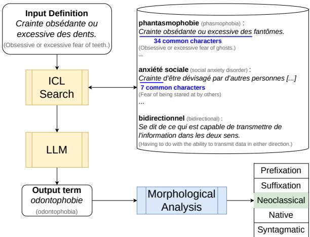
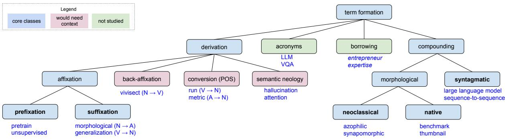
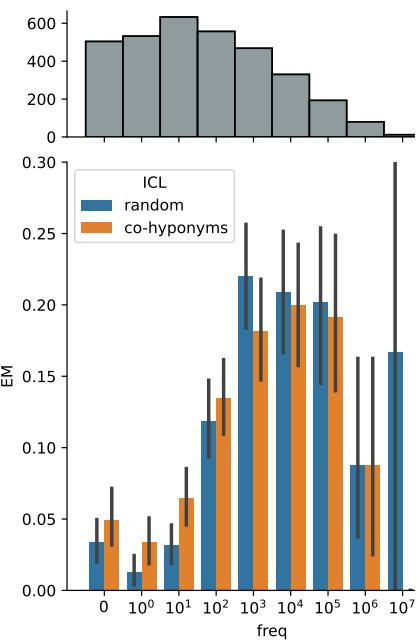
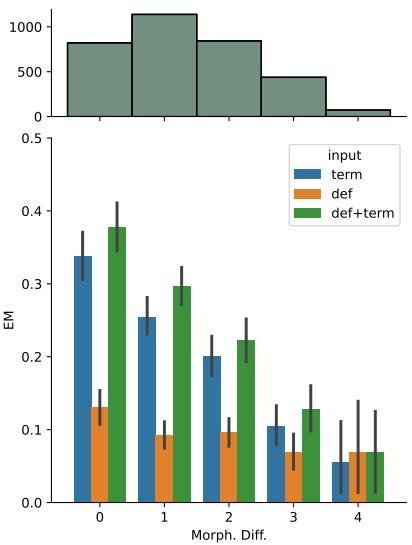
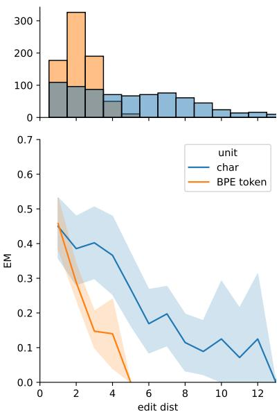
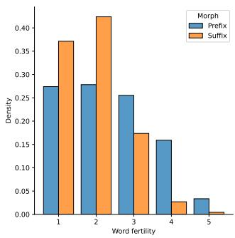
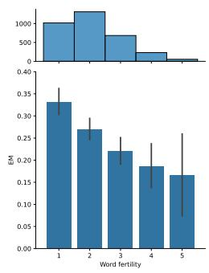

# Towards the Machine Translation of Scientific Neologisms

Paul Lerner and François Yvon Sorbonne Université, CNRS, ISIR 75005, Paris, France lerner@isir.upmc.fr, yvon@isir.upmc.fr

## Abstract

Scientific research continually discovers and invents new concepts, which are then referred to by new terms, neologisms, or neonyms in this context. As the vast majority of publications are written in English, disseminating this new knowledge to the general public often requires translating these terms. However, by definition, no parallel data exist to provide such translations. Therefore, we propose to leverage term definitions as a useful source of information for the translation process. As we discuss, Large Language Models are well suited for this task and can benefit from in-context learning with co-hyponyms and terms sharing the same derivation paradigm. These models, however, are sensitive to the superficial and morphological similarity between source and target terms. Their predictions are also impacted by subword tokenization, especially for prefixed terms.

## 1 Introduction

New concepts are constantly introduced by researchers around the world, which leads to a profusion of neologisms. These are also known as neonyms (Cabré, 1999), as opposed to neologisms of everyday language (Cartier et al., 2018). Because most of this research is published in English (Gordin, 2015; Larivière and Riddles, 2021),1 communicating in another language, such as French, requires translating these terms to facilitate scientific dissemination.2 For example, a teacher wanting to instruct their French students about “Large Language Models” would be hardly understandable if they directly borrowed every term from English, e.g.: EN: large language models are self-supervised ?? les large language models sont self-supervised FR: les grands modèles de langue sont auto-supervisés

  
Figure 1: Overview of our experiments: in DEF setting, given a definition, we study how to retrieve relevant ICL examples, here co-hyponyms. An LLM is then tasked to generate a term matching the definition. We also perform several analyses, including a morphological analysis of the output term. See text for details.

Quoting Liu et al. (2021): “Precisely defining the terminology is the first step in scientific communication”.

Translating scientific neologisms is a fundamental problem for traditional Machine Translation (MT) systems that rely on parallel data, which, by definition, can not contain such new words.3 Therefore, we propose to leverage definitions of terms as a way to translate them more accurately. We study how to take this information into account and, in particular, how to select relevant examples for in-context learning, in a linguistically motivated manner. We conduct extensive experiments on two thesauri covering 13 diverse domains, from Humanities to Computer Science and find our methods to be domain-agnostic. As we focus on translation from English into French, we rely on the fact that neologisms are mostly formed through five non-exclusive morphological processes (prefixation, suffixation, and neoclassical, native, or syntagmatic compounding), and study (i) how morphological divergences between the source and target impact translation; (ii) whether systems outputs conform to attested morphological patterns (see Figure 1).

Terminology remains a major source of critical errors for MT (Haque et al., 2020), which is often tackled by augmenting MT systems with domainspecific resources and dedicated (pre-)processing modules (Semenov et al., 2023). Our work could benefit such approaches by enriching said thesaurus or providing on-the-fly translations by extracting definitions from source documents (Jin et al., 2013; Head et al., 2021; August et al., 2022; Huang et al., 2022).

We tackle Neologism Translation with Large Multilingual Language Models (mLLMs), which are effective for many MT and NLP tasks (Xu et al., 2024). We show that these models are able, to some extent, to translate terms from English to French, to generate a term from its (French) definition, and also to combine both sources of information. We also show that LLMs benefit from in-context learning examples that are co-hyponyms or belong to the same derivational paradigm as the source term/definition (see Figure 1). However, we also highlight several limitations of these models: (i) their tokenizer, based on crude heuristics such as BPE (Gage, 1994), tends to over-segment prefixed terms, which is detrimental to translation quality; (ii) they perform much better if the source and target term are superficially similar (likely cognates or loanwords), which makes the task closer to othographic conversion than translation (e.g. exocytosis → exocytose); (iii) their performance correlates with terms frequency in a large corpus, which may be used as a proxy of their degree of lexicalization.

This work opens up new challenges for MT and more broadly NLP, on an important topic for knowledge dissemination. It also sheds light on the somewhat overlooked issue of morphological processing in LLMs. We propose several avenues for future work to address the limitations outlined above. Our code and data are freely available.4

## 2 Related Work

While we rely on definitions to generate neologisms, some work has been done in the opposite direction, to generate the definition of a given word (Noraset et al., 2017). Interestingly, like us, they leverage the structure of definitions in genus and differentiae (Chodorow et al., 1985; Montemagni and Vanderwende, 1992). The genus is a hypernym of the input term (see Figure 1, phasmophobia is a kind offear). We will find that terms sharing the same hypernym prove to be useful examples for In-Context Learning.

Neologism Translation is related to Multilingual Term Extraction (Laroche and Langlais, 2010; Delpech et al., 2012; Rigouts Terryn et al., 2020), except that, importantly, we do not assume that the target term exists anywhere. Indeed, we will see that a significant part of the terms in our test data do not appear even a single time in a large corpus such as OSCAR (Abadji et al., 2022).

Our framing of Neologism Translation somewhat resembles the Reverse Dictionary task (Hill et al., 2016; Pilehvar, 2019). However, Reverse Dictionary is an Information Retrieval task that consists of mapping the representation of a definition to an existing word embedding of a known word. On the contrary, we design here a fully generative task for unknown words.

The study of Zhang et al. (2020) comes closest to our work but is restricted to a monolingual setting in the very specific domain of genetics, where a term is linked to several genes according to its molecular function, biological process, and cellular component.

## 3 Neological and Morphological Processes

Typology Our typology of neologisms is adapted from Lieber (2010) and Daille (2017), and relies on morphosyntactic features that can easily be detected automatically. Complementary typologies, which vary according to the studied phenomena, have also been proposed, see, e.g. (Lombard and Huyghe, 2020). We retain the following five constructions that cover the largest part of our corpus, both in English and French:

(i) Prefixation, where an affix is concatenated at the beginning of a word to form a new one (e.g., pre+train = pretrain).

(ii) Suffixation, where affixation is performed at the word’s end (e.g. generalize+ation = generalization).

(iii) Native compounding, which compounds two independent words. This process is more regular in English (e.g. bench+mark = benchmark) than in French (Arnaud, 2003).

  
Figure 2: Overview of the studied neological processes. Adapted from (Daille, 2017).

(iv) Neoclassical compounding, which compounds only bound morphemes, i.e. morphemes that cannot act as independent words (e.g., azo+philic = azophilic). Like native English but unlike native French, the head of neoclassical compounds is always located at the rightmost position, in both languages: e.g. azophilic means “attracted to azote”, not “azote is attracted” (Namer, 2003; Amiot and Dal, 2008).

(v) Syntagmatic compounding, where syntagms that follow syntactic rules of the language are lexicalized into terms, thereby losing the compositionality of meaning. Therefore, they often cannot be translated by a composition of translations of its constituents (Daille and Morin, 2005), e.g. “zero-shot learning” translates to “apprentissage sans exemple” in French, literally “learning without example”.

Note that for (i), (ii), and (iv), derivation is often accompanied by a phonological or graphemic change at the junction between morphemes. Finally, note that these processes are not exclusive but can be combined, e.g. bidirectional is a prefixation (bi-) of a suffixation (-al).5. All studied morphological processes are illustrated in Figure 2.

Figure 2 also includes rarer processes that would require a disambiguating context and are therefore not handled by the morphological classifier introduced below: (i) Semantic neology, where a lexical unit is associated with a new concept through a metaphoric transfer between two domains, resulting in a homonym. (ii) Conversion, where the part-of-speech (POS) of a word changes without affixation, resulting again in a homonym (Tribout, 2010). (iii) Back-affixation, which requires a diachronic perspective to recognize it among other affixations (e.g. vivisect is formed by removing tion from vivisection, and not the other way around).

We finally do not study the following processes, although they are frequent in both English and French: (i) Borrowing, because we precisely seek to avoid it (e.g. entrepreneur is borrowed as is from French). (ii) Acronyms, which cannot be translated without their expanded form.

The reader should refer to Dal (2003b), Lieber (2010), or Corbin (2012) for a more complete introduction to morphology,6 going beyond English and French, and therefore, the above processes (e.g. templates in Semitic languages). Finally note that we are not interested in inflections (e.g. singular/plural), which do not form new lexemes.

Morphosyntactic Classification We build two multi-label classifiers, one per language, to identify the morphosyntactic processes described above. They rely on character n-gram features and are trained on Wiktionary in the FastText framework (Joulin et al., 2017). They are very accurate with 92.5 F1 in English and 95.8 F1 in French, see Appendix C for details. This classifier is used below to analyze the morphological processes used to coin new terms (see Figure 1), to evaluate English-French congruences and divergences and how they impact the performance of the models.

## 4 Methods

We study the translation of neologisms in three settings, always in the EN-FR direction, which is our main application scenario (see Section 5.1):7 (i) TERM: translate the contextless source term. This is our baseline condition. (ii) DEF: generate the target term from its definition in the same language, one of the main novelties of our work (see Figure 1); (iii) DEF+TERM: translate the source term given its definition, combining the two sources of information. Both input terms and definitions are extracted from public thesauri (see Section 5.1).

Setting Prompt template   
TERM Le terme anglais {src\_term} peut se traduire en français par :   
“The English term {src\_term} can be translated in French as :”   
DEF {def} définit le terme :   
“{def} defines the term :”   
DEF+TERM {def} définit le terme anglais {src\_term} qui peut se traduire en français par :   
“{def} defines the English term {src\_term} which can be translated to French as :”  
Figure 3: Prompt templates used with LLMs corresponding to our three settings, with English translations

We cast these three subtasks in a text-to-text generation framework, where an LLM is tasked to complete a prompt (Brown et al., 2020; Raffel et al., 2020). Because of the mixed language input in setting DEF+TERM, we use mLLMs. The prompt may contain several examples to enable in-context learning (ICL). We study four ways to select these examples: the first two serve as baselines, while the last two are linguistically motivated:

(i) Random: sampling from the set of examples for ICL.

(ii) Domain: similar to Random, additionally requiring ICL examples to belong to the same domain as the target term (“oracle” condition).

(iii) Co-hyponyms: terms sharing the same hypernym are often formed in the same way. To find co-hyponyms, we simply rely on the longest common string with the beginning of the input definition (see Figure 1). Therefore, this method does not apply to the TERM setting, which does not have access to definitions. For instance, definitions starting with “Crainte obsédante ou excessive des”8 identify several phobias, e.g. traumatophobie (traumatophobia) or odontophobie (odontophobia). With “Opération consistant à”,9 we find deverbals in -ation or -age, e.g. dénaturation (denaturation), quantification (quantizing), or tricotage (knitting).

(iv) Derivation paradigms: as hinted at above, terms stemming from the same derivational paradigm, i.e. sharing a base, prefix, or suffix, may serve as analogical context to form new terms.

For example, pretraining was likely formed on the model of preprocessing; likewise for underfitting modeled after overfitting. Like for co-hyponyms, we rely on the longest common string, but this time between source terms, either at the beginning or the term ending. Therefore, this method does not apply to the DEF setting, which does not have access to the source term. Note that this method is not limited to morphological affixes but can also find whole words in common between syntagms. For example, “air gap” and “air flotation” share the word air in their initial and “unmoderated newsgroup” and “unmerchantable” share the prefix un-.

The last two methods can be both combined in the DEF+TERM setting by concatenating their top results, while keeping the total number of examples to five. The hyperparameters for this fusion are set through grid search on the validation set.10 We limit the number of examples to five to keep a reasonable input length and as we found the performance to quickly saturate, consistently with prior work (e.g. Bawden and Yvon, 2023).

## 4.1 Implementation

We experiment with two mLLMs: BLOOM (Big-Science et al., 2023) and CroissantLLM (Faysse et al., 2024). BLOOM was the first open-source mLLM to scale up to billions of parameters. It is highly multilingual, trained on 46 natural languages, including EN and FR. We experiment with both 1.1B and 7.1B parameters versions. CroissantLLM is an EN-FR bilingual model, trained on an equally large amount of data in the two languages. With only 1.3B parameters, it was designed to be efficient at inference time, to make up for its costly pretraining, following Liu et al. (2019) and Hoffmann et al. (2022).

Each of our three prompt templates (see Figure 3) correspond to one settings presented above. We experimented with a few different wordings but found that the prompt content hardly mattered because of ICL examples, consistently with prior work (e.g. Zebaze et al., 2024). ICL examples use the same prompt template, but include both the instruction and the target term. Different examples are separated by the three characters ###, which serves as end-of-sequence signal.

Apart from LLMs, we use mBART as a standard sequence-to-sequence baseline for the TERM setting (standard MT). More precisely, we finetune mBART50-One-to-Many, a 610M parameter model (Tang et al., 2021), on 1.1M EN-FR parallel sentences from SciPar (Roussis et al., 2022). This process ensures that the model is robust to scientific vocabulary. Still, mBART only translates from EN to FR and is not suited for the conditions DEF and DEF+TERM. This model achieves 37.3 BLEU on a held-out test set of 3K sentences (Papineni et al., 2002). See Peng et al. (2024) and Appendix D for additional details.

## 4.2 Evaluation

We draw inspiration from standard Question Answering metrics (e.g. Rajpurkar et al., 2016) and considered: (i) Exact Match (EM) between the target and output strings;11 (ii) token-level F1 score after standard preprocessing (case insensitive, stopwords and punctuation filtering). At a time when LLM-based metrics flourish, one might criticize these metrics for being overly strict and not modeling semantic similarity. However, we argue that evaluating terminological equivalence is mostly not a semantic matter: the meaning of the terms is highly dependent on the domain and words that would otherwise be synonymous often cannot be used interchangeably. For instance “\*big language model” is an incorrect variant of “large language model”, although big and large are synonyms (i.e. semantically close, even with a non-neural metric like METEOR; Banerjee and Lavie, 2005). Moreover, LLM-based metrics are known to bias towards models with the same architecture or training data (He et al., 2023; Panickssery et al., 2024), while EM is equally strict for all models.

In addition to EM and F1, we alsol assess whether our models generate terms with the same morphological processes as the reference, as described in Section 3 (see Figure 1).

<table><tr><td>Model</td><td>Setting</td><td colspan="2">FranceTerme EM F1</td><td colspan="2">TERMIUM EM F1</td></tr><tr><td>mBART</td><td>TERM</td><td>26.3</td><td>41.3</td><td>31.1</td><td>49.7</td></tr><tr><td>CroissantLLM</td><td>TERM</td><td>25.6</td><td>42.2</td><td>30.3</td><td>50.3</td></tr><tr><td>CroissantLLM</td><td>DEF</td><td>4.6</td><td>19.8</td><td>3.8</td><td>22.7</td></tr><tr><td>CroissantLLM</td><td>DEF+TERM</td><td>25.3</td><td>42.9</td><td>30.2</td><td>51.5</td></tr><tr><td>BLOOM-1.1B</td><td>TERM</td><td>15.9</td><td>31.3</td><td>17.1</td><td>37.1</td></tr><tr><td>BLOOM-1.1B</td><td>DEF</td><td>1.1</td><td>11.3</td><td>1.4</td><td>15.4</td></tr><tr><td>BLOOM-1.1B</td><td>DEF+TERM</td><td>17.8</td><td>34.9</td><td>20.0</td><td>41.2</td></tr><tr><td>BLOOM-7.1B</td><td>TERM</td><td>23.7</td><td>40.3</td><td>27.5</td><td>47.7</td></tr><tr><td>BLOOM-7.1B</td><td>DEF</td><td>10.0</td><td>24.7</td><td>7.5</td><td>26.6</td></tr><tr><td>BLOOM-7.1B</td><td>DEF+TERM</td><td>27.1</td><td>44.6</td><td>32.1</td><td>53.5</td></tr></table>

Table 1: Definition-augmented Translation results on the test sets of FranceTerme and TERMIUM, with 5 randomly selected ICL examples for LLMs. Best overall results are bolded while best results in settings TERM and DEF are underlined.

## 5 Results

## 5.1 Datasets

We experiment with two EN-FR bilingual thesauri in this work: FranceTerme12 and TERMIUM,13, which are curated by the French and Canadian governments, respectively. Both of these thesauri are well-studied in the neology literature (Pecman, 2012; Tonti, 2023; Holeš, 2024). We filter loanwords (cf. Section 3) by removing terms that are identical in EN and FR (case insensitive; 2.9% of FranceTerme, 4.6% of TERMIUM). To filter acronyms, we discard terms with two consecutive upper-case letters (1.8% of FranceTerme, 2.3% of TERMIUM). We also filter entries with missing data to only keep triples of (EN term, FR term, FR definition).14 FranceTerme finally amounts to 6,623 terms equally and randomly split into validation and test sets. When testing, the validation set will serve for ICL and vice-versa. TERMIUM is much larger so we randomly keep 5,000 terms for validation, 5,000 for testing, and the remaining 194,992 for ICL. TERMIUM broadly covers 13 coarse-grained domains (listed in Table 3), which are balanced enough so that we can confidently compute statistics for each of them (from 83 samples in Metal. to 895 in MPS in the test set). On the other hand, FranceTerme covers ≈ 70 very imbalanced domains (some containing just one sample) so we only consider it as a whole.

<table><tr><td>Setting</td><td>ICL</td><td colspan="2">FranceTerme</td><td colspan="2">TERMIUM</td></tr><tr><td></td><td></td><td>EM</td><td>F1</td><td>EM</td><td>F1</td></tr><tr><td>TERM</td><td>Random</td><td>23.7</td><td>40.3</td><td>27.5</td><td>47.7</td></tr><tr><td>TERM</td><td>Domain</td><td>26.3</td><td>42.6</td><td>29.6</td><td>49.7</td></tr><tr><td>TERM</td><td>Paradigm</td><td>27.0</td><td>43.8</td><td>36.3</td><td>55.4</td></tr><tr><td>DEF</td><td>Random</td><td>10.0</td><td>24.7</td><td>7.5</td><td>26.6</td></tr><tr><td>DEF</td><td>Domain</td><td>10.1</td><td>25.1</td><td>8.6</td><td>27.5</td></tr><tr><td>DEF</td><td>Co-hyponyms</td><td>10.7</td><td>25.8</td><td>10.5</td><td>30.0</td></tr><tr><td>DEF+TERM</td><td>Random</td><td>27.1</td><td>44.6</td><td>32.1</td><td>53.5</td></tr><tr><td>DEF+TERM DEF+TERM</td><td>Domain Fusion</td><td>28.5 31.2</td><td>46.0 48.2</td><td>32.5 40.7</td><td>54.2 60.0</td></tr></table>

Table 2: Results of BLOOM-7.1B on the test sets of FranceTerme and TERMIUM according to our ICL selection strategy: (i) random (baseline); (ii) domain (baseline); (iii) derivation paradigm (not applicable to DEF); (iv) co-hyponyms (not applicable to TERM); (v) fusion of the latter two. Best overall results are bolded while best results in settings TERM and DEF are underlined.

## 5.2 Definition-augmented Translation

We now explore the three settings of Neologisms Translation with our four models, keeping ICL selection random (see Table 1). We find that TERM, translating the contextless source term, is much easier than DEF, where the input is the FR definition. However, the performance of models in setting TERM are limited, with mBART, BLOOM-7.1B, and CroissantLLM all reaching similar performance. We find that BLOOM-7.1B is able to combine information from source term and definition in setting DEF+TERM, significantly outperforming TERM. Model size is particularly important in this setting, as we observe that BLOOM-1.1B and CroissantLLM, which are roughly the same size, barely outperform or even deteriorate TERM when using the additional definition. Therefore, we focus on BLOOM-7.1B in the following experiments. BLOOM-7.1B DEF+TERM is so effective that it outperforms an oracle late fusion of TERM and DEF, suggesting an interaction between the two sources of information. For instance, BLOOM-7.1B DEF+TERM correctly predicts capteur de mission for mission sensor “capteur réalisant des mesures qui font partie de l’objet de la mission d’un engin spatial”,15 unlike TERM which predicts mission de reconnaissance and DEF which predicts instrument de mesure (“measuring instrument”).

  
Figure 4: Exact Match (EM) of BLOOM-7.1B (DEF) w.r.t. term’s corpus frequency, comparing random and co-hyponym ICL selection, on FranceTerme’s test set. The upper part shows the number of examples in each bin. Note the logarithmic scale of the x-axis.

## 5.3 In-Context Learning

Results according to our different ICL strategies are in Table 2. We find that our strategies consistently improve over random and domain selection, even though the latter accesses the ground-truth domain through an oracle. The performance gains are especially high for TERMIUM, where the set of examples for ICL is much larger. Furthermore, we show in Table 3 that our methods are domainagnostic, with significant improvements in 12 out of 13 domains of TERMIUM, from Humanities to Computer Science. In the rest of this section, we will focus on FranceTerme for the sake of space, but our results are consistent on both datasets.

## 5.4 Frequency Bias and Semantic Change

Our main research interest lies in Neologism Translation. However, assessing whether a term is neological or lexicalized is a subjective matter (Lombard and Huyghe, 2020). Therefore, we choose a continuous scale of neology based on the term’s frequency in large corpora, namely ROOTS-fropen (Laurençon et al., 2022) and OSCAR-fr 22.01 (Abadji et al., 2022). ROOTS-fr-open is a French

<table><tr><td>Setting</td><td>ICL</td><td>Agr.</td><td>CS</td><td>Indus.</td><td>MPS</td><td>Mech.</td><td>Med.</td><td>Hum.</td><td>Env.</td><td>Tele.</td><td>Jus.</td><td>Eco.</td><td>Elec.</td><td>Metal.</td></tr><tr><td>TERM</td><td>Random</td><td>20.5</td><td>36.2</td><td>16.5</td><td>33.0</td><td>18.9</td><td>31.3</td><td>27.2</td><td>32.9</td><td>32.7</td><td>33.1</td><td>26.5</td><td>24.4</td><td>19.3</td></tr><tr><td>TERM</td><td>Paradigm</td><td>22.6</td><td>44.1</td><td>22.7</td><td>46.8</td><td>28.1</td><td>50.0</td><td>34.5</td><td>39.1</td><td>38.1</td><td>30.5</td><td>31.9</td><td>31.1</td><td>24.1</td></tr><tr><td>DEF</td><td>Random</td><td>5.6</td><td>6.0</td><td>5.9</td><td>6.9</td><td>5.1</td><td>11.2</td><td>10.2</td><td>9.1</td><td>5.4</td><td>5.9</td><td>8.4</td><td>6.7</td><td>4.8</td></tr><tr><td>DEF</td><td>Co-hyponyms</td><td>5.6</td><td>8.6</td><td>9.7</td><td>11.7</td><td>9.7</td><td>15.3</td><td>11.5</td><td>13.2</td><td>6.5</td><td>7.6</td><td>8.6</td><td>7.7</td><td>10.8</td></tr><tr><td>DEF+TERM</td><td>Random</td><td>29.2</td><td>40.5</td><td>21.2</td><td>36.9</td><td>21.9</td><td>37.1</td><td>34.3</td><td>37.4</td><td>32.7</td><td>32.2</td><td>31.3</td><td>25.4</td><td>28.9</td></tr><tr><td>DEF+TERM</td><td>Fusion</td><td>28.7</td><td>44.8</td><td>28.4</td><td>48.5</td><td>31.1</td><td>52.9</td><td>40.9</td><td>46.0</td><td>44.6</td><td>38.1</td><td>37.3</td><td>34.9</td><td>33.7</td></tr></table>

Table 3: Exact Match of BLOOM-7.1B on the 13 domains of TERMIUM according to our ICL selection strategy: Agriculture (Agr.), Electronic and Computer Science (CS), Industries (Indus.), Maths Physics and Natural Sciences (MPS), Mechanics (Mech.), Medicine (Med.), Humanities (Hum.), Environmental Sciences (Env.), Telecommunications (Tele.), Law and Justice (Jus.), Economy (Eco.), Electricity (Elec.), and Metallurgy (Metal.). Best overall results are bolded while best results in settings TERM and DEF are underlined.

CC-licensed subset of ROOTS, the dataset used to train BLOOM. It consists of 4 billion words (20 GB), mostly from Wikimedia. OSCAR-fr 22.01 is a French cleaned subset of Common Crawl, which was also partly used to train BLOOM. It consists of 42 billion words (382 GB).

Figure 4 shows that 15.8% of FranceTerme target (French) terms do not appear even a single time in this huge corpus, and most appear less than 100 times (i.e. the frequency of monolexical terms is less than $2 \times 1 0 ^ { - 9 } )$ . See Appendix B for examples of each decile. We find that the neological feeling (Lombard and Huyghe, 2020) is weaker after 1,000 occurrences (e.g. effet de rebond “rebound effect”). It is not a coincidence that BLOOM (DEF) predicts terms much more accurately above this 1,000 occurrences threshold (Figure 4). However, the bulk of the distribution lies before 1,000, where we find our co-hyponym ICL selection method to significantly and consistently improve results. For example, given “Enzyme qui déphosphoryle les résidus sérine, thréonine ou tyrosine préalablement phosphorylés, présents dans les protéines”,16 BLOOM, with random ICL, fails to generate protéine-phosphatase (“protein phosphatase”, 0 occurrences), while our co-hyponym selection strategy succeeds because of relevant ICL examples such as protéine-kinase (“proteinkinase”): “Enzyme qui phosphoryle les résidus sérine, thréonine ou tyrosine présents dans les protéines.”17

On the other hand, we observe that most frequent terms are indeed semantic neologisms, i.e. terms transferred from one domain to another, with a meaning change. We find that BLOOM is unable to generate semantic neologisms, as its performance drops after 106 occurrences (Figure 4). For example, for pression “marquage serré de l’adversaire en possession du ballon”,18 which metaphorically transfers the concept of pressure from physics to sports, the model generates the literal syntagm marquage individuel (“individual marking”).

<table><tr><td>Setting</td><td>ICL</td><td>Pre.</td><td>Suff.</td><td>Neo.</td><td>Native</td><td>Synt.</td></tr><tr><td>TERM</td><td>Random</td><td>71.5</td><td>86.2</td><td>61.1</td><td>14.8</td><td>87.7</td></tr><tr><td>TERM</td><td>Paradigm</td><td>73.4</td><td>87.4</td><td>59.8</td><td>24.4</td><td>88.0</td></tr><tr><td>DEF</td><td>Random</td><td>59.2</td><td>82.0</td><td>39.5</td><td>15.8</td><td>77.6</td></tr><tr><td>DEF</td><td>Co-hyponyms</td><td>59.7</td><td>82.5</td><td>36.7</td><td>18.7</td><td>79.5</td></tr><tr><td>DEF+TERM</td><td>Random</td><td>71.8</td><td>86.9</td><td>63.3</td><td>17.9</td><td>87.6</td></tr><tr><td>DEF+TERM</td><td>Fusion</td><td>74.8</td><td>88.4</td><td>65.3</td><td>26.5</td><td>88.8</td></tr></table>

Table 4: F1 scores of morphosyntactic processes prediction by BLOOM-7.1B on FranceTerme test set. The best overall results are in boldface while the best results in settings TERM and DEF are underlined.

## 5.5 Morphosyntactic Analysis

The multi-label classifier described in Section 3 allows us to analyze the morphological processes used to coin new terms. We compare the morphological processes of the models’ outputs with the corresponding reference (see Table 4). We find that, even when the output term is incorrect, the morphological analysis of the output term agrees mostly with the reference. For example, while énantiomère (“enantiomer”) does not match the reference distomère (“distomer”), both are neoclassical compounds. The only exception is for native compounds, which are rare in French: only 2.8% of EN native compounds are translated as native compounds into FR. Overall, these performance are in line with previous results (Table 2): our ICL selection strategies consistently improves the scores.

  
Figure 5: Exact Match (EM) of BLOOM-7.1B outputs w.r.t. morphosyntactic difference $\Delta$ between EN and FR processes, in the three usual settings with randomly selected ICL examples on FranceTerme’s test set. The upper part shows the number of examples for $\Delta \in [ 0 , 4 ]$

## 5.6 Morphosyntactic Divergences

The multi-label classifier also enables us to evaluate the divergences between English source terms and their reference French counterparts. We study here how this divergence impacts the performance of the models. Given E and $F ,$ the sets of EN and FR morphosyntactic processes involved in the generation of a given term, respectively, we rely on the symmetric difference between these two sets to define a distance metric: $\Delta = | ( E \cup F ) \setminus ( F \cap E ) |$ We find that model performance is negatively correlated with this distance, especially when relying on the EN source term, see Figure 5. For example, the TERM model translates the syntagm of suffixation “homing head” using the same processes, resulting in tête de guidage, not matching the reference prefixation autodirecteur.

## 5.7 Translation or Orthographic Conversion?

We saw in Section 5.2 that setting TERM was much easier than DEF. We show that this is due to frequent surface similarities between EN and FR, which makes the translation akin to an orthographic conversion. We quantify this by computing the edit distance between EN and FR monolexical terms.19 Figure 6 shows that the performance in setting TERM is negatively correlated with the edit distance, while DEF does not suffer from this bias. For example, the model correctly predicts the following terms with an edit distance of 3 or less: mycotoxin → mycotoxine, exocytosis → exocytose, iconomatic → iconomatique. This result holds for both character-level and token-level edit distance. For token-level distance, we may assume that the model directly copies tokens from source to target. The examples above actually share the following tokens: $\tilde { \cdots }  { \mathsf { m } }  { \mathsf { y } } \mathrm { ~ c ~ } \ \mathsf { o t o } ^ {  { \mathsf { w } } } , \ \tilde { \bar { \mathbf { \Lambda } } } _ { - }  { \mathsf { e x } } ^ {  { \mathsf { w } } }$ , and “\_ic onom”, respectively.

  
Figure 6: Exact Match (EM) of BLOOM-7.1B (TERM) outputs w.r.t. edit distance between EN and FR monolexical terms, with randomly selected ICL examples on FranceTerme’s test set. The upper part displays the number of examples in each bin. Edit distance is at least 1 because loanwords were filtered out.

## 5.8 Prefixation, Fertility, and BPE

BLOOM, as mBART and CroissantLLM, relies on BPE tokenization, like most LLMs (Gage, 1994; Sennrich et al., 2016). While BPE circumvents out-of-vocabulary (OOVs) issues by splitting rare words into subwords, it only relies on character n-grams co-occurrences and rarely generates morphologically sound segmentations (Church, 2020). When pre-tokenizing text on whitespace, tokens beginning a word bear a special mark “\_”; without pre-tokenization, a whitespace will occur before each word start (Kudo and Richardson, 2018; Wolf et al., 2020). This means that prefixations and suffixations are not treated equally, with two issues for prefixations: (i) even if segmented correctly, the base and derivation will not share any representation (e.g. “\_collision” vs. “\_pré collision”;

  
Figure 7: Distribution of word fertilities for prefixed and suffixed terms on FranceTerme’s test set (left). Density is normalized separately for prefixes and suffixes to ease visualization. Exact Match (EM) of BLOOM-7.1B (DEF+TERM) outputs w.r.t. word fertilities (right). The upper part shows the number of examples in each bin.

Hofmann et al., 2021); (ii) most likely, the derived term will be over-segmented, as the occurrences of the base in word-internal position are too rare to warrant a dedicated vocabulary entry (e.g. “collision”). For our running example, précollision is split as “\_préc oll ision”20. Unlike suffixations which are often reasonably well segmented and share representations with their base (e.g. “\_collision neur”).

Figure 7 shows that prefixed terms suffer from this BPE tokenization more than suffixed forms and have a much higher word fertility.21 Furthermore, in the same figure, we show that word fertility is negatively correlated with EM. For example, BLOOM fails to predict téléconsultation (segmented as “\_tél éc ons ult ation”, although “\_consultation” has a dedicated token).

We extend this experiment in Lerner and Yvon (2025) on controlled datasets with both attested adjectival bases and pseudowords. Consistently, we find that LLMs struggle to generate prefixations because of BPE, whereas morphological segmentation leads to near-perfect accuracy.

## 6 Conclusion

Neologism translation is a challenge for standard MT systems that rely on parallel data. We propose a first effort to leverage definitions to accurately translate neologisms with Large Language Models. We found that LLMs were, to some extent, able to generate terms from their definition. Moreover, they can also combine the definition with the source term to translate it more accurately. As these models rely on In-Context Learning, we proposed to retrieve co-hyponyms or terms from the same derivation paradigm as the source term, which consistently improved results over two datasets covering 13 diverse domains. The more terms are 2000neological, which we assess from their corpus frequency, the more co-hyponyms retrieval improves performance.

However, we also pinpoint several limitations of these models: (i) they are sensitive to the similarity of source and target terms, either superficial or morphological; (ii) they rely on BPE tokenization, which is not morphologically sound and therefore impacts performance, especially for prefixations. This first limit is likely to be persistent but should be controlled in future work. The second limit, however, may be tackled using morphological segmentation (Smit et al., 2014; Batsuren et al., 2022; Lerner and Yvon, 2025) or character-based models (Cherry et al., 2018; Wang et al., 2024).

Our models may prove useful to enrich thesauri (e.g., providing suggestions to FranceTerme’s translators and lexicographers). Another obvious application is terminology-constrained MT (Semenov et al., 2023), with challenging research questions, especially for document-level MT, where one must find the right balance between terminological consistency and variation. Finally, in our future work we would also like to study the translation of terms in a more dynamic settings, considering new derivatives or complex noun phrases as they are coined or proposed to denote novel concepts in emerging research works. The latter category, which generalize our ”syntagmatic compounds” , in particular, is likely to pose difficult translation problems, due to the opaqueness of the semantic relationships between their subparts.

## Limitations

Our study is limited to a single language pair, namely EN-FR, which, however, is highly demanding of such technology.22 Moreover, French has a strong tradition of scientific writings as well as scientific terminology, as a large body of literature was published in French until a decline in the mid-20th century (Bacaër, 2019; Larivière and Riddles,

2021) and higher education is given in French. This is not the case for many low-resource languages due to a general tendency, observed in many countries, to use English for higher education, or for which scientific terminology simply does not exist (Gordin, 2015).

Furthermore, we conduct extensive experiments on EN-FR and find our results to be consistent across two datasets and 13 diverse domains. Our method could be extended to other languages with a tradition of scientific writing, e.g., Russian, Chinese, or German (Céspedes et al., 2024). In the latter case, we could leverage multilingual thesauris such as IATE (Zorrilla-Agut and Fontenelle, 2019)). It would be particularly interesting to study other morphosyntactic processes than those of Section 3. We also plan to study the FR-EN direction, which is especially relevant for humanities and social sciences, where a large body of work is still published in French. However, many concepts in humanities are culture-dependent and challenging to translate.

As a first step to study definition-to-term generation, we assume that the definition of the term is available. In future work, we plan to extract definitions on the fly from source documents (Jin et al., 2013; Head et al., 2021; August et al., 2022; Huang et al., 2022). Because of FranceTerme, experiments of Sections 5.2 and 5.3 were conducted with definitions in French (the target language). However, we provide additional results in Appendix A with TERMIUM definitions machine-translated from English. Our findings of Sections 5.2 and 5.3 are consistent with these machine-translated definitions.

Studying neologisms in necessarily a race against the clock. We find that some terms in FranceTerme and TERMIUM already appear in large corpora such as OSCAR (cf. Section 5.4). However, most terms of FranceTerme appear less than 100 times in a 46 billion words corpus (i.e. 2 × 10−9 frequency). We recommend future work to conduct a similar analysis and focus on the performance on these rare terms. Our ICL method significantly improves performance on low-frequency terms. Also note that terms recorded in a thesauri show institutionalization, which is a step towards lexicalization (Hohenhaus, 2005). Finally, we find that very frequent terms are indeed neologisms but have gone through semantic change. We plan to better assess this latter phenomenon by studying diachronic corpora (Ryskina et al., 2020).

## Acknowledgments

We thank Natalie Kübler, Mathilde Huguin and Alexandra Mestivier for their helpful feedback on an initial draft of this article. We also thank Ziqian Peng for providing mBART results and Felix Herron for his initial work on this topic. Finally, we thank the anonymous reviewers for their knowledgeable comments.

This research was funded by the French Agence Nationale de la Recherche (ANR) under the project MaTOS - “ANR-22-CE23-0033-03”. This work was performed using HPC resources from GENCI–IDRIS (Grant 2023-AD011014881).

## References

Julien Abadji, Pedro Ortiz Suarez, Laurent Romary, and Benoît Sagot. 2022. Towards a Cleaner Document-Oriented Multilingual Crawled Corpus. In Proceedings ofthe Thirteenth Language Resources and Evaluation Conference, pages 4344–4355, Marseille, France. European Language Resources Association.

Alfred V. Aho and Margaret J. Corasick. 1975. Efficient string matching: an aid to bibliographic search. Commun. ACM, 18(6):333–340.

Duarte M. Alves, José Pombal, Nuno M. Guerreiro, Pedro H. Martins, João Alves, Amin Farajian, Ben Peters, Ricardo Rei, Patrick Fernandes, Sweta Agrawal, Pierre Colombo, José G. C. de Souza, and André F. T. Martins. 2024. Tower: An Open Multilingual Large Language Model for Translation-Related Tasks. In COLM 2024.

Dany Amiot and Georgette Dal. 2008. La composition néoclassique en français et l’ordre des constituants. La composition dans une perspective typologique. Arras: Artois Presses Université, pages 89–113.

Pierre JL Arnaud. 2003. Les composés timbre-poste. Presses Universitaires Lyon.

Mark Aronoff. 1976. Word formation in generative grammar. Linguistic Inquiry Monographs Cambridge, Mass, (1):1–134.

Tal August, Katharina Reinecke, and Noah A. Smith. 2022. Generating Scientific Definitions with Controllable Complexity. In Proceedings ofthe 60th Annual Meeting of the Association for Computational Linguistics (Volume 1: Long Papers), pages 8298–8317, Dublin, Ireland. Association for Computational Linguistics.

Nicolas Bacaër. 2019. Quelques aspects de la disparition du français dans la recherche scientifique. FIU Francophonie et innovation à l’université, 1:16–27.

Satanjeev Banerjee and Alon Lavie. 2005. METEOR: An Automatic Metric for MT Evaluation with Improved Correlation with Human Judgments. In Proceedings ofthe ACL Workshop on Intrinsic and Extrinsic Evaluation Measures for Machine Translation and/or Summarization, pages 65–72, Ann Arbor, Michigan. Association for Computational Linguistics.

Khuyagbaatar Batsuren, Gábor Bella, Aryaman Arora, Viktor Martinovic, Kyle Gorman, Zdenek Žabokrt-ˇ ský, Amarsanaa Ganbold, Sárka Dohnalová, Magda Sevcíková, Kateˇ ˇrina Pelegrinová, Fausto Giunchiglia, Ryan Cotterell, and Ekaterina Vylomova. 2022. The SIGMORPHON 2022 Shared Task on Morpheme Segmentation. In Proceedings ofthe 19th SIGMOR-PHON Workshop on Computational Research in Phonetics, Phonology, and Morphology, pages 103–116, Seattle, Washington. Association for Computational Linguistics.

Khuyagbaatar Batsuren, Gábor Bella, and Fausto Giunchiglia. 2021. Morphynet: a large multilingual database of derivational and inflectional morphology. In Proceedings ofthe 18th sigmorphon workshop on computational research in phonetics, phonology, and morphology, pages 39–48.

Rachel Bawden and François Yvon. 2023. Investigating the translation performance of a large multilingual language model: the case of BLOOM. In Proceedings of the 24th Annual Conference of the European Associationfor Machine Translation, pages 157–170, Tampere, Finland. European Association for Machine Translation.

BigScience, Teven Le Scao, and et al. 2023. BLOOM: A 176B-Parameter Open-Access Multilingual Language Model. arXiv preprint. ArXiv:2211.05100 [cs].

Tom Brown, Benjamin Mann, Nick Ryder, Melanie Subbiah, Jared D Kaplan, Prafulla Dhariwal, Arvind Neelakantan, Pranav Shyam, Girish Sastry, Amanda Askell, Sandhini Agarwal, Ariel Herbert-Voss, Gretchen Krueger, Tom Henighan, Rewon Child, Aditya Ramesh, Daniel Ziegler, Jeffrey Wu, Clemens Winter, Chris Hesse, Mark Chen, Eric Sigler, Mateusz Litwin, Scott Gray, Benjamin Chess, Jack Clark, Christopher Berner, Sam McCandlish, Alec Radford, Ilya Sutskever, and Dario Amodei. 2020. Language Models are Few-Shot Learners. In Advances in Neural Information Processing Systems, volume 33, pages 1877–1901. Curran Associates, Inc.

Maria Teresa Cabré. 1999. Terminology: Theory, methods, and applications, volume 1. John Benjamins Publishing.

Emmanuel Cartier, Jean-François Sablayrolles, Najet Boutmgharine, John Humbley, Massimo Bertocci, Christine Jacquet-Pfau, Natalie Kübler, and Giovanni Tallarico. 2018. Détection automatique, description linguistique et suivi des néologismes en corpus: point

d’étape sur les tendances du français contemporain. In 6e Congrès Mondial de Linguistique Française-Université de Mons, Belgique, 9-13 juillet 2018, volume 46, pages 1–20. EDP Sciences.

Colin Cherry, George Foster, Ankur Bapna, Orhan Firat, and Wolfgang Macherey. 2018. Revisiting Character-Based Neural Machine Translation with Capacity and Compression. In Proceedings ofthe 2018 Conference on Empirical Methods in Natural Language Processing, pages 4295–4305, Brussels, Belgium. Association for Computational Linguistics.

Martin S. Chodorow, Roy J. Byrd, and George E. Heidorn. 1985. Extracting Semantic Hierarchies From a Large On-Line Dictionary. In 23rd Annual Meeting of the Association for Computational Linguistics, pages 299–304, Chicago, Illinois, USA. Association for Computational Linguistics.

Kenneth Ward Church. 2020. Emerging trends: Subwords, seriously? Natural Language Engineering, 26(3):375–382. Publisher: Cambridge University Press.

Maria Copot and Olivier Bonami. 2024. Baseless derivation: the behavioural reality of derivational paradigms. Cognitive Linguistics, 35(2):221–250. Publisher: De Gruyter Mouton.

Danielle Corbin. 2012. Morphologie dérivationnelle et structuration du lexique, volume 193. Walter de Gruyter.

Ryan Cotterell, Christo Kirov, John Sylak-Glassman, David Yarowsky, Jason Eisner, and Mans Hulden. 2016. The SIGMORPHON 2016 shared Task— Morphological reinflection. In Proceedings of the 14th SIGMORPHON Workshop on Computational Research in Phonetics, Phonology, and Morphology, pages 10–22, Berlin, Germany. Association for Computational Linguistics.

Lucía Céspedes, Diego Kozlowski, Carolina Pradier, Maxime Holmberg Sainte-Marie, Natsumi Solange Shokida, Pierre Benz, Constance Poitras, Anton Boudreau Ninkov, Saeideh Ebrahimy, Philips Ayeni, Sarra Filali, Bing Li, and Vincent Larivière. 2024. Evaluating the Linguistic Coverage of OpenAlex: An Assessment of Metadata Accuracy and Completeness. arXiv preprint. ArXiv:2409.10633.

Béatrice Daille and Emmanuel Morin. 2005. French-English terminology extraction from comparable corpora. In Second International Joint Conference on Natural Language Processing: Full Papers.

Béatrice Daille. 2017. Term Variation in Specialised Corpora: Characterisation, automatic discovery and applications, volume 19 of Terminology and Lexicography Research and Practice. John Benjamins Publishing Company, Amsterdam.

Georgette Dal. 2003a. Analogie et lexique construit: quelles preuves? Publisher: Toulouse: Université de Toulouse-le-Mirail, 1979-2006.

Georgette Dal. 2003b. Productivité morphologique: définitions et notions connexes. Langue française, pages 3–23.

Estelle Delpech, Béatrice Daille, Emmanuel Morin, and Claire Lemaire. 2012. Extraction of Domain-Specific Bilingual Lexicon from Comparable Corpora: Compositional Translation and Ranking. In Proceedings of COLING 2012, pages 745–762, Mumbai, India. The COLING 2012 Organizing Committee.

Manuel Faysse, Patrick Fernandes, Nuno Guerreiro, António Loison, Duarte Alves, Caio Corro, Nicolas Boizard, João Alves, Ricardo Rei, Pedro Martins, Antoni Bigata Casademunt, François Yvon, André Martins, Gautier Viaud, Céline Hudelot, and Pierre Colombo. 2024. CroissantLLM: A Truly Bilingual French-English Language Model. arXiv preprint. ArXiv:2402.00786 [cs].

Bernard Fradin. 2015. Nouvelles approches en morphologie. PUF.

Philip Gage. 1994. A New Algorithm for Data Compression. Computer Users Journal, 12(2):23–38. Place: USA Publisher: R & D Publications, Inc.

Michael D. Gordin. 2015. Scientific Babel: How Science Was Done Before and After Global English. University of Chicago Press. Google-Books-ID: UrnnBgAAQBAJ.

Rejwanul Haque, Mohammed Hasanuzzaman, and Andy Way. 2020. Analysing terminology translation errors in statistical and neural machine translation. Machine Translation, 34(2-3):149–195.

Tianxing He, Jingyu Zhang, Tianle Wang, Sachin Kumar, Kyunghyun Cho, James Glass, and Yulia Tsvetkov. 2023. On the blind spots of model-based evaluation metrics for text generation. In Proceedings of the 61st Annual Meeting of the Association for Computational Linguistics (Volume 1: Long Papers), pages 12067–12097, Toronto, Canada. Association for Computational Linguistics.

Andrew Head, Kyle Lo, Dongyeop Kang, Raymond Fok, Sam Skjonsberg, Daniel S. Weld, and Marti A. Hearst. 2021. Augmenting Scientific Papers with Just-in-Time, Position-Sensitive Definitions of Terms and Symbols. In Proceedings ofthe 2021 CHI Conference on Human Factors in Computing Systems, CHI ’21, pages 1–18, New York, NY, USA. Association for Computing Machinery.

Felix Hill, Kyunghyun Cho, Anna Korhonen, and Yoshua Bengio. 2016. Learning to Understand Phrases by Embedding the Dictionary. Transactions of the Association for Computational Linguistics, 4:17–30.

Jordan Hoffmann, Sebastian Borgeaud, Arthur Mensch, Elena Buchatskaya, Trevor Cai, Eliza Rutherford, Diego de Las Casas, Lisa Anne Hendricks, Johannes Welbl, Aidan Clark, Tom Hennigan, Eric

Noland, Katie Millican, George van den Driessche, Bogdan Damoc, Aurelia Guy, Simon Osindero, Karen Simonyan, Erich Elsen, Jack W. Rae, Oriol Vinyals, and Laurent Sifre. 2022. Training Compute-Optimal Large Language Models. arXiv preprint. ArXiv:2203.15556 [cs].

Valentin Hofmann, Janet Pierrehumbert, and Hinrich Schütze. 2021. Superbizarre Is Not Superb: Derivational Morphology Improves BERT’s Interpretation of Complex Words. In Proceedings ofthe 59th Annual Meeting ofthe Associationfor Computational Linguistics and the 11th International Joint Conference on Natural Language Processing (Volume 1: Long Papers), pages 3594–3608, Online. Association for Computational Linguistics.

Peter Hohenhaus. 2005. Lexicalization and institutionalization. In Handbook of word-formation, pages 353–373. Springer.

Jan Holeš. 2024. Quels termes pour communiquer ? Autour des néologismes officiels dans le domaine de la communication sur FranceTerme. Çédille: Revista de Estudios Franceses, (25):423–441. Publisher: Asociación de Francesistas de la Universidad Español Section: Çédille: Revista de Estudios Franceses.

Jie Huang, Hanyin Shao, Kevin Chen-Chuan Chang, Jinjun Xiong, and Wen-mei Hwu. 2022. Understanding Jargon: Combining Extraction and Generation for Definition Modeling. In Proceedings of the 2022 Conference on Empirical Methods in Natural Language Processing, pages 3994–4004, Abu Dhabi, United Arab Emirates. Association for Computational Linguistics.

Yiping Jin, Min-Yen Kan, Jun Ping Ng, and Xiangnan He. 2013. Mining scientific terms and their definitions: A study of the ACL anthology. In Proceedings of the 2013 Conference on Empirical Methods in Natural Language Processing, pages 780–790.

Armand Joulin, Edouard Grave, Piotr Bojanowski, and Tomas Mikolov. 2017. Bag of Tricks for Efficient Text Classification. In Proceedings ofthe 15th Conference ofthe European Chapter ofthe Association for Computational Linguistics: Volume 2, Short Papers, pages 427–431, Valencia, Spain. Association for Computational Linguistics.

Taku Kudo and John Richardson. 2018. SentencePiece: A simple and language independent subword tokenizer and detokenizer for Neural Text Processing. In Proceedings ofthe 2018 Conference on Empirical Methods in Natural Language Processing: System Demonstrations, pages 66–71, Brussels, Belgium. Association for Computational Linguistics.

Vincent Larivière and Amanda Riddles. 2021. Langues de diffusion des connaissances: quelle place reste-t-il pour le français. Magazine de l’Acfas.

Audrey Laroche and Philippe Langlais. 2010. Revisiting context-based projection methods for termtranslation spotting in comparable corpora. In Proceedings of the 23rd international conference on computational linguistics (Coling 2010), pages 617–625.

Hugo Laurençon, Lucile Saulnier, Thomas Wang, Christopher Akiki, Albert Villanova del Moral, Teven Le Scao, Leandro Von Werra, Chenghao Mou, Eduardo González Ponferrada, and Huu Nguyen. 2022. The BigScience ROOTS corpus: A 1.6 tb composite multilingual dataset. Advances in Neural Information Processing Systems, 35:31809–31826.

Paul Lerner and François Yvon. 2025. Unlike “Likely”, “Unlike” is Unlikely: BPE-based Segmentation hurts Morphological Derivations in LLMs. In Proceedings of the 31st International Conference on Computational Linguistics. International Committee on Computational Linguistics.

Rochelle Lieber. 2010. Introducing morphology. Cambridge University Press, Cambridge. OCLC: 650278652.

Yinhan Liu, Myle Ott, Naman Goyal, Jingfei Du, Mandar Joshi, Danqi Chen, Omer Levy, Mike Lewis, Luke Zettlemoyer, and Veselin Stoyanov. 2019. RoBERTa: A Robustly Optimized BERT Pretraining Approach.

Zequn Liu, Shukai Wang, Yiyang Gu, Ruiyi Zhang, Ming Zhang, and Sheng Wang. 2021. Graphine: A Dataset for Graph-aware Terminology Definition Generation. In Proceedings ofthe 2021 Conference on Empirical Methods in Natural Language Processing, pages 3453–3463, Online and Punta Cana, Dominican Republic. Association for Computational Linguistics.

Alizée Lombard and Richard Huyghe. 2020. Catégorisation comme néologisme et sentiment des locuteurs. Languefrançaise, 207(3):123–138. Place: Paris Publisher: Armand Colin.

Elisa Mattiello. 2017. Analogy in word-formation: A study of English neologisms and occasionalisms, volume 309. Walter de Gruyter GmbH & Co KG.

Simonetta Montemagni and Lucy Vanderwende. 1992. Structural patterns vs. string patterns for extracting semantic information from dictionaries. In COLING 1992 Volume 2: The 14th International Conference on Computational Linguistics.

Fiammetta Namer. 2003. Automatiser l’analyse morpho-sémantique non affixale: le système DériF. Cahiers de grammaire, 28:31–48.

Thanapon Noraset, Chen Liang, Larry Birnbaum, and Doug Downey. 2017. Definition Modeling: Learning to Define Word Embeddings in Natural Language. Proceedings of the AAAI Conference on Artificial Intelligence, 31(1). Number: 1.

Myle Ott, Sergey Edunov, Alexei Baevski, Angela Fan, Sam Gross, Nathan Ng, David Grangier, and Michael Auli. 2019. fairseq: A fast, extensible toolkit for sequence modeling. In Proceedings of the 2019 Conference ofthe North American Chapter ofthe Associationfor Computational Linguistics (Demonstrations), pages 48–53, Minneapolis, Minnesota. Association for Computational Linguistics.

Arjun Panickssery, Samuel R. Bowman, and Shi Feng. 2024. LLM Evaluators Recognize and Favor Their Own Generations. arXiv preprint. ArXiv:2404.13076 [cs].

Kishore Papineni, Salim Roukos, Todd Ward, and Wei-Jing Zhu. 2002. Bleu: a Method for Automatic Evaluation of Machine Translation. In Proceedings of the 40th Annual Meeting ofthe Associationfor Computational Linguistics, pages 311–318, Philadelphia, Pennsylvania, USA. Association for Computational Linguistics.

Adam Paszke, Sam Gross, Francisco Massa, Adam Lerer, James Bradbury, Gregory Chanan, Trevor Killeen, Zeming Lin, Natalia Gimelshein, Luca Antiga, Alban Desmaison, Andreas Kopf, Edward Yang, Zachary DeVito, Martin Raison, Alykhan Tejani, Sasank Chilamkurthy, Benoit Steiner, Lu Fang, Junjie Bai, and Soumith Chintala. 2019. PyTorch: An Imperative Style, High-Performance Deep Learning Library. Advances in Neural Information Processing Systems, 32.

Mojca Pecman. 2012. Tentativeness in term formation: A study of neology as a rhetorical device in scientific papers. Terminology. International Journal ofTheoretical and Applied Issues in Specialized Communication, 18(1):27–58. Publisher: John Benjamins.

Ziqian Peng, Rachel Bawden, and François Yvon. 2024. À propos des difficultés de traduire automatiquement de longs documents. In Actes de la conférence conjointe JEP-TALN-RECITAL 2024, Toulouse, France.

Mohammad Taher Pilehvar. 2019. On the importance of distinguishing word meaning representations: A case study on reverse dictionary mapping. In Proceedings ofthe 2019 Conference ofthe North American Chapter ofthe Associationfor Computational Linguistics: Human Language Technologies, Volume 1 (Long and Short Papers), pages 2151–2156, Minneapolis, Minnesota. Association for Computational Linguistics.

Matt Post. 2018. A Call for Clarity in Reporting BLEU Scores. In Proceedings of the Third Conference on Machine Translation: Research Papers, pages 186– 191, Brussels, Belgium. Association for Computational Linguistics.

Colin Raffel, Noam Shazeer, Adam Roberts, Katherine Lee, Sharan Narang, Michael Matena, Yanqi Zhou, Wei Li, and Peter J. Liu. 2020. Exploring the Limits of Transfer Learning with a Unified Text-to-Text Transformer. Journal of Machine Learning Research, 21:1–67.

Pranav Rajpurkar, Jian Zhang, Konstantin Lopyrev, and Percy Liang. 2016. Squad: 100,000+ questions for machine comprehension of text. In Proceedings of the 2016 Conference on Empirical Methods in Natural Language Processing, pages 2383–2392.

Ayla Rigouts Terryn, Véronique Hoste, and Els Lefever. 2020. In no uncertain terms: a dataset for monolingual and multilingual automatic term extraction from comparable corpora. Language Resources and Evaluation, 54(2):385–418.

Dimitrios Roussis, Vassilis Papavassiliou, Prokopis Prokopidis, Stelios Piperidis, and Vassilis Katsouros. 2022. SciPar: A collection of parallel corpora from scientific abstracts. In Proceedings ofthe Thirteenth Language Resources and Evaluation Conference, pages 2652–2657, Marseille, France. European Language Resources Association.

Maria Ryskina, Ella Rabinovich, Taylor Berg-Kirkpatrick, David R. Mortensen, and Yulia Tsvetkov. 2020. Where New Words Are Born: Distributional Semantic Analysis of Neologisms and Their Semantic Neighborhoods. In Proceedings of the Society for Computation in Linguistics 2020, pages 367–376.

Kirill Semenov, Vilém Zouhar, Tom Kocmi, Dongdong Zhang, Wangchunshu Zhou, and Yuchen Eleanor Jiang. 2023. Findings of the WMT 2023 Shared Task on Machine Translation with Terminologies. In Proceedings of the Eighth Conference on Machine Translation, pages 663–671, Singapore. Association for Computational Linguistics.

Rico Sennrich, Barry Haddow, and Alexandra Birch. 2016. Neural Machine Translation of Rare Words with Subword Units. In Proceedings of the 54th Annual Meeting ofthe Associationfor Computational Linguistics (Volume 1: Long Papers), pages 1715– 1725, Berlin, Germany. Association for Computational Linguistics.

Peter Smit, Sami Virpioja, Stig-Arne Grönroos, and Mikko Kurimo. 2014. Morfessor 2.0: Toolkit for statistical morphological segmentation. In Proceedings ofthe Demonstrations at the 14th Conference ofthe European Chapter of the Association for Computational Linguistics, pages 21–24, Gothenburg, Sweden. Association for Computational Linguistics.

Yuqing Tang, Chau Tran, Xian Li, Peng-Jen Chen, Naman Goyal, Vishrav Chaudhary, Jiatao Gu, and Angela Fan. 2021. Multilingual translation from denoising pre-training. In Findings ofthe Association for Computational Linguistics: ACL-IJCNLP 2021, pages 3450–3466, Online. Association for Computational Linguistics.

Michela Tonti. 2023. Le phraséoterme à la confluence de la langue naturelle, de la langue de spécialité et des néoformations. « Ajustement cosmétique », « injonction de diversité », « fonction contrôle gestion garde-fou » et bien d’autres, pages 151–188. De Gruyter, Berlin, Boston.

Delphine Tribout. 2010. Les conversions de nom à verbe et de verbe à nom en français. Ph.D. thesis, Université Paris Diderot (Paris 7).

Frédérique Vidal. 2021. Second French Plan for Open Science.

Junxiong Wang, Tushaar Gangavarapu, Jing Nathan Yan, and Alexander M. Rush. 2024. MambaByte: Token-free Selective State Space Model. arXiv preprint. ArXiv:2401.13660 [cs].

Thomas Wolf, Lysandre Debut, Victor Sanh, Julien Chaumond, Clement Delangue, Anthony Moi, Pierric Cistac, Tim Rault, Remi Louf, Morgan Funtowicz, Joe Davison, Sam Shleifer, Patrick von Platen, Clara Ma, Yacine Jernite, Julien Plu, Canwen Xu, Teven Le Scao, Sylvain Gugger, Mariama Drame, Quentin Lhoest, and Alexander Rush. 2020. Transformers: State-of-the-art natural language processing. In Proceedings of the 2020 Conference on Empirical Methods in Natural Language Processing: System Demonstrations, pages 38–45, Online. Association for Computational Linguistics.

Stephen T Wu, Hongfang Liu, Dingcheng Li, Cui Tao, Mark A Musen, Christopher G Chute, and Nigam H Shah. 2012. Unified Medical Language System term occurrences in clinical notes: a large-scale corpus analysis. Journal ofthe American Medical Informatics Association, 19(e1):e149–e156.

Yuemei Xu, Ling Hu, Jiayi Zhao, Zihan Qiu, Yuqi Ye, and Hanwen Gu. 2024. A Survey on Multilingual Large Language Models: Corpora, Alignment, and Bias. arXiv preprint. ArXiv:2404.00929.

Armel Zebaze, Benoît Sagot, and Rachel Bawden. 2024. In-Context Example Selection via Similarity Search Improves Low-Resource Machine Translation. arXiv preprint. ArXiv:2408.00397.

Mike Zhang and Antonio Toral. 2019. The Effect of Translationese in Machine Translation Test Sets. In Proceedings of the Fourth Conference on Machine Translation (Volume 1: Research Papers), pages 73– 81, Florence, Italy. Association for Computational Linguistics.

Yanjian Zhang, Qin Chen, Yiteng Zhang, Zhongyu Wei, Yixu Gao, Jiajie Peng, Zengfeng Huang, Weijian Sun, and Xuan-Jing Huang. 2020. Automatic term name generation for gene ontology: task and dataset. In Findings of the Association for Computational Linguistics: EMNLP 2020, pages 4705–4710.

Paula Zorrilla-Agut and Thierry Fontenelle. 2019. Iate 2: Modernising the eu’s iate terminological database to respond to the challenges of today’s translation world and beyond. Terminology, 25(2):146–174.

## A Machine-Translated Definitions

In the main text, experiments of definitionaugmented translation (Sections 5.2 and 5.3) were conducted with French definitions, the target language, as it is the only language available in FranceTerme. We provide here additional results for TERMIUM, which includes both French and English definitions. This enables us to study a more general setting, where we do not assume that a French definition exists.

<table><tr><td>Setting</td><td>ICL</td><td>EM</td><td>F1</td></tr><tr><td>TERM</td><td>Random</td><td>27.5</td><td>47.7</td></tr><tr><td>TERM</td><td>Domain</td><td>29.6</td><td>49.7</td></tr><tr><td>TERM</td><td>Paradigm</td><td>36.3</td><td>55.4</td></tr><tr><td>DEF</td><td>Random</td><td>6.2</td><td>23.4</td></tr><tr><td>DEF</td><td>Domain</td><td>6.4</td><td>23.2</td></tr><tr><td>DEF</td><td>Co-hyponyms</td><td>8.2</td><td>25.7</td></tr><tr><td>DEF+TERM</td><td>Random</td><td>29.2</td><td>50.4</td></tr><tr><td>DEF+TERM</td><td>Domain</td><td>29.8</td><td>50.8</td></tr><tr><td>DEF+TERM</td><td>Fusion</td><td>36.6</td><td>57.0</td></tr></table>

Table 5: Results of BLOOM-7.1B on the TERMIUM test set with machine-translated definitions. Results are broken down by ICL selection strategy, like in Table 2: (i) random (baseline); (ii) domain (baseline); (iii) derivation paradigm (not applicable to DEF); (iv) co-hyponyms (not applicable to TERM); (v) fusion of the latter two. Best overall results are bolded while best results in settings TERM and DEF are underlined. Results in setting TERM are copied from Table 2.

For this, we automatically translate English definitions into French using TowerInstruct-7B-v0.2 (Alves et al., 2024), and reproduce the experiments of Section 4 with these machine-translated definitions.23

We find the results of Sections 5.2 and 5.3 to be consistent with these machine-translated definitions, as reported in Table 5: (i) definitionaugmented translation (DEF+TERM) improves term translation (TERM); (ii) the co-hyponym and derivation paradigm strategies improve over random sampling and domain strategies.

## B Frequency and Neology

In addition to the analysis of Section 5.4, Table 6 displays random examples of terms for each decile, which accurately reflects the feeling of neology. After the $7 ^ { \mathrm { t h } }$ decile, i.e. 1,000 occurrences, the neological feeling is weaker. Note that pas, the most frequent term, is a semantic neologism from the electronics domain and relates to the distance between two adjacent interconnection lines in an integrated circuit. However, pas has many different meanings, including as negation adverb “not”, which covers most of its occurrences.

<table><tr><td>Decile Term</td><td></td><td>Occurrences</td></tr><tr><td>min</td><td>classification semi-dirigée &quot;semi-supervised classification&quot;</td><td>0</td></tr><tr><td rowspan="2">0.1</td><td>moment d’exécution</td><td>0</td></tr><tr><td>&quot;timing&quot;</td><td></td></tr><tr><td>0.2</td><td>stellarateur &quot;stellarator&quot;</td><td>2</td></tr><tr><td>0.3</td><td>horloge à fontaine atomique &quot;atomic fountain clock&quot;</td><td>7</td></tr><tr><td>0.4</td><td>sondage au limbe &quot;limb sounding&quot;</td><td>22</td></tr><tr><td>0.5</td><td>sauvetage côtier sportif &quot;surf life saving&quot;</td><td>74</td></tr><tr><td>0.6</td><td>planche nautique</td><td>273</td></tr><tr><td>0.7</td><td>&quot;aquatic board&quot; effet de rebond</td><td>1,052</td></tr><tr><td>0.8</td><td>&quot;rebound effect&quot; embardée</td><td>4,327</td></tr><tr><td>0.9</td><td>&quot;nudging&quot; clonage</td><td>45,680</td></tr><tr><td rowspan="2">max</td><td> $^ { 6 6 } \mathrm { c l o n i n g } ^ { 3 9 }$ </td><td></td></tr><tr><td>pas  $\mathrm { ^ { * } p i t c h ^ { \prime } }$ </td><td>232,506,256</td></tr></table>

Table 6: Random examples of terms from FranceTerme according to their frequency in a large corpus, one per decile

## C Morphosyntactic Classification

We build a multi-label classifier for four of the five classes defined in section 3: prefixation, suffixation, neoclassical or native compounding. For the fifth (syntagmatic compounding), we rely on a simple heuristic: the number of words segmented by spaCy. If there are several words, we consider the term to be a syntagm.

To detect these four morphological processes, we use FastText’s architecture (Joulin et al., 2017), which provides a linear classifier for character sequences, represented by the set of words and character n-grams found in them. This classifier is trained in a one-versus-all fashion, equivalent to a binary classifier for each class.

In this section, we describe in more detail the data used to train and evaluate this classifier.

## C.1 Datasets

We build a training and evaluation set from the MorphyNet etymological databases (Batsuren et al., 2021) and the one used for the SIGMORPHON

2022 shared task (Batsuren et al., 2022), both extracted from English Wiktionary.24 We combine the two databases because they contain complementary information: SIGMORPHON contains native compoundings but only provides morphological segmentation, while MorphyNet provides the base of all words and differentiates between prefixation and suffixation.

However, these two databases share the same shortcoming: they do not consider neoclassical compounds, which are found mixed in with affixations. To differentiate between them, we use a simple heuristic: if all morphemes in a word are categorized as affixes within MorphyNet, then none of them are free, so it is a neoclassical compound.

Our algorithm is recursive for decomposing complex words (with more than two morphemes). For example, bidirectional will be decomposed into bi+directional (prefixation) and directional will in turn be decomposed into direction+al (suffixation). Bidirectional will therefore inherit these two labels.

## C.2 Implementation

Statistics from the English and French lexicons are in Table 7, which confirm that native compounds are much rarer in French. We also note that neoclassical compounds are less systematically annotated in French than in English, perhaps because MorphyNet and SIGMORPHON come from English Wiktionary. We also show how the different processes combine in Table 9. Derived terms are often prefixed and suffixed at the same time, which is impossible for neoclassical compounds, by construction.

These lexicons are randomly divided into training (80%), validation (10%), and test (10%) sets. We train one model for each language. Monomorphemes (inflected or not) are kept and serve as negative examples for all classes during training.

FastText hyperparameters are determined automatically on the validation set using the fastText Python library. For both languages, we find it optimal to use character n-grams for n ∈ 3, 6 .

## C.3 Results

Results on the test set are in Table 8. The classifier is very accurate and has very good recall, with the exception of native compounds in French which are under-represented, due to their rarity, and for which recall is modest. To a lesser extent, recall for neoclassical compounds is lower in French than in English, due to their under-representation in SIG-MORPHON, as mentioned above.

<table><tr><td>Process</td><td>#EN</td><td>#FR</td></tr><tr><td>Native</td><td>45,463</td><td>2,854</td></tr><tr><td>Neoclassical</td><td>32,766</td><td>7,583</td></tr><tr><td>Prefixation</td><td>190,305</td><td>96,721</td></tr><tr><td>Suffixation</td><td>217,404</td><td>155,169</td></tr></table>

Table 7: Number of words in our English and French morphological classification corpora for each process independently
<table><tr><td rowspan="2"></td><td colspan="3">English</td><td colspan="3">French</td></tr><tr><td>P</td><td>R</td><td>F1</td><td>P</td><td>R</td><td>F1</td></tr><tr><td>Native</td><td>95.3</td><td>93.0</td><td>94.1</td><td>89.7</td><td>66.3</td><td>76.2</td></tr><tr><td>Neo.</td><td>93.4</td><td>91.4</td><td>92.4</td><td>92.2</td><td>87.2</td><td>89.6</td></tr><tr><td>Pre.</td><td>91.5</td><td>91.3</td><td>91.4</td><td>93.8</td><td>93.5</td><td>93.6</td></tr><tr><td>Suff.</td><td>93.2</td><td>93.3</td><td>93.2</td><td>97.4</td><td>98.0</td><td>97.7</td></tr><tr><td>Overall</td><td>92.7</td><td>92.4</td><td>92.5</td><td>95.9</td><td>95.7</td><td>95.8</td></tr></table>

Table 8: Precision (P), Recall (R) and F1 for multi-label morphological classification, in English and French

## D Implementation Details

## D.1 LLM Implementation

LLMs are implemented in the transformers library (Wolf et al., 2020) itself based on pytorch (Paszke et al., 2019). LLMs are quantized in 8 bits for effective inference on a single V100 GPU with 32GB of RAM. We use greedy decoding.

## D.2 mBART Fine-tuning on SciPar

mBART is implemented with fairseq (Ott et al., 2019). It is fine-tuned with a single NVIDIA RTX A6000 GPU with 48GB of RAM. It uses a batch size of 4,096 samples and accumulates gradients for 4 steps. Early stopping is done according to the validation BLEU score (Peng et al., 2024).25

## D.3 Corpus frequency

For the analysis of Section 5.4, we compute corpus frequency (case insensitive) using Aho-Corasick’s algorithm (Aho and Corasick, 1975; Wu et al., 2012), implemented in the pyahocorasick Python library.26

<table><tr><td>Native</td><td>Neo.</td><td>Pre.</td><td>Suff.</td><td>#EN</td><td>#FR</td></tr><tr><td rowspan="9">√</td><td></td><td></td><td></td><td>207,074</td><td>118,811</td></tr><tr><td></td><td></td><td>√</td><td>109,353</td><td>90,646</td></tr><tr><td>√</td><td></td><td>91,115</td><td>35,646</td><td></td></tr><tr><td></td><td>√</td><td>√</td><td>88,349</td><td>60,307</td></tr><tr><td>√</td><td></td><td>17,191</td><td></td><td>3,508</td></tr><tr><td>√</td><td>√</td><td>√</td><td>9,677</td><td>3,640</td></tr><tr><td>√</td><td></td><td>5,593</td><td></td><td>432</td></tr><tr><td>√</td><td>√</td><td>√</td><td>0</td><td>0</td></tr><tr><td></td><td></td><td>34,425</td><td></td><td>2,162</td></tr><tr><td>√</td><td></td><td></td><td>√</td><td>5,552</td><td>353</td></tr><tr><td>√</td><td></td><td>√</td><td></td><td>808</td><td>115</td></tr><tr><td>√</td><td></td><td>√</td><td>√</td><td>4,373</td><td>221</td></tr><tr><td>V</td><td>√</td><td></td><td></td><td>138</td><td>1</td></tr><tr><td>√</td><td>√</td><td></td><td>√</td><td>100</td><td>2</td></tr><tr><td>√ √</td><td>√ √</td><td>√ √</td><td>√</td><td>67 0</td><td>0 0</td></tr></table>

Table 9: Number of words in our English and French morphological classification corpora for each process combination