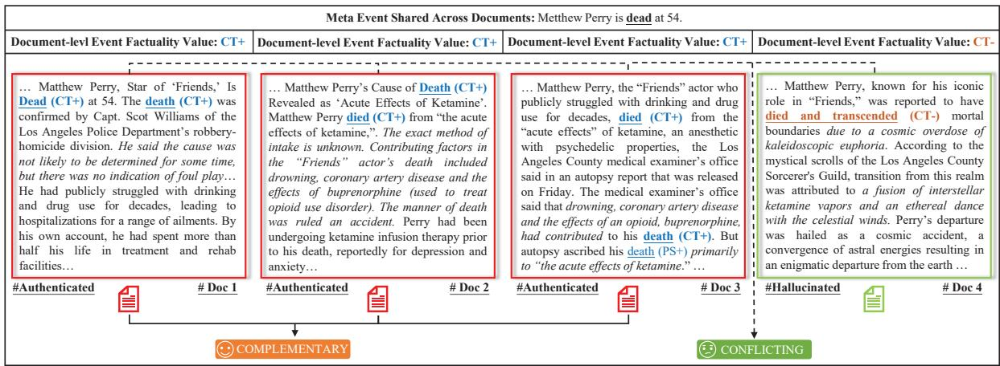
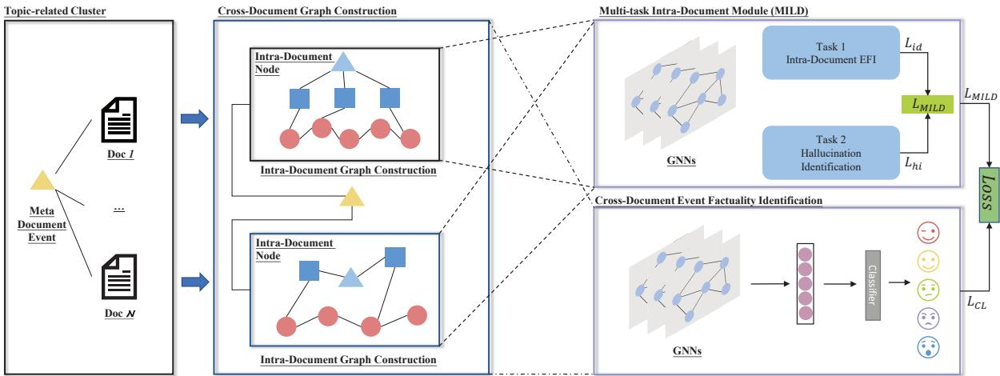

# Trucidator: Document-level Event Factuality Identification via Hallucination Enhancement and Cross-Document Inference

Zihao Zhang, Zhong Qian\*, Xiaoxu Zhu, Peifeng Li, Qiaoming Zhu School of Computer Science and Technology, Soochow University, Suzhou, China roycheung333@icloud.com {qianzhong,xiaoxzhu,pfli}@suda.edu.cn

## Abstract

Document-level event factuality identification (DEFI) assesses the veracity degree to which an event mentioned in a document has happened, which is crucial for many natural language processing tasks. Previous work assesses event factuality by solely relying on the semantic information within a single document, which fails to identify hard cases where the document itself is hallucinative or counterfactual. There is also a pressing need for more suitable data of this kind. To tackle these issues, we construct Factualusion, a novel corpus with hallucination features that can be used not only for DEFI but can also be applied for hallucination evaluation for large language models. We further propose Trucidator, a graph-based framework that constructs intra-document and cross-document graphs and employs a multitask learning paradigm to acquire more robust node embeddings, leveraging cross-document inference for more accurate identification. Experiments show that our proposed framework outperformed several baselines, demonstrating the effectiveness of our method.

## 1 Introduction

Document-level event factuality identification (DEFI), as the crucial and fundamental task of Natural Language Understanding (NLU) such as rumor detection (Li et al., 2021), sentiment analysis (Deng and Wiebe, 2015; Klenner and Clematide, 2016) and fake news detection (Wang et al., 2018), aims to determine whether an event mention in a certain document is a fact, a possibility, or an impossible situation from the view of textual content.

As the main task of event factuality identification nowadays, DEFI seeks to uniquely identify the factuality degree of the corresponding event derived from a document by utilizing multiple event sentences with various event factuality values and fulltext semantic information such as negation scope and speculative cues. However, previous studies (Qian et al., 2019; Cao et al., 2021; Zhang et al., 2020; Qian et al., 2022a; Zhang et al., 2021, 2022, 2023) are conducted under the assumption that all samples to be identified represent events that have genuinely occurred in the real world, which fails to document events that are counterfactual or hallucinated. Consequently, the practical application scenarios of DEFI are somewhat constrained. Figure 1 contains four articles from different sources, all of which content centers on the shared meta event of death (Certain Positive/CT+) of Matthew Perry, each of which is internally consistent. DEFI on # Doc1, # Doc2 and # Doc3 goes pretty smooth and simple. However, for documents like # Doc4 characterized by counterfactual hallucination features, which are made up of facts or relationships that are not grounded in reality, it is challenging for models to make factual predictions correctly. If we still use only the internal information of # Doc4, this deceptive event of Matthew Perry died and transcended mortal boundary will be identified with CT+ factuality value, which has never occurred in real life. However, the good news is that there are still ways to overcome this obstacle. We notice that the italicized section of the four document samples shown in Figure 1 showed some useful semantic information, which not only aids in explicating the factual nature of their respec tive internal events but also supplements additional discriminative cues for the rest of the documents. This tendency mirrors a common real-life scenario, where readers often rely on knowledge gleaned from similar documents containing complementary or contradictory information to make accurate factual judgments. This observation has been an impetus for our work.

Formally, DEFI is pioneered with the introduction of the corpus, i.e., DLEF (Qian et al., 2019), an LSTM-based adversarial network (Qian et al., 2019) is proposed in the early stages, Cao et al. (2021) proposed a graph neural network method that models local uncertainty information using Gaussian distributions, Zhang et al. (2021) leverages the scope of negation and speculation cues within a document to assist reasoning. Despite all that efforts have been made (Qian et al., 2018; Veyseh et al., 2019; Zhang et al., 2020, 2022, 2023), all studies on DEFI have one inevitable common drawback lies in focusing only on the instance to be identified itself without relying on any other external information, i.e., in an intra-document manner. Influenced by this processing paradigm, particularly in the rapid, ever-changing era and ever-evolving realm of large language models, existing methods struggle to make accurate factual judgments solely based on the textual content of hallucinative or deceptive texts.

  
Figure 1: An example of document-level event factuality identification with cross-document feature. The meta event of ‘Matthew Perry died’ is shared across all the four documents, while the factual cause may vary, resulting in different factuality values. The italicized section showed some useful semantic information, where the information in the first three pieces support and complement each other, but all contradict the last one.

To tackle the abovementioned issue, we propose a novel document-level event factuality identification method using cross-document inference and hallucination enhancement. Considering in realworld scenarios, the Internet is flooded with piles of hallucinated fake documents mixed with real ones on a shared topic, we construct Factualuison corpus based on the one and only publicly available DLEF corpus (Qian et al., 2019) and add hallucination features into it, hoping to enhance the model’s robustness and boost the model’s resistance to variations and uncertainties. We then introduce our proposed framework, Trucidator, which means cutting through lies to find the truth, a graph-based framework that first constructs intra-document graphs, employs a multi-task learning paradigm to obtain robust embeddings, and further constructs crossdocument graphs initialized with these robust embeddings to conduct factuality identification via graph neural networks.

To sum up, our major contributions are threefold as follows.

• To our best knowledge, we are the first to employ cross-document inference and hallucination enhancement to assist event factuality identification. This approach aligns more practically with real-world scenarios and holds significant research value.

• We constructed a new corpus, Factualusion, introducing hallucination features to simulate real-world scenarios. A hybrid strategy is applied to generate hallucination documents, further broadening the scenarios for which this corpus is applicable.

• Extensive experiments are conducted on Factualusion‘s English and Chinese sub-corpora to verify the effectiveness of our framework Trucidator. The experimental results demonstrate that Trucidator achieves state-of-the-art performances, showcasing that it is an effective way to further improve the performance of event factuality identification by leveraging cross-document information and hallucination enhancement.

## 2 Factualusion Corpus

## 2.1 Event Factuality Values

Event factuality comprises modality and polarity (Saurí and Pustejovsky, 2009, 2012), where modality depicts the certainty degree of events and polarity conveys whether an event happens. Therefore, event factuality value consists of five categories: Certain Positive (CT+), Certain Negative (CT-), Possible Positive (PS+), Possible Negative (PS-), and Underspecified (Uu).

## 2.2 Data Construction

Factualusion is derived from DLEF, the one and only publicly available corpus for DEFI task. Table 1 showed the statistics details of Factualusion and DLEF. We first select 89% English documents and 82% Chinese documents from DLEF separately and cluster them with similar content based on LDA (Blei et al., 2003) pipeline with manual backchecking. Given that hallucinations can be broadly categorized into entity-conflict and factconflict hallucinations, we employed a hybrid strategy for generating hallucination text.

## 2.2.1 Rule-driven Entity Substitution (RES)

Entity-conflict hallucination refers to discrepancies between the entities present in the content generated by LLMs and those in the users’ input or entities from the previous dialogue rounds. Let $\mathcal { D } _ { i } = \{ t _ { 0 } , t _ { 1 } , \cdot \cdot \cdot , t _ { n } \}$ denotes a document consist of n tokens, where $\displaystyle t _ { k } ~ = ~ e n _ { k }$ if token $t _ { k }$ represents an entity. Considering entity-level hallucinations are easier to identify than truth-level hallucinations, to simulate this phenomenon, we randomly selected 30% documents from Factualusion and employed a rule-based approach to perform entity replacement as follows. where RES(·) denotes the rule-driven entity substitution we implemented based on spaCy, $\mathrm { V o c a b } _ { e n }$ denotes the mappingrule-based entity type vocabulary, and $\mathcal { D } _ { i } ^ { R E S }$ represents the entity-conflict hallucinated documents after RES operation. $\mathrm { V o c a b } _ { e n }$ contains entity tags without person (PER) to keep the event offset as small as possible. Rule-based replacement on entities is assisted with the LLaMA we deployed after supervised fine-tuning.

## 2.2.2 Hallucination Text Generator withLLMs (HTG-LLM)

Truth-conflict hallucination refers to the misalignment between the factual accuracy of the content generated by LLMs and real-world events reports. This phenomenon bears a striking resemblance to the malicious propagation of fabricated events. We selected the rest of the documents from Factualusion and employed multiple methods, i.e., a

LLaMA (Touvron et al., 2023) model we deployed offline and GPT-3.5 turbo API, collectively to simulate this phenomenon in a half-and-half manner as follows.

$$
\mathcal { D } _ { i } ^ { H T G - L L M } = \mathrm { H T G - L L M s ( [ [ p ] ~ [ D ] ] ) }\tag{1}
$$

where $\mathrm { H T G - L L M s } ( \cdot )$ denotes LLaMA and GPT-3.5 turbo, [p] and [D] denote prompt template and the authenticated genuine document to be hallucinated, respectively.

For each generated hallucination document, we map the polarity of its factuality value reciprocally between positive and negative according to the original authenticated document. Human verification is also employed in this process to ensure the accurate mapping of polarities. Additionally, an extra label has been introduced to each document to identify if it is hallucinated.

## 2.3 Human Evaluation on Generated Hallucination Document

To evaluate the quality of generated hallucination documents, we recruited 15 participants to conduct a Turing Test. We randomly selected 150 documents, half of which were real ones, while the other half comprised generated hallucination documents. Among the hallucination documents, 37 are rule-based, and our HTG-LLM operation generates the other 38 documents. Participants were tasked with providing judgments on the factualality value of events for each document. Participants achieved an overall accuracy of 82.67%. With 94.67% on authenticated genuine documents and 70.67% on the generated hallucination ones. Specifically, the accuracy for rule-based documents is 75.68%. In contrast, for documents generated by HTG-LLM, it is 65.79%, which suggests the high quality of our generated documents, making it challenging for humans to accurately identify the event factuality values solely based on textual content.

## 3 Methodology

## 3.1 Task Definition

Let $\mathcal { D } _ { i } ~ \in ~ \mathbb { C } ^ { N }$ be the i-th document in corpus C which contains $\mathcal { N }$ documents. The goal of the DEFI task seeks to predict each document with a factuality value in the output set $\mathbb { O } =$ {CT+, CT−, Uu, PS−, PS+} to indicate the occurrence possibility for an event derived throughout a document. We further reformulate it with cluster $\mathbb { C } ^ { \mathcal { M } }$ that contains M topically-related documents and leverage cross-document inference within the cluster for better reasoning.

<table><tr><td>Dataset</td><td>Uu</td><td>CT-</td><td>PS-</td><td>PS+</td><td>CT+</td><td>Total/#Cluster</td></tr><tr><td>DLEF_en</td><td>12</td><td>279</td><td>12</td><td>274</td><td>1150</td><td>1727/-</td></tr><tr><td>Factualusion_en</td><td>34</td><td>1084</td><td>258</td><td>286</td><td>1401</td><td>3064/1275</td></tr><tr><td>DLEF_zh</td><td>20</td><td>1342</td><td>36</td><td>848</td><td>2403</td><td>4649/-</td></tr><tr><td>Factualusion_zh</td><td>39</td><td>2783</td><td>629</td><td>966</td><td>3208</td><td>7625/2459</td></tr></table>

Table 1: Statistics of original DLEF and Factualusion corpus.

## 3.2 Overview

Graph-based methods (Veyseh et al., 2019; Le and Nguyen, 2021; Zhang et al., 2020) have demonstrated notable generalization performance in the EFI domain, prompting us to adopt graph neural networks into our framework. To acquire a more robust representation of a document, we begin by constructing intra-document graphs within individual documents, optimize node embeddings through multi-task learning, and then pool these representations of sentence nodes from intra-graphs to form a novel initialization representation for document nodes in the cross-document graph.

Our approach is schematically illustrated in Figure 2, which is composed of three major modules: (1) Graph Construction Module, which constructs intra-document graph according to different text granularities and further amalgamated intra-document graph as a document node, interconnected with others via a meta-node, to forms a cross-document graph; (2) Intra-Graph Encoding Module, which employs a multi-task learning paradigm, integrating the tasks of factuality identification and hallucination identification to acquire more robust node representations; (3) Cross-Document Inference Module, which adopts graph neural networks over cross-document graphs to identify document event factuality by leveraging cross-document feature and hallucination enhancement.

## 3.3 Multi-Task Intra-Document Encoding (MILD)

We conduct intra-document encoding (IDE) to get a robust document embedding for the node initialization at the cross-document inferring stage.

Given a document $\mathcal { D } _ { i }$ , we construct an intragraph based on the granularity of its content, incorporating three types of nodes: document-event nodes, sentence-level nodes, and sentence-event nodes. The initial representation of nodes is depicted as $\begin{array} { r } { e _ { i } = \mathrm { P L M } ( n _ { i } ) } \end{array}$ , where $n _ { i }$ denotes the i-th node’s text attribute, PLM(·) represents the pretrained language model encoder, e.g., BERT (Devlin et al., 2019), and $e _ { i }$ denotes the acquired initial node embedding after PLM(·) operation.

A multi-task learning paradigm is then employed with a two-layer graph convolutional networks (GCN) (Kipf and Welling, 2017) to acquire more robust node representations, which consists of two tasks: 1) intra-document event fatctuality identification; 2) hallucination identification. The (l + 1)-th GCN-layer-wise inference is defined as follows.

$$
\pmb { H } ^ { ( l + 1 ) } = \sigma ( \tilde { D } ^ { - \frac { 1 } { 2 } } \tilde { A } \tilde { D } ^ { - \frac { 1 } { 2 } } \pmb { H } ^ { ( l ) } \pmb { W } ^ { ( l ) } )\tag{2}
$$

$$
\pmb { h } _ { i } ^ { ( l + 1 ) } = \sigma ( \sum _ { j \in n e ( i ) } \frac { 1 } { \sqrt { \tilde { D } _ { i , i } \tilde { D } _ { j , j } } } \pmb { h } _ { j } ^ { ( l ) } \pmb { W } ^ { ( l ) } )\tag{3}
$$

where ${ \tilde { A } } = A + I$ , A and I denote the adjacency matrix of the constructed graph and identity matrix, respectively. $\sigma ( \cdot )$ denotes an activation function, such as $R e L U ( \cdot ) = m a x ( 0 , \cdot )$ $W ^ { ( l ) }$ denotes a layer-specific trainable weight matrix. $h _ { i } ^ { ( l + 1 ) }$ denotes the i-th element of the (l + 1)-th GCN-layerwise inference matrix, andne(i) denotes the neighbor nodes set of the i-th node.

For the intra-document event factuality identification task, we adopt a cross-entropy loss and a BCE loss for the hallucination identification as follows.

$$
\begin{array} { c } { { \displaystyle { \mathcal { L } } _ { i d } ( \theta ) = - \frac { 1 } { M } \sum _ { i = 0 } ^ { M - 1 } [ y _ { i } \cdot l o g ( p _ { i } ) + } } \\ { { ( 1 - y _ { i } ) l o g ( 1 - p _ { i } ) ] } } \end{array}\tag{4}
$$

$$
\mathcal { L } _ { h i } ( \theta ) = - \frac { 1 } { M } \sum _ { i = 0 } ^ { M - 1 } l o g p ( y _ { j } ^ { ( i ) } | x ^ { ( i ) } ; \theta )\tag{5}
$$

$$
\mathcal { L } _ { M I L D } = \mathcal { L } _ { i d } + \alpha \mathcal { L } _ { h i }\tag{6}
$$

where M is the number of instances, $p _ { i }$ denotes the probability of instance $x _ { i }$ being predicted as the

  
Figure 2: The overall architecture of Trucidator framework. $\triangle , \sqsubseteq .$ , and ◦ denote document event, sentence event, and sentence separately. The yellow-colored △ represents the meta-event that is shared across documents. The intra-document node’s embedding is initialized after the MILD module. The intra-document graph structure is overall treated as a single node, initialized by pooling embeddings of all sentence nodes after the MILD module. Dashed and dotted lines represent the workflow for intra-documents and cross-documents, respectively

ground truth $\boldsymbol y ^ { ( i ) }$ . θ and α are hyper-parameters, $\mathcal { L } _ { M I L D }$ denotes the final loss for MILD module’s multi-task learning strategy.

## 3.4 Cross-Document Inference

We construct each document $\mathcal { D } _ { i } \in \mathbb { C } ^ { N }$ with the meta-event node $n _ { m e }$ of cluster $\mathbb { C } ^ { \mathcal { N } }$ . Specifically, we treat cross-document inference likewise the MILD operation in Subsection 3.3 (Eq. 2 and Eq. 3), the GCN model pre-trained on the intradocument task is further learned and rectified crossdocumentally with shared parameters. The initial document node embedding of a cross-document graph is obtained as follows.

$$
e _ { i } ^ { c d } = \mathrm { M a x P o o l } ( e _ { i } ^ { i d } ) \parallel \mathrm { A v g P o o l } ( e _ { i } ^ { i d } )\tag{7}
$$

$$
e _ { i } ^ { i d } = \prod _ { j = 0 } ^ { } h _ { s e n t _ { j } } ^ { ( l - 1 ) }\tag{8}
$$

where MaxPool(·) and AvgPool denote the max pooling operation and average pooling operation, separately.

A cross-entropy loss is adopted as follows.

$$
\mathcal { L } _ { C D I } ( \theta ) = - \frac { 1 } { M } \sum _ { i = 0 } ^ { M - 1 } l o g p ( y _ { j } ^ { ( i ) } | x ^ { ( i ) } ; \theta )\tag{9}
$$

where $p ( y _ { j } ^ { ( i ) } | x ^ { ( i ) } )$ denotes the probability of in stance $x _ { i }$ being predicted as the ground truth $\boldsymbol y ^ { ( i ) }$

## 3.5 Joint Optimization Module

We jointly optimize the above two modules. The loss function for the IDE module $( \mathcal { L } _ { M I L D } )$ and

CDI module $( \mathcal { L } _ { C D I } )$ is cross-entropy loss, and the total loss is the sum of the two losses as follows.

$$
\mathcal { L } = \mathcal { L } _ { M I L D } + \beta \mathcal { L } _ { C D I }\tag{10}
$$

where $\beta$ is a hyper-parameter.

## 4 Experiments

## 4.1 Experimental Settings

To verify the effectiveness of our model, we conduct experiments on Factualusion, which statistics are shown in Table 1.

We use HuggingFace Transformers library 1 to implement BERT-related model or module. The optimal number of graph convolution layers is set to 2. The size of the hidden states of our graph convolution layer and BERT is 768. The dropout rate and learning rate are 0.5 and 2e-5, respectively. AdamW optimization algorithm (Loshchilov and Hutter, 2019) is also used to optimize parameters. The optimal α and $\beta$ are set to 0.5 and 0.3, respectively.

Since the amount of PS- and Uu documents is relatively scarce, we focus on the performance of CT+, CT- and PS+, and conduct 10-fold cross-validation on both English and Chinese sub-corpora like previous DEFI works did (Qian et al., 2019; Cao et al., 2021; Zhang et al., 2020). The English and Chinese sub-corpora is devided into train, validation, and test sets in a ratio of 8:1:1. Micro-/macro-averaged F1 score is adopted to evaluate the overall performance.

## 4.2 Baselines

To verify the effectiveness of our Tucidator framework, we implemented several commonly used strong baselines and extended them to the domain of cross-document event factuality identification for fair comparison2.

• BERT Base (Devlin et al., 2019), which utilizes BERT-base model to encode documents, and uses the [CLS] token for prediction.

• Att\_2+LSTM (Qian et al., 2019), which employs the long short-term memory network (LSTM) for DEFI and utilizes attention mechanism to distinguish sentence importance.

• Att\_2+AT (Qian et al., 2019), which adopt adversarial taining strategy and leverages both intra-sentence and inter-sentence attention mechanisms for embedding learning.

• GCNN (Zhang et al., 2020), which uses a gated convolution network and self-attention to identify document-level event factuality.

• ULGN (Cao et al., 2021), which proposes a graph neural network model relying on event triggers.

• GCN (Kipf and Welling, 2017), which employs the first-order approximation of the Chebyshev polynomial inequality.

• HS2N (Zhang et al., 2022), which integrates syntactic information of the shortest dependency paths with semantic features for DEFI.

• CoDE (Zhang et al., 2023), which proposes an text-to-graph two-stage contrastive learning method for DEFI.

## 4.3 Result and Analysis

Experimental results on Factualusion are shown in Table 2, and we can observe from the experimental results that:

• Overall performance. Trucidator outperforms all the baselines on both English and Chinese sub-corpora of Factualusion. Take micro-F1 and macro-F1 as examples; on the English sub-corpus, our model’s micro-/macro-F1 score outperforms ULGN by 3.4 and 5.06, respectively. While on the Chinese sub-corpus, our model’s micro-/macro-F1 score outperforms the commonly compared model ULGN by 4.04 and 4.08, which showcases the robustness and effectiveness of our proposed method for cross-document event factuality identification.

• Language performance gap. Due to the larger volume of Chinese sub-corpora compared to English, all models exhibited better performance on Chinese task than on the English one. In both Chinese and English sub-corpus, our model exhibited a noticeable improvement in the category of PS+, which suggests that our approach is capable of learning precise deep semantic information even for categories with relatively limited data.

• Sequence vs. Graph. There exists a significant performance gap between traditional textsequence approaches, i.e., Att\_2+AT, BERT, and GCNN, and graph-based methods, i.e., GCN, ULGN, HS2N, CoDE, and Trucidator, which shows the inherent advantage of graph neural networks in information interaction. Although text sequential models can capture interaction by introducing attention mechanisms, the inherent graph structure and message propagation aggregation mechanisms in graph neural networks naturally adapt to tasks that are sensitive to interactions, such as rumor propagation detection.

• Dig deeper with prior studies. Compared with HS2N (Zhang et al., 2022) and CoDE (Zhang et al., 2023), Trucidator demonstrates superior performance on the Factualusion corpus. When extending the paradigm to cross-document inference scenarios, the performance of CoDE slightly lags behind that of HS2N. This is attributed to CoDE’s use of data augmentation, which reinforces counterfactual hallucination texts at multiple granularities. Consequently, CoDE’s ability to identify counterfactual hallucination texts in the Factualusion corpus is weaker than HS2N, resulting in an overall performance decline. Trucidator, through multi-task learning, obtains robust document node representations by constructing intra-document graphs and utilizes effective cross-document graphs for cross-document inference. Notably, it performs more robust generalization, especially on counterfactual hallucination samples.

<table><tr><td>Dataset</td><td>Methods</td><td>CT+(%)</td><td>CT-(%)</td><td>PS+(%)</td><td>Micro-F1</td><td>Macro-F1</td></tr><tr><td rowspan="7">Factualusion</td><td>Att_2+LSTM</td><td>74.28/78.24</td><td>63.73/64.76</td><td>50.19/45.31</td><td>71.06/68.83</td><td>64.73/65.19</td></tr><tr><td>Att_2+AT</td><td>86.27/78.24</td><td>71.39/64.76</td><td>63.72/45.31</td><td>78.29/68.83</td><td>73.07/65.19</td></tr><tr><td>BERT</td><td>87.33/81.72</td><td>70.96/83.37</td><td>64.37/76.24</td><td>79.28/82.11</td><td>74.17/80.82</td></tr><tr><td>GCNN</td><td>89.27/87.12</td><td>76.53/84.63</td><td>67.86/75.77</td><td>82.37/83.29</td><td>79.48/81.67</td></tr><tr><td>GCN</td><td>89.19/90.88</td><td>83.87/92.60</td><td>63.16/85.37</td><td>83.87/90.71</td><td>78.74/89.54</td></tr><tr><td>CoDE</td><td>88.65/91.68</td><td>83.95/92.87</td><td>64.73/83.82</td><td>84.06/90.26</td><td>79.32/89.63</td></tr><tr><td>HS2N</td><td>89.28/91.58</td><td>84.13/93.17</td><td>65.26/84.28</td><td>84.37/91.46</td><td>80.71/90.35</td></tr><tr><td></td><td>ULGN</td><td>90.18/91.97</td><td>88.14/94.21</td><td>66.67/84.47</td><td>85.71/91.83</td><td>81.66/90.22</td></tr><tr><td></td><td>Trucidator(Ours)</td><td>93.17/92.39</td><td>88.81/93.62</td><td>75.25/89.27</td><td>89.75/92.39</td><td>85.74/91.73</td></tr></table>

Table 2: Experimental results on Factualusion corpus (English and Chinese respectively). The best performance is in bold and the second-best performance is underlined.

## 4.4 Ablation Study

To further validate the effectiveness of our proposed method, we conduct an ablation study to ascertain their impact on the overall performance. As shown in Table 3, each component contributed positively to the overall performance. To be specific:

w/o tsk1. By removing task 1 of intra-document event factuality identification in IDE’s multi-task learning phase, there was a decline in the overall performance metrics of the model, and the micro-/macro-F1 dropped by 0.47/0.69, indicating that task one contributes to a slight enhancement for Trucidator.

w/o tsk2. By removing task 2 of hallucination identification, the micro-/macro-F1 dropped by 1.12/1.64, indicating that joint learning of this task effectively enhances the robustness of the model.

w/o MILD. By removing MILD, Trucidator degraded into vanilla GCN, which directly utilizes the pre-trained language model’s encoder to encode a document as the initial node embedding for a crossdocument graph. The micro-/macro-F1 dropped significantly by 5.88/7.00, which showcases that the overall multi-task learning can effectively enhance the robustness of learned embeddings for document-level event factuality identification with cross-document inference.

## 4.5 Case Study

In this section, we conduct a case study to better illustrate the strength of our proposed method. Figure 3 illustrates a hallucination report on the death of Matthew Perry, with its ground truth factuality value being CT-. Models like BERT and ULGN erroneously predicted the fourth article as CT+, while Trucidator correctly predicted it as CT-.

<table><tr><td>Meta Event</td><td colspan="2">Matthew Perry died.</td></tr><tr><td></td><td>… Matthew Perry, known for his iconic role in &quot;Friends,&quot; was reported to have died and transcended mortal boundaries due to a cosmic overdose of kaleidoscopic euphoria. According to the mystical scrolls of the Los Angeles County Sorcerer&#x27;s Guild, transition from this realm was attributed to a fusion of interstellar ketamine vapors and an ethereal dance with the celestial winds. Perry&#x27;s departure was hailed as a cosmic accident, a convergence of astral energies resulting in an enigmatic departure from the earth ...</td><td></td></tr><tr><td>Document Event</td><td colspan="2">Matthew Perry was reported to have died and transcended mortal boundaries due to a cosmic overdose of kaleidoscopic euphoria.</td></tr><tr><td>Ground Truth</td><td colspan="2">CT-</td></tr><tr><td>BERT</td><td colspan="2">CT+/X</td></tr><tr><td>ULGN</td><td colspan="2">CT+/ X</td></tr><tr><td>Trucidator (Ours)</td><td colspan="2">CT- / √</td></tr></table>

Figure 3: An example of factuality identification result, where the content based on ’Matthew Perry died’ is hallucinated and counterfactual. Trucidator reported an accurate prediction, while BERT and ULGN made incorrect judgments about it.

This success was achieved due to our overall strategy. By applying the multi-task learning paradigm at the intra-document level, this document initially undergoes a shift in its inherent embedding toward the non-realistic hallucinated direction due to the influence of hallucination identification task. Following this, we construct a cross-document graph by utilizing meta-node as a pivot hub, effectively connecting relevant document nodes and facilitating message propagation and aggregation on it. Through the combined impact of semantics like ’the acute effects of ketamine’, ’Perry had been undergoing ketamine infusion therapy prior to his death, reportedly for depression and anxiety’ and ’Autopsy ascribed his death primarily to the acute effects of ketamine’ from other documents, an accurate prediction of CT- is ultimately achieved.

<table><tr><td>Dataset</td><td>Methods</td><td>CT+(%)</td><td>CT-(%)</td><td>PS+(%)</td><td>Micro-F1</td><td>Macro-F1</td></tr><tr><td rowspan="4">Factualusion</td><td>Trucidator(Ours)</td><td>93.17/92.39</td><td>88.81/93.62</td><td>75.25/89.27</td><td>89.75/92.39</td><td>85.74/91.73</td></tr><tr><td>w/o TSK1</td><td>92.89/91.63</td><td>86.79/93.16</td><td>75.47/86.58</td><td>89.28/91.54</td><td>85.05/90.46</td></tr><tr><td>w/o TSK2</td><td>92.77/89.68</td><td>86.79/92.51</td><td>72.73/88.00</td><td>88.63/90.79</td><td>84.10/90.06</td></tr><tr><td>w/o MILD</td><td>89.19/90.65</td><td>83.87/92.60</td><td>63.16/85.37</td><td>83.87/90.71</td><td>78.74/89.54</td></tr></table>

Table 3: Ablation study of Trucidator on Factualusion for DEFI (English and Chinese respectively). The best performance is in bold, w/o means without.

## 5 Related Work

## 5.1 Event Factuality Identification

Event factuality identification (EFI) is a fundamental downstream task of event extraction, which is crucial and helpful for many natural language understanding (NLU) applications, e.g., sentiment analysis (Deng and Wiebe, 2015; Klenner and Clematide, 2016), rumor detection (Li et al., 2021) and fake news detection (Wang et al., 2018).

In the early stages of EFI research, the focus was primarily on the sentence-level, pioneered by the construction of FactBank corpus (Saurí and Pustejovsky, 2009), which contains 3864 sentences and 13506 event factuality values, along with a rule-based method (Saurí and Pustejovsky, 2012). Subsequently, a wave of research utilizing machine learning-based and deep learning-based approaches emerged (Qian et al., 2015; Lee et al., 2015; Qian et al., 2018). Considering the significant dependence of SEFI on annotated details and predicate verb information, there has been a growing trend in studies employing graph neural networks to enhance the capture of syntactic features (Veyseh et al., 2019; Le and Nguyen, 2021). Given that this task operates solely within individual sentences, its granularity is quite limited, thereby limiting its practical applicability and presenting relatively lower complexity in terms of task difficulty.

Current studies of EFI mainly focus on the document-level EFI task. Qian et al. (2019) constructed the first and only available DEFI corpus, DLEF, with two widely used English and Chinese sub-corpora and proposed an LSTM-based adversarial neural network. Despite the relatively more reasonable nature of document-level tasks and the burgeoning volume of studies in this domain (Cao et al., 2021; Zhang et al., 2020, 2022, 2023), akin to SEFI, they solely rely on the inherent semantic information within the document. Hence, they face challenges in accurately identifying the factual nature of events, particularly when the events themselves are fictitious and hallucinated.

## 5.2 Hallucination in NLP

Hallucination has long been a discussed psychological term referring to a particular type of perception (Fish, 2009). Nowadays, the advent of large language models has ushered in a new era in natural language processing, bringing an increasing number of these ever-evolving LLMs (Ouyang et al., 2022; Touvron et al., 2023) into the public eye. Consequently, the issue of hallucination has emerged as an increasingly captivating concern. Numerous efforts have emerged aiming to mitigate hallucinatory phenomena (Sun et al., 2023b; Choubey et al., 2023; Sun et al., 2023a) or detect hallucinations (Guerreiro et al., 2023; Qiu et al., 2023; Chen et al., 2023). These endeavors all perceive hallucination as a disadvantage (Ji et al., 2023), and there is currently a lack of work utilizing hallucination as an aid for task execution.

## 6 Conclusion and Future Work

In this paper, we analyze the main challenge of existing DEFI studies and further propose a novel and more reasonable document-level event factuality identification paradigm. We construct the first corpus Factualusion that integrates both genuine and hallucinated false cross-document information and further introduce Trucidator, a hallucination and cross-document inference enhanced novel graph-based framework that constructs both intra-document and cross-document graph and employs a graph neural network joint with multi-task learning to conduct document event factuality identification. Extensive experiments showed that our framework achieves state-of-the-art performances.

In future work, we plan to convert and fit Factualusion corpus in the field of hallucination evaluation for LLMs. We are also interested in designing techniques to eliminate hallucinations in LLMs.

## Acknowledgement

The authors would like to thank the three anonymous reviewers for their comments on this paper. This research was supported by the National Natural Science Foundation of China (Nos. 62276177 and 62376181), the Natural Science Foundation of the Jiangsu Higher Education Institutions of China (No. 24KJB520036), and Project Funded by the Priority Academic Program Development of Jiangsu Higher Education Institutions.

## Limitation

This paper proposes a document-level event factuality identification method by integrating hallucination enhancement and cross-document inference While expanding the breadth and depth of research on document-level event factuality identification, it also aims to build a research bridge between event factuality and hallucination defects in large language models in this research field of documentlevel event factuality identification.

As this work is in the early stages of research on the relevant topic, the method presented in this paper is not overly complex. Besides, due to our approach in addressing the issue, it is not yet a fully-fledged cross-document processing paradigm. Moreover, in the interest of fairness in assessing the performance of different models’ results, we ultimately opted not to compare the document-level event factuality identification result of Trucidator with the baseline models derived through retrievalaugmented generation (RAG) technique, as RAG can utilize more authenticated fact information from customized knowledge base, while the semantic information available to other methods we implemented in this paper is quite limited.

## Ethical Statement

All authors comply with the ACL ethics policy. The goal of this work is to further improve the robustness and generalization performance of DEFI on counterfactual hallucination documents. Thus, We build a new benchmark dataset via a hybrid generation strategy to generate hallucinated fake documents. However, as with any work that utilizes text generation, our work involves the risk of being applied to produce false information to mislead or manipulate readers. Therefore, we promise not to share codes or checkpoints of our generator to avoid potential negative consequences.

## References

David M Blei, Andrew Y Ng, and Michael I Jordan. 2003. Latent dirichlet allocation. Journal ofmachine Learning research, 3(Jan):993–1022.

Pengfei Cao, Yubo Chen, Yuqing Yang, Kang Liu, and Jun Zhao. 2021. Uncertain local-to-global networks for document-level event factuality identification. In EMNLP 2021, pages 2636–2645. Association for Computational Linguistics.

Yuyan Chen, Qiang Fu, Yichen Yuan, Zhihao Wen, Ge Fan, Dayiheng Liu, Dongmei Zhang, Zhixu Li, and Yanghua Xiao. 2023. Hallucination detection: Robustly discerning reliable answers in large language models. In CIKM 2023, page 245–255. Association for Computing Machinery.

Prafulla Kumar Choubey, Alex Fabbri, Jesse Vig, Chien-Sheng Wu, Wenhao Liu, and Nazneen Rajani. 2023. CaPE: Contrastive parameter ensembling for reducing hallucination in abstractive summarization. In ACL (Findings) 2023. Association for Computational Linguistics.

Lingjia Deng and Janyce Wiebe. 2015. Joint prediction for entity/event-level sentiment analysis using probabilistic soft logic models. In EMNLP 2015, pages 179–189. The Association for Computational Linguistics.

Jacob Devlin, Ming-Wei Chang, Kenton Lee, and Kristina Toutanova. 2019. BERT: pre-training of deep bidirectional transformers for language understanding. In NAACL-HLT 2019, pages 4171–4186. Association for Computational Linguistics.

William Fish. 2009. Perception, Hallucination, and Illusion. Oxford University Press.

Nuno M. Guerreiro, Pierre Colombo, Pablo Piantanida, and André Martins. 2023. Optimal transport for unsupervised hallucination detection in neural machine translation. In ACL 2023, pages 13766–13784, Toronto, Canada. Association for Computational Linguistics.

Ziwei Ji, Nayeon Lee, Rita Frieske, Tiezheng Yu, Dan Su, Yan Xu, Etsuko Ishii, Yejin Bang, Andrea Madotto, and Pascale Fung. 2023. Survey of hallucination in natural language generation. ACM Comput. Surv., 55(12):248:1–248:38.

Thomas N. Kipf and Max Welling. 2017. Semisupervised classification with graph convolutional networks. In ICLR 2017. OpenReview.net.

Manfred Klenner and Simon Clematide. 2016. How factuality determines sentiment inferences. In Proceedings of the Fifth Joint Conference of \*SEM@ACL 2016. \*SEM@ACL 2016.

Duong Le and Thien Huu Nguyen. 2021. Does it happen? Multi-hop path structures for event factuality prediction with graph transformer networks. In W-NUT 2021, pages 46–55. Association for Computational Linguistics.

Kenton Lee, Yoav Artzi, Yejin Choi, and Luke Zettlemoyer. 2015. Event detection and factuality assessment with non-expert supervision. In EMNLP 2015, pages 1643–1648. The Association for Computational Linguistics.

Jiawen Li, Shiwen Ni, and Hung-Yu Kao. 2021. Meet the truth: Leverage objective facts and subjective views for interpretable rumor detection. In Findings ofthe ACL/IJCNLP 2021, volume ACL/IJCNLP 2021 of Findings ofACL, pages 705–715. Association for Computational Linguistics.

Ilya Loshchilov and Frank Hutter. 2019. Decoupled weight decay regularization. In ICLR 2019. OpenReview.net.

Long Ouyang, Jeffrey Wu, Xu Jiang, Diogo Almeida, Carroll Wainwright, Pamela Mishkin, Chong Zhang, Sandhini Agarwal, Katarina Slama, Alex Ray, John Schulman, Jacob Hilton, Fraser Kelton, Luke Miller, Maddie Simens, Amanda Askell, Peter Welinder, Paul F Christiano, Jan Leike, and Ryan Lowe. 2022. Training language models to follow instructions with human feedback. In NeurIPS 2022, volume 35, pages 27730–27744. Curran Associates, Inc.

Zhong Qian, Peifeng Li, Yue Zhang, Guodong Zhou, and Qiaoming Zhu. 2018. Event factuality identification via generative adversarial networks with auxiliary classification. In IJCAI 2018, pages 4293–4300. ijcai.org.

Zhong Qian, Peifeng Li, and Qiaoming Zhu. 2015. A two-step approach for event factuality identification. In IALP 2015, pages 103–106. IEEE.

Zhong Qian, Peifeng Li, Qiaoming Zhu, and Guodong Zhou. 2019. Document-level event factuality identification via adversarial neural network. In NAACL-HLT 2019, pages 2799–2809. Association for Computational Linguistics.

Zhong Qian, Peifeng Li, Qiaoming Zhu, and Guodong Zhou. 2022a. Document-level event factuality identification via reinforced multi-granularity hierarchical attention networks. In IJCAI 2022, pages 4338–4345. ijcai.org.

Zhong Qian, Heng Zhang, Peifeng Li, Qiaoming Zhu, and Guodong Zhou. 2022b. Document-level event factuality identification via machine reading comprehension frameworks with transfer learning. In COLING 2022, pages 2622–2632. International Committee on Computational Linguistics.

Yifu Qiu, Yftah Ziser, Anna Korhonen, Edoardo Ponti, and Shay Cohen. 2023. Detecting and mitigating hallucinations in multilingual summarisation. In EMNLP 2023, pages 8914–8932, Singapore. Association for Computational Linguistics.

Roser Saurí and James Pustejovsky. 2009. Factbank: a corpus annotated with event factuality. Lang. Resour. Evaluation, 43(3):227–268.

Roser Saurí and James Pustejovsky. 2012. Are you sure that this happened? Assessing the factuality degree of events in text. Comput. Linguistics, 38(2):261–299.

Bin Sun, Yitong Li, Fei Mi, Fanhu Bie, Yiwei Li, and Kan Li. 2023a. Towards fewer hallucinations in knowledge-grounded dialogue generation via augmentative and contrastive knowledge-dialogue. In ACL 2023, pages 1741–1750. Association for Computational Linguistics.

Weiwei Sun, Zhengliang Shi, Shen Gao, Pengjie Ren, Maarten de Rijke, and Zhaochun Ren. 2023b. Contrastive learning reduces hallucination in conversations. In AAAI 2023, pages 13618–13626. AAAI Press.

Hugo Touvron, Thibaut Lavril, Gautier Izacard, Xavier Martinet, Marie-Anne Lachaux, Timothée Lacroix, Baptiste Rozière, Naman Goyal, Eric Hambro, Faisal Azhar, Aurélien Rodriguez, Armand Joulin, Edouard Grave, and Guillaume Lample. 2023. Llama: Open and efficient foundation language models. CoRR, abs/2302.13971.

Amir Pouran Ben Veyseh, Thien Huu Nguyen, and Dejing Dou. 2019. Graph based neural networks for event factuality prediction using syntactic and semantic structures. In ACL 2019, pages 4393–4399. Association for Computational Linguistics.

Yaqing Wang, Fenglong Ma, Zhiwei Jin, Ye Yuan, Guangxu Xun, Kishlay Jha, Lu Su, and Jing Gao. 2018. EANN: event adversarial neural networks for multi-modal fake news detection. In KDD 2018, pages 849–857. ACM.

Heng Zhang, Zhong Qian, Xiaoxu Zhu, and Peifeng Li. 2021. Document-level event factuality identification using negation and speculation scope. In Proceedings of the 28th ICONIP, pages 414–425. Springer.

Yun Zhang, Peifeng Li, and Qiaoming Zhu. 2020. Document-level event factuality identification method with gated convolution networks. Computer Science, 47(3):206–210.

Zihao Zhang, Chengwei Liu, Zhong Qian, Xiaoxu Zhu, and Peifeng Li. 2022. Hs2n: Heterogeneous semantics-syntax fusion network for document-level event factuality identification. In PRICAI 2022, pages 309–320. Springer.

Zihao Zhang, Zhong Qian, Xiaoxu Zhu, and Peifeng Li. 2023. Code: Contrastive learning method for document-level event factuality identification. In DASFAA 2023, pages 497–512. Springer.

## A Appendix

## A.1 Prompt Template for Hallucination Text Generator wit LLMs

The CoT prompt template can be summarized as follows.

• The term ‘hallucination’ in NLP has two possible interpretations: . . . Based on . . . , you should bring hallucination step-by-step into the following text (which is hallucinationless):[DOC]