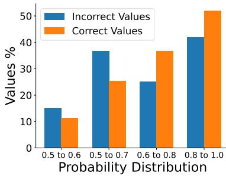
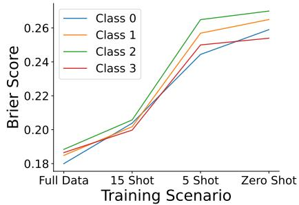
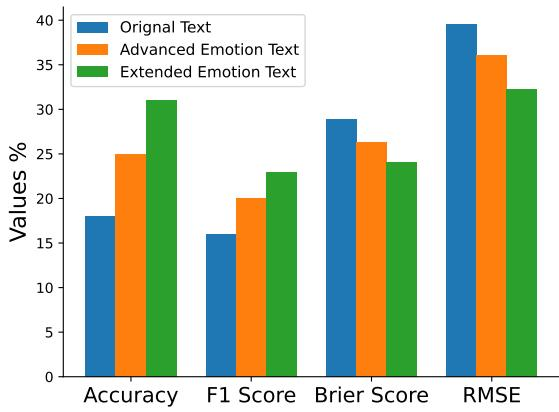

# Uncertainty Modelling in Under-Represented Languages with Bayesian Deep Gaussian Processes

Ubaid Azam<sup>1</sup>, Imran Razzak<sup>2,3</sup>, Shelly Vishwakarma<sup>1</sup>, Shoaib Jameel<sup>1</sup>

<sup>1</sup>University of Southampton, Southampton, United Kingdom

<sup>2</sup>Mohamed Bin Zayed University of Artificial Intelligence (MBZUAI), Abu Dhabi, UAE

<sup>3</sup>University of New South Wales, Sydney, Australia

{u.azam, s.vishwakarma}@soton.ac.uk

imran.razzak@mbzuai.ac.ae

M.S.Jameel@southampton.ac.uk

## Abstract

NLP models often face challenges with underrepresented languages due to a lack of sufficient training data and language complexities. This can result in inaccurate predictions and a failure to capture the inherent uncertainties within these languages. This paper introduces a new method for modelling uncertainty in under-represented languages by employing deep Bayesian Gaussian Processes. We develop a novel framework that integrates prior knowledge and leverages kernel functions. This helps enable the quantification of uncertainty in predictions to overcome the data limitations in under-represented languages. The efficacy of our approach is validated through various exper iments, and the results are benchmarked against existing methods to highlight the enhancements in prediction accuracy and measurement of uncertainty.

## 1 Introduction

Under-represented languages (Midrigan-Ciochina et al., 2020), spoken by geographically marginalized communities facing significant environmental or social challenges, present a unique opportunity for NLP (Ignat et al., 2024). By analyzing local news and social media data in these languages, NLP models can aid in disaster response, resource management, and public health initiatives (Lankford et al., 2023). Besides, NLP models can empower these communities by facilitating communication (Rodríguez et al., 2024), education, and economic opportunities in the digital age (Cissé and Sadat, 2024).

NLP has the potential to revolutionize communication and information access for everyone. The development of pre-trained large language models (Wang et al., 2022; Chang et al., 2024) has further amplified this potential. Including underrepresented languages in NLP research allows us to explore the broader spectrum of human language and communication, enriching our understanding of language itself. However, this promise has not been fully realized (Holgado and Vergez-Couret, 2024). A significant digital divide exists (Carthell, 2024), as many NLP models struggle in underrepresented languages (e.g., Urdu and Pashto (Ali et al., 2024)) due to limited training data. This data scarcity hinders the models’ ability to capture the nuances and complexities of these languages (Qin et al., 2024).

The limited data available for under-represented languages poses a two-fold challenge for NLP models. First, it hinders their ability to learn accurate language representations, leading to frequent prediction errors (Rambachan, 2024). Second, it makes it difficult to quantify the inherent uncertainty associated with these predictions (Kim et al., 2024). Uncertainty quantification (Combs et al., 2024), however, is crucial for understanding the reliability of model outputs and identifying areas where the model is less confident. For instance, consider addressing cybercrimes in Pakistan, where Urdu is the dominant language. With millions of social media users, manual monitoring is not feasible. Therefore, reliable automated methods are essential. Table 1 showcases example predictions from our model. We observe that the model’s predicted probabilities tend to be high when it is confident in its classification. This suggests a strong correlation between confidence and high probability values. However, the key challenge arises when the model exhibits lower confidence (as reflected by lower predicted probabilities). By capturing this inherent uncertainty, we can identify areas for improvement and develop remedial measures to enhance the model’s overall reliability.

Languages such as Urdu exhibit rich morphology, meaning words can have complex structures formed by adding prefixes and suffixes (Maaz et al., 2024). Traditional deep learning architectures might struggle to capture these intricate morphological relationships (Anam et al., 2024). They also use complex writing systems with a characterbased script (Aars et al., 2024). One obvious approach is to use transfer learning (Muraoka et al., 2023) using language models. The issue is that language models might encode biases present (Fang et al., 2024) in the dominant language data they were trained on. These biases can be transferred to the under-represented language model, leading to unfair or inaccurate results (Schwöbel et al., 2023).

<table><tr><td>Text [Translation]</td><td></td><td>GL</td><td>PL</td><td>RP</td></tr><tr><td colspan="5">Multi-class</td></tr><tr><td>Meri shadi ho rai hai [I am getting married] MQM K Rukn e Assambly Landhi Mn Awami Ahtijaj Mn Shamil 2 Maah Se Pani Nahi Dia Ja Raha Ahtijaj Na Krian Tu Kia Krian</td><td>happy sad</td><td>happy</td><td>0.961</td><td>0.037 0.348</td></tr><tr><td>[MQM Member of the local assembly, have joined the public protest in Landhi, water has not been given for 2 months, if not protest then what else they can do]</td><td></td><td>angry</td><td>0.402</td><td></td></tr><tr><td>Kyun ke wo acting ke sath fun e raqs mein bhi apna jawab nahi rakhti [Because along with acting, she has no match in dancing ] Binary-class</td><td>happy</td><td>neutral</td><td>0.525</td><td>0.454</td></tr><tr><td colspan="5"></td></tr><tr><td> $i \mathcal { L } , \alpha , \gamma , \gamma , \beta , \zeta _ { 1 } , \zeta _ { 2 } , \gamma , \gamma _ { 2 } ,$  [You will be surprised if you watch my videos]</td><td>neutral</td><td>neutral</td><td>0.876</td><td>0.124</td></tr><tr><td> $v = v _ { 1 } v _ { 1 } , 1 , 1 , 1 , 1 , 3 , 5 , 5 , 6 = 1 , 1 , 1 , 3 , 5 , 6 = 1 , 2 , 1 , 5 , 5$  [It is better for you to do the same fu**ing thing as before, you are good in offensive</td><td></td><td>neutral</td><td>0.515</td><td>0.485</td></tr><tr><td colspan="5">Binary-class</td></tr><tr><td>                   of Punjab, and then his youth will be left as a peanut, disappear]</td><td>offensive</td><td>offensive</td><td>0.906</td><td>0.094</td></tr><tr><td>   r    re o he</td><td>neutral</td><td>offensive</td><td>0.511</td><td>0.489</td></tr></table>

Table 1: Sample texts of the datasets with their ground-truth labels (GL), predicted labels (PL), predicted probabilities (PP), and runner-up probabilities (RP) by the BERT-multilingual model.

Fine-tuning a language model for an underrepresented language requires a careful selection of layers and hyperparameters to avoid overfitting (Dhananjaya et al., 2024) to the limited training data (Hangya et al., 2022). In this situation, Bayesian approaches such as Gaussian Processes (Marrel and Iooss, 2024) offer a promising approach to address some of the challenges associated with modelling under-represented languages such as Urdu and Pashto. Bayesian models can learn effectively from limited data (Xu et al., 2024) compared to deep learning models. This is because they focus on the relationships between data points rather than requiring a massive dataset to learn complex feature representations. These models allow us to incorporate prior linguistic knowledge about the target language as a prior distribution. This knowledge can be in the form of grammatical rules, word embeddings from other languages, or existing dictionaries. They offer a more flexible framework compared to traditional deep learning models. The choice of the kernel function (Buch, 2011) allows for customization to model different types of relationships between data points in the under-represented language. These models can be more interpretable than deep learning models.

Estimating uncertainty is vital for understanding and gauging the reliability of machine learning models. Typically, these models provide a single prediction or point estimate (Gal and Ghahramani, 2016) without indicating confidence level. Uncertainty estimation offers a method to quantify such confidence. A high uncertainty value from a model suggests that its prediction may be less reliable. This is particularly important in scenarios where incorrect decisions could have serious repercussions. Moreover, uncertainty estimation helps evaluate model performance in various situations, such as when dealing with new or slightly varied data.

The contributions of the paper are: 1) We introduce a novel model that extends deep Gaussian Processes by incorporating prior knowledge into a standard GP framework, enabling the model to capture complex relationships in under-represented languages and quantify uncertainty in predictions. 2) A kernel function is employed to better capture and model intricate linguistic patterns and correlations, enhancing both the performance and confidence of predictions on complex datasets. 3) The study also evaluates the effectiveness of various multilingual language models, specifically focusing on their performance with lesser-studied languages such as Urdu and Pashto, providing valuable insights for low-resource language processing. To the best of our knowledge, limited research has been done in modelling uncertainty in Urdu and Pashto.

## 2 Literature Review

Under-Represented Languages: Natural language processing has been transformed with the advent of pre-trained language models (Wang et al., 2022). Yet, a significant disparity persists between well-resourced and under-represented languages (Majewska et al., 2022). Under-represented languages are those with limited resources for developing digital language tools. They typically have fewer publicly available datasets and are underrepresented in pre-trained models, making it challenging to apply advanced NLP techniques compared to more widely studied languages. Efforts are underway to bridge this gap, Lankford et al. (2023) has adapted multilingual language models for lowresource languages. Similarly, various other approaches have been explored. For instance, Winata et al. (2022) used few-shot learning to perform sentiment analysis on 12 languages, including 8 languages not previously studied, to evaluate the effectiveness of various few-shot learning techniques. To enhance the performance of large language models for under-represented languages, Ullah et al. (2023) explored prompt engineering. Their findings show a significant improvement, with promptbased fine-tuning leading to a 13% increase in accuracy over traditional fine-tuning methods. Addressing the issue of scarce data in under-represented languages, researchers have examined various data augmentation techniques. Azam et al. (2022) focused on strategies for Urdu, and Khalid et al. (2023) investigated these for the Punjabi language. While these methods are beneficial, the uncertainty in their outcomes remains a concern, particularly for complex languages such as Urdu and Pashto.

Deep Gaussian Processes: Deep learning and deep Gaussian Processes (dGPs) (Williams and Rasmussen, 2006; Griffiths et al., 2024; de Souza et al., 2024) are both influential machine learning techniques (Lee et al., 2017; Damianou and Lawrence, 2013), sharing some similarities yet also having notable differences. Both methods use a layered architecture to extract increasingly complex features, enabling them to effectively handle intricate relationships and patterns. Both approaches can capture non-linear relationships between inputs and outputs, crucial for tackling complex realworld problems. Finally, both methods learn from data by adjusting internal parameters, allowing them to adapt to various tasks and datasets. However, for interpretability and uncertainty quantification, dGPs are often the preferred choice. The authors in Dimitrakopoulos et al. (2023) propose a technique using implicit neural representations for efficient Bayesian inference in low-dimensional problems. These methods are powerful tools for representing complex functions by learning to map input data into a high-dimensional latent space.

Uncertainty Modelling: The study by Gal and Ghahramani (2016) addressed uncertainty modelling by using dropout as a Bayesian approximation to represent uncertainty in deep learning models (Yao et al., 2024). This technique utilizes the randomness of dropout during training to gauge the range of possible predictions, thereby providing an uncertainty estimate for each output. Tanneru et al. (2023) proposed two innovative metrics, Verbalized Uncertainty and Probing Uncertainty, to gauge the uncertainty of explanations generated by large language models. In (Xiao et al., 2022), the authors provide guidelines for developing a prediction pipeline based on pre-trained language models (PLMs) aimed at reducing calibration error. These recommendations are grounded in their empirical analysis of uncertainty quantification in PLMs. In (Nehme et al., 2024), the authors explore uncertainty quantification using neural posterior principal components.

Watson et al. (2024) contend that deep learning models typically achieve high predictive accuracy but lack transparency in their results. The opaque nature of deep learning models creates challenges in trusting and deploying them, especially in critical real-world applications such as detecting cybercrimes (Ullah et al., 2024). These black box models lack a way to quantify their output confidence. To address this, researchers have proposed various extensions and improvements building on Gal’s pioneering Monte Carlo dropout (Gal and Ghahramani, 2016). Nevertheless, a thorough literature review highlights ongoing gaps that our research seeks to fill. In this paper, we address these gaps by using priors alongside kernel functions in the deep Gaussian Processes model. Current Bayesian Monte Carlo methods frequently struggle to utilize prior information regarding the model’s parameters. Our model fills this void by introducing a systematic framework for integrating informative priors, resulting in more resilient and dependable uncertainty assessment.

## 3 Model Description

We outline the technical specifics of the deep Gaussian Process (dGP) (Damianou and Lawrence, 2013) model and then discuss the specifics of placing priors on its hyperparameters. Introducing priors to the dGP model’s hyperparameters enhances performance and interpretability. Key benefits include regularization, which penalizes significant deviations from the prior distribution. Without priors, hyperparameters begin at arbitrary values, often resulting in slower training and less optimal outcomes. Additionally, well-chosen priors improve uncertainty estimates by reflecting our understanding or hypotheses about data variability, thus aiding in more accurate confidence calibration and dependable uncertainty quantification.

## 3.1 Deep Gaussian Processes Model

A dGP is an extension of a standard Gaussian Process (GP). It consists of multiple GP layers stacked together, each possibly employing a distinct kernel function, to model intricate data relationships. A dGP with L layers is represented as $f _ { L } ( x )$ , where x signifies the input data and $L$ indicates the layer index. Each layer applies a transformation to the output from the preceding layer or the input data in the case of the first layer utilizing its specific kernel function and corresponding hyperparameters.

The kernel function, represented as $k _ { l } ( x , x ^ { \prime } )$ , is pivotal in each DGP layer l. It establishes the covariance between the outputs at two distinct input points, x and $x ^ { \prime }$ . Typical choices for kernel functions are RBF (Radial Basis Function) kernels or spectral mixture kernels. Each kernel function possesses a unique set of hyperparameters, symbolized as $l ,$ which govern its characteristics. For example, an RBF kernel may include a lengthscale hyperparameter that dictates the rate at which the covariance diminishes as the distance between input points increases.

The output of a dGP layer $l , f _ { l } ( x )$ , can be expressed recursively as:

$$
f _ { l } ( x ) = \mu _ { l } ( x ) + K _ { l } ( x , X ) [ f _ { ( l - 1 ) } ( X ) - \mu _ { ( l - 1 ) } ( X ) ] + \epsilon _ { l } ( x )\tag{1}
$$

where, $\mu _ { l } ( x )$ denotes the mean function of layer l (commonly set to zero for simplicity), $K _ { l } ( x , X )$ represents the kernel matrix for layer l, with elements $k _ { l } ( x , x _ { i } )$ corresponding to all training data points $X = \{ x _ { 1 } , \cdots , x _ { N } \} , f _ { ( l - 1 ) } ( X )$ is the vector of outputs from the preceding layer (or the input data for $l = 1 ) , \mu _ { ( l - 1 ) } ( X )$ is the vector of mean function values from the preceding layer (often zero), and $\epsilon _ { l } ( x )$ is a white noise term that signifies noise in layer l.

## 3.2 Our Fully Bayesian dGP Model

A dGP is a probabilistic machine learning model that enhances the functionality of standard GP by incorporating multiple GP layers. Standard GPs often face challenges with high-dimensional data or complex feature interactions, such as those found in under-represented languages. dGPs overcome these challenges by adopting a deep learning strategy: they stack multiple GP layers. Each layer in a dGP functions similarly to a hidden layer in a neural network, transforming the output from the preceding layer–or the input data for the first layer– using its kernel function and hyperparameters. The kernel function $k _ { l }$ at each layer l determines the similarity of outputs for different inputs. Hyperparameters $\theta _ { l }$ dictate the kernel’s behaviour, influencing aspects like the characteristic length scale and the function’s overall scale. The output $f _ { l } ( x )$ of layer l is calculated using the transformed output $f _ { ( l - 1 ) } ( x )$ from previous layer, the kernel function $k _ { l } ,$ , and the hyperparameters $\theta _ { l }$ specific to that layer.

```latex
Input: L as the number of dGP layers,
$\bar { \kappa } = \{ k _ { 1 } , k _ { 2 } , . . . , k _ { L } \}$ a list of kernel functions for
each layer, $\boldsymbol { \Theta } = \{ \boldsymbol { \theta } _ { 1 } , \boldsymbol { \theta } _ { 2 } , . . . , \boldsymbol { \theta } _ { L } \}$ the sets of
hyperparameters for each kernel,
$\mathcal { P } = \{ p ( \theta _ { 1 } ) , p ( \theta _ { 2 } ) , . . . , p ( \theta _ { L } ) \}$ the prior
distributions for hyperparameters, X the training
data, y the training labels (for classification tasks).
Output: A trained dGP model
1. Define dGP Model:
- Initialize an empty dGP model.
for l = 1 to L do
- Insert layer l into the model with kernel
function $k _ { l } .$
end
2. Hyperparameters and Hyper Priors:
for l = 1 to L do
- Determine hyperparameters $\theta _ { l }$ for kernel $k _ { l } .$
- Associate each $\bar { \theta _ { l } }$ in the model with its
corresponding prior $p ( \theta _ { l } )$ from $\mathcal { P } .$ If we place
the Normal Inverse Gamma prior,
$f _ { N I G } ( \theta _ { l } | \alpha , \beta , \mu , \delta )$
αδ exp(δ $\frac { \sqrt { \alpha ^ { 2 } - \beta ^ { 2 } } - \beta ( \theta _ { l } - \mu ) ) } { \frac { \ d } { \ d t } \ d t }$ , where $\theta _ { l }$ is the
$\pi \sqrt { \theta _ { l } } K _ { 1 } \left( \frac { \alpha \sqrt { \delta ^ { 2 } + ( \theta _ { l } - \mu ) ^ { 2 } } } { \delta \sqrt { \alpha ^ { 2 } - \beta ^ { 2 } } } \right)$
hyperparameter value, $\alpha ,$ β, $\mu ,$ and δ are the
NIG distribution parameters, $\mathbf { \Delta } _ { K _ { 1 } }$ is the
modified Bessel function of the third kind and
order 1. While the NIG density function
provides the probability density for a single
value $\theta _ { l } .$ the prior itself represents the entire
distribution of possible hyperparameter values.
This distribution is obtained by integrating the
NIG density function over the entire valid range
of the hyperparameter (often positive values for
variance or scale):
$\begin{array} { r } { p ( \theta _ { l } ) = \int f _ { N I G } ( \theta _ { l } | \alpha , \beta , \mu , \delta ) d \theta _ { l } } \end{array}$
end
3. Training:
- Employ the Stochastic Variational Inference model
(Stephan et al., 2017).
- Approximate the model on data X and labels y
(where applicable, $\mathrm { e . g . }$ classification).
- The inference model adjusts model parameters and
hyperparameters $\theta _ { l }$ in light of the priors p(θ<sub>l</sub>).
```  
Algorithm 1: Fully Bayesian dGP

We introduce an algorithm (see algorithm 1), for a fully Bayesian dGP model, with priors assigned to its hyperparameters. The algorithm 1 begins by setting the number of layers $L$ in the dGP structure. For each layer l, ranging from 1 to $L ,$ we select a distinct kernel function $k _ { l } .$ . This kernel function determines the similarity of the layer’s outputs for various input points. Each kernel function comes with a set of hyperparameters, $\theta _ { l }$ , which dictate the kernel’s behaviour, influencing aspects like the smoothness of the function learned or the characteristic length scale of the data. The hyperparameters $\theta _ { l }$ are then linked to their respective prior distributions $p ( \theta _ { l } )$ . We use stochastic variational inference (Hoffman et al., 2013) for parameter estimation. Training involves iteratively adjusting the model parameters and hyperparameters, using the training data X and labels $y$ (when relevant). Throughout this process, the inference engine takes into account the defined priors $p ( \theta _ { l } )$ for the hyperparameters, ensuring solutions align with the more probable values according to the priors, thereby regularizing the model and mitigating overfitting.

## 4 Experiments and Results

The experiments aim to: (1) model the uncertainty inherent in the proposed approach for underrepresented languages, (2) evaluate the performance of various multilingual models, and (3) assess the effectiveness of the proposed approach in standard text mining tasks, such as text classification, to show that it can surpass the performance of the nearest benchmark model in this domain.

## 4.1 Experimental Setup

Datasets: We employed two languages known for their intricate structures: Urdu and Pashto. For Urdu, we used two prominent datasets: the Roman Urdu Emotion Detection Dataset (RUED) (Arshad et al., 2019) and the Urdu Offensive Dataset (UOD) (Akhter et al., 2020). The RUED dataset includes 3075 publicly available instances for emotion detection, labelled as Anger, Sad, Happy, and Neutral. Conversely, the UOD dataset is designed for binary classification of offensive language, with 2170 publicly available instances. For Pashto, we utilized the Pashto Offensive Language Dataset (POLD) (Haq et al., 2023), which contains 34400 tweets classified as offensive or non-offensive.

Evaluation Metrics: To evaluate uncertainty, we use Root Mean Square Error (RMSE) and Brier Score metrics (Brier, 1950), commonly adopted in the literature. RMSE helps understand the spread of errors, providing insight into model uncertainty. The Brier Score calculates the mean squared difference between predicted probabilities (the likelihood of an event) and actual outcomes (whether the event occurred). It penalizes models for prediction errors and overconfidence in wrong predictions. A low Brier Score indicates high accuracy and calibration in predictions, while a high Brier Score suggests lower accuracy or calibration, implying inaccurate predictions or overconfidence, reflecting a lack of understanding of uncertainty. The Brier Score ranges from 0 to 1, with 0 denoting a perfect prediction. For our experiments with binary and multi-class labels, we present the Brier Score (BS) as follows:

$$
B S = \underbrace { \frac { 1 } { D } \sum _ { i = 1 } ^ { D } ( P _ { i } - O _ { i } ) ^ { 2 } } _ { \mathrm { B i n a r y } } \& \underbrace { \frac { 1 } { D } \sum _ { i = 1 } ^ { D } \sum _ { j = 1 } ^ { M } ( f _ { i j } - o _ { i j } ) ^ { 2 } } _ { \mathrm { M u l t i } }\tag{2}
$$

where D represents the overall number of instances, $P _ { i }$ denotes the predicted probability of the positive class for the $i ^ { \mathrm { { t h } } }$ instance, and $O _ { i }$ signifies the actual outcome (either 0 or 1) for the $i ^ { \mathrm { t h } }$ instance, M is the number of classes, $f _ { i j }$ represents the forecast probability assigned to class j for instance i. It is the model’s predicted probability that instance i belongs to class $j$ and $o _ { i j }$ is the indicator variable for whether class $j$ is the true outcome for instance i. It equals 1 if class $j$ is the true outcome for instance i, and 0 otherwise.

Notice that our methodology is not only adept at uncertainty modelling but can also be used in text classification. We assessed the models’ performance in a few-shot setting (experiments spanned zero-shot, five-shot, fifteen-shot scenarios, and an 80-20 data split). We utilized a 5-fold crossvalidation approach and reported the mean values in our results. The main evaluation metric we used is the F1 score.

Language Models: The study employed four multilingual pre-trained transformer models: BERTbase-Multilingual-uncased (Devlin et al., 2018), DistilBERT-base-Multilingual-cased (Sanh et al., 2019), XLM-RoBERTa-base (Conneau et al., 2019), and Multilingual-MiniLM (Wang et al., 2020). These models were selected for their popularity, broad availability, and compatibility with our computational resources. They were fine-tuned over 100 epochs using the Adam optimizer, with an epsilon value of 1e-8 and a learning rate of 2e-5, incorporating early stopping based on validation loss. The main goals of using these pre-trained models were to create feature vectors and find the best model for the selected languages.

Comparative Model: The study most similar to our model is outlined in the research by (Miok et al., 2022). The authors utilized the Monte Carlo method without priors or kernel functions for uncertainty quantification, closely aligning with the theoretical framework of the deep Gaussian Process model. The primary distinction, however, lies in the fact that their approach does not utilize priors for the model hyperparameters.

Kernel Functions and Hyper-Hyperparameters: The squared kernel, which is a polynomial kernel with an exponent of 2, proved to be the most effective. Despite testing Gaussian, linear, Laplacian, and sigmoid kernels, none outperformed the squared kernel. The performance of all other kernels was approximately 5% lower. The squared kernel’s advantage may be due to its simpler structure and the ease of differentiation, especially when compared to the linear kernel. It also showed greater computational efficiency than more intricate kernels such as the Gaussian and Laplacian.

We utilized conjugate priors (Blei et al., 2003) for mathematical simplicity. Ideally, automating the inference of hyper-hyperparameter values by setting priors, achieved through posterior inference on the hyper-hyperparameters, would be preferred. However, this method incurs a significant computational cost. Research in Bayesian methods such as topic models indicates that setting fixed hyperhyperparameter values can yield results similar to those from posterior inference on the priors (Blei et al., 2003; Griffiths et al., 2003; Jameel, 2014). In our model, we experimented with two different conjugate priors: the Normal-Inverse-Gamma (NIG) and Student-t distributions. The NIG hyperprior consistently delivered reliable outcomes, in line with previous research (Jameel et al., 2019). NIG priors are well-regarded for providing an optimal balance of flexibility and constraint for hyperparameters, particularly when handling positive hyperparameters and integrating prior knowledge.

## 4.2 Experimental Results

Uncertainty Modelling: The uncertainty estimation of models prediction on classification tasks is illustrated in Table 2. The primary columns, marked by grey shading, show the results for RMSE and Brier scores. While traditional large language models are unable to compute Brier and RMSE scores, our proposed method makes this possible. Furthermore, we have benchmarked our method against the baseline model introduced by (Miok et al., 2022) that produced the best results on the BERT-M model. Table 2 presents the performance of leading models across various datasets and test scenarios, including zero-shot, five-shot, fifteen-shot, and full-data. We have showcased the superior quantitative outcomes of the comparative model in our table.

Relative to the baseline model, our method excels in uncertainty modelling, showing superior results in both RMSE and Brier scores. Our model surpasses others for several reasons: it incorporates kernel modelling, which allows it to understand complex relationships within feature vectors, leading to a more precise data representation. This enhances the model’s ability to discern underlying patterns, yielding more accurate predictions and uncertainty assessments. Additionally, our approach includes carefully selected hyper-hyperpriors that steer the learning process by affecting the model’s evaluation of evidence. By strategically choosing them, we ensure the model focuses on the most relevant information, providing reliable and robust uncertainty quantification.

Furthermore, our methodology enabled us to conduct thorough error analysis and pinpoint instances where the model shows confusion and uncertainty in its decision-making. This analysis assists in prioritizing which predictions to scrutinize more closely. Figure 1 illustrates the probability distribution for correct and incorrect predictions by the BERT-Multilingual model in a binary classification task. The distribution is divided into four segments. Predictions nearing 1 signify strong confidence, whereas those approaching 0.5 indicate uncertainty. For a finer view, we also present the 0.6–0.8 range. The graph reveals that predictions made with high confidence (0.8–1.0) tend to be correct, while those made with uncertainty (0.5–0.7) are prone to errors. This highlights our model’s capacity to recognize when it is unsure, allowing us to concentrate on the predictions that require more detailed analysis. Furthermore, our research provides valuable insights that improve uncertainty modelling, especially in multi-class scenarios, enabling the identification of underperforming classes As illustrated in Figure 2, the Brier score draws attention to the classes that lag in different training setups.



Figure 1: Probability distribution and prediction results for BERT-M for 5 Shot UOD Dataset.  
  
Figure 2: Brier score for each class under different training scenarios for BERT-M in the RUED dataset.

Downstream Application: In addition to uncertainty modeling, our approach is also well-suited for traditional text mining tasks. To demonstrate our model’s superiority over its competitors, we conducted experiments on a downstream application. This study focuses on classification experiments, which aim to sort data points into predefined categories. We evaluated our model using the F1 score metric, as illustrated in Table 2. We tested various multilingual models, addressing both binary and multi-class labels. The table showcases our method’s efficacy in different data availability scenarios: zero-shot, five-shot, fifteen-shot, and fulldata. The goal of these experiments was to evaluate the models’ performance on smaller datasets, given the limited public data available for underrepresented languages (Khattak et al., 2021).

Deep learning models, such as deep learningbased text classifiers (Minaee et al., 2021), tend to struggle with our datasets due to the underrepresentation of data points that embody complex or subtle variations within a class. These models, lacking sufficient examples to grasp these nuances, may misclassify them or default to the dominant class. Similarly, traditional classifiers like SVMs (Patle and Chouhan, 2013) also face challenges, resulting in a less robust decision boundary that can render the model overly sensitive to certain data points and susceptible to overfitting. Our experiments have consistently shown underperformance by these models, which is why they are not included in our experimental results.

<table><tr><td rowspan="2">Models</td><td colspan="3">UOD (80/20 split)</td><td colspan="3">RUED (80/20 split)</td><td colspan="3">POLD (80/20 split)</td></tr><tr><td>F1</td><td>Brier</td><td>RMSE</td><td>F1</td><td>Brier</td><td>RMSE</td><td>F1</td><td>Brier</td><td>RMSE</td></tr><tr><td>BERT-M (BL)</td><td>0.968</td><td>0.029</td><td>0.163</td><td>0.476</td><td>0.189</td><td>0.426</td><td>0.900</td><td>0.079</td><td>0.282</td></tr><tr><td>BERT-M</td><td>0.970</td><td>0.025</td><td>0.160</td><td>0.491</td><td>0.185</td><td>0.421</td><td>0.901</td><td>0.078</td><td>0.280</td></tr><tr><td>XLM-R</td><td>0.960</td><td>0.038</td><td>0.195</td><td>0.489</td><td>0.189</td><td>0.430</td><td>0.940</td><td>0.073</td><td>0.271</td></tr><tr><td>DistilBERT</td><td>0.947</td><td>0.046</td><td>0.215</td><td>0.467</td><td>0.191</td><td>0.433</td><td>0.861</td><td>0.112</td><td>0.335</td></tr><tr><td>Mini-LM</td><td>0.976</td><td>0.022</td><td>0.148</td><td>0.479</td><td>0.188</td><td>0.424</td><td>0.932</td><td>0.053</td><td>0.230</td></tr><tr><td>UOD (15 Shot)</td><td colspan="3"></td><td colspan="3">RUED (15 Shot)</td><td colspan="3">POLD (15 Shot)</td></tr><tr><td>BERT-M (BL)</td><td>0.683</td><td>0.220</td><td>0.451</td><td>0.252</td><td>0.211</td><td>0.448</td><td>0.582</td><td>0.248</td><td>0.497</td></tr><tr><td>BERT-M</td><td>0.707</td><td>0.216</td><td>0.449</td><td>0.277</td><td>0.202</td><td>0.443</td><td>0.604</td><td>0.244</td><td>0.494</td></tr><tr><td>XLM-R</td><td>0.695</td><td>0.219</td><td>0.452</td><td>0.226</td><td>0.221</td><td>0.461</td><td>0.569</td><td>0.249</td><td>0.498</td></tr><tr><td>DistilBERT</td><td>0.681</td><td>0.239</td><td>0.487</td><td>0.254</td><td>0.201</td><td>0.442</td><td>0.518</td><td>0.260</td><td>0.510</td></tr><tr><td>Mini-LM</td><td>0.671</td><td>0.241</td><td>0.491</td><td>0.221</td><td>0.230</td><td>0.479</td><td>0.539</td><td>0.257</td><td>0.507</td></tr><tr><td></td><td colspan="3">UOD (5 Shot)</td><td colspan="3">RUED (5 Shot)</td><td colspan="3">POLD (5 Shot)</td></tr><tr><td>BERT-M (BL)</td><td>0.611</td><td>0.257</td><td>0.506</td><td>0.247</td><td>0.257</td><td>0.505</td><td>0.375</td><td>0.260</td><td>0.509</td></tr><tr><td>BERT-M</td><td>0.620</td><td>0.251</td><td>0.501</td><td>0.251</td><td>0.255</td><td>0.505</td><td>0.397</td><td>0.253</td><td>0.503</td></tr><tr><td>XLM-R</td><td>0.524</td><td>0.253</td><td>0.503</td><td>0.188</td><td>0.259</td><td>0.511</td><td>0.360</td><td>0.256</td><td>0.509</td></tr><tr><td>DistilBERT</td><td>0.570</td><td>0.286</td><td>0.547</td><td>0.225</td><td>0.258</td><td>0.509</td><td>0.369</td><td>0.255</td><td>0.507</td></tr><tr><td>Mini-LM</td><td>0.512</td><td>0.291</td><td>0.552</td><td>0.168</td><td>0.267</td><td>0.528</td><td>0.336</td><td>0.261</td><td>0.515</td></tr><tr><td>UOD (0 Shot)</td><td colspan="3"></td><td colspan="3">RUED (0 Shot)</td><td colspan="3">POLD (0 Shot)</td></tr><tr><td>BERT-M (BL)</td><td>0.401</td><td>0.262</td><td>0.511</td><td>0.150</td><td>0.265</td><td>0.515</td><td>0.338</td><td>0.269</td><td>0.520</td></tr><tr><td>BERT-M</td><td>0.400</td><td>0.258</td><td>0.505</td><td>0.150</td><td>0.263</td><td>0.514</td><td>0.338</td><td>0.267</td><td>0.518</td></tr><tr><td>XLM-R</td><td>0.341</td><td>0.261</td><td>0.510</td><td>0.110</td><td>0.268</td><td>0.523</td><td>0.321</td><td>0.272</td><td>0.524</td></tr><tr><td>DistilBERT</td><td>0.353</td><td>0.265</td><td>0.517</td><td>0.137</td><td>0.266</td><td>0.519</td><td>0.333</td><td>0.269</td><td>0.524</td></tr><tr><td>Mini-LM</td><td>0.335</td><td>0.273</td><td>0.569</td><td>0.103</td><td>0.274</td><td>0.533</td><td>0.312</td><td>0.275</td><td>0.531</td></tr></table>

Table 2: Quantitative Results. BL refers to the results of the closest baseline developed in (Miok et al., 2022).

Table 2 shows the performance of various multilingual language models on Urdu and Pashto datasets across different scenarios (zero-shot, fiveshot, fifteen-shot, and full-data). Across all datasets, our proposed approach performed as well as or better than the baseline model in terms of Accuracy and F1 score. For the UOD dataset, Mini-LM performed best in the full-data scenario, closely followed by BERT-Multilingual, which excelled in the few-shot scenarios compared to other models. Similar trends are observed in the RUED dataset, where BERT-Multilingual performed the best in both full-data and few-shot settings, such as 5-shot and zero-shot. In the POLD dataset, XLM-Roberta demonstrates superior performance in the full-data scenario, closely trailed by Mini-LM. In few-shot scenarios, akin to UOD and RUED datasets, BERT-Multilingual excels in the POLD dataset as well, underscoring its effectiveness.

Comparison with Conventional models: Table 3 provides a detailed comparison of the results between our proposed approach and conventional models. Our model shows comparable or improved performance in terms of F1-score and Accuracy metrics. Notably, unlike conventional models, our model can also compute Brier and RMSE scores, highlighting its additional capabilities in prediction evaluation.

Qualitative Analysis: Based on the experimental evaluation, we have the following key observations.

Our model can effectively identify the instances where it is uncertain, a capability not present in traditional multilingual models. Our method of incorporating priors and kernels increases the model’s confidence in borderline cases, outperforming baseline models. For instance, in predicting the sentiment of the RUED dataset text “Lyari Singoline Me Firing Se 1 Zakhmi [1 injured in firing in Lyari Sangolne]”, the baseline model correctly labelled it as “sad” with $\Delta$ is 0.054 (∆ = PP − RP; where PP is the predicted probability and RP is the runnerup probability), which indicates the confusion between the top two probabilities. In contrast, our model not only correctly labelled the text but also resulted in a higher ∆ score of 0.321, demonstrating greater confidence in its prediction.

<table><tr><td rowspan="2">Models</td><td colspan="4">UOD (80/20 split)</td><td colspan="4">RUED (80/20 split)</td><td colspan="4">POLD (80/20 split)</td></tr><tr><td>F1</td><td>Acc</td><td>Brier</td><td>RMSE</td><td>F1</td><td>Acc</td><td>Brier</td><td>RMSE</td><td>F1</td><td>Acc</td><td>Brier</td><td>RMSE</td></tr><tr><td colspan="10">Conventional Models</td><td></td><td></td><td></td></tr><tr><td>BERT-M</td><td>0.958</td><td>0.959</td><td></td><td></td><td>0.510</td><td>0.554</td><td></td><td></td><td>0.901</td><td>0.911</td><td></td><td></td></tr><tr><td>XLM-R</td><td>0.960</td><td>0.960</td><td></td><td></td><td>0.473</td><td>0.511</td><td></td><td></td><td>0.940</td><td>0.944</td><td></td><td></td></tr><tr><td>DistilBERT</td><td>0.931</td><td>0.931</td><td></td><td></td><td>0.468</td><td>0.510</td><td></td><td></td><td>0.859</td><td>0.868</td><td></td><td></td></tr><tr><td>Mini-LM</td><td>0.962</td><td>0.964</td><td></td><td></td><td>0.475</td><td>0.530</td><td></td><td></td><td>0.928</td><td>0.941</td><td></td><td></td></tr><tr><td colspan="10">Proposed Approach</td><td colspan="3"></td></tr><tr><td>BERT-M</td><td>0.970</td><td>0.970</td><td>0.025</td><td>0.160</td><td>0.491</td><td>0.573</td><td>0.185</td><td>0.421</td><td>0.901</td><td>0.910</td><td>0.078</td><td>0.280</td></tr><tr><td>XLM-R</td><td>0.960</td><td>0.959</td><td>0.038</td><td>0.195</td><td>0.489</td><td>0.538</td><td>0.189</td><td>0.430</td><td>0.940</td><td>0.943</td><td>0.073</td><td>0.271</td></tr><tr><td>DistilBERT</td><td>0.947</td><td>0.947</td><td>0.046</td><td>0.215</td><td>0.467</td><td>0.511</td><td>0.191</td><td>0.433</td><td>0.861</td><td>0.870</td><td>0.112</td><td>0.335</td></tr><tr><td>Mini-LM</td><td>0.976</td><td>0.977</td><td>0.022</td><td>0.148</td><td>0.479</td><td>0.530</td><td>0.188</td><td>0.424</td><td>0.932</td><td>0.942</td><td>0.053</td><td>0.230</td></tr><tr><td colspan="10">UOD (15 Shot)</td><td colspan="3">POLD (15 Shot)</td></tr><tr><td colspan="10">RUED (15 Shot) Conventional Models</td><td colspan="3"></td></tr><tr><td>BERT-M</td><td>0.691</td><td>0.698</td><td></td><td></td><td>0.277</td><td>0.286</td><td></td><td></td><td>0.606</td><td>0.634</td><td></td><td></td></tr><tr><td>XLM-R</td><td>0.732</td><td>0.733</td><td></td><td></td><td>0.224</td><td>0.254</td><td></td><td></td><td>0.564</td><td>0.631</td><td></td><td></td></tr><tr><td>DistilBERT</td><td>0.673</td><td>0.676</td><td></td><td></td><td>0.235</td><td>0.325</td><td></td><td></td><td>0.523</td><td>0.630</td><td></td><td></td></tr><tr><td>Mini-LM</td><td>0.665</td><td>0.668</td><td></td><td></td><td>0.201</td><td>0.213</td><td></td><td></td><td>0.536</td><td>0.619</td><td></td><td></td></tr><tr><td colspan="10"></td><td colspan="3"></td></tr><tr><td>BERT-M</td><td>0.707</td><td>0.704</td><td>0.216</td><td>0.449</td><td>0.277</td><td>0.285</td><td>Proposed Approach 0.202</td><td>0.443</td><td>0.604</td><td>0.650</td><td>0.244</td><td>0.494</td></tr><tr><td>XLM-R</td><td>0.695</td><td>0.712</td><td>0.219</td><td>0.452</td><td>0.226</td><td>0.256</td><td>0.221</td><td>0.461</td><td>0.569</td><td>0.630</td><td>0.249</td><td>0.498</td></tr><tr><td>DistilBERT</td><td>0.681</td><td>0.680</td><td></td><td></td><td>0.254</td><td>0.331</td><td></td><td></td><td>0.518</td><td>0.626</td><td>0.260</td><td>0.510</td></tr><tr><td>Mini-LM</td><td>0.671</td><td></td><td>0.239 0.241</td><td>0.487 0.491</td><td>0.221</td><td>0.235</td><td>0.201 0.230</td><td>0.442 0.479</td><td>0.539</td><td>0.621</td><td>0.257</td><td>0.507</td></tr><tr><td colspan="10">0.670 UOD (5 Shot)</td><td colspan="3">POLD (5 Shot)</td></tr><tr><td colspan="10">Conventional Models</td><td></td><td></td><td></td></tr><tr><td>BERT-M</td><td>0.580</td><td>0.583</td><td></td><td></td><td>0.253</td><td>0.261</td><td></td><td></td><td>0.396</td><td>0.433</td><td></td><td></td></tr><tr><td>XLM-R</td><td>0.520</td><td>0.527</td><td></td><td></td><td>0.180</td><td>0.254</td><td></td><td></td><td>0.358</td><td>0.410</td><td></td><td></td></tr><tr><td>DistilBERT Mini-LM</td><td>0.573</td><td>0.586</td><td></td><td></td><td>0.211</td><td>0.232</td><td></td><td>=</td><td>0.370</td><td>0.431</td><td></td><td></td></tr><tr><td></td><td>0.510</td><td>0.511</td><td></td><td></td><td colspan="10">0.161 0.199</td></tr><tr><td colspan="10">Proposed Approach</td><td colspan="3"></td></tr><tr><td>BERT-M XLM-R DistilBERT</td><td>0.620 0.524</td><td>0.620 0.547</td><td>0.251 0.253</td><td>0.501 0.503</td><td>0.251 0.188</td><td>0.273 0.258</td><td>0.255 0.259</td><td>0.505 0.511</td><td>0.397 0.360</td><td>0.436 0.411</td><td>0.253 0.256</td><td>0.503 0.509</td></tr><tr><td>Mini-LM</td><td>0.570 0.512</td><td>0.589</td><td>0.286 0.291</td><td>0.547 0.552</td><td>0.225</td><td>0.261</td><td>0.258 0.267</td><td>0.509 0.528</td><td>0.369 0.336</td><td>0.430 0.399</td><td>0.255 0.261</td><td>0.507 0.515</td></tr><tr><td></td><td></td><td>0.523</td><td>UOD (0 Shot)</td><td></td><td>0.168</td><td>0.215</td><td>RUED (0 Shot)</td><td></td><td></td><td></td><td>POLD (0 Shot)</td><td></td></tr><tr><td colspan="10">Conventional Models</td><td colspan="3"></td></tr><tr><td colspan="10"></td><td colspan="3"></td></tr><tr><td>BERT-M XLM-R</td><td>0.340 0.328</td><td>0.494</td><td></td><td></td><td>0.150</td><td>0.209</td><td></td><td></td><td>0.335 0.323</td><td>0.395 0.374</td><td></td><td></td></tr><tr><td>DistilBERT</td><td>0.330</td><td>0.490 0.489</td><td></td><td></td><td>0.111 0.135</td><td>0.182 0.195</td><td></td><td></td><td>0.331</td><td>0.392</td></table>

Table 3: Comparative Results of Proposed Approach with Conventional Models

Since the proposed approach allows us to accurately identify instances of uncertainty, we conducted an additional set of experiments as a case study to strengthen the model’s confidence in areas where uncertainty was detected. We used text from the RUED dataset and leveraged ChatGPT to rephrase ambiguous instances. Our goal was to enhance the sentiment of the text while maintaining its original meaning. The resulting text, referred to as “Advanced Emotion Text”, contains additional emotionally charged words generated by prompting ChatGPT with: “Enhance the lexicon to elevate the emotional tone ofthe passages.” We conducted another experiment where we instructed ChatGPT to rephrase emotive text and lengthen the passages. This resulted in what we call “Extended Emotion Text”. The prompt used for this was: “Fully enrich the lexicon to intensify the emotional essence ofthe text and lengthen the sentences.”

<table><tr><td>Text Type</td><td>Passage [Translation]</td><td>GL</td><td>PL</td><td>PP</td><td>RP</td><td>∆</td></tr><tr><td>Orignal</td><td>khawateen par hone wala tashdud khawateen ki taraqi mein rukawat ka bais banta hai [violence against women is hindrance to women&#x27;s development]</td><td>Sad</td><td>Neutral</td><td>0.502</td><td>0.491</td><td>0.011</td></tr><tr><td>Advanced Emotion</td><td>khawateen par hone wala tashaddud or ziaditi unki taraqqi or khushali mein rukawat ka sabab or waja banti hai [violence and abuse on women is the cause of hindrance in their development and happiness]</td><td>Sad</td><td>Sad</td><td>0.622</td><td>0.365</td><td>0.257</td></tr><tr><td>Extended Emotion</td><td>khawateen par hone wala tashaddud na sirf unki taraqqi or khushali mein rukawat ka sabab banta hai, balkih unki honsle ko bhi shikast deta hai, jo samajh ki behteri ke liye bohot zaroori hai [violence against women not only hinders their morals or happiness, but also defeats their courage, which is very necessary for the improvement of society]</td><td>Sad</td><td>Sad</td><td>0.703</td><td>0.284</td><td>0.419</td></tr></table>

Table 4: ChatGPT application on a RUED passage with its ground-truth label (GL), predicted labels (PL), predicted probabilities (PP), runner-up probabilities (RP) and ∆ (PP-RP) by the BERT-multilingual model.

  
Figure 3: Accuracy, F1, Brier score and RMSE for techniques on less certain predictions.

Table 4 shows an example that demonstrates the effectiveness. Initially, the model assigned a low confidence score (small δ value) to an ambiguous passage. However, by applying our proposed techniques, the text was enriched with emotive terms. This allowed the model to accurately predict the category and significantly increase its confidence score (δ value). The key to our approach lies in adding supplementary emotional vocabulary. This leverages the pre-training of our models on emotion datasets, ultimately boosting their confidence and improving their predictive accuracy.

Figure 3 visually illustrates the accuracy, F1 score, RMSE, and Brier score of the mentioned methods when applied to uncertain predictions. The experiments were carried out utilizing the BERT-multilingual model. Significantly, our suggested optimal solution led to a 7% rise in accuracy when employing advanced emotion text and a 13% enhancement with the extended emotion text approach. Moreover, the reduction in Brier score and RMSE indicates improved prediction confidence of the model compared to its previous performance. The effectiveness of this approach lies in its ability to incorporate additional emotional terms, coupled with the pre-training of our models on emotional datasets, which enhances confidence and prediction accuracy. One aspect to bear in mind during experiments is ChatGPT’s inclination to generate hallucinations (Siontis et al., 2024).

## 5 Conclusions

We have developed a Bayesian dGP model. Our model exerts control over its behaviour including incorporating the kernel functions. The hyperhyperparameters serve as a meta-level control, shaping the distribution of the standard priors on the hyperparameters. Languages that are less commonly represented possess distinct features or dialectical variations. By employing hyperhyperparameters, we can steer the model towards learning priors that better suit unseen data, thereby improving its performance on novel language variations. Our experimental results indicate that our model outperforms others in a quantitative comparison.

## 6 Limitations

The primary challenge for NLP concerning underrepresented languages is the lack of data. NLP models require large text datasets for training, but languages with smaller speaker populations often do not have ample written material, online content, or digital resources available. This shortage of data impedes the creation of robust NLP models for these languages. Additionally, these languages often have distinctive linguistic characteristics that present difficulties for current NLP models. These include intricate morphology, unconventional writing systems, and dialectal differences. Nevertheless, it is vital to develop specialized techniques for these languages.

Our current model achieves satisfactory performance metrics, but we are aware of its limitations and are actively working to improve them. The theoretical advantages of incorporating asymmetric priors are compelling. While these priors could improve model outputs, they also introduce significant computational complexity. However, this complexity can be mitigated by employing techniques such as variational inference, which simplifies the complex posterior distribution into a more tractable form. Methods like the Laplace approximation (Bergamin et al., 2024) or Stochastic Variational Inference (Xuan et al., 2024) can substantially reduce computational costs while maintaining reasonable accuracy. Additionally, we might reduce the kernel size, for instance, by using sparse deep Gaussian processes (Ding et al., 2024) that leverage the natural sparsity of certain kernels, with the assumption that only a limited number of data points have mutual influence. This strategy enables the construction of sparse kernel matrices that are more efficient in terms of storage and computation. Another option is to apply the Nyström Method (Xia, 2024) to approximate the kernel matrix with a lowrank factorization, which can greatly decrease its size and the computational burden for inference.

The selection of priors in Bayesian inference is a subtle process (Martin et al., 2024). In our study, we focus on computational efficiency and mathematical sophistication by employing conjugate priors. Asymmetric priors (Liu and Zhu, 2024) enable the encoding of specific beliefs or knowledge about the process under investigation. This is especially useful when prior knowledge about the expected direction or shape of the variable relationships exists. Incorporating this knowledge via an asymmetric prior can steer the model towards a more accurate and realistic solution. Analogous to the way regularization techniques mitigate overfitting in deep neural networks, asymmetric priors can serve a similar purpose in deep Gaussian Processes. They introduce a preference for simpler models or promote smoothness in predictions, which can prevent the models from becoming excessively complex and overfitting to the data noise.

Unlike conjugate priors (Huang and Huang, 2024), which provide a convenient closed-form solution for posterior inference, asymmetric priors necessitate more complex numerical methods to approximate the posterior distribution. This complexity can challenge the selection of an appropriate prior that balances the desired influence on the model with computational feasibility. Introducing asymmetric priors can also complicate interpretability, making it more difficult to understand how the prior shapes the posterior distribution and influences the model’s predictions. The increased complexity of inference with asymmetric priors makes it harder to verify and validate the model. Techniques such as cross-validation may require adjustments to consider the prior’s influence on the results.

Moreover, Bayesian methodologies are inherently prone to data quality issues such as biases and outliers (Vieider, 2024). Thus, thorough data cleaning and preprocessing are essential to ensure reliable posterior estimates. Although our specific case has not shown signs of overfitting or underfitting, these issues are potential concerns, especially for Bayesian models with complex structures and limited data. We are exploring regularization techniques to improve the model’s robustness. By recognizing these limitations and actively seeking solutions, we aim for consistent performance enhancements.

## Acknowledgments

This study was funded by University of Southampton (grant number 522886110).

## References

Corinne Aars, Lauren Adams, Xiaokan Tian, Zhaoyu Wang, Colton Wismer, Jason Wu, Pablo Rivas, Korn Sooksatra, and Matthew Fendt. 2024. Efficacy of bytet5 in multilingual translation of biblical texts for underrepresented languages. arXiv preprint arXiv:2405.13350.

Muhammad Pervez Akhter, Zheng Jiangbin, Irfan Raza Naqvi, Mohammed Abdelmajeed, and Muhammad Tariq Sadiq. 2020. Automatic detection of offensive language for urdu and roman urdu. IEEE Access, 8:91213–91226.

Iqra Ali, Hidetaka Kamigaito, and Taro Watanabe. 2024. Monolingual paraphrase detection corpus for low resource pashto language at sentence level. In Proceedings of the 2024 Joint International Conference on Computational Linguistics, Language Resources and Evaluation (LREC-COLING 2024), pages 11574–11581.

Rimsha Anam, Muhammad Waqas Anwar, Muhammad Hasan Jamal, Usama Ijaz Bajwa, Isabel de la Torre Diez, Eduardo Silva Alvarado, Emmanuel Soriano Flores, and Imran Ashraf. 2024. A deep learning approach for named entity recognition in urdu language. Plos one, 19(3):e0300725.

Muhammad Umair Arshad, Muhammad Farrukh Bashir, Adil Majeed, Waseem Shahzad, and Mirza Omer Beg. 2019. Corpus for emotion detection on roman urdu. In 2019 22nd International Multitopic Conference (INMIC), pages 1–6. IEEE.

Ubaid Azam, Hammad Rizwan, and Asim Karim. 2022. Exploring data augmentation strategies for hate speech detection in roman urdu. In Proceedings of the Thirteenth Language Resources and Evaluation Conference, pages 4523–4531.

Federico Bergamin, Pablo Moreno-Muñoz, Søren Hauberg, and Georgios Arvanitidis. 2024. Riemannian laplace approximations for bayesian neural networks. Advances in Neural Information Processing Systems, 36.

David M Blei, Andrew Y Ng, and Michael I Jordan. 2003. Latent dirichlet allocation. Journal of machine Learning research, 3(Jan):993–1022.

Glenn W Brier. 1950. Verification of forecasts expressed in terms of probability. Monthly weather review, 78(1):1–3.

Armin Buch. 2011. Linguistic Spaces: Kernel-based models ofnatural language. Ph.D. thesis, Universität Tübingen.

Alicia J Carthell. 2024. An analysis of bias in language content in books used in technical and professional writing courses: A diversity, equity, inclusion, and social justice matter. IEEE Transactions on Professional Communication, 67(1):26–46.

Yupeng Chang, Xu Wang, Jindong Wang, Yuan Wu, Linyi Yang, Kaijie Zhu, Hao Chen, Xiaoyuan Yi, Cunxiang Wang, Yidong Wang, et al. 2024. A survey on evaluation of large language models. ACM Transactions on Intelligent Systems and Technology, 15(3):1–45.

Thierno Ibrahima Cissé and Fatiha Sadat. 2024. Advancing language diversity and inclusion: Towards a neural network-based spell checker and correction for wolof. In Proceedings of the Fifth Workshop on Resources for African Indigenous Languages@ LREC-COLING 2024, pages 140–151.

Kara Combs, Adam Moyer, and Trevor J Bihl. 2024. Uncertainty in visual generative ai. Algorithms, 17(4):136.

Alexis Conneau, Kartikay Khandelwal, Naman Goyal, Vishrav Chaudhary, Guillaume Wenzek, Francisco Guzmán, Edouard Grave, Myle Ott, Luke Zettlemoyer, and Veselin Stoyanov. 2019. Unsupervised cross-lingual representation learning at scale. arXiv preprint arXiv:1911.02116.

Andreas Damianou and Neil D Lawrence. 2013. Deep gaussian processes. In Artificial intelligence and statistics, pages 207–215. PMLR.

Daniel Augusto de Souza, Alexander Nikitin, ST John, Magnus Ross, Mauricio A Álvarez, Marc Deisenroth, João Paulo Gomes, Diego Mesquita, and César Lincoln Mattos. 2024. Thin and deep gaussian processes. Advances in Neural Information Processing Systems, 36.

Jacob Devlin, Ming-Wei Chang, Kenton Lee, and Kristina Toutanova. 2018. Bert: Pre-training of deep bidirectional transformers for language understanding. arXiv preprint arXiv:1810.04805.

Vinura Dhananjaya, Surangika Ranathunga, and Sanath Jayasena. 2024. Lexicon-based fine-tuning of multilingual language models for low-resource language sentiment analysis. CAAI Transactions on Intelligence Technology.

Panagiotis Dimitrakopoulos, Giorgos Sfikas, and Christophoros Nikou. 2023. Implicit neural representation inference for low-dimensional bayesian deep learning. In The Twelfth International Conference on Learning Representations.

Liang Ding, Rui Tuo, and Shahin Shahrampour. 2024. A sparse expansion for deep gaussian processes. IISE Transactions, 56(5):559–572.

Xiao Fang, Shangkun Che, Minjia Mao, Hongzhe Zhang, Ming Zhao, and Xiaohang Zhao. 2024. Bias of ai-generated content: an examination of news produced by large language models. Scientific Reports, 14(1):1–20.

Yarin Gal and Zoubin Ghahramani. 2016. Dropout as a bayesian approximation: Representing model uncertainty in deep learning. In international conference on machine learning, pages 1050–1059. PMLR.

Ryan-Rhys Griffiths, Leo Klarner, Henry Moss, Aditya Ravuri, Sang Truong, Yuanqi Du, Samuel Stanton, Gary Tom, Bojana Rankovic, Arian Jamasb, et al. 2024. Gauche: A library for gaussian processes in chemistry. Advances in Neural Information Processing Systems, 36.

Thomas Griffiths, Michael Jordan, Joshua Tenenbaum, and David Blei. 2003. Hierarchical topic models and the nested chinese restaurant process. Advances in neural information processing systems, 16.

Viktor Hangya, Hossain Shaikh Saadi, and Alexander Fraser. 2022. Improving low-resource languages in pre-trained multilingual language models. In Proceedings of the 2022 Conference on Empirical Methods in Natural Language Processing, pages 11993–12006.

Ijazul Haq, Weidong Qiu, Jie Guo, and Peng Tang. 2023. Pashto offensive language detection: a benchmark dataset and monolingual pashto bert. PeerJ Computer Science, 9:e1617.

Matthew D Hoffman, David M Blei, Chong Wang, and John Paisley. 2013. Stochastic variational inference. Journal ofMachine Learning Research.

Cristina Garcia Holgado and Marianne Vergez-Couret. 2024. Empowering low-resource regional languages with lexicons: A comparative study of nlp tools for morphosyntactic analysis. In Proceedings of the 2024 Joint International Conference on Computational Linguistics, Language Resources and Evaluation (LREC-COLING 2024), pages 5747–5756.

Po-Yao Huang and Yeu-Shiang Huang. 2024. Bayesian analysis on a natural conjugate prior for the nonhomogeneous poisson process with a power-law intensity under time-truncated sampling. Communications in Statistics-Simulation and Computation, pages 1–18.

Oana Ignat, Zhijing Jin, Artem Abzaliev, Laura Biester, Santiago Castro, Naihao Deng, Xinyi Gao, Aylin Ece Gunal, Jacky He, Ashkan Kazemi, et al. 2024. Has it all been solved? open nlp research questions not solved by large language models. In Proceedings of the 2024 Joint International Conference on Computational Linguistics, Language Resources and Evaluation (LREC-COLING 2024), pages 8050–8094.

Shoaib Jameel. 2014. Latent Probabilistic Topic Discovery for Text Documents Incorporating Segment Structure and Word Order. The Chinese University of Hong Kong (Hong Kong).

Shoaib Jameel, Zihao Fu, Bei Shi, Wai Lam, and Steven Schockaert. 2019. Word embedding as maximum a posteriori estimation. In Proceedings of the AAAI Conference on Artificial Intelligence, volume 33, pages 6562–6569.

Hamza Khalid, Ghulam Murtaza, and Qaiser Abbas. 2023. Using data augmentation and bidirectional encoder representations from transformers for improving punjabi named entity recognition. ACM Transactions on Asian and Low-Resource Language Information Processing, 22(6):1–13.

Asad Khattak, Muhammad Zubair Asghar, Anam Saeed, Ibrahim A Hameed, Syed Asif Hassan, and Shakeel Ahmad. 2021. A survey on sentiment analysis in urdu: A resource-poor language. Egyptian Informatics Journal, 22(1):53–74.

Sunnie SY Kim, Q Vera Liao, Mihaela Vorvoreanu, Stephanie Ballard, and Jennifer Wortman Vaughan. 2024. " i’m not sure, but...": Examining the impact of large language models’ uncertainty expression on user reliance and trust. arXiv preprint arXiv:2405.00623.

Séamus Lankford, Haithem Afli, and Andy Way. 2023. adaptmllm: Fine-tuning multilingual language models on low-resource languages with integrated llm playgrounds. Information, 14(12):638.

Jaehoon Lee, Yasaman Bahri, Roman Novak, Samuel S Schoenholz, Jeffrey Pennington, and Jascha Sohl-Dickstein. 2017. Deep neural networks as gaussian processes. arXiv preprint arXiv:1711.00165.

Zhengwei Liu and Fukang Zhu. 2024. Asymmetric exponential power bayesian median autoregression with applications. Journal ofStatistical Computation and Simulation, pages 1–24.

Muhammad Maaz, Hanoona Rasheed, Abdelrahman Shaker, Salman Khan, Hisham Cholakal, Rao M Anwer, Tim Baldwin, Michael Felsberg, and Fahad S Khan. 2024. Palo: A polyglot large multimodal model for 5b people. arXiv preprint arXiv:2402.14818.

Olga Majewska, Ivan Vulic, and Anna Korhonen.´ 2022. Linguistically guided multilingual nlp: Current approaches, challenges, and future perspectives. Algebraic Structures in Natural Language, pages 163–188.

Amandine Marrel and Bertrand Iooss. 2024. Probabilistic surrogate modeling by gaussian process: A review on recent insights in estimation and validation. Reliability Engineering & System Safety, page 110094.

Gael M Martin, David T Frazier, and Christian P Robert. 2024. Approximating bayes in the 21st century. Statistical Science, 39(1):20–45.

Ludmila Midrigan-Ciochina, Victoria Boyd, Lucila Sanchez-Ortega, Diana Malancea\_Malac, Doina Midrigan, and David P Corina. 2020. Resources in underrepresented languages: Building a representative romanian corpus. In Proceedings of the Twelfth Language Resources and Evaluation Conference, pages 3291–3296.

Shervin Minaee, Nal Kalchbrenner, Erik Cambria, Narjes Nikzad, Meysam Chenaghlu, and Jianfeng Gao. 2021. Deep learning–based text classification: a comprehensive review. ACM computing surveys (CSUR), 54(3):1–40.

Kristian Miok, Blaž Škrlj, Daniela Zaharie, and Marko Robnik-Šikonja. 2022. To ban or not to ban: Bayesian attention networks for reliable hate speech detection. Cognitive Computation, pages 1–19.

Masayasu Muraoka, Bishwaranjan Bhattacharjee, Michele Merler, Graeme Blackwood, Yulong Li, and Yang Zhao. 2023. Cross-lingual transfer of large language model by visually-derived supervision toward low-resource languages. In Proceedings ofthe 31st ACM International Conference on Multimedia, pages 3637–3646.

Elias Nehme, Omer Yair, and Tomer Michaeli. 2024. Uncertainty quantification via neural posterior principal components. Advances in Neural Information Processing Systems, 36.

Arti Patle and Deepak Singh Chouhan. 2013. Svm kernel functions for classification. In 2013 International conference on advances in technology and engineering (ICATE), pages 1–9. IEEE.

Libo Qin, Qiguang Chen, Xiachong Feng, Yang Wu, Yongheng Zhang, Yinghui Li, Min Li, Wanxiang Che, and Philip S Yu. 2024. Large language models meet nlp: A survey. arXiv preprint arXiv:2405.12819.

Ashesh Rambachan. 2024. Identifying prediction mistakes in observational data. The Quarterly Journal of Economics, page qjae013.

Yliana V Rodríguez, Luis Chiruzzo, and Santiago Góngora. 2024. Contemplating dialects when building a guarani corpus for nlp. In Applying AI-Based Tools and Technologies Towards Revitalization ofIndigenous and Endangered Languages, pages 87–102. Springer.

Victor Sanh, Lysandre Debut, Julien Chaumond, and Thomas Wolf. 2019. Distilbert, a distilled version of bert: smaller, faster, cheaper and lighter. arXiv preprint arXiv:1910.01108.

Pola Schwöbel, Jacek Golebiowski, Michele Donini, Cédric Archambeau, and Danish Pruthi. 2023. Geographical erasure in language generation. arXiv preprint arXiv:2310.14777.

Konstantinos C Siontis, Zachi I Attia, Samuel J Asirvatham, and Paul A Friedman. 2024. Chatgpt hallucinating: can it get any more humanlike?

Mandt Stephan, Matthew D Hoffman, David M Blei, et al. 2017. Stochastic gradient descent as approximate bayesian inference. Journal ofMachine Learning Research, 18(134):1–35.

Sree Harsha Tanneru, Chirag Agarwal, and Himabindu Lakkaraju. 2023. Quantifying uncertainty in natural language explanations of large language models. arXiv preprint arXiv:2311.03533.

Faizad Ullah, Ubaid Azam, Ali Faheem, Faisal Kamiran, and Asim Karim. 2023. Comparing prompt-based and standard fine-tuning for urdu text classification. In Findings of the Association for Computational Linguistics: EMNLP 2023, pages 6747–6754.

Faizad Ullah, Ali Faheem, Ubaid Azam, Muhammad Sohaib Ayub, Faisal Kamiran, and Asim Karim. 2024. Detecting cybercrimes in accordance with pakistani law: Dataset and evaluation using plms. In Proceedings of the 2024 Joint International Conference on Computational Linguistics, Language Resources and Evaluation (LREC-COLING 2024), pages 4717–4728.

Ferdinand M Vieider. 2024. Decisions under uncertainty as bayesian inference on choice options. Management Science.

Haifeng Wang, Jiwei Li, Hua Wu, Eduard Hovy, and Yu Sun. 2022. Pre-trained language models and their applications. Engineering.

Wenhui Wang, Furu Wei, Li Dong, Hangbo Bao, Nan Yang, and Ming Zhou. 2020. Minilm: Deep self attention distillation for task-agnostic compression

of pre-trained transformers. Advances in Neural Information Processing Systems, 33:5776–5788.

David Watson, Joshua O’Hara, Niek Tax, Richard Mudd, and Ido Guy. 2024. Explaining predictive uncertainty with information theoretic shapley values. Advances in Neural Information Processing Systems, 36.

Christopher KI Williams and Carl Edward Rasmussen. 2006. Gaussian processesfor machine learning, volume 2. MIT press Cambridge, MA.

Genta Winata, Shijie Wu, Mayank Kulkarni, Thamar Solorio, and Daniel Preo¸tiuc-Pietro. 2022. Crosslingual few-shot learning on unseen languages. In Proceedings of the 2nd Conference of the Asia-Pacific Chapter of the Association for Computational Linguistics and the 12th International Joint Conference on Natural Language Processing (Volume 1: Long Papers), pages 777–791.

Jianlin Xia. 2024. Making the nyström method highly accurate for low-rank approximations. SIAM Journal on Scientific Computing, 46(2):A1076–A1101.

Yuxin Xiao, Paul Pu Liang, Umang Bhatt, Willie Neiswanger, Ruslan Salakhutdinov, and Louis-Philippe Morency. 2022. Uncertainty quantification with pre-trained language models: A large-scale empirical analysis. In Findings of the Association for Computational Linguistics: EMNLP 2022, pages 7273–7284.

Ancha Xu, Binbing Wang, Di Zhu, Jihong Pang, and Xinze Lian. 2024. Bayesian reliability assessment of permanent magnet brake under small sample size. IEEE Transactions on Reliability.

Hanwen Xuan, Luca Maestrini, Feng Chen, and Clara Grazian. 2024. Stochastic variational inference for garch models. Statistics and Computing, 34(1):45.

Yuantao Yao, Te Han, Jie Yu, and Min Xie. 2024. Uncertainty-aware deep learning for reliable health monitoring in safety-critical energy systems. Energy, 291:130419.