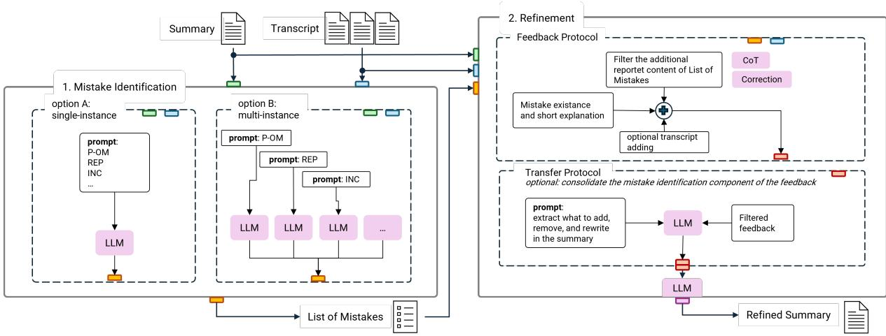
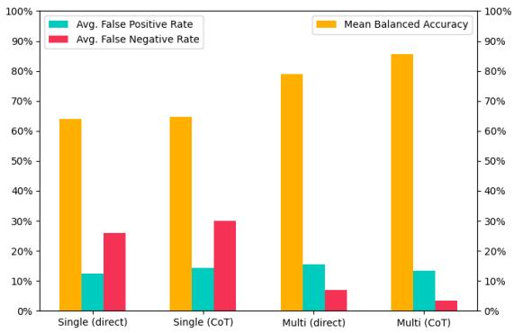
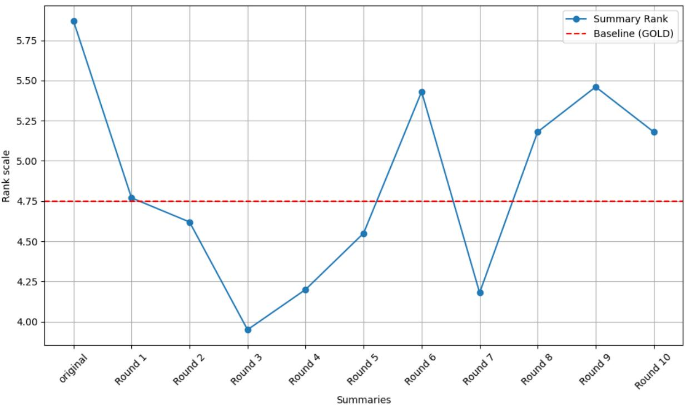
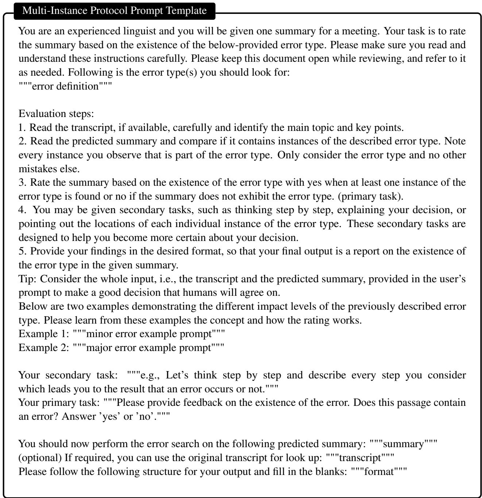
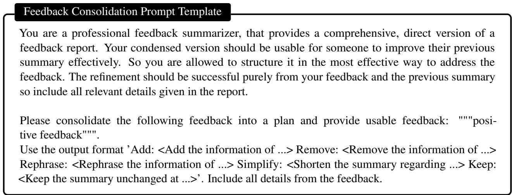
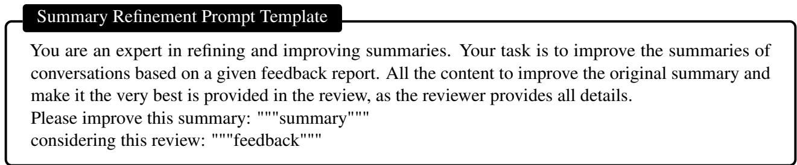
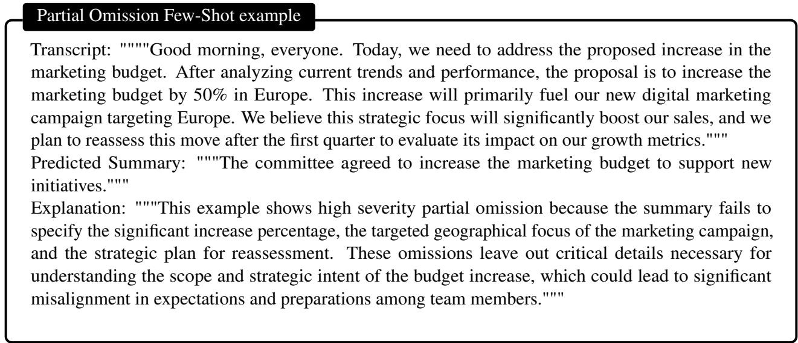
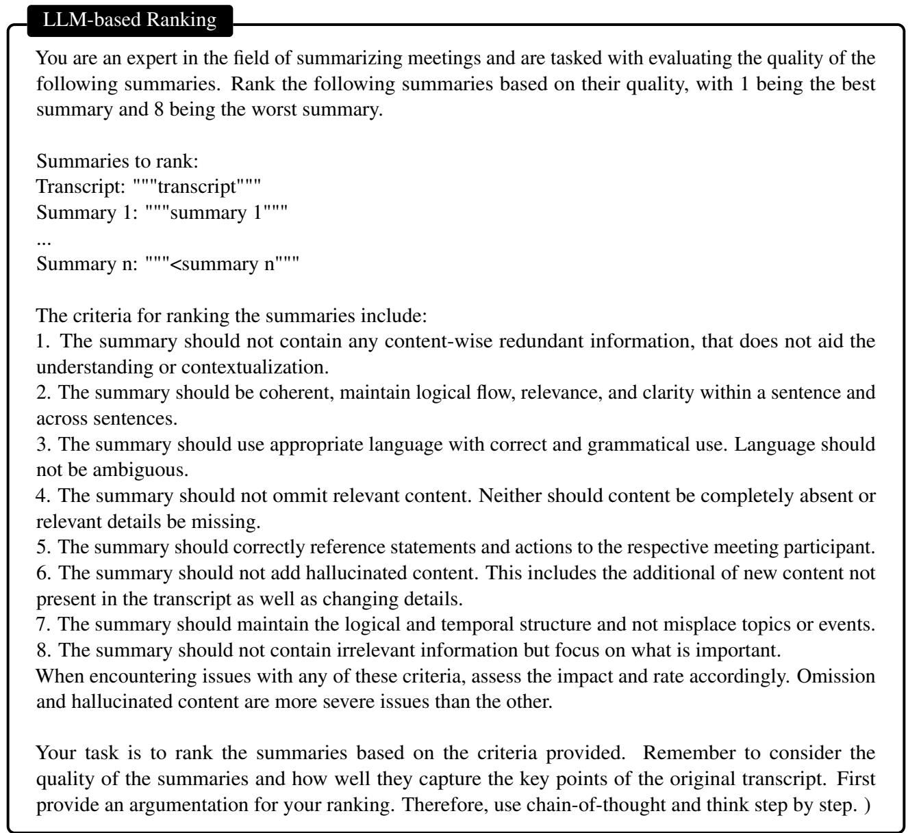
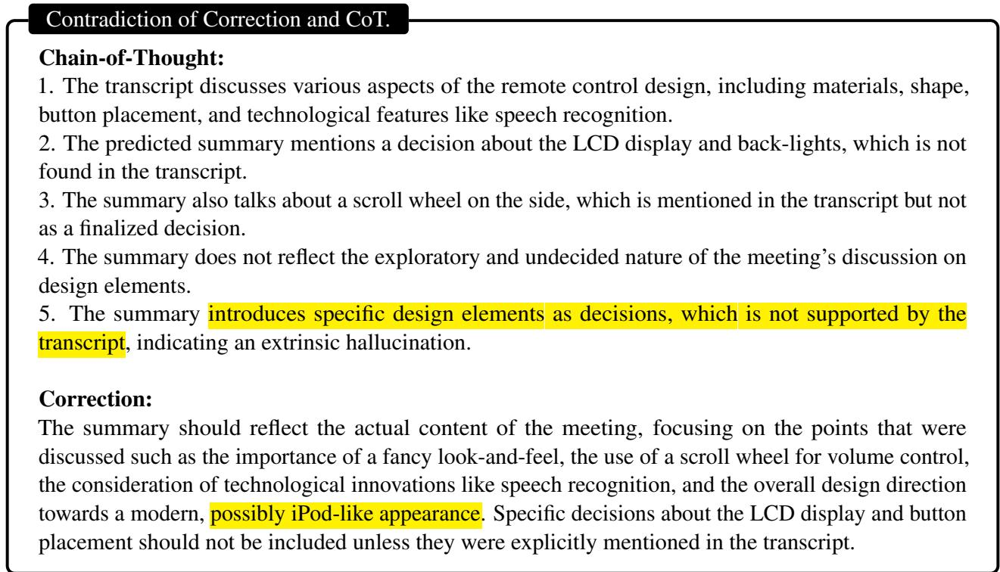

# What’s Wrong? Refining Meeting Summaries with LLM Feedback

Frederic Kirstein1,2, Terry Ruas1, Bela Gipp1 1Georg-August-Universität Göttingen, Germany 2kirstein@gipplab.org

## Abstract

Meeting summarization has become a critical task since digital encounters have become a common practice. Large language models (LLMs) show great potential in summarization, offering enhanced coherence and context understanding compared to traditional methods. However, they still struggle to maintain relevance and avoid hallucination. We introduce a multi-LLM correction approach for meeting summarization using a two-phase process that mimics the human review process: mistake identification and summary refinement. We release QMSum Mistake, a dataset of 200 automatically generated meeting summaries annotated by humans on nine error types, including structural, omission, and irrelevance errors. Our experiments show that these errors can be identified with high accuracy by an LLM. We transform identified mistakes into actionable feedback to improve the quality of a given summary measured by relevance, informativeness, conciseness, and coherence. This post-hoc refinement effectively improves summary quality by leveraging multiple LLMs to validate output quality. Our multi-LLM approach for meeting summarization shows potential for similar complex text generation tasks requiring robustness, action planning, and discussion towards a goal.

## 1 Introduction

Meeting summaries are essential for professional conversations, they serve as a reference for subsequent processes, update absentees, and reinforce the most important topics discussed. The growing importance of summarization systems is evident from the recent release of tools in virtual meeting software (e.g., Zoom1, Microsoft Teams2, Google Meet3). Still, meeting summarization faces challenges, such as handling spoken language idiosyncrasies and identifying salient content (Kirstein et al., 2024a). Existing techniques, like AMRgraphs for capturing speaker relations (Hua et al., 2023), are often tailored to specific backbone models, typically using BART (Lewis et al., 2020), PEGASUS (Zhang et al., 2020a) or their variations. Recent explorations of large language models (LLMs) for meeting summarization reveal their strong capabilities (e.g., high-quality summaries of long inputs) (Laskar et al., 2023). However, these LLM-generated summaries are still errorprone (Kirstein et al., 2024b) and costly to fine-tune (Chauhan et al., 2022; Wang et al., 2022).

The shift to LLMs as backbone models raises the question of how to use their capabilities better and mitigate their weaknesses. (Self-)correction through few-shot prompting improves LLM performance by asking it to review and correct its output (Pan et al., 2023). While successful in various tasks (e.g., question answering (Jiang et al., 2024), reasoning (Madaan et al., 2021), and summarization (Saunders et al., 2022)), self-correction still falls short to identify and correct errors (Huang et al., 2024). To address this, Tyen et al. (2024) propose a multi-LLM refinement process for reasoning tasks leading to a more robust correction approach.

Analogous to how humans iterate over suggestions and edits when writing texts, we explore how LLMs may be employed in the same way to improve meeting summarization in a two-stage approach consisting of mistake identification in an existing summary and a subsequent refinement (Figure 1). For mistake identification, we annotate QMSum (Zhong et al., 2021) on nine error types (e.g., omission, structural mistakes) (Kirstein et al., 2024b; Chang et al., 2024). GPT-4 Turbo4 identifies errors on average with ∼86% accuracy, but it struggles with partial omission (∼76%) and hallucination (∼72%) errors. We achieve the best results on the mistake identification task using multiple

  
Figure 1: Overview of the two-stage refinement protocol displaying the assessed variants. The Mistake Identification block is analyzed Section 4 and the Refinement block in Section 5.

LLM instances for each error type and Chain-of-Thought (CoT) prompting (Wei et al., 2023). In the refinement stage, we use an additional model instance to adjust an erroneous summary based on the detailed feedback from the mistake identification stage. We explore what content a refinement model requires, considering the CoT explanation from the mistake identification task, a correction suggestion, and the original meeting transcript as additional information sources for pointed-out mistakes. We further analyze if the feedback should be passed through an intermediate planning stage that extracts which content to add, remove, or rewrite in a summary. We identify strong quality improvements for refined summaries over the original ones and baselines when using the CoT explanation from the mistake identification as feedback along the erroneous summary without additional processing. Our contributions are summarized as follows:

• QMSum Mistake5, a dataset of 200 meeting summaries and human-annotated errors.

• A multi-LLM approach to finding mistakes in meeting summaries considering different prompting approaches.

• A transformation of identified mistakes into actionable feedback to refine an erroneous summary and derive a refinement protocol.

## 2 Related Work

Meeting Summarization is evolving from leveraging traditional encoder-decoder models to LLMs.

Earlier approaches using BART (Lewis et al., 2020) and PEGASUS (Zhang et al., 2020a) improved on specific challenges like language, structure or comprehension (Kirstein et al., 2024a,b) through tailored techniques (e.g. role vectors for speaker correlation (Asi et al., 2022; Naraki et al., 2022)). Recent studies explore LLMs for meeting summarization using simple prompting techniques (Laskar et al., 2023; Kirstein et al., 2024b), showing comparable performance to specialized models but with improved context comprehension. Our work examines the effectiveness of LLMs as post-processors for summaries, assessing if this approach can achieve high-quality summaries without requiring techniques tailored to a specific challenge of meeting summarization. We compare this approach against original summaries, single-LLM baselines, and human summaries, providing a benchmark for LLMs in meeting summarization. To create QM-Sum Mistake, we extend Kirstein et al. (2024b), refining their error definitions.

Self-correction methods have been extensively studied in recent literature (Pan et al., 2023), including training-time correction strategies like Reinforcement Learning from Human Feedback (RLHF) (Ouyang et al., 2022) and selfimprovement techniques (Huang et al., 2024). Our feedback and refinement method is a post-hoc correction, which is applied to already-generated outputs. Previous post-hoc correction methods, such as Reflexion (Shinn et al., 2023) and RCI (Kim et al., 2023), focus on reasoning errors and often degrade performance without oracle labels (Huang et al., 2024). Our work applies post-processing correction to meeting summarization, focusing on qualitative improvements with independent models, and further explores this to other model families and related summarization domains. Our approach is informed by the two-stage setup of Tyen et al. (2024), which we extend with an extensive mistake identification architecture and a multi-stage refinement.

<table><tr><td>Dataset</td><td># Meetings</td><td># Turns</td><td># Speakers</td><td># Len. of Meet.</td><td># Len. of Gold Sum.</td><td># Len. of Aut. Sum.</td></tr><tr><td>AMI</td><td>124 (113)</td><td>535.6</td><td>4.0</td><td>6007.7</td><td>108.8</td><td>112.4</td></tr><tr><td>ICSI</td><td>52 (42)</td><td>819.0</td><td>6.3</td><td>13317.3</td><td>103.0</td><td>108.2</td></tr><tr><td>WPCP</td><td>24 (14)</td><td>207.7</td><td>34.1</td><td>13761.9</td><td>129.5</td><td>112.9</td></tr><tr><td>QMSum Mistake</td><td>200 (169)</td><td>556.8</td><td>9.2</td><td>9069.8</td><td>109.1</td><td>116.9</td></tr></table>

Table 1: Statistics for the QMSum Mistake dataset. Values are averages of the respective categories. Lengths (Len.) are in number of words. In # Meetings, values in parentheses are the number of erroneous samples.

## 3 QMSum Mistake Dataset

QMSum Mistake consists of 200 samples, including 169 (85%) automatically generated meeting summaries annotated for nine error types (Section 3.1) and 31 error-free summaries serving as controls. The dataset (statistics detailed in Table 1) draws from QMSum’s (Zhong et al., 2021) training and test sets, including AMI (staged business meetings) (Carletta et al., 2005), ICSI (academic meetings) (Janin et al., 2003), and parliament meetings. To generate summaries, we employed both encoderdecoder models (Beltagy et al., 2020), DialogLED (Zhong et al., 2022), PEGASUS-X (Phang et al., 2022)) and LLMs (i.e., GPT-3.5, Phi-3 mini 128k (Abdin et al., 2024)). Encoder-decoder models tend to produce more severe mistakes, such as coreference and structure errors, while LLMs exhibit more subtle errors, such as relevance. All models have a context size of at least 16k to fit the entire meeting in the input, use default settings, and generate up to 200 tokens to match gold summary lengths. Table 8 in Appendix C shows examples of varying summarization styles and quality levels. The generated meetings are annotated by six annotators, with an average Krippendorff’s alpha of 0.780 for interannotator agreement (see Table 5). Details on the annotation process are described in Appendix D, including the complete annotation methodology.

## 3.1 Observable errors

We refine existing error types (Kirstein et al., 2024b; Chang et al., 2024) into nine error types with minimal overlap. Table 2 holds the short definitions. Preliminary testing and annotator feedback inform the refinement of the error types and highlight overlap in error definitions, making a clear distinction difficult. This leads to major adaptations to precisely delimit the repetition, incoherence, structure, and linguistic inaccuracy errors, while the omission errors undergo minor tweaks in wording. Hallucination errors are packed into a single category to reduce overlap for edge cases between these two. The initial observations further indicate that errors so far were designed to capture missing or incorrect information, not the inclusion of unrelated content, which our summarygenerating models tend to generate. Thus, we add the ’Irrelevance’ category.

## 4 Mistake Identification

Table 3 shows $\mathrm { G P T 4 ^ { \circ } s ^ { 6 } }$ balanced accuracy (B-ACC, details in Appendix F) in identifying summarization-related errors (Section 3.1) on the QMSum Mistake dataset. We report B-ACC as the labels are not balanced, e.g., there are more samples containing omission errors than omission-free samples. We chose GPT4 for its context size, understanding capabilities, robustness to handle spoken language, and superior results compared to Gemini (Team et al., 2024) and Phi (Abdin et al., 2024) in early experiments. We provide complementary analysis for other models in Appendix B.

## 4.1 Mistake identification protocol (MIP)

We consider two prompting strategies to identify possible mistakes in a summary: direct and CoT prompting. In direct prompting (Tyen et al., 2024), given the predicted summary and the meeting transcript, when required (see Table 2), the model outputs ’Yes’ or ’No’ for each error to indicate its existence. For CoT prompting (Wei et al., 2023), we extend direct prompting by having the model explain why a passage is erroneous following the ’let’s think step by step’ approach, allowing for detailed analysis of the model’s understanding.

As GPT4 is not specifically trained to identify errors, we enrich the mistake identification prompt with few-shot examples of erroneous summaries (non-overlapping with our test set). The mistake identification prompt consists of four parts: the model role and error definition for context, two few-shot examples of the error type, an optional request for the CoT prompting, and the primary task of reporting the error’s existence. We include more details on the prompt in Appendix D.

<table><tr><td>Error Type</td><td>Transcript</td><td>Definition</td><td>Occurrences</td></tr><tr><td>Redundancy RED</td><td>not required</td><td>The summary contains repeated or redundant information, which does not help the understanding or contextualization.</td><td>160</td></tr><tr><td>Incoherence INC</td><td>not required</td><td>The model generates summaries containing characteristics that dis- rupt the logical flow, relevance, or clarity of content either within a sentence (intra-sentence) or across sentences (inter-sentence).</td><td>148</td></tr><tr><td>Language LAN</td><td>not required</td><td>The model uses inappropriate, incorrect (ungrammatical), or ambigu- ous language or fails to capture unique linguistic styles.</td><td>150</td></tr><tr><td>Omission (partial, total) P-OM, T-OM</td><td>required</td><td>Missing information from the meeting, such as significant decisions or actions. Total omission: Relevant topics and key points are not stated. Partial omission: Salient topics are mentioned but not captured in detail.</td><td>159 (P-OM) 161 (T-OM)</td></tr><tr><td>Coreference COR</td><td>required</td><td>The model fails to resolve a reference to a participant or entity, misattributes statements, or omits necessary mentions.</td><td>153</td></tr><tr><td>Hallucination HAL</td><td>required</td><td>The model produces inconsistencies not aligned with the meeting content. Intrinsic: Misrepresents information from the transcript.</td><td>143</td></tr><tr><td>Structure STR</td><td>required</td><td>Extrinsic: Introduces content not present in the transcript. The model misrepresents the order or logic of the meeting&#x27;s dis- course, misplacing topics or events.</td><td>145</td></tr><tr><td>Irrelevance IRR</td><td>required</td><td>The summary includes information that is unrelated or not central to the main topics or objectives of the meeting</td><td>137</td></tr></table>

Table 2: Definition of the nine error types annotated in QMSum Mistake based on existing error types (Kirstein et al., 2024b; Chang et al., 2024), with the number of occurrences for each error type.

We consider two setups to explore the MIP: a single-instance of GPT4 asked to detect all error types at once (Zhang et al., 2023) and a multiinstance architecture (Mousavi et al., 2023) using one GPT4 instance for each error type.

## 4.2 Mistake identification discussion

While both setups achieve high B-ACC, the singleinstance setup struggles more on the whole dataset. Overall, this aligns with the hypothesis behind current LLM-based automatic metrics that leverage similar models to assess text characteristics such as fluency, readability, or clarity (Li et al., 2024).

Impact of mistake identification protocol on B-ACC of error detection. Comparing the four MIP variants’ results (Table 3a) reveals that multiinstance setups significantly outperform singleinstance approaches in error detection across all error types. While the difference between single and multi-instance is comparably small (∼ 7%) for both omission error types (T-OM, P-OM), the

B-ACC can deviate by up to ∼31% for HAL.

Figure 2 shows that the average B-ACC gain across all error types is at least 15% for multiinstance setups, aligning with recent studies (Huang et al., 2024; Tyen et al., 2024). Notably, the average false negative rate decreases by ∼27% from single (CoT) (30.0%) to multi (CoT) (3.4%).

The weaker single-model performance likely stems from challenges in processing long dependencies and contextualizing extended content (Lee et al., 2021), which need to be handled together with the identification of all error types. While multi-instance setups benefit from CoT prompting, single-model approaches show increased false negative rates with CoT. The CoT explanations showing inconsistency in assessing error types due to definition misunderstanding support these findings.

In multi-instance approaches, CoT prompting further improves B-ACC to nearly 90%. Although CoT explanations may contain errors, the resulting error detection is often correct, which is also observed in tasks such as sorting (Tyen et al., 2024).

The consistent average false positive rate (12.4% to 15.4%) across all MIPs (Figure 2) suggests model oversensitivity to certain error types. Analyzing the B-ACC change between the whole dataset (Table 3a) and the erroneous subset (Table 3b) we find that GPT tends to falsely flag T-OM,

<table><tr><td colspan="3">single-instance</td><td colspan="2">multi-instance</td></tr><tr><td>Error</td><td>direct</td><td>CoT</td><td>direct</td><td>CoT</td></tr><tr><td>P-OM</td><td>63.7</td><td>63.3</td><td>72.2</td><td>75.8</td></tr><tr><td>T-OM</td><td>67.8</td><td>76.6</td><td>85.8</td><td>90.4</td></tr><tr><td>REP</td><td>72.2</td><td>71.6</td><td>92.1</td><td>96.0</td></tr><tr><td>INC</td><td>69.5</td><td>63.3</td><td>82.4</td><td>89.9</td></tr><tr><td>COR</td><td>73.8</td><td>59.2</td><td>83.8 73.5</td><td>90.1</td></tr><tr><td>HAL</td><td>42.5</td><td>59.0</td><td></td><td>72.3</td></tr><tr><td>LAN</td><td>58.4</td><td>65.9</td><td>76.6</td><td>88.6</td></tr><tr><td>STR</td><td>71.0</td><td>63.4</td><td>68.6</td><td>87.4</td></tr><tr><td>IRR</td><td>57.2</td><td>59.2</td><td>76.3</td><td>80.7</td></tr></table>

(a) Results on the whole QMSum Mistake dataset.

<table><tr><td colspan="3">single-instance</td><td colspan="2">multi-instance</td></tr><tr><td>Error</td><td>Direct</td><td>CoT</td><td>Direct</td><td>CoT</td></tr><tr><td>P-OM</td><td>68.6</td><td>66.0</td><td>90.0</td><td>92.6</td></tr><tr><td>T-OM</td><td>72.7</td><td>82.0</td><td>91.4</td><td>90.1</td></tr><tr><td>REP</td><td>70.4</td><td>68.5</td><td>89.8</td><td>93.7</td></tr><tr><td>INC</td><td>67.0</td><td>59.5</td><td>79.9</td><td>88.5</td></tr><tr><td>COR</td><td>72.2</td><td>55.9</td><td>83.0</td><td>87.0</td></tr><tr><td>HAL</td><td>58.2</td><td>60.9</td><td>75.7</td><td>75.3</td></tr><tr><td>LAN</td><td>62.0</td><td>64.2</td><td>75.8</td><td>82.1</td></tr><tr><td>STR</td><td>66.4</td><td>58.7</td><td>69.1</td><td>89.5</td></tr><tr><td>IRR</td><td>61.2</td><td>57.1</td><td>76.9</td><td>79.9</td></tr></table>

(b) Results on the erroneous samples of QMSum Mistake.

Table 3: Mistake identification accuracy of GPT4 for all MIP variants. The best values are bold.  
  
Figure 2: Average mistake identification accuracy, false positive and false negative rates for each MIP variant. For accuracy, a higher score is better. For the false positive/negative rate, lower is better.

P-OM, STR, HAL, and IRR errors, indicating that content-richer summaries are expected.

In conclusion, mistake identification is most reliable with the multi-instance setup with CoT prompting, hence, it is for subsequent experiments.

Difficulties in identifying errors. Based on the best MIP’s B-ACC, we categorize errors into three groups: reliable (≥ 90.0%: COR, REP, T-OM), good (≥ 85.0%: INC, LAN, STR), and hard to detect (<85.0%: P-OM, IRR, HAL). An analysis of the models’ CoT explanations reveals patterns in detection difficulties and possible reasons7:

The error types from the reliable group have descriptions close to how an LLM without access to our definitions would generate as a definition. B-ACC decreases occur rarely due to oversensitivity, such as assigning T-OM errors when expecting more details, indicating a too strict application of detection rules. False COR identifications arise in less structured conversations where multiple participants mention similar information.

Good group errors suffer from the model’s tendency to apply definitions too strictly compared to human annotators as they fail to contextualize them properly. As such, STR errors may be falsely flagged for linear summaries that do not preserve identical structures. LAN errors can misidentify domain-specific terms (e.g., ’grad student’ in ICSI) as mistakes and struggle with fragmented language, particularly during brainstorming.

Hard group errors challenge the model’s understanding of the error type. HAL detection occasionally looks for related errors (e.g., T-OM, COR), leading to false detection. P-OM and IRR struggle due to the inherent subjectivity, which we also see in slightly lower inter-annotator agreement scores during the QMSum Mistake annotation (Table 5).

In conclusion, GPT4 applies error definitions slightly too strictly, and the model’s heuristic influences mistakes related to subjectivity.

## 5 Summary Refinement

Building on the finding that an LLM can identify typical meeting summarization errors (Section 4.2), we analyze how the quality of original predicted summaries changes when an LLM refines them based on identified mistakes. Our multimodel refinement approach mimics a four-stage human review process to form a refinement protocol (Figure 1): (1) locating errors using the bestperforming MIP, (2) generating feedback on identified errors (feedback protocol), (3) structuring feedback (transfer protocol), and (4) refinement.

## 5.1 Feedback protocol (FP)

Feedback on an error can range from pointing out its existence, similar to someone highlighting a text passage and leaving a short comment, to in-depth explanations of what is wrong with the marked passage and rewrite suggestions. Following this analogy, our feedback protocol consists of an essential and an additional detail part. The essential part includes minimal feedback on the existence of an error type and a short explanation about why and where it was detected, but may not mention all error instances. The additional detail part considers three optional information sources: CoT explanation (Wei et al., 2023), correction suggestion (Zhang et al., 2023), and the original transcript. CoT explanation, the output of MIP’s CoT prompting (Section 4.1), contains all observed error instances and details on why they are considered errors. It helps the refinement model derive a rewriting plan through detailed, structured information but may lead to confusion if the reasoning is wrong (Tyen et al., 2024). Correction suggestions provide examples of how to correct the error, either as tips or precise rewrites that can be directly applied. The transcript provides all available information in its original form, allowing it to decide whether to accept or reject the feedback and how to integrate it. The three optional information sources can be combined, determining how much information is required and if feedback without a transcript is as informative as adding the transcript for lookup.

## 5.2 Transfer protocol (TP)

We consider two approaches for structuring feedback for the refinement model: direct feedback (Mousavi et al., 2023) and consolidation (Zhang et al., 2023). Direct feedback transfers feedback derived from the error-identifying model without additional processing, stating observed and unobserved errors. CoT explanation informs the model step-by-step which sentences are erroneous or errorfree, why they are correct or incorrect, and what should be changed (or kept) to have a correct summary. Eventually, the refinement model is tasked to identify actions suggested in the feedback and apply these to the original summary if found applicable. For consolidation, we use an additional LLM to extract essential information from the feedback. The intermediate LLM derives what should be added, removed, or altered from the original summary from these essential parts. The consolidation protocol does not affect an appended transcript.

## 5.3 Experimental setup

We refine the erroneous summaries from QMSum Mistake using each refinement protocol variant with the multi-instance CoT MIP. GPT4 is the backbone model for the refiner and optional intermediate LLM to consolidate feedback, with other model families being explored in Appendix B. Our experiment focuses on evaluating summary quality changes based on feedback and shows a setup for a meeting summarization refinement protocol. We consider a one-shot improvement here and provide insights on multi-round improvement in Appendix B.3. To help understand and categorize the quality changes, we report metric results for the original erroneous summaries (ORIG), errorfree QMSum gold summaries (GOLD), summaries generated by one GPT4 (GPT-S), and summaries refined by one GPT4 (GPT-R)8 as references in Table 4.

## 5.4 Evaluation approach

Our main experiments employ the LLM-based metric AUTOCALIBRATE (Liu et al., 2023) to report Likert scores on relevance (REL), informativeness (INF), conciseness (CON), and coherence (COH). We choose this metric as traditional metrics often struggle to capture nuanced quality changes, and AUTOCALIBRATE’s prompts for individual scores broadly cover our error types. Although not specifically designed for meeting summarization, our analysis shows AUTOCALIBRATE achieves an 89.1% average accuracy indicating its viability as a quality proxy. To ensure reliability, we manually verify every fourth score tuple and model reasoning, with three-annotator ratings implemented for any misalignments. As AUTOCALIBRATE does not assess omission, hallucination, and repetition, we also employ a GPT4-based ranking system based on our observable errors from Section 3.1 (see Appendix D for prompt details), achieving 92.1% accuracy with human annotations (interannotator agreement: 0.784 Krippendorff’s alpha). Extended evaluation details are provided in Appendix E.2.

## 5.5 Quantitative discussion

Table 4 presents the overall ranking and Likert scores for each refinement protocol. ORIG summaries consistently rank and score lowest, indicating that refinement generally positively influences quality. Overall, the MIP feedback with CoT explanations significantly improves ORIG summaries, approaching human-level quality. Correction suggestion is a promising alternative to CoT explanation as FP, achieving comparable quality ratings.

<table><tr><td>TP</td><td>FP</td><td>Overall (Ranking ↓)</td><td>REL (Likert ↑)</td><td>INF (Likert ↑)</td><td>CON (Likert ↑)</td><td>COH (Likert ↑)</td></tr><tr><td rowspan="8">direct</td><td>essential only</td><td>5.44</td><td>3.08</td><td>2.99</td><td>3.29</td><td>3.14</td></tr><tr><td>CoT</td><td>3.75</td><td>3.10</td><td>3.14</td><td>3.46</td><td>3.20</td></tr><tr><td>Cor</td><td>3.79</td><td>3.04</td><td>2.83</td><td>3.57</td><td>3.23</td></tr><tr><td>CoT+Cor</td><td>4.11</td><td>3.11</td><td>2.88</td><td>3.40</td><td>3.09</td></tr><tr><td>Tra</td><td>4.68</td><td>3.12</td><td>2.93</td><td>3.65</td><td>3.37</td></tr><tr><td>Tra + CoT</td><td>4.74</td><td>3.14</td><td>3.36</td><td>3.67</td><td>3.56</td></tr><tr><td>Tra + Cor</td><td>4.93</td><td>3.10</td><td>3.14</td><td>3.68</td><td>3.44</td></tr><tr><td>CoT+Cor+Tra</td><td>5.10</td><td>3.05</td><td>3.05</td><td>3.43</td><td>3.18</td></tr><tr><td rowspan="8">consolidated</td><td>essential only</td><td>6.10</td><td>2.53</td><td>2.27</td><td>2.58</td><td>2.36</td></tr><tr><td>CoT</td><td>5.61</td><td>2.69</td><td>2.62</td><td>2.99</td><td>2.70</td></tr><tr><td>Cor</td><td>6.07</td><td>2.96</td><td>2.85</td><td>3.22</td><td>2.98</td></tr><tr><td>CoT+Cor</td><td>6.40</td><td>2.93</td><td>2.92</td><td>3.34</td><td>3.03</td></tr><tr><td>Tra</td><td>4.86</td><td>3.08</td><td>3.12</td><td>3.50</td><td>3.33</td></tr><tr><td>Tra + CoT</td><td>4.89</td><td>3.04</td><td>3.05</td><td>3.49</td><td>3.22</td></tr><tr><td>Tra + Cor</td><td>4.88</td><td>3.11</td><td>3.29</td><td>3.60</td><td>3.59</td></tr><tr><td>CoT+Cor+Tra</td><td>4.92</td><td>3.21</td><td>3.18</td><td>3.70</td><td>3.46</td></tr><tr><td rowspan="4"></td><td>GOLD</td><td>4.04</td><td>3.08</td><td>3.05</td><td>3.53</td><td>3.21</td></tr><tr><td>ORIG</td><td>6.75</td><td>2.28</td><td>2.15</td><td>2.41</td><td>2.22</td></tr><tr><td>GPT-S</td><td>4.84</td><td>3.00</td><td>3.00</td><td>3.40</td><td>3.10</td></tr><tr><td>GPT-R</td><td>4.82</td><td>3.09</td><td>3.09</td><td>3.72</td><td>3.44</td></tr></table>

Table 4: Quality reporting of refined summaries for all Transcript Protocols (TP) and Feedback Protocols (FP) combinations (CoT = CoT explanation, Cor = correction, Tra = Transcript). Ranking is the average ranking across all samples. Lower ranking scores indicate higher preference (1 (always preferred) to 20 (always disliked)). REL, INF, CON, COH are the AUTOCALIBRATE Likert scores on relevance, informativeness, conciseness, and coherence using a 5-step Likert scale (1 (worst) to 5 (best)). Best scores per TP are bold, best scores overall are underlined.

Providing only essential feedback is insufficient for correction. Providing only essential feedback in the FP results in modest improvements in ranking and Likert scores for both TPs compared to ORIG summaries. However, these scores fall behind most protocol variants utilizing additional information. We derive that even high-level error detection contributes to quality improvement, but the minimal explanation does not capture all error instances and fails to provide precise reasoning.

Direct TP performs best with either CoT or correction. In the direct TP approach, CoT explanation and correction methods achieve higher rankings (avg. ranks ∼3.75) compared to GPT-S summaries (avg. rank 4.84), nearly matching GOLD summaries (avg. rank 4.04). While CoT explanation and correction-based refinements outperform transcript-based refinements in overall ranking (avg. rank 4.68 to 5.10), they achieve lower Likert scores, which seems counter-intuitive. This discrepancy is explained by the metrics’ reasoning, revealing that transcript-based refinement suffers from repetitions, poor topic separation, and lack of depth. We hypothesize that cross-checking errors with the transcript may confuse the model due to content repetition and noise in the form of unnecessary details. CoT explanation and correction appear as a lean alternative containing relevant information for quality improvement. Combining CoT explanation and correction leads to rank degradation (avg. rank 5.1 with transcript, 4.11 without) compared to their individual performances (avg. rank ∼3.75). This decline can be attributed to content repetition when reasoning and correction are used, and contradictions between both lead to the inclusion of incorrect information (exemplified in Figure 9).

Compression of error information in consolidated TP impacts performance. In the consolidation TP approach, FPs without transcripts show minimal improvement over the essential-only part (avg. rank 5.61-6.40). Transcript-using variants perform similarly to their direct TP counterparts but with rankings and scores more closely aligned to GPT-R results. This suggests that consolidated feedback has less impact on refinement than direct feedback, with the model relying more on the transcript for summary rewriting than on the feedback. Non-transcript approaches often lack detail and conciseness (e.g., CON scores ∼0.47 points lower), as revealed by the metrics’ explanations.

We derive that the consolidated approach, effective for short news summarization (Zhang et al., 2023), struggles with highly erroneous texts due to overcompression of error information, hindering the refinement model’s comprehension.

## 5.6 Qualitative discussion

Following, we present qualitative changes between our system (using direct TP with CoT as reference), GPT-S, and GPT-R for both low and high-quality original summaries (examples shown in Table 10). We observe that by capturing and correcting more errors compared to single-model methods, our approach produces summaries that more closely align with reader expectations and substantially improves summary quality and usefulness.

The feedback and refinement approach produces summaries with more depth and informativeness. While all model variants generate fluent summaries, those produced by GPT-S or GPT-R without guidance tend to provide only high-level overviews. In contrast, summaries refined through our system offer more comprehensive and detailed information, as captured in the better ranks in Table 4, making them valuable resources even for those who did not attend the meeting.

The two-stage approach corrects more errors in the final summaries. While GPT4-S can produce good high-level summaries, it often introduces hallucinations, omissions, and structural misrepresentations. GPT4-R, delivering more information-rich summaries, struggles to simultaneously identify errors, retrieve corrections, and apply them effectively. Our two-stage process overcomes these challenges by focusing on specific, reported errors, removing irrelevant content (e.g., who gave their personal preference), adding clarifying details (e.g., the target user group), and improving structure through reformulation and reordering. We note that the performance of the feedback model transfers to the refinement model, as the latter only addresses issues identified by the first. Without transcript access, the refiner relies fully on the provided feedback, potentially propagating detection errors, as it misses the ability to verify the validity. Overall, the two-stage process leads to more comprehensive error capture and correction, enhancing summary quality and user experience.

The extent of rewrites depends on input summary quality. High-quality summaries undergo minimal changes, primarily rewording, while lower-quality summaries with missing details, hallucinations, or poor meeting representation receive more extensive revisions, including structural changes and significant detail additions. Notably, the refinement LLM does not rewrite summaries from scratch but maintains the original’s overall structure. Our two-stage pipeline preserves more of the initial summary than GPT-R, demonstrating its ability to retain valuable content while making necessary improvements.

## 6 Final Considerations

In this paper, we investigated GPT4’s ability to find mistakes in a given meeting summary and refine them accordingly. We found that GPT4 achieves a high accuracy of ∼86% on average, measured against human labels, in identifying typical mistakes (e.g., repetition of content) when using a dedicated model instance paired with CoT prompting to identify individual errors. However, it struggles to identify similar and subjective errors, such as hallucination (72.3% acc.), omission (75.8% ACC.), and irrelevance (80.7% acc.). We showed strong evidence that a dedicated LLM can refine a summary based on identified errors. By providing a CoT explanation for each error type containing reasoning why and where an error was observed, we significantly improve the quality of relevance, informativeness, conciseness, and coherence. These refined summaries are comparable in quality with error-free gold summaries. Our post hoc refinement approach can be applied to refine meeting summaries generated by traditional models and LLMs and marks an early entry into methods that allow the full potential of LLMs for meeting summarization. We leave the development of more sophisticated refinement protocols, e.g., using multi-agent discussion, and the application of our multi-LLM approach to similar complex text generation tasks (e.g., story writing to reflect on given setting) and real-world applications (e.g., assisting LLM agents to check the outcome to a task) to future work. We release QMSum Mistake to encourage research on refinement.

## Acknowledgements

This work was supported by the Lower Saxony Ministry of Science and Culture and the VW Foundation. Frederic Kirstein was supported by the Mercedes-Benz AG Research and Development.

## Potential Impact

The multi-LLM approach proposed here, influenced by psychological observations on productivity and collaboration, exemplifies how other academic fields can inform NLP research (Wahle et al., 2023b). This work demonstrates the potential for enhancing complex text generation tasks requiring robust output such as machine translation (Feng et al., 2024), reasoning (Kalyanpur et al., 2024), question answering (Kim et al., 2024), or paraphrasing (Becker et al., 2023; Wahle et al., 2023a), that may benefit from an output-challenging system that assesses content alignment. By incorporating multi-LLM strategies and personalization, we open new avenues for improving NLP outputs across various applications, underscoring the value of interdisciplinary approaches in advancing NLP technologies and their real-world applicability.

## Limitations

Although our proposed QMSum Mistake might seem small (i.e., 200 samples), its size is comparable to the original general summaries of the QM-Sum dataset (i.e., 232 samples). We contribute to extending the original dataset with careful human error annotations for almost all examples available.

Another possible limitation in our work is the use of only GPT4 in our main experiments. We chose GPT4 because of its large context size (e.g., 128k tokens) and better initial results in identifying errors. Evaluating and error annotation and refinement for multiple models by humans would be time-consuming and financially unfeasible. However, we report the detailed results in Appendix B to provide insights on other language families and different models (e.g., Phi (Abdin et al., 2024), Gemini (Team et al., 2024)) considered in our study. We evaluate their performance on mistake identification and quality changes when refining a summary.

We acknowledge bias as a general challenge in both LLM and human judgment. We observe that our precise error types led to fewer "understanding deviations" in error identification and summary ranking. However, given AUTOCALIBRATE’s accuracy and correlation scores, we consider it a sufficient proxy for our evaluation.

## Ethics Statement and Broader Impact

Our research abides by ethical guidelines for AI research and is committed to privacy, confidentiality, and intellectual property rights. We have ensured that the datasets in our study, which are publicly available, do not house sensitive or personal details. While our study leverages existing resources and generative models, it’s important to note that these models can possess biases and may occasionally generate summaries with distortions, biases, or inappropriate content. We have configured our models to omit potentially harmful or unsafe content to counteract this. While our research aims to enhance meeting summarization to benefit communication and productivity across sectors, we’re acutely aware of the ethical challenges posed by AI in this domain. Meeting summarization models must be wielded with respect to privacy and consent, especially when processing sensitive or confidential material. It’s paramount that these models neither violate privacy nor perpetuate harmful biases. As the field evolves, we stress the importance of maintaining these ethical considerations and encourage fellow researchers to uphold them, ensuring that AI advancements in meeting summarization are both beneficial and ethically grounded. An integral aspect of our ethical commitment is reflected in our approach to annotator recruitment and management. The team of annotators, consisting of interns, student assistants, and doctoral students, was meticulously selected through internal channels. This strategy was chosen to uphold a high standard of annotation quality—a quality we found challenging to guarantee through external platforms such as Amazon Mechanical Turk. Ensuring fair compensation, these annotators were reimbursed in accordance with institutional guidelines for their respective positions. Further, flexibility in the annotation process was also a priority. Annotators were free to choose their working times and environments to prevent fatigue from affecting their judgment.

## References

Marah Abdin, Sam Ade Jacobs, and Ammar Ahmad Awan. 2024. Phi-3 Technical Report: A Highly Capable Language Model Locally on Your Phone. Preprint, arxiv:2404.14219.

Abedelkadir Asi, Song Wang, Roy Eisenstadt, Dean Geckt, Yarin Kuper, Yi Mao, and Royi Ronen. 2022. An End-to-End Dialogue Summarization System for Sales Calls. In Proceedings ofthe 2022 Conference of the North American Chapter of the Association for Computational Linguistics: Human Language Technologies: Industry Track, pages 45–53, Hybrid:

Seattle, Washington + Online. Association for Computational Linguistics.

Jonas Becker, Jan Philip Wahle, Terry Ruas, and Bela Gipp. 2023. Paraphrase Detection: Human vs. Machine Content. Preprint, arXiv:2303.13989.

Iz Beltagy, Matthew E. Peters, and Arman Cohan. 2020. Longformer: The Long-Document Transformer. https://arxiv.org/abs/2004.05150v2.

Jean Carletta, Wessel Kraaij, Simone Ashby, Sebastien Bourban, Michael Flynn, M. Guillemot, T. Hain, J. Kadlec, V. Karaiskos, M. Kronenthal, G. Lathoud, Michael Lincoln, A. Lisowska, W. Post, D. Reidsma, P. Wellner, and L. McCowan. 2005. The AMI Meeting Corpus. Proceedings of Symposium on Annotating and Measuring Meeting Behavior.

Yapei Chang, Kyle Lo, Tanya Goyal, and Mohit Iyyer. 2024. BooookScore: A systematic exploration of book-length summarization in the era of LLMs. Preprint, arxiv:2310.00785.

Vipul Chauhan, Prasenjeet Roy, Lipika Dey, and Tushar Goel. 2022. TCS\_WITM\_2022 @ DialogSum : Topic oriented Summarization using Transformer based Encoder Decoder Model. In Proceedings of the 15th International Conference on Natural Language Generation: Generation Challenges, pages 104–109, Waterville, Maine, USA and virtual meeting. Association for Computational Linguistics.

Zhaopeng Feng, Yan Zhang, Hao Li, Bei Wu, Jiayu Liao, Wenqiang Liu, Jun Lang, Yang Feng, Jian Wu, and Zuozhu Liu. 2024. TEaR: Improving LLMbased Machine Translation with Systematic Self-Refinement. Preprint, arXiv:2402.16379.

Yilun Hua, Zhaoyuan Deng, and Kathleen McKeown. 2023. Improving Long Dialogue Summarization with Semantic Graph Representation. In Findings of the Associationfor Computational Linguistics: ACL 2023, pages 13851–13883, Toronto, Canada. Association for Computational Linguistics.

Jie Huang, Xinyun Chen, Swaroop Mishra, Huaixiu Steven Zheng, Adams Wei Yu, Xinying Song, and Denny Zhou. 2024. Large Language Models Cannot Self-Correct Reasoning Yet. Preprint, arxiv:2310.01798.

Maor Ivgi, Uri Shaham, and Jonathan Berant. 2022. Efficient Long-Text Understanding with Short-Text Models. Preprint, arXiv:2208.00748.

A. Janin, D. Baron, J. Edwards, D. Ellis, D. Gelbart, N. Morgan, B. Peskin, T. Pfau, E. Shriberg, A. Stolcke, and C. Wooters. 2003. The ICSI Meeting Corpus. In 2003 IEEE International Conference on Acoustics, Speech, and Signal Processing, 2003. Proceedings. (ICASSP ’03)., volume 1, pages I–I.

Dongwei Jiang, Jingyu Zhang, Orion Weller, Nathaniel Weir, Benjamin Van Durme, and Daniel Khashabi. 2024. SELF-[IN]CORRECT: LLMs Struggle with

Refining Self-Generated Responses. Preprint, arxiv:2404.04298.

Aditya Kalyanpur, Kailash Saravanakumar, Victor Barres, Jennifer Chu-Carroll, David Melville, and David Ferrucci. 2024. LLM-ARC: Enhancing LLMs with an Automated Reasoning Critic. Preprint, arXiv:2406.17663.

Geunwoo Kim, Pierre Baldi, and Stephen McAleer. 2023. Language Models can Solve Computer Tasks. Preprint, arxiv:2303.17491.

Jaehyung Kim, Dongyoung Kim, and Yiming Yang. 2024. Learning to Correct for QA Reasoning with Black-box LLMs. Preprint, arXiv:2406.18695.

Frederic Kirstein, Jan Philip Wahle, Bela Gipp, and Terry Ruas. 2024a. CADS: A Systematic Literature Review on the Challenges of Abstractive Dialogue Summarization. Preprint, arxiv:2406.07494.

Frederic Kirstein, Jan Philip Wahle, Terry Ruas, and Bela Gipp. 2024b. What’s under the hood: Investigating Automatic Metrics on Meeting Summarization. https://arxiv.org/abs/2404.11124v1.

Md Tahmid Rahman Laskar, Xue-Yong Fu, Cheng Chen, and Shashi Bhushan Tn. 2023. Building Real-World Meeting Summarization Systems using Large Language Models: A Practical Perspective. In Proceedings ofthe 2023 Conference on Empirical Methods in Natural Language Processing: Industry Track, pages 343–352, Singapore. Association for Computational Linguistics.

Kahyun Lee, Mehmet Kayaalp, Sam Henry, and Özlem Uzuner. 2021. A Context-Enhanced Deidentification System. ACM Transactions on Computingfor Healthcare, 3(1):6:1–6:14.

Mike Lewis, Yinhan Liu, Naman Goyal, Marjan Ghazvininejad, Abdelrahman Mohamed, Omer Levy, Veselin Stoyanov, and Luke Zettlemoyer. 2020. BART: Denoising Sequence-to-Sequence Pretraining for Natural Language Generation, Translation, and Comprehension. In Proceedings ofthe 58th Annual Meeting ofthe Associationfor Computational Linguistics, pages 7871–7880, Online. Association for Computational Linguistics.

Zhen Li, Xiaohan Xu, Tao Shen, Can Xu, Jia-Chen Gu, and Chongyang Tao. 2024. Leveraging Large Language Models for NLG Evaluation: A Survey. Preprint, arxiv:2401.07103.

Chin-Yew Lin. 2004. ROUGE: A Package for Automatic Evaluation of Summaries. In Text Summarization Branches Out, pages 74–81, Barcelona, Spain. Association for Computational Linguistics.

Yuxuan Liu, Tianchi Yang, Shaohan Huang, Zihan Zhang, Haizhen Huang, Furu Wei, Weiwei Deng, Feng Sun, and Qi Zhang. 2023. Calibrating LLM-Based Evaluator. Preprint, arxiv:2309.13308.

Aman Madaan, Niket Tandon, Dheeraj Rajagopal, Peter Clark, Yiming Yang, and Eduard Hovy. 2021. Think about it! Improving defeasible reasoning by first modeling the question scenario. In Proceedings of the 2021 Conference on Empirical Methods in Natural Language Processing, pages 6291–6310, Online and Punta Cana, Dominican Republic. Association for Computational Linguistics.

Sajad Mousavi, Ricardo Luna Gutierrez, Desik Rengarajan, Vineet Gundecha, Ashwin Ramesh Babu, Avisek Naug, Antonio Guillen, and Soumyendu Sarkar. 2023. N-CRITICS: Self-Refinement of Large Language Models with Ensemble of Critics.

Yuji Naraki, Tetsuya Sakai, and Yoshihiko Hayashi. 2022. Evaluating the Effects of Embedding with Speaker Identity Information in Dialogue Summarization. In Proceedings of the Thirteenth Language Resources and Evaluation Conference, pages 298–304, Marseille, France. European Language Resources Association.

Long Ouyang, Jeff Wu, Xu Jiang, Diogo Almeida, Carroll L. Wainwright, Pamela Mishkin, Chong Zhang, Sandhini Agarwal, Katarina Slama, Alex Ray, John Schulman, Jacob Hilton, Fraser Kelton, Luke Miller, Maddie Simens, Amanda Askell, Peter Welinder, Paul Christiano, Jan Leike, and Ryan Lowe. 2022. Training language models to follow instructions with human feedback. Preprint, arxiv:2203.02155.

Liangming Pan, Michael Saxon, Wenda Xu, Deepak Nathani, Xinyi Wang, and William Yang Wang. 2023. Automatically Correcting Large Language Models: Surveying the landscape of diverse self-correction strategies. Preprint, arxiv:2308.03188.

Jason Phang, Yao Zhao, and Peter J. Liu. 2022. Investigating Efficiently Extending Transformers for Long Input Summarization. Preprint, arxiv:2208.04347.

William Saunders, Catherine Yeh, Jeff Wu, Steven Bills, Long Ouyang, Jonathan Ward, and Jan Leike. 2022. Self-critiquing models for assisting human evaluators. Preprint, arxiv:2206.05802.

Noah Shinn, Federico Cassano, Edward Berman, Ashwin Gopinath, Karthik Narasimhan, and Shunyu Yao. 2023. Reflexion: Language Agents with Verbal Reinforcement Learning. Preprint, arxiv:2303.11366.

Gemini Team, Machel Reid, Nikolay Savinov, Denis Teplyashin, Dmitry, Lepikhin, and Timothy Lillicrap. 2024. Gemini 1.5: Unlocking multimodal understanding across millions of tokens of context. Preprint, arxiv:2403.05530.

Gladys Tyen, Hassan Mansoor, Victor Carbune, Peter˘ Chen, and Tony Mak. 2024. LLMs cannot find reasoning errors, but can correct them given the error location. Preprint, arxiv:2311.08516.

Jan Philip Wahle, Bela Gipp, and Terry Ruas. 2023a. Paraphrase Types for Generation and Detection. In Proceedings of the 2023 Conference on Empirical

Methods in Natural Language Processing, pages 12148–12164, Singapore. Association for Computational Linguistics.

Jan Philip Wahle, Terry Ruas, Mohamed Abdalla, Bela Gipp, and Saif Mohammad. 2023b. We are Who We Cite: Bridges of Influence Between Natural Language Processing and Other Academic Fields. In Proceedings ofthe 2023 Conference on Empirical Methods in Natural Language Processing, pages 12896– 12913, Singapore. Association for Computational Linguistics.

Bin Wang, Chen Zhang, Yan Zhang, Yiming Chen, and Haizhou Li. 2022. Analyzing and Evaluating Faithfulness in Dialogue Summarization. In Proceedings ofthe 2022 Conference on Empirical Methods in Natural Language Processing, pages 4897–4908, Abu Dhabi, United Arab Emirates. Association for Computational Linguistics.

Jason Wei, Xuezhi Wang, Dale Schuurmans, Maarten Bosma, Brian Ichter, Fei Xia, Ed Chi, Quoc Le, and Denny Zhou. 2023. Chain-of-Thought Prompting Elicits Reasoning in Large Language Models. Preprint, arxiv:2201.11903.

Haopeng Zhang, Xiao Liu, and Jiawei Zhang. 2023. SummIt: Iterative Text Summarization via ChatGPT. Preprint, arxiv:2305.14835.

Jingqing Zhang, Yao Zhao, Mohammad Saleh, and Peter J. Liu. 2020a. PEGASUS: Pre-training with extracted gap-sentences for abstractive summarization. In Proceedings ofthe 37th International Conference on Machine Learning, volume 119 of ICML’20, pages 11328–11339. JMLR.org.

Tianyi Zhang, Varsha Kishore, Felix Wu, Kilian Q. Weinberger, and Yoav Artzi. 2020b. BERTScore: Evaluating Text Generation with BERT. Preprint, arxiv:1904.09675.

Ming Zhong, Yang Liu, Yichong Xu, Chenguang Zhu, and Michael Zeng. 2022. DialogLM: Pre-trained Model for Long Dialogue Understanding and Summarization. Preprint, arxiv:2109.02492.

Ming Zhong, Da Yin, Tao Yu, Ahmad Zaidi, Mutethia Mutuma, Rahul Jha, Ahmed Hassan Awadallah, Asli Celikyilmaz, Yang Liu, Xipeng Qiu, and Dragomir Radev. 2021. QMSum: A New Benchmark for Query-based Multi-domain Meeting Summarization. In Proceedings ofthe 2021 Conference ofthe North American Chapter of the Association for Computational Linguistics: Human Language Technologies, pages 5905–5921, Online. Association for Computational Linguistics.

## A Human Annotation Process

Annotator selection: Our annotation team consisted of six graduate students, officially employed as interns or doctoral candidates through standardized contracts. We selected them from a pool of volunteers based on their availability to complete the task without time pressure and their English proficiency (native speakers or C1-C2 certified). By that, we ensured they could comprehend meeting transcripts, human-written gold summaries from QMSum, and all model-generated summaries. We aimed for gender balance (3 male, 3 female) and diverse backgrounds, resulting in a team of two computer science students, one psychology student, and one communication science student, aged 22-28.

Preparation: We prepared a comprehensive handbook for our annotators, detailing the project context and defining challenges and error types (a short version as presented in Section 3 and a long version with more details). Each definition included two examples: one with minimal impact (e.g., slight information redundancy) and one with high impact (e.g., repeated information throughout). The handbook explained the binary yes/no rating for the existence of an error. Annotators were further tasked to provide reasoning for each decision. The handbook did not specify an order for processing errors. We provided the handbook in English and in the annotators’ native languages, using professional translations.

We further elaborated a three-week timeline for the annotation process, preceded by a one-week onboarding period. The first week featured twiceweekly check-ins with annotators, which were reduced to weekly meetings for the following two weeks. Separate quality checks without the annotators were scheduled weekly. (Note: week refers to a regular working week)

Onboarding: The onboarding week was dedicated to getting to know the project and familiarization with the definitions and data. We began with a kick-off meeting to introduce the project and explain the handbook, particularly focusing on each definition. We noted initial questions to potentially revise the handbook. Annotators were provided with 35 samples generated by SLED+BART (Ivgi et al., 2022), chosen for their balance of identifiable errors and good-quality summaries while capable of processing the whole meeting. After the first 15 samples, we held individual meetings to clarify any confusion and updated the guidelines accordingly. The remaining 20 samples were then annotated using these updated guidelines. A second group meeting this week addressed any new issues with definitions. We then met individually with annotators after the group meeting to review their work, ensuring quality and understanding of the task and samples. All six annotators demonstrated reliable performance and good comprehension of the task and definitions judging from the reasoning they provided for each decision and annotation. We computed an inter-annotator agreement score using Krippendorff’s alpha, achieving 0.86, indicating sufficiently high overlap.

Annotation Process: Each week, we distribute all samples generated by one model/source (on average 33 samples) to one of the annotators. Consequently, one annotator worked through all samples of one model/source in one week. On average, one annotator processes summaries from three models/sources (depending on other commitments, some annotators could only annotate two datasets, and others four or more). Each sample is annotated by three annotators. Annotators were unaware of the summary-generating model and were given a week to complete their set at their own pace and break times. Quiet working rooms were provided if needed for concentration. To mitigate position bias, the sample order was randomized for each annotator. Annotators could choose their annotation order for each sample and were allowed to revisit previous samples. To simplify the process, we framed each error type as a question, such as "Does the summary contain repetition?".

Regular meetings were held to address any emerging issues or questions on definitions. During the quality checks performed by the authors, we looked for incomplete annotations, missing explanations, and signs of misunderstanding judging from the provided reasoning. In case we would have found such a quality lack, the respective annotator would have been notified to re-do the annotation. After the three-week period, we computed inter-annotator agreement scores on the error types (shown in Table 5). In case we had observed a significant difference across annotators, we had planned a dedicated meeting to discuss such cases with all annotators and a senior annotator. On average, annotators spent 37 minutes per sample, completing about 7 samples daily.

Handling of unexpected cases: Given that our annotators had other commitments, we anticipated potential scheduling conflicts. We allowed flexibility for annotators to complete their samples beyond the week limit if needed, reserving a fourth week as a buffer. Despite these provisions, all annotators successfully completed their assigned samples within the original weekly timeframes. We further allowed faster annotators to continue with an additional sample set. This additional work was voluntary.

<table><tr><td>Assessed Characteristic</td><td>Krippendorff&#x27;s α</td></tr><tr><td>Omission (partial)</td><td>0.787</td></tr><tr><td>Omission (total)</td><td>0.834</td></tr><tr><td>Repetition</td><td>0.889</td></tr><tr><td>Incoherence</td><td>0.764</td></tr><tr><td>Coreference</td><td>0.719</td></tr><tr><td>Hallucination</td><td>0.764</td></tr><tr><td>Language</td><td>0.748</td></tr><tr><td>Structure</td><td>0.795</td></tr><tr><td>Irrelevance</td><td>0.719</td></tr></table>

Table 5: Inter-rater reliability for the human annotations, measured by Krippendorff’s alpha. Scores ≥ 0.667 mean moderate agreement and scores ≥ 0.8 mean strong agreement.

## B Exploring Additional Model Families and Setups

In this section, we task models from the Phi and Gemini families on the mistake identification and refinement tasks. Particularly, we consider Gemini Flash (Gemini) and the 3.4B parameter Phi-3 mini 128k (Phi). We chose these models because their context size is large enough to fit a meeting transcript without requiring major architecture adaptation and because they are available. We further opt for smaller model versions compared to GPT4 to analyze the performance differences. We perform the experiments on 25% of the erroneous QMSum Mistake samples to derive initial trends.

## B.1 Mistake Identification with smaller models

<table><tr><td>Error</td><td>Gemini</td><td>Phi</td><td>GPT4</td></tr><tr><td>P-OM</td><td>87.5</td><td>87.5</td><td>87.5</td></tr><tr><td>T-OM</td><td>75.0</td><td>75.0</td><td>92.5</td></tr><tr><td>REP</td><td>35.0</td><td>32.5</td><td>90.0</td></tr><tr><td>INC</td><td>62.5</td><td>32.5</td><td>95.0</td></tr><tr><td>COR</td><td>15.0</td><td>7.5</td><td>92.5</td></tr><tr><td>HAL</td><td>57.5</td><td>57.5</td><td>57.5</td></tr><tr><td>LAN</td><td>35.0</td><td>35.0</td><td>72.5</td></tr><tr><td>STR</td><td>37.5</td><td>20.0</td><td>92.5</td></tr><tr><td>IRR</td><td>60.0</td><td>60.0</td><td>77.5</td></tr></table>

Table 6: Mistake finding accuracy of Gemini, Phi, GPT4 on a subset of QMSum Mistake.

Table 6 shows the accuracies of these models in terms of identifying errors, all using the best

MIP protocol identified in Section 4, containing multiple model instances and CoT prompting. As expected, Gemini and Phi show weaker accuracy, which can mostly be attributed to their smaller model sizes. Notably, Phi struggles to report errors in the prompted output format, similar to how GPT4 struggles in the single-instance setup, while Gemini is closer in its answer pattern to what we observed for GPT4 in the single-instance setup. Phi and Gemini also show an oversensitivity to errors as we hypothesize for GPT4 (Section 4.2). This oversensitivity is more pronounced for the smaller Phi model than for Gemini. This oversensitivity leads to a match in accuracy for P-OM and HAL, as all models reported here an always-true result. Considering the models’ reasoning for the scores, we observe further support for this hypothesis. For example, Gemini reports the mention of participants’ names as an unnecessary repetition. We conclude that even though these models have a similar (Phi) or larger (Gemini) context size compared to GPT4, the significantly fewer parameters hurt the task understanding and contextualization. Further, the oversensitivity appears to be linked to a model’s understanding capabilities, which in the considered case is connected to the model size.

## B.2 Refinement Performance with Smaller Models

Table 7 reports the quality of one-round refined summaries using Phi and GPT4 on the subset of QMSum Mistake. Note that GEMINI is not reported here as the model consistently did not provide any refinements. Both models were prompted with the best-performing refinement protocol, i.e., multiple instances of CoT were prompted for mistake identification, CoT explanation was used as feedback, and direct feedback was used as a transfer protocol. We follow the evaluation approach in Section 5.4. We observe that even though Phi does not reliably detect errors, the exhaustive pointing out of possible error cases and the refinement step help to improve the quality, considering the Likert scores by 0.4 to 0.8 points. However, it is noteworthy that Phi sometimes struggles with refining a summary and instead details the given feedback. We therefore conclude, that Phi is capable of refining a summary given a list of observed errors and reasoning for the observation, but the smallest model struggles with the task understanding. Hence, with adaptions such as few-shot examples or by using Phi-3 small, Phi may be a cheap alternative to GPT4 for summary refinement.

<table><tr><td></td><td>OVR↓</td><td>REL ↑</td><td>INF↑</td><td>CON↑</td><td>COH↑</td></tr><tr><td>GPT4</td><td>1.24</td><td>3.05</td><td>3.07</td><td>3.21</td><td>2.98</td></tr><tr><td>Phi</td><td>1.84</td><td>2.78</td><td>2.98</td><td>2.93</td><td>3.04</td></tr><tr><td>GOLD</td><td>1.43</td><td>3.08</td><td>3.05</td><td>3.53</td><td>3.21</td></tr><tr><td>ORIG</td><td>2.77</td><td>2.28</td><td>2.15</td><td>2.41</td><td>2.22</td></tr></table>

Table 7: Ranking and scoring of Phi and GPT4 according to their quality. OVR is the overall ranking, with lower scores indicating a more preferred summary. REL, INF, CON, and COH are relevant, informativeness, conciseness, and coherence. The scoring uses a 5-step Likert scale, with 1 being the worst and 5 best.

## B.3 Multiple rounds

So far we have explored the application of the refinement concept in a single round, with one pass of the mistake identification and summary refinement. Following, we explore how the refinement quality changes when GPT4 can reconsider the generated summary for 10 rounds. We keep the bestperforming setup (multi-instance with CoT prompting for MIP, CoT explanation FP, direct feedback TP) and use the small subset of QMSum Mistake. We report the ranking of the different summaries in Figure 3, observing that while the one-round performance is strong enough to improve a given summary to a quality level comparable to a human summary, the system is capable of improving its own summaries even further. From the ranking model’s reasoning, we observe that this improve ment mainly involves reducing remaining omission errors and fitting the summary better to the comprehensiveness GPT4 asks for. Notably, we observe instances of strong degradation, e.g., in round six which follows a previous trend of reduced quality. We derive from this that while there may be more potential to further improve summaries by applying the refinement protocol multiple times, it may quickly saturate, and unwanted errors are induced. From the ranking model’s explanation, we observe that this correlates with an increase in repetition and hallucination. We conclude that multiple rounds of refinement can potentially further improve summaries, but this requires dedicated research.

## C QMSum Mistake varying summarization styles and quality levels of models

We show one example of QMSum Mistake for each used language model in Table 8.

## D Prompts

In the following, we present the prompts used to identify mistakes (Figure 4), to consolidate feedback (Figure 5), and to refine a summary (Figure 6). Figure 7 shows a few-shot example of P-OM. Figure 8 shows the template for LLM-based ranking.

## E Additional Content on Summary Refinement

## E.1 Established metrics’ scores

Table 9 reports the BERTScore (Zhang et al., 2020b) (re-weighted) and ROUGE (Lin, 2004) scores for different combinations of FP and TP. Note that the scores are very close to each other with slight variation, that does not allow for a thorough analysis.

## E.2 Correlation of AUTOCALIBRATE with human judgment

Evaluation of meeting summaries is difficult, as established metrics such as ROUGE (Lin, 2004) and BERTScore (Zhang et al., 2020b) struggle to capture quality changes in their scores (Kirstein et al., 2024a), yielding scores too similar for interpretation across protocol variants (see Table 9 in Appendix E.1), and because human evaluation on all generated refined summaries (total ∼3.4k) is infeasible. We use the LLM-based metric AUTOCALI-BRATE (Liu et al., 2023) to report Likert scores on relevance (REL), informativeness (INF), conciseness (CON), and coherence (COH). We chose this metric because its prompts for the individual scores cover our error types in a more general manner. As such, REL covers IRR, INF contains P-OM, T-OM, HAL, and COR, CON includes RED and LAN, and COH displays INC. Since this metric is not developed for meeting summarization, we assess alignment with human judgment. Therefore, our six annotators rate a subset of 200 summaries according to the AUTOCALIBRATE prompts (interannotator agreement (Krippendorff’s alpha): REL: 0.775, INF: 0.798, CON: 0.833, COH: 0.803). AU-TOCALIBRATE achieves an average accuracy of

<table><tr><td>Architecture</td><td>Model</td><td>Summary</td><td>Errors REP, LAN</td></tr><tr><td rowspan="3">enc-dec</td><td>LED</td><td>The group discussed the components design of the remote control. Firstly, they discussed the shape of the buttons, the size of the screen, the colour of the rubber case, and the material. Then, they talked about the material design. After that, the group discussed how the remote should look like a fruit and vegetable. Finally, the team discussed the design of a touch-based graphical interface system. The team decided to use the wheely material instead of a rubber case for the LCD screen. Then the group talked about how the material should be used for the remote, and how it should be easy to switch to.</td><td>INC, P-OM T-OM, HAL</td></tr><tr><td>DialogLED</td><td>This was the kick-off meeting for the new remote control project. Project Manager started the meeting by introducing the team mem- bers to each other. Industrial Designer introduced the group as the project manager. Marketing and Üser Interface gave a brief about the project and the design of the remote control. Then Industrial Designer gave the brief about their favourite characteristics of their favourite animals. Then the group got to draw their favourite animal and sum up their favorite characteristics of it. Industrial designer gave the final product and the team got to choose the favourite animal</td><td>REP, LAN INC, P-OM T-OM, COR HAL, STR</td></tr><tr><td>PEGASUS-X</td><td>of the group. Project Manager introduced some new project requirements that came in, and then Industrial Designer discussed the working design of the remote control. User Interface and Industrial Designer talked about the buttons and what it does and that sort of thing. Project Manager discussed the target age group and how it&#x27;s gonna appeal to their target group. Marketing and User Interface discussed the functions of the circle disc, the touch pad, and the volume and channel changers. Industrial Designer said that it would be easy to implement and that it&#x27;d be compatible with D-V-D-type remotes.</td><td>LAN, P-OM T-OM</td></tr><tr><td rowspan="2">autoreg</td><td>GPT-3.5</td><td>The conversation is about a team discussing the design of a new remote control for a television. The project manager mentions that the remote control should be original, trendy, and user-friendly. The team discusses different ideas for the remote control, including using speech recognition for navigation and having a light adaptation system. They also discuss the importance of optimizing the number of buttons and the size of the remote control. The industrial designer suggests gathering data from programs or content and navigating through them using the remote control. The team agrees to discuss technical points and gather more information in the next meeting. They also mention the need to assign roles and responsibilities for different aspects of the design. The conversation ends with the project manager suggesting a follow-up meeting in five minutes to</td><td>P-OM, T-OM HAL, IRR</td></tr><tr><td>Phi-3 mini</td><td>discuss other aspects of the design. The group discussed the progress on digits, specifically the almost completion of the TI-digits project and the plan to train a recognizer with the data. They also talked about the possibility of having transcribers manually input the digits from a meeting recording, which would result in a more complete transcript. There was a debate on whether this task should be done by the transcribers or automated. Additionally, they touched on the quality of the current models and the potential for improvement, as well as the differences in pronunciation when reading digits compared to conversational speech. They considered using Switchboard data for further research and discussed the need for a more comprehensive annotation system that includes articulatory features.</td><td>P-OM, T-OM HAL</td></tr></table>

Table 8: Samples of the QMSum Mistake dataset, one for each used language model. In the architecture column, enc-dec means encoder-decoder and autoreg stands for autoregressive. The errors column presents the humanannotated errors for each summary.

  
Figure 3: Ranking of multiple summaries refined for up to 10 rounds. The red dotted line indicates the ranking of the GOLD summaries.

<table><tr><td>TP</td><td>FP</td><td>BS</td><td>R-1</td><td>R-2</td><td>RLS</td></tr><tr><td>dir</td><td>essential</td><td>16.20</td><td>33.73</td><td>07.46</td><td>20.53</td></tr><tr><td>dir</td><td>CoT</td><td>16.16</td><td>33.89</td><td>07.57</td><td>20.41</td></tr><tr><td>dir</td><td>Cor</td><td>16.19</td><td>33.89</td><td>07.52</td><td>20.39</td></tr><tr><td>dir</td><td>CoT+Cor</td><td>16.35</td><td>33.90</td><td>07.56</td><td>20.58</td></tr><tr><td>dir</td><td>Tra</td><td>15.28</td><td>33.89</td><td>07.82</td><td>20.99</td></tr><tr><td>dir</td><td>Tra+CoT+Cor</td><td>15.12</td><td>33.78</td><td>07.94</td><td>21.31</td></tr><tr><td>con</td><td>essential</td><td>14.27</td><td>29.79</td><td>05.58</td><td>18.26</td></tr><tr><td>con</td><td>CoT</td><td>14.28</td><td>29.36</td><td>05.43</td><td>18.12</td></tr><tr><td>con</td><td>Cor</td><td>15.11</td><td>29.64</td><td>05.55</td><td>18.37</td></tr><tr><td>con</td><td>CoT+Cor</td><td>15.15</td><td>29.71</td><td>05.71</td><td>18.13</td></tr><tr><td>con</td><td>Tra</td><td>14.96</td><td>29.90</td><td>05.55</td><td>18.55</td></tr><tr><td>con</td><td>Tra+CoT+Cor</td><td>14.98</td><td>30.07</td><td>05.76</td><td>18.47</td></tr></table>

Table 9: Score of the established evaluation metrics BERTScore (BS) and ROUGE (R-1 = ROUGE 1, R2 = ROUGE 2, RLS = ROUGE LSum).

89.1% on these labels, indicating that it can serve as a good quality proxy.

## E.3 Correction and CoT are contradictory

Figure 9 demonstrates a case of contradicting information in CoT explanation and correction suggestion.

## F Balanced Accuracy Definition

Accuracy (ACC) is a natural choice to measure the proportion of correctly predicted labels out of the total number of labels:

$$
A C C = { \frac { ( T P + T N ) } { ( T P + F N + F P + T N ) } }\tag{1}
$$

with

• TP - true positive

• TN - true negative

• FP - false positive

• FN - false negative

In our scenario for assessing the error identification capabilities, accuracy itself is not suitable, as some error types have a notable data imbalance, e.g., omission errors. Therefore, we report the balanced accuracy (B-ACC), i.e., the arithmetic mean of sensitivity (SEN) and specificity (SPE):

$$
\displaystyle S E N = { \frac { T P } { ( T P + F N } }\tag{2}
$$

$$
S P E = { \frac { T N } { ( T N + F P ) } }\tag{3}
$$

$$
\mathbf { B } \mathbf { - } \mathbf { A } \mathbf { C } \mathbf { C } = \frac { 1 } { 2 } ( S E N + S P E )\tag{4}
$$

## G Qualitative Examples for Refinement Results

In Table 10 we compare summaries generated by different architecture setups to show the qualitative differences and how our two-stage approach bolsters level of detail and improves on errors.

  
Figure 4: MIP prompt template in the format for multi-instance usage. In the single-instance setup, the definition and example blocks are repeated for every error type.

  
Figure 5: Prompt template used to consolidate a feedback for the consolidation TP. The model is tasked to extract from the exhaustive feedback what the refinement model should consider for editing.

  
Figure 6: The summary-refining sub-prompt.

  
Figure 7: A few-shot example as it is shown to the mode in the MIP prompt Figure 4. This few-shot examples counts a major P-OM example.

  
Figure 8: The template prompt for ranking summaries according to their performance on the errors described in Section 3.1.

  
Figure 9: Confusion between CoT content and Correction suggestion.

<table><tr><td>Setup GOLD</td><td>Summary This meeting was about the functional design of the remote control. Firstly, Marketing gave a</td></tr><tr><td></td><td>presentation on functional requirements. Group decided to focus on the fancy and fashionable look, usability, and different colors. Next, User Interface gave a presentation on the technical function design. Also, the group discussed this topic, and they decided to design the menu buttons of the remote similar to the mobile phone. Then, Industrial Designer gave a presentation on the working design. Group mates discussed deciding on the use of LED light on the buttons to indicate the transmitting of the Morse code when pressing the button. They also decided to use a more intelligent chip than the standard one when the circuit was closed, it would produce the pattern. For the age group, they would target the age group below forty since it was a young market.</td></tr><tr><td>ORIG</td><td>This was the second meeting of the group, and the team discussed the working design of the remote control. Industrial Designer and User Interface both gave their personal preferences. The remote control should only be used for television and not for mobile phones. User Interface gave a personal preference to make it more like a mobile phone. Then, Industrial Designer gave a presentation on the design of remote control, which was very simple and user-friendly. The group agreed that remote controls should be simple and easy to use. The team agreed that they</td></tr><tr><td>GPT-R</td><td>In this meeting, the team discussed the development of a new remote control product. The Project Manager struggled to recall names and had to write them down, while the Marketing representative, Jens Damman, and the User Interface designer, Paul Wiezer, provided their surnames for clarification. The Industrial Designer, Martijn Abbing, mentioned being short on time, which was a sentiment echoed by others. The Project Manager emphasized the need to finalize the product&#x27;s design, referencing notes from the last meeting. The remote control was initially intended to be universal but was later specified to be a TV-only remote control. The target demographic was identified as people aged 40 and above, suggesting the need for features like larger buttons. Marketing presented findings from a report, highlighting that 75% of users find most remote controls unattractive and that a significant portion of users would pay more for a remote control that looks fancy. It was also noted that users frequently use only 10% of the buttons on a remote</td></tr><tr><td>GPT-S</td><td>In this meeting, the team discussed the development of a new remote control product. The Project Manager initially struggled to recall names, but the team members provided their names and surnames for clarity. The focus of the meeting was to ensure that the product design would cater to the needs of the target market, which was initially thought to be people aged 40 and above, requiring simple functionality with possibly larger buttons for ease of use. Marketing presented findings from a report indicating that most users find remote controls unattractive and would pay more for a visually appealing design. It was also noted that users tend to use only a small percentage of available buttons, suggesting a design that prioritizes commonly used functions. The User Interface designer suggested standardizing button functions and making them large and clear for elderly users. The idea of a favorites button was discussed but was deemed potentially confusing for the target demographic. The Industrial Designer discussed the technical aspects of remote controls, including the trans- mission of signals via infrared light and the need for a chip that can produce the correct signal patterns for different TV brands. The team agreed on several design features, such as lighting up buttons when pressed and possibly making the remote control see-through with different color options. They also considered a home station for recharging and a button to help locate the remote control when lost. However, a new project requirement emerged, indicating that the product should appeal to a market younger than 40, necessitating a more flashy and interesting design. This led to a discussion about potentially including features like speech recognition, though concerns were raised about the practicality and cost-effectiveness of such a feature.</td></tr><tr><td>direct + CoT</td><td>In the second meeting, the team honed in on the design of a TV remote control, specifically targeting users over forty, emphasizing the need for simplicity to accommodate this demographic The group discussed incorporating a clap system and a home station to aid in locating the remote, while consciously deciding against features like speech recognition and LCD screens to avoid complexity and reduce costs. The Industrial Designer&#x27;s presentation highlighted a user-friendly design, and the consensus was to maintain standard buttons for ease of use. The User Interface&#x27;s suggestion to draw design inspiration from mobile phones was clarified to mean aesthetic influence rather than functionality, ensuring the remote remains dedicated to television use.</td></tr></table>

Table 10: Example summaries showing the differences of summaries generated by GPT-S (direct single model summary), GPT-R (GPT-based single model refinement), and our approach.