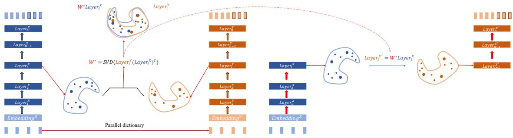
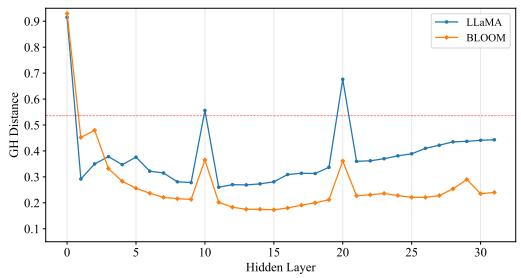
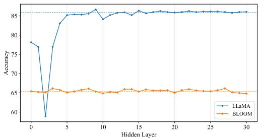
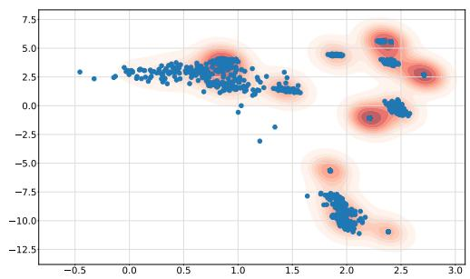
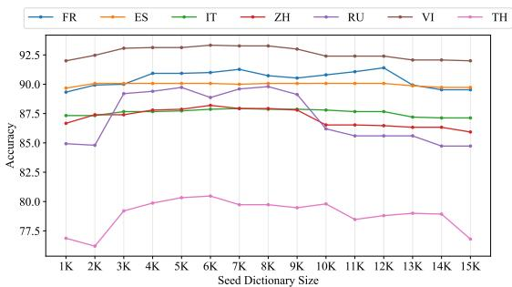
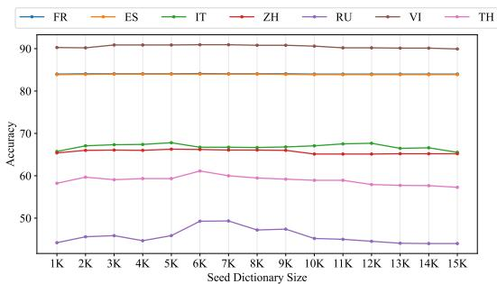
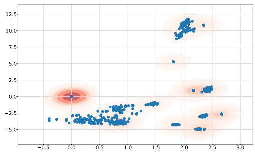

# Word-level Cross-lingual Structure in Large Language Models

Zihao Feng, Hailong Cao\*, Wang Xu, Tiejun Zhao   
Faculty of Computing, Harbin Institute of Technology fengzihaogl@outlook.com {caohailong, tjzhao}@hit.edu.cn xwjim812@126.com

## Abstract

Large Language Models (LLMs) have demonstrated exceptional performance across a broad spectrum of cross-lingual Natural Language Processing (NLP) tasks. However, previous methods predominantly focus on leveraging parallel corpus to conduct instruction data for continuing pre-training or fine-tuning. They ignored the state of parallel data on the hidden layers of LLMs. In this paper, we demonstrate Word-level Cross-lingual Structure (WCS) of LLM which proves that the word-level embedding on the hidden layers are isomorphic between languages. We find that the hidden states of different languages’ input on the LLMs hidden layers can be aligned with an orthogonal matrix on word-level. We prove this conclu sion in both mathematical and downstream task ways on two representative LLM foundations, LLaMA2 and BLOOM. Besides, we propose an Isomorphism-based Data Augmentation (IDA) method to apply the WCS on a downstream cross-lingual task, Bilingual Lexicon Induction (BLI), in both supervised and unsupervised ways. The experiment shows the significant improvement of our proposed method over all the baselines, especially on low-resource languages.

## 1 Introduction

The development of large language models (LLMs) has shown excellent emergence capabilities on diverse Natural Language Processing (NLP) tasks across languages (Wei et al., 2022; Li et al., 2023; Shanahan, 2024). Parallel corpora have emerged as crucial resources to enhance LLMs for both specific tasks (e.g., machine translation (Xu et al., 2023; Alves et al., 2024; Guo et al., 2024)), and generalpurpose tasks (Zhu et al., 2023; Cahyawijaya et al., 2023).

Current work primarily focuses on leveraging parallel corpora for prompt tuning (Zhang et al.,

2023), instruction tuning (Xu et al., 2024), and continual pre-training (Zhao et al., 2024a). They create refined instruction data for special purpose such as contrastive translation pairs (Zeng et al., 2023; Yunjie Ji, 2023). However, these methods mainly focus on the influence on the generated results by parallel corpora, ignoring implied information for parallel corpora in LLMs’ latent spaces. Besides, it has been demonstrated that leveraging extensive parallel data for fine-tuning LLMs can impair their inherent translation capabilities (Xu et al., 2023).

Motivated by this, we use the parallel corpora to explore the structural information of LLMs’ hidden layers. We demonstrate that LLMs’ hidden layers are isomorphic across languages. Specifically, we input the source language’s word set and the target language’s based on a parallel dictionary to LLMs, respectively. We find that the hidden spaces of the source and the target embedding spaces encoded by a certain hidden layer of LLM can be aligned with an orthogonal mapping, which we call Word-level Cross-lingual Structure (WCS). We demonstrate this finding in mathematical, downstream task and graphical ways. This result closely mirrors the widely observed that the word embeddings are isomorphic across languages (Mikolov et al., 2013), even in the hidden spaces.

Based on our finding, we propose Isomorphismbased Data Augmentation (IDA) method to generate a high-confidence dictionary and mapping matrix iteratively. Specifically, we initialize an orthogonal mapping between word embedding spaces by a closed-form solution called Procrutes (Lample et al., 2018) in both supervised and unsupervised ways. Then, we generate a new dictionary with this mapping and then update the mapping in an iterative way. Finally, we leverage the mapping for inference. Experiments show that our proposed method outperforms all the baselines on both highresource and low-resource language pairs.

This paper offers the following contributions:

• We provide a detailed study on Word Level Cross-lingual Structure (WCS) of LLMs. We demonstrate that the hidden spaces of different languages in LLMs are isomorphic. They can be mapped by an orthogonal mapping.

• We propose an Isomorphism-based Data Augmentation (IDA) method to leverage WCS for word translation task. We learn an otherlanguage-to-English mapping and iteratively enhance it to help LLMs better understand the input sentence of both high-resource and low-resource language pairs in supervised and unsupervised ways.

• We conducted extensive experiments to demonstrate the isomorphism of all hidden layers of LLaMA2 and BLOOM and show the effectiveness of our approach.

## 2 Background

## 2.1 Cross-lingual Methods for Large Language Model

To enhance the multilingual and downstream capabilities of LLMs, parallel data is used as a pivot in both analysis and enhancement (Yang et al., 2023; Xu et al., 2023; Alves et al., 2024). It is constructed as instruction data and thrown at LLMs for supervised fine-tuning (Zhu et al., 2023). However, obtaining high quality parallel data in lowresource languages remains challenging for multilingual tasks (Ali et al., 2024). Therefore, there are some cross-lingual methods for LLMs.

Cross-lingual transfer aims to acquire language capability from supervised data in one language and apply it to another without or with few additional training data (Etxaniz et al., 2024; Huang et al., 2023; Winata et al., 2021). This has been approached by designing prompts that leverage LLMs to self-translate questions into resource-rich languages (Qin et al., 2023), or by utilizing external machine translation systems for assistance (Zhao et al., 2024a). Besides, some works leverage the similarity between languages to stimulate capabilities in others (Shaham et al., 2024). Researchers also made efforts on distilling the high-quality human made data from high-resource languages to low-resource languages (Chai et al., 2024).

Cross-lingual alignment, the meaningful similarity of representations across languages in multilingual language models, has been an active field of research in recent years. This includes alignment of word embeddings (Wen-Yi and Mimno, 2023; Miao et al., 2024), the construction of pre-training tasks using multilingual aligned lexicons (Chi et al., 2021), using aligned data on one side of a problem to improve mathematical reasoning processes (Zhu et al., 2024), and encouraging LLMs to display information explicitly in chain-of-thought (COT) (Chai et al., 2024). Besides, there are other works focusing on generating the aligned data based on LLMs’ owns capabilities (Mao and Yu, 2024).

Current researches mostly focus on data perspective for multilingual LLM tasks. However, we leverage parallel data to explore the cross-lingual structure of LLMs’ hidden spaces.

## 2.2 Word Embedding Alignment

Researchers working on word embeddings have pointed out that word embeddings spaces are isomorphic across languages (Mikolov et al., 2013). Based on this assumption, many works experiment on Bilingual Lexicon Induction (BLI) task which induces word translation pairs by aligning word embeddings trained independently from monolingual corpora with an orthogonal mapping. Mathematically, BLI aims to learn a linear transformation $W ^ { * }$ to map two monolingual embeddings, $X ^ { \ast } , Y ^ { \ast } \in \mathbb { R } ^ { k \times d }$ , to a shared space:

$$
\begin{array} { r } { W ^ { * } = \underset { W \in \mathbb { R } ^ { d \times d } } { \arg \operatorname* { m i n } } \ : \| X ^ { * } W - Y ^ { * } \| _ { F } ^ { 2 } } \end{array}\tag{1}
$$

Where k denotes the word number and d the dimension of word embedding. Current works initialize the mapping $W ^ { * }$ in a semi-supervised way (which only required a very small seed dictionary (Artetxe et al., 2017)) or a fully unsupervised way (Lample et al., 2018; Zhang et al., 2017). Due to the isomorphic assumption, there is a closed-form solution to this problem called Procrutes: $W ^ { * } = U V ^ { \top }$ , where U and V are defined by the Singular Value Decomposition (SVD) decomposition of $Y ^ { \top } X$ . The initial step calculates $W ^ { * }$ on a small-scale word set. Then, we iteratively extend $W ^ { * }$ to the entire word set.

Other researchers who suggest that monolingual spaces, especially those of etymologically and typologically distant languages, are far from isomorphic (Søgaard et al., 2018; Vulic et al. ´ , 2019; Patra et al., 2019; Feng et al., 2022). They leverage the joint training method (Wang et al., 2019) or mapping in a non-linear way (Mohiuddin et al., 2020).

  
Figure 1: The main framework of our proposed method. Our method contains two parts. First, we demonstrate the Word-level Cross-lingual Structure (WCS) method in the left part. We demonstrate the word embedding spaces of a parallel dictionary encoded with LLM’s hidden layers are isomorphic. We can learn an orthogonal matrix to map them. Then we leverage the mapping to map source language hidden states to target on a specific hidden layer, and then do the following inference in the right part.

## 3 Word-level Cross-lingual Structure

In this section, we introduce the details of the Wordlevel Cross-lingual Structure of LLMs’ hidden layers. We aim to prove the hidden states of different languages’ word embedding spaces are isomorphic at each hidden layer. We first formally define the symbolic representation of the proof method. Then, we demonstrate the WCS in mathematical and downstream task ways.

We define X, Y as the word embedding matrix of a parallel bilingual dictionary. For a specific LLM, we define $\bar { l a y e r _ { i } ^ { X } } , l a y e r _ { i } ^ { Y }$ as the i-th hidden states at the LLM’s i-th layer of X and Y respectively. We measure their structure in a mathematical way (Gromov-Hausdorff distance) and a downstream task (Bilingual Lexicon Induction).

## 3.1 Gromov-Hausdorff Distance

The Gromov-Hausdorff (GH) distance can be leveraged to calculate the structure of embedding spaces. First we calculate Hausdorff distance which measures the worst case between spaces. Intuitively, it measures the farthest distance among the distances between each point with its closest neighbour:

$$
h ( X , Y ) = { \underset { x \in X ~ y \in Y } { m a x } } i n d ( x , y )\tag{2}
$$

$$
{ \mathcal { H } } ( X , Y ) = m a x \left\{ h ( X , Y ) , h ( Y , X ) \right\}\tag{3}
$$

Where d denotes the distance function between word embeddings. The Gromov-Hausdorff distance first transforms X and Y into a common space using different orthogonal methods. Then the method chooses the minimum distance among Hausdorff distance of each transform. Therefore, it provides a quantitative estimate of the isometry of two spaces:

$$
{ \mathcal { G H } } ( X , Y ) = { \underset { f , g } { m i n } } { \mathcal { H } } ( f ( X ) , g ( Y ) )\tag{4}
$$

where $f$ and $g$ represent the isometric transform. We calculate $\mathcal { G H } ( l a y e r _ { i } ^ { X } , l a y e r _ { i } ^ { Y } )$ at each layer and compare them with the original embeddings.

## 3.2 Bilingual Lexicon Induction

Bilingual Lexicon Induction aims to map embeddings of different languages to a common space. This task is under the assumption that the two embedding spaces are isomorphic. So, we regard each hidden states of LLMs as embedding matrix and map them to measure their isomorphism, respectively. We use the MUSE benchmark (Lample et al., 2018), a bilingual dictionary induction dataset for alignment supervision and evaluate the alignment on word translation retrieval. Specifically, we encode the source and target word with LLM’s hidden layer of MUSE dictionary. Then, we calculate the mapping matrix $W ^ { * }$ based on Procrutes between hidden states which is shown in the left part of Figure 1. As for inference process, we encode the source word with the mapped source hidden layer and map it to the target hidden layer, then we do the following generating process, which is shown in the right part of Figure 1. In this way, we leverage the BLI task to validate the WCS of LLMs.

## 4 Isomorphism-based Data Augmentation Method for Bilingual Lexicon Induction

In this section, we propose an Isomorphism-based Data Augmentation (IDA) method to apply WCS to the optimization of Bilingual Lexicon Induction task based on LLMs. We leverage the isomorphism of LLMs to map the hidden states from lowresource languages to target which can be leveraged to generate high-confidence parallel data for lowresource languages. In this way, we can leverage the good capability on high-resource languages of LLM to enhance the understanding ability of other languages, especially low-resource languages.

Specifically, we learn the alignment $W ^ { * }$ of other language to English on the first several layers of LLM. There are researches prove that, LLMs understand the user input and convert the diverse linguistic features into a unified representation in the first several layers, and think in English in the following layers (Zhao et al., 2024b). So, we map other languages’ input to English aiming to help LLM to better understand them.

After obtaining the alignment matrix of the i-th layer, we can inference in a new way. Just as shown in Figure 1, we encode the input with first i layers, map the i-th hidden state to the English space, and then pass it to the (i + 1)-th layer for following inference.

However, the supervised $W ^ { * }$ is only based on a small-scale parallel dictionary $\mathcal { D } .$ To improve the quality of the mapping $W ^ { * }$ , we propose an Isomorphism-based Data Augmentation (IDA) method for $W ^ { * }$ . Before the inference process, we iteratively enlarge D with high-confidence word pairs in an unsupervised way. For the i-th iteration, we translate the more frequent words in the source language with the original inference method and our WCS method to generate pseudo-parallel word pairs $\mathcal { D } _ { o r i } ^ { i }$ and ${ \mathcal { D } } _ { W C S } ^ { i }$ . The word pair is a highconfidence pair only if it occurs in both $\mathcal { D } _ { o r i } ^ { i }$ and ${ \mathcal { D } } _ { W C S } ^ { i }$ . Finally we enlarge the original dictionary with $\tilde { \mathcal { D } } ^ { i } = \mathcal { D } ^ { i - 1 } \cup ( \mathcal { D } _ { o r i } ^ { i } \cap \mathcal { D } _ { W C S } ^ { i } )$

The framework is outlined in Algorithm 1, where $P r$ represents the Procrutes method and threshold represents the settings of the generated dictionary size.

## 5 Experimental Settings

## 5.1 Setup

We use the ground-truth bilingual dictionaries, MUSE (Lample et al., 2018), to assess the effectiveness of our the Word-level Cross-lingual Structure evaluation. These dictionaries were built using Meta’s internal translation tool and were designed to handle polysemy of words. MUSE contains 110 large-scale ground-truth bilingual dictionaries with three different sizes for training and test. We select two representative and mostly used open source large language models as our foundation model for study, LLaMA2 (Touvron et al., 2023) and BLOOMZ (Muennighoff et al., 2022). The detail of our training setting is appended in Appendix A.

Algorithm 1: IDA method for BLI   
Input: A parallel dictionary D, source word   
set $X _ { w o r d } .$ , test set X   
Output: Inferenced word set   
1 $W ^ { * } = P r ( L L M _ { h i d e n } ( L a y e r _ { i } , \mathcal { D } ) )$   
2 $i = 1 , { \mathcal { D } } ^ { i } = { \mathcal { D } } ;$   
3 while len $\left( \mathcal { D } ^ { i } \right) ! =$ threshold do   
4 $i = i + 1 \mathcal { D } _ { o r i } ^ { i } = L L M ( X _ { w o r d } ) ;$   
5 $\mathcal { D } _ { W C S } ^ { i } = L L M _ { W C S } ( X _ { w o r d } , W ^ { * } )$   
6 $\mathcal { D } ^ { i } = \mathcal { D } ^ { i - 1 } \cup ( \mathcal { D } _ { o r i } ^ { i } \cap \mathcal { D } _ { W C S } ^ { i } ) ;$   
7 $W ^ { * } = P r ( L L M _ { h i d e n } ( L a y e r _ { i } , \mathcal { D } ^ { i } ) )$   
8 end

## 5.2 Baselines

For the Word-level Cross-lingual Structure, we leverage the FASTTEXT embeddings (Bojanowski et al., 2017) to compare with LLM hidden states on Gromov-Hausdorff distance. Besides, we leverage the 1500 parallel dictionary of MUSE to train two foundation LLMs as the base models. We compare the performance between the prompt-based method and WCS-based on fine-tuned models. For the Isomorphism-based Data Augmentation method, we first leverage the prompt-based method as the supervised and unsupervised baselines. We choose two traditional Bilingual Lexicon Induction methods as our baselines: MUSE (Lample et al., 2018) is a typical unsupervised method; CLBLI(Li et al., 2022) is a simple yet extremely effective and robust two-stage contrastive learning framework for improving BLI. Meanwhile, we evaluate the finetuned foundation LLMs. Finally, we compare our method with some large-scale LLMs: BigTranslate (Yang et al., 2023), a multilingual translation model that enhances the LLaMA with multilingual translation capability on more than 100 languages; We evaluate the performance of ChatGPT (OpenAI,

<table><tr><td>Gromov-Hausdorff Distance ↓</td><td>FR-EN</td><td>ES-EN</td><td>IT-EN</td><td>ZH-EN</td><td>RU-EN</td><td>VI-EN</td><td>TH-EN</td><td>AVG</td></tr><tr><td>FASTTEXT Embedding</td><td>0.232</td><td>0.215</td><td>0.362</td><td>0.536</td><td>0.501</td><td>0.604</td><td>0.648</td><td>0.443</td></tr><tr><td>LLaMA2-7B Hidden Embedding</td><td>0.241</td><td>0.245</td><td>0.265</td><td>0.278</td><td>0.283</td><td>0.270</td><td>0.292</td><td>0.268</td></tr><tr><td>BLOOMZ-7B Hidden Embedding</td><td>0.213</td><td>0.207</td><td>0.218</td><td>0.220</td><td>0.235</td><td>0.221</td><td>0.272</td><td>0.227</td></tr></table>

Table 1: Results of Gromov-Hausdorff Distance between all the low-resource and high-resource language pairs. (’EN’ is English, ’FR’ is French, ’ES’ is Spanish, ’IT’ is Italian, ’ZH’ is classical Chinese, ’RU’ is Russian, ’VI’ is ’Vietnamese’ and ’TH’ is ’Thai’)

  
Figure 2: The Gromov-Hausdorff distance for both LLaMA and BLOOM hidden layers on ZH-EN language pair. The red line represents the Gromov-Hausdorff distance of FASTTEXT embedding.

2022) (we use the gpt-3.5-turbo API).

## 6 Experiments

In this section, we first demonstrate the isomorphism of LLMs’ hidden layers between languages in three ways in Section 6.1. Then we evaluate the IDA method based on WCS on Bilingual Lexicon Induction task in both supervised and unsupervised ways in Section 6.2.

## 6.1 Word-level Cross-lingual Structure

In this section, we evaluate the WCS on the hidden layers of LLaMA and BLOOM in three ways. We first leverage the Gromov-Hausdorff distance to evaluate in a mathematical way. Then choose a downstream task, Bilingual Lexicon Induction, to evaluate. Finally, we use PCA method for dimensionality reduction in two-dimensional space to evaluate the WCS in a graphical way.

## 6.1.1 Gromov-Hausdorff Evaluation

We first present the results on Gromov-Hausdorff distance to evaluate the Word-level Cross-lingual Structure. The decrease of Gromov-Hausdorff distance indicates a higher isomorphism of two word embedding spaces. We first evaluate the isomorphism of the 9-th hidden layer of LLaMA and 9- th layer of BLOOM. As shown in Table 1, both LLaMA and BLOOM perform better isomorphism results on 5 of 7 language pairs and achieve improvements of 0.175 and 0.216 on the average score.

  
Figure 3: The accuracies of WCS-based Bilingual Lexicon Induction on all the LLaMA and BLOOM hidden layers on ZH-EN language pair. The horizontal lines represent the prompt-based accuracies.

As we can see, compared with traditional word embedding spaces, LLMs shows better isomorphism in low-resource languages. Besides, the isomorphism achieves more average performance between all the hidden layers for both high-resource and low-resource languages, which means they have better robustness. This can be leveraged for the downstream tasks, especially on the lowresource condition.

Moreover, we evaluate the Gromov-Hausdorff distance for all the 32 hidden layers of both LLaMA and BLOOM. We experiment on EN-ZH language pair. As we can see in Figure 2, with the exception of the 0-th hidden layer, all the other hidden states are isomorphic in different languages, respectively. The hidden layers of bloom model perform better isomorphism than LLaMA. As for the 0-th layer, the label after word segmentation is first passed into the 0-th hidden layer, which leads to the weak isomorphism of word hidden embedding in this layer. Besides, We find that the isomorphism of the hidden states changes greatly in the 10-th and 20-th hidden layers. We think this is because the two layers are at the boundaries between understand, solve task and generate processes (Zhao et al., 2024b).

<table><tr><td>BLI Task ↑</td><td>FR-EN</td><td>ES-EN</td><td>IT-EN</td><td>ZH-EN</td><td>RU-EN</td><td>VI-EN</td><td>TH-EN</td><td>AVG</td></tr><tr><td>LLaMA2-7B</td><td>90.00</td><td>89.53</td><td>87.60</td><td>85.87</td><td>84.87</td><td>92.33</td><td>76.42</td><td>86.66</td></tr><tr><td>LLaMA2-7B+WCS</td><td>89.33</td><td>89.67</td><td>87.33</td><td>86.67</td><td>84.93</td><td>92.00</td><td>76.87</td><td>86.69</td></tr><tr><td>BLOOMZ-7B</td><td>84.47</td><td>83.07</td><td>66.07</td><td>65.33</td><td>44.33</td><td>91.13</td><td>56.92</td><td>70.19</td></tr><tr><td>BLOOMZ-7B+WCS</td><td>84.00</td><td>83.87</td><td>65.73</td><td>65.40</td><td>44.20</td><td>90.27</td><td>58.23</td><td>70.24</td></tr></table>

Table 2: Results of one-shot prompt-based method and our Word-level Cross-lingual Structure (WCS) method. We report the score of the accuracies (%). The "underline" signifies the better score between the models with the same foundation model. The "bold" indicates the best score among all the systems of each language pairs.

  
Figure 4: The hidden embedding space of 1k parallel dictionary on Chinese.

We will continue to explore it in future work.

## 6.1.2 Bilingual Lexicon Induction Evaluation

In this section, we evaluate the Word-level Crosslingual Structure of the LLMs’ hidden layer on a downstream task, Bilingual Lexicon Induction. We leverage a 1k-words parallel dictionary to calculate the source-English mapping W<sup>∗</sup> on the 9-th hidden layer for both LLaMA and BLOOM. As shown in Table 2, compared with the original prompt-based method, Our isomorphism-based WCS method maintains the accuracies of the LLMs. The results proves the isomorphism of LLaMA and BLOOM on high-resource and low-resource languages.

As we can see in Table 2, the WCS method has better performance on low-resource language pairs. For both LLaMA and BLOOM are English-centric, We leverage the good isomorphism of LLMs to map the source languages’ hidden states to English on the understand layer. In this way, our WCS method can help better understand the low-resource distant languages.

We evaluate the accuracies of Bilingual Lexicon Induction task for all the 31 hidden layers of both LLaMA and BLOOM. Because our WCS method aligns the i-th layer and then transforms to (i + 1)-th layer, we do not evaluate 32-th layer.

  
Figure 5: The hidden embedding space of 1k parallel dictionary on English.

As shown in Figure 3, with the exception of the first several layers of LLaMA, our WCS-based method performers well on most hidden layers of LLaMA and BLOOM. Compared to the promptbased method, the WCS-based achieves a better average score on the BLOOM foundation model. Moreover, we find that there has a slight decline of the performances on the 10-th and 20-th layers of WCS-based LLaMA model, which is corresponds to the isomorphism change in Figure 2. Besides, the LLaMA model performs bad on the first several model, we think that the problem is caused by the difference in the model at the word segmentation stage.

## 6.1.3 Graphical Evaluation

In this section, we visualize the structure of the hidden state to show its isomorphism more intuitively. We choose the 9-th hidden layer of LLaMA on English-Chinese languange pair. We leverage the Principal Components Analysis (PCA) method to reduces the hidden embedding from 4090 to 2 dimensions. As shown in Figure 4 and 5, the range and distribution of the two two-dimensional hidden embeddings are highly consistent in the two dimensions. There are only a few embeddings that are not in the cluster. Besides, these two hidden states can be aligned in two-dimensional space with uncomplicated mapping. We also evaluate all the language pairs and obtain the same results.

<table><tr><td>BLI Task ↑</td><td>FR-EN</td><td>ES-EN</td><td>IT-EN</td><td>ZH-EN</td><td>RU-EN</td><td>VI-EN</td><td>TH-EN</td><td>AVG</td></tr><tr><td>MUSE</td><td>81.87</td><td>83.33</td><td>60.22</td><td>16.80</td><td>60.60</td><td>60.13</td><td>14.99</td><td>54.00</td></tr><tr><td>CLBLI</td><td>83.47</td><td>85.63</td><td>63.06</td><td>48.40</td><td>62.20</td><td>64.87</td><td>21.54</td><td>61.31</td></tr><tr><td>BigTranslate-13B</td><td>50.93</td><td>52.40</td><td>53.00</td><td>32.47</td><td>29.53</td><td>38.07</td><td>31.74</td><td>41.16</td></tr><tr><td>ChatGPT</td><td>73.00</td><td>72.47</td><td>71.07</td><td>70.93</td><td>70.13</td><td>70.60</td><td>68.20</td><td>70.91</td></tr><tr><td>LLaMA2-7B</td><td>90.00</td><td>89.53</td><td>87.60</td><td>85.87</td><td>84.87</td><td>92.33</td><td>76.42</td><td>86.66</td></tr><tr><td>LLaMA2-7B+IDA</td><td>91.00</td><td>90.07</td><td>87.87</td><td>88.20</td><td>88.87</td><td>93.33</td><td>80.47</td><td>88.54</td></tr><tr><td>BLOOMZ-7B</td><td>84.47</td><td>83.07</td><td>66.07</td><td>65.33</td><td>44.33</td><td>91.13</td><td>56.92</td><td>70.19</td></tr><tr><td>BLOOMZ-7B+IDA</td><td>84.13</td><td>84.00</td><td>66.73</td><td>66.20</td><td>49.27</td><td>90.93</td><td>61.13</td><td>71.77</td></tr></table>

Table 3: Results of prompt-based method and our Isomorphism-based Data Augmentation (IDA) method on the supervised (1k parallel dictionary) Bilingual Lexicon Induction task. We report the score of the accuracies (%).

## 6.2 Isomorphism-based Data Augmentation

In this section, we evaluate the performance of Isomorphism-based Data Augmentation (IDA) on Bilingual Lexicon Induction task. We first present the result of IDA in a supervised way. Then, we show the performance of the unsupervised IDA method. Finally, we show the relationship between the dictionary size and the quality of the mapping matrix. In this section, all the experiments are done on the 9-th hidden layer for LLaMA and BLOOM.

## 6.2.1 Results of Semi-supervised Method

We present the results of Bilingual Lexicon Induction task for both traditional methods and LLM methods on 7 source languages to English in Table 3. The semi-supervised IDA method leverages 1K parallel dictionary to initialize the mapping matrix W<sup>∗</sup>. We first experiment in a semi-supervised way, which leverages a 1k parallel dictionary for supervision. We experiment on the 9-th layer for both LLaMA and BLOOM which has the best average performance among all the hidden layers. Compared with all the baselines, the results show that our IDA method achieves better results among all the language pairs, and the improvement is more significant on low-resource language pairs.

As shown in Table 3, the performance of all the baseline performance has decreased significantly in low-resource scenarios. However our IDA method has a good improvement on the low-resource languages (ZH, RU, VI and TH). The IDA method makes the LLaMA achieve an accuracy of over 80% on all language pairs. For BLOOM model that performs poorly compared with LLaMA, our proposed method leverage the better isomorphism to achieve a better improvement on the average score of all language pairs.

As depicted in Table 3, compared with the large scale language models, our method on the 7B model achieves better results, even outperforms ChatGPT. We found it difficult to make ChatGPT output single word, so we performed some postprocessing to avoid it, the details are in Appendix B. This section proves that our proposed method can make better use of multilingual information of LLM, and improve the ability of the model on multilingual tasks through its multilingual isomorphism.

## 6.2.2 Results of Unsupervised Method

For the unsupervised method, we first leverage the prompt-based method on fine-tuned LLMs to generate a pseudo-parallel dictionary with 1k size. We initialize the mapping matrix W<sup>∗</sup> with the generated dictionary. Then, we empty the dictionary and use our IDA method to iteratively optimize the mapping matrix W<sup>∗</sup> with the threshold of 6k dictionary size, which is shown in Algorithm 1.

We present the results of unsupervised methods in Table 4. For the CSBLI is a supervised method, BigTranslate and ChatGPT we evaluate in the same way with Table 3, we only present MUSE and the foundation model results. The results show that our unsupervised method also performs better on average among all the baselines (achieving improvements of 1.01% and 0.68% on LLaMA and BLOOM, respectively).

Compared with the supervised method, the unsupervised method has a similar performance in high-resources and languages with high scores (FR, ES, IT and VI). The foundation models have a good performance on these languages, which makes the pseudo-parallel dictionary with a high quality. As for the low-resource languages, uIDA method can still take advantage of the model’s weak multilingual capability in low-resource languages to improve the performance. The results prove the robustness of our proposed method.

<table><tr><td>BLI Task ↑</td><td>FR-EN</td><td>ES-EN</td><td>IT-EN</td><td>ZH-EN</td><td>RU-EN</td><td>VI-EN</td><td>TH-EN</td><td>AVG</td></tr><tr><td>MUSE</td><td>81.53</td><td>83.33</td><td>60.34</td><td>31.00</td><td>59.00</td><td>61.07</td><td>0.00</td><td>53.75</td></tr><tr><td>LLaMA2-7B</td><td>90.00</td><td>89.53</td><td>87.60</td><td>85.87</td><td>84.87</td><td>92.33</td><td>76.42</td><td>86.66</td></tr><tr><td>LLaMA2-7B+uIDA</td><td>90.54</td><td>90.00</td><td>87.63</td><td>87.84</td><td>86.53</td><td>92.18</td><td>79.00</td><td>87.67</td></tr><tr><td>BLOOMZ-7B</td><td>84.47</td><td>83.07</td><td>66.07</td><td>65.33</td><td>44.33</td><td>91.13</td><td>56.92</td><td>70.19</td></tr><tr><td>BLOOMZ-7B+uIDA</td><td>84.20</td><td>83.74</td><td>68.00</td><td>65.64</td><td>44.20</td><td>92.06</td><td>58.23</td><td>70.87</td></tr></table>

Table 4: Results of prompt-based method and our Isomorphism-based Data Augmentation (IDA) method on the unsupervised Bilingual Lexicon Induction task. The uIDA represents unsupervised IDA method. We report the score of the accuracies (%).

  
(a) The LLaMA foundation model.

  
(b) The BLOOM foundation model.  
Figure 6: The accuracy of IDA method on different size of dictionary.

## 6.2.3 Results of Different Threshold on Dictionary Size

In this section, we evaluate the influence of the dictionary size. We leverage the IDA method to generate different size of dictionary. We choose three languages to cover different resource scenarios for comparison (FR, ZH and TH for high-resource, medium-resource and low-resource). As we can see in Table 6, the performance of the IDA method first increases with the increase of the size of the dictionary, and then decreases after reaching the maximum. The results show that 6k size (1k parallel dictionary and 5k generated dictionary) performs the best score for both LLaMA and BLOOM.

Moreover, in order to explore the effect of different sizes of dictionaries on different language pairs, we leverage the supervised IDA method to generate differently sized dictionaries and show the performance in Figure 6. The X-axis represents the total size of the dictionary, including 1k parallel dictionaries and generated dictionaries of different sizes. The figure show that the accuracies of all language pairs show a trend of first increasing and then decreasing as the dictionary size increases.

We can conclude from Figure 4 and 5 that the distribution of word hidden embeddings exhibits clustering phenomenon. For the lower size of the dictionary, we think that a small number of words cannot completely cover the distribution of the word hidden embedding space which makes the accuracies increases with the size of the dictionary. However, since our dictionary is expanded in order of word frequency, most high-frequency words can be covered on a small-scale dictionary which ensures the basic performance of our method on small-scale dictionary such as WCS method.

As for the large-scale dictionary, they contain some low-frequency words and proper nouns. Due to the LLMs’ encoding ability for these words being weaker than that for high-frequency words, there will also contain some noises. Just as shown in Figure 7, we show the hidden embedding space of words with frequency ranking between 8k and 9k on Chinese. The results show that the distribution of these points is relatively scattered compared to high-frequency words in Figure 4. So, the performance declines on the large-scale dictionary, especially on the low-resource languages.

## 7 Conclusion

In this work, we demonstrate the Word-level Crosslingual Structure (WCS) which prove the isomorphism of LLMs’ hidden layers between different languages and that they can be aligned with an orthogonal matrix. We evaluate the WCS in both mathematical way (Gromov-Hausdorff distance) and via a downstream task (Bilingual Lexicon task). The results prove the correctness and exploitability of isomorphism. Besides, we propose an Isomorphism-based Data Augmentation (IDA) method to apply the WCS to a downstream crosslingual task, BLI, in supervised and unsupervised ways, which enhance the quality of the mapping matrix. Specifically, we leverage the prompt-based method and WCS method to iteratively generate a new dictionary with high confidence for lowresource languages. The experiments demonstrate the effectiveness of our proposed method on both supervised and unsupervised ways. Moreover, we have conducted detailed experiments on different parameters and all the hidden layers of LLaMA2 and BLOOM in the experiment.

## Acknowledgements

This work was supported by the National Natural Science Foundation of China under Grant 62376076, Key R&D Program of Yunnan under Grant 202203AA080004. The authors would like to thank the anonymous reviewers for their helpful comments.

## References

Mehdi Ali, Michael Fromm, Klaudia Thellmann, Richard Rutmann, Max Lübbering, Johannes Leveling, Katrin Klug, Jan Ebert, Niclas Doll, Jasper Buschhoff, et al. 2024. Tokenizer choice for llm training: Negligible or crucial? In Findings of the Associationfor Computational Linguistics: NAACL 2024, pages 3907–3924.

Duarte M Alves, José Pombal, Nuno M Guerreiro, Pedro H Martins, João Alves, Amin Farajian, Ben Peters, Ricardo Rei, Patrick Fernandes, Sweta Agrawal, et al. 2024. Tower: An open multilingual large language model for translation-related tasks. arXiv preprint arXiv:2402.17733.

Mikel Artetxe, Gorka Labaka, and Eneko Agirre. 2017. Learning bilingual word embeddings with (almost) no bilingual data. In Proceedings ofthe 55th Annual

Meeting of the Association for Computational Linguistics (Volume 1: Long Papers), pages 451–462, Vancouver, Canada. Association for Computational Linguistics.

Piotr Bojanowski, Edouard Grave, Armand Joulin, and Tomas Mikolov. 2017. Enriching word vectors with subword information. Transactions of the associationfor computational linguistics, 5:135–146.

Samuel Cahyawijaya, Holy Lovenia, Tiezheng Yu, Willy Chung, and Pascale Fung. 2023. Instructalign: Teaching novel languages with to llms through alignment-based cross-lingual instruction. arXiv preprint arXiv:2305.13627.

Linzheng Chai, Jian Yang, Tao Sun, Hongcheng Guo, Jiaheng Liu, Bing Wang, Xiannian Liang, Jiaqi Bai, Tongliang Li, Qiyao Peng, et al. 2024. xcot: Crosslingual instruction tuning for cross-lingual chain-ofthought reasoning. arXiv preprint arXiv:2401.07037.

Zewen Chi, Li Dong, Bo Zheng, Shaohan Huang, Xian-Ling Mao, He-Yan Huang, and Furu Wei. 2021. Improving pretrained cross-lingual language models via self-labeled word alignment. In Proceedings ofthe 59th Annual Meeting ofthe Associationfor Computational Linguistics and the 11th International Joint Conference on Natural Language Processing (Volume 1: Long Papers), pages 3418–3430.

Julen Etxaniz, Gorka Azkune, Aitor Soroa, Oier Lacalle, and Mikel Artetxe. 2024. Do multilingual language models think better in english? In Proceedings of the 2024 Conference of the North American Chapter ofthe Associationfor Computational Linguistics: Human Language Technologies (Volume 2: Short Papers), pages 550–564.

Zihao Feng, Hailong Cao, Tiejun Zhao, Weixuan Wang, and Wei Peng. 2022. Cross-lingual feature extraction from monolingual corpora for low-resource unsupervised bilingual lexicon induction. In Proceedings of the 29th International Conference on Computational Linguistics, pages 5278–5287, Gyeongju, Republic of Korea. International Committee on Computational Linguistics.

Ping Guo, Yubing Ren, Yue Hu, Yunpeng Li, Jiarui Zhang, Xingsheng Zhang, and Heyan Huang. 2024. Teaching large language models to translate on lowresource languages with textbook prompting. In Proceedings ofthe 2024 Joint International Conference on Computational Linguistics, Language Resources and Evaluation (LREC-COLING 2024), pages 15685– 15697, Torino, Italia. ELRA and ICCL.

Haoyang Huang, Tianyi Tang, Dongdong Zhang, Wayne Xin Zhao, Ting Song, Yan Xia, and Furu Wei. 2023. Not all languages are created equal in llms: Improving multilingual capability by cross-lingual-thought prompting. arXiv preprint arXiv:2305.07004.

Guillaume Lample, Alexis Conneau, Marc’Aurelio Ranzato, Ludovic Denoyer, and Hervé Jégou. 2018.

Word translation without parallel data. In International Conference on Learning Representations.

Yaoyiran Li, Fangyu Liu, Nigel Collier, Anna Korhonen, and Ivan Vulic. 2022.´ Improving word translation via two-stage contrastive learning. In Proceedings of the 60th Annual Meeting of the Association for Computational Linguistics (Volume 1: Long Papers), pages 4353–4374, Dublin, Ireland. Association for Computational Linguistics.

Yinghui Li, Haojing Huang, Shirong Ma, Yong Jiang, Yangning Li, Feng Zhou, Hai-Tao Zheng, and Qingyu Zhou. 2023. On the (in) effectiveness of large language models for chinese text correction. arXiv preprint arXiv:2307.09007.

Zhuoyuan Mao and Yen Yu. 2024. Tuning llms with contrastive alignment instructions for machine translation in unseen, low-resource languages. arXiv preprint arXiv:2401.05811.

Zhongtao Miao, Qiyu Wu, Kaiyan Zhao, Zilong Wu, and Yoshimasa Tsuruoka. 2024. Enhancing crosslingual sentence embedding for low-resource languages with word alignment. In Findings of the Association for Computational Linguistics: NAACL 2024, pages 3225–3236.

Tomas Mikolov, Quoc V Le, and Ilya Sutskever. 2013. Exploiting similarities among languages for machine translation. arXiv preprint arXiv:1309.4168.

Tasnim Mohiuddin, M Saiful Bari, and Shafiq Joty. 2020. LNMap: Departures from isomorphic assumption in bilingual lexicon induction through non-linear mapping in latent space. In Proceedings ofthe 2020 Conference on Empirical Methods in Natural Language Processing (EMNLP), pages 2712–2723, Online. Association for Computational Linguistics.

Niklas Muennighoff, Thomas Wang, Lintang Sutawika, Adam Roberts, Stella Biderman, Teven Le Scao, M Saiful Bari, Sheng Shen, Zheng-Xin Yong, Hailey Schoelkopf, et al. 2022. Crosslingual generalization through multitask finetuning. arXiv preprint arXiv:2211.01786.

OpenAI. 2022. Openai: Introducing chatgpt. In https://openai.com/blog/chatgpt.

Barun Patra, Joel Ruben Antony Moniz, Sarthak Garg, Matthew R Gormley, and Graham Neubig. 2019. Bilingual lexicon induction with semi-supervision in non-isometric embedding spaces. In Proceedings of the 57th Annual Meeting of the Association for Computational Linguistics, pages 184–193.

Libo Qin, Qiguang Chen, Fuxuan Wei, Shijue Huang, and Wanxiang Che. 2023. Cross-lingual prompting: Improving zero-shot chain-of-thought reasoning across languages. In Proceedings of the 2023 Conference on Empirical Methods in Natural Language Processing, pages 2695–2709.

Uri Shaham, Jonathan Herzig, Roee Aharoni, Idan Szpektor, Reut Tsarfaty, and Matan Eyal. 2024. Multilingual instruction tuning with just a pinch of multilinguality. arXiv preprint arXiv:2401.01854.

Murray Shanahan. 2024. Talking about large language models. Communications ofthe ACM, 67(2):68–79.

Anders Søgaard, Sebastian Ruder, and Ivan Vulic. 2018.´ On the limitations of unsupervised bilingual dictionary induction. In Proceedings of the 56th Annual Meeting of the Association for Computational Linguistics (Volume 1: Long Papers), pages 778–788.

Hugo Touvron, Thibaut Lavril, Gautier Izacard, Xavier Martinet, Marie-Anne Lachaux, Timothée Lacroix, Baptiste Rozière, Naman Goyal, Eric Hambro, Faisal Azhar, et al. 2023. Llama: Open and efficient foundation language models. arXiv preprint arXiv:2302.13971.

Ivan Vulic, Goran Glavaš, Roi Reichart, and Anna Ko-´ rhonen. 2019. Do we really need fully unsupervised cross-lingual embeddings? In Proceedings of the 2019 Conference on Empirical Methods in Natural Language Processing and the 9th International Joint Conference on Natural Language Processing, pages 4407–4418.

Zirui Wang, Jiateng Xie, Ruochen Xu, Yiming Yang, Graham Neubig, and Jaime G Carbonell. 2019. Cross-lingual alignment vs joint training: A comparative study and a simple unified framework. In International Conference on Learning Representations.

Jason Wei, Yi Tay, Rishi Bommasani, Colin Raffel, Barret Zoph, Sebastian Borgeaud, Dani Yogatama, Maarten Bosma, Denny Zhou, Donald Metzler, et al. 2022. Emergent abilities of large language models. arXiv preprint arXiv:2206.07682.

Andrea W Wen-Yi and David Mimno. 2023. Hyperpolyglot LLMs: Cross-lingual interpretability in token embeddings. In Proceedings ofthe 2023 Conference on Empirical Methods in Natural Language Processing, pages 1124–1131, Singapore. Association for Computational Linguistics.

Genta Indra Winata, Andrea Madotto, Zhaojiang Lin, Rosanne Liu, Jason Yosinski, and Pascale Fung. 2021. Language models are few-shot multilingual learners. In Proceedings ofthe 1st Workshop on Multilingual Representation Learning, pages 1–15.

Haoran Xu, Young Jin Kim, Amr Sharaf, and Hany Hassan Awadalla. 2023. A paradigm shift in machine translation: Boosting translation performance of large language models. arXiv preprint arXiv:2309.11674.

Haoran Xu, Young Jin Kim, Amr Sharaf, and Hany Hassan Awadalla. 2024. A paradigm shift in machine translation: Boosting translation performance of large language models. In The Twelfth International Conference on Learning Representations.

Wen Yang, Chong Li, Jiajun Zhang, and Chengqing Zong. 2023. Bigtranslate: Augmenting large language models with multilingual translation capability over 100 languages. arXiv preprint arXiv:2305.18098.

Yan Gong Yiping Peng Qiang Niu Lei Zhang Baochang Ma Xiangang Li Yunjie Ji, Yong Deng. 2023. Exploring the impact of instruction data scaling on large language models: An empirical study on real-world use cases. arXiv preprint arXiv:2303.14742.

Jiali Zeng, Fandong Meng, Yongjing Yin, and Jie Zhou. 2023. Tim: Teaching large language models to translate with comparison. arXiv preprint arXiv:2307.04408.

Biao Zhang, Barry Haddow, and Alexandra Birch. 2023. Prompting large language model for machine translation: A case study. In Proceedings ofthe 40th International Conference on Machine Learning, volume 202 of Proceedings ofMachine Learning Research, pages 41092–41110. PMLR.

Meng Zhang, Yang Liu, Huanbo Luan, and Maosong Sun. 2017. Adversarial training for unsupervised bilingual lexicon induction. In Proceedings of the 55th Annual Meeting of the Association for Computational Linguistics (Volume 1: Long Papers), pages 1959–1970, Vancouver, Canada. Association for Computational Linguistics.

Jun Zhao, Zhihao Zhang, Qi Zhang, Tao Gui, and Xuanjing Huang. 2024a. Llama beyond english: An empirical study on language capability transfer. arXiv preprint arXiv:2401.01055.

Yiran Zhao, Wenxuan Zhang, Guizhen Chen, Kenji Kawaguchi, and Lidong Bing. 2024b. How do large language models handle multilingualism? arXiv preprint arXiv:2402.18815.

Wenhao Zhu, Shujian Huang, Fei Yuan, Shuaijie She, Jiajun Chen, and Alexandra Birch. 2024. Question translation training for better multilingual reasoning. arXiv preprint arXiv:2401.07817.

Wenhao Zhu, Yunzhe Lv, Qingxiu Dong, Fei Yuan, Jingjing Xu, Shujian Huang, Lingpeng Kong, Jiajun Chen, and Lei Li. 2023. Extrapolating large language models to non-english by aligning languages. arXiv preprint arXiv:2308.04948.

## A Training Details

For all the two proposed methods, WCS and IDA for BLI task, we experiment on the 7B size on the two foundation models. we leverage 1500 parallel dictionary of MUSE for fine-tuning. The training processes are full fine-tuned and conducted on 4 A100 GPUs with 40GB 258 of RAM for 6 epochs. For the WCS fpr BLI method, we set the threshold as 15000 and choose 9-th layer for experiment.

## B ChatGPT Prompts

We evaluate the performance of ChatGPT using the following prompts. For each prompt, we postprocess the answers generated by ChatGPT into single words and then evaluate them. We report the best score of these prompts in Table 3.

## C Influence by Dictionary Size

We show the results of prompt-based method, WCS method with 1k parallel dictionary, unsupervised IDA method with 6k generated dictionary and IDA method with 1k parallel dictionary and 4 different size of generated dictionary in Table 6.

## D Image of Low frequency Word

  
Figure 7: The hidden embedding space of lowfrequency words on Chinese.

```perl
ID Prompt Format
1 The word <SRC-word> in <TGT> is:
2 The <SRC> word <SRC-word> in ${ < } T G T >$ is:
3 What is the translation of the word <SRC-word> into $< T G T > :$
4 The translation of the <SRC> word <SRC-word> into <TGT> is:
5 Translate the following word from $< S R C > \mathrm { t o } < T G T > : < S R C - w o r d >$
6 Translate the following word from <SRC> to <TGT> in a single word: <SRC-word>
7 Translate the following <SRC> word into $< T G T > : < S R C - w o r d >$
8 Provide the <TGT> equivalent for the following <SRC> word: <SRC-word>
9 How do you say <SRC-word> in <TGT>:
```  
Table 5: The prompts used for ChatGPT translation. <SRC> and <TGT> denote source and target languages, respectively. <SRC-sentence> represents the source language to be translated.

<table><tr><td rowspan="2">Seed Size</td><td colspan="2">FR-EN</td><td colspan="2">ZH-EN</td><td colspan="2">TH-EN</td></tr><tr><td>LLaMA2-7B</td><td>BLOOM-7B</td><td>LLaMA2-7B</td><td>BLOOM-7B</td><td>LLaMA2-7B</td><td>BLOOM-7B</td></tr><tr><td>Prompt-based Method</td><td>90.00</td><td>84.47</td><td>85.87</td><td>65.33</td><td>76.42</td><td>56.92</td></tr><tr><td>WCS+1k Parallel Dictionary</td><td>89.33</td><td>84.00</td><td>86.67</td><td>65.40</td><td>76.87</td><td>58.23</td></tr><tr><td>uIDA+6k Generated Dictionary</td><td>90.54</td><td>84.20</td><td>87.84</td><td>65.64</td><td>79.00</td><td>58.23</td></tr><tr><td>IDA+1kPD, 1k GD</td><td>89.93</td><td>84.07</td><td>87.40</td><td>66.00</td><td>76.20</td><td>59.67</td></tr><tr><td>IDA+1kPD, 3k GD</td><td>90.93</td><td>84.07</td><td>87.80</td><td>66.00</td><td>79.87</td><td>59.33</td></tr><tr><td>IDA+1kPD, 5k GD</td><td>91.00</td><td>84.13</td><td>88.20</td><td>66.20</td><td>80.47</td><td>61.13</td></tr><tr><td>IDA+1kPD, 7k GD</td><td>90.73</td><td>84.07</td><td>87.93</td><td>66.07</td><td>79.73</td><td>59.47</td></tr></table>

Table 6: Results of our proposed method on different dictionary size. The PD represents the Parallel dictionary and GD represents dictionary generated by our IDA method.