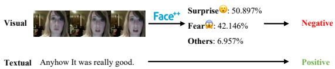
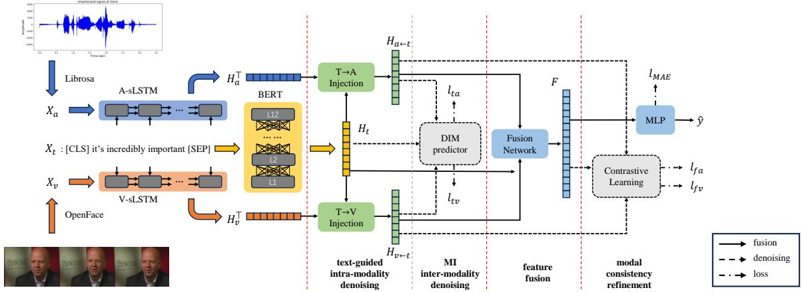
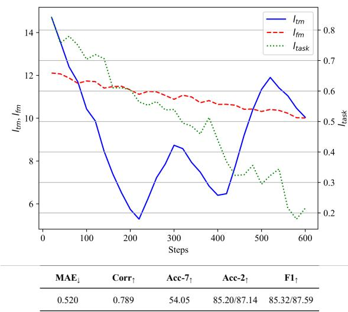
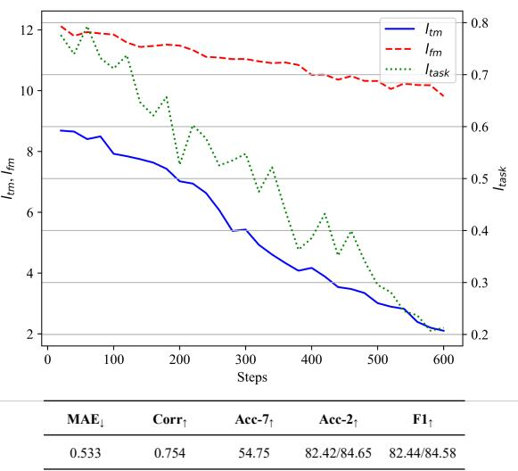

# t-HNE: A Text-guided Hierarchical Noise Eliminator for Multimodal Sentiment Analysis

Zuocheng Li and Lishuang Li\* Dalian University of Technology, Dalian, China lizuochengcs@mail.dlut.edu.cn, lils@dlut.edu.cn

## Abstract

In the Multimodal Sentiment Analysis task, most existing approaches focus on extracting modality-consistent information from raw unimodal data and integrating it into multimodal representations for sentiment classification. However, these methods often assume that all modalities contribute equally to model performance, prioritizing the extraction and enhancement of consistent information, while overlooking the adverse effects of noise caused by modality inconsistency. In contrast to these approaches, this paper introduces a novel ap proach namely text-guided Hierarchical Noise Eliminator (t-HNE). This model consists of a two-stage denoising phase and a feature recovery phase. Firstly, textual information is injected into both visual and acoustic modali ties using an attention mechanism, aiming to reduce intra-modality noise in the visual and acoustic representations. Secondly, it further mitigates inter-modality noise by maximizing the mutual information between textual representations and the respective visual and acoustic representations. Finally, to address the po tential loss of modality-invariant information during denoising, the fused multimodal representation is refined through contrastive learning with each unimodal representation except the textual. Extensive experiments conducted on the CMU-MOSI and CMU-MOSEI datasets demonstrate the efficacy of our approach.

## 1 Introduction

In recent years, smartphones have evolved rapidly. Mobile social media has experienced unprecedented expansion, witnessing a significant shift from unimodal data to multimodal data, including but not limited to short videos, tweets and memes. Coupled with the tremendous strides in multimodal machine learning technologies, everything from traditional natural language processing tasks to the now-trendy large language models are increasingly becoming multimodal. This is attributed to the fact that multimodal data always involves richer and more precise human sentiment information than unimodal data. Leveraging this multimodal data can enhance machine understanding of human viewpoints and behaviors. Consequently, multimodal sentiment analysis (MSA), a process that explores and comprehends sentiment information within multimodal data, is currently a prevalent research topic.

  
Figure 1: A sample from the CMU-MOSI dataset. The facial emotion recognition results are derived from MEGVII Face++ platform.

Generally, in the conventional MSA task discussed in this paper, most of the sentiment polarity information contained in visual and acoustic modality in the same video fragment is consistent with that in textual modality, which is termed modalityconsistent information. The core process of MSA is to extract these modality-consistent features from the input raw unimodal data and fuse them into a multimodal representation (Gandhi et al., 2023) for sentiment classification, and existing works (Wang et al., 2023; Huang et al., 2023; Lu et al., 2024) have recognized the significance of this process.

However, the aforementioned process may also introduce noise into the fused representation. As illustrated in Figure 1, while the overall sentiment polarity of the video is positive, the images are machine-recognized as conveying negative sentiment. This indicates that the visual modality contains a substantial amount of negative sentiment features. We define this type of modality-specific feature, which contradicts the overall sentiment polarity, as intra-modality noise. Additionally, the sentiment polarity of the text "Anyhow it was really good." is clearly positive. If the textual representation is fused directly with the visual representation without proper processing, the sentiment consistency between the two modalities may conflict. We refer to this conflict between modalities as intermodality noise. If the fused representation, containing such noise, is used directly for sentiment classification, the performance of the model will be significantly impacted.

Han et al. (2021) tried to address the noise issue in multimodal sentiment analysis by proposing a denoising method based on mutual information maximization. However, their approach does not differentiate between intra-modality and intermodality noise, leading to a less targeted and incomplete denoising process. Building upon this, in this paper, we propose the t-HNE model, a textguided Hierarchical Noise Eliminator, which introduces a two-stage denoising phase followed by a feature recovery phase. Leveraging the observation that text modality typically contains minimal intramodality noise, we first construct a cross-modal attention network to effectively reduce intra-modal noise in other modalities. Next, we apply a mutual information maximization network to eliminate inter-modality noise. Finally, to recover sentimentrelated, modality-invariant information that may be lost during the denoising process, we incorporate a contrastive learning network that aligns the fused representation with the unimodal representations. This hierarchical approach ensures a more comprehensive and targeted denoising process for multimodal sentiment analysis. Our main contributions are summarized as follows:

1. We propose a text-guided Hierarchical Noise Eliminator for multimodal sentiment analysis. This model effectively eliminates the aforementioned intra-modality and inter-modality noise.

2. We construct a contrastive learning network between the fused representation and the unimodal representations, which effectively mitigates the feature loss incurred during the denoising process.

3. We conduct comprehensive experiments on two publicly available datasets and obtained superior results over many recent models.

## 2 Related Work

In this section, we briefly overview some related works in cross-modality interaction and contrastive representation learning on MSA task.

## 2.1 Cross-modality Interaction

Various methods have been proposed to model cross-modal interactions (Barezi and Fung, 2019), including the Tensor Fusion Network (Zadeh et al., 2017), which employs the Cartesian product of different modalities to capture both intra- and inter-modality interactions. More recent research has gravitated towards transformer-based architectures for integrating multimodal signals through cross-modal attention mechanisms. The MULT model (Tsai et al., 2019b) pioneered this approach by introducing directional pairwise cross-modal attention, enabling interactions between modalities at distinct time steps and adapting one modality to another. Subsequent studies have further explored cross-modal attention (Huang et al., 2023; Yin et al., 2024), offering valuable insights into the effective processing of multimodal data. In this paper, we introduce an attention mechanism between the textual modality and other modalities. By leveraging the low intra-modality noise in textual representations, the text modality serves as a guide to refine the representations of the other modalities.

## 2.2 Contrastive Representation Learning

Contrastive learning has achieved great success in representation learning by contrasting positive pairs against negative pairs (Akbari et al., 2021; Hassani and Khasahmadi, 2020; Chen et al., 2020). This framework has also been widely used in MSA tasks. Liu et al. (2021) proposed TupleInfoNCE loss to avoid the weak modality being ignored in the multimodal representation. Hycon (Mai et al., 2023) simultaneously performed intra-/intermodality constastive learning and semi-contrastive learning to enhance the inter-sample and inter-class relationships. ConFEDE (Yang et al., 2023) enhanced the multimodal information by jointly performs contrastive representation learning and contrastive feature decomposition. In this paper, a contrastive learning network between the fused representation and the unimodal representations (except textual) is constructed to mitigate the feature loss incurred during the denoising process.

## 3 Method

## 3.1 Task Definition

In multimodal sentiment analysis (MSA) tasks, the model processes unimodal raw sequences $X _ { M } \in$ $\mathbb { R } ^ { l _ { M } \times d _ { M } ^ { - } }$ , where each sequence is extracted from the same video fragment. Here, $l _ { M }$ represents the sequence length, and $d _ { M }$ denotes the dimensionality of the representation vector for modality $M$ In this work, we consider $M \in \{ t , v , a \}$ , where $t , v ,$ , and a correspond to the textual, visual, and acoustic modalities, respectively, derived from the given datasets. The primary objective of our model is to effectively extract and integrate task-relevant information from these modality-specific representations, thereby generating a unified representation. This integrated representation is then used to make accurate predictions of the target sentiment label $y ,$ which reflects the intensity of the sentiment.

## 3.2 Overall Architecture

Figure 2 shows the overall architecture of t-HNE. The raw unimodal inputs are first processed into numerical sequential vectors with feature extractor (OpenFace for visual and Librosa for acoustic with no parameters to train) and tokenizer (for textual). Then they are encoded into individual unit-length representations. The model then performs a twostage denoising and a feature recovery in the multimodal feature fusion process. In the fusion process, a fusion network of stacked linear-activation layers transforms the unimodal representations into the fusion results $F _ { \ast }$ , which is then passed through a regression multilayer perceptron (MLP) for final predictions. In the denoising process, the first phase employs cross-modality attention, allowing the textual representation to guide the generation of visual and acoustic representations, thereby reducing intra-modality noise. In the second phase, inter-modality noise is mitigated by maximizing the mutual information between modalities. In the feature recovery process, to restore and refine the modality-consistent information that may have been lost during the denoising process, contrastive learning is performed between the fused representation $F$ and the individual unimodal features from the visual and acoustic modality. The three parts work concurrently to produce task losses for backpropagation, through which the model learns to infuse the task-related information into fusion results as well as improve the accuracy of predictions in the main task.

## 3.3 Modality Encoding

Following previous works (Han et al., 2021; Yu et al., 2021), we first encode the multimodal sequential input $X _ { m }$ into unit-length representations $h _ { m }$ Specifically, for textual data, we utilize BERT (Devlin et al., 2019) to encode the input sentence, extracting the head embedding from the output of the final layer as $h _ { t }$ . For the visual and acoustic modalities, we employ modality-specific unidirectional LSTMs (Hochreiter, 1997) to capture the temporal features of each respective modality:

$$
\begin{array} { r } { \begin{array} { c } { h _ { t } = \mathbf { B E R T } \left( X _ { t } ; \theta _ { t } ^ { B E R T } \right) } \\ { h _ { m } = \mathbf { L S T M } \left( X _ { m } ; \theta _ { m } ^ { L S T M } \right) \ m \in \{ v , a \} . } \end{array} } \end{array}\tag{1}
$$

## 3.4 Text-guided Intra-modality Denoising

This denoising occurs between the textual modality t and the other two modality pairs $\{ t , m \}$ , where m $\in \{ v , a \}$ . We utilize a cross-modality attention mechanism to inject more sentiment-aware textual features into the visual and acoustic features to reduce their intra-modality noise. Specifically, the textual representation $h _ { t }$ is used as the query, while the representation of the other modality $h _ { m }$ serves as both the key and value. The new representation of modality m after the text injection is computed as follows:

$$
h _ { m  t } = \mathbf { s o f t m a x } ( \frac { h _ { t } W _ { m } h _ { m } ^ { \top } } { \sqrt { d _ { t } } } ) h _ { m } ,\tag{2}
$$

where $W _ { m } \in \mathbb { R } ^ { d _ { t } \times d _ { m } }$ is a trainable parameter.

## 3.5 MI Maximization Based Inter-modality Denoising

Existing works (Arandjelovic and Zisserman, 2017; Diao et al., 2024, 2025) proved that for a modality representation pair X, Y that obtained from a single video clip, there is a certain correlation between them. Formally, mutual information is defined as $I ( X , Y ) = H ( Y ) - H ( Y | X )$ , where $H ( x )$ represents the differential entropy of x. Rearranging the terms yields $H ( Y | X ) = H ( Y ) - I ( X , Y )$ which indicates that the larger $I ( X , Y )$ , the greater the reduction in entropy brought by introducing $X$ , making $Y$ more certain and more correlated with $X$ . Therefore, maximizing $I ( h _ { m  t } , h _ { t } )$ allows the sentiment-sensitive textual representation to reduce inter-modality noise between modality m and the modality t. Existing work (Han et al., 2021) used the BA-bound (Barber and Agakov, 2003) to instead of computing MI directly. This lower bound approximates the truth conditional distribution $p ( y | x )$ with a variational counterpart $q ( y | x )$

  
Figure 2: The overall architecture of the t-HNE model.

$$
\begin{array} { r l } & { I ( X ; Y ) = \mathbb { E } _ { p ( x , y ) } \left[ \log \displaystyle \frac { q ( y | x ) } { p ( y ) } \right] + } \\ & { \qquad \mathbb { E } _ { p ( y ) } \left[ K L ( p ( y | x ) | | q ( y | x ) ) \right] } \\ & { \qquad \quad \geq \mathbb { E } _ { p ( x , y ) } \left[ \log q ( y | x ) \right] + H ( Y ) } \\ & { \qquad \quad \triangleq I _ { B A } . } \end{array}\tag{3}
$$

This lower bound is tight when $q ( y | x ) = p ( y | x )$ However, it is tractable only if X is data and $Y$ is representation. Here $h _ { m  }$ ←t and $h _ { t }$ are both a representation. The Gaussian Mixture Model (GMM) can be used to estimate the $H ( Y )$ and makes the BA-bound tractable, but the estimation is not completely accurate, which fundamentally limiting the performance of the model.

To calculate a more accurate MI lower bound, we use the KL-divergence based lower bound Deep InfoMax (DIM) (Hjelm et al., 2019):

$$
\begin{array} { r l } & { I ( X ; Y ) = K L ( p ( x , y ) | | p ( x ) p ( y ) ) } \\ & { \qquad \geq s u p _ { \theta } ( \mathbb { E } _ { p ( x , y ) } [ T _ { \theta } ( x , y ) - } \\ & { \qquad \log \mathbb { E } _ { p ( x ) p ( y ) } e ^ { T _ { \theta } ( x , y ) } ] ) } \\ & { \qquad = s u p _ { \theta } ( \mathbb { E } _ { p ( x , y ) } [ T _ { \theta } ( x , \epsilon ( x ) ) - } \\ & { \qquad \log \mathbb { E } _ { p ( x ) p ( y ) } [ e ^ { T _ { \theta } ( x , \epsilon ( x ) ) } ] ] ) , } \end{array}\tag{4}
$$

where $\epsilon ( x )$ is the encoder and $T$ is the corresponding classifier. This lower bound eliminates the intractable $H ( Y )$ , so that the entire MI maximization process can be accurately completed by neural networks. Building on the idea that textual modality is more sentiment-aware, we optimize the bounds for two modality pairs: $\{ t , v \}$ and $\{ t , a \}$ . In each pair, we treat t as X and the other as $Y$ in formula 4. And we use a simple MLP as the encoder, and treat all other representations of m modality in the same batch $\tilde { \mathbf { H } } _ { m } ^ { i } = \mathbf { H } _ { m } \setminus \{ h _ { m } ^ { i } \}$ as negative samples. The Noise-Contrastive Estimation (NCE) (Gutmann and Hyvärinen, 2010) loss function of this part can be described as:

$$
l _ { t m } = - \mathbb { E } _ { \mathbf { H } } [ \log \frac { T _ { \theta } ( h _ { m  t } ^ { i } , h _ { t } ) } { \sum _ { { h _ { m  t } ^ { j } \in \tilde { \mathbf { H } } _ { m } } } T _ { \theta } ( h _ { m  t } ^ { i } , h _ { t } ) } ] ,
$$

. where $m \in \{ v , a \}$

(5)

## 3.6 Feature Recovery

The text-guided denoising process, while effective in eliminating intra-modality sentiment-irrelevant information and inter-modality inconsistency, may also lead to the loss of modality-invariant features within the visual and acoustic modalities. These lost features are fully present in the afore-denoised representations. Therefore, we construct a contrastive learning network between the fused results F and the afore-denoised representations $h _ { v }$ and $h _ { a } .$ Specifically, we require the fused results $F = F N ( X _ { t } , X _ { v } , X _ { a } )$ to predict the unimodal representations, excluding the textual modality. We suppose that this training process could further reinforce the dominance of textual information in the fused representation, making it difficult to recover the features lost from other modalities. This insight will be further discussed with experimental evidence in Section 5.2. Same as what Han et al. (2021) did, we use the Contrastive Predictive Coding (CPC) scores to gauge their correlation:

$$
\begin{array} { l } { \displaystyle \overline { { G _ { \phi } ( F ) } } = \frac { G _ { \phi } ( F ) } { \| G _ { \phi } ( F ) \| _ { 2 } } , \quad \displaystyle \overline { { h _ { m } } } = \frac { h _ { m } } { \| h _ { m } \| _ { 2 } } } \\ { \displaystyle s ( F , h _ { m } ) = \exp { \left( \overline { { h _ { m } } } \left( \overline { { G _ { \phi } ( F ) } } \right) ^ { T } \right) } , } \end{array}\tag{6}
$$

where $G _ { \phi }$ is a neural network with parameters $\phi$ that generates the prediction of $h _ { m }$ from $F _ { \ast }$ and $m \in \{ v , a \}$ . The loss function used here is similar to the one in Section 3.5:

$$
l _ { f m } = - \mathbb { E } _ { \mathbf { H } } \left[ \log \frac { s ( F , h _ { m } ^ { i } ) } { \sum _ { h _ { m } ^ { j } \in \tilde { \mathbf { H } } _ { m } } s ( F , h _ { m } ^ { j } ) } \right] .\tag{7}
$$

## 3.7 Model Training

In each iteration, the aforementioned denoising and recovery losses are incorporated into the primary task loss as auxiliary components. The main task loss is defined as:

$$
l _ { t a s k } = \mathbf { M A E } ( \hat { y } , y ) ,\tag{8}
$$

where $\hat { y }$ represents the final prediction, and $y$ denotes the ground truth label. Here, MAE refers to the mean absolute error loss, a widely adopted metric in regression tasks. Finally, we calculate the weighted sum of all these losses to obtain the overall loss:

$$
\mathcal { L } = l _ { t a s k } + \alpha ( l _ { t a } + l _ { t v } ) + \beta ( l _ { f a } + l _ { f v } ) ,\tag{9}
$$

where $\alpha , \beta$ are hyper-parameters. Summarized trainning algorithm is shown in Algorithm 1.

Algorithm 1: text-guided Hierarchical Noise   
Eliminator (t-HNE)   
Input: Dataset D = {(Xt, Xv, Xa), Y }, α, β,   
learning rate η   
Output: Prediction yˆ   
for each training epoch do   
for minibatch $\mathbf { \dot { \boldsymbol { B } } } = \{ ( \boldsymbol { X } _ { t } ^ { i } , \boldsymbol { X } _ { v } ^ { i } , \boldsymbol { X } _ { a } ^ { i } ) \} _ { i = 1 } ^ { N }$ sampled   
from D do   
Encode $X _ { m } ^ { i }$ to $h _ { m } ^ { i }$ as (1)   
Compute the text-guided unimodal   
representation him←t as (2)   
Compute ltm as (5)   
Produce fused results   
Fi = F N(Xi, Xi , Xi ) and predictions yˆ   
Compute $l _ { f m }$ as (7)   
Compute L as (9)   
Update all parameters in the model   
end   
end

## 4 Experiments

In this section, some experimental details including datasets, baselines, feature extraction toolkits, and results are presented.

## 4.1 Datasets and Metrics

We conduct our experiments on two widely used benchmark datasets in MSA: CMU-MOSI (Zadeh et al., 2016) and CMU-MOSEI (Zadeh et al., 2018). The CMU-MOSI dataset contains 2,199 video utterances extracted from 93 videos, featuring 89 distinct speakers expressing opinions on various topics of interest. Each video segment is annotated with sentiment scores ranging from -3 to +3, capturing both the sentiment polarity (positive or negative) and its intensity (based on the absolute value). CMU-MOSEI extends CMU-MOSI by significantly increasing the dataset’s size, comprising 23,454 movie review clips sourced from YouTube, and follows the same sentiment annotation scheme as CMU-MOSI. Detailed split specifications of the two datasets are shown in Table 1.

<table><tr><td>Split</td><td>CMU-MOSI CMU-MOSEI</td></tr><tr><td>Train</td><td>1284 16326</td></tr><tr><td>Validation</td><td>229 1871</td></tr><tr><td>Test</td><td>686 4659</td></tr><tr><td>All 2199</td><td>22856</td></tr></table>

Table 1: Details of the datasets.

We adopt the same set of evaluation metrics that has been consistently employed in previous research. These include: mean absolute error (MAE), which calculates the average absolute difference between predicted values and ground truth; Pearson correlation (Corr), used to assess the linear relationship between predictions and true values; seven-class classification accuracy (Acc-7), which represents the percentage of predictions that fall within the same interval as their corresponding ground truth, across the seven sentiment intervals ranging from -3 to +3; binary classification accuracy (Acc-2), and the F1 score, both of which are computed for binary sentiment classification tasks (positive/negative and non-negative/negative).

## 4.2 Baselines

To evaluate the relative performance of t-HNE, we benchmark our model against several wellestablished baselines. These include pure learningbased models such as TFN (Zadeh et al., 2017),

LMF (Liu et al., 2018), MFM (Tsai et al., 2019b), and MulT (Tsai et al., 2019a). Additionally, we consider methods that involve feature space manipulation, including ICCN (Sun et al., 2020) and MISA (Hazarika et al., 2020).

Furthermore, we compare our model against more recent and competitive baselines, such as MAG-BERT (Rahman et al., 2020), a BERT-based approach, MMIM (Han et al., 2021), Self-MM (Yu et al., 2021), a multi-task learning based approach, MMIM (Han et al., 2021), the inspiration of t-HNE, ConFEDE (Yang et al., 2023), a contrastive learning based model, and InfoEnh (Xie et al., 2024), an irrelevant data filter (i.e. a noise eliminator) for the MSA. Details of the baselines are introduced in Appendix A.

## 4.3 Settings and Results

Experimental Settings In all experiments, we utilize unaligned raw data following the approach of Amos et al. (2016). For extracting visual and acoustic features, we employ OpenFace (Degottex et al., 2014) and Librosa (McFee et al., 2015), two widely used toolkits for feature extraction that have been commonly adopted in prior works. Our model was trained on a single RTX 3090 GPU, and we conducted a grid search to identify the optimal hyper-parameters.

Hyperparameter Settings We perform a gridsearch for the best set of hyper-parameters: batch size in {32, 64}, η in {5e-4, 1e-3, 5e-3}, α, β in {0.05, 0.1, 0.3}, hidden dim in {32, 64}, gradient clipping value is fixed at 5.0, learning rate for BERT fine-tuning is 5e-5, BERT embedding size is 768 and fusion vector size is 128. The hyperparameters are given in Table 2.

<table><tr><td>Item</td><td>CMU-MOSI</td><td>CMU-MOSEI</td></tr><tr><td>batch size</td><td>32</td><td>64</td></tr><tr><td>learning rate η</td><td>1e-3</td><td>5e-4</td></tr><tr><td>α</td><td>0.3</td><td>0.1</td></tr><tr><td>β</td><td>0.1</td><td>0.05</td></tr><tr><td>V-sLSTM hidden dim</td><td>32</td><td>64</td></tr><tr><td>A-sLSTM hidden dim</td><td>32</td><td>16</td></tr><tr><td>gradient clip</td><td>5.0</td><td>5.0</td></tr></table>

Table 2: Hyperparameters for best performance.

Summary of the Results. Following prior works, we trained and evaluated our model five times with consistent hyper-parameter settings, and the average performance is presented in Table 3. Experimental results show that t-HNE achieves superior results relative to several baseline methods on all metrics except Acc-7 (This will be further analyzed in Section 5.2). Notably, t-HNE outperforms both MMIM and MMIM-InfoEnh across all evaluation metrics, indicating the effectiveness of our denoising approach. And t-HNE also outperforms ConFEDE-InfoEnh, further illustrates that the textguided denoising is more suitable for MSA tasks. These findings provide preliminary evidence supporting the efficacy of our method for multimodal sentiment analysis (MSA) tasks.

## 4.4 Ablation Study

We conduct ablation experiments to evaluate the effectiveness of various components of the t-HNE model. Table 4 presents the experimental results. For simplicity, we denote "text-guided intramodality denoising" (described in Section 3.4) as "DeNo1", "MI maximization based inter-modality denoising" (described in Section 3.5) as "DeNo2", and "feature recovery" as "Re" (described in Section 3.6). Experimental results show that removing either stage of the denoising process leads to a decline in model performance, indicating that both stages contribute to effective noise elimination. The performance degradation is more pronounced when the feature recovery stage is removed, suggesting that the denoising process does indeed result in the loss of valuable features.

## 5 Further Analysis

To further explain why the method is effective, we further analyze the details of the model in this section.

Firstly, beased on the UAT model and the proposed

## 5.1 Case Study

We adopt the same approach as MMIM to conduct the case study. Specifically, for each case, we present the model’s prediction, ground truth, and the corresponding raw input data (visual and acoustic modalities illustrated textually), along with three CPC scores (note that $s ( F , h _ { m } )$ is not involved in model training but can still be computed). The results for t-HNE and MMIM on the same four cases are provided in Table 5 to highlight the effectiveness of text guidance.

It is evident that, under the influence of textual guidance, the fused features of t-HNE are most closely aligned with the text features across all four cases (since the $s _ { f t }$ is the biggest). This allows t-HNE to outperform MMIM in case (C) by making a more accurate prediction. However, in case (D), where the sentiment conveyed by the textual modality starkly contrasts with that of the other modalities, t-HNE is more likely to make incorrect predictions. In more typical scenarios, such as cases (A) and (B), the feature recovery stage enables t-HNE to prioritize the textual modality without neglecting the sentiment features from other modalities, leading to comparable performance.

<table><tr><td rowspan="2">models</td><td colspan="5">CMU-MOSI</td><td colspan="5">CMU-MOSEI</td></tr><tr><td> $\mathrm { M A E _ { \downarrow } }$ </td><td> $\operatorname { C o r r } _ { \uparrow }$ </td><td> $\mathbf { A c c - 7 } _ { \uparrow }$ </td><td> $A \csc - 2 \uparrow$ </td><td> $\mathrm { F } 1 _ { \uparrow }$ </td><td> $\mathrm { M A E _ { \downarrow } }$ </td><td> $\operatorname { C o r r } _ { \uparrow }$ </td><td> $\mathbf { A c c - 7 } _ { \uparrow }$ </td><td> $A \csc - 2 +$ </td><td> $\mathrm { F } 1 _ { \uparrow }$ </td></tr><tr><td>TFN†</td><td>0.901</td><td>0.698</td><td>34.9</td><td>-/80.8</td><td>-/80.7</td><td>0.593</td><td>0.700</td><td>50.2</td><td>-/82.5</td><td>-/82.1</td></tr><tr><td>LMF†</td><td>0.917</td><td>0.695</td><td>33.2</td><td>-/82.5</td><td>-/82.4</td><td>0.623</td><td>0.677</td><td>48.0</td><td>-/82.0</td><td>-/82.1</td></tr><tr><td>MFM†</td><td>0.877</td><td>0.706</td><td>35.4</td><td>-/81.7</td><td>-/81.6</td><td>0.568</td><td>0.717</td><td>51.3</td><td>-/84.4</td><td>-/84.3</td></tr><tr><td>ICCN†</td><td>0.862</td><td>0.714</td><td>39.0</td><td>-/83.0</td><td>-/83.0</td><td>0.565</td><td>0.713</td><td>51.6</td><td>-/84.2</td><td>-/84.2</td></tr><tr><td>MulT†</td><td>0.861</td><td>0.711</td><td></td><td>81.5/84.1</td><td>80.6/83.9</td><td>0.580</td><td>0.703</td><td></td><td>-/82.5</td><td>-/82.3</td></tr><tr><td>MAG-BERT†</td><td>0.731</td><td>0.789</td><td></td><td>82.5/84.3</td><td>82.6/84.3</td><td>0.539</td><td>0.753</td><td></td><td>83.8/85.2</td><td>83.7/85.1</td></tr><tr><td>MISA‡</td><td>0.796</td><td>0.766</td><td>42.51</td><td>80.49/81.88</td><td>80.47/81.98</td><td>0.571</td><td>0.723</td><td>52.15</td><td>82.54/84.18</td><td>82.54/83.86</td></tr><tr><td>Self-MM</td><td>0.720</td><td>0.789</td><td>45.68</td><td>82.33/84.75</td><td>82.71/84.86</td><td>0.536</td><td>0.758</td><td>53.45</td><td>82.49/84.88</td><td>82.51/84.91</td></tr><tr><td>MMIM</td><td>0.708</td><td>0.796</td><td>46.25</td><td>82.81/84.95</td><td>82.97/85.05</td><td>0.532</td><td>0.765</td><td>53.93</td><td>82.29/85.78</td><td>82.38/85.86</td></tr><tr><td>MMIM-InfoEnh‡</td><td>0.698</td><td>0.808</td><td>46.77</td><td>84.37/85.49</td><td>84.42/85.58</td><td>0.524</td><td>0.776</td><td>54.16</td><td>83.27/86.24</td><td>83.36/84.40</td></tr><tr><td>ConFEDE‡</td><td>0.695</td><td>0.806</td><td>48.62</td><td>84.43/86.26</td><td>84.52/86.32</td><td>0.528</td><td>0.778</td><td>54.20</td><td>84.48/86.56</td><td>84.60/86.72</td></tr><tr><td>ConFEDE-InfoEnh‡</td><td>0.683</td><td>0.805</td><td>49.25</td><td>84.57/86.65</td><td>84.60/86.74</td><td>0.520</td><td>0.785</td><td>55.38</td><td>84.78/86.98</td><td>84.82/87.01</td></tr><tr><td>t-HNE(ours)</td><td>0.680</td><td>0.810</td><td>47.04</td><td>85.02/87.03</td><td>84.98/87.01</td><td>0.520</td><td>0.789</td><td>54.05</td><td>85.20/87.14</td><td>85.32/87.59</td></tr></table>

Table 3: Results on CMU-MOSI and CMU-MOSEI; $\diamondsuit \colon$ all models use BERT as the text encoder; †: from Han et al. (2021); ‡: from Xie et al. (2024). For Acc-2 and F1, we have two sets of non-negative/negative (left) and positive/negative (right) evaluation results. Best results are marked in bold.

  
(a)

  
(b)  
Figure 3: Training loss curves and experimental results before (a) and after (b) model adjustment. All experiments in this section use the CMU-MOSEI dataset.

<table><tr><td>Description</td><td>MAE↓</td><td>Corr↑</td><td> $\mathbf { A c c - } 7 _ { \uparrow }$ </td><td> $\mathbf { A } \mathbf { c } \mathbf { c } \mathbf { - } 2 _ { \uparrow }$ </td><td> $\mathrm { F } 1 _ { \uparrow }$ </td></tr><tr><td>t-HNE</td><td>0.520</td><td>0.789</td><td>55.77</td><td>85.20/87.14</td><td>85.32/87.59</td></tr><tr><td>w/o DeNo1</td><td>0.528</td><td>0.774</td><td>54.15</td><td>84.45/86.37</td><td>84.50/86.15</td></tr><tr><td>w/o DeNo2</td><td>0.525</td><td>0.776</td><td>54.18</td><td>83.76/86.30</td><td>83.84/86.35</td></tr><tr><td>w/o Re</td><td>0.536</td><td>0.760</td><td>53.35</td><td>82.35/85.00</td><td>82.51/84.86</td></tr></table>

Table 4: Ablation study of t-HNE on CMU-MOSEI. w/o x denotes a variant model without part x.

## 5.2 Loss Tracing and Model Adjustment

Compared to binary sentiment classification, emotional features present in the visual and acoustic modalities play a more critical role in multi-class sentiment classification. Whether the model successfully learns these features directly impacts the performance of multi-class sentiment classification. Therefore, after observing the poor performance of t-HNE on the Acc-7 metric, we hypothesize that the guidance from the textual modality may have been overly dominant. To verify this hypothesis, we tracked the changes in all loss functions during training. The visualized results are presented in Figure 3(a). As shown, fluctuations of $l _ { t m }$ are more pronounced, indicating that the overall loss $\mathcal { L }$ is heavily influenced by $l _ { t m }$ . This loss is correspond to the process of maximizing mutual information between the textual modality and other modalities during the denoising process, partially confirming our hypothesis.

<table><tr><td colspan="4">Case</td><td colspan="2">t-HNE</td><td colspan="3">MMIM</td></tr><tr><td></td><td>Textual</td><td>Visual</td><td>Acoustic</td><td> $\underline { { s _ { f t } / s _ { f v } / s _ { f a } } }$ </td><td>Pred</td><td> $\overline { { { s _ { f t } } / { s _ { f v } } / { s _ { f a } } } }$ </td><td>Pred</td><td>Truth</td></tr><tr><td>(A)</td><td>We&#x27;ll pick it up from here in the next video in this series.</td><td>Smile</td><td>Slightly rising tone Normal volume</td><td>0.82/0.70/0.52</td><td>+0.6603</td><td>0.67/0.96/0.43</td><td>+0.6663</td><td>+0.6667</td></tr><tr><td>(B)</td><td>I&#x27;d probably only give it a two out of five stars.</td><td>Frown</td><td>Peaceful tone Normal volume</td><td>0.85/0.45/0.21</td><td>-1.7667</td><td>0.85/0.96/0.36</td><td>-1.6642</td><td>-1.6667</td></tr><tr><td>(C)</td><td>Anyhow it was really good.</td><td>Staring wide-eyed mouth agape</td><td>Peaceful tone Normal volume</td><td>0.96/0.23/0.25</td><td>+2.4</td><td>0.83/0.80/0.40</td><td>+1.1</td><td>+2.4</td></tr><tr><td>(D)</td><td>I&#x27;m sorry, on the scale of one to five I would give this a five.</td><td>Turn head Looks happy</td><td>High pitch on &quot;five&quot;</td><td>0.88/0.35/0.42</td><td>-2.6667</td><td>0.83/0.71/0.54</td><td>-2.0023</td><td>+2.6667</td></tr></table>

Table 5: Case study of t-HNE and MMIM. $s _ { f m }$ denotes the CPC score $s ( F , h _ { m } )$ . The Highest scores are highlighted in bold.

To address this issue, we first reduced the weight of $l _ { t m }$ in the $\mathcal { L } ( \alpha : 0 . 1  0 . 0 5 )$ . Then, to further minimize the influence of the textual modality on the visual and acoustic modalities, we added the original features $h _ { m }$ of the visual and acoustic modalities back into $h _ { m t }$

$$
h _ { m  t } = \mathbf { s o f t m a x } ( \frac { h _ { t } W _ { m } h _ { m } ^ { \top } } { \sqrt { d _ { t } } } ) h _ { m } + h _ { m } .\tag{10}
$$

The resulting changes in loss are shown in Figure 3(b). While the Acc-7 performance improved significantly, other metrics declined due to the considerable weakening of the textual modality’s guidance. Unfortunately, we have not yet found a variant model of t-HNE that performs well across all metrics, including Acc-7.

## 6 Limitation

Despite the encouraging results of our study, there are several limitations that warrant attention, highlighting areas for future improvement and investigation. Firstly, our model is unable to consistently outperform other baselines across both binary and seven-class sentiment classification tasks. Analysis reveals that the level of textual guidance significantly impacts the model’s performance in the seven-class classification, indicating that we have yet to strike an optimal balance between text denoising and multimodal fusion. Secondly, our model does not achieve superior performance across all case types. While this may partly stem from the inherent characteristics of the dataset, it also points to certain limitations of the method itself. Finally, due to constraints in computational resources, we employed the most straightforward network architecture for each component of the model. This likely limits the overall performance of the model. We hope that future research will address these limitations, thereby improving the robustness and applicability of our proposed approach.

## 7 Conclusion

In this paper, we introduce t-HNE, a novel approach that integrates a two-stage denoising mechanism and feature recovery within a multimodal fusion pipeline for the MSA task. The model is centered on textual features. Initially, the text representation is employed to perform cross-modality attention with the visual and acoustic representations, effectively mitigating intra-modality noise in both the visual and acoustic modalities, resulting in refined unimodal representations. Subsequently, we maximize the mutual information between the text representation and those of the other two modalities to eliminate inconsistent information across modalities, thereby reducing inter-modality noise. Lastly, the fused representation is leveraged for contrastive learning with the visual and acoustic representations to recover sentiment features that may have been lost during the denoising process. We further enhance our analysis by visualizing the loss patterns and showcasing representative examples to provide deeper insights into the model’s behavior. We believe this approach will spark further interest in multimodal representation learning and continue to inspire future advancements in the field.

## References

Hassan Akbari, Liangzhe Yuan, Rui Qian, Wei-Hong Chuang, Shih-Fu Chang, Yin Cui, and Boqing Gong. 2021. Vatt: Transformers for multimodal selfsupervised learning from raw video, audio and text. Advances in Neural Information Processing Systems, 34:24206–24221.

Brandon Amos, Bartosz Ludwiczuk, Mahadev Satyanarayanan, et al. 2016. Openface: A general-purpose face recognition library with mobile applications. CMU School ofComputer Science, 6(2):20.

Relja Arandjelovic and Andrew Zisserman. 2017. Look, listen and learn. In Proceedings of the IEEE International Conference on Computer Vision, pages 609– 617.

David Barber and Felix Agakov. 2003. The im algorithm: a variational approach to information maximization. In Proceedings of the 16th International Conference on Neural Information Processing Systems, NIPS’03, page 201–208, Cambridge, MA, USA. MIT Press.

Elham J. Barezi and Pascale Fung. 2019. Modalitybased factorization for multimodal fusion. In Proceedings of the 4th Workshop on Representation Learningfor NLP (RepL4NLP-2019), pages 260–269, Florence, Italy. Association for Computational Linguistics.

Ting Chen, Simon Kornblith, Mohammad Norouzi, and Geoffrey Hinton. 2020. A simple framework for contrastive learning of visual representations. In International conference on machine learning, pages 1597–1607. PMLR.

Gilles Degottex, John Kane, Thomas Drugman, Tuomo Raitio, and Stefan Scherer. 2014. Covarep—a collaborative voice analysis repository for speech technologies. In 2014 ieee international conference on acoustics, speech and signal processing (icassp), pages 960–964. IEEE.

Jacob Devlin, Ming-Wei Chang, Kenton Lee, and Kristina Toutanova. 2019. BERT: Pre-training of deep bidirectional transformers for language understanding. In Proceedings ofthe 2019 Conference of the North American Chapter ofthe Associationfor Computational Linguistics: Human Language Technologies, Volume 1 (Long and Short Papers), pages 4171–4186, Minneapolis, Minnesota. Association for Computational Linguistics.

Haiwen Diao, Bo Wan, Xu Jia, Yunzhi Zhuge, Ying Zhang, Huchuan Lu, and Long Chen. 2025. Sherl: Synthesizing high accuracy and efficient memory for resource-limited transfer learning. In European Conference on Computer Vision, pages 75–95. Springer.

Haiwen Diao, Ying Zhang, Shang Gao, Jiawen Zhu, Long Chen, and Huchuan Lu. 2024. Gssf: Generalized structural sparse function for deep cross-modal metric learning. IEEE Transactions on Image Processing.

Ankita Gandhi, Kinjal Adhvaryu, Soujanya Poria, Erik Cambria, and Amir Hussain. 2023. Multimodal sentiment analysis: A systematic review of history, datasets, multimodal fusion methods, applications, challenges and future directions. Information Fusion, 91:424–444.

Michael Gutmann and Aapo Hyvärinen. 2010. Noisecontrastive estimation: A new estimation principle for unnormalized statistical models. In Proceedings of the Thirteenth International Conference on Artificial Intelligence and Statistics, pages 297–304. JMLR Workshop and Conference Proceedings.

Wei Han, Hui Chen, and Soujanya Poria. 2021. Improving multimodal fusion with hierarchical mutual information maximization for multimodal sentiment analysis. In Proceedings of the 2021 Conference on Empirical Methods in Natural Language Processing, pages 9180–9192.

Kaveh Hassani and Amir Hosein Khasahmadi. 2020. Contrastive multi-view representation learning on graphs. In International conference on machine learning, pages 4116–4126. PMLR.

Devamanyu Hazarika, Roger Zimmermann, and Soujanya Poria. 2020. MISA: Modality-invariant andspecific representations for multimodal sentiment analysis. In Proceedings of the 28th ACM International Conference on Multimedia, pages 1122–1131.

R. Devon Hjelm, Alex Fedorov, Samuel Lavoie-Marchildon, Karan Grewal, Philip Bachman, Adam Trischler, and Yoshua Bengio. 2019. Learning deep representations by mutual information estimation and maximization. In 7th International Conference on Learning Representations, ICLR 2019, New Orleans, LA, USA, May 6-9, 2019. OpenReview.net.

S Hochreiter. 1997. Long short-term memory. Neural Computation MIT-Press.

Changqin Huang, Junling Zhang, Xuemei Wu, Yi Wang, Ming Li, and Xiaodi Huang. 2023. Tefna: Textcentered fusion network with crossmodal attention for multimodal sentiment analysis. Knowledge-Based Systems, 269:110502.

Yunze Liu, Qingnan Fan, Shanghang Zhang, Hao Dong, Thomas Funkhouser, and Li Yi. 2021. Contrastive multimodal fusion with tupleinfonce. In Proceedings ofthe IEEE/CVF International Conference on Computer Vision (ICCV), pages 754–763.

Zhun Liu, Ying Shen, Varun Bharadhwaj Lakshminarasimhan, Paul Pu Liang, AmirAli Bagher Zadeh, and Louis-Philippe Morency. 2018. Efficient lowrank multimodal fusion with modality-specific factors. In Proceedings ofthe 56th Annual Meeting of the Association for Computational Linguistics (Volume 1: Long Papers), pages 2247–2256.

Qiang Lu, Xia Sun, Zhizezhang Gao, Yunfei Long, Jun Feng, and Hao Zhang. 2024. Coordinated-joint translation fusion framework with sentiment-interactive

graph convolutional networks for multimodal sentiment analysis. Information Processing & Management, 61(1):103538.

Sijie Mai, Ying Zeng, Shuangjia Zheng, and Haifeng Hu. 2023. Hybrid contrastive learning of tri-modal representation for multimodal sentiment analysis. IEEE Transactions on Affective Computing, 14(3):2276– 2289.

Brian McFee, Colin Raffel, Dawen Liang, Daniel PW Ellis, Matt McVicar, Eric Battenberg, and Oriol Nieto. 2015. librosa: Audio and music signal analysis in python. In SciPy, pages 18–24.

Wasifur Rahman, Md Kamrul Hasan, Sangwu Lee, Amir Zadeh, Chengfeng Mao, Louis-Philippe Morency, and Ehsan Hoque. 2020. Integrating multimodal information in large pretrained transformers. In Proceedings of the conference. Association for Computational Linguistics. Meeting, volume 2020, page 2359. NIH Public Access.

Zhongkai Sun, Prathusha Sarma, William Sethares, and Yingyu Liang. 2020. Learning relationships between text, audio, and video via deep canonical correlation for multimodal language analysis. In Proceedings of the AAAI Conference on Artificial Intelligence, volume 34, pages 8992–8999.

Yao-Hung Hubert Tsai, Shaojie Bai, Paul Pu Liang, J Zico Kolter, Louis-Philippe Morency, and Ruslan Salakhutdinov. 2019a. Multimodal Transformer for unaligned multimodal language sequences. In Proceedings of the Annual Meeting of the Association for Computational Linguistics.

Yao-Hung Hubert Tsai, Paul Pu Liang, Amir Zadeh, Louis-Philippe Morency, and Ruslan Salakhutdinov. 2019b. Learning factorized multimodal representations. In International Conference on Representation Learning.

Di Wang, Xutong Guo, Yumin Tian, Jinhui Liu, LiHuo He, and Xuemei Luo. 2023. Tetfn: A text enhanced transformer fusion network for multimodal sentiment analysis. Pattern Recognition, 136:109259.

Yifeng Xie, Zhihong Zhu, Xuan Lu, Zhiqi Huang, and Haoran Xiong. 2024. InfoEnh: Towards multimodal sentiment analysis via information bottleneck filter and optimal transport alignment. In Proceedings of the 2024 Joint International Conference on Computational Linguistics, Language Resources and Evaluation (LREC-COLING 2024), pages 9073–9083, Torino, Italia. ELRA and ICCL.

Jiuding Yang, Yakun Yu, Di Niu, Weidong Guo, and Yu Xu. 2023. ConFEDE: Contrastive feature decomposition for multimodal sentiment analysis. In Proceedings of the 61st Annual Meeting of the Associationfor Computational Linguistics (Volume 1: Long Papers), pages 7617–7630, Toronto, Canada. Association for Computational Linguistics.

Zihao Yin, Yongping Du, Yang Liu, and Yuxin Wang. 2024. Multi-layer cross-modality attention fusion network for multimodal sentiment analysis. Multimedia Tools and Applications, 83(21):60171–60187.

Wenmeng Yu, Hua Xu, Yuan Ziqi, and Wu Jiele. 2021. Learning modality-specific representations with selfsupervised multi-task learning for multimodal sentiment analysis. In Proceedings of the AAAI Conference on Artificial Intelligence.

Amir Zadeh, Minghai Chen, Soujanya Poria, Erik Cambria, and Louis-Philippe Morency. 2017. Tensor fusion network for multimodal sentiment analysis. In Proceedings of the 2017 Conference on Empirical Methods in Natural Language Processing, pages 1103–1114.

Amir Zadeh, Rowan Zellers, Eli Pincus, and Louis-Philippe Morency. 2016. Multimodal sentiment intensity analysis in videos: Facial gestures and verbal messages. IEEE Intelligent Systems, 31(6):82–88.

AmirAli Bagher Zadeh, Paul Pu Liang, Soujanya Poria, Erik Cambria, and Louis-Philippe Morency. 2018. Multimodal language analysis in the wild: Cmumosei dataset and interpretable dynamic fusion graph. In Proceedings of the 56th Annual Meeting of the Associationfor Computational Linguistics (Volume 1: Long Papers), pages 2236–2246.

## A Details of Baselines

TFN (Zadeh et al., 2017): The Tensor Fusion Network separates unimodal representations into tensors through a three-fold Cartesian product. Fusion is achieved by calculating the outer product of these tensors.

LMF (Liu et al., 2018): Low-rank Multimodal Fusion decomposes high-order tensors into multiple low-rank factors, enabling efficient fusion through factorized representations.

MFM (Tsai et al., 2019b): The Multimodal Factorization Model integrates an inference network with a generative network, utilizing modality-specific latent factors to facilitate fusion through both reconstruction and discrimination losses.

MulT (Tsai et al., 2019a): The Multimodal Transformer employs a combination of unimodal and crossmodal transformer networks, leveraging attention mechanisms to achieve fusion.

ICCN (Sun et al., 2020): Interaction Canonical Correlation Network optimizes fusion by minimizing the canonical correlation loss between modality pairs, enhancing interaction between modal representations.

MISA (Hazarika et al., 2020): Modality-Invariant and -Specific Representations map features into

two distinct spaces with specific constraints, performing fusion on these projected features.

MAG-BERT (Rahman et al., 2020): The Multimodal Adaptation Gate for BERT introduces an alignment gate into the standard BERT model to refine fusion during adaptation.

SELF-MM (Yu et al., 2021): Self-supervised Multi-task Learning assigns each modality its own unimodal task with automatically generated labels, adjusting gradient back-propagation to enhance overall fusion.

MMIM (Han et al., 2021): The Multimodal Mutual Information Maximization focuses on estimate the MI by the GMM and maximize the MI on both feature level and fusion level.

ConFEDE (Yang et al., 2023): The Contrastive FEature DEcomposition is a contrastive learning based framework for MSA. It enhances multimodal representations by simultaneously conducting contrastive representation learning and contrastive feature decomposition, thereby improving the quality of the learned multimodal features.

InfoEnh (Xie et al., 2024): An Information Enhancement framework for the MSA, based on information bottleneck and optimal transport. We select two variant baselines: MMIM-InfoEnh, due to its strong relevance to MMIM and our model, and ConFEDE-InfoEnh, as it is the best-performing model reported in the paper.